# TILTED SCHRÖDINGER BRIDGE MATCHING

Sergei Kholkin\* Applied AI Institute

Evgeny Burnaev Applied AI Institute AXXX

Alexander Korotin Applied AI Institute AXXX

## ABSTRACT

Schrödinger bridges provide an entropy-regularized framework and a principled solution for unpaired domain translation. In practice, a pretrained bridge may need to be adapted to human preferences or physical constraints through a reward a problem closely related to reward tilting in diffusion models but underexplored for Schrödinger bridges. We introduce Tilted Schrödinger Bridge Matching (TSBM), a post-training method for fine-tuning a learned bridge $\breve { P }$ between source $p _ { 0 }$ and target $p _ { 1 }$ toward a reward-tilted target $p _ { 1 } ^ { r } \propto p _ { 1 } e ^ { r }$ , while preserving source $p _ { 0 }$ . We formulate this adaptation as alternating optimization initialized from $P ,$ provide theoretical justification, and derive a practical algorithm based on Adjoint Matching. We evaluate TSBM on unpaired image-to-image translation targeting digit properties in MNIST and facial attributes in CelebA.

## 1 INTRODUCTION

Schrödinger Bridges (SBs) seek a path law that minimizes relative entropy with respect to a reference process while matching prescribed endpoint distributions (Schrödinger, 1931). They connect stochastic control Bellman (1957), entropic optimal transport Léonard (2014), and diffusion-based generative modeling Song et al. (2021). SB methods learn minimal energy transport from a source distribution $p _ { 0 }$ to a terminal distribution $p _ { 1 }$ , with applications including unpaired domain transfer (Shi et al., 2023; Gushchin et al., 2024a; Kholkin et al., 2026b), trajectory inference Tong et al. (2024) and sampling from Boltzmann distributions (Liu et al., 2025a; Tamogashev & Malkin, 2026).

After training, however, one may wish to adjust the trained model to account for human preferences Uehara et al. (2024), to enforce physical constraints Li et al. (2025); Chung et al. (2023a) or presence of image attributes Dhariwal & Nichol (2021). The standard way to induce such alignment is via diffusion model reward finetuning or reward tilting Domingo-Enrich et al. (2025), where the goal is to adjust the diffusion model output distribution from $p _ { 0 }$ to $p _ { 1 } ^ { r } ( x ) \propto p _ { 1 } ( x ) e ^ { r ( x ) }$ , where $r$ is a real-valued differentiable reward function.

However, while there are a lot research for reward finetuning for Flow Matching Liu et al. (2025b) and Diffusion Models Domingo-Enrich et al. (2025); Black et al. (2024); Clark et al. (2024) the reward finetuning for Schrödinger Bridges is underexplored. For memoryless diffusion references Song et al. (2021), a terminal reward yields the desired tilt $p _ { 1 } ^ { r } \propto p _ { 1 } e ^ { r }$ . In diffusion bridges Liu et al. (2023), however, dependence between $X _ { 0 }$ and $X _ { 1 }$ generally biases the resulting terminal marginal. Existing reward-finetuning Li et al. (2025) and inference-time alignment Chung et al. (2023b) methods are approximate and introduce different biases, which may lead to artifacts or reward hacking.

In this work, we tackle the problem of reward tilting the Schrödinger Bridge models. Our contributions are:

1. Theory. We show that a Schrödinger bridge with target tilted by differentiable reward $p _ { 1 } ^ { r } ( x ) \propto p _ { 1 } ( x ) e ^ { r ( x ) }$ can be cast as stochastic optimal control relative to an exact pretrained bridge with target $p _ { 1 } \left( \ S 3 \right)$ , enabling finetuning to the new target while preserving the source marginal.

2. Method. We introduce Tilted Schrödinger Bridge Matching (TSBM), a finetuning procedure which learns an incremental control via alternating Controller and Corrector Matching (§ 4). We validate TSBM reward steering for reward tilted unpaired image translation on Colored MNIST and CelebA (§ 6) datasets.

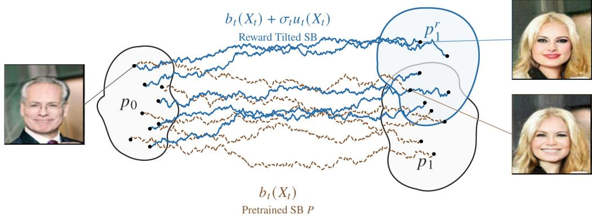  
Figure 1: Reward tilting a pretrained Schrödinger bridge. The pretrained SB $P$ transports po to $p _ { 1 }$ with drift $b _ { t }$ (brown). TSBM learns an incremental control $u _ { t } ,$ resulting in drift $b _ { t } + \sigma _ { t } u _ { t }$ (blue), to target the reward $r ( x )$ tilted marginal, i.e., $p _ { 1 } ^ { r } ( x ) \propto p _ { 1 } ( x ) r ( x )$

Notation. We work in $\mathbb { R } ^ { d }$ , which is the D-dimensional Euclidean space equipped with the Euclidean norm · ∥. We use Ω to denote the space of trajectories, i.e., continuous $\mathring { \mathbb { R } } ^ { \mathcal { D } }$ -valued functions of $t \in [ 0 , 1 ]$ , then $X \in \Omega$ is the trajectory and $X _ { t } \in \mathbb { R } ^ { d }$ is its slice at time t. We write $Q \in P ( \Omega )$ to denote a path law $Q$ , which is the element of probability distributions set on the trajectories Ω. For a path law $Q ,$ let $p _ { t } ^ { Q } ( x )$ denote the density of $X _ { t }$ and let $p _ { t \mid s } ^ { Q } ( y \mid x )$ denote the conditional density of $X _ { t }$ given $X _ { s } = x ,$ for $0 \leq s < t \leq 1$ . We assume that these distributions admit densities with respect to Lebesgue measure whenever the densities are used.

In the whole manuscript we set the reference process $R ,$ which we assume can be represented as a diffusion with globally Lipschitz in $x _ { t }$ drift function and continuous, finite and positive volatility coefficient $\sigma _ { t } \colon$ R : dX+ = f+(X+) dt + σ+ dW+. X₀ ∼ po. (1)

The diffusion R then can be augmented by controller $u _ { t } : \mathbb { R } ^ { d } \times \mathbb { R } _ { + } \to \mathbb { R } ^ { d }$ , and the controlled diffusion is denoted as $R ^ { u }$

$$
\begin{array} { r } { R ^ { v } : \mathrm { d } X _ { t } = \left[ f _ { t } ( X _ { t } ) + \sigma _ { t } u _ { t } ( X _ { t } ) \right] \mathrm { d } t + \sigma _ { t } \mathrm { d } W _ { t } , \quad X _ { 0 } \sim p _ { 0 } , } \end{array}\tag{2}
$$

where $W _ { t }$ is standard Brownian motion.

## 2 BACKGROUND

Stochastic optimal control. In our work we consider commonly used in generative modeling Stochastic optimal control (SOC) problem Bellman (1957) the quadratic cost control-affine problem formulation Domingo-Enrich et al. (2024). For the original reference $R ,$ our goal is add such a control $u _ { t }$ to it to minimize the following objective:

$$
\begin{array} { l } { \displaystyle \boldsymbol { u } ^ { * } = \operatorname* { m i n } _ { \boldsymbol { v } } \mathbb { E } _ { R ^ { u } } \left[ \frac { 1 } { 2 } \int _ { 0 } ^ { 1 } \| u _ { t } ( \boldsymbol { X } _ { t } ) \| ^ { 2 } \mathrm { d } t - r ( \boldsymbol { X } _ { 1 } ) \right] } \\ { \mathrm { s . t . ~ } \mathrm { d } \boldsymbol { X } _ { t } = \left[ f _ { t } ( \boldsymbol { X } _ { t } ) + \sigma _ { t } u _ { t } ( \boldsymbol { X } _ { t } ) \right] \mathrm { d } t + \sigma _ { t } \mathrm { d } { \boldsymbol { W } _ { t } } , \qquad \boldsymbol { X } _ { 0 } \sim p _ { 0 } , } \end{array}\tag{3}
$$

where $X _ { t }$ is the process trajectory slice, r is a terminal reward, $f _ { t }$ is reference drift, $\sigma _ { t }$ is reference volatility, which are not optimized and $u ^ { * }$ is called optimal controller.

Under the usual regularity assumptions the optimal distribution on endpoints has form:

$$
p _ { 0 , 1 } ^ { R ^ { v _ { g } } } ( X _ { 1 } | X _ { 0 } ) = p _ { 0 , 1 } ^ { R } ( X _ { 1 } | X _ { 0 } ) \exp [ r ( X _ { 1 } ) + V _ { 0 } ( X _ { 0 } ) ] , V _ { 0 } ( x ) = - \log \mathbb { E } _ { R } \Big [ e ^ { r ( X _ { 1 } ) } \ | \ X _ { 0 } = x \Big ] ,\tag{4}
$$

when $p _ { 0 . . } ^ { R }$ is memoryless, i.e., $p _ { 0 . 1 } ^ { R } ( X _ { 0 } , X _ { 1 } ) \ = \ p _ { 0 } ^ { R } ( X _ { 0 } ) p _ { 1 } ^ { R } ( X _ { 1 } )$ the SOC problem admits a particularly simple characterization: the terminal marginal of the controlled process satisfies $p _ { 1 } ^ { \star } p _ { 1 } ^ { v _ { g } } ( X _ { 1 } ) \ { \stackrel { \bullet } { \propto } } \ p _ { 1 } ^ { \star } ( X _ { 1 } ) r ( X _ { 1 } ) = p _ { 1 } ^ { r } ( X _ { 1 } )$ . In contrast, for non-memoryless models, such as Diffusion Bridges Liu et al. (2023) or Schrödinger Bridges De Bortoli et al. (2021), this simplification no longer holds and the resulting terminal marginal in general does not coincide with the desired reward-tilted distribution $p _ { 1 } ^ { r }$ . We provide further discussion in Appendix B.1.

Controller Matching. In this work, we are focused on Adjoint Matching Domingo-Enrich et al. (2025) algorithm for solving SOC problems thanks to its scalability and robustness. Given a SOC problem Eq 3 one can define a ’lean" adjoint state ã:

$$
\frac { \mathrm { d } \tilde { a } _ { t } ( X ) } { \mathrm { d } t } = - \nabla _ { x } f _ { t } ( X _ { t } ) ^ { \top } \tilde { a } _ { t } ( X ) , \quad \tilde { a } _ { 1 } ( X ) = - \nabla _ { x } r ( X _ { 1 } ) ,\tag{5}
$$

where $\nabla _ { x } f _ { t } ( X _ { t } )$ is the Jacobian of reference drift $f _ { t } ( X _ { t } )$ . Which in turn allows to define the optimal controller $u ^ { * }$ , as the argmin of matching objective:

$$
\boldsymbol { u } ^ { * } = \mathop { \arg \operatorname* { m i n } } _ { \boldsymbol { u } } \mathbb { E } _ { \boldsymbol { X } \sim \boldsymbol { P } ^ { \overline { { u } } } } \left[ \int _ { 0 } ^ { 1 } \| \boldsymbol { u } ( X _ { t } , t ) + \sigma _ { t } \tilde { \boldsymbol { a } } _ { t } ( \boldsymbol { X } ) \| ^ { 2 } \mathrm { d } t \right] , \quad \overline { { \boldsymbol { u } } } = \mathrm { s t o p g r a d } ( \boldsymbol { u } ) ,\tag{6}
$$

where differentiation through the generation trajectory $X \sim P ^ { \overline { { u } } }$ may be ommitted, which makes algorithm scalable and popular in different applications Havens et al. (2025); Liu et al. (2025a); Gutjahr et al. (2026). Although the SDE simulation for sampling $X \sim { \dot { P } } ^ { \overline { { u } } }$ and ODE simulation to calculate the "lean" adjoint $\tilde { a } _ { t }$ are still required and can be rather expensive.

Schrödinger bridges. While regular SOC problem Eq 3 has only one marginal constraint, i.e., $X _ { 0 } \sim p _ { 0 }$ , the Schrödinger Bridge Problem imposes two marginal constraints on the endpoints, i.e., $X _ { 0 } \sim p _ { 0 }$ and $X _ { 1 } \sim p _ { 1 }$ , lefts out the terminal reward $r ( x )$ , but keeps the $u _ { t } ( X _ { t } , t )$ minimization term, which can be read as minimal energy constraint:

$$
\begin{array} { r } { u ^ { * } = \underset { v } { \operatorname { a r g m i n } } \mathbb { E } _ { R ^ { u } } \left[ \frac { 1 } { 2 } \int _ { 0 } ^ { 1 } \| u _ { t } ( X _ { t } ) \| ^ { 2 } \mathrm { d } t \right] = \underset { v } { \operatorname { a r g m i n } } \mathrm { K L } ( R ^ { u } \| R ) } \\ { \mathrm { s . t . } \mathrm { d } X _ { t } = \left[ f _ { t } ( X _ { t } ) + \sigma _ { t } u _ { t } ( X _ { t } ) \right] \mathrm { d } t + \sigma _ { t } \mathrm { d } W _ { t } , \qquad X _ { 0 } \sim p _ { 0 } , \quad X _ { 1 } \sim p _ { 1 } . } \end{array}\tag{7}
$$

We optimize over admissible finite-energy controls and assume the bridge is attained in this class. The resulting controlled process $P$ is called Schrödinger Bridge between source distribution $p _ { 0 }$ and target distributionp1 with reference R and is denoted in our paper as:

$$
P = \mathrm { S B } _ { R } ( p _ { 0 } , p _ { 1 } )\tag{8}
$$

In other words, it takes the reference diffusion R and searches for closest to it, in KL divergence, diffusion that satisfies marginal constrains (Léonard, 2014). The most popular choice of R is Wiener process with constant volatility $\epsilon , \mathrm { i } . \mathrm { e } . , W ^ { \epsilon }$ . In this case, minimizing the path-space KL divergence is equivalent to minimizing the expected control energy required to transport $p _ { 0 }$ to $p _ { 1 }$ , providing a principled formulation of unpaired domain translation Shi et al. (2023).

Schrödinger bridges and Stochastic Optimal Control. Under mild regularity assumptions this problem can be converted into regular SOC problem with one marginal constraint Liu et al. (2025a):

$$
u ^ { \star } = \arg \operatorname* { m i n } _ { u } \mathbb { E } _ { R ^ { u } } \left[ \frac { 1 } { 2 } \int _ { 0 } ^ { 1 } \| u _ { t } ( X _ { t } ) \| ^ { 2 } \mathrm { d } t + \log \frac { \widehat { \varphi } _ { 1 } ( X _ { 1 } ) } { p _ { 1 } ( X _ { 1 } ) } \right] ,\tag{9}
$$

$$
\mathrm { s . t . } \quad \mathrm { d } X _ { t } = \left[ f _ { t } ( X _ { t } ) + \sigma _ { t } u _ { t } ( X _ { t } ) \right] \mathrm { d } t + \sigma _ { t } \mathrm { d } W _ { t } , \qquad X _ { 0 } \sim p _ { 0 } .
$$

where $\widehat { \varphi } _ { 1 } ( X _ { 1 } )$ is the Schrödinger Potential Léonard (2014). Which is defined as follows:

$$
\varphi _ { t } ( x _ { t } ) = \int p _ { 1 | t } ^ { R } ( x _ { 1 } \mid x _ { t } ) \varphi _ { 1 } ( x _ { 1 } ) \mathrm { d } x _ { 1 } , \qquad \varphi _ { 0 } ( x _ { 0 } ) \widehat { \varphi } _ { 0 } ( x _ { 0 } ) = p _ { 0 } ( x _ { 0 } ) ,\tag{10a}
$$

$$
\widehat { \varphi } _ { t } ( x _ { t } ) = \int p _ { t | 0 } ^ { R } ( x _ { t } \mid x _ { 0 } ) \widehat { \varphi } _ { 0 } ( x _ { 0 } ) \mathrm { d } x _ { 0 } , \qquad \quad \varphi _ { 1 } ( x _ { 1 } ) \widehat { \varphi } _ { 1 } ( x _ { 1 } ) = p _ { 1 } ( x _ { 1 } ) .\tag{10b}
$$

The Eq 10a propagates $\varphi _ { 1 }$ backward in time, while Eq 10b propagates $\widehat { \varphi } _ { 0 }$ forward in the density convention. Their product gives the bridge marginal at time $t \colon p _ { t } ^ { \cal P } = \varphi _ { t } \tilde { \varphi } _ { t }$ . One can as well say that Schrödinger Potential $\bar { \varphi } _ { 1 } ( X _ { 1 } )$ helps to debias the SOC problem solution to fit the marginal $p _ { 1 }$ Such result is widely used and can lead the application of SOC problems solving algorithms, such as Domingo-Enrich et al. (2025); Gushchin et al. (2023), to solving the Schrodinger Bridge Problem.

Corrector Matching. Several works solve the Schrödinger bridge problem through the SOC formulation Eq 9 (Gushchin et al., 2023; Liu et al., 2025a). This formulation requires the terminal cost $\log ( \widehat { \varphi } _ { 1 } / p _ { 1 } )$ , which is initially unknown. Gushchin et al. (2023) learn this cost through the entropic optimal transport dual formulation. In contrast, Liu et al. (2025a) use Adjoint Matching Eq $^ { 6 , }$ which requires only its gradient. When the target density $p _ { 1 }$ is known up to a normalizing constant, its score $\nabla _ { x } \log { p _ { 1 } }$ is available, leaving only the corrector $h ^ { * } : = \nabla _ { x } \log \widehat { \varphi } _ { 1 }$ to be learned. The corrector admits the regression characterization:

$$
\begin{array} { r } { h ^ { * } ( x ) : = \nabla _ { x } \log \varphi ( x ) = \arg \operatorname* { m i n } _ { h } \mathbb { E } _ { X _ { 1 } , X _ { 0 } \sim P ^ { u ^ { * } } } [ \| h ( X _ { 1 } ) - \nabla _ { x _ { 1 } } \log p ^ { R } ( X _ { 1 } | X _ { 0 } ) \| ^ { 2 } ] . } \end{array}\tag{11}
$$

Note that this objective requires samples from the optimal bridge $P ^ { u ^ { * } }$ , which is itself unknown. To resolve this interdependence, controller and corrector updates are alternated, using trajectories generated by the current controller to update the corrector (Liu et al., 2025a).

## 3 TILTING A SCHRÖDINGER BRIDGE

We first define the Tilted Schrödinger Bridge Problem (TiltedSBP) in § 3.1, then relate formulations using the base process R and pretrained bridge $P$ as references. In § 3.2, we show equivalence of the corresponding path-space solutions (Prop. 1), relate their Schrödinger potentials (Prop. 2), and derive a relative SOC formulation that avoids explicit knowledge of $p _ { 1 } \left( { \mathrm { P r o p . ~ } } 3 \right)$

## 3.1 TILTED SCHRÖDINGER BRIDGE PROBLEM

First, let us recap the basic Schrodinger Bridge Problem Eq 7 between distributions $p _ { 0 } , p _ { 1 }$ and its solution $P = \bar { \mathrm { S B } _ { R } } ( p _ { 0 } , p _ { 1 } )$ , which we call pretrained Schrödinger Bridge. Then let us tilt the target distribution by some reward function $r ( x ) , \mathrm { i . e . , } p _ { 1 } ^ { r } ( x ) \propto p _ { 1 } ( x ) e ^ { r ( x ) }$ . Then the central problem that we target is this paper is finding a Schrödinger Bridge between source distribution $p _ { 0 }$ and target $p _ { 1 } ^ { r }$ or more formally:

Definition 1 (TiltedSBP). Let $R \in P ( \Omega )$ be a reference diffusion law on $\Omega = C ( [ 0 , 1 ] , \mathbb { R } ^ { d } )$ Given a target and source probability densities $p _ { 0 } , p _ { 1 } \in P ( \mathbb { R } ^ { d } )$ and a measurable reward $r : \mathbb { R } ^ { d }  \mathbb { R }$ , assume $\begin{array} { r } { 0 < \int p _ { 1 } ( x ) e ^ { r ( x ) } d x < } \end{array}$ ∞ and define the reward-tilted target density:

$$
p _ { 1 } ^ { r } ( x ) \propto p _ { 1 } ( x ) e ^ { r ( x ) }\tag{12}
$$

The Tilted Schrödinger Bridge problem is to find:

$$
u ^ { \star } = \underset { u } { \arg \operatorname* { m i n } } \mathbb { E } _ { R ^ { u } } \left[ \frac { 1 } { 2 } \int _ { 0 } ^ { 1 } \| u _ { t } ( X _ { t } ) \| ^ { 2 } \mathrm { d } t \right]\tag{13}
$$

$$
\begin{array} { r } { \mathrm { s . t . } \quad \mathrm { d } X _ { t } = \left[ f _ { t } ( X _ { t } ) + \sigma _ { t } u _ { t } ( X _ { t } ) \right] \mathrm { d } t + \sigma _ { t } \mathrm { d } W _ { t } , \qquad X _ { 0 } \sim p _ { 0 } , \quad X _ { 1 } \sim p _ { 1 } ^ { r } . } \end{array}
$$

Where the optimal solution is denoted by $P ^ { u ^ { * } } = \mathrm { S B } _ { R } ( p _ { 0 } , p _ { 1 } ^ { r } )$ . While problem formulation being fully valid the practical solution can have problems. In many practical cases the distribution $p _ { 1 }$ distribution can be given by empirical samples, while $r ( x )$ can be given by reward, which would complicate the distribution $p _ { 1 } ^ { r }$ representation.

## 3.2 RELATIVE STOCHASTIC OPTIMAL CONTROL FORMULATION FOR TILTEDSBP

As is standard in many reward finetuning methods Uehara et al. (2024); Domingo-Enrich et al. (2025), which also target reward tilted target distribution $p _ { 1 } ^ { r }$ , the tilting problem defined relative the to the base process, $\mathrm { i . e . , } P = \mathrm { S B } _ { R } ( p _ { 0 } , p _ { 1 } )$ in our case. Which gives us motivation to define the TiltedSBP problem rather with as $P$ as a reference, i.e., which we call relative problem, rather than with $R$ as a reference. We first state conditions that will be actively used throughout the paper and show that changing the reference preserves the TiltedSBP solution.

Assumption 1 (Reference and reward). The reference starts from po, $p _ { 0 , : } ^ { R }$ and po⊗ $p _ { 1 }$ define equivalent measures with $K L ( p _ { 0 } \otimes p _ { 1 } | | p _ { 0 , 1 } ^ { R } ) < \infty$ and r is bounded above.

Proposition 1 (Change of reference). Under Assumptions $^ { l , }$

$$
\mathrm { S B } _ { P } ( p _ { 0 } , p _ { 1 } ^ { r } ) = \mathrm { S B } _ { R } ( p _ { 0 } , p _ { 1 } ^ { r } ) = P ^ { r } .\tag{14}
$$

Thus, terminal retargeting can use the pretrained bridge as its reference without changing the desired solution. This permits learning an incremental control around the pretrained drift of $P .$ The detailed proof is given in Appendix A. However, SB ${ \bf \nabla } _ { P } ( p _ { 0 } , p _ { 1 } ^ { r } )$ and $\mathrm { S B } _ { R } ( p _ { 0 } , p _ { 1 } ^ { r } )$ problems while being equivalent have different Schrodinger Potentials Eq 10.

Let us further explore the connections between the TiltedSBP problem with R as reference and TiltedSBP problem with $P$ as reference, in the context of Schrödinger Potentials. Let $\widehat { \varphi } _ { 1 } ^ { \mathrm { o l d } } , \widehat { \varphi } _ { 1 } ^ { r }$ and $\widehat { \psi } _ { 1 } ^ { r }$ denote the terminal Schrodinger Potentials of $\mathrm { S B } _ { R } ( p _ { 0 } , p _ { 1 } ) , \mathrm { S B } _ { R } ( p _ { 0 } , p _ { 1 } ^ { r } ) , \mathrm { S B } _ { P } ( p _ { 0 } , p _ { 1 } ^ { r } )$ problems correspondingly, as defined in Eq 10. The relative SOC terminal cost $\begin{array} { r } { f _ { \mathrm { r e l } } ^ { r } ( x ) : = \log \frac { \widehat \psi _ { 1 } ^ { r } ( x ) } { p _ { 1 } ^ { r } ( x ) } } \end{array}$ and can be expressed without $p _ { 1 }$ factor:

Proposition 2 (Relative terminal potential relation). The terminal cost term of SOC formulated relative SB problem $\mathrm { S B } _ { P } ( p _ { 0 } , p _ { 1 } ^ { r } )$ admits:

$$
f _ { \mathrm { r e l } } ^ { r } ( x ) : = \log \frac { \widehat { \psi } _ { 1 } ^ { r } ( x ) } { p _ { 1 } ^ { r } ( x ) } = \log \widehat { \varphi } _ { 1 } ^ { r } ( x ) - \log \widehat { \varphi } _ { 1 } ^ { \mathrm { o l d } } ( x ) - r ( x ) + C ,\tag{15}
$$

where $C$ is a constant that doesn’t depend on x.

The explicit target density $p _ { 1 }$ cancels from the terminal cost, while its influence remains in the old potential $\widehat { \varphi } _ { 1 } ^ { \mathrm { o l d } }$ . The proof is given in Appendix A. Then to construct the terminal cost $f _ { \mathrm { r e l } } ^ { r }$ for relative $\bar { \bf S } 0 { \bf C }$ problem Eq 9 one needs only the reward r and Schrodinger Potentials of absolute problems log $\widehat { \varphi } _ { 1 } ^ { r } ( x )$ with $R$ as reference, i.e., log $\widehat { \varphi } _ { 1 } ^ { r } ( x )$ or log $\widehat { \varphi } _ { 1 } ^ { \mathrm { o l d } } ( x )$ •

Under the assumption that reward r and the log-potentials admit continuous differentiable versions on a region, where $p _ { 1 } ( x ) > 0$ the identity also given the terminal-cost gradient there:

$$
\nabla f _ { \mathrm { r e l } } ^ { r } ( x ) = \nabla \log \widehat { \varphi } _ { 1 } ^ { r } ( x ) - \nabla \log \widehat { \varphi } _ { 1 } ^ { \mathrm { o l d } } ( x ) - \nabla r ( x ) = h ^ { r } ( x ) - h _ { \mathrm { o l d } } ( x ) - \nabla r ( x ) ,\tag{16}
$$

where $\nabla$ log $\widehat { \varphi } _ { 1 } ^ { r }$ is hr, ∇ log $\widehat { \varphi } _ { 1 } ^ { \mathrm { o l d } }$ is $h _ { \mathrm { o l d } }$ . Section 4 makes use of $\operatorname { E q }$ 16 and develops a procedure to learn the terminal corrector $\dot { \nabla } f _ { \mathrm { r e l } } ^ { r }$ . Then finally, we can construct the relative to $\dot { P }$ SOC Problem Eq 9 with optimal control $u _ { r } ^ { \star }$

Proposition 3 (Relative Schrödinger Bridge Stochastic Optimal Control Problem). Given the Assumptions of Def 1, Schrödinger Bridge $P = \mathrm { S B } _ { R } ( p _ { 0 } , p _ { 1 } )$ with optimal control $u ^ { \star }$ and corresponding drift $b _ { t }$ define such a controlled by $u _ { t }$ diffusion $P ^ { u _ { t } }$

$$
\begin{array} { r l } { P ^ { u _ { t } } : } & { \mathrm { d } X _ { t } = \underbrace { \left[ f _ { t } ( X _ { t } ) + \sigma _ { t } u _ { t } ^ { \star } ( X _ { t } ) \right. } _ { b _ { t } ( X _ { t } ) } + \sigma _ { t } u _ { t } ( X _ { t } ) \big ] \mathrm { d } t + \sigma _ { t } \mathrm { d } W _ { t } , \qquad X _ { 0 } \sim p _ { 0 } , } \end{array}\tag{17}
$$

where $b _ { t } ( X _ { t } )$ is the resulting controlled drift of P. Then optimal control $u _ { r } ^ { \star }$ provided as a solution to the following optimization problem:

$$
u _ { r } ^ { \star } = \arg \operatorname* { m i n } _ { u } \mathbb { E } _ { P ^ { u } } \left[ \frac { 1 } { 2 } \int _ { 0 } ^ { 1 } \| u _ { t } ( X _ { t } ) \| ^ { 2 } \mathrm { d } t + \log \widehat { \varphi } _ { 1 } ^ { r } ( x ) - \log \widehat { \varphi } _ { 1 } ^ { \mathrm { o l d } } ( x ) - r ( x ) \right] ,\tag{18}
$$

would result in solution to the TiltedSBP, $i . e . , P ^ { u _ { r } ^ { \star } } = \mathrm { S B } _ { R } ( p _ { 0 } , p _ { 1 } ^ { r } )$

This formulation requires the pretrained bridge $P ,$ its terminal potential log $\widehat { \varphi } _ { 1 } ^ { \mathrm { o l d } }$ , and reward $^ { r , }$ but importantly no further access to the base target $p _ { 1 }$ through samples or density evaluations. The remaining unknown potential log $\widehat { \varphi } _ { 1 } ^ { r }$ is addressed in the next section.

## 4 TILTED SCHRÖDINGER BRIDGE MATCHING

In this section, we introduce an algorithm for solving the TiltedSBP. Prop. 3 gives a feasible SOC formulation, but obtaining the optimal controller u requires the corrector log $\widehat { \varphi } _ { 1 } ^ { r } ( x )$ . Since the controller and corrector are interdependent, we propose an alternating optimization procedure: update the controller $u ^ { ( k ) }$ with fixed corrector $h ^ { ( k ) }$ , then update the corrector $h ^ { ( k + 1 ) }$ with fixed controller $u ^ { ( k ) }$ . For controller optimization, we use Controller Matching Eq 6 and define its iterative fixedcorrector version as the Controller Update:

$$
u ^ { ( k ) } = \underset { u } { \arg \operatorname* { m i n } } \ : \mathbb { E } _ { P ^ { \overline { { u } } } } \big [ \mathcal { L } _ { \mathrm { c t r l } } ( u , X , h ^ { ( k ) } ) \big ] = : \underset { u } { \arg \operatorname* { m i n } } \ : \mathbb { E } _ { P ^ { \overline { { u } } } } \int _ { 0 } ^ { 1 } \left\| u ( X _ { t } , t ) + \sigma _ { t } \tilde { a } _ { t } ^ { ( k ) } ( X ) \right\| ^ { 2 } \mathrm { d } t ,\tag{19}
$$

$$
\begin{array} { r l } & { ~ \tilde { a } _ { 1 } ( X ) = \nabla _ { x } f _ { \mathrm { r e l } } ^ { r } ( X _ { 1 } ) = - \nabla _ { x } r ( X _ { 1 } ) + h ^ { ( k ) } ( X _ { 1 } ) - h _ { \mathrm { o l d } } ( X _ { 1 } ) , } \\ & { - \displaystyle \frac { \mathrm { d } \tilde { a } _ { t } ^ { ( k ) } ( X ) } { \mathrm { d } t } = \nabla _ { x } b _ { t } ( X _ { t } ) ^ { \top } \tilde { a } _ { t } ^ { ( k ) } ( X ) , } \end{array}\tag{20}
$$

where $\overline { { u } } = \mathrm { s t o p g r a d } ( \overline { { u } } )$ and for optimization of corrector we choose Corrector Matching § 2 and call its iterative version as Corrector Update:

Algorithm 1 Tilted Schrödinger Bridge Matching (TSBM)   
Require: frozen old drift b, old corrector $h _ { \mathrm { o l d } }$ , reference process R, reward r, stages K, number of   
controller updates $M _ { \mathrm { c t r l } } ,$ number of corrector updates $M _ { \mathrm { c o r r } }$   
1: initialize $u ^ { ( 0 ) } \gets 0$ and $h ^ { ( 0 ) }  h _ { \mathrm { o l d } }$   
2: for $k = 0 , \ldots , K - 1$ do   
3: $u \gets \mathrm { c o p y } ( u ^ { ( k ) } )$   
4: for $m { = } \stackrel { \cdot \cdot } { 0 } , \ldots , M _ { \mathrm { c t r l } } { - } 1$ do   
5: Sample paths $( X _ { t } ) _ { t \in [ 0 , 1 ] }$ from $P ^ { \overline { { u } } }$ by the inference of SDE with drift $b + \sigma u ;$   
6: $\tilde { a } _ { 1 } ^ { ( k ) } \gets - \nabla r ( X _ { 1 } ) + h ^ { ( k ) } ( X _ { 1 } ) - h _ { \mathrm { o l d } } ( X _ { 1 } ) ;$   
7: Propagate $\tilde { a } _ { t } ^ { ( k ) }$ by solving backward adjoint lean ODE using Eq 5;   
8: Make a gradient step on ${ \mathcal L } _ { \mathrm { c t r l } }$ w.r.t. u parameters;   
9: Sample endpoints $( X _ { 0 } , X _ { 1 } )$ from $P ^ { \overline { { u } } }$ by the inference of SDE with drift $b + \sigma u ;$   
10: $h  \mathrm { c o p y } ( h ^ { ( k ) } )$   
11: for $m = 0 , \ldots , M _ { \mathrm { c o r r } } - 1$ do   
12: Make a gradient step on $\mathcal { L } _ { \mathrm { c o r r } }$ w.r.t. h parameters;   
$u ^ { ( k + 1 ) } \gets \check { u , } h ^ { ( k + 1 ) } \gets \dot { h }$   
13:   
14: return $u ^ { ( K ) } , h ^ { ( K ) }$

$$
h ^ { ( k + 1 ) } = \operatorname { a r g m i n } _ { h } \mathbb { E } _ { P ^ { u ^ { ( k ) } } } \left[ \mathcal { L } _ { \operatorname { c o r r } } ( h , X _ { 0 } , X _ { 1 } ) \right] = : \operatorname { a r g m i n } _ { h } \mathbb { E } _ { P ^ { u ( k ) } } \left[ \| h ( X _ { 1 } ) - \nabla _ { x _ { 1 } } \log p ^ { R } ( X _ { 1 } | X _ { 0 } ) \| ^ { 2 } \right] .\tag{21}
$$

Now both Controller and Corrector Matching updates do relax their interdependency into dependency on the previous iteration (k) results and yield a fixed point alternative updates algorithm. We call this iterative procedure TSBM, each iteration k we call stage. Next we show that this algorithm indeed converges to the Tilted Schrodinger Bridge:

Theorem 1 (TSBM convergence). Let $P = \mathrm { S B } _ { R } ( p _ { 0 } , p _ { 1 } )$ . Under Assumptions 1 and 2, the exact population updates in Eq 19 and Eq 21, initialized by $u ^ { ( 0 ) } = 0 \ : a n d h ^ { ( 0 ) } = h _ { \mathrm { o l d } } ,$ satisfy

$$
\mathrm { K L } ( P ^ { u ^ { * } } \| P ^ { u ^ { ( k ) } } ) \longrightarrow 0 , \qquad P ^ { u ^ { * } } = \mathrm { S B } _ { R } ( p _ { 0 } , p _ { 1 } ^ { r } ) .\tag{22}
$$

The proof follows the ASBS/IPF strategy (Liu et al., 2025a) in our relative setting and is given in Appendix A, with the pseudo-algorithm in Algorithm 1 and implementation details in Appendix C. In practice, we finetune a pretrained Schrödinger bridge P, typically represented by forward and backward drift networks learned iteratively (Shi et al., 2023; Vargas et al., 2023; Liu et al., 2025a; Tamogashev & Malkin, 2026; Kholkin et al., 2026b). The forward drift approximates b and is used in the Controller Update (Eq. 19), while the backward drift approximates the pretrained corrector $h _ { \mathrm { o l d } }$ Liu et al. (2025a) and is used in both updates (Eqs. 19 and 21). We use the same parameterization for TSBM. Replay buffers, network architectures, and other details are deferred to Appendix C.

## 5 RELATED WORK

Schrödinger bridge solvers. Schrödinger Bridge solvers are mostly based on diffusion models Song et al. (2021). Some methods make use of Entropic Optimal Transport connection Gushchin et al. (2024a; 2023), while most popular methods are based on iterative procedures, such as Iterative Proportional Fitting (IPF) De Bortoli et al. (2021); Vargas et al. (2021), Iterative Markovian Fitting (IMF) Shi et al. (2023); Gushchin et al. (2024b); Ksenofontov & Korotin (2025) or their hybrid Kholkin et al. (2026b). The Adjoint Matching is utilized as a part of SB solvers Liu et al. (2025a); Havens et al. (2025). In practice, the SB models are utilized for unpaired domain translation Shi et al. (2023), trajectory inference Tong et al. (2024); Noble et al. (2026), sampling from Boltzman distributions Liu et al. (2025a); Guo et al. (2026); Havens et al. (2025); Tamogashev & Malkin (2026), Mutual Information Estimation Kholkin et al. (2026a); Zabarianska et al. (2026) or even data generation Shin et al. (2026). However, there are no current methods that do support exact marginal reward tilting of the pretrained SB models.

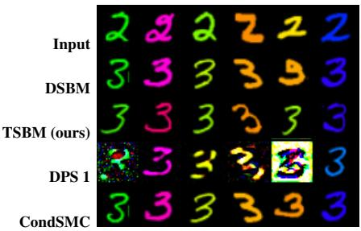  
(a) Thin stroke

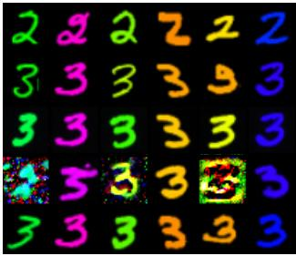  
(b) Thick stroke

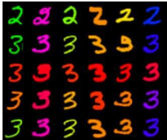  
(c) Red chroma

Figure 2: Qualitative results on Colored MNIST. Rows show the source input, pretrained DSBM, TSBM, DPS with γ = 1, and CondSMC with N = 8 particles for the thin-stroke, thick-stroke, and red-chroma targets. Comparisons with additional baselines are in Appendix F.  
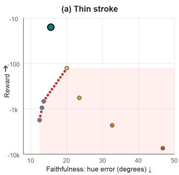

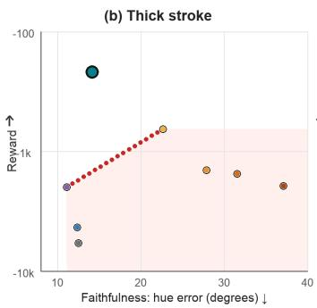

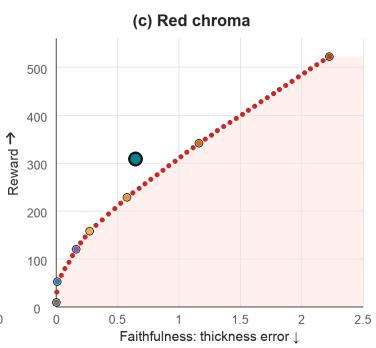  
PretrainedTSBM (ours)DPS gamma=0.5DPS gamma=1DPS gamma=2DPS gamma=4CondSNIS CondSMC

Figure 3: Quantitative analysis on Colored MNIST. Reward ↑ is the mean unscaled terminal reward r(x). The two stroke panels use logarithmic spacing by reward magnitude. Faithfulness ↓ is foreground hue error relative to the input for thin and thick strokes, and mean thickness deviation from the input for red chroma. The red dotted lines connect the non-TSBM Pareto points, while pale red shading marks values below them.

Reward steering and finetuning. Reward steering adapts pretrained generative models to objectives beyond matching the training distribution, such as human preferences in image generation (Black et al., 2024), DNA and protein design (Wang et al., 2025), and physical constraints (Tauberschmidt et al., 2026). Methods include inference-time guidance, such as classifier and classifier-free guidance (Dhariwal & Nichol, 2021; Ho & Salimans, 2022), diffusion posterior sampling (Chung et al., 2023a) and particle-based methods (Del Moral et al., 2006; Wu et al., 2023a), which can increase sampling costs or introduce artifacts under strong guidance. Finetuning alternatives include reward optimization (Black et al., 2024; Clark et al., 2024) and preference learning (Wallace et al., 2024; Kim et al., 2024). However, accounting for the pretrained distribution further allows for regularization and targets its exponential tilt rather than only maximizing reward (Domingo-Enrich et al., 2025; Uehara et al., 2024; Zhao et al., 2025; Liu et al., 2025b). Stochastic optimal control methods emerged as alternative branch of methods allowing for targeting an exponential tilt, while the methods include matching based methods Domingo-Enrich et al. (2024; 2025); Bergmeister et al. (2026) or differentiation through trajectory based methods Wang et al. (2025); Vargas et al. (2023). However, these works do target mostly only noise-to-data generative models.

Reward steering and diffusion bridges. While reward steering is well studied for standard diffusion models, extending it to diffusion bridges, including Schrödinger bridges, requires accounting for source target dependence. In particular, conditional tilting, $q _ { 1 | 0 } ( x _ { 1 } | \overline { { x } } _ { 0 } ) \propto \overline { { p } } _ { 1 | 0 } ^ { P } ( x _ { 1 } | x _ { 0 } ) \exp ( r ( x _ { 1 } ) \bar { ) }$ generally does not produce the desired terminal marginal $q _ { 1 } ( x _ { 1 } ) \propto p _ { 1 } ^ { P } ( x _ { 1 } ) \exp ( r ( x _ { 1 } ) )$ when the source marginal is fixed. For bridges trained on paired data (Zhou et al., 2024; Liu et al., 2023), CDDB applies inference-time data-consistency guidance with a DPS-like variant (Chung et al., 2023b;a), He et al. (2026) shows the practical applicability of SMC-like Del Moral et al. (2006) population steering, but doesn't evaluate it, while PalSB uses physics-informed finetuning through truncated trajectory differentiation (Li et al., 2025). Schrödinger Bridges were also reward aligned to learn Boltzmann samplers with evaluable target energies (Liu et al., 2025a; Guo et al., 2026; Havens et al., 2025), a different setting from reward tilting of a pretrained bridge whose terminal density is implicit. These works do not establish the joint guarantee considered in our work: a prescribed terminal marginal reward tilt with preservation of the source marginal when finetuning a general pretrained Schrödinger Bridge model.

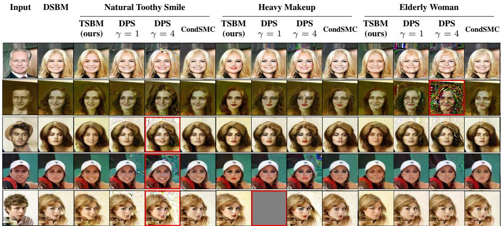  
Figure 4: Qualitative results for CelebA experiment. Each row uses the same source across the pretrained DSBM and three CelebA prompt groups. Within each group, we compare TSBM, DPS with $\gamma \in \{ 1 , 4 \}$ , and CondSMC. Red borders highlight selected outputs with visible artifacts.

## 6 EXPERIMENTS

In this section we experimentally evaluate the TSBM, as the Schrodinger Bridges reward finetuning method. In all the cases we do start from Schrodinger Bridge trained via DSBM method Shi et al. (2023). We test TSBM on unpaired image translation problems: 1) Colored MNIST dataset image translation between digit $^ { \mathrm { , 9 } \mathrm { 2 } ^ { \mathrm { , 5 } } }$ to digit "3" with reward tilt towards digit thickness and color; 2) Celeba dataset male to female image translation with reward tilts toward different image attributes: "natural toothy smile", "heavy makeup" and "elderly woman" with reward functions provided by ImageReward Xu et al. (2023) with corresponding prompts. In addition during training the reward functions are scaled linearly by strength parameter λ, i.e., $\lambda * r ( x )$ . Additional experimental details are presented in Appendix E and more experiments are presented in Appendix G.

Competitors. As was noted in the § 5 the reward finetuning of Schrodinger Bridge models is underexplored and has lack of established methods. However, there are approximate methods for tilting the conditional distribution, such as CDDB Chung et al. (2023b), which we call just DPS in the experimental section and test with different strength parameter $\gamma .$ Additionally, we test the conditional population based inference time adaptation methods for tilting the conditional distribution: Sequential Monte Carlo (CondSMC) Del Moral et al. (2006) and Self Normalized Importance Sampling (CondSNIS). Competitor algorithms in particular are described in Appendix B.

## 6.1 COLORED MNIST UNPAIRED TRANSLATION ATTRIBUTES MANIPULATION

Setup. We test the TSBM on images, starting from Colored MNIST digit "2" to digit "3" unpaired domain translation. We take the Colored MNIST translation setup from Gushchin et al. (2024b). DSBM pretrain si trained by 20 stages with $\sigma _ { t } = 1$ SB volatility coefficient, while TSBM is trained for 5 stages with strength $\dot { \lambda } = 1 0 0 \bar { 0 }$ . The reward functions are: 1) "red chroma" which favors the red rgb channel vs others 2) "thin stroke" and "thick stroke", which do calculate the approximate thickness of a digit by computing the ratio between strokes area and foreground perimeter to then penalize the thickness different from 3.65 and 7 for "thin stroke" and "thick stroke" correspondingly See Appendix D for more information of reward functions, Appendix G for ablation studies on number of TSBM stages and corrector necessity and Appendix F for qualitative results.

Results. Figure 2 compares outputs from TSBM and the baselines with the source inputs and pretrained DSBM. TSBM produces thinner, thicker, or redder digits as specified by the reward function, while largely preserving attributes unrelated to the reward: thin- and thick-stroke outputs retain the source color, whereas red-chroma outputs retain approximately the source thickness. The quantitative results support this balance between reward optimization and faithfulness to the source.

Table 1: Quantitative results for CelebA experiment. Means are over 1024 fixed inputs per prompt, with TSBM evaluated after stage 5. ImageReward and PickScore use translation, cropping, and horizontal-flip augmentation; CLIP-IQA measures naturalness. All metrics are higher-is-better; bold marks the largest mean. (\*) indicates the appearance of visual artifacts.
<table><tr><td rowspan="2"></td><td colspan="3">Natural Toothy Smile</td><td colspan="3">Heavy Makeup</td><td colspan="3">Elderly Woman</td></tr><tr><td>ImageReward (train)↑</td><td>PickScore (eval)↑</td><td>CLIP-IQA ↑</td><td>ImageReward (train)↑</td><td>PickScore (eval)↑</td><td>CLIP-IQA ↑</td><td>ImageReward (train)↑</td><td>PickScore (eval)↑</td><td>CLIP-IQA ↑</td></tr><tr><td>Pretrained</td><td>-1.2348</td><td>17.6109</td><td>0.5950</td><td>-1.4054</td><td>17.3777</td><td>0.5950</td><td>-1.4960</td><td>18.1592</td><td>0.5950</td></tr><tr><td>TSBM (ours)</td><td>0.1398</td><td>18.2345</td><td>0.6595</td><td>0.9146</td><td>18.0390</td><td>0.3508</td><td>-0.0204</td><td>18.8200</td><td>0.6340</td></tr><tr><td> $\mathrm { D P S } ^ { * } \gamma = 1$ </td><td>0.0622</td><td>17.7347</td><td>0.6192</td><td>0.8576</td><td>17.5803</td><td>0.3789</td><td>-0.7328</td><td>18.2559</td><td>0.5623</td></tr><tr><td> $\mathrm { D P S } ^ { * } \stackrel { \cdot } { \gamma } = 2$ </td><td>0.5993</td><td>17.6831</td><td>0.6312</td><td>1.2507</td><td>17.6124</td><td>0.3401</td><td>-0.2527</td><td>18.3329</td><td>0.5218</td></tr><tr><td> $\mathrm { D P S ^ { * } } \stackrel { \cdot } { \gamma } = 4$ </td><td>0.9783</td><td>17.4688</td><td>0.6164</td><td>1.5151</td><td>17.6236</td><td>0.3133</td><td>0.2239</td><td>18.3346</td><td>0.4618</td></tr><tr><td>CondSMC</td><td>-0.5728</td><td>17.8375</td><td>0.6107</td><td>-0.1525</td><td>17.5395</td><td>0.4805</td><td>-1.2800</td><td>18.1762</td><td>0.5927</td></tr></table>

In comparison, DPS introduces visible artifacts, while CondSMC makes limited changes to the targeted attributes. Figure 3 reports quantitative results, i.e., reward and faithfulness, and one can see that TSBM improves upon the Pareto frontier. These results demonstrate that TSBM extends to image translation and achieves the most favorable trade-off between reward optimization and source faithfulness among the evaluated methods.

## 6.2 CELEBA UNPAIRED TRANSLATION ATTRIBUTES MANIPULATION

Setup. Next, we test TSBM on unpaired male-to-female CelebA translation at 128 × 128 resolution. Starting from a pretrain DSBM trained for 20 stages with $\sigma _ { t } = 1$ , we train a TSBM for 5 stages. We use a frozen ImageReward model (Xu et al., 2023), which is normalized w.r.t. our CelebA data, to define our train reward for optimization and baselines sample generation with the corresponding prompts: Natural Toothy Smile, Heavy Makeup, and Elderly Woman. While PickScore Kirstain et al. (2023) with the same prompts is used for evaluation for exposing the potential reward hacking. The reward function details can be seen at Appendix D.3. In addition we report CLIP-IQA (naturalness) metric for assessment of resulting image quality. All the methods use reward strength λ = 30 and 100 NFE for evaluation. See Appendix F for additional qualitative results.

Results. Figure 4 shows the samples on the same five sources for each prompt. TSBM follows the requested changes in smile, makeup, or apparent age, while other methods may struggle. Stronger DPS guidance shows itself also succesfull and slighly weaker than TSBM, but introduces visible artifacts in some examples, while CondSMC produces weaker tilt. Table 1 quantifies the rewardfaithfulness trade-off: TSBM improves ImageReward over the pretrained DSBM for all three train reward, but not as strongly as DPS. However, TSBM obtains the highest eval PickScore reward in each comparison, which suggests that TSBM results generalize well. While DPS huge gains in train ImageReward reward does not result in visual artifacts and modest eval reward growth, which suggests that DPS is doing rather reward hacking. TSBM also has the highest CLIP-IQA for the smile and elderly prompts, while the heavy-makeup result is less favorable and on contrary lowers CLIP-IQA, which may indicate that heavy make up tilting is not doesn't improve CLIP-IQA in general. In addition, TSBM is faster than baselines on inference, see Appendix G.2. Thus, TSBM improves prompt alignment, which generalizes well and keeps images visually high-fidelity.

## 7 DISCUSSION

Potential impact. For the problem of reward finetuning of pretrained Schrödinger Bridges we introduce TSBM, the first practical algorithm for this problem, which alternates controller and corrector matching. On Colored MNIST and CelebA, TSBM steers attributes in unpaired image translation while largely preserving source content. These results suggest that pretrained bridges can be adapted to new preferences without training a new bridge from scratch.

Limitations and future work. We assume exact optimization and validity of all theoretical assumptions, which may fail in practice. The method also requires an accessible endpoint transition score and differentiable reward, motivating extensions to non-differentiable rewards Bergmeister et al. (2026). Possible extensions include adapting unpaired scientific translation models to physical constraints Li et al. (2025), image aesthetics improvement Domingo-Enrich et al. (2025) or counterfactual explanations Jeanneret et al. (2022). Further methodological research includes other training objectives, such as other adjoint algorithms Domingo-Enrich et al. (2024); Vargas et al. (2023) or log variance losses Tamogashev & Malkin (2026). Training TSBM requires repeated bridge simulations and adjoint ODE solves, making finetuning computationally demanding, while distillation-based variant (Gushchin et al., 2025) may offer a way to reduce this cost. Recent work on discrete state space reward optimization and adjoint matching (Wang et al., 2025; So et al., 2026; Guo et al., 2026) also suggests extending TSBM to discrete state spaces.

## REFERENCES

Richard Bellman. Dynamic Programming. Princeton University Press, 1957.

Andreas Bergmeister, Stefanie Jegelka, Nikolas Nüsken, Carles Domingo-Enrich, and Jakiw Pidstrigach. Reinforce adjoint matching: Scaling RL post-training of diffusion and flow-matching models,2026.URLhttps://arxiv.org/abs/2605.10759.

Kevin Black, Michael Janner, Yilun Du, Ilya Kostrikov, and Sergey Levine. Training diffusion models with reinforcement learning. In The Twelfth International Conference on Learning Representations 2024.

Hyungjin Chung, Jeongsol Kim, Michael Thompson McCann, Marc Louis Klasky, and Jong Chul Ye. Diffusion posterior sampling for general noisy inverse problems. In The Eleventh International Conference on Learning Representations, 2023a.

Hyungjin Chung, Jeongsol Kim, and Jong Chul Ye. Direct diffusion bridge using data consistency for inverse problems. In Advances in Neural Information Processing Systems, volume 36, 2023b.

Kevin Clark, Paul Vicol, Kevin Swersky, and David J. Fleet. Directly fine-tuning diffusion models on differentiable rewards. In The Twelfth International Conference on Learning Representations, 2024.

Valentin De Bortoli, James Thornton, Jeremy Heng, and Arnaud Doucet. Diffusion schrödinger bridge with applications to score-based generative modeling. In Advances in Neural Information Processing Systems, volume 34, 2021.

Pierre Del Moral, Arnaud Doucet, and Ajay Jasra. Sequential monte carlo samplers. Journal of the Royal Statistical Society: Series B, 68(3):411–436, 2006.

Prafulla Dhariwal and Alexander Nichol. Diffusion models beat GANs on image synthesis. In Advances in Neural Information Processing Systems, volume 34, pp. 8780–8794, 2021.

Carles Domingo-Enrich, Jiequn Han, Brandon Amos, Joan Bruna, and Ricky T. Q. Chen. Stochastic optimal control matching. In Advances in Neural Information Processing Systems, volume 37, 2024.

Carles Domingo-Enrich, Michal Drozdzal, Brian Karrer, and Ricky T. Q. Chen. Adjoint matching: Fine-tuning flow and diffusion generative models with memoryless stochastic optimal control. In The Thirteenth International Conference on Learning Representations, 2025.

Promit Ghosal and Marcel Nutz. On the convergence rate of sinkhorn's algorithm. Mathematics of Operations Research, 2025. doi: 10.1287/moor.2024.0427. URL https : / /doi. org/10 . 1287/mo0r.2024.0427.

Wei Guo, Yuchen Zhu, Xiaochen Du, Juno Nam, Yongxin Chen, Rafael Gómez-Bombarelli, Guan-Horng Liu, Molei Tao, and Jaemoo Choi. Discrete adjoint schr\" odinger bridge sampler. arXiv preprint arXiv:2602.08243, 2026.

Nikita Gushchin, Alexander Kolesov, Alexander Korotin, Dmitry P. Vetrov, and Evgeny Burnaev. Entropic neural optimal transport via diffusion processes. In Advances in Neural Information Processing Systems, volume 36, pp. 75517–75544, 2023.

Nikita Gushchin, Sergei Kholkin, Evgeny Burnaev, and Alexander Korotin. Light and optimal schrödinger bridge matching. In Proceedings of the 41st International Conference on Machine Learning, volume 235, pp. 17100–17122, 2024a.

Nikita Gushchin, Daniil Selikhanovych, Sergei Kholkin, Evgeny Burnaev, and Alexander Korotin. Adversarial schrödinger bridge matching. In Advances in Neural Information Processing Systems, volume 37, pp. 89612–89651, 2024b.

Nikita Gushchin, David Li, Daniil Selikhanovych, Evgeny Burnaev, Dmitry Baranchuk, and Alexander Korotin. Inverse bridge matching distillation. arXiv preprint arXiv:2502.01362, 2025.

Sven Gutjahr, Riccardo De Santi, Luca Schaufelberger, Kjell Jorner, and Andreas Krause. Constrained flow optimization via sequential fine tuning for molecular design. arXiv preprint arXiv:2605.30610, 2026.

Aaron J. Havens, Benjamin Kurt Miller, Bing Yan, Carles Domingo-Enrich, Anuroop Sriram, Daniel S. Levine, Brandon M. Wood, Bin Hu, Brandon Amos, Brian Karrer, Xiang Fu, Guan-Horng Liu, and Ricky T. Q. Chen. Adjoint sampling: Highly scalable diffusion samplers via adjoint matching. In Proceedings of the 42nd International Conference on Machine Learning, volume 267 of Proceedings of Machine Learning Research, pp. 22204–22237, 2025.

Jiajun He, José Miguel Hernández-Lobato, Yuanqi Du, and Francisco Vargas. RNE: Plug-andplay diffusion inference-time control and energy-based training. In The Fourteenth International Conference on Learning Representations, 2026.

Jack Hessel, Ari Holtzman, Maxwell Forbes, Ronan Le Bras, and Yejin Choi. CLIPScore: A reference-free evaluation metric for image captioning. In Proceedings of the 2021 Conference on Empirical Methods in Natural Language Processing, pp. 7514–7528, 2021. doi: 10.18653/v1/ 2021.emnlp-main.595.

Jonathan Ho and Tim Salimans. Classifier-free diffusion guidance. arXiv preprint arXiv:2207.12598, 2022.

Guillaume Jeanneret, Loïc Simon, and Frédéric Jurie. Diffusion models for counterfactual explanations. In Proceedings of the Asian conference on computer vision, pp. 858–876, 2022.

Sergei Kholkin, Ivan Butakov, Evgeny Burnaev, Nikita Gushchin, and Alexander Korotin. InfoBridge: Mutual information estimation via bridge matching. In The Fourteenth International Conference on Learning Representations, 2026a.

Sergei Kholkin, Grigoriy Ksenofontov, David Li, Nikita Kornilov, Nikita Gushchin, Alexandra Suvorikova, Alexey Kroshnin, Evgeny Burnaev, and Alexander Korotin. Diffusion & adversarial schrödinger bridges via iterative proportional markovian fitting. In The Fourteenth International Conference on Learning Representations, 2026b.

Minu Kim, Yongsik Lee, Sehyeok Kang, Jihwan Oh, Song Chong, and Se-Young Yun. Preference alignment with flow matching. In Advances in Neural Information Processing Systems, volume 37, 2024.

Diederik P. Kingma and Jimmy Ba. Adam: A method for stochastic optimization. In International Conference on Learning Representations, 2015.

Yuval Kirstain, Adam Polyak, Uriel Singer, Shahbuland Matiana, Joe Penna, and Omer Levy. Picka-Pic: An open dataset of user preferences for text-to-image generation. In Advances in Neural Information Processing Systems, volume 36, 2023.

Grigoriy Ksenofontov and Alexander Korotin. Categorical Schrödinger bridge matching. In Proceedings of the 42nd International Conference on Machine Learning, volume 267, pp. 31727–31751. PMLR, 2025. URL https://proceedings.mlr.press/v267/ksenofontov25a. html.

Christian Léonard. A survey of the schrödinger problem and some of its connections with optimal transport. Discrete and Continuous Dynamical Systems A, 34(4):1533–1574, 2014.

Zeyu Li, Hongkun Dou, Shen Fang, Wang Han, Yue Deng, and Lijun Yang. Physics-aligned field reconstruction with diffusion bridge. In The Thirteenth International Conference on Learning Representations, pp. 58864–58900, 2025.

Guan-Horng Liu, Arash Vahdat, De-An Huang, Evangelos Theodorou, Weili Nie, and Anima Anandkumar. I2SB: Image-to-image Schrödinger bridge. In Proceedings of the 40th International Conference on Machine Learning, volume 202, pp. 22042–22062. PMLR, 2023. URL https : //proceedings.mlr.press/v202/liu23ai.html.

Guan-Horng Liu, Jaemoo Choi, Yongxin Chen, Benjamin Kurt Miller, and Ricky T. Q. Chen. Adjoint schrödinger bridge sampler. arXiv preprint arXiv:2506.22565, 2025a.

Jie Liu, Gongye Liu, Jiajun Liang, Yangguang Li, Jiaheng Liu, Xintao Wang, Pengfei Wan, Di Zhang, and Wanli Ouyang. Flow-GRPO: Training flow matching models via online RL. arXiv preprint arXiv:2505.05470, 2025b.

Maxence Noble, Marie Scheid, Yazid Janati, Eric Moulines, and Alain Durmus. Twisted schrödinger bridge matching. arXiv preprint arXiv:2607.16987, 2026.

Marcel Nutz. Introduction to entropic optimal transport, 2022. URL https : //www .math. columbia.edu/\~mnutz/docs/EOT\_lecture\_notes.pdf. Lecture notes, version December 5, 2022.

Erwin Schrödinger. Über die umkehrung der naturgesetze. Sitzungsberichte der Preussischen Akademie der Wissenschaften, Physikalisch-mathematische Klasse, pp. 144–153, 1931.

Yuyang Shi, Valentin De Bortoli, Andrew Campbell, and Arnaud Doucet. Diffusion schrödinger bridge matching. In Advances in Neural Information Processing Systems, volume 36, 2023.

Jeongwoo Shin, Jinhwan Sul, Joonseok Lee, Jaewoong Choi, and Jaemoo Choi. Efficient generative modeling beyond memoryless diffusion via adjoint Schrödinger bridge matching. In Proceedings of the 43rd International Conference on Machine Learning, 2026. URL https : / / arxiv. org/ abs/2602.15396.

Oswin So, Brian Karrer, Chuchu Fan, Ricky TQ Chen, and Guan-Horng Liu. Discrete adjoint matching. arXiv preprint arXiv:2602.07132, 2026.

Yang Song, Jascha Sohl-Dickstein, Diederik P. Kingma, Abhishek Kumar, Stefano Ermon, and Ben Poole. Score-based generative modeling through stochastic differential equations. In International Conference on Learning Representations, 2021. URL https : //openreview.net/forum? id=PxTIG12RRHS.

Kirill Tamogashev and Nikolay Malkin. Data-to-energy stochastic dynamics. In International Conference on Learning Representations, volume 2026, pp. 99944–99964, 2026.

Jan Tauberschmidt, Sophie Fellenz, Sebastian J. Vollmer, and Andrew B. Duncan. Physics-constrained fine-tuning of flow-matching models for generation and inverse problems. In The Fourteenth International Conference on Learning Representations, 2026.

Alexander Y. Tong, Nikolay Malkin, Kilian Fatras, Lazar Atanackovic, Yanlei Zhang, Guillaume Huguet, Guy Wolf, and Yoshua Bengio. Simulation-free Schrödinger bridges via score and flow matching. In Proceedings of the 27th International Conference on Artificial Intelligence and Statistics, volume 238, pp. 1279–1287. PMLR, 2024. URL https : //proceedings .mlr. press/v238/tong24a.html.

Masatoshi Uehara, Yulai Zhao, Kevin Black, Ehsan Hajiramezanali, Gabriele Scalia, Nathaniel Lee Diamant, Alex M. Tseng, Tommaso Biancalani, and Sergey Levine. Fine-tuning of continuous-time diffusion models as entropy-regularized control. arXiv preprint arXiv:2402.15194, 2024.

Francisco Vargas, Pierre Thodoroff, Austen Lamacraft, and Neil D. Lawrence. Solving schrödinger bridges via maximum likelihood. Entropy, 23(9):1134, 2021. doi: 10.3390/e23091134.

Francisco Vargas, Will Grathwohl, and Arnaud Doucet. Denoising diffusion samplers. In The Eleventh International Conference on Learning Representations, 2023.

Bram Wallace, Meihua Dang, Rafael Rafailov, Linqi Zhou, Aaron Lou, Senthil Purushwalkam, Stefano Ermon, Caiming Xiong, Shafiq Joty, and Nikhil Naik. Diffusion model alignment using direct preference optimization. In Proceedings of the IEEE/CVF Conference on Computer Vision and Pattern Recognition, pp. 8228–8238, 2024.

Chenyu Wang, Masatoshi Uehara, Yichun He, Amy Wang, Tommaso Biancalani, Avantika Lal, Tommi Jaakkola, Sergey Levine, Hanchen Wang, and Aviv Regev. Fine-tuning discrete diffusion models via reward optimization with applications to DNA and protein design. In The Thirteenth International Conference on Learning Representations, 2025.

Luhuan Wu, Brian L. Trippe, Christian A. Naesseth, David M. Blei, and John P. Cunningham. Practical and asymptotically exact conditional sampling in diffusion models. In Advances in Neural Information Processing Systems, volume 36, 2023a.

Xiaoshi Wu, Yiming Hao, Keqiang Sun, Yixiong Chen, Feng Zhu, Rui Zhao, and Hongsheng Li. Human preference score v2: A solid benchmark for evaluating human preferences of text-to-image synthesis. In Proceedings of the IEEE/CVF International Conference on Computer Vision, 2023b.

Jiazheng Xu, Xiao Liu, Yuchen Wu, Yuxuan Tong, Qinkai Li, Ming Ding, Jie Tang, and Yuxiao Dong. ImageReward: Learning and evaluating human preferences for text-to-image generation. In Advances in Neural Information Processing Systems, volume 36, 2023.

Iryna Zabarianska, Sergei Kholkin, Grigoriy Ksenofontov, Ivan Butakov, and Alexander Korotin. Discrete bridges for mutual information estimation. In 2nd DeLTa Workshop at the Fourteenth International Conference on Learning Representations, 2026.

Richard Zhang, Phillip Isola, Alexei A. Efros, Eli Shechtman, and Oliver Wang. The unreasonable effectiveness of deep features as a perceptual metric. In Proceedings of the IEEE Conference on Computer Vision and Pattern Recognition, pp. 586–595, 2018.

Siyan Zhao, Devaansh Gupta, Qinqing Zheng, and Aditya Grover. d1: Scaling reasoning in diffusion large language models via reinforcement learning. arXiv preprint arXiv:2504.12216, 2025.

Linqi Zhou, Aaron Lou, Samar Khanna, and Stefano Ermon. Denoising diffusion bridge models. In The Twelfth International Conference on Learning Representations, 2024. URL https : //openreview.net/forum?id=FKksTayvGo.

## APPENDIX CONTENTS

A Proofs 15   
A.1 Proof of Proposition 1 . 15   
A.2 Proof of Proposition 2 . 16   
A.3 Proof of Proposition 3 . 16   
A.4 Assumptions and controlled diffusions for convergence 16   
A.5 Controller Matching and the forward half bridge . 18   
A.6 Corrector Matching and the backward half bridge 19   
A.7 Proof of Theorem 1 19   
B Competitors 23   
B.1 Reward tilting with non-memoryless priors 23   
B.2 DPS-style guidance 24   
B.3 Conditional self-normalized importance sampling (CondSNIS) 24   
B.4 Conditional sequential Monte Carlo (CondSMC) 24   
C General design choices for TSBM 25   
D Reward Functions 25   
D.1 Toy illustrative experiment 25   
D.2 Colored MNIST unpaired translation . 26   
D.3 CelebA unpaired translation 27   
E Experimental details 28   
F Additional qualitative results 30   
F.1 Colored MNIST 30   
F.2 CelebA 31   
G Additional experiments 34   
G.1 Toy illustrative experiment 34   
G.2 CelebA-128 inference time and working memory 34   
G.3 Colored MNIST Red-Chroma. Static TSBM corrector and TSBM stages ablation. . 35   
G.4 Colored MNIST Thick-target. TSBM stages ablation. 36   
G.5 CelebA additional quantitative analysis 37   
G.6 Additional CelebA rewards 39

## A PROOFS

## A.1 PROOF OF PROPOSITION 1

Proof. Write $( \varphi _ { t } ^ { \mathrm { o l d } } , \widehat { \varphi } _ { t } ^ { \mathrm { o l d } } )$ for the potentials of P relative to R in Eq 10. Under Assumption 1, Léonard (2014, Proposition 2.3), together with the endpoint factorization and integrability results of Nutz (2022, Theorem 2.1 and Lemma 2.21), gives

$$
\frac { \mathrm { d } P } { \mathrm { d } R } = \frac { \varphi _ { 1 } ^ { \mathrm { o l d } } ( X _ { 1 } ) } { \varphi _ { 0 } ^ { \mathrm { o l d } } ( X _ { 0 } ) } > 0 , \qquad \int | \log \varphi _ { i } ^ { \mathrm { o l d } } ( x ) | p _ { i } ( x ) \mathrm { d } x < \infty , \quad i \in \{ 0 , 1 \} .
$$

Here $1 P / \mathrm { d } R$ denotes the path-law density, and Eq 10 gives

$$
\varphi _ { 0 } ^ { \mathrm { o l d } } \widehat { \varphi } _ { 0 } ^ { \mathrm { o l d } } = p _ { 0 } \quad \Longrightarrow \quad \frac { \widehat { \varphi } _ { 0 } ^ { \mathrm { o l d } } } { p _ { 0 } } = \frac { 1 } { \varphi _ { 0 } ^ { \mathrm { o l d } } } .
$$

Since r is bounded above, for some finite $M$

$$
\begin{array} { c } { 0 < w ( x ) : = \displaystyle \frac { p _ { 1 } ^ { r } ( x ) } { p _ { 1 } ( x ) } \le M , } \\ { \displaystyle \int | \log \varphi _ { 1 } ^ { \mathrm { o l d } } ( x ) | p _ { 1 } ^ { r } ( x ) \mathrm { d } x \le M \int | \log \varphi _ { 1 } ^ { \mathrm { o l d } } ( x ) | p _ { 1 } ( x ) \mathrm { d } x < \infty . } \end{array}
$$

The boundedness of w and w| log w|, together with Assumption 1, gives

$$
\begin{array} { l } { { \displaystyle \mathrm { K L } ( p _ { 0 } \otimes p _ { 1 } ^ { r } | | p _ { 0 , 1 } ^ { R } ) = \iint \mathcal { w } ( x _ { 1 } ) p _ { 0 } ( x _ { 0 } ) p _ { 1 } ( x _ { 1 } ) \log \frac { p _ { 0 } ( x _ { 0 } ) p _ { 1 } ( x _ { 1 } ) } { p _ { 0 , 1 } ^ { R } ( x _ { 0 } , x _ { 1 } ) } \mathrm { d } x _ { 0 } \mathrm { d } x _ { 1 } } } \\ { { \displaystyle \qquad + \int w ( x ) \log w ( x ) p _ { 1 } ( x ) \mathrm { d } x < \infty . } } \end{array}
$$

Applying Nutz (2022, Theorem 2.1) and Léonard (2014, Proposition 2.3) to $( p _ { 0 } , p _ { 1 } ^ { r } )$ yields the unique tilted bridge $P ^ { r }$ , with

$$
\mathrm { K L } ( P ^ { r } \| R ) < \infty , \qquad \frac { \mathrm { d } P ^ { r } } { \mathrm { d } R } = \frac { \widehat { \varphi } _ { 0 } ^ { r } ( X _ { 0 } ) } { p _ { 0 } ( X _ { 0 } ) } \varphi _ { 1 } ^ { r } ( X _ { 1 } ) > 0 ,
$$

where $( \varphi _ { t } ^ { r } , \widehat { \varphi } _ { t } ^ { r } )$ are its potentials relative to $R .$

For any path law $Q$ with marginals $p _ { 0 } , p _ { 1 } ^ { r }$ that is absolutely continuous with respect to $R ,$ the chain rule gives

$$
\begin{array} { l } { { \displaystyle \mathrm { K L } ( Q \| P ) = \mathrm { K L } ( Q \| R ) - \mathbb { E } _ { Q } \log \frac { \mathrm { d } P } { \mathrm { d } R } } \ ~ } \\ { ~ = { \displaystyle \mathrm { K L } ( Q \| R ) + \int \log \varphi _ { 0 } ^ { \mathrm { o l d } } ( x ) p _ { 0 } ( x ) \mathrm { d } x } } \\ { ~ - \int \log \varphi _ { 1 } ^ { \mathrm { o l d } } ( x ) p _ { 1 } ^ { r } ( x ) \mathrm { d } x } \\ { ~ = { \displaystyle \mathrm { K L } ( Q \| R ) + C ( p _ { 0 } , p _ { 1 } , r ) } , } \end{array}\tag{23}
$$

where $C ( p _ { 0 } , p _ { 1 } , r )$ is constant, which does not depend on $Q$ . Therefore both Schrödinger Bridge Problmes do have the same unique minimizer $P ^ { r }$

$$
\mathrm { S B } _ { P } ( p _ { 0 } , p _ { 1 } ^ { r } ) = \mathrm { S B } _ { R } ( p _ { 0 } , p _ { 1 } ^ { r } ) = P ^ { r } .\tag{24}
$$

An analogous change-of-reference argument appears in Léonard (2014, equation $_ { ( 2 . 6 ) ) }$ : reweighting the reference by endpoint factors shifts the KL objective by terms that are constant when the marginals are fixed.

## A.2 PROOF OF PROPOSITION 2

Proof. Let $( \varphi _ { t } ^ { r } , \widehat { \varphi } _ { t } ^ { r } )$ and $( \psi _ { t } ^ { r } , \widehat { \psi } _ { t } ^ { r } )$ be the potentials of $P ^ { r }$ relative to R and $P ,$ respectively. The Eq 10 and Proposition 1 give:

$$
\frac { \mathrm { d } P } { \mathrm { d } R } = \frac { \widehat { \varphi } _ { 0 } ^ { \mathrm { 0 l d } } ( X _ { 0 } ) } { p _ { 0 } ( X _ { 0 } ) } \varphi _ { 1 } ^ { \mathrm { o l d } } ( X _ { 1 } ) , \qquad \mathrm { d } R ^ { r } = \frac { \widehat { \varphi } _ { 0 } ^ { r } ( X _ { 0 } ) } { p _ { 0 } ( X _ { 0 } ) } \varphi _ { 1 } ^ { r } ( X _ { 1 } ) ,
$$

$$
\frac { \mathrm { d } P ^ { r } } { \mathrm { d } P } = \frac { \widehat { \varphi } _ { 0 } ^ { r } ( X _ { 0 } ) } { \widehat { \varphi } _ { 0 } ^ { \mathrm { o l d } } ( X _ { 0 } ) } \frac { \varphi _ { 1 } ^ { r } ( X _ { 1 } ) } { \varphi _ { 1 } ^ { \mathrm { o l d } } ( X _ { 1 } ) } = \frac { \widehat { \psi } _ { 0 } ^ { r } ( X _ { 0 } ) } { p _ { 0 } ( X _ { 0 } ) } \psi _ { 1 } ^ { r } ( X _ { 1 } ) .
$$

Since $p _ { 0 , 1 } ^ { P }$ and $p _ { 0 } \otimes p _ { 1 }$ have the same null sets, separation of the endpoint factors implies, for some constant $c > 0 .$

$$
\psi _ { 1 } ^ { r } ( x ) = c \frac { \varphi _ { 1 } ^ { r } ( x ) } { \varphi _ { 1 } ^ { \mathrm { o l d } } ( x ) } \qquad p _ { 1 } ^ { r } \mathrm { - a l m o s t \ e v e r y w h e r e } .
$$

Using the terminal marginal identities,

$$
\psi _ { 1 } ^ { r } \widehat \psi _ { 1 } ^ { r } = p _ { 1 } ^ { r } , \qquad \varphi _ { 1 } ^ { r } \widehat \varphi _ { 1 } ^ { r } = p _ { 1 } ^ { r } , \qquad \varphi _ { 1 } ^ { \mathrm { o l d } } \widehat \varphi _ { 1 } ^ { \mathrm { o l d } } = p _ { 1 } ,
$$

we obtain

$$
\begin{array} { r l } & { f _ { \mathrm { r e l } } ^ { r } = - \log \psi _ { 1 } ^ { r } = - \log \varphi _ { 1 } ^ { r } + \log \varphi _ { 1 } ^ { \mathrm { o l d } } - \log c } \\ & { \qquad = \log \widehat { \varphi } _ { 1 } ^ { r } - \log \widehat { \varphi } _ { 1 } ^ { \mathrm { o l d } } + \log \frac { p _ { 1 } } { p _ { 1 } ^ { r } } - \log c } \\ & { \qquad = \log \widehat { \varphi } _ { 1 } ^ { r } - \log \widehat { \varphi } _ { 1 } ^ { \mathrm { o l d } } - r + C , } \end{array}
$$

where the last equality uses $p _ { 1 } ^ { r } \propto p _ { 1 } e ^ { r }$ and C absorbs the target and potential normalizations. This proves Eq 15 $p _ { 1 } ^ { r }$ -almost everywhere. Under the stated smoothness conditions, continuity extends the identity throughout the open region and differentiation gives Eq 16. □

## A.3 PROOF OF PROPOSITION 3

Proof. With the terminal terms evaluated at $X _ { 1 }$ , Proposition 2 shows that the objective in Eq 18 differs by a control-independent constant from

$$
\mathbb { E } _ { P ^ { u } } \left[ \frac { 1 } { 2 } \int _ { 0 } ^ { 1 } \| u _ { t } ( X _ { t } ) \| ^ { 2 } \mathrm { d } t + \log \frac { \widehat { \psi } _ { 1 } ^ { r } ( X _ { 1 } ) } { p _ { 1 } ^ { r } ( X _ { 1 } ) } \right] .\tag{25}
$$

Applying Eq 9 with reference $P$ and target $p _ { 1 } ^ { r }$ , over its admissible controls, then Proposition 1, gives

$$
\begin{array} { r } { P ^ { u _ { r } ^ { \star } } = \mathrm { S B } _ { P } ( p _ { 0 } , p _ { 1 } ^ { r } ) = \mathrm { S B } _ { R } ( p _ { 0 } , p _ { 1 } ^ { r } ) . } \end{array}\tag{26}
$$

## A.4 ASSUMPTIONS AND CONTROLLED DIFFUSIONS FOR CONVERGENCE

We introduce the forward and backward controlled diffusions used in the proof of Theorem 1:

$$
\begin{array} { r l r } { P ^ { u } : } & { \mathrm { d } X _ { t } = [ b _ { t } ( X _ { t } ) + \sigma _ { t } u _ { t } ( X _ { t } ) ] \mathrm { d } t + \sigma _ { t } \mathrm { d } W _ { t } , } & { X _ { 0 } \sim p _ { 0 } , } \\ { Q ^ { v } : } & { \mathrm { d } Y _ { s } = [ - f _ { 1 - s } ( Y _ { s } ) + \sigma _ { 1 - s } v _ { s } ( Y _ { s } ) ] \mathrm { d } s + \sigma _ { 1 - s } \mathrm { d } W _ { s } , } & { Y _ { 0 } \sim p _ { 1 } ^ { r } . } \end{array}\tag{27}
$$

Here $s = 1 - t$ and $Y _ { s } = X _ { 1 - s }$ . All density subscripts and KL divergences use forward time $t ,$ SO $p _ { 0 } ^ { P ^ { u } } = p _ { 0 }$ and $p _ { 1 } ^ { Q ^ { v } } = p _ { 1 } ^ { r }$ . All optimization variables below are controls.

We retain the reference conditions in the notation paragraph and Assumption 1. The following additional assumptions specify the setting of the two half-bridge results and the proof of Theorem 1. The convergence of controls in that theorem is understood in the integrated mean-square sense of Eq 65.

Assumption 2 (Population matching and convergence).

1. Endpoint moments and reward. For some $\lambda > 0$ and finite constant $r _ { \mathrm { m a x } }$

$$
\int e ^ { \lambda \| x \| ^ { 2 } } \big ( p _ { 0 } ( x ) + p _ { 1 } ( x ) \big ) \mathrm { d } x < \infty , \qquad r \in C ^ { 1 } ( \mathbb { R } ^ { d } ) , \qquad r ( x ) \le r _ { \operatorname* { m a x } } .\tag{28}
$$

2. Reference transition scores. The density $p _ { 1 | 0 } ^ { R }$ is positive and continuously differentiable in both endpoints, and, for a constant $C < \infty$ independent of the endpoints,

$$
\begin{array} { r } { \| \nabla _ { x _ { 0 } } \log p _ { 1 | 0 } ^ { R } ( x _ { 1 } \mid x _ { 0 } ) \| + \| \nabla _ { x _ { 1 } } \log p _ { 1 | 0 } ^ { R } ( x _ { 1 } \mid x _ { 0 } ) \| \leq C ( 1 + \| x _ { 0 } \| + \| x _ { 1 } \| ) . } \end{array}\tag{29}
$$

3. Admissibility and change of drift. The controlled SDEs below have unique nonexplosive solutions. The admissible control classes contain the half-bridge solutions and the optimal relative controller $u ^ { * }$ . For each comparison of $P ^ { u }$ with $\check { P } ^ { \widetilde { u } }$ used below,

$$
\begin{array} { r } { \mathbb { E } _ { P ^ { \widetilde { u } } } \exp \biggr ( \displaystyle \frac { 1 } { 2 } \int _ { 0 } ^ { 1 } \| u _ { t } ( X _ { t } ) - \widetilde { u } _ { t } ( X _ { t } ) \| ^ { 2 } \mathrm { d } t \biggr ) < \infty , } \\ { \mathbb { E } _ { P ^ { u } } \displaystyle \int _ { 0 } ^ { 1 } \| u _ { t } ( X _ { t } ) - \widetilde { u } _ { t } ( X _ { t } ) \| ^ { 2 } \mathrm { d } t < \infty . } \end{array}\tag{30}
$$

These comparisons are $( u , \widetilde { u } ) = ( u , 0 )$ for the SOC candidates and $( u ^ { * } , u ^ { ( k ) } )$ for the fnal control-energy identity. The analogous conditions are imposed on $\dot { R } ^ { u }$ relative to $R$ when using the control formulation Eq 7.

4. Differentiation and matching targets. The pretrained drift $b _ { t }$ is continuously differentiable in space, and the adjoint ODE below is well posed. The propagated potentials have the classical time and space derivatives used in their diffusion representations on $0 < t < 1$ with the endpoint gradients used below. For every $k \geq 0$ and compact $K \subset \mathbb { R } ^ { d }$ , there is a nonnegative integrable function $D _ { k , K }$ such that

$$
\begin{array} { r l } & { \underset { x _ { 1 } \in K } { \operatorname* { s u p } } \Vert \nabla _ { x _ { 1 } } p _ { 1 \vert 0 } ^ { R } ( x _ { 1 } \mid x _ { 0 } ) \Vert \widehat { \varphi } _ { 0 } ^ { ( k ) } ( x _ { 0 } ) \leq D _ { k , K } ( x _ { 0 } ) , } \\ & { } \\ & { \qquad \quad \displaystyle \int D _ { k , K } ( x _ { 0 } ) \mathrm { d } x _ { 0 } < \infty . } \end{array}\tag{31}
$$

Here $\widehat { \varphi } _ { 0 } ^ { ( k ) }$ is the stage factor in Eq 35. For the lean adjoint $\widetilde { a } ^ { ( k ) }$ in Eq 34,

$$
\mathbb { E } _ { P ^ { u ( k + 1 ) } } \left[ \int _ { 0 } ^ { 1 } \sigma _ { t } ^ { 2 } \| \widetilde { \boldsymbol { a } } _ { t } ^ { ( k ) } \| ^ { 2 } \mathrm { d } t + \| \nabla _ { \boldsymbol { x } _ { 1 } } \log p _ { 1 | 0 } ^ { R } ( \boldsymbol { X } _ { 1 } \mid \boldsymbol { X } _ { 0 } ) \| ^ { 2 } \right] < \infty .\tag{32}
$$

The domination and moment conditions justify the kernel differentiation and conditional regressions in the half-bridge proofs; Eq 30 justifies their control-energy identities. The endpoint moments and score bound are used in the convergence proof.

In particular, for $w : = p _ { 1 } ^ { r } / p _ { 1 }$ , Assumption 1 gives a finite M such that

$$
0 < w ( x ) \leq M , \qquad \int e ^ { \lambda \| x \| ^ { 2 } } p _ { 1 } ^ { r } ( x ) \mathrm { d } x \leq M \int e ^ { \lambda \| x \| ^ { 2 } } p _ { 1 } ( x ) \mathrm { d } x < \infty .\tag{33}
$$

For this derivation, index a complete stage by $( u ^ { ( k ) } , h ^ { ( k ) } ) \mapsto ( u ^ { ( k + 1 ) } , h ^ { ( k + 1 ) } )$ , starting at $u ^ { ( 0 ) } = 0$ $h ^ { ( 0 ) } = h _ { \mathrm { o l d } }$ . Its exact population updates are

$$
\begin{array} { r l } & { u _ { t } ^ { ( k + 1 ) } ( x ) = - \sigma _ { t } \mathbb { E } _ { P ^ { u ( k + 1 ) } } [ \widetilde { a } _ { t } ^ { ( k ) } \ \vert \ X _ { t } = x ] , } \\ & { \qquad \widetilde { a } _ { 1 } ^ { ( k ) } = h ^ { ( k ) } ( X _ { 1 } ) - h _ { \mathrm { o l d } } ( X _ { 1 } ) - \nabla r ( X _ { 1 } ) , \qquad - \frac { \mathrm { d } \widetilde { a } _ { t } ^ { ( k ) } } { \mathrm { d } t } = \nabla _ { x } b _ { t } ( X _ { t } ) ^ { \top } \widetilde { a } _ { t } ^ { ( k ) } , } \\ & { h ^ { ( k + 1 ) } \in \arg \operatorname* { m i n } _ { h } \mathbb { E } _ { P ^ { u ( k + 1 ) } } \left. h ( X _ { 1 } ) - \nabla _ { x _ { 1 } } \log p _ { 1 | 0 } ^ { R } ( X _ { 1 } \mid X _ { 0 } ) \right. ^ { 2 } . } \end{array}\tag{34}
$$

For an exact stage controller $u ^ { ( k ) }$ , write $( \varphi _ { t } ^ { ( k ) } , \widehat { \varphi } _ { t } ^ { ( k ) } )$ for its potentials relative to $R ,$ so that

$$
\frac { \mathrm { d } P ^ { u ^ { ( k ) } } } { \mathrm { d } R } = \frac { \widehat \varphi _ { 0 } ^ { ( k ) } ( X _ { 0 } ) } { p _ { 0 } ( X _ { 0 } ) } \varphi _ { 1 } ^ { ( k ) } ( X _ { 1 } ) , \qquad p _ { t } ^ { P ^ { u ^ { ( k ) } } } = \varphi _ { t } ^ { ( k ) } \widehat \varphi _ { t } ^ { ( k ) } ,
$$

$$
\varphi _ { t } ^ { ( k ) } ( x ) = \int p _ { 1 | t } ^ { R } ( y \mid x ) \varphi _ { 1 } ^ { ( k ) } ( y ) \mathrm { d } y , \qquad \quad \widehat { \varphi } _ { 0 } ^ { ( k ) } = p _ { 0 } / \varphi _ { 0 } ^ { ( k ) } ,\tag{35}
$$

$$
\widehat { \varphi } _ { t } ^ { ( k ) } ( x ) = \int p _ { t | 0 } ^ { R } ( x \mid y ) \widehat { \varphi } _ { 0 } ^ { ( k ) } ( y ) \mathrm { d } y , \ : \ : \ : b _ { t } + \sigma _ { t } u _ { t } ^ { ( k ) } = f _ { t } + \sigma _ { t } ^ { 2 } \nabla \log \varphi _ { t } ^ { ( k ) } .
$$

At $k ~ = ~ 0$ , these are the old potentials. The forward half-bridge proof below establishes this representation inductively at each subsequent stage; it does not assume that intermediate diffusions already have terminal marginal $p _ { 1 } ^ { r }$

Time reversal of $P ^ { u ^ { ( k ) } }$ , as used in Liu et al. (2025a, proof of Theorem 4.2), gives the backward control

$$
\begin{array} { l } { { v _ { s } ^ { ( k ) } ( x ) = \frac { f _ { 1 - s } ( x ) - b _ { 1 - s } ( x ) } { \sigma _ { 1 - s } } - u _ { 1 - s } ^ { ( k ) } ( x ) + \sigma _ { 1 - s } \nabla \log { p _ { 1 - s } ^ { P ^ { u ^ { ( k ) } } } ( x ) } } } \\ { { \phantom { = } } } \\ { { \phantom { = } = \sigma _ { 1 - s } \nabla \log { \widehat { \varphi } _ { 1 - s } ^ { ( k ) } ( x ) } . } } \end{array}\tag{36}
$$

The diffusion $Q ^ { v ^ { ( k ) } }$ uses this control and starts from $p _ { 1 } ^ { r }$ in reverse time. Therefore it preserves the conditional trajectories given $X _ { 1 }$

$$
\begin{array} { r l } & { \boldsymbol { Q } ^ { v ^ { ( k ) } } ( \cdot \vert \boldsymbol { X } _ { 1 } ) = \boldsymbol { P } ^ { u ^ { ( k ) } } ( \cdot \vert \boldsymbol { X } _ { 1 } ) , } \\ & { \qquad \frac { \mathrm { d } \boldsymbol { Q } ^ { v ^ { ( k ) } } } { \mathrm { d } \boldsymbol { P } ^ { u ^ { ( k ) } } } = \frac { p _ { 1 } ^ { r } ( \boldsymbol { X } _ { 1 } ) } { p _ { 1 } ^ { P u ^ { ( k ) } } ( \boldsymbol { X } _ { 1 } ) } , } \\ & { \qquad \frac { \mathrm { d } \boldsymbol { Q } ^ { v ^ { ( k ) } } } { \mathrm { d } R } = \frac { \widehat { \varphi } _ { 0 } ^ { ( k ) } ( \boldsymbol { X } _ { 0 } ) } { p _ { 0 } ( \boldsymbol { X } _ { 0 } ) } \frac { p _ { 1 } ^ { r } ( \boldsymbol { X } _ { 1 } ) } { \widehat { \varphi } _ { 1 } ^ { ( k ) } ( \boldsymbol { X } _ { 1 } ) } . } \end{array}\tag{37}
$$

Conditional expressions here refer to the same controlled diffusions, conditioned on their indicated endpoint.

## A.5 CONTROLLER MATCHING AND THE FORWARD HALF BRIDGE

Proposition 4 (Controller Matching solves the forward half bridge). Under Assumption 2, the exact population Controller Update in Eq 34 satisfies

$$
u ^ { ( k + 1 ) } \in \arg \operatorname* { m i n } _ { u } \mathrm { K L } ( P ^ { u } \| Q ^ { v ^ { ( k ) } } ) ,\tag{38}
$$

where $v ^ { ( k ) }$ is defined by Eq 36.

Proof. At stage $k , h ^ { ( k ) } = \nabla \log \widehat { \varphi } _ { 1 } ^ { ( k ) }$ : this holds at initialization and follows from Proposition 5 after each corrector update. Define the stage terminal cost

$$
\begin{array} { r } { \boldsymbol { g } ^ { ( k ) } : = \log \widehat { \varphi } _ { 1 } ^ { ( k ) } - \log \widehat { \varphi } _ { 1 } ^ { \mathrm { o l d } } - \boldsymbol { r } , \qquad \nabla \boldsymbol { g } ^ { ( k ) } = \boldsymbol { h } ^ { ( k ) } - \boldsymbol { h } _ { \mathrm { o l d } } - \nabla \boldsymbol { r } . } \end{array}
$$

Using Eq $3 7 , P ^ { u ^ { ( 0 ) } } = P$ , and $p _ { 1 } = \varphi _ { 1 } ^ { \mathrm { o l d } } \mathbf { \widehat { \varphi } } _ { 1 } ^ { \mathrm { o l d } }$ , we obtain for a candidate controller u,

$$
\begin{array} { r l } & { \mathrm { K L } ( P ^ { u } \| Q ^ { v ^ { ( k ) } } ) = \mathrm { K L } ( P ^ { u } \| P ^ { u ^ { ( 0 ) } } ) + \mathbb { E } _ { P ^ { u } } \log \frac { \mathrm { d } P ^ { u ^ { ( 0 ) } } / \mathrm { d } R } { \mathrm { d } Q ^ { v ^ { ( k ) } } / \mathrm { d } R } } \\ & { \qquad = \mathrm { K L } ( P ^ { u } \| P ^ { u ^ { ( 0 ) } } ) + \displaystyle \int p _ { 0 } \log \frac { \widehat { \varphi } _ { 0 } ^ { \mathrm { o l d } } } { \widehat { \varphi } _ { 0 } ^ { ( k ) } } \mathrm { d } x + \mathbb { E } _ { P ^ { u } } \log \frac { \widehat { \varphi } _ { 1 } ^ { ( k ) } ( X _ { 1 } ) \varphi _ { 1 } ^ { \mathrm { o l d } } ( X _ { 1 } ) } { p _ { 1 } ^ { r } ( X _ { 1 } ) } } \\ & { \qquad = \mathbb { E } _ { P ^ { u } } \left[ \frac { 1 } { 2 } \int _ { 0 } ^ { 1 } \| u _ { t } ( X _ { t } ) \| ^ { 2 } \mathrm { d } t + g ^ { ( k ) } ( X _ { 1 } ) \right] + C _ { k } . } \end{array}
$$

Here $C _ { k }$ is independent of $u ;$ the last equality uses $p _ { 1 } ^ { r } \propto p _ { 1 } e ^ { r }$ and the control-energy identity for the reference $P ^ { u ^ { ( 0 ) } }$ . Adjoint Matching characterizes the SOC optimizer through the self-consistent update Eq 34, with reference drift b and terminal gradient $\nabla g ^ { ( \boldsymbol { \hat { k } } ) }$ (Liu et al., 2025a, Appendix A.1, equations (26)–(27)). Thus

$$
u ^ { ( k + 1 ) } \in \arg \operatorname* { m i n } _ { u } \mathrm { K L } ( P ^ { u } \| Q ^ { v ^ { ( k ) } } ) .
$$

To identify the resulting controlled diffusion explicitly, set

$$
\varphi _ { 1 } ^ { ( k + 1 ) } : = \frac { p _ { 1 } ^ { r } } { \widehat { \varphi } _ { 1 } ^ { ( k ) } } , \qquad \varphi _ { t } ^ { ( k + 1 ) } ( x ) : = \int p _ { 1 | t } ^ { R } ( y \mid x ) \varphi _ { 1 } ^ { ( k + 1 ) } ( y ) \mathrm { d } y ,
$$

$$
\widehat { \varphi } _ { 0 } ^ { ( k + 1 ) } : = \frac { p _ { 0 } } { \varphi _ { 0 } ^ { ( k + 1 ) } } , \qquad u _ { t } ^ { ( k + 1 ) } = \sigma _ { t } \nabla \log \frac { \varphi _ { t } ^ { ( k + 1 ) } } { \varphi _ { t } ^ { \mathrm { o l d } } } .\tag{39}
$$

The SOC endpoint tilt then yields

$$
\begin{array} { r l } & { \begin{array} { r l } & { \frac { \mathrm { d } P ^ { u ^ { ( k + 1 ) } } } { \mathrm { d } R } = \frac { \varphi _ { 1 } ^ { ( k + 1 ) } ( X _ { 1 } ) } { \varphi _ { 0 } ^ { ( k + 1 ) } ( X _ { 0 } ) } , \qquad p _ { 0 } ^ { Q ^ { v ^ { ( k ) } } } = \widehat { \varphi } _ { 0 } ^ { ( k ) } \varphi _ { 0 } ^ { ( k + 1 ) } , } \\ & { \frac { \mathrm { d } P ^ { u ^ { ( k + 1 ) } } } { \mathrm { d } Q ^ { v ^ { ( k ) } } } = \frac { p _ { 0 } ( X _ { 0 } ) } { p _ { 0 } ^ { Q ^ { v ^ { ( k ) } } } ( X _ { 0 } ) } . } \end{array} } \end{array}
$$

This proves the stage representation Eq 35 and identifies the forward half bridge: the initial marginal is replaced by $p _ { 0 }$ , with conditional trajectories given $X _ { 0 }$ preserved. □

## A.6 CORRECTOR MATCHING AND THE BACKWARD HALF BRIDGE

Proposition 5 (Corrector Matching identifies the backward half bridge). Under Assumption $^ { 2 , }$ after the exact Controller Update, the backward control in $E q$ 36 satisfies

$$
\begin{array} { r } { v ^ { ( k + 1 ) } \in \underset { v } { \arg \operatorname* { m i n } } \mathrm { K L } ( Q ^ { v } \| P ^ { u ^ { ( k + 1 ) } } ) , \qquad v _ { 0 } ^ { ( k + 1 ) } = \sigma _ { 1 } h ^ { ( k + 1 ) } , } \end{array}\tag{40}
$$

where $h ^ { ( k + 1 ) }$ is the exact Corrector Update in Eq 34.

Proof. For the controller $u ^ { ( k + 1 ) }$ from Proposition 4, the conditional density of $X _ { 0 }$ given $X _ { 1 } = x$ follows from Eq 35:

$$
p _ { 0 | 1 } ^ { P ^ { u ^ { ( k + 1 ) } } } ( x _ { 0 } \mid x ) = \frac { p _ { 1 | 0 } ^ { R } ( x \mid x _ { 0 } ) \widehat \varphi _ { 0 } ^ { ( k + 1 ) } ( x _ { 0 } ) } { \widehat \varphi _ { 1 } ^ { ( k + 1 ) } ( x ) } .
$$

The moment bound Eq 32 and domination Eq 31 give

$$
\begin{array} { r l } & { \mathfrak { h } ^ { ( k + 1 ) } ( x ) = \mathbb { E } _ { \mathfrak { p } ^ { u ( k + 1 ) } } \left[ \nabla _ { x } \log \mathfrak { p } _ { 1 \mid 0 } ^ { R } ( x \mid X _ { 0 } ) \mid X _ { 1 } = x \right] } \\ & { \quad \quad = \frac { \int \nabla _ { x } \mathfrak { p } _ { 1 \mid 0 } ^ { R } ( x \mid x _ { 0 } ) \widehat { \varphi } _ { 0 } ^ { ( k + 1 ) } ( x _ { 0 } ) \mathrm { d } x _ { 0 } } { \widehat { \varphi } _ { 1 } ^ { ( k + 1 ) } ( x ) } } \\ & { \quad \quad = \nabla \log \widehat { \varphi } _ { 1 } ^ { ( k + 1 ) } ( x ) = \frac { \mathfrak { v } _ { 0 } ^ { ( k + 1 ) } ( x ) } { \sigma _ { 1 } } . } \end{array}
$$

The full backward control is given by Eq 36. For any candidate v, the KL chain rule at $X _ { 1 }$ gives

$$
\begin{array} { r l } & { \mathrm { K L } ( Q ^ { v } \| P ^ { u ^ { ( k + 1 ) } } ) = \mathrm { K L } ( p _ { 1 } ^ { r } \| p _ { 1 } ^ { P ^ { u ^ { ( k + 1 ) } } } ) } \\ & { \phantom { \quad \quad \quad } + \displaystyle \int p _ { 1 } ^ { r } ( x ) \mathrm { K L } \Big ( Q ^ { v } ( \cdot \mid X _ { 1 } = x ) \| P ^ { u ^ { ( k + 1 ) } } ( \cdot \mid X _ { 1 } = x ) \Big ) \mathrm { d } x } \\ & { \phantom { \quad \quad \quad } \geq \mathrm { K L } ( p _ { 1 } ^ { r } \| p _ { 1 } ^ { P ^ { u ^ { ( k + 1 ) } } } ) . } \end{array}
$$

By Eq 37, equality is attained by $v = v ^ { ( k + 1 ) }$ , proving Eq 40.

## A.7 PROOF OF THEOREM 1

We prove the theorem under Assumption 2.

Proof. Let $u ^ { * }$ be the optimal relative controller, so that $P ^ { u ^ { * } } = \mathrm { S B } _ { P } ( p _ { 0 } , p _ { 1 } ^ { r } )$ . The initialization gives

$$
{ P ^ { u } } ^ { ( 0 ) } = P , \qquad v _ { s } ^ { ( 0 ) } = \sigma _ { 1 - s } \nabla \log \widehat { \varphi } _ { 1 - s } ^ { \mathrm { o l d } } , \qquad \frac { \mathrm { d } Q ^ { v ^ { ( 0 ) } } } { \mathrm { d } P ^ { u ^ { ( 0 ) } } } = \frac { p _ { 1 } ^ { r } ( X _ { 1 } ) } { p _ { 1 } ( X _ { 1 } ) } .\tag{41}
$$

Propositions 4–5 yield

$$
\begin{array} { r l } & { \frac { \mathrm { d } P ^ { u ^ { ( k + 1 ) } } } { \mathrm { d } Q ^ { v ^ { ( k ) } } } = \frac { p _ { 0 } ( X _ { 0 } ) } { p _ { 0 } ^ { Q ^ { v ^ { ( k ) } } } \left( X _ { 0 } \right) } , } \\ & { \frac { \mathrm { d } Q ^ { v ^ { ( k + 1 ) } } } { \mathrm { d } P ^ { u ^ { ( k + 1 ) } } } = \frac { p _ { 1 } ^ { r } ( X _ { 1 } ) } { p _ { 1 } ^ { P ^ { u ^ { ( k + 1 ) } } } \left( X _ { 1 } \right) } . } \end{array}\tag{42}
$$

In particular, Eq 42 gives the endpoint updates

$$
\begin{array} { r l r } & { } & { p _ { 0 , 1 } ^ { Q ^ { v ^ { ( k ) } } } ( x _ { 0 } , x _ { 1 } ) = p _ { 0 , 1 } ^ { P ^ { u ^ { ( k ) } } } ( x _ { 0 } , x _ { 1 } ) \frac { p _ { 1 } ^ { r } ( x _ { 1 } ) } { p _ { 1 } ^ { P ^ { u ^ { ( k ) } } } ( x _ { 1 } ) } , } \\ & { } & { p _ { 0 , 1 } ^ { P ^ { u ^ { ( k + 1 ) } } } ( x _ { 0 } , x _ { 1 } ) = p _ { 0 , 1 } ^ { Q ^ { v ^ { ( k ) } } } ( x _ { 0 } , x _ { 1 } ) \frac { p _ { 0 } ( x _ { 0 } ) } { p _ { 0 } ^ { Q ^ { v ^ { ( k ) } } } ( x _ { 0 } ) } . } \end{array}\tag{43}
$$

The stage factors in Eq 35 give the endpoint densities relative to the same reference kernel:

$$
\begin{array} { r l r } & { } & { p _ { 0 , 1 } ^ { P ^ { u ^ { ( k ) } } } ( x _ { 0 } , x _ { 1 } ) = p _ { 1 | 0 } ^ { R } ( x _ { 1 } \mid x _ { 0 } ) \widehat { \varphi } _ { 0 } ^ { ( k ) } ( x _ { 0 } ) \varphi _ { 1 } ^ { ( k ) } ( x _ { 1 } ) , } \\ & { } & { p _ { 0 , 1 } ^ { P ^ { u ^ { ( 0 ) } } } ( x _ { 0 } , x _ { 1 } ) = p _ { 1 | 0 } ^ { R } ( x _ { 1 } \mid x _ { 0 } ) \widehat { \varphi } _ { 0 } ^ { \mathrm { o l d } } ( x _ { 0 } ) \varphi _ { 1 } ^ { \mathrm { o l d } } ( x _ { 1 } ) . } \end{array}\tag{44}
$$

Thus the log-factors relative to the pretrained diffusion are

$$
\alpha ^ { ( k ) } : = \log \frac { \widehat { \varphi } _ { 0 } ^ { ( k ) } } { \widehat { \varphi } _ { 0 } ^ { \mathrm { o l d } } } , \qquad \beta ^ { ( k ) } : = \log \frac { \varphi _ { 1 } ^ { ( k ) } } { \varphi _ { 1 } ^ { \mathrm { o l d } } } , \qquad \alpha ^ { ( 0 ) } = \beta ^ { ( 0 ) } = 0 .\tag{45}
$$

Dividing the two densities in Eq 44 cancels their common kernel:

$$
\begin{array} { r l r } & { } & { \frac { { p _ { 0 , 1 } ^ { P ^ { u } } } ^ { ( k ) } ( x _ { 0 } , x _ { 1 } ) } { { p _ { 0 , 1 } ^ { P ^ { u } } } ^ { ( 0 ) } ( x _ { 0 } , x _ { 1 } ) } = \frac { \widehat { \varphi } _ { 0 } ^ { ( k ) } ( x _ { 0 } ) } { \widehat { \varphi } _ { 0 } ^ { \mathrm { o l d } } ( x _ { 0 } ) } \frac { \varphi _ { 1 } ^ { ( k ) } ( x _ { 1 } ) } { \varphi _ { 1 } ^ { \mathrm { o l d } } ( x _ { 1 } ) } } \\ & { } & { = { e ^ { \alpha ^ { ( k ) } ( x _ { 0 } ) + \beta ^ { ( k ) } ( x _ { 1 } ) } } . } \end{array}\tag{46}
$$

For the two marginal normalizations, Eq 35 gives

$$
\begin{array} { r l r } {  { \int p _ { 0 , 1 } ^ { P ^ { u ^ { ( 0 ) } } } ( x _ { 0 } , x _ { 1 } ) e ^ { \alpha ^ { ( k ) } ( x _ { 0 } ) } \mathrm { d } x _ { 0 } = \varphi _ { 1 } ^ { \mathrm { o l d } } ( x _ { 1 } ) \int p _ { 1 | 0 } ^ { R } ( x _ { 1 } \mid x _ { 0 } ) \widehat { \varphi } _ { 0 } ^ { ( k ) } ( x _ { 0 } ) \mathrm { d } x _ { 0 } } } \\ & { } & { = \varphi _ { 1 } ^ { \mathrm { o l d } } ( x _ { 1 } ) \widehat { \varphi } _ { 1 } ^ { ( k ) } ( x _ { 1 } ) , } \\ & { } & { \int p _ { 0 , 1 } ^ { P ^ { u ^ { ( 0 ) } } } ( x _ { 0 } , x _ { 1 } ) e ^ { \beta ^ { ( k + 1 ) } ( x _ { 1 } ) } \mathrm { d } x _ { 1 } = \widehat { \varphi } _ { 0 } ^ { \mathrm { o l d } } ( x _ { 0 } ) \int p _ { 1 | 0 } ^ { R } ( x _ { 1 } \mid x _ { 0 } ) \varphi _ { 1 } ^ { ( k + 1 ) } ( x _ { 1 } ) \mathrm { d } x _ { 1 } } \\ & { } & { = \widehat { \varphi } _ { 0 } ^ { \mathrm { o l d } } ( x _ { 0 } ) \varphi _ { 0 } ^ { ( k + 1 ) } ( x _ { 0 } ) . } \end{array}\tag{47}
$$

The endpoint replacements in Eq 42, with the factor normalization fixed in Eq 39, therefore yield

$$
\begin{array} { r l r } {  { \beta ^ { ( k + 1 ) } ( x _ { 1 } ) = \log \frac { \varphi _ { 1 } ^ { ( k + 1 ) } ( x _ { 1 } ) } { \varphi _ { 1 } ^ { \mathrm { o l d } } ( x _ { 1 } ) } = \log \frac { p _ { 1 } ^ { r } ( x _ { 1 } ) } { \widehat { \varphi } _ { 1 } ^ { ( k ) } ( x _ { 1 } ) \varphi _ { 1 } ^ { \mathrm { o l d } } ( x _ { 1 } ) } } } \\ & { } & { = \log p _ { 1 } ^ { r } ( x _ { 1 } ) - \log \int p _ { 0 , 1 } ^ { P ^ { u ^ { ( 0 ) } } } ( x _ { 0 } , x _ { 1 } ) e ^ { \alpha ^ { ( k ) } ( x _ { 0 } ) } \mathrm { d } x _ { 0 } , } \end{array}\tag{48}
$$

$$
\begin{array} { r l r } {  { \alpha ^ { ( k + 1 ) } ( x _ { 0 } ) = \log \frac { \widehat { \varphi } _ { 0 } ^ { ( k + 1 ) } ( x _ { 0 } ) } { \widehat { \varphi } _ { 0 } ^ { \mathrm { o l d } } ( x _ { 0 } ) } = \log \frac { p _ { 0 } ( x _ { 0 } ) } { \varphi _ { 0 } ^ { ( k + 1 ) } ( x _ { 0 } ) \widehat { \varphi } _ { 0 } ^ { \mathrm { o l d } } ( x _ { 0 } ) } } } \\ & { } & { = \log p _ { 0 } ( x _ { 0 } ) - \log \int p _ { 0 , 1 } ^ { P ^ { u ^ { ( 0 ) } } } ( x _ { 0 } , x _ { 1 } ) e ^ { \beta ^ { ( k + 1 ) } ( x _ { 1 } ) } \mathrm { d } x _ { 1 } . } \end{array}
$$

By Eq $4 1 , p _ { 0 , 1 } ^ { Q ^ { v ^ { ( 0 ) } } } = w p _ { 0 , 1 } ^ { P ^ { u ^ { ( 0 ) } } }$ . Shifting the terminal factor in Eq 48 gives

$$
\begin{array} { r l } & { \qquad \widetilde { \beta } ^ { ( k ) } ( x _ { 1 } ) : = \beta ^ { ( k ) } ( x _ { 1 } ) - \log w ( x _ { 1 } ) , } \\ & { \qquad \widetilde { \beta } ^ { ( k + 1 ) } ( x _ { 1 } ) = \log p _ { 1 } ^ { r } ( x _ { 1 } ) - \log \displaystyle \int p _ { 0 , 1 } ^ { Q ^ { v ^ { ( 0 ) } } } \left( x _ { 0 } , x _ { 1 } \right) e ^ { \alpha ^ { ( k ) } ( x _ { 0 } ) } \mathrm { d } x _ { 0 } , } \\ & { \qquad \alpha ^ { ( k + 1 ) } ( x _ { 0 } ) = \log p _ { 0 } ( x _ { 0 } ) - \log \displaystyle \int p _ { 0 , 1 } ^ { Q ^ { v ^ { ( 0 ) } } } \left( x _ { 0 } , x _ { 1 } \right) e ^ { \widetilde { \beta } ^ { ( k + 1 ) } ( x _ { 1 } ) } \mathrm { d } x _ { 1 } . } \end{array}\tag{49}
$$

Since $p _ { 1 } ^ { Q ^ { v ^ { ( 0 ) } } } = p _ { 1 } ^ { r }$ , Eq 49 gives $\widetilde { \beta } ^ { ( 1 ) } = 0$ . These are the Sinkhorn updates initialized at the first backward half bridge, with endpoint cost

$$
c ( x _ { 0 } , x _ { 1 } ) : = \log \frac { p _ { 0 } ( x _ { 0 } ) p _ { 1 } ( x _ { 1 } ) } { p _ { 0 , 1 } ^ { P ^ { u } ^ { ( 0 ) } } ( x _ { 0 } , x _ { 1 } ) } .\tag{50}
$$

To verify the growth conditions for the endpoint cost in Eq 50, set $c _ { R } ( x _ { 0 } , x _ { 1 } ) : = - \log p _ { 1 \mid 0 } ^ { R } ( x _ { 1 } \mid x _ { 0 } )$ Integrating Eq 29 along line segments gives

$$
\begin{array} { c } { | c _ { R } ( x _ { 0 } , x _ { 1 } ) - c _ { R } ( 0 , x _ { 1 } ) | \leq C ^ { \prime } \big ( \| x _ { 0 } \| + \| x _ { 0 } \| ^ { 2 } + \| x _ { 0 } \| \| x _ { 1 } \| \big ) , } \\ { | c _ { R } ( 0 , x _ { 1 } ) | \leq C ^ { \prime } ( 1 + \| x _ { 1 } \| ^ { 2 } ) . } \end{array}\tag{51}
$$

The same bounds hold with the endpoints exchanged. The old Schrödinger system Eq 10 can be written as

$$
\begin{array} { r l } & { - \log \varphi _ { 0 } ^ { \mathrm { o l d } } ( x _ { 0 } ) = - \log \displaystyle \int e ^ { - c _ { R } ( x _ { 0 } , x _ { 1 } ) - \log \varphi _ { 1 } ^ { \mathrm { o l d } } ( x _ { 1 } ) } p _ { 1 } ( x _ { 1 } ) { \mathrm d } x _ { 1 } , } \\ & { - \log \widehat \varphi _ { 1 } ^ { \mathrm { o l d } } ( x _ { 1 } ) = - \log \displaystyle \int e ^ { - c _ { R } ( x _ { 0 } , x _ { 1 } ) - \log \varphi _ { 0 } ^ { \mathrm { o l d } } ( x _ { 0 } ) } p _ { 0 } ( x _ { 0 } ) { \mathrm d } x _ { 0 } . } \end{array}\tag{52}
$$

Assumption 1 supplies finite entropy; Eq 28 and Eq 51 supply the moment and growth hypotheses. Applied to Eq 52, Ghosal & Nutz (2025, Lemma 5.2 and Theorem 5.7) give, after fixing the additive constant,

$$
| \log \varphi _ { 0 } ^ { \mathrm { o l d } } ( x _ { 0 } ) | \leq C _ { 0 } ( 1 + \| x _ { 0 } \| ^ { 2 } ) , \qquad | \log \widehat { \varphi } _ { 1 } ^ { \mathrm { o l d } } ( x _ { 1 } ) | \leq C _ { 0 } ( 1 + \| x _ { 1 } \| ^ { 2 } ) .\tag{53}
$$

Substitution of Eq 44 and the terminal identity $p _ { 1 } = \varphi _ { 1 } ^ { \mathrm { o l d } } \mathbf { \widehat { \varphi } } _ { 1 } ^ { \mathrm { o l d } }$ into Eq 50 gives

$$
\begin{array} { r l } & { c ( x _ { 0 } , x _ { 1 } ) = c _ { R } ( x _ { 0 } , x _ { 1 } ) + \log \varphi _ { 0 } ^ { \mathrm { o l d } } ( x _ { 0 } ) + \log \widehat \varphi _ { 1 } ^ { \mathrm { o l d } } ( x _ { 1 } ) } \\ & { \qquad = a _ { 0 } ( x _ { 0 } ) + a _ { 1 } ( x _ { 1 } ) + \widehat c ( x _ { 0 } , x _ { 1 } ) , } \\ & { a _ { 0 } ( x _ { 0 } ) : = \log \varphi _ { 0 } ^ { \mathrm { o l d } } ( x _ { 0 } ) , } \\ & { a _ { 1 } ( x _ { 1 } ) : = c _ { R } ( 0 , x _ { 1 } ) + \log \widehat \varphi _ { 1 } ^ { \mathrm { o l d } } ( x _ { 1 } ) , } \\ & { \widehat c ( x _ { 0 } , x _ { 1 } ) : = c _ { R } ( x _ { 0 } , x _ { 1 } ) - c _ { R } ( 0 , x _ { 1 } ) . } \end{array}\tag{54}
$$

By Eq 51 and Eq 53, the terms in Eq 54 satisfy $| a _ { i } ( x ) | \leq C _ { 2 } ( 1 + \| x \| ^ { 2 } )$ for i = 0, 1, and $| { \widehat { c } } ( x _ { 0 } , x _ { 1 } ) | \leq$ $\dot { C ^ { \prime } } ( \| \dot { x } _ { 0 } \| + \| x _ { 0 } \| ^ { 2 } + \| x _ { 0 } \| \| x _ { 1 } \| )$ . Eq 50 and these bounds, together with the endpoint moments in Eq 28 and Eq 33, give

$$
e ^ { - c ( x _ { 0 } , x _ { 1 } ) } p _ { 0 } ( x _ { 0 } ) p _ { 1 } ^ { r } ( x _ { 1 } ) = p _ { 0 , 1 } ^ { Q ^ { v ^ { ( 0 ) } } } ( x _ { 0 } , x _ { 1 } ) , \qquad \mathrm { K L } ( p _ { 0 } \otimes p _ { 1 } ^ { r } | | p _ { 0 , 1 } ^ { Q ^ { v ^ { ( 0 ) } } } ) = \iint c p _ { 0 } p _ { 1 } ^ { r } < \infty .\tag{55}
$$

Eq 55 identifies the Sinkhorn initialization with the first backward half bridge and supplies a finiteentropy feasible coupling. Let $\alpha ^ { * } , \beta ^ { * }$ be the optimal relative endpoint factors, so that

$$
\begin{array} { c } { { p _ { 0 , 1 } ^ { { P ^ { u } } ^ { * } } ( x _ { 0 } , x _ { 1 } ) = p _ { 0 , 1 } ^ { { P ^ { u } } ^ { ( 0 ) } } ( x _ { 0 } , x _ { 1 } ) e ^ { \alpha ^ { * } ( x _ { 0 } ) + \beta ^ { * } ( x _ { 1 } ) } } } \\ { { { } } } \\ { { = p _ { 0 , 1 } ^ { Q ^ { v } } ( x _ { 0 } , x _ { 1 } ) e ^ { \alpha ^ { * } ( x _ { 0 } ) + \widetilde \beta ^ { * } ( x _ { 1 } ) } , } } \\ { { \widetilde \beta ^ { * } : = \beta ^ { * } - \log w . } } \end{array}\tag{56}
$$

Eq 50–Eq 54 establish quadratic growth of the separate endpoint terms and the required bound on their interaction. Together with Eq 55 and the sub-Gaussian moments in Eq 28 and Eq 33, these results verify the hypotheses of Ghosal & Nutz (2025, Theorem 5.7 and Corollary 5.8). Applied to the iterates in Eq 49 and the optimal factor in Eq 56, those results give the following uniform quadratic bound, which implies the exponential-moment bound:

$$
\begin{array} { r l } & { | \alpha ^ { ( k ) } ( x ) | + | \alpha ^ { * } ( x ) | \le C _ { 3 } ( 1 + \| x \| ^ { 2 } ) , \qquad k \ge 0 , } \\ & { M _ { \gamma } : = \displaystyle \operatorname* { s u p } _ { k \ge 0 } \int e ^ { \gamma | \alpha ^ { ( k ) } - \alpha ^ { * } | } p _ { 0 } \mathrm { d } x \le e ^ { \gamma C _ { 3 } } \displaystyle \int e ^ { \lambda \| x \| ^ { 2 } } p _ { 0 } ( x ) \mathrm { d } x < \infty , \qquad 0 < \gamma C _ { 3 } \le \lambda . } \end{array}\tag{57}
$$

The constant $C _ { 3 } > 0$ is independent of k.

Define the endpoint entropies

$$
\begin{array} { r l r } & { F _ { k } : = \mathrm { K L } \left( p _ { 0 , 1 } ^ { P ^ { u ^ { * } } } \| p _ { 0 , 1 } ^ { P ^ { u ^ { ( k ) } } } \right) , } & { S _ { k } : = \mathrm { K L } \left( p _ { 0 , 1 } ^ { P ^ { u ^ { * } } } \| p _ { 0 , 1 } ^ { Q ^ { v ^ { ( k ) } } } \right) , } \\ & { d _ { k } : = \mathrm { K L } ( p _ { 1 } ^ { r } \| p _ { 1 } ^ { P ^ { u ^ { ( k ) } } } ) , } & { m _ { k } : = \mathrm { K L } ( p _ { 0 } ^ { Q ^ { v ^ { ( k ) } } } \| p _ { 0 } ) . } \end{array}\tag{58}
$$

Proposition 1 and the endpoint KL chain rule give $F _ { 0 } \le \mathrm { K L } ( P ^ { u ^ { * } } \| P ) < \infty$ . Using the definitions in Eq 58, the endpoint updates Eq 43 imply

$$
\begin{array} { c }  { F _ { k } - S _ { k } = \displaystyle { \iint p _ { 0 , 1 } ^ { p ^ { u } } \log \frac { p _ { 0 , 1 } ^ { Q ^ { v } ( k ) } } { p _ { 0 , 1 } ^ { P ^ { u ( k ) } } } \mathrm { d } x _ { 0 } \mathrm { d } x _ { 1 } = \displaystyle { \int p _ { 1 } ^ { r } \log \frac { p _ { 1 } ^ { r } } { p _ { 1 } ^ { P ^ { u ( k ) } } } \mathrm { d } x _ { 1 } = d _ { k } , } } } \\  { S _ { k } - F _ { k + 1 } = \displaystyle { \int p _ { 0 } \log \frac { p _ { 0 } } { p _ { 0 } ^ { Q ^ { v ( k ) } } } \mathrm { d } x _ { 0 } = \mathrm { K L } ( p _ { 0 } \| p _ { 0 } ^ { Q ^ { v ^ { ( k ) } } } ) \geq 0 , } } \\ { { \displaystyle \sum _ { k = 0 } ^ { n } d _ { k } \leq F _ { 0 } - F _ { n + 1 } \leq F _ { 0 } < \infty . } } \end{array}\tag{59}
$$

Eq 59 implies $d _ { k } \to 0$ . Marginalizing the terminal replacement in Eq 43 then bounds $m _ { k }$ from Eq 58:

$$
\begin{array} { r l } & { 0 \leq m _ { k } \leq \mathrm { K L } \bigg ( p _ { 0 , 1 } ^ { Q ^ { v ^ { ( k ) } } } \| p _ { 0 , 1 } ^ { P ^ { u ^ { ( k ) } } } \bigg ) } \\ & { \qquad = \displaystyle \int p _ { 1 } ^ { r } \log \frac { p _ { 1 } ^ { r } } { { p _ { 1 } ^ { P ^ { u ^ { ( k ) } } } } } \mathrm { d } x _ { 1 } = d _ { k } \longrightarrow 0 . } \end{array}\tag{60}
$$

The entropy inequality and Eq 57 give

$$
\int | \alpha ^ { ( k ) } - \alpha ^ { * } | p _ { 0 } ^ { Q ^ { v ^ { ( k ) } } } \mathrm { d } x \leq \gamma ^ { - 1 } ( m _ { k } + \log M _ { \gamma } ) < \infty .\tag{61}
$$

Eq 57 ensures that $C _ { 4 } : = 2 \gamma ^ { - 1 } ( 3 / 2 + \log M _ { \gamma } )$ is finite and independent of k. Combining the stage factorization Eq 46 with the terminal replacement Eq 43 and the optimal factorization Eq 56 gives

$$
\begin{array} { r l } & { \qquad p _ { 0 , 1 } ^ { Q ^ { v ^ { ( k ) } } } ( x _ { 0 } , x _ { 1 } ) = p _ { 0 , 1 } ^ { { Q ^ { v ^ { ( 0 ) } } } } ( x _ { 0 } , x _ { 1 } ) e ^ { \alpha ^ { ( k ) } ( x _ { 0 } ) + \widetilde \beta ^ { ( k + 1 ) } ( x _ { 1 } ) } , } \\ & { \log \frac { p _ { 0 , 1 } ^ { Q ^ { v ^ { ( k ) } } } ( x _ { 0 } , x _ { 1 } ) } { p _ { 0 , 1 } ^ { P ^ { u ^ { * } } } ( x _ { 0 } , x _ { 1 } ) } = \alpha ^ { ( k ) } ( x _ { 0 } ) - \alpha ^ { * } ( x _ { 0 } ) + \widetilde \beta ^ { ( k + 1 ) } ( x _ { 1 } ) - \widetilde \beta ^ { * } ( x _ { 1 } ) . } \end{array}\tag{62}
$$

Both laws in Eq 62 have terminal marginal $p _ { 1 } ^ { r }$ . Conditioning on $X _ { 1 }$ , their terminal factor cancels in the symmetric KL; Eq 61 justifies the remaining integral. With $F _ { k + 1 } \leq S _ { k }$ from Eq 59 and $m _ { k }  0$ from Eq 60, we obtain

$$
\begin{array} { r l r } {  { 0 \leq F _ { k + 1 } \leq S _ { k } \leq \mathrm { K L } \bigg ( p _ { 0 , 1 } ^ { \boldsymbol { Q } ^ { \boldsymbol { v } ^ { ( k ) } } } \| p _ { 0 , 1 } ^ { P ^ { u ^ { * } } } \bigg ) + S _ { k } } } \\ & { } & \\ & { } & { = \int ( \alpha ^ { ( k ) } - \alpha ^ { * } ) ( p _ { 0 } ^ { \boldsymbol { Q } ^ { \boldsymbol { v } ^ { ( k ) } } } - p _ { 0 } ) \mathrm { d } x } \\ & { } & \\ & { } & { \leq C _ { 4 } \bigg ( \sqrt { m _ { k } } + \frac { 1 } { 2 } m _ { k } \bigg ) \longrightarrow 0 . } \end{array}\tag{63}
$$

The last inequality is the weighted entropy estimate of Ghosal & Nutz (2025, Lemma 3.1), with its exponential-moment hypothesis verified in Eq 57. This proves endpoint entropy convergence directly from the two half-bridge updates.

Eq 63 proves $F _ { k } \to 0$ , where $F _ { k }$ is the endpoint KL defined in Eq 58. Each multiplier in Eq 42 depends only on the endpoints, and the optimal bridge also preserves the pretrained conditional trajectories given both endpoints. The conditional term in the KL chain rule therefore vanishes, so

the same bound gives path-space convergence, for $k \geq 1$

$$
\begin{array} { r l } & { P ^ { \boldsymbol { u } ^ { ( k ) } } ( \cdot \vert X _ { 0 } , X _ { 1 } ) = Q ^ { \boldsymbol { v } ^ { ( k ) } } ( \cdot \vert X _ { 0 } , X _ { 1 } ) = P ^ { \boldsymbol { u } ^ { ( 0 ) } } ( \cdot \vert X _ { 0 } , X _ { 1 } ) , } \\ & { P ^ { \boldsymbol { u } ^ { * } } ( \cdot \vert X _ { 0 } , X _ { 1 } ) = P ^ { \boldsymbol { u } ^ { ( 0 ) } } ( \cdot \vert X _ { 0 } , X _ { 1 } ) , } \\ & { \mathrm { K L } ( P ^ { \boldsymbol { u } ^ { * } } \Vert P ^ { \boldsymbol { u } ^ { ( k ) } } ) = \mathrm { K L } \bigg ( p _ { 0 , 1 } ^ { p _ { \mathrm { u } ^ { * } } ^ { u ^ { * } } } \Vert p _ { 0 , 1 } ^ { p _ { \mathrm { u } ^ { * } } ^ { u ^ { * } } } \bigg ) } \\ & { \quad \quad \quad \quad + \mathbb { E } _ { P ^ { \mathrm { u } ^ { * } } } \underbrace { \mathrm { K L } \bigg ( P ^ { \boldsymbol { u } ^ { * } } ( \cdot \vert X _ { 0 } , X _ { 1 } ) \Vert P ^ { \boldsymbol { u } ^ { ( k ) } } ( \cdot \vert X _ { 0 } , X _ { 1 } ) \bigg ) } _ { = 0 } } \\ & { \quad \quad \quad = F _ { k } \leq C _ { 4 } \left( \sqrt { m _ { k - 1 } } + \frac { 1 } { 2 } m _ { k - 1 } \right) \longrightarrow 0 . } \end{array}\tag{64}
$$

This is the endpoint-to-diffusion lifting described by De Bortoli et al. (2021, Section 3.5).

Finally, both controlled diffusions start from $p _ { 0 }$ and have volatility $\sigma _ { t }$ . The control-energy identity justified by Eq 30, together with the KL convergence in Eq 64, gives

$$
\begin{array} { r } { \mathbb { E } _ { P ^ { u ^ { * } } } \int _ { 0 } ^ { 1 } \| u _ { t } ^ { ( k ) } ( X _ { t } ) - u _ { t } ^ { * } ( X _ { t } ) \| ^ { 2 } \mathrm { d } t = 2 \mathrm { K L } ( P ^ { u ^ { * } } \| P ^ { u ^ { ( k ) } } ) \longrightarrow 0 , } \\ { P ^ { u ^ { * } } = \mathrm { S B } _ { P } ( p _ { 0 } , p _ { 1 } ^ { r } ) \overset { \mathrm { P r o p o s i t i o n ~ 1 } } { = } \mathrm { S B } _ { R } ( p _ { 0 } , p _ { 1 } ^ { r } ) . } \end{array}\tag{65}
$$

Thus the controllers converge in integrated mean square under the optimal controlled diffusion, with the limit solving the tilted SB problem. □

## B COMPETITORS

Shared pretrained sampler. All competitors use the frozen bridge $P .$ For source $x _ { 0 }$ and grid $0 = t _ { 0 } < \cdots < t _ { L } = 1$ , its Euler step is

$$
X _ { i + 1 } = X _ { i } + \Delta _ { i } b _ { t _ { i } } ( X _ { i } ) + \sigma \sqrt { \Delta _ { i } } \xi _ { i } , \qquad \Delta _ { i } = t _ { i + 1 } - t _ { i } , \quad \xi _ { i } \sim \mathcal { N } ( 0 , I ) .\tag{66}
$$

Image runs omit noise in the final step. Let r denote the terminal log reward: $r = - \lambda E$ for images and the terminal log density ratio for the two-dimensional experiment. The pretrained drift predicts the endpoint as

$$
\widehat { x } _ { 1 } ( x , t ) = x + ( 1 - t ) b _ { t } ( x ) , \qquad \widehat { x } _ { 1 } ( x , 1 ) = x .\tag{67}
$$

## B.1 REWARD TILTING WITH NON-MEMORYLESS PRIORS

Reward finetuning for the memoryless diffusion models Song et al. (2021) is widely explored research field Uehara et al. (2024); Domingo-Enrich et al. (2025); Black et al. (2024). A lot of memoryless diffusion reward finetuning methodology is based on a fact of independence of start of generation $X _ { 0 }$ and the end of generation $X _ { 1 } , \mathrm { i . e }$ , memorylessness property:

Let $R _ { \mathrm { d i f f } }$ be a memoryless diffusion with marginals $p _ { 0 }$ and $p _ { 1 }$

$$
\begin{array} { r l } & { R _ { \mathrm { d i f f } } : \quad \mathrm { d } X _ { t } = f _ { t } ^ { \mathrm { d i f f } } ( X _ { t } ) \mathrm { d } t + \sigma _ { t } ^ { \mathrm { d i f f } } \mathrm { d } W _ { t } , } \\ & { p _ { 0 , 1 } ^ { R _ { \mathrm { d i f f } } } ( x _ { 0 } , x _ { 1 } ) = p _ { 0 } ( x _ { 0 } ) p _ { 1 } ( x _ { 1 } ) . } \end{array}\tag{68}
$$

Then considering the diffusion bridges Zhou et al. (2024), which in general do not have a memoryless property:

$$
\begin{array} { r l } & { R _ { \mathrm { b r i d g e } } : \quad \mathrm { d } X _ { t } = b _ { t } ( X _ { t } ) \mathrm { d } t + \sigma _ { t } \mathrm { d } W _ { t } , } \\ & { p _ { 0 , 1 } ^ { R _ { \mathrm { b r i d g e } } } ( x _ { 0 } , x _ { 1 } ) = p _ { 0 } ( x _ { 0 } ) p _ { 1 | 0 } ^ { R _ { \mathrm { b r i d g e } } } ( x _ { 1 } \mid x _ { 0 } ) \neq p _ { 0 } ( x _ { 0 } ) p _ { 1 } ( x _ { 1 } ) \quad \mathrm { i n ~ g e n e r a l } . } \end{array}\tag{69}
$$

For either reference $S \in \{ R _ { \mathrm { d i f f } } , R _ { \mathrm { b r i d g e } } \}$ , let $S ^ { r }$ be the SOC solution with terminal reward $r$ in Eq 3. When the controlled solution exists and the conditional exponential moment is finite and positive,

Eq 4 gives:

$$
\begin{array} { c } { { V _ { 0 } ^ { S } ( x _ { 0 } ) = - \log \displaystyle \int p _ { 1 \mid 0 } ^ { S } ( y \mid x _ { 0 } ) e ^ { r ( y ) } \mathrm { d } y , } } \\ { { p _ { 0 , 1 } ^ { S ^ { r } } ( x _ { 0 } , x _ { 1 } ) = p _ { 0 } ( x _ { 0 } ) p _ { 1 \mid 0 } ^ { S } ( x _ { 1 } \mid x _ { 0 } ) e ^ { r ( x _ { 1 } ) + V _ { 0 } ^ { S } ( x _ { 0 } ) } . } } \end{array}\tag{70}
$$

Write $\begin{array} { r } { \bar { Z } _ { r } ~ = ~ \int p _ { 1 } ( y ) e ^ { r ( y ) } \mathrm { d } y } \end{array}$ , so that $p _ { 1 } ^ { r } \propto p _ { 1 } e ^ { r }$ . For the memoryless diffusion, $V _ { 0 } ^ { R _ { \mathrm { d i f f } } } ( x _ { 0 } ) =$ $- \log { \bar { Z } } _ { r }$ , and therefore the SOC solution marginalization gives unbiased reward tilted $x _ { 1 }$ distribution $p _ { 1 } ^ { R _ { \mathrm { d i f f } } ^ { r } } ( x _ { 1 } ) = p _ { 1 } ^ { r } ( x _ { 1 } )$

$$
p _ { 1 } ^ { R _ { \mathrm { d i f f } } ^ { r } } ( x _ { 1 } ) = \int p _ { 0 } ( x _ { 0 } ) p _ { 1 } ( x _ { 1 } ) e ^ { r ( x _ { 1 } ) - \log \bar { Z } _ { r } } \mathrm { d } x _ { 0 } = \frac { p _ { 1 } ( x _ { 1 } ) e ^ { r ( x _ { 1 } ) } } { \bar { Z } _ { r } } = p _ { 1 } ^ { r } ( x _ { 1 } ) .\tag{71}
$$

For the diffusion bridge $V _ { 0 } ^ { R _ { \mathrm { b r i d g e } } } ( x _ { 0 } )$ generally depends on the source. Marginalizing the SOC solution gives

$$
\begin{array} { r l } & { p _ { \mathrm { 1 } } ^ { R _ { \mathrm { b r i d g e } } ^ { r } } ( x _ { 1 } ) = e ^ { r ( x _ { 1 } ) } \int p _ { 0 } ( x _ { 0 } ) p _ { 1 | 0 } ^ { R _ { \mathrm { b r i d g e } } } ( x _ { 1 } \mid x _ { 0 } ) e ^ { V _ { 0 } ^ { R _ { \mathrm { b r i d g e } } } ( x _ { 0 } ) } \mathrm { d } x _ { 0 } } \\ & { \qquad = p _ { 1 } ( x _ { 1 } ) e ^ { r ( x _ { 1 } ) } { \mathbb { E } _ { R _ { \mathrm { b r i d g e } } } } \Bigg [ e ^ { V _ { 0 } ^ { R _ { \mathrm { b r i d g e } } } ( X _ { 0 } ) } \mid X _ { 1 } = x _ { 1 } \Bigg ] } \\ & { \qquad = p _ { 1 } ^ { r } ( x _ { 1 } ) \underbrace { \bar { Z } _ { r } { \mathbb { E } _ { R _ { \mathrm { b r i d g e } } } } \Bigg [ e ^ { V _ { 0 } ^ { R _ { \mathrm { b r i d g e } } } ( X _ { 0 } ) } \mid X _ { 1 } = x _ { 1 } \Bigg ] } _ { B _ { r } ( x _ { 1 } ) } . } \end{array}\tag{72}
$$

The factor $B _ { r }$ need not be constant, so the reward alone does not produce $p _ { 1 } ^ { r }$ in general.

## B.2 DPS-STYLE GUIDANCE

DPS differentiates a likelihood at a predicted endpoint (Chung et al., 2023a) and CDDB-deep applies this idea to diffusion bridges for inverse problems (Chung et al., 2023b). Our methodology is similar to CDDB, we guide the frozen bridge with the terminal reward:

$$
\begin{array} { r } { X _ { i + 1 } = X _ { i } + \Delta _ { i } b _ { t _ { i } } ( X _ { i } ) + \gamma \sigma ^ { 2 } \Delta _ { i } \left. \nabla _ { x } r ( \widehat { x } _ { 1 } ( x , t _ { i } ) ) \right| _ { x = X _ { i } } + \sigma \sqrt { \Delta _ { i } } \xi _ { i } . } \end{array}\tag{73}
$$

$\gamma$ is the guidance scale, separate from reward strength. We use the full Jacobian of $\widehat { x } _ { 1 }$ , with $\gamma \in \{ 0 . 5 , 1 , 2 , 4 \}$

## B.3 CONDITIONAL SELF-NORMALIZED IMPORTANCE SAMPLING (CONDSNIS)

For each fixed source $x _ { 0 } .$ , CondSNIS samples a population of K independent old-bridge trajectories and targets:

$$
p _ { 1 \mid 0 } ^ { r } ( y \mid x _ { 0 } ) \propto e ^ { r ( y ) } p _ { 1 \mid 0 } ^ { P } ( y \mid x _ { 0 } ) \qquad Z _ { r } ( x _ { 0 } ) = \mathbb { E } _ { P } [ e ^ { r ( X _ { 1 } ) } \mid X _ { 0 } = x _ { 0 } ] .\tag{74}
$$

For terminals $\smash { \cal Y } ^ { 1 } , \ldots , \cal Y ^ { K }$ , the weighted population is

$$
{ \widehat { p } } _ { 1 \mid 0 } ^ { r } ( y \mid x _ { 0 } ) = \sum _ { j = 1 } ^ { K } w _ { j } \delta _ { Y ^ { j } } ( \mathrm { d } y ) , \qquad w _ { j } = { \frac { e ^ { r ( Y ^ { j } ) } } { \sum _ { k = 1 } ^ { K } e ^ { r ( Y ^ { k } ) } } } ,\tag{75}
$$

where $\delta$ is the Dirac delta function. As the number of particles $N  \infty$ this procedure results in conditional tilt $p _ { 1 \mid 0 } ^ { r } ( y \mid x _ { 0 } ) \propto e ^ { r ( y ) } p _ { 1 \mid 0 } ^ { P } ( y \mid x _ { 0 } )$ Del Moral et al. (2006). At the end of the procedure we sample the single final sample with log weights w.

## B.4 CONDITIONAL SEQUENTIAL MONTE CARLO (CONDSMC)

CondSMC propagates N old-bridge particles per source (Del Moral et al., 2006). For this base proposal, RNE's bridge-compatible path-ratio weights reduce to our potential ratios (He et al.,

2026). We define $\rho _ { i } ( x )$ as particle i score and $\ell _ { i }$ as particle i log importance weights, where $\rho _ { i } ( x ) = r ( \widehat { x } _ { 1 } ( x , t _ { i } ) ) , \rho _ { L } ( x ) = r ( x )$ and $\ell _ { 0 } ^ { j } = \rho _ { 0 } ( x _ { 0 } )$ . With s the preceding potential step, update:

$$
\ell _ { i } ^ { j } = \ell _ { s } ^ { j } + \rho _ { i } ( X _ { i } ^ { j } ) - \rho _ { s } ( X _ { s } ^ { j } ) , \quad \quad \mathrm { E S S } _ { i } = \left( \sum _ { j = 1 } ^ { N } \mathrm { s o f t m a x } ( \ell _ { i } ) _ { j } ^ { 2 } \right) ^ { - 1 } .\tag{76}
$$

Each step resamples systematically if $\mathrm { E S S } _ { i } < N / 2$ , resetting weights but retaining potentials. As the number of particles $N \to \infty$ this procedure results in conditional tilt $p _ { 1 \mid 0 } ^ { r } ( y \mid x _ { 0 } ) \propto e ^ { r ( y ) } p _ { 1 \mid 0 } ^ { P } ( y \mid x _ { 0 } )$ Del Moral et al. (2006). At the end of the procedure we sample the single final sample with log weights l.

## C GENERAL DESIGN CHOICES FOR TSBM

§ 4 states the TSBM updates in terms of an incremental controller u and a full terminal corrector h.   
Here we describe the neural parameterization and sampling procedure used in the experiments.

Neural parameterization. DSBM pretraining (Shi et al., 2023) provides a forward drift $b _ { \psi }$ and an old-bridge corrector $h _ { \mathrm { o l d } , \psi }$ . We freeze both networks during TSBM training. We initialize a trainable full forward drift $b _ { \theta }$ and full corrector $h _ { \phi }$ from these pretrained networks, then carry their parameters forward between stages. The incremental controller in § 4 is represented implicitly by

$$
u _ { \theta } ( x , t ) = \frac { b _ { \theta } ( x , t ) - b _ { \psi } ( x , t ) } { \sigma _ { t } } .\tag{77}
$$

Thus, simulating the current process requires one evaluation of $b _ { \theta }$ per time step rather than separate evaluations of $b _ { \psi }$ and a controller network. The frozen $b _ { \psi }$ is still used to form the controller-matching loss and the lean-adjoint target. Likewise, the frozen $h _ { \mathrm { o l d } , \psi }$ is subtracted from $h _ { \phi }$ in the terminal adjoint condition.

Replay buffers. We maintain a buffer of N sampling trajectories and their corresponding backpropagated "lean" adjoints from the current drift $b _ { \psi } ^ { ( k ) }$ and replace it in full every L controller-gradient steps. Each step uses a uniformly sampled minibatch of stored trajectories. After updating the drift, we draw endpoint pairs $( X _ { 0 } , X _ { 1 } )$ under that drift $b _ { \psi } ^ { ( k ) }$ for the corrector $h _ { \phi } ^ { ( k ) }$ update and do not refresh their buffer due to the start of the next stage $k + 1$

Reference process. In all our experiments the reference process is Wiener, i.e., $R = W ^ { \epsilon }$ . Which leads to $\sigma _ { t } = \epsilon$ and $\begin{array} { r } { s _ { R } ( X _ { 0 } , X _ { 1 } ) = - \frac { X _ { 1 } - X _ { 0 } } { \epsilon ^ { 2 } } } \end{array}$

Simulation and regression targets. We simulate the controlled SDE with drift $b _ { \theta }$ by Euler-Maruyama. Along each sampled trajectory, we integrate the lean-adjoint ODE backward from

$$
\widetilde { \boldsymbol { a } } _ { 1 } = - \nabla r ( X _ { 1 } ) + h _ { \phi } ( X _ { 1 } ) - h _ { \mathrm { o l d } , \psi } ( X _ { 1 } ) , \qquad - \frac { \mathrm { d } \widetilde { \boldsymbol { a } } _ { t } } { \mathrm { d } t } = \nabla _ { x } b _ { \psi } ( X _ { t } , t ) ^ { \top } \widetilde { \boldsymbol { a } } _ { t } .\tag{78}
$$

The Jacobian-vector product uses the frozen pretrained drift, not the trainable drift. We regress $b _ { \phi } ( X _ { t } , t ) ^ { ( k ) }$ against $b _ { \theta } - \sigma _ { t } ^ { 2 } \widetilde { a } _ { t }$ using Eq 6. For the corrector update, we regress $h _ { \phi } ( X _ { 1 } )$ against the endpoint transition score $\begin{array} { r } { s _ { R } ( X _ { 0 } , X _ { 1 } ) = s _ { W ^ { \epsilon } } ( X _ { 0 } , X _ { 1 } ) = - \frac { X _ { 1 } - X _ { 0 } } { \epsilon ^ { 2 } } } \end{array}$ of the original reference process $W ^ { \epsilon }$ , as in Eq 21.

## D REWARD FUNCTIONS

## D.1 TOY ILLUSTRATIVE EXPERIMENT

For the 2D toy experiment, we use the log-density-ratio reward

$$
r ( x ) = \log \frac { p _ { 1 } ^ { \mathrm { t i l t } } ( x ) } { p _ { 1 } ( x ) } , \quad p _ { 1 } = \sum _ { k = 1 } ^ { 4 } \alpha _ { k } \mathcal { N } ( \mu _ { k } , \sigma _ { k } ) , \quad p _ { 1 } ^ { \mathrm { t i l t } } = \sum _ { k = 1 } ^ { 4 } \alpha _ { k } ^ { \mathrm { t i l t } } \mathcal { N } ( \mu _ { k } , \sigma _ { k } )\tag{79}
$$

Algorithm 2 Tilted Schrödinger Bridge Matching (TSBM) Practical   
Require: frozen old drift $b _ { \theta } ,$ old corrector $h _ { \mathrm { o l d } , \theta } ,$ reference process $R ,$ reward $r ,$ stages $K ,$ number   
of controller updates $M _ { \mathrm { c t r l } } .$ , number of corrector updates $\mathrm { \bar { \it M } } _ { \mathrm { c o r r } } ,$ freq of Replay Buffer updates N   
1: initialize $b _ { \psi } ^ { ( 0 ) }  b _ { \theta } , h _ { \psi } ^ { ( 0 ) }  h _ { \mathrm { o l d } , \theta } , S  \emptyset$   
2: for $k = 0 , \stackrel { \triangledown } { \cdot } \ldots , K - 1$ do   
3: $b _ { \phi }  \mathrm { c o p y } ( b _ { \phi } ^ { ( k ) } )$   
4: for $m = 0 , \ldots , M _ { \mathrm { c t r l } } - 1$ do   
5: if m mod $N = 0$ then   
6: Sample paths $( X _ { t } ) _ { t \in [ 0 , 1 ] }$ by Euler-Maruyama inference of the SDE with drift $b _ { \phi }$   
7: $\tilde { a } _ { 1 } ^ { ( k ) } \gets - \nabla r ( X _ { 1 } ) + h _ { \phi } ^ { ( k ) } ( X _ { 1 } ) - h _ { \mathrm { o l d } , \theta } ( X _ { 1 } )$   
8: Propagate $\tilde { a } _ { t } ^ { ( k ) }$ by solving the backward lean-adjoint ODE using Eq 5   
9: Add paths $( X _ { t } ) _ { t \in [ 0 , 1 ] }$ and lean adjoints $( \tilde { a } _ { t } ^ { ( k ) } ) _ { t \in [ 0 , 1 ] }$ to replay buffer S   
10: Sample paths $( X _ { t } ) _ { t \in [ 0 , 1 ] }$ and lean adjoints ã from replay buffer S   
11: Make a gradient step on $\stackrel { \cdot } { \nabla } _ { \phi } \mathcal { L } _ { \mathrm { c t r l } }$ w.r.t $b _ { \phi }$ parameters;   
12: Sample many endpoints $( X _ { 0 } , X _ { 1 } )$ by the inference of SDE with drift $b _ { \phi } ;$   
13: $h _ { \phi }  \mathrm { c o p y } ( h _ { \phi } ^ { ( k ) } )$   
14: for $m = 0 , \ldots , M _ { \mathrm { c o r r } } - 1$ do   
15: Sample a minibatch of endpoint pairs   
16: Make a gradient step on $\nabla _ { \phi } \mathcal { L } _ { \mathrm { c o r r } }$ w.r.t $b _ { \phi }$ parameters;   
$b _ { \phi } ^ { ( k + 1 ) } \gets b _ { \phi } , h _ { \phi } ^ { ( k + 1 ) } \gets$   
17:   
18: return $u ^ { ( K ) } , h ^ { ( K ) }$

where the mixture weights change from $\alpha = ( 0 . 2 5 , 0 . 2 5 , 0 . 2 5 , 0 . 2 5 )$ to $\alpha ^ { \mathrm { t i l t } } = ( 0 , 0 . 2 , 0 . 2 , 0 . 6 )$ Thus, $p _ { 1 } ( x ) e ^ { r ( x ) } = p _ { 1 } ^ { \mathrm { t i l } \bar { \mathrm { t } } } ( x )$ , while the Gaussian means and covariances remain unchanged.

$$
E ( x ) = - r ( x ) = \log p _ { 1 } ( x ) - \log p _ { 1 } ^ { \mathrm { t i l t } } ( x )\tag{80}
$$

## D.2 COLORED MNIST UNPAIRED TRANSLATION

This appendix gives the terminal energies used for the image experiments in Section 6.

Table 2: Colored MNIST terminal energies and desired outputs. Each pair shows a source $x _ { 0 }$ (left) and the terminal TSBM generation from the same column of the corresponding comparison grid (right).
<table><tr><td>Reward</td><td>Intended terminal attribute</td><td>Desired output</td></tr><tr><td>Red chroma</td><td>A digit 3 with pronounced red chroma and a neutral background.</td><td>23</td></tr><tr><td>3.65)</td><td>Thin stroke (target A digit 3 with estimated stroke thickness close to 3.65.</td><td>23</td></tr><tr><td>7)</td><td>Thick stroke (target A digit 3 with estimated stroke thickness close to 7.</td><td>23</td></tr></table>

Red-chroma reward. Let $x \in [ - 1 , 1 ] ^ { 3 \times H \times W }$ and index spatial locations by i. The red-chroma score favors red image channel $x _ { R }$ relative to green and blue channels , i.e., $x _ { G }$ and $x _ { B }$ , while neutral

gray backgrounds do self cancel and do contribute to this reward:

$$
c _ { \mathrm { r e d } } ( \boldsymbol { x } ) = \frac { 1 } { H W } \sum _ { i } \left[ \boldsymbol { x } _ { R , i } - \frac { \boldsymbol { x } _ { G , i } + \boldsymbol { x } _ { B , i } } { 2 } \right] ,\tag{81}
$$

$$
E _ { \mathrm { r e d } } ( x ) = - c _ { \mathrm { r e d } } ( x ) .\tag{82}
$$

Stroke-thickness energies. For normalized to $[ 0 , 1 ]$ image $u = ( x + 1 ) / 2 \in [ 0 , 1 ] ^ { 3 \times H \times W }$ , we first construct a differentiable, digit stroke area estimate:

$$
I _ { i } ( \boldsymbol { x } ) = \sum _ { c } u _ { c , i } \frac { \exp ( \kappa _ { \mathrm { r g b } } u _ { c , i } ) } { \sum _ { c ^ { \prime } } \exp ( \kappa _ { \mathrm { r g b } } u _ { c ^ { \prime } , i } ) } , \qquad M _ { i } ( \boldsymbol { x } ) = \sigma ( \kappa _ { m } [ I _ { i } ( \boldsymbol { x } ) - t _ { \mathrm { f g } } ] ) ,\tag{83}
$$

$$
A ( x ) = \sum _ { i } M _ { i } ( x ) ,\tag{84}
$$

where $I _ { i }$ is a brightness-like score at pixel $i , M _ { i } ( x )$ is the soft foreground mask, $A ( x )$ estimates the stroke's area. $I _ { i }$ gives more weight to whichever color channel is strongest, acting like a smooth maximum of red, green, and blue. $M _ { i } ( x )$ acts as the soft foregrouhnd mask, where the sigmoid turns $I _ { i }$ into a value near 0 for a dark background pixel and near 1 for a bright stroke pixel. Other parameters: $u _ { c , i }$ is the color c channel of pixel $i , \kappa _ { \mathrm { r g b } } = 2 0$ is the strength of concentration on the brightest channel, $\kappa _ { \mathrm { m } } = 4 0$ controls how sharply the mask changes around that threshold and the $t _ { \mathrm { f g } } = 0 . 1$ is the foreground threshold applied to $I _ { i }$ . These parameters were selected empirically.

$$
P ( x ) = \sum _ { i } \sqrt { ( K _ { x } * M ) _ { i } ^ { 2 } + ( K _ { y } * M ) _ { i } ^ { 2 } + \epsilon } , \qquad w ( x ) = { \frac { 2 A ( x ) } { P ( x ) + \epsilon } } .\tag{85}
$$

Here $P$ approximates foreground perimeter obtained by adding the strength of the mask's edges and w(x) is the ratio between strokes area and foreground perimeter or resulting stroke-width estimate, measured roughly in pixels. Other parameters and functions are: $K _ { x }$ and $K _ { y }$ are the $3 \times 3$ Sobel filters, scaled by $1 / 8$ and applied with replicate padding, $\epsilon = 1 0 ^ { - 8 }$ a tiny constant that prevents numerical problems at zero.

The thin-stroke and thick-stroke energies are:

$$
r _ { \mathrm { t h i n } } ( x ) = - \left( \frac { w ( x ) - 3 . 6 5 } { 0 . 9 9 3 5 6 4 6 } \right) ^ { 2 } ,\tag{86}
$$

$$
r _ { \mathrm { t h i c k } } ( x ) = - \left( \frac { w ( x ) - 7 } { 0 . 9 9 3 5 6 4 6 } \right) ^ { 2 } ,\tag{87}
$$

which are just approximate stroke width $w ( x )$ MSE towards targets, i.e., 3.65 and 7, normalized by 0.9935646, which is difference between the 25th and 75th quantiles of $w ( x )$ measure on 32x32 Colored MNIST dataset digit 3s.

## D.3 CELEBA UNPAIRED TRANSLATION

Let $S ( x , p )$ denote the contribution of a preference model Xu et al. (2023); Kirstain et al. (2023); Wu et al. (2023b) for image x and prompt $p .$ The prompt-conditioned reward can be written as:

$$
r ( x ; p ^ { + } , p ^ { - } ) = S ( x , p ^ { + } ) - S ( x , p ^ { - } ) .\tag{88}
$$

For a positive-only target we set $S ( x , p ^ { - } ) = 0 \qquad $

Prompts. The positive prompts used for the three $1 2 8 \times 1 2 8$ male-to-female translation experiments are quoted verbatim from the run configurations:

• Natural Toothy Smile: “a natural portrait photo of a woman with a relaxed smile and naturally visible teeth”

• Heavy Makeup: “a natural portrait photo with glamorous eye makeup, eyeliner, and lipstick'

• Elderly Woman: “a natural portrait of an elderly woman with visible age lines and mature facial features"

The elderly-woman reward additionally uses the negative prompt only during training “a natural portrait of a young woman with smooth youthful facial features". The smile and makeup energies use only their positive prompts.

ImageReward reward. We use the frozen ImageReward-v1.0 text-image preference model (Xu et al., 2023) to define S in Eq. 88 as the preference score, with the run-specific calibration where configured. For scoring, images are clamped to [−1, 1] and bicubic-resized to 224 × 224. The main-paper ImageReward column reports the raw positive-prompt score, not the calibrated reward or elderly-woman margin. For this evaluation, each saved output is clamped, then given a seeded reflect-padded translation of up to four pixels, random resized crop, and horizontal flip before the 224 × 224 resize.

Normalization. In addition, the ImageReward was normalized w.r.t. our CelebA data to stabilize the learning procedure and make choice of strength parameter λ easier. We pick 1024 train samples from the dataset, score them with unnormalized ImageReward and normalized by mean and std.

PickScore reward. PickScore-v1 (Kirstain et al., 2023) is a CLIP-H model finetuned on Pick-a-Pic preference comparisons. Its image-text similarity could provide S in Eq. 88, but PickScore is not the training reward in these three runs: we use it only for post-hoc evaluation. The reported PickScore column is the raw positive-prompt similarity, with no subtraction of the elderly-woman negative prompt. We apply the same seeded augmentation to each saved output: clamp to [—1, 1], reflect-padded translation of up to four pixels, random resized crop, and horizontal flip, followed by bicubic resizing to 224 × 224 for scoring.

## E EXPERIMENTAL DETAILS

Tables 3 and 4 summarize the hyperparameters of the TSBM and pretrained DSBM models respectively. Here € is the diffusion coefficient in the SDE. Gaussian noise is omitted on the final sampling step for image experiments. Parameter counts are for each trainable network, excluding its frozen pretrained counterpart. The EMA states for Exponential Moving Average. The Adam is used for optimization Kingma & Ba (2015). The SDE was simulated using Euler Maryama and then "lean" adjoint ODE was integrated using the SDE trajectory and Euler integrator. Image data the was normalized to [—1, 1]. For DSBM hyperparamter names explanation visit corresponding Appendix in Shi et al. (2023).

For image experiments we've used the official DSBM github repository:

Table 3: TSBM hyperparamters.
<table><tr><td>Hyperparameter</td><td>Toy 2D</td><td>Colored MNIST</td><td>CelebA</td></tr><tr><td>Controller gradient steps / 1,000 stage</td><td></td><td>1,000</td><td>1,000</td></tr><tr><td>Corrector gradient steps / 782</td><td></td><td>1,000</td><td>1,000</td></tr><tr><td>stage Training batch size</td><td>128</td><td>32</td><td>32</td></tr><tr><td>Controller replay size</td><td>every step)</td><td>None (fresh batch for 512 (red); 1,024 (strokes)</td><td>1,024</td></tr><tr><td>Controller replay refresh</td><td>Every step</td><td>Every 50 steps</td><td>Every 100 steps</td></tr><tr><td>Corrector data-set size / stage</td><td>100,000 endpoints</td><td>4,096 endpoints</td><td>8,192 endpoints</td></tr><tr><td>EMA rate</td><td>None</td><td>0.99</td><td>0.99</td></tr><tr><td>Optimizer and learning rate</td><td>Adam,  $1 0 ^ { - 3 }$ </td><td>Adam,  $1 0 ^ { - 5 } ( \mathrm { r e d } ) ; 3 \cdot 1 0 ^ { - 5 }$  (strokes)</td><td>Adam,  $1 0 ^ { - 5 }$ </td></tr><tr><td>Controller / corrector network</td><td>Two-hidden-layer SiLU MLP, width 64</td><td>U-Net, 128 base channels, U-Net, 128 base chan- 2 residual blocks / scale</td><td>nels, 2 residual blocks / scale</td></tr><tr><td>Controller parameters</td><td>4,546</td><td>≈ 39.6M</td><td>≈ 38.3M</td></tr><tr><td>Corrector parameters</td><td>4,482</td><td>≈ 39.6M</td><td>≈ 38.3M</td></tr><tr><td>Diffusion coefficient €</td><td>1</td><td>1</td><td>1</td></tr><tr><td>Reward strength λ</td><td>1</td><td>1,000</td><td>30</td></tr><tr><td>Controller / corrector damping</td><td>1/1</td><td>0.9 / 0.9 (red, thick); 1 / 1 0.9 / 0.9 (thin)</td><td></td></tr><tr><td>NFE</td><td>40</td><td>30</td><td>100</td></tr><tr><td>CondSNIS particles K per in- 64 put</td><td></td><td>8</td><td>4</td></tr><tr><td>CondSMC particles N per in- 64 put</td><td></td><td>8</td><td>4</td></tr><tr><td>TSBM stages</td><td>20</td><td>5</td><td>5</td></tr><tr><td>Training wall clock time</td><td>15min</td><td>1h</td><td>13h</td></tr><tr><td>Hardware</td><td>CPU</td><td>2 GPU</td><td>2 GPU</td></tr></table>

Table 4: DSBM pretraining hyperparamters.
<table><tr><td>Hyperparameter</td><td>Toy 2D</td><td>Colored MNIST</td><td>CelebA</td></tr><tr><td>Forward / backward gradient steps, initial IMF iter</td><td>10,000</td><td>100,000</td><td>200,000</td></tr><tr><td>Forward / backward gradient 10,000 steps</td><td></td><td>5,000</td><td>20,000</td></tr><tr><td>Training batch size</td><td>128</td><td>128</td><td>64</td></tr><tr><td>Coupling cache size</td><td>100,000 pairs</td><td>10,000 pairs</td><td>1,000 pairs</td></tr><tr><td>Coupling cache refresh</td><td>Once / direction / cy- Every 1,000 steps cle</td><td></td><td>Every 1,000 steps</td></tr><tr><td>EMA rate</td><td>None</td><td>0.999</td><td>0.999</td></tr><tr><td>Optimizer and learning rate</td><td>Adam, 10−4</td><td>Adam, 10−4</td><td>Adam,  $1 0 ^ { - 4 }$ </td></tr><tr><td>Forward / backward network</td><td>Two-hidden-layer SiLU MLP, width 128</td><td>U-Net, 128 base channels, U-Net, 128 base chan- 2 residual blocks / scale</td><td>nels, 2 residual blocks / scale</td></tr><tr><td>Forward model parameters</td><td>17,282</td><td>≈ 39.6M</td><td>≈ 38.3M</td></tr><tr><td>Backward model parameters</td><td>17,282</td><td>≈ 39.6M</td><td>≈ 38.3M</td></tr><tr><td>Diffusion coefficient €</td><td>1</td><td>1</td><td>1</td></tr><tr><td>NFE</td><td>40</td><td>30</td><td>100</td></tr><tr><td>DSBM stages used</td><td>20</td><td>20</td><td>20</td></tr></table>

## F ADDITIONAL QUALITATIVE RESULTS

## F.1 COLORED MNIST

This section gives the complete qualitative Colored MNIST comparisons corresponding to Figure 2. In addition to the methods retained in the main text, the grids show 16 rather than six aligned sources and include DPS with $\gamma = 0 . 5$ and CondSNIS with $K = 8$ proposals per fixed source.

<table><tr><td>Input</td><td>2222222222222222</td></tr><tr><td>TSBM (ours)</td><td>3533333333333333</td></tr><tr><td>DPS γ = 0.5</td><td>33333 3333 3 333333</td></tr><tr><td>DPS γ = 1</td><td>33333 3333333333 3</td></tr><tr><td>DPS γ = 2</td><td>333333333333 3333</td></tr><tr><td>CondSNIS</td><td>33333 3 33333 33333 3 3</td></tr><tr><td>CondSMC</td><td>33333 3 3333333 33 333 一</td></tr></table>

Figure 5: Full red-chroma qualitative comparison on Colored MNIST.

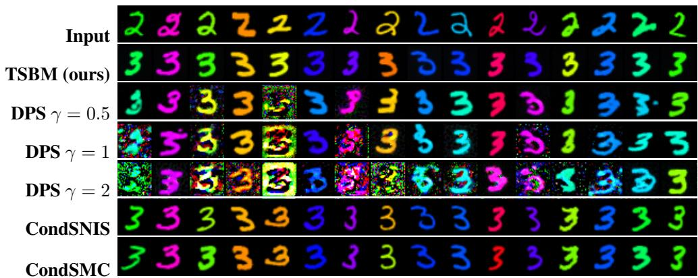  
Figure 6: Full Thick-stroke qualitative comparison on Colored MNIST.

<table><tr><td rowspan=7 colspan=1>InputTSBM (ours)DPS γ = 0.5DPS γ = 1DPS γ = 2CondSNISCondSMC</td><td rowspan=1 colspan=3>2922222222222222</td></tr><tr><td rowspan=1 colspan=3>333333   333333333</td></tr><tr><td rowspan=1 colspan=1>3333</td><td rowspan=1 colspan=1>3</td><td rowspan=1 colspan=1>3  333333333333</td></tr><tr><td rowspan=1 colspan=1>R333</td><td rowspan=1 colspan=1></td><td rowspan=1 colspan=1>33333533333</td></tr><tr><td rowspan=1 colspan=1>FUAZ</td><td rowspan=1 colspan=1>S</td><td rowspan=1 colspan=1>3333</td></tr><tr><td rowspan=1 colspan=3>3333333 33333333333</td></tr><tr><td rowspan=1 colspan=3>333333333333533333</td></tr></table>

Figure 7: Full Thin-stroke qualitative comparison on Colored MNIST.

## F.2 CELEBA

This section gives the complete qualitative CelebA comparisons corresponding to Figure 4. In addition to the methods retained in the main text we include DPS with $\gamma = 0 . 5 , 1 , 2$ and CondSNIS with $K = 4$ proposals per fixed source.

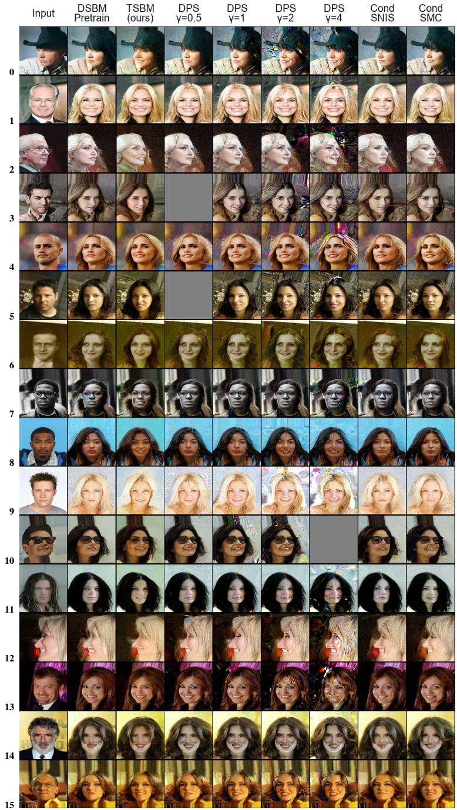  
Figure 8: Full qualitative comparison for "Natural Toothy Smile" reward on CelebA. Gray outputs and visual artifacts are retained from the saved samples.

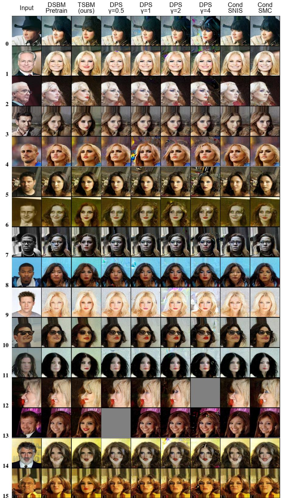  
Figure 9: Full qualitative comparison for "Heavy Makeup" reward on CelebA. Gray outputs and visual artifacts are retained from the saved samples.

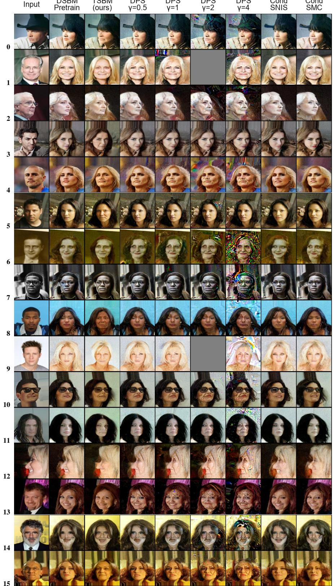  
Figure 10: Full qualitative comparison for "Elderly Woman" reward on CelebA. Gray outputs and visual artifacts are retained from the saved samples.

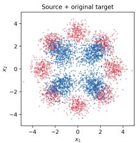

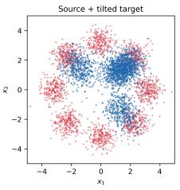

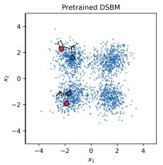

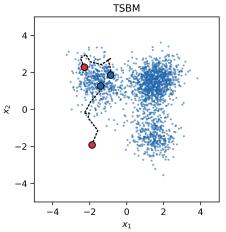

<table><tr><td rowspan=1 colspan=3>slicedMethod               $\mathrm { T V } \downarrow W _ { 1 } \downarrow$  Cost</td></tr><tr><td rowspan=1 colspan=3>Exact Data Sinkhorn             - 2.300</td></tr><tr><td rowspan=1 colspan=3>DSBM                .354 .7881.604</td></tr><tr><td rowspan=1 colspan=3>DPS $\gamma = 0 . 5$          .309 .5601.785</td></tr><tr><td rowspan=1 colspan=3> $\mathrm { D P S } \gamma = 1$             .281 .4931.858</td></tr><tr><td rowspan=1 colspan=3> $\mathrm { D P S } \gamma = 2$             .254 .4411.896</td></tr><tr><td rowspan=1 colspan=1> $\mathrm { D P S } \gamma = 4$             .234</td><td rowspan=1 colspan=1>.4021</td><td rowspan=1 colspan=1>.933</td></tr><tr><td rowspan=1 colspan=1>SNIS                  .298</td><td rowspan=1 colspan=1>.5361</td><td rowspan=1 colspan=1>.788</td></tr><tr><td rowspan=1 colspan=1>SMC                  .287</td><td rowspan=1 colspan=2>.511 1.828</td></tr><tr><td rowspan=1 colspan=3>TSBM (ours)         .117 .117 2.180</td></tr></table>

(a)  
(b)  
Figure 11: Two-dimensional toy experiment. (a) The first two panels overlay the red source with the blue original and tilted targets; the remaining panels show terminal samples and generation trajectories from DSBM and TSBM.Red and blue dots with black outlines mark trajectory starts and endpoints, respectively; black dotted lines trace the trajectories. (b) Total variation and sliced $W _ { 1 }$ are measured against the ground-truth tilted distribution. Cost denotes $\mathbb { E } \| \hat { x } _ { 1 } - x _ { 0 } \| .$ 2. Bold marks the best distributional metrics and the cost closest to the Sinkhorn reference.

## G ADDITIONAL EXPERIMENTS

## G.1 TOY ILLUSTRATIVE EXPERIMENT

Setup. The source is an equally weighted mixture of eight Gaussians, and the original target is an equally weighted mixture of four Gaussians. We train the pretrain bridge with 20 DSBM stages and $\sigma = 1$ using 10⁵ training samples from each marginal. The reward changes the four target mixture weights from (0.25, 0.25, 0.25, 0.25) to (0, 0.2, 0.2, 0.6) and is kep with strength $\lambda = 1$ . We finetune the frozen DSBM for 20 TSBM stages. Figure 11b reports all methods on the same $1 0 ^ { 4 }$ validation sources, with 40 Euler steps. Other experimental details are described in Appendix E.

Results. Figure 11a shows the original and tilted targets alongside samples from the pretrained DSBM and TSBM. While Figure 11b shows quantitative evaluation w.r.t. tilted distribution: Total Variance, slide Wasserstein-1 distance and average cost of translation from source till target. One can see from quantitative results that TSBM shows the best target distributions fitting metrics, i.e., TV and sliced $W _ { 1 } ,$ while outperfroming significantly both the inference time alignment method and TSBM without corrector. We also apply Šinkhorn to GT tilted validation samples to estimate the transport cost of the GT tilted SB. TSBM achieves the closest cost to this reference, supporting recovery of the reference GT bridge's transport behavior. These results show that TSBM is the only evaluated method that both closely matches the tilted target marginal and approximates the reference bridge's transport cost.

## G.2 CELEBA-128 INFERENCE TIME AND WORKING MEMORY

We benchmark inference in the representative CelebA 128 × 128 male-to-female translation setting with the "Natural Toothy Smile" reward at strength $\lambda = 3 0$ . The benchmark uses the corresponding stage-2 TSBM checkpoint, DPS with $\gamma = 1$ , and one NVIDIA A100-SXM4-80GB. Every trajectory uses 100 drift-network evaluations, i.e., NFE. Model and checkpoint loading, dataset construction, post-hoc metrics, serialization, and etc are excluded from the timed region, and CUDA is synchronized around each trial. The single-output protocol runs the algorithm to process one input image, while for CondSNIS and CondSMC this means that they run processing of K parallel samples, i.e., on population. Table 5 reports mean and standard deviation over 16 timed trials after one warm-up. The batch-16 protocol test the batched processing and processes 16 input images and measures the time needed to produce one output for each image. CondSNIS and CondSMC use $K$ particles per input, with at most 16 trajectories evaluated simultaneously. Table 5 reports the median total time over three timed repetitions, divided by 16 to give the time per output. Working memory is the peak increase in live PyTorch GPU tensor memory during a trial, measured relative to the allocation immediately before it starts. It measures the extra memory inference needs, rather than the model's total GPU memory footprint.

Table 5: Inference cost on CelebA $1 2 8 \times 1 2 8 .$ Single-output wall-clock time is the mean ± standard deviation over 16 trials. Batch-16 time is the median total time divided by 16 source outputs. Relative time uses the single-output TSBM mean. An asterisk (\*) indicates visual artifacts.
<table><tr><td>Method</td><td>K</td><td>Single-output time (s)</td><td>Batch-16 s/output</td><td>Relative to TSBM</td><td>Working memory (GiB)</td></tr><tr><td>Pretrained DSBM</td><td>1</td><td> $1 . 4 6 8 \pm 0 . 0 1 0$ </td><td>0.355</td><td>1.00×</td><td>0.180</td></tr><tr><td>TSBM (ours)</td><td>1</td><td> $1 . 4 6 0 \pm 0 . 0 0 5$ </td><td>0.357</td><td>1.00×</td><td>0.180</td></tr><tr><td> $\mathrm { D P S } ^ { * } \gamma = 1$ </td><td>1</td><td> $7 . 1 1 6 \pm 0 . 0 1 1$ </td><td>1.836</td><td>4.88×</td><td>2.229</td></tr><tr><td>SNIS</td><td>4</td><td> $2 . 0 8 9 \pm 0 . 0 0 4$ </td><td>1.452</td><td>1.43×</td><td>0.379</td></tr><tr><td>SNIS</td><td>8</td><td> $3 . 0 9 4 \pm 0 . 0 0 1$ </td><td>2.905</td><td>2.12×</td><td>0.758</td></tr><tr><td>SNIS</td><td>16</td><td> $5 . 7 9 4 \pm 0 . 0 0 2$ </td><td>5.811</td><td>3.97×</td><td>1.512</td></tr><tr><td>SMC</td><td>4</td><td> $4 . 2 8 2 \pm 0 . 0 0 6$ </td><td>3.629</td><td>2.93×</td><td>0.383</td></tr><tr><td>SMC</td><td>8</td><td> $7 . 4 3 1 \pm 0 . 0 0 2$ </td><td>7.256</td><td>5.09×</td><td>0.767</td></tr><tr><td>SMC</td><td>16</td><td> $1 4 . 4 5 9 \pm 0 . 0 0 4$ </td><td>14.512</td><td>9.91×</td><td>1.527</td></tr></table>

TSBM has essentially the same inference cost as the pretrained bridge because it uses the same network architecture and requires neither reward evaluation nor differentiation at sampling time. In the single-output protocol, DPS is 4.88× slower and requires 2.229 GiB of working memory, compared with 0.180 GiB for TSBM. Its larger workspace comes from differentiating through the endpoint prediction and reward model at every step. SNIS and SMC costs increase with K because all particles are propagated for each fixed input. Their working memory grows approximately linearly with K. SMC is slower than SNIS at a fixed K because it additionally evaluates incremental rewards and performs sequential weighting and resampling.

All methods are measured in one process that keeps the DSBM, TSBM, and reward models resident. Consequently, working memory is the appropriate method comparison, whereas the absolute process peak is not a standalone deployment-memory requirement. We define:

$$
M _ { \mathrm { w o r k i n g } } = M _ { \mathrm { p e a k ~ a l l o c a t e d ~ d u r i n g ~ t r i a l } } - M _ { \mathrm { a l l o c a t e d ~ i m m e d i a t e l y ~ b e f o r e ~ t r i a l } } .
$$

## G.3 COLORED MNIST RED-CHROMA. STATIC TSBM CORRECTOR AND TSBM STAGES ABLATION.

In this section we provide additional analysis for the Colored MNIST translation with "red chroma" reward. We assert the stage-wise dynamics and convergence of TSBM in Figure 12, which tracks reward and red target hue error, i.e., deviation of translated image HUE from the target red one, across five TSBM stages, which asserts how much the model does follow the reward. Furthermore, we compare the full method (TSBM) with the no-corrector ablation. In that case, TSBM corrector isn't trained and $h ^ { ( k ) } = h _ { \mathrm { o l d } }$ , while method is trained with the same computational budget in terms of controller optimization. Both metrics are evaluated on the same 1, 024 fixed sources with 30 solver steps. Lower values are better for both reward and red-target hue error. Finally, we present qualitative evaluation of TSBM vs TSBM with static corrector in Figure 13.

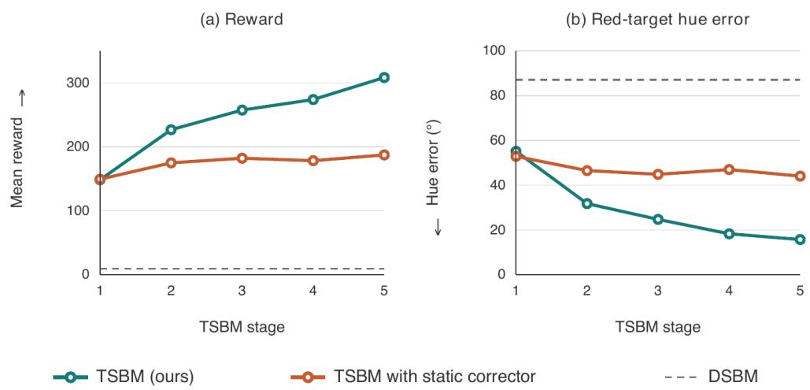  
Figure 12: Quantitative comparison of TSBM and TSBM with static corrector on Colored MNIST dataset with "red chroma" reward. The left panel shows mean terminal reward and the right panel the red-target hue error. Solid curves are TSBM and the no-corrector ablation, while dashed gray lines mark the frozen Pretrained DSBM result.

One can see that TSBM improves both the reward and hue error with iteration, while TSBM with static corrector does improve with iterations, but much slower than regular TSBM, see Figure 12. Figure 13 confirms the idea that regular TSBM follows the reward noticeably better than TSBM with static corrector. These results supports the theory and the need for accurate corrector $h ^ { ( k ) }$

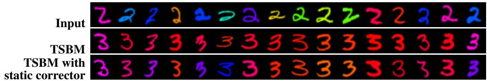  
Figure 13: Qualitative comparison of TSBM and TSBM with static corrector samples on Colored MNIST dataset with "red chroma" reward.

## G.4 COLORED MNIST THICK-TARGET. TSBM STAGES ABLATION.

In this section we provide additional analysis on TSBM dynamics across stages on the Colored MNIST dataset with "thick stroke" reward. We train perform the 20 TSBM stages. In Figure 14 we show the reward, stroke thickness as reward optimization metrics and hue error w.r.t. input as fidelity metric.

One can see that TSBM improves reward across the TSBM stages, while most of the gains are received in the first several stages. Furthermore, the actual thickness target seems almost achieved in the first TSBM stages, however it indeed improves within TSBM later stages. The hue error seems somewhat stochastic, however it is almost always within $1 3 ^ { \circ }$ and $1 6 ^ { \circ }$ degrees and doesn't diverge much. We assume that its stochasticy is the product of stocastic evaluation and reward side effects.

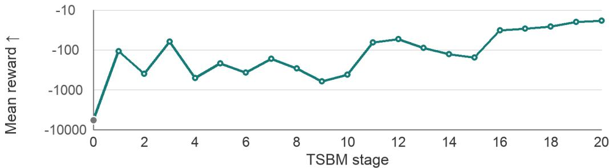

(a) Mean reward ↑; logarithmic magnitude scale.  
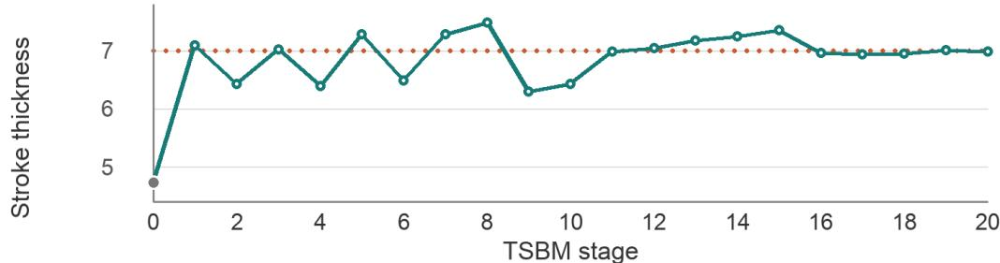

(b) Stroke thickness.  
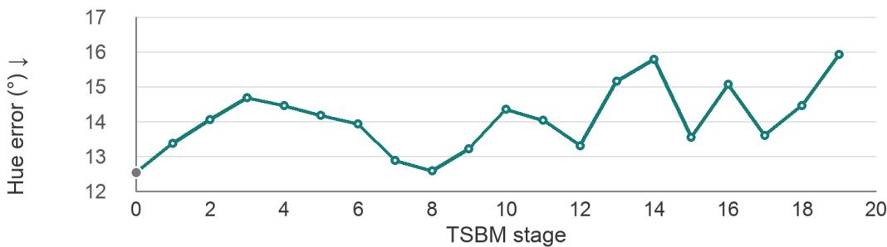  
(c) Foreground hue error ↓.  
TSBM (ours) Pretrained DSBM (stage 0 reference)  Target thick stroke  
Figure 14: Quantitative analysis of different TSBM stages on Colored MNIST dataset with "thick stroke" reward. The panels show mean reward, stroke thickness, and foreground hue error over 1, 024 fixed test source images. The gray marker is the frozen pretrained DSBM. The dotted line marks the stroke-thickness target.

## G.5 CELEBA ADDITIONAL QUANTITATIVE ANALYSIS

Here we present additional metrics complementing the study in Table 1 for CelebA dataset with all the rewards. Table 6 shows source-to-output distances, i.e., MSE and LPIPS Zhang et al. (2018), and two additional prompt-alignment scores, i.e., HPSV2.1 Wu et al. (2023b) and CLIPScore Hessel et al. (2021), which recieve data preprocessed the same way as for ImageReward and PickScore, see Appendix D.3. MSE and LPIPS measure how far an output y moves from its aligned input x, i.e., MSE(x, y) and $\mathrm { L P I P S } ( x , y )$

One can see that TSBM and DPS $\gamma = 4$ are the two best methods by HPS and CLIPScore. This confirms the strong TSBM generalization properties among several rewards, but shows $\mathrm { D P S } \gamma = 4$ as competitor. However, as we noticed before DPS methods, especially with higher γ introduce a significant level of artifacts, see Figures 10, 8, 9, 4. Across all three prompts, TSBM has the largest source-to-output MSE but lower LPIPS than every DPS variant. It therefore changes more pixels while remaining closer to the input under the perceptual feature metric. CondSNIS and CondSMC have smaller input-to-output distances but also weaker prompt scores, so those distances alone do not indicate better edits

Table 6: Additional CelebA quantitative results. MSE and LPIPS compare each output with its input, smaller values indicate less change. HPS v2.1 and CLIPScore use the same prompts as in Appendix D.3 with the same translation, crop, and horizontal-flip augmentation, larger values indicate better prompt alignment. Bold and underline marks the largest and second largest HPS or CLIPScore mean within each prompt. (\*) denotes the DPS settings marked for visual artifacts in Table 1.
<table><tr><td>Method</td><td>MSE input-output</td><td>LPIPS input-output</td><td>HPS v2.1 ↑</td><td>CLIPScore ↑</td></tr><tr><td>Natural Toothy Smile</td><td></td><td></td><td></td><td></td></tr><tr><td>Pretrained DSBM</td><td>0.1677</td><td>0.2983</td><td>0.1806</td><td>19.6923</td></tr><tr><td>TSBM (ours)</td><td>0.1923</td><td>0.3074</td><td>0.2012</td><td>21.5642</td></tr><tr><td> $\mathsf { D P S } \gamma \overset { \cdot } { = } 0 . 5$ </td><td>0.1815</td><td>0.3363</td><td>0.1867</td><td>20.2365</td></tr><tr><td> $\mathrm { D P S ^ { * } } \gamma = 1$ </td><td>0.1827</td><td>0.3409</td><td>0.1928</td><td>20.8415</td></tr><tr><td> $\mathrm { D P S ^ { * } } \ \dot { \gamma } = 2$ </td><td>0.1843</td><td>0.3483</td><td>0.1982</td><td>21.3689</td></tr><tr><td> $\mathrm { D P S } ^ { * } \gamma = 4$ </td><td>0.1901</td><td>0.3653</td><td>0.1997</td><td>21.6390</td></tr><tr><td> $\mathrm { C o n d S N I S }$ </td><td>0.1676</td><td>0.2981</td><td>0.1830</td><td>19.9052</td></tr><tr><td>CondSMC</td><td>0.1682</td><td>0.2975</td><td>0.1890</td><td>20.4165</td></tr><tr><td>Heavy Makeup</td><td></td><td></td><td></td><td></td></tr><tr><td>Pretrained DSBM</td><td>0.1677</td><td>0.2983</td><td>0.1540</td><td>18.1912</td></tr><tr><td>TSBM (ours)</td><td>0.1955</td><td>0.3159</td><td>0.1858</td><td>21.6400</td></tr><tr><td> $\mathsf { D P S } \gamma = 0 . 5$ </td><td>0.1828</td><td>0.3402</td><td>0.1687</td><td>19.7912</td></tr><tr><td> $\mathrm { D P S } ^ { * } \gamma = 1$ </td><td>0.1820</td><td>0.3460</td><td>0.1761</td><td>20.4257</td></tr><tr><td> $\mathrm { D P S } ^ { * } \ \dot { \gamma } = 2$ </td><td>0.1848</td><td>0.3532</td><td>0.1825</td><td>20.8767</td></tr><tr><td> $\mathrm { D P S } ^ { * } \stackrel { \cdot } { \gamma } = 4$ </td><td>0.1827</td><td>0.3528</td><td>0.1872</td><td>21.1343</td></tr><tr><td>CondSNIS</td><td>0.1677</td><td>0.2983</td><td>0.1564</td><td>18.4695</td></tr><tr><td>CondSMC</td><td>0.1686</td><td>0.3021</td><td>0.1653</td><td>19.5327</td></tr><tr><td>Elderly Woman</td><td></td><td></td><td></td><td></td></tr><tr><td>Pretrained DSBM</td><td>0.1677</td><td>0.2983</td><td>0.1885</td><td></td></tr><tr><td>TSBM (ours)</td><td>0.1878</td><td>0.3018</td><td>0.2003</td><td>18.8912 23.4400</td></tr><tr><td> $\mathsf { D P S } \gamma = 0 . 5$ </td><td>0.1722</td><td>0.3160</td><td>0.1877</td><td>20.3012</td></tr><tr><td> $\mathrm { D P S } ^ { * } \gamma = 1$ </td><td>0.1725</td><td>0.3279</td><td>0.1903</td><td>21.2336</td></tr><tr><td> $\mathrm { D P S } ^ { * } \ \dot { \gamma } = 2$ </td><td>0.1761</td><td>0.3452</td><td>0.1935</td><td>22.0910</td></tr><tr><td> $\mathrm { D P S ^ { * } } \stackrel { \cdot } { \gamma } = 4$ </td><td>0.1859</td><td>0.3811</td><td>0.1953</td><td>22.7870</td></tr><tr><td>CondSNIS</td><td>0.1675</td><td>0.2987</td><td>0.1884</td><td>19.2562</td></tr><tr><td>CondSMC</td><td>0.1666</td><td>0.2998</td><td>0.1875</td><td>19.8498</td></tr><tr><td></td><td></td><td></td><td></td><td></td></tr></table>

## G.6 ADDITIONAL CELEBA REWARDS

We evaluate two further ImageReward preferences on CelebA 128 × 128 male-to-female translation. Both use the contrastive reward in Eq. 88 with $\lambda = 3 0$ . The positive and negative prompts are, respectively:

• Aesthetics: “a sharp, clean, well-exposed photograph of a face" and “a blurry, noisy, distorted, low-quality photograph of a face".

• Eyeglasses with Thick Frames: “a natural portrait of a person wearing eyeglasses with thick visible frames" and “a natural portrait of a person without eyeglasses".

As in the main CelebA experiment, ImageReward and PickScore are evaluated on the positive prompt alone, after translation, crop, and horizontal-flip augmentation. CLIP-IQA measures naturalness. Each table reports means over the same 128 fixed inputs within its reward experiment, using 100 bridge steps. CondSNIS and CondSMC use four particles per input. The TSBM was ran for 5 stages.

Table 7: Aesthetics reward on CelebA-128. ImageReward and PickScore use the positive prompt with translation, crop, and horizontal-flip augmentation; CLIP-IQA measures naturalness. Means are over 128 fixed inputs, with TSBM evaluated after stage 5. All metrics are higher-is-better. Bold marks the largest mean. (\*) indicates visible artifacts in the saved samples.
<table><tr><td>Method</td><td>ImageReward ↑</td><td>PickScore ↑</td><td>CLIP-IQA ↑</td></tr><tr><td>Pretrained DSBM</td><td>-0.2353</td><td>18.0223</td><td>0.5446</td></tr><tr><td>TSBM (ours)</td><td>0.6283</td><td>18.6727</td><td>0.5738</td></tr><tr><td> $\mathrm { D P S } ^ { \ast } \ \gamma = 0 . 5$ </td><td>0.1858</td><td>18.1216</td><td>0.5453</td></tr><tr><td> $\mathrm { D P S } ^ { * } \gamma = 1$ </td><td>0.2383</td><td>17.9490</td><td>0.4901</td></tr><tr><td> $\mathrm { D P S } ^ { * } \gamma = 2$ </td><td>0.5524</td><td>17.5891</td><td>0.3833</td></tr><tr><td> $\mathrm { D P S ^ { * } } \gamma = 4$ </td><td>0.5592</td><td>17.2191</td><td>0.2649</td></tr><tr><td>CondSNIS</td><td>-0.1098</td><td>18.0474</td><td>0.5684</td></tr><tr><td>CondSMC</td><td>-0.0164</td><td>18.2051</td><td>0.5632</td></tr></table>

Table 8: Eyeglasses with thick frames reward on CelebA-128. Metrics and augmentation follow Table 7. Means are over 128 fixed inputs, with TSBM evaluated after stage 5. All metrics are higher-is-better. Bold marks the largest mean. (\*) indicates visible artifacts in the saved samples.
<table><tr><td>Method</td><td>ImageReward ↑</td><td>PickScore ↑</td><td>CLIP-IQA ↑</td></tr><tr><td>Pretrained DSBM</td><td>-1.8730</td><td>17.2151</td><td>0.5446</td></tr><tr><td>TSBM (ours)</td><td>-0.0468</td><td>18.1322</td><td>0.4754</td></tr><tr><td> $\mathrm { D P S } ^ { \ast } \ \gamma = 0 . 5$ </td><td>-1.8729</td><td>17.1511</td><td>0.5538</td></tr><tr><td> $\mathrm { D P S } ^ { * } \gamma = 1$ </td><td>-1.8260</td><td>17.0452</td><td>0.5499</td></tr><tr><td> $\mathrm { D P S } ^ { * } \gamma = 2$ </td><td>-1.7740</td><td>16.9616</td><td>0.5365</td></tr><tr><td> $\mathrm { D P S ^ { * } } \gamma = 4$ </td><td>-1.7151</td><td>16.8643</td><td>0.4952</td></tr><tr><td> $\mathrm { C o n d S N I S }$ </td><td>-1.8324</td><td>17.1915</td><td>0.5462</td></tr><tr><td> $\mathrm { C o n d S M C }$ </td><td>-1.8651</td><td>17.1799</td><td>0.5547</td></tr></table>

TSBM has the largest ImageReward and PickScore means for both rewards. For aesthetics it also has the largest CLIP-IQA naturalness mean. For eyeglasses, CLIP-IQA falls from 0.5446 for the pretrained DSBM to 0.4754 for TSBM, while CondSMC has the largest naturalness mean at 0.5547. The full sample comparisons in Figures 15 and 16 show the corresponding edits and the artifacts produced by DPS. The task of adding eyeglasses to a person appears to be particularly challenging: the baselines achieve poor reward alignment under both the training ImageReward and evaluation PickScore metrics. While TSBM substantially improves over the baselines, it does not fully solve the problem, as shown in Figure 16.

Input  
DSBM Pretrain  
TSBM (ours)  
DPS γ=2  
DPS y=1  
DPS γ=4  
Cond SNIS  
Cond SMC  
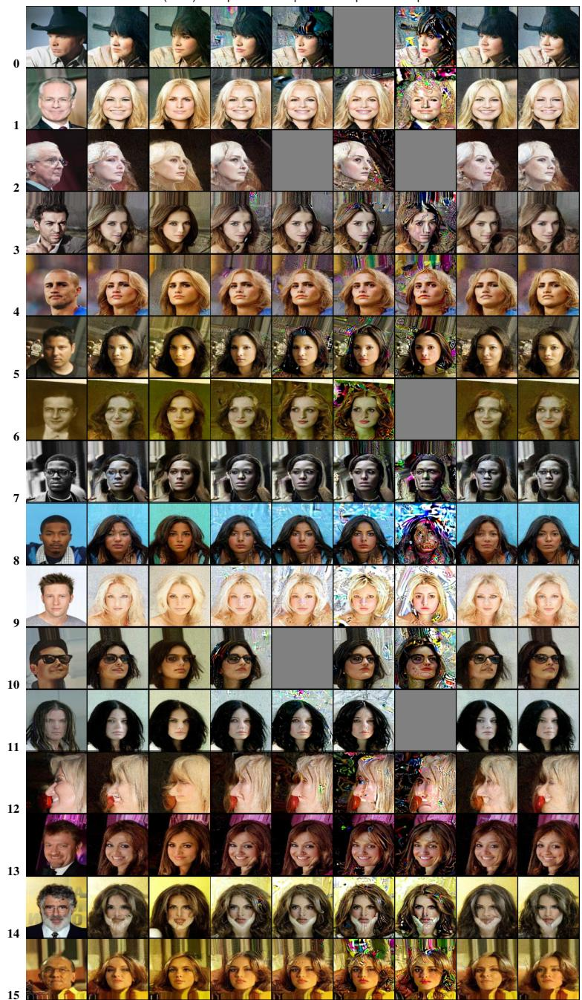  
Figure 15: Full qualitative comparison for the aesthetics reward on CelebA. Rows show the first 16 fixed sources; columns show the input, pretrained DSBM, TSBM (ours) at stage 10, DPS with $\gamma \in \{ 0 . 5 , 1 , 2 , 4 \}$ , CondSNIS, and CondSMC. Gray outputs and visual artifacts are retained from the saved samples.

DPS y=0.5

DSBM Pretrain  
TSBM (ours)  
DPS γ=2  
DPS y=1  
DPS γ=4  
Cond SNIS  
Cond SMC  
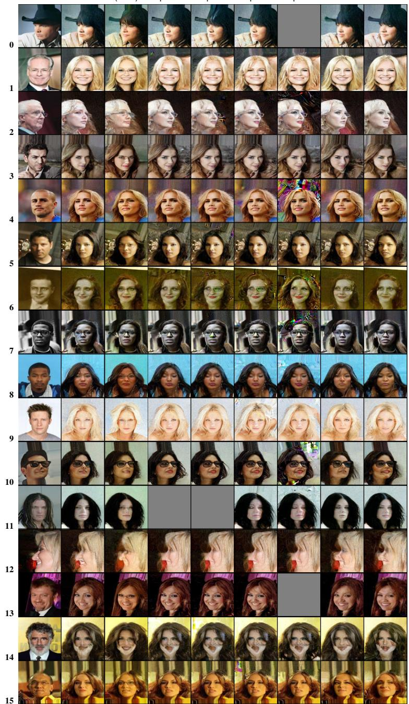  
Figure 16: Full qualitative comparison for the eyeglasses with thick frames reward on CelebA. Rows show the first 16 fixed sources; columns show the input, pretrained DSBM, TSBM (ours) at stage 5, DPS with $\gamma \in \{ 0 . 5 , 1 , 2 , 4 \}$ , CondSNIS, and CondSMC. Gray outputs and visual artifacts are retained from the saved samples.