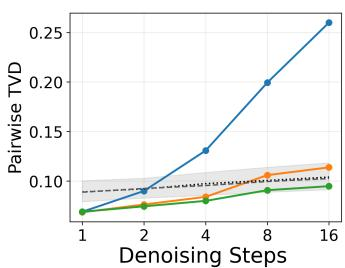
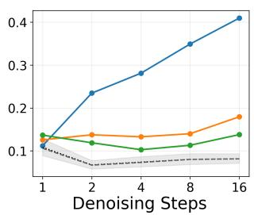
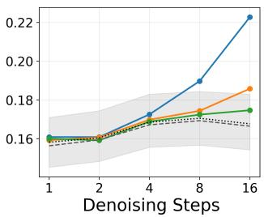
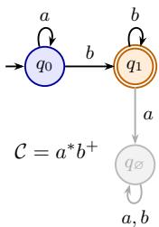
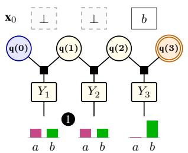
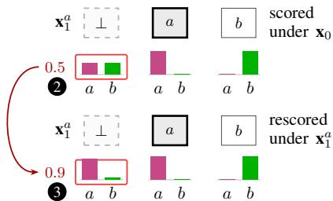
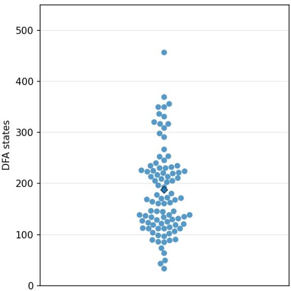

# TWIST, DON’T TILT: TRAJECTORY-EXACT CONSTRA-INED DECODING FOR MASKED DIFFUSION MODELS

Aditya Thimmaiah1, Lara Marinov1, Jayanth Srinivasa2, Haris Vikalo1, Junyi Jessy Li1, Milos Gligoric1

auditt@utexas.edu, marinov@utexas.edu, jasriniv@cisco.com, hvikalo@ece.utexas.edu, jessy@utexas.edu, gligoric@utexas.edu

1The University of Texas at Austin 2Cisco Research

## ABSTRACT

Constrained decoding for Masked Diffusion Language Models (MDLMs) aims to ensure that generated outputs satisfy a specified structure or syntax constraint. MDLMs generate outputs by repeatedly unmasking masked positions present in their current state. Recent strategies for constrained decoding constrain the model’s per-step mean-field posterior (which factorizes over masked positions) by enforcing the desired constraint with an automaton. The resulting chain-structured factor graph allows exact constrained sampling via dynamic programming. However, despite each draw being exact and constraint-satisfying, we prove that their composition, in general, tilts away from the model’s relative probabilities over valid trajectories, thus leading to trajectory bias. We derive an exact expression for this bias as a product of ratios measuring how valid continuation mass changes when the denoiser is reconditioned, and characterize when the bias vanishes. We then correct the bias by introducing TWISTER, the first automaton-twisted Sequential Monte Carlo decoder for MDLMs, using the step-exact decoder as the proposal. We show that for regular language constraints, the Feynman–Kac correction is exactly computable, with the twists obtained efficiently using quantities pre-computed for step-exact sampling. We prove that the resulting Feynman–Kac model targets the unbiased Doob h-transformed path law conditioned on constraint satisfaction.

Dang & Ermon†  TWISTERsmc4  TWISTERsmc8  matched rejection split floor ---- rejection MC noise

  
(a) OWT-130M

  
(b) DREAMCODER-7B-INST

  
(c) DREAM-7B-BASE  
Figure 1: Trajectory bias in constrained decoding of MDLMs captured by the Total Variation Distance (TVD) between the Doob h-transformed native path law (rejection sampling) and the step-exact automaton-constrained distribution (Dang & Ermon (2026), $\mathrm { T W I S T E R } _ { \mathsf { s m c 4 } }$ and $\mathrm { T w I S T E R } _ { s \mathrm { m c } 8 } )$ across denoising steps. For "a.\*".

## 1 INTRODUCTION

Masked Diffusion Language Models (MDLMs) (Sahoo et al., 2024; Nie et al., 2025; Xie et al., 2025; Ye et al., 2025) are increasingly used for generating text, code, and other data, that may require their outputs to adhere to a specified format structure (syntax), e.g., a JSON schema.

Unlike autoregressive Large Language Models (LLMs), MDLMs decode by repeatedly denoising a masked input; they first predict mask-free token-categoricals over the masked positions, and then retain only a scheduled subset of these predictions. Therefore, the generation order depends on the sequence of these scheduled subsets of positions and is not a left-to-right prefix like in LLMs. This creates a different kind of constrained decoding problem. Suresh et al. (2025) introduced DINGO, an MDLM algorithm for regular languages, which used maximum a posteriori (MAP) decoding over the chain-structured factorization of the model’s automaton-constrained posterior. While DINGO is mode-seeking, Dang & Ermon (2026) proposed an algorithm for instead sampling (exactly) from the automaton-constrained posterior at each step using Forward-Filtering Backward-Sampling (FFBS) (Carter & Kohn, 1994).

We show that sampling locally from the automaton-constrained posterior at each step, although exact, is still biased when composed across steps, thus deviating from the globally constrained distribution. The bias arises because the denoising process only retains a scheduled subset of the sampled tokens and discards the rest when producing the next intermediate state. The resulting clamped-partition sum is the total constraint-valid probability mass obtained by fixing (or clamping) the retained predictions to the successor state and marginalizing the discarded ones under the current-state-conditioned MDLM. At the next step, the same positions (discarded in the previous step) are reevaluated under the successor-state-conditioned MDLM, producing a new local-partition sum. The ratios of the clamped-partition sum to the local-partition sum tilt the resulting path law relative to the globally constrained one, which we model via the Doob h-transform (Doob, 1957) of the native path law, conditioned on constraint-satisfaction. The tilt manifests as trajectory bias. Figure 1 shows the trajectory bias when sampling locally from the automaton-constrained posterior using a step-exact decoder, relative to the native decoder conditioned on constraint satisfaction, for different models.

Unlike locally constrained LLM decoding, which ignores future valid mass (Park et al., 2024; Dang et al., 2026), step-exact MDLM decoding accounts for this mass exactly, but under a denoiser frozen at the current state. When these exact local steps are composed, reconditioning the denoiser can change the valid mass and bias the resulting distribution. We correct the bias by introducing TWISTER, which uses a Feynman–Kac correction with the local and clamped-partition sum ratios as the incremental potentials. The correction requires quantities already computed by FFBS of the step-exact sampler proposed by Dang & Ermon (2026), making it exactly and efficiently computable.

## 2 BACKGROUND

In this section, we introduce notation used in the rest of the paper, as well as background on MDLMs and twisted Sequential Monte Carlo. We use [N] to denote $\bar { \{ 1 , 2 , \ldots , N \} }$ , the set of natural numbers up to $N ;$ and · to denote the standard indicator function. For two N-length sequences x and $\mathbf { x } ^ { \prime }$ we write $\mathbb { [ } \mathbf { x } \equiv _ { r } \mathbf { \bar { x } } ^ { \prime } ] \mathrm { i f } \mathbf { x } ( i ) = \mathbf { x } ^ { \prime } ( i )$ for every $i \in r \subseteq [ N ]$ . For bounded products such as $\begin{array} { r } { \prod _ { t < T ^ { 5 } } , } \end{array}$ we always assume t starts from 0. Unnormalized quantities are generally denoted by a tilde, e.g., πe.

## 2.1 DETERMINISTIC FINITE AUTOMATA AND REGULAR LANGUAGES

A deterministic finite automaton (DFA) over a finite alphabet Σ is a tuple: $A \triangleq \langle \Sigma , \mathcal { Q } , q _ { 0 } , \mathcal { F } , \delta \rangle$ where Q is a finite set of states, $q _ { 0 } \in \mathcal { Q }$ is the initial state, $\mathcal { F } \subseteq \mathcal { Q }$ is the set of accepting states, and $\delta : \mathcal { Q } \times \Sigma  \mathcal { Q }$ is the transition function. A word w is accepted by a DFA if the DFA ends in an accepting state after consuming w, i.e., $\delta ^ { * } ( q _ { 0 } , \pmb { w } ) \in \mathcal { F } ^ { \pm }$

Definition 2.1. [Regular Language] The language C recognized by a DFA is the set ofall words accepted by it: $\mathcal { C } \triangleq \{ \pmb { w } \in \Sigma ^ { * } | \delta ^ { * } ( q _ { 0 } , \pmb { w } ) \in \mathcal { F } \}$ . A language is regular ifit is recognized by a DFA.

## 2.2 MASKED DIFFUSION LANGUAGE MODELS

MDLMs generate mask-free (or clean) token sequences from partially/fully masked sequences, by repeatedly unmasking the masked positions (Sahoo et al., 2024).

Let V be a finite vocabulary of clean tokens, ⊥ be the mask token, and $\mathcal { X } \triangleq \mathcal { V } \cup \{ \bot \}$ the augmented token space. $\mathbf { X } \in \mathcal { X } ^ { N }$ denotes a random state (an N-length token sequence) and x is its realization. The masked positions of x are given by: $\mathcal { M } ( \mathbf { x } ) \triangleq \{ i \in [ N ] : \mathbf { x } ( i ) = \bot \}$ , and $\mathbf { x } ( i )$ is the i-th token in x.

Starting from a masked state $\mathbf { X } _ { 0 } \in \mathcal { X } ^ { N }$ , an MDLM evolves as a Markov chain $\mathbf { X } _ { 0 }  \mathbf { X } _ { 1 }  \cdot \cdot \cdot $ $\mathbf { X } _ { t } \to \cdots \to \mathbf { X } _ { T }$ over a finite number of denoising steps $T$ to produce a clean state ${ \mathbf { X } } _ { T } \in \mathcal { V } ^ { N }$

The transition (Markov) kernels can be constructed from the three main components of MDLMs. For $\mathbf { X } _ { t }$ with $\mathcal { M } ( \mathbf { x } _ { t } ) \neq \boldsymbol { \mathcal { O } }$ , the denoiser outputs categoricals $\mathrm { C a t } _ { i } ( \cdot \mid \mathbf { x } _ { t } ) \in \Delta ^ { \vert \nu \vert - 1 }$ over $i \in \mathcal { M } ( \mathbf { x } _ { t } )$ , where $\Delta ^ { | \nu | - 1 }$ is the $( | \mathcal { V } | - 1 )$ )-simplex. The token predictions are conditionally independent given $\mathbf { X } _ { t } ,$ , so the denoiser’s posterior factorizes over $\mathcal { M } ( \mathbf { x } _ { t } )$ . The scheduler retains some of these factors by drawing a reveal set $\mathbf { R } _ { t + 1 } = r$ from some policy $s _ { t + 1 } ( \cdot \mid \mathbf { x } _ { t } )$ such that $r \subseteq \mathcal { M } ( \mathbf { x } _ { t } )$ and is non-empty. The set r is the subset of $\mathbf { x } _ { t } \mathbf { \ ' } _ { \mathbf { S } }$ masked positions that will be revealed for step $t + 1$ . The policy $s _ { t + 1 } ( \cdot \mid \mathbf { x } _ { t } )$ can be uniform (Nie et al., 2025), confidence-based (Wu et al., 2026), entropy-based (Ben-Hamu et al., 2025), etc. Lastly, the decoder independently samples from $\operatorname { C a t } _ { i } ( \cdot \mid \mathbf { x } _ { t } )$ for $i \in r$ , and commits the sampled tokens (retaining $\mathbf { x } _ { t } \mathrm { ; }$ ’s tokens in the remaining positions) to produce the next state $\mathbf { X } _ { t + 1 }$ Since denoising is monotone unmasking, we also use $\mathcal { R } ( \mathbf { x } _ { t + 1 } , \mathbf { x } _ { t } ) \triangleq \mathcal { M } ( \mathbf { x } _ { t } ) \setminus \mathcal { M } ( \mathbf { x } _ { t + 1 } )$ to denote the revealed set of positions between steps t and t+1.

Definition 2.2. [Native Joint Kernel] Transition from ${ \bf X } _ { t } = { \bf x } _ { t } t o { \bf X } _ { t + 1 } = { \bf x } _ { t + 1 }$ and $\mathbf { R } _ { t + 1 } = r \mathbf { \nabla } i$ s:

$$
\begin{array} { r l r } { \kappa _ { t + 1 } \big ( \mathbf { x } _ { t + 1 } , r \mid \mathbf { x } _ { t } \big ) \triangleq s _ { t + 1 } \big ( r \mid \mathbf { x } _ { t } \big ) } & { \times } & { \big \| \mathbf { x } _ { t + 1 } \equiv \hdots \mathbf { r } \mathbf { x } _ { t } \big \| \quad \times \ : \ : \big \| \displaystyle \prod _ { i \in r } \mathrm { C a t } _ { i } \big ( \mathbf { x } _ { t + 1 } ( i ) \mid \mathbf { x } _ { t } \big ) . } \\ { \mathrm { d r a w n ~ r e v e a l ~ s e t } } & { \mathrm { M D L M s ~ d e n o i s e ~ b y ~ u n m a s k i n g } } & { \mathrm { d e n o i s e r ~ p r e d i c t i o n s ~ o v e r ~ m a s k s } } \end{array}\tag{1}
$$

MDLMs can denoise only by unmasking which necessitates $[ [ \mathbf { x } _ { t + 1 } \equiv _ { \lnot r } \ \mathbf { x } _ { t } ] ]$ in Definition $2 . 2 ^ { \ S }$ The native kernel $\kappa _ { t + 1 } ( \mathbf { x } _ { t + 1 } \mid \mathbf { x } _ { t } )$ is obtained by marginalizing out $\mathbf { R } _ { t + 1 }$ from Eq. (1). A denoising trajectory $\mathbf { X } _ { 1 : T }$ is then a sequence of states $\big ( \mathbf { x } _ { 1 } , \ldots , \mathbf { x } _ { T } \big )$ derived through repeated applications of the native kernels $\kappa _ { t + 1 }$ on the corresponding intermediate states $\mathbf { X } _ { t }$ starting from the initial state $\mathbf { x } _ { \mathrm { 0 } }$

Definition 2.3. [Native Path Law] The distribution of denoising trajectories conditioned on $\mathbf { x } _ { \mathrm { 0 } } .$

$$
p _ { 1 : T } ^ { \mathfrak { m } \mathrm { d } \mathfrak { m } } \big ( \mathbf { x } _ { 1 : T } \mid \mathbf { x } _ { 0 } \big ) \ \triangleq \ \mathbb { P } \big ( \mathbf { X } _ { 1 } = \mathbf { x } _ { 1 } , \ldots , \mathbf { X } _ { T } = \mathbf { x } _ { T } \mid \mathbf { X } _ { 0 } = \mathbf { x } _ { 0 } \big ) = \prod _ { t < T } \kappa _ { t + 1 } \big ( \mathbf { x } _ { t + 1 } \mid \mathbf { x } _ { t } \big ) .\tag{2}
$$

## 2.3 TWISTED SEQUENTIAL MONTE CARLO

Sequential Monte Carlo (SMC) is used for approximating trajectory distributions as it performs importance corrections incrementally while building the trajectory $( \dot { \mathrm { L i u } } , 2 0 0 4 \mathrm { b } ) ^ { \ P }$ . It approximates them using weighted particles, by propagating, reweighting, and resampling them as trajectories grow. It implements the Feynman–Kac model (Del Moral, 2004).

Definition 2.4. [Feynman–Kac Model] A Feynman–Kac model defines an unnormalized trajectory distribution $\widetilde { \pi } _ { 0 : t } f o r t \leq T$ , as a product of proposal kernels M and non-negative potentials G:

$$
\widetilde { \pi } _ { 0 : t } \big ( \mathbf { x } _ { 0 : t } \big ) \ \triangleq \ M _ { 0 } \big ( \mathbf { x } _ { 0 } \big ) \ G _ { 0 } ( \mathbf { x } _ { 0 } ) \times \prod _ { s < t } M _ { s + 1 } \big ( \mathbf { x } _ { s + 1 } \ | \ \mathbf { x } _ { s } \big ) \ G _ { s + 1 } \big ( \mathbf { x } _ { s } , \mathbf { x } _ { s + 1 } \big ) .\tag{3}
$$

However, when the target includes only a terminal weight, standard SMC receives no guidance during intermediate steps. Twisted SMC uses twist functions to move this information into incremental potentials, enabling particles to be guided as their trajectories grow (Whiteley & Lee, 2014).

Definition 2.5. [Twist-Constructed Potentials] Consider a Markov path distribution $P ( \mathbf { x } _ { 0 : t } ) =$ $\begin{array} { r } { \nu _ { 0 } ( \mathbf { x } _ { 0 } ) \prod _ { s < t } \kappa _ { s + 1 } ( \mathbf { x } _ { s + 1 } \mid \mathbf { x } _ { s } ) } \end{array}$ and a non-negative terminal weight h. Let $\eta _ { 0 : T }$ be twistfunctions such that $\eta _ { t } > 0 f o r t < T$ and $\eta _ { T } = h .$ . Given proposal kernels M, the potentials are defined as:

$$
G _ { 0 } ( \mathbf { x } _ { 0 } ) \triangleq { \frac { \nu _ { 0 } ( \mathbf { x } _ { 0 } ) } { M _ { 0 } ( \mathbf { x } _ { 0 } ) } } \eta _ { 0 } ( \mathbf { x } _ { 0 } ) , \qquad G _ { t + 1 } ( \mathbf { x } _ { t } , \mathbf { x } _ { t + 1 } ) \triangleq { \frac { \kappa _ { t + 1 } ( \mathbf { x } _ { t + 1 } \mid \mathbf { x } _ { t } ) } { M _ { t + 1 } ( \mathbf { x } _ { t + 1 } \mid \mathbf { x } _ { t } ) } } { \frac { \eta _ { t + 1 } ( \mathbf { x } _ { t + 1 } ) } { \eta _ { t } ( \mathbf { x } _ { t } ) } } .\tag{4}
$$

Substituting the potentials from $\operatorname { E q } .$ . (4) into Eq. (3) gives $\widetilde { \pi } _ { 0 : t } \big ( \mathbf { x } _ { 0 : t } \big ) = P \big ( \mathbf { x } _ { 0 : t } \big ) \eta _ { t } \big ( \mathbf { x } _ { t } \big )$ . Therefore, the model targets $P ( \mathbf { x } _ { 0 : T } ) h ( \mathbf { x } _ { T } )$ at $T ,$ . The intermediate twists do not alter it, but move its information into the incremental potentials used to guide particles. The ideal twist at $\mathbf { X } _ { t }$ is the expected terminal weight under the remaining native transitions, i.e., the exact lookahead or continuation probabilities.

## 3 STEP-EXACT DOES NOT MEAN TRAJECTORY-EXACT

Constrained decoding in MDLMs operates along two axes: state positions $i \in [ N ]$ and denoising steps $0 \leq t < T$ . At denoising step t, a step-exact decoder draws a clean sequence $\dot { \mathbf { Y } } \in \mathcal { V } ^ { N }$ from the denoiser’s automaton-constrained posterior (conditioned on $\mathbf { X } _ { t } )$ that satisfies the regular language constraint C, i.e., $\mathbf { Y } \in { \mathcal { C } }$ . Only $\mathbf { Y } \mathbf { \widetilde { s } }$ positions in the reveal set $\mathbf { R } _ { t + 1 }$ are committed to $\mathbf { X } _ { t + 1 }$ , while the remaining are discarded. A draw can therefore be exact at every step without the resulting trajectory $\mathbf { X } _ { 0 : T }$ following the native path law (Definition 2.3) conditioned on constraint-satisfaction $\mathbf { X } _ { T } ^ { \bar { } } { \in } { \mathcal { C } }$

Throughout the paper, we assume: (1) complete reveal $\mathcal { M } ( \mathbf { x } _ { T } ) { = } \emptyset$ at the terminal denoising step $T ;$ and (2) full support of the denoiser’s predictions $\mathrm { C a t } _ { i } ( v \mid \mathbf { x } ) > 0$ for all $v \in \nu$ and for all $i \in \mathcal { M } ( \mathbf { x } )$ We follow Koo et al. (2024) to lift the DFA from symbols in Σ to tokens in the model’s vocabulary V.

We now formally characterize the trajectory bias introduced by step-exact decoding. We start by defining the target path law, i.e., the native decoder’s path law conditioned on constraint-satisfaction, using the Doob h-transform (Section 3.1). Next, we derive the transition kernels of the step-exact decoder (Section 3.2), and show that the involved partition sums are lookaheads (valid-continuation probabilities) under a frozen denoiser, and thus step-exact decoding is a frozen Doob transform refrozen at every step (Section 3.3). Finally, we show that re-freezing is the trajectory bias (Section 3.4).

Definition 3.1. [Unbiased Constrained Decoder] For an initial state $\mathbf { X } _ { 0 }$ and constraint ${ \mathcal { C } } ,$ let $\Omega _ { C } ( \mathbf { x } _ { 0 } )$ be the support of native trajectories $\mathbf { X } _ { 1 : T }$ satisfying $\mathbf { x } _ { T } \in { \mathcal { C } } .$ . A constrained decoder with path law $q _ { 1 : T } ( \cdot \mid \mathbf { x } _ { 0 } ; \mathcal { C } )$ is unbiased if its support is $\Omega _ { C } ( \mathbf { x } _ { 0 } )$ and, for every $\mathbf { x } _ { 1 : T } ^ { \prime } , \mathbf { x } _ { 1 : T } ^ { \prime \prime } \in \Omega _ { \cal C } \left( \mathbf { x } _ { 0 } \right)$

$$
\frac { q _ { 1 : T } ( \mathbf { x } _ { 1 : T } ^ { \prime } \mid \mathbf { x } _ { 0 } ; \mathcal { C } ) } { q _ { 1 : T } ( \mathbf { x } _ { 1 : T } ^ { \prime \prime } \mid \mathbf { x } _ { 0 } ; \mathcal { C } ) } = \frac { p _ { 1 : T } ^ { \mathsf { m d m } } \left( \mathbf { x } _ { 1 : T } ^ { \prime } \mid \mathbf { x } _ { 0 } \right) } { p _ { 1 : T } ^ { \mathsf { m d m } } \left( \mathbf { x } _ { 1 : T } ^ { \prime \prime } \mid \mathbf { x } _ { 0 } \right) } ,
$$

$i . e . ,$ the constrained decoder does not alter the relative probabilities of constraint-valid trajectories.

## 3.1 DOOB-TRANSFORMED DECODER

In order to characterize trajectory bias, we first need the path law of a constrained decoder that is conditioned to satisfy C, and is unbiased in the sense of Definition 3.1. The native path law $p _ { 1 : T } ^ { \mathsf { m d i m } } ( \cdot \mid \mathbf { X } _ { 0 } )$ is unconstrained and so does not satisfy C by itself. We obtain the unbiased constrained decoder by terminally conditioning $p _ { 1 : T } ^ { \mathsf { m d m } } ( \mathbf { X } _ { 1 : T } ~ \mid ~ \mathbf { X } _ { 0 } )$ on satisfying $\mathcal { C } , \mathrm { ~ i . e . , ~ } \mathbf { X } _ { T } \in \mathcal { C } ;$ using the Doob h-transform (Doob, 1957). The Doob h-transform conditions Markov processes to satisfy specific constraints, by tilting their transition kernels towards states compatible with highly-probable constraint-valid continuations that are given by the lookaheads $h _ { t } ( \mathbf { x } ) \triangleq \mathbb { P } ( \mathbf { X } _ { T } \in \mathcal { C } \mid \mathbf { X } _ { t } = \mathbf { x } )$

Definition 3.2. [Doob Kernel] For the native kernels $\kappa _ { t + 1 }$ (Definition 2.2) and their exact lookahead $h _ { t } ( \mathbf { x } )$ , with $h _ { t } ( \mathbf { x } ) > 0$ for all x in the support of $\kappa _ { t + 1 } ,$ , their Doob h-transform gives:

$$
\kappa _ { t + 1 } ^ { \star } ( \mathbf { x } _ { t + 1 } ~ | ~ \mathbf { x } _ { t } ; \mathcal { C } ) \ \triangleq \ \kappa _ { t + 1 } \big ( \mathbf { x } _ { t + 1 } ~ | ~ \mathbf { x } _ { t } \big ) \times \frac { h _ { t + 1 } \big ( \mathbf { x } _ { t + 1 } \big ) } { h _ { t } \big ( \mathbf { x } _ { t } \big ) } .\tag{5}
$$

$h _ { t } ( \mathbf { x } ) \triangleq \sum _ { \mathbf { x } ^ { \prime } \in \mathcal { X } ^ { N } } \kappa _ { t + 1 } ( \mathbf { x } ^ { \prime } \mid \mathbf { x } ) h _ { t + 1 } ( \mathbf { x } ^ { \prime } )$ , is the exact lookahead of $\kappa _ { t + 1 }$ and $h _ { T } ( \mathbf { x } ) \triangleq \mathbb { I } \mathbf { x } \in \mathcal { C } \mathbb { I }$

Proposition 3.3. [Doob Path Law] The Doob path law is the product of the Doob kernels:

$$
p _ { 1 : T } ^ { \star } ( \mathbf { x } _ { 1 : T } \mid \mathbf { x } _ { 0 } ; \mathcal { C } ) = p _ { 1 : T } ^ { \mathsf { m d i m } } ( \mathbf { x } _ { 1 : T } \mid \mathbf { x } _ { 0 } ) \times \frac { [ [ \mathbf { x } _ { T } \in \mathcal { C } ] ] } { h _ { 0 } ( \mathbf { x } _ { 0 } ) } .\tag{6}
$$

Proofsketch. The product of the Doob kernels $\kappa _ { t + 1 } ^ { \star }$ for $t < T$ , gives the native path law from Definition 2.3; and the h-ratios telescope to $[ \mathbf { x } _ { T } \in \dot { \mathcal { C } } ] / h _ { 0 } ( \mathbf { x } _ { 0 } )$ , thus giving Eq. (6).

Importantly, the Doob path law $p _ { 1 : T } ^ { \star } ( \mathbf { X } _ { 1 : T } \mid \mathbf { x } _ { 0 } ; \mathcal { C } )$ from Proposition 3.3 is unbiased as it prunes all trajectories with terminal state $\mathbf { X } _ { T } \notin \mathcal { C }$ , but does so without altering the relative probabilities of the valid trajectories under $p _ { 1 : T } ^ { \mathsf { m d m } } ( \mathbf { X } _ { 1 : T } \mid \mathbf { x } _ { 0 } )$ . This follows from Eq. (6), where the Doob path law is proportional to $p _ { 1 : T } ^ { \mathsf { m d m } } ( \mathbf { X } _ { 1 : T } \mid \mathbf { \bar { x } } _ { 0 } )$ up to a factor $h _ { 0 } ( \mathbf { x } _ { 0 } )$ which is constant for a fixed initial state $\mathbf { X } _ { 0 }$ The Doob terminal law can be obtained by marginalizing out the intermediate states $\mathbf { X } _ { 1 } , \dots , \mathbf { X } _ { T - 1 }$ of $p _ { 1 : T } ^ { \star } ( \mathbf { X } _ { 1 : T } \mid \mathbf { x } _ { 0 } ; \mathcal { C } )$ . Let $Z ^ { \star } ( \mathbf { x } _ { 0 } ) \triangleq h _ { 0 } ( \mathbf { x } _ { 0 } )$ , then:

$$
p _ { T } ^ { \star } ( \mathbf { y } \mid \mathbf { x } _ { 0 } ; \mathcal { C } ) = p _ { T } ^ { \mathsf { m o l m } } ( \mathbf { X } _ { T } = \mathbf { y } \mid \mathbf { x } _ { 0 } ) \times \frac { \mathbb { [ [ \mathbf { y } \in \mathcal { C } ] ] } } { Z ^ { \star } ( \mathbf { x } _ { 0 } ) } ,\tag{7}
$$

gives the probability that the terminal MDLM output is a clean sequence y, conditioned on the initial state $\mathbf { X } _ { 0 }$ and on the terminal output satisfying the regular language constraint. When $Z ^ { \star } ( \mathbf { x } _ { 0 } )$ is not too small, this distribution can be sampled efficiently using rejection sampling from the native decoder.

## 3.2 AUTOMATON-CONSTRAINED STEP-EXACT DECODER

Unlike the Doob-transformed decoder which conditions the native path law on the final state $\mathbf { X } _ { T }$ satisfying the constraint C, the step-exact decoder constrains the denoiser’s mean-field posterior at each denoising step to satisfy C and samples it exactly using FFBS (Dang & Ermon, 2026).

Since the denoiser’s published categoricals are conditionally independent given a state x, its meanfield posterior $\mu ( \cdot | \textbf { x } )$ factorizes over all the positions of x (respecting already committed positions) as:

$$
\begin{array} { r l r } { \mu ( { \bf Y } = { \bf y } \mid { \bf X } = { \bf x } ) } & { = } & { { \big \| { \bf y } } \equiv _ { \lnot \mathcal { M } ( { \bf x } ) } { \bf x } { \big \| } \times \prod _ { i \in \mathcal { M } ( { \bf x } ) } \mathrm { C a t } _ { i } ( { \bf y } ( i ) \mid { \bf x } ) . } \end{array}\tag{8}
$$

Sampling the mean-field posterior conditioned on a state x gives a clean sequence $\mathbf { y } \in \mathcal { V } ^ { N }$ . This is because we retain $\mathbf { x } \mathbf { \ ' } _ { \mathbf { S } }$ tokens for non-masked positions while sampling from the mean-field’s factors for masked positions. However, this clean sequence may not be in the regular language ${ \mathcal { C } } , \operatorname { i . e . , } \mathbf { y } \notin { \mathcal { C } }$ Since the next intermediate state is derived from x and y, it may not satisfy the regular constraint either. Therefore, the step-exact decoder constrains the mean-field posterior to satisfy C at each step.

Proposition 3.4. [Automaton-Constrained Posterior] Let the DFA $A = \left. \Gamma , \mathcal { Q } , q _ { 0 } , \mathcal { F } , \delta \right.$ recognize C, and $\mathbf { Q } \in \mathcal { Q } ^ { N + 1 }$ be a random state chain ofA, then the automaton-constrained posterior is:

$$
\mu ( { \bf Y } = { \bf y } , { \bf Q } = { \bf q } \mid { \bf X } = { \bf x } ; \mathcal { C } ) \propto \mu ( { \bf y } \mid { \bf x } ) \times \psi _ { A } ( { \bf y } , { \bf q } ) ,\tag{9}
$$

where $\psi _ { \mathcal { A } } ( \mathbf { y } , \mathbf { q } )$ is the constraint imposed by A and is given by:

$$
\begin{array} { r l r } { \psi _ { A } ( { \bf y } , { \bf q } ) } & { = } & { [ { \bf q } ( 0 ) = q _ { 0 } ] \times [ { \bf q } ( N ) \in \mathcal { F } ] \times \prod _ { i \in [ N ] } [ { \bf q } ( i ) = \delta ( { \bf q } ( i - 1 ) , { \bf y } ( i ) ) ] . } \end{array}\tag{10}
$$

The automaton-constrained posterior in Proposition 3.4 is a Conditional Random Field (CRF) (Lafferty et al., 2001) with denoiser categoricals as unary potentials and the DFA A’s transition function providing the compatibility factor for the transfer or pairwise potentials. Since A is deterministic, every constraint-satisfying $\mathbf { \dot { y } } \in \mathcal { C }$ corresponds to exactly one DFA state chain for which $\psi _ { \mathcal { A } } ( \mathbf { y } , \mathbf { q } ) = 1$ Thus, marginalizing out Q gives $\textstyle \sum _ { \mathbf { q } \in \mathcal { Q } ^ { N + 1 } } \psi _ { \mathcal { A } } ( \mathbf { y } , \mathbf { q } ) { \overset { \cdot } { = } } \mathbb { I } \mathbf { y } \in { \mathcal { C } } ] $

Definition 3.5. [Clamped Partition Sum] For a state x′ reachablefrom x, i.e., $[ [ \mathbf { x } ^ { \prime } \equiv _ { \lnot \mathcal { R } ( \mathbf { x } ^ { \prime } , \mathbf { x } ) } \mathbf { x } ] ]$ the constraint-valid mass of the completions of x′ under the denoiser conditioned on x is:

$$
\begin{array} { r } { Z ( \mathbf { x } ^ { \prime } ; \mathbf { x } ) \triangleq \sum _ { \mathbf { y } \in \mathcal { V } ^ { N } } \mathbb { I } \mathbf { y } \in \mathcal { C } \mathbb { I } \times \mathbb { I } \mathbf { y } \equiv _ { \ b { - } \mathcal { M } ( \mathbf { x } ^ { \prime } ) } \mathbf { x } ^ { \prime } \mathbb { I } \times \prod _ { i \in \mathcal { M } ( \mathbf { x } ^ { \prime } ) } \mathrm { C a t } _ { i } ( \mathbf { y } ( i ) \mid \mathbf { x } ) . } \end{array}\tag{11}
$$

When $\mathbf { x } ^ { \prime } = \mathbf { x }$ , the clamped partition sum $Z ( \mathbf { x } ; \mathbf { x } )$ is called the local partition sum.

The local partition sum $Z ( \mathbf { x } ; \mathbf { x } )$ is the normalizer of the constrained CRF in Proposition 3.4, and scores the constraint-valid probability mass of the masked positions of x with the denoiser conditioned on the same state x, while the clamped partition sum $Z ( \mathbf { x } ^ { \prime } ; \mathbf { x } )$ scores it for the masked positions of $\mathbf { x } ^ { \prime } .$ but with the denoiser conditioned on a different state x. Following Dang & Ermon (2026), we use FFBS both to sample exactly from the constrained CRF and to compute the partition sums.

Proposition 3.6. [Step-Exact Kernel] For the native kernels $\kappa _ { t + 1 }$ and partition sums $Z ( \mathbf { x } ; \mathbf { x } )$ with $Z ( \mathbf { x } ; \mathbf { x } ) > 0 f o r$ all x in the support of $\kappa _ { t + 1 }$ , the step-exact transition kernel is given by:

$$
\kappa _ { t + 1 } ^ { A } ( \mathbf { x } _ { t + 1 } \mid \mathbf { x } _ { t } ; \mathcal { C } ) = \kappa _ { t + 1 } ( \mathbf { x } _ { t + 1 } \mid \mathbf { x } _ { t } ) \times \frac { Z ( \mathbf { x } _ { t + 1 } ; \mathbf { x } _ { t } ) } { Z ( \mathbf { x } _ { t } ; \mathbf { x } _ { t } ) } .\tag{12}
$$

Proofsketch. Substituting the constrained CRF into the native joint kernel factors out $\kappa _ { t + 1 }$ and leaves $Z ( \mathbf { x } _ { t + 1 } ; \mathbf { x } _ { t } )$ as the valid-completion sum. Formal proof in Appendix A.

Interestingly, the step-exact kernel in Eq. (12) looks structurally similar to the Doob kernel in Eq. (5), in the sense that both tilt the native kernel $\kappa _ { t + 1 }$ by a ratio of successor to current constraint-valid probability masses, with the partition sums $Z$ of step-exact kernels paralleling the exact lookaheads h of the Doob kernels. We next show that this structural similarity is not a coincidence, but a consequence of the partition sums Z being lookaheads, but of a different Markov chain.

## 3.3 PARTITION SUMS ARE LOOKAHEADS OF A FROZEN DENOISER MARKOV CHAIN

The exact lookahead $h _ { t }$ is intractable because the native Markov chain reconditions the denoiser on new states for each step. In contrast, a clamped partition sum $Z ( \mathbf { x } _ { t + 1 } ; \mathbf { x } _ { t } )$ scores the valid completions of $\mathbf x _ { t + 1 }$ by conditioning the denoiser only once, at $\mathbf { x } _ { t } .$ . We characterize their similarity byfreezing the denoiser at a reference state $\mathbf { x } ^ { * }$ . Then the frozen native joint kernel for $\mathbf { X } _ { t }$ reachable from $\mathbf { X } ^ { * }$ is:

$$
\begin{array} { r } { \kappa _ { t + 1 } ^ { ( \mathbf { x } ^ { * } ) } ( \mathbf { x } _ { t + 1 } , r _ { t + 1 } \mid \mathbf { x } _ { t } ) \ \triangleq \ s _ { t + 1 } ( r _ { t + 1 } \mid \mathbf { x } _ { t } ) \times \left\| \mathbf { x } _ { t + 1 } \right. \equiv _ { - r _ { t + 1 } } \mathbf { x } _ { t } \big \| \times \prod _ { i \in r _ { t + 1 } } \mathrm { C a t } _ { i } ( \mathbf { x } _ { t + 1 } ( i ) \mid \mathbf { x } ^ { * } ) . } \end{array}
$$

Here, the denoiser’s conditioning is fixed at $\mathbf { x } ^ { * }$ instead of the current state $\mathbf { X } _ { t }$ as in Definition 2.2. The scheduler is still evaluated at $\mathbf { x } _ { t }$ . The frozen terminal law is independent of the order of unmasking since the predicted categoricals are fixed due to freezing the denoiser, yielding a tractable lookahead.

Proposition 3.7. [Frozen Lookahead] The lookaheadfor the constraint-satisfying terminal law induced by the frozen native kernels, for any state $\mathbf { X } _ { t }$ reachable from $\mathbf { x } ^ { * }$ is:

$$
\widehat { h } _ { t } ^ { ( \mathbf { x } ^ { * } ) } ( \mathbf { x } _ { t } ) = \sum _ { \mathbf { x } \in \mathcal { X } ^ { N } } \mathbb { I } [ \mathbf { x } \equiv _ { - \mathcal { M } ( \mathbf { x } _ { t } ) } \mathbf { x } _ { t } ] \times \mathbb { I } \times \mathbb { I } \times \prod _ { i \in \mathcal { A } ( \mathbf { x } _ { t } ) } \mathrm { C a t } _ { i } ( \mathbf { x } ( i ) \mid \mathbf { x } ^ { * } ) .\tag{13}
$$

Therefore, $\widehat { h } _ { t } ^ { ( \mathbf { x } _ { t } ) } ( \mathbf { x } _ { t } ) = Z ( \mathbf { x } _ { t } ; \mathbf { x } _ { t } )$ and $\widehat { h } _ { t + 1 } ^ { ( \mathbf { x } _ { t } ) } ( \mathbf { x } _ { t + 1 } ) = Z ( \mathbf { x } _ { t + 1 } ; \mathbf { x } _ { t } ) .$

Proofsketch. Monotone unmasking and posterior sampling are independent of the scheduler, giving Eq. (13). The two identities follow from Eq. (11) for ${ \bf X } ^ { * } = { \bf X } _ { t }$ . Formal proof in Appendix B.

From Proposition 3.7, both partition sums in Eq. (12) are thus lookaheads of the Markov chain frozen at the current state, which agrees with the native chain on the first transition, i.e., when ${ \bf X } ^ { * } = { \bf X } _ { t }$

Proposition 3.8. [Re-Frozen Doob Transforms] Each step-exact kernel is the exact Doob transform of the frozen na

$$
\begin{array} { r l } & { \mathit { 1 l l \nu e \ K e r n e l s \ a l \ u l s \ c u r r e n t { s t a l e \mathbf { x } } _ { t } } . } \\ & { \kappa _ { t + 1 } ^ { A } ( \mathbf { x } _ { t + 1 } \mid \mathbf { x } _ { t } ; \mathcal { C } ) \ = \ \kappa _ { t + 1 } ( \mathbf { x } _ { t + 1 } \mid \mathbf { x } _ { t } ) \times \displaystyle \frac { \widehat { h } _ { t + 1 } ^ { ( \mathbf { x } _ { t } ) } \left( \mathbf { x } _ { t + 1 } \right) } { \widehat { h } _ { t } ^ { ( \mathbf { x } _ { t } ) } \left( \mathbf { x } _ { t } \right) } . } \end{array}
$$

Proposition 3.8 applies to the chain frozen at the current state. At the next step, however, the denoiser is re-frozen at the new state, replacing the expected successor $\widehat { h } _ { t + 1 } ^ { ( \mathbf { x } _ { t } ) } ( \mathbf { x } _ { t + 1 } )$ with $\widehat { h } _ { t + 1 } ^ { ( \mathbf { x } _ { t + 1 } ) } ( \mathbf { x } _ { t + 1 } )$ . It is this re-freezing that prevents the composition of the step-exact kernels from being the Doob transform of a single Markov chain. Since the partition sums are computed at each step, an intermediate state $\mathbf { X } _ { t + 1 }$ is thus scored twice, by $Z ( \mathbf { x } _ { t + 1 } ; \mathbf { x } _ { t } )$ as a successor $( \mathrm { e . g . , \pm } )$ in Figure 2c) and by $Z ( \mathbf { x } _ { t + 1 } ; \mathbf { x } _ { t + 1 } )$ as the current state (e.g., 3 in Figure 2c) at step t+1. We next show how this causes trajectory bias.

## 3.4 TRAJECTORY BIAS

We identify the tilt of the path law induced by composing the step-exact kernels, relative to the Doob path law, by multiplying them along a trajectory, yielding the native path law and the tilt factor:

$$
\begin{array} { r l r } { \prod _ { t < T } \frac { Z ( { \bf x } _ { t + 1 } ; { \bf x } _ { t } ) } { Z ( { \bf x } _ { t } ; { \bf x } _ { t } ) } } & { = } & { \left[ \frac { \left[ { \overline { { Z ( { \bf x } _ { 1 } ; { \bf x } _ { 0 } ) } } } \right] } { Z ( { \bf x } _ { 0 } ; { \bf x } _ { 0 } ) } \times \frac { \left[ { \overline { { Z ( { \bf x } _ { 2 } ; { \bf x } _ { 1 } ) } } } \right] } { \left[ { \overline { { Z ( { \bf x } _ { 1 } ; { \bf x } _ { 1 } ) } } } \right] } \times \frac { \left[ { \overline { { Z ( { \bf x } _ { 3 } ; { \bf x } _ { 2 } ) } } } \right] } { \left[ { \overline { { Z ( { \bf x } _ { 2 } ; { \bf x } _ { 2 } ) } } } \right] } \times \cdots \times \frac { Z ( { \bf x } _ { T } ; { \bf x } _ { T - 1 } ) } { \left[ { \overline { { Z ( { \bf x } _ { T - 1 } ; { \bf x } _ { T - 1 } ) } } } \right] } \right] } \end{array}
$$

The tilt factor is a product of ratios of partition sums. Since all positions are revealed at T, Eq. (11) gives $Z ( \mathbf { x } _ { T } ; \mathbf { x } _ { T - 1 } ) = \| \mathbf { x } _ { T } \in \mathcal { C } \|$ , the Doob terminal weight of Eq. (6). Each highlighted pair holds the two scores of an intermediate state $\mathbf { x } _ { t } ,$ , scored as a successor $Z ( \mathbf { x } _ { t } ; \mathbf { x } _ { t - 1 } )$ and as the current state ${ Z } ( \mathbf { x } _ { t } ; \mathbf { x } _ { t } )$ . We call the ratio $Z ( \mathbf { x } _ { t } ; \mathbf { x } _ { t } ) / Z ( \mathbf { x } _ { t } ; \mathbf { x } _ { t - 1 } )$ the re-freezing ratio of $\mathbf { X } _ { t }$ . It measures how re-freezing changes the valid mass estimate of $\mathbf { x } _ { t } \mathbf { \ ' } _ { \mathbf { S } }$ completions. If it is greater than 1, then the valid mass of $\mathbf { X } _ { t }$ was underestimated, so paths through $\mathbf { X } _ { t }$ are under-weighted (and vice versa if less than 1):

  
(a) DFA for C.

  
(b) Automaton-constrained posterior.

  
(c) Successor xa rescoring at t = 0 and 1.  
Figure 2: A three-token example of trajectory bias. Let $\scriptstyle \gamma = \{ a , b \} , \mathcal { C } = a ^ { * } b ^ { + } , T = 2 ,$ , and $\mathbf { x } _ { 0 } = ( \bot , \bot , b )$ , with position 2 revealed before position 1. Revealing a gives $\mathbf { x } _ { 1 } ^ { a } = ( \bot , a , b )$ , with aab as its only valid completion under C, while revealing b gives $\mathbf { x } _ { 1 } ^ { b } = ( \bot , b , b )$ , whose completions are both valid. Assuming uniform categoricals at $\mathbf { x } _ { 0 } ~ ( \pmb { \langle { \bf { \sigma } } } ) , Z ( \mathbf { x } _ { 1 } ^ { a } ; \mathbf { x } _ { 0 } ) = 0 . 5 ~ ( \pmb { \langle { \bf { \sigma } } } )$ and $Z ( \mathbf { x } _ { 1 } ^ { b } ; \mathbf { x } _ { 0 } ) = 1$ , so the step-exact decoder chooses xa with probability $0 . 5 / ( 0 . 5 + 1 ) = 1 / 3$ . After committing $\mathbf { x } _ { 1 } ^ { a } .$ , the denoiser rescores position 1 as $\operatorname { C a t } _ { 1 } ( a \mid \mathbf { x } _ { 1 } ^ { a } ) = 0 . 9 \left( { \bf \bar { \ 9 } } \right)$ , so $\mathbf { x } _ { 1 } ^ { a \dagger } \mathbf { s }$ actual valid mass is $Z ( \mathbf { x } _ { 1 } ^ { a } ; \mathbf { x } _ { 1 } ^ { a } ) = 0 . 9 $ ; which is what the Doob path law uses to choose xa, $h _ { 1 } ( \mathbf { x } _ { 1 } ^ { a } ) = 0 . 9 , \mathrm { i . e . }$ with probability $0 . 9 / ( \dot { 0 . } 9 + 1 ) \dot { = } 9 / 1 9$ . But step-exact decoding only renormalizes by $Z ( \mathbf { x } _ { 1 } ^ { a } ; \mathbf { x } _ { 1 } ^ { a } )$ in the next step, thus never correcting $Z ( \mathbf { x } _ { 1 } ^ { a } ; \mathbf { x } _ { 0 } )$ . Since aab is the only valid completion of xa, $p _ { 1 : 2 } ^ { \mathcal { A } } \big ( \big ( \mathbf { x } _ { 1 } ^ { a } , a a b \big ) \big | \mathbf { x } _ { 0 } ; \mathcal { C } \big ) = 1 / 3$ but $p _ { 1 : 2 } ^ { \star } ( ( \mathbf { x } _ { 1 } ^ { a } , a a b ) \mid \mathbf { x } _ { 0 } ; \mathcal { C } ) = 9 / 1 9 .$ , due to the per-step mismatch $Z ( \mathbf { x } _ { 1 } ^ { a } ; \mathbf { x } _ { 0 } ) / Z ( \mathbf { x } _ { 1 } ^ { a } ; \mathbf { x } _ { 1 } ^ { a } ) { = } 5 / 9$ in Eq. (14).

Proposition 3.9. [Re-Freezing Tilt] The step-exact decoder samples the Doob path law tilted by the inverse re-freezing ratios of its intermediate states (for trajectories in common support):

$$
p _ { 1 : T } ^ { A } ( \mathbf { x } _ { 1 : T } \mid \mathbf { x } _ { 0 } ; \mathcal { C } ) = p _ { 1 : T } ^ { \star } ( \mathbf { x } _ { 1 : T } \mid \mathbf { x } _ { 0 } ; \mathcal { C } ) \times \frac { Z ^ { \star } ( \mathbf { x } _ { 0 } ) } { Z ( \mathbf { x } _ { 0 } ; \mathbf { x } _ { 0 } ) } \times \prod _ { t = 1 } ^ { T - 1 } \frac { Z ( \mathbf { x } _ { t } ; \mathbf { x } _ { t - 1 } ) } { Z ( \mathbf { x } _ { t } ; \mathbf { x } _ { t } ) } .\tag{14}
$$

Proof sketch. Substitute the step-exact and Doob kernels into the ratio of their path laws.

Since $Z ^ { \star } ( \mathbf { x } _ { 0 } ) / Z ( \mathbf { x } _ { 0 } ; \mathbf { x } _ { 0 } )$ is constant, the two path laws align if every re-freezing ratio equals 1, i.e.,

$$
Z ( \mathbf { x } _ { t } ; \mathbf { x } _ { t - 1 } ) = Z ( \mathbf { x } _ { t } ; \mathbf { x } _ { t } ) ,
$$

for every $0 < t < T$

However, this generally does not hold, since unmasking tokens changes the denoiser’s predictions for $\mathcal { M } ( \mathbf { x } _ { t } )$ , and this is structural to the working of MDLMs itself. Trajectory bias thus manifests due to scoring the same positions under two differently conditioned denoisers. Corollary 3.10 gives the exact condition, which only requires the product of ratios to be constant.

Corollary 3.10. [Trajectory Exactness] The step-exact decoder is unbiased (Definition 3.1) if and only if the product of re-freezing ratios is constant over $\Omega _ { \mathcal { C } } ( \mathbf { x } _ { 0 } ) , i . e .$ ., for every $\mathbf { x } _ { 1 : T } \in \Omega _ { \mathcal { C } } ( \mathbf { x } _ { 0 } ) .$

$$
\begin{array} { r l r } {  { \prod _ { t = 1 } ^ { T - 1 } \frac { Z ( { \bf x } _ { t } ; { \bf x } _ { t } ) } { Z ( { \bf x } _ { t } ; { \bf x } _ { t - 1 } ) } = \frac { Z ^ { \star } ( { \bf x } _ { 0 } ) } { Z ( { \bf x } _ { 0 } ; { \bf x } _ { 0 } ) } . } } \end{array}\tag{15}
$$

Corollary 3.11. [No Bias for Vacuous Constraints] For a vacuous regular constraint ${ \mathcal { C } } = \mathcal { V } ^ { N }$ (does not impose any restrictions), Eq. (16) holds for every $t < T$ , and there is no trajectory bias.

Proof. Formal proof is in Appendix C.2.

Corollary 3.12. [No Bias for One-Step Reveal All] When all masked positions in every initial state $\mathbf { x } _ { 0 }$ are revealed in a single step, i.e., $T = 1 , E q .$ (16) holds and there is no trajectory bias.

Proof. Formal proof is in Appendix C.3.

The trajectory bias introduced by the tilt is correctable because: (1) the tilt factorizes over the steps as shown in Eq. (14) allowing it to be corrected incrementally at each step; and (2) a re-freezing ratio can be computed efficiently and exactly at its step t−1 when $\mathbf { X } _ { t }$ is reached by computing the clamped partition sum $Z ( \mathbf { x } _ { t } ; \mathbf { x } _ { t - 1 } )$ from the FFBS messages that sampled $\mathbf { X } _ { t } ,$ and the next step’s local partition sum $Z ( \mathbf { x } _ { t } ; \mathbf { x } _ { t } )$ from the denoiser query at $\mathbf { X } _ { t }$ that is needed at the next step t anyway.

## 4 TWISTER: AUTOMATON-TWISTED SEQUENTIAL MONTE CARLO

Since the re-freezing tilt factorizes over steps (Proposition 3.9), it can be corrected incrementally at each step. We first show mathematically that the tilt can be corrected via our proposed Feynman–Kac corrector, and then we describe our TWISTER algorithm implementing it.

## 4.1 FEYNMAN–KAC CORRECTOR FOR THE RE-FREEZING TILT

We use the tractable step-exact kernels from Proposition 3.8 as the proposals: $M _ { t + 1 } ( \mathbf { x } _ { t + 1 } \mid \mathbf { x } _ { t } ) \triangleq$ $\kappa _ { t + 1 } ^ { \mathcal { A } } ( \mathbf { x } _ { t + 1 } \mid \mathbf { x } _ { t } ; \mathcal { C } )$ , and correct for the re-freezing ratio formalized in Section 3.4 with an exact twist.

Definition 4.1. [Feynman–Kac Twist] The Feynman–Kac twist is given by:

$$
\eta _ { t } ( \mathbf { x } ) \ \triangleq \ \left\{ \begin{array} { l l } { Z ( \mathbf { x } ; \mathbf { x } ) , } & { t < T , } \\ { \mathbb { [ } \mathbf { \mathbf { x } } \in \mathcal { C ] ] } , } & { t = T } \end{array} \right.
$$

The ideal twist is the exact lookahead $h _ { t } ( \mathbf { x } )$ from Definition 3.2, which requires future denoiser calls and is thus intractable. The local partition sum $Z ( \mathbf { x } ; \mathbf { x } )$ is the frozen lookahead $\widehat { h } _ { t } ^ { ( \mathbf { x } ) } ( \mathbf { x } )$ from Proposition 3.7, i.e., a tractable surrogate of $h _ { t } ( \mathbf { x } )$ from a single denoiser call at x at step t. From Definition 4.1, the Feynman–Kac twists are just the local partition sums at each step, thus they are exactly computable using the same FFBS already used for sampling the proposals $M _ { t + 1 }$ . The potentials $G _ { t + 1 }$ of the Feynman–Kac model can then be constructed from the twists by Eq. (4) as:

$$
G _ { 0 } ( \mathbf { x } _ { 0 } ) = Z ( \mathbf { x } _ { 0 } ; \mathbf { x } _ { 0 } ) , \qquad G _ { t + 1 } ( \mathbf { x } _ { t } , \mathbf { x } _ { t + 1 } ) = { \frac { \kappa _ { t + 1 } ( \mathbf { x } _ { t + 1 } \mid \mathbf { x } _ { t } ) } { M _ { t + 1 } ( \mathbf { x } _ { t + 1 } \mid \mathbf { x } _ { t } ) } } \times { \frac { \eta _ { t + 1 } ( \mathbf { x } _ { t + 1 } ) } { \eta _ { t } ( \mathbf { x } _ { t } ) } } = { \frac { Z ( \mathbf { x } _ { t + 1 } ; \mathbf { x } _ { t + 1 } ) } { Z ( \mathbf { x } _ { t + 1 } ; \mathbf { x } _ { t } ) } } ,
$$

i.e., the re-freezing ratio of $\mathbf { X } _ { t + 1 }$ , for $t < ( T - 1 )$ , and $G _ { T } = 1$ since $Z ( \mathbf { x } _ { T } ; \mathbf { x } _ { T - 1 } ) = \left[ \left[ \mathbf { x } _ { T } \in \mathcal { C } \right] \right]$

Theorem 4.2. [Twist Fixes the Tilt] The Feynman–Kac twists correct the re-freezing tilt (Proposition 3.9), thus making the Feynman–Kac model target the Doob path law:

$$
G _ { 0 } ( { \bf x } _ { 0 } ) \prod _ { t < T } M _ { t + 1 } ( { \bf x } _ { t + 1 } \mid { \bf x } _ { t } ) G _ { t + 1 } ( { \bf x } _ { t } , { \bf x } _ { t + 1 } ) = p _ { 1 : T } ^ { \star } ( { \bf x } _ { 1 : T } \mid { \bf x } _ { 0 } ; \mathcal { C } ) Z ^ { \star } ( { \bf x } _ { 0 } )
$$

Proof sketch. Substitute for $M _ { t + 1 }$ and $G _ { t + 1 }$ in Definition 2.4. Formal proof in Appendix D.

In Figure $^ { 2 , }$ weighting $\mathbf { x } _ { 1 } ^ { a }$ by its re-freezing ratio $9 / 5$ turns the step-exact choice $1 / 3 { : } 2 / 3$ into the Doob choice $9 / 1 9 : 1 0 / 1 \bar { 9 }$

## 4.2 TWISTER ALGORITHM

Algorithm 1 captures TWISTER’s working. It requires a DFA A (lifted to the model’s vocabulary V) that recognizes the regular language ${ \mathcal { C } } ;$ an initial state $\mathbf { x } _ { 0 } ,$ i.e., a token block containing the prompt and masked tokens; the number of denoising steps $T ;$ and the number of SMC particles K.

TWISTER starts by querying the denoiser at $\mathbf { X } _ { 0 }$ , and caching its FFBS messages. Following this, it initializes all K SMC particles to $\mathbf { x } _ { \mathrm { 0 } }$ with weight $1 / K$ . The cached FFBS messages are used to sample from the Feynman–Kac proposal $M _ { t + 1 }$ (Proposition 3.8), and compute the predecessor clamped-partition sum $\widehat { Z } _ { t + 1 } ^ { k } .$ . For each propagated nonterminal particle, the denoiser is queried at the successor state to compute the successor partition sum $Z _ { t + 1 } ^ { k }$ and cache the FFBS messages for the next step. The ratio $G _ { t + 1 } ^ { \hat { k } } = Z _ { t + 1 } ^ { k } / \widehat Z _ { t + 1 } ^ { k }$ gives the exact Feynman–Kac potential required for fixing the re-freezing tilt (Section 4.1). Each incoming particle weight is multiplied by this potential, and the resulting weights are normalized. Particles are jointly resampled with their caches and assigned uniform weight when resampling is triggered (described in Appendix E).

Complexity. One weighted-automaton pass costs $\mathcal { O } ( N | \mathcal { Q } | | \nu | )$ , and $\mathbf { S O } ,$ the total automaton cost for K SMC particles and $T$ denoising steps is $\mathcal { O } ( K T N | \mathcal { Q } | | \mathcal { V } | )$ , in addition to the denoiser evaluations. TWISTER is parallelizable over the step-exact FFBS propagate and re-freezing correction phases, since the particles are conditionally independent until weight normalization and resampling.

Algorithm 1 TWISTER for step-exact decoding (adaptive resampling shown in Appendix E).   
Require: DFA A recognizing ${ \mathcal { C } } ;$ initial state x ; number of denoising steps T; number of SMC particles K   
1: Query denoiser at ${ \bf { X } } _ { 0 } ;$   
2: $( \mathbf { x } _ { 0 } ^ { k } , W _ { 0 } ^ { k } )  ( \mathbf { x } _ { 0 } , 1 / K )$ for all $k \in [ K ]$   
3: for $t = 0 , \ldots , T - 1$ do   
STEP-EXACT FFBS PROPAGATE   
4: parallel for $k = 1 , \ldots , K$ do   
5: Sample $\mathbf { x } _ { t + 1 } ^ { k } \sim M _ { t + 1 } ( \cdot \mid \mathbf { x } _ { t } ^ { k } )$ ▷ use cached FFBS messages   
6: $\widehat { Z } _ { t + 1 } ^ { k } \gets Z ( \mathbf { x } _ { t + 1 } ^ { k } ; \mathbf { x } _ { t } ^ { k } )$ ▷ predecessor clamped-partition sum   
7: i $\ : t < T - 1 \ :$ then   
8: Query denoiser at $\mathbf { x } _ { t + 1 } ^ { k } ; ~ Z _ { t + 1 } ^ { k }  Z ( \mathbf { x } _ { t + 1 } ^ { k } ; \mathbf { x } _ { t + 1 } ^ { k } )$ ▷ successor partition, cache FFBS messages   
9: else   
10: $Z _ { T } ^ { k } \gets \ [ \mathbf { | x } _ { T } ^ { k } \in \mathcal { C } ]$   
RE-FREEZING CORRECTION   
11: parallel for $k = 1 , \ldots , K$ do   
12: $G _ { t + 1 } ^ { k } \gets Z _ { t + 1 } ^ { k } / \widehat { Z } _ { t + 1 } ^ { k }$   
13: $\widetilde { W } _ { t + 1 } ^ { k }  W _ { t } ^ { k } G _ { t + 1 } ^ { k }$   
14: $W _ { t + 1 } ^ { k }  \widetilde { W } _ { t + 1 } ^ { k } / { \sum _ { k ^ { \prime } = 1 } ^ { K } \widetilde { W } _ { t + 1 } ^ { k ^ { \prime } } }$ for all $k \in [ K ]$   
15: return $( \mathbf { x } _ { T } ^ { 1 : K } , W _ { T } ^ { 1 : K } )$

## 4.3 TRAJECTORY BIAS EXPERIMENT

We measure trajectory bias using regular language constraints defined over token classes. The number of token classes is an experiment configured parameter. Next, we rank the tokens by the probabilities assigned to them by the model conditioned on a fully masked input. We select the most probable tokens and then partition them equally across the token classes. Tokens outside this pool are assigned to the token class x. A model’s generation can then be projected onto a small alphabet of symbols, i.e., token classes $\{ a , b , c , d , x \}$ , etc..

We use such token classes to build regular expressions which are then used to constrain the model’s generation. We permute the token classes to ensure that the results do not depend on a particular token-to-class mapping. Trajectory bias is then measured by using either Dang & Ermon (2026), $\mathrm { T W I S T E R } _ { \mathsf { S m c 4 } }$ , or $\mathrm { T W I S T E R } _ { \mathsf { s m c 8 } }$ to sample from the automaton-constrained distribution subject to the regular expression; relative to the native decoder conditioned on constraint satisfaction approximated using rejection sampling (Eq. (7)). We use pairwise total variation distance to measure the similarity between the two distributions. We also compare independent splits of the rejection samples to estimate the finite-sample noise floor. Results are averaged with equal weight across partition configurations. Thus, deviations above the rejection noise floor measure trajectory bias rather than token-level validity or Monte Carlo error. For each model and $T \in \{ 1 , 2 , 4 , 8 , 1 6 \}$ denoising steps, we generate 40,000 native samples and 10,000 constrained samples at temperature 1 under random remasking. The one-step reveal for T = 1 is an experimental setting of Corollary 3.12. We evaluate on the models DREAM-7B-BASE, DREAM-7B-INST, DREAMCODER-7B-INST, LLADA-8B-BASE, LLADA-8B-INST, and OWT-130M.

## 5 RELATED WORK

Constrained Decoding for Autoregressive Models. Most recent approaches consist of maintaining a parser or automaton over the generated prefix and masking out invalid next tokens at each step (Willard & Louf, 2023; Koo et al., 2024; Beurer-Kellner et al., 2024; Geng et al., 2023; Ugare et al., 2024; Dong et al., 2025). While this guarantees constraint satisfaction by construction, Park et al. (2024) showed that such locally constrained decoding distorts the model’s distribution over valid sequences. To address this, Loula et al. (2025) approximate the globally constrained posterior with SMC, combining locally constrained decoding with incremental reweighting and resampling to correct the resulting bias. Dang et al. (2026) further improve this setup by constructing stronger automaton-based proposals that encode future constraint satisfaction, yielding faster SMC convergence with fewer particles. Like these approaches, we use SMC to target the model’s globally constrained distribution rather than local constraint enforcement alone, but we focus on the less-explored domain of constrained decoding for MDLMs. Unlike locally constrained LLM decoding, which ignores future valid mass, step-exact MDLM decoding accounts for this mass exactly, but under a denoiser frozen at the current state.

Constrained Decoding for Diffusion Models. Suresh et al. (2025) proposed DINGO as the first constrained decoder for MDLMs with formal guarantees. DINGO uses dynamic programming over automaton states to select a constraint-satisfying block that maximizes the per-step mean-field probability. Dang & Ermon (2026) further generalize DINGO’s approach by replacing per-step MAP with exact sampling from the automaton-constrained mean-field posterior at each denoising step. Like DINGO, their method guarantees that the constraint is satisfied by construction, but it further supports stochastic sampling under arbitrary remasking schedules. Crucially, both the DINGO and Dang & Ermon (2026) still constrain generation only at individual steps. We show that such local exactness does not, however, preserve the model’s relative probabilities over valid multi-step denoising trajectories. We address this gap by introducing TWISTER as the first automaton-twisted SMC constrained decoder for MDLMs that targets the trajectory-exact globally constrained path law. Hasan et al. (2025) apply Feynman–Kac SMC correctors to steer discrete diffusion sampling at inference time through temperature scaling or an external reward. Luo et al. (2026) likewise use SMC for MDLMs, but reweight particles by trajectory-level confidence to improve sample quality. In contrast, TWISTER uses SMC to enforce formal constraints.

## 6 CONCLUSION

We showed that sampling locally from an MDLM’s automaton-constrained posterior, despite being exact at each denoising step, still tilts the distribution relative to the globally constrained distribution when composed across steps. We derived this trajectory bias as a product of local and clampedpartition sum ratios, which are a consequence of rescoring the constraint-valid completions of the same intermediate states, but under different denoiser conditionings. We showed that the tilt factorizes across the denoising steps, and thus can be corrected incrementally at each step. We then introduced TWISTER, an automaton-twisted SMC constrained decoder that corrects this tilt by using the stepexact decoder as its proposal. Further, for regular-language constraints, its incremental Feynman–Kac potentials are exactly computable from partition sums already obtained during step-exact sampling.

## AI USE STATEMENT

We have not used generative AI tools for this work.

## REPRODUCIBILITY STATEMENT

Our code and data will be made publicly available upon acceptance of the paper.

## REFERENCES

Heli Ben-Hamu, Itai Gat, Daniel Severo, Niklas Nolte, and Brian Karrer. Accelerated sampling from masked diffusion models via entropy bounded unmasking. In NeurIPS, 2025. doi: 10.48550/arXiv .2505.24857.

Luca Beurer-Kellner, Marc Fischer, and Martin Vechev. Guiding LLMs the right way: fast, noninvasive constrained generation. In ICML, 2024. doi: 10.48550/arXiv.2403.06988.

C. K. Carter and R. Kohn. On Gibbs sampling for state space models. Biometrika, 81(3):541–553, 1994. doi: 10.1093/biomet/81.3.541.

Meihua Dang and Stefano Ermon. Constrained decoding for diffusion language models via efficient inference over finite automata. arXiv preprint arXiv:2607.07026, 2026. doi: 10.48550/arXiv.2607. 07026.

Meihua Dang, Linxin Song, Honghua Zhang, Jieyu Zhao, Guy Van den Broeck, and Stefano Ermon. Mitigating bias in locally constrained decoding via tractable proposals. In ICML, 2026. doi: 10.48550/arXiv.2606.01926.

Pierre Del Moral. Feynman-Kac Formulae, pp. 47–93. Springer, 2004. ISBN 978-1-4684-9393-1. doi: 10.1007/978-1-4684-9393-1\_2.

Yixin Dong, Charlie F. Ruan, Yaxing Cai, Ruihang Lai, Ziyi Xu, Yilong Zhao, and Tianqi Chen. XGrammar: Flexible and efficient structured generation engine for large language models. In MLSys, 2025. doi: 10.48550/arXiv.2411.15100.

Joseph L Doob. Conditional brownian motion and the boundary limits of harmonic functions. Bulletin de la Société mathématique de France, 85:431–458, 1957. doi: 10.24033/bsmf.1494.

Azadeh Farzan, Dominik Klumpp, and Andreas Podelski. Sound sequentialization for concurrent program verification. In PLDI, pp. 506–521, 2022. doi: 10.1145/3519939.3523727.

Saibo Geng, Martin Josifoski, Maxime Peyrard, and Robert West. Grammar-constrained decoding for structured NLP tasks without finetuning. In EMNLP, 2023.

Mohsin Hasan, Marta Skreta, Alan Aspuru-Guzik, Yoshua Bengio, and Kirill Neklyudov. Discrete Feynman-Kac correctors. In AI4Math@ICML, 2025. doi: 10.48550/arXiv.2601.10403.

Terry Koo, Frederick Liu, and Luheng He. Automata-based constraints for language model decoding. In COLM, 2024. doi: 10.48550/arXiv.2407.08103.

John D. Lafferty, Andrew McCallum, and Fernando C. N. Pereira. Conditional random fields: Probabilistic models for segmenting and labeling sequence data. In ICML, pp. 282–289, 2001.

Jun S. Liu. Basic Principles: Rejection, Weighting, and Others, pp. 23–52. Springer, 2004a. ISBN 978-0-387-76371-2. doi: 10.1007/978-0-387-76371-2\_2.

Jun S. Liu. Theory of Sequential Monte Carlo, pp. 53–77. Springer, 2004b. ISBN 978-0-387-76371-2. doi: 10.1007/978-0-387-76371-2\_3.

João Loula, Benjamin LeBrun, Li Du, Ben Lipkin, Clemente Pasti, Gabriel Grand, Tianyu Liu, Yahya Emara, Marjorie Freedman, Jason Eisner, Ryan Cotterell, Vikash Mansinghka, Alexander K. Lew, Tim Vieira, and Timothy J. O’Donnell. Syntactic and semantic control of large language models via sequential Monte Carlo. In ICLR, 2025. doi: 10.48550/arXiv.2504.13139.

Ziwei Luo, Ziqi Jin, Lei Wang, Lidong Bing, and Thomas B. Schön. Self-rewarding sequential Monte Carlo for masked diffusion language models. arXiv preprint arXiv:2602.01849, 2026. doi: 10.48550/arXiv.2602.01849.

Shen Nie, Fengqi Zhu, Zebin You, Xiaolu Zhang, Jingyang Ou, Jun Hu, Jun Zhou, Yankai Lin, Ji-Rong Wen, and Chongxuan Li. Large language diffusion models. In NeurIPS, 2025. doi: 10.48550/arXiv.2502.09992.

NousResearch. json-mode-eval. https://huggingface.co/datasets/NousResearch/json-mod e-eval, 2024.

Kanghee Park, Jiayu Wang, Taylor Berg-Kirkpatrick, Nadia Polikarpova, and Loris D’Antoni. Grammar-aligned decoding. In NeurIPS, 2024. doi: 10.48550/arXiv.2405.21047.

Subham Sekhar Sahoo, Marianne Arriola, Aaron Gokaslan, Edgar Mariano Marroquin, Alexander M Rush, Yair Schiff, Justin T Chiu, and Volodymyr Kuleshov. Simple and effective masked diffusion language models. In NeurIPS, 2024. doi: 10.48550/arXiv.2406.07524.

Tarun Suresh, Debangshu Banerjee, Shubham Ugare, Sasa Misailovic, and Gagandeep Singh. DINGO: Constrained inference for diffusion LLMs. In NeurIPS, 2025. doi: 10.48550/arXiv.2505.23061.

Shubham Ugare, Tarun Suresh, Hangoo Kang, Sasa Misailovic, and Gagandeep Singh. SynCode: LLM generation with grammar augmentation. TMLR, 2024. doi: 10.48550/arXiv.2403.01632.

Nick Whiteley and Anthony Lee. Twisted particle filters. The Annals of Statistics, 42(1):115–141, 2014. doi: 10.1214/13-AOS1167.

Brandon T. Willard and Rémi Louf. Efficient guided generation for large language models. arXiv preprint arXiv:2307.09702, 2023. doi: 10.48550/arXiv.2307.09702.

Chengyue Wu, Hao Zhang, Shuchen Xue, Zhijian Liu, Shizhe Diao, Ligeng Zhu, Ping Luo, Song Han, and Enze Xie. Fast-dLLM: Training-free acceleration of diffusion LLM by enabling KV cache and parallel decoding. In ICLR, 2026. doi: 10.48550/arXiv.2505.22618.

Zhihui Xie, Jiacheng Ye, Lin Zheng, Jiahui Gao, Jingwei Dong, Zirui Wu, Xueliang Zhao, Shansan Gong, Xin Jiang, Zhenguo Li, et al. Dream-coder 7B: An open diffusion language model for code. arXiv preprint arXiv:2509.01142, 2025. doi: 10.48550/arXiv.2509.01142.

Jiacheng Ye, Zhihui Xie, Lin Zheng, Jiahui Gao, Zirui Wu, Xin Jiang, Zhenguo Li, and Lingpeng Kong. Dream 7B: Diffusion large language models. arXiv preprint arXiv:2508.15487, 2025. doi: 10.48550/arXiv.2508.15487.

## APPENDIX CONTENTS

A Proof for Step-Exact Kernel 14   
B Proof for Frozen Lookahead 14   
C Proofs for Trajectory-Bias Boundary Cases 15   
C.1 Kernel-Level Trajectory Exactness . 15   
C.2 Vacuous Constraints 15   
C.3 One-Step Reveal All 15   
D Proof for Twist Fixes the Tilt 16   
E TWISTER Algorithm (With Adaptive Resampling) 16   
F Constraint Satisfaction Experiment 17

## A PROOF FOR STEP-EXACT KERNEL

Proposition 3.6. [Step-Exact Kernel] For the native kernels $\kappa _ { t + 1 }$ and partition sums $Z ( \mathbf { x } ; \mathbf { x } )$ with $Z ( \mathbf { x } ; \mathbf { x } ) > 0 f o r$ all x in the support of $\kappa _ { t + 1 }$ , the step-exact transition kernel is given by:

$$
\kappa _ { t + 1 } ^ { A } ( \mathbf { x } _ { t + 1 } \mid \mathbf { x } _ { t } ; \mathcal { C } ) = \kappa _ { t + 1 } ( \mathbf { x } _ { t + 1 } \mid \mathbf { x } _ { t } ) \times \frac { Z ( \mathbf { x } _ { t + 1 } ; \mathbf { x } _ { t } ) } { Z ( \mathbf { x } _ { t } ; \mathbf { x } _ { t } ) } .
$$

Proof. The joint step-exact kernel $\kappa _ { t + 1 } ^ { \ A } ( \mathbf { x } ^ { \prime } , r \mid \mathbf { x } _ { t } ; \mathcal { C } )$ is given by:

$$
{ \begin{array} { r l } { = \ s _ { t + 1 } ( r \mid \mathbf { x } _ { t } ) \left[ \mathbf { x } ^ { \prime } \equiv _ { \sim r } \ \mathbf { x } _ { t } \right] \ \times \ \sum _ { \mathbf { y } , \mathbf { q } } \ \mu ( \mathbf { y } , \mathbf { q } \mid \mathbf { x } _ { t } ; { \mathcal { C } } ) \left[ \mathbf { x } ^ { \prime } \equiv _ { r } \ \mathbf { y } \right] } \\ { = \ { \frac { s _ { t + 1 } ( r \mid \mathbf { x } _ { t } ) \left[ \mathbf { x } ^ { \prime } \equiv _ { \sim r } \ \mathbf { x } _ { t } \right] } { Z ( \mathbf { x } _ { t } ; \mathbf { x } _ { t } ) } } \ \times \ \sum _ { \mathbf { y } , \mathbf { q } } \ \mu ( \mathbf { y } \mid \mathbf { x } _ { t } ) \ \psi _ { { \mathcal { A } } } ( \mathbf { y } , \mathbf { q } ) \left[ \mathbf { x } ^ { \prime } \equiv _ { r } \ \mathbf { y } \right] } \\ { = \ \kappa _ { t + 1 } ( \mathbf { x } ^ { \prime } , r \mid \mathbf { x } _ { t } ) \ \times \ { \frac { Z ( \mathbf { x } ^ { \prime } ; \mathbf { x } _ { t } ) } { Z ( \mathbf { x } _ { t } ; \mathbf { x } _ { t } ) } } } \end{array} }\tag{by Eq. (9}
$$

by Eq. (11)

The step-exact kernel is obtained by marginalizing out the reveal set R from the joint kernels.

## B PROOF FOR FROZEN LOOKAHEAD

Proposition 3.7. [Frozen Lookahead] The lookaheadfor the constraint-satisfying terminal law induced by the frozen native kernels, for any state xt reachable from $\mathbf { x } ^ { * }$ is:

$$
\begin{array} { r l } & { \qquad \widehat { h } _ { t } ^ { ( \mathbf { x } ^ { \star } ) } ( \mathbf { x } _ { t } ) = \sum _ { \mathbf { x } \in \mathcal { X } ^ { N } } \mathbb { \left[ \mathbf { x } \equiv _ { - \mathcal { M } ( \mathbf { x } _ { t } ) } \mathbf { x } _ { t } \right] } \times \mathbb { \left[ \mathbf { x } \in \mathcal { C } \right] } \times \prod _ { i \in \mathcal { M } ( \mathbf { x } _ { t } ) } \mathrm { C a t } _ { i } ( \mathbf { x } ( i ) \mid \mathbf { x } ^ { \star } ) . } \\ & { ~ e f o r e , ~ \widehat { h } _ { t } ^ { ( \mathbf { x } _ { t } ) } ( \mathbf { x } _ { t } ) = Z ( \mathbf { x } _ { t } ; \mathbf { x } _ { t } ) ~ a n d ~ \widehat { h } _ { t + 1 } ^ { ( \mathbf { x } _ { t } ) } ( \mathbf { x } _ { t + 1 } ) = Z ( \mathbf { x } _ { t + 1 } ; \mathbf { x } _ { t } ) . } \end{array}
$$

Proof. Let $\mathcal { R } _ { t }$ be the set of valid reveal-set sequences from t to T. Then $\mathbb { P } _ { \mathbf { x } ^ { * } } \left( \mathbf { X } _ { T } = \mathbf { x } | \mathbf { X } _ { t } = \mathbf { x } _ { t } \right)$

$$
\begin{array} { l l } { { \displaystyle = \sum _ { \substack { r _ { t + 1 : T } \in { \mathcal R } _ { t } } } \prod _ { s = t } ^ { T - 1 } \kappa _ { s + 1 } ^ { ( \mathbf { x } ^ { * } ) } ( \mathbf { x } _ { s + 1 } , r _ { s + 1 } \mid \mathbf { x } _ { s } ) } } \\ { { \displaystyle = \big [ \mathbf { x } \equiv _ { - \mathcal { M } ( \mathbf { x } _ { t } ) } \mathbf { x } _ { t } \big ] \prod _ { \substack { i \in \mathcal { M } ( \mathbf { x } _ { t } ) } } { \mathrm { C a t } } _ { i } ( \mathbf { x } ( i ) \mid \mathbf { x } ^ { * } ) \times \displaystyle \sum _ { \substack { r _ { t + 1 : T } \in { \mathcal R } _ { t } } } \prod _ { s = t } ^ { T - 1 } s _ { s + 1 } ( r _ { s + 1 } \mid \mathbf { x } _ { s } ) , \qquad } } \\ { { \displaystyle = \big [ \mathbf { x } \equiv _ { - \mathcal { M } ( \mathbf { x } _ { t } ) } \mathbf { x } _ { t } \big ] \prod _ { \substack { i \in \mathcal { M } ( \mathbf { x } _ { t } ) } } { \mathrm { C a t } } _ { i } ( \mathbf { x } ( i ) \mid \mathbf { x } ^ { * } ) } , \qquad } & { { \mathrm { b y } \sum _ { \substack { r _ { t + 1 : T } \in { \mathcal R } _ { t } } } \prod _ { m = t } ^ { T - 1 } s _ { m + 1 } ( r _ { m + 1 } \mid \mathbf { x } _ { m } ) } = 1 }  \end{array}
$$

Therefore, the frozen lookahead is given by:

$$
\begin{array} { r l } & { \widehat { h } _ { t } ^ { ( \mathbf { x } ^ { * } ) } ( \mathbf { x } _ { t } ) = \displaystyle \sum _ { \mathbf { x } \in \mathcal { X } ^ { N } } \mathbb { \mathbb { I } } \mathbf { x } \in \mathcal { C } \mathbb { I } \mathbb { P } _ { \mathbf { x } ^ { * } } ( \mathbf { X } _ { T } = \mathbf { x } \mid \mathbf { X } _ { t } = \mathbf { x } _ { t } ) } \\ & { \qquad = \displaystyle \sum _ { \mathbf { x } \in \mathcal { X } ^ { N } } \mathbb { \mathbb { I } } \mathbf { x } \equiv _ { \mathcal { - M } ( \mathbf { x } _ { t } ) } \mathbf { x } _ { t } \mathbb { I } \mathbb { I } \mathbf { x } \in \mathcal { C } \mathbb { I } \displaystyle \prod _ { i \in \mathcal { M } ( \mathbf { x } _ { t } ) } \mathrm { C a t } _ { i } ( \mathbf { x } ( i ) \mid \mathbf { x } ^ { * } ) , } \end{array}\tag{giving Eq. (13}
$$

Substituting ${ \bf x } ^ { * } = { \bf x } _ { t }$ in Eq. (11) gives $\widehat { h } _ { t } ^ { ( \mathbf { x } _ { t } ) } ( \mathbf { x } _ { t } ) = Z ( \mathbf { x } _ { t } ; \mathbf { x } _ { t } )$ and bh(xt)t+1(xt+1) = Z(xt+1; xt).

## C PROOFS FOR TRAJECTORY-BIAS BOUNDARY CASES

## C.1 KERNEL-LEVEL TRAJECTORY EXACTNESS

Lemma C.1. [Kernel-Level Trajectory Exactness] The step-exact path law composed ofstep-exact kernels $\kappa _ { t + 1 } ^ { A }$ equals that composed ofthe Doob kernels $\kappa _ { t + 1 } ^ { \star }$ ifand only if,for every $t < T$ , every state $\mathbf { X } _ { t }$ reachable with non-zero probability under the path law, with $Z ( \mathbf { x } _ { t } ; \mathbf { x } _ { t } ) > 0$ and $h _ { t } ( \mathbf x _ { t } ) > 0$ and every $\mathbf x _ { t + 1 }$ in the support of $\cdot _ { \kappa _ { t + 1 } \left( \cdot \mid \mathbf { x } _ { t } \right) }$

$$
\begin{array} { r c l } { \displaystyle \frac { Z ( \mathbf { x } _ { t + 1 } ; \mathbf { x } _ { t } ) } { Z ( \mathbf { x } _ { t } ; \mathbf { x } _ { t } ) } } & { = } & { \displaystyle \frac { h _ { t + 1 } ( \mathbf { x } _ { t + 1 } ) } { h _ { t } ( \mathbf { x } _ { t } ) } } \end{array}\tag{16}
$$

## C.2 VACUOUS CONSTRAINTS

Corollary 3.11. [No Bias for Vacuous Constraints] For a vacuous constraining regular language $\mathcal { C } = \mathcal { V } ^ { N }$ , i.e., constrains nothing, Eq. (16) holds for every $t < T$ , and there is no trajectory bias.

Proof. Since $\mathcal { C } = \mathcal { V } ^ { N }$ , every terminal state $\mathbf { X } _ { T } \in \mathcal { C }$ , and so $h _ { T } ( \mathbf { x } ) = 1$ for all $\mathbf { x } \in \mathcal { V } ^ { N }$ . By backward induction, suppose $h _ { t + 1 } ( \mathbf { x } ^ { \prime } ) = 1$ for every $\mathbf { x } ^ { \prime }$

$$
\begin{array} { r l } & { h _ { t } ( \mathbf { x } ) = \displaystyle \sum _ { \mathbf { x } ^ { \prime } } \kappa _ { t + 1 } ( \mathbf { x } ^ { \prime } \mid \mathbf { x } ) ~ h _ { t + 1 } ( \mathbf { x } ^ { \prime } ) } \\ & { \qquad = \displaystyle \sum _ { \mathbf { x } ^ { \prime } } \kappa _ { t + 1 } ( \mathbf { x } ^ { \prime } \mid \mathbf { x } ) , } \\ & { \qquad = 1 } \end{array}\tag{by Definition 3.2}
$$

by the backward-induction hypothesis

The local partition sum $Z ( \mathbf { x } ; \mathbf { x } )$ is the normalizer of Eq. (9) and so can be written as:

$$
\begin{array} { r l r } { Z ( \mathbf { x } ; \mathbf { x } ) = \displaystyle \sum _ { \mathbf { y } , \mathbf { q } } \mu ( \mathbf { y } \mid \mathbf { x } ) \ \psi _ { \mathcal { A } } ( \mathbf { y } , \mathbf { q } ) } \\ { \displaystyle } & { = \sum _ { \mathbf { y } } \mu ( \mathbf { y } \mid \mathbf { x } ) , } & { \mathrm { s i n c e } \ \mathcal { C } = \mathcal { V } ^ { N } \ \mathrm { a n d } \ \mathcal { A } \mathrm { i s } \ \mathrm { d e t e r m i n i s t i c } } \\ { \displaystyle } & { = \sum _ { \mathbf { y } } \left\| \mathbf { y } \equiv _ { - \mathcal { A } ( \mathbf { x } ) } \ \mathbf { x } \right\| \ \prod _ { i \in \mathcal { M } ( \mathbf { x } ) } \ \mathrm { C a t } _ { i } ( \mathbf { y } ( i ) \mid \mathbf { x } ) , } & { \mathrm { f r o m ~ E q . } \ ( 8 ) } \\ { \displaystyle } & { = \prod _ { i \in \mathcal { M } ( \mathbf { x } ) } \sum _ { v \in \mathcal { V } } \mathrm { C a t } _ { i } ( v \mid \mathbf { x } ) , } & { \mathrm { b y ~ } \sum _ { v \in \mathcal { V } } \mathrm { C a t } _ { i } ( v \mid \mathbf { x } ) = 1 } \\ { \displaystyle } & { = 1 } & \end{array}
$$

The clamped partition sum $Z ( \mathbf { x } ^ { \prime } ; \mathbf { x } )$ is given as:

$$
\begin{array} { r l r } { Z ( \mathbf { x } ^ { \prime } ; \mathbf { x } ) = \displaystyle \sum _ { \mathbf { y } } \mathbb { \mathbb { J } } { \mathbf { y } } \in \mathcal { C } \mathbb { I } \ \mathbb { \left[ \mathbf { y } \equiv _ { \sim \mathcal { M } ( \mathbf { x } ^ { \prime } ) } \ \mathbf { x } ^ { \prime } \right] } \ \prod _ { i \in \mathcal { M } ( \mathbf { x } ^ { \prime } ) } \mathrm { C a t } _ { i } ( \mathbf { y } ( i ) \ | \ \mathbf { x } ) , } & { \mathrm { f r o m ~ E q . ~ ( 1 1 ) } } \\ { = \displaystyle \sum _ { \mathbf { y } } \mathbb { J } { \mathbf { y } } \equiv _ { \sim \mathcal { M } ( \mathbf { x } ^ { \prime } ) } \ \mathbf { x } ^ { \prime } \mathbb { I } \ \prod _ { i \in \mathcal { M } ( \mathbf { x } ^ { \prime } ) } \mathrm { C a t } _ { i } ( \mathbf { y } ( i ) \ | \ \mathbf { x } ) , } & { \mathrm { s i n c e ~ } \mathcal { C } = \mathcal { V } ^ { N } } \\ { = \displaystyle \prod _ { i \in \mathcal { M } ( \mathbf { x } ^ { \prime } ) } \sum _ { \substack { v \in \mathcal { V } } } \mathrm { C a t } _ { i } ( v \ | \ \mathbf { x } ) , } & { \mathrm { b y ~ } \sum _ { v \in \mathcal { V } } \mathrm { C a t } _ { i } ( v \ | \ \mathbf { x } ) = 1 } \\ { = 1 } & { \mathrm { ~ w i t h ~ } } \end{array}
$$

$$
{ \mathrm { T h e r e f o r e ~ } } Z ( \mathbf { x } ^ { \prime } ; \mathbf { x } ) = h _ { t + 1 } ( \mathbf { x } ^ { \prime } ) = Z ( \mathbf { x } ; \mathbf { x } ) = h _ { t } ( \mathbf { x } ) = 1 { \mathrm { ~ f o r ~ a l l ~ } } t < T .
$$

## C.3 ONE-STEP REVEAL ALL

Corollary 3.12. [No Bias for One-Step Reveal All] For a finite horizon $T = 1$ , where every initial realization $\mathbf { x } _ { \mathrm { 0 } }$ is completely unmasked in one step, Eq. (16) holds and there is no trajectory bias.

Proof. Since $T = 1$ , we have $h _ { 1 } ( \mathbf { x } ^ { \prime } ) = \mathbb { I } \mathbf { x } ^ { \prime } \in \mathcal { C } ]$ from Definition 3.2, and so $h _ { 0 } ( \mathbf { x } _ { 0 } )$ is given by:

$$
\begin{array} { r l } & { h _ { 0 } ( \mathbf { x } _ { 0 } ) = \sum _ { \mathbf { x } ^ { \prime } } \kappa _ { 1 } ( \mathbf { x } ^ { \prime } \mid \mathbf { x } _ { 0 } ) h _ { 1 } ( \mathbf { x } ^ { \prime } ) } \\ & { \qquad = \sum _ { \mathbf { x } ^ { \prime } } \kappa _ { 1 } ( \mathbf { x } ^ { \prime } \mid \mathbf { x } _ { 0 } ) \ [ \mathbf { x } ^ { \prime } \in \mathcal { C } ] \ ] , } \end{array}
$$

$$
\ b \mathbf { y } \ h _ { 1 } ( \mathbf { x } ^ { \prime } ) = \ [ \mathbf { x } ^ { \prime } \in \mathcal { C } ]
$$

The clamped partition sum $Z ( \mathbf { x } ^ { \prime } ; \mathbf { x } _ { 0 } )$ is given by Eq. (11) as:   
Z(x′; x0) = Xy Jy ∈ CK Jy ≡¬M(x′) x′K Yi∈M(x′) Cati(y(i) | x0)   
= X Jy ∈ CK Jx′ = yK, since M(x′)=∅ for T =1   
= x′ ∈ C   
The local partition sum $Z ( \mathbf { x } _ { 0 } ; \mathbf { x } _ { 0 } )$ is the normalizer of Eq. (12) and so can be written as:   
Z(x0; x0) = X κ1(x′ | x0) Z(x′; x0)   
= Xx′ κ1(x′ | x0) Jx′ ∈ CK, by Z(x′; x0) = x′ ∈ C   
Since $Z ( \mathbf { x } ^ { \prime } ; \mathbf { x } _ { 0 } ) = h _ { 1 } ( \mathbf { x } ^ { \prime } )$ and Z(x0; x0) = h0(x0),. □

日

## D PROOF FOR TWIST FIXES THE TILT

Theorem 4.2. [Twist Fixes the Tilt] The Feynman–Kac twists correct the re-freezing tilt (Proposition 3.9), thus making the step-exact decoder path law target the Doob path law:

$$
G _ { 0 } ( { \bf x } _ { 0 } ) \prod _ { t < T } M _ { t + 1 } ( { \bf x } _ { t + 1 } \mid { \bf x } _ { t } ) G _ { t + 1 } ( { \bf x } _ { t } , { \bf x } _ { t + 1 } ) = p _ { 1 : T } ^ { \star } ( { \bf x } _ { 1 : T } \mid { \bf x } _ { 0 } ; \mathcal { C } ) Z ^ { \star } ( { \bf x } _ { 0 } ) .
$$

Proof. Substituting the twist-constructed potentials from Eq. (4) into the left-hand side gives:

$$
G _ { 0 } ( \mathbf { x } _ { 0 } ) \prod _ { t < T } M _ { t + 1 } ( \mathbf { x } _ { t + 1 } \mid \mathbf { x } _ { t } ) \ G _ { t + 1 } { \bigl ( } \mathbf { x } _ { t } , \mathbf { x } _ { t + 1 } { \bigr ) }
$$

$$
= \ \eta _ { 0 } ( \mathbf { x } _ { 0 } ) \prod _ { t < T } \kappa _ { t + 1 } ( \mathbf { x } _ { t + 1 } \mid \mathbf { x } _ { t } ) \ { \frac { \eta _ { t + 1 } ( \mathbf { x } _ { t + 1 } ) } { \eta _ { t } ( \mathbf { x } _ { t } ) } }
$$

by telescoping the twists

by Eq. (6)

## E TWISTER ALGORITHM (WITH ADAPTIVE RESAMPLING)

Algorithm 2 gives the complete TWISTER algorithm. It requires a DFA A (lifted to the model’s vocabulary V) that recognizes the regular language ${ \mathcal { C } } ;$ an initial state $\mathbf { x } _ { 0 } ,$ i.e., a token block containing the prompt and masked tokens to be unmasked; the maximum number of denoising steps $T ;$ the number of SMC particles $K$ ; and the minimum effective sample size $\mathrm { E S S } _ { \mathrm { m i n } } , \mathrm { i } . \mathrm { e } .$ ., the threshold for triggering resampling of the SMC particles. Resampling is used in SMC to mitigate weight degeneracy: when weights of most SMC particles become too small, rendering them useless and thus wasting compute.

TWISTER starts by querying the denoiser at the initial state $\mathbf { x } _ { 0 } ,$ computing its partition sum $Z _ { 0 }$ and caching its FFBS messages. Following this, it initializes all K SMC particles to the initial state $\mathbf { X } _ { 0 }$ with weight $1 / K$ . The cached FFBS messages are used to sample from the Feynman–Kac proposal $M _ { t + 1 } , \mathrm { i . e . }$ , the step-exact proposal of Proposition $3 . 8 .$ , and compute the predecessor clamped-partition sum $\widehat { Z } _ { t + 1 } ^ { k }$ . For each propagated nonterminal particle, the denoiser is queried at the successor state to compute the successor partition sum $Z _ { t + \cdot } ^ { k }$ and cache the FFBS messages for the next step. The ratio $\dot { G _ { t + 1 } ^ { k } } = Z _ { t + 1 } ^ { k } / \widehat Z _ { t + 1 } ^ { k }$ gives the exact Feynman–Kac potential required in Section 4.1 for fixing the tilt from Proposition 3.9. Each incoming particle weight is multiplied by this potential, and the resulting weights are normalized. Particles are jointly resampled with their caches and assigned uniform weight when resampling is triggered by the effective sample size falling below $\mathrm { E S S } _ { \operatorname* { m i n } } \bar { K }$

Complexity. One weighted-automaton pass costs $\mathcal { O } ( N | \mathcal { Q } | | \nu | )$ , and $\mathbf { s o } ,$ the total automaton cost for K SMC particles and $\mathbf { \bar { \rho } } _ { T }$ denoising steps is $\mathcal { O } ( K T N | \overset { \cdot } { \mathcal { Q } } | | \mathcal { V } | )$ , in addition to the denoiser evaluations.

Algorithm 2 TWISTER for step-exact decoding (with adaptive resampling).   
Require: DFA A recognizing ${ \mathcal { C } } ;$ initial state ${ \bf { X } } _ { 0 } ;$ number of denoising steps T   
Require: number of SMC particles $K ;$ minimum effective sample size $\mathrm { E S S } _ { \mathrm { m i n } } \in [ 0 , 1 ]$   
1: Query the denoiser at x0   
2: (xk0 , $\ W _ { 0 } ^ { k } )  ( \mathbf { x } _ { 0 } , 1 / K )$ for all $k \in [ K ]$   
3: for $t = 0 , \ldots , T - 1$ do   
STEP-EXACT FFBS PROPAGATE   
4: parallel for $k = 1 , \ldots , K$ do   
5: Sample $\mathbf { x } _ { t + 1 } ^ { k } \sim M _ { t + 1 } ( \cdot \mid \mathbf { x } _ { t } ^ { k } )$ ▷ use cached FFBS messages   
6: $\widehat { Z } _ { t + 1 } ^ { k } \gets Z ( \mathbf { x } _ { t + 1 } ^ { k } ; \mathbf { x } _ { t } ^ { k } )$ ▷ predecessor clamped-partition sum   
7: i $\ : t < T - 1 \ :$ then   
8: Query the denoiser at $\mathbf { x } _ { t + 1 } ^ { k }$   
9: $Z _ { t + 1 } ^ { k } \gets Z ( \mathbf { x } _ { t + 1 } ^ { k } ; \mathbf { x } _ { t + 1 } ^ { k } )$ ▷ successor partition sum and cache FFBS messages   
10: else   
11: $Z _ { T } ^ { k } \gets \ [ \mathbf { | x } _ { T } ^ { k } \in \mathcal { C } ]$   
RE-FREEZING CORRECTION   
12: parallel for $k = 1 , \ldots , K$ do   
13: $G _ { t + 1 } ^ { k } \gets Z _ { t + 1 } ^ { k } / \widehat { Z } _ { t + 1 } ^ { k }$   
14: $\widetilde { W } _ { t + 1 } ^ { k }  W _ { t } ^ { k } G _ { t + 1 } ^ { k }$   
15: $W _ { t + 1 } ^ { k }  \widetilde { W } _ { t + 1 } ^ { k } / { \sum _ { k ^ { \prime } = 1 } ^ { K } \widetilde { W } _ { t + 1 } ^ { k ^ { \prime } } }$ for all $k \in [ K ]$   
ADAPTIVE RESAMPLING   
16: ESS $\textstyle \gets \bigl ( \sum _ { k ^ { \prime } = 1 } ^ { K } \bigl ( W _ { t + 1 } ^ { k ^ { \prime } } \bigr ) ^ { 2 } \bigr ) ^ { - 1 }$   
17: if $t < T - 1$ and ESS $< \mathrm { E S S } _ { \operatorname* { m i n } } K$ then   
18: $\mathbf { x } _ { t + 1 } ^ { 1 : K } \gets \mathrm { R E S A M P L E } ( \mathbf { x } _ { t + 1 } ^ { 1 : K } , W _ { t + 1 } ^ { 1 : K } )$ ▷ resample cache jointly   
19: $W _ { t + 1 } ^ { k }  1 / K$ for all $k \in [ K ]$   
20: return $( \mathbf { x } _ { T } ^ { 1 : K } , W _ { T } ^ { 1 : K } )$

TWISTER is parallelizable over the step-exact FFBS propagate and re-freezing correction phases, since the particles are conditionally independent until weight normalization and resampling.

## F CONSTRAINT SATISFACTION EXPERIMENT

As a sanity check that TWISTER still produces only constraint-satisfying outputs, we evaluate it along with other constrained decoding methods on the JSON-Mode-Eval dataset released by NousResearch (2024). JSON-Mode-Eval consists of 100 zero-shot datapoints, each specifying a given schema and requiring a JSON output that conforms to that schema. Of the 100 datapoints in JSON-Mode-Eval, we exclude six whose schemas cannot be compiled into a regular expression by Outlines (five use a named-root wrapper rather than a valid JSON Schema root, and one is malformed), and evaluate on the remaining 94. For each remaining datapoint, we compile the JSON schema into a regular expression with the Outlines library from Willard & Louf (2023) and transform that regular expression into a token-prefix automaton over the model vocabulary. Figure 3 shows the distribution of token-prefix DFA sizes created for the 94 evaluated schemas. The distribution is concentrated in the low hundreds of states, with most values falling between roughly 100 and 250. The mean number of states is 188, with a minimum of 34 states and a maximum of 625 states.

We build the dataset prompt for each datapoint, append an instruction to emit only the JSON object, and then decode under each of the constrained strategies described below. Figure 4 shows an example of the prompt message for a JSON-Mode-Eval datapoint given to the model.

We compare four constrained decoding strategies. DINGO†, at each denoising step, selects a constraint-satisfying completion that maximizes the automaton-weighted mean-field posterior. DINGO† picks the mode by using dynamic programming over automaton states to select a locally optimal constraint-satisfying block under the mean-field factorization. Our DINGO† implementation follows the original dynamic-programming procedure from Suresh et al. (2025). The original code is not publicly available. Dang & Ermon† instead samples exactly from the automaton-constrained mean-field posterior at each step using FFBS (Carter & Kohn, 1994; Dang & Ermon, 2026), which guarantees local validity but is still subject to the trajectory bias characterized in §3.4. Our Dang & Ermon† implementation follows the setup and procedure described in Dang & Ermon (2026). As with DINGO†, the original code is not publicly available. Finally, TWISTERsmc1 and $\mathrm { T W I S T E R } _ { \mathsf { S m c 4 } }$ apply TWISTER with K =1 and K =4 particles, using the step-exact constrained posterior and correcting trajectory bias with the Feynman–Kac twists described in §4.

Figure 3: Swarm plot of token-prefix DFA state counts on JSON-Mode-Eval. Each point is one datapoint; the diamond marks the mean.  
  
Figure 4: Example JSON-Mode-Eval prompt messages (datapoint json-0). The final user-turn line is our appended instruction to emit only the JSON object.

We evaluate all decoding methods on six open MDLMs from the DREAM (Ye et al., 2025), DREAMCODER (Xie et al., 2025), and LLaDA (Nie et al., 2025) families: DREAM-7B-BASE, DREAM-7B-INST, DREAMCODER-7B-BASE, DREAMCODER-7B-INST, LLADA-8B-BASE, and LLADA-8B-INST. We chose these models because they are among the strongest publicly available MDLMs. We set generation length and denoising steps to 1.5× the gold answer length per datapoint.

Table 1 shows the results of our evaluation of the different decoding methods on the JSON-Mode-Eval dataset. We report the parse validity, schema validity, and average time in seconds of the generated outputs. Parse validity ensures that the generated output is valid JSON, while schema validity ensures that the generated output conforms to the expected schema set by the specific dataset sample. Importantly, all decoding methods, including TWISTER, consistently produce outputs that are valid JSON and conform to the expected schema. Although we report average generation times, our implementation is not optimized for performance. There are techniques to speed up the decoding time such as those described in Dang & Ermon (2026). This experiment acts as a confirmation to show that the trajectory-level correction we achieve with TWISTER does not compromise the constraint satisfaction already guaranteed by step-exact decoding.

Table 1: Constraint satisfaction on JSON-Mode-Eval for all decoding methods. The Parse Valid (%) and Schema Valid (%) columns measure whether outputs are valid JSON and satisfy the schema set by the datapoint; Time (s) measures the average time taken to generate the output.
<table><tr><td>Model</td><td>Method</td><td>Parse Valid (%)</td><td>Schema Valid (%)</td><td>Time (s)</td></tr><tr><td rowspan="4">DREAM-7B-BASE</td><td>DINGO†</td><td>100</td><td>98</td><td> $2 2 \pm 4 3$ </td></tr><tr><td>Dang &amp; Ermon†</td><td>100</td><td>98</td><td> $2 2 \pm 4 3$ </td></tr><tr><td> $\mathrm { T W I S T E R } _ { \mathsf { s m c 1 } }$ </td><td>100</td><td>98</td><td> $3 2 \pm 6 5$ </td></tr><tr><td> $\mathrm { T W I S T E R } _ { \mathsf { s m c 4 } }$ </td><td>100</td><td>98</td><td> $4 2 \pm 8 6$ </td></tr><tr><td rowspan="4">DREAM-7B-INST</td><td>DINGO†</td><td>100</td><td>99</td><td> $2 1 \pm 4 5$ </td></tr><tr><td>Dang &amp; Ermon†</td><td>100</td><td>99</td><td> $2 1 \pm 4 6$ </td></tr><tr><td> $\mathrm { T W I S T E R } _ { \mathsf { s m c 1 } }$ </td><td>100</td><td>99</td><td> $3 3 \pm 7 2$ </td></tr><tr><td> $\mathrm { T W I S T E R } _ { \mathsf { s m c 4 } }$ </td><td>100</td><td>99</td><td> $4 2 \pm 8 7$ </td></tr><tr><td rowspan="4">DREAMCODER-7B-BASE</td><td>DINGO†</td><td>100</td><td>98</td><td> $2 1 \pm 3 8$ </td></tr><tr><td>Dang &amp; Ermon†</td><td>100</td><td>98</td><td> $2 1 \pm 3 8$ </td></tr><tr><td> $\mathrm { T W I S T E R } _ { \mathsf { s m c 1 } }$ </td><td>100</td><td>98</td><td> $3 1 \pm 5 7$ </td></tr><tr><td> $\mathrm { T W I S T E R } _ { \mathsf { s m c 4 } }$ </td><td>100</td><td>98</td><td> $4 0 \pm 7 3$ </td></tr><tr><td rowspan="4">DREAMCODER-7B-INST</td><td>DINGO†</td><td>100</td><td>99</td><td> $2 2 \pm 4 7$ </td></tr><tr><td>Dang &amp; Ermon†</td><td>100</td><td>99</td><td> $2 2 \pm 4 7$ </td></tr><tr><td> $\mathrm { T W I S T E R } _ { \mathsf { s m c 1 } }$ </td><td>100</td><td>99</td><td> $3 4 \pm 7 6$ </td></tr><tr><td> $\mathrm { T W I S T E R } _ { \mathsf { s m c 4 } }$ </td><td>100</td><td>98</td><td> $4 2 \pm 8 8$ </td></tr><tr><td rowspan="4">LLADA-8B-BASE</td><td>DINGO†</td><td>100</td><td>98</td><td> $1 9 \pm 3 3$ </td></tr><tr><td>Dang &amp; Ermon†</td><td>100</td><td>98</td><td> $1 9 \pm 3 3$ </td></tr><tr><td> $\mathrm { T W I S T E R } _ { \mathsf { s m c 1 } }$ </td><td>100</td><td>98</td><td> $2 7 \pm 5 0$ </td></tr><tr><td> $\mathrm { T W I S T E R } _ { \mathsf { s m c 4 } }$ </td><td>100</td><td>98</td><td> $3 6 \pm 6 1$ </td></tr><tr><td rowspan="4">LLADA-8B-INST</td><td></td><td></td><td></td><td></td></tr><tr><td>DINGO† Dang &amp; Ermon†</td><td>100</td><td>99</td><td> $1 8 \pm 3 7$ </td></tr><tr><td> $\mathrm { T W I S T E R } _ { \mathsf { s m c 1 } }$ </td><td>100 100</td><td>99</td><td> $2 1 \pm 4 2$ </td></tr><tr><td> $\mathrm { T W I S T E R } _ { \mathsf { s m c 4 } }$ </td><td>100</td><td>99 99</td><td> $2 9 \pm 6 2$   $3 7 \pm 7 3$ </td></tr></table>