# Teach to Learn: Hint Annealing for Self-improving LLM Reasoning

The Hong Kong University of Science and Technology Yuanbao Team, Tencent∗

## Abstract

Group Relative Policy Optimization (GRPO) improves language-model reasoning by comparing verified rewards among multiple solution rollouts for each query. However, difficult training queries can yield only incorrect rollouts, leaving GRPO with no reward contrast or learning signal. Prior hint-based methods construct auxiliary hints from solution evidence and use them to re-solve failed queries, recovering learning signal. Yet the resulting trajectories are typically treated as ordinary solution trajectories despite being generated under an assisted condition unavailable at evaluation. We discover hinted reward shift: recovered reward contrast can concentrate policy updates on hinted trajectories, limiting improvement without hints. This also creates a trade-off: increasing hinted trajectories can accelerate early learning but intensify reward shift later. To address this problem, we propose HATCH (Hint-Annealed Self-Teaching), an online single-policy framework that learns from both generating and using its own hints to improve reasoning without assistance. To mitigate hinted reward shift, we introduce online weighting to anneal the contribution of hinted trajectories. However, learning to generate hints can conflict with improving query solving. We therefore use gradient projection to remove the opposing component of hint-generation updates. Together, these designs support self-improvement by enabling the policy to create learning opportunities for itself and turn them into stronger reasoning without hints. We evaluate our method on mathematical reasoning benchmarks and outperform state-of-the-art methods by 1.02 pp on Llama-3.2-1B-Instruct, 2.84 pp on Qwen3-1.7B, and 4.32 pp on Qwen3-8B.

## 1 Introduction

Reinforcement learning with verifiable rewards (RLVR) improves reasoning in language models by training a policy model with automatically checked answers (Shao et al., 2024; Yu et al., 2025). For each query, the policy model samples several solution rollouts. An automatic verifier determines whether each final answer is correct and assigns a reward accordingly. Group Relative Policy Optimization (GRPO) then compares these rewards within the rollout group and converts their differences into relative advantages: responses that perform better than their group peers are reinforced, while worse responses are suppressed. Thus, under binary correctness rewards, those groups containing both successful and unsuccessful rollouts provide the reward contrast needed to specify a local direction for improving the policy. However, queries within a batch vary in difficulty. For queries that the current policy rarely solves, a limited set of sampled rollouts can all be incorrect, leaving no reward contrast. As a result, these identical rewards yield zero relative advantages, leaving the policy without learning signal from queries it still struggles to solve.

Existing work addresses this issue along two complementary dimensions: improving rollout budget allocation and recovering learning signal from failed queries. The first line of work improves the use of the rollout budget through adaptive rollout allocation, selective rollout sampling, and dynamic filtering (Li et al., 2026b; Qu et al., 2025; Zheng et al., 2025; Yu et al., 2025). These strategies improve how computation is allocated and rollouts are selected for updates based on reward contrast already exposed by original rollouts. The second line of work constructs hints to recover learning signal from failed queries. These methods alter the condition under which difficult queries are solved by supplying partial reasoning, solution-derived hints, or learned guidance (Li et al., 2026a; Zhang et al., 2026b; Chen et al., 2026; Liao et al., 2026; Xia et al., 2026). By making successful solution paths easier to discover, this assistance can turn all-incorrect original rollout groups into re-solves with both successes and failures, thereby recovering reward contrast. Yet prior methods focus primarily on constructing hints, while the resulting trajectories are optimized under an assisted condition and can shift learning away from original-query solving.

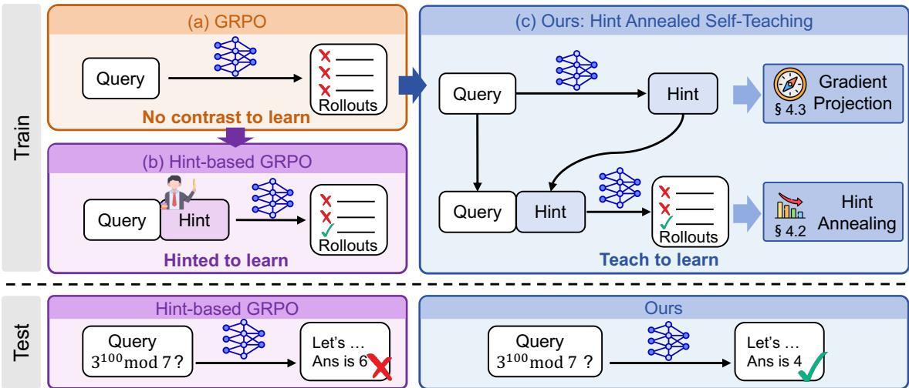  
Figure 1: Comparison between GRPO, hint-based GRPO, and ours. (a) GRPO receives no grouprelative learning signal for hard queries with all-incorrect rollouts. (b) Hint-based GRPO restores learning signal by re-solving under a hint, yielding strong improvement during training but limited improvement during testing. (c) Ours learns from generating and using its own hints, while gradually shifting training toward the original solving ability without hints.

Our analysis reveals that reward contrast recovered under hints can make the shared update favor hinted trajectories over the original-query trajectories used at evaluation. When original rollouts provide no reward contrast, hinted re-solving can recover learning signal, but the resulting updates directly optimize solving under hints. As examined in Section 3, hinted and original solving can induce substantially different gradient directions, even when both conditions yield reward contrast. Sustained hinted feedback can therefore continue to optimize solving under hints without producing corresponding gains on the original query. We call this phenomenon hinted reward shift. Hint-based RL must therefore not only recover learning signal from failed queries, but also prevent the shared update from favoring solving with hints over original-query solving.

To address this challenge, we propose HATCH (Hint-Annealed Self-Teaching), which frames selfimprovement as a teach-to-learn process: the policy uses self-generated hints to turn its own failures into learnable re-solves, and learns from both the resulting solutions and the effectiveness of its teaching (Figure 1). Meanwhile, hints should serve as an annealing assistance: hinted-solve feedback is most valuable while unassisted rollouts provide little reward contrast and should recede as original solving improves. We realize this annealing through data-driven online weighting. Yet hint-generation serves a distinct reasoning role from solving, so the gradient signals need not point in the same direction. We address this conflict through gradient projection, removing the hint-generation component that opposes solution updates. Together, these designs enable the policy to guide its own learning toward sustained self-improvement in unassisted reasoning. Our contributions are:

• We discover that learning signal recovered under hints can favor hinted solving. We term this hinted reward shift, revealing a trade-off between early gains from hint recovery and sustained improvement on original query solving.

• We propose an online self-teaching framework that jointly learns hint generation and query solving with two components: online weighting to regulate the contribution of hinted trajectories and gradient projection to coordinate hint-generation learning with query solving.

• We evaluate our method across nine mathematical reasoning benchmarks and deliver consistent accuracy gains over state-of-the-art methods across three model scales: 1.02 pp on Llama-3.2- 1B-Instruct, 2.84 pp on Qwen3-1.7B, and 4.32 pp on Qwen3-8B.

## 2 Related Work

RL Signal Utilization. GRPO derives learning signal from within-group reward contrast, while difficult queries yielding only incorrect rollouts provide no relative preference signal. To make better use of existing learning signal under the original rollout condition, prior work acts in three complementary ways. Sampling methods assign heterogeneous rollout budgets across prompts or predict prompt difficulty to prioritize those likely to yield informative gradients (Li et al., 2026b; Qu et al., 2025). Filtering and signal-shaping methods retain groups at appropriate difficulty, skip prompts predicted to be uninformative, down-sample redundant rollouts, or construct advantages for zero-variance groups (Bae et al., 2026; Zheng et al., 2025; Yu et al., 2025; Xu et al., 2025; Le et al., 2026). Curriculum methods schedule tasks from easy to hard or adapt the task mixture according to the policy’s evolving learning progress (Bengio et $\mathsf { a l . , }$ 2009; Chen et al., 2025; Parashar et $\mathsf { a l . } ,$ 2026). Together, these approaches improve the allocation of computation and updates under the original rollout condition. They are complementary to our work, which uses solution-derived hints to recover learning signal from queries that remain uninformative under original rollouts.

Hint-Based Signal Recovery. On the other hand, hint-based RL recovers learning signal from difficult queries by re-solving them under auxiliary contexts. One line of work explores auxiliary contexts that make difficult queries more accessible through partial solutions, tiered scaffolds, stepwise reasoning prefixes, or selected knowledge guidance (Li et al., 2026a; Zhang et al., 2026b;a; Yu et al., 2026). Another form of such auxiliary context guides exploration closer to successful reasoning paths through oracle prefixes or expert-anchored rollouts (Qu et al., 2026; Zhang et al., 2025). A second line studies how useful hints can be generated and maintained during training through self-generated abstractions, privileged solution-derived hints, or learned hinters conditioned on current policy failures (Chen et al., 2026; Liao et al., 2026; Xia et al., 2026). Within this direction, external guidance can further be kept compatible with online policy updates through abstract meta-hints and affinity-aware optimization (Wang et al., 2026). Together, these methods establish how auxiliary contexts can recover reward contrast and how useful hints can be produced. However, effective hints can still induce auxiliary updates that favor hinted solving over solving without hints. We instead study how learning to provide guidance can itself improve a policy’s unassisted reasoning.

## 3 Observation

## 3.1 Preliminaries

GRPO and Hint-Based Optimization. Given verifiable outcome rewards, GRPO samples G responses $\{ y _ { i , k } \} _ { k = 1 } ^ { G }$ for each query $q _ { i } \in B _ { t }$ at each update step t, where i indexes individual queries and k indexes sampled responses within each query group. The verifier V assigns each response the outcome reward $R _ { i , k } = \stackrel { \bullet } { V } ( q _ { i } , y _ { i , k } )$ . GRPO then computes the group-relative advantage

$$
A _ { i , k } = \frac { R _ { i , k } - \frac { 1 } { G } \sum _ { k ^ { \prime } = 1 } ^ { G } R _ { i , k ^ { \prime } } } { { \sf S t d } \left( \{ R _ { i , k ^ { \prime } } \} _ { k ^ { \prime } = 1 } ^ { G } \right) + \epsilon } .\tag{1}
$$

This advantage is assigned to the tokens of $y _ { i , k }$ . GRPO minimizes the standard clipped objective

$$
\mathcal { L } _ { \mathrm { G R P O } } ( \boldsymbol { \theta } ) = - \mathbb { E } _ { q _ { i } \sim \mathcal { B } _ { t } } \left[ \frac { 1 } { G } \sum _ { k = 1 } ^ { G } \ell _ { \mathrm { c l i p } } ( y _ { i , k } , A _ { i , k } ) \right] ,\tag{2}
$$

where $\ell _ { \mathrm { c l i p } }$ denotes the standard clipped surrogate (Schulman et al., 2017) for each sampled response. We define query groups with zero, some, or all correct rollouts as solve-none, solve-partial, or solve-all, denoted by $B _ { t } ^ { \mathrm { n o n e } } , B _ { t } ^ { \mathrm { p a r t i a l } }$ , and $B _ { t } ^ { \mathrm { a l l } }$ , respectively. Hint-based methods re-solve queries in $B _ { t } ^ { \mathrm { n o n e } }$ under generated hints to recover reward contrast. Let Y and $\mathcal { V } ^ { h }$ denote original and hinted trajectories with advantages $A ^ { \mathrm { o r i g } }$ and $A ^ { \mathrm { h i n t e d } }$ . Applying the GRPO objective in Eq. (2) we have

$$
\begin{array} { r } { \mathcal { L } _ { \mathrm { h i n t - b a s e d } } ( \theta ) = \underbrace { \mathcal { L } _ { \mathrm { G R P O } } \Big ( \mathcal { V } , A ^ { \mathrm { o r i g } } ; \theta \Big ) } _ { \mathcal { L } _ { \mathrm { s o l v e } } } + \underbrace { \mathcal { L } _ { \mathrm { G R P O } } \Big ( \mathcal { V } ^ { h } , A ^ { \mathrm { h i n t e d } } ; \theta \Big ) } _ { \mathcal { L } _ { \mathrm { h i n t e d - s o l v e } } } . } \end{array}\tag{3}
$$

Existing work has primarily focused on how to construct effective hints: by generating compact abstractions from solution, revealing privileged intermediate reasoning, or training a separate

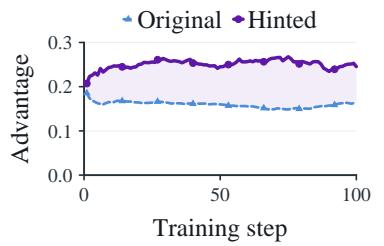

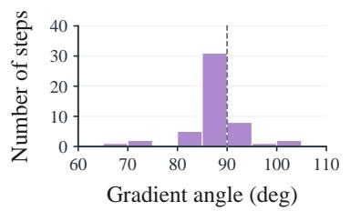

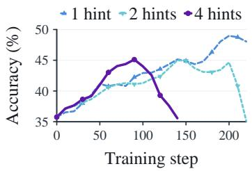  
Figure 2: Evidence of hinted reward shift on Qwen3-8B. (a) Left: Mean absolute advantages of original and hinted trajectories. (b) Middle: Gradient-angle distribution between original and hinted solving over steps 1–50. (c) Right: Original-query accuracy with different numbers of hints.

hinter to produce guidance for a subsequent attempt (Chen et al., 2026; Liao et al., 2026; Xia et al., 2026).

## 3.2 Hinted Trade-off Problem

Hint-Assisted Contrast Recovery Leads to Reward Shift. Figure 2(a–b) examines the learning signals of the two objectives in Eq. (3) through their mean absolute advantages and gradient directions. Over training, hinted-solve trajectories retain mean absolute advantages comparable to or larger than those of original-solve trajectories, while the two objectives often produce nearly orthogonal gradients. Such advantage comparison reflects an asymmetry: queries in $B _ { t } ^ { \mathrm { n o n e } }$ provide no group-relative learning signal through original rollouts, while re-solving them under hints can constantly recover reward contrast. Because this recovered signal directly optimizes solving under hints, its sustained contribution can favor $\mathcal { L } _ { \mathrm { h i n t e d - s o l v e } }$ over $\mathcal { L } _ { \mathrm { s o l v e } }$ in policy optimization. We call this tendency for learning signal to concentrate on hinted solving hinted reward shift. These observations suggest that sustained reward contrast under hints can lead to favoring hinted solving without ensuring corresponding gains on the original query.

Trade-off Between Early Gains and Hinted Reward Shift. Given this shift, we examine how policy improvement and the shift evolve under stronger hinted learning signals. To this end, we increase the number of hints per failed query, adding more hinted-solve groups to $\mathcal { L } _ { \mathrm { h i n t e d - s o l v e } } .$ Figure 2(c) shows that multiple hints yield faster early accuracy gains but subsequently deteriorate, whereas the single-hint setting continues to improve at a slower pace. This reflects the changing availability of learning signal from original rollouts: when $B _ { t } ^ { \mathrm { n o n e } }$ is large, hinted-solve groups turn zero-signal queries into informative comparisons; but their continued influence may limit later improvement as original learning signal emerges. Therefore, hinted trajectories should contribute most when many queries lack learning signal and recede as that signal emerges, allowing the model to retain its early gains. This observation suggests a trade-off between faster early gains and sustained original-query improvement, consistent with hinted reward shift. An effective method should therefore fully exploit the learning potential of hinted trajectories while keeping the ability to solve without hints.

## 4 Method

To address the challenge in Section 3, we propose HATCH (Hint-Annealed Self-Teaching), an online single-policy framework (Figure 3). It constructs hint-generation and hinted-solving objectives from initially failed queries in Section 4.1, regulates the contribution of hinted trajectories through online weighting in Section 4.2, and uses gradient projection to address role divergence in Section 4.3.

## 4.1 Online self-hinting for valuable trajectories

Section 3 shows the potential of additional hinted trajectories to improve policy learning. To continually generate more useful hints, we jointly train hint generation and query solving within one policy, using re-solving outcomes to supervise hint generation. This introduces $\breve { \mathscr { L } } _ { \mathrm { h i n t - g e n } }$ alongside $\mathcal { L } _ { \mathrm { s o l v e } }$ and $\mathcal { L } _ { \mathrm { h i n t e d - s o l v e } }$ in Eq. (3). Specifically, for each query $q _ { i } \in B _ { t } ^ { \mathrm { n o n e } }$ , we condition the policy on its reference solution $z _ { i }$ to sample M hints as

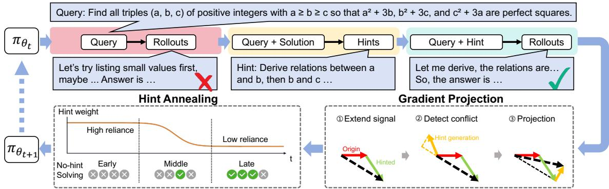  
Figure 3: Overview of our method. For solve-none queries, it first self-generates hints from solutions and then re-solves the query with the hints, yielding three complementary training trajectories: native solving, hint generation, and hinted solving. Online weighting adaptively controls the contribution of hinted-solving feedback, while gradient projection removes conflicting components from hint-generation updates. The resulting signals are jointly used to update a single shared policy.

$$
h _ { i , j } \sim \pi _ { t } ( \cdot \mid P _ { \mathrm { h i n t } } ( q _ { i } , z _ { i } ) ) , \qquad j = 1 , \ldots , M .\tag{4}
$$

To evaluate each hint through its effect on solving, we append $h _ { i , j }$ to $q _ { i }$ and sample $G$ re-solves $\{ y _ { i , j , k } ^ { h } \} _ { k = 1 } ^ { G }$ from the same policy. We score these responses and compute $A _ { i , j , k } ^ { \mathrm { h i n t e d } }$ within each hinted-solve group using Eq. (1). The same outcomes also supervise hint generation through the reward

$$
R _ { i , j } ^ { \mathrm { h i n t - g e n } } = \mathcal { R } _ { \mathrm { h i n t } } \big ( \Delta \mathrm { P a s s } _ { i , j } , \Delta \log p _ { i , j } \big ) .\tag{5}
$$

Here, $\Delta \mathrm { P a s s } _ { i , j }$ measures the rollout accuracy gain, and ∆ log $p _ { i , j }$ measures the log-probability difference of the successful trajectory under the hinted and original conditions (Xia et al., 2026). Applying Eq. (1) across the M hint rewards yields $A _ { i , j } ^ { \mathrm { h i n t - g e n } }$ . Using these advantages to optimize the hint-generation trajectories with Eq. (2) defines $\dot { \mathcal { L } } _ { \mathrm { h i n t - g e n } }$ . We retain all M hinted-solve groups rather than selecting one. Let $T _ { O } , T _ { S } ,$ , and $T _ { H }$ denote the numbers of active response tokens in original solving, hinted solving, and hint generation, respectively, with $T _ { F } = T _ { O } \dot { + } T _ { S } + T _ { H }$ . Each loss is averaged over the active response tokens of its own trajectory. The joint objective is

$$
\mathcal { L } _ { \mathrm { j o i n t } } = \frac { T _ { O } } { T _ { F } } \mathcal { L } _ { \mathrm { s o l v e } } + \frac { T _ { S } } { T _ { F } } \mathcal { L } _ { \mathrm { h i n t e d - s o l v e } } + \frac { T _ { H } } { T _ { F } } \mathcal { L } _ { \mathrm { h i n t - g e n } } .\tag{6}
$$

As the policy learns to solve queries, its re-solving outcomes also refine the hints it generates for its remaining failures. The following subsections regulate the contribution of hinted trajectories and the direction of hint-generation updates so that both support learning to solve the original queries.

## 4.2 Online Weighting of Hinted Trajectories

To mitigate hinted reward shift in the joint training of Section 4.1, we adjust the contribution of $\mathcal { L } _ { \mathrm { h i n t e d - s o l v e } }$ according to the learning signal available from original rollouts. The relative proportions of unsolved groups and groups with reward contrast indicate how much training can rely on original rollouts. Let $\rho _ { \mathrm { n o n e } } ^ { ( t ) }$ and $\rho _ { \mathrm { p a r t i a l } } ^ { ( t ) }$ denote $| B _ { t } ^ { \mathrm { n o n e } } | / | B _ { t } |$ and $\vert B _ { t } ^ { \mathrm { p a r t i a l } } \vert / \vert B _ { t } \vert$ , respectively. We smooth these proportions with Exponential Moving Averages (EMA) to determine the weight $\beta _ { t }$ as

$$
p _ { t } = \frac { \mathrm { E M A } ( \rho _ { \mathrm { n o n e } } ^ { ( t ) } ) } { \mathrm { E M A } ( \rho _ { \mathrm { n o n e } } ^ { ( t ) } ) + \mathrm { E M A } ( \rho _ { \mathrm { p a r t i a l } } ^ { ( t ) } ) + \epsilon } , \qquad \beta _ { t } = \mathrm { c l i p } \big ( \kappa p _ { t } ^ { \gamma } , 0 , 1 \big ) .\tag{7}
$$

As the balance shifts from $B _ { t } ^ { \mathrm { n o n e } }$ toward $B _ { t } ^ { \mathsf { p a r t i a l } } , \beta _ { t }$ decreases, reducing reliance on hinted trajectories as original reward contrast emerges. The scale κ controls the overall strength, while $\gamma$ controls how sharply the weight decreases. We apply $\beta _ { t }$ only to hinted-solve advantages as

$$
\widetilde { A } _ { i , j , k } ^ { \mathrm { h i n t e d } } = \beta _ { t } A _ { i , j , k } ^ { \mathrm { h i n t e d } } .\tag{8}
$$

Online weighting thus mitigates hinted reward shift by letting hinted trajectories supplement learning when original reward contrast is scarce, while reducing their contribution as that contrast emerges. Still, the direction of hint-generation updates requires separate treatment.

## 4.3 Gradient Projection for Hint Generation

Although hint generation is rewarded by re-solving outcomes, its updates need not support query solving within the shared policy. Figure 4 shows that the angle between hint-generation gradient and the combined gradient from original-solve and weighted hinted-solve trajectories fluctuates around $9 0 ^ { \circ }$ and frequently exceeds $\mathrm { i t } , \mathrm { \ ' }$ indicating a learning divergence. We therefore use gradient projection to make hint-generation updates compatible with the update induced by solution trajectories.

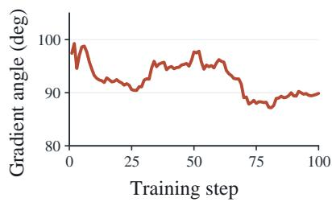

Let ${ \mathcal { L } } _ { \mathrm { f u l l } }$ denote the joint loss of all three objectives after applying Eq. (8). We then compute its full gradient and the hint-generation gradient separately as

Figure 4: Angle between the hint-generation gradient and the solution-side gradient.

$$
g _ { F } = \nabla _ { \theta } { \mathcal { L } } _ { \mathrm { f u l l } } , \qquad g _ { H } = \nabla _ { \theta } { \mathcal { L } } _ { \mathrm { h i n t - g e n } } .\tag{9}
$$

Since $g _ { H }$ is normalized over hint-generation tokens alone, its contribution to the full gradient across all three objectives is scaled by $T _ { H } / T _ { F }$ as

$$
g _ { H } ^ { \prime } = { \frac { T _ { H } } { T _ { F } } } g _ { H } , \qquad g _ { P } = g _ { F } - g _ { H } ^ { \prime } .\tag{10}
$$

Here $, g _ { P }$ combines the gradients from the solution side trajectories as the reference direction. When $\langle g _ { H } ^ { \prime } , g _ { P } \rangle$ is nonnegative, hint-generation learning does not oppose the solution-side update and is retained unchanged. Otherwise, we remove only its component opposite to $g _ { P }$ as

$$
g _ { \mathrm { u p d a t e } } = g _ { P } + \left\{ \begin{array} { l l } { g _ { H } ^ { \prime } - \displaystyle \frac { \left. g _ { H } ^ { \prime } , g _ { P } \right. } { \| g _ { P } \| _ { 2 } ^ { 2 } + \epsilon } g _ { P } , } & { \langle g _ { H } ^ { \prime } , g _ { P } \rangle < 0 , } \\ { g _ { H } ^ { \prime } , } & { \mathrm { o t h e r w i s e } . } \end{array} \right.\tag{11}
$$

The projection preserves $g _ { P }$ and the non-opposing component of hint-generation learning. This allows the policy to learn useful hints without counteracting the update from solution trajectories.

## 4.4 Hint Annealed Self Teaching

Having specified online weighting and gradient projection, we now combine the three objectives in a single policy update. Let Lehinted-solve denote the hinted-solve loss evaluated with the weighted advantages $\widetilde { A } ^ { \mathrm { h i n t e d } }$ from $\operatorname { E q . } \left( 8 \right)$ . The joint loss before gradient projection is

$$
\mathcal { L } _ { \mathrm { f u l l } } ( \theta ) = \frac { T _ { O } } { T _ { F } } \mathcal { L } _ { \mathrm { s o l v e } } + \frac { T _ { S } } { T _ { F } } \widetilde { \mathcal { L } } _ { \mathrm { h i n t e d - s o l v e } } + \frac { T _ { H } } { T _ { F } } \mathcal { L } _ { \mathrm { h i n t - g e n } } .\tag{12}
$$

Algorithm 1 Hint-Annealed Self-Teaching   
1: Input: rollout policy $\pi _ { t } ,$ training batch $\left\{ \left( q _ { i } , z _ { i } \right) \right\}$   
2: Sample G original-solve responses for each $q _ { i } ;$ compute $R _ { i , k } , A _ { i , k } ^ { \mathrm { o r i g } } ,$ , and $B _ { t } ^ { \mathrm { n o n e } }$   
3: for each $q _ { i } \in B _ { t } ^ { \mathrm { n o n e } }$ do   
4: Sample M hints $h _ { i , j }$ conditioned on $q _ { i } , z _ { i }$   
5: For each hint, sample G hinted-solve responses   
6: Compute $A _ { i , j , k } ^ { \mathrm { h i n t e d } }$ and $A _ { i , j } ^ { \mathrm { h i n t - g e n } }$ from the re-solve outcomes   
7: end for   
8: Compute $\beta _ { t }$ using Eq. (7) and obtain $\widetilde { A } _ { i , j , k } ^ { \mathrm { h i n t e d } }$ using Eq. (8)   
9: Form ${ \mathcal { L } } _ { \mathrm { f u l l } }$ , compute $g _ { F } , g _ { H } , g _ { H } ^ { \prime } , g _ { P } ,$ , and obtain gupdate using Eq. (11)   
10: Update $\theta _ { t + 1 } \gets \mathrm { O p t i m i z e r } ( \theta _ { t } , g _ { \mathrm { u p d a t e } } )$

Table 1: Per-dataset no-hint accuracy (%) for the initial models and each trained method. Bold marks the best result and underlining marks the second-best distinct result with ties retained.
<table><tr><td>Method</td><td>Math500</td><td>Minerva</td><td> $\mathrm { O l y . }$ </td><td>AIME24/25/26</td><td>AMC23</td><td>HMMT25</td><td>BRUMO25</td><td>Avg.</td></tr><tr><td>Llama-3.2-1B-Instruct</td><td>24.04</td><td>4.41</td><td>4.71</td><td>1.11/0.00/0.00</td><td>5.00</td><td>0.00</td><td>1.11</td><td>4.49</td></tr><tr><td>+ GRPO</td><td>25.45</td><td>5.02</td><td>4.71</td><td>2.22/1.11/1.11</td><td>6.67</td><td>1.11</td><td>1.11</td><td>5.39</td></tr><tr><td>+ QuESTA</td><td>26.92</td><td>6.13</td><td>5.21</td><td>2.22/1.11/1.11</td><td>7.50</td><td>2.22</td><td>2.22</td><td>6.07</td></tr><tr><td>+ HiLL</td><td>26.12</td><td>5.63</td><td>4.96</td><td>1.11/2.22/1.11</td><td>8.33</td><td>0.00</td><td>2.22</td><td>5.74</td></tr><tr><td>+ HATCH (ours)</td><td>27.38</td><td>6.62</td><td>5.65</td><td>2.22/2.22/3.33</td><td>10.83</td><td>2.22</td><td>3.33</td><td>7.09</td></tr><tr><td>Qwen3-1.7B</td><td>79.76</td><td>52.57</td><td>48.66</td><td>16.67/16.67/10.00</td><td>42.50</td><td>6.67</td><td>16.67</td><td>32.24</td></tr><tr><td>+ GRPO</td><td>82.57</td><td>54.41</td><td>49.80</td><td>17.78/21.11/16.67</td><td>50.00</td><td>8.89</td><td>26.67</td><td>36.43</td></tr><tr><td>+ QuESTA</td><td>83.17</td><td>54.29</td><td>51.49</td><td>21.11/18.89/17.78</td><td>54.17</td><td>10.00</td><td>22.22</td><td>37.01</td></tr><tr><td>+ HiLL</td><td>83.23</td><td>53.68</td><td>50.79</td><td>20.00/22.22/17.78</td><td>53.33</td><td>11.11</td><td>22.22</td><td>37.15</td></tr><tr><td>+ HATCH (ours)</td><td>83.97</td><td>55.02</td><td>51.49</td><td>23.33/25.56/18.89</td><td>58.33</td><td>14.44</td><td>28.89</td><td>39.99</td></tr><tr><td>Qwen3-8B</td><td>83.57</td><td>57.72</td><td>48.36</td><td>26.67/20.00/20.00</td><td>62.50</td><td>6.67</td><td>16.67</td><td>38.02</td></tr><tr><td>+ GRPO</td><td>86.37</td><td>59.07</td><td>55.26</td><td>37.78/31.11/31.11</td><td>74.17</td><td>16.67</td><td>36.67</td><td>47.58</td></tr><tr><td>+ QuESTA</td><td>87.84</td><td>61.76</td><td>58.38</td><td>47.78/32.22/32.22</td><td>72.50</td><td>10.00</td><td>38.89</td><td>49.07</td></tr><tr><td>+ HiLL</td><td>88.58</td><td>58.33</td><td>58.09</td><td>41.11/34.44/31.11</td><td>73.33</td><td>16.67</td><td>43.33</td><td>49.44</td></tr><tr><td>+ HATCH (ours)</td><td>90.71</td><td>63.11</td><td>60.27</td><td>52.22/38.89/35.56</td><td>80.83</td><td>17.78</td><td>44.44</td><td>53.76</td></tr></table>

We apply Eq. (11) to the hint-generation component of $\nabla _ { \boldsymbol { \theta } } \mathcal { L } _ { \mathrm { f u l l } }$ and use the resulting $g _ { \mathrm { u p d a t e } }$ to update the policy. Algorithm 1 summarizes one training update. At inference, the policy receives only the original query, without hints or reference solutions.

## 5 Experiments

## 5.1 Experimental Setup

Training settings. We train Llama-3.2-1B-Instruct (Meta, 2024), Qwen3-1.7B (Team et al., 2025), and Qwen3-8B (Team et al., 2025). Within each model scale, all methods are initialized from the same pretrained checkpoint. We sample 10,000 problems from NuminaMath (LI et al., 2024), spliting into 9,800 training and 200 validation set. Training uses VERL framework (Sheng et al., 2024), with Megatron (Shoeybi et al., 2019) backend for distributed policy optimization and vLLM (Kwon et al., 2023) for asynchronous rollout generation. We use GRPO with G = 8 rollouts per query. For each solve-none query, our method generates M = 4 hints from the current policy and samples G = 8 hinted re-solves under each hint. The maximum prompt and generation lengths are 4,096 and 8,192 tokens, respectively. Solving rollouts use temperature 0.85 and $\mathrm { t o p } \cdot p = \bar { 1 . 0 } ,$ , while hint generation uses temperature 0.3 and top- $\cdot p = 0 . 9 5 .$ . We use a batch size of 128 and optimize the policy with Adam (Kingma & Ba, 2014) using a learning rate of $1 \times 1 0 ^ { - 6 } , \mathrm { } \mathrm { } \mathrm { } \mathrm { } \mathrm { } \mathrm { } \mathrm { }$ -step warmup and a KL penalty of 0.01. Experiments are conducted on 4 nodes with 8 NVIDIA H20 GPUs each.

Baselines. Rows labeled with model names in Table 1 report initial accuracy. GRPO (Shao et al., 2024) directly optimizes the original queries using group-relative advantages. QuESTA (Li et al., 2026a) is reimplemented following its two-stage curriculum, which gradually reduces the amount of solution guidance. For a matched online comparison, HiLL (Xia et al., 2026) learns utility-scored hints and trains on the best hint. Ours uses the hint annealed self-teaching described in Section 4.

Evaluation settings. For each run, we select the checkpoint with the highest no-hint validation accuracy and report its no-hint accuracy on nine benchmarks. We report pass@1, averaged over three independent runs with different random seeds in Table 1. The sample standard deviation over the three runs is at most 0.8 pp. We evaluate on Math500 (Lightman et al., 2024), Minerva Math (Lewkowycz et al., 2022), OlympiadBench (He et al., 2024), AIME 2024–2026 (Zhang & Math-AI, 2024; 2025; 2026), AMC 2023 (Art of Problem Solving), HMMT 2025 (Dekoninck et al., 2026), and BRUMO 2025 (Dekoninck et al., 2026). Among these benchmarks, HMMT 2025 and BRUMO 2025 provide additional tests of generalization across competition-specific problem sets.

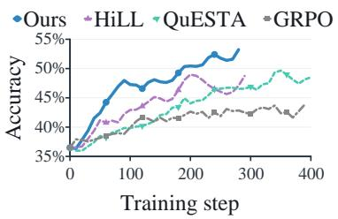

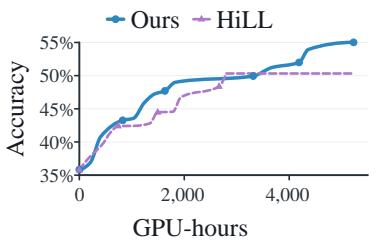

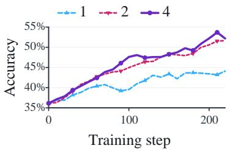  
Figure 5: Left: average benchmark accuracy over training updates. Middle: best-so-far no-hint benchmark accuracy against cumulative GPU-hours for the two online methods. Right: accuracy of training by our method with single-, two-, and four retained hinted-solve groups.

## 5.2 Main Results

Table 1 reports original-query pass@1 across three model scales. Our method achieves the highest macro average at every scale, improving over GRPO by 1.70 pp on Llama-3.2-1B-Instruct, 3.56 pp on Qwen3-1.7B, and 6.18 pp on Qwen3-8B. It also outperforms both hint-based baselines at all three scales. The improvement is broad rather than concentrated on a single benchmark: on Qwen3-8B, our method obtains the best score on every benchmark in the evaluation suite, including HMMT 2025 and BRUMO 2025, which assess generalization across different competition-specific problem distributions. These results show that the recovered trajectories improve the policy’s ability to solve the original queries, rather than merely improving performance under hinted inputs.

Figure 5 traces how the endpoint gains emerge during training and how they depend on the number of retained hinted-solve groups on Qwen3-8B. In the left panel, our method surpasses 50% accuracy by around step 200 and reaches approximately 53% near step 280, whereas HiLL, QuESTA, and GRPO remain below 49%. The middle panel provides the corresponding compute view: up to approximately 49% best-so-far accuracy, our method reaches each level with lower cumulative GPU-hours than HiLL. The right panel reports the trajectory-count ablation: by step 220, the two- and four-group settings reach approximately 51% accuracy, whereas the single-group setting remains near 44%. Together, these dynamics show that our method achieves stronger no-hint learning while making effective use of the additional trajectories recovered under hints.

## 5.3 Further Analysis

Improvement from single policy joint training. To assess the value of jointly learning hint generation and query solving, we compare our method with three variants in Table 2. The Offline Hints and External Hints variants use fixed hints generated offline by Qwen3-8B and Qwen3-30B-A3B, respectively. These variants achieve 48.07% and 48.80%, suggesting that a larger external hinter alone does not reproduce the gains from joint learning. To isolate the benefit of learning hint construction, Online Hints retains current-policy hints but removes ${ \mathcal { L } } _ { \mathrm { h i n t - g e n } } .$ It achieves 50.16%, 3.60 pp below ours. Together, these results support learning from hint construction, beyond using hints solely as auxiliary inputs.

Table 2: Ablation results on Qwen3-8B.
<table><tr><td>Variant</td><td>Acc. (%)</td></tr><tr><td>HATCH (ours)</td><td>53.76</td></tr><tr><td>Offline Hints</td><td>48.07</td></tr><tr><td>External Hints</td><td>48.80</td></tr><tr><td>Online Hints</td><td>50.16</td></tr><tr><td>Fixed Weighting</td><td>44.96</td></tr><tr><td>Linear Decay</td><td>48.25</td></tr><tr><td>Staged Exp. Decay</td><td>51.25</td></tr><tr><td>No Projection</td><td>51.93</td></tr><tr><td>Reverse Projection</td><td>49.24</td></tr></table>

Hinted Reward Shift Correction by Online Weighting. We compare data-driven hint annealing with fixed weighting and two predefined decay schedules in Table 2. Fixed weighting reduces accuracy to 44.96%. Linear decay and staged exponential decay achieve 48.25% and 51.25%. These results support the effectiveness of data-driven hint annealing relative to the fixed weighting and predefined decay schedules. The middle panel of Figure 6 shows how online weighting reduces hinted-solve contributions as original reward contrast emerges. The right panel shows that $\gamma = 5$ best balances this trade-off: annealing too quickly weakens useful early feedback, whereas annealing too slowly sustains hinted reward shift. Together, these results support hint annealing as a way to exploit assistance early without allowing it to dominate once original rollouts become informative.

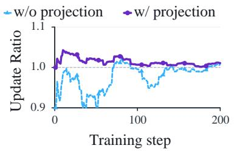

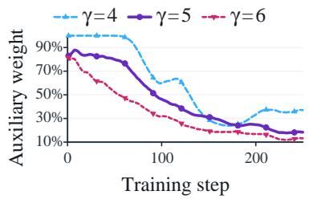

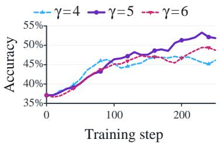  
Figure 6: Ablation dynamics on Qwen3-8B. Left: relative strength in the solution direction in the final shared update gradient. Middle: auxiliary-weight schedules induced by the three γ settings. Right: the corresponding nine-benchmark accuracy curves of each selected γ.

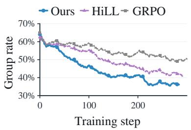

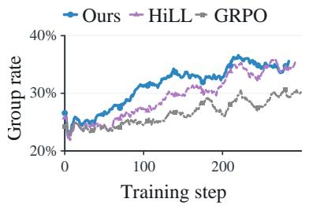

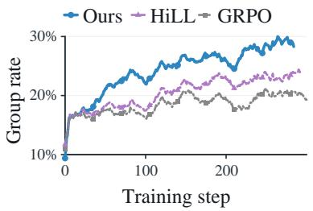  
Figure 7: No-hint group-state dynamics across Ours, HiLL, and GRPO on Qwen3-8B. Ours progressively converts solve-none groups into solve-partial and solve-all groups, indicating stronger unassisted solving. From left to right panels are: solve-none, solve-partial and solve-all groups.

Beneficial hint learning with gradient projection. To examine whether gradient projection helps hint-generation learning improve query solving, we analyze its effect on solution-side updates and final accuracy. The left panel of Figure 6 shows that projection preserves the shared update in the solution direction, whereas the unprojected update is repeatedly weakened by the conflicting component. Correspondingly, Table 2 shows that removing projection reduces accuracy to 51.93%. Reverse projection, which retains only the opposing component, performs substantially worse at 49.24%. These results show that the gain comes from preserving directionally compatible hint-generation learning, rather than allowing it to counteract original-query solving.

Improved query solving. Recovered hinted trajectories should improve how the policy solves a query itself, rather than only its behavior after receiving a hint. To examine this, Figure 7 tracks the composition of rollout groups throughout training. Compared with other methods, our method reduces the fraction of solve-none groups more rapidly while increasing solve-partial and solve-all groups. This shows that we better improve solving behavior beyond the hinted condition.

## 5.4 Limitations and Future Work

First, our evaluation focuses on mathematical reasoning with verifiable rewards and reference. In interactive tasks such as tool use, new observations can change the guidance needed at each step. Extending HATCH to such tasks therefore requires verification and reference suited to the context. Second, our experiments use only textual inputs and hints. Future work could explore multimodal self-teaching by incorporating visual evidence into hint construction and subsequent reasoning.

## 6 Conclusion

We discover hinted reward shift, where recovered signal can favor hinted solving without corresponding gains without hints. To address this, we propose HATCH (Hint-Annealed Self-Teaching), which jointly learns hint generation and query solving within one policy, using online weighting and gradient projection to regulate the strength and direction of auxiliary learning. Experiments across three model scales show stronger unassisted mathematical reasoning and suggest that models can improve their reasoning by learning to provide effective guidance for themselves.

## Full Author List

Zile Wang, Zijian Li, Haodong Wang, Jian Liu, Qianli Liu, Lucas Muli, Blaze Chen, Song Guo

## References

Art of Problem Solving. Amc problems and solutions. https://artofproblemsolving.com/wiki/i ndex.php?title=AMC Problems and Solutions.

Sanghwan Bae, Jiwoo Hong, Min Young Lee, Hanbyul Kim, JeongYeon Nam, and Donghyun Kwak. Online difficulty filtering for reasoning oriented reinforcement learning. In Proceedings of the 19th Conference of the European Chapter of the Associationfor Computational Linguistics (Volume 1: Long Papers), pp. 700–719, 2026.

Yoshua Bengio, Jer´ ome Louradour, Ronan Collobert, and Jason Weston. Curriculum learning. In ˆ Proceedings of the 26th annual international conference on machine learning, pp. 41–48, 2009.

Justin Chih-Yao Chen, Becky Xiangyu Peng, Prafulla Kumar Choubey, Kung-Hsiang Huang, Jiaxin Zhang, Mohit Bansal, and Chien-Sheng Wu. Nudging the boundaries of llm reasoning. In The Fourteenth International Conference on Learning Representations, 2026.

Xiaoyin Chen, Jiarui Lu, Minsu Kim, Dinghuai Zhang, Jian Tang, Alexandre Piche, Nicolas Gontier,´ Yoshua Bengio, and Ehsan Kamalloo. Self-evolving curriculum for llm reasoning. arXiv preprint arXiv:2505.14970, 2025.

Jasper Dekoninck, Nikola Jovanovic, Tim Gehrunger, K ´ ari R ´ ognvaldsson, Ivo Petrov, Chenhao Sun,¨ and Martin Vechev. Beyond benchmarks: Matharena as an evaluation platform for mathematics with llms. arXiv preprint arXiv:2605.00674, 2026.

Chaoqun He, Renjie Luo, Yuzhuo Bai, Shengding Hu, Zhen Thai, Junhao Shen, Jinyi Hu, Xu Han, Yujie Huang, Yuxiang Zhang, et al. Olympiadbench: A challenging benchmark for promoting agi with olympiad-level bilingual multimodal scientific problems. In Proceedings of the 62nd Annual Meeting of the Association for Computational Linguistics (Volume 1: Long Papers), pp. 3828–3850, 2024.

Diederik P Kingma and Jimmy Ba. Adam: A method for stochastic optimization. arXiv preprint arXiv:1412.6980, 2014.

Woosuk Kwon, Zhuohan Li, Siyuan Zhuang, Ying Sheng, Lianmin Zheng, Cody Hao Yu, Joseph E. Gonzalez, Hao Zhang, and Ion Stoica. Efficient memory management for large language model serving with pagedattention. In Proceedings of the ACM SIGOPS 29th Symposium on Operating Systems Principles, 2023.

Thanh-Long V Le, Myeongho Jeon, Kim Vu, Viet Lai, and Eunho Yang. No prompt left behind: Exploiting zero-variance prompts in llm reinforcement learning via entropy-guided advantage shaping. In International Conference on Learning Representations, volume 2026, pp. 121956–121982, 2026.

Aitor Lewkowycz, Anders Andreassen, David Dohan, Ethan Dyer, Henryk Michalewski, Vinay Ramasesh, Ambrose Slone, Cem Anil, Imanol Schlag, Theo Gutman-Solo, Yuhuai Wu, Behnam Neyshabur, Guy Gur-Ari, and Vedant Misra. Solving quantitative reasoning problems with language models. In Advances in Neural Information Processing Systems, volume 35, pp. 3843–3857, 2022.

Jia LI, Edward Beeching, Lewis Tunstall, Ben Lipkin, Roman Soletskyi, Shengyi Costa Huang, Kashif Rasul, Longhui Yu, Albert Jiang, Ziju Shen, Zihan Qin, Bin Dong, Li Zhou, Yann Fleureau, Guillaume Lample, and Stanislas Polu. Numinamath. https://huggingface.co/datasets/AI-M O/NuminaMath-1.5, 2024.

Jiazheng Li, Hongzhou Lin, Hong Lu, Kaiyue Wen, Zaiwen Yang, Jiaxuan Gao, Yi Wu, and Jingzhao Zhang. Questa: Expanding reasoning capacity in llms via question augmentation. In The Fourteenth International Conference on Learning Representations, 2026a.

Ziniu Li, Congliang Chen, Tianyun Yang, Tian Ding, Ruoyu Sun, Ge Zhang, Wenhao Huang, and Zhi-Quan Luo. Knapsack RL: Compute-efficient reinforcement learning via heterogeneous rollout allocation. In Forty-third International Conference on Machine Learning, 2026b.

Baohao Liao, Hanze Dong, Xinxing Xu, Christof Monz, and Jiang Bian. Self-hinting language models enhance reinforcement learning. arXiv preprint arXiv:2602.03143, 2026.

Hunter Lightman, Vineet Kosaraju, Yuri Burda, Harrison Edwards, Bowen Baker, Teddy Lee, Jan Leike, John Schulman, Ilya Sutskever, and Karl Cobbe. Let’s verify step by step. In International Conference on Learning Representations, volume 2024, pp. 39578–39601, 2024.

AIa Meta. Llama 3.2: Revolutionizing edge ai and vision with open, customizable models. Meta AI Blog. Retrieved December, 20(2024), 2024.

Shubham Parashar, Shurui Gui, Xiner Li, Hongyi Ling, Sushil Vemuri, Blake Olson, Eric Li, Yu Zhang, James Caverlee, Dileep Kalathil, and Shuiwang Ji. Curriculum reinforcement learning from easy to hard tasks improves LLM reasoning. In The Fourteenth International Conference on Learning Representations, 2026.

Yuxiao Qu, Matthew YR Yang, Amrith Setlur, Lewis Tunstall, Edward Emanuel Beeching, Ruslan Salakhutdinov, and Aviral Kumar. Optimizing test-time compute via meta reinforcement finetuning. arXiv preprint arXiv:2503.07572, 2025.

Yuxiao Qu, Amrith Setlur, Virginia Smith, Ruslan Salakhutdinov, and Aviral Kumar. Pope: Learning to reason on hard problems via privileged on-policy exploration. arXiv preprint arXiv:2601.18779, 2026.

John Schulman, Filip Wolski, Prafulla Dhariwal, Alec Radford, and Oleg Klimov. Proximal policy optimization algorithms. arXiv preprint arXiv:1707.06347, 2017.

Zhihong Shao, Peiyi Wang, Qihao Zhu, Runxin Xu, Junxiao Song, Xiao Bi, Haowei Zhang, Mingchuan Zhang, YK Li, Yang Wu, et al. Deepseekmath: Pushing the limits of mathematical reasoning in open language models. arXiv preprint arXiv:2402.03300, 2024.

Guangming Sheng, Chi Zhang, Zilingfeng Ye, Xibin Wu, Wang Zhang, Ru Zhang, Yanghua Peng, Haibin Lin, and Chuan Wu. Hybridflow: A flexible and efficient rlhf framework. arXiv preprint arXiv: 2409.19256, 2024.

Mohammad Shoeybi, Mostofa Patwary, Raul Puri, Patrick LeGresley, Jared Casper, and Bryan Catanzaro. Megatron-lm: Training multi-billion parameter language models using model parallelism. arXiv preprint arXiv:1909.08053, 2019.

Qwen Team et al. Qwen3 technical report. arXiv preprint arXiv:2505.09388, 6(7):13, 2025.

Xinyi Wang, Jinyi Han, Zishang Jiang, Jiaqing Liang, Sihang Jiang, Zhaoqian Dai, Ma Shuguang, Fei Yu, Yanghua Xiao, et al. Don’t tell the answer, truly guide the reasoning during rl rollouts. In Findings ofthe Associationfor Computational Linguistics: ACL 2026, pp. 3437–3455, 2026.

Yu Xia, Canwen Xu, Zhewei Yao, Julian McAuley, and Yuxiong He. Learning to hint for reinforcement learning. arXiv preprint arXiv:2604.00698, 2026.

Yixuan Even Xu, Yash Savani, Fei Fang, and J Zico Kolter. Not all rollouts are useful: Downsampling rollouts in llm reinforcement learning. arXiv preprint arXiv:2504.13818, 2025.

Linhao Yu, Tianmeng Yang, Siyu Ding, Renren Jin, Naibin Gu, Xiangzhao Hao, Shuaiyi Nie, Deyi Xiong, Weichong Yin, Yu Sun, et al. Knowrl: Boosting llm reasoning via reinforcement learning with minimal-sufficient knowledge guidance. arXiv preprint arXiv:2604.12627, 2026.

Qiying Yu, Zheng Zhang, Ruofei Zhu, Yufeng Yuan, Xiaochen Zuo, Yu Yue, Weinan Dai, Tiantian Fan, Gaohong Liu, juncai liu, LingJun Liu, Xin Liu, Haibin Lin, Zhiqi Lin, Bole Ma, Guangming Sheng, Yuxuan Tong, Chi Zhang, Mofan Zhang, Ru Zhang, Wang Zhang, Hang Zhu, Jinhua Zhu, Jiaze Chen, Jiangjie Chen, Chengyi Wang, Hongli Yu, Yuxuan Song, Xiangpeng Wei, Hao Zhou, Jingjing Liu, Wei-Ying Ma, Ya-Qin Zhang, Lin Yan, Yonghui Wu, and Mingxuan Wang. Dapo: An open-source llm reinforcement learning system at scale. In Advances in Neural Information Processing Systems, volume 38, Main Conference, pp. 113222–113244, 2025.

Kaiyi Zhang, Ang Lv, Jinpeng Li, Yongbo Wang, Feng Wang, Haoyuan Hu, and Rui Yan. Stephint: Multi-level stepwise hints enhance reinforcement learning to reason. In Proceedings of the 64th Annual Meeting of the Association for Computational Linguistics (Volume 1: Long Papers), pp. 37846– 37864, 2026a.

Xichen Zhang, Sitong Wu, Yinghao Zhu, Haoru Tan, Shaozuo Yu, Ziyi He, and Jiaya Jia. Scaf-grpo: Scaffolded group relative policy optimization for enhancing llm reasoning. In International Conference on Learning Representations, volume 2026, pp. 131946–131974, 2026b.

Xuechen Zhang, Zijian Huang, Yingcong Li, Chenshun Ni, Jiasi Chen, and Samet Oymak. Bread: Branched rollouts from expert anchors bridge sft &amp; rl for reasoning. In Advances in Neural Information Processing Systems, volume 38, Main Conference, pp. 96726–96752, 2025.

Yifan Zhang and Team Math-AI. American invitational mathematics examination (aime) 2024, 2024.

Yifan Zhang and Team Math-AI. American invitational mathematics examination (aime) 2025, 2025.

Yifan Zhang and Team Math-AI. American invitational mathematics examination (aime) 2026, 2026.

Haizhong Zheng, Yang Zhou, Brian Bartoldson, Bhavya Kailkhura, Fan Lai, Jiawei Zhao, and Beidi Chen. Act only when it pays: Efficient reinforcement learning for llm reasoning via selective rollouts. In Advances in Neural Information Processing Systems, volume 38, Main Conference, pp. 124321–124346, 2025.