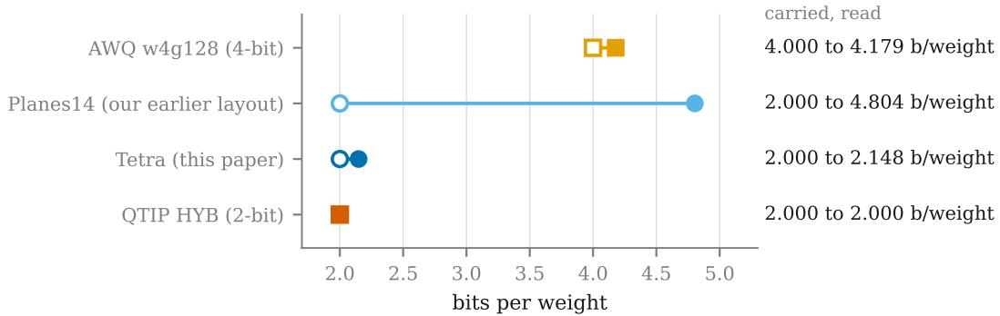
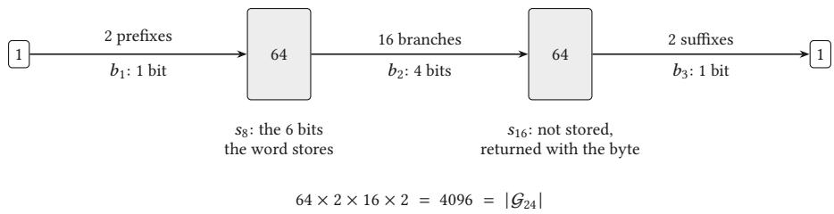
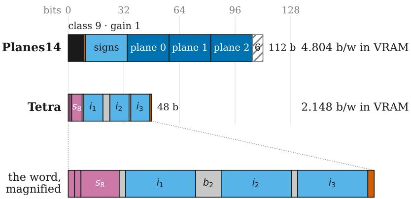
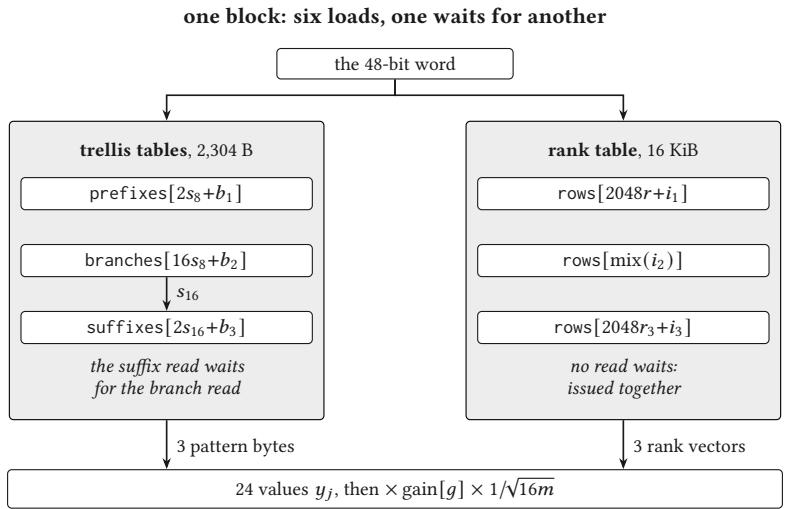

# Tetra: Serving Leech-Lattice Quantized LLMs at 2.7 Bits per Parameter

Pier-Jean Malandrino

Scub, Bordeaux, France · pierjean.malandrino@scub.net

September 2026 · preprint, not peer reviewed

Code, measurement logs and preregistrations: https://github.com/pjmalandrino/llvq

## Abstract

Leech-lattice quantization gives good quality at two bits per weight, but its codebooks hold more than 1014 points, too many for a lookup table. Our earlier kernel expanded the codes at load time and read 4.804 bits per weight from GPU memory for 2 bits of code. We present Tetra, a new codebook on the same lattice. A 24-weight block still takes 48 bits, most of which index a 64-state trellis of the Golay code and one shared 16 KiB table. The kernel decodes a block with six table loads and two small lookups inside the matrix-vector product, and reads 2.148 bits per weight. For full models, we retrain one scale per matrix row, store the matrices that lose the most as 4-bit integers, and pay for them with 4-bit embedding tables. Our Qwen3-4B, 8B and 14B files hold 2.73, 2.70 and 2.73 bits per parameter over the whole model. They score 63.37, 69.58 and 75.66 on the full MMLU test set, 4.76, 4.21 and 2.46 points below 4-bit AWQ at 5.3 to 6.0 bits per parameter. They generate 113.8, 95.0 and 57.2 tokens per second in our engine. On GSM8K, through the served kernel, they lose 9.63, 4.62 and 3.26 points to FP16. At 4B our file scores 23.6 points above llama.cpp’s IQ2\_XXS (2.48 bits per parameter). Every number we measured for a table or figure comes from one NVIDIA L40S GPU. We preregistered the main experiments.

## 1 Introduction

A 14-billion-parameter model needs 29.5 GB for its FP16 weights alone, more than a 24 GB consumer GPU holds. At batch 1 a model reads every weight once per token, so weight size sets both memory and speed. Two or three bits per parameter let such a model run on local hardware.

Van der Ouderaa et al. [24] quantize blocks of 24 weights to points of the Leech lattice $\Lambda _ { 2 4 } .$ . At two bits per weight, their method gives the best quality in their comparison, ahead of QuIP# [22] and QTIP [23]. Each block becomes one 48-bit code in a codebook of more than $1 0 ^ { 1 4 }$ points, too many for a lookup table (§2). In earlier work [19] we expanded each code at load time into a wider format decoded with shifts and masks. The kernel then read 4.804 bits per weight from GPU memory (VRAM) for 2 bits of code, more than the 4.179 of 4-bit AWQ, and the saving was lost (Figure 1).

This paper removes that loss with Tetra, a new codebook on the same lattice, then builds complete models around it. The lattice is built from the Golay code, a binary code of length 24. Three of its codewords with eight ones cover all 24 coordinates. Read in those three groups of eight, the code is a trellis [8]: a layered graph with 64 nodes at each cut, where each codeword is one path. A block is stored as its state, a few bits that choose the path and the gain, and three 11-bit indices into one 16 KiB table, still 48 bits. The kernel decodes it with six table loads and two small lookups, and reads 2.148 bits per weight.

Our contributions:

• Tetra, a codebook on $\Lambda _ { 2 4 }$ read through a Golay trellis and one table, with the rule it imposes on which points to keep and its measured cost (§3).

• A fused kernel that decodes and multiplies in one pass, reading 2.148 bits per weight against 4.804 for our earlier layout and 4.179 for 4-bit AWQ [17] (§5).

• A recipe for complete files at about 2.7 bits per parameter that changes no lattice code: retrained row scales, int4 for the projections that lose the most, and 4-bit embedding tables to pay for them. On Qwen3-4B, the lattice file with int4 value matrices scores about 12 MMLU points below FP16, and the recipe closes part of that gap. Each step is measured at 4B, 8B and 14B with paired intervals over the full MMLU test set (§4, §6.5).

  
Figure 1: Bits of code a format carries per weight (hollow marker) and bits its kernel reads per weight in VRAM (filled marker). Circles are our formats, squares deployed kernels. Planes14, our earlier layout, reads 2.40× its 2.000 bits of code as it expands its codebook first, and Tetra 1.07×. Tetra’s extra bits are its row scales and the unquantized tail of each row, both in f32 in this benchmark (§4.1). QTIP reads no row scales or tail, and its 2 KiB table is not counted (Appendix A). FP16 (16.000 b/weight) is left out. Data: echelle-formats.csv.

• MMLU, GSM8K through the served kernel, speed and memory of our files against FP16 and AWQ at three sizes, and against 2-bit formats at 4B (§6.2, §6.3). With about as much weight memory or less, our 8B and 14B score above AWQ’s 4B and 8B on MMLU and are not separated from them on GSM8K (§6.4, a comparison chosen after measuring).

Our files do not match AWQ on quality, and at 14B their MMLU gap to AWQ is about half the gap at 4B. They use about half its memory, 2.7 bits per parameter against 5.3 to 6.0, or about 65 % of it if AWQ also stored its embedding tables in 4 bits (§6.2). On GSM8K, run through the kernel, they lose more to FP16 than on MMLU when counted in errors, at every size (§6.3). For the experiments behind the main results, we fixed the plan and our predictions before measuring, and we report the predictions that were wrong (Appendix B).

## 2 Background and related work

Weight-only quantization at batch 1. GPTQ [9] quantizes a matrix one column at a time and pushes each rounding error onto the columns not yet quantized, using second-order statistics from calibration text. AWQ [17] rescales input channels by activation size before rounding to 4 bits. With groups of 128 weights it is the usual 4-bit baseline, which vLLM serves with the Marlin kernel [10, 16].

Two-bit vector quantization. Below three bits, the strong methods encode several weights at once, as a choice from a codebook. QuIP# [22] uses the $E _ { 8 }$ lattice. QTIP [23] uses a trellis: its hybrid code hashes each state to index a 2 KiB table, and its computed codes, such as 3INST, need no table. AQLM and VPTQ [7, 18] learn codebooks of at most $2 ^ { 1 6 }$ entries and decode by reading them, and both papers tie kernel speed to how well these tables fit in the GPU cache. The IQ2 formats of llama.cpp [11] decode from grids of 256 to 1,024 points held in a lookup table.

The Leech lattice. Van der Ouderaa et al. [24] quantize the weights in blocks of 24 on $\Lambda _ { 2 4 } ,$ , the densest sphere packing in 24 dimensions [5]. Inside a GPTQ-style loop, each block is coded in 48 bits, 2 per weight, as a lattice direction (the shape) and a length (the gain). Their best codebook on Gaussian data spends 47 bits on one of $1 . 1 \times 1 0 ^ { 1 4 }$ lattice points inside a ball and one bit on the gain. The model results we cite spend all 48 bits on a larger ball of $2 . 8 \times 1 0 ^ { 1 4 }$ points. On Qwen3-4B they report 60.7 on MMLU without fine-tuning and 62.8 with it. Their GPU kernel decodes only one shell of the lattice (the points at one distance from the origin), while those scores use several shells.

Our earlier kernel. In Malandrino [19] we served their 47-bit codebook with its gain bit. At load time, each code was unfolded into a 112-bit Planes14 record: a class, a gain bit, a sign mask and three bit planes (Figure 3). A fused kernel reads these records at 4.804 bits per weight. This paper replaces that layout.

## 3 The Tetra codebook

  
Figure 2: The Golay code in octad order is a trellis, and a codeword is a path through it.

## 3.1 The lattice and the quantizer

We use the integer form of the Leech lattice, up to the overall scale that the quantizer sets. A vector of 24 integers $y \in \mathbb { Z } ^ { 2 4 }$ lies in $\Lambda _ { 2 4 }$ when it can be written as

$$
y _ { j } = p + 2 c _ { j } + 4 k _ { j } , \qquad \sum _ { j } k _ { j } \equiv p \quad ( \mathrm { m o d } \ 2 ) .\tag{1}
$$

Here $\boldsymbol { p }$ is a bit, the $k _ { j }$ are integers, and � is a codeword of the binary Golay code $\mathcal { G } _ { 2 4 }$ . Two global constraints pick the lattice out of $\mathbb { Z } ^ { 2 4 } ;$ : � is one of the $2 ^ { 1 2 }$ codewords among the $2 ^ { 2 4 }$ bit patterns, and one parity check ties all 24 coordinates. A decoder has to respect both.

The encoder uses the shape-gain scheme of van der Ouderaa et al. [24]. It rotates the input [2, 3, 22] and runs a GPTQ-style loop [9]. For each block of 24 rotated weights, it looks for the lattice point under a length cap whose direction is closest to the block, and rebuilds the weights as

$$
\hat { w } _ { j } = \frac { y _ { j } } { \| y \| } \operatorname { g a i n } [ g ] \sigma _ { \mathrm { r o w } } , \qquad \| y \| = \sqrt { 1 6 m } ,\tag{2}
$$

where � is the shell index, � selects the gain, and $\sigma _ { \mathrm { r o w } }$ is one scale per output row, stored in f64 and read by the kernel in f32. We change only the region the encoder searches (§3.5) and the bits it writes for each block. The Tetra search is not exhaustive: at two trial scales, the encoder keeps a few candidates per section and joins the best over the trellis. It runs once, ofline, on a CPU.

## 3.2 Three octads and a trellis

An octad is a Golay codeword with exactly eight ones. We fix three octads that share no position, which together cover all 24 coordinates, and read the coordinates octad by octad. Cutting after coordinates 8 and 16 splits the block into three sections, one per octad. These cuts turn the code into the trellis of Forney [8], a layered graph whose paths spell out bit patterns (Figure 2). The node a path crosses at a cut is its state. Each cut has 64 states, and no split of $\mathcal { G } _ { 2 4 }$ into three sections of eight has fewer. The trellis has 64 $\times 2 \times 1 6 \times 2 = 4 0 9 6 = \left| \mathcal { G } _ { 2 4 } \right|$ paths, one per codeword, which we check when we build the tables. Forney uses such trellises for eficient maximum-likelihood decoding. We use this one to give every entry of a quantizer codebook an address.

## 3.3 State, rank vectors, and one table for three sections

The 48-bit word of a block (§3.4) holds eight bits of state: the trellis state $s _ { 8 }$ (6 bits), the shared parity ${ \boldsymbol { p } } ,$ and $r ,$ the parity of $\sum k _ { j }$ over section 1. These are all that the rest of the block needs from section 1, so a cut has $6 4 \times 4 = 2 5 6$ lattice states.

Each section has a �-parity, the parity of the sum of its $k _ { j } .$ . Only section 1’s is stored, as $r .$ Section $2 ^ { \cdot } { \bf s } , \delta ,$ is read from its row index (explained below). Section 3’s is

$$
r _ { 3 } = p \oplus r \oplus \delta ,\tag{3}
$$

so the parity constraint of Equation (1) costs one XOR and no bits.

A section’s pattern byte is the eight bits of � that fall in it. Once � and this byte are known, coordinate � can only take the values $o _ { j } + 4 \mathbb { Z } ,$ , with $o _ { j } = p + 2 c _ { j }$ . We store its rank, its position in that list counted outward from zero, instead of its value: for $o = 0$ the values are $0 , + 4 , - 4 , + 8 , \ldots$ and for � = 1 they are $\mathbf { \Phi } : + 1 , - 3 , + 5 , \dots \mathbf { A }$ section is then a rank vector $\rho \in \{ 0 , . . . , 7 \} ^ { 8 }$ , four bits per rank, which fits in one 32-bit table row.

Two properties let a single table serve every section of every block. First, sorting rank vectors by cost $\begin{array} { r } { ( \rho ) = \sum _ { j } ( 2 \rho _ { j } + 1 ) ^ { 2 } } \end{array}$ , a stand-in for squared distance, gives the same order for every � and every pattern byte. “Keep the 2,048 cheapest” then means one list instead of 256, one for each parity and each of the 128 pattern bytes a section admits. Second, cls $\begin{array} { r } { \left( \rho \right) = \sum _ { j } [ \rho _ { j } \in \left\{ 1 , 2 , 5 , 6 \right\} ] } \end{array}$ mod 2 equals the parity of $\textstyle \sum _ { j } k _ { j }$ for every pattern. We sort the table by this class, so a row’s position gives its parity with no extra field.

  
one bit each, left to right: p shared parity · r section-1 class · b1, $b _ { 3 }$ edge choices · g gain

Figure 3: The Planes14 record of our earlier layout and the Tetra word, drawn to the same scale in bits, with the word magnified below to label its ten fields. Planes14 unfolds the 47-bit index and its gain bit into 112 bits, one record every 14 bytes. Tetra is what the file stores and the kernel reads: 48 bits, one word every 6 bytes. Purple marks the eight bits of state, grey the edge choices, blue the row indices into the shared table and red the gain bit. Hatching is padding  
  
Figure 4: The decode. The trellis reads return the Golay pattern bytes of the three sections, and the row reads their rank vectors. Only the sufix read waits, for the state $s _ { 1 6 }$ that the branch read returns. The shell index � is recomputed from the decoded values, and $r _ { 3 }$ comes from Equation (3).

The table holds 4,096 rows: the 2,048 cheapest rank vectors of class 0, then the 2,048 cheapest of class 1. Eleven bits pick a row within one half. The middle section reads the same rows through its own list of the 2,048 cheapest overall: $N _ { 0 } = 1 2 4 0$ rows of class 0, then 808 of class 1. Its index alone thus gives the class of its row, the � that Equation (3) needs.

## 3.4 The word and the decode

Figure 3 shows the resulting 48-bit word next to the Planes14 record it replaces. Each field can take a power-of-two number of values, so any 48-bit value is a legal word and decodes to a point of $\Lambda _ { 2 4 }$ . A benchmark can therefore stream random words and check every decode against a reference. Figure 4 shows the decode: six loads give the 24 values, and only one waits for another.

The tables take 18,816 B: 16,384 B of rank rows, 2,304 B of trellis tables, and 32 floats holding $1 / { \sqrt { 1 6 m } }$ . The entry for $m = 0$ is 0, so the origin, a legal word, decodes to zeros with no special case. Trying every codeword with both parities and every allowed row in each section gives $m \leq 2 6$ and

max $\begin{array} { r } { | y _ { j } | = 1 0 . } \end{array}$

## 3.5 What the construction costs

Tetra and Planes14 keep diferent sets of points of the same lattice. Keeping the 2,048 cheapest rank vectors bounds each section on its own, so the encoder searches a product of three 8-dimensional regions where Planes14 searched one 24-dimensional ball. This split makes the six-load decode possible, and it is the price the format pays.

Retention is the bit rate the theoretical limit would need to reach our error, as a percentage of the rate we use. On 20,000 Gaussian blocks at 2 bits per weight, in one process and with the same gain rule, Tetra reaches 88.80 % retention and the Planes14 codebook 91.98 %: Tetra has 9.2 % more mean squared error. On 20,000 rotated weight blocks of Qwen3-0.6B’s first layer, the gap is the same, 3.2 points. Sorting rank vectors by cost(�) instead of exact squared distance accounts for 0.6 points of it on Gaussian blocks.

Geometry predicts about as much. The shaping gain is how much the shape of the searched region lowers the error against a cube. At best it is 0.7292 dB for a product of three 8-dimensional balls and 1.0958 dB for one 24-dimensional ball. The 0.3666 dB diference means 8.81 % more mean squared error for the product. Our regions, cut by rank and by the trellis, are neither balls nor continuous.

Every decoded point still lies in $\Lambda _ { 2 4 } \colon$ its pattern bytes form a Golay codeword, since they follow a trellis path, and Equation (3) gives the $\textstyle \sum k$ parity. Three separate quantizers on $E _ { 8 } ,$ , the best lattice quantizer known in 8 dimensions, would keep neither constraint. At the same density of points, the $E _ { 8 }$ lattice has 9.0 % more mean squared error than $\Lambda _ { 2 4 } \colon G ( E _ { 8 } ) / G ( \Lambda _ { 2 4 } ) = 0 . 0 7 1 6 8 2 / 0 . 0 6 5 7 7 1 = 1 . 0 8 9 9$ where � is the normalized second moment [6, Table 2.3].

Our data cannot separate the two codebooks on a model. On Qwen3-4B, with the same evaluation code, bare Tetra (without the changes of §4) scores 2.11 MMLU points below Planes14 on a 2,280- question sample, [−0.95, +5.17], � = 0.11, with 4.64 % lower perplexity. Each file comes from one calibration draw, and three draws of the Planes14 encoding spread MMLU over 5.83 points on this sample, a standard deviation of 2.92. A month of encoder changes also separates the two files: re-encoding the first layer of the Planes14 file with the newer code changes 87 % of its indices.

## 4 From the codebook to a served file

A served file holds more than lattice codes. The three changes below start from an encoding that already stores v\_proj in int4 (§4.3), and none of them changes the decoder or a remaining lattice code.

## 4.1 What a file holds, and how we count it

Each layer of the dense Qwen3 models [21] has seven projection matrices: �, �, � and � in attention, and gate, up and down in the feed-forward block. The 4B and 8B models have 36 layers (252 projections), and the 14B has 40 (280).

Each projection is stored as Tetra blocks or as an int4 record: 4-bit weights in groups of 128, with an f16 scale and ofset per group, read by a separate GPU kernel. A Tetra projection also stores one scale per output row. It keeps unquantized the tail of each row, the weights that do not fill a whole block, in f32 in the file and f16 on the GPU. The RMSNorm weights stay in f16. The embedding table is stored separately, and so is the output head at 8B and 14B. At 4B the head is tied to the embedding.

We count memory in bits per parameter over the whole model: all the weight bits the served model keeps, embedding, tail, scales and int4 records included, over the number of parameters. For our files, the rtbits tool computes it from the file’s records, at the widths the GPU holds. For AWQ and IQ2\_XXS, it is the checkpoint’s size in bits over the number of parameters. The KV cache and the activations are not counted.

## 4.2 Training the row scales

The encoder sets each row scale $\sigma _ { \mathrm { r o w } }$ of Equation (2) from the norm of the rotated row. We retrain only these scales, with the FP16 model as teacher [14] and a KL loss on the output probabilities over DCLM-Edu text [15]. The lattice codes stay fixed, and the trained scales replace the old ones in place, so no bit is added. At 4B the training sees 19.5 million tokens and takes 1.7 h on one L40S.

<table><tr><td></td><td>Qwen3-4B</td><td>Qwen3-8B</td><td>Qwen3-14B</td></tr><tr><td>projections, TETRA + int4</td><td>168 + 84</td><td>199 + 53</td><td>181 + 99</td></tr><tr><td>int4 projections</td><td>v, o, down 12–23</td><td>v, down 10-26</td><td>v, o, down 10–28</td></tr><tr><td>4-bit embedding tables</td><td>1 (tied head)</td><td>2</td><td>2</td></tr><tr><td>file size (bytes)</td><td>1,418,224,685</td><td>2,815,098,745</td><td>5,087,000,541</td></tr><tr><td>bits per parameter, whole model</td><td>2.7320</td><td>2.6953</td><td>2.7305</td></tr></table>

Table 1: The three sealed files. Layers are numbered from 0: “down 12–23” means down\_proj in layers 12 to 23. Bits per parameter are counted as in §4.1. The file is larger: it also carries the tokenizer and the config (11.4 MB), and stores the tail in f32 and the row scales in f64. Data: paper2-chain.csv, and the sealing logs for file sizes.

The 8B and 14B runs take 1.1 h and 1.8 h on one H200. This step alone adds 3.15, 3.29 and 1.67 MMLU points (§6.5).

## 4.3 int4 where the lattice loses the most

Every file of Table 6 stores v\_proj in int4. Qwen3 uses grouped-query attention [1], so these matrices are small. At 4B, in an earlier encoding calibrated on C4 text, moving them from Tetra to int4 gained 1.73 MMLU points [0.87, 2.59] on the full test set, for 0.05 bits per parameter.

The three files we serve, which we call sealed, also store o\_proj in int4, and down\_proj in a range of middle layers (Table 1). At 8B only down\_proj is added, and §6.5 explains why.

## 4.4 4-bit embedding tables

Qwen3’s embedding table has 151,936 rows and is 9.7 % of the parameters at 4B. At 8B and 14B the output head is a second table of the same shape, and the two hold 15.2 % and 10.5 % of the parameters. Before this step our files stored them in f16, and the served model quantized them to 8 bits at load. The sealed files store them in 4 bits, in groups of 64 as MLX does [12], with an f16 scale and ofset per group. The GPU dequantizes rows on the fly, for the input tokens and inside the head’s matrix-vector product. Going from 8 to 4 bits frees 0.19, 0.62 and 0.78 GB at 4B, 8B and 14B. This saving pays for the int4 projections: every sealed file needs fewer bits per parameter than the file it was built from (§6.5).

## 5 The kernel

## 5.1 Decoding inside the matrix-vector product

The kernel keeps the thread layout of our earlier one [19]. One warp (threads that run in lockstep) computes each output row, and a 256-thread block holds 8 rows. Each thread of the warp, or lane, decodes one block of weights at a time. The activation goes into shared memory in tiles of� blocks (96� bytes), with two barriers per tile. A shufle reduction sums the lanes’ results, and a last step multiplies by $\sigma _ { \mathrm { r o w } }$ and adds the unquantized tail. Only the block decode difers.

Decoding a block takes six table loads and two small lookups, for the gain and the norm. Three choices make it fast. First, each coordinate value is held in a register table as a biased byte, val + 128. Placed in the low byte of 0x4b0000\_\_, it reads exactly as the float $2 ^ { 2 3 }$ + byte, and one subtraction gives the value back. A coordinate thus costs one byte permute, one add and one fused multiplyadd, with no integer-to-float conversion. Second, every loop is unrolled with constant indices: the compiler reports 40 registers and no spill to local memory for the benchmark kernel, as for Planes14. Third, no branch depends on the data, so lanes never diverge.

Counted from the source, a block’s rank decode and 24 multiply-adds take about 150 instructions (about 60 on the FMA pipe, about 85 on the ALU pipe and six loads), and the gain and the norm about 20 more. A decoder that extracts and converts each coordinate needs about 380, plus 24 conversions.

The kernel reads the 48 bits the file stores for each block, and no code is expanded. Loading only reorders the bits of each word and pads each row to a multiple of 8 bytes. In the same process, the sealed 4B file loads in 4.1 s and its dense reconstruction (the file decoded to f16) in 72.9 s.

The rest of a served model. The int4 projections use a separate kernel with the same thread layout. It dequantizes each weight with its group’s scale and ofset and accumulates in f32. It stages the whole activation in shared memory: a 14B down\_proj needs 69,632 B, more than the 48 KiB default, so the host opts in to that amount, under the L40S limit of 101,376 B [20]. Two small kernels serve the 4-bit embedding tables, and a third rotates the activations online, 96 times a token at 4B, once per group of projections that share a rotation.

<table><tr><td></td><td>FP16</td><td>AWQ w4g128</td><td>PLANES14</td><td>TETRA</td><td>no weights</td></tr><tr><td>matrices timed</td><td>252</td><td>252</td><td>252</td><td>216</td><td>252</td></tr><tr><td>median ms</td><td>10.973</td><td>3.261</td><td>4.997</td><td>3.424</td><td>2.289</td></tr><tr><td>GB read per pass</td><td>7.27</td><td>1.90</td><td>2.18</td><td>0.95</td><td>0.07</td></tr><tr><td>b/weight in VRAM</td><td>16.000</td><td>4.179</td><td>4.804</td><td>2.148</td><td>0.159</td></tr><tr><td>GB/s, fastest round</td><td>662</td><td>583</td><td>437</td><td>278</td><td>32</td></tr></table>

Table 2: Kernel benchmark on the 4B shapes at tile $T = 6 4 :$ one process, one L40S, seven rounds with the first two dropped. “No weights” has the same thread layout and reads no block code, only the tail and the row scales. The Tetra arm times the 216 lattice matrices of an early 4B file. Its 36 int4 v\_proj run on the other kernel. The lattice arms hold the tail in f32, as the files store it, where the served kernel uses f16. The Tetra row leaves out 4.1 MB of row padding, 0.009 b/weight. The AWQ arm is its authors’ GEMV kernel [17] ported to our harness, not the Marlin kernel that vLLM serves. Its row includes 10.1 MB of padding in that kernel’s scale and zero bufers, 0.022 b/weight. Without it, w4g128 costs 4.156 b/weight. Ten arms: Appendix A. Data: echelle-formats.csv.

How the kernel is checked. Before any timing, we recompute in f64, from the same decoded weights, every output row of the 4B shapes in every benchmark arm: 1,105,920 rows, 1,069,056 for the 216 Tetra matrices. Each must match the kernel’s row within $1 0 ^ { - 5 } \cdot \textstyle \sum | w \cdot x | , \mathrm { o r } 1 0 ^ { - 3 }$ for AWQ and cuBLAS, which write f16. The worst Tetra row is of by $2 . 1 \times 1 0 ^ { - 8 } \cdot \sum | w \cdot x |$ . The decoder’s CUDA source, compiled for the CPU, gives the 24 lattice coordinates of each 48-bit word bit for bit against an independent Rust decoder. End to end, on one prompt and in one process, the kernel and the dense reconstruction of each sealed file generate the same 256 greedy tokens at 4B and 8B. At both sizes the text falls into a one-sentence loop. At 14B they first difer at token 78, and at token 137 when both run with f16 embedding tables. A second check runs 203 prompt tokens through the kernel, in one call and in 203 single-token calls. Both give the same next token at all three sizes. The two paths still move a logit by up to 0.095, 1.35 and 0.79 at 4B, 8B and 14B, for logits up to 30.4, 36.6 and 27.5. The divergence at token 78 is consistent with a near tie between two logits, flipped by diferences of this size, but we did not measure the margin there. Our preregistration counts a first divergence at or after token 32 as not a defect. That rule says nothing about the cause.

## 5.2 Bytes and time on the projections

Per weight, Tetra reads 2.148 bits, about half the 4.179 of 4-bit AWQ and the 4.804 of Planes14 (Table 2). The Tetra time, a lower bound since its arm covers fewer matrices, is still above AWQ’s: 3.424 against 3.261 ms. Tetra reads its bytes at 278 GB/s, where AWQ reaches 583. Reading half the bytes does not halve the time.

The activation tile. The tile � changes no output bit and costs no storage. On an Ada GPU (sm\_89), it sets how much of each SM’s 128 KiB pool of L1 and shared memory is left to cache the decoder tables [20]. Occupancy does not move: six 256-thread blocks fit at every tile, filling the 1,536 threads an SM holds, and shared memory never binds. At � = 128, 64 and 32, one process per tile on one L40S, the median pass takes 2.272, 2.288 and 2.388 ms with no weights, 5.070, 4.995 and 5.044 ms for Planes14, and 4.078, 3.423 and 3.553 ms for Tetra on its 216 matrices (data: tuile-l40s.csv). Each arm’s range, largest over smallest, is 5.1, 1.5 and 19.1 %. The three arms share the thread layout, the activation copy, the barriers and the occupancy. Planes14 reads one entry per block from a 12 KiB table, Tetra seven from 18.4 KiB. We attribute Tetra’s larger range to pressure on L1 but have not proven it: our rented platform exposes no performance counters. We serve � = 64 on sm\_89. On an sm\_120 card, an earlier sweep on other 4B files puts Tetra fastest at � = 32 and Planes14 at � = 128.

## 6 Experiments

## 6.1 Setup

Models and encoding. Qwen3-4B, 8B and 14B [21] are each encoded with the first 131,072 tokens of DCLM-Edu [15], the same text at every size, then trained and assembled as in §4.

Quality. The benchmark is MMLU [13], 5-shot, micro-averaged over all 14,042 questions of its test split, with the answer read from the logits of the four answer letters. Each file is scored on its dense reconstruction in an ordinary forward pass. The kernel computes with the same decoded weights, and the checks of §5 tie the two. At 4B, we scored the file one step before sealing, with the same int4 matrices rebuilt at load by the same quantizer. On 57 questions, the sealed 4B file gives the same answers and logits. Every comparison is paired on the same questions, with a 95 % interval from a bootstrap that resamples questions within each subject (10,000 draws) and an exact McNemar test. Our paired MMLU intervals are 0.7 to 1.7 points wide, so how small a gap this test separates depends on the pair. A gap whose interval contains zero is not separated. We ran no equivalence test, so this does not mean the two scores are equal.

Reasoning. To score generated reasoning, not one logit per question, we add all 1,319 test problems of GSM8K [4], zero-shot in the model’s chat template with its thinking block left empty (Qwen3’s non-thinking mode [21]). The prompt asks for the answer in a \boxed{}. Decoding is greedy and stops at the end of the turn or after 1,024 tokens. The answer is the last number in the last box, or the last number of the text when no box closes. Unlike MMLU, our files are scored through the served kernel. FP16 and AWQ generate in vLLM from the same prompt tokens, and one grader scores every arm. Gaps are paired, with a 95 % normal interval and an exact McNemar test.

Speed and memory. Decode speed is measured on one NVIDIA L40S at batch 1 with greedy sampling, as tokens generated over wall-clock time, prompt included. Our files run in our engine at the served settings and generate 256 tokens. FP16 and AWQ run in vLLM 0.26.0 [16], AWQ with the Marlin kernel, and generate 128. Both engines report the median of five timed rounds, after one warm-up round in ours and two in vLLM. IQ2\_XXS runs in llama.cpp build b10689 [11], with llama-bench on 128 tokens from an empty prompt, as the mean of five repetitions. Memory counts only weight bytes (§4.1): GPU bufers for our files, weight files for the others.

Baselines. FP16 is Qwen’s published checkpoint, stored in bf16 and run in f16. AWQ is Qwen’s oficial w4g128 checkpoint at each size, scored on MMLU in our harness after conversion to f16 and timed in vLLM on the packed checkpoint. IQ2\_XXS is built with llama-quantize and an importance matrix from 131,072 tokens of C4, not from the DCLM-Edu text of our files, and scored with the same prompts through llama-server. We cite the MMLU of QTIP, QuIP# and the original LLVQ from van der Ouderaa et al. [24] and do not run them.

## 6.2 Main results

Quality. On the same questions (Table 3), the sealed files sit below FP16 by 6.77 points [6.05, 7.50], 5.48 [4.83, 6.10] and 3.22 [2.69, 3.75] at 4B, 8B and 14B, and below AWQ by 4.76 [4.02, 5.49], 4.21 [3.54, 4.86] and 2.46 [1.92, 3.00]. Both gaps shrink from 4B to 14B, but the 0.55-point fall of the gap to AWQ from 4B to 8B is not separated from zero (� = 1.1). AWQ itself is 2.00 [1.50, 2.51], 1.27 [0.83, 1.70] and 0.75 [0.40, 1.12] points below FP16.

Memory. The sealed files need 45 to 52 % of AWQ’s bits per parameter. Part of that comes from the embedding tables: ours are in 4 bits, and AWQ keeps its embedding and head in f16. These tables weigh most at 8B (§4.4), where AWQ needs the most bits per parameter. With AWQ’s tables in 4 bits like ours, our files would need 64 to 65 % of its bits per parameter. We computed this from the bytes and did not measure AWQ’s quality with such tables.

Against other 2-bit formats at 4B. IQ2\_XXS scores 23.6 points below our 4B file for 0.25 fewer bits per parameter. The cited rows come from another harness and count bits per quantized weight, so they place our 63.37 only roughly, without ranking it: close to the 62.8 of the original LLVQ with fine-tuning, and above the 59.5 of QTIP with its 3INST code.

Speed. In our engine, the sealed files decode faster than their dense reconstruction, run in the same process (Table 3). A large part of this gap comes from the 4-bit output head. With the embedding and head in f16 on both sides, the sealed files decode 55.0, 38.9 and 27.3 tokens per second against

<table><tr><td></td><td>format and engine</td><td>b/param</td><td>MMLU</td><td>decode tok/s</td><td>weights GB</td></tr><tr><td rowspan="9">4B</td><td>FP16, vLLM</td><td>16.00</td><td>70.14</td><td>83.1</td><td>8.04</td></tr><tr><td>f16 dense path, our engineª</td><td>16.00</td><td></td><td>43.0</td><td>8.04</td></tr><tr><td>AWQ w4g128, vLLM</td><td>5.30</td><td>68.14</td><td>200.5</td><td>2.67</td></tr><tr><td>IQ2_XXS, llama.cpp</td><td>2.48</td><td>39.78</td><td>312.9</td><td>1.25</td></tr><tr><td>TETRA, our engine</td><td>2.73</td><td>63.37</td><td>113.8</td><td>1.38</td></tr><tr><td> $\mathrm { L L V Q } , \mathrm { c i t e d } ^ { b }$ </td><td>2 b/wc</td><td>62.8</td><td></td><td></td></tr><tr><td>QTIP 3INST, citedb</td><td>2 b/wc</td><td>59.5</td><td></td><td></td></tr><tr><td>QuIP#, citedb</td><td>2 b/wc</td><td>52.9</td><td></td><td></td></tr><tr><td>FP16, vLLM</td><td>16.00</td><td>75.05</td><td>46.3</td><td>16.38</td></tr><tr><td rowspan="4">8B</td><td>f16 dense path, our engineª</td><td>16.00</td><td></td><td>26.4</td><td>16.38</td></tr><tr><td>AWQ w4g128, vLLM</td><td>5.96</td><td>73.79</td><td>123.2</td><td>6.10</td></tr><tr><td>TETRA, our engine</td><td>2.70</td><td>69.58</td><td>95.0</td><td>2.76</td></tr><tr><td>FP16, vLLM</td><td>16.00</td><td></td><td></td><td></td></tr><tr><td rowspan="4">14B</td><td>f16 dense path, our engineª</td><td></td><td>78.88</td><td>25.8</td><td>29.54</td></tr><tr><td>AWQ w4g128, vLLM</td><td>16.00</td><td>78.12</td><td>16.9 77.8</td><td>29.54</td></tr><tr><td>TETRA, our engine</td><td>5.40</td><td></td><td>57.2</td><td>9.98</td></tr><tr><td></td><td>2.73</td><td>75.66</td><td></td><td>5.04</td></tr></table>

Table 3: Quality, speed and memory at three sizes, on one L40S. MMLU uses all 14,042 test questions, and FP16 and AWQ are scored in our harness. The engine named in each row times the speed, and speeds are never divided across engines. For our files, weights GB are the bufers on the card, row padding included. �The sealed file decoded to f16 and run as an ordinary model, in the same process as the kernel. Its speed is that of any f16 model of this size in our engine, which copies the output head at every token. This row has no MMLU of its own. � Fine-tuned rows of Table 6 of van der Ouderaa et al. [24], from their harness and MMLU protocol. �Bits per quantized weight, as the source gives them. It gives no rate for the whole model. Data: paper2-results.csv.
<table><tr><td></td><td>FP16</td><td>AWQ</td><td>TETRA</td><td>FP16 minus TETRA</td><td>AWQ minus TETRA</td></tr><tr><td>4B</td><td>92.12</td><td>89.01</td><td>82.49</td><td>9.63 [7.69, 11.57]</td><td>6.52 [4.39, 8.65]</td></tr><tr><td>8B</td><td>93.25</td><td>92.95</td><td>88.63</td><td>4.62 [3.00, 6.25]</td><td>4.32 [2.83, 5.81]</td></tr><tr><td>14B</td><td>95.30</td><td>95.38</td><td>92.04</td><td>3.26 [1.93, 4.59]</td><td>3.34 [2.12, 4.55]</td></tr></table>

Table 4: GSM8K on all 1,319 test problems (§6.1). Tetra runs through the served kernel, FP16 and AWQ in vLLM. The gaps are paired, with 95 % intervals. Data: paper2-gsm8k.csv, paper2-gsm8k-gaps.csv.

43.3, 26.4 and 16.9 for the dense arm, or 1.27, 1.47 and 1.61 times, from unrounded medians. We do not divide the vLLM speeds of Table 3 by ours: vLLM runs FP16 faster than our dense path does, so a ratio across engines would mix the format with the engine.

## 6.3 Reasoning: GSM8K through the served kernel

All six gaps between a sealed file and a baseline are separated from zero, with every � below 10−5 (Table 4). AWQ sits 3.11 points below FP16 at 4B, then 0.30 and −0.08 at 8B and 14B, which this test set cannot separate from zero.

Counted in points, the sealed files lose more on GSM8K than on MMLU at 4B only: 9.63 against 6.77, and the GSM8K interval excludes the MMLU gap. At 8B and 14B the intervals contain the MMLU gaps of 5.48 and 3.22. Counted in errors, the sealed files make 2.22, 1.69 and 1.69 times as many as FP16 on GSM8K, against 1.23, 1.22 and 1.15 times on MMLU, so reasoning costs more at every size.

Two engines. To check that the engine does not move a score, we ran the FP16 4B checkpoint through our dense path: 91.51 against 92.12 in vLLM, −0.61 points [−1.27, 0.06], � = 0.12. Against this same-engine FP16, the 4B file loses 9.02 points [7.07, 10.97], against 9.63 across engines. On the 50 problems of a pilot, the kernel and the dense reconstruction of the 4B file give the same 50 answers.

## 6.4 One size up for about as much memory

Our aim is to fit a larger model on the same hardware (§1). So we also compare our 8B and 14B files with the models one size below, which take about as much memory or more (Table 5). The three Qwen3 models read the same prompt tokens, so the scores of Tables 3 and 4 pair question by question, and no model ran for this section. We chose this comparison after measuring, so it was not preregistered.

<table><tr><td>TETRA</td><td>against</td><td>weights GB</td><td>MMLU</td><td>GSM8K</td><td></td></tr><tr><td>8B</td><td>AWQ 4B</td><td>2.76 vs 2.67</td><td>+1.44  $\left[ + 0 . 7 1 , + 2 . 1 9 \right]$ </td><td></td><td>-0.38 [-2.14, +1.39]</td></tr><tr><td>14B</td><td>AWQ 8B</td><td>5.04 vs 6.10</td><td>+1.87  $\left[ + 1 . 2 0 , + 2 . 5 7 \right]$ </td><td></td><td>-0.91 [−2.35, +0.53]</td></tr><tr><td>8B</td><td>FP16 4B</td><td>2.76 vs 8.04</td><td>-0.56  $\left[ - 1 . 2 7 , + 0 . 1 8 \right]$ </td><td></td><td>-3.49 [-5.18, −1.79]</td></tr><tr><td>14B</td><td>FP16 8B</td><td>5.04 vs 16.38</td><td>+0.61  $\left[ - 0 . 0 6 , + 1 . 2 7 \right]$ </td><td>-1.21</td><td> $\left[ - 2 . 6 4 , + 0 . 2 1 \right]$ </td></tr><tr><td>14B</td><td>FP16 4B</td><td>5.04 vs 8.04</td><td>+5.52  $\left[ + 4 . 7 9 , + 6 . 2 4 \right]$ </td><td>-0.08</td><td> $\left[ - 1 . 5 4 , + 1 . 3 9 \right]$ </td></tr><tr><td></td><td>AWQ 8B against AWQ 4B</td><td> $6 . 1 0 \ \mathrm { v s } \ 2 . 6 7$ </td><td>+5.65  $\left[ + 4 . 9 6 , + 6 . 3 7 \right]$ </td><td></td><td> $+ 3 . 9 4 \ [ + 2 . 4 3 , + 5 . 4 6 ]$ </td></tr><tr><td></td><td>AWQ 14B against AWQ 8B</td><td> $9 . 9 8 \ \mathrm { v s } \ 6 . 1 0$ </td><td>+4.34  $[ + 3 . 6 7 , + 5 . 0 0 ]$ </td><td></td><td> $+ 2 . 4 3 \ [ + 1 . 2 3 , + 3 . 6 3 ]$ </td></tr></table>

Table 5: Our 8B and 14B files against the models one size below, and our 14B against FP16’s 4B: the first model minus the second, in points, paired on 14,042 MMLU questions and 1,319 GSM8K problems, with 95 % intervals. The GSM8K pairs cross the two engines of §6.3. The last two rows show what one size is worth to AWQ. Weights as in Table 3. Data: paper2-sizeup.csv.
<table><tr><td colspan="2">step</td><td>b/param</td><td>MMLU</td><td>gain</td><td>95 % interval, McNemar</td></tr><tr><td rowspan="3">4B</td><td>TETRA + int4 v_proj</td><td>2.7475</td><td>57.95</td><td></td><td></td></tr><tr><td>+ trained row scales</td><td>2.7475</td><td>61.11</td><td>+3.15</td><td> $\left[ + 2 . 5 6 , + 3 . 7 4 \right] , p = 1 . 8 \cdot 1 0 ^ { - 2 5 }$ </td></tr><tr><td>+ int4 o, down; 4-bit tables</td><td>2.7320</td><td>63.37</td><td>+2.26</td><td> $\left[ + 1 . 6 6 , + 2 . 8 7 \right] , p = 8 . 2 \cdot 1 0 ^ { - 1 3 }$ </td></tr><tr><td rowspan="3">8B</td><td>TETRA + int4 v_proj</td><td>3.0683</td><td>64.87</td><td></td><td></td></tr><tr><td>+ trained row scales</td><td>3.0683</td><td>68.16</td><td>+3.29</td><td> $\left[ + 2 . 7 8 , + 3 . 8 0 \right] , p = 7 . 2 \cdot 1 0 ^ { - 3 8 }$ </td></tr><tr><td>+ int4 down; 4-bit tables</td><td>2.6953</td><td>69.58</td><td>+1.42</td><td> $\left[ + 0 . 9 3 , + 1 . 9 2 \right] , p = 3 . 2 \cdot 1 0 ^ { - 8 }$ </td></tr><tr><td rowspan="3">14B</td><td>TETRA + int4 v_proj</td><td>2.7371</td><td>72.53</td><td></td><td></td></tr><tr><td>+ trained row scales</td><td>2.7371</td><td>74.20</td><td>+1.67</td><td> $\left[ + 1 . 2 7 , + 2 . 0 8 \right] , p = 5 . 0 \cdot 1 0 ^ { - 1 6 }$ </td></tr><tr><td>+ int4  $^ { o , }$  down; 4-bit tables</td><td>2.7305</td><td>75.66</td><td>+1.46</td><td> $\left[ + 0 . 9 9 , + 1 . 9 4 \right] , p = 1 . 4 \cdot 1 0 ^ { - 9 }$ </td></tr></table>

Table 6: How each file is built, one step per row, each gain paired against the row above on the 14,042 questions. Bits per parameter count the file as served, with 8-bit embedding tables in the first two rows of each size. Those rows were scored with f16 tables, so the last gain also includes the cost of 4-bit tables. Data: paper2-chain.csv.

On MMLU, our 8B scores 1.44 points above AWQ’s 4B with 0.10 GB more weights, and our 14B 1.87 points above AWQ’s 8B with 1.05 GB less, from unrounded bytes (both $ { p } < 1 0 ^ { - 3 } )$ . That is 25 and 43 % of what one size is worth to AWQ. On GSM8K the same pairs are not separated $( p = 0 . 7 4$ and 0.26). Their intervals reach down to −2.14 and −2.35 points, so the larger model’s gain does not appear on GSM8K. Against FP16 one size below, our files are not separated from it on MMLU. On GSM8K our 8B loses to FP16’s 4B, and our 14B is not separated from FP16’s 8B. Our 14B, in 5.04 GB, scores 5.52 MMLU points above FP16’s 4B in 8.04 GB and is not separated from it on GSM8K. We compare no speed here: our 8B decodes 95.0 tokens per second in our engine and AWQ’s 4B 200.5 in vLLM.

Where the larger model fits. At 8,192 tokens in f16, the KV cache takes 1.21 GB for Qwen3-4B and 8B, which share its shape, and 1.34 GB for the 14B. Weights plus that cache take 2.59, 3.97 and 6.39 GB for our 4B, 8B and 14B, and 3.87, 7.31 and 11.32 GB for AWQ. These budgets are computed from unrounded bytes and leave out the CUDA context and the activations. From 3.97 to 11.32 GB, our files run a larger model than AWQ: one size up, or two between 6.39 and 7.31 GB, where our 14B scores 7.52 MMLU and 3.03 GSM8K points above AWQ’s 4B. From 11.32 GB both run the 14B, the largest we serve. With 4-bit embedding tables like ours, AWQ’s budgets would be 3.31, 5.52 and 9.08 GB (computed; its quality with those tables is not measured), and the windows would narrow to 3.97 to 5.52 GB for our 8B and 6.39 to 9.08 GB for our 14B.

## 6.5 Where the gain comes from

Both steps gain at every size, and this test set separates all six gains from zero, with every � below $1 0 ^ { - 7 }$ (Table 6). The row scales add no byte, and the last step makes every file smaller.

Which projections get the int4 bytes. At 8B the embedding and the output head hold 15.2 % of the parameters, so at about 2.7 bits per parameter int4 gets fewer projections than at 4B and 14B (Table 1). With int4 on down\_proj of layers 10 to 26 and not on o\_proj, our 8B file scores 69.58 at 2.6953 bits per parameter. That is 0.77 points [0.26, 1.28] above int4 on all of o\_proj plus down\_proj of layers 15 to 20, which scores 68.81 at 2.7047 (� = 0.004). We had predicted the opposite order. The 4B and 14B files keep o\_proj in int4, and we have not tested the 8B choice there.

Selection on the test set. These choices were made on MMLU test questions, with no held-out split. At 8B we kept the better of the two files above, under a preregistered rule. At 4B the window of layers 12 to 23 was the best of three windows of twelve layers, scored on the full test set with an earlier 4B file. The projection types sent to int4 were ranked at 4B on samples of 2,280 questions. The 14B window follows a rule fixed before measuring: the largest centred window that the bytes freed by the tables pay for, the idea of the 4B window. So the MMLU scores of our files carry a selection bias that we did not measure for the files. For o\_proj, the one choice checked on questions that did not select it, the gain is +3.12 points on the 2,280 that selected it and +1.55 on the other 11,762. GSM8K chose nothing.

## 7 Limitations

• One card. Every number we measured for a table or figure comes from one NVIDIA L40S. On an A100, at tile 128, none of our earlier lattice kernels ran faster than FP16 [19], and we did not run Tetra there. On an sm\_120 card, over all 252 matrices of two earlier 4B files, Tetra ran at 0.82 to 1.03 times the speed of Planes14, depending on the tile (§5.2).

• One calibration draw. Every size is encoded from the same 131,072 tokens (§6.1). At 4B, three calibration draws with the Planes14 codebook spread MMLU by more than any gain in Table 6 (§3.5). Those gains compare fixed files, so the spread does not afect them. The intervals of our gaps to FP16 and AWQ do not include it.

• MMLU is scored on the dense reconstruction, not through the kernel, while GSM8K is (§6.1). The checks of §5 tie the kernel to the reconstruction, though at 14B the greedy tokens first difer at token 78, for a cause we did not measure.

• The int4 choices were made on MMLU test questions (§6.5). Our MMLU scores carry a selection bias that we did not measure for the files. GSM8K is the only benchmark that chose nothing.

• GSM8K is an easy test for these models. FP16 scores 92 to 95, and the problems have been public since 2021. We did not test Qwen3’s thinking mode, which writes much longer chains, nor a harder math benchmark.

• No perplexity is reported for the sealed files.

• Batch 1 and short context only: one request at a time, and no long prompts.

## 8 Conclusion

The GPU can read a Leech-lattice code without expanding it. With Tetra, a block is read through a 64-state trellis of the Golay code and one 16 KiB table, and the bits read per weight drop from 4.804 to 2.148. In exchange, the codebook bounds each third of a block separately, not the whole block.

Three more changes, which leave the lattice codes untouched, give sealed Qwen3-4B, 8B and 14B files at about 2.7 bits per parameter, about half the memory of 4-bit AWQ, or about 65 % of it if AWQ also stored its embedding tables in 4 bits. They score 4.76, 4.21 and 2.46 MMLU points below AWQ, and generate 113.8, 95.0 and 57.2 tokens per second in our engine on one L40S. On GSM8K, generated through the served kernel, they lose more to FP16 than on MMLU: in points at 4B only, and counted in errors at every size. With about as much weight memory or less, our 8B and 14B score above AWQ’s 4B and 8B on MMLU and are not separated from them on GSM8K (§6.4, a comparison chosen after measuring).

Next, in this order, we would test down\_proj instead of o\_proj in int4 at 4B and 14B, as at 8B, then add a second calibration draw and a second kind of GPU. Qwen3-32B first needs new kernels on the L40S: its widest activation takes 102,400 B of shared memory, 1,024 B over the card’s limit.

## Availability

The code, the measurement logs behind every number, the preregistrations and this paper’s source are at https://github.com/pjmalandrino/llvq. They are under MIT or Apache-2.0, and the paper under CC BY 4.0. Each number in this paper is measured (read of a run), computed (arithmetic on measured quantities) or cited. paper2/PROVENANCE.md names the source of each. paper2/README.md gives the commands that rerun the main measurements. A script draws every data figure from a CSV in docs/data/, and a second one stops the build if a table no longer matches its CSV. The SHA-256 digests ofthe three sealed files begin with 886391a8 (qwen3-4b-sealed.bin), 7bdb9a55 (qwen3-8b-sealed-B.bin) and 61db37fe (qwen3-14b-sealed.bin).

The QTIP kernel of Appendix A is under GPL v3, so we do not redistribute it: the benchmark downloads it at a fixed commit.

## Use of generative AI

Anthropic’s Claude, through the Claude Code command-line tool (2026), drafted and revised the text and drew the figures. It wrote parts of the CUDA kernels, the Rust host code and the tests. It recomputed statistics from the committed measurement logs. The author designed the study, authorized every measurement, checked each number against its source, and is responsible for the whole paper.

## References

[1] Joshua Ainslie, James Lee-Thorp, Michiel de Jong, Yury Zemlyanskiy, Federico Lebron, and Sumit Sanghai. GQA: Training generalized multi-query transformer models from multi-head checkpoints. In Proceedings of the 2023 Conference on Empirical Methods in Natural Language Processing (EMNLP), pages 4895–4901, 2023. arXiv:2305.13245.

[2] Saleh Ashkboos, Amirkeivan Mohtashami, Maximilian L. Croci, Bo Li, Pashmina Cameron, Martin Jaggi, Dan Alistarh, Torsten Hoefler, and James Hensman. QuaRot: Outlier-free 4-bit inference in rotated LLMs. In Advances in Neural Information Processing Systems (NeurIPS), 2024. arXiv:2404.00456.

[3] Jerry Chee, Yaohui Cai, Volodymyr Kuleshov, and Christopher De Sa. QuIP: 2-bit quantization of large language models with guarantees. In Advances in Neural Information Processing Systems (NeurIPS), 2023. arXiv:2307.13304.

[4] Karl Cobbe, Vineet Kosaraju, Mohammad Bavarian, Mark Chen, Heewoo Jun, Lukasz Kaiser, Matthias Plappert, Jerry Tworek, Jacob Hilton, Reiichiro Nakano, Christopher Hesse, and John Schulman. Training verifiers to solve math word problems. arXiv preprint arXiv:2110.14168, 2021.

[5] Henry Cohn, Abhinav Kumar, Stephen D. Miller, Danylo Radchenko, and Maryna Viazovska. The sphere packing problem in dimension 24. Annals ofMathematics, 185(3):1017–1033, 2017.

[6] John H. Conway and Neil J. A. Sloane. Sphere Packings, Lattices and Groups, volume 290 of Grundlehren der mathematischen Wissenschaften. Springer, 3rd edition, 1999.

[7] Vage Egiazarian, Andrei Panferov, Denis Kuznedelev, Elias Frantar, Artem Babenko, and Dan Alistarh. Extreme compression of large language models via additive quantization. In Proceedings of the 41st International Conference on Machine Learning (ICML), pages 12284–12303, 2024. arXiv:2401.06118.

[8] G. David Forney, Jr. Coset codes—Part II: Binary lattices and related codes. IEEE Transactions on Information Theory, 34(5):1152–1187, 1988.

[9] Elias Frantar, Saleh Ashkboos, Torsten Hoefler, and Dan Alistarh. GPTQ: Accurate posttraining quantization for generative pre-trained transformers. In International Conference on Learning Representations (ICLR), 2023. arXiv:2210.17323.

[10] Elias Frantar, Roberto L. Castro, Jiale Chen, Torsten Hoefler, and Dan Alistarh. MARLIN: Mixed-precision auto-regressive parallel inference on large language models. In Proceedings of

the 30th ACM SIGPLAN Annual Symposium on Principles and Practice of Parallel Programming (PPoPP), pages 239–251, 2025. arXiv:2408.11743.

[11] ggml-org. llama.cpp: LLM inference in C/C++. https://github.com/ggml-org/llama.cpp, 2023. Build b10050 for llama-imatrix and llama-quantize, build b10689 for llama-bench, full-cuda image of 2026-09-25 for llama-server.

[12] Awni Hannun, Jagrit Digani, Angelos Katharopoulos, and Ronan Collobert. MLX: Eficient and flexible machine learning on Apple silicon. https://github.com/ml-explore/mlx, 2023.

[13] Dan Hendrycks, Collin Burns, Steven Basart, Andy Zou, Mantas Mazeika, Dawn Song, and Jacob Steinhardt. Measuring massive multitask language understanding. In International Conference on Learning Representations (ICLR), 2021. arXiv:2009.03300.

[14] Geofrey Hinton, Oriol Vinyals, and Jef Dean. Distilling the knowledge in a neural network. arXiv preprint arXiv:1503.02531, 2015.

[15] HuggingFaceTB. DCLM-Edu. https://huggingface.co/datasets/HuggingFaceTB/dclm -edu, 2025. DCLM filtered with the FineWeb-Edu classifier.

[16] Woosuk Kwon, Zhuohan Li, Siyuan Zhuang, Ying Sheng, Lianmin Zheng, Cody Hao Yu, Joseph E. Gonzalez, Hao Zhang, and Ion Stoica. Eficient memory management for large language model serving with PagedAttention. In Proceedings of the 29th Symposium on Operating Systems Principles (SOSP), pages 611–626, 2023. arXiv:2309.06180.

[17] Ji Lin, Jiaming Tang, Haotian Tang, Shang Yang, Wei-Ming Chen, Wei-Chen Wang, Guangxuan Xiao, Xingyu Dang, Chuang Gan, and Song Han. AWQ: Activation-aware weight quantization for on-device LLM compression and acceleration. In Proceedings of Machine Learning and Systems (MLSys), volume 6, pages 87–100, 2024. arXiv:2306.00978.

[18] Yifei Liu, Jicheng Wen, Yang Wang, Shengyu Ye, Li Lyna Zhang, Ting Cao, Cheng Li, and Mao Yang. VPTQ: Extreme low-bit vector post-training quantization for large language models. In Proceedings of the 2024 Conference on Empirical Methods in Natural Language Processing (EMNLP), pages 8181–8196, 2024. arXiv:2409.17066.

[19] Pier-Jean Malandrino. Unfolding the Leech lattice: Fused multi-shell decoding and VRAM layouts for 2-bit LLM weights. Author preprint, Zenodo, 2026. DOI 10.5281/zenodo.22133606. Not peer reviewed.

[20] NVIDIA Corporation. CUDA C++ programming guide. https://docs.nvidia.com/cuda/a rchive/13.0.0/cuda-c-programming-guide/, 2025. Version 13.0, last updated 2025-08-20.

[21] Qwen Team. Qwen3 technical report. arXiv preprint arXiv:2505.09388, 2025.

[22] Albert Tseng, Jerry Chee, Qingyao Sun, Volodymyr Kuleshov, and Christopher De Sa. QuIP#: Even better LLM quantization with Hadamard incoherence and lattice codebooks. In Proceedings of the 41st International Conference on Machine Learning (ICML), pages 48630–48656, 2024. arXiv:2402.04396.

[23] Albert Tseng, Qingyao Sun, David Hou, and Christopher De Sa. QTIP: Quantization with trellises and incoherence processing. In Advances in Neural Information Processing Systems (NeurIPS), 2024. arXiv:2406.11235.

[24] Tycho F. A. van der Ouderaa, Mart van Baalen, Paul Whatmough, and Markus Nagel. Leech lattice vector quantization for eficient LLM compression. arXiv preprint arXiv:2603.11021v2, 2026.

## A The ten-arm kernel benchmark

<table><tr><td>arm</td><td>matrices</td><td>median ms</td><td>GB read</td><td>b/weight</td><td>GB/s</td></tr><tr><td>FP16, our control</td><td>252</td><td>10.973</td><td>7.27</td><td>16.000</td><td>662</td></tr><tr><td>FP16, cuBLAS</td><td>252</td><td>10.828</td><td>7.27</td><td>16.000</td><td>672</td></tr><tr><td>SLoT32 (ours, earlier)</td><td>252</td><td>5.732</td><td>2.50</td><td>5.510</td><td>437</td></tr><tr><td>PLANES14 (ours, earlier)</td><td>252</td><td>4.997</td><td>2.18</td><td>4.804</td><td>437</td></tr><tr><td>PLANEs12x (ours, earlier)</td><td>252</td><td>5.366</td><td>1.97</td><td>4.342</td><td>368</td></tr><tr><td>GoLAY70 (ours, earlier)</td><td>252</td><td>8.064</td><td>1.63</td><td>3.589</td><td>202</td></tr><tr><td>GoLAY70, hoisted (ours, earlier)</td><td>252</td><td>6.016</td><td>1.63</td><td>3.589</td><td>271</td></tr><tr><td>TETRA (this paper)</td><td>216</td><td>3.424</td><td>0.95</td><td>2.148</td><td>278</td></tr><tr><td>AWQ w4g128 [17]</td><td>252</td><td>3.261</td><td>1.90</td><td>4.179</td><td>583</td></tr><tr><td>no-weights control</td><td>252</td><td>2.289</td><td>0.07</td><td>0.159</td><td>32</td></tr><tr><td>QTIP 2-bit, HYB [23]*</td><td>252</td><td>2.246</td><td>0.91</td><td>2.000</td><td>405</td></tr></table>

Table 7: Each row is one kernel timed on the 4B matrix shapes on one L40S. The first ten rows are the five arms of Table 2 and five more, timed in the same process at tile 64 with the same protocol. The rows marked “earlier” are the layouts of Malandrino [19], timed again here. ∗The QTIP measurement of Malandrino [19], from another process (2026-08-21): the HYB kernel of QTIP’s repository (� = 16, � = 9, � = 2) on pseudo-random codes, in its own launch geometry. It reads no row scales and no tail, and its 2 KiB table is not counted. It runs below the no-weights control. Data: echelle-formats.csv.

## B Record of predictions

Predictions and how they scored. Before each measurement campaign, we wrote a timestamped preregistration naming the arms (the configurations compared), the decision rules and a prediction. These files are never edited, and a departure from the plan is written next to its file. Three results in this paper have no preregistration. The ten-arm benchmark behind Table 2 and Appendix A reran the preregistered one at the tile the preregistered sweep chose. The retention figures of §3.5 were measured on the development machine. The comparison of §6.4 was chosen after measuring. Table 8 lists a selection of the predictions; the preregistrations in proofs/ hold all of them. A signed value with no unit is in MMLU points, except in the GSM8K rows. The GSM8K predictions for FP16 and AWQ each came with an interval, and every measurement fell inside it.

One campaign departed from its preregistration. The 14B row-scale training ended with its loss gauge reading “not improved”, where its preregistration said to stop. We folded the scales anyway, on a decision recorded before the result was known. That step is the +1.67 of Table 6.

<table><tr><td>quantity</td><td>predicted</td><td>measured</td><td>inside?</td></tr><tr><td>TETRA time at tile 64, tile sweep</td><td>3.77 ms [3.5, 4.1]</td><td>3.423 ms</td><td>no, 0.08 ms under</td></tr><tr><td>gain from tile 128 to 64</td><td>+8.3 % [0, +15]</td><td>+16.1%</td><td>no, 1.1 over</td></tr><tr><td>row-scale training, 4B</td><td>+3.5 [+1.5, +4.5]</td><td>+3.15</td><td>yes</td></tr><tr><td>row-scale training, 8B</td><td>+2.0 [+0.5, +3.5]</td><td>+3.29</td><td>yes</td></tr><tr><td>row-scale training, 14B</td><td>+3.2 [+1.7, +4.7]</td><td>+1.67</td><td>no, 0.03 under</td></tr><tr><td>sealed composition, 4B</td><td>+1.2 [+0.2, +2.2]</td><td>+2.26</td><td>no, 0.06 over</td></tr><tr><td>sealed composition, 8B, down only</td><td>+0.7 [−0.3, +1.7]</td><td>+1.42</td><td>yes</td></tr><tr><td>sealed composition, 14B</td><td>+1.0 [0, +2.0]</td><td>+1.46</td><td>yes</td></tr><tr><td>8B at 2.7, o and down minus down only</td><td>+0.2 [−0.6, +1.0]</td><td>-0.77</td><td>no, 0.17 under</td></tr><tr><td>second training (row scales and RMSNorm), 4B</td><td>+0.8 [−0.4, +2.0]</td><td>+0.02</td><td>yes</td></tr><tr><td>AWQ 4B, full test set</td><td>69.9 [69.2, 70.6]</td><td>68.14</td><td>no, 1.06 under</td></tr><tr><td>IQ2_XXS 4B, full test set</td><td>39.0 [37.5, 40.5]</td><td>39.78</td><td>yes</td></tr><tr><td>FP16 8B, full test set</td><td>77.0 [75.5, 78.5]</td><td>75.05</td><td>no, 0.45 under</td></tr><tr><td>14B, TETRA + int4 v_proj, full test set</td><td>68.3 [65.3, 71.2]</td><td>72.53</td><td>no, 1.33 over</td></tr><tr><td>AWQ tok/s in vLLM, 8B</td><td>90 [75, 110]</td><td>123.2</td><td>no, 13.2 over</td></tr><tr><td>AWQ tok/s in vLLM, 14B</td><td>55 [45, 70]</td><td>77.8</td><td>no, 7.8 over</td></tr><tr><td>sealed 4B tok/s, GB</td><td>110 [95, 125], 1.38</td><td>113.8, 1.38</td><td>yes</td></tr><tr><td>sealed 8B tok/s, GB</td><td>100 [88, 112], 2.77</td><td>95.0, 2.76</td><td>yes</td></tr><tr><td>sealed 14B tok/s, GB</td><td>58 [50, 66], 5.04</td><td>57.2, 5.04</td><td>yes</td></tr><tr><td>256 identical tokens</td><td>at each size</td><td>4B, 8B; 14B to 78</td><td>no at 14B</td></tr><tr><td>GSM8K, FP16 at 4B, 8B, 14B</td><td>90, 92, 94</td><td>92.12, 93.25, 95.30</td><td>yes, all three</td></tr><tr><td>GSM8K, AWQ at 4B, 8B, 14B</td><td>88, 91, 93</td><td>89.01, 92.95, 95.38</td><td>yes, all three</td></tr><tr><td>GSM8K, TETRA 4B</td><td>75 [67,83]</td><td>82.49</td><td>yes</td></tr><tr><td>GSM8K, TETRA 8B</td><td>82 [75,88]</td><td>88.63</td><td>no, 0.63 over</td></tr><tr><td>GSM8K, TETRA 14B</td><td>88 [83, 92]</td><td>92.04</td><td>no, 0.04 over</td></tr><tr><td>GSM8K, TETRA minus FP16, 4B</td><td>-15 [-23,-8]</td><td>-9.63</td><td>yes</td></tr><tr><td>GSM8K, TETRA minus FP16, 8B</td><td>-10 [-17,-5]</td><td>-4.62</td><td>no, 0.38 over</td></tr><tr><td>GSM8K, TETRA minus FP16, 14B</td><td>-6[-11,-2]</td><td>-3.26 yes</td><td></td></tr></table>

Table 8: Preregistered predictions against the measurements. Sources: the preregistrations in proofs/ and the logs in docs/mesures/.