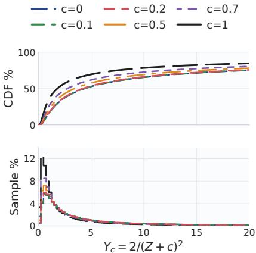
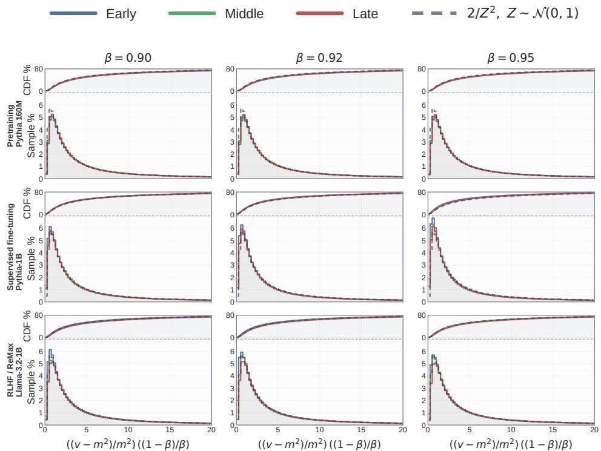
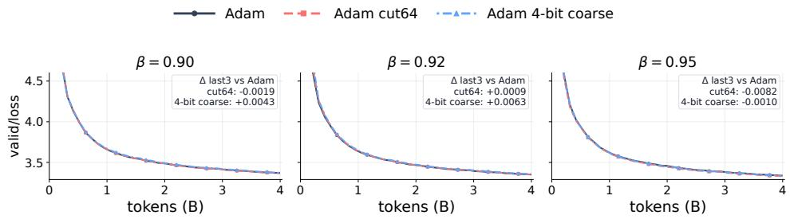
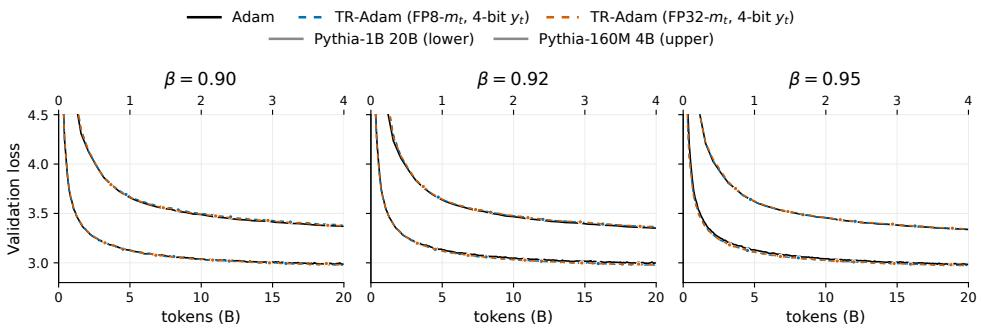
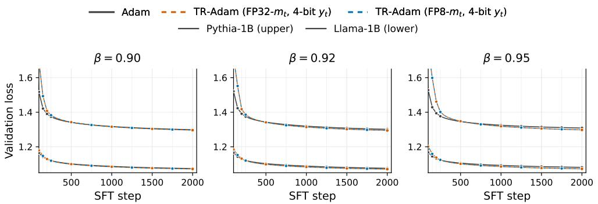
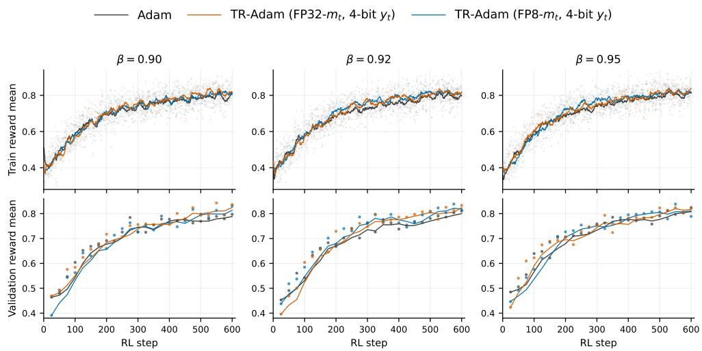
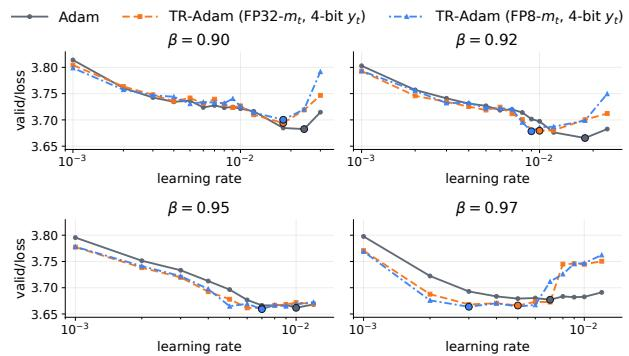
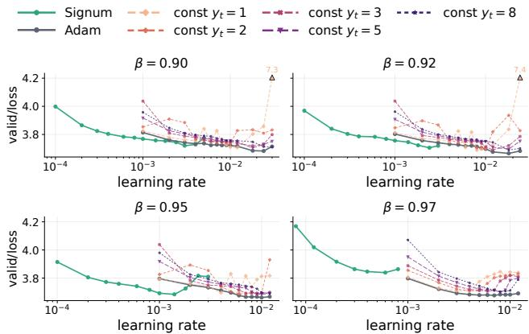
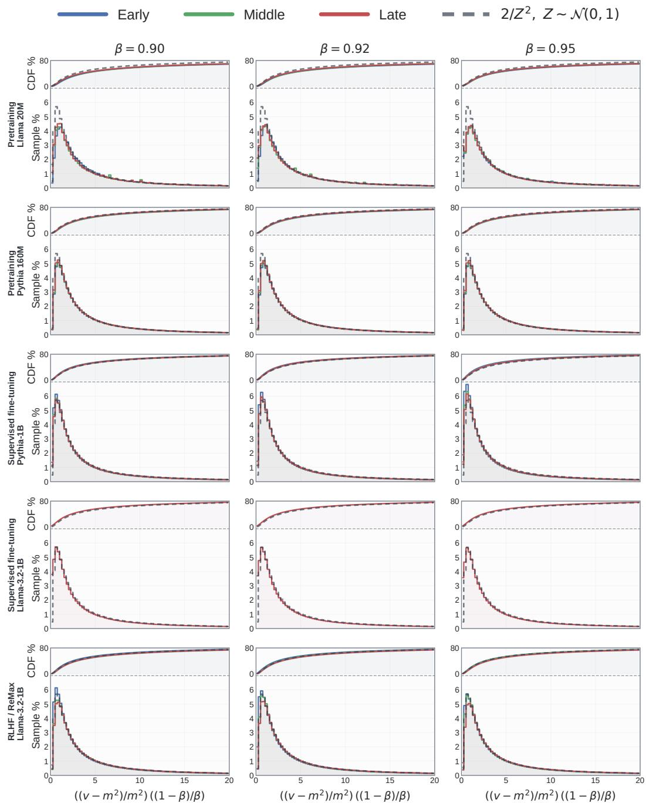

# The Hidden Ratio in Adam: Stable Structure, Compression, and Sign Dynamics

Yihe Zhou1 Tongtian Zhu2 Yingxiao Huo1 Satya Prakash Dash1 Can Wang2 Samuel Kaski1 Mingfei Sun1

1Department of Computer Science, The University of Manchester, Manchester, UK 2College of Computer Science and Technology, Zhejiang University, Hangzhou, China

{yihe.zhou,yingxiao.huo,satyaprakash.dash}@postgrad.manchester.ac.uk {samuel.kaski,mingfei.sun}@manchester.ac.uk {raiden,wcan}@zju.edu.cn

## Abstract

Adam is the default optimizer for training modern deep neural networks, yet its adaptive behavior remains poorly understood due to the complex interaction between its first- and second-moment exponential moving averages (EMAs). We study Adam in the tied-β regime, where the two EMA decay rates are equal, and show that its adaptive dynamics can be expressed through a transformed ratio with approximately scale-stable behavior. Empirically, this transformed ratio exhibits a stable, heavy-tailed distribution across tasks, model scales, and training stages, in contrast to the variability of raw moment magnitudes. This empirical stability has both practical and conceptual consequences. First, we derive a recurrence for the transformed ratio, yielding a reparameterization of Adam that replaces the second moment with a compressible state. Leveraging its stable distribution, we show that a fixed 4-bit codebook is sufficient in our experiments to store this state without auxiliary scaling, achieving performance competitive with fullprecision Adam. Second, the transformed ratio view clarifies Adam’s connection to sign-based methods: Adam reduces to sign-based momentum modulated by the transformed ratio, and replacing it with a constant recovers Signum as a limiting case. This perspective further provides a simple rule for transferring learning rates between the two methods. Together, these results suggest that tied-β Adam admits a simple and approximately stable ratio structure underlying its adaptive behavior and demonstrate its utility for both analysis and efficient implementation.

## 1 Introduction

Adam [22, 28] is the default optimizer for training deep neural networks, from vision models [14, 26] to large language models [10, 5, 39, 36, 32, 1]. Yet, despite its ubiquity, a fundamental question remains unresolved: what determines Adam’s adaptive behavior across scales, tasks, and training regimes? In particular, the interaction between its two exponential moving averages (EMAs) remains difficult to interpret. Specifically, Adam maintains EMAs of the gradient mean $m _ { t }$ and second moment $v _ { t } ,$ , controlled by $\beta _ { 1 }$ and $\beta _ { 2 }$ . The update normalizes a momentum-like direction by a scale estimate of recent gradients, producing coordinate-wise step sizes. While this mechanism is simple, its dynamics depend intricately on gradient scale and noise, obscuring a clean, invariant characterization.

Recent large-scale training increasingly uses closer decay rates, e.g., (0.9, 0.95) [19, 21, 33, 7], motivating the tied-β regime $\beta _ { 1 } = \bar { \beta } _ { 2 }$ This regime is both practically relevant and structurally simpler, as Adam admits a clearer interpretation: its update direction resembles a smoothed sign-based momentum, while the adaptive denominator modulates the step magnitude through a noise-to-signal ratio of stochastic gradients [31]. Complementary analyses suggest that matching the two decay rates introduces useful structural properties, including robustness to gradient scaling and improved stability under nonstationary noise [12, 16, 6].

In this work, we show that tied-β Adam admits an unexpected simplification: its adaptive dynamics can be reparameterized through an approximately scale-stable ratio. Specifically, decomposing the second moment and factoring out the shared β-dependent scale yields a natural-scale ratio $y _ { t } \ ( \mathrm { i . e . }$ the hidden ratio) that isolates stochastic fluctuations from deterministic scaling. Our key finding is that $y _ { t }$ follows a remarkably stable distribution across models, tasks, and training stages. Unlike raw moment magnitudes, which vary with gradient scale, the distribution of $y _ { t }$ is concentrated with a persistent heavy right tail. This suggests a simple underlying structure: tied-β Adam combines a deterministic scale with an approximately stable law governing adaptive attenuation.

This perspective has two immediate consequences. The first is representational. In the tied-β regime, Adam can be equivalently parameterized by $( m _ { t } , y _ { t } )$ instead of $( m _ { t } , v _ { t } )$ . Since $y _ { t }$ has a stable and compressible distribution, it admits aggressive quantization. We show that a fixed 4-bit codebook (16 levels) suffices to nearly match full-precision Adam performance, without requiring additional block-wise or tensor-wise scaling factors. To our knowledge, this is the first result demonstrating that a transformed second-moment-derived state in Adam can be quantized to 4-bit precision with a fixed codebook while retaining strong performance. The second consequence is both practical and conceptual. The ratio formulation clarifies Adam’s relationship to Signum (SignSGD with momentum) [38, 3]. In the tied- $\boldsymbol { \cdot } \beta$ regime, Adam can be viewed as a sign-based momentum method whose step magnitude is attenuated by $y _ { t }$ . Averaging this attenuation under the stable distribution of $y _ { t }$ yields a simple prediction for the effective learning-rate ratio between Adam and its signdominated counterpart, which aligns with our empirical observations. Furthermore, replacing yt with a constant reduces Adam to a Signum-type method with fixed attenuation, showing that a constant-state approximation recovers a Signum-like limit of tied- $- \beta$ Adam. This view provides a principled way to transfer or initialize learning rates between the two methods.

We do not claim that tied-β Adam universally dominates standard Adam configurations or that the transformed-ratio law fully characterizes optimizer dynamics globally. Rather, our contributions are:

• We identify a scale-stable ratio $y _ { t }$ in tied-β Adam with a stable, heavy-tailed distribution across tasks and models. Truncating or coarsely discretizing yt incurs negligible performance loss.

• We identify and derive a recursive characterization of $y _ { t } ,$ enabling a $( m _ { t } , y _ { t } )$ parameterization and a 4-bit fixed-codebook implementation without auxiliary scaling.

• The ratio view yields a learning-rate transfer rule and recovers Signum as a constant-state limit.

## 2 Background and Related Work

Adam [22] and Signum [3, 38]. As an iterative adaptive optimizer, Adam maintains exponential moving averages of the gradient $g _ { t }$ and its square at each iteration $t ,$

$$
m _ { t } : = \beta _ { 1 } m _ { t - 1 } + ( 1 - \beta _ { 1 } ) g _ { t } , \qquad v _ { t } : = \beta _ { 2 } v _ { t - 1 } + ( 1 - \beta _ { 2 } ) g _ { t } ^ { 2 } .\tag{1}
$$

Since both averages are initialized to zero, Adam uses the bias-corrected elementwise scaling:

$$
\hat { m } _ { t } : = \frac { m _ { t } } { 1 - \beta _ { 1 } ^ { t } } , \qquad \hat { v } _ { t } : = \frac { v _ { t } } { 1 - \beta _ { 2 } ^ { t } } , \qquad \Delta \theta _ { t } : = - \eta \frac { \hat { m } _ { t } } { \sqrt { \hat { v } _ { t } } + \epsilon } ,\tag{2}
$$

where ϵ is a small positive constant for numerical stability. Thus, Adam can be viewed as normalizing an exponential estimate of the gradient mean by an exponential estimate of its root second moment. In contrast, Signum maintains a first-moment EMA and applies a sign update:

$$
m _ { t } : = \beta m _ { t - 1 } + ( 1 - \beta ) g _ { t } , \qquad \Delta \theta _ { t } : = - \eta \mathrm { s i g n } ( m _ { t } ) .\tag{3}
$$

The update keeps only the direction of the momentum and uses a fixed coordinatewise step magnitude. A growing line of work has sought to understand Adam through structural interpretations of its update rule, rather than only through empirical tuning heuristics. Early analyses separated the roles of momentum and adaptive scaling, interpreting Adam as combining a sign-based directional component with a variance-controlled magnitude term [2], or more generally disentangling momentum from adaptivity in Adam-style methods [27]. More recent work further expresses Adam’s adaptive scaling through a local signal-to-noise ratio, giving the denominator a direct statistical interpretation [31].

Under this view, Signum [3, 38] can be related to steepest descent under an $\ell _ { \infty }$ trust-region geometry, while Adam corresponds to a signed-momentum direction whose effective step magnitude is modulated by local signal-to-noise structure. Our work follows this structural perspective, but identifies within Adam’s scaling term a comparatively stable distributional quantity that can be represented directly.

Tied-β regime. Our analysis focuses on the tied-β case, $\beta _ { 1 } = \beta _ { 2 } = \beta$ . Ignoring bias correction and ϵ for clarity, the adaptive factor reduces to $\frac { m _ { t } } { \sqrt { v _ { t } } }$ . Because $m _ { t }$ and $v _ { t }$ are then computed with the same exponential weights, $v _ { t } - m _ { t } ^ { 2 }$ has a natural variance-like interpretation. In fact, $v _ { t } \geq m _ { t } ^ { 2 }$ for all gradient sequences and all t if and only if $\beta _ { 1 } = \beta _ { 2 } ;$ the proof is deferred to Appendix B. In this case, Adam admits a particularly clean online mean–variance interpretation [31], and satisfies a first-order gradient scale-invariance property that singles out tied $\beta$ values as a structurally meaningful choice [16]. Analyses of mini-batch noise further suggest that the preferred relation between $\beta _ { 1 }$ and $\beta _ { 2 }$ depends on the noise regime, with larger batch sizes often favoring $\beta _ { 1 }$ closer to $\beta _ { 2 }$ in terms of validation performance [6]. Complementary empirical studies in nonstationary optimization and reinforcement learning indicate that mismatched first- and second-moment timescales can weaken normalization and destabilize updates [15, 12], whereas tied or near-tied decay rates can improve stability in practice [30, 13, 18]. Motivated by these observations, we focus on $\beta _ { 1 } = \beta _ { 2 }$ when analyzing Adam’s ratio recursion and distributional behavior, since this is the regime where prior work suggests both cleaner dynamics and improved stability.

## 3 Hidden Ratio: Theoretical and Empirical Properties

In the tied-β regime, define

$$
r _ { t } : = \frac { v _ { t } - m _ { t } ^ { 2 } } { m _ { t } ^ { 2 } } , \quad \frac { m _ { t } } { \sqrt { v _ { t } } } = \frac { \mathrm { s i g n } ( m _ { t } ) } { \sqrt { 1 + r _ { t } } } .
$$

Thus the update direction is determined by the sign of the momentum, while $r _ { t }$ controls the magnitude attenuation. Since $r _ { t } \geq 0$ under tied $\beta$ values, the denominator is bounded below by 1 [31]. We now define the transformed ratio

$$
y _ { t } : = \frac { 1 - \beta } { \beta } r _ { t } , \qquad \frac { m _ { t } } { \sqrt { v _ { t } } } = \frac { \mathrm { s i g n } ( m _ { t } ) } { \sqrt { 1 + \frac { \beta } { 1 - \beta } y _ { t } } } .\tag{4}
$$

This reparameterization identifies $y _ { t }$ as the central quantity in the Adam update, thereby motivating a closer examination of its statistical structure. Intuitively, $y _ { t }$ measures the variance-like residual in Adam’s denominator after removing the deterministic scale induced by tied exponential averaging.

## 3.1 Statistical Structure of $y _ { t } \mathbf { i }$ : Stability and Heavy Tails

Since mini-batches are sampled independently, we follow the diffusion-approximation view of minibatch SGD and model the local gradient noise by independent Gaussian fluctuations [29, 20, 23].

Assumption 1 (Local Gaussian window). For one coordinate in a local time window,

$$
g _ { t - j } = \mu + \sigma \xi _ { j } , \qquad \xi _ { j } \overset { \mathrm { i . i . d . } } { \sim } \mathcal { N } ( 0 , 1 ) , \qquad j \geq 0 .
$$

Fix $0 < \beta < 1$ and let $\begin{array} { r } { w _ { j } = ( 1 - \beta ) \beta ^ { j } , m _ { t } = \sum _ { j > 0 } w _ { j } g _ { t - j } , v _ { t } = \sum _ { j > 0 } w _ { j } g _ { t - j } ^ { 2 } , U _ { t } = v _ { t } - m _ { t } ^ { 2 } } \end{array}$ $\begin{array} { r } { y _ { t } = \frac { 1 - \beta } { \beta } \frac { U _ { t } } { m _ { t } ^ { 2 } } , s _ { \beta } ^ { 2 } = \sum _ { j \ge 0 } w _ { j } ^ { 2 } = \frac { 1 - \beta } { 1 + \beta } , \sigma _ { m } = \sigma s _ { \beta , } a = \mu / \sigma _ { m } , \mathrm { a n d } Z = s _ { \beta } ^ { - 1 } \sum _ { j \ge 0 } w _ { j } \xi _ { j } \ge 0 , } \end{array}$ . Under Assumption $1 , Z \sim \mathcal { N } ( 0 , 1 )$ and $m _ { t } = \sigma _ { m } ( Z + a )$ . When comparing many local windows, let $\mathcal { T }$ index the observed coordinate-window instances and let $a _ { i }$ be the local shift at index i. Treating these instances as equally weighted samples gives the empirical pooled-shift distribution

$$
\widehat { P } _ { A } : = \frac { 1 } { | { \cal Z } | } \sum _ { i \in { \cal Z } } \delta _ { a _ { i } } , \qquad A \sim \widehat { P } _ { A } , \qquad \mathbb { E } _ { \widehat { P } _ { A } } [ A ^ { 2 } ] = \frac { 1 } { | { \cal Z } | } \sum _ { i \in { \cal Z } } a _ { i } ^ { 2 } .
$$

Equivalently, $A \sim { \widehat { P } } _ { A }$ means drawing I uniformly from $\mathcal { T }$ and setting $A = a _ { I }$ . More generally, a pooled-shift distribution $P$ is any distribution over local shifts used in this sampling role; the empirical case is $P = \widehat { P } _ { A }$ . For any fixed scalar shift $b ,$ write $Y _ { b } : = 2 / ( Z + b ) ^ { 2 }$ , so a single local window uses $Y _ { a } .$ . If $A \sim P$ is independent of $Z ,$ , the pooled denominator reference is $Y _ { A } : = { 2 } / { ( Z + A ) ^ { 2 } }$

Proposition 1 (Shifted inverse-square reference for the ratio). Under Assumption 1 and the notation above, the transformed ratio satisfies

$$
y _ { t } = Y _ { a } \left( 1 + \frac { \eta _ { t } } { 2 } \right) , \qquad \eta _ { t } = \eta _ { t } ^ { \mathrm { c o u p } } + \eta _ { t } ^ { \mathrm { f u c } } ,\tag{5}
$$

where $\begin{array} { r } { \gamma _ { \beta } = \frac { 1 - \beta } { 1 + \beta + \beta ^ { 2 } } , \eta _ { t } ^ { \mathrm { c o u p } } : = \gamma _ { \beta } ( Z ^ { 2 } - 1 ) } \end{array}$ , and $\begin{array} { r } { \eta _ { t } ^ { \mathrm { q u c } } : = \frac { 1 - \beta } { \beta } \frac { U _ { t } - \mathbb { E } \left[ U _ { t } \vert Z \right] } { \sigma _ { m } ^ { 2 } } } \end{array}$ . Let P be a pooled-shift distribution withfinitefourth moment, and let $A \sim P$ be independent ofZ. Then thefixed shifted reference

$$
Y _ { c } = \frac { 2 } { ( Z + c ) ^ { 2 } } , \qquad Z \sim \mathcal { N } ( 0 , 1 ) , \qquad c ^ { 2 } : = \mathbb { E } _ { P } [ A ^ { 2 } ]\tag{6}
$$

matches the mixed denominator reference $Y _ { A } = 2 / ( Z + A ) ^ { 2 }$ through second order: for every fixed $k > 0 _ { : }$ , writing $q = { \sqrt { 2 / k } } ,$ , and denoting the standard normal CDF and density by Φ and $\phi ,$

$$
\begin{array} { r l } & { \operatorname* { P r } ( Y _ { A } > k ) = 2 \Phi ( q ) - 1 - q \phi ( q ) \mathbb { E } _ { P } [ A ^ { 2 } ] + O ( \mathbb { E } _ { P } [ A ^ { 4 } ] ) , } \\ & { \operatorname* { P r } ( Y _ { c } > k ) = 2 \Phi ( q ) - 1 - q \phi ( q ) c ^ { 2 } + O ( c ^ { 4 } ) . } \end{array}\tag{7}
$$

In particular, for a family $P _ { \varepsilon }$ of pooled-shift distributions with $A _ { \varepsilon } \sim P _ { \varepsilon } , c _ { \varepsilon } ^ { 2 } : = \mathbb { E } _ { P _ { \varepsilon } } [ A _ { \varepsilon } ^ { 2 } ]$ , and $\mathbb { E } _ { P _ { \varepsilon } } [ A _ { \varepsilon } ^ { 4 } ] = O ( \varepsilon ^ { 4 } )$ , the corresponding references satisfy $\mathrm { P r } ( Y _ { A _ { \varepsilon } } > k ) - \mathrm { P r } ( Y _ { c _ { \varepsilon } } > k ) = { \bar { O } } ( \varepsilon ^ { \bar { 4 } } )$

Remark. Equation 5 is a denominator-reference decomposition: for a fixed local shift $a , Y _ { a } =$ $2 / ( Z + a ) ^ { 2 }$ carries the inverse-square denominator, while $\eta _ { t }$ keeps the numerator as an exact relative correction. The pooled-shift distribution $P$ is the formal version of flattening many observed local shifts; drawing $A \sim P$ selects one representative local shift, so the denominator reference becomes $Y _ { A } = 2 / ( Z + \overline { { A } } ) ^ { 2 }$ . Equation 7 shows that the survival curve of $Y _ { A }$ depends to second order only on $\mathbb { E } _ { P } [ A ^ { 2 } ]$ . Choosing $c = \sqrt { \mathbb { E } _ { P } [ A ^ { 2 } ] }$ keeps this leading shift effect and the same inverse-square singularity, which is why we use $Y _ { c }$ in Equation (6) as the reference for the empirical $y _ { t }$

Figure 1 illustrates this point for the reference distribution. When the shift c is small, the CDF and histogram of $Y _ { c } = 2 / ( Z + c ) ^ { 2 }$ remain close to those of the unshifted reference $2 / Z ^ { 2 }$ , preserving both the bulk and the right-tail shape. This suggests that the inverse-square denominator singularity drives the dominant distributional form, while local shifts and numerator fluctuations introduce only secondary distortions. The full derivation is given in Appendix A. This picture is reflected in the empirical distributions in Figure 2. Across pre-training, SFT, RLHF, and $\beta \in \left\{ 0 . 9 0 , \mathrm { { 0 . 9 2 , 0 . 9 5 } } \right\}$ , the transformed ratio $y _ { t }$ consistently shows a compact single-digit bulk with a persistent right tail. Within each setting, the early-, middle-, and late-stage curves remain close, indicating only mild distributional drift during training. The empirical CDFs also stay close to the $2 / \bar { Z } ^ { 2 }$ reference over a broad range. Together, these observations support the view that the rescaled ratio $y _ { t }$ captures a natural-scale denominator state whose distribution is more stable than the raw moment magnitudes $m _ { t }$ and $v _ { t }$

  
Figure 1: Shifted inverse-square reference $Y _ { c } = { 2 } / { ( Z + c ) ^ { 2 } }$ . For $c \leq 0 . 2$ , the CDF and histogram are nearly unchanged; the shape is driven mainly by the inverse-square form.

## 3.2 Robustness of $y _ { t }$ to coarse quantization

Given that the distribution of $y _ { t }$ exhibits a clearly concentrated bulk together with a long right tail, we now investigate whether a very coarse quantization of $y _ { t }$ is sufficient to retain behavior and performance close to those of the original Adam. To isolate its role, we keep the original Adam recursions for $m _ { t }$ and $v _ { t }$ unchanged, compute $y _ { t }$ from the resulting states, and replace only this variable by a coarse low-precision approximation before reconstructing the adaptive denominator.

We begin with a particularly simple modification: truncating the upper tail of $y _ { t }$ . The cut64 variant replaces $y _ { t }$ by $\operatorname* { m i n } ( y _ { t } , 6 4 )$ before reconstructing the adaptive denominator, thereby removing only rare far-tail values. Empirically, this truncation has little effect, and the resulting optimizer still tracks standard Adam closely.

Figure 2: Distribution of the transformed ratio $y _ { t }$ across training regimes. Columns correspond to $\beta = 0 . 9 0 , 0 . 9 2 , 0 . 9 5 .$ , while rows compare pretraining on Pythia-160M, supervised fine-tuning on Pythia-1B, and RLHF on LLaMA-1B. Within each block, the top panel shows the CDF and the bottom panel shows the histogram; colors denote early, middle, and late training stages.  
  
Figure 3: Comparison of the training performance of standard Adam and its modified variants based on the transformed ratio $y _ { t }$ , including long-tail truncation and coarse 4-bit quantization. Even after truncating the right tail and representing the remaining bulk with only 16 quantization levels, the resulting optimizer still closely tracks the behavior and final performance of the standard Adam.

We then take a more aggressive step and replace $y _ { t }$ itself by a coarse low-precision approximation. After the same cut64 truncation, we quantize $y _ { t }$ using the fixed 4-bit codebook ${ \mathcal { C } } =$ $\{ 0 . 2 5 , 0 . 5 , 0 . 7 5 , 1 , 1 . 5 , 2 , 3 , 4 , 6 , 8 , 1 2 , 1 6 , 2 4 , 3 2 , \dot { 4 } 8 , 6 4 \}$ , an FP4-like non-uniform codebook with levels concentrated around the empirical bulk of $y _ { t }$ . The quantized value is obtained by nearestneighbor projection: $\begin{array} { r } { \tilde { y } _ { t } = Q ( y _ { t } ) : = \arg \operatorname* { m i n } _ { q \in \mathcal { C } } | y _ { t } - q | } \end{array}$

Taken together, the results in Figure 3 suggest that Adam does not require precise pointwise fidelity in $y _ { t }$ in order to realize its adaptive effect. What appears to matter is not the exact value of the transformed ratio at each step, but the coarse attenuation information that it carries. This is consistent with the distributional structure described above: most of the mass of $y _ { t }$ lies in a relatively compact regime, while the update depends on it only through the smooth factor $\left( 1 + \frac { \beta } { 1 - \beta } y _ { t } \right) ^ { - 1 / 2 }$ . As a result, neither removing rare tail events nor coarsening the representation within the bulk of the distribution significantly perturbs the effective step size. This robustness motivates the ratio-based reformulation developed in the next section. If Adam’s essential adaptive behavior is already preserved under severe truncation and coarse quantization of the transformed ratio, then the more natural object to analyze is not the raw moment pair $( m _ { t } , v _ { t } )$ , but the induced dynamics of the transformed ratio itself. We emphasize that this is only a diagnostic experiment in Figure 3: the original Adam recursions for $m _ { t }$ and $v _ { t }$ are unchanged, and only the induced $y _ { t }$ is coarsened before reconstructing the denominator.

  
Figure 4: Pre-training comparison between full Adam and low-precision ratio representation.

## 4 Recursive Reformulation of Adam

Unlike the diagnostic coarsening above, we now maintain $y _ { t }$ recursively and use it as the stored second state. Given the stable structure of the transformed ratio, we now show that Adam can be equivalently parameterized by $( m _ { t } , y _ { t } )$ instead of $( m _ { t } , v _ { t } )$ , motivating the low-precision state representation evaluated below.

## 4.1 A scalar recursion for the transformed ratio

We now derive a recursion for the transformed ratio $y _ { t }$ . Starting from the recursion $m _ { t } = \beta m _ { t - 1 } +$ $( 1 - \beta ) g _ { t }$ t, we can rewrite the current gradient as

$$
g _ { t } = \frac { m _ { t } - \beta m _ { t - 1 } } { 1 - \beta } = \frac { m _ { t } } { 1 - \beta } ( 1 - \beta x _ { t } ) , \quad x _ { t } : = \frac { m _ { t - 1 } } { m _ { t } } .\tag{8}
$$

Substituting this into the second-moment recursion $v _ { t } = \beta v _ { t - 1 } + ( 1 - \beta ) g _ { t } ^ { 2 }$ gives

$$
v _ { t } = \beta v _ { t - 1 } + \frac { m _ { t } ^ { 2 } } { 1 - \beta } ( 1 - \beta x _ { t } ) ^ { 2 } .\tag{9}
$$

Using $\begin{array} { r } { v _ { s } = m _ { s } ^ { 2 } ( 1 + \frac { \beta } { 1 - \beta } y _ { s } ) } \end{array}$ for $s \in \{ t , t - 1 \}$ , together with $m _ { t - 1 } = x _ { t } m _ { t }$ , Equation (9) yields

$$
y _ { t } = \beta x _ { t } ^ { 2 } y _ { t - 1 } + ( 1 - x _ { t } ) ^ { 2 } .\tag{10}
$$

Equation 10 shows that, once the sign of $m _ { t }$ is fixed, Adam’s adaptive behavior is well described by a one-dimensional transformed ratio recursion: the sign determines the update direction, while $y _ { t }$ controls the attenuation magnitude. Additional algebraic details are provided in Appendix $\mathrm { { C } . }$

## 4.2 Coarse representation through the recursion

Equation 10 suggests a natural target for coarse representation. Instead of compressing the coupled raw states $( m _ { t } , v _ { t } )$ directly, we represent the transformed ratio $y _ { t } .$ , which is the scalar quantity controlling the adaptive denominator. Concretely, after obtaining $y _ { t }$ , we replace it by the nearest value in a fixed FP4-like codebook: ${ \tilde { y } } _ { t } \ = \ Q ( y _ { t } ) \ : = \ \arg \operatorname* { m i n } _ { q \in { \mathcal { C } } } | y _ { t } \ - \ q |$ . Here, $\mathcal { C } = \{ 0 . 2 5 , 0 . 5 , 0 . 7 5 , 1 , 1 . 5 , 2 , 3 , 4 , 6 , 8 , 1 2 , 1 6 , 2 4 , \hat { 3 } 2 , 4 8 , 6 4 \}$ . This 16-level codebook allocates more resolution to the moderate range where the transformed ratio distribution concentrates, while still retaining several larger values for the right tail. The adaptive denominator is then reconstructed from $\tilde { y } _ { t }$ through the same transformed expression as in Equation (4), with $y _ { t }$ replaced by $\tilde { y } _ { t }$ . Thus, coarse representation acts directly on the transformed-ratio attenuation rather than separately perturb ing the raw moment states $m _ { t }$ and $v _ { t } .$ . Notably, this representation uses no per-block scaling factors, learned quantizers, or auxiliary normalization metadata.

  
Figure 5: SFT comparison between full Adam and low-precision transformed-ratio representation.

## 4.3 Experiments on low-precision quantization of the transformed ratio

  
Figure 6: RLHF comparison between full Adam and low-precision transformed-ratio representation. We next examine whether the transformed ratio representation remains effective across the full language-model training pipeline. We compare tied-β Adam with its low-precision transformed ratio variant in three representative stages: pre-training, supervised fine-tuning (SFT), and reinforcementlearning-based alignment (RLHF). In all settings, the optimizer is modified only through the coarse storage representation of $y _ { t } ;$ the rest of the training recipe is kept unchanged. In addition to storing $y _ { t }$ with a 4-bit codebook, we also evaluate variants in which the first-moment state $m _ { t }$ is stored in FP8 [35, 8, 17]. This is a useful stress test for the transformed-ratio formulation: although the recursion depends on ratios involving $m _ { t }$ , the combination of FP8 first-moment storage and 4-bit transformed-ratio storage still preserves strong performance in our experiments.

Figures 4 to 6 show that the lowprecision transformed-ratio variant closely tracks full Adam across all three stages. In pre-training, the two validation-loss curves nearly overlap throughout optimization and reach essentially the same final loss, suggesting that the transformed ratio preserves the denominator-side information needed for long-horizon large-scale training. In SFT and RLHF, the low-precision variant may initially lag the full-Adam baseline, but it improves steadily and often matches or slightly exceeds Adam later in training. Thus, the effect of coarse transformed-ratio representation

  
Figure 7: Learning-rate sweeps on Llama-20M pre-training comparing tied- $- \beta$ Adam with transformed-ratio Adam using FP32 or FP8 first-moment storage and 4-bit $y _ { t }$

is not merely harmless compression: in post-training regimes, it can behave like a mild smoothing or regularization of the adaptive denominator dynamics.

We further examine whether the low-precision transformed-ratio representation preserves Adam’s learning-rate sensitivity. Figure 7 shows learning-rate sweeps on a Llama-20M pre-training setup under four tied-β values. Across $\beta = 0 . 9 0 , 0 . 9 2 , \mathrm { { 0 . 9 5 , 0 . 9 7 } }$ , both transformed-ratio variants closely track the Adam sweep profile: their favorable learning-rate regions remain aligned with Adam, and performance degradation at overly large learning rates occurs at similar scales. This indicates that coarse transformed-ratio storage does not simply succeed after careful retuning at a single operating point; rather, it largely preserves Adam’s effective learning-rate structure.

Overall, the results show that the transformed ratio $y _ { t }$ is a robust target for coarse representation: in pre-training it recovers Adam-like behavior almost exactly, while in SFT and RLHF it remains competitive and can sometimes improve late-stage performance. This stage-consistent behavior suggests that the essential adaptive dynamics of tied-β Adam are captured by a low-complexity transformed-ratio structure rather than by high-precision values of the raw second-moment state. More experimental results are provided in Appendix D.

## 5 The Signum-like Limit

## 5.1 A constant-state approximation and the Signum-like limit

The transformed-ratio representation provides a simple interpretation of Adam as a sign-momentum method with stochastic attenuation. From Equation (4), once the sign of the momentum is fixed, Adam’s adaptive behavior is controlled by the scalar attenuation factor $( 1 + ( \beta / ( 1 - \beta ) ) y _ { t } ) ^ { - 1 / 2 }$ This motivates a constant-state approximation in which the transformed ratio $y _ { t }$ is replaced by a representative constant value $y _ { \mathrm { c o n s t } } \ge 0$ . The resulting Signum-type update and the corresponding learning-rate matching rule are

$$
\Delta \theta _ { t } \approx - \eta _ { \mathrm { a d a m } } \left( 1 + \frac { \beta } { 1 - \beta } y _ { \mathrm { c o n s t } } \right) ^ { - \frac { 1 } { 2 } } \mathrm { s i g n } ( m _ { t } ) , \quad \eta _ { \mathrm { s i g n } } \approx \eta _ { \mathrm { a d a m } } \left( 1 + \frac { \beta } { 1 - \beta } y _ { \mathrm { c o n s t } } \right) ^ { - \frac { 1 } { 2 } } .\tag{11}
$$

$$
\Delta \theta _ { t } ^ { \mathrm { s i g n } } = - \eta _ { \mathrm { s i g n } } \mathrm { s i g n } ( m _ { t } )
$$

$$
y _ { t }
$$

To choose $y _ { \mathrm { { c o n s t } } }$ , we match the expected attenuation, or equivalently the expected effective step size, under the transformed-ratio distribution:

$$
\begin{array} { r } { \mathbb { E } \big [ ( 1 + \frac { \beta } { 1 - \beta } y _ { t } ) ^ { - \frac { 1 } { 2 } } \big ] = ( 1 + \frac { \beta } { 1 - \beta } y _ { \mathrm { c o n s t } } ) ^ { - \frac { 1 } { 2 } } . } \end{array}\tag{12}
$$

Solving for the attenuation-matched constant gives

$$
y _ { \mathrm { c o n s t } } = \frac { 1 - \beta } { \beta } \Big ( \mathbb { E } \big [ ( 1 + \frac { \beta } { 1 - \beta } y _ { t } ) ^ { - \frac { 1 } { 2 } } \big ] ^ { - 2 } - 1 \Big ) .\tag{13}
$$

This calibration is useful because it connects the constant-state approximation directly to Adam’s native learning-rate scale, rather than treating Signum as requiring an unrelated learning-rate search.

To make the scale of $y _ { \mathrm { { c o n s t } } }$ more concrete, we substitute the shifted inverse-square reference $Y _ { c } =$ $2 / ( Z + c ) ^ { 2 }$ from Proposition 1 into this expression. This yields

$$
y _ { \mathrm { c o n s t } } ^ { \mathrm { e f f } } ( \beta , c ) = \frac { 1 - \beta } { \beta } \left( \mathbb { E } _ { Z \sim \mathcal { N } ( 0 , 1 ) } \big [ ( 1 + \frac { 2 \beta } { ( 1 - \beta ) ( Z + c ) ^ { 2 } } ) ^ { - \frac { 1 } { 2 } } \big ] ^ { - 2 } - 1 \right) .\tag{14}
$$

Numerically, this value is stable for the small shifts considered in the distributional model. As shown in Table 1, the attenuation-matched constant remains slightly above 3 across $\beta \in [ 0 . 9 0 , 0 . 9 7 ]$ and $c \in \{ 0 , 0 . 1 , 0 . 2 \}$ . Thus, under the same shifted-reference law used to describe the empirical transformed-ratio distribution, a moderate constant transformed-ratio value should already capture Adam’s typical attenuation scale.

A practical advantage of this view is that it expresses a Signum-like optimizer in Adam’s native learning-rate parameterization. In modern language-model training, Adam learning-rate heuristics are well established, whereas Signum often requires a separate learning-rate search. Replacing yt with a moderate constant therefore yields a simplified sign-style update that remains calibrated to the Adam learning-rate scale, making it possible to reuse Adam-style tuning rather than introducing a separate optimizer-specific search. We therefore test several representative values of $y _ { \mathrm { c o n s t } }$ and compare them against Adam and Signum in learning-rate sweeps across different values of $\beta$

## 5.2 Learning-rate sweeps across β: empirical observations

We now test the constant-state proxy by comparing learning-rate sweeps of Adam, Signum, and several constant-$y _ { t }$ variants across a range of $\beta ;$ see Figure 8. Two empirical trends consistently appear.

First, Signum’s preferred learningrate region shifts systematically to smaller values as $\beta$ increases. This behavior is consistent with the learningrate scale predicted by Equation (11). If Adam’s preferred learning-rate scale is viewed as relatively stable across $\beta ,$ then a pure Signum update must compensate for the transformedratio attenuation that Adam applies. Since the prefactor $\beta / ( 1 - \beta )$ grows rapidly with $\beta ,$ , the effective attenua-

  
Figure 8: Learning-rate sweeps: Signum shifts to smaller learning rates as $\beta$ increases, while constant-state proxies $y _ { \mathrm { c o n s t } } \in \{ 3 , 5 \}$ best preserve Adam’s learning-rate scale.

tion in Equation (11) becomes stronger at larger $\beta .$ Thus, matching Adam’s effective step size requires a smaller Signum learning rate. This matches the trend observed empirically in Figure $8 \colon$ as $\beta$ increases, the favorable learning-rate region for Signum moves markedly left relative to Adam. Second, the constant- $- y _ { t }$ variants preserve Adam’s learning-rate scale much better than pure Signum. Among the tested constants, $y _ { \mathrm { c o n s t } } \in \{ 3 , 5 \}$ gives the closest overall match to Adam’s preferred learning-rate region. This is broadly consistent with the step-size-matching calculation in Equation (14) and the numerical values reported above, which place the effective constant slightly above 3 under the shifted-reference model. Although the true transformed ratio $y _ { t }$ is stochastic and heavytailed, these results suggest that its dominant effect on the optimizer’s learning-rate scale can be captured by a single moderate constant.

This observation is practically useful. Directly using Signum requires a separate learning-rate search, and the appropriate learning rate changes noticeably with $\beta .$ By contrast, the constant-yt proxy remains in Adam’s native learning-rate parameterization: replacing $y _ { t }$ by a moderate constant yields a Signum-like update whose effective step size is already calibrated to Adam. Taken together, the sweeps show that tied-β Adam behaves like a sign-based method modulated by the transformed-ratio attenuation, and that a constant approximation can preserve much of Adam’s learning-rate scale.

Table 1: $y _ { \mathrm { c o n s t } } ^ { \mathrm { e f f } }$ under $Y _ { c } = 2 / ( Z + c ) ^ { 2 }$
<table><tr><td>C</td><td> $\beta = 0 . 9 0$ </td><td> $\beta = 0 . 9 2$ </td><td> $\beta = 0 . 9 5$   $\beta = 0 . 9 7$ </td></tr><tr><td>0</td><td>3.36</td><td>3.31 3.25</td><td>3.21</td></tr><tr><td>0.1</td><td>3.33</td><td>3.28 3.22</td><td>3.18</td></tr><tr><td>0.2</td><td>3.24</td><td>3.19 3.13</td><td>3.09</td></tr></table>

## 6 Conclusion and Limitations

In this paper, we studied Adam in the tied-β regime, $\beta _ { 1 } = \beta _ { 2 }$ , through a transformed ratio $y _ { t }$ By factoring out the explicit $\beta .$ -dependent scale, this representation exposes a comparatively stable ratio structure in Adam’s adaptive denominator that is obscured in the raw moment states $m _ { t }$ and $v _ { t }$ . Empirically, the distribution of $y _ { t }$ remains consistent across training settings: most coordinates concentrate in a moderate range, while a persistent heavy tail captures rare large ratio-state values. By isolating an approximately stable state inside Adam’s adaptive denominator, the ratio view yields two practical consequences. First, y provides a compact replacement for the raw second-moment state v : across the language-model training regimes studied here, a fixed 4-bit codebook for y preserves performance close to that of full-precision Adam. Second, the same representation clarifies Adam’s connection to Signum: tied-β Adam can be viewed as a sign-momentum update attenuated by yt, and replacing yt by a constant yields a Signum-type limit with an explicit learning-rate scaling. Overall, these results suggest that tied-β Adam’s adaptive behavior can be captured to a surprising extent through coarse but stable ratio information. Our experiments are limited to Transformer language models up to 1B parameters. Larger-scale and non-Transformer validation remains future work.

## References

[1] Yuntao Bai, Andy Jones, Kamal Ndousse, Amanda Askell, Anna Chen, Nova DasSarma, Dawn Drain, Stanislav Fort, Deep Ganguli, Tom Henighan, Nicholas Joseph, Saurav Kadavath, Jackson Kernion, Tom Conerly, Sheer El-Showk, Nelson Elhage, Zac Hatfield-Dodds, Danny Hernandez, Tristan Hume, Scott Johnston, Shauna Kravec, Liane Lovitt, Neel Nanda, Catherine Olsson, Dario Amodei, Tom Brown, Jack Clark, Sam McCandlish, Chris Olah, Ben Mann, and Jared Kaplan. Training a helpful and harmless assistant with reinforcement learning from human feedback. arXiv preprint arXiv:2204.05862, 2022.

[2] Lukas Balles and Philipp Hennig. Dissecting adam: The sign, magnitude and variance of stochastic gradients. In International Conference on Machine Learning, 2018.

[3] Jeremy Bernstein, Yu-Xiang Wang, Kamyar Azizzadenesheli, and Anima Anandkumar. signsgd: Compressed optimisation for non-convex problems. In International Conference on Machine Learning, 2018.

[4] Stella Biderman, Hailey Schoelkopf, Quentin Anthony, Herbie Bradley, Kyle O’Brien, Eric Hallahan, Mohammad Aflah Khan, Shivanshu Purohit, USVSN Sai Prashanth, Edward Raff, Aviya Skowron, Lintang Sutawika, and Oskar van der Wal. Pythia: A suite for analyzing large language models across training and scaling. In International Conference on Machine Learning, 2023.

[5] Tom B. Brown, Benjamin Mann, Nick Ryder, Melanie Subbiah, Jared Kaplan, Prafulla Dhariwal, Arvind Neelakantan, Pranav Shyam, Girish Sastry, Amanda Askell, Sandhini Agarwal, Ariel Herbert-Voss, Gretchen Krueger, Tom Henighan, Rewon Child, Aditya Ramesh, Daniel M. Ziegler, Jeffrey Wu, Clemens Winter, Christopher Hesse, Mark Chen, Eric Sigler, Mateusz Litwin, Scott Gray, Benjamin Chess, Jack Clark, Christopher Berner, Sam McCandlish, Alec Radford, Ilya Sutskever, and Dario Amodei. Language models are few-shot learners. In Advances in Neural Information Processing Systems, 2020.

[6] Matias D. Cattaneo and Boris Shigida. The effect of mini-batch noise on the implicit bias of adam. arXiv preprint arXiv:2602.01642, 2026.

[7] Kuang-Ming Chen, Jenq-Neng Hwang, and Hung yi Lee. InstructionCP: A simple yet effective approach for transferring large language models to target languages. In Workshop on Research in Computational Linguistic Typology and Multilingual NLP, 2025.

[8] Kamran Chitsaz, Quentin Fournier, Gonçalo Mordido, and Sarath Chandar. Exploring quantization for efficient pre-training of transformer language models. In Findings ofthe Association for Computational Linguistics: EMNLP, 2024.

[9] Ganqu Cui, Lifan Yuan, Ning Ding, Guanming Yao, Bingxiang He, Wei Zhu, Yuan Ni, Guotong Xie, Ruobing Xie, Yankai Lin, Zhiyuan Liu, and Maosong Sun. Ultrafeedback: Boosting language models with scaled ai feedback. arXiv preprint arXiv:2310.01377, 2023.

[10] Jacob Devlin, Ming-Wei Chang, Kenton Lee, and Kristina Toutanova. BERT: Pre-training of deep bidirectional transformers for language understanding. In North American Chapter ofthe Associationfor Computational Linguistics, 2019.

[11] Ning Ding, Yulin Chen, Bokai Xu, Yujia Qin, Shengding Hu, Zhiyuan Liu, Maosong Sun, and Bowen Zhou. Enhancing chat language models by scaling high-quality instructional conversations. In Conference on Empirical Methods in Natural Language Processing, 2023.

[12] Shibhansh Dohare, Qingfeng Lan, and A. Rupam Mahmood. Overcoming policy collapse in deep reinforcement learning. In Sixteenth European Workshop on Reinforcement Learning, 2023.

[13] Shibhansh Dohare, J. Fernando Hernandez-Garcia, Qingfeng Lan, Parash Rahman, A. Rupam Mahmood, and Richard S. Sutton. Loss of plasticity in deep continual learning. Nature, 2024.

[14] Alexey Dosovitskiy, Lucas Beyer, Alexander Kolesnikov, Dirk Weissenborn, Xiaohua Zhai, Thomas Unterthiner, Mostafa Dehghani, Matthias Minderer, Georg Heigold, Sylvain Gelly, Jakob Uszkoreit, and Neil Houlsby. An image is worth 16x16 words: Transformers for image recognition at scale. In International Conference on Learning Representations, 2021.

[15] Benjamin Ellis, Matthew T. Jackson, Andrei Lupu, Alexander D. Goldie, Mattie Fellows, Shimon Whiteson, and Jakob N. Foerster. Adam on local time: Addressing nonstationarity in rl with relative adam timesteps. In Advances in Neural Information Processing Systems, 2024.

[16] Alberto Fernández-Hernández, Cristian Pérez-Corral, Jose I. Mestre, Manuel F. Dolz, and Enrique S. Quintana-Ortí. Why adam works better with $\beta _ { 1 } = \beta _ { 2 } ;$ The missing gradient scale invariance principle. arXiv preprint arXiv:2601.21739, 2026.

[17] Maxim Fishman, Brian Chmiel, Ron Banner, and Daniel Soudry. Scaling fp8 training to trillion-token llms. In International Conference on Learning Representations, 2025.

[18] Alexander D. Goldie, Chris Lu, Matthew T. Jackson, Shimon Whiteson, and Jakob N. Foerster. Can learned optimization make reinforcement learning less difficult? In Advances in Neural Information Processing Systems, 2024.

[19] Dirk Groeneveld, Iz Beltagy, Pete Walsh, Akshita Bhagia, Rodney Kinney, Oyvind Tafjord, Ananya Harsh Jha, Hamish Ivison, Ian Magnusson, Yizhong Wang, et al. OLMo: Accelerating the science of language models. arXiv preprint arXiv:2402.00838, 2024.

[20] Fengxiang He, Tongliang Liu, and Dacheng Tao. Control batch size and learning rate to generalize well: Theoretical and empirical evidence. In Advances in Neural Information Processing Systems, volume 32, 2019.

[21] Hugging FaceTB. SmolLM3: Smol, multilingual, long-context reasoner. https:// huggingface.co/blog/smollm3, 2025.

[22] Diederik P. Kingma and Jimmy Ba. Adam: A method for stochastic optimization. In International Conference on Learning Representations, 2015.

[23] Zhiyuan Li, Tianhao Wang, and Sanjeev Arora. What happens after SGD reaches zero loss? –a mathematical framework. In International Conference on Learning Representations, 2022.

[24] Ziniu Li, Tian Xu, Yushun Zhang, Zhihang Lin, Yang Yu, Ruoyu Sun, and Zhi-Quan Luo. ReMax: A simple, effective, and efficient reinforcement learning method for aligning large language models. In International Conference on Machine Learning, 2024.

[25] Chris Yuhao Liu, Liang Zeng, Yuzhen Xiao, Jujie He, Jiacai Liu, Chaojie Wang, Rui Yan, Wei Shen, Fuxiang Zhang, Jiacheng Xu, Yang Liu, and Yahui Zhou. Skywork-reward-v2: Scaling preference data curation via human-ai synergy. arXiv preprint arXiv:2507.01352, 2025.

[26] Ze Liu, Yutong Lin, Yue Cao, Han Hu, Yixuan Wei, Zheng Zhang, Stephen Lin, and Baining Guo. Swin transformer: Hierarchical vision transformer using shifted windows. In IEEE/CVF International Conference on Computer Vision, 2021.

[27] Ziyin Liu, Zhikang T. Wang, and Masahito Ueda. Laprop: Separating momentum and adaptivity in adam. arXiv preprint arXiv:2002.04839, 2020.

[28] Ilya Loshchilov and Frank Hutter. Decoupled weight decay regularization. In International Conference on Learning Representations, 2019.

[29] Stephan Mandt, Matthew D. Hoffman, and David M. Blei. Stochastic gradient descent as approximate bayesian inference. Journal of Machine Learning Research, 18(134):1–35, 2017.

[30] Skander Moalla, Andrea Miele, Daniil Pyatko, Razvan Pascanu, and Caglar Gulcehre. No representation, no trust: Connecting representation, collapse, and trust issues in ppo. In Advances in Neural Information Processing Systems, 2024.

[31] Antonio Orvieto and Robert M. Gower. In search of adam’s secret sauce. In Advances in Neural Information Processing Systems, 2025.

[32] Long Ouyang, Jeff Wu, Xu Jiang, Diogo Almeida, Carroll L. Wainwright, Pamela Mishkin, Chong Zhang, Sandhini Agarwal, Katarina Slama, Alex Ray, John Schulman, Jacob Hilton, Fraser Kelton, Luke Miller, Maddie Simens, Amanda Askell, Peter Welinder, Paul Christiano, Jan Leike, and Ryan Lowe. Training language models to follow instructions with human feedback. In Advances in Neural Information Processing Systems, 2022.

[33] Jupinder Parmar, Sanjev Satheesh, Mostofa Patwary, Mohammad Shoeybi, and Bryan Catanzaro. Reuse, don’t retrain: A recipe for continued pretraining of language models. arXiv preprint arXiv:2407.07263, 2024.

[34] Guilherme Penedo, Hynek Kydlícek, Loubna Ben Allal, Anton Lozhkov, Margaret Mitchell,ˇ Colin Raffel, Leandro von Werra, and Thomas Wolf. The fineweb datasets: Decanting the web for the finest text data at scale. arXiv preprint arXiv:2406.17557, 2024.

[35] Houwen Peng, Kan Wu, Yixuan Wei, Guoshuai Zhao, Yuxiang Yang, Ze Liu, Yifan Xiong, Ziyue Yang, Bolin Ni, Jingcheng Hu, Ruihang Li, Miaosen Zhang, Chen Li, Jia Ning, Ruizhe Wang, Zheng Zhang, Shuguang Liu, Joe Chau, Han Hu, and Peng Cheng. Fp8-lm: Training fp8 large language models. arXiv preprint arXiv:2310.18313, 2023.

[36] Nisan Stiennon, Long Ouyang, Jeff Wu, Daniel M. Ziegler, Ryan Lowe, Chelsea Voss, Alec Radford, Dario Amodei, and Paul Christiano. Learning to summarize with human feedback. In Advances in Neural Information Processing Systems, 2020.

[37] Jianlin Su. https://kexue.fm/archives/11593, 2026.

[38] Tao Sun, Qingsong Wang, Dongsheng Li, and Bao Wang. Momentum ensures convergence of signsgd under weaker assumptions. In International Conference on Machine Learning, 2023.

[39] Hugo Touvron, Thibaut Lavril, Gautier Izacard, Xavier Martinet, Marie-Anne Lachaux, Timothée Lacroix, Baptiste Rozière, Naman Goyal, Eric Hambro, Faisal Azhar, Aurélien Rodriguez, Armand Joulin, Edouard Grave, and Guillaume Lample. LLaMA: Open and efficient foundation language models. arXiv preprint arXiv:2302.13971, 2023.

## Appendix

A Distributional properties of the transformed ratio state . . . 14   
B Additional Motivation and Related Work for the Tied-β Regime 16   
C Details for the transformed-state recursion and implementation . 18   
D Additional Experimental Results . 19   
E Datasets and Implementation Details 19   
F Broader Impact 22

## A Distributional properties of the transformed ratio state

Appendix A records the derivation behind Theorem 1. The main text states the local Gaussian model and the formal result; here we keep only the short intuition needed to read the proof. In the tied-beta regime, the transformed ratio state is

$$
y _ { t } = \frac { 1 - \beta } { \beta } \frac { v _ { t } - m _ { t } ^ { 2 } } { m _ { t } ^ { 2 } } .
$$

Under a local Gaussian window, the EMA denominator has the form $m _ { t } = \sigma _ { m } ( Z + a )$ , so the smalldenominator event $Z + a \approx 0$ naturally produces the shifted inverse-square reference $2 \dot { / } ( Z + a ) ^ { 2 }$ . The numerator does not disappear; the proof below shows that it enters as the explicit relative correction $\eta _ { t }$ in Equation (5).

When the local shift varies across coordinates or nearby windows, let I index the observed coordinatewindow instances and let each instance contribute its shift $a _ { i } .$ . Flattening these shifts gives the empirical pooled-shift distribution

$$
\widehat { P } _ { A } = \frac { 1 } { | \mathcal { T } | } \sum _ { i \in \mathcal { I } } \delta _ { a _ { i } } , \qquad A \sim \widehat { P } _ { A } .
$$

Thus $A \sim { \widehat { P } } _ { A }$ is the shift obtained by selecting one observed instance uniformly. More generally, for a pooled-shift distribution $P ,$ , drawing $A \sim P$ gives the mixed reference $Y _ { A } = \hat { 2 / } ( Z + \hat { A / } ) ^ { 2 }$ . The fixed reference $Y _ { c } = 2 / ( Z + c ) ^ { 2 }$ , with $c ^ { 2 } : = \mathbb { E } _ { P } [ \breve { A ^ { 2 } } ]$ , keeps the leading shift effect; the shifted-reference calculation below proves the corresponding second-order survival matching.

Proof of Theorem 1 and shifted-reference calculation. We justify Theorem 1 under the local Gaussian window used in the main text. The calculation is not a global model of training; it isolates the inverse-square denominator that controls the ratio state.

Exactfactorization. Let $\begin{array} { r } { L = \sum _ { j \ge 0 } w _ { j } \xi _ { j } , Q = \sum _ { j \ge 0 } w _ { j } \xi _ { j } ^ { 2 } , \mathrm { a n d } s _ { \beta } ^ { 2 } = \sum _ { j \ge 0 } w _ { j } ^ { 2 } = ( 1 - \beta ) / ( 1 + \beta ) } \end{array}$ Then

$$
\begin{array} { l } { { m _ { t } = \mu + \sigma L = \sigma _ { m } ( Z + a ) , } } \\ { { \quad U _ { t } = v _ { t } - m _ { t } ^ { 2 } = \sigma ^ { 2 } ( Q - L ^ { 2 } ) , \qquad Z = L / s _ { \beta } . } } \end{array}
$$

Since $\mathbb { E } [ Q ] = 1$ and $\mathbb { E } [ L ^ { 2 } ] = s _ { \beta } ^ { 2 }$

$$
\mathbb { E } [ U _ { t } ] = \sigma ^ { 2 } ( 1 - s _ { \beta } ^ { 2 } ) = \frac { 2 \beta } { 1 + \beta } \sigma ^ { 2 } ,
$$

$$
\frac { 1 - \beta } { \beta } \frac { \mathbb { E } [ U _ { t } ] } { \sigma _ { m } ^ { 2 } } = 2 .
$$

Now decompose the numerator around the denominator coordinate,

$$
U _ { t } = \mathbb { E } [ U _ { t } ] + \left( \mathbb { E } [ U _ { t } \mid Z ] - \mathbb { E } [ U _ { t } ] \right) + \left( U _ { t } - \mathbb { E } [ U _ { t } \mid Z ] \right) .
$$

For Gaussian variables $\xi _ { j }$ , projecting onto $Z$ gives

$$
\begin{array} { r } { \mathbb { E } [ U _ { t } \mid Z ] - \mathbb { E } [ U _ { t } ] = \sigma ^ { 2 } d _ { \beta } ( Z ^ { 2 } - 1 ) , } \end{array}
$$

$$
d _ { \beta } = \frac { \sum _ { j \ge 0 } w _ { j } ^ { 3 } } { s _ { \beta } ^ { 2 } } - s _ { \beta } ^ { 2 } = \frac { \beta ( 1 - \beta ) } { ( 1 + \beta ) ( 1 + \beta + \beta ^ { 2 } ) } .
$$

Substituting into $\begin{array} { r } { y _ { t } = \frac { 1 - \beta } { \beta } U _ { t } / m _ { t } ^ { 2 } } \end{array}$ yields

$$
y _ { t } = \frac { 2 + \eta _ { t } } { ( Z + a ) ^ { 2 } } = Y _ { a } \left( 1 + \frac { \eta _ { t } } { 2 } \right) ,
$$

$$
\eta _ { t } = \eta _ { t } ^ { \mathrm { c o u p } } + \eta _ { t } ^ { \mathrm { f l u c } } ,
$$

$$
\eta _ { t } ^ { \mathrm { c o u p } } = \gamma _ { \beta } ( Z ^ { 2 } - 1 ) , \qquad \gamma _ { \beta } = \frac { 1 - \beta } { 1 + \beta + \beta ^ { 2 } } ,
$$

$$
\eta _ { t } ^ { \mathrm { { f i u c } } } = \frac { 1 - \beta } { \beta } \frac { U _ { t } - \mathbb { E } [ U _ { t } \mid Z ] } { \sigma _ { m } ^ { 2 } } ,
$$

where $Y _ { a } = 2 / ( Z + a ) ^ { 2 }$ . This proves the factorization in Equation (5).

Auxiliary correction estimates. The fluctuation term is conditionally centered by construction:

$$
\mathbb { E } [ \eta _ { t } ^ { \mathrm { { f u c } } } \mid Z ] = 0 .
$$

For its variance, write $B = \mathrm { d i a g } ( w ) - w w ^ { \top }$ , so that $U _ { t } = \sigma ^ { 2 } \xi ^ { \top } B \xi$ . The Gaussian quadratic-form identity gives

$$
\mathrm { V a r } ( U _ { t } ) = 2 \sigma ^ { 4 } \mathrm { t r } ( B ^ { 2 } ) = 2 \sigma ^ { 4 } \left( s _ { \beta } ^ { 2 } - 2 \sum _ { j \ge 0 } w _ { j } ^ { 3 } + s _ { \beta } ^ { 4 } \right) .
$$

Since $\begin{array} { r } { \mathbb { E } [ U _ { t } \mid Z ] - \mathbb { E } [ U _ { t } ] = \sigma ^ { 2 } d _ { \beta } ( Z ^ { 2 } - 1 ) , \operatorname { V a r } ( \mathbb { E } [ U _ { t } \mid Z ] ) = 2 \sigma ^ { 4 } d _ { \beta } ^ { 2 } } \end{array}$ , we have

$$
\mathrm { V a r } ( \eta _ { t } ^ { \mathrm { f u c } } ) = \frac { 2 ( 1 + \beta ) ^ { 2 } } { \beta ^ { 2 } } \left( s _ { \beta } ^ { 2 } - 2 \sum _ { j \ge 0 } w _ { j } ^ { 3 } + s _ { \beta } ^ { 4 } - d _ { \beta } ^ { 2 } \right) = \frac { 2 ( 1 + \beta ) } { \beta ^ { 2 } } ( 1 - \beta ) + O ( ( 1 - \beta ) ^ { 2 } ) .
$$

Also, since $y _ { t } / Y _ { a } - 1 = \eta _ { t } / 2$ , for any $\ 0 < u < 2 \delta$

$$
\left\{ \left| \frac { y _ { t } } { Y _ { a } } - 1 \right| > \delta \right\} \subseteq \{ | \eta _ { t } ^ { \mathrm { c o u p } } | > u \} \cup \{ | \eta _ { t } ^ { \mathrm { f l u c } } | > 2 \delta - u \} .
$$

Taking probabilities of both sides and applying Chebyshev’s inequality gives the corresponding relative-error control.

Tail order. Let $S _ { t } = 2 + \eta _ { t } \geq 0$ . Then

$$
\operatorname* { P r } ( y _ { t } > k ) = \int _ { \mathbb R } \phi ( z ) \operatorname* { P r } \bigl ( S _ { t } > k ( z + a ) ^ { 2 } \mid Z = z \bigr ) d z .
$$

With $x = { \sqrt { k } } ( z + a )$ , this becomes

$$
{ \frac { 1 } { \sqrt { k } } } \int _ { \mathbb { R } } \phi \left( - a + { \frac { x } { \sqrt { k } } } \right) \operatorname* { P r } \left( S _ { t } > x ^ { 2 } \mid Z = - a + { \frac { x } { \sqrt { k } } } \right) d x .
$$

If $h ( z ) = \mathbb { E } [ { \sqrt { S _ { t } } } \mid Z = z ]$ is finite and continuous $\operatorname { a t } - a ,$ dominated convergence gives

$$
\operatorname* { P r } ( y _ { t } > k ) = { \frac { \phi ( a ) } { \sqrt { k } } } \int _ { \mathbb { R } } \operatorname* { P r } ( S _ { t } > x ^ { 2 } \mid Z = - a ) d x + o ( k ^ { - 1 / 2 } ) = { \frac { 2 \phi ( a ) } { \sqrt { k } } } h ( - a ) + o ( k ^ { - 1 / 2 } ) .
$$

Shifted-reference matching. Let P be a pooled-shift distribution with finite fourth moment, and draw $A \sim P$ . If P is empirical, then $\begin{array} { r } { P = | \mathcal { T } | ^ { - 1 } \sum _ { i \in \mathcal { T } } \delta _ { a _ { i } } } \end{array}$ , and

$$
\mathbb { E } _ { P } [ A ^ { 2 } ] = \frac { 1 } { | { \cal T } | } \sum _ { i \in { \cal Z } } a _ { i } ^ { 2 } .
$$

Assume $Z \perp A$ and $Z \sim { \mathcal { N } } ( 0 , 1 )$ . Fix $k > 0$ . Writing $q = \sqrt { 2 / k }$ , the mixed denominator reference $Y _ { A } = 2 / ( Z + A ) ^ { 2 }$ satisfies

$$
\operatorname* { P r } ( Y _ { A } > k \mid A ) = \Phi ( q - A ) + \Phi ( q + A ) - 1 .
$$

A Taylor expansion in the shift gives

$$
\Phi ( q - A ) + \Phi ( q + A ) - 1 = 2 \Phi ( q ) - 1 - q \phi ( q ) A ^ { 2 } + O ( A ^ { 4 } ) .
$$

Therefore

$$
\begin{array} { r l } & { { \operatorname* { P r } } ( Y _ { A } > k ) = 2 \Phi ( q ) - 1 - q \phi ( q ) \mathbb { E } _ { P } [ A ^ { 2 } ] + O ( \mathbb { E } _ { P } [ A ^ { 4 } ] ) , } \\ & { { \operatorname* { P r } } ( Y _ { c } > k ) = 2 \Phi ( q ) - 1 - q \phi ( q ) c ^ { 2 } + O ( c ^ { 4 } ) , \qquad c ^ { 2 } : = \mathbb { E } _ { P } [ A ^ { 2 } ] . } \end{array}
$$

For a family $P _ { \varepsilon }$ of pooled-shift distributions, let $A _ { \varepsilon } \sim P _ { \varepsilon }$ and $c _ { \varepsilon } ^ { 2 } : = \mathbb { E } _ { P _ { \varepsilon } } [ A _ { \varepsilon } ^ { 2 } ]$ . If $\mathbb { E } _ { P _ { \varepsilon } } [ A _ { \varepsilon } ^ { 4 } ] = O ( \varepsilon ^ { 4 } )$ Jensen’s inequality gives $c _ { \varepsilon } ^ { 4 } = ( \mathbb { E } _ { P _ { \varepsilon } } [ A _ { \varepsilon } ^ { 2 } ] ) ^ { 2 } \leq \mathbb { E } _ { P _ { \varepsilon } } [ A _ { \varepsilon } ^ { 4 } ] = O ( \varepsilon ^ { 4 } )$ . Hence the two survival functions differ only at fourth order:

$$
\operatorname* { P r } ( Y _ { A _ { \varepsilon } } > k ) - \operatorname* { P r } ( Y _ { c _ { \varepsilon } } > k ) = O ( \varepsilon ^ { 4 } ) .
$$

This proves the second-order matching for the reference $Y _ { c }$ in Equation (6).

## B Additional Motivation and Related Work for the Tied-β Regime

This appendix provides additional motivation for studying the tied- $- \beta$ regime, $\beta _ { 1 } = \beta _ { 2 }$ . Our goal is not to claim that this choice is universally optimal, but rather to explain why it is a structurally distinguished regime for analyzing Adam. The classical Adam default $( \beta _ { 1 } , \beta _ { 2 } ) \overset { \cdot } { = } ( 0 . 9 , 0 . 9 9 9 )$ uses very different memories for the first and second moving averages. However, recent analyses and large-scale training practice have increasingly considered settings where these two memories are closer, including tied or nearly tied choices. This motivates asking what becomes simpler or more stable when the two exponential memories are matched.

Several recent works point in this direction from complementary perspectives. Orvieto and Gower [31] show that tied-β Adam preserves much of Adam’s empirical behavior in language-model training while admitting a cleaner interpretation in terms of smoothed sign momentum and a noise-to-signal correction. Fernández-Hernández et al. [16] identify a structural principle behind this regime, showing that Adam has first-order gradient-scale invariance precisely when $\beta _ { 1 } = \beta _ { 2 }$ . A separate line of work studies how mini-batch noise interacts with Adam’s memory parameters, reporting that moving $\beta _ { 1 }$ closer to $\beta _ { 2 }$ can improve validation behavior in some larger-batch, multi-epoch settings [6]. A concise informal overview of several related perspectives on the tied-β regime is also provided by Su [37]. These results suggest that tied or near-tied memories are not merely algebraically convenient, but can reveal meaningful structure in Adam’s adaptive dynamics.

Our use of the tied- $- \beta$ regime is more specific. It is exactly the setting in which Adam’s adaptive denominator admits a clean sign-over-ratio reformulation with a nonnegative variance-like residual. Ignoring bias correction and ϵ for simplicity, Adam evolves coordinate-wise as

$$
m _ { t } = \beta _ { 1 } m _ { t - 1 } + ( 1 - \beta _ { 1 } ) g _ { t } ,\tag{15}
$$

$$
v _ { t } = \beta _ { 2 } v _ { t - 1 } + ( 1 - \beta _ { 2 } ) g _ { t } ^ { 2 } ,\tag{16}
$$

and the adaptive factor is $m _ { t } / \sqrt { v _ { t } }$ . When $\beta _ { 1 } = \beta _ { 2 } = \beta _ { 3 }$ , a direct expansion gives

$$
v _ { t } - m _ { t } ^ { 2 } = \beta \bigl ( v _ { t - 1 } - m _ { t - 1 } ^ { 2 } \bigr ) + \beta ( 1 - \beta ) ( g _ { t } - m _ { t - 1 } ) ^ { 2 } .\tag{17}
$$

Therefore, under the standard zero initialization,

$$
v _ { t } - m _ { t } ^ { 2 } \geq 0 \qquad \mathrm { f o r } \ \mathrm { a l l } \ t .\tag{18}
$$

This makes $v _ { t } - m _ { t } ^ { 2 }$ a genuine variance-like residual. Whenever $m _ { t } \neq 0$ , we can define

$$
r _ { t } : = \frac { v _ { t } - m _ { t } ^ { 2 } } { m _ { t } ^ { 2 } } \geq 0 , \qquad v _ { t } = m _ { t } ^ { 2 } ( 1 + r _ { t } ) ,\tag{19}
$$

which yields

$$
{ \frac { m _ { t } } { \sqrt { v _ { t } } } } = { \frac { \mathrm { s i g n } ( m _ { t } ) } { \sqrt { 1 + r _ { t } } } } .\tag{20}
$$

Thus, in the tied- $\boldsymbol { \cdot } \beta$ regime, Adam’s adaptive factor is a sign-momentum direction multiplied by an attenuation factor. Since $r _ { t } \geq 0 ,$ , this attenuation is at most one; the update cannot be amplified beyond the corresponding sign-momentum magnitude by a negative residual.

This nonnegativity property is in fact special to the tied-β regime. For $0 < \beta _ { 1 } , \beta _ { 2 } < 1$ , fix a time t and write the zero-initialized moment estimates as

$$
m _ { t } = \sum _ { i = 0 } ^ { t - 1 } a _ { i } g _ { t - i } , \qquad a _ { i } : = ( 1 - \beta _ { 1 } ) \beta _ { 1 } ^ { i } ,\tag{21}
$$

$$
v _ { t } = \sum _ { i = 0 } ^ { t - 1 } b _ { i } g _ { t - i } ^ { 2 } , \qquad b _ { i } : = ( 1 - \beta _ { 2 } ) \beta _ { 2 } ^ { i } .\tag{22}
$$

By weighted Cauchy–Schwarz,

$$
m _ { t } ^ { 2 } = \left( \sum _ { i = 0 } ^ { t - 1 } a _ { i } g _ { t - i } \right) ^ { 2 } \leq \left( \sum _ { i = 0 } ^ { t - 1 } \frac { a _ { i } ^ { 2 } } { b _ { i } } \right) \left( \sum _ { i = 0 } ^ { t - 1 } b _ { i } g _ { t - i } ^ { 2 } \right) = S _ { t } v _ { t } ,\tag{23}
$$

where

$$
S _ { t } : = \sum _ { i = 0 } ^ { t - 1 } \frac { a _ { i } ^ { 2 } } { b _ { i } } = \frac { ( 1 - \beta _ { 1 } ) ^ { 2 } } { 1 - \beta _ { 2 } } \sum _ { i = 0 } ^ { t - 1 } \left( \frac { \beta _ { 1 } ^ { 2 } } { \beta _ { 2 } } \right) ^ { i } .\tag{24}
$$

Moreover, the bound is tight: equality in Equation (23) is attained by choosing $g _ { t - i } \propto a _ { i } / b _ { i }$ Consequently, $v _ { t } \geq m _ { t } ^ { 2 }$ for all gradient sequences at time t holds if and only if $S _ { t } \le 1$

When $\beta _ { 1 } = \beta _ { 2 } = \beta$ , Equation (24) gives

$$
S _ { t } = ( 1 - \beta ) \sum _ { i = 0 } ^ { t - 1 } \beta ^ { i } = 1 - \beta ^ { t } \le 1 ,\tag{25}
$$

recovering the nonnegativity above. Conversely, suppose $\beta _ { 1 } \neq \beta _ { 2 }$ . If $\beta _ { 1 } ^ { 2 } \geq \beta _ { 2 }$ , then the sum in Equation (24) grows without bound as t increases, so $S _ { t } > 1$ for some finite t. If $; \beta _ { 1 } ^ { 2 } < \beta _ { 2 }$ , then

$$
\operatorname* { l i m } _ { t \to \infty } S _ { t } = \frac { \beta _ { 2 } ( 1 - \beta _ { 1 } ) ^ { 2 } } { ( 1 - \beta _ { 2 } ) ( \beta _ { 2 } - \beta _ { 1 } ^ { 2 } ) } .\tag{26}
$$

A direct comparison gives

$$
{ \frac { \beta _ { 2 } ( 1 - \beta _ { 1 } ) ^ { 2 } } { ( 1 - \beta _ { 2 } ) ( \beta _ { 2 } - \beta _ { 1 } ^ { 2 } ) } } > 1 \qquad \Longleftrightarrow \qquad ( \beta _ { 2 } - \beta _ { 1 } ) ^ { 2 } > 0 ,\tag{27}
$$

which holds whenever $\beta _ { 1 } \neq \beta _ { 2 }$ . Thus $S _ { t } > 1$ for some finite t. By the tightness of Equation (23), there exists a gradient sequence for which $m _ { t } ^ { 2 } / v _ { t } = S _ { t } > 1$ , and therefore

$$
v _ { t } - m _ { t } ^ { 2 } < 0 .\tag{28}
$$

Hence the tied- $\cdot \beta$ regime is not only sufficient but necessary for the residual $v _ { t } - m _ { t } ^ { 2 }$ to remain nonnegative for all gradient sequences.

A simple spike calculation illustrates this failure mode for the classical mismatched setting. For fixed previous state $( m _ { t - 1 } , v _ { t - 1 } )$

$$
1 + r _ { t } = \frac { v _ { t } } { m _ { t } ^ { 2 } } = \frac { \beta _ { 2 } v _ { t - 1 } + ( 1 - \beta _ { 2 } ) g _ { t } ^ { 2 } } { \left( \beta _ { 1 } m _ { t - 1 } + ( 1 - \beta _ { 1 } ) g _ { t } \right) ^ { 2 } } .\tag{29}
$$

As $| g _ { t } | \to \infty ,$ the lower-order terms vanish and

$$
1 + r _ { t } \longrightarrow \frac { 1 - \beta _ { 2 } } { ( 1 - \beta _ { 1 } ) ^ { 2 } } .\tag{30}
$$

For the classical Adam default $( \beta _ { 1 } , \beta _ { 2 } ) = ( 0 . 9 , 0 . 9 9 9 )$ , this limiting value is

$$
\frac { 1 - \beta _ { 2 } } { ( 1 - \beta _ { 1 } ) ^ { 2 } } = \frac { 0 . 0 0 1 } { 0 . 1 ^ { 2 } } = 0 . 1 .\tag{31}
$$

So in the large-spike regime $1 + r _ { t } \approx 0 . 1$ . Thus, away from the tied-β regime, the sign-over-ratio residual is not protected by the same nonnegativity mechanism and can become substantially negative.

This observation also connects to work on nonstationary training dynamics, especially in reinforcement learning. In such settings, gradient statistics can shift rapidly, and mismatched first- and second-moment memories may cause the adaptive denominator to lag behind the signal term. This can temporarily weaken the attenuation and produce unexpectedly large updates. Related reinforcementlearning studies have connected Adam’s timescale choices to policy collapse or instability under nonstationary data streams, and report that matching the first- and second-moment decay rates, or bringing them closer together, can mitigate some of these failures [12, 30]. From another angle, Ellis et al. [15] show that nonstationary changes in gradient magnitude can cause Adam to produce overly large updates, motivating a relative-timestep correction. These works do not establish tied $\beta$ values as a universally optimal choice, but they support the broader view that the relative timescales of Adam’s two moving averages are central to stability under changing gradient statistics.

Taken together, these perspectives motivate the tied- $\cdot \beta$ regime as a useful analytical setting. It is the regime in which the adaptive denominator admits a clean decomposition into a squared mean and a nonnegative variance-like residual; it aligns with recent structural analyses of Adam’s scale behavior; and it provides a natural starting point for our ratio-state formulation.

## C Details for the transformed-state recursion and implementation

This appendix collects additional details for the transformed-state recursion used in the main text. We first give a step-by-step derivation of the scalar recursion for $y _ { t } ,$ , then describe its initialization and the practical handling of numerically unstable regions, and finally summarize the ablations used to evaluate the ratio-recursive formulation.

## C.1 Step-by-step derivation of the transformed-state recursion

Recall that in the tied-beta regime $\beta _ { 1 } = \beta _ { 2 } = \beta _ { 3 }$ , we define

$$
r _ { t } : = \frac { v _ { t } - m _ { t } ^ { 2 } } { m _ { t } ^ { 2 } } , \qquad y _ { t } : = \frac { 1 - \beta } { \beta } r _ { t } = \frac { 1 - \beta } { \beta } \frac { v _ { t } - m _ { t } ^ { 2 } } { m _ { t } ^ { 2 } } ,\tag{32}
$$

whenever $m _ { t } \neq 0$ . Equivalently,

$$
v _ { t } = m _ { t } ^ { 2 } \left( 1 + \frac { \beta } { 1 - \beta } y _ { t } \right) .\tag{33}
$$

We also define the momentum ratio

$$
x _ { t } : = \frac { m _ { t - 1 } } { m _ { t } } .\tag{34}
$$

Starting from the first-moment recursion

$$
m _ { t } = \beta m _ { t - 1 } + ( 1 - \beta ) g _ { t } ,\tag{35}
$$

we solve for the current gradient:

$$
g _ { t } = \frac { m _ { t } - \beta m _ { t - 1 } } { 1 - \beta } = \frac { m _ { t } } { 1 - \beta } ( 1 - \beta x _ { t } ) .\tag{36}
$$

Substituting Equation (36) into the second-moment recursion

$$
v _ { t } = \beta v _ { t - 1 } + ( 1 - \beta ) g _ { t } ^ { 2 }\tag{37}
$$

gives

$$
v _ { t } = \beta v _ { t - 1 } + \frac { m _ { t } ^ { 2 } } { 1 - \beta } ( 1 - \beta x _ { t } ) ^ { 2 } .\tag{38}
$$

Next, express both $v _ { t }$ and $v _ { t - 1 }$ through the transformed state:

$$
v _ { t } = m _ { t } ^ { 2 } \left( 1 + \frac \beta { 1 - \beta } y _ { t } \right) , \qquad v _ { t - 1 } = m _ { t - 1 } ^ { 2 } \left( 1 + \frac \beta { 1 - \beta } y _ { t - 1 } \right) .\tag{39}
$$

Algorithm 1 TR-Adam with quantized transformed ratio   
Require: Parameters $\theta _ { 0 } ,$ , objective $f _ { t } ( \theta )$ , learning rate $\eta ,$ tied momentum coefficient $\beta ,$ numerical   
constant ϵ, weight decay $\lambda ,$ ratio-state codebook Q.   
1: Initialize $m _ { 0 } \gets 0$ for all parameters.   
2: for $t = 1 , \dots , T$ do   
3: $g _ { t } \gets \nabla f _ { t } ( \theta _ { t - 1 } )$   
4: $m _ { t } \gets \beta m _ { t - 1 } + ( 1 - \beta ) g _ { t }$   
5: if $t = 1$ then   
6: $\widetilde y _ { t } \gets 1$ ▷ initial transformed ratio   
7: else   
8: $x _ { t } \gets m _ { t - 1 } / m _ { t }$   
9: $\widetilde { y _ { t } } \gets \beta \dot { x } _ { t } ^ { 2 } \bar { y _ { t - 1 } } + ( 1 - x _ { t } ) ^ { 2 }$   
10: end if   
11: $y _ { t }  Q _ { \mathcal { Q } } ( \widetilde { y } _ { t } )$ ▷ nearest codebook value, FP4-style quantization   
12: $\widehat { m } _ { t } \gets \widehat { m _ { t } } / ( 1 - \beta ^ { t } )$ ▷ first-moment bias correction   
13: $\begin{array} { r } { r _ { t } \gets \frac { \beta } { 1 - \beta } y _ { t } } \end{array}$   
14: $\begin{array} { r } { d _ { t } \gets | m _ { t } | \sqrt { \frac { 1 + r _ { t } } { 1 - \beta ^ { t } } + \epsilon } } \end{array}$ ▷ denominator bias correction   
15: $\theta _ { t - \frac { 1 } { 2 } }  ( 1 ^ { ' } - \eta \lambda ) \theta _ { t - 1 }$ ▷ decoupled weight decay   
16: $\theta _ { t } \bar {  } \theta _ { t - \frac { 1 } { 2 } } - \eta \widehat { m } _ { t } / d _ { t }$   
17: end for

Using $m _ { t - 1 } = x _ { t } m _ { t }$ , Equation (38) becomes

$$
m _ { t } ^ { 2 } \left( 1 + \frac { \beta } { 1 - \beta } y _ { t } \right) = \beta x _ { t } ^ { 2 } m _ { t } ^ { 2 } \left( 1 + \frac { \beta } { 1 - \beta } y _ { t - 1 } \right) + \frac { m _ { t } ^ { 2 } } { 1 - \beta } ( 1 - \beta x _ { t } ) ^ { 2 } .\tag{40}
$$

Dividing by $m _ { t } ^ { 2 }$ yields

$$
1 + \frac { \beta } { 1 - \beta } y _ { t } = \beta x _ { t } ^ { 2 } \left( 1 + \frac { \beta } { 1 - \beta } y _ { t - 1 } \right) + \frac { ( 1 - \beta x _ { t } ) ^ { 2 } } { 1 - \beta } .\tag{41}
$$

Multiplying both sides by $1 - \beta$ and simplifying gives

$$
( 1 - \beta ) + \beta y _ { t } = \beta ( 1 - \beta ) x _ { t } ^ { 2 } + \beta ^ { 2 } x _ { t } ^ { 2 } y _ { t - 1 } + ( 1 - \beta x _ { t } ) ^ { 2 } ,\tag{42}
$$

and therefore

$$
y _ { t } = \beta x _ { t } ^ { 2 } y _ { t - 1 } + ( 1 - x _ { t } ) ^ { 2 } .\tag{43}
$$

This is the scalar recursion stated in the main text. Algorithm 1 gives the detailed pseudocode for TR-Adam, including the quantized ratio-state storage and bias-corrected parameter update.

## D Additional Experimental Results

This section provides additional quantitative and distributional evidence for the robustness of the transformed ratio-state representation. Figure 9 first shows that the transformed variable $y _ { t }$ has a broadly consistent bulk-and-tail distribution across five representative settings, including pre-training, SFT, and ReMax. We then report final validation metrics in Tables 2 to 4, averaging over the final three validation points to reduce noise from individual checkpoints.

Across these settings, TR-Adam remains close to full Adam in pre-training and often improves over Adam in post-training, suggesting that the coarse transformed state preserves the main adaptive behavior while introducing a mild stabilizing effect.

## E Datasets and Implementation Details

Across all optimizer comparisons, we keep the dataset, model architecture, batch size, learningrate schedule, and evaluation protocol fixed, and only change the optimizer update. For short-run supervised experiments, including plainLM1 pre-training ablations and VERL2 SFT, we use zero weight decay to isolate optimizer-state effects and provide a cleaner comparison with Signum-style updates. For long-run supervised experiments, such as the 20B-token setting, we use weight decay 0.1. For SFT and RLHF, we follow the default VERL learning-rate settings, $\bar { 1 \times 1 0 ^ { - 5 } }$ and $\bar { 1 } \times 1 0 ^ { - \bar { 6 } }$ respectively; for RLHF, we also keep the default actor weight decay 0.01.

Table 2: Pre-training validation loss averaged over the final three validation points. For Llama-style 20M, the learning rate is selected from the full learning-rate sweep; for Pythia-style 160M, it is selected from $\{ 1 , \stackrel { \smile } { 3 } , 5 , 8 , 1 0 \} \times 1 0 ^ { - 3 } .$ . Lower is better. Here ∆ = TR-Adam − Adam.
<table><tr><td>Model</td><td> $\beta$ </td><td>Adam</td><td>TR-Adam (FP32-mt, 4-bit yt)</td><td>TR-Adam  $( { \mathrm { F P } } 8 – m _ { t } , 4 – { \mathrm { b i t } } y _ { t } )$ </td><td> $\Delta$  FP32</td><td> $\Delta$  FP8</td></tr><tr><td>Llama-style 20M</td><td>0.90</td><td>3.694</td><td>3.706</td><td>3.710</td><td>+0.012</td><td>+0.016</td></tr><tr><td>Llama-style 20M</td><td>0.92</td><td>3.676</td><td>3.689</td><td>3.688</td><td>+0.013</td><td>+0.012</td></tr><tr><td>Llama-style 20M</td><td>0.95</td><td>3.672</td><td>3.672</td><td>3.670</td><td>-0.000</td><td>-0.002</td></tr><tr><td>Llama-style 20M</td><td>0.97</td><td>3.692</td><td>3.677</td><td>3.675</td><td>-0.014</td><td>-0.016</td></tr><tr><td>Pythia-style 160M</td><td>0.90</td><td>3.373</td><td>3.378</td><td>3.387</td><td>+0.004</td><td>+0.013</td></tr><tr><td>Pythia-style 160M</td><td>0.92</td><td>3.355</td><td>3.365</td><td>3.369</td><td>+0.010</td><td>+0.014</td></tr><tr><td>Pythia-style 160M</td><td>0.95</td><td>3.342</td><td>3.347</td><td>3.346</td><td>+0.005</td><td>+0.004</td></tr><tr><td>Pythia-1B</td><td>0.90</td><td>2.985</td><td>2.979</td><td>2.979</td><td>-0.006</td><td>-0.007</td></tr><tr><td>Pythia-1B</td><td>0.92</td><td>2.996</td><td>2.977</td><td>2.980</td><td>-0.019</td><td>-0.016</td></tr><tr><td>Pythia-1B</td><td>0.95</td><td>2.982</td><td>2.973</td><td>2.974</td><td>-0.009</td><td>-0.008</td></tr></table>

Table 3: SFT validation loss averaged over the final three validation points. Lower is better. Here $\Delta = \mathrm { T R \mathrm { - } A d a m \mathrm { - } A d a m } .$
<table><tr><td>Model</td><td> $\beta$ </td><td>Adam</td><td>TR-Adam  $( { \mathrm { F P } } 3 2 – m _ { t } , 4 – { \mathrm { b i t } } y _ { t } )$ </td><td>TR-Adam  $( { \mathrm { F P } } 8 – m _ { t } , 4 – { \mathrm { b i t } } y _ { t } )$ </td><td> $\Delta$  FP32</td><td> $\Delta$  FP8</td></tr><tr><td>Pythia-1B</td><td>0.90</td><td>1.299</td><td>1.297</td><td>1.297</td><td>-0.002</td><td>-0.002</td></tr><tr><td>Pythia-1B</td><td>0.92</td><td>1.302</td><td>1.295</td><td>1.295</td><td>-0.007</td><td>-0.006</td></tr><tr><td>Pythia-1B</td><td>0.95</td><td>1.309</td><td>1.299</td><td>1.299</td><td>-0.011</td><td>-0.011</td></tr><tr><td>Llama-3.2-1B</td><td>0.90</td><td>1.075</td><td>1.072</td><td>1.072</td><td>-0.002</td><td>-0.002</td></tr><tr><td>Llama-3.2-1B</td><td>0.92</td><td>1.076</td><td>1.071</td><td>1.071</td><td>-0.005</td><td>-0.005</td></tr><tr><td>Llama-3.2-1B</td><td>0.95</td><td>1.082</td><td>1.073</td><td>1.073</td><td>-0.009</td><td>-0.009</td></tr></table>

For learning-rate selection, SFT and RLHF use the default VERL learning rates described above. For pre-training, we tune learning rates separately at the smaller scales before reporting the best result for each method. For the Llama-style 20M experiments, we sweep the learning-rate grid shown in Fig. 7 and Fig. 8. For the Pythia-style 160M experiments, we sweep $\{ 1 , 3 , 5 , 8 , 1 \breve { 0 } \} \times 1 \breve { 0 } ^ { - 3 }$ and select the best learning rate for each optimizer variant and β. For the Pythia-1B 20B-token experiment, a full sweep is too expensive; we therefore run a short 5B-token sweep for Adam at $\beta = 0 . 9 5$ over {0.001, 0.003, 0.005, 0.008}, select 0.001, and use this learning rate for all $\beta$ values and optimizer variants.

For the small-scale pre-training models, we use compact decoder-only Transformer architectures implemented in plainLM. The Llama-style 20M model is our own plainLM implementation based on Hugging Face’s LlamaForCausalLM/LlamaConfig interface, with its scale and layout adapted from a community 20M Llama-style checkpoint3; we do not use its pretrained weights. The Pythiastyle 160M model follows a Pythia-like architecture [4] constructed in the same codebase. For the 1B-scale experiments, we use the official Llama-3.2-1B and Pythia-1B architectures; in pre-training experiments, all models are trained from scratch by reinitializing the parameters.

Pre-training. For pre-training, we use subsets of the FineWeb corpus [34] and implement all experiments in plainLM.

Table 4: ReMax validation reward averaged over the final three validation points. Higher is better. Here ∆ = TR-Adam − Adam.
<table><tr><td> $\beta$ </td><td>Adam</td><td>TR-Adam  $( { \mathrm { F P } } 3 2 – m _ { t } , 4 – { \mathrm { b i t } } y _ { t } )$ </td><td>TR-Adam  $( { \mathrm { F P } } 8 – m _ { t } , 4 – { \mathrm { b i t } } y _ { t } )$ </td><td> $\Delta$  FP32</td><td> $\Delta$  FP8</td></tr><tr><td>0.90</td><td>0.788</td><td>0.825</td><td>0.813</td><td>+0.036</td><td>+0.025</td></tr><tr><td>0.92</td><td>0.800</td><td>0.824</td><td>0.819</td><td>+0.024</td><td>+0.019</td></tr><tr><td>0.95</td><td>0.808</td><td>0.817</td><td>0.811</td><td>+0.009</td><td>+0.003</td></tr></table>

Table 5: Pre-training experimental setup.
<table><tr><td>Dataset</td><td>FineWeb 10B / 10B / 100B</td></tr><tr><td>Models</td><td>Llama-style 20M / Pythia-style 160M / Pythia-1B</td></tr><tr><td>Training budget</td><td>1.5B / 4B / 20B tokens</td></tr><tr><td>Sequence length Batch size</td><td>2048</td></tr><tr><td>Warmup</td><td>256 512 / 1024 / 1024 steps</td></tr><tr><td>LR schedule</td><td>constant after warmup</td></tr><tr><td>Implementation</td><td></td></tr><tr><td></td><td>plainLM</td></tr></table>

Supervised Fine-Tuning (SFT). For SFT, we use UltraChat [11], formatted as multi-turn conversations and trained with the standard teacher-forcing objective. We fine-tune 1B-scale backbones, including Pythia-1B and Llama-3.2-1B, using the VERL SFT trainer.

Table 6: SFT experimental setup.
<table><tr><td>Dataset</td><td>UltraChat</td></tr><tr><td>Models</td><td>Pythia-1B, Llama-3.2-1B</td></tr><tr><td>Training budget</td><td>2000 steps</td></tr><tr><td>Maximum sequence length</td><td>2048</td></tr><tr><td>Batch size</td><td>128</td></tr><tr><td>Learning rate</td><td> $1 \times 1 0 ^ { - 5 }$ </td></tr><tr><td>LR schedule</td><td>constant after warmup</td></tr><tr><td>Implementation</td><td>VERL SFT trainer</td></tr></table>

RLHF. For RLHF, we use UltraFeedback [9] as the prompt and preference source. We use Llama-3.2-1B as the actor model and Skywork-Reward-V2-Llama-3.2-3B [25] as the reward model. The RL training pipeline is implemented with VERL, with our optimizer integrated into the actor update.

Table 7: RLHF/ReMax experimental setup.
<table><tr><td>Dataset</td><td>UltraFeedback</td></tr><tr><td>Actor model Reward model</td><td>Llama-3.2-1B Skywork-Reward-V2-Llama-3.2-3B</td></tr><tr><td>Algorithm</td><td>ReMax [24]</td></tr><tr><td>Training budget</td><td>600 steps</td></tr><tr><td>Batch size</td><td>64 prompts</td></tr><tr><td>Maximum prompt length</td><td>768</td></tr><tr><td>Maximum response length</td><td>1024</td></tr><tr><td>Rollout temperature</td><td>1.0</td></tr><tr><td>Actor learning rate</td><td> $1 \times 1 0 ^ { - 6 }$ </td></tr><tr><td>Actor LR schedule</td><td>constant, no warmup</td></tr><tr><td>Implementation</td><td>VERL RL trainer</td></tr></table>

All 1B-scale experiments, including pre-training, SFT, and RLHF, are run on 8×H200 GPUs, while the remaining smaller-scale experiments are run on 16×RTX 4090 GPUs.

## F Broader Impact

This work primarily aims to improve our understanding of Adam’s internal adaptive dynamics. By identifying a natural-scale ratio-state representation in the tied-β regime, it provides a more transparent view of how the mean estimate and adaptive denominator interact during training. This mechanistic perspective may help guide optimizer analysis, hyperparameter choices, and the design of simpler Adam-like methods. This paper is methodological and does not involve data from human subjects, user studies, or deployment of a user-facing system. We do not directly study downstream model behavior; our focus is on optimizer dynamics and training efficiency.

  
Figure 9: Distributions of the Adam-derived transformed variable $y _ { t }$ across five representative training settings: Llama-style 20M and Pythia-style 160M pre-training, Pythia-1B and Llama-3.2-1B supervised fine-tuning, and Llama-3.2-1B ReMax training. Each block shows the empirical CDF at the top and the histogram at the bottom for different training stages. Across model families, scales, and training regimes, the transformed state exhibits a consistent heavy-tailed shape: a concentrated bulk near small values together with a long right tail. The dashed reference curve $2 / Z ^ { 2 }$ , with $Z \sim { \mathcal { N } } ( 0 , 1 )$ , is included to highlight the shared inverse-square-like structure.

## NeurIPS Paper Checklist

## 1. Claims

Question: Do the main claims made in the abstract and introduction accurately reflect the paper’s contributions and scope?

Answer: [Yes]

Justification: Abstract and introduction accurately reflect the paper’s contributions and scope Guidelines:

• The answer [N/A] means that the abstract and introduction do not include the claims made in the paper.

• The abstract and/or introduction should clearly state the claims made, including the contributions made in the paper and important assumptions and limitations. A [No] or [N/A] answer to this question will not be perceived well by the reviewers.

• The claims made should match theoretical and experimental results, and reflect how much the results can be expected to generalize to other settings.

• It is fine to include aspirational goals as motivation as long as it is clear that these goals are not attained by the paper.

## 2. Limitations

Question: Does the paper discuss the limitations of the work performed by the authors?

Answer: [Yes]

Justification: Discussed in paper

Guidelines:

• The answer [N/A] means that the paper has no limitations while the answer [No] means that the paper has limitations, but those are not discussed in the paper.

• The authors are encouraged to create a separate “Limitations” section in their paper.

• The paper should point out any strong assumptions and how robust the results are to violations of these assumptions (e.g., independence assumptions, noiseless settings, model well-specification, asymptotic approximations only holding locally). The authors should reflect on how these assumptions might be violated in practice and what the implications would be.

• The authors should reflect on the scope of the claims made, e.g., if the approach was only tested on a few datasets or with a few runs. In general, empirical results often depend on implicit assumptions, which should be articulated.

• The authors should reflect on the factors that influence the performance of the approach. For example, a facial recognition algorithm may perform poorly when image resolution is low or images are taken in low lighting. Or a speech-to-text system might not be used reliably to provide closed captions for online lectures because it fails to handle technical jargon.

• The authors should discuss the computational efficiency of the proposed algorithms and how they scale with dataset size.

• If applicable, the authors should discuss possible limitations of their approach to address problems of privacy and fairness.

• While the authors might fear that complete honesty about limitations might be used by reviewers as grounds for rejection, a worse outcome might be that reviewers discover limitations that aren’t acknowledged in the paper. The authors should use their best judgment and recognize that individual actions in favor of transparency play an important role in developing norms that preserve the integrity of the community. Reviewers will be specifically instructed to not penalize honesty concerning limitations.

## 3. Theory assumptions and proofs

Question: For each theoretical result, does the paper provide the full set of assumptions and a complete (and correct) proof?

Answer: [Yes]

Justification: The paper provides the full set of assumptions and a complete proof Guidelines:

• The answer [N/A] means that the paper does not include theoretical results.

• All the theorems, formulas, and proofs in the paper should be numbered and crossreferenced.

• All assumptions should be clearly stated or referenced in the statement of any theorems.

• The proofs can either appear in the main paper or the supplemental material, but if they appear in the supplemental material, the authors are encouraged to provide a short proof sketch to provide intuition.

• Inversely, any informal proof provided in the core of the paper should be complemented by formal proofs provided in appendix or supplemental material.

• Theorems and Lemmas that the proof relies upon should be properly referenced.

## 4. Experimental result reproducibility

Question: Does the paper fully disclose all the information needed to reproduce the main experimental results of the paper to the extent that it affects the main claims and/or conclusions of the paper (regardless of whether the code and data are provided or not)?

Answer: [Yes]

Justification: The paper fully discloses all the information needed to reproduce the main experimental results

Guidelines:

• The answer [N/A] means that the paper does not include experiments.

• If the paper includes experiments, a [No] answer to this question will not be perceived well by the reviewers: Making the paper reproducible is important, regardless of whether the code and data are provided or not.

• If the contribution is a dataset and/or model, the authors should describe the steps taken to make their results reproducible or verifiable.

• Depending on the contribution, reproducibility can be accomplished in various ways. For example, if the contribution is a novel architecture, describing the architecture fully might suffice, or if the contribution is a specific model and empirical evaluation, it may be necessary to either make it possible for others to replicate the model with the same dataset, or provide access to the model. In general, releasing code and data is often one good way to accomplish this, but reproducibility can also be provided via detailed instructions for how to replicate the results, access to a hosted model (e.g., in the case of a large language model), releasing of a model checkpoint, or other means that are appropriate to the research performed.

• While NeurIPS does not require releasing code, the conference does require all submissions to provide some reasonable avenue for reproducibility, which may depend on the nature of the contribution. For example

(a) If the contribution is primarily a new algorithm, the paper should make it clear how to reproduce that algorithm.

(b) If the contribution is primarily a new model architecture, the paper should describe the architecture clearly and fully.

(c) If the contribution is a new model (e.g., a large language model), then there should either be a way to access this model for reproducing the results or a way to reproduce the model (e.g., with an open-source dataset or instructions for how to construct the dataset).

(d) We recognize that reproducibility may be tricky in some cases, in which case authors are welcome to describe the particular way they provide for reproducibility. In the case of closed-source models, it may be that access to the model is limited in some way (e.g., to registered users), but it should be possible for other researchers to have some path to reproducing or verifying the results.

## 5. Open access to data and code

Question: Does the paper provide open access to the data and code, with sufficient instructions to faithfully reproduce the main experimental results, as described in supplemental material?

Answer: [Yes]

Justification: An anonymized code package is provided as a compressed archive in the supplemental material

Guidelines:

• The answer [N/A] means that paper does not include experiments requiring code.

• Please see the NeurIPS code and data submission guidelines (https://neurips.cc/ public/guides/CodeSubmissionPolicy) for more details.

• While we encourage the release of code and data, we understand that this might not be possible, so [No] is an acceptable answer. Papers cannot be rejected simply for not including code, unless this is central to the contribution (e.g., for a new open-source benchmark).

• The instructions should contain the exact command and environment needed to run to reproduce the results. See the NeurIPS code and data submission guidelines (https: //neurips.cc/public/guides/CodeSubmissionPolicy) for more details.

• The authors should provide instructions on data access and preparation, including how to access the raw data, preprocessed data, intermediate data, and generated data, etc.

• The authors should provide scripts to reproduce all experimental results for the new proposed method and baselines. If only a subset of experiments are reproducible, they should state which ones are omitted from the script and why.

• At submission time, to preserve anonymity, the authors should release anonymized versions (if applicable).

• Providing as much information as possible in supplemental material (appended to the paper) is recommended, but including URLs to data and code is permitted.

## 6. Experimental setting/details

Question: Does the paper specify all the training and test details (e.g., data splits, hyperparameters, how they were chosen, type of optimizer) necessary to understand the results?

Answer: [Yes]

Justification: Mentioned in Appendix

Guidelines:

• The answer [N/A] means that the paper does not include experiments.

• The experimental setting should be presented in the core of the paper to a level of detail that is necessary to appreciate the results and make sense of them.

• The full details can be provided either with the code, in appendix, or as supplemental material.

## 7. Experiment statistical significance

Question: Does the paper report error bars suitably and correctly defined or other appropriate information about the statistical significance of the experiments?

Answer: [No]

Justification: Due to the high computational cost of large-scale language-model training, the main experiments are not repeated with many independent random seeds. Instead, we report complete training curves and compare trends across multiple training stages, datasets, and optimizer variants, where the observed differences are consistent across the evaluated settings.

Guidelines:

• The answer [N/A] means that the paper does not include experiments.

• The authors should answer [Yes] if the results are accompanied by error bars, confidence intervals, or statistical significance tests, at least for the experiments that support the main claims of the paper.

• The factors of variability that the error bars are capturing should be clearly stated (for example, train/test split, initialization, random drawing of some parameter, or overall run with given experimental conditions).

• The method for calculating the error bars should be explained (closed form formula, call to a library function, bootstrap, etc.)

• The assumptions made should be given (e.g., Normally distributed errors).

• It should be clear whether the error bar is the standard deviation or the standard error of the mean.

• It is OK to report 1-sigma error bars, but one should state it. The authors should preferably report a 2-sigma error bar rather than state that they have a 96% CI, if the hypothesis of Normality of errors is not verified.

• For asymmetric distributions, the authors should be careful not to show in tables or figures symmetric error bars that would yield results that are out of range (e.g., negative error rates).

• If error bars are reported in tables or plots, the authors should explain in the text how they were calculated and reference the corresponding figures or tables in the text.

## 8. Experiments compute resources

Question: For each experiment, does the paper provide sufficient information on the computer resources (type of compute workers, memory, time of execution) needed to reproduce the experiments?

Answer: [Yes]

Justification: Mentioned in Appendix

Guidelines:

• The answer [N/A] means that the paper does not include experiments.

• The paper should indicate the type of compute workers CPU or GPU, internal cluster, or cloud provider, including relevant memory and storage.

• The paper should provide the amount of compute required for each of the individual experimental runs as well as estimate the total compute.

• The paper should disclose whether the full research project required more compute than the experiments reported in the paper (e.g., preliminary or failed experiments that didn’t make it into the paper).

## 9. Code of ethics

Question: Does the research conducted in the paper conform, in every respect, with the NeurIPS Code of Ethics https://neurips.cc/public/EthicsGuidelines?

Answer: [Yes]

Justification: The research conducted in the paper conforms, in every respect, with the NeurIPS Code of Ethics

Guidelines:

• The answer [N/A] means that the authors have not reviewed the NeurIPS Code of Ethics.

• If the authors answer [No], they should explain the special circumstances that require a deviation from the Code of Ethics.

• The authors should make sure to preserve anonymity (e.g., if there is a special consideration due to laws or regulations in their jurisdiction).

## 10. Broader impacts

Question: Does the paper discuss both potential positive societal impacts and negative societal impacts of the work performed?

Answer: [Yes].

Justification: The paper discusses the potential positive impact of reducing optimizer-state memory and improving the efficiency and accessibility of large-scale model training. It also notes that more efficient training methods can indirectly lower the cost of training powerful models, which may amplify both beneficial and harmful downstream uses depending on deployment context.

Guidelines:

• The answer [N/A] means that there is no societal impact of the work performed.

• If the authors answer [N/A] or [No], they should explain why their work has no societal impact or why the paper does not address societal impact.

• Examples of negative societal impacts include potential malicious or unintended uses (e.g., disinformation, generating fake profiles, surveillance), fairness considerations (e.g., deployment of technologies that could make decisions that unfairly impact specific groups), privacy considerations, and security considerations.

• The conference expects that many papers will be foundational research and not tied to particular applications, let alone deployments. However, if there is a direct path to any negative applications, the authors should point it out. For example, it is legitimate to point out that an improvement in the quality of generative models could be used to generate Deepfakes for disinformation. On the other hand, it is not needed to point out that a generic algorithm for optimizing neural networks could enable people to train models that generate Deepfakes faster.

• The authors should consider possible harms that could arise when the technology is being used as intended and functioning correctly, harms that could arise when the technology is being used as intended but gives incorrect results, and harms following from (intentional or unintentional) misuse of the technology.

• If there are negative societal impacts, the authors could also discuss possible mitigation strategies (e.g., gated release of models, providing defenses in addition to attacks, mechanisms for monitoring misuse, mechanisms to monitor how a system learns from feedback over time, improving the efficiency and accessibility of ML).

## 11. Safeguards

Question: Does the paper describe safeguards that have been put in place for responsible release of data or models that have a high risk for misuse (e.g., pre-trained language models, image generators, or scraped datasets)?

Answer: [N/A].

Justification: The paper does not introduce or release a new high-risk pretrained model, image generator, or scraped dataset. The work focuses on optimizer-state representations and training methodology rather than releasing a deployable generative model.

Guidelines:

• The answer [N/A] means that the paper poses no such risks.

• Released models that have a high risk for misuse or dual-use should be released with necessary safeguards to allow for controlled use of the model, for example by requiring that users adhere to usage guidelines or restrictions to access the model or implementing safety filters.

• Datasets that have been scraped from the Internet could pose safety risks. The authors should describe how they avoided releasing unsafe images.

• We recognize that providing effective safeguards is challenging, and many papers do not require this, but we encourage authors to take this into account and make a best faith effort.

## 12. Licenses for existing assets

Question: Are the creators or original owners of assets (e.g., code, data, models), used in the paper, properly credited and are the license and terms of use explicitly mentioned and properly respected?

Answer:[Yes]

Justification: The paper cites the original sources of the datasets, models, and software frameworks used in the experiments. Where applicable, licenses and usage terms are reported or referenced in the appendix.

Guidelines:

• The answer [N/A] means that the paper does not use existing assets.

• The authors should cite the original paper that produced the code package or dataset.

• The authors should state which version of the asset is used and, if possible, include a URL.

• The name of the license (e.g., CC-BY 4.0) should be included for each asset.

• For scraped data from a particular source (e.g., website), the copyright and terms of service of that source should be provided.

• If assets are released, the license, copyright information, and terms of use in the package should be provided. For popular datasets, paperswithcode.com/datasets has curated licenses for some datasets. Their licensing guide can help determine the license of a dataset.

• For existing datasets that are re-packaged, both the original license and the license of the derived asset (if it has changed) should be provided.

• If this information is not available online, the authors are encouraged to reach out to the asset’s creators.

## 13. New assets

Question: Are new assets introduced in the paper well documented and is the documentation provided alongside the assets?

Answer: [Yes]

Justification: We provide the code and README.md

Guidelines:

• The answer [N/A] means that the paper does not release new assets.

• Researchers should communicate the details of the dataset/code/model as part of their submissions via structured templates. This includes details about training, license, limitations, etc.

• The paper should discuss whether and how consent was obtained from people whose asset is used.

• At submission time, remember to anonymize your assets (if applicable). You can either create an anonymized URL or include an anonymized zip file.

## 14. Crowdsourcing and research with human subjects

Question: For crowdsourcing experiments and research with human subjects, does the paper include the full text of instructions given to participants and screenshots, if applicable, as well as details about compensation (if any)?

Answer: [N/A]

Justification: The paper does not involve crowdsourcing experiments or research with human subjects

Guidelines:

• The answer [N/A] means that the paper does not involve crowdsourcing nor research with human subjects.

• Including this information in the supplemental material is fine, but if the main contribution of the paper involves human subjects, then as much detail as possible should be included in the main paper.

• According to the NeurIPS Code of Ethics, workers involved in data collection, curation, or other labor should be paid at least the minimum wage in the country of the data collector.

## 15. Institutional review board (IRB) approvals or equivalent for research with human subjects

Question: Does the paper describe potential risks incurred by study participants, whether such risks were disclosed to the subjects, and whether Institutional Review Board (IRB) approvals (or an equivalent approval/review based on the requirements of your country or institution) were obtained?

Answer: [N/A]

Justification: The paper does not involve crowdsourcing, user studies, or research with human subjects, so IRB approval or equivalent review is not applicable.

Guidelines:

• The answer [N/A] means that the paper does not involve crowdsourcing nor research with human subjects.

• Depending on the country in which research is conducted, IRB approval (or equivalent) may be required for any human subjects research. If you obtained IRB approval, you should clearly state this in the paper.

• We recognize that the procedures for this may vary significantly between institutions and locations, and we expect authors to adhere to the NeurIPS Code of Ethics and the guidelines for their institution.

• For initial submissions, do not include any information that would break anonymity (if applicable), such as the institution conducting the review.

## 16. Declaration of LLM usage

Question: Does the paper describe the usage of LLMs if it is an important, original, or non-standard component of the core methods in this research? Note that if the LLM is used only for writing, editing, or formatting purposes and does not impact the core methodology, scientific rigor, or originality of the research, declaration is not required.

Answer: [N/A]

Justification: Any LLM use was limited to writing refinement.

Guidelines:

• The answer [N/A] means that the core method development in this research does not involve LLMs as any important, original, or non-standard components.

• Please refer to our LLM policy in the NeurIPS handbook for what should or should not be described.