# TopoEP: Topology-Aware Load Balancing for Expert-Parallel MoE Training

Jiacheng Zhu, Xie Zhao, Gongming Zhao,

Hongli Xu, Yao Fei, and Jin Fang

University of Science and Technology of China

{zhu\_jc,zhaoxie,yao\_fei,fangjin98}@mail.ustc.edu.cn

{gmzhao,xuhongli}@ustc.edu.cn

## Abstract

Dynamic routing creates severe load imbalance in large-scale expert-parallel Mixture-of-Experts (MoE) training, turning GPUs that host hot experts into stragglers. As each MoE layer waits for its slowest rank, these stragglers prolong the expertparallel stage and reduce overall training efficiency. Existing expert-parallelism load-balancing (EPLB) systems commonly compute load-balancing plans on the CPU, incurring device– host data transfers and cross-rank synchronization that make scheduling at every layer and microbatch expensive. Their planning formulations also overlook the hierarchical communication costs of modern scale-up and scale-out GPU clusters.

We present TopoEP, a GPU-native, topology-aware loadbalancing system for large-scale MoE training. At each MoE layer and training microbatch, TopoEP converts the current routing result into hot-expert replication and tokenrerouting decisions and executes the resulting plan without data-dependent host synchronization, reducing critical-path overhead. To generate these decisions, TopoEP uses a deterministic GPU solver that performs inter-node placement followed by intra-node refinement, allowing all ranks to independently produce bitwise-identical plans. On a 32-GPU NVIDIA H800 cluster, integrating TopoEP with Megatron-LM improves end-to-end training throughput by 6.2%–11.4% across three representative MoE models.

## 1 Introduction

Mixture-of-Experts (MoE) is a widely adopted architecture for scaling large language models (LLMs). By activating only a small subset of experts for each token, MoE increases model capacity without proportionally increasing per-token computation [2, 4, 6, 13, 26]. Expert parallelism (EP) enables largescale MoE training by partitioning experts across GPUs. The dispatch phase sends token activations to the ranks hosting the router-selected experts, and the combine phase returns their outputs to the source ranks [7, 11, 13, 25]. EP has therefore become a standard strategy for distributing expert parameters and computation across ranks in large-scale MoE systems.

As EP groups grow, rank-level load imbalance can become a major system bottleneck [12]. Top-k gating may concentrate token–expert assignments on a small set of hot experts whose identities and loads vary across layers and microbatches [20, 28, 34]. Under static expert placement, this expert-level skew can translate into uneven aggregate loads across ranks, making ranks that host hot experts stragglers. Because an MoE layer completes only after every participating rank finishes, even one overloaded rank can prolong the entire EP stage. The same skew can also produce imbalanced dispatch / combine traffic, creating communication hotspots and further reducing end-to-end training efficiency [21, 33, 38].

Existing approaches address this imbalance at either the model or system level. Model-level approaches modify routing through auxiliary losses, routing biases or capacityinduced token dropping, potentially affecting model quality [6, 13, 33]. System-level methods preserve each token’s logical expert assignments while replicating hot experts and redistributing their assigned tokens across expert instances [5, 10, 19]. Such methods need to generate each plan rapidly because planning lies on the critical path before token dispatch. Existing online approaches commonly rely on hostside optimization solvers, whose GPU–CPU synchronization, CPU solving and plan distribution add directly to this criticalpath latency. More recent systems such as UltraEP [34] and MoonEP [1] adopt GPU-native load balancing but target a single scale-up domain, overlooking the heterogeneous costs of intra-node NVLink and inter-node RDMA. Consequently, when extended to scale-out, topology-unaware planning may reduce rank-load imbalance while incurring costly crossdomain token, expert-parameter, and replica-gradient transfers, offsetting the performance gains from improved load balance. These limitations motivate an online system-level load balancer that improves training efficiency without altering Top-k expert selection or compromising model quality.

Realizing such a system presents three coupled challenges: planning quality, solver latency and execution overhead. First, the planner needs to derive expert-replication and tokenrerouting decisions from the current Top-k gating result under a limited replica budget. A high-quality plan reduces the maximum expert-computation time across ranks while accounting for communication costs. Second, plan generation lies on the critical path between Top-k gating and token dispatch, leaving little opportunity to hide its latency. At large EP scales, rapidly solving this joint replication-and-routing problem across many experts and ranks is challenging because any solver delay directly postpones token dispatch and can offset the gains from improved load balance. Finally, applying each plan introduces expert-parameter transfers, replica-gradient aggregation and additional memory usage. These overheads need to remain low enough for improved load balance to translate into end-to-end performance gains.

We therefore present TopoEP, a GPU-native load-balancing system that transforms the routing outcome of each MoE layer and microbatch into an expert-replication and tokenrerouting plan. For high-quality planning, TopoEP jointly determines replica placement and token allocation among expert instances, subject to a per-rank replica limit. Inter-node placement reduces RDMA traffic, while intra-node refinement mitigates residual rank-load imbalance. For low-latency solving, TopoEP exploits block-level concurrency, shared-memory caching and warp-level reductions to execute this deterministic procedure entirely on the GPUs. Given the same global routing matrix and configuration, every rank independently produces a bitwise-identical plan without data-dependent host coordination or an additional plan broadcast. For lowoverhead execution, TopoEP uses reusable replica buffers and device-initiated communication through TMA [22] and NCCL GIN [9]. It orchestrates the compute and communication streams through a two-chunk pipeline to reduce exposed communication overhead.

We integrate TopoEP into the Megatron-LM training framework and evaluate it on a 32-GPU NVIDIA H800 cluster. Compared with the Megatron-LM baseline, TopoEP achieves lower rank-load imbalance, reduces cross-domain token–expert assignments by 96.2%–98.8%, and improves end-to-end training throughput by 6.2%–11.4% across three representative MoE models, without observable degradation in training-loss convergence.

In summary, this paper makes the following contributions:

• Topology-aware deterministic GPU planning. We formulate joint replica-placement and token-routing decisions across scale-up and scale-out fabrics and develop a two-stage GPU algorithm that trades cross-domain token traffic against replica-transfer cost before refining rank loads within each domain. Its deterministic parallel execution lets every rank independently generate an identical plan.

• GPU-resident plan execution. TopoEP applies each plan using reusable replica buffers, device-initiated TMA / GIN communication, and a two-chunk pipeline, reducing the critical-path overhead of parameter and gradient transfers as well as token communication.

• End-to-end system and evaluation. We integrate TopoEP into Megatron-LM and evaluate solver scalability, load balance, communication locality, end-toend throughput, and training stability on a cluster of 32 NVIDIA H800 GPUs.

## 2 Background and Motivation

## 2.1 Expert-Parallel MoE Execution

A dense Transformer layer applies the same feed-forward network (FFN) to every token [32]. In contrast, an MoE layer contains multiple independently parameterized FFNs, called experts. For each token, a trainable router selects the Topk experts based on its hidden representation. By activating only a small subset of experts, MoE increases model capacity without a proportional increase in computation [6, 13, 26].

As the number and size of experts increase, a single GPU can no longer store and execute every expert in an MoE layer. Large-scale MoE models therefore use expert parallelism (EP) [13], which partitions experts across multiple GPUs. A token activation originating on one GPU may consequently be routed to an expert hosted on another, distributing both expert parameters and computation across devices [13, 25].

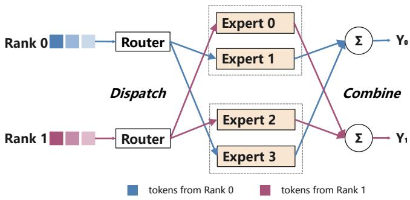  
Figure 1: Execution flow of an expert-parallel MoE layer.

As shown in Figure 1, each rank first applies the router to its local tokens. An all-to-all dispatch sends the resulting token activations to the ranks hosting the selected experts, where the experts evaluate their assigned tokens [11]. Since expert computation is dominated by matrix multiplications, its cost generally grows with the number of assigned tokens [8, 37]. A reverse all-to-all then returns the expert outputs to their source ranks, where they are combined using the corresponding routing weights.

The realized expert load becomes available only after routing. An online planner that uses this load must therefore make the resulting plan available to all participating ranks before dispatch begins. Any exposed planning latency directly delays dispatch and expert computation, placing the planner on the critical path. This timing constraint is central to Section 2.4.

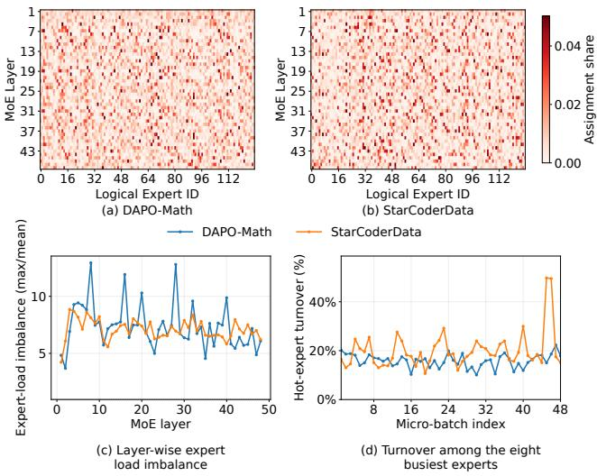  
Figure 2: Expert-load skew across the 48 MoE layers of Qwen3-30B-A3B on DAPO-Math and StarCoderData. (a)– (b) Fraction of each layer’s token–expert assignments routed to each expert (horizontal axis: logical expert ID 0–127; vertical axis: MoE layer 1–48). (c) Per-layer maximum-to-mean expert-load ratio. (d) Fraction of the eight highest-load experts that changes between adjacent microbatches.

## 2.2 Dynamic Expert Load Imbalance

Routing decisions depend on each token’s hidden representation, so expert loads can be skewed and vary with the input [17, 39]. When a batch contains many tokens associated with a small set of learned patterns, the corresponding experts may be selected disproportionately often. These hot experts receive substantially more assignments than the mean, while other experts receive few or none. We profile all 48 MoE layers of Qwen3-30B-A3B [31] on two datasets: DAPO-Math [35] for mathematical reasoning and StarCoderData [15] for code. Each layer contains 128 logical experts and routes each token to eight experts.

Figure 2(a)–(b) visualizes the expert-load distribution in every layer. Each row represents one layer, each column one logical expert, and darker cells indicate that the expert receives more tokens in that layer. Within most rows, a small subset of experts receives several times the load expected under uniform routing, while the remaining experts receive substantially less. Figure 2(c) quantifies this skew. The maximum-to-mean ratio averages 7.34 on DAPO-Math and 7.08 on StarCoderData, remains above five in nearly every layer, and peaks at 12.93 and 8.85, respectively. Under synchronized EP execution, such a hotspot can increase its host rank’s workload and delay the entire layer. Figure 2(d) further shows that hotspot identities change across adjacent microbatches: averaged across layers and microbatch pairs, 15.9% and 20.0% of the eight highest-load experts change on DAPO-Math and StarCoder-Data, respectively. Together, these results show that expert hotspots are common and vary across both layers and microbatches. Consequently, a fixed expert placement can become stale as routing loads change [10, 11].

Under a fixed expert-to-rank mapping, expert-level skew can translate into rank-level imbalance. Ranks hosting hot experts process more tokens and become stragglers, while other ranks finish earlier and wait at synchronization points [10,18]. The same skew also creates uneven communication [14, 16]: hot ranks receive more token activations during dispatch and return more outputs during combine. Consequently, they can become stragglers in both computation and communication.

## 2.3 Topology-Dependent Cost

Equal maximum rank loads do not imply equal communication costs. Scale-out EP groups span NVLink domains interconnected by RDMA, so replica placement determines which token, parameter, and replica-gradient transfers cross domains.

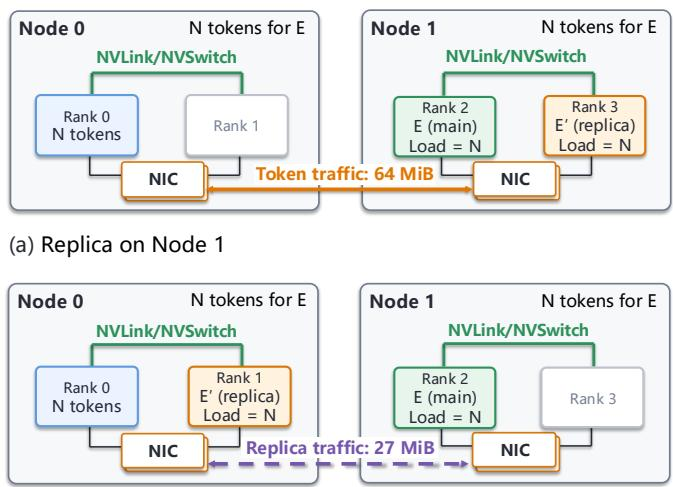  
(b) Replica on Node 0  
Figure 3: Inter-node communication for two replica placements. Each node contributes N = 4096 tokens to expert E. Both placements use one replica and have the same maximum per-rank load, $L _ { \mathrm { m a x } } = N .$ (a) A replica on Node 1 incurs 64 MiB of token traffic (solid arrow). (b) A replica on Node 0 incurs 18 MiB of parameter traffic and 9 MiB of replicagradient traffic (dashed arrow).

Figure 3 illustrates this tradeoff with two nodes, each form ing an NVLink domain. Each node contributes N = 4096 tokens routed to expert $E ,$ whose main instance resides on Node 1. Both placements use one replica, $E ^ { \prime } { \mathrm { , } }$ , and assign N tokens to each instance, giving the same maximum per-rank load, $L _ { \mathrm { m a x } } = N .$ . The example uses Qwen3-30B-A3B’s 2,048- dimensional activations and 9 MiB of parameters per expert, with BF16 activations, parameters, and replica gradients.

In Figure 3(a), inter-node token traffic totals 64 MiB over the forward and backward passes. Figure 3(b) keeps token routes local, replacing this traffic with 18 MiB of parameter traffic and 9 MiB of replica-gradient traffic. Two parameter fetches are required because replica buffers are reused across layers.

The second placement therefore reduces RDMA traffic by a factor of approximately 2.4 while preserving the maximum per-rank load. This example motivates jointly accounting for rank load, token routing, and replica-transfer cost.

## 2.4 Planning on the Critical Path

An online EPLB planner that adapts to the current microbatch depends on the routing decisions produced by Top-k gating. Its replica-placement and token-routing decisions must then be available before the dependent dispatch operations can begin. This dependency places planning on the execution path from gating to dispatch.

Host-side planning. When the planner runs on the CPU, device-resident load statistics must be made available to the host, and the resulting plan must be returned to the GPUs. For a serialized implementation, the latency from device-input readiness to device-plan readiness can be decomposed as

$$
T _ { \mathrm { h o s t - p l a n } } = T _ { \mathrm { s y n c } } + T _ { \mathrm { C P U - s o l v e } } + T _ { \mathrm { r e t u r n } } ,\tag{1}
$$

where $T _ { \mathrm { s y n c } }$ includes synchronization and the D2H input transfer, $T _ { \mathrm { C P U - s o l v e } }$ is the CPU solving time, and $T _ { \mathrm { r e u r n } }$ is the H2D result transfer. These serialized stages block dependent GPU work until the plan becomes available.

As illustrated in Figure 4, host-side planning causes a datadependent GPU–CPU–GPU round trip between gating and dispatch. Although asynchronous kernel submission can overlap host execution with GPU work, dependent dispatch operations must wait for CPU solving and plan transfer to complete. When insufficient independent GPU work is available, this dependency exposes a GPU idle interval. For a fixed workload and GPU configuration, such stalls lengthen the training step and reduce model FLOPs utilization (MFU). These delays can recur at every MoE layer and microbatch, increasing their impact on training efficiency. GPU-native planning removes the host round trip by generating plans on the device for direct consumption by subsequent GPU operations, eliminating this source of exposed control latency.

End-to-end benefit. Dynamic EPLB reduces training time only when the saved expert FFN computation exceeds the additional planning and expert-transfer overhead. Let $T _ { \mathrm { s a v e d } }$ denote the expert-computation time saved relative to static placement, $T _ { \mathrm { p l a n } }$ the GPU solver latency, and $T _ { \mathrm { t r a n s f e r } }$ the exposed cost of transferring expert parameters and replica gradients. The net-benefit condition is

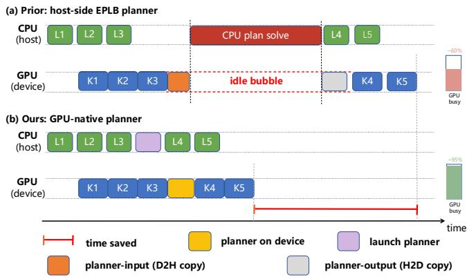

Figure 4: Critical-path execution of host-side and GPU-native EPLB planning. GPU-native planning removes the host round trip between routing and dependent dispatch operations.  
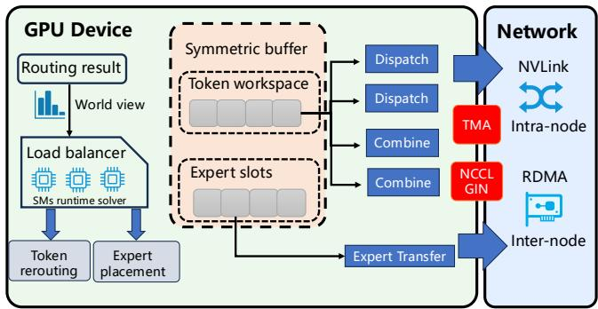  
Figure 5: Architecture and execution flow of TopoEP.

$$
T _ { \mathrm { s a v e d } } > T _ { \mathrm { p l a n } } + T _ { \mathrm { t r a n s f e r } } .\tag{2}
$$

The GPU solver must therefore generate each plan with low latency, while the execution path minimizes or overlaps parameter and gradient transfers. These requirements motivate the GPU-native design of TopoEP, described in Section 3.

## 3 System Design

Figure 5 summarizes the control and data flows of TopoEP. The globally gathered routing information serves as input to the load balancer, which generates the replica placement and token routing (Section 3.1). The replica placement drives expert-parameter transfers into reusable replica slots, using TMA over intra-node NVLink and NCCL GIN over internode RDMA (Section 3.2). The token-routing decisions drive dispatch and combine through the token workspace, while the two-chunk pipeline overlaps communication with expert computation (Section 3.3). Together, these stages keep both planning and execution on the GPUs.

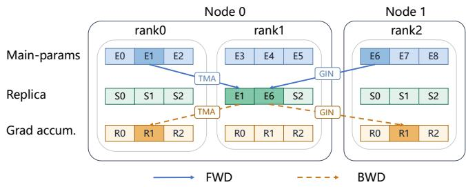  
Figure 6: Device-initiated replica transfer using intra-node TMA and inter-node NCCL GIN: forward pulls expert parameters into replica slots, and backward returns replica gradients to their main ranks.

## 3.1 GPU-Native Load Balancer

After Top-k gating, TopoEP first performs an EP-group allgather to collect token-routing information from all ranks, giving every rank the same global routing matrix Ω. The load balancer consumes Ω and generates the replica placement and token routing for the current MoE layer and microbatch. Given the same routing matrix, all ranks independently derive the same plan without a coordinator or result broadcast.

The placement and routing decisions remain as device tensors and directly drive the replica-transfer and token-dispatch paths shown in Figure 5. All inputs, intermediate states, and outputs remain in GPU memory, avoiding data-dependent host synchronization between planning and execution. Section 4 details the placement and routing algorithm and its parallel GPU implementation.

## 3.2 Replica Buffer Management

TopoEP keeps one main instance of each logical expert e on rank main(e), where its model state, optimizer state, and checkpoint ownership remain throughout training. Taking unsharded BF16 mixed-precision training with Adam as an example, a BF16 parameter value, a BF16 gradient, an FP32 master copy, and two FP32 moment estimates together occupy 16 bytes per parameter. A temporary replica receives only the BF16 parameters needed for expert computation and returns its gradients to the main rank for the optimizer update. The optimizer state and checkpoint ownership therefore never migrate with replica placement.

Each rank preallocates a fixed number of replica slots and reuses them across layers and microbatches. Applying a new placement only updates the expert-to-slot mapping and copies the selected BF16 parameters. During backward propagation, the same storage is repurposed for replica gradients after the parameters have been consumed. An occupied slot therefore requires only 2 bytes per parameter at any time, one eighth of the complete Adam training state.

## Device-initiated replica transfers.

At runtime, the generated placement identifies the main rank associated with each occupied replica slot and therefore determines both the parameter source and gradient destination. As shown in Figure $^ { 6 , }$ the CUDA kernels in TopoEP consume this mapping directly: the forward pass transfers expert parameters from main instances to replica slots, and the backward pass returns replica gradients to the gradientaccumulation buffers on the corresponding main ranks. Initiating these transfers directly from the GPU avoids copying the schedule to the CPU and introducing host synchronization between planning and execution.

TopoEP selects the device-initiated transfer mechanism according to the network path. Tensor Memory Accelerator (TMA) [22] handles intra-node transfers over NVLink, while NCCL GPU-Initiated Networking (GIN) [9] provides one-sided inter-node RDMA over InfiniBand or RoCE. GIN exposes registered communication buffers through symmetricmemory windows. After the buffers are collectively registered during initialization, a GPU kernel addresses remote memory using a window handle, peer rank, and window-relative offset.

Assume that the main instances of the E logical experts are evenly distributed across P EP ranks and that each expert’s parameters occupy $| W |$ bytes. For $N _ { \mathrm { s l o t } }$ replica slots per rank, the three communication buffers have the following per-rank capacities and are reused throughout training:

• Main-parameter buffer, with a size of $\frac { E } { P } \cdot | W |$ bytes, makes the parameters of main instances owned by the current rank accessible to ranks hosting their replicas.

• Replica buffer, with a size of $N _ { \mathrm { s l o t } } \cdot | W |$ | bytes, stores the parameters of replicas instantiated on the current rank and is reused to stage and send their gradients during backward propagation.

• Gradient-accumulation buffer, with a size of $E \cdot | W |$ bytes, receives replica gradients for the current rank’s main instances. The buffer is partitioned by source rank into P regions, each containing ${ \frac { E } { P } } \cdot | W | \ \mathrm { b y t e s }$

## 3.3 Fine-Grained Pipelined Execution

A standard expert-parallel MoE layer communicates tokens during dispatch and combine. Dynamic replication additionally incurs GPU solver execution, expert-parameter transfers, and replica-gradient transfers. Executing these operations sequentially would place their aggregate latency on the MoE critical path. TopoEP instead partitions the routed tokens into two chunks and schedules communication and expert FFN computation on separate CUDA streams. This pipeline overlaps communication for one chunk with computation for the other, reducing the exposed component of Ttransfer.

## 3.3.1 Forward Pass

After the global token-routing all-gather and GPU planning, each rank transfers the parameters required by its expert-toslot mapping into the corresponding replica slots. The routed tokens are then partitioned into two disjoint chunks, $c _ { 1 }$ and $c _ { 2 }$ . As shown in Figure 7, the communication stream dispatches $c _ { 1 }$ before its expert FFN computation begins. While the compute stream processes $c _ { 1 }$ , the communication stream dispatches $c _ { 2 }$ . It subsequently combines the outputs of $c _ { 1 }$ while the compute stream processes $c _ { 2 }$

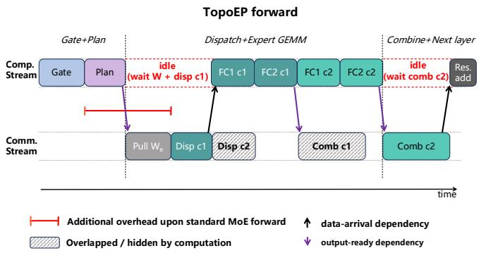  
Figure 7: Two-chunk forward pipeline overlapping expertparameter transfers and token communication with expert FFN computation.

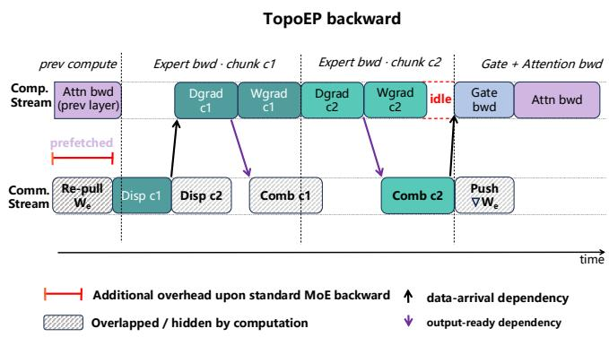  
Figure 8: Two-chunk backward pipeline overlapping expertparameter re-pulls, replica-gradient pushes, and token communication with expert FFN backward computation.

This schedule hides the dispatch of $c _ { 2 }$ and the combine of $c _ { 1 }$ behind expert FFN computation. The dispatch of $c _ { 1 }$ and the combine of $c _ { 2 }$ remain as the pipeline fill and drain boundaries. Compared with the original expert-parallel forward path, the added critical-path latency arises primarily from the GPU solver kernels and expert-parameter transfers. These costs correspond to $T _ { \mathrm { p l a n } }$ and the forward component of $T _ { \mathrm { t r a n s f e r } }$ respectively.

## 3.3.2 Backward Pass

Replica slots are reused by subsequent MoE layers during forward propagation, so a layer’s temporary expert parameters are not retained until its backward pass. TopoEP caches the per-layer replica placement and slot mapping, then reloads the required BF16 parameters from the main rank’s mainparameter buffer into the local replica buffer. The communication stream issues this reload before the parameters are consumed and overlaps it with available computation.

The backward pass of each expert GEMM comprises a data-gradient (Dgrad) GEMM and a weight-gradient (Wgrad) GEMM. Dgrad reads the corresponding weight matrix to propagate gradients toward the expert input, whereas Wgrad depends only on the saved activations and output gradients. TopoEP schedules each chunk’s Dgrad before its Wgrad, allowing the resulting token gradients to enter the backward communication path without waiting for weight-gradient computation.

The two chunks follow the schedule in Figure 8. While the compute stream executes the expert backward kernels for $c _ { 1 } .$ , the communication stream dispatches the token gradients of $c _ { 2 }$ . The combine operation for $c _ { 1 }$ then overlaps the expert backward computation of $c _ { 2 }$ . The prefetched expert parameters are temporarily staged outside the replica buffer, so the freed buffer is reused to accumulate the Wgrad contributions from $c _ { 1 }$ and $c _ { 2 }$ before transferring the result to the main rank’s gradient-accumulation buffer. An EP-group-wide fence ensures that all remote transfers complete before the main rank sums these regions and returns the resulting gradients to autograd. The returned tensors do not alias the accumulation buffer, allowing it to be cleared and reused after the preceding stream operations complete.

With a sufficient overlap window, expert-parameter reload and replica-gradient transfer can be hidden by concurrent computation. The exposed incremental overhead then lies primarily in the forward pass, where the GPU solver generates the plan and transfers the selected expert parameters into replica slots. These costs correspond to $T _ { \mathrm { p l a n } }$ and the forward component of $T _ { \mathrm { t r a n s f e r } } ,$ and determine whether the reduction in expert FFN computation time satisfies the end-to-end performance criterion in Eq. 2.

## 4 Topology-Aware Load-Balancing Algorithm

## 4.1 System Model

We consider an expert-parallel MoE training cluster with M NVLink domains. Let $\mathcal { D } = \{ 0 , \dotsc , M - 1 \} , \mathcal { R } = \{ 0 , \dotsc , R -$ $1 \}$ , and $\mathcal { Z } = \{ 0 , . . . , E - 1 \}$ denote the sets of domains, EP ranks, and logical experts, respectively. The function dom(r) ∈ D maps rank $r$ to its NVLink domain. We represent the network by a symmetric communication-time matrix $C = [ c _ { s , r } ]$ , where $c _ { r , r } = 0$ and $c _ { s , r }$ denotes the effective time to transfer one byte from source rank s to destination rank $r .$ The coefficients can be obtained from profiled effective bandwidth, and are therefore lower for intra-domain NVLink paths than for inter-domain RDMA paths.

Each logical expert e has a fixed main instance on rank main $( e ) \in \mathcal { R }$ . This instance holds the expert’s parameters throughout training. Load balancing may create temporary replicas on other ranks by copying these parameters. Let $\| W _ { e } \|$ denote the parameter size of expert e in bytes and $S _ { \mathrm { t o k } }$ the size in bytes of one routed activation or activation gradient. Each rank reserves $N _ { \mathrm { s l o t } }$ slots for temporary replicas in addition to its fixed main instances.

For each microbatch, Top-k gating produces the routing matrix

$$
\Omega = [ \mathfrak { G } _ { s , e } ] \in \mathbb { Z } _ { \geq 0 } ^ { R \times E } ,\tag{3}
$$

where ${ \ @ _ { s , e } }$ is the number of token–expert assignments originating from source rank s and selecting expert $e .$ The demand for expert e generated within domain d is

$$
D _ { d , e } = \sum _ { \tiny \begin{array} { c } { s \in \mathcal { R } } \\ { \operatorname { d o m } ( s ) = d } \end{array} } \mathfrak { G } _ { s , e } .\tag{4}
$$

Since all experts in a layer share the same FFN architecture and have similar per-token compute costs, we estimate each rank’s compute time by multiplying its assigned token count by the profiled average per-assignment time tFFN.

## 4.2 Load-Balancing Formulation

Given Ω, the optimization jointly determines temporary replica placement and the distribution of each source–expert demand among physical instances of the same logical expert. It preserves every token–expert assignment while minimizing the estimated exposed time of expert computation, token routing, and expert-parameter transfer.

Decision variables. We introduce two decision variables. The binary variable $x _ { e , r }$ indicates whether rank r hosts an instance of expert e, including its main instance. The nonnegative integer $q _ { s , e , r }$ gives the number of $( s , e )$ assignments executed on destination rank r.

Load metric. The assigned load of rank r is the total number of token–expert assignments executed on that rank. We define $L _ { \mathrm { m a x } }$ as the maximum assigned load across all ranks.

$$
\begin{array} { r l } { L _ { r } } & { = \displaystyle \sum _ { s \in \mathcal { R } } \sum _ { e \in \mathcal { L } } q _ { s , e , r } , \quad \forall r \in \mathcal { R } , \dag } \\ { L _ { \operatorname* { m a x } } = \displaystyle \operatorname* { m a x } _ { r \in \mathcal { R } } L _ { r } . } \end{array}
$$

Constraints. A feasible replica-placement and tokenrerouting plan satisfies the following conditions.

Token conservation (C1). Every token–expert assignment is mapped to exactly one physical instance.

$$
\sum _ { r \in { \mathcal R } } q _ { s , e , r } = \mathfrak { G } _ { s , e } , \quad \forall s \in { \mathcal R } , e \in { \mathcal E } .
$$

Instance reachability (C2). Tokens may be assigned only to ranks that host the corresponding expert.

$$
q _ { s , e , r } \leq \mathfrak { G } _ { s , e } x _ { e , r } , \quad \forall s , r \in \mathcal { R } , e \in \mathcal { Z } .
$$

Replica capacity (C3). Each rank may host at most $N _ { \mathrm { s l o t } }$ non-main expert instances in its preallocated replica slots.

$$
\sum _ { \begin{array} { l } { e \in \mathcal { F } } \\ { \operatorname* { m i n } ( e ) \neq r } \end{array} } x _ { e , r } \leq N _ { \mathrm { s l o t } } , \quad \forall r \in \mathcal { R } .
$$

Cross-domain replica criterion (C4). Under the two-chunk execution model in Section 3.3, approximately half of the $4 D _ { d , e } S _ { \mathrm { t o k } }$ bytes of forward and backward remote-token traffic remains exposed, while backward replica transfers can be hidden when the overlap window is sufficient. Assuming a common per-byte RDMA cost, a replica of expert e may be placed in a domain different from its main instance only if the forward parameter transfer is smaller than the exposed remote-token traffic:

$$
\begin{array} { r } { x _ { e , r } = 1 , \quad \mathrm { d o m } ( r ) \neq \mathrm { d o m } ( \operatorname* { m a i n } ( e ) ) } \\ { \implies \quad \| W _ { e } \| < 2 D _ { \mathrm { d o m } ( r ) , e } S _ { \mathrm { t o k } } . } \end{array}
$$

Fixed main placement (C5). Every expert retains its main instance throughout training.

$$
x _ { e , \mathrm { m a i n } ( e ) } = 1 , \quad \forall e \in \mathcal { E } .
$$

Objective. The exposed expert FFN computation time is

$$
T _ { \mathrm { c o m p } } = t _ { \mathrm { F F N } } L _ { \mathrm { m a x } } .\tag{5}
$$

Under the overlap assumptions in (C4), the exposed tokenrouting and forward expert-parameter transfer times are

$$
T _ { \mathrm { t o k e n } } = 2 S _ { \mathrm { t o k } } \sum _ { \stackrel { s , r \in \mathcal { R } } { e \in \mathcal { L } } } c _ { s , r } q _ { s , e , r } .\tag{6}
$$

$$
T _ { \mathrm { r e p l i c a } } = \sum _ { e \in \mathcal { Z } } \sum _ { \tiny \begin{array} { c } { r \in \mathcal { R } } \\ { r \ne \operatorname* { m a i n } ( e ) } \end{array} } c _ { \operatorname* { m a i n } ( e ) , r } \| W _ { e } \| x _ { e , r } .\tag{7}
$$

The optimization minimizes their sum as an idealized estimate of exposed execution time:

$$
\begin{array} { r l } { \underset { x , q } { \operatorname* { m i n } } } & { T _ { \mathrm { c o m p } } + T _ { \mathrm { t o k e n } } + T _ { \mathrm { r e p l i c a } } } \\ { \mathrm { s . t . } } & { ( \mathrm { C 1 } ) - ( \mathrm { C 5 } ) , } \\ & { x _ { e , r } \in \{ 0 , 1 \} , } \\ & { q _ { s , e , r } \in \mathbb { Z } _ { \geq 0 } , \quad \forall e \in \mathscr { E } , s , r \in \mathscr { R } . } \end{array}\tag{8}
$$

## 4.3 Two-Stage GPU-Native Solver

Solving Eq. 8 exactly for every layer and microbatch would add excessive latency to the training critical path. TopoEP therefore constructs a feasible placement-and-routing plan with a topology-aware two-stage GPU solver. Inter-node placement first creates replicas when the reduction in crossdomain token traffic justifies the parameter transfer, and intranode refinement then reduces the remaining rank-load imbalance within each NVLink domain.

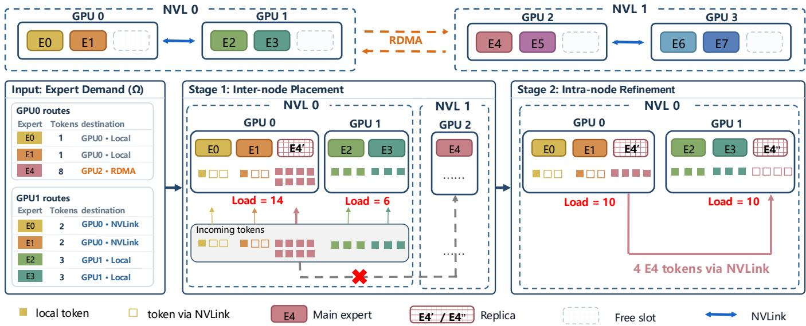  
Figure 9: Example of two-stage expert replication and token rerouting. Inter-node placement removes cross-domain token traffic, after which intra-node refinement balances rank loads through same-domain rerouting over NVLink.

Figure 9 illustrates the two stages using two NVLink domains. In the input routing, eight assignments from GPU 0 select expert $E _ { 4 } .$ whose main instance resides on GPU 2. These assignments therefore cross the inter-node RDMA fabric during both dispatch and combine. Inter-node placement creates replica $E _ { 4 } ^ { \prime }$ on GPU 0 when one parameter transfer costs less than the exposed bidirectional token traffic. The eight assignments can then execute locally, eliminating their RDMA token traffic. This placement, however, leaves GPU 0 and GPU 1 with loads of 14 and 6. Intra-node refinement creates replica $E _ { 4 } ^ { \prime \prime }$ on GPU 1 and moves four $E _ { 4 }$ assignments from GPU 0 to GPU 1 over NVLink, balancing both rank loads at 10 without introducing new cross-domain token routes.

Inter-node placement. For every domain $d ,$ the solver aggregates the routing matrix by source domain and computes the replication benefit

$$
b _ { d , e } = 2 D _ { d , e } S _ { \mathrm { t o k } } - \| W _ { e } \| .\tag{9}
$$

For an expert whose main instance lies outside domain d, a positive $b _ { d , e }$ means that replacing the exposed remote-token traffic with one parameter transfer is beneficial. Each domain considers its positive-benefit candidates in descending order and places replicas on the least occupied ranks with free slots. Processing domains independently allows these decisions to run concurrently while enforcing the per-rank slot limit.

Given the resulting placement, the solver constructs the physical token routing. For each source–expert pair (s,e), it selects instances in the source domain whenever they are available and otherwise uses all deployed instances of e. It divides ${ \ @ _ { s , e } }$ approximately evenly among the selected instances. It then computes the per-instance loads $\begin{array} { r } { U _ { e , r } = \sum _ { s } q _ { s , e , r } } \end{array}$ and updates the rank loads $L _ { r } .$ . This routing preserves every logical token–expert assignment while preferring same-domain destinations.

Intra-node refinement. Starting from the inter-node placement, each NVLink domain independently reduces its residual rank-load imbalance. In every iteration, the solver selects the busiest rank $r _ { b }$ and evaluates same-domain target ranks $r _ { t }$ for the experts contributing to its load. A target is feasible if it already hosts the expert or has a free replica slot. The candidate transfer amount is

$$
\delta = \mathrm { m i n } \left( U _ { e , r _ { b } } , \left\lfloor \frac { L _ { r _ { b } } - L _ { r _ { t } } } { 2 } \right\rfloor \right) .\tag{10}
$$

The half-gap bound reduces the difference between the source and target loads without reversing their order. Candidates are ranked by transfer amount, target load, and communication cost. The selected update creates a replica when needed and modifies x, q, U, and L. Because the target lies in the same domain as the overloaded rank, refinement improves load balance without placing the expert in a new domain or adding cross-domain token routes.

Constraint preservation. Inter-node placement starts from the fixed main instances, creates replicas only on ranks with free slots, and admits a cross-domain expert–domain pair only when $b _ { d , e } > 0 _ { }$ . It therefore satisfies replica capacity (C3), the cross-domain replica criterion (C4), and fixed main placement (C5). Routing partitions every ${ \ @ _ { s , e } }$ completely among deployed instances, satisfying token conservation (C1) and instance reachability (C2). Intra-node refinement only transfers existing assignments to an existing instance or a new replica in a free slot, and adds replicas only within a domain that already hosts the expert. Each refinement step therefore preserves (C1)–(C5).

GPU parallelism and determinism. Inter-node candidate evaluation and source–expert routing run concurrently across CUDA thread blocks. During intra-node refinement, one block handles each NVLink domain, caches its placement and load state in shared memory, and uses warp- and block-level reductions to select a candidate. The block commits one update per iteration to avoid conflicting modifications. Deterministic candidate ordering allows every rank to generate the same x and q from the shared routing matrix, eliminating the need for a coordinator or plan broadcast.

## 5 Implementation

We integrate TopoEP into Megatron-LM [27]. The implementation comprises approximately 10,000 lines of Python and CUDA/C++.

GPU-native solver. Inter-node placement, routing update, and intra-node refinement are implemented as CUDA kernels. Independent domains and source–expert tasks execute concurrently, with warp- and block-level reductions used for candidate selection.

Device-initiated replica transfers. Main-parameter, replicaslot, and gradient-accumulation buffers are allocated and registered in NCCL symmetric-memory windows during initialization. TMA handles intra-node transfers over NVLink, while NCCL GIN performs device-initiated get/put operations for inter-node RDMA.

DeepEP dispatch and combine. We integrate DeepEP V2 [38] (commit af9a040) into our communication manager to replace Megatron-LM’s NCCL-based all-to-all path. The manager consumes device-resident routing information and derives receive counts on the GPU, avoiding CPU synchronization during dispatch and combine.

Fine-grained two-chunk pipeline. We use a custom autograd function to explicitly schedule the expert computation and communication of each MoE layer across separate CUDA streams. The pipeline overlaps token communication and replica transfers with expert computation, reducing their exposed critical-path overhead.

## 6 Performance Evaluation

## 6.1 Experimental Setup

Testbed. Our experiments run on a four-node cluster with 32 NVIDIA H800 GPUs. Each node contains eight GPUs interconnected through NVLink and NVSwitch, providing up to 400 GB/s of aggregate bidirectional bandwidth. A railoptimized InfiniBand fabric provides inter-node communication, with each GPU connected to a dual-port NVIDIA ConnectX-7 NIC through two 200 Gb/s links. The testbed supports 32-way expert parallelism and includes both intranode and inter-node communication paths.

Table 1: MoE model configurations used in the evaluation.
<table><tr><td>Model</td><td>MoE layers</td><td>Experts Top-k Hidden</td><td></td><td></td><td>Interm. size</td><td>PP/EP</td></tr><tr><td>Qwen3-30B-A3B [31]</td><td>5</td><td>128</td><td>8</td><td>2,048</td><td>768</td><td>1/32</td></tr><tr><td>GLM-4.5-Air [36]</td><td>5</td><td>128</td><td>8</td><td>4,096</td><td>1,408</td><td>2/16</td></tr><tr><td>DeepSeek-V2 [3]</td><td>4</td><td>160</td><td>6</td><td>5,120</td><td>1,536</td><td>2/16</td></tr></table>

Baselines. We compare TopoEP with Megatron-LM [27] and three representative MoE load-balancing methods: DeepSeek-EPLB [5], the official expert-replication and placement heuristic; FasterMoE [10], which uses dynamic expert shadowing; and FlexMoE [21], which expands, shrinks, and migrates virtual experts. We adapt each method’s core load-balancing algorithm to the same Megatron-LM codebase at commit 0ff7226. Within each comparison, all dynamic methods use the same additional replica budget, and all runs use the same routing configuration.

Models and Workloads. We evaluate TopoEP with Qwen3- 30B-A3B [31], GLM-4.5-Air [36], and DeepSeek-V2 [3]. As summarized in Table 1, these models span 128–160 routed experts, Top-k values of 6 and 8, and substantially different hidden and expert-intermediate dimensions. Qwen3 uses PP 1/EP 32, while GLM-4.5-Air and DeepSeek-V2 use PP 2/EP 16. To fit the models within the available GPU memory, we reduce the number of Transformer layers while retaining their original MoE-layer dimensions and routing configurations. This setup keeps the evaluation focused on MoE-layer performance.

We construct a training corpus from six public sources: English web text from FineWeb [23]; Chinese web text from FineWeb2 [24]; diverse pretraining text from Dolma [29]; source code in Python, C++, Java, and Rust from StarCoder-Data [15]; scientific literature from peS2o [30]; and mathematical reasoning prompts from DAPO-Math-17K [35]. We deduplicate and truncate documents to at most 4,096 tokens before assembling them into training sequences.

## 6.2 Load-Balancing Effectiveness

Figure 10 compares the maximum-to-mean rank-load ratio as the additional replica budget increases. Without balancing, the ratio is 8.39. With one slot, the ratio for TopoEP remains 3.79, whereas FlexMoE reaches 1.45. With two slots, TopoEP drops to 1.30 and outperforms FlexMoE, FasterMoE, and DeepSeek EPLB by 6.8%, 48.2%, and 55.8%, respectively. With three or four slots, TopoEP maintains a rank-load ratio of 1.30, while FasterMoE and DeepSeek-EPLB remain at 1.82 and 2.88 even with four slots. Thus, TopoEP needs only two additional slots per rank to achieve the best load balance among the evaluated methods; allocating more slots provides almost no further benefit. This small replica budget also reduces the additional GPU memory overhead introduced by expert replication. We use this setting in the remaining experiments.

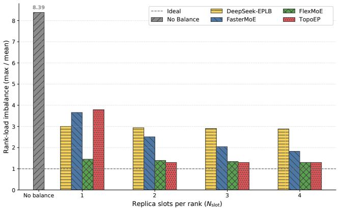

Figure 10: Rank-load imbalance versus additional replica slots per rank for a 32-rank, 640-expert Top-8 workload. Lower is better, and the dashed line denotes ideal balance.  
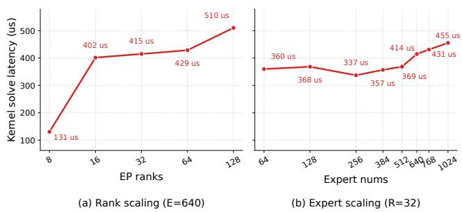  
Figure 11: Mean solver-kernel latency with varying logical EP sizes and expert counts, measured over 200 executions after 20 warm-up iterations.

## 6.3 Solver Scalability

Figure 11(a) shows that, with the number of experts fixed at E = 640, kernel latency increases from 131µs at EP size 8 to 510µs at EP size 128. At EP size 8, all ranks fit within a single NVLink domain, so the solver does not need to evaluate inter-node placement, contributing to the lower kernel latency. Figure 11(b) varies the expert count by 16× at a fixed EP size of 32, while latency remains between 337 and 455µs. Increasing the EP size by 16× raises latency by only 3.9×, while the same increase in expert count changes the endpoint latency by only 1.27×. Thus, the problem grows by an order of magnitude without a proportional latency increase. Even the largest tested configuration is solved in just 0.510 ms, preserving microsecond-scale planning at every layer and microbatch.

## 6.4 End-to-End Performance

In this section, we compare the end-to-end training performance of TopoEP against multiple baselines and examine how routing skew affects training throughput.

Sensitivity to routing skew. Natural routing uses the router logits generated by the model from the input tokens. As discussed in Section 2.2, expert-load imbalance commonly arises in MoE training and gives load balancing greater opportunity to reduce straggler delays. Because expert specialization typically emerges over long pretraining runs, our reduceddepth models and limited training duration may not exhibit the full range of routing imbalance that can arise at full scale. We therefore construct synthetic routing workloads with controlled skew to test whether TopoEP mitigates the resulting throughput degradation across a broader range of imbalance. Synthetic routing uses random logits with a fixed expert-specific bias. A router\_skew value of 0 produces uniform expert selection in expectation, while increasingly negative values strengthen the bias and concentrate more tokens on a subset of experts. We use these synthetic settings only for performance measurements. Under natural routing, Figure 12 shows that TopoEP improves throughput over Megatron-LM by 9.5%, 11.4%, and 6.2% on Qwen, GLM, and DeepSeek-V2, respectively. Under uniform synthetic routing (router\_skew= 0), it instead trails Megatron-LM by 8.5%– 16.7%. Thus, load balancing does not improve every routing workload. When expert demand is already uniform, the limited reduction in straggling does not offset planning and replica-management costs.

As synthetic routing becomes more imbalanced from router\_skew= 0 to −4, Megatron-LM throughput falls by 27.8%, 25.8%, and 24.7% across the three models. In contrast, TopoEP throughput varies by less than 2.3% across all synthetic settings. At router\_skew= −4, TopoEP outperforms Megatron-LM by 26.6%, 20.9%, and 10.0%. These results show that its throughput benefit grows as routing imbalance increases. More importantly, TopoEP maintains nearly constant throughput across the full skew range. This robustness shows that substantial changes in routing and expert-load imbalance need not translate into large performance fluctuations, enabling stable training performance as routing behavior evolves.

Comparison with baselines. To ensure a fair comparison of load-balancing policies, all evaluated EPLB methods use the same optimized plan-execution backend described in Section 5, including TMA / GIN replica transfers, DeepEP token dispatch and combine, and the two-chunk execution pipeline. They differ only in the planner that generates the placement and routing decisions; Megatron-LM serves separately as the no-EPLB baseline.

Figure 13(a) shows that TopoEP achieves the highest throughput among all evaluated methods on all three models. It exceeds the highest baseline throughput by 4.4% on Qwen,

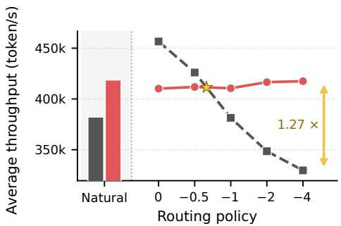  
(a) Qwen3-30B-A3B

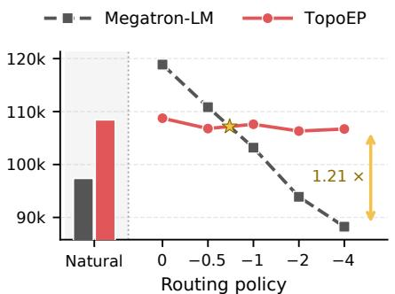  
(b) GLM-4.5-Air

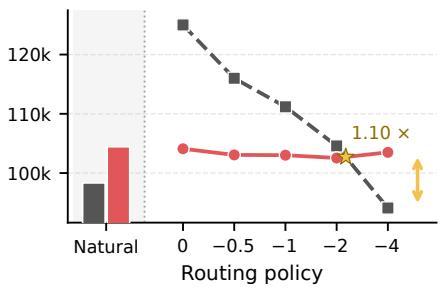  
(c) DeepSeek-V2

Figure 12: Average end-to-end training throughput under natural and synthetic routing. The synthetic settings vary router\_skew from 0 to −4. Stars mark interpolated throughput crossovers, and double-headed arrows show the TopoEP/Megatron-LM throughput ratio at router\_skew= −4.  
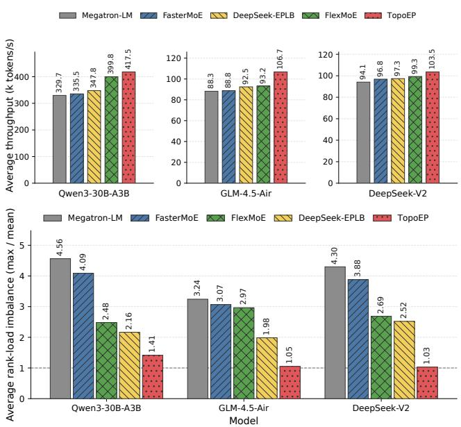  
Figure 13: Comparison with baselines at router\_skew= −4. (a) Average end-to-end throughput. (b) Average rank-load imbalance, defined as the maximum per-rank token-expert load divided by the average across ranks, where 1 denotes ideal balance.

14.5% on GLM, and 4.2% on DeepSeek-V2. Figure 13(b) shows that TopoEP also achieves the lowest average rankload imbalance, reducing the ratios to 1.41, 1.05, and 1.03, respectively. These values are 34.7%, 47.1%, and 59.2% lower than the lowest baseline ratios.

With the plan-execution backend held constant across EPLB methods, these results show that TopoEP achieves better rank-load balance while also delivering higher end to-end throughput when planner and execution overheads are included.

Training stability. Figure 14 shows closely overlapping loss trajectories for TopoEP and Megatron-LM under the same model initialization, data order, and learning-rate schedule. Across all 10,000 steps, the mean and maximum absolute relative differences are 0.088% and 0.407%, respectively. These results show no observable degradation in loss convergence.

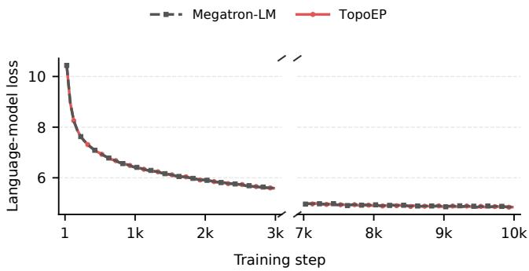  
Figure 14: Qwen3-30B-A3B training loss during 10,000-step runs under natural routing.

## 6.5 Latency Breakdown

Figure 15 shows that TopoEP reduces expert-computation time on straggler ranks by 49.2%–64.0% across the forward and backward passes of Qwen and GLM, directly demonstrating its effectiveness in mitigating computation stragglers. Token dispatch/combine time also decreases by 34.9%–65.3%. TopoEP introduces 1.04–1.58 ms of replica-management time per layer, which is smaller than the reduction in each of the other two components in every panel. Because these components may overlap across CUDA streams, their measured times cannot be added directly. Overall, the breakdown shows that TopoEP reduces both expert-computation and token dispatch/combine time under imbalanced routing.

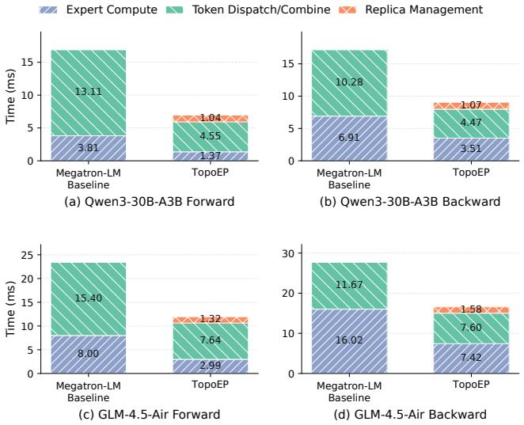  
Figure 15: Per-layer MoE latency breakdown, with expertcomputation time measured on straggler ranks.

## 6.6 Topology-Aware Token Routing

We examine whether the plans generated by the algorithm in Section 4 are topology-aware in practice. All methods receive the same logical Top-k assignments, with a common replica budget for the EPLB methods. They differ in the placement of expert instances and the physical ranks selected to execute each assignment. For each token–expert assignment, we record whether its execution rank is on a different node from its source rank and whether it is served by a replica.

Figure 16(a)–(b) shows that TopoEP reduces the inter-node assignment fraction from 50.0%–75.0% with Megatron-LM to 0.91%–1.88%, while replicas execute 63.8%–79.8% of assignments. Across all models, it achieves the lowest internode fraction and the highest replica-served fraction. Together, these results indicate that TopoEP redistributes most assignments to replicas while keeping their execution within the source nodes.

The comparison with DeepSeek-EPLB shows that high replica usage alone does not ensure communication locality. On GLM-4.5-Air, DeepSeek-EPLB and TopoEP serve 58.6% and 63.8% of assignments through replicas, respectively, yet their inter-node fractions are 18.5% and 1.1%. This contrast highlights the importance of coordinating replica placement with token allocation, consistent with TopoEP’s two-stage strategy of placing expert instances near token sources and refining rank loads within each node.

## 7 Related Work

Host-side load balancing. System-level EPLB designs commonly rely on host-side planning. FasterMoE [10] replicates overloaded experts via shadow experts, FlexMoE [21] dynamically expands, shrinks, and migrates expert replicas, and DeepSeek-EPLB [5] places redundant experts using a heuristic based on estimated historical loads. These approaches can improve expert utilization, but host-side planning and reconfiguration add CPU–GPU coordination and state-management overhead, making fine-grained adaptation hard to run on the critical path of each microbatch.

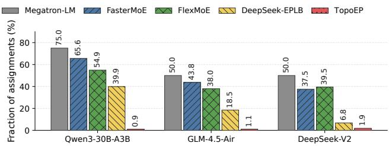

(a) Inter-node assignments  
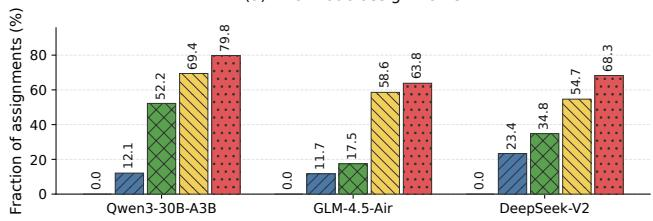  
(b) Assignments served by replicas  
Figure 16: Physical execution of token–expert assignments. (a) Fraction whose source and execution ranks are on different nodes. (b) Fraction executed by replicas.

GPU-native load balancing. More recent systems move load-balancing decisions onto the GPU. UltraEP [34] and MoonEP [1] use lightweight planners for per-layer, permicrobatch balancing and avoid the host–GPU round trip. However, both are designed primarily for a single scale-up domain. Their planners neither model the heterogeneous communication costs of NVLink and RDMA nor optimize crossdomain replica placement, so they are not directly applicable to the inter-node EP setting considered here. TopoEP targets this setting with a planner that models the hierarchical scaleup and scale-out topology when deciding replica placement and token rerouting.

## 8 Conclusion

This paper presents TopoEP, a GPU-native, topology-aware load-balancing system for large-scale MoE training. It uses a deterministic two-stage GPU solver to balance rank loads while accounting for the heterogeneous communication costs of scale-up and scale-out fabrics, and applies each resulting plan without data-dependent host synchronization. When integrated with Megatron-LM on a 32-GPU NVIDIA H800 cluster, it improves end-to-end training throughput by 6.2%– 11.4% across three representative MoE models without observable degradation in training-loss convergence.

## References

[1] Yutian Chen, Cong Li, Yucheng Wang, and Ming Wei. MoonEP: A perfectly balanced expert parallelism library via dynamic redundant experts. https://github.com/ MoonshotAI/MoonEP, 2026.

[2] Damai Dai, Chengqi Deng, Chenggang Zhao, R. X. Xu, Huazuo Gao, Deli Chen, Jiashi Li, Wangding Zeng, Xingkai Yu, Y. Wu, Zhenda Xie, Y. K. Li, Panpan Huang, Fuli Luo, Chong Ruan, Zhifang Sui, and Wenfeng Liang. DeepSeekMoE: Towards ultimate expert specialization in mixture-of-experts language models. In Proceedings ofthe 62nd Annual Meeting ofthe Associationfor Computational Linguistics (Volume 1: Long Papers), pages 1280–1297. Association for Computational Linguistics, 2024.

[3] DeepSeek-AI. Deepseek-v2: A strong, economical, and efficient mixture-of-experts language model, 2024.

[4] DeepSeek-AI. DeepSeek-V3 technical report, 2024.

[5] DeepSeek-AI. EPLB: Expert parallelism load balancer. https://github.com/deepseek-ai/EPLB, 2025.

[6] William Fedus, Barret Zoph, and Noam Shazeer. Switch transformers: Scaling to trillion parameter models with simple and efficient sparsity. Journal ofMachine Learning Research, 23(120):1–39, 2022.

[7] Trevor Gale, Deepak Narayanan, Cliff Young, and Matei Zaharia. MegaBlocks: Efficient sparse training with mixture-of-experts. In Proceedings of Machine Learning and Systems, volume 5, pages 288–304. MLSys, 2023.

[8] Wentao Guo, Mayank Mishra, Xinle Cheng, Ion Stoica, and Tri Dao. Sonicmoe: Accelerating moe with io and tile-aware optimizations. In C. Vondrick, B. Hariharan, C. Raffel, L. Pinto, D. Yang, and A. Faust, editors, International Conference on Learning Representations, volume 2026, pages 67814–67839, 2026.

[9] Khaled Hamidouche, John Bachan, Pak Markthub, Peter-Jan Gootzen, Elena Agostini, Sylvain Jeaugey, Aamir Shafi, Georgios Theodorakis, and Manjunath Gorentla Venkata. Gpu-initiated networking for nccl. arXiv preprint arXiv:2511.15076, 2025.

[10] Jiaao He, Jidong Zhai, Tiago Antunes, Haojie Wang, Fuwen Luo, Shangfeng Shi, and Qin Li. FasterMoE: Modeling and optimizing training of large-scale dynamic pre-trained models. In Proceedings of the 27th ACM SIGPLAN Symposium on Principles and Practice of Parallel Programming, pages 120–134. ACM, 2022.

[11] Changho Hwang, Wei Cui, Yifan Xiong, Ziyue Yang, Ze Liu, Han Hu, Zilong Wang, Rafael Salas, Jithin Jose, Prabhat Ram, HoYuen Chau, Peng Cheng, Fan Yang, Mao Yang, and Yongqiang Xiong. Tutel: Adaptive mixture-of-experts at scale. In Proceedings of Machine Learning and Systems, volume 5, pages 269–287. ML-Sys, 2023.

[12] Yechan Kim, Hwijoon Lim, and Dongsu Han. Scaling beyond the GPU memory limit for large mixture-ofexperts model training. In Ruslan Salakhutdinov, Zico Kolter, Katherine Heller, Adrian Weller, Nuria Oliver, Jonathan Scarlett, and Felix Berkenkamp, editors, Proceedings of the 41st International Conference on Machine Learning, volume 235 of Proceedings ofMachine Learning Research, pages 24342–24353. PMLR, 21–27 Jul 2024.

[13] Dmitry Lepikhin, HyoukJoong Lee, Yuanzhong Xu, Dehao Chen, Orhan Firat, Yanping Huang, Maxim Krikun, Noam Shazeer, and Zhifeng Chen. GShard: Scaling giant models with conditional computation and automatic sharding. In 9th International Conference on Learning Representations (ICLR), 2021.

[14] Jiamin Li, Yimin Jiang, Yibo Zhu, Cong Wang, and Hong Xu. Accelerating distributed MoE training and inference with Lina. In 2023 USENIX Annual Technical Conference (USENIX ATC 23), pages 945–959, Boston, MA, July 2023. USENIX Association.

[15] Raymond Li, Loubna Ben Allal, Yangtian Zi, Niklas Muennighoff, Denis Kocetkov, Chenghao Mou, Marc Marone, Christopher Akiki, et al. StarCoder: May the source be with you! Transactions on Machine Learning Research, 2023.

[16] Juncai Liu, Jessie Hui Wang, and Yimin Jiang. Janus: A unified distributed training framework for sparse mixture-of-experts models. In Proceedings ofthe ACM SIGCOMM 2023 Conference, pages 486–498. ACM, 2023.

[17] Rui Liu, Young Jin Kim, Alexandre Muzio, and Hany Hassan. Gating dropout: Communication-efficient regularization for sparsely activated transformers. In Kamalika Chaudhuri, Stefanie Jegelka, Le Song, Csaba Szepesvari, Gang Niu, and Sivan Sabato, editors, Proceedings of the 39th International Conference on Machine Learning, volume 162 of Proceedings of Machine Learning Research, pages 13782–13792. PMLR, 17–23 Jul 2022.

[18] Zixuan Ma, Jiaao He, Jiezhong Qiu, Huanqi Cao, Yuan wei Wang, Zhenbo Sun, Liyan Zheng, Haojie Wang, Shizhi Tang, Tianyu Zheng, Junyang Lin, Guanyu Feng, Zeqiang Huang, Jie Gao, Aohan Zeng, Jianwei Zhang,

Runxin Zhong, Tianhui Shi, Sha Liu, Weimin Zheng, Jie Tang, Hongxia Yang, Xin Liu, Jidong Zhai, and Wenguang Chen. Bagualu: targeting brain scale pretrained models with over 37 million cores. In Proceedings of the 27th ACM SIGPLAN Symposium on Principles and Practice of Parallel Programming, PPoPP ’22, page 192–204, New York, NY, USA, 2022. Association for Computing Machinery.

[19] Xuan-Phi Nguyen, Shrey Pandit, Austin Xu, Caiming Xiong, and Shafiq Joty. Least-loaded expert parallelism: Load balancing an imbalanced mixture-of-experts. In Forty-third International Conference on Machine Learning, 2026.

[20] Xiaonan Nie, Xupeng Miao, Shijie Cao, Lingxiao Ma, Qibin Liu, Jilong Xue, Youshan Miao, Yi Liu, Zhi Yang, and Bin Cui. Evomoe: An evolutional mixture-ofexperts training framework via dense-to-sparse gate, 2022.

[21] Xiaonan Nie, Xupeng Miao, Zilong Wang, Zichao Yang, Jilong Xue, Lingxiao Ma, Gang Cao, and Bin Cui. Flex-MoE: Scaling large-scale sparse pre-trained model training via dynamic device placement. Proceedings of the ACM on Management ofData, 1(1):1–19, 2023.

[22] NVIDIA. NVIDIA Hopper Architecture In-Depth. https://developer.nvidia.com/blog/ nvidia-hopper-architecture-in-depth/, 2022.

[23] Guilherme Penedo, Hynek Kydlícek, Loubna Ben al-ˇ lal, Anton Lozhkov, Margaret Mitchell, Colin Raffel, Leandro Von Werra, and Thomas Wolf. The fineweb datasets: Decanting the web for the finest text data at scale. In The Thirty-eight Conference on Neural Information Processing Systems Datasets and Benchmarks Track, 2024.

[24] Guilherme Penedo, Hynek Kydlícek, Vinko Sabolˇ cec,ˇ Bettina Messmer, Negar Foroutan, Amir Hossein Kargaran, Colin Raffel, Martin Jaggi, Leandro von Werra, and Thomas Wolf. FineWeb2: One pipeline to scale them all—adapting pre-training data processing to every language, 2025.

[25] Samyam Rajbhandari, Conglong Li, Zhewei Yao, Minjia Zhang, Reza Yazdani Aminabadi, Ammar Ahmad Awan, Jeff Rasley, and Yuxiong He. DeepSpeed-MoE: Advancing mixture-of-experts inference and training to power next-generation AI scale. In Proceedings of the 39th International Conference on Machine Learning, volume 162 of Proceedings of Machine Learning Research, pages 18332–18346. PMLR, 2022.

[26] Noam Shazeer, Azalia Mirhoseini, Krzysztof Maziarz, Andy Davis, Quoc V. Le, Geoffrey E. Hinton, and Jeff

Dean. Outrageously large neural networks: The sparselygated mixture-of-experts layer. In 5th International Conference on Learning Representations (ICLR), 2017.

[27] Mohammad Shoeybi, Mostofa Patwary, Raul Puri, Patrick LeGresley, Jared Casper, and Bryan Catanzaro. Megatron-lm: Training multi-billion parameter language models using model parallelism, 2020.

[28] Athinagoras Skiadopoulos, Mark Zhao, Swapnil Gandhi, Thomas Norrie, Shrijeet Mukherjee, and Christos Kozyrakis. SYMI: Efficient Mixture-of-Experts training via model and optimizer state decoupling. In 23rd USENIX Symposium on Networked Systems Design and Implementation (NSDI 26), pages 75–92, Renton, WA, May 2026. USENIX Association.

[29] Luca Soldaini, Rodney Kinney, Akshita Bhagia, Dustin Schwenk, David Atkinson, Russell Authur, Ben Bogin, Khyathi Chandu, Jennifer Dumas, Yanai Elazar, Valentin Hofmann, Ananya Jha, Sachin Kumar, Li Lucy, Xinxi Lyu, Nathan Lambert, Ian Magnusson, Jacob Morrison, Niklas Muennighoff, Aakanksha Naik, Crystal Nam, Matthew Peters, Abhilasha Ravichander, Kyle Richard son, Zejiang Shen, Emma Strubell, Nishant Subramani, Oyvind Tafjord, Evan Walsh, Luke Zettlemoyer, Noah Smith, Hannaneh Hajishirzi, Iz Beltagy, Dirk Groeneveld, Jesse Dodge, and Kyle Lo. Dolma: an open corpus of three trillion tokens for language model pretraining research. In Lun-Wei Ku, Andre Martins, and Vivek Sriku mar, editors, Proceedings ofthe 62nd Annual Meeting ofthe Associationfor Computational Linguistics (Volume 1: Long Papers), pages 15725–15788, Bangkok, Thailand, August 2024. Association for Computational Linguistics.

[30] Luca Soldaini and Kyle Lo. peS2o (Pretraining Efficiently on S2ORC) Dataset. Technical report, Allen Institute for AI, 2023. ODC-By, https://github.com/ allenai/pes2o.

[31] Qwen Team. Qwen3 technical report, 2025.

[32] Ashish Vaswani, Noam Shazeer, Niki Parmar, Jakob Uszkoreit, Llion Jones, Aidan N. Gomez, Łukasz Kaiser, and Illia Polosukhin. Attention is all you need. In Advances in Neural Information Processing Systems, volume 30, pages 5998–6008. Curran Associates, Inc., 2017.

[33] Lean Wang, Huazuo Gao, Chenggang Zhao, Xu Sun, and Damai Dai. Auxiliary-loss-free load balancing strategy for mixture-of-experts. arXiv preprint arXiv:2408.15664, 2024.

[34] Xinming Wei, Chao Jin, Tuo Dai, Yinmin Zhong, Shan Yu, Chengxu Yang, Bingyang Wu, Zili Zhang, Jing Mai,

Qianchao Zhu, Zhouyang Li, Yuliang Liu, and Guojie Luo. UltraEP: Unleash MoE training and inference on rack-scale nodes with near-optimal load balancing, 2026.

[35] Qiying Yu, Zheng Zhang, Ruofei Zhu, Yufeng Yuan, Xiaochen Zuo, Yu Yue, et al. DAPO: An open-source LLM reinforcement learning system at scale. In D. Belgrave, C. Zhang, H. Lin, R. Pascanu, P. Koniusz, M. Ghassemi, and N. Chen, editors, Advances in Neural Information Processing Systems, volume 38, Main Conference, pages 113222–113244. Curran Associates, Inc., 2025.

[36] Aohan Zeng, Xin Lv, Qinkai Zheng, Zhenyu Hou, Bin Chen, et al. GLM-4.5: Agentic, reasoning, and coding (ARC) foundation models, 2025.

[37] Shulai Zhang, Ningxin Zheng, Haibin Lin, Ziheng Jiang, Wenlei Bao, Chengquan Jiang, Qi Hou, Weihao Cui, Size Zheng, Li-Wen Chang, Quan Chen, and Xin Liu. Comet: Fine-grained computation-communication overlapping for mixture-of-experts. In M. Zaharia, G. Joshi, and Y. Lin, editors, Proceedings of Machine Learning and Systems, volume 7. MLSys, 2025.

[38] Chenggang Zhao, Shangyan Zhou, Liyue Zhang, Chengqi Deng, Zhean Xu, Yuxuan Liu, Kuai Yu, Jiashi Li, and Liang Zhao. Deepep: an efficient expertparallel communication library. https://github. com/deepseek-ai/DeepEP, 2025.

[39] Yanqi Zhou, Tao Lei, Hanxiao Liu, Nan Du, Yanping Huang, Vincent Zhao, Andrew M Dai, Quoc V Le, James Laudon, et al. Mixture-of-experts with expert choice routing. Advances in Neural Information Processing Systems, 35:7103–7114, 2022.