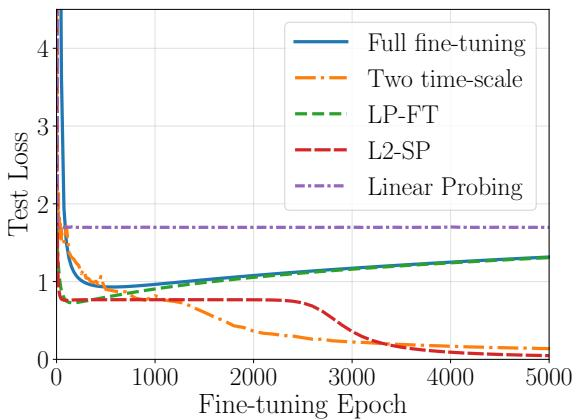
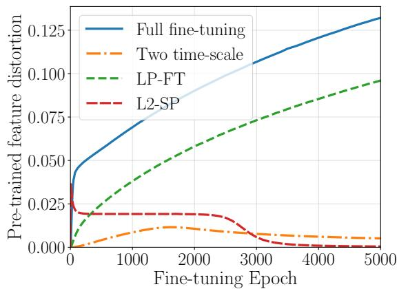
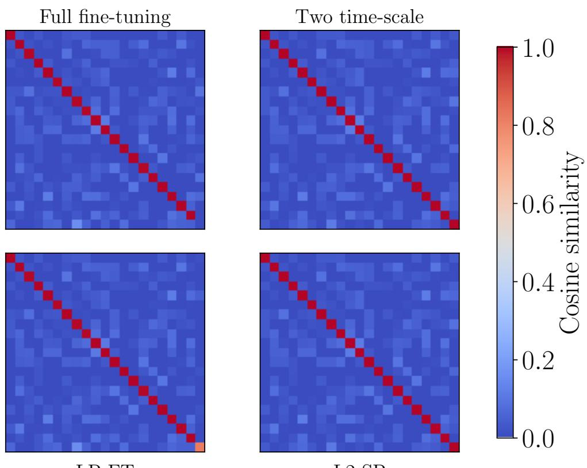
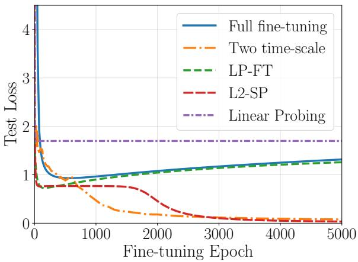
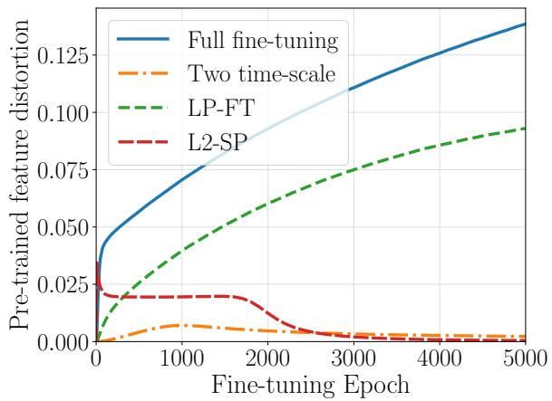
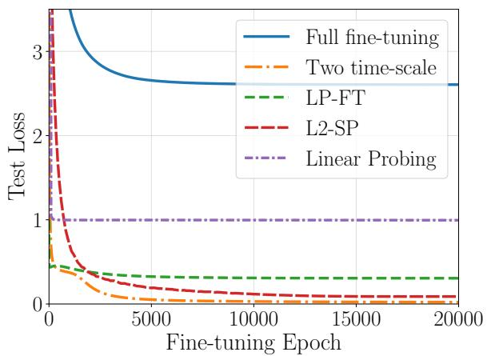
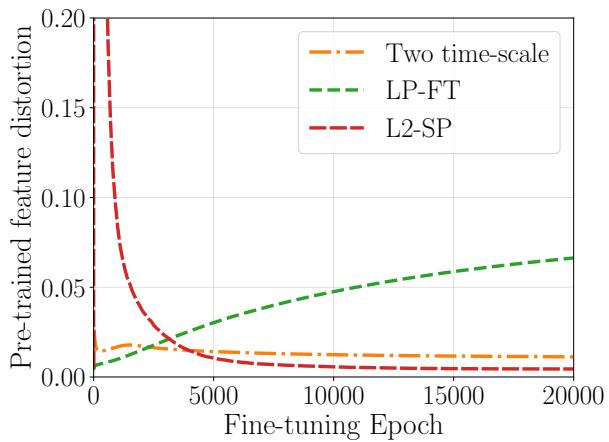

# Two-Timescale Fine-tuning Provably Learns New Features for Two-Layer ReLU Networks

Etienne Boursier INRIA, LMO, Universite Paris-Saclay,´ Orsay, France etienne.boursier@inria.fr

Nicolas Flammarion EPFL, Lausanne, Switzerland nicolas.flammarion@epfl.ch

## Abstract

Fine-tuning pre-trained models on specialized tasks with scarce data is central to modern deep learning. Despite its empirical success, theoretical understanding of fine-tuning remains limited. We introduce a Gaussian multi-index setting to study fine-tuning from pre-trained weights, where the teacher network has m + 1 features, m of which are learned during pre-training and one of which must be learned during fine-tuning. For two-layer ReLU networks, we show that two-timescale training, i.e., updating the outer weights infinitely faster than the hidden ones, learns the new task-specific feature while preserving the pretrained ones in the model representation. Moreover, only O(d) fine-tuning samples are required for this recovery, independently of the number of pre-trained features. In contrast, with random initialization, the same number of samples is insufficient to recover the target parameters. Our results therefore demonstrate that pre-training can induce an implicit bias with a clear statistical advantage over random initialization, enabling feature learning from scarce fine-tuning data.

## 1 Introduction

With the recent rise of foundation models, deep learning architectures are increasingly trained in two stages: they are first pre-trained on large and diverse datasets, and then fine-tuned on more specialized and typically much smaller datasets. This pre-training/fine-tuning paradigm has become central to modern machine learning and consistently outperforms single-task learning, where a model is trained from scratch directly on the target task (Kornblith et al., 2019).

Despite this empirical success, our theoretical understanding of fine-tuning remains limited. A large body of work has studied the training of neural networks in the single-task setting, often through simplified architectures such as two-layer ReLU neural networks (Chizat & Bach, 2018; Lyu & Li, 2020; Boursier et al., 2022). These analyses, however, typically consider training from an uninformative random initialization. Fine-tuning is fundamentally different: optimization starts from a highly structured initialization that already encodes information about related tasks. This raises a basic question: Does pre-training merely make optimization easier, helping fine-tuning reach a solution that could also be learned from the fine-tuning data alone? Or does the pre-trained initialization provide side information that changes what can be learned from these limited data? We show that the latter can indeed occur. Pre-training can induce a favorable implicit bias during fine-tuning, leading to better generalization even when the target task requires learning features that are absent from the pre-trained representation.

To understand this advantage, we need to explain how fine-tuning can learn the missing features from limited target data without relearning the entire representation. Existing theoretical analyses have largely focused on the preservation and reuse of pre-trained features (Shachaf et al., 2021; Kumar et al., 2022; Malladi et al., 2023). Yet empirical evidence shows that fine-tuning can also modify the representation and learn new task-specific features (Peters et al., 2019). Our work addresses this tension by showing how fine-tuning can acquire a new relevant feature while preserving the useful features already learned during pre-training.

In particular, we show that such a feature can be learned from a pre-trained initialization with limited target data, even when the same feature fails to emerge from random initialization.

Contributions. We introduce a Gaussian multi-index setting designed to capture the key aspects of finetuning while remaining amenable to a precise analysis. We show that, under two-timescale training—where the outer weights are adapted much faster than the hidden weights—and in the limit where the void features inherited from pre-training have vanishing scale, the training dynamics converge to a limiting process in which, during an initial phase, only the void features are effectively updated. The pre-trained features therefore remain intact while new features are learned.

We then show that these limiting dynamics can recover a new neuron, corresponding to a feature unseen during pre-training, from only O(d) fine-tuning samples. Importantly, this sample complexity is independent of the number of relevant features already learned during pre-training. In contrast, learning the same model from scratch requires a sample complexity that grows with the number of features, highlighting a statistical advantage of fine-tuning over single-task learning.

Our analysis combines a detailed characterization of the optimization dynamics (Section 3.1) with sharp statistical concentration arguments (Section 3.2), yielding optimal statistical guarantees for the considered fine-tuning procedure.

## 1.1 Related work

Theory of fine-tuning. The theoretical literature on fine-tuning from pre-trained weights remains limited, especially compared with the vast literature on single-task learning. Several works (Shachaf et al., 2021; Kumar et al., 2022; Wu et al., 2022; Lee et al., 2023; Lauditi et al., 2026) study fine-tuning in linear networks and identify settings in which pre-trained features can be successfully or unsuccessfully adapted to a downstream task. In a related line of work, Shachaf et al. (2021); Malladi et al. (2023); Tomihari & Sato (2024) study fine-tuning from an NTK perspective. These analyses, however, do not capture the learning of new, taskspecific features during fine-tuning, and instead focus primarily on adapting the pre-trained representation to the downstream task. With the exception of Shachaf et al. (2021), who consider the simultaneous finetuning of multiple layers under restrictive assumptions on both the pre-training and fine-tuning tasks, these approaches essentially reduce fine-tuning to a linear adaptation around the pre-trained weights. They therefore cannot capture the rich feature-learning dynamics that may arise during fine-tuning. We instead study fine-tuning of a two-layer ReLU network in the feature-learning regime. Our downstream task requires the pre-trained model not only to reuse features acquired during pre-training, but also to learn a genuinely new, task-specific feature. This setting allows us to show that fine-tuning from pre-trained weights can learn a feature that would not be learned from random initialization.

More recently, Lippl & Lindsey (2024); Anguita et al. (2026) have studied how the scale of the pre-trained initialization affects the optimization dynamics of fine-tuning and their implicit bias. These works focus primarily on optimization and do not provide a statistical analysis translating the resulting dynamics into improved generalization guarantees on the fine-tuning task. Jones-McCormick et al. (2025) establish a statistical advantage of fine-tuning over single-task learning in a single-index model. In their setting, however, the feature relevant to the fine-tuning task can already be recovered from the unsupervised pre-training task via PCA. By contrast, our fine-tuning procedure must learn a feature that is absent from the pre-trained representation, while preserving the useful features acquired during pre-training.

Parameter efficient fine-tuning. Given the enormous number of parameters in foundation models, parameterefficient fine-tuning methods such as LoRA (Hu et al., 2022) adapt only a small subset of the model parameters. We view these methods as a distinct class of algorithms, with different expressivity and applications from methods that update all model weights. They have also attracted increasing theoretical interest (see e.g., Jang et al., 2024; Dayi & Chen, 2024; Zhang et al., 2025; Kim et al., 2025). This line of work is complementary to ours, although our setting is inspired by Dayi & Chen (2024) and our fine-tuning task could be solved by LoRA, as explained in Section 3.

Learning ReLU neurons. Our theoretical setting can be viewed as an extension of the widely studied problem of learning a single ReLU neuron (Soltanolkotabi, 2017a; Yehudai & Ohad, 2020; Xu & Du, 2023). While this literature considers learning a single neuron from scratch, we study the learning of a new ReLU neuron in the presence of m neurons already learned during pre-training. Extending our setting to multiple new features would be a natural and important direction, but is outside our scope. Learning multiple neurons remains largely unsolved in fully general settings (Zhong et al., 2017; Zhang et $\mathsf { a l . } ,$ 2019). Interestingly, this literature typically trains only the hidden layer. Our analysis instead crucially relies on training both layers at different learning rates. This two layer structure yields the limiting dynamics in Equation (4), which are key to learning the new feature while preserving the pre-trained ones.

Two-timescale optimization. Two-timescale optimization, in which different layers are trained with different learning rates, has been studied in several single-task settings (Marion & Berthier, 2023; Berthier et al., 2025; Bietti et al., 2025; Barboni et al., 2025), through the limiting dynamics obtained when the outer weights are trained infinitely faster than the inner ones. In these works, the two-timescale regime is primarily motivated by analytical tractability. Differential learning rates are also widely used in practice for fine-tuning, as they help preserve pre-trained features and mitigate feature distortion (Howard & Ruder, 2018). Thus, the two-timescale regime in our work is motivated both by its relevance to practical fine-tuning and by the tractable training dynamics it provides.

## 1.2 Outline.

We introduce our fine-tuning setting and derive the limiting dynamics of interest in Section 2. Section 3 presents our main results, showing these dynamics recover the optimal weights both at the population level and from $n \gtrsim$ d samples. Section 4 discusses the results and their relation to the existing literature. Finally, Section 5 illustrates our theoretical findings through a toy numerical experiment.

## 2 Setting and limit dynamics

We consider a teacher-student setting in which data $( x _ { i } , y _ { i } ) _ { i \in [ n ] }$ are generated i.i.d. as follows:

$$
\begin{array} { r } { x _ { i } \sim \mathcal { N } ( 0 , \mathrm { I } _ { d } ) \qquad \mathrm { a n d } \qquad y _ { i } = \sum _ { i = 1 } ^ { m + 1 } \sigma ( x ^ { \top } w _ { i } ^ { \star } ) , } \end{array}
$$

where $\sigma ( \cdot ) = \operatorname* { m a x } ( 0 , \cdot )$ is the ReLU activation. The labels are generated by a two-layer teacher network of width $m + 1$ , whose output weights are all equal to one. On these data, we train a two-layer ReLU network parametrized by $\theta = ( a , \mathbf { \tilde { W } } ) \in \breve { \mathbb { R } } ^ { m + 1 } \times \mathbb { R } ^ { ( m + 1 ) \times d } \cdot$ by minimizing the empirical square loss

$$
\begin{array} { r l r l } { \mathcal { L } _ { n } ( \theta ) : = \frac { 1 } { n } \sum _ { i = 1 } ^ { n } \left( f _ { \theta } ( x _ { i } ) - y _ { i } \right) ^ { 2 } } & { } & { \mathrm { w h e r e } } & { \ } & { f _ { \theta } ( x ) = \sum _ { i = 1 } ^ { m + 1 } a _ { i } \sigma ( x ^ { \top } w _ { i } ) . } \end{array}
$$

Our goal is to understand fine-tuning from a pre-trained initialization that has already learned m of the $m + 1$ teacher features. Specifically, we assume that pre-training has recovered the features $w _ { 1 } ^ { \star } , \ldots , w _ { m } ^ { \star } ,$ whereas the remaining feature $w _ { m + 1 } ^ { \star }$ was absent from the pre-training task and must therefore be learned during fine-tuning. Motivated by this picture, we initialize the hidden weights as follows, for a small $\alpha > 0$

$$
\begin{array} { r } { w _ { i } ( 0 ) = w _ { i } ^ { \star } \mathrm { ~ f o r ~ a n y ~ } i \in [ m ] , \qquad w _ { m + 1 } ( 0 ) = \alpha \check { w } \mathrm { ~ w i t h ~ } \check { w } \sim \mathrm { U n i f } ( \mathbb { S } _ { d - 1 } ) . } \end{array}\tag{1}
$$

This initialization thus idealizes finite-time pre-training on data generated only by the first m teacher features; it is discussed further in Section 4.

## 2.1 Two-timescale dynamics

Fine-tuning is typically performed by gradient-based optimization of the empirical loss ${ \mathcal { L } } _ { n } ( \theta )$ . For the sake of the analysis, we model this optimization by gradient flow, which describes its continuous-time behavior in the small-step-size limit:

$$
\dot { \theta } ( t ) \in - \partial \mathcal { L } _ { n } ( \theta ( t ) ) ,
$$

where ∂ stands for the Clarke subdifferential, which accounts for the non-differentiability of ReLU. In the regime studied in this work, updating all layers at the same rate can substantially modify the pre-trained features and thereby degrade their generalization properties (see Section 4). A natural alternative, considered in several previous works, is to use a larger learning rate for the output layer than for the hidden layer. This allows the output coefficients to adapt rapidly to the downstream task while limiting the displacement of the pre-trained features. In the limit where the ratio between the output- and hidden-layer learning rates tends to infinity, the dynamics converge to a two-timescale regime in which the output weights are instantaneously fitted to their optimal values, while the hidden weights evolve on a much slower timescale. We focus on this theoretical limit, which corresponds to the following training dynamics:

$$
{ \dot { W } } ( t ) \in - \partial _ { W } { \mathcal { L } } _ { n } ( a _ { n } ( W ( t ) ) , W ( t ) ) \qquad { \mathrm { w h e r e } } \qquad a _ { n } ( W ) : = \operatorname * { a r g m i n } _ { a \in { \mathbb { R } } ^ { m + 1 } } { \mathcal { L } } _ { n } ( a , W ) .\tag{2}
$$

The argmin above may not be unique, making the dynamics of Equation (2) ill-defined. However, with our choice of initialization and sufficiently many samples, the argmin is unique along the whole trajectory, making the dynamics well defined. In particular, the trajectory remains within a set $\mathcal { T } \subseteq \mathbb { R } ^ { ( m + 1 ) ^ { \prime } \times d }$ that satisfies Assumption 1 below (see Theorem 1 for details).

Assumption 1 (Conditioning of the empirical feature matrix in T ). The set T is compact and for any $W \in { \mathcal { T } } ,$ $\lambda _ { \operatorname* { m i n } } \left( { \bar { \Sigma ( W , \mathbf { X } ) } } \Sigma ( W , \mathbf { X } ) ^ { \top } \right) > \breve { 0 }$ , where $\boldsymbol { \Sigma } ( \mathbf { \dot { \boldsymbol { W } } } , \mathbf { \boldsymbol { X } } ) \in \mathbb { R } ^ { ( m + 1 ) \times n }$ is the empiricalfeature matrix, given by $\Sigma ( \bar { W } , { \bf X } ) _ { i k } =$ $\sigma ( w _ { i } ^ { \top } x _ { k } )$ and $\lambda _ { \operatorname* { m i n } }$ denotes the smallest eigenvaluefunction

## 2.2 Separated neuron dynamics

Studying the dynamics of Equation (2) remains extremely challenging in full generality. We therefore exploit the specific structure of the pre-trained initialization in Equation (1). Importantly, the ReLU activation is homogeneous, meaning that $\dot { \sigma } ( \lambda z ) = \lambda \sigma ( z )$ for any $\lambda \geq 0$ . As a first consequence, the norm of each neuron $w _ { i }$ remains constant throughout training.

Lemma 1. Let $W \in \mathbb { R } ^ { ( m + 1 ) \times d }$ follow Equation (2), then for any $i \in [ m + 1 ] , \ \| w _ { i } ( t ) \| = \| w _ { i } ( 0 ) \|$

In consequence, one only has to track the normalized neurons $\begin{array} { r } { \mathsf { w } _ { i } : = \frac { w _ { i } } { \| w _ { i } \| } } \end{array}$ during the dynamics. Using the homogeneity of the ReLU activation, one can easily derive the dynamics followed by the normalized neurons. If we denote by W the matrix whose i-th row is given by $\mathsf { w } _ { i }$ and W follows the differential inclusion of Equation (2), then its row-normalized version satisfies the following differential inclusion for almost any $t \geq 0 \colon$

$$
\begin{array} { r } { \dot { \mathsf { w } } _ { i } ( t ) \in - \frac { 1 } { \| w _ { i } ( 0 ) \| ^ { 2 } } \partial _ { \mathsf { w } _ { i } } \mathcal { L } _ { n } ( a _ { n } ( \mathsf { W } ( t ) ) , \mathsf { W } ( t ) ) \qquad \mathrm { f o r ~ a l l ~ } i \in [ m + 1 ] . } \end{array}\tag{3}
$$

Notably, the evolution rate of neuron i in Equation (3) scales as $\lVert w _ { i } ( 0 ) \rVert ^ { - 2 }$ . When initialized by Equation (1), as α goes to $0 ,$ the last neuron—that does not correspond to any pre-trained feature—therefore evolves on an infinitely faster timescale than the other neurons. In the limit, only this neuron evolves, while the other neurons, inherited from the pre-training procedure, remain fixed. This limiting dynamics is formalized in Proposition 1 below.

Proposition 1. Consider $T \in \mathbb { R } _ { + } .$ , any positive sequence $( \alpha _ { k } ) _ { k \in \mathbb { N } }$ such that $\alpha _ { k } \stackrel { k  \infty } {  } 0 ,$ and corresponding solutions Wαk of Equation (3), where $W ^ { \alpha _ { k } } ( 0 )$ is initialized by Equation (1) with scale $\alpha _ { k } .$   
Suppose that for k large enough, the trajectory $\left( \mathsf { W } ^ { \tilde { \alpha } _ { k } } ( \dot { \alpha } _ { k } ^ { 2 } t ) \right) _ { t \in [ 0 , T ] }$ is included within some set $\tau ,$ , independent of $k ,$ satisfying Assumption 1. Then, one can extract a subsequence $\alpha _ { \varphi ( k ) }$ such that, as $k  \infty , ( \mathsf { W } ( \alpha _ { \varphi ( k ) } ^ { 2 } t ) ) _ { t \geq 0 }$ converges uniformly towards $\mathsf { W } ^ { \circ } ( t )$ on $[ 0 , T ]$ , where $\mathsf { W } ^ { \mathrm { o } }$ is a solution ofthefollowing differential inclusionfor almost any $t \geq 0 ,$ with $\mathsf { w } _ { m + 1 } ^ { \circ } ( 0 ) = \breve { w }$

$$
\begin{array} { r } { \left\{ \begin{array} { l l } { \mathbf { w } _ { i } ^ { \circ } ( t ) = \frac { w _ { i } ^ { \star } } { \| w _ { i } ^ { \star } \| } \qquad f o r a n y i \in [ m ] , } \\ { \dot { \mathbf { w } } _ { m + 1 } ^ { \circ } ( t ) \in - \partial _ { \mathbf { w } _ { m + 1 } } \mathcal { L } _ { n } \big ( a _ { n } ( \mathsf { W } ^ { \circ } ( t ) ) , \mathsf { W } ^ { \circ } ( t ) \big ) . } \end{array} \right. } \end{array}\tag{4}
$$

Proposition 1 implies that, as $\alpha  0 ,$ , the trajectories ${ \mathsf { W } } ^ { \alpha } ( \alpha ^ { 2 } \cdot )$ converge uniformly, on any compact of $\mathbb { R } _ { + } ,$ towards the set of solutions of the limit differential inclusion (4). Importantly, the convergence is only to a set of trajectories, since Equation (4) may admit multiple solutions due to the non-differentiability of the loss. Characterizing these different solutions is the focus of Section 3.

Proposition 1 also requires the trajectories to remain in a set T satisfying Assumption 1. In Section 3, we show that, with high probability, all trajectories of the limiting process remain in such a set (see Theorem 2). Lemma 14, given in Appendix D, then implies that, for α sufficiently small, the trajectories ${ \mathsf { W } } ^ { \alpha } ( \alpha ^ { 2 } \cdot )$ also remain in a set T satisfying Assumption 1.

## 3 Two-timescale small initialization dynamics

The two-timescale dynamics in Equation (2) are difficult to analyze directly. In the limit $\alpha  0 ,$ , however, they reduce to the simpler dynamics in Equation (4), which we study throughout the remainder of the paper. In this limiting regime, the pre-trained features $w _ { i } ^ { \circ } , i \in [ m ]$ , remain fixed, and only the new feature evolves. The dynamics are nevertheless nontrivial because the corresponding output weights $a _ { i } ^ { \circ }$ of the pretrained features continue to evolve and must be carefully controlled. In particular, as shown in the proof of Lemma 2, these output weights are not initially equal to their optimal value, namely 1, and reach this value only at convergence. Early in training, they instead compensate for the fact that the $( m + 1 ) { \mathrel { - } } { \mathrm { t h } }$ feature has not yet been learned. This transient compensation also explains why the Linear Probe then Fine-Tune method (see Section 4) does not achieve zero test loss in our setting, as confirmed experimentally in Section 5.

For the same reason, the dynamics are more complex than simply freezing the first m neurons—both their inner and output weights—and training only the $( m + 1 ) { \cdot } \mathrm { t h }$ neuron. Such a procedure would be closer to LoRA fine-tuning and, in our setting, would reduce to learning a single ReLU neuron. To keep the analysis tractable, we make the following assumption on the teacher features.

Assumption 2. The teacher features $( w _ { i } ^ { \star } ) _ { i \in [ m + 1 ] }$ form an orthonormal system of $\mathbb { R } ^ { d } .$

Assumption 2 simplifies the analysis by yielding a closed-form expression for $a _ { n } ( W )$ , at least in the population limit studied in Section 3.1. Orthogonality of features is a standard assumption in the literature on learning from multi-neuron teacher networks (Safran & Shamir, 2018; Simsek et al., 2023; Dayi & Chen, 2024). We discuss the dependence of our results on this assumption in Section 4.

## 3.1 Warm up: gradient flow on population loss

Before studying the training dynamics of Equation (4), we first focus on the population loss case, where fine-tuning is done with access to an infinite number of data points. More precisely, we here consider the population loss dynamics given by the following ODE1, for any $t \geq 0 \colon$

$$
w _ { i } ( t ) = w _ { i } ^ { \star } \mathrm { ~ f o r ~ a n y ~ } i \in [ m ] , \qquad \mathrm { a n d } \qquad \dot { w } _ { m + 1 } ( t ) \in - \nabla _ { w _ { m + 1 } } \mathcal { L } ( a ( W ( t ) ) , W ( t ) ) ;\tag{5}
$$

where $\begin{array} { r } { w _ { m + 1 } ( 0 ) = \check { w } , a ( W ) : = \mathrm { a r g m i n } _ { a \in \mathbb { R } ^ { m + 1 } } \mathcal { L } ( a , W ) } \end{array}$ and

$$
\begin{array} { r } { \mathcal { L } ( \boldsymbol { a } , W ) : = \mathbf { E } _ { \boldsymbol { x } \sim \mathcal { N } ( 0 , \mathrm { I } _ { d } ) } \left[ \left( \sum _ { i = 1 } ^ { m + 1 } a _ { i } ( t ) \sigma ( \boldsymbol { x } ^ { \top } w _ { i } ( t ) ) - \sum _ { i = 1 } ^ { m + 1 } \sigma ( \boldsymbol { x } ^ { \top } w _ { i } ^ { \star } ) \right) ^ { 2 } \right] . } \end{array}
$$

Although this simpler setting avoids any statistical consideration, it already provides a good grasp of what is happening from an optimization point of view. We show in this section that $w _ { m + 1 }$ converges to $w _ { m + 1 } ^ { \star }$ in the population loss dynamics. For that, we merely need to track the angular deviation between these two vectors. In the population case, explicit computations can be done, relying on the arc-cosine kernel formula (Cho & Saul, 2009), for any $u , v \in \mathbb { S } _ { d - 1 } ;$

$$
\mathbf { E } _ { x \sim \mathcal { N } ( 0 , \mathrm { I } _ { d } ) } \left[ \sigma ( x ^ { \top } u ) \sigma ( x ^ { \top } v ) \right] = \frac { 1 } { 2 \pi } \left( \sqrt { 1 - ( u ^ { \top } v ) ^ { 2 } } + ( \pi - \operatorname { a r c c o s } ( u ^ { \top } v ) ) u ^ { \top } v \right) .
$$

In particular, for some functions H and D depending on this formula and defined precisely by Equation (9) in Appendix C.2, one can express precisely the loss and its gradient.

Lemma 2. Let Assumption 2 hold and $w _ { m + 1 } \in \mathbb { S } _ { d - 1 }$ such that $D ( w _ { m + 1 } ) > 0$ . Then, noting $W = [ w _ { 1 } ^ { \star \top } , \dots , w _ { m } ^ { \star \top } , w _ { m + 1 } ^ { \top } ] .$   
$a ( W )$ is uniquely defined and satisfies $\begin{array} { r } { a ( W ) _ { m + 1 } = \frac { H ( w _ { m + 1 } ) } { D ( w _ { m + 1 } ) } } \end{array}$   
Moreover, the loss and its subdifferential satisfy

$$
\mathcal { L } ( a ( W ) , W ) = D ( w _ { m + 1 } ^ { \star } ) - \frac { H ( w _ { m + 1 } ) ^ { 2 } } { D ( w _ { m + 1 } ) } ,
$$

$$
\nabla _ { w _ { m + 1 } } \mathcal { L } ( a ( W ) , W ) = - \frac { H ( w _ { m + 1 } ) } { D ( w _ { m + 1 } ) } \left( \mathrm { I } _ { d } - w _ { m + 1 } w _ { m + 1 } ^ { \top } \right) \Psi ( w _ { m + 1 } ) ,
$$

where $\begin{array} { r } { \Psi ( w ) : = 2 \nabla H ( w ) - \frac { H ( w ) } { D ( w ) } \nabla D ( w ) , } \end{array}$

Lemma 2 then provides an intricate closed-form expression of the training dynamics, in terms of the function H and D. From there, a careful analysis can be done to show convergence of the learned parameter towards the optimal choice, as given by Theorem 1 below.

Theorem 1. Let Assumption 2 hold and initialize as $w _ { m + 1 } ( 0 ) \sim \mathrm { U n i f } ( \mathbb { S } _ { d - 1 } )$ . There exist positive universal constants $m _ { 0 } ,$ c and C such that for any $\delta \in ( 0 , 1 / 2 ) , i f m \geq m _ { 0 }$ and $d \ge C m ^ { 2 } \ln ( 1 / \delta )$ , then with probability at least $1 - \delta$ over the initialization, the solution of Equation (5) satisfies:

$$
w _ { m + 1 } ( t ) ^ { \top } w _ { m + 1 } ^ { \star } \geq 1 - e ^ { - c ( t - C m ) } \qquad f o r a n y t \geq C m .
$$

Sketch of proof. The key ingredient is Lemma 4 in Appendix C.3. Let $P _ { m } w$ denote the orthogonal projection of w onto $\mathrm { S p a n } ( w _ { 1 } ^ { \star } , \ldots , w _ { m } ^ { \star } )$ . The lemma relies on the orthogonal features assumption and shows that, as long as $\| P _ { m } w _ { m + 1 } ( t ) \|$ remains below some constant threshold,

1. $D ( w _ { m + 1 } ( t ) ) \gtrsim 1 ;$

$$
\begin{array} { r } { \begin{array} { r } { 2 . \frac { \mathrm { ~ d ~ } } { \mathrm { ~ d } t } ( w _ { m + 1 } ( t ) ^ { \top } w _ { m + 1 } ^ { \star } ) \gtrsim \frac { H ( w _ { m + 1 } ( t ) ) } { D ( w _ { m + 1 } ( t ) ) } \left( 1 - w _ { m + 1 } ( t ) ^ { \top } w _ { m + 1 } ^ { \star } \right) ; } \end{array} } \end{array}
$$

$$
\begin{array} { r } { 3 . \frac { \textrm { d } } { \textrm { d } t } \| P _ { m } w _ { m + 1 } ( t ) \| \lesssim \frac { H ( w _ { m + 1 } ( t ) ) } { D ( w _ { m + 1 } ( t ) ) } \Big ( \frac { 1 } { \sqrt { m } } + \| P _ { m } w _ { m + 1 } ( t ) \| \Big ) . } \end{array}
$$

These inequalities reveal the key mechanism behind the result. As long as $\frac { H ( w _ { m + 1 } ( t ) ) } { D ( w _ { m + 1 } ( t ) ) } > 0 .$ , the component of $w _ { m + 1 } ( t )$ along $w _ { m + 1 } ^ { \star }$ grows quickly towards 1, while its component in the span of the previously learned directions $w _ { 1 } ^ { \star } , \ldots , w _ { m } ^ { \star }$ evolves at a much slower rate, of order $\begin{array} { r l r } {  { \frac { 1 } { \sqrt { m } } + \| P _ { m } w _ { m + 1 } ( t ) \| } } \end{array}$ . In particular, when m is sufficiently large and $\| P _ { m } w _ { m + 1 } ( 0 ) \|$ is sufficiently small, the undesirable component $P _ { m } w _ { m + 1 } ( t )$ grows slowly enough to remain small throughout the trajectory. This ensures that the conditions of Lemma 4 continue to hold.

It remains to verify that the ratio $H / D$ is indeed positive along the trajectory. Lemma 4 also implies that, provided

$$
\| P _ { m } w _ { m + 1 } ( 0 ) \| \lesssim 1 / \sqrt { m } \qquad \mathrm { a n d } \qquad w _ { m + 1 } ( 0 ) ^ { \top } w _ { m + 1 } ^ { \star } \gtrsim - 1 / m ,\tag{6}
$$

we have $\frac { H ( w _ { m + 1 } ( 0 ) ) ^ { 2 } } { D ( w _ { m + 1 } ( 0 ) ) } \gtrsim \frac { 1 } { m ^ { 2 } }$ . When d $\gtrsim m ^ { 2 } .$ , Equation (6) holds with high probability. Moreover, by Lemma 2, the quantity $\frac { H ( w _ { m + 1 } ) ^ { 2 } } { D ( w _ { m + 1 } ) }$ is, up to an additive constant, the opposite of the population loss. Since the population loss is non-increasing along the gradient flow, it follows that $\frac { H ( w _ { m + 1 } ( t ) ) ^ { 2 } } { D ( w _ { m + 1 } ( t ) ) }$ remains bounded away from zero for all $t \geq 0$ . Together with item 1 above, this implies that $\frac { H ( w _ { m + 1 } ( \dot { t } ) ) } { D ( w _ { m + 1 } ( t ) ) }$ remains positive (by continuity) and bounded away from zero throughout the trajectory.

The preceding argument therefore applies for all $t \geq 0 \colon$ the component along the new direction $w _ { m + 1 } ^ { \star }$ grows substantially faster than the component along the previously learned directions. A more precise analysis of the ratio $H \dot { / } D$ then yields the exact convergence rate stated in Theorem 1. □

Theorem 1 shows that, when trained on the full population distribution, the learned feature $w _ { m + 1 } ( t )$ eventually converges towards the optimal parameter $w _ { m + 1 } ^ { \star }$ at a linear rate. This convergence can nevertheless be substantially delayed by the initialization phase. Indeed, the convergence rate contains a time shift of order $C m$ . This reflects the slow dynamics at initialization: the update of $w _ { m + 1 } ( t )$ is initially only of order 1/m (due to the ratio $\frac { H ( w _ { m + 1 } ) } { D ( w _ { m + 1 } ) }$ at initialization), and the feature therefore requires a time of order m to escape this slow-evolution regime. Once this initial phase is overcome, the dynamics enter the linear convergence regime described by Theorem 1.

A notable difference with classical analyses of learning a single ReLU neuron is that, in our setting, convergence requires a suitable initialization. This is precisely what leads to the dimensional requirement $d \gtrsim m ^ { 2 }$ —see Section 4 for further discussion. The reason is that the two-timescale dynamics of Equation (5) are not globally attracted to $w _ { m + 1 } ^ { \star }$ . Instead, the dynamics possess spurious local minima, distinct from the desired solution $w _ { m + 1 } ^ { \star }$ . Their existence is implied by Lemma 2, but their precise location is not characterized by our analysis. The initialization condition thus ensures that $w _ { m + 1 } ( 0 )$ lies outside the attraction basins of these spurious minima. Once this condition is satisfied, the dynamics are driven towards the desired solution $w _ { m + 1 } ^ { \star }$

## 3.2 Gradient flow on empirical loss

Let us now go back to the empirical loss case, through the study of the (possibly multiple) solutions $\mathsf { W } ^ { \circ }$ of the differential inclusion given by Equation (4). In the empirical case, we can still derive closed form expressions of the loss and its subdifferential, replacing the key quantities H and D, by their empirical counterpart defined in Equation (33). Given a large enough number of training samples, the different quantities of interest concentrate sufficiently close to their population counterpart, so that we can derive a similar analysis of the training dynamics. It then yields our main theorem.

Theorem 2. Let Assumption 2 hold and initialize as $\mathsf { w } _ { m + 1 } ^ { \circ } ( 0 ) \sim \mathrm { U n i f } ( \mathbb { S } _ { d - 1 } )$ . There exist positive universal constants m0, c and $C$ such that for any $\delta \in ( 0 , 1 / 2 ) , i f m \geq m _ { 0 } , d \geq C m ^ { 2 } \ln ( 1 / \delta )$ and $n \geq C \left( d + \ln ( 1 / \delta ) \right)$ then with probability at least $1 - \dot { \delta }$ over both the data and initialization, any solution of Equation (4) satisfies:

$$
\begin{array} { r } { \mathsf { w } _ { m + 1 } ^ { \circ } ( t ) ^ { \top } w _ { m + 1 } ^ { \star } \geq 1 - e ^ { - c ( t - C m ) } \qquad f o r a n y t \geq C m . } \end{array}
$$

Moreover under the same random event, there exists a set T satisfying Assumption 1 such that $\mathsf { W } ^ { \circ } ( t ) \in \mathcal T$ for any $t \geq 0 .$

Sketch ofproof. From an optimization perspective, the proof follows the same lines as the one of Theorem 1. The main additional challenge is to establish sufficiently tight concentration bounds for the relevant empirical quantities around their population counterparts. The main concentration result is provided by Proposition 2 in Appendix D.3. Similarly to the population case, it shows that, under the stated sample complexity, with high probability and as long as $\| P _ { m } ^ { \bar { \bf \phi } } { \bf w } _ { m + 1 } ^ { \circ } ( t ) \|$ is small enough,

1. $D _ { n } ( \mathsf { w } _ { m + 1 } ^ { \circ } ( t ) ) \gtrsim 1 ;$

$$
\begin{array} { r } { 2 . \ \frac { \mathrm { { d } } } { \mathrm { { d } } t } ( \mathsf { w } _ { m + 1 } ^ { \circ } ( t ) ^ { \top } \boldsymbol { w } _ { m + 1 } ^ { \star } ) \gtrsim \frac { H _ { n } ( \mathsf { w } _ { m + 1 } ^ { \circ } ( t ) ) } { D _ { n } ( \mathsf { w } _ { m + 1 } ^ { \circ } ( t ) ) } \left( 1 - \mathsf { w } _ { m + 1 } ^ { \circ } ( t ) ^ { \top } \boldsymbol { w } _ { m + 1 } ^ { \star } \right) ; } \end{array}
$$

$$
\begin{array} { r } { 3 . \mathrm { ~ } \frac { \mathrm { ~ d ~ } } { \mathrm { ~ d ~ } t } \| P _ { m } \mathbf { w } _ { m + 1 } ^ { \circ } ( t ) \| \lesssim \frac { H _ { n } ( \mathbf { w } _ { m + 1 } ^ { \circ } ( t ) ) } { D _ { n } ( \mathbf { w } _ { m + 1 } ^ { \circ } ( t ) ) } \Big ( \frac { 1 } { \sqrt { m } } + \| P _ { m } \mathbf { w } _ { m + 1 } ^ { \circ } ( t ) \| + \varepsilon \Big ) ; } \end{array}
$$

for a small $\varepsilon > 0$ . The proof of these three statements relies on two complementary concentration arguments. First, we establish uniform concentration on the sphere $\mathbb { S } _ { d - 1 }$ for the different empirical quantities involved. These bounds directly yield points 1 and 3, and also point 2 whenever $\mathsf { w } _ { m + 1 } ^ { \circ }$ lies outside a neighborhood of $w _ { m + 1 } ^ { \star }$ (see Appendix D.3.1). The required uniform concentration bounds are obtained from empirical process concentration arguments, as detailed in Appendix E.1, i.e., with tight chaining and VC dimension techniques (we refer to van der Vaart & Wellner, 1996, for a useful introduction to those techniques).

The second argument is needed to control the dynamics when $\mathsf { w } _ { m + 1 } ^ { \circ }$ enters a neighborhood of $w _ { m + 1 } ^ { \star }$ . Borrowing techniques from Soltanolkotabi (2017a), we obtain the required lower bound in point 2 in this regime as well (see Appendix D.3.2). Once these properties are established with high probability, the remainder of the proof follows the same lines as the one of Theorem 1, with the additional ingredient of a sharper concentration bound at initialization, detailed in Appendix D.3.4. □

Interestingly, Theorem 2 shows that perfectly recovering the optimal parameter $w _ { m + 1 } ^ { \star }$ and achieving zero test loss only requires a sample complexity of n $\gtrsim d ,$ independent of $m .$ This is particularly striking when compared with learning all $m + 1$ features from scratch: from an information-theoretic perspective, this would require at least $\Omega ( m d )$ samples. In contrast, the optimization considered here effectively leverages the information already encoded in the pre-trained weights. As a result, it only needs to learn the single new feature $w _ { m + 1 } ^ { \star }$ , leading to a sample complexity of the same order as that required for learning a single neuron.

## 4 Discussion and limitations

In this section, we discuss the limitations of our results, and also compare the two-timescale optimization scheme considered here to other standard methods.

Comparison with other fine-tuning methods. The most natural fine-tuning strategy is full fine-tuning, which adapts all model parameters using gradient-based methods with the same learning rate across layers. Despite its simplicity and strong empirical performance, full fine-tuning can substantially distort pre-trained features (Kumar et al., 2022), thereby losing the statistical benefits of pre-training and harming generalization. We observe the same phenomenon in our toy setting (see Section 5). At the opposite extreme, linear probing freezes the inner weights and adapts only the last layer. This prevents feature distortion and can be particularly effective with limited fine-tuning data, but at the cost of expressivity: it cannot learn tasks requiring new or substantially modified features.

Several intermediate strategies aim to preserve pre-trained features while retaining this expressivity. Twotimescalefine-tuning, which we study here, assigns smaller learning rates to inner layers than to outer layers (Howard & Ruder, 2018). We show that this induces a favorable implicit regularization: new features can be learned while the pre-trained representation remains essentially unchanged. The mechanism is particularly striking in the limiting regime where the void features vanish at initialization: their small magnitude is compensated by large outer weights, amplifying their gradients and causing them to evolve much faster than the pre-trained features.

A related strategy is Linear Probe then Finetune (LP-FT), which first performs linear probing and then switches to full fine-tuning (Kumar et al., 2022). While effective in practice, LP-FT only delays feature distortion rather than fully preventing it. Indeed, even with infinitely many data points, linear probing does not initially assign the optimal output weights to the pre-trained features: in our setting, the weights satisfy $a _ { i } ( 0 ) \not = 1$ for $\bar { i } \in [ m ]$ (see proof of Lemma 2). To learn $w _ { m + 1 } ^ { \star } ,$ , the output weights must therefore be readjusted. However, because LP-FT does not preserve the two-timescale structure during this second phase, this readjustment is accompanied by a distortion of the pre-trained features. In our experiments, this distortion is comparable to that of full fine-tuning and is sufficient to deteriorate test performance (see Section 5). Finally, $\ell _ { 2 }$ distance to starting point (L2-SP) explicitly penalizes deviations from the pre-trained weights (Xuhong et al., 2018). This regularization directly preserves the pre-trained representation and is particularly well suited to our setting, as illustrated empirically in Section 5 and discussed in detail in Appendix $\mathrm { A . \dot { 1 } }$ . However, in more general settings, this regularization can also hinder the adaptation of the pre-trained features, for instance when the new task requires small but non-negligible modifications of the pre-trained weights.

Requirement $d \gtrsim m ^ { 2 } .$ As explained after Theorem 1, the condition $d \gtrsim m ^ { 2 }$ is primarily needed to ensure that, with high probability, the (m+1)-th neuron is initialized within the attraction basin of the target weight $w _ { m + 1 } ^ { \star }$ . In lower dimensions, such a guarantee cannot hold with high probability for a single randomly initialized neuron. Overparameterization could potentially circumvent this limitation: by training multiple new neurons, one could hope that at least one is initialized in the correct attraction basin, thereby relaxing the dimensional requirement. Although similar dynamics appear to persist in the overparameterized setting (see Appendix $\mathrm { A } . 3 \bar { ) }$ , making this argument rigorous would require a substantially more intricate analysis, as the dynamics become considerably more challenging to characterize. This difficulty is already apparent in the single-task setting for learning a single ReLU (Xu & Du, 2023).

Pre-trained initialization of the weights. A key assumption of our work concerns the structure of the initialization: we assume that the first m neurons are initialized at the optimal weights $w _ { 1 } ^ { \star } , \ldots , w _ { m } ^ { \star } .$ , while the $( m + 1 )$ -th neuron is initialized with a small norm and a uniformly random direction. This setting is inspired by pre-training an overparameterized model on a teacher network with features $w _ { 1 } ^ { \star } , \ldots , w _ { m } ^ { \star }$ (see, $\mathrm { e . g . }$ , Bietti et al., 2025). If pre-training succeeds, one would expect the learned network to contain features closely aligned with these optimal weights, while overparameterization may leave additional void features that are not aligned with any of them. Assuming that such void features have small norm is also natural, as loss minimization tends to suppress unused features, and this effect is further reinforced by weight decay (Han et al., 2015).

We thus view Equation (1) as an idealized model of weights obtained after pre-training, chosen to make the resulting dynamics amenable to analysis. In Appendix A.4, we complement this idealized setting with experiments initialized from an actually pre-trained model. The resulting dynamics are consistent with our theoretical findings, supporting the relevance of our idealized initialization.

Orthogonality of features. Assumption 2 is primarily made for analytical convenience. In particular, orthogonality provides a simple and explicit expression for the population Gram matrix G, whose $( i , j ) \ – \mathrm { t h }$ entry is $\begin{array} { r } { \dot { G _ { i , j } } ^ { - } = \mathbf E _ { x } \big [ \sigma ( x ^ { \top } w _ { i } ^ { \star } ) \dot { \sigma } ( x ^ { \top } w _ { j } ^ { \star } ) \big ] } \end{array}$ . This assumption can readily be relaxed to allow features with different norms and nonzero correlations. However, the analysis still requires an analogue of Item 2 in Lemma $^ { 4 , }$ which imposes an angular condition on the different features, albeit a substantially weaker one than orthogonality. At a high level, Item 2 ensures that, along the relevant portion of the dynamics, the signal associated with the target feature $w _ { m + 1 } ^ { \star }$ dominates the signal associated with the pre-trained features.

## 5 Experiments

We complement our theoretical results with numerical experiments in a slightly more general setting, where the teacher weights are drawn independently from a standard Gaussian distribution and are therefore neither normalized nor pairwise orthogonal. Before fine-tuning, we initialize the network by setting the first m weights to the corresponding optimal weights $w _ { 1 } ^ { \star } , \ldots , w _ { m } ^ { \star } ,$ while initializing the $( m + 1$ )-th weight with a uniformly random direction and a small norm. With problem parameters m = 20, d = 500 and $n = 4 0 0 0$ we then fine-tune the two-layer ReLU network using the different algorithms described in Section 4. Experimental details and additional experiments are provided in Appendix A.

Figure 1a shows the evolution of the test loss during fine-tuning for the different methods. LP-FT performs well during the initial epochs, but its performance subsequently deteriorates as the model starts overfitting the fine-tuning data and, at the same time, degrading its pre-trained features (see below). Full fine-tuning exhibits a similar, but more pronounced, behavior: without an initial linear probing phase, it starts distorting the pre-trained features from the beginning of training, which leads to even worse generalization. The other methods are less affected by feature distortion and overfitting. Linear probing cannot reduce the test loss below a certain threshold because of its limited expressivity. In contrast, both two-timescale and L2-SP perform much better, although they require substantially more epochs to reach their best performance. L2- SP performs well as we regularize only the hidden layer, a choice that is particularly well suited to our setting; regularizing all parameters substantially degrades performance. We provide additional discussion and details on L2-SP in Appendix A.1.

Figure 1a also highlights a trade-off between statistical performance and optimization speed: two-timescale and L2-SP achieve the best generalization by preserving the pre-trained features while learning the new feature, but might require more training epochs to do so. Importantly, all methods (except linear probing) eventually achieve nearly zero training loss. This indicates that their differences in test performance do not stem from their ability to minimize the training objective, but rather from the different forms of implicit regularization induced by their respective optimization schemes.

Figure 1b quantifies the distortion of the pre-trained features induced by fine-tuning. Pre-trainedfeature distortion is defined as the mean squared error of the fine-tuned model on data generated by the pre-training teacher, after re-optimizing the output weights by linear probing. Evaluating the pre-training error after this re-optimization isolates the quality of the learned features: it measures how well the fine-tuned representation still captures the features learned during pre-training.

  
(a) Test loss.

  
(b) Distortion of pre-trained features.  
Figure 1: Fine-tuning from pre-trained weights with different methods.

Full fine-tuning and LP-FT lead to comparable levels of feature distortion. While feature distortion under full fine-tuning is well documented, LP-FT is generally expected to mitigate this effect. As explained in Section 4, however, LP-FT only delays feature distortion rather than preventing it, which is precisely what we observe in our experiments. On the other hand, two-timescale fine-tuning induces almost no feature distortion, suggesting that the limiting dynamics of Proposition 1 accurately capture the fine-tuning dynamics even for finite initialization scales and learning-rate ratios. L2-SP also maintains low feature distortion, consistent with its explicit regularization toward the pre-trained hidden weights.

## AI use statement

In this work, we used generative AI tools to assist with polishing the writing, coding, and identifying relevant literature references. Generative AI tools were also used to explore some mathematical arguments. All mathematical proofs presented in the paper were developed, verified, and written by the human authors. Where AI tools provided useful suggestions, the authors critically evaluated, adapted, clarified, and improved them before incorporating the resulting arguments into the paper.

## Acknowledgments

This work was partially funded by the Swiss National Science Foundation, grant number 212111. This work benefited from the support of the FMJH Program PGMO.

## References

Nicolas Anguita, Francesco Locatello, Andrew M Saxe, Marco Mondelli, Flavia Mancini, Samuel Lippl, and Clementine Carla Juliette Domin´ e. A theory of how pretraining shapes inductive bias in fine-tuning. In´ Forty-third International Conference on Machine Learning, 2026. 2

Raphael Barboni, Gabriel Peyr¨ e, and Franc¸ois-Xavier Vialard. Ultra-fast feature learning for the training of´ two-layer neural networks in the two-timescale regime. arXiv preprint arXiv:2504.18208, 2025. 3

Raphael Berthier, Andrea Montanari, and Kangjie Zhou. Learning time-scales in two-layers neural net-¨ works. Foundations ofComputational Mathematics, 25(5):1627–1710, 2025. 3

Alberto Bietti, Joan Bruna, and Loucas Pillaud-Vivien. On learning gaussian multi-index models with gradient flow part i: General properties and two-timescale learning. Communications on Pure and Applied Mathematics, 78(12):2354–2435, 2025. 3, 9

Jer´ ome Bolte and Edouard Pauwels. Conservative set valued fields, automatic differentiation, stochasticˆ gradient methods and deep learning. Mathematical Programming, 188(1):19–51, 2021. 29, 42

Etienne Boursier, Loucas Pillaud-Vivien, and Nicolas Flammarion. Gradient flow dynamics of shallow relu networks for square loss and orthogonal inputs. Advances in Neural Information Processing Systems, 35: 20105–20118, 2022. 1

Haim Brezis. Functional Analysis, Sobolev Spaces and Partial Differential Equations. Springer, 2011. 18

Lenaic Chizat and Francis Bach. On the global convergence of gradient descent for over-parameterized models using optimal transport. Advances in neural information processing systems, 31, 2018. 1

Youngmin Cho and Lawrence Saul. Kernel methods for deep learning. In Advances in Neural Information Processing Systems, volume 22, 2009. 5

Arif Kerem Dayi and Sitan Chen. Gradient dynamics for low-rank fine-tuning beyond kernels. arXiv preprint arXiv:2411.15385, 2024. 2, 5

Song Han, Jeff Pool, John Tran, and William Dally. Learning both weights and connections for efficient neural network. Advances in neural information processing systems, 28, 2015. 9

Jeremy Howard and Sebastian Ruder. Universal language model fine-tuning for text classification. In Proceedings of the 56th Annual Meeting of the Association for Computational Linguistics (Volume 1: Long Papers), pp. 328–339, 2018. 3, 8

Edward J Hu, yelong shen, Phillip Wallis, Zeyuan Allen-Zhu, Yuanzhi Li, Shean Wang, Lu Wang, and Weizhu Chen. LoRA: Low-rank adaptation of large language models. In International Conference on Learning Representations, 2022. 2

Uijeong Jang, Jason D. Lee, and Ernest K. Ryu. LoRA training in the NTK regime has no spurious local minima. In Forty-first International Conference on Machine Learning, 2024. 2

Taj Jones-McCormick, Aukosh Jagannath, and Subhabrata Sen. Provable benefits of unsupervised pretraining and transfer learning via single-index models. In Forty-second International Conference on Machine Learning, 2025. 2

Junsu Kim, Jaeyeon Kim, and Ernest K. Ryu. LoRA training provably converges to a low-rank global minimum or it fails loudly (but it probably won’t fail). In Forty-second International Conference on Machine Learning, 2025. 2

Simon Kornblith, Jonathon Shlens, and Quoc V Le. Do better imagenet models transfer better? In Proceedings of the IEEE/CVF conference on computer vision and pattern recognition, pp. 2661–2671, 2019. 1

Ananya Kumar, Aditi Raghunathan, Robbie Matthew Jones, Tengyu Ma, and Percy Liang. Fine-tuning can distort pretrained features and underperform out-of-distribution. In International Conference on Learning Representations, 2022. 1, 2, 8

Clarissa Lauditi, Blake Bordelon, and Cengiz Pehlevan. Transfer learning in infinite width feature learning networks. In International Conference on Learning Representations, volume 2026, pp. 53982–54028, 2026. 2

Yoonho Lee, Annie S Chen, Fahim Tajwar, Ananya Kumar, Huaxiu Yao, Percy Liang, and Chelsea Finn. Surgical fine-tuning improves adaptation to distribution shifts. In The Eleventh International Conference on Learning Representations, 2023. 2

Samuel Lippl and Jack Lindsey. Inductive biases of multi-task learning and finetuning: multiple regimes of feature reuse. Advances in Neural Information Processing Systems, 37:118745–118776, 2024. 2

Kaifeng Lyu and Jian Li. Gradient descent maximizes the margin of homogeneous neural networks. In International Conference on Learning Representations, 2020. 1

Sadhika Malladi, Alexander Wettig, Dingli Yu, Danqi Chen, and Sanjeev Arora. A kernel-based view of language model fine-tuning. In International Conference on Machine Learning, pp. 23610–23641. PMLR, 2023. 1, 2

Pierre Marion and Raphael Berthier. Leveraging the two-timescale regime to demonstrate convergence of ¨ neural networks. Advances in Neural Information Processing Systems, 36:64996–65029, 2023. 3

Matthew E Peters, Sebastian Ruder, and Noah A Smith. To tune or not to tune? adapting pretrained representations to diverse tasks. In Proceedings ofthe 4th Workshop on Representation Learningfor NLP (RepL4NLP-2019), pp. 7–14, 2019. 1

Itay Safran and Ohad Shamir. Spurious local minima are common in two-layer relu neural networks. In International conference on machine learning, pp. 4433–4441. PMLR, 2018. 5

Gal Shachaf, Alon Brutzkus, and Amir Globerson. A theoretical analysis of fine-tuning with linear teachers. Advances in Neural Information Processing Systems, 34:15382–15394, 2021. 1, 2

Berfin Simsek, Amire Bendjeddou, Wulfram Gerstner, and Johanni Brea. Should under-parameterized student networks copy or average teacher weights? Advances in Neural Information Processing Systems, 36: 78028–78068, 2023. 5

Mahdi Soltanolkotabi. Learning relus via gradient descent, 2017a. 3, 7, 30, 35, 46

Mahdi Soltanolkotabi. Structured signal recovery from quadratic measurements: Breaking sample complexity barriers via nonconvex optimization, 2017b. 46

Akiyoshi Tomihari and Issei Sato. Understanding linear probing then fine-tuning language models from ntk perspective. Advances in Neural Information Processing Systems, 37:139786–139822, 2024. 2

Aad W. van der Vaart and Jon A. Wellner. Weak Convergence and Empirical Processes: With Applications to Statistics. Springer Series in Statistics. Springer, New York, NY, 1 edition, 1996. ISBN 978-1-4757-2545-2. doi: 10.1007/978-1-4757-2545-2. 7, 31, 44, 45, 46

Roman Vershynin. High-dimensional probability: An introduction with applications in data science, volume 47. Cambridge university press, 2018. 25, 26, 34, 35, 45

Jingfeng Wu, Difan Zou, Vladimir Braverman, Quanquan Gu, and Sham Kakade. The power and limitation of pretraining-finetuning for linear regression under covariate shift. Advances in Neural Information Processing Systems, 35:33041–33053, 2022. 2

Weihang Xu and Simon Du. Over-parameterization exponentially slows down gradient descent for learning a single neuron. In The Thirty Sixth Annual Conference on Learning Theory, pp. 1155–1198. PMLR, 2023. 3, 8

LI Xuhong, Yves Grandvalet, and Franck Davoine. Explicit inductive bias for transfer learning with convolutional networks. In International conference on machine learning, pp. 2825–2834. PMLR, 2018. 8

Gilad Yehudai and Shamir Ohad. Learning a single neuron with gradient methods. In Conference on Learning Theory, pp. 3756–3786. PMLR, 2020. 3

Xiao Zhang, Yaodong Yu, Lingxiao Wang, and Quanquan Gu. Learning one-hidden-layer relu networks via gradient descent. In The 22nd international conference on artificial intelligence and statistics, pp. 1524–1534. PMLR, 2019. 3

Yuanhe Zhang, Fanghui Liu, and Yudong Chen. LoRA-one: One-step full gradient could suffice for finetuning large language models, provably and efficiently. In Forty-second International Conference on Machine Learning, 2025. 2

Kai Zhong, Zhao Song, Prateek Jain, Peter L Bartlett, and Inderjit S Dhillon. Recovery guarantees for onehidden-layer neural networks. In International conference on machine learning, pp. 4140–4149. PMLR, 2017. 3

## Appendix

## Table of Contents

A Additional experiments and experimental details 13   
A.1 Experimental details . 13   
A.2 Cosine similarities of learned features 14   
A.3 Overparameterized student 15   
A.4 Fine-tuning from real pre-training 15   
B Proofs of Section 2 17   
B.1 Proof of Lemma 1 17   
B.2 Proof of Proposition 1 17   
C Proofs of Section 3.1 19   
C.1 Notations and preliminaries 19   
C.2 Population dynamics 19   
C.3 Key inequalities 22   
C.4 Proof of Theorem 1 26   
D Proof of Section 3.2 27   
D.1 Additional notations and preliminaries 27   
D.2 Empirical loss: expression and gradient 28   
D.3 Concentration of key quantities 29   
D.3.1 Uniform concentration bounds 30   
D.3.2 Concentration near w⋆m+1 33   
D.3.3 Proof of Proposition 2 39   
D.3.4 Concentration at initialization 40   
D.4 Proof of Theorem 2 42   
E Additional lemmas 43   
E.1 Useful concentration bounds . 44

## A Additional experiments and experimental details

## A.1 Experimental details

For the experimental setup of Section 5, we generate the ground truth features i.i.d. as $w _ { i } ^ { \star } \mathcal { N } ( 0 , \mathrm { I } _ { d } )$ and both pre-training teacher (used to evaluate feature distortion) and fine-tuning teacher are two-layer ReLU networks, where the outer weights are also drawn i.i.d. as standard Gaussian. The m first features of the network are initialized as the ground truth features $w _ { i } ^ { \star } .$ , while the $m + 1$ feature is drawn as a random centered Gaussian of covariance 10− $^ { - 6 } \mathrm { I } _ { d }$ . Output weights are also initialized at random, with unitary Gaussian for the m first ones, and a Gaussian of variance $1 0 ^ { - 6 }$ for the last one.

All the models are trained via stochastic gradient descent (SGD) over batches of size 200. The learning rates are tuned among three or four values. For two-timescale, the learning rate associated to the output layer is $1 0 ^ { - 2 } ,$ and $1 0 ^ { - 5 }$ for the hidden layer. The regularization strength of $\bar { L } 2 - S P$ is chosen as the best value among a dozen tested values. The Python code is available in the supplementary material.

L2-SP. An important detail is that our implementation of L2-SP formulation does not regularize the squared distance between all model parameters and their pre-trained values. Instead, we only regularize the hidden parameters. This algorithmic choice is particularly well suited to the problem at hand and leads to substantially better performance for L2-SP.

This implementation choice is in fact crucial to the strong performance of L2-SP in our different experiments. When the new features are initialized close to 0, L2-SP can move them toward essentially any direction at little regularization cost. The corresponding output weights can then be scaled accordingly, allowing the model to add a new feature without incurring a significant regularization penalty.

Random initialization. We also trained the model from random initialization, corresponding to singletask learning without pre-trained weights. As expected, the model achieves nearly zero training loss but a much larger test loss, illustrating that the benefit of pre-training in our setting is statistical rather than purely optimization-based. The resulting test loss falls outside the range of the figures and is therefore not shown.

## A.2 Cosine similarities of learned features

LP-FT  
  
L2-SP  
Figure 2: Cosine similarities between learned features and ground truth.

Figure 2 illustrates the cosine similarities between the learned features and ground truth ones. Precisely, each colormap represents a matrix C whose components are given by

$$
C _ { i j } = \frac { w _ { j } ^ { \top } w _ { i } ^ { \star } } { \| w _ { j } \| \cdot \| w _ { i } ^ { \star } \| } ,
$$

where the w are the hidden weights of the represented model, after 5000 training epochs. The columns are also permuted here for clarity of the figure. The setting is the same as in Figures 1a and 1b. Interestingly, it confirms that after fine-tuning, both two-timescale and L2-SP perfectly learned the new feature (given by the last red square on the diagonal), while other algorithms might not have especially learned it.

We here truncate the values below 0 for a better visibility, as no value is much smaller than 0.

LP-FT has learned the new feature up to some extent. However, this is only true at the late stage of finetuning. If one had stopped the fine-tuning of LP-FT at epoch 160 (where its test loss is minimal in Figure 1a), this last diagonal square would also be blue, i.e., the new feature was not correctly learned at that time. If the model performance degrades although it learns this new feature between epoch 160 and 5000, it is thus because the pre-trained features are distorted in the meantime. The features do not appear as distorted in Figure 2 for both full fine-tuning and LP-FT. It is because even a tiny distortion, i.e., having a cosine similarity of approximately 99.7% is sufficient enough to degrade the predictive performance, as observed in Figure 1b. Thus, this kind of colormap is not necessarily the best to visualise feature distortion, but is very helpful to see whether the new feature has somehow been learned by the model.

## A.3 Overparameterized student

In this section, we run the same experiment as in Section 5, with the exception that the student network is overparameterized. To clarify, we consider the exact same 4000 fine-tuning data samples as in Section 5 (see details in Appendix A.1). However now, the learned model contains 100 neurons instead of 21: the first $m = 2 0$ neurons are again initialized by the ground truth weights $w _ { 1 } ^ { \star } , \ldots , w _ { m } ^ { \star }$ . And the remaining 80 neurons are, again, initialized as i.i.d. random centered Gaussian of variance $1 0 ^ { - 6 }$

Figure 3 illustrates our findings in this setup. The empirical observations are very similar to the ones of Section $5 ,$ suggesting that our theoretical findings should also hold when the student network is overparameterized.

  
(a) Test loss.

  
(b) Distortion of pre-trained features.  
Figure 3: Fine-tuning from pre-trained weights with an overparameterized model.

## A.4 Fine-tuning from real pre-training

Until now, we considered fine-tuning from weights initialized according to Equation (1). As discussed above, it idealizes the weights obtained after pre-training on data generated by a teacher given by the m first ground truth parameters. This section empirically illustrates that similar fine-tuning behaviors happen, when fine-tuning on such a pre-trained model. Here is our empirical setup.

Model pre-training. We consider pre-training data of dimension $d = 5 0 0 ,$ , and represented by a teacher of $m _ { \mathrm { p r e } } = 2 0$ neurons, $w _ { 1 } ^ { \star } , \ldots , w _ { m _ { \mathrm { p r e } } } ^ { \star }$ which are drawn i.i.d. as standard Gaussian. The pre-training data is then generated i.i.d. as follows:

$$
\boldsymbol { x } \sim \mathcal { N } ( \boldsymbol { 0 } , \mathrm { I } _ { d } ) , \qquad \boldsymbol { y } = \sum _ { i = 1 } ^ { m _ { \mathrm { p r e } } } \sigma ( \boldsymbol { x } ^ { \top } \boldsymbol { w } _ { i } ^ { \star } ) .
$$

We then consider an overparameterized two-layer ReLU network of 100 neurons, initialized i.i.d. as centered Gaussian of variance 0.01. We then pre-train the model via online SGD with an initial learning rate of $1 0 ^ { - 3 }$ , weight decay of $1 0 ^ { - 2 }$ , batches of size 256 for $T = 1 0 ^ { 6 }$ steps. To stabilize the pre-training dynamics, we also use the standard PyTorch cosine learning rate scheduler.

Fine-tuning. We then fine-tune the model on a new fine-tuning task defined as follows. We first generate a teacher, by drawing at random $m _ { \mathrm { f i n e } } = 1 0$ features among the pre-trained ones, and add an additional feature $w _ { \mathrm { f i n e } } ^ { \star }$ drawn at random following a standard Gaussian. More precisely, we let I be a subset of $\{ 1 , \ldots , m _ { \mathrm { p r e } } \}$ of size $m _ { \mathrm { f i n e } }$ —chosen uniformly at random—and the $n = 8 0 0 0$ fine-tuning samples are drawn i.i.d. as

$$
x _ { k } \sim { \mathcal { N } } ( 0 , \mathrm { I } _ { d } ) , \qquad y _ { k } = \sigma ( x _ { k } ^ { \top } w _ { \mathrm { f i n e } } ^ { \star } ) + \sum _ { i \in { \mathcal { I } } } \sigma ( x _ { k } ^ { \top } w _ { i } ^ { \star } ) .
$$

We then fine-tune the model, from the pre-trained weights obtained by the pre-training procedure described above, for the different fine-tuning algorithms, following the same optimization procedure as described in Appendix A.1.2

The fine-tuning procedure considered here is more challenging than the one in Section 5 for three reasons: 1) the initialization is obtained from an actually pre-trained model rather than from the idealized initialization considered in our theoretical analysis; 2) the model is overparameterized; 3) not all pre-trained features are relevant to the fine-tuning task.

The first point is the most challenging in practice. Overparameterization does not pose a significant difficulty, as shown in Appendix A.3, and is in fact useful here, as it allows the model to retain void features after pre-training. The third point simply considers a more general setting in which some of the features learned during pre-training are not reused by the fine-tuning task.

  
(a) Test loss.

  
(b) Distortion of pre-trained features.  
Figure 4: Fine-tuning from real pre-trained weights (no idealized initialization).

Figure 4 illustrates the evolution of the test loss and feature distortion during fine-tuning in this setting. We first note that achieving good performance here requires a larger sample size—and more epochs—than in the idealized setting of Section 5. Thus, the theoretical setting does not directly translate to the practical setting considered here.

Nevertheless, the observations remain consistent with the main insights from our theoretical analysis. Twotimescale fine-tuning and L2-SP successfully recover the new feature while inducing little distortion of the pre-trained features—two-timescale even seems to perform better than L2-SP here. In contrast, both full fine-tuning and LP-FT suffer from feature distortion, although the effect is less pronounced for LP-FT.

Overall, the experiments in this section support the relevance of the idealized initialization scheme in Equation (1) as a model of practical fine-tuning, at least for the pre-training setups considered here.

## B Proofs of Section 2

## B.1 Proof of Lemma 1

By definition of the two timescale dynamics, $\nabla _ { a } \mathcal { L } _ { n } ( a _ { n } ( W ( t ) ) , W ( t ) ) = 0 .$ , which can be rewritten for a any $i \in [ m + 1 ]$ as:

$$
- \frac { 1 } { n } \sum _ { k = 1 } ^ { n } ( f _ { a _ { n } } ( W ( t ) ) , W ( t ) \big ( \boldsymbol { x } _ { k } \big ) - y _ { k } ) \sigma \big ( \boldsymbol { w } _ { i } ( t ) ^ { \top } \boldsymbol { x } _ { k } \big ) = 0 .
$$

Lemma 1 is then proven by computing the time derivative of $\| w _ { i } ( t ) \| ^ { 2 }$ . Indeed, we have a.e.

$$
\begin{array} { l } { \displaystyle \frac 1 2 \frac { \mathrm { d } \| w _ { i } ( t ) \| ^ { 2 } } { \mathrm { d } t } = - a _ { n } ( W ( t ) ) _ { i } \frac 1 n \displaystyle \sum _ { k = 1 } ^ { n } ( f _ { a _ { n } } ( W ( t ) ) _ { } { \mathbf { } } { \mathbf { } } W ( t ) ( x _ { k } ) - y _ { k } ) \sigma ( w _ { i } ( t ) ^ { \top } x _ { k } ) } \\ { = 0 . } \end{array}
$$

So that $\| w _ { i } ( t ) \|$ is constant over time.

## B.2 Proof of Proposition 1

The proof of Proposition 1 is split in two main parts. The first one ensures that we can apply Arzela-Ascoli\` theorem, ensuring the existence of a limit function – up to extraction $- { \mathsf W } ^ { \circ }$ . The second part then proves that this limit function is necessarily a solution of the limit process of Equation (4).

Lemma 3. Suppose that Assumption 1 holds for some set $\tau .$ . We then have the following:

1. $a _ { n } ( W )$ is uniquely defined for any $W \in { \mathcal { T } } ;$

2. $W \mapsto a _ { n } ( W )$ is Lipschitz on $\tau .$

Proof. By definition, $\begin{array} { r } { { a _ { n } ( W ) } \in \mathop { \mathrm { a r g m i n } } _ { a \in \mathbb { R } ^ { m + 1 } } \| a ^ { \top } { \Sigma ( W , { \bf X } ) } - Y \| ^ { 2 } } \end{array}$ . This loss is convex and differentiable in $^ { a , }$ so that it is equivalent to the following gradient condition:

$$
\Sigma ( W , { \mathbf X } ) \Sigma ( W , { \mathbf X } ) ^ { \top } a _ { n } ( W ) = \Sigma ( W , { \mathbf X } ) Y .
$$

In particular, if Assumption 1 holds for some set $\mathcal { T } , \Sigma ( W , \mathbf { X } ) \Sigma ( W , \mathbf { X } ) ^ { \top }$ is invertible, so that this equation admits a unique solution $a _ { n } ( W )$ ), given by

$$
a _ { n } ( W ) = \left( \Sigma ( W , { \mathbf X } ) \Sigma ( W , { \mathbf X } ) ^ { \top } \right) ^ { - 1 } \Sigma ( W , { \mathbf X } ) Y .
$$

Note that, $W \mapsto \Sigma ( W , \mathbf { X } )$ is Lipschitz. Moreover, it is bounded on the bounded set $\tau ,$ so that $g : W \mapsto$ $\Sigma ( W , \mathbf { X } ) \Sigma ( W , \mathbf { X } ) ^ { \top }$ is also Lipschitz on $\tau$ . By continuity and compactness, the eigenvalues of $g ( W )$ are bounded away from 0 on $\tau$ . Thus, the matrix inversion is Lipschitz on $g ( { \mathcal { T } } ) ,$ , so that $a _ { n }$ is indeed Lipschitz on $\tau$ by composition of Lipschitz functions, and multiplication with bounded, Lipschitz functions. □

Corollary 1. Let $( \alpha _ { k } ) _ { k \in \mathbb { N } }$ a positive sequence such that $\alpha _ { k } \stackrel { k  \infty } {  } 0 .$ . Suppose that for k large enough, the trajectory $\left( \mathsf { W } ^ { \alpha _ { k } } ( \alpha _ { k } ^ { 2 } t ) \right) _ { t \in [ 0 , T ] }$ is included within some set $\tau$ , independent of $k ,$ satisfying Assumption 1. Then for k large enough, the sequence $\dot { \mathsf { W } } ^ { \dot { \alpha } _ { k } } \dot { ( } \alpha _ { k } ^ { 2 } \cdot )$ is uniformly Lipschitz.

Proof. $\tau$ is bounded and $a _ { n } ( W )$ is bounded on $\tau$ thanks to Lemma $^ { 3 , }$ so that $\partial \mathcal { L } _ { n } ( a _ { n } ( W ) , W )$ is bounded on $\dot { \tau }$ . Equation (3) then directly yields that the time derivative of ${ \mathsf { W } } ^ { \alpha _ { k } } { \left( \alpha _ { k } ^ { 2 } \cdot \right) }$ is uniformly bounded almost everywhere on [0, T] for large enough k. In consequence, $\mathsf { W } ^ { \alpha _ { k } } \big ( \alpha _ { k } ^ { 2 } \cdot \big )$ is uniformly Lipschitz on the considered time interval. □

Thanks to Corollary 1, we can now apply the Arzela-Ascoli theorem, for which we give a \` simplified version below, to the sequence $\left( \mathsf { W } ^ { \alpha _ { k } } \left( \alpha _ { k } ^ { 2 } t \right) \right) _ { t \in [ 0 , T ] } .$

Theorem 3 (Arzela-Ascoli, see´ $\mathrm { e . g . }$ , Brezis 2011, Theorem 4.25). Let $( f _ { n } ) _ { n \in \mathbb { N } }$ be a sequence ofuniformly bounded and equicontinuousfunctionsfrom a compact K to $\mathbb { R } ^ { d } .$ . Then $( f _ { n } ) _ { n \in \mathbb { N } }$ contains a uniformly convergent subsequence.

In Theorem 3, a sequence of functions on K is said to be uniformly equicontinuous (for the distance d) if for every $\varepsilon > 0$ , there exists $\delta > 0$ , such that for any $n \in \mathbb { N }$ and $x , y \in K$ with $d ( x , y ) < \delta$

$$
\| f _ { n } ( x ) - f _ { n } ( y ) \| \leq \varepsilon .
$$

Obviously, a sequence of uniformly Lipschitz functions is also equicontinuous. Thus, thanks to Corollary 1, the sequence of functions $\mathsf { W } ^ { \alpha _ { k } } ( \alpha _ { k } ^ { 2 } { \cdot } ) ) _ { k }$ satisfies the conditions of Theorem $^ { 3 , }$ where the compact K is given by $[ 0 , T ]$ . We can then extract a subsequence $\alpha _ { \varphi ( k ) }$ such that, as $k  \infty , ( \mathsf { W } ^ { \alpha _ { \varphi ( k ) } } ( \alpha _ { j _ { k } } ^ { 2 } t ) ) _ { t \geq 0 }$ converges uniformly towards $\mathsf { W } ^ { \circ } ( t )$ on [0, T]. It now remains to show that $\mathsf { W } ^ { \circ } ( t )$ is a solution of the differential inclusion given by Equation (4).

First note that, by Equation (3), for any $i \in [ m ] , \mathsf { w } _ { i } ^ { \alpha } ( \alpha ^ { 2 } t )$ obviously converges to $\frac { w _ { i } ^ { \star } } { \| w _ { i } ^ { \star } \| }$ for any $t \in \mathbb { R } _ { + }$ as $\alpha  0$ . It directly implies the first line of Equation (4).

It remains to show the second line of Equation (4), i.e., the dynamics of $\mathsf { w } _ { m + 1 } ^ { \circ }$ . Denote for shortness in the remaining of this proof $V ^ { k } ( t ) = \mathsf { W } ^ { \alpha _ { \varphi ( k ) } } \big ( \dot { \alpha } _ { \varphi ( k ) } ^ { 2 } t \big )$ . Equation (3) rewrites for the m + 1-th neuron:

$$
\begin{array} { r } { \scriptsize \dot { v } _ { m + 1 } ^ { k } ( t ) \in F _ { m + 1 } ( V ^ { k } ( t ) ) , } \end{array}
$$

where $F _ { m + 1 } ( V ) = - \partial _ { v _ { m + 1 } } \mathcal { L } ( V )$ . For k large enough, $V ^ { k }$ is contained in $\tau$ on $[ 0 , T ] ,$ , so that there exists a bounded function $f _ { k }$ such that for any $k \in \bar { \mathbb { N } }$ and $t \in [ 0 , T ]$

$$
v _ { m + 1 } ^ { k } ( t ) = \breve { w } + \int _ { 0 } ^ { t } f _ { k } ( s ) \mathrm { d } s ,\tag{7}
$$

where, almost everywhere, $f _ { k } ( s ) \in F _ { m + 1 } ( V ^ { k } ( s ) )$ . Importantly, $f _ { k }$ is uniformly bounded as soon as it is contained inT . By Banach–Alaoglu theorem and separability of $\overset { \cdot } { L } ^ { 1 } ( [ 0 , T ] ; \mathbb { R } ^ { d } )$ , there exists $f \in L ^ { \infty } ( [ 0 , T ] ; \mathbb { R } ^ { d } )$ and a subsequence $\left( f _ { \ell _ { k } } \right)$ $\left( f _ { k } \right)$ such that $f _ { \ell _ { k } } \ \to ^ { * }$ f in $L ^ { \infty } ( \mathbf { \bar { [ 0 , } } T ] ; \mathbb { R } ^ { \bar { d } } )$ (see $\mathbf { e . g . }$ ., Brezis, 2011, Chapter 4), i.e., for any $\psi \in \mathring { L } ^ { 1 } ( [ 0 , T ] ; \mathbb { R } ^ { d } )$

$$
\int _ { 0 } ^ { T } f _ { \ell _ { k } } ( t ) \psi ( t ) \mathrm { d } t \longrightarrow \int _ { 0 } ^ { T } f ( t ) \psi ( t ) \mathrm { d } t .
$$

The weak-⋆ convergence and Equation (7) directly imply that for any $t \in [ 0 , T ]$

$$
v _ { m + 1 } ^ { k } ( t ) \mathop { \longrightarrow } _ { k \to \infty } \breve { w } + \int _ { 0 } ^ { t } f ( s ) \mathrm { d } s .
$$

In consequence, $\begin{array} { r } { \mathsf { w } _ { m + 1 } ^ { \circ } ( t ) = \breve { w } + \int _ { 0 } ^ { t } f ( s ) \mathrm { d } s } \end{array}$ . As f is bounded, $\mathsf { w } _ { m + 1 } ^ { \circ }$ is absolutely continuous (Lipschitz), and almost everywhere,

$$
\begin{array} { r } { \dot { \mathsf { w } } _ { m + 1 } ^ { \circ } ( t ) = f ( t ) . } \end{array}\tag{8}
$$

Since $L ^ { 2 } ( [ 0 , T ] ; \mathbb { R } ^ { d } ) \subseteq L ^ { 1 } ( [ 0 , T ] ; \mathbb { R } ^ { d } )$ , we also have $f _ { \ell _ { k } } \ \to \ f$ in $L ^ { 2 } ( [ 0 , T ] ; \mathbb { R } ^ { d } )$ . By Mazur’s lemma (see $\mathrm { e . g . }$ Brezis, 2011, Corollary 3.8), there exists a sequence $( g _ { k } ) _ { k } ,$ , of finite convex combinations of $( f _ { \ell _ { k } } ) _ { k }$ , more precisely,

$$
g _ { k } = \sum _ { j \geq k } \lambda _ { j } ^ { ( k ) } f _ { \ell _ { j } } ,
$$

such that $g _ { k }$ converges strongly to f in $L ^ { 2 } ( [ 0 , T ] ; \mathbb { R } ^ { d } )$ . Passing to a subsequence (Brezis, 2011, Theorem 4.9), we may therefore assume that $g _ { k } ( t )$ converges to $f ( t )$ for almost any $t \in [ 0 , T ]$

Moreover for any $k , f _ { k } ( t ) \in F _ { m + 1 } ( V ^ { k } ( t ) )$ ). By upper semi-continuity of the Clarke subdifferential, $V ^ { k } ( t ) $ $\mathsf { W } ^ { \circ } ( t )$ implies that for almost any $t \in [ 0 , T ]$

$$
d ( f _ { k } ( t ) , F _ { m + 1 } ( \mathsf { W } ^ { \circ } ( t ) ) ) \underset { k \to \infty } { \longrightarrow } 0 ,
$$

where $d ( x , S ) = \operatorname* { i n f } _ { y \in S } \| x - y \| _ { 2 }$ . By triangle inequality we thus also have $d ( g _ { k } ( t ) , F _ { m + 1 } ( \mathsf { W } ^ { \circ } ( t ) ) ) \underset { k \to \infty } { \longrightarrow } 0$ By closedness of the Clarke subdifferential and convergence of $g _ { k }$ to $f ,$ it implies that, almost everywhere, $\dot { f ( t ) } \in F _ { m + 1 } ( \mathsf { W } ^ { \circ } ( t ) )$ , which combined with Equation (8) allows to conclude:

$$
\dot { \mathsf { w } } _ { m + 1 } ^ { \circ } ( t ) \in - \partial _ { \mathsf { w } _ { m + 1 } ^ { \circ } } \mathcal { L } ( \mathsf { W } ^ { \circ } ( t ) ) .
$$

□

## C Proofs of Section 3.1

## C.1 Notations and preliminaries

In this section, we denote by $\phi _ { v } : \mathbb { R } ^ { d }  \mathbb { R } _ { + }$ the function defined as $\phi _ { v } ( x ) = \sigma ( v ^ { \top } x )$ . We also consider the Hilbert space $L ^ { 2 } ( \mathcal { N } ( 0 , \operatorname { I } _ { d } ) )$ , defined by the scalar product, for any functions $f , g$ from $\mathbb { R } ^ { d }$ to R:

$$
\langle f , g \rangle = \mathbf { E } _ { x \sim { \mathcal { N } } ( 0 , \mathrm { I } _ { d } ) } [ f ( x ) g ( x ) ] .
$$

We then define the linear operator $\Phi : \mathbb { R } ^ { m }  L ^ { 2 } ( \mathcal { N } ( 0 , \mathrm { I } _ { d } ) )$ ,

$$
\Phi ( a ) = \sum _ { k = 1 } ^ { m } a _ { k } \phi _ { w _ { k } ^ { \star } } .
$$

Its adjoint is then given by $\Phi ^ { * } : L ^ { 2 } ( \mathcal { N } ( 0 , \mathrm { I } _ { d } ) ) \to \mathbb { R } ^ { m }$ such that its i-th coordinate is given by

$$
\Phi ^ { * } ( f ) _ { i } = \langle f , \phi _ { w _ { i } ^ { \star } } \rangle .
$$

We also denote by $G = \Phi ^ { * } \Phi$ the $m \times m$ Gram matrix given for any $i , j \in [ m ]$ by $G _ { i j } = \langle \phi _ { w _ { i } ^ { \star } } , \phi _ { w _ { i } ^ { \star } } \rangle$ ⟩. Whenever it is invertible, we denote in the following by $\Pi = \mathrm { I } _ { L ^ { 2 } ( { \mathcal { N } } ( 0 , \mathrm { I } _ { d } ) ) } - \Phi G ^ { - 1 } \Phi ^ { * }$ the orthogonal projection on $\{ \phi _ { w _ { 1 } ^ { \star } } , \ldots , \phi _ { w _ { m } ^ { \star } } \} ^ { \perp }$

Let also $P _ { m } \in \mathbb { R } ^ { d \times d }$ be the orthogonal projection on Span $( w _ { 1 } ^ { \star } , \ldots , w _ { m } ^ { \star } )$ and for any $w \in \mathbb { S } _ { d - 1 }$ , let $P _ { w ^ { \perp } } : =$ $\mathrm { I } _ { d } - w w ^ { \top }$ be the projection on the orthogonal of w.

The trajectory of $\mathsf { w } _ { m + 1 } ^ { \circ }$ will be confined within some set $\mathcal { T } ( r )$ defined for $r > 0$ as:

$$
\mathcal { T } ( r ) : = \{ w \in \mathbb { S } _ { d - 1 } \ | \ \| P _ { m } w \| _ { 2 } \leq r \mathrm { ~ a n d ~ } - \frac 1 4 \leq w ^ { \top } w _ { m + 1 } ^ { \star } \} .
$$

Define also $\begin{array} { r } { \kappa ( x ) = \frac { \sqrt { 1 - x ^ { 2 } } + ( \pi - \operatorname { a r c c o s } ( x ) ) x } { 2 \pi } } \end{array}$ , so that the arc-cosine kernel yields for any $u , v \in \mathbb { S } _ { d - 1 } , \langle \phi _ { u } , \phi _ { v } \rangle =$ $\kappa ( \boldsymbol { u } ^ { \intercal } \boldsymbol { v } )$

## C.2 Population dynamics

Define in the following

$$
\begin{array} { r l } & { H ( w ) : = \kappa ( w ^ { \top } w _ { m + 1 } ^ { \star } ) - \cfrac { 1 } { m + \pi - 1 } \displaystyle \sum _ { i = 1 } ^ { m } \kappa ( w ^ { \top } w _ { i } ^ { \star } ) } \\ & { D ( w ) : = \cfrac { 1 } { 2 } - \displaystyle \sum _ { i , j \in [ m ] } ( G ^ { - 1 } ) _ { i , j } \kappa ( w ^ { \top } w _ { i } ^ { \star } ) \kappa ( w ^ { \top } w _ { j } ^ { \star } ) . } \end{array}\tag{9}
$$

Recall Lemma 2 here.

Lemma 2. Let Assumption 2 hold and $w _ { m + 1 } \in \mathbb { S } _ { d - 1 }$ such that $D ( w _ { m + 1 } ) > 0$ . Then, noting $W = [ w _ { 1 } ^ { \star \top } , \dots , w _ { m } ^ { \star \top } , w _ { m + 1 } ^ { \top } ] .$ $a ( W )$ is uniquely defined and satisfies $\begin{array} { r } { a ( W ) _ { m + 1 } = \frac { H ( w _ { m + 1 } ) } { D ( w _ { m + 1 } ) } } \end{array}$

Moreover, the loss and its subdifferential satisfy

$$
\begin{array} { c } { \displaystyle \mathcal { L } ( { a ( W ) } , W ) = D ( w _ { m + 1 } ^ { \star } ) - \frac { H ( w _ { m + 1 } ) ^ { 2 } } { D ( w _ { m + 1 } ) } , } \\ { \displaystyle \nabla _ { w _ { m + 1 } } \mathcal { L } ( { a ( W ) } , W ) = \displaystyle - \frac { H ( w _ { m + 1 } ) } { D ( w _ { m + 1 } ) } \left( \mathrm { I } _ { d } - w _ { m + 1 } w _ { m + 1 } ^ { \top } \right) \Psi ( w _ { m + 1 } ) , } \end{array}
$$

where $\begin{array} { r } { \Psi ( w ) : = 2 \nabla H ( w ) - \frac { H ( w ) } { D ( w ) } \nabla D ( w ) } \end{array}$

Proof. Computation of a(W). By definition, a(W) minimizes the optimization problem:

$$
\operatorname* { m i n } _ { a \in \mathbb { R } ^ { m + 1 } } \| \sum _ { k = 1 } ^ { m + 1 } a _ { k } \phi _ { w _ { k } } - \sum _ { k = 1 } ^ { m + 1 } \phi _ { w _ { k } ^ { \star } } \| _ { L ^ { 2 } ( 0 , \mathcal { N } ( 0 , \mathrm { I } _ { d } ) ) } ^ { 2 } ,\tag{10}
$$

Note that for a given $a _ { m + 1 } ,$ , it admits a unique minimizer – thanks to the invertibility of the matrix G given below – on its first coordinates, given by

$$
a _ { 1 : m } = G ^ { - 1 } \Phi ^ { * } \left( \sum _ { k = 1 } ^ { m + 1 } \phi _ { w _ { k } ^ { \star } } - a _ { m + 1 } Z ( w _ { m + 1 } ) \right) .
$$

G is indeed invertible under Assumption $^ { 2 , }$ since the arc-cosine kernel then directly gives: $\begin{array} { r } { G = \frac { 1 } { 2 \pi } \left( ( \pi - 1 ) \mathrm { I } _ { m } + \mathbf { 1 } _ { m } \mathbf { 1 } _ { m } ^ { \top } \right) } \end{array}$ The optimization problem (10), then reaches the minimal value for a fixed $a _ { m + 1 } \colon$

$$
\left\| \Pi \left( a _ { m + 1 } \phi _ { w _ { m + 1 } } - \phi _ { w _ { m + 1 } ^ { \star } } \right) \right\| _ { L ^ { 2 } ( \mathcal { N } ( 0 , \mathrm { I } _ { d } ) ) } ^ { 2 } ,
$$

which is exactly the squared norm of the projection on the orthogonal of $\{ \phi _ { w _ { 1 } ^ { \star } } \phi _ { w _ { m } ^ { \star } } , \ldots , \}$ . We can then develop this term, so that,

$$
\begin{array} { r } { \left. \Pi \left( a _ { m + 1 } \phi _ { w _ { m + 1 } } - \phi _ { w _ { m + 1 } ^ { * } } \right) \right. _ { L ^ { 2 } ( \mathcal { N } ( 0 , \mathrm { I } _ { d } ) ) } ^ { 2 } = a _ { m + 1 } ^ { 2 } \tilde { D } ( w _ { m + 1 } ) - 2 a _ { m + 1 } \tilde { H } ( w _ { m + 1 } ) + \tilde { D } ( w _ { m + 1 } ^ { \star } ) , } \end{array}\tag{11}
$$

where

$$
\begin{array} { r } { \tilde { D } ( w ) = \| \Pi \phi _ { w } \| _ { L ^ { 2 } ( \mathcal { N } ( 0 , \mathrm { I } _ { d } ) ) } ^ { 2 } \quad \mathrm { a n d } \quad \tilde { H } ( w ) = \langle \Pi \phi _ { w } , \Pi \phi _ { w _ { m + 1 } ^ { \star } } \rangle _ { L ^ { 2 } ( \mathcal { N } ( 0 , \mathrm { I } _ { d } ) ) } . } \end{array}\tag{12}
$$

This value is then minimal for a unique value of $a _ { m + 1 }$ whenever $\tilde { D } ( w _ { m + 1 } ) > 0$ , which is given by

$$
a _ { m + 1 } = \frac { \tilde { H } ( w _ { m + 1 } ) } { \tilde { D } ( w _ { m + 1 } ) } .
$$

Functions $\tilde { D }$ and ${ \tilde { H } } .$ To conclude on the value of $a _ { m + 1 } ( W )$ , let us now show that $\tilde { D }$ and $\tilde { H }$ actually coincide with D and $H ,$ defined in Equation (9), under Assumption 2 on the sphere $\mathbb { S } _ { d - 1 }$ . Since $\Pi = \bar { \mathrm { I } _ { L ^ { 2 } } } \bar { ( \mathcal { N } ( 0 , \mathrm { I } _ { d } ) ) } \mathrm { ~ - ~ }$ $\Phi G ^ { - 1 } \Phi ^ { * }$ , we have for $w \in \mathbb { S } _ { d - 1 }$

$$
\begin{array} { l } { \displaystyle \tilde { D } ( \boldsymbol { w } ) = \| \phi _ { \boldsymbol { w } } \| _ { L ^ { 2 } ( \mathcal { N } ( 0 , \mathrm { I } _ { d } ) ) } ^ { 2 } - \Phi ^ { * } ( \phi _ { \boldsymbol { w } } ) ^ { \top } G ^ { - 1 } \Phi ^ { * } ( \phi _ { \boldsymbol { w } } ) } \\ { \displaystyle \qquad = \frac { 1 } { 2 } - \Phi ^ { * } ( \phi _ { \boldsymbol { w } } ) ^ { \top } G ^ { - 1 } \Phi ^ { * } ( \phi _ { \boldsymbol { w } } ) } \\ { \displaystyle \qquad = D ( \boldsymbol { w } ) . } \end{array}\tag{13}
$$

where we used the arc-cosine kernel to get that $\begin{array} { r } { \| \phi _ { w } \| _ { L ^ { 2 } ( \mathcal { N } ( 0 , \mathrm { I } _ { d } ) ) } ^ { 2 } = \kappa ( 1 ) = \frac 1 2 \mathrm { a n d } \Phi ^ { \star } ( \phi _ { w } ) = \bigl ( \kappa ( w ^ { \top } w _ { i } ^ { \star } ) \bigr ) _ { i \in [ m ] } . } \end{array}$

Note that the arc-cosine kernel also implies, with Assumption 2, that $\begin{array} { r } { G = \frac { 1 } { 2 \pi } \left( ( \pi - 1 ) \mathrm { I } _ { m } + \mathbf { 1 } _ { m } \mathbf { 1 } _ { m } ^ { \top } \right) } \end{array}$ . For $\tilde { H }$ , we can first use the Sherman-Morrison formula to get

$$
\begin{array} { c } { { G ^ { - 1 } = 2 \pi \left( ( \pi - 1 ) \mathrm { I } _ { m } - \mathbf { 1 } _ { m } \mathbf { 1 } _ { m } ^ { \top } \right) ^ { - 1 } } } \\ { { { } ~ = { \displaystyle \frac { 2 \pi } { \pi - 1 } } \mathrm { I } _ { m } - { \displaystyle \frac { 2 \pi } { ( \pi - 1 ) ^ { 2 } } } { \displaystyle \frac { \mathbf { 1 } _ { m } \mathbf { 1 } _ { m } ^ { \top } } { 1 + { \displaystyle \frac { 2 \pi } { \pi - 1 } } m } } } } \\ { { { } ~ = { \displaystyle \frac { 2 \pi } { \pi - 1 } } \left( \mathrm { I } _ { m } - { \displaystyle \frac { \mathbf { 1 } _ { m } \mathbf { 1 } _ { m } ^ { \top } } { \pi + m - 1 } } \right) . } } \end{array}\tag{14}
$$

Then, thanks to Assumption 2 and the arc-cosine kernel, $\begin{array} { r } { \Phi ^ { * } \phi _ { w _ { m + 1 } ^ { \star } } = \frac { 1 } { 2 \pi } \mathbf { 1 } _ { m } , } \end{array}$ , so that

$$
\begin{array} { c } { { G ^ { - 1 } \Phi ^ { * } \phi _ { w _ { m + 1 } ^ { \star } } = \displaystyle \frac { 1 } { \pi - 1 } \left( 1 - \displaystyle \frac { m } { \pi + m - 1 } \right) \bf { 1 } _ { } _ { } } } \\ { { = \displaystyle \frac { 1 } { \pi + m - 1 } \bf { 1 } _ { } _ { } . } } \end{array}
$$

For any $w \in \mathbb { S } _ { d - 1 }$

$$
\begin{array} { r l } & { \tilde { H } ( w ) = \langle \Pi \phi _ { w } , \Pi \phi _ { w _ { m + 1 } ^ { \star } } \rangle } \\ & { \qquad = \langle \phi _ { w } , \phi _ { w _ { m + 1 } ^ { \star } } \rangle - \Phi ^ { * } ( \phi _ { w } ) ^ { \top } G ^ { - 1 } \Phi ^ { * } \phi _ { w _ { m + 1 } ^ { \star } } } \\ & { \qquad = \langle \phi _ { w } , \phi _ { w _ { m + 1 } ^ { \star } } \rangle - \cfrac { 1 } { \pi + m - 1 } \Phi ^ { * } ( \phi _ { w } ) ^ { \top } \mathbf { 1 } _ { m } = H ( w ) , } \end{array}
$$

which allows to conclude on the closed-formula of $a ( W ) _ { m + 1 }$

Population Loss. The value of $\mathcal { L } ( a ( W ) , W )$ is then given by the value of Equation (11) when $\begin{array} { r } { a _ { m + 1 } = \frac { H ( w ) } { D ( w ) } } \end{array}$ which yields for any $w _ { m + 1 }$ such that $\widetilde D ( w _ { m + 1 } ) > 0$

$$
\mathcal { L } ( a ( W ) , W ) = \left( \widetilde D ( w _ { m + 1 } ^ { \star } ) - \frac { \widetilde H ( w _ { m + 1 } ) ^ { 2 } } { \widetilde D ( w _ { m + 1 } ) } \right) .\tag{15}
$$

This directly allows to conclude for the population loss value when $w _ { m + 1 } \in \mathbb { S } _ { d - 1 }$ , thanks to the previous paragraph.

Gradient of population loss. First note that $\widetilde { H } , \widetilde { D }$ and $\mathcal { L }$ are all differentiable by differentiability under the integral sign. Using the envelope theorem, it then comes whenever $\widetilde D ( w _ { m + 1 } ) > 0$ from Equation (15) that

$$
\nabla _ { w _ { m + 1 } } \mathcal { L } ( a ( W ) , W ) = - \frac { \widetilde { H } ( w _ { m + 1 } ) } { \widetilde { D } ( w _ { m + 1 } ) } \left( 2 \nabla \widetilde { H } ( w _ { m + 1 } ) - \frac { \widetilde { H } ( w _ { m + 1 } ) } { \widetilde { D } ( w _ { m + 1 } ) } \nabla \widetilde { D } ( w _ { m + 1 } ) \right) .\tag{16}
$$

Although $\widetilde { D }$ and $D$ coincide on the sphere, their gradient does not (and similarly with $\widetilde { H } , H )$ . This equivalence is only true for their Riemannian gradient on the sphere, i.e.,

$$
P _ { w ^ { \perp } } \nabla \widetilde { D } ( w ) = P _ { w ^ { \perp } } \nabla D ( w ) \quad \mathrm { f o r ~ a n y } w \in \mathbb { S } _ { d - 1 } .
$$

A similar equality holds for $\nabla H$ and $\nabla \widetilde { H }$ . Now, thanks to Lemma 1 (or a similar argument in the population case), we also have $w _ { m + 1 } ^ { \top } \nabla _ { w _ { m + 1 } } \mathcal { L } ( a ( W ) , W ) \ = \ 0 .$ , or said otherwise, $P _ { w ^ { \perp } } \nabla _ { w _ { m + 1 } } \mathcal { L } ( a ( W ) , \dot { W } ) \ \stackrel { \bullet } { = } \quad$ $\nabla _ { w _ { m + 1 } } \mathcal { L } ( a ( W ) , W )$ . So that finally, Equation (16) yields for any $w _ { m + 1 } \in \mathbb { S } _ { d - 1 }$

$$
\begin{array} { r } { \nabla _ { w _ { m + 1 } } \mathcal { L } ( a ( W ) , W ) = - \displaystyle \frac { \widetilde { H } ( w _ { m + 1 } ) } { \widetilde { D } ( w _ { m + 1 } ) } \left( 2 P _ { w ^ { \perp } } \nabla \widetilde { H } ( w _ { m + 1 } ) - \frac { \widetilde { H } ( w _ { m + 1 } ) } { \widetilde { D } ( w _ { m + 1 } ) } P _ { w ^ { \perp } } \nabla \widetilde { D } ( w _ { m + 1 } ) \right) } \\ { = - \displaystyle \frac { H ( w _ { m + 1 } ) } { D ( w _ { m + 1 } ) } \left( 2 P _ { w ^ { \perp } } \nabla H ( w _ { m + 1 } ) - \frac { H ( w _ { m + 1 } ) } { D ( w _ { m + 1 } ) } P _ { w ^ { \perp } } \nabla D ( w _ { m + 1 } ) \right) . } \end{array}
$$

Corollary 2. $I f \mathsf { W } ^ { \circ }$ follows the population dynamics given by Equation (5) and Assumption 2 holds, then for any $t \geq 0 .$

$$
\frac { \mathrm { d } } { \mathrm { d } t } \mathbf { w } _ { m + 1 } ^ { \circ \intercal } \boldsymbol { w } _ { m + 1 } ^ { \star } = \frac { H ( \mathbf { w } _ { m + 1 } ^ { \circ } ) } { D ( \mathbf { w } _ { m + 1 } ^ { \circ } ) } \boldsymbol { w } _ { m + 1 } ^ { \star \intercal } P _ { \mathbf { w } _ { m + 1 } ^ { \circ } ( t ) ^ { \bot } } \boldsymbol { \Psi } ( \mathbf { w } _ { m + 1 } ^ { \circ } ( t ) ) ,
$$

$$
\frac { \mathrm { d } } { \mathrm { d } t } \| P _ { m } \mathbf { w } _ { m + 1 } ^ { \circ } ( t ) \| \leq \frac { H ( \mathbf { w } _ { m + 1 } ^ { \circ } ) } { D ( \mathbf { w } _ { m + 1 } ^ { \circ } ) } \| P _ { m } P _ { \mathbf { w } _ { m + 1 } ^ { \circ } ( t ) ^ { \perp } } \Psi ( \mathbf { w } _ { m + 1 } ^ { \circ } ( t ) ) \| .
$$

Proof. The first point is a direct application of Lemma 2 to Equation (5). For the second point, $\| P _ { m } \mathbf { w } _ { m + 1 } ^ { \circ } ( t ) \|$ is absolutely continuous. So it is differentiable almost everywhere, and

$$
\frac { \mathrm { d } } { \mathrm { d } t } \| P _ { m } \mathbf { w } _ { m + 1 } ^ { \circ } ( t ) \| \leq \left\| \frac { \mathrm { d } } { \mathrm { d } t } P _ { m } \mathbf { w } _ { m + 1 } ^ { \circ } ( t ) \right\| ,
$$

which then allows to conclude with Lemma 2.

## C.3 Key inequalities

Lemma 4. Let Assumption 2 hold. There exist positive universal constants $\underline { { { D } } } , c , C , m _ { 0 } ,$ , such that $i f m \ge m _ { 0 }$ , then for any $w \in \mathcal { T } ( c )$ :

1. $\begin{array} { r } { \underline { { D } } \le D ( w ) \le \frac { 1 } { 2 } , } \end{array}$

2. $w _ { m + 1 } ^ { \star \top } P _ { w ^ { \perp } } \Psi ( w ) \geq c ( 1 - w ^ { \top } w _ { m + 1 } ^ { \star } ) ;$

3. $\begin{array} { r } { \| P _ { m } P _ { w ^ { \perp } } \Psi ( w ) \| \leq C \left( \frac { 1 } { \sqrt { m } } + \| P _ { m } w \| \right) ; } \end{array}$

Moreover, $i f \| P _ { m } w \| \leq { \frac { 1 } { 4 ( \pi - 1 ) { \sqrt { m } } } }$ and $\boldsymbol { w ^ { \intercal } w _ { m + 1 } ^ { \star } } \geq - \frac { 1 } { 4 \pi m }$

4. $\begin{array} { r } { H ( w ) \geq \frac { c } { m } , } \end{array}$

Proof. Preliminaries. By monotonicity of $\kappa ^ { \prime }$ for any $w \in \mathbb { S } _ { d - 1 }$

$$
\begin{array} { r l } { \displaystyle \| \Phi ^ { * } ( \phi _ { w } ) - \frac { 1 } { 2 \pi } \mathbf { 1 } _ { m } \| _ { 2 } = \sqrt { \displaystyle \sum _ { k = 1 } ^ { m } \left( \kappa ( w ^ { \top } w _ { k } ^ { \star } ) - \kappa ( 0 ) \right) ^ { 2 } } } & { } \\ { \leq \displaystyle \operatorname* { m a x } _ { k } \kappa ^ { \prime } ( | w ^ { \top } w _ { k } ^ { \star } | ) \sqrt { \displaystyle \sum _ { k = 1 } ^ { m } \left( w ^ { \top } w _ { k } ^ { \star } \right) ^ { 2 } } } & { } \\ { \leq \kappa ^ { \prime } ( \| P _ { m } w \| ) \| P _ { m } w \| _ { 2 } } & { } \end{array}\tag{17}
$$

where we used the orthogonality property for the last line. Also, $\kappa ^ { \prime }$ is upper bounded by $1 / 2$ in general, which we might also use as a looser but sufficient bound in the proof.

In the following, we will also rely on the fact that $G ^ { - 1 }$ is a positive definite matrix, with its largest eigenvalue equal to $\frac { 2 \pi } { \pi - 1 }$ thanks to Equation (14); and $\begin{array} { r } { G ^ { - 1 } \mathbf { 1 } _ { m } = \frac { 2 \pi ^ { \star } } { \pi + m - 1 } \mathbf { 1 } _ { m } } \end{array}$ . In consequence, we also have the bound for any $w \in \mathbb { S } _ { d - 1 } \colon$

$$
\begin{array} { l } { \displaystyle \| G ^ { - 1 } \Phi ^ { * } ( \phi _ { w } ) \| _ { 2 } \leq \frac { 1 } { 2 \pi } \| G ^ { - 1 } \mathbf { 1 } _ { m } \| _ { 2 } + \| G ^ { - 1 } \| _ { \mathrm { o p } } \| \Phi ^ { * } ( \phi _ { w } ) - \frac { 1 } { 2 \pi } \mathbf { 1 } _ { m } \| _ { 2 } } \\ { \displaystyle \leq \frac { 1 } { \sqrt { m } } + \frac { \pi } { \pi - 1 } \| P _ { m } w \| _ { 2 } , } \end{array}\tag{18}
$$

By orthogonality of the features, another important observation is that

$$
\begin{array} { r } { \| P _ { m } w \| _ { 2 } ^ { 2 } \leq 1 - \left( w ^ { \top } w _ { m + 1 } ^ { \star } \right) ^ { 2 } \leq 2 \left( 1 - w ^ { \top } w _ { m + 1 } ^ { \star } \right) . } \end{array}
$$

Let now w $\in \mathcal T ( r )$ for some constant $r \in ( 0 , 1 )$ to be fixed later.

1. Bound on D. The upper bound is direct by Equation (13). Define $\begin{array} { r } { D _ { 0 } = \frac { 1 } { 2 } - \frac { 1 } { ( 2 \pi ) ^ { 2 } } \mathbf { 1 } _ { m } ^ { \top } G ^ { - 1 } \mathbf { 1 } _ { m } } \end{array}$ . Recall that the Sherman-Morrison formula of Equation (14) implies that

$$
\begin{array} { l } { { D _ { 0 } = \displaystyle \frac { 1 } { 2 } - \frac { m } { 2 \pi ( \pi + m - 1 ) } } } \\ { { \mathrm { } = \displaystyle \frac { ( \pi + m ) ( \pi - 1 ) } { 2 \pi ( \pi + m - 1 ) } \geq \displaystyle \frac { \pi - 1 } { 2 \pi } . } } \end{array}
$$

From there, observe that

$$
\begin{array} { l } { { \displaystyle { D _ { 0 } - D ( w ) = \Phi ^ { * } \phi _ { w } ^ { \top } G ^ { - 1 } \Phi ^ { * } \phi _ { w } - \frac { 1 } { ( 2 \pi ) ^ { 2 } } { \bf 1 } _ { m } ^ { \top } G ^ { - 1 } { \bf 1 } _ { m } } } } \\ { { \displaystyle ~ = \left( \Phi ^ { * } \phi _ { w } + \frac { 1 } { 2 \pi } { \bf 1 } _ { m } \right) ^ { \top } G ^ { - 1 } \left( \Phi ^ { * } \phi _ { w } - \frac { 1 } { 2 \pi } { \bf 1 } _ { m } \right) } } \\ { { \displaystyle ~ = \frac { 1 } { \pi } { \bf 1 } _ { m } ^ { \top } G ^ { - 1 } \left( \Phi ^ { * } \phi _ { w } - \frac { 1 } { 2 \pi } { \bf 1 } _ { m } \right) + \left\| \Phi ^ { * } \phi _ { w } - \frac { 1 } { 2 \pi } { \bf 1 } _ { m } \right\| _ { G ^ { - 1 } } ^ { 2 } } . }  \end{array}\tag{19}
$$

so that finally, using the bound on $\left\| G ^ { - 1 } \right\| _ { \mathrm { o p } }$ and the value of $\textstyle { \frac { 1 } { \pi } } \mathbf { 1 } _ { m } ^ { \top } G ^ { - 1 }$

$$
\begin{array} { l } { \displaystyle | D ( w ) - D _ { 0 } | \leq \frac { 2 } { \pi + m - 1 } \mathbf { 1 } _ { m } ^ { \top } \left( \Phi ^ { * } \phi _ { w } - \frac { 1 } { 2 \pi } \mathbf { 1 } _ { m } \right) + \frac { 2 \pi } { \pi - 1 } \left\| \Phi ^ { * } \phi _ { w } - \frac { 1 } { 2 \pi } \mathbf { 1 } _ { m } \right\| _ { 2 } ^ { 2 } } \\ { \displaystyle \quad \leq \frac { 2 } { \sqrt { m } } \left\| \Phi ^ { * } \phi _ { w } - \frac { 1 } { 2 \pi } \mathbf { 1 } _ { m } \right\| _ { 2 } + \frac { 2 \pi } { \pi - 1 } \left\| \Phi ^ { * } \phi _ { w } - \frac { 1 } { 2 \pi } \mathbf { 1 } _ { m } \right\| _ { 2 } ^ { 2 } } \\ { \displaystyle \quad \leq \frac { 1 } { \sqrt { m } } \| P _ { m } w \| _ { 2 } + \frac { \pi } { \pi - 1 } \| P _ { m } w \| _ { 2 } ^ { 2 } } \end{array}\tag{20}
$$

where we used Equation (19) for the last line. By definition of $\mathcal { T } ( r ) , \| P _ { m } w \| _ { 2 } \leq r .$ . By noting that $\begin{array} { r } { D _ { 0 } \geq \frac { \pi - 1 } { 2 \pi } } \end{array}$ we conclude for the first item when c is small enough.

2. Bound on $w _ { m + 1 } ^ { \star \top } P _ { w ^ { \bot } } \Psi ( w )$ . First recall that $\begin{array} { r } { \Psi ( w ) = 2 \nabla H ( w ) - \frac { H ( w ) } { D ( w ) } \nabla D ( w ) } \end{array}$ . The definitions of H in Equation (9), along with the function κ that allows to rewrite $\langle \phi _ { u } , \phi _ { v } \rangle = \kappa ( u ^ { \top } v )$ , yields the gradient:

$$
\nabla H ( w ) = \kappa ^ { \prime } ( w ^ { \top } w _ { m + 1 } ^ { \star } ) w _ { m + 1 } ^ { \star } - \frac { 1 } { m + \pi - 1 } \sum _ { k = 1 } ^ { m } \kappa ^ { \prime } ( w ^ { \top } w _ { k } ^ { \star } ) w _ { k } ^ { \star } .
$$

So that, using the orthogonality of the features,

$$
w _ { m + 1 } ^ { \star \top } P _ { w ^ { \bot } } \nabla H ( w ) = \kappa ^ { \prime } ( w ^ { \top } w _ { m + 1 } ^ { \star } ) ( 1 - ( w ^ { \top } w _ { m + 1 } ^ { \star } ) ^ { 2 } ) + \frac { w ^ { \top } w _ { m + 1 } ^ { \star } } { m + \pi - 1 } ( \sum _ { k = 1 } ^ { m } \kappa ^ { \prime } ( w ^ { \top } w _ { k } ^ { \star } ) w ^ { \top } w _ { k } ^ { \star } .
$$

Similarly, we have by definition of $D \colon$

$$
\nabla D ( w ) = - 2 \sum _ { k = 1 } ^ { m } \left( G ^ { - 1 } \Phi ^ { * } ( \phi _ { w } ) \right) _ { k } \kappa ^ { \prime } ( w ^ { \top } w _ { k } ^ { \star } ) w _ { k } ^ { \star } ,\tag{21}
$$

so that,

$$
\boldsymbol { w } _ { m + 1 } ^ { \star \top } \boldsymbol { P } _ { w } \boldsymbol { \bot } \nabla \boldsymbol { D } ( w ) = 2 \boldsymbol { w } _ { m + 1 } ^ { \star \top } \boldsymbol { w } \sum _ { k = 1 } ^ { m } \left( \boldsymbol { G } ^ { - 1 } \boldsymbol { \Phi } ^ { * } ( \phi _ { w } ) \right) _ { k } \boldsymbol { \kappa } ^ { \prime } ( \boldsymbol { w } ^ { \top } \boldsymbol { w } _ { k } ^ { \star } ) \boldsymbol { w } ^ { \top } \boldsymbol { w } _ { k } ^ { \star } .
$$

We thus have

$$
\begin{array} { r l } & { w _ { m + 1 } ^ { \star \top } P _ { w ^ { \bot } } \Psi ( w ) = 2 \kappa ^ { \prime } ( w ^ { \top } w _ { m + 1 } ^ { \star } ) \left( 1 - \left( w ^ { \top } w _ { m + 1 } ^ { \star } \right) ^ { 2 } \right) } \\ & { \qquad + \ 2 w ^ { \top } w _ { m + 1 } ^ { \star } \displaystyle \sum _ { k = 1 } ^ { m } \kappa ^ { \prime } ( w ^ { \top } w _ { k } ^ { \star } ) w ^ { \top } w _ { k } ^ { \star } \left( \frac 1 { m + \pi - 1 } - \frac { H ( w ) } { D ( w ) } ( G ^ { - 1 } \Phi ^ { * } ( \pi _ { w } ) ) _ { k } \right) } \\ & { \qquad \geq 2 \kappa ^ { \prime } ( w ^ { \top } w _ { m + 1 } ^ { \star } ) \left( 1 - \left( w ^ { \top } w _ { m + 1 } ^ { \star } \right) ^ { 2 } \right) } \\ & { \qquad - \ 2 \displaystyle \operatorname* { m a x } _ { k } \left| \kappa ^ { \prime } ( w ^ { \top } w _ { k } ^ { \star } ) \right| \| P _ { m } w \| \cdot \left\| \frac 1 { m + \pi - 1 } { 1 } { \bf 1 } _ { m } - \frac { H ( w ) } { D ( w ) } G ^ { - 1 } \Phi ^ { * } ( \phi _ { w } ) \right\| , } \end{array}\tag{22}
$$

where the inequality is just Cauchy-Schwarz. We then decompose as follows

$$
\begin{array} { r } { \displaystyle \left\| \frac { 1 } { m + \pi - 1 } \mathbf { 1 } _ { m } - \frac { H ( w ) } { D ( w ) } G ^ { - 1 } \Phi ^ { * } ( \phi _ { w } ) \right\| _ { 2 } \leq \| G ^ { - 1 } \| _ { \mathrm { o p } } \left\| \frac { 1 } { m + \pi - 1 } G \mathbf { 1 } _ { m } - \Phi ^ { * } ( \phi _ { w } ) \right\| } \\ { + \left| 1 - \frac { H ( w ) } { D ( w ) } \right| \| G ^ { - 1 } \Phi ^ { * } ( \phi _ { w } ) \| . } \end{array}\tag{23}
$$

Recall that $\begin{array} { r } { \| G ^ { - 1 } \| _ { \mathrm { o p } } \leq \frac { 2 \pi } { \pi - 1 } , \| G ^ { - 1 } \Phi ^ { * } ( \phi _ { w } ) \| \leq \frac { 1 } { \sqrt { m } } + \frac { \pi } { \pi - 1 } \| P _ { m } w \| } \end{array}$ , and by Equation (17)

$$
\begin{array} { r } { \displaystyle \left\| \frac { 1 } { m + \pi - 1 } G \mathbf { 1 } _ { m } - \Phi ^ { * } ( \phi _ { w } ) \right\| = \left\| \frac { 1 } { 2 \pi } \mathbf { 1 } _ { m } - \Phi ^ { * } ( \phi _ { w } ) \right\| } \\ { \leq \kappa ^ { \prime } ( \| P _ { m } w \| ) \| P _ { m } w \| . } \end{array}
$$

It thus remains to bound $\begin{array} { r } { \left| 1 - \frac { H ( w ) } { D ( w ) } \right| . } \end{array}$ , or equivalently the difference $| D ( w ) - H ( w ) |$ as D is lower bounded by D. It then comes, using the bounds above, that

$$
\begin{array} { r l } & { | D ( w ) - H ( w ) | = \left| \kappa ( 1 ) - \kappa ( w ^ { \top } w _ { m + 1 } ^ { \star } ) + \Phi ^ { * } ( \phi _ { w } ) ^ { \top } G ^ { - 1 } \left( \Phi ^ { * } ( \phi _ { w _ { m + 1 } ^ { \star } } ) - \Phi ^ { * } ( \phi _ { w } ) \right) \right| } \\ & { \qquad \leq \underset { x \in [ - 1 , 1 ] } { \operatorname* { m a x } } \kappa ^ { \prime } ( x ) ( 1 - w ^ { \top } w _ { m + 1 } ^ { \star } ) + \| G ^ { - 1 } \Phi ^ { * } ( \phi _ { w } ) \| \cdot \| \Phi ^ { * } ( \phi _ { w _ { m + 1 } ^ { \star } } ) - \Phi ^ { * } ( \phi _ { w } ) \| } \\ & { \qquad \leq \frac { 1 } { 2 } ( 1 - w ^ { \top } w _ { m + 1 } ^ { \star } ) + \frac { 1 } { 2 } \| P _ { m } w \| \left( \frac { 1 } { \sqrt { m } } + \frac { \pi } { \pi - 1 } \| P _ { m } w \| \right) . } \end{array}\tag{24}
$$

So wrapping things up back to Equation (22), and using the fact that $\| P _ { m } w \| ^ { 2 } \leq ( 1 - ( w ^ { \top } w _ { m + 1 } ^ { \star } ) ^ { 2 } )$ , there is a universal constant C such that, as long as $D ( w ) \geq \underline { { D } }$

$$
\left\| \frac 1 { m + \pi - 1 } \mathbf { 1 } _ { m } - \frac { H ( w ) } { D ( w ) } G ^ { - 1 } \Phi ^ { * } ( \phi _ { w } ) \right\| _ { 2 } \leq \kappa ^ { \prime } ( \| P _ { m } w \| ) \frac { 2 \pi } { \pi - 1 } \| P _ { m } w \|
$$

$$
+ C \left( 1 - w ^ { \top } w _ { m + 1 } ^ { \star } + \frac { \| P _ { m } w \| } { m } \right) .
$$

And plugging it back in Equation (22), again using that $\| P _ { m } w \| ^ { 2 } \leq 1 - ( w ^ { \top } w _ { m + 1 } ^ { \star } ) ^ { 2 }$ and that $1 - w ^ { \top } w _ { m + 1 } ^ { \star } \leq$ $\begin{array} { r } { \frac { 4 } { 3 } ( 1 - ( w ^ { \top } w _ { m + 1 } ^ { \star } ) ^ { 2 } ) } \end{array}$ on the considered set then yields,

$$
w _ { m + 1 } ^ { \star \top } P _ { w ^ { \bot } } \Psi ( w ) \geq 2 \left( { \boldsymbol { \kappa } } ^ { \prime } ( w ^ { \top } w _ { m + 1 } ^ { \star } ) - \frac { 2 \pi } { \pi - 1 } { \boldsymbol { \kappa } } ^ { \prime } ( \| P _ { m } w \| ) ^ { 2 } - \frac { 2 C } { 3 \underline { { D } } } \left( \| P _ { m } w \| + \frac { 1 } { m } \right) \right) .
$$

$$
\left( 1 - ( w ^ { \top } w _ { m + 1 } ^ { \star } ) ^ { 2 } \right)
$$

Now note that $\begin{array} { r } { \kappa ^ { \prime } ( - \frac { 1 } { 4 } ) \geq \frac { 1 } { 4 } > \frac { 2 \pi } { \pi - 1 } \kappa ^ { \prime } ( 0 ) ^ { 2 } = \frac { \pi } { 8 ( \pi - 1 ) } \kappa } \end{array}$ , so we can choose universal positive constants $m _ { 0 }$ large enough and c small enough, such that if $m \geq m _ { 0 }$ and $w \in \mathcal { T } ( c )$

$$
w _ { m + 1 } ^ { \star ^ { \top } } P _ { w ^ { \perp } } \Psi ( w ) \geq c \left( 1 - w ^ { \top } w _ { m + 1 } ^ { \star } \right) .\tag{25}
$$

3. Bound on $\| P _ { m } P _ { w ^ { \perp } } \Psi ( w ) \|$ . Similarly to 2., we have by orthogonality

$$
P _ { m } \nabla H ( w ) = - \frac { 1 } { m + \pi - 1 } \sum _ { k = 1 } ^ { m } \kappa ^ { \prime } ( w ^ { \top } w _ { k } ^ { \star } ) w _ { k } ^ { \star } ,
$$

so that its norm is bounded by $\frac { 1 } { 2 { \sqrt { m } } }$ . Moreover by orthogonality and thanks to Equation (18),

$$
\begin{array} { l } { \displaystyle \| \nabla D ( w ) \| \leq \| G ^ { - 1 } \Phi ^ { * } ( \phi _ { w } ) \| _ { 2 } } \\ { \displaystyle \leq \frac { 1 } { \sqrt { m } } + \frac { \pi } { \pi - 1 } \| P _ { m } w \| _ { 2 } , } \end{array}\tag{26}
$$

where we used Equation (18). In consequence, $\begin{array} { r } { \| P _ { m } \nabla D ( w ) \| _ { 2 } \leq \frac { 1 } { \sqrt { m } } + \frac { 5 } { 2 } \| P _ { m } w \| _ { 2 } , } \end{array}$ so that

$$
\begin{array} { l } { \displaystyle \| P _ { m } P _ { w ^ { \perp } } \Psi ( w ) \| \le \| P _ { m } \Psi ( w ) \| + | w ^ { \top } \Psi ( w ) | \| P _ { m } w \| _ { 2 } } \\ { \displaystyle \le \frac { 1 } { \sqrt { m } } + \frac { 1 } { \underline { { D } } } \left( \frac { 1 } { \sqrt { m } } + \frac { 5 } { 2 } \| P _ { m } w \| _ { 2 } \right) + \| \Psi ( w ) \| \| P _ { m } w \| _ { 2 } . } \end{array}
$$

We then conclude by observing that $\begin{array} { r } { \| \Psi ( w ) \| _ { 2 } \leq \sqrt { 2 } + \frac { 1 } { D } \| \nabla D ( w ) \| _ { 2 } } \end{array}$ on ${ \mathcal { T } } ( c ) .$ , so that we recover the final bound on $\| P _ { m } P _ { w ^ { \perp } } \Psi ( w ) \|$ for some constant C.

4. Bound on H. Lastly, κ is convex, so that for any $x \in [ - 1 , 1 ] ,$

$$
\kappa ( x ) \geq \kappa ( 0 ) + \kappa ^ { \prime } ( 0 ) x = \frac { 1 } { 2 \pi } + \frac { x } { 4 } .
$$

Moreover it is below its chords, so for $x \in [ 0 , 1 ]$

$$
\kappa ( x ) \leq \kappa ( 0 ) + ( \kappa ( 1 ) - \kappa ( 0 ) ) x = \frac { 1 } { 2 \pi } + \frac { \pi - 1 } { 2 \pi } x .
$$

Using these two inequalities, and the monotonicity of $\kappa ,$ it comes by definition of H that

$$
\begin{array} { r l } & { H ( w ) = \kappa ( w ^ { \top } w _ { m + 1 } ^ { \star } ) - \displaystyle \frac { 1 } { m + \pi - 1 } \sum _ { k = 1 } ^ { m } \kappa ( w ^ { \top } w _ { k } ^ { \star } ) } \\ & { \qquad \geq \displaystyle \frac { 1 } { 2 \pi } ( 1 - \frac { m } { m + \pi - 1 } ) + \frac { w ^ { \top } w _ { m + 1 } ^ { \star } } { 4 } + \frac { \pi - 1 } { 2 \pi ( \pi + m - 1 ) } \sum _ { k = 1 } ^ { m } | w ^ { \top } w _ { k } ^ { \star } | } \\ & { \qquad \geq \displaystyle \frac { \pi - 1 } { 2 \pi ( m + \pi - 1 ) } - \frac { w ^ { \top } w _ { m + 1 } ^ { \star } } { 4 m } - \frac { \pi - 1 } { 2 \pi m } \| P _ { m } w \| _ { 1 } } \\ & { \qquad \geq \displaystyle \frac { 1 } { 4 \pi m } ( 1 - \pi m w ^ { \top } w _ { m + 1 } ^ { \star } - 2 ( \pi - 1 ) \sqrt { m } \| P _ { m } w \| _ { 2 } ) , } \end{array}
$$

which allows to conclude for the considered values of $\| P _ { m } w \|$ and $w ^ { \top } w _ { m + 1 } ^ { \star }$

Lemma 5. Let $\delta \in ( 0 , 1 / 2 )$ . IfAssumption 2 holds, $\breve { w } \sim \mathrm { U n i f } ( \mathbb { S } _ { d - 1 } )$ and

$$
d \geq C m ^ { 2 } \ln ( 1 / \delta ) ,
$$

where C is a positive universal constant. Then with probability at least $1 - \delta ,$

$$
| | P _ { m } \check { w } | | \leq \frac { 1 } { 4 ( \pi - 1 ) \sqrt { m } } \quad a n d \quad \check { w } ^ { \top } w _ { m + 1 } ^ { \star } \geq - \frac { 1 } { 4 \pi m } .
$$

Proof. Tail of $\| \boldsymbol { P _ { m } w } \| _ { 2 }$ . First note that by orthogonality and symmetry, $\begin{array} { r } { \mathbf { E } [ \| P _ { m } w \| _ { 2 } ^ { 2 } ] = \frac { m } { d } } \end{array}$ . As $x \mapsto \| P _ { m } x \| ^ { 2 }$ is 2-Lipschitz on the unit sphere, we can apply Theorem 5.1.4 of Vershynin (2018), so that there exists a universal constant $c > 0 ,$ such that for any $t \geq 0$

$$
\mathbb { P } \left( \| P _ { m } \check { w } \| \ge \sqrt { t + \frac { m } { d } } \right) \le \exp \left( - c d t ^ { 2 } \right) .
$$

Denote for shortness $\begin{array} { r } { r = \frac { 1 } { 4 ( \pi - 1 ) } } \end{array}$ . Taking t such that $\textstyle { \sqrt { t + { \frac { m } { d } } } } = { \frac { r } { \sqrt { m } } } - t \geq 0$ when $r \leq \frac { m } { \sqrt { d } }$ . It then comes for $d \geq 2 { \frac { m ^ { 2 } } { r ^ { 2 } } } .$

$$
\begin{array} { l } { \displaystyle \mathbb { P } \left( \| P _ { m } \check { w } \| \ge \frac { r } { \sqrt { m } } \right) \le \exp \left( - c d ( r ^ { 2 } / m - m / d ) ^ { 2 } \right) } \\ { \displaystyle \le \exp \left( - c d \frac { r ^ { 4 } } { 4 m ^ { 2 } } \right) } \end{array}
$$

Thus, if $d \ge C m ^ { 2 } \ln ( 1 / \delta )$ for a large enough universal constant $\begin{array} { r } { C , \mathbb { P } \left( \| P _ { m } \check { w } \| \ge \frac { r } { \sqrt { m } } \right) \le \delta / 2 . } \end{array}$

Concentration of $\breve { w } ^ { \top } w _ { m + 1 } ^ { \star }$ . Similarly, $\mathbf { E } [ \breve { w } ^ { \top } w _ { m + 1 } ^ { \star } ] = 0$ , so that applying Theorem 5.1.4 of Vershynin (2018) again, for any $t \geq 0 \colon$

$$
\begin{array} { r } { \mathbb { P } \left( \vert \breve { w } ^ { \top } w _ { m + 1 } ^ { \star } \vert \geq t \right) \leq \exp \left( - c d t ^ { 2 } \right) . } \end{array}
$$

In particular,

$$
\mathbb { P } \left( | \check { w } ^ { \top } w _ { m + 1 } ^ { \star } | \geq \frac { 1 } { 4 \pi m } \right) \leq \exp \left( - c d \frac { 1 } { ( 4 \pi ) ^ { 2 } m ^ { 2 } } \right) .
$$

Thus, if $d \ge C m ^ { 2 } \ln ( 1 / \delta )$ for a large enough universal constant $\begin{array} { r } { C , \mathbb { P } \left( | \breve { w } ^ { \top } w _ { m + 1 } ^ { \star } | \geq \frac { \eta } { m } \right) \leq \delta / 2 } \end{array}$ , which concludes by taking a union bound on the two events above. □

## C.4 Proof of Theorem 1

Consider the positive universal constants $C , c , D$ and $m _ { 0 }$ appearing in Lemma 4.

Lemma 5 yields that with probability at least $1 - \delta ,$

$$
\| P _ { m } w _ { m + 1 } ( 0 ) \| \leq \frac { 1 } { 4 ( \pi - 1 ) \sqrt { m } } \quad \mathrm { a n d } \quad w _ { m + 1 } ( 0 ) ^ { \top } w _ { m + 1 } ^ { \star } \geq - \frac { 1 } { 4 \pi m } .\tag{27}
$$

with the considered regime for d—for a large enough universal constant C. Let us assume that the random event of Equation (27) holds in the following.

Define now $\tau : =$ inf $\{ t \geq 0 : w _ { m + 1 } ( t ) \notin \mathcal { T } ( c ) \}$ . Thanks to Lemma 4, we have for any $t \in [ 0 , \tau ]$ , a positive constant D such that $\begin{array} { r } { D ( w _ { m + 1 } ( t ) ) \in [ \underline { { D } } , \frac { 1 } { 2 } ] } \end{array}$ . We then also have by the fourth point of Lemma 4 that $\begin{array} { r } { H ( w _ { m + 1 } ( 0 ) ) \geq \frac { c } { m } } \end{array}$ . Note that thanks to Lemma 2,

$$
\mathcal { L } ( a ( W ( t ) ) , W ( t ) ) = D ( w _ { m + 1 } ^ { \star } ) - \frac { H ( w _ { m + 1 } ( t ) ) ^ { 2 } } { D ( w _ { m + 1 } ( t ) ) } ,
$$

so that by chain rule, $\frac { H ( w _ { m + 1 } ( t ) ) ^ { 2 } } { D ( w _ { m + 1 } ( t ) ) }$ is increasing over time. In particular, $\frac { H ( w _ { m + 1 } ( t ) ) ^ { 2 } } { D ( w _ { m + 1 } ( t ) ) } \geq 2 \frac { c ^ { 2 } } { m ^ { 2 } }$ on $[ 0 , \tau ]$ . By continuity, $H ( w _ { m + 1 } ( t ) )$ is of constant sign, so that, using the bound on D (and H)

$$
\frac { H ( w _ { m + 1 } ( t ) ) } { D ( w _ { m + 1 } ( t ) ) } \in \left[ \frac { Z c } { m } , \frac { 1 } { 2 \underline { { D } } } \right] \qquad \mathrm { f o r } \mathrm { a n y } t \in [ 0 , \tau ] .\tag{28}
$$

We can thus reparametrize time, i.e., define

$$
\gamma : s \mapsto \int _ { 0 } ^ { s } \frac { D ( w _ { m + 1 } ( u ) ) } { H ( w _ { m + 1 } ( u ) ) } \mathrm { d } u \qquad \mathrm { a n d } \qquad \widetilde { \mathsf { w } } ( s ) : = w _ { m + 1 } ( \gamma ( s ) ) .
$$

The function $\gamma$ is increasing and $\begin{array} { r } { 2 \underline { { D } } s \leq \gamma ( s ) \leq \frac { m } { 2 c } s } \end{array}$ . By reparametrization, it comes for any $s \geq 0 \colon$

$$
\begin{array} { r } { \dot { \tilde { \mathsf { w } } } ( s ) = \frac { D ( w _ { m + 1 } ( \gamma ( s ) ) ) } { H ( w _ { m + 1 } ( \gamma ( s ) ) ) } \dot { w } _ { m + 1 } ( \gamma ( s ) ) } \\ { = P _ { w _ { m + 1 } ( \gamma ( s ) ) ^ { \perp } } \Psi ( w _ { m + 1 } ( \gamma ( s ) ) ) . } \end{array}\tag{29}
$$

$\mathrm { L e t } ^ { 3 } \overline { { s } } = \gamma ^ { - 1 } ( \tau )$ . In particular, $\widetilde { \mathsf { w } } ( s ) \in \mathcal { T } ( c )$ for any $s \in [ 0 , \overline { { s } } ]$ . Thanks to Equation (29) and Lemma 4, for any $s \in [ 0 , { \overline { { s } } } ] ;$

$$
\frac { \mathrm { d } } { \mathrm { d } s } w _ { m + 1 } ^ { \star \top } \widetilde { \mathsf { w } } ( s ) \geq c ( 1 - w _ { m + 1 } ^ { \star \top } \widetilde { \mathsf { w } } ( s ) ) ,\tag{30}
$$

$$
\frac { \mathrm { d } } { \mathrm { d } s } \| P _ { m } \widetilde { \mathbf { w } } ( s ) \| \leq C _ { 0 } \left( \frac { 1 } { \sqrt { m } } + \| P _ { m } w \| \right) ,\tag{31}
$$

for some constant $C _ { 0 } .$ In particular, the first point implies that $( 1 - w _ { m + 1 } ^ { \star \top } \widetilde { \mathsf { w } } ( s ) )$ is increasing over time, and by a Gronwall argument, for any¨ $s \in [ 0 , \overline { { s } } ]$

$$
1 - w _ { m + 1 } ^ { \star \top } \widetilde { \mathsf { w } } ( s ) \le \frac { 5 } { 4 } e ^ { - c s } .\tag{32}
$$

Moreover the second point implies, again by a Gronwall argument that for any ¨ $s \in [ 0 ,$ , s]:

$$
\| P _ { m } \widetilde { \mathbf { w } } ( s ) \| \leq \left( \| P _ { m } \widetilde { \mathbf { w } } ( 0 ) \| + \frac { 1 } { \sqrt { m } } \right) e ^ { C _ { 0 } s } .
$$

Moreover, $\| P _ { m } \widetilde { \mathbf { w } } ( s ) \| \leq \sqrt { 2 ( 1 - w _ { m + 1 } ^ { \star } \widetilde { \mathbf { w } } ( s ) ) }$ , so that for any $s \in [ 0 , \overline { { s } } ]$

$$
\begin{array} { r l } {  { \| P _ { m } \widetilde { \mathbf { w } } ( s ) \| \leq 2 \operatorname* { m i n } ( \frac { e ^ { C _ { 0 } s } } { \sqrt { m } } , e ^ { - c s / 2 } ) } \quad } & { } \\ & { = 2 \exp ( - \frac { c / 2 } { C _ { 0 } + c / 2 } \ln ( \sqrt { m } ) ) . } \end{array}
$$

Thus, for a large enough choice of $\begin{array} { r } { m _ { 0 } , \| P _ { m } \widetilde { \mathbf { w } } ( s ) \| \leq \frac { c } { 2 } \mathrm { o n } \left[ 0 , \overline { { s } } \right] , } \end{array}$ , so that $\overline { { s } } = \infty , \mathrm { i } . e . , w _ { m + 1 } ( t ) \in \mathcal { T } ( c )$ for any $t \geq 0 .$

Moreover, Equation (24) in the proof of Lemma 4 shows that for a small enough positive universal constant η, $\begin{array} { r } { H ( w ) \geq \frac { D } { 2 } } \end{array}$ for any $w \in \mathbb { S } _ { d - 1 }$ such that $w ^ { \top } w _ { m + 1 } ^ { \star } \geq 1 - \eta$ . In consequence, letting now $s _ { \eta } = \operatorname* { i n f } \{ s \ge 0 \ \vert$ $w _ { m + 1 } ^ { \star \top } \widetilde { \mathsf { w } } ( s ) \ge 1 - \eta \rbrace$ , Equation (32) and the fact that $\begin{array} { r } { \gamma ( s ) \leq \frac { m } { 2 c } s } \end{array}$ imply that $\gamma ( s _ { \eta } ) \leq \bar { C } _ { 0 } m$ for a large enough universal constant $C _ { 0 }$ . Moreover, for any $s \geq s _ { \eta }$

$$
\gamma ^ { \prime } ( s ) = \frac { D ( w _ { m + 1 } ( s ) ) } { H ( w _ { m + 1 } ( s ) ) } \leq \frac { 1 } { \underline { { D } } } .
$$

And in particular, for any $t \geq \gamma ( s _ { \eta } )$ , Equation (30) now implies:

$$
\begin{array} { r l } & { 1 - \mathbf { w } _ { m + 1 } ^ { \circ } ( t ) ^ { \top } \boldsymbol { w } _ { m + 1 } ^ { \star } = 1 - \widetilde { \mathbf { w } } ( \gamma ^ { - 1 } ( t ) ) ^ { \top } \boldsymbol { w } _ { m + 1 } ^ { \star } } \\ & { \qquad \leq \eta \exp \left( - c ( \gamma ^ { - 1 } ( t ) - s _ { \eta } ) \right) } \\ & { \qquad \leq \exp \left( - c \underline { { D } } ( t - \gamma ( s _ { \eta } ) ) \right) , } \end{array}
$$

which concludes the proof.

## D Proof of Section 3.2

In this whole section, we consider Assumption 2 and $\mathsf { W } ^ { \mathrm { o } }$ a solution of the differential inclusion (4).

## D.1 Additional notations and preliminaries

Besides the quantities introduced in Appendix C.1, we introduce here other useful notions.

For a random variable Y and $\alpha \in \{ 1 , 2 \}$ , we use the standard notation $\| Y \| _ { \psi _ { c } }$ for its α-Orlicz norm, which is defined by

$$
\| Y \| _ { \psi _ { \alpha } } = \operatorname* { i n f } \{ t > 0 \mid \mathbf { E } [ \exp ( \left| Y \right| ^ { \alpha } / t ^ { \alpha } ) ] \leq 2 \} .
$$

For a random vector X in $\mathbb { R } ^ { d }$ , we also define its Orlicz norm as $\| X \| _ { \psi _ { \alpha } } = \operatorname* { s u p } _ { a \in { \mathbb S } _ { d - 1 } } \| a ^ { \top } X \| _ { \psi _ { \alpha } }$

We define for any $w \in \mathbb { S } _ { d - 1 }$ the following empirical matrices/vectors, given by their component for any $i \in [ n ] , j \in [ m ] ;$

$$
( F _ { n } ) _ { i j } = \sigma ( x _ { i } ^ { \top } w _ { j } ^ { \star } ) , \qquad Z _ { n } ( w ) _ { i } = \sigma ( x _ { i } ^ { \top } w ) ,
$$

so that $F _ { n } \in \mathbb { R } ^ { n \times m }$ and $Z _ { n } ( w ) \in \mathbb { R } ^ { n }$ . In the whole proof, we will assume $F _ { n } ^ { \top } F _ { n }$ is invertible, which is guaranteed with high probability as soon as $n \gtrsim m$

Assumption 3. $F _ { n } ^ { \top } F _ { n }$ is invertible.

Whenever Assumption 3 holds, we define the projection matrix $\Pi _ { n } = \operatorname { I } _ { m } - F _ { n } \left( F _ { n } ^ { \top } F _ { n } \right) ^ { - 1 } F _ { n } ^ { \top }$ , which is the orthogonal projection onto $\{ Z _ { n } ( w _ { 1 } ^ { \star } ) , \ldots , Z _ { n } (  \mathbf { \hat { w } } _ { m } ^ { \star } ) \} ^ { \perp }$ . We also define the following key quantities of the dynamics for any w $\in \mathbb { S } _ { d - 1 } \colon$

$$
H _ { n } ( \boldsymbol { w } ) = \frac { 1 } { n } Z _ { n } ( \boldsymbol { w } _ { m + 1 } ^ { \star } ) ^ { \top } \Pi _ { n } Z _ { n } ( \boldsymbol { w } ) , \qquad D _ { n } ( \boldsymbol { w } ) = \frac { 1 } { n } Z _ { n } ( \boldsymbol { w } ) ^ { \top } \Pi _ { n } Z _ { n } ( \boldsymbol { w } ) .\tag{33}
$$

## D.2 Empirical loss: expression and gradient

Lemma 6. Let Assumption 3 hold and $w _ { m + 1 } \in \mathbb { S } _ { d - 1 }$ such that $D _ { n } ( w _ { m + 1 } ) > 0$ . Then, noting $W = [ w _ { 1 } ^ { \star \top } , \dots , w _ { m } ^ { \star \top } , w _ { m + 1 } ^ { \top } ] .$ $a _ { n } ( W )$ is uniquely defined and satisfies

$$
\begin{array} { r } { \left\{ \begin{array} { l l } { a _ { n } ( W ) _ { m + 1 } = \frac { H _ { n } ( w _ { m + 1 } ) } { D _ { n } ( w _ { m + 1 } ) } } \\ { a _ { n } ( W ) _ { 1 : m } = \mathbf { 1 } _ { m } + ( F _ { n } ^ { \top } F _ { n } ) ^ { - 1 } \left( F _ { n } ^ { \top } Z _ { n } ( w _ { m + 1 } ^ { \star } ) - \frac { H _ { n } ( w _ { m + 1 } ) } { D _ { n } ( w _ { m + 1 } ) } F _ { n } ^ { \top } Z _ { n } ( w _ { m + 1 } ) \right) . } \end{array} \right. } \end{array}
$$

Moreover, the loss and its subdifferential satisfy

$$
\begin{array} { c } { \displaystyle \mathcal { L } _ { n } ( a _ { n } ( W ) , W ) = \left( D _ { n } ( w _ { m + 1 } ^ { \star } ) - \frac { H _ { n } ( w _ { m + 1 } ) ^ { 2 } } { D _ { n } ( w _ { m + 1 } ) } \right) , } \\ { \displaystyle } \\ { \partial _ { w _ { m + 1 } } \mathcal { L } _ { n } ( a _ { n } ( W ) , W ) \subseteq - \frac { 1 } { n } \frac { H _ { n } ( w _ { m + 1 } ) } { D _ { n } ( w _ { m + 1 } ) } J _ { n } ( w _ { m + 1 } ) ^ { \top } \Pi _ { n } \left( Z _ { n } ( w _ { m + 1 } ^ { \star } ) - \frac { H _ { n } ( w _ { m + 1 } ) } { D _ { n } ( w _ { m + 1 } ) } Z _ { n } ( w _ { m + 1 } ) \right) , } \end{array}
$$

where $\begin{array} { r } { J _ { n } ( w ) = \prod _ { i = 1 } ^ { n } J _ { n } ^ { ( i ) } ( w ) \subset \mathbb { R } ^ { n \times d } } \end{array}$ and $J _ { n } ^ { ( i ) } ( w ) = \partial \sigma ( w ^ { \top } x _ { i } ) x _ { i } \subset \mathbb { R } ^ { d }$ for each $i \in [ n ]$

Proof. The proof here follows similar lines as the one of Lemma 2, so that we sometimes omit a few computations.

Computation of $a _ { n } ( W )$ . By definition, $a _ { n } ( W )$ minimizes the optimization problem:

$$
\operatorname* { m i n } _ { a \in \mathbb { R } ^ { m + 1 } } \| F _ { n } a _ { 1 : m } + a _ { m + 1 } Z _ { n } ( w _ { m + 1 } ) - Y \| ^ { 2 } ,
$$

where $Y = F _ { n } \mathbf { 1 } _ { m } + Z _ { n } \left( w _ { m + 1 } ^ { \star } \right)$ . For a given $a _ { m + 1 } .$ , it admits a unique minimizer on its first coordinates, given by $a _ { 1 : m } = ( F _ { n } ^ { \top } F _ { n } ) ^ { - 1 } F _ { n } ^ { \top } \left( Y - a _ { m + 1 } Z ( w _ { m + 1 } ) \right)$ and reaches the value:

$$
\begin{array} { r } { \| \Pi _ { n } \left( Z _ { n } ( w _ { m + 1 } ^ { \star } ) - a _ { m + 1 } Z _ { n } ( w _ { m + 1 } ) \right) \| ^ { 2 } = n \left( a _ { m + 1 } ^ { 2 } D _ { n } ( w _ { m + 1 } ) - 2 a _ { m + 1 } H _ { n } ( w _ { m + 1 } ) + D _ { n } ( w _ { m + 1 } ^ { \star } ) \right) . } \end{array}
$$

This value is then minimal for a unique value of $a _ { m + 1 }$ whenever $D _ { n } ( w _ { m + 1 } ) > 0$ , which is given by

$$
a _ { m + 1 } = \frac { H _ { n } ( w _ { m + 1 } ) } { D _ { n } ( w _ { m + 1 } ) } .
$$

Empirical Loss. It then comes the value of ${ \mathcal { L } } _ { n }$ at this point:

$$
\mathcal { L } _ { n } ( a _ { n } ( W ) , W ) = \left( D _ { n } ( w _ { m + 1 } ^ { \star } ) - \frac { H _ { n } ( w _ { m + 1 } ) ^ { 2 } } { D _ { n } ( w _ { m + 1 } ) } \right) .
$$

Moreover, using classical properties of the Clarke subdifferential (see e.g., Bolte & Pauwels, 2021), it comes by definition that4

$$
\begin{array} { r l } {  { \partial _ { w _ { m + 1 } } \mathcal { L } _ { n } ( a _ { n } ( W ) , W ) \subseteq \frac { a _ { n } ( W ) _ { m + 1 } } { n } \sum _ { i = 1 } ^ { n } ( f _ { a _ { n } ( W ) , W } ( x _ { k } ) - y _ { k } ) \partial \sigma ( w _ { m + 1 } ^ { \top } x _ { k } ) x _ { k } } } \\ & { \qquad = \frac { a _ { n } ( W ) _ { m + 1 } } { n } J _ { n } ( w _ { m + 1 } ) ^ { \top } ( F _ { n } a _ { n } ( W ) _ { 1 : m } + a _ { n } ( W ) _ { m + 1 } Z _ { n } ( w _ { m + 1 } ) - Y ) . } \end{array}
$$

Moreover, as seen above by optimality of $a _ { n } ( W )$

$$
F _ { n } a _ { n } ( W ) _ { 1 : m } + a _ { n } ( W ) _ { m + 1 } Z _ { n } ( w _ { m + 1 } ) - Y = a _ { n } ( W ) _ { m + 1 } \Pi _ { n } Z _ { n } ( w _ { m + 1 } ) - \Pi _ { n } Z _ { n } ( w _ { m + 1 } ^ { \star } ) ,
$$

which then allows to conclude with the equality $\begin{array} { r } { a _ { n } ( W ) _ { m + 1 } = \frac { H _ { n } ( w _ { m + 1 } ) } { D _ { n } ( w _ { m + 1 } ) } } \end{array}$

In the following, we use for shortness for any $w \in \mathbb { S } _ { d - 1 }$ the notation:

$$
\Psi _ { n } ( w ) : = \frac { 1 } { n } J _ { n } ( w ) ^ { \top } \Pi _ { n } \left( Z _ { n } ( w _ { m + 1 } ^ { \star } ) - \frac { H _ { n } ( w ) } { D _ { n } ( w ) } Z _ { n } ( w ) \right) ,
$$

so that $\begin{array} { r } { \partial _ { w _ { m + 1 } } \mathcal { L } _ { n } ( a _ { n } ( W ) , W ) \subseteq - \frac { H _ { n } ( w _ { m + 1 } ) } { D _ { n } ( w _ { m + 1 } ) } \Psi _ { n } ( w _ { m + 1 } ) . } \end{array}$

Corollary 3. If Assumption 3 holds, then for almost any $t \geq 0 ,$

$$
\frac { \mathrm { d } } { \mathrm { d } t } \mathbf { w } _ { m + 1 } ^ { \circ \intercal } w _ { m + 1 } ^ { \star } \in \frac { H _ { n } ( \mathbf { w } _ { m + 1 } ^ { \circ } ) } { D _ { n } ( \mathbf { w } _ { m + 1 } ^ { \circ } ) } w _ { m + 1 } ^ { \star \intercal } P _ { \mathbf { w } _ { m + 1 } ^ { \circ } ( t ) ^ { \perp } } \Psi _ { n } ( \mathbf { w } _ { m + 1 } ^ { \circ } ( t ) ) .
$$

Moreover, we can also control the component of $\mathsf { w } _ { m + 1 } ^ { \circ }$ along the first m features for almost any $t \geq 0 \colon$

$$
\frac { \mathrm { d } } { \mathrm { d } t } \| P _ { m } \mathbf { w } _ { m + 1 } ^ { \circ } ( t ) \| \leq \frac { H _ { n } \bigl ( \mathbf { w } _ { m + 1 } ^ { \circ } \bigr ) } { D _ { n } \bigl ( \mathbf { w } _ { m + 1 } ^ { \circ } \bigr ) } \| P _ { m } P _ { \mathbf { w } _ { m + 1 } ^ { \circ } ( t ) ^ { \perp } } \Psi _ { n } \bigl ( \mathbf { w } _ { m + 1 } ^ { \circ } ( t ) \bigr ) \| .
$$

Proof. The proof is similar to the one of Corollary 2.

## D.3 Concentration of key quantities

In this section, we show that the key quantities appearing in the dynamics concentrate towards their population versions, given in Appendix C. The main result of this section is given by Proposition 2 below.

Proposition 2. Let $\varepsilon \in ( 0 , 1 )$ and Assumption 2 holds. There exist universal positive constants $C , c , \underline { { D } } , \overline { { D } } , m _ { 0 }$ such that $i f m \ge m _ { 0 }$ and $\begin{array} { r } { n \geq \frac { \dot { C } } { \varepsilon ^ { 2 } } \dot { \ln ( 1 / \varepsilon ) ^ { 2 } } \left( d + \dot { \ln ( 1 / \delta ) } \right) } \end{array}$ ), then with probability at least $1 - \delta ,$ , Assumption 3 holds and for any $w \in { \mathcal { T } } ( c ) .$

1. $\underline { { D } } \leq D _ { n } ( w ) \leq \overline { { D } } ;$

$$
\begin{array} { r l } { 2 . } & { \operatorname* { i n f } _ { \psi \in \Psi _ { n } ( w ) } w _ { m + 1 } ^ { \star \top } P _ { w ^ { \perp } } \psi \geq c ( 1 - w ^ { \top } w _ { m + 1 } ^ { \star } ) ; } \end{array}
$$

$$
\begin{array} { r } { 3 . \ \operatorname* { s u p } _ { \psi \in \Psi _ { n } ( w ) } \| P _ { m } P _ { w ^ { \perp } } \psi \| \leq C \left( \frac { 1 } { \sqrt { m } } + \| P _ { m } w \| \right) + \varepsilon . } \end{array}
$$

The hardest item of Proposition 2 to prove is the second one. In that goal, we rely on distinguishing two cases:

• for w bounded away from $w _ { m + 1 } ^ { \star }$ , we rely on uniform concentration bounds of the different quantities of interest (see Appendix $\mathrm { D } . 3 . 1 )$ . These bounds are also sufficient to yield the first and third items of Proposition 2.

• When w is close to $w _ { m + 1 } ^ { \star }$ , the term $( 1 - w ^ { \top } w _ { m + 1 } ^ { \star } )$ vanishes, so that uniform concentration bounds fail at providing the desired bound. Instead, we rely on different bounding techniques (Appendix D.3.2), at the neighborhood of $w _ { m + 1 } ^ { \star }$ , using concentration bounds developed by Soltanolkotabi (2017a).

## D.3.1 Uniform concentration bounds

To prove Proposition $^ { 2 , }$ we first rely on general concentrations of empirical processes given in Appendix E.1, which yields the uniform concentration of different intermediate quantities as stated in Lemma 7.

Lemma 7. Consider Assumption 2. There exists a universal constant $C > 0$ such that for any $\varepsilon , \delta \in ( 0 , 1 / 2 ) , i f$

$$
n \geq \frac { C } { \varepsilon ^ { 2 } } \ln ( 1 / \varepsilon ) ^ { 2 } \left( d + \ln ( 1 / \delta ) \right) ,
$$

then with probability at least $1 - \delta ,$ , the following statements hold simultaneously:

1. $\begin{array} { r } { \| G ^ { - 1 / 2 } \left( \frac { 1 } { n } F _ { n } ^ { \top } F _ { n } \right) G ^ { - 1 / 2 } - \mathrm { I } _ { m } \| _ { \mathrm { o p } } \leq \varepsilon ; } \end{array}$

2. $\begin{array} { r } { \operatorname* { s u p } _ { w , v \in \mathbb S _ { d - 1 } } \big | \frac { 1 } { n } Z _ { n } ( w ) ^ { \top } Z _ { n } ( v ) - \kappa ( w ^ { \top } v ) \big | \le \varepsilon ; } \end{array}$

3. $\begin{array} { r } { \operatorname* { s u p } _ { w \in \mathbb { S } _ { d - 1 } } \left\| G ^ { - 1 / 2 } \left( \frac { 1 } { n } F _ { n } ^ { \top } Z _ { n } ( w ) - \Phi ^ { * } \phi _ { w } \right) \right\| _ { 2 } \leq \varepsilon ; } \end{array}$

4. $\begin{array} { r } { \operatorname* { s u p } _ { w , v , u \in \mathbb S _ { d - 1 } } \left| B _ { n } ( w , v , u ) - B ( w , v , u ) \right| \leq { \varepsilon } ; } \end{array}$

$$
\begin{array} { r } { \operatorname* { s u p } _ { w , v \in \mathbb { S } _ { d - 1 } } \left\| G ^ { - 1 / 2 } \left( b _ { n } ( w , v ) - b ( w , v ) \right) \right\| _ { 2 } \leq { \varepsilon } ; } \end{array}
$$

where $B _ { n } , B : \mathbb { S } _ { d - 1 } ^ { 3 }  \mathbb { R }$ and $b _ { n } , b : \mathbb { S } _ { d - 1 } ^ { 2 } \to \mathbb { R } ^ { m }$ are defined as follows

$$
B _ { n } ( \boldsymbol { w } , \boldsymbol { v } , \boldsymbol { u } ) : = \frac { 1 } { n } \sum _ { k = 1 } ^ { n } \mathbb { 1 } _ { \boldsymbol { w } ^ { \top } \boldsymbol { x } _ { k } > 0 } \boldsymbol { v } ^ { \top } \boldsymbol { x } _ { k } \sigma ( \boldsymbol { u } ^ { \top } \boldsymbol { x } _ { k } ) ; \quad B ( \boldsymbol { w } , \boldsymbol { v } , \boldsymbol { u } ) : = \mathbf E _ { \boldsymbol { x } \sim \mathcal { N } ( 0 , \mathrm { I } _ { d } ) } [ \mathbb { 1 } _ { \boldsymbol { w } ^ { \top } \boldsymbol { x } > 0 } \boldsymbol { v } ^ { \top } \boldsymbol { x } \sigma ( \boldsymbol { u } ^ { \top } \boldsymbol { x } ) ] ;
$$

Proof. In the whole proof, we use the notations $\mathbb { S } _ { G } : = \{ a \in \mathbb { R } ^ { d } \mid G ^ { 1 / 2 } a \in \mathbb { S } _ { m - 1 } \} , \mathcal { H } _ { w } : = \{ x \in \mathbb { R } ^ { d } \mid x ^ { \top } w \geq 0 \}$ for any $w \in \mathbb { R } ^ { d }$ , and we define the function:

$$
h : \mathbb { R } ^ { d } \ni x \longmapsto \left( \begin{array} { c } { \sigma ( x ^ { \top } w _ { 1 } ^ { \star } ) } \\ { \vdots } \\ { \sigma ( x ^ { \top } w _ { m } ^ { \star } ) } \end{array} \right) \in \mathbb { R } ^ { m } .\tag{34}
$$

1. For the first item, it comes by definition of the mapping $\Phi : \mathbb { R } ^ { m }  L ^ { 2 } ( \mathcal { N } ( 0 , \mathrm { I } _ { d } ) )$ that

$$
\begin{array} { r l } {  { \| G ^ { - 1 / 2 } ( \frac { 1 } { n } F _ { n } ^ { \top } F _ { n } ) G ^ { - 1 / 2 } - \operatorname { I } _ { m } \Big \| _ { \infty } = \underset { a \in \mathbb { S } _ { m - 1 } } { \operatorname* { s u p } } a ^ { \top } ( G ^ { - 1 / 2 } ( \frac { 1 } { n } F _ { n } ^ { \top } F _ { n } ) G ^ { - 1 / 2 } - \operatorname { I } _ { m } ) a } } \\ & { = \underset { a \in \mathbb { S } _ { G } } { \operatorname* { s u p } } a ^ { \top } ( \frac { 1 } { n } F _ { n } ^ { \top } F _ { n } - G ) a } \\ & { = \underset { a \in \mathbb { S } _ { G } } { \operatorname* { s u p } } a ^ { \top } \frac { 1 } { n } \sum _ { k = 1 } ^ { n } h ( x _ { k } ) h ( x _ { k } ) ^ { \top } - \mathbf { E } [ h ( x ) h ( x ) ^ { \top } ] a } \\ & { \leq \| G ^ { - 1 } \| _ { \infty } \underset { a \in \mathbb { S } _ { d - 1 } } { \operatorname* { s u p } } \frac { a ^ { \top } } { n } a ^ { \top } ( \frac { 1 } { n } \sum _ { k = 1 } ^ { n } h ( x _ { k } ) h ( x _ { k } ) ^ { \top } - \mathbf { E } [ h ( x ) h ( x ) ^ { \top } ] ) a . } \end{array}
$$

First, $\begin{array} { r } { \| G ^ { - 1 } \| _ { \mathrm { o p } } \leq \frac { 2 \pi } { \pi - 1 } , } \end{array}$ thanks to Assumption 2. Item 1 is then a direct application of 5 Lemma 15, with $h _ { 1 } = h _ { 2 } = h$ and $\mathcal { A } = \{ \mathbb { R } ^ { d } \}$

The different assumptions are indeed satisfied here, as the VC dimension of A is 2 here and $h ( X )$ is C-sub-Gaussian for some universal constant C, thanks to the independence of its coordinates.

2. Note that for any $w , v \in \mathbb { S } _ { d - 1 }$

$$
\begin{array} { r l } & { \left| \frac { 1 } { n } Z _ { n } ( w ) ^ { \top } Z _ { n } ( v ) - \kappa ( w ^ { \top } v ) \right| = \left| \frac { 1 } { n } \displaystyle \sum _ { k = 1 } ^ { n } \sigma ( w ^ { \top } x _ { k } ) \sigma ( v ^ { \top } x _ { k } ) - { \mathbf E } [ \sigma ( w ^ { \top } X ) \sigma ( v ^ { \top } X ) ] \right| } \\ & { \qquad = \left| \frac { 1 } { n } \displaystyle \sum _ { k = 1 } ^ { n } ( w ^ { \top } x _ { k } ) ( v ^ { \top } x _ { k } ) \mathbb { 1 } _ { x _ { k } \in \mathcal H _ { w } \cap \mathcal H _ { v } } - { \mathbf E } [ ( w ^ { \top } X ) ( v ^ { \top } X ) \mathbb { 1 } _ { X \in \mathcal H _ { w } \cap \mathcal H _ { v } } ] \right| . } \end{array}
$$

This point is thus a direct application of Lemma 15 with $\mathcal { A } = \{ \mathcal { H } _ { w } \cap \mathcal { H } _ { v } \ | \ v , w \in \mathbb { S } _ { d - 1 } \}$ and $h _ { 1 } = h _ { 2 } = \operatorname { I } _ { d }$ Classical VC bounds yield that A has VC dimension at most $2 ( d + 2 )$ (see e.g., van der Vaart & Wellner, 1996, Chapter 2.6, Exercise 14 and Lemma 2.6.17.ii.). The sub-Gaussian assumption is immediate.

3. Here, for any $w \in \mathbb { S } _ { d - 1 }$ , we can write:

$$
\begin{array} { r l } { \bigg \| G ^ { - 1 / 2 } \left( \frac { 1 } { n } F _ { n } ^ { \top } Z _ { n } ( w ) - \Phi ^ { * } \phi _ { w } \right) \bigg \| _ { 2 } = \displaystyle \operatorname* { s u p } _ { a \in \mathbb S _ { m - 1 } } a ^ { \top } G ^ { - 1 / 2 } \left( \frac { 1 } { n } F _ { n } ^ { \top } Z _ { n } ( w ) - \Phi ^ { * } \phi _ { w } \right) } & { } \\ & { \quad = \displaystyle \operatorname* { s u p } _ { a \in \mathbb S _ { G } } a ^ { \top } \left( \frac { 1 } { n } F _ { n } ^ { \top } Z _ { n } ( w ) - \Phi ^ { * } \phi _ { w } \right) } \\ & { \quad = \displaystyle \operatorname* { s u p } _ { a \in \mathbb S _ { G } } \bigg | \frac { 1 } { n } \sum _ { k = 1 } ^ { n } a ^ { \top } h ( x _ { k } ) \sigma ( w ^ { \top } x _ { k } ) - { \bf E } [ a ^ { \top } h ( X ) \sigma ( w ^ { \top } X ) ] \bigg | } \\ & { \quad \le \| G ^ { - 1 / 2 } \| _ { \infty } \displaystyle \operatorname* { s u p } _ { a \in \mathbb S _ { { - } \delta _ { - 1 - 1 } } } \bigg | \frac { 1 } { n } \sum _ { k = 1 } ^ { n } a ^ { \top } h ( x _ { k } ) \sigma ( w ^ { \top } x _ { k } ) - { \bf E } [ a ^ { \top } h ( X ) \sigma ( w ^ { \top } X ) ] } \end{array}
$$

Again, the third point is a direct application of Lemma 15 with $\mathcal { A } = \{ \mathcal { H } _ { w } \ | \ w \in \mathbb { S } _ { d - 1 } \} , h _ { 1 } = h$ and $h _ { 2 } = \operatorname { I } _ { d }$ Here again, a classical VC bound yields that A has VC dimension at most $d + 2$ (van der Vaart & Wellner, 1996, Chapter 2.6, exercise 14).

4. It is again a direct application of Lemma 15, with $\mathcal { A } = \{ \mathcal { H } _ { w } \cap \mathcal { H } _ { u } \ | \ u , w \in \mathbb { S } _ { d - 1 } \}$ and $h _ { 1 } = h _ { 2 } = \operatorname { I } _ { d }$

5. Again note that for any $w , v \in \mathbb { S } _ { d - 1 } ,$

$$
\begin{array} { r l } {  { \| { G ^ { - 1 / 2 } ( b _ { n } ( w , v ) - b ( w , v ) ) } \| _ { 2 } = \operatorname* { s u p } _ { a \in \mathbb S _ { G } } a ^ { \top } ( b _ { n } ( w , v ) - b ( w , v ) ) } \quad } & { } \\ & { = \operatorname* { s u p } _ { a \in \mathbb S _ { G } } | \frac { 1 } { n } \sum _ { k = 1 } ^ { n } \Im _ { w ^ { \top } x _ { k } > 0 } a ^ { \top } h ( x _ { k } ) x _ { k } ^ { \top } v - \mathbf { E } [ \mathbb { 1 } _ { w ^ { \top } X > 0 } a ^ { \top } h ( X ) X ^ { \top } v ] | } \\ & { \leq \| G ^ { - 1 / 2 } \| _ { \operatorname* { o p } _ { a \in \mathbb S _ { G - 1 } } } | \frac { 1 } { n } \sum _ { k = 1 } ^ { n } \mathbb { 1 } _ { w ^ { \top } x _ { k } > 0 } a ^ { \top } h ( x _ { k } ) x _ { k } ^ { \top } v - \mathbf { E } [ \mathbb { 1 } _ { w ^ { \top } X > 0 } a ^ { \top } h ( X ) X ^ { \top } v ] | . } \end{array}
$$

It is again a consequence of Lemma 15 with $\mathcal { A } = \{ \mathcal { H } _ { w } ~ | ~ w \in \mathbb { S } _ { d - 1 } \} , h _ { 1 } = h \mathrm { a n d } ~ h _ { 2 } = \mathrm { I } _ { d } .$ □

Lemma 8. Consider Assumption 2 and the items 1. to 5. of Lemma 7 all hold with $\varepsilon \in ( 0 , 1 / 2 ]$ . Then $F _ { n } ^ { \top } F _ { n }$ is invertible and there is a universal constant C such that for any $w \in \mathbb { S } _ { d - 1 }$

1. $| D _ { n } ( w ) - D ( w ) | \leq C \varepsilon ;$

2. $| H _ { n } ( w ) - H ( w ) | \leq C \varepsilon ;$

3. $\begin{array} { r } { \operatorname* { s u p } _ { J \in J _ { n } ( w ) } \| \frac { 1 } { n } J ^ { \top } \Pi _ { n } Z _ { n } ( w ) - \frac { 1 } { 2 } \nabla \widetilde { D } ( w ) \| \le C \varepsilon ; } \end{array}$

$$
\begin{array} { r } { 4 . \ \operatorname* { s u p } _ { J \in J _ { n } ( w ) } \| \frac { 1 } { n } J ^ { \top } \Pi _ { n } Z _ { n } ( w _ { m + 1 } ^ { \star } ) - \nabla \widetilde { H } ( w ) \| \le C \varepsilon ; } \end{array}
$$

where $\widetilde { D }$ and $\widetilde { H }$ are defined in Equation (12).

Proof. Let us write for this proof $\begin{array} { r } { G _ { n } = \frac { 1 } { n } F _ { n } ^ { \top } F _ { n } } \end{array}$ . The first item of Lemma 7 implies that

$$
\frac { 1 } { 2 } G \preceq G _ { n } \preceq \frac { 3 } { 2 } G .
$$

In particular, $G _ { n }$ is invertible, and $\textstyle \| G _ { n } ^ { - 1 } \| _ { \mathrm { o p } } \leq { \frac { 4 \pi } { \pi - 2 } }$ . Moreover, the eigenvalues of $G ^ { - 1 / 2 } G _ { n } G ^ { - 1 / 2 }$ are all within $[ 1 - \varepsilon , 1 + \varepsilon ] _ { \ast }$ , so that

$$
\| G ^ { 1 / 2 } G _ { n } ^ { - 1 } G ^ { 1 / 2 } -  { \mathrm { I } _ { m } } \| _ { \mathrm { o p } } \leq \frac { \varepsilon } { 1 - \varepsilon } \leq 2 \varepsilon .\tag{35}
$$

Let us now prove the different items of Lemma 8. Again, we use in this proof the notation $\mathbb { S } _ { G } = \{ a \in \mathbb { R } ^ { d } \mid$ $G ^ { 1 / 2 } a \in \mathbb { S } _ { m - 1 } \big \}$

1. By definition of both $D _ { n }$ and $D ,$ it comes for any $w \in \mathbb { S } _ { d - 1 }$

$$
D _ { n } ( w ) - D ( w ) = \left( \frac { 1 } { n } Z _ { n } ( w ) ^ { \top } Z _ { n } ( w ) - \frac { 1 } { 2 } \right) + \Phi ^ { * } \phi _ { w } ^ { \top } G ^ { - 1 } \Phi ^ { * } \phi _ { w } - \left( \frac { 1 } { n } F _ { n } ^ { \top } Z _ { n } ( w ) \right) ^ { \top } G _ { n } ^ { - 1 } \left( \frac { 1 } { n } F _ { n } ^ { \top } Z _ { n } ( w ) \right) .
$$

The second item of Lemma 7 directly yields $\begin{array} { r } { | \frac { 1 } { n } Z _ { n } ( w ) ^ { \top } Z _ { n } ( w ) - \frac { 1 } { 2 } | \le \varepsilon } \end{array}$ . It remains to bound the second term. For that, denote here for shortness $u = \Phi ^ { * } \phi _ { w }$ and $\begin{array} { r } { u _ { n } = \frac { 1 } { n } F _ { n } ^ { \top } \bar { Z _ { n } } ( w ) } \end{array}$ . Note that the third item of Lemma 7 implies that $\| G ^ { - 1 / 2 } ( u - u _ { n } ) \| \leq \varepsilon$ . Moreover, it comes that

$$
\begin{array} { r l } & { \| G ^ { - 1 / 2 } u \| _ { 2 } = \| G ^ { - 1 / 2 } \Phi ^ { * } \phi _ { w } \| } \\ & { \qquad = \underset { s \in \mathbb { S } _ { m - 1 } } { \operatorname* { s u p } } ( G ^ { - 1 / 2 } s ) ^ { \top } \Phi ^ { * } \phi _ { w } } \\ & { \qquad = \underset { s \in \mathbb { S } _ { m - 1 } } { \operatorname* { s u p } } \left. \Phi ( G ^ { - 1 / 2 } s ) , \phi _ { w } \right. } \\ & { \qquad \le \underset { s \in \mathbb { S } _ { m - 1 } } { \operatorname* { s u p } } \| \Phi ( G ^ { - 1 / 2 } s ) \| _ { L ^ { 2 } ( \mathcal { N } ( 0 , \mathrm { I } _ { d } ) ) } \| \phi _ { w } \| _ { L ^ { 2 } ( \mathcal { N } ( 0 , \mathrm { I } _ { d } ) ) } . } \end{array}
$$

From there, observe that, by definition, $\| \Phi ( G ^ { - 1 / 2 } s ) \| _ { L ^ { 2 } ( \mathcal { N } ( 0 , \mathrm { I } _ { d } ) } ^ { 2 } = \| s \| _ { 2 }$ and $\begin{array} { r } { \left\| \phi _ { w } \right\| _ { L ^ { 2 } ( \mathcal { N } ( 0 , \operatorname { I } _ { d } ) ) } \leq \frac { 1 } { \sqrt { 2 } } } \end{array}$ thanks to the arc-cosine kernel. In consequence,

$$
\| G ^ { - 1 / 2 } u \| _ { 2 } = \| G ^ { - 1 / 2 } \Phi ^ { * } \phi _ { w } \| _ { 2 } \leq \frac { 1 } { \sqrt { 2 } } .\tag{36}
$$

Using the third item of Lemma 7 and Equation (35) then yields

$$
\begin{array} { r l } & { | u ^ { \top } G ^ { - 1 } u - u _ { n } ^ { \top } G _ { n } ^ { - 1 } u _ { n } | \leq | u ^ { \top } G ^ { - 1 } ( u - u _ { n } ) | + | ( u - u _ { n } ) ^ { \top } G ^ { - 1 } u _ { n } | + | u _ { n } ( G ^ { - 1 } - G _ { n } ^ { - 1 } ) u _ { n } | } \\ & { \qquad \leq \| G ^ { - 1 / 2 } u \| \cdot \| G ^ { - 1 / 2 } ( u - u _ { n } ) \| + \| G ^ { - 1 / 2 } u _ { n } \| \cdot \| G ^ { - 1 / 2 } ( u - u _ { n } ) \| } \\ & { \qquad + \| G ^ { - 1 / 2 } u _ { n } \| ^ { 2 } \cdot \| \mathrm { I } _ { m } - G ^ { 1 / 2 } G _ { n } ^ { - 1 } G ^ { 1 / 2 } \| _ { \mathrm { o p } } } \\ & { \qquad \leq \frac { 1 } { \sqrt { 2 } } \varepsilon + ( \varepsilon + \frac { 1 } { \sqrt { 2 } } ) \varepsilon + ( \varepsilon + \frac { 1 } { \sqrt { 2 } } ) ^ { 2 } 2 \varepsilon } \\ & { \qquad \leq 2 ( 1 + \sqrt { 2 } ) \varepsilon . } \end{array}
$$

So that finally, for any $w \in \mathbb { S } _ { d - 1 } , | D _ { n } ( w ) - D ( w ) | \leq ( 3 + 2 \sqrt { 2 } ) \varepsilon$

2. The proof of this item follows the exact same lines, since

$$
\begin{array} { r l } & { H _ { n } ( w ) - H ( w ) = \displaystyle \frac { 1 } { n } Z _ { n } ( w _ { m + 1 } ^ { \star } ) ^ { \top } Z _ { n } ( w ) - \langle \phi _ { w _ { m + 1 } ^ { \star } } , \phi _ { w } \rangle } \\ & { \qquad + \Phi ^ { * } \phi _ { w _ { m + 1 } ^ { \star } } ^ { \top } G ^ { - 1 } \Phi ^ { * } \phi _ { w } - \left( \frac { 1 } { n } F _ { n } ^ { \top } Z _ { n } ( w _ { m + 1 } ^ { \star } ) \right) ^ { \top } G _ { n } ^ { - 1 } \left( \frac { 1 } { n } F _ { n } ^ { \top } Z _ { n } ( w ) \right) . } \end{array}
$$

3. Let $w \in \mathbb { S } _ { d - 1 }$ and assume first that the considered loss is differentiable at w, so that $J _ { n } ( w )$ reduces to a singleton, i.e., we can write by abuse of notation that $J _ { n } ( w ) \in \mathbb { R } ^ { n \times d }$ with

$$
J _ { n } ( w ) _ { k } = \mathbb { 1 } _ { w ^ { \top } x _ { k } > 0 } x _ { k } \qquad { \mathrm { f o r ~ a n y ~ } } k \in [ n ] .
$$

In that case, note that for any $v \in \mathbb { S } _ { d - 1 }$ , and $b _ { n }$ defined as in Lemma 7

$$
\frac { 1 } { n } \boldsymbol { v } ^ { \top } \boldsymbol { J } _ { n } ( w ) ^ { \top } \mathrm { I I } _ { n } \boldsymbol { Z } _ { n } ( w ) = \boldsymbol { B } _ { n } ( w , v , w ) - \boldsymbol { b } _ { n } ( w , v ) ^ { \top } \boldsymbol { G } _ { n } ^ { - 1 } \left( \frac { 1 } { n } \boldsymbol { F } _ { n } ^ { \top } \boldsymbol { Z } _ { n } ( w ) \right) .
$$

The definition of $\widetilde { D }$ yields

$$
\frac { 1 } { 2 } \boldsymbol { u } ^ { \top } \nabla \widetilde { D } ( \boldsymbol { w } ) = \boldsymbol { B } ( \boldsymbol { w } , \boldsymbol { u } , \boldsymbol { w } ) - \boldsymbol { b } ( \boldsymbol { w } , \boldsymbol { u } ) ^ { \top } \boldsymbol { G } ^ { - 1 } \Phi ^ { * } \phi _ { \boldsymbol { w } } .
$$

In consequence, it comes

$$
\begin{array} { r l } & { \| \frac { 1 } { n } \boldsymbol { J } _ { n } ( \boldsymbol { w } ) ^ { \top } \Pi _ { n } \boldsymbol { Z } _ { n } ( \boldsymbol { w } ) - \frac { 1 } { 2 } \nabla \widetilde { D } ( \boldsymbol { w } ) \| = \displaystyle \operatorname* { s u p } _ { \boldsymbol { v } \in \mathbb { S } _ { d - 1 } } \boldsymbol { v } ^ { \top } \left( \frac { 1 } { n } \boldsymbol { J } _ { n } ( \boldsymbol { w } ) ^ { \top } \Pi _ { n } \boldsymbol { Z } _ { n } ( \boldsymbol { w } ) - \frac { 1 } { 2 } \nabla \widetilde { D } ( \boldsymbol { w } ) \right) } \\ & { \qquad = \boldsymbol { B } _ { n } ( \boldsymbol { w } , \boldsymbol { v } , \boldsymbol { w } ) - \boldsymbol { B } ( \boldsymbol { w } , \boldsymbol { v } , \boldsymbol { w } ) } \\ & { \qquad + \boldsymbol { b } ( \boldsymbol { w } , \boldsymbol { v } ) ^ { \top } \boldsymbol { G } ^ { - 1 } \Phi ^ { * } \phi _ { \boldsymbol { w } } - b _ { n } ( \boldsymbol { w } , \boldsymbol { v } ) ^ { \top } \boldsymbol { G } _ { n } ^ { - 1 } \left( \frac { 1 } { n } F _ { n } ^ { \top } \boldsymbol { Z } _ { n } ( \boldsymbol { w } ) \right) . } \end{array}
$$

Similarly to the first item of Lemma 8, we can bound these different terms. For that, first observe by a similar argument than above that $\begin{array} { r } { \| G ^ { - 1 / 2 } b ( w , v ) \| \le \frac { 1 } { \sqrt { 2 } } } \end{array}$ . Indeed,

$$
\begin{array} { r l } & { \| G ^ { - 1 / 2 } b ( w , v ) \| = \underset { a \in \mathbb S _ { G } } { \operatorname* { s u p } } \mathbf { E } [ \mathbb { 1 } _ { w ^ { \top } x > 0 } v ^ { \top } x \Phi ( a ) ( x ) ] } \\ & { \qquad \leq \underset { a \in \mathbb S _ { G } } { \operatorname* { s u p } } \sqrt { \mathbf { E } [ \mathbb { 1 } _ { w ^ { \top } x > 0 } ( v ^ { \top } x ) ^ { 2 } ] } \| \Phi ( a ) \| _ { L ^ { 2 } ( \mathcal { N } ( 0 , \mathrm { I } _ { d } ) } } \\ & { \qquad = \frac 1 { \sqrt 2 } , } \end{array}
$$

where we used that $\begin{array} { r } { \mathbf { E } [ \mathbb { 1 } _ { w ^ { \top } x > 0 } ( v ^ { \top } x ) ^ { 2 } ] = \frac { 1 } { 2 } } \end{array}$ by symmetry, and again that $\Vert \Phi ( a ) \Vert _ { L ^ { 2 } ( \mathcal { N } ( 0 , \mathrm { I } _ { d } ) } = 1$ for $a \in \mathbb { S } _ { G }$

We can now use the items $1 , 3 ,$ 4 and 5 of Lemma $^ { 7 , }$ similarly to the first point, to conclude with a similar bound on $\begin{array} { r } { \Vert \frac { 1 } { n } J _ { n } ( w ) ^ { \top } \Pi _ { n } Z _ { n } ( w ) - \frac { 1 } { 2 } \nabla \widetilde { D } ( w ) \Vert } \end{array}$

We have thus shown for almost any $w \in \mathbb { S } _ { d - 1 } \left( \mathrm { i . e . } \right.$ , at differentiable points), the inequality $\begin{array} { r } { \Vert \frac { 1 } { n } J _ { n } ( w ) ^ { \top } \Pi _ { n } Z _ { n } ( w ) - } \end{array}$ $\begin{array} { r } { \frac { 1 } { 2 } \nabla \widetilde { D } ( w ) \| \le C \varepsilon } \end{array}$ . By convexity of the function $\begin{array} { r } { J \mapsto \Vert \frac { 1 } { n } J ^ { \top } \Pi _ { n } Z _ { n } ( v ) - \frac { 1 } { 2 } \nabla \widetilde { D } ( v ) \Vert } \end{array}$ , continuity of $Z _ { n } , \nabla \tilde { D }$ and as $\bar { J } _ { n } ( w )$ is the convex hull of limits $J _ { n } ( w _ { k } )$ for differentiable points $w _ { k } \to w ,$ , the inequality actually holds for any $w \in \mathbb { S } _ { d - 1 }$

4. The proof of this item follows the exact same lines as the third item, since at any differentiability point w:

$$
\begin{array} { r l } & { \| \frac { 1 } { n } J _ { n } ( w ) ^ { \top } \Pi _ { n } Z _ { n } ( w _ { m + 1 } ^ { \star } ) - \nabla \widetilde { H } ( w ) \| = \displaystyle \operatorname* { s u p } _ { v \in S _ { d - 1 } } B _ { n } ( w , v , w _ { m + 1 } ^ { \star } ) - B ( w , v , w _ { m + 1 } ^ { \star } ) } \\ & { \qquad + b ( w , v ) ^ { \top } G ^ { - 1 } \Phi ^ { \star } \phi _ { w _ { m + 1 } ^ { \star } } - b _ { n } ( w , v ) ^ { \top } G _ { n } ^ { - 1 } \left( \frac { 1 } { n } F _ { n } ^ { \top } Z _ { n } ( w _ { m + 1 } ^ { \star } ) \right) . } \end{array}
$$

## D.3.2 Concentration near $w _ { m + 1 } ^ { \star }$

Lemma 9. Let $\delta \in ( 0 , 1 / 2 )$ and Assumption 2 holds. There exist positive universal constants c and C such that, if $n \geq C ( d + \ln ( 1 / \delta ) )$ , then with probability at least $1 - \delta ,$ , the following hold simultaneously:

1. $\| \mathbf { X } \| _ { \mathrm { o p } } \leq C { \sqrt { n } } ;$

2. $\begin{array} { r } { \frac { 1 } { n } \| \Pi _ { n } Z _ { n } ( w _ { m + 1 } ^ { \star } ) \| ^ { 2 } \geq c ; } \end{array}$

3. $\begin{array} { r } { \frac { 1 } { n } \| P _ { n , w _ { m + 1 } ^ { \star } } J _ { n } ( w _ { m + 1 } ^ { \star } ) q \| ^ { 2 } \geq c \| q \| ^ { 2 } f o r a n y q \in \{ w _ { m + 1 } ^ { \star } \} ^ { \bot } ; } \end{array}$

where $\begin{array} { r } { P _ { n , w _ { m + 1 } ^ { \star } } : = \Pi _ { n } - \frac { \Pi _ { n } Z _ { n } ( w _ { m + 1 } ^ { \star } ) Z _ { n } ( w _ { m + 1 } ^ { \star } ) ^ { \top } \Pi _ { n } } { Z _ { n } ( w _ { m + 1 } ^ { \star } ) ^ { \top } \Pi _ { n } Z _ { n } ( w _ { m + 1 } ^ { \star } ) } } \end{array}$ is the orthogonal projection on the orthogonal of the column space of $[ F _ { n } , Z _ { n } ( w _ { m + 1 } ^ { \star } ) ] ;$ and $\mathbf { X } = [ x _ { 1 } ^ { \top } , \ldots , x _ { n } ^ { \top } ] ^ { \top } \in \mathbb { R } ^ { n \times d }$ is the data matrix.

Note that $J _ { n } ( w _ { m + 1 } ^ { \star } )$ is almost surely a singleton, so that, by abuse of notation, point 3. is stated for the single element in $J _ { n } ( w _ { m + 1 } ^ { \star } )$

Proof. 1. Bound on $\| X \| _ { \mathrm { o p } } .$ This is a classical concentration bound for random matrices (see e.g., Vershynin, 2018, Theorem 4.4.5).

3. Bound on $\| P _ { n , w _ { m + 1 } ^ { \star } } J _ { n } ( w _ { m + 1 } ^ { \star } ) q \|$ . Let $\left( u _ { 1 } , \ldots , u _ { d - 1 } \right)$ be an orthonormal basis of $\{ w _ { m + 1 } ^ { \star } \} ^ { \perp }$ and define $U = [ u _ { 1 } ^ { \top } , \ldots , u _ { d - 1 } ^ { \top } ] \in \mathbb { R } ^ { d \times ( d - 1 ) }$ . Without loss of generality, we can even assume that the first m vectors of the basis are exactly $( w _ { 1 } ^ { \star } , \ldots , w _ { m } ^ { \star } ) , \mathrm { i . e . , } u _ { k } = w _ { k } ^ { \star }$ for $k \leq m$ . Now define for the remaining of the proof the function:

$$
h : \mathbb { R } ^ { d } \ni x \longmapsto \left( \begin{array} { c } { \sigma ( x ^ { \top } w _ { 1 } ^ { \star } ) } \\ { \vdots } \\ { \sigma ( x ^ { \top } w _ { m } ^ { \star } ) } \\ { \sigma ( x ^ { \top } w _ { m + 1 } ^ { \star } ) } \\  \mathbb { 1 } _ { x ^ { \top } w _ { m + 1 } ^ { \star } > 0 } U ^ { \top } x \end{array} \right) \in \mathbb { R } ^ { m + d } .
$$

First note that as $X \sim \mathcal { N } ( 0 , \mathrm { I } _ { d } ) , h ( X )$ is C-sub-Gaussian for some universal constant C. Indeed, for any $\boldsymbol { a } \in \mathbb { R } ^ { m + d } .$

$$
\begin{array} { r } { \| a ^ { \top } h ( X ) \| _ { \psi _ { 2 } } \leq \| a _ { 1 : m + 1 } ^ { \top } h ( X ) _ { 1 : m + 1 } \| _ { \psi _ { 2 } } + \| a _ { m + 2 : m + d } ^ { \top } h ( X ) _ { m + 2 : m + d } \| _ { \psi _ { 2 } } . } \end{array}
$$

Moreover, thanks to Assumption 2, the different coordinates of $h ( X ) _ { 1 : m + 1 }$ are independent and identically distributed6, so that $\| a _ { 1 : m + 1 } ^ { \top } \widehat { h ( X ) } _ { 1 : m + 1 } \| _ { \psi _ { 2 } } \leq C \| a _ { 1 : m + 1 } \|$ for some universal constant. The same reasoning holds for the second term, so that $\| a ^ { \top } h ( X ) \| _ { \psi _ { 2 } } \leq C \| a \|$

Moreover, the arc-cosine kernel with Assumption 2 provides the following block structure:

$$
\begin{array} { r l } { M : = \mathbf { E } [ h ( X ) h ( X ) ^ { \top } ] = \left( \frac { \frac { \pi - 1 } { 2 \pi } \mathrm { I } _ { m + 1 } + \frac { 1 } { 2 \pi } \mathbf { 1 } _ { m + 1 } \mathbf { 1 } _ { m + 1 } ^ { \top } } { \frac { 1 } { 4 } \widetilde { I } _ { m } } \right) , } & { } \\ { \mathrm { w h e r e } \quad } & { \widetilde { I } _ { i j } = \left\{ \begin{array} { l l } { 1 \mathrm { i f } i = j \le m } \\ { 0 \mathrm { o t h e r w i s e } . } \end{array} \right. } \end{array}
$$

In particular, it implies that for any $a \in \mathbb { R } _ { m + d } \colon$

$$
\begin{array} { r l r } {  { a ^ { \top } M a \geq \frac { \pi - 1 } { 2 \pi } \| a _ { 1 : m + 1 } \| ^ { 2 } + \frac { 1 } { 2 } \| a _ { m + 2 : m + d } \| ^ { 2 } - \frac { 1 } { 2 } \| a _ { 1 : m + 1 } \| \| a _ { m + 2 : m + d } \| } } \\ & { } & { \geq ( \frac { \pi - 1 } { 2 \pi } - \frac { 1 } { 4 } ) \| a _ { 1 : m + 1 } \| ^ { 2 } + ( \frac { 1 } { 2 } - \frac { 1 } { 4 } ) \| a _ { m + 2 : m + d } \| ^ { 2 } } \\ & { } & { \geq 0 . 0 9 \| a \| ^ { 2 } , } \end{array}
$$

i.e. the smallest eigenvalue of M is larger than 0.09—which is a positive universal constant.

From the above sub-Gaussian property and smallest eigenvalue bound on $M ,$ it thus implies that there exists a universal constant $C ,$ such that for any $a \in \mathbb { R } _ { m + d } , \| a ^ { \top } h ( X ) \| _ { \psi _ { 2 } } ^ { 2 } \leq C a ^ { \top } M a$ . A typical covariance

concentration bound (see $\mathrm { e . g . }$ , Vershynin, 2018, Theorem 4.7.1 and Exercise 4.7.3) implies if $n \geq C ( m + d +$ ln $\left( 1 / \delta \right) )$ that with probability at least $1 - \delta .$

$$
\left\| \frac { 1 } { n } \sum _ { i = 1 } ^ { n } M ^ { - 1 / 2 } h ( x _ { i } ) h ( x _ { i } ) ^ { \top } M ^ { - 1 / 2 } - \mathrm { I } _ { m + d } \right\| _ { \mathrm { o p } } \leq \frac { 1 } { 2 } .
$$

Assume for the remaining of the proof that this event holds7. In particular, it implies for any $a \in \mathbb { R } _ { m + d } \colon$

$$
\frac { 1 } { n } \sum _ { i = 1 } ^ { n } ( a ^ { \top } h ( x _ { i } ) ) ^ { 2 } \geq \frac { 1 } { 2 } a ^ { \top } M a \geq c \| a \| ^ { 2 } ,\tag{37}
$$

for some universal constant $c > 0$ . Let $q \in \{ w _ { m + 1 } ^ { \star } \} ^ { \perp }$ . By definition of $U ,$ we can consider $s \in \mathbb { R } ^ { d - 1 }$ such that $U s = q$ and $\| s \| = \| q \|$ . From there, observe that

$$
\begin{array} { r l } & { \displaystyle \frac { 1 } { n } \| P _ { n , w _ { m + 1 } ^ { \star } } J _ { n } ( w _ { m + 1 } ^ { \star } ) q \| ^ { 2 } = \operatorname* { i n f } _ { \alpha \in \mathbb { R } ^ { n + 1 } } \frac { 1 } { n } \left\| J _ { n } ( w _ { m + 1 } ^ { \star } ) q - \displaystyle \sum _ { k = 1 } ^ { m + 1 } \alpha _ { k } Z _ { n } ( w _ { k } ^ { \star } ) \right\| ^ { 2 } } \\ & { \displaystyle = \operatorname* { i n f } _ { \alpha \in \mathbb { R } ^ { n + 1 } } \frac { 1 } { n } \displaystyle \sum _ { i = 1 } ^ { n } \left( 1 _ { x _ { i } ^ { \top } w _ { m + 1 } ^ { \star } > 0 } x _ { i } ^ { \top } q - \alpha ^ { \top } [ \sigma ( x _ { i } ^ { \top } w _ { 1 } ^ { \star } ) , \dots , \sigma ( x _ { i } ^ { \top } w _ { m + 1 } ^ { \star } ) ] \right) ^ { 2 } } \\ & { \displaystyle = \operatorname* { i n f } _ { \alpha \in \mathbb { R } ^ { n + 1 } } \frac { 1 } { n } \displaystyle \sum _ { i = 1 } ^ { n } ( h ( x _ { i } ) ^ { \top } [ - \alpha , s ] ) ^ { 2 } } \\ & { \displaystyle \geq c _ { \alpha } \displaystyle \mathrm { i n f } \left( \| - \alpha , s \| \right) ^ { 2 } } \\ & { \displaystyle \geq c \| s \| ^ { 2 } . } \end{array}
$$

By definition of $s ,$ it finally yields the third point of Lemma $9 .$

2. Bound on $\Vert \Pi _ { n } Z _ { n } ( w _ { m + 1 } ^ { \star } ) \Vert$ . Again, assuming that Equation (37) holds, it comes

$$
\begin{array} { r l } { \displaystyle \frac { 1 } { n } \| \Pi _ { n } Z _ { n } ( w _ { m + 1 } ^ { \star } ) \| ^ { 2 } = \displaystyle \operatorname* { i n f } _ { \alpha \in \mathbb { R } ^ { m } } \frac { 1 } { n } \| Z _ { n } ( w _ { m + 1 } ^ { \star } ) - \displaystyle \sum _ { k = 1 } ^ { m } \alpha _ { k } Z _ { n } ( w _ { k } ^ { \star } ) \| ^ { 2 } } & { } \\ { \displaystyle } & { = \displaystyle \operatorname* { i n f } _ { \alpha \in \mathbb { R } ^ { m } } \frac { 1 } { n } \displaystyle \sum _ { i = 1 } ^ { n } \left( h ( x _ { i } ) ^ { \top } [ - \alpha , 1 , \mathbf { 0 } _ { d - 1 } ] \right) ^ { 2 } } \\ { \displaystyle } & { \ge c \displaystyle \operatorname* { i n f } _ { \alpha \in \mathbb { R } ^ { m } } \| [ - \alpha , 1 , \mathbf { 0 } _ { d - 1 } ] \| ^ { 2 } } \\ { \displaystyle } & { \ge c . } \end{array}
$$

Lemma 10. Let $\delta \in ( 0 , 1 / 2 )$ and $\varepsilon \in ( 0 , 1 )$ . There exist positive constants $\eta _ { \varepsilon }$ and $C _ { \varepsilon }$ such that, $i f n \geq C _ { \varepsilon } ( d +$ $\ln ( 1 / \delta ) )$ , then with probability at least $1 - \delta ,$ , uniformly for all $w \in \mathbb { S } _ { d - 1 }$ such that $1 - w ^ { \top } w _ { m + 1 } ^ { \star } \leq \eta _ { \varepsilon }$

$$
\begin{array} { r } { \widehat { l } . \ \frac { 1 } { n } \displaystyle \sum _ { i = 1 } ^ { n } \mathbb { 1 } _ { ( { x } _ { i } ^ { \top } { w } ) ( { x } _ { i } ^ { \top } { w } _ { m + 1 } ^ { \star } ) \leq 0 } \left( { x } _ { i } ^ { \top } P _ { w ^ { \bot } } { w } _ { m + 1 } ^ { \star } \right) ^ { 2 } \leq \varepsilon \| P _ { w ^ { \bot } } { w } _ { m + 1 } ^ { \star } \| ^ { 2 } ; } \end{array}
$$

$$
2 . \frac { 1 } { n } \sum _ { i = 1 } ^ { n } \Im _ { ( x _ { i } ^ { \top } w ) ( x _ { i } ^ { \top } w _ { m + 1 } ^ { \star } ) \leq 0 } \left( x _ { i } ^ { \top } w _ { m + 1 } ^ { \star } \right) ^ { 2 } \leq \varepsilon \| P _ { w ^ { \bot } } w _ { m + 1 } ^ { \star } \| ^ { 2 } .
$$

Proof. Let $\eta \in ( 0 , 1 / 2 )$ and $\varepsilon _ { 1 } \in ( 0 , 1 / 2 )$ to be fixed later. Lemma 16 (which is adapted from Soltanolkotabi, 2017a, Lemma 5.5) yields that, if $\textstyle n \geq { \frac { C } { \varepsilon _ { 1 } } } \left( d + \ln ( 1 / \delta ) \right)$ for some universal constant $C \geq 1$ , then with probability at least $1 - \delta ,$ uniformly over all $w \in \mathbb { S } _ { d - 1 }$ such that $\| P _ { w _ { m + 1 } ^ { \star \perp } } w \| \leq \sqrt { 2 \eta } ,$

$$
\frac { 1 } { n } \sum _ { i = 1 } ^ { n } \mathbb { 1 } _ { \frac { 1 } { 2 } | x _ { i } ^ { \top } w _ { m + 1 } ^ { \star } | \leq | x _ { i } ^ { \top } P _ { w _ { m + 1 } ^ { \star } } w | } \left( x _ { i } ^ { \top } P _ { w _ { m + 1 } ^ { \star } } w \right) ^ { 2 } \leq C \left( \varepsilon _ { 1 } + \sqrt { \eta } \right) \| P _ { w _ { m + 1 } ^ { \star \bot } } w \| ^ { 2 } .\tag{38}
$$

Assume in the following of the proof that Equation (38) holds for any $w \in \mathbb { S } _ { d - 1 }$ such that $\| P _ { w _ { m + 1 } ^ { \star } } w \| \leq \sqrt { 2 \eta }$ Let now $w \in \mathbb { S } _ { d - 1 }$ with $w ^ { \top } w _ { m + 1 } ^ { \star } \geq 1 - \eta$ . First notice that $\lVert P _ { w _ { m + 1 } ^ { \star \perp } } w \rVert \leq \sqrt { 2 \eta }$ . Moreover, decomposing $\boldsymbol { w } _ { m + 1 } ^ { \star } = ( \boldsymbol { w } ^ { \top } \boldsymbol { w } _ { m + 1 } ^ { \star } ) \boldsymbol { w } _ { m + 1 } ^ { \star } + \boldsymbol { P } _ { \boldsymbol { w } _ { m + 1 } ^ { \star } } \boldsymbol { w } ,$ observe that for any $\boldsymbol { x } \in \mathbb { R } ^ { d }$

$$
\begin{array} { r l } & { \mathbb { 1 } _ { ( x ^ { \top } w ) ( x ^ { \top } w _ { m + 1 } ^ { \star } ) \leq 0 } \leq \mathbb { 1 } _ { ( x ^ { \top } w _ { m + 1 } ^ { \star } ) ^ { 2 } w ^ { \top } w _ { m + 1 } ^ { \star } \leq - ( x ^ { \top } w _ { m + 1 } ^ { \star } ) ( x ^ { \top } P _ { w _ { m + 1 } ^ { \star \bot } } w ) } } \\ & { \qquad \leq \mathbb { 1 } _ { ( w ^ { \top } w _ { m + 1 } ^ { \star } ) | x ^ { \top } w _ { m + 1 } ^ { \star } | \leq | x ^ { \top } P _ { w _ { m + 1 } ^ { \star \bot } } w | } } \\ & { \qquad \leq \mathbb { 1 } _ { \frac { 1 } { 2 } | x ^ { \top } w _ { m + 1 } ^ { \star } | \leq | x ^ { \top } P _ { w _ { m + 1 } ^ { \star \bot } } w | } . } \end{array}\tag{39}
$$

In particular, it yields for any $i \in [ n ]$

$$
\begin{array} { r } { \begin{array} { r } { \mathbb { 1 } _ { ( x _ { i } ^ { \top } w ) ( x _ { i } ^ { \top } w _ { m + 1 } ^ { \star } ) \leq 0 } \left( x _ { i } ^ { \top } w _ { m + 1 } ^ { \star } \right) ^ { 2 } \leq \mathbb { 1 } _ { \frac { 1 } { 2 } | x _ { i } ^ { \top } w _ { m + 1 } ^ { \star } | \leq | x _ { i } ^ { \top } P _ { w _ { m + 1 } ^ { \star } } w | } \left( x _ { i } ^ { \top } w _ { m + 1 } ^ { \star } \right) ^ { 2 } } \\ { \leq 4 \mathbb { 1 } _ { \frac { 1 } { 2 } | x _ { i } ^ { \top } w _ { m + 1 } ^ { \star } | \leq | x _ { i } ^ { \top } P _ { w _ { m + 1 } ^ { \star } } w | } \left( x _ { i } ^ { \top } P _ { w _ { m + 1 } ^ { \star } } w \right) ^ { 2 } , } \end{array} } \end{array}
$$

which yields, thanks to Equation (38), the second inequality in Lemma 10 when choosing $\begin{array} { r } { \eta \le \left( \frac { \varepsilon } { 8 C } \right) ^ { 2 } } \end{array}$ and $\varepsilon _ { 1 } \leq \frac { \varepsilon } { 8 C }$

Moreover, note that

$$
\begin{array} { r l } & { P _ { w ^ { \perp } } w _ { m + 1 } ^ { \star } = w _ { m + 1 } ^ { \star } - ( w ^ { \top } w _ { m + 1 } ^ { \star } ) w } \\ & { \qquad = w _ { m + 1 } ^ { \star } - ( w ^ { \top } w _ { m + 1 } ^ { \star } ) \left( P _ { w _ { m + 1 } ^ { \star } } w + ( w ^ { \top } w _ { m + 1 } ^ { \star } ) w _ { m + 1 } ^ { \star } \right) } \\ & { \qquad = ( 1 - ( w ^ { \top } w _ { m + 1 } ^ { \star } ) ^ { 2 } ) w _ { m + 1 } ^ { \star } - ( w ^ { \top } w _ { m + 1 } ^ { \star } ) P _ { w _ { m + 1 } ^ { \star } } w . } \end{array}
$$

So that whenever $\begin{array} { r } { \frac 1 2 | x ^ { \top } w _ { m + 1 } ^ { \star } | \leq | x ^ { \top } P _ { w _ { m + 1 } ^ { \star } } w | . } \end{array}$ , we have $| x ^ { \top } P _ { w ^ { \bot } } w _ { m + 1 } ^ { \star } | \leq 3 | x ^ { \top } P _ { w _ { m + 1 } ^ { \star } } w |$ . Along with Equation (39), this yields for any $i \in [ n ]$

$$
\begin{array} { r } { \left( x _ { i } ^ { \top } P _ { w ^ { \bot } } w _ { m + 1 } ^ { \star } \right) ^ { 2 } \mathbb { 1 } _ { ( x _ { i } ^ { \top } w ) ( x _ { i } ^ { \top } w _ { m + 1 } ^ { \star } ) \leq 0 } \leq 9 \left( x _ { i } ^ { \top } P _ { w _ { m + 1 } ^ { \star \bot } } w \right) ^ { 2 } \mathbb { 1 } _ { \frac { 1 } { 2 } | x _ { i } ^ { \top } w _ { m + 1 } ^ { \star } | \leq | x _ { i } ^ { \top } P _ { w _ { m + 1 } ^ { \star \bot } } w | } . } \end{array}
$$

The first inequality of Lemma 10 is then also a consequence of Equation (38), when taking $\begin{array} { r } { \eta = \left( \frac { \varepsilon } { 1 8 C } \right) ^ { 2 } } \end{array}$ and $\begin{array} { r } { \varepsilon _ { 1 } = \frac { \varepsilon } { 1 8 C } } \end{array}$ □

Corollary 4. Assume that the concentration events ofboth Lemmas 9 and 10 hold with parameters $\varepsilon , \eta _ { \varepsilon } , c$ and C. We then have for any $w \in \mathbb { S } _ { d - 1 }$ such that $1 - w ^ { \top } w _ { m + 1 } ^ { \star } \stackrel { \textstyle \cdot } { \leq } \operatorname* { m i n } \left( \eta _ { \varepsilon } , \frac { 1 } { 2 } \right)$

$$
\begin{array} { r } { \widehat { l } . \frac { 1 } { n } \left\| P _ { n , w _ { m + 1 } ^ { \star } } J _ { n } ( w _ { m + 1 } ^ { \star } ) P _ { w ^ { \bot } } w _ { m + 1 } ^ { \star } \right\| ^ { 2 } \geq \frac { 3 c } { 8 } \left( 1 - w ^ { \top } w _ { m + 1 } ^ { \star } \right) ; } \end{array}
$$

$$
\begin{array} { r } { 2 . \parallel P _ { n , w } - P _ { n , w _ { m + 1 } ^ { \star } } \parallel _ { \mathrm { o p } } \leq 4 \sqrt { 2 } \frac { \sqrt { 2 c } + C } { c } C \sqrt { \left( 1 - w ^ { \top } w _ { m + 1 } ^ { \star } \right) } ; } \end{array}
$$

and for any $J \in J _ { n } ( w )$

$$
\begin{array} { r l } { 3 . } & { { } \frac 1 n \| J P _ { w ^ { \perp } } w _ { m + 1 } ^ { \star } \| ^ { 2 } \leq 2 C ^ { 2 } \big ( 1 - w ^ { \top } w _ { m + 1 } ^ { \star } \big ) ; } \end{array}
$$

$$
\begin{array} { r } { 4 . ~ \frac { 1 } { n } \left\| \left( J - J _ { n } ( w _ { m + 1 } ^ { \star } ) \right) P _ { w ^ { \perp } } w _ { m + 1 } ^ { \star } \right\| ^ { 2 } \leq 2 \varepsilon \left( 1 - w ^ { \top } w _ { m + 1 } ^ { \star } \right) ; } \end{array}
$$

$$
\begin{array} { r } { 5 . \mathrm { ~ \small ~ \displaystyle ~ \frac ~ { 1 } { \theta } ~ } \Big \| Z _ { n } ( \boldsymbol { w } _ { m + 1 } ^ { \star } ) - \boldsymbol { w } ^ { \top } \boldsymbol { w } _ { m + 1 } ^ { \star } Z _ { n } ( \boldsymbol { w } ) - J P _ { \boldsymbol { w } ^ { \perp } } \boldsymbol { w } _ { m + 1 } ^ { \star } \Big \| ^ { 2 } \leq 2 \varepsilon \big ( 1 - \boldsymbol { w } ^ { \top } \boldsymbol { w } _ { m + 1 } ^ { \star } \big ) . } \end{array}
$$

Proof. In the whole proof, let $w \in \mathbb { S } _ { d - 1 }$ be such that $1 - w ^ { \top } w _ { m + 1 } ^ { \star } \leq \operatorname* { m i n } \left( \eta _ { \varepsilon } , \frac { 1 } { 2 } \right)$ and denote $u = P _ { w ^ { \perp } } w _ { m + 1 } ^ { \star }$ for shortness. We first recall the useful identity:

$$
\begin{array} { r } { u = P _ { w ^ { \perp } } w _ { m + 1 } ^ { \star } = \left( 1 - ( w ^ { \top } w _ { m + 1 } ^ { \star } ) ^ { 2 } \right) w _ { m + 1 } ^ { \star } - ( w ^ { \top } w _ { m + 1 } ^ { \star } ) P _ { w _ { m + 1 } ^ { \star } } w . } \end{array}\tag{40}
$$

In the remaining, we will also be using the fact that $\| u \| ^ { 2 } = 1 - ( w ^ { \top } w _ { m + 1 } ^ { \star } ) ^ { 2 } \leq 2 ( 1 - w ^ { \top } w _ { m + 1 } ^ { \star } )$

1. By definition, note that $J _ { n } ( w _ { m + 1 } ^ { \star } ) w _ { m + 1 } ^ { \star } = Z _ { n } ( w _ { m + 1 } ^ { \star } )$ , so that $P _ { n , w _ { m + 1 } ^ { \star } } J _ { n } ( w _ { m + 1 } ^ { \star } ) w _ { m + 1 } ^ { \star } = 0$ . In consequence, using Equation (40)

$$
\begin{array} { r l } { \displaystyle \frac 1 n \left\| P _ { n , w _ { m + 1 } ^ { \star } } J _ { n } ( w _ { m + 1 } ^ { \star } ) u \right\| ^ { 2 } = ( w ^ { \top } w _ { m + 1 } ^ { \star } ) ^ { 2 } \displaystyle \frac 1 n \left\| P _ { n , w _ { m + 1 } ^ { \star } } J _ { n } ( w _ { m + 1 } ^ { \star } ) P _ { w _ { m + 1 } ^ { \star } } w \right\| ^ { 2 } } & { } \\ & { \geq c ( w ^ { \top } w _ { m + 1 } ^ { \star } ) ^ { 2 } \| P _ { w _ { m + 1 } ^ { \star } } w \| ^ { 2 } } \\ & { \geq c ( w ^ { \top } w _ { m + 1 } ^ { \star } ) ^ { 2 } \left( 1 - ( w ^ { \top } w _ { m + 1 } ^ { \star } ) ^ { 2 } \right) } \\ & { \geq \displaystyle \frac { 3 c } { 8 } \left( 1 - w ^ { \top } w _ { m + 1 } ^ { \star } \right) , } \end{array}
$$

where the second line is due to item 3. of Lemma 9.

2. For shortness of notation, denote here the vectors $\begin{array} { r } { a = \frac { 1 } { \sqrt { n } } \Pi _ { n } Z _ { n } ( w _ { m + 1 } ^ { \star } ) } \end{array}$ and $\begin{array} { r } { \boldsymbol { b } = \frac { 1 } { \sqrt { n } } \Pi _ { n } Z _ { n } ( \boldsymbol { w } ) } \end{array}$ . By definition, $\begin{array} { r } { P _ { n , w } - P _ { n , w _ { m + 1 } ^ { \star } } = \frac { a a ^ { \top } } { \| a \| ^ { 2 } } - \frac { b b ^ { \top } } { \| b \| ^ { 2 } } } \end{array}$ . In consequence,

$$
\begin{array} { r l } & { \| P _ { n , w } - P _ { n , w _ { m + 1 } ^ { \star } } \| _ { \mathrm { o p } } = \bigg \| \frac { a a ^ { \top } } { \| a \| ^ { 2 } } - \frac { b b ^ { \top } } { \| b \| ^ { 2 } } \bigg \| _ { \mathrm { o p } } } \\ & { \qquad \leq \frac { 1 } { \| a \| ^ { 2 } } \left( \| a a ^ { \top } - b b ^ { \top } \| _ { \mathrm { o p } } \right) + \| b b ^ { \top } \| _ { \mathrm { o p } } \left( \frac { 1 } { \| b \| ^ { 2 } } - \frac { 1 } { \| a \| ^ { 2 } } \right) } \\ & { \qquad \leq \frac { 1 } { \| a \| ^ { 2 } } \left( \| b a ^ { \top } - b b ^ { \top } \| _ { \mathrm { o p } } + \| a a ^ { \top } - b a ^ { \top } \| _ { \mathrm { o p } } \right) + ( 1 - \frac { \| b \| ^ { 2 } } { \| a \| ^ { 2 } } ) } \\ & { \qquad \leq 2 \frac { \| a \| + \| b \| } { \| a \| ^ { 2 } } \| a - b \| \leq \frac { 4 \| a \| + 2 \| a - b \| } { \| a \| ^ { 2 } } \| a - b \| . } \end{array}\tag{41}
$$

Note that, thanks to item 2. of Lemma $9 , \| a \| ^ { 2 } \geq c .$ . Moreover,

$$
\begin{array} { r l } & { \| a - b \| ^ { 2 } = \displaystyle \frac { 1 } { n } \| Z _ { n } ( w ) - Z _ { n } ( w _ { m + 1 } ^ { \star } ) \| ^ { 2 } } \\ & { \qquad \le \displaystyle \frac { 1 } { n } \| \mathbf { X } \| _ { \mathrm { o p } } ^ { 2 } \| w - w _ { m + 1 } ^ { \star } \| ^ { 2 } } \\ & { \qquad \le 2 C ^ { 2 } ( 1 - w ^ { \top } w _ { m + 1 } ^ { \star } ) . } \end{array}
$$

Plugging this into Equation (41) concludes item 3.

3. It is a simple consequence of the fact that $\| J \| _ { \mathrm { o p } } \leq \| \mathbf { X } \| _ { \mathrm { o p } }$ for any $J \in J _ { n } ( w )$ , along with item 1. of Lemma 9.

4. It is a direct application of the first item of Lemma 10.

5. It is a consequence of the following inequality for any $J \in J _ { n } ( w )$ and $i \in [ n ] \colon$

$$
0 \leq \left( Z _ { n } ( w _ { m + 1 } ^ { \star } ) - w ^ { \top } w _ { m + 1 } ^ { \star } Z _ { n } ( w ) - J q \right) _ { i } \leq | x _ { i } ^ { \top } w _ { m + 1 } ^ { \star } | \mathbb { 1 } _ { ( x _ { i } ^ { \top } w ) ( x _ { i } ^ { \top } w _ { m + 1 } ^ { \star } ) \leq 0 } ,
$$

where the right inequality is an equality whenever $x _ { i } ^ { \top } w \neq 0$ . Item 5. then directly follows from the second item of Lemma 10. □

We rely on the following decomposition.

Lemma 11. For any $w \in \mathbb { R } ^ { d }$ such that $D _ { n } ( w ) > 0 .$ , and noting $u = P _ { w ^ { \perp } } w _ { m + 1 } ^ { \star }$

$$
\boldsymbol { u } ^ { \top } \boldsymbol { \Psi } _ { n } ( \boldsymbol { w } ) = \left\{ \frac { 1 } { n } \left\| P _ { n , w } J \boldsymbol { u } \right\| ^ { 2 } + \frac { 1 } { n } \left( J \boldsymbol { u } \right) ^ { \top } P _ { n , w } \left( Z _ { n } ( \boldsymbol { w } _ { m + 1 } ^ { \star } ) - \boldsymbol { w } ^ { \top } \boldsymbol { w } _ { m + 1 } ^ { \star } Z _ { n } ( \boldsymbol { w } ) - J \boldsymbol { u } \right) \mid J \in J _ { n } ( \boldsymbol { w } ) \right\} ,
$$

where $\begin{array} { r } { P _ { n , w } : = \Pi _ { n } - \frac { \Pi _ { n } Z _ { n } ( w ) Z _ { n } ( w ) ^ { \top } \Pi _ { n } } { Z _ { n } ( w ) ^ { \top } \Pi _ { n } Z _ { n } ( w ) } } \end{array}$ is the orthogonal projection on the orthogonal of the column space of $[ F _ { n } , Z _ { n } ( w ) ]$

Proof. Recall that $\begin{array} { r } { \Psi _ { n } = \left\{ \frac { 1 } { n } J ^ { \top } \Pi _ { n } \left( Z _ { n } ( w _ { m + 1 } ^ { \star } ) - \frac { H _ { n } ( w ) } { D _ { n } ( w ) } Z _ { n } ( w ) \right) \mid J \in J _ { n } ( w ) \right\} } \end{array}$

It then suffices to show that for any $J \in J _ { n } ( w )$

$$
\begin{array} { l } { \displaystyle \Pi _ { n } \left( Z _ { n } ( w _ { m + 1 } ^ { \star } ) - \frac { H _ { n } ( w ) } { D _ { n } ( w ) } Z _ { n } ( w ) \right) = P _ { n , w } J u + P _ { n , w } \left( Z _ { n } ( w _ { m + 1 } ^ { \star } ) - w ^ { \top } w _ { m + 1 } ^ { \star } Z _ { n } ( w ) - J u \right) } \\ { = P _ { n , w } \left( Z _ { n } ( w _ { m + 1 } ^ { \star } ) - w ^ { \top } w _ { m + 1 } ^ { \star } Z _ { n } ( w ) \right) . } \end{array}\tag{42}
$$

Let us prove Equation (42) above—which does not depend on J anymore. For that, recall the observation from the proof of Lemma 6 (computation of $a _ { n } ( W ) _ { \lambda }$ ), that

$$
\frac { H _ { n } ( w _ { m + 1 } ) } { D _ { n } ( w _ { m + 1 } ) } = \arg \operatorname* { m i n } _ { a \in \mathbb { R } } \left\| \Pi _ { n } \left( Z _ { n } ( w _ { m + 1 } ^ { \star } ) - a Z _ { n } ( w _ { m + 1 } ) \right) \right\| ^ { 2 } .
$$

Equivalently, $\begin{array} { r } { \Pi _ { n } \left( Z _ { n } ( w _ { m + 1 } ^ { \star } ) - \frac { H _ { n } ( w ) } { D _ { n } ( w ) } Z _ { n } ( w ) \right) } \end{array}$ is the orthogonal projection of $\Pi _ { n } Z _ { n } ( w _ { m + 1 } ^ { \star } )$ onto $\Pi _ { n } Z _ { n } ( w ) ^ { \perp }$ $\mathrm { i . e . , }$

$$
\begin{array} { r l } & { \Pi _ { n } \left( Z _ { n } ( w _ { m + 1 } ^ { \star } ) - \displaystyle \frac { H _ { n } ( w ) } { D _ { n } ( w ) } Z _ { n } ( w ) \right) = \left( \mathrm { I } _ { n } - \displaystyle \frac { \Pi _ { n } Z _ { n } ( w ) Z _ { n } ( w ) ^ { \top } \Pi _ { n } } { Z _ { n } ( w ) ^ { \top } \Pi _ { n } Z _ { n } ( w ) } \right) \Pi _ { n } Z _ { n } ( w _ { m + 1 } ^ { \star } ) } \\ & { \qquad = P _ { n , w } Z _ { n } ( w _ { m + 1 } ^ { \star } ) . } \end{array}
$$

Since $P _ { n , w } Z _ { n } ( w ) = \mathbf { 0 }$ by definition of $P _ { n , w } ,$ , it directly implies Equation (42) and thus Lemma 11. □

Although this decomposition might not seem helpful at first hand, it is actually very useful thanks to the concentration bounds of Corollary 4, which allow to control both terms appearing in the decomposition of Lemma 11 when close to $w _ { m + 1 } ^ { \star }$ . The first term then dominates the second term, ensuring local convergence of $\mathsf { w } _ { m + 1 } ^ { \circ } ( t )$ towards $w _ { m + 1 } ^ { \star }$

Lemma 12. Let $\delta \in ( 0 , 1 / 2 )$ and Assumption 2 holds. There exist positive universal constants $\eta _ { 0 } ,$ c and C such that $i f n \geq C \left( d + \ln ( 1 / \delta ) \right)$ , then with probability at least $1 - \delta ,$ for any $w \in \mathbb { S } _ { d - 1 }$ with $1 - w ^ { \top } w _ { m + 1 } ^ { \star } \leq \eta _ { 0 } \colon$

$$
\operatorname* { i n f } _ { \psi \in \Psi _ { n } ( w ) } w _ { m + 1 } ^ { \star \top } P _ { w ^ { \perp } } \psi \geq c \left( 1 - w ^ { \top } w _ { m + 1 } ^ { \star } \right) .\tag{43}
$$

Proof. Let $\varepsilon \in ( 0 , 1 )$ to be fixed later. If $n \geq C _ { \varepsilon } ( d + m + \ln ( 1 / \delta ) )$ , then with probability at least $1 - \delta ,$ , the five concentration bounds of Corollary 4 all hold uniformly on any $w \in \mathbb { S } _ { d - 1 }$ such that $1 \overline { { - w ^ { \top } w _ { m + 1 } ^ { \star } } } \leq \eta _ { \varepsilon }$ . From now on, assume these five items hold, and let w $\in \mathbb { S } _ { d - 1 }$ such that $1 - w ^ { \top } w _ { m + 1 } ^ { \star } \leq \operatorname* { m i n } ( \eta _ { \varepsilon } , \frac { 1 } { 2 } )$

Thanks to Lemma 11, noting $u = P _ { w ^ { \perp } } w _ { m + 1 } ^ { \star }$ for shortness,

$$
\operatorname* { i n f } _ { \psi \in \Psi _ { n } ( w ) } u ^ { \top } \psi \geq \operatorname* { i n f } _ { J \in J _ { n } ( w ) } \frac { 1 } { n } \| P _ { n , w } J u \| ^ { 2 } - \operatorname* { s u p } _ { J \in J _ { n } ( w ) } \frac { 1 } { n } \| J u \| \| Z _ { n } ( w _ { m + 1 } ^ { \star } ) - w ^ { \top } w _ { m + 1 } ^ { \star } Z _ { n } ( w ) - J u \| .\tag{44}
$$

Items 3. and 5. of Corollary 4 directly imply that

$$
\operatorname* { s u p } _ { J \in J _ { n } ( w ) } \frac { 1 } { n } \| J u \| \| Z _ { n } ( w _ { m + 1 } ^ { \star } ) - w ^ { \top } w _ { m + 1 } ^ { \star } Z _ { n } ( w ) - J u \| \leq 2 C \sqrt { \varepsilon } ( 1 - w ^ { \top } w _ { m + 1 } ^ { \star } ) .\tag{45}
$$

Moreover for the first term, note that for any $J \in J _ { n } ( w )$

$$
\begin{array} { r l } & { \displaystyle \frac 1 n | | P _ { n , w } J u | | ^ { 2 } = \frac 1 n | | P _ { n , w _ { m + 1 } ^ { * } } J _ { n } ( w _ { m + 1 } ^ { \star } ) u | | ^ { 2 } + \frac 1 n \left( | | P _ { n , w } J u | | ^ { 2 } - | | P _ { n , w _ { m + 1 } ^ { * } } J _ { n } ( w _ { m + 1 } ^ { \star } ) u | | ^ { 2 } \right) } \\ & { \qquad \geq \displaystyle \frac { 3 c } { 8 } ( 1 - w ^ { \top } w _ { m + 1 } ^ { \star } ) - \frac 1 n \left( | | P _ { n , w } J u | | + | | P _ { n , w _ { m + 1 } ^ { \star } } J _ { n } ( w _ { m + 1 } ^ { \star } ) u | | \right) \left\| P _ { n , w _ { m + 1 } ^ { * } } J _ { n } ( w _ { m + 1 } ^ { \star } ) u - P _ { n , w } J u \right\| , } \end{array}
$$

thanks to item 1. of Corollary 4. From there, first note that

$$
\begin{array} { r l r } {  { \frac { 1 } { \sqrt { n } } ( \| P _ { n , w } J u \| + \| P _ { n , w _ { m + 1 } ^ { \star } } J _ { n } ( w _ { m + 1 } ^ { \star } ) u \| ) \leq \frac { 2 } { \sqrt { n } } \| J u \| + \frac { 1 } { \sqrt { n } } \| \big ( J - J _ { n } ( w _ { m + 1 } ^ { \star } ) \big ) u \| } } \\ & { } & { \leq ( 2 \sqrt { 2 } C + \sqrt { 2 \varepsilon } ) \sqrt { 1 - w ^ { \top } w _ { m + 1 } ^ { \star } } , } \end{array}
$$

thanks to items 3. and 4. of Corollary 4. Finally, we have by triangle inequality

$$
\begin{array} { r l } {  { \frac { 1 } { \sqrt { n } } \| P _ { n , w _ { n + 1 } ^ { * } } J _ { n } ( w _ { m + 1 } ^ { * } ) u - P _ { n , w } J u \| \leq \frac { 1 } { \sqrt { n } } \| P _ { n , w _ { m + 1 } ^ { * } } J _ { n } ( w _ { m + 1 } ^ { * } ) u - P _ { n , w _ { m + 1 } ^ { * } } J u \| + \frac { 1 } { \sqrt { n } } \| \big ( P _ { n , w _ { m + 1 } ^ { * } } - P _ { n , w } \big ) J u \| } } \\ & { \leq \frac { 1 } { \sqrt { n } } \| \big ( J - J _ { n } ( w _ { m + 1 } ^ { * } ) \big ) u \| + \frac { 1 } { \sqrt { n } } \| J u \| \| P _ { n , w _ { m + 1 } ^ { * } } - P _ { n , w } \| _ { \infty } } \\ & { \leq \sqrt { 2 } \varepsilon \sqrt { 1 - w ^ { \top } w _ { m + 1 } ^ { * } } + 8 \frac { 2 c + C } { c } C ^ { 3 / 2 } ( 1 - w ^ { \top } w _ { m + 1 } ^ { * } ) , } \end{array}
$$

thanks to items 2., 3. and 4. of Corollary 4. Plugging everything back together, it finally yields that:

$$
\operatorname* { i n f } _ { J \in J _ { n } ( w ) } \frac { 1 } { n } \| P _ { n , w } J u \| ^ { 2 } \geq \left( \frac { 3 c } { 8 } - \left( 2 \sqrt { 2 } C + \sqrt { 2 \varepsilon } \right) \cdot \left( \sqrt { 2 \varepsilon } + 8 \frac { 2 c + C } { c } C ^ { 3 / 2 } \sqrt { 1 - w ^ { \top } w _ { m + 1 } ^ { \star } } \right) \right)
$$

Thus, for small enough universal constants ε and $\eta _ { 0 } ,$ it comes that for any $w \in \mathbb { S } _ { d - 1 }$ such that $1 - w ^ { \top } w _ { m + 1 } ^ { \star } \le$ η0,

$$
\operatorname* { i n f } _ { J \in J _ { n } ( w ) } \frac { 1 } { n } \| P _ { n , w } J u \| ^ { 2 } \geq \frac { c } { 4 } ( 1 - w ^ { \top } w _ { m + 1 } ^ { \star } ) ,
$$

and simultaneously, thanks to Equation (45):

$$
\operatorname* { s u p } _ { J \in J _ { n } ( w ) } \frac { 1 } { n } \| J u \| \| Z _ { n } ( w _ { m + 1 } ^ { \star } ) - w ^ { \top } w _ { m + 1 } ^ { \star } Z _ { n } ( w ) - J u \| \leq \frac { c } { 8 } ( 1 - w ^ { \top } w _ { m + 1 } ^ { \star } ) .
$$

It then allows to conclude, thanks to the decomposition of Equation (44).

## D.3.3 Proof of Proposition 2

Let us first restate Proposition 2.

Proposition 2. Let $\varepsilon \in ( 0 , 1 )$ and Assumption 2 holds. There exist universal positive constants $C , c , \underline { { D } } , \overline { { D } } , m _ { 0 }$ such that $i f m \ge m _ { 0 }$ and $\begin{array} { r } { n \geq \frac { C } { \varepsilon ^ { 2 } } \ln ( 1 / \varepsilon ) ^ { 2 } \left( d + \ln ( 1 / \delta ) \right) } \end{array}$ ), then with probability at least $1 - \delta ,$ , Assumption 3 holds andfor any $w \in { \mathcal { T } } ( c ) .$

1. $\underline { { D } } \leq D _ { n } ( w ) \leq \overline { { D } } ;$

$$
\begin{array} { r } { 2 . \operatorname* { i n f } _ { \psi \in \Psi _ { n } ( w ) } w _ { m + 1 } ^ { \star \top } P _ { w ^ { \perp } } \psi \geq c ( 1 - w ^ { \top } w _ { m + 1 } ^ { \star } ) ; } \end{array}
$$

$$
\begin{array} { r } { 3 . \ \operatorname* { s u p } _ { \psi \in \Psi _ { n } ( w ) } \| P _ { m } P _ { w ^ { \perp } } \psi \| \leq C \left( \frac { 1 } { \sqrt { m } } + \| P _ { m } w \| \right) + \varepsilon . } \end{array}
$$

Proof. Let $\eta \in ( 0 , 1 )$ to be fixed later. First recall the identity

$$
\Psi _ { n } ( w ) = \frac { 1 } { n } J _ { n } ( w ) ^ { \top } \Pi _ { n } \left( Z _ { n } ( w ^ { \star } ) - \frac { H _ { n } ( w ) } { D _ { n } ( w ) } Z _ { n } ( w ) \right) .
$$

If $\begin{array} { r } { n \geq \frac { C } { \varepsilon ^ { 2 } } \ln ( 1 / \varepsilon ) ^ { 2 } \left( d + \ln ( 1 / \delta ) \right) } \end{array}$ for a large enough constant $C ,$ , Lemma 8 directly implies that for any $w \in$ $\mathbb { S } _ { d - 1 }$ , with probability at least $1 - \delta ,$ , uniformly on $\mathbb { S } _ { d - 1 } \colon$

$$
1 . \ | D _ { n } ( w ) - D ( w ) | \leq C _ { 0 } \eta ;
$$

$$
\begin{array} { r } { 2 . \ \operatorname* { i n f } _ { \psi \in \Psi _ { n } ( w ) } \| \psi - \nabla \tilde { H } ( w ) - \frac { H ( w ) } { 2 D ( w ) } \nabla \tilde { D } ( w ) \| \le C _ { 0 } \operatorname* { m i n } ( \eta , \varepsilon ) , } \end{array}
$$

for some universal constant $C _ { 0 } .$ Assume in the following that these different concentrations hold.

Since $P _ { w ^ { \perp } } \nabla \widetilde { D } ( w ) = P _ { w ^ { \perp } } \nabla D ( w )$ —and similarly for $\widetilde { H }$ and H—it then implies, thanks to Lemmas 4 that for a small enough choice of constants η and c that for any $w \in \mathcal { T } ( c )$

$$
1 . \ \underline { { D } } \leq D _ { n } ( w ) \leq \overline { { D } } ;
$$

$$
\begin{array} { r } { 2 . \ \operatorname* { i n f } _ { \psi \in \Psi _ { n } ( w ) } w _ { m + 1 } ^ { \star \top } P _ { w ^ { \perp } } \psi \geq c ( 1 - w ^ { \top } w _ { m + 1 } ^ { \star } ) - C \eta ; } \end{array}
$$

$$
\begin{array} { r } { 3 . \ \operatorname* { s u p } _ { \psi \in \Psi _ { n } ( w ) } \| P _ { m } P _ { w ^ { \perp } } \psi \| \leq C \left( \frac { 1 } { \sqrt { m } } + \| P _ { m } w \| \right) + \varepsilon . } \end{array}
$$

It already implies items 1. and 3. of Proposition 2–assuming η will be taken of constant order. For item 2., it also proves it when sufficiently far from $w _ { m + 1 } ^ { \star }$ . Indeed, we have for any w $\in \mathcal T ( c )$ such that $( 1 - w ^ { \top } w _ { m + 1 } ^ { \star } ) \ge$ $\varprojlim \varprojlim \varprojlim \varprojlim \varprojlim \varprojlim \varprojlim \varprojlim \varprojlim \varprojlim \varprojlim \varLambda$   
2c ,

$$
\operatorname* { i n f } _ { \psi \in \Psi _ { n } ( w ) } w _ { m + 1 } ^ { \star \top } P _ { w ^ { \perp } } \psi \geq \frac { c } { 2 } ( 1 - w ^ { \top } w _ { m + 1 } ^ { \star } ) .\tag{46}
$$

For the neighborhood of $w _ { m + 1 } ^ { \star } ,$ Lemma 12 directly implies that for a small enough universal constant $\eta ,$ then with probability at least $1 - \delta ,$ , for any w $\in \mathcal T ( c )$ such that $\begin{array} { r } { ( 1 - w ^ { \top } w _ { m + 1 } ^ { \star } ) \leq \frac { C \eta } { 2 c } } \end{array}$

$$
\operatorname* { i n f } _ { \psi \in \Psi _ { n } ( w ) } w _ { m + 1 } ^ { \star \top } P _ { w ^ { \perp } } \psi \geq c \left( 1 - w ^ { \top } w _ { m + 1 } ^ { \star } \right) .\tag{47}
$$

This concludes the proof.

## D.3.4 Concentration at initialization

The population loss also relied on a lower bound of H of order $\textstyle { \frac { 1 } { m } }$ on the trajectory. We also need such a lower bound in the empirical case. However, we cannot rely on a uniform concentration over $\mathbb { S } _ { d - 1 }$ , as we would get an error term $\Theta ( 1 )$ , which is larger than $1 / m$ and thus yields no guarantee on the sign of $H _ { n }$ on the points of interest. Instead, we rely on a single point concentration at the initialization $\breve { w } ,$ which is chosen independently of the training data.

An important detail that can be noted from the proof of Lemma 7 is that for its first item, we only need a sample complexity $\begin{array} { r } { n \ge \frac { C } { \varepsilon ^ { 2 } } ( m + \ln ( 1 / \delta ) ) } \end{array}$ , since we only relied on the use of Lemma 15 with parameters $p _ { 1 } = p _ { 2 } = m$ and $\mathcal { A } = \{ \mathbb { R } ^ { d } \}$ for that point. Using the same proof technique, we can thus also prove the following pointwise concentration, which yields tighter bounds at the initialization point of the dynamics.

Lemma 13. Consider Assumption 2. There exists a universal constant $C > 0$ such that for any $\varepsilon , \delta \in ( 0 , 1 / 2 )$ and $\begin{array} { r } { w , v \in \mathbb { R } ^ { d } , i f n \geq \frac { C } { \varepsilon ^ { 2 } } \left( m + \ln ( \operatorname { \bar { 1 } } / \delta ) \right) } \end{array}$ , then with probability at least $1 - \delta ,$ , the following statements hold simultaneously:

$$
\begin{array} { r } { 1 . \ \| G ^ { - 1 / 2 } \left( \frac { 1 } { n } F _ { n } ^ { \top } F _ { n } \right) G ^ { - 1 / 2 } -  { \mathrm { I } _ { m } } \| _ { \mathrm { o p } } \leq \varepsilon ; } \end{array}
$$

2. $\begin{array} { r } { \left\| G ^ { - 1 / 2 } \left( \frac { 1 } { n } F _ { n } ^ { \top } Z _ { n } ( w ) - \Phi ^ { * } \phi _ { w } \right) \right\| _ { 2 } \leq \varepsilon . } \end{array}$

$\begin{array} { r } { I f n \ge \frac { C } { \varepsilon ^ { 2 } } \ln ( 1 / \delta ) } \end{array}$ , then with probability at least $1 - \delta ,$ , the following statements hold simultaneously:

3. $\begin{array} { r } { \left| \frac { 1 } { n } Z _ { n } ( v ) ^ { \top } Z _ { n } ( w ) - \kappa ( w ^ { \top } v ) \right| \le \varepsilon ; } \end{array}$

$$
\begin{array} { r } { 4 . ~ \left| \Phi ^ { * } ( \phi _ { v } ) ^ { \top } G ^ { - 1 / 2 } \left( \frac { 1 } { n } G ^ { - 1 / 2 } F _ { n } ^ { \top } F _ { n } G ^ { - 1 / 2 } - \mathrm { I } _ { m } \right) G ^ { - 1 / 2 } \Phi ^ { * } \phi _ { w } \right| \leq \varepsilon ; } \end{array}
$$

$$
\begin{array} { r } { \left| \Phi ^ { * } ( \phi _ { v } ) ^ { \top } G ^ { - 1 } \left( \frac { 1 } { n } F _ { n } ^ { \top } Z _ { n } ( w ) - \Phi ^ { * } \phi _ { w } \right) \right| \leq \varepsilon . } \end{array}
$$

The difference with Lemma 7 here is that the concentrations are pointwise in w and $v ,$ while Lemma $7$ is stated uniformly over all w and v, thus requiring a larger sample complexity.

Proof. Let the function $h : \mathbb { R } ^ { d }  \mathbb { R } ^ { m }$ be defined as in Equation (34). This proof follows similar arguments to the one of Lemma $^ { 7 , }$ where we only use Lemma 15 in the particular case $\mathcal { A } = \{ \mathbb { R } ^ { d } \}$ , leading to improved bounds.

1. Exactly as the first item of Lemma 7, it is a consequence of Lemma 15 with $h _ { 1 } = h _ { 2 } = h \operatorname { a n d } \mathcal { A } = \{ \mathbb { R } ^ { d } \}$

2. It is a consequence of Lemma 15 with $h _ { 1 } = h , h _ { 2 } = \phi _ { w }$ and $\mathcal { A } = \{ \mathbb { R } ^ { d } \}$

3. It is a consequence of Lemma 15 with $h _ { 1 } = \phi _ { v } , h _ { 2 } = \phi _ { w }$ and $\mathcal { A } = \{ \mathbb { R } ^ { d } \}$ —which is actually Bernstein’s inequality.

4. Denote $a = G ^ { - 1 / 2 } \Phi ^ { * } \phi _ { w }$ and $b = G ^ { - 1 / 2 } \Phi ^ { * } \phi _ { v }$ . It comes that $\| a \| _ { 2 } \leq { \frac { 1 } { \sqrt { 2 } } }$ thanks to Equation (36). Also $\begin{array} { r } { \| G ^ { - 1 / 2 } a \| _ { 2 } \le \sqrt { \frac { \pi } { \pi - 1 } } , } \end{array}$ using the bound on $\| G ^ { - 1 } \| _ { \mathrm { o p } }$ . We now derive similarly to the proof of item 1. of Lemma 7:

$$
\begin{array} { l } { { b ^ { \top } \left( \frac { 1 } { n } G ^ { - 1 / 2 } F _ { n } ^ { \top } F _ { n } G ^ { - 1 / 2 } - \mathrm { I } _ { m } \right) a = \displaystyle \frac { 1 } { n } \sum _ { k = 1 } ^ { n } ( G ^ { - 1 / 2 } a ) ^ { \top } h ( x _ { k } ) h ( x _ { k } ) ^ { \top } ( G ^ { - 1 / 2 } b ) } } \\ { { - \left. \mathrm { \bf { E } } [ ( G ^ { - 1 / 2 } a ) ^ { \top } h ( X ) h ( X ) ^ { \top } ( G ^ { - 1 / 2 } b ) ] . \right.}  } \end{array}
$$

Bernstein’s inequality then allows to conclude.

5. A similar Bernstein’s inequality argument allows to conclude here.

Corollary 5. Let g˘ be drawn uniformly at random on $\mathbb { S } _ { d - 1 }$ , independently from the training data $( x _ { 1 } , \ldots , x _ { n } )$ . Then there exist positive universal constants $c , C$ such that for any $\delta \in ( 0 , 1 / 2 ) \dot { }$ , if

$$
\operatorname* { m i n } ( n , d ) \geq C m ^ { 2 } \ln ( 1 / \delta ) ,
$$

then with probability at least $1 - \delta ,$ the following statements hold simultaneously:

1. $\begin{array} { r } { \| P _ { m } \breve { w } \| \leq \frac { 1 } { 4 ( \pi - 1 ) \sqrt { m } } ; } \end{array}$

2. $\begin{array} { r } { \breve { w } ^ { \top } w _ { m + 1 } ^ { \star } \geq - \frac 1 { 4 \pi m } ; } \end{array}$

3. $\begin{array} { r } { H _ { n } ( \breve { w } ) \geq \frac { c } { m } , } \end{array}$

Proof. First, the condition on d along with Lemma 5 guarantees that with probability at least $1 - \delta ,$ the first two items of Corollary 5 hold.

For the third point, by independence between w˘ and the training data, we can derive concentration bounds conditionally on w˘. We thus assume in the following w˘ fixed such that $\begin{array} { r } { \| P _ { m } \breve { w } \| \leq \frac { 1 } { 4 ( \pi - 1 ) \sqrt { m } } } \end{array}$ and $\breve { w } ^ { \top } w _ { m + 1 } ^ { \star } \geq$ $- { \frac { 1 } { 4 \pi \ m } }$ . First note that, thanks to Lemma 4, $\begin{array} { r } { H ( \breve { w } ) \geq \frac { c } { m } } \end{array}$ for some positive constant c.

From there, define for the remaining of the proof:

$$
\begin{array} { r l r } {  { A _ { n } = G ^ { - 1 / 2 } ( \frac { 1 } { n } F _ { n } ^ { \top } F _ { n } ) G ^ { - 1 / 2 } } } \\ & { } & \\ { \quad \quad u = G ^ { - 1 / 2 } \Phi ^ { * } \phi _ { w } ; \quad } & { u _ { n } = \frac { 1 } { n } G ^ { - 1 / 2 } F _ { n } ^ { \top } Z _ { n } ( \check { w } ) } \\ & { } & \\ { \quad \quad v = G ^ { - 1 / 2 } \Phi ^ { * } \phi _ { w _ { m + 1 } ^ { \star } } ; \quad } & { v _ { n } = \frac { 1 } { n } G ^ { - 1 / 2 } F _ { n } ^ { \top } Z _ { n } ( w _ { m + 1 } ^ { \star } ) . } \end{array}
$$

Assume now that $n \geq C$ max $\textstyle \left( { \frac { 1 } { \varepsilon ^ { 2 } } } , { \frac { m } { \varepsilon } } \right)$ ln $( 1 / \delta )$ for some universal constant C and $\varepsilon \in ( 0 , 1 / 2 )$ . Lemma 13 applied to the two fixed vectors w˘ and $w _ { m + 1 } ^ { \star }$ implies with probability at least $1 - \delta \colon$

1. max $( \| A _ { n } - \mathrm { I } _ { m } \| _ { \mathrm { o p } } , \| u - u _ { n } \| _ { 2 } , \| v - v _ { n } \| _ { 2 } ) \leq \sqrt { \varepsilon } ;$

2. $\begin{array} { r } { \left| \frac { 1 } { n } Z _ { n } ( w _ { m + 1 } ^ { \star } ) ^ { \top } Z _ { n } ( \check { w } ) - \kappa ( \check { w } ^ { \top } w _ { m + 1 } ^ { \star } ) \right| \leq { \varepsilon } ; } \end{array}$

3. max $\begin{array} { r } { \big ( | v ^ { \top } ( A _ { n } - \mathrm { I } _ { m } ) u | , | ( v - v _ { n } ) ^ { \top } u | , | v ^ { \top } ( u - u _ { n } ) | \big ) \leq \varepsilon . } \end{array}$

By definition, we have

$$
H _ { n } ( \breve { w } ) - H ( \breve { w } ) = \frac { 1 } { n } Z _ { n } ( w _ { m + 1 } ^ { \star } ) ^ { \top } Z _ { n } ( \breve { w } ) - \kappa ( \breve { w } ^ { \top } w _ { m + 1 } ^ { \star } ) + v ^ { \top } u - v _ { n } ^ { \top } A _ { n } ^ { - 1 } u _ { n } .
$$

The first difference is directly bounded by ε, thanks to the second item above. For the second difference, a technical development yields

$$
\begin{array} { r l } & { v ^ { \top } u - v _ { n } ^ { \top } A _ { n } ^ { - 1 } u _ { n } = ( v - v _ { n } ) ^ { \top } u + v ^ { \top } ( \mathrm { I } _ { m } - A _ { n } ^ { - 1 } ) u - ( v - v _ { n } ) ^ { \top } ( \mathrm { I } _ { m } - A _ { n } ^ { - 1 } ) u } \\ & { \qquad + v ^ { \top } ( u - u _ { n } ) - ( v - v _ { n } ) ^ { \top } ( u - u _ { n } ) - v _ { n } ^ { \top } ( \mathrm { I } _ { m } - A _ { n } ^ { - 1 } ) \big ( u - u _ { n } \big ) . } \end{array}
$$

Now using the identity $\mathrm { I } _ { m } - A _ { n } ^ { - 1 } = A _ { n } - \mathrm { I } _ { m } - ( A _ { n } - \mathrm { I } _ { m } ) ^ { 2 } A _ { n } ^ { - 1 }$ for the last term, along with the fact that max $\begin{array} { r } { ( \| v \| , \| u \| ) \leq \frac { 1 } { \sqrt { 2 } } } \end{array}$ and $\| A _ { n } ^ { - 1 } \| _ { \mathrm { o p } } \leq 2$ , it comes with the items 1 and 3 above that:

$$
| v ^ { \top } u - v _ { n } ^ { \top } A _ { n } ^ { - 1 } u _ { n } | \leq ( 5 + 2 \sqrt { 2 } ) \varepsilon .
$$

Finally, we thus have $H _ { n } ( \check { w } ) \geq H ( \check { w } ) - ( 6 + 2 \sqrt { 2 } ) \varepsilon$ . Since $\begin{array} { r } { H ( \breve { w } ) \geq \frac { c } { m } } \end{array}$ for some positive constant $c ,$ choosing $\begin{array} { r } { \varepsilon = \frac { c _ { 0 } } { m } } \end{array}$ for a small enough universal constant $c _ { 0 } > 0$ then allows to conclude. □

## D.4 Proof of Theorem 2

Consider the positive universal constants $C , c , \underline { { D } } , \overline { { D } }$ and $m _ { 0 }$ appearing in Proposition 2 and Corollary 5.

Let $\varepsilon \in ( 0 , 1 )$ a small universal constant to be fixed later. Under the stated regime in n and $d ,$ we have thanks to Corollary $5 ,$ with probability at least $1 - \delta / 2$ , that the following events simultaneously hold for some positive constant c:

1. $\begin{array} { r } { \| P _ { m } \mathbf { w } _ { m + 1 } ^ { \circ } ( 0 ) \| \leq \frac { 1 } { 4 ( \pi - 1 ) \sqrt { m } } ; } \end{array}$

2. $\begin{array} { r } { \mathsf { w } _ { m + 1 } ^ { \circ } ( 0 ) ^ { \top } w _ { m + 1 } ^ { \star } \ge - \frac { 1 } { 4 \pi \ m } ; } \end{array}$

3. $\begin{array} { r } { H _ { n } ( \mathsf { w } _ { m + 1 } ^ { \circ } ( 0 ) ) \geq \frac { c } { m } . } \end{array}$

Moreover, thanks to Proposition 2, the following events also hold with probability at least $1 - \delta / 2$ for any $w \in \mathcal { T } ( c )$

3. $\underline { { D } } \leq D _ { n } ( w ) \leq \overline { { D } } ;$

4. i $\begin{array} { r } { \operatorname* { n f } _ { \psi \in \Psi _ { n } ( w ) } w _ { m + 1 } ^ { \star \top } P _ { w ^ { \perp } } \psi \geq c ( 1 - w ^ { \top } w _ { m + 1 } ^ { \star } ) ; } \end{array}$

$$
\begin{array} { r } { 5 . \ \operatorname* { s u p } _ { \psi \in \Psi _ { n } ( w ) } \| P _ { m } P _ { w ^ { \perp } } \psi \| \leq C _ { 0 } \left( \frac { 1 } { \sqrt { m } } + \| P _ { m } w \| \right) + \varepsilon . } \end{array}
$$

Assume these five random events all hold. From that point, the remaining of the proof follows exactly the   
same lines as in the population case, given in Appendix C.4. The chain rule still applies (thanks to Bolte & $\overline { { \underline { { H _ { n } } } ( { \bf w } _ { m + 1 } ^ { \circ } ( t ) ) ^ { 2 } } }$   
Pauwels, 2021), so that increases over time. From there, the reparametrized time variable given $\overrightarrow { D _ { n } ( \boldsymbol { \mathsf { w } } _ { m + 1 } ^ { \circ } ( t ) ) }$   
by

$$
\gamma : s \mapsto \int _ { 0 } ^ { s } \frac { D _ { n } \bigl ( \mathbf { w } _ { m + 1 } ^ { \circ } ( u ) \bigr ) } { H _ { n } \bigl ( \mathbf { w } _ { m + 1 } ^ { \circ } ( u ) \bigr ) } \mathrm { d } u \qquad \mathrm { a n d } \qquad \widetilde { \mathbf { w } } ( s ) : = \mathbf { w } _ { m + 1 } ^ { \circ } ( \gamma ( s ) )
$$

satisfies almost anywhere, as long as $\widetilde { \mathsf { w } } ( s ) \in \mathcal { T } ( c )$ , that

$$
\begin{array} { c } { \displaystyle \frac { \mathrm { d } } { \mathrm { d } s } w _ { m + 1 } ^ { \star \top } \widetilde { \mathbf { w } } ( s ) \geq c ( 1 - w _ { m + 1 } ^ { \star \top } \widetilde { \mathbf { w } } ( s ) ) } \\ { \displaystyle \frac { \mathrm { d } } { \mathrm { d } s } \| P _ { m } \widetilde { \mathbf { w } } ( s ) \| \leq C _ { 0 } \left( \frac { 1 } { \sqrt { m } } + \| P _ { m } w \| \right) + \varepsilon . } \end{array}\tag{48}
$$

Defining $\overline { { s } } : =$ inf $\{ s \geq 0 : \widetilde { \mathbf { w } } ( s ) \notin T \left( c \right) \} , \left( 1 - w _ { m + 1 } ^ { \star \top } \widetilde { \mathbf { w } } ( s ) \right)$ is increasing on [0, s] and by a Gronwall argument,¨ for any $s \in [ 0 , \overline { { s } } ]$

$$
1 - w _ { m + 1 } ^ { \star \top } \widetilde { \mathsf { w } } ( s ) \le \frac { 5 } { 4 } e ^ { - c s } .\tag{49}
$$

Moreover the second point implies, with $\| P _ { m } \widetilde { \mathbf { w } } ( s ) \| \leq \sqrt { 2 ( 1 - w _ { m + 1 } ^ { \star } \widetilde { \mathbf { w } } ( s ) ) }$ , that for any $s \in [ 0 , \overline { { s } } ]$

$$
\begin{array} { r } { \| P _ { m } \widetilde { \mathbf { w } } ( s ) \| \leq 2 \operatorname* { m i n } \left( \left( \frac { 1 } { \sqrt { m } } + \frac { \varepsilon } { C _ { 0 } } \right) e ^ { C _ { 0 } s } , e ^ { - c s / 2 } \right) } \\ { = 2 \exp \left( \frac { c / 2 } { C _ { 0 } + c / 2 } \ln \left( \frac { 1 } { \sqrt { m } } + \frac { \varepsilon } { C _ { 0 } } \right) \right) . } \end{array}
$$

Thus, for a large enough choice of $m _ { 0 }$ and small enough, constant, choice of $\varepsilon , \| P _ { m } \widetilde { \mathbf { w } } ( s ) \| \leq \frac { c } { 2 }$ on [0, s], so that $\overline { { s } } = \infty , \mathrm { i . e . , } w _ { m + 1 } ( t ) \in \mathcal { T } ( c )$ for any $t \geq 0$

Similarly to the proof of Theorem 1, we can again conclude that for a small enough constant η and $s _ { \eta } =$ inf $\smash { \{ s \geq 0 \mid w _ { m + 1 } ^ { \star \top } \mathbf { \hat { w } } ( s ) \geq 1 - \eta \} }$ },

$$
\gamma ^ { \prime } ( s ) = { \frac { D _ { n } ( w _ { m + 1 } ( s ) ) } { H _ { n } ( w _ { m + 1 } ( s ) ) } } \leq { \frac { \overline { { D } } } { 2 \underline { { D } } } } \quad { \mathrm { f o r ~ a n y ~ } } s \geq s _ { \eta } ,
$$

and $\gamma ( s _ { \eta } ) \leq C _ { 0 } m$ for a large enough universal constant $C _ { 0 }$ . In particular, for any $t \geq \gamma ( s _ { \eta } )$ , Equation (48) then implies:

$$
1 - \mathbf { w } _ { m + 1 } ^ { \circ } ( t ) ^ { \top } w _ { m + 1 } ^ { \star } \leq \exp \left( - \frac { 2 c \underline { { D } } } { \overline { { D } } } ( t - \gamma ( s _ { \eta } ) ) \right) ,
$$

which concludes on the first part of Theorem $2 .$

Letting now $\mathcal { T } = \{ [ w _ { 1 } ^ { \star ^ { \sf T } } , \ldots , w _ { m } ^ { \star ^ { \sf T } } , w _ { m + 1 } ^ { \top } ] | w _ { m + 1 } \in \mathcal { T } ( c ) \}$ , the trajectory $\mathsf { W } ^ { \mathrm { o } }$ is obviously confined to $\tau .$ Moreover, T satisfies Assumption 1: it is obviously compact. Moreover, for any $W \in { \mathcal { T } }$

$$
\Sigma ( W , \mathbf { X } ) = [ F _ { n } , Z _ { n } ( w ) ^ { \top } ] ^ { \top } .
$$

Note that from Lemma $^ { 8 , }$ under the same random event, $F _ { n } ^ { \top } F _ { n }$ is invertible and $D _ { n } ( w ) > 0$ for any $w \in \mathcal { T } ( c )$ Those two conditions imply that the family $( Z _ { n } ( w _ { 1 } ^ { \star } ) , \ldots , Z _ { n } ( w _ { m } ^ { \star } ) , Z _ { n } ( w ) )$ is linearly independent for any $w \in \mathcal { T } ( c )$ or, equivalently, the matrix $[ F _ { n } , Z _ { n } ( \dot { w } ) ^ { \top } ] ^ { \top }$ is full rank. In other words, $\lambda _ { \operatorname* { m i n } } \mathbf { \bar { \rho } } ( \Sigma ( W , \mathbf { \bar { X } } ) \Sigma ( W , \mathbf { X } ) ^ { \top } ) \mathbf { \bar { \rho } }$ 0 for any $W \in \tau$ . By compactness and continuity of the considered function, this directly yields that $\tau$ satisfies Assumption 1.

## E Additional lemmas

Lemma 14. Consider $T \in \mathbb { R } _ { + }$ and any positive sequence $( \alpha _ { k } ) _ { k \in \mathbb { N } }$ such that $\alpha _ { k } \stackrel { k  \infty } {  } 0 ,$ , and corresponding solutions $\mathsf { W } ^ { \alpha _ { k } }$ of Equation (3) such that $\| w _ { i } ( 0 ) \| = \left\{ \begin{array} { l l } { \| w _ { i } ^ { \star } \| \quad { f o r ~ i \in [ m ] } } \\ { \alpha \quad { o t h e r w i s e } } \end{array} \right.$

Suppose all solutions $\mathsf { W } ^ { \circ } ( t )$ ofEquation (4) are contained within some set T satisfying Assumption 1 on $[ 0 , T ]$ . Then there exists an augmented set $\tau _ { + }$ satisfying Assumption 1, such that for k large enough, the trajectory $\left( \mathsf { W } ^ { \alpha _ { k } } ( \alpha _ { k } ^ { 2 } t ) \right) _ { t \in [ 0 , T ] }$ is included within $\tau _ { + }$

Proof. Observe that by continuity of $W \mapsto \lambda _ { \mathrm { m i n } } \left( { \scriptstyle { \frac { 1 } { n } } } \Sigma ( W , \mathbf { X } ) \Sigma ( W , \mathbf { X } ) ^ { \top } \right)$ and compactness, we can choose a small enough $\varepsilon > 0$ such that the set $\mathcal { T } _ { + } = \mathcal { T } + \overline { { B } } ( 0 , \varepsilon )$ also satisfies Assumption 1. From there, define for any $k , \tau _ { k } =$ inf $\left\{ t \geq 0 \mid \mathsf { W } ^ { \alpha _ { k } } ( \alpha _ { k } ^ { 2 } t ) \not \in T _ { + } \right\}$ . Since $\mathsf { W } ^ { \alpha _ { k } } ( 0 ) = \mathsf { W } ^ { \circ } ( 0 ) \in \mathcal { T }$ by definition, $\tau _ { k } \geq 0$ . Then consider $\tau =$ lim in $\mathrm { f } _ { k } \tau _ { k } \ge 0$ and assume without loss of generality – by extraction – that $\tau = \operatorname* { l i m } _ { k } \tau _ { k }$

Assume here that $\tau \leq T$ and define $\tau _ { \delta } = \operatorname* { m a x } ( 0 , \tau - \delta )$ for some $\delta > 0$ . For large enough $k , | \tau _ { k } - \tau | \leq \delta ,$ so that we can apply Proposition 1 on $[ 0 , \tau _ { \delta } ] ; \mathrm { i } . \mathrm { e } . ,$ up to extraction, ${ \mathsf { W } } ^ { \alpha _ { k } } \left( \alpha _ { k } ^ { 2 } \cdot \right)$ converges uniformly on $[ 0 , \tau _ { \delta } ]$ to some solution $W ^ { \circ }$ of Equation (4). In particular, for k large enough, $\mathsf { W } ^ { \bar { \alpha _ { k } } } ( \alpha _ { k } ^ { 2 } t ) \in \bar { \mathcal { T } } + B ( 0 , \varepsilon / 3 )$ for any $t \in [ 0 , \tau _ { \delta } ]$ Moreover, thanks to Corollary $\dot { 1 } , \mathsf { W } ^ { \alpha _ { k } } \left( \alpha _ { k } ^ { 2 } \cdot \right)$ is uniformly Lipschitz8 on [0, max $\left[ \left( \tau _ { k } , \tau _ { \delta } \right) \right]$ . In particular, if we denote $L$ the Lipschitz constant and take $\delta < \varepsilon / ( 3 L )$ , the condition $\mathsf { W } ^ { \alpha _ { k } } \bar { ( } \alpha _ { k } ^ { 2 } \tau _ { \delta } ) \in { \mathcal { T } } + \bar { B } ( 0 , \bar { \varepsilon } / 3 )$ implies that for k large enough, $\mathsf { W } ^ { \alpha _ { k } } \left( \alpha _ { k } ^ { 2 } \tau _ { k } \right) \in \mathcal { T } + B ( 0 , \frac { 2 \varepsilon } { 3 } )$ , which contradicts the definition of $\tau _ { k }$ . By contradiction, we here showed that $\tau > T .$ , i.e., lim $\operatorname { i n f } _ { k } \tau _ { k } > T$ , which directly implies Lemma 14. □

## E.1 Useful concentration bounds

The different uniform concentration bounds of Appendix D.3.1 rely on the following key concentration lemma for empirical processes, which derives from classical chaining and VC subgraph classes arguments (see van der Vaart & Wellner, 1996, Chapter 2).

For a collection of subsets A and a family of functions ${ \mathcal { F } } ,$ we denote their VC dimension and VC subgraph dimension by $\operatorname { V C } ( A )$ and $\operatorname { V C } ( { \mathcal { F } } )$ , respectively, following the standard definitions of van der Vaart & Wellner (1996, Chapter 2.6).

Lemma 15. Let F be a family of functions from $\mathbb { R } ^ { d }$ to $\mathbb { R } ,$ defined as

$$
\mathcal { F } = \left\{ x \mapsto ( u ^ { \top } h _ { 1 } ( x ) ) ( h _ { 2 } ( x ) ^ { \top } v ) \mathbb { 1 } _ { x \in A } \mid u \in \mathbb { S } _ { p _ { 1 } - 1 } , v \in \mathbb { S } _ { p _ { 2 } - 1 } , A \in \mathcal { A } \right\}
$$

where $\mathcal { A }$ is a VC class of subsets of $\mathbb { R } ^ { d }$ and $h _ { 1 } : \mathbb { R } ^ { d }  \mathbb { R } ^ { p _ { 1 } } , h _ { 2 } : \mathbb { R } ^ { d }  \mathbb { R } ^ { p _ { 2 } }$ satisfy: max $( \| h _ { 1 } ( X ) \| _ { \psi _ { 2 } } , \| h _ { 2 } ( X ) \| _ { \psi _ { 2 } } ) \leq$ $C _ { 0 }$ for some universal constant $C _ { 0 }$ when $X \sim \mathcal { N } ( 0 , \mathrm { I } _ { d } )$

Then, there is a universal constant C such thatfor any ε $, \delta \in ( 0 , 1 / 2 ) , i f n \geq C \varepsilon ^ { - 2 } \ln ( 1 / \varepsilon ) ^ { 2 } \left( \mathrm { V C } ( A ) + p _ { 1 } + p _ { 2 } + \ln ( \frac { 1 } { \delta } ) \right)$

$$
\mathbb { P } \left( \operatorname* { s u p } _ { f \in \mathcal { F } } \left| \frac { 1 } { n } \sum _ { i = 1 } ^ { n } f ( X _ { i } ) - \mathbf { E } \left[ f ( X ) \right] \right| \geq \varepsilon \right) \leq \delta ,
$$

where the probability is over $X _ { 1 } , \ldots , X _ { n }$ drawn i.i.d. from $ { \mathcal { N } } ( 0 ,  { \mathrm { I } _ { d } } )$

Moreover, $\begin{array} { r } { i f _ { \mathbf { \lambda } } A = \{ \mathbb { R } ^ { d } \} , n \geq C \varepsilon ^ { - 2 } \left( p _ { 1 } + p _ { 2 } + \ln ( \frac { 1 } { \delta } ) \right) } \end{array}$ samples are sufficient to reach the same concentration bound.

Proof. We first fix $u \in \mathbb { S } _ { p _ { 1 } - 1 } , v \in \mathbb { S } _ { p _ { 2 } - 1 }$ and denote for convenience $F ( x ) = ( u ^ { \top } h _ { 1 } ( x ) ) ( h _ { 2 } ( x ) ^ { \top } v ) , \mathcal { F } _ { u , v } =$ $\{ x \mapsto F ( x ) \mathbb { 1 } _ { x \in A } \mid A \in { \mathcal { A } } \}$

Bound on expected supremum. Theorems 2.14.1 and 2.6.7 of van der Vaart & Wellner (1996) directly yield that for some universal constant C,

$$
\mathbf { E } \left[ \underset { f \in \mathcal { F } _ { u , v } } { \operatorname* { s u p } } \left| \frac { 1 } { n } \sum _ { i = 1 } ^ { n } f ( X _ { i } ) - \mathbf { E } [ f ( X ) ] \right| \right] \leq \frac { C } { \sqrt { n } } \| F \| _ { L ^ { 2 } ( N ( 0 , \operatorname { I } _ { d } ) ) } .
$$

Since max $( \| h _ { 1 } ( X ) \| _ { \psi _ { 2 } } , \| h _ { 1 } ( X ) \| _ { \psi _ { 2 } } ) \leq C _ { 0 } , \| F ( X ) \| _ { \psi _ { 1 } } \leq C _ { 0 } ^ { 2 }$ . In particular, its second moment, $\mathrm { i . e . , \| } F \| _ { L ^ { 2 } ( \mathcal { N } ( 0 , \operatorname { I } _ { d } ) ) }$ is of constant order. A simple Cauchy-Schwarz argument then yields that for some universal constant $C ,$

$$
\mathbf { E } \left[ \operatorname* { s u p } _ { f \in \mathcal { F } _ { u , v } } \left| \frac { 1 } { n } \sum _ { i = 1 } ^ { n } f ( X _ { i } ) - \mathbf { E } [ f ( X ) ] \right| \right] \leq C \sqrt { \frac { \mathrm { V C } ( \mathcal { F } _ { u , v } ) + 1 } { n } } .
$$

Moreover, by definition of $\mathcal { F } _ { u , v } , \mathrm { V C } ( \mathcal { F } _ { u , v } ) \leq \mathrm { V C } ( \mathcal { A } )$ (see e.g., van der Vaart & Wellner, 1996, Lemma 2.6.18), so that

$$
\mathbf { E } \left[ \operatorname* { s u p } _ { f \in { \mathcal { F } } _ { u , v } } \left| { \frac { 1 } { n } } \sum _ { i = 1 } ^ { n } f ( X _ { i } ) - \mathbf { E } [ f ( X ) ] \right| \right] \leq C { \sqrt { \frac { \operatorname { V C } ( A ) + 1 } { n } } } .
$$

Truncated decomposition. Let $M \geq 0$ to be fixed later. Define ${ \mathcal { F } } _ { M } = \{ x \mapsto f ( x ) \mathbb { 1 } _ { F ( x ) \in [ - M , M ] } \ | \ f \in { \mathcal { F } } _ { u , v } \}$ and

$$
\mu _ { n , M } : = \mathbf { E } \left[ \operatorname* { s u p } _ { f \in \mathcal { F } _ { M } } \left| \frac { 1 } { n } \sum _ { i = 1 } ^ { n } f ( X _ { i } ) - \mathbf { E } [ f ( X ) ] \right| \right] .
$$

The exact same argument as above first yields that $\textstyle \mu _ { n , M } \leq C { \sqrt { \frac { \operatorname { V C } ( A ) + 1 } { n } } }$ for some constant C. Moreover,

$$
\begin{array} { l } { \displaystyle \underset { f \in \mathcal { F } _ { u , v } } { \operatorname* { s u p } } \left| \frac { 1 } { n } \sum _ { i = 1 } ^ { n } f ( X _ { i } ) - \mathbf { E } [ f ( X ) ] \right| \leq \displaystyle \operatorname* { s u p } _ { f \in \mathcal { F } _ { M } } \left| \frac { 1 } { n } \sum _ { i = 1 } ^ { n } f ( X _ { i } ) - \mathbf { E } [ f ( X ) ] \right| + \frac { 1 } { n } \sum _ { i = 1 } ^ { n } | F ( X _ { i } ) | \mathbb { 1 } _ { | F ( X _ { i } ) | \geq M } } \\ { \displaystyle ~ + ~ \mathbf { E } [ | F ( X ) | \mathbb { 1 } _ { | F ( X ) | \geq M } ] } \\ { \displaystyle \leq \underset { f \in \mathcal { F } _ { M } } { \operatorname* { s u p } } \left| \frac { 1 } { n } \sum _ { i = 1 } ^ { n } f ( X _ { i } ) - \mathbf { E } [ f ( X ) ] \right| + 2 \mathbf { E } [ | F ( X ) | \mathbb { 1 } _ { | F ( X ) | \geq M } ] } \\ { \displaystyle ~ + \frac { 1 } { n } \sum _ { i = 1 } ^ { n } | F ( X _ { i } ) | \mathbb { 1 } _ { | F ( X _ { i } ) | \geq M } - \mathbf { E } [ | F ( X ) | \mathbb { 1 } _ { | F ( X ) | \geq M } ] . } \end{array}
$$

Let us now bound each of these terms with high probability. First, Theorem 2.14.25 of van der Vaart & Wellner (1996) yields for any $t \geq 0$ that

$$
\mathbb { P } \left( \operatorname* { s u p } _ { f \in { \mathcal { F } } _ { M } } \left| { \frac { 1 } { n } } \sum _ { i = 1 } ^ { n } f ( X _ { i } ) - \mathbf { E } [ f ( X ) ] \right| \geq C ( \mu _ { n , M } + t ) \right) \leq \exp \left( - C n \operatorname* { m i n } \left( { \frac { t ^ { 2 } } { M ^ { 2 } } } , { \frac { t } { M } } \right) \right) .
$$

Taking $\begin{array} { r } { t = M \sqrt { \frac { \ln ( 1 / \delta ) } { C n } } } \end{array}$ and $n \geq { \frac { \ln ( 1 / \delta ) } { C } }$ —so that $\textstyle { \frac { t } { M } } \leq 1 - \dot { 1 } { \mathrm { t } }$ yields that with probability at least $1 - \delta ,$

$$
\operatorname* { s u p } _ { f \in { \mathcal { F } } _ { M } } \left| { \frac { 1 } { n } } \sum _ { i = 1 } ^ { n } f ( X _ { i } ) - \mathbf { E } [ f ( X ) ] \right| \leq C { \sqrt { \frac { \operatorname { V C } ( A ) + 1 } { n } } } + C M { \sqrt { \frac { \ln ( 1 / \delta ) } { n } } }\tag{50}
$$

for some universal constant $C .$

For the second term, it directly comes from the sub-exponential tail of $F ( X )$ , i.e.,

$$
\begin{array} { r l } & { \mathbf { E } [ | F ( X ) | \mathbb { 1 } _ { | F ( X ) | \geq M } ] \leq \sqrt { \mathbf { E } [ F ( X ) ^ { 2 } ] } \cdot \sqrt { \mathbb { P } ( | F ( X ) | \geq M ) } } \\ & { \qquad \leq C e ^ { - c M } , } \end{array}\tag{51}
$$

for positive universal constants $C$ and c. Lastly for the third term, note that $| F ( X _ { i } ) | \mathbb { 1 } _ { | F ( X _ { i } ) | \geq M } - \mathbf { E } [ | F ( X ) | \mathbb { 1 } _ { | F ( X ) | \geq M } ]$ is also $C$ sub-exponential for some constant ${ \mathrm { \dot { C } } } .$ So that by classical Bernstein inequality (Vershynin, 2018, Theorem 2.8.1) and if $n \geq C \ln ( 1 / \delta )$ , with probability at least $1 - \delta \colon$

$$
{ \frac { 1 } { n } } \sum _ { i = 1 } ^ { n } | F ( X _ { i } ) | \mathbb { 1 } _ { | F ( X _ { i } ) | \geq M } - \mathbf { E } [ | F ( X ) | \mathbb { 1 } _ { | F ( X ) | \geq M } ] \leq { \sqrt { \frac { \ln ( 1 / \delta ) } { n } } } .\tag{52}
$$

Gathering altogether Equations (50) to (52) with $M = C \ln ( 1 / \varepsilon )$ for a large enough universal constant C finally yields that if $n \geq C \ln ( 1 / \delta )$ , with probability at least $1 - \delta ,$

$$
\operatorname* { s u p } _ { f \in { \mathcal { F } } _ { u , v } } \left| { \frac { 1 } { n } } \sum _ { i = 1 } ^ { n } f ( X _ { i } ) - \mathbf { E } [ f ( X ) ] \right| \leq { \frac { 1 } { 2 } } \varepsilon + C { \sqrt { \frac { \mathrm { V C } ( A ) + 1 } { n } } } + C \ln ( 1 / \varepsilon ) { \sqrt { \frac { \ln ( 1 / \delta ) } { n } } } .\tag{53}
$$

Covering net argument. Now we have proven Equation (53) for a fixed choice of vectors $u , v ,$ it remains to conclude by a covering net argument. For that, consider $\mathcal { N } \mathrm { ~ a ~ } \frac { 1 } { 4 } { \ - } { \ - } { \bmod { } }$ of $\mathbb { S } _ { p _ { 1 } - 1 } \times \mathbb { S } _ { p _ { 2 } - 1 } ,$ , with cardinality smaller than $9 ^ { p _ { 1 } + p _ { 2 } }$ . From Equation (53), a simple union bound then yields that if $n \overset { \cdot } { \geq } C \ln ( 9 ^ { p _ { 1 } + p _ { 2 } } / \delta )$ with probability at least $1 - \delta _ { \iota }$

$$
\operatorname* { s u p } _ { ( a , v ) \in { \mathcal N } } \operatorname* { s u p } _ { f \in { \mathcal F } _ { u , v } } \left| \frac { 1 } { n } \sum _ { i = 1 } ^ { n } f ( X _ { i } ) - \mathbf E [ f ( X ) ] \right| \leq \frac { 1 } { 2 } \varepsilon + C \sqrt { \frac { \mathrm { V C } ( A ) + 1 } { n } } + C \ln ( 1 / \varepsilon ) \sqrt { \frac { \ln ( 9 ^ { p _ { 1 } + p _ { 2 } } / \delta ) } { n } } .
$$

In particular, if $n \geq C \varepsilon ^ { - 2 } \ln ( 1 / \varepsilon ) ^ { 2 } ( \mathrm { V C } ( A ) + p _ { 1 } + p _ { 2 } + \ln ( 1 / \delta ) )$ for a large enough universal constant $C ,$ then with probability at least $1 - \delta ,$

$$
\operatorname* { s u p } _ { ( u , v ) \in { \mathcal { N } } } \operatorname* { s u p } _ { f \in { \mathcal { F } } _ { u , v } } \left. { \frac { 1 } { n } } \sum _ { i = 1 } ^ { n } f ( X _ { i } ) - \mathbf { E } [ f ( X ) ] \right. \leq \varepsilon .\tag{54}
$$

Moreover, writing for shortness $\begin{array} { r } { M _ { A } = \frac { 1 } { n } \sum _ { i = 1 } ^ { n } \mathbb { 1 } _ { X _ { i } \in A } h _ { 1 } ( X _ { i } ) h _ { 2 } ( X _ { i } ) ^ { \top } - { \bf E } [ \mathbb { 1 } _ { X \in A } h _ { 1 } ( X ) h _ { 2 } ( X ) ^ { \top } ] } \end{array}$ for any $A \in { \mathcal { A } } _ { \varepsilon }$

$$
\operatorname* { s u p } _ { f \in \mathcal { F } } \left| \frac { 1 } { n } \sum _ { i = 1 } ^ { n } f ( X _ { i } ) - \mathbf { E } [ f ( X ) ] \right| = \operatorname* { s u p } _ { A \in \mathcal { A } } \operatorname* { s u p } _ { \boldsymbol { v } \in \mathbb { S } _ { p _ { 1 } - 1 } } \boldsymbol { u } ^ { \top } M _ { A } \boldsymbol { v } .
$$

Fix $A \in { \mathcal { A } }$ and let $( u _ { A } , v _ { A } ) \in \mathbb { S } _ { p _ { 1 } - 1 } \times \mathbb { S } _ { p _ { 2 } - 1 }$ be such that $\begin{array} { r } { \operatorname* { s u p } _ { u \in \mathbb { S } _ { p _ { 1 } - 1 } } u ^ { \top } M _ { A } v = u _ { A } ^ { \top } M _ { A } v _ { A } } \end{array}$ . Letting $( u ^ { \prime } , v ^ { \prime } )$ be v∈Sp2−1   
such that $\| ( u _ { A } , v _ { A } ) - ( u ^ { \prime } , v ^ { \prime } ) \| _ { 2 } \leq \frac { 1 } { 4 }$ , it then comes that

$$
\begin{array} { r l } & { u ^ { \prime \top } M _ { A } v ^ { \prime } = u _ { A } ^ { \top } M _ { A } v _ { A } - ( u _ { A } - u ^ { \prime } ) ^ { \top } M _ { A } v _ { A } - u ^ { \prime \top } M _ { A } ( v _ { A } - v ^ { \prime } ) } \\ & { \qquad \geq ( 1 - \| u _ { A } - u ^ { \prime } \| - \| v _ { A } - v ^ { \prime } \| ) \quad \underset { u \in \mathbb { S } _ { p _ { 2 } - 1 } } { \operatorname* { s u p } } u ^ { \top } M _ { A } v } \\ & { \qquad \geq \displaystyle \frac { 1 } { 2 } \underset { u \in \mathbb { S } _ { p _ { 1 } - 1 } } { \operatorname* { s u p } } u ^ { \top } M _ { A } v . } \end{array}
$$

In particular, this implies that

$$
\operatorname* { s u p } _ { f \in { \mathcal { F } } } \left| { \frac { 1 } { n } } \sum _ { i = 1 } ^ { n } f ( X _ { i } ) - \mathbf { E } [ f ( X ) ] \right| \leq 2 \operatorname* { s u p } _ { A \in { \mathcal { A } } ( u , v ) \in { \mathcal { N } } } u ^ { \top } M _ { A } v ,
$$

which concludes the proof of Lemma 15, thanks to Equation (54).

Case $\mathcal { A } = \{ \mathbb { R } ^ { d } \}$ . This particular case is much simpler, as $\mathcal { F } _ { u , v }$ is now a single function. In consequence, instead of Equation (53), a simple Bernstein inequality yields that when $n \geq C \ln ( 1 / \delta )$ , with probability at least $1 - \delta$

$$
\operatorname* { s u p } _ { f \in { \mathcal { F } } _ { u , v } } \left| { \frac { 1 } { n } } \sum _ { i = 1 } ^ { n } f ( X _ { i } ) - \mathbf { E } [ f ( X ) ] \right| \leq C { \sqrt { \frac { \ln ( 1 / \delta ) } { n } } } .
$$

The covering argument then allows to conclude similarly, requiring only a sample complexity $n \geq C \varepsilon ^ { - 2 } ( p _ { 1 } +$ $\begin{array} { r } { p _ { 2 } + \ln ( 1 / \delta ) \bar { ) } } \end{array}$ □

Of note, we could probably improve—or even get rid of—the term ln $( 1 / \varepsilon ) ^ { 2 }$ in the required sample complexity of Lemma 15, since Theorem 2.14.25 of van der Vaart & Wellner (1996) actually yields a probability bounded as exp $\begin{array} { r } { \left( - C n \operatorname* { m i n } { \left( \frac { t ^ { 2 } } { \sigma _ { \mathcal { F } _ { M } } ^ { 2 } } , \frac { t } { M } \right) } \right) } \end{array}$ for some variance term $\sigma _ { \mathcal { F } _ { M } } ^ { 2 }$ . We use the obvious bound $\sigma _ { \mathcal { F } _ { M } } ^ { 2 } \le M ^ { 2 }$ here, but we believe a tighter bound is possible. However, it is sufficient for our purpose, since we will use Lemma 15 with ε of constant order.

Lemma 16 (adapted from Soltanolkotabi, 2017a, Lemma 5.5). Let $w _ { 0 } ^ { \star }$ be a fixed vector in $\mathbb { S } _ { d - 1 }$ and $\varepsilon _ { 1 } , \varepsilon _ { 2 } , \delta \in$ $( 0 , 1 / 2 )$ . There exists a positive universal constant $C ,$ such that $\begin{array} { r } { i f n \geq \frac { C } { \varepsilon _ { 1 } } ( \stackrel { \cdot } { d } + \ln ( 1 / \delta ) ) } \end{array}$ , then with probability at least $1 - \delta ,$

$$
\frac { 1 } { n } \sum _ { i = 1 } ^ { n } \left( x _ { i } ^ { \top } P _ { w _ { 0 } ^ { \star \bot } } w \right) ^ { 2 } \mathbb { 1 } _ { \frac { 1 } { 2 } | x _ { i } ^ { \top } w _ { 0 } ^ { \star } | \leq | x _ { i } ^ { \top } P _ { w _ { 0 } ^ { \star \bot } } w | } \leq C \left( \varepsilon _ { 2 } + \varepsilon _ { 1 } \right) \| P _ { w _ { 0 } ^ { \star \bot } } w \| ^ { 2 } ,
$$

uniformly over all $w \in \mathbb { R } ^ { d }$ such that $\| P _ { w _ { 0 } ^ { \star } ^ { \star } } \bot w \| \le \varepsilon _ { 2 }$

Proof. This is actually a direct application9 of Soltanolkotabi (2017a, Lemma 5.5) with, following their notations,

$\begin{array} { r } { \mathcal { C } = \{ w _ { 0 } ^ { \star } \} ^ { \perp } ; } \end{array}$

$\begin{array} { r } { \varepsilon = \frac { \varepsilon _ { 2 } } { \frac { 1 } { 2 } + \varepsilon _ { 2 } } ; } \end{array}$

$\delta = \sqrt { \varepsilon _ { 1 } } ;$

$\boldsymbol { w ^ { * } } = \left( \frac { 1 } { 2 } + \varepsilon _ { 2 } \right) \boldsymbol { w } _ { 0 } ^ { \star }$