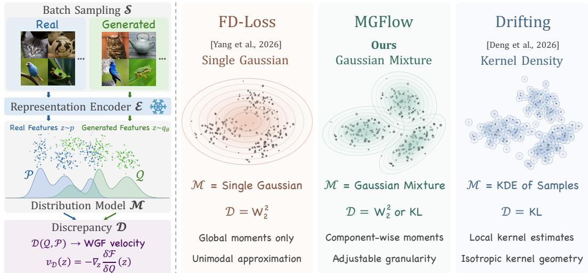
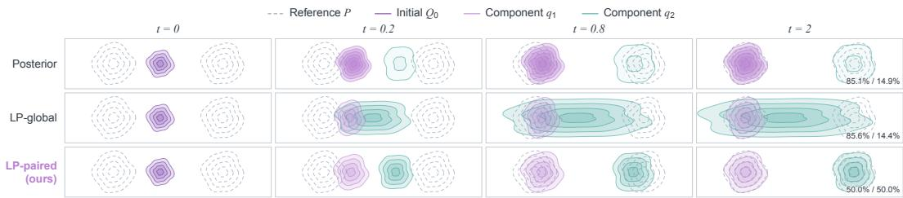
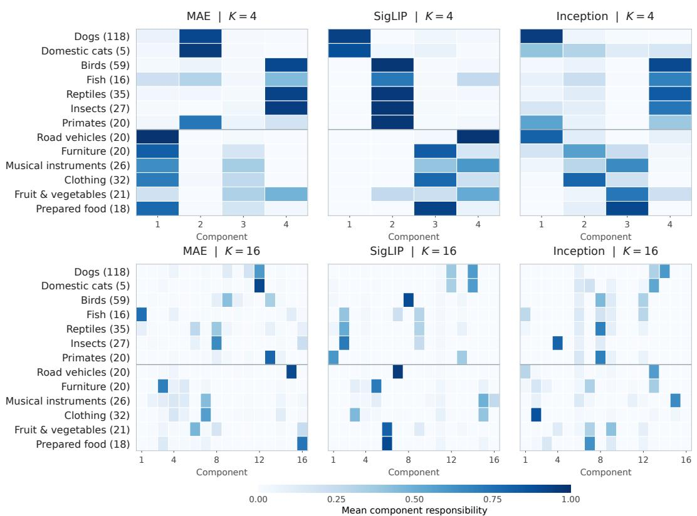
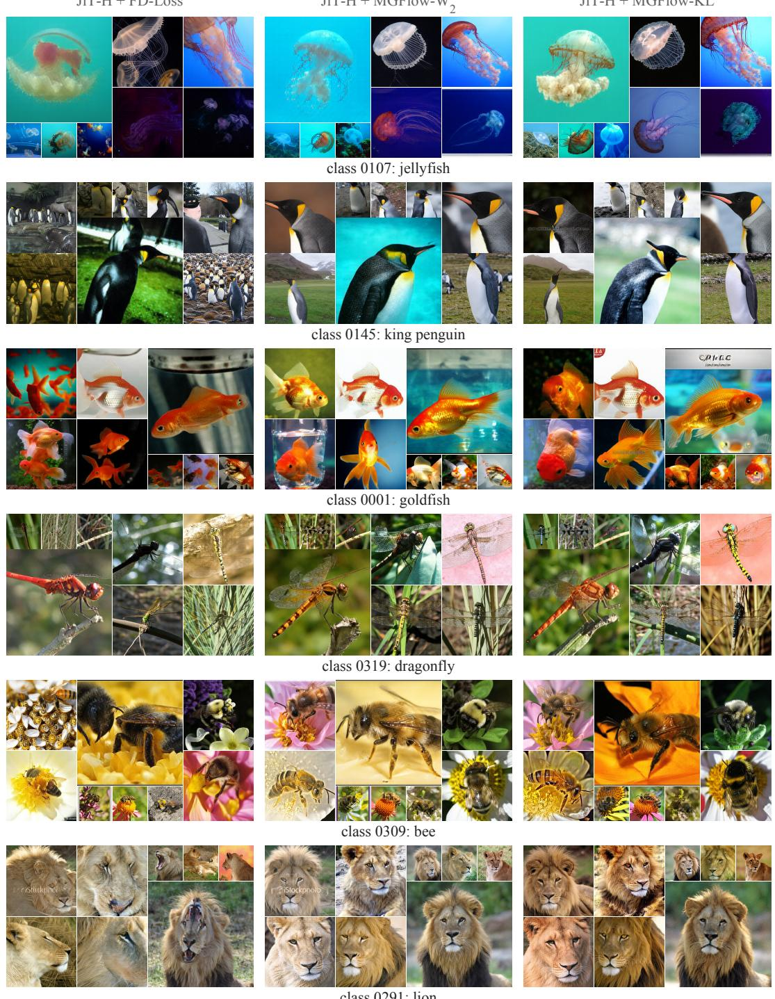
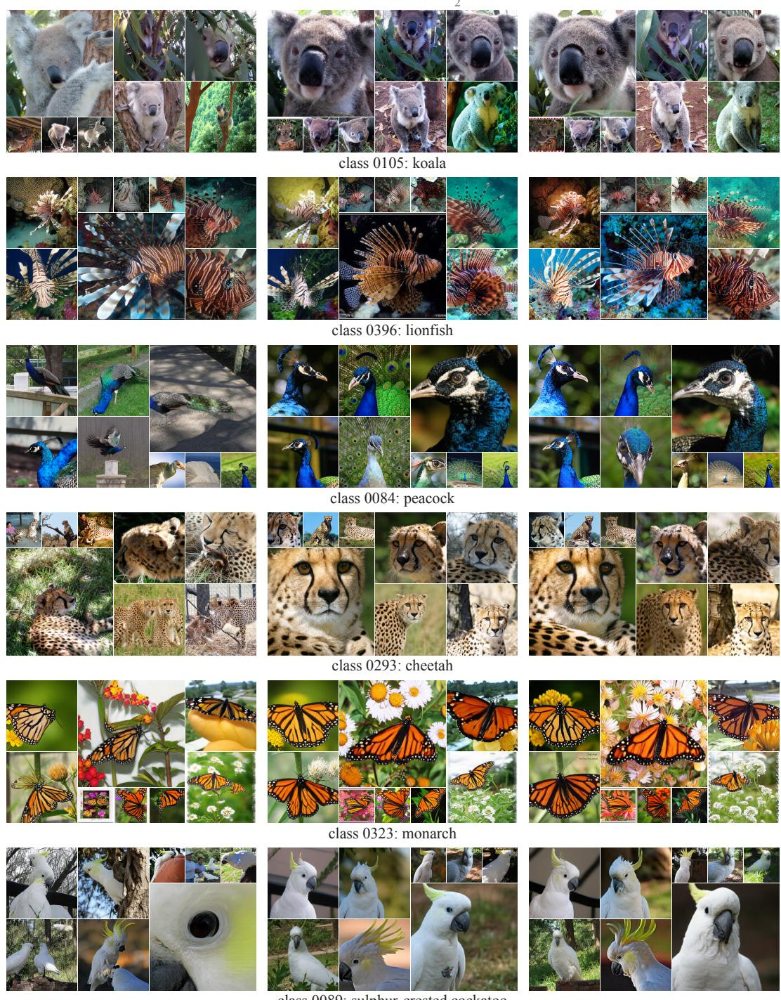
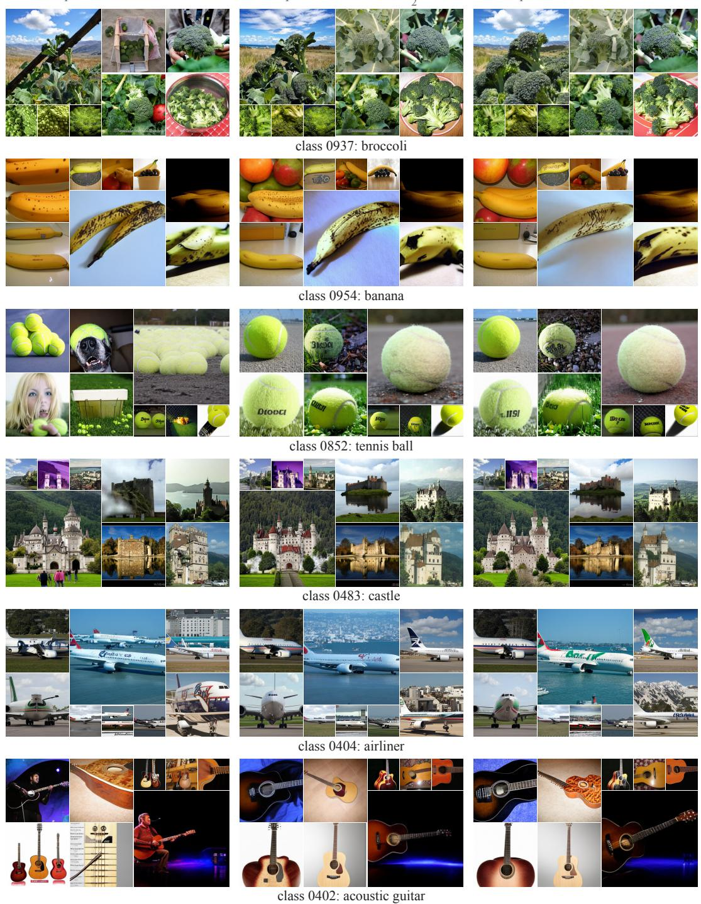
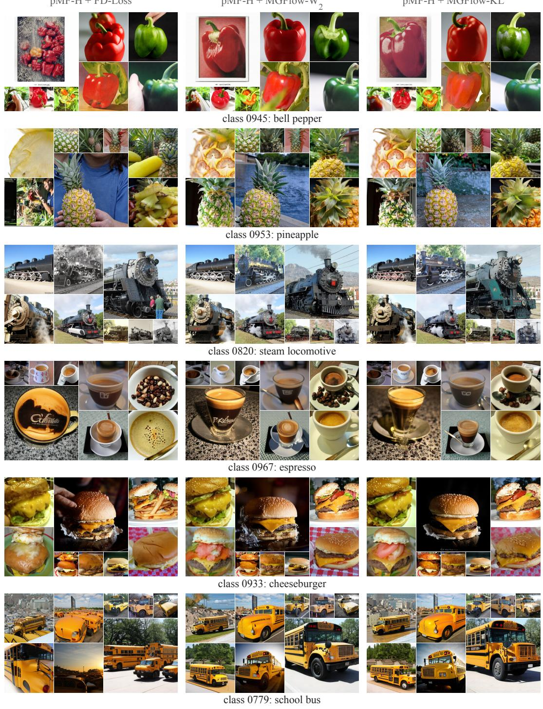
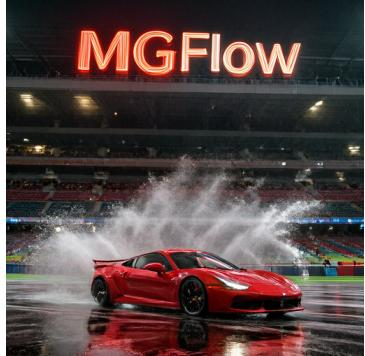

# UNIFYING DISTRIBUTIONAL TRAINING FOR ONE-STEP VISUAL GENERATION

Chi Zhang1∗, Shi Haoyang1,2∗, Yueyi Liu1,3∗, Ruichuan An4, Junkang Zhou5,6, Chang Li7 Xiuyuan Lu2,8, Yichi Zhang1, Bo Wang1, Yuhang Wu1, Sen Cui9, Miao Liu1†

1Tsinghua University 2Fudan University 3Xi’an Jiaotong University 4Peking University 5Zhejiang University 6DeepSeek-AI 7ByteDance Seed 8University of California, Berkeley 9BAAI

  
Figure 1: One-step text-to-image samples. FLUX.2 [klein] 4B post-trained with MGFlow.

## ABSTRACT

Distributional training provides collective supervision for one-step visual generation by matching real and generated features in frozen representation spaces. We introduce a unified theoretical framework that separates distribution modeling from matching discrepancy and connects global objectives to pointwise feature updates through Wasserstein gradient flow. Under this framework, FD-Loss and Gaussian-kernel Drifting are recovered through Gaussian optimal transport and kernel-density-based KL matching, respectively. The framework motivates MGFlow, which models feature distributions with Gaussian mixtures at an adjustable granularity between global moments and sample-based representations. MGFlow supports both optimal transport and score-based matching, and couples mass-constrained sample assignment with paired component updates to address mode collapse that mixture expressivity alone does not resolve. On ImageNet 256×256, MGFlow substantially surpasses the FD-Loss baseline, achieving stateof-the-art results with 1.45 FDr6 on pMF-H and 1.64 on JiT-H. For text-to-image generation, MGFlow post-trains FLUX.2 [klein] 4B into a one-step generator that outperforms the original four-step model on both GenEval and PickScore. Project page: https://shihaoyang0423.github.io/MGFlow-website/.

## 1 INTRODUCTION

One-step visual generation aims to synthesize high-quality images with a single network evaluation, avoiding iterative refinement at inference. Existing approaches include learning consistent trajectory endpoints (Song et al., 2023; Song and Dhariwal, 2024; Kim et al., 2024; Luo et al., 2023; Geng et al., 2025b; Lu and Song, 2025), average velocities (Frans et al., 2025; Geng et al., 2025a; 2026; Lu et al., 2026), or distilling pretrained diffusion models (Salimans and Ho, 2022; Yin et al., 2024b; Sauer et al., 2024; Zhou et al., 2024; Yin et al., 2024a). A prominent recent direction is distributional training in frozen representation spaces (Yang et al., 2026a; Deng et al., 2026; Feng et al., 2026). Rather than assigning a fixed target image to each output, these methods compare collections of real and generated features and obtain collective supervision from their distributional mismatch. Each feature’s gradient depends on shared statistics or interactions with other features, rather than only on an individual reconstruction target. This approach raises two fundamental questions: how should feature distributions be modeled, and how should their mismatch guide learning?

We introduce a unified theoretical frameworkfor distributional training that separates the distribution model from the matching discrepancy. Sampling and frozen encoders determine the feature populations being compared; the distribution model and matching discrepancy determine what distributional information is recorded and how it is aligned. Wasserstein gradient flow (WGF) (Jordan et al., 1998; Peyré and Cuturi, 2019) acts as the theoretical bridge that relates the distributional discrepancy to a pointwise velocity. This establishes a common formulation for global moment losses and local sample interactions, with existing methods recovered as specific model–discrepancy choices.

For example, a Gaussian distribution model with the $W _ { 2 }$ optimal transport (OT) distance recovers FD-Loss (Yang et al., 2026a). Let $p _ { \mathrm { G } }$ and $q _ { \mathrm { G } }$ be Gaussians with the respective means and covariances of the real and generated features. FD-Loss optimizes the Fréchet loss:

$$
\begin{array} { r } { \mathcal { D } _ { \mathrm { F D } } ( q _ { \mathrm { G } } , p _ { \mathrm { G } } ) = W _ { 2 } ^ { 2 } ( q _ { \mathrm { G } } , p _ { \mathrm { G } } ) = \| \mu _ { q } - \mu _ { p } \| _ { 2 } ^ { 2 } + \mathrm { T r } \biggl ( \Sigma _ { q } + \Sigma _ { p } - 2 \left( \Sigma _ { q } ^ { 1 / 2 } \Sigma _ { p } \Sigma _ { q } ^ { 1 / 2 } \right) ^ { 1 / 2 } \biggr ) ~ . } \end{array}\tag{1}
$$

Thus, the Fréchet discrepancy between global feature statistics is a Gaussian transport cost (Dowson and Landau, 1982; Peyré and Cuturi, 2019). At the population level, differentiating through the moments moves features along the associated affine transport field. The Gaussian model determines which statistics are retained, while the OT discrepancy determines how they guide the movement of generated features.

A sample-based density model with Kullback–Leibler (KL) divergence (Kullback and Leibler, 1951) instead recovers Gaussian-kernel Drifting. Drifting (Deng et al., 2026) is specified through kernelweighted attraction and repulsion. For real and generated feature distributions p and $q _ { \theta }$ , a positive kernel $k ,$ , and $r \in \{ p , q _ { \theta } \}$ , its mean-shift and update fields are defined respectively as

$$
a _ { r } ( z ) = \frac { \mathbb { E } _ { y \sim r } [ k ( z , y ) ( y - z ) ] } { \mathbb { E } _ { y \sim r } [ k ( z , y ) ] } , \quad v _ { \mathrm { d r i f t } } ( z ) = a _ { p } ( z ) - a _ { q _ { \theta } } ( z ) .\tag{2}
$$

The generator regresses samples toward detached targets shifted by this field $v _ { \mathrm { d r i f t } }$ . For a Gaussian kernel of bandwidth $h ,$ each mean shift satisfies $a _ { r } ( z ) = h ^ { 2 } \nabla _ { z } \log \bar { r } _ { h } ( z )$ , where $r _ { h }$ is the Gaussian kernel density estimate (KDE) of r (Lai et al., 2026). Their difference is therefore the density-level KL velocity evaluated at those KDEs, up to a bandwidth-dependent scale (Cao et al., 2026).

Built on top of this theoretical framework, we propose Mixture Gradient Flow (MGFlow). To refine the modeling granularity while capturing global correlations, MGFlow uses Gaussian mixtures (GMs), which retain componentwise means and covariances at an adjustable resolution between global moment matching and sample-centered KDE. We develop both OT-based and score-based matching for this representation. Crucially, we note that an expressive modeling does not itself ensure mode coverage or correct transportation (Wenliang and Kanagawa, 2020): naive posterior assignment and transport may suffer from weight mismatch and mode collapse. MGFlow therefore couples mass-constrained sample assignment with paired component matching, using reference weights to control the mass of each generated component and a shared component correspondence to guide features toward the matched reference components.

We evaluate MGFlow under the same sampling and feature encoder settings as FD-Loss. On ImageNet (Russakovsky et al., 2015) 256 × 256, MGFlow achieves a state-of-the-art

  
Figure 2: A unified view of distributional training. Left: sampling S, encoding E, distribution modeling M, and matching discrepancy D define the paradigm. Right: FD-Loss, MGFlow, and Gaussian-kernel Drifting use Gaussian, GM, and KDE representations, respectively. Their matching objectives induce feature-space velocity fields through the Wasserstein gradient flow of their respective distributional objectives.

FDr6 (Yang et al., 2026a) score of 1.45 on pMF-H (Lu et al., 2026) and 1.64 on JiT-H (Li and He, 2026), improving over the FD-Loss baseline with 23% and 38% margins, respectively. For text-toimage generation, MGFlow post-trains FLUX.2 [klein] 4B (Black Forest Labs, 2026) for one-step inference, reaching 0.900 GenEval (Ghosh et al., 2023) and 21.98 PickScore (Kirstain et al., 2023), outperforming all previous methods. Together with comparisons across model–discrepancy combinations, these results show how our novel formulation leads to effective alternatives to existing training prescriptions.

## 2 A UNIFIED VIEW OF DISTRIBUTIONAL TRAINING

A collective feature-space distributional training paradigm. We formulate distributional training by (S, E, M, D) (Figure 2): the sampling scheme S supplies sample collections that provide collective supervision; the frozen encoder E maps samples to representation spaces where they are compared. For real and generated feature distributions p and qθ, the distribution model M constructs parametric approximations P and Q, and the discrepancy D measures the mismatch. This construction provides distributional supervision: each feature update depends on the entire sampled population through the distribution model, rather than only on an individual target.

FD-Loss and Drifting provide collective supervision through shared moments or sample interactions rather than independent reconstruction targets (Yang et al., 2026a; Deng et al., 2026). FD-Loss is trained in the feature space of three independent encoders, while Drifting uses a latent MAE encoder. By default, we adopt FD-Loss’s sampling scheme S and encoders E, and focus on the distribution model and discrepancy (M, D).

Table 1: Distributional training with distribution models and discrepancies. All methods train pMF-B with Inception features for 10 epochs. All methods use the aligned recipe in Appendix E.1.
<table><tr><td colspan="2">Model Method FDr6↓</td></tr><tr><td>OT-based (W2)</td><td></td></tr><tr><td>Gaussian</td><td>FD-Loss (Yang et al., 2026a) 13.05</td></tr><tr><td>GM K = 4</td><td>MGFlow-W2 11.33</td></tr><tr><td>Sample-based W-Flow (Han et al., 2026)</td><td>12.58</td></tr><tr><td colspan="2">Score-based (KL)</td></tr><tr><td>Gaussian Gaussian KL</td><td>12.73</td></tr><tr><td>GM K = 16 ]</td><td>MGFlow-KL 11.32</td></tr><tr><td>Sample-based</td><td>Gaussian-kernel Drifting 12.29 (Deng et al., 2026)</td></tr></table>

A global discrepancy induces a pointwise descent field. To compare loss-based and field-based training prescriptions, we need to connect a scalar distributional mismatch to an update direction for each generated feature. The Wasserstein gradient flow (Jordan et al., 1998; Peyré and Cuturi,

2019) provides this connection by describing how feature locations should move to decrease the chosen discrepancy. Fix P and let ${ \mathcal { F } } ( Q ) = { \bar { \mathcal { D } } } ( Q , P )$ , where $Q _ { t }$ is the evolving generated distribution through training time t. Let $\delta \mathcal { F } / \delta Q$ denote the first variation of the objective, describing its sensitivity to infinitesimal density changes. The corresponding 2-Wasserstein gradient flow induces a descent velocity field $v _ { \mathcal { D } , t }$ . Under suitable regularity, the velocity and energy dissipation satisfy:

$$
v _ { \mathcal { D } , t } ( z ) = - \nabla _ { z } \left. \frac { \delta \mathcal { F } } { \delta Q } ( z ) \right| _ { Q = Q _ { t } } , \quad \frac { \mathrm { d } z _ { t } } { \mathrm { d } t } = v _ { \mathcal { D } , t } ( z _ { t } ) , \quad \frac { \mathrm { d } } { \mathrm { d } t } \mathcal { F } ( Q _ { t } ) = - \mathbb { E } _ { z \sim Q _ { t } } \left[ \| v _ { \mathcal { D } , t } ( z ) \| _ { 2 } ^ { 2 } \right] \leq 0 .\tag{3}
$$

Thus moving points along the induced field decreases global discrepancy. Details are given in Appendix B.5.

FD-Loss and Drifting are special cases of distributional training. We now instantiate this construction with specific distribution models and discrepancies to recover the feature-update fields of FD-Loss and Gaussian-kernel Drifting. For M, let $p _ { \mathrm { G } } = \mathcal { N } ( \mu _ { p } , \Sigma _ { p } )$ and $q _ { \mathrm { G } } = \dot { \mathcal { N } } ( \mu _ { q } , \Sigma _ { q } )$ be moment-matched Gaussian models. Alternatively, let $p _ { h } , \ q _ { h }$ be Gaussian kernel density estimates (KDEs) of $p , q _ { \theta }$ using sample-centered kernels with covariance $h ^ { 2 } I$ (Parzen, 1962). For $\mathcal { D }$ we consider an optimal transport (OT) approach using the 2-Wasserstein distance $W _ { 2 }$ and a scorebased approach with the Kullback-Leibler divergence $D _ { \mathrm { K L } }$ ; these choices recover the FD-Loss and Gaussian-kernel Drifting fields (Lai et al., 2026; Cao et al., 2026):

$$
\begin{array} { r l } & { \frac { 1 } { 2 } W _ { 2 } ^ { 2 } ( q _ { \mathrm { G } } , p _ { \mathrm { G } } ) \xrightarrow { \mathrm { W G F } } { T } _ { q _ { \mathrm { G } }  p _ { \mathrm { G } } } ( z ) - z = v _ { \mathrm { F D } } ( z ) , } \\ & { \phantom { \frac { 1 } { 2 } } D _ { \mathrm { K L } } ( q _ { h } \| p _ { h } ) \xrightarrow { \mathrm { W G F } } { \nabla } _ { z } \log p _ { h } ( z ) - \nabla _ { z } \log q _ { h } ( z ) = h ^ { - 2 } v _ { \mathrm { d r i f t } } ( z ) , } \end{array}\tag{4}
$$

where $T _ { q _ { \mathrm { G } }  p _ { \mathrm { G } } }$ is the closed-form optimal transport map between Gaussians (Peyré and Cuturi, 2019). The Fréchet distance equals $W _ { 2 } ^ { 2 }$ , and differentiating it through feature moments moves samples along the first descent field. Gaussian-kernel Drifting instead evaluates the KL velocity on the smoothed densities. The two methods occupy global-moment and sample-local ends of the modeling spectrum, with different discrepancies. Appendices B.1–B.2 give proofs and derivations.

Other methods could also fit within this framework. For instance, calculating an OT-based discrepancy on empirical measures gives W-Flow (Han et al., 2026), which constructs optimal transport between batches with Sinkhorn (Cuturi, 2013; Feydy et al., 2019) approximation. Moreover, the framework can inspire new distributional training algorithms. Keeping the single Gaussian surrogate but replacing ${ \hat { W } } _ { 2 }$ with KL divergence gives the following closed-form velocity field:

$$
v _ { \mathrm { K L } } ( z ) = \Sigma _ { p } ^ { - 1 } ( \mu _ { p } - z ) - \Sigma _ { q } ^ { - 1 } ( \mu _ { q } - z )\tag{5}
$$

which we denote as Gaussian KL. We conduct experiments with all methods mentioned above under the same settings, using the same sampling scheme as FD-Loss and a frozen Inception (Szegedy et al., 2016) encoder. Results are in Table 1. All alternatives outperform FD-Loss on $\mathrm { F D r ^ { 6 } }$ , even without direct optimization ofthe Fréchet distance, demonstrating the versatility of our formulation.

## 3 MGFLOW

As shown in Section 2, FD-Loss and Gaussian-kernel Drifting take two extremes on the distribution model spectrum: A single Gaussian models only global first and second moments, whereas Gaussian KDE uses sample-centered components and overlooks global covariance structures. In order to improve modeling granularity while capturing global correlations in feature spaces, we introduce Mixture Gradient Flow (MGFlow), a distributional training algorithm that adopts an intermediate distribution model M based on a Gaussian mixture (GM). We first introduce Gaussian-mixture representations and direct OT- and KL-based matching constructions. We then show why representing multiple modes alone is insufficient and develop a coupled allocation-and-update procedure that pre serves correspondence with the reference components while still bounding the global discrepancies.

## 3.1 FROM A SINGLE GAUSSIAN TO GAUSSIAN MIXTURES

For the distribution models $P , Q ,$ consider using Gaussian Mixtures with K Gaussian components:

$$
P ( z ) = \sum _ { k = 1 } ^ { K } \pi _ { k } p _ { k } ( z ) , \quad Q ( z ) = \sum _ { k = 1 } ^ { K } \omega _ { k } q _ { k } ( z ) ,\tag{6}
$$

where $p _ { k } = { \mathcal N } ( \mu _ { p , k } , \Sigma _ { p , k } )$ and $q _ { k } = \mathcal { N } ( \mu _ { q , k } , \Sigma _ { q , k } )$ . P is fit offline by the EM algorithm (Dempster et al., 1977) and remains fixed, while $Q$ summarizes the changing generated feature distribution, which requires updating through training. The case $K = 1$ recovers a single Gaussian; samplecentered components with a common isotropic covariance $( K = B )$ recover Gaussian KDE at the representation level. Table 1 summarizes the model–discrepancy combinations.

Both discrepancies, $W _ { 2 }$ and $\mathrm { K L , }$ extend to this representation. Though Wasserstein Distances between GMs are intractable, restricting transport to Gaussian component pairs gives a tractable upper bound, namely the Mixed Wasserstein distance (Delon and Desolneux, 2020):

$$
W _ { 2 } ^ { 2 } ( Q , P ) \leq M W _ { 2 } ^ { 2 } ( Q , P ) : = \operatorname * { m i n } _ { \Gamma \in U ( \omega , \pi ) } \sum _ { i , j } \Gamma _ { i j } W _ { 2 } ^ { 2 } ( q _ { i } , p _ { j } ) .\tag{7}
$$

Here $U ( \omega , \pi )$ is the set of component couplings with marginals $\omega$ and $\pi ,$ and each pair cost is the Gaussian FD. For KL, the global velocity field is the difference of the score functions:

$$
v _ { \mathrm { g l o b a l } } ( z ) = \nabla _ { z } \log P ( z ) - \nabla _ { z } \log Q ( z ) = \sum _ { k } \gamma _ { P , k } ( z ) s _ { P , k } ( z ) - \sum _ { k } \gamma _ { Q , k } ( z ) s _ { q , k } ( z ) ,\tag{8}
$$

where $s _ { r , k } ( z ) = \nabla _ { z }$ z log $r _ { k } ( z ) = \Sigma _ { r , k } ^ { - 1 } ( \mu _ { r , k } - z )$ for $r \in \{ p , q \}$ , $\gamma _ { P , k } = { \pi _ { k } p _ { k } } / { P } ,$ and $\gamma _ { Q , k } ~ =$ $\omega _ { k } q _ { k } / Q$ . The score of each mixture is a posterior-responsibility-weighted sum of its component scores.

However, representing multiple modes does not ensure correct mode proportions. The global KL field can provide weak inter-mode updates when modes are well separated. Consider $\begin{array} { r } { P = \sum _ { k } \pi _ { k } r _ { k } } \end{array}$ and $\begin{array} { r } { Q = \sum _ { k } \omega _ { k } r _ { k } } \end{array}$ with the same separated components $r _ { k }$ but different positive weights. Correcting this weight mismatch requires movement between modes, not merely local refinement within each mode. However, in a region dominated by component $k ,$ , the density ratio is approximately the constant $\omega _ { k } / \pi _ { k } ;$ the score difference can be small even when the component weights differ substantially:

$$
\log \frac { Q ( z ) } { P ( z ) } \approx \log \frac { \omega _ { k } } { \pi _ { k } } , \quad v _ { \mathrm { g l o b a l } } ( z ) = - \nabla _ { z } \log \frac { Q ( z ) } { P ( z ) } \approx 0\tag{9}
$$

Thus, a mismatch can remain visible in the density ratio while producing only a weak feature-update signal in the high-density regions. This is analogous to the score-blindness phenomenon studied byWenliang and Kanagawa (2020), and does not contradict the descent interpretation in Section 2: descent does not guarantee effective transport between modes when the score field is weak. In the top-right state of Figure $^ { 3 , }$ the two Q-components $q _ { 1 }$ and $q _ { 2 }$ carry 85.1% and 14.9% of the mass, respectively; the global velocity field alone provides too little inter-mode transport to correct this imbalance. The same issue can arise for Gaussian-KDE fields when smoothing leaves modes well separated. For score-based matching, mixture expressivity does not by itself provide an effective mechanismfor correcting mode proportions. We therefore connect mass allocation explicitly to the feature updates.

## 3.2 MASS-CONSTRAINED ALLOCATION AND PAIRED TRANSPORT

LP-based component allocation. The reference mixture $P$ is fitted offline and kept fixed, whereas $Q$ must track the changing generator throughout training. For a single Gaussian, each generated batch contributes to one set of global moments. A GM instead requires component-specific moments, so updating $Q$ requires allocating new features to components. A natural choice is posterior soft assignment: each generated sample $z _ { n }$ contributes to com-

Table 2: Ablation on component assignment and transportation. JiT-B trains in Inception feature space for 10 epochs with $K = 4 .$ . Timing uses 8 H200 GPUs.
<table><tr><td rowspan="2"></td><td colspan="2">KL</td><td colspan="2"> $W _ { 2 }$ </td></tr><tr><td> $\mathrm { F D r ^ { 6 } \downarrow }$ </td><td>s/step</td><td> $\mathrm { F D r ^ { 6 } \downarrow }$ </td><td>s/step</td></tr><tr><td>Posterior</td><td>173.56</td><td>0.197</td><td>26.78</td><td>0.699</td></tr><tr><td>LP-global</td><td>146.92</td><td>0.264</td><td>23.73</td><td>0.825</td></tr><tr><td>LP-paired</td><td>23.27</td><td>0.263</td><td>23.42</td><td>0.392</td></tr></table>

ponent k with weight $\gamma _ { Q , k } ( z _ { n } ) = \omega _ { k } q _ { k } ( z _ { n } ) / Q ( z _ { n } )$ , its posterior responsibility under the current $Q .$ However, due to dynamical reasons, posterior soft assignment cannot transport the correct amount of mass to each component, as shown in Figure 3.

  
Figure 3: Toy experiment with component assignment and transport. Score matching with $K = 2$ moves 2048 particles. Dashed contours show the reference P. Shading and contour counts indicate weights. LP fixes component weights, but global velocity collapses modes. Only LP-paired achieves correct transport.

We instead assign generated features to the fixed reference components $p _ { k }$ while constraining the mass allocated to component $k$ to $B \pi _ { k }$ for a batch of B features. To achieve this, we solve the capacity-constrained linear program (LP) for batch-to-component allocation:

$$
R ^ { * } \in \underset { R \geq 0 } { \operatorname { a r g m i n } } \sum _ { n , k } R _ { n k } [ - \log ( \pi _ { k } p _ { k } ( z _ { n } ) ) ] , \quad \mathrm { s u b j e c t } \mathrm { t o } \quad R \mathbf { 1 } _ { K } = \mathbf { 1 } _ { B } , \quad R ^ { \mathsf { T } } \mathbf { 1 } _ { B } = B \pi .\tag{10}
$$

Here $R \in \mathbb { R } ^ { B \times K }$ , where $R _ { n k }$ denotes the assignment from sample n to component $k ,$ which may be fractional. The likelihood cost favors compatible reference components, while the capacity constraints enforce their prescribed masses. Using detached $R ^ { * }$ , we compute the weighted mean and raw second moment for each generated component, maintain these statistics across training batches with EMA as in FD-Loss (Yang et al., 2026a), and recover the component covariances. We set $\omega = \pi$

Paired OT matching. With matched weights, $\Gamma = \mathrm { d i a g } ( \pi )$ is feasible in Eq. (7). Empirically, in a pMF-H training run with this objective, the optimal component transport matrix was diagonal at every recorded plan refresh (Appendix B.4). Motivated by this observation, we fix this correspondence and calculate only the diagonal terms in the Mixed Wasserstein distance, optimizing:

$$
\mathcal { L } _ { \mathrm { p a i r } - W _ { 2 } } = \sum _ { k = 1 } ^ { K } \pi _ { k } W _ { 2 } ^ { 2 } ( q _ { k } , p _ { k } ) \geq M W _ { 2 } ^ { 2 } ( Q , P ) \geq W _ { 2 } ^ { 2 } ( Q , P ) .\tag{11}
$$

This provides an upper bound for $W _ { 2 } ^ { 2 }$ . A sufficient condition for diagonal optimality is given in Appendix B.4. Fixed pairing reduces the number of Gaussian pair costs from $K ^ { 2 }$ to K. We differentiate this objective through the current batch’s contribution to the EMA statistics of the generated components, keeping historical statistics and the LP assignments $R ^ { * }$ detached.

Paired score matching. For the KL discrepancy, pairing is more than a matter of efficiency, as constraining the component statistics is not sufficient to constrain the feature updates. The global field in Eq. (8) still weights reference and generated scores by separate mixture responsibilities, rather than the LP assignments. As demonstrated in the second row of Figure 3, the global velocity cannot distinguish the target component for each sample, resulting in mode collapse. To preserve the assignment in the update direction, we instead match corresponding components using

$$
{ \mathcal { F } } _ { \mathrm { p a i r } } = \sum _ { k } \pi _ { k } D _ { \mathrm { K L } } ( q _ { k } \| p _ { k } ) \geq D _ { \mathrm { K L } } ( Q \| P )\tag{12}
$$

which also upper-bounds the marginal KL. Appendix B.4 gives the proof and further analysis. Calculating closed-form KL between Gaussians requires heavy computation, so instead we use the WGF-induced velocity. Reusing $R ^ { * }$ for these fields gives the regularized update

$$
v _ { \mathrm { p a i r } , n } = \sum _ { k = 1 } ^ { K } R _ { n k } ^ { * } [ s _ { p , k } ^ { \lambda } ( z _ { n } ) - s _ { q , k } ^ { \lambda } ( z _ { n } ) ] , \quad s _ { r , k } ^ { \lambda } ( z ) = ( \Sigma _ { r , k } + \lambda I ) ^ { - 1 } ( \mu _ { r , k } - z ) .\tag{13}
$$

Here $\lambda > 0$ stabilizes covariance inversion. The same assignment now weights both scores, so the update retains the correspondence used to estimate $q _ { k }$ . We evaluate the field using detached,

pre-update statistics and train the generator by detached-target regression:

$$
\mathcal { L } _ { \mathrm { p a i r - K L } } = \frac { 1 } { 2 B } \sum _ { n = 1 } ^ { B } \left. z _ { n } - \mathrm { s g } [ z _ { n } + \eta v _ { \mathrm { p a i r } , n } ] \right. _ { 2 } ^ { 2 } , \qquad \eta > 0 .\tag{14}
$$

The entire target is detached, and the EMA state is committed after the generator step. The third row in Figure 3 shows that this formulation correctly transports samples from the initial distribution to the reference distribution. An ablation study in Table 2 proves that LP-based component allocation uniformly achieves better results than posterior assignments. Paired transport is crucial especially when training multi-step JiT models with score-based discrepancies. This is possibly because the large gap between the initial one-step generated distribution and the target distribution induces abnormal component allocation. Detailed training and evaluation settings are given in Appendix H.

## 3.3 TRAINING MGFLOW.

As discussed above, we train two variants of MGFlow: MGFlow- $. W _ { 2 }$ with the paired OT-based objective in Equation 11, and MGFlow-KL with paired score-based updates in Equation 14. For multiple encoders, we use fixed, discrepancy-specific normalizers for the encoder losses:

$$
\mathcal { L } _ { \mathrm { M G F l o w } \cdot W _ { 2 } } = \sum _ { e } \frac { \mathcal { L } _ { \mathrm { p a i r } \cdot W _ { 2 } } ^ { e } } { W _ { 2 } ^ { 2 } ( R _ { e } , V _ { e } ) } , \quad \mathcal { L } _ { \mathrm { M G F l o w } \cdot \mathrm { K L } } = \sum _ { e } \frac { \mathcal { L } _ { \mathrm { p a i r } \cdot \mathrm { K L } } ^ { e } } { D _ { \mathrm { K L } } ( R _ { e } \| V _ { e } ) } .\tag{15}
$$

Here $\mathcal { L } _ { \mathrm { p a i r } - W _ { 2 } } ^ { e }$ and $\mathcal { L } _ { \mathrm { p a i r - K L } } ^ { e }$ sum the respective branch losses for encoder $e ,$ while $R _ { e }$ and $V _ { e }$ are single-Gaussian fits to its real training and validation features. For KL calibration, the same score ridge is added to both covariances. Unlike FD-Loss’s real–generated $( R , G )$ normalization, these fixed $( R , V )$ scales avoid downweighting harder-to-match feature spaces merely because their current discrepancies are large (Appendix C.2). For text-to-image generation, we concatenate image features with frozen SigLIP2 text features and match their joint distributions (Feng et al., 2026) (Appendices B.6 and C.3.2).

## 4 EXPERIMENTS

## 4.1 INCREASING GAUSSIAN COMPONENTS

We first examine how distributional granularity affects ImageNet post-training. We compare individual Gaussian mixture models with $\mathbf { \bar { \xi } } K \in \{ 1 , 4 , 1 6 \}$ components and their combinations. Beyond selecting a single GM, we consider hierarchical resolution: for a set of component counts $\kappa ,$ , we sum the corresponding training losses with equal weights,

$$
\mathcal { L } _ { K } = \sum _ { K \in \mathcal { K } } \mathcal { L } _ { K } ,\tag{16}
$$

Table 3: Ablation on component counts. Using pMF-B. All models train in Inception feature space for 10 epochs. $\mathrm { F D r ^ { 5 } }$ evaluates five held-out encoders.
<table><tr><td>Components</td><td> $\mathrm { F D r ^ { 6 } \downarrow }$ </td><td> $\mathrm { F D r ^ { 5 } \downarrow }$ </td><td>FID↓</td></tr><tr><td>K = 1</td><td>12.73</td><td>15.04</td><td>1.95</td></tr><tr><td>K = 4</td><td>12.28</td><td>14.54</td><td>1.65</td></tr><tr><td>K = 16</td><td>11.32</td><td>13.41</td><td>1.46</td></tr><tr><td>K = 1 + 4</td><td>11.51</td><td>13.59</td><td>1.89</td></tr><tr><td>K = 1 + 4 + 16</td><td>11.05</td><td>13.08</td><td>1.51</td></tr></table>

where $\mathcal { L } _ { K }$ denotes the MGFlow loss using $K \cdot$

component distribution models. Thus, $\overset { \cdot } { K } = 1 + 4 + 1 6$ combines global moment matching with progressively finer componentwise matching, forming a coarse-to-fine hierarchy of objectives.

We train pMF-B in Inception feature space for 10 epochs with different component counts. Among the same $2 5 6 \times 2 5 6$ resolution configurations, increasing K from 1 to 16 reduces $\mathrm { F D r ^ { 6 } }$ from 12.73 to 11.32 and FID from 1.95 to 1.46, demonstrating that distributional models with finer granularity enhance generation. Hierarchical resolution further improves generalization, lowering $\mathrm { F D r ^ { 6 } }$ . These results suggest that coarse and fine distributional constraints provide complementary supervision, motivating multi-resolution matching in the subsequent experiments. By default we use $\mathbf { \bar { \boldsymbol { K } } } = 1 +$ 4 + 16 for MGFlow-KL and $K = 1 \bar { + } 4$ for MGFlow- $. W _ { 2 }$ . Larger mixtures are limited by the cost of Gaussian Wasserstein matching for MGFlow- $. W _ { 2 }$ and the samples available to accurately estimate each component’s mean and covariance for MGFlow-KL (see Appendix I.2).

Table 4: Post-training JiT and pMF on ImageNet 256 × 256. All models train in the SIM encoder spaces for 100 epochs. “Model” denotes feature-distribution modeling. Baseline results are from FD-Loss (Yang et al., 2026a), AdvFD (Gao et al., 2026), and AMFD (Liu et al., 2026a). † denotes the full-CFG NFE upper bound for interval CFG; dashes denote unavailable results. Best and second-best results per backbone are bold and underlined, respectively. More baselines are in Table 10.
<table><tr><td>Method</td><td>Model</td><td>Discrepancy</td><td>NFE</td><td>#Params</td><td>FDr6↓</td><td>FDr³↓</td><td>FID↓</td><td>IS↑</td></tr><tr><td colspan="9">Pixel-space models, multi-step backbones</td></tr><tr><td>JiT-B</td><td></td><td></td><td>50×2×2†</td><td>131M</td><td>15.65</td><td>15.06</td><td>3.71</td><td>269.0</td></tr><tr><td>+ FD-Loss</td><td>Gaussian</td><td> $W _ { 2 }$ </td><td></td><td>131M</td><td>5.53</td><td>8.45</td><td>1.00</td><td>344.6</td></tr><tr><td>+ AdvFD</td><td>Gaussian</td><td> $W _ { 2 }$ </td><td>1</td><td>131M</td><td>3.92</td><td>6.03</td><td>0.79</td><td></td></tr><tr><td>+ AMFD-C</td><td>Gaussian</td><td>Amortized  $W _ { 2 }$ </td><td>1</td><td>131M</td><td>4.75</td><td>6.71</td><td>0.95</td><td>319.4</td></tr><tr><td>+ AMFD-U</td><td>Gaussian</td><td>Amortized  $W _ { 2 }$ </td><td>1</td><td>131M</td><td>3.91</td><td>6.13</td><td>0.95</td><td>325.2</td></tr><tr><td>+ MGFlow-W2</td><td>GM</td><td> $W _ { 2 }$ </td><td>1</td><td>131M</td><td>4.43</td><td>7.36</td><td>1.45</td><td>313.9</td></tr><tr><td>+ MGFlow-KL</td><td>GM</td><td>KL</td><td>1</td><td>131M 459M</td><td>3.70 10.73</td><td>5.70</td><td>1.28 2.59</td><td>308.5</td></tr><tr><td colspan="9">JiT-L</td></tr><tr><td>+ FD-Loss</td><td>Gaussian</td><td>一  $W _ { 2 }$ </td><td>50×2×2†</td><td>459M</td><td>3.24</td><td>10.27 5.46</td><td>0.77</td><td>288.5 317.3</td></tr><tr><td>+ AdvFD</td><td>Gaussian</td><td> $W _ { 2 }$ </td><td>1</td><td>459M</td><td>2.01</td><td>3.20</td><td>0.73</td><td></td></tr><tr><td>+ AMFD-C</td><td>Gaussian</td><td>Amortized  $W _ { 2 }$ </td><td>1</td><td>459M</td><td>2.67</td><td>3.86</td><td>0.87</td><td>325.1</td></tr><tr><td>+ AMFD-U</td><td>Gaussian</td><td>Amortized  $W _ { 2 }$ </td><td>1</td><td>459M</td><td>2.02</td><td>3.12</td><td>0.85</td><td>319.8</td></tr><tr><td>+ MGFlow-W2</td><td>GM</td><td> $W _ { 2 }$ </td><td>1</td><td>459M</td><td>2.68</td><td>4.54</td><td>1.07</td><td>314.9</td></tr><tr><td>+ MGFlow-KL</td><td>GM</td><td> $\mathrm { K L }$ </td><td>1</td><td>459M</td><td>1.92</td><td>2.96</td><td>1.00</td><td>304.7</td></tr><tr><td>JiT-H</td><td>1</td><td>1</td><td>50×2×2†</td><td>953M</td><td>7.66</td><td>9.07</td><td>1.97</td><td>296.0</td></tr><tr><td>+ FD-Loss</td><td>Gaussian</td><td> $W _ { 2 }$ </td><td></td><td>953M</td><td>2.65</td><td>4.44</td><td>0.75</td><td>313.0</td></tr><tr><td>+ AdvFD</td><td>Gaussian</td><td> $W _ { 2 }$ </td><td>1</td><td>953M</td><td>1.80</td><td>2.93</td><td>0.72</td><td></td></tr><tr><td>+ AMFD-C</td><td>Gaussian</td><td>Amortized  $W _ { 2 }$ </td><td>1</td><td>953M</td><td>2.15</td><td>3.10</td><td>0.85</td><td>328.1</td></tr><tr><td>+ AMFD-U</td><td>Gaussian</td><td>Amortized  $W _ { 2 }$ </td><td>1</td><td>953M</td><td>1.79</td><td>2.78</td><td>0.83</td><td>312.2</td></tr><tr><td>+ MGFlow-W2</td><td>GM</td><td> $W _ { 2 }$ </td><td>1</td><td>953M</td><td>2.55</td><td>4.42</td><td>0.99</td><td>307.8</td></tr><tr><td>+MGFlow-KL</td><td>GM</td><td> $\mathrm { K L }$ </td><td>1</td><td>953M</td><td>1.64</td><td>2.57</td><td>0.94</td><td>301.9</td></tr><tr><td colspan="9">Pixel-space models, one-step</td></tr><tr><td>pMF-B + FD-Loss</td><td></td><td></td><td></td><td>118M</td><td>13.70</td><td>11.82</td><td>3.31</td><td>254.6</td></tr><tr><td>+ AdvFD</td><td>Gaussian Gaussian</td><td> $W _ { 2 }$ </td><td></td><td>118M</td><td>3.50</td><td>4.49</td><td>0.85</td><td>331.4</td></tr><tr><td></td><td></td><td> $W _ { 2 }$ </td><td>1</td><td>118M</td><td>3.32</td><td>4.22</td><td>0.81</td><td></td></tr><tr><td>+ AMFD-C</td><td>Gaussian</td><td>Amortized  $W _ { 2 }$ </td><td>1</td><td>118M</td><td>3.94</td><td>4.66</td><td>0.95</td><td>315.9</td></tr><tr><td>+ AMFD-U</td><td>Gaussian</td><td>Amortized  $W _ { 2 }$ </td><td>1</td><td>118M</td><td>3.43</td><td>4.20</td><td>0.92</td><td>310.1</td></tr><tr><td>+ MGFlow.  $. W _ { 2 }$ </td><td>GM</td><td> $W _ { 2 }$ </td><td>1</td><td>118M</td><td>3.03</td><td>4.02</td><td>1.65</td><td>332.1</td></tr><tr><td>+ MGFlow-KL</td><td>GM</td><td> $\mathrm { K L }$ </td><td>1</td><td>118M</td><td>3.09</td><td>3.76</td><td>1.56</td><td>323.0</td></tr><tr><td>pMF-L</td><td></td><td></td><td>1</td><td>410M</td><td>9.09</td><td>7.62</td><td>2.72</td><td>261.7</td></tr><tr><td>+ FD-Loss</td><td>Gaussian</td><td> $W _ { 2 }$ </td><td></td><td>410M</td><td>2.09</td><td>2.72</td><td>0.78</td><td>309.2</td></tr><tr><td>+ AdvFD + AMFD-C</td><td>Gaussian</td><td> $W _ { 2 }$ </td><td>1</td><td>410M</td><td>1.89</td><td>2.57</td><td>0.77</td><td></td></tr><tr><td></td><td>Gaussian</td><td>Amortized  $W _ { 2 }$ </td><td>1</td><td>410M</td><td>2.25</td><td>2.75</td><td>0.88</td><td>321.8</td></tr><tr><td>+ AMFD-U</td><td>Gaussian</td><td>Amortized  $W _ { 2 }$ </td><td>1</td><td>410M</td><td>2.01</td><td>2.57</td><td>0.86</td><td>306.7</td></tr><tr><td>+ MGFlow-W2</td><td>GM</td><td> $W _ { 2 }$ </td><td>1</td><td>410M</td><td>1.80</td><td>2.47</td><td>1.20</td><td>322.4</td></tr><tr><td>+ MGFlow-KL</td><td>GM</td><td> $\mathrm { K L }$ </td><td>1</td><td>410M</td><td>1.74</td><td>2.24</td><td>1.16</td><td>314.8</td></tr><tr><td>pMF-H</td><td>1</td><td>一</td><td>1</td><td>935M</td><td>6.87</td><td>6.09</td><td>2.29</td><td>267.2</td></tr><tr><td>+ FD-Loss</td><td>Gaussian</td><td> $W _ { 2 }$ </td><td></td><td>935M</td><td>1.89</td><td>2.69</td><td>0.77</td><td>310.1</td></tr><tr><td>+ AdvFD</td><td>Gaussian</td><td> $W _ { 2 }$ </td><td>1</td><td>935M</td><td>1.74</td><td>2.50</td><td>0.74</td><td></td></tr><tr><td>+ AMFD-C</td><td></td><td>Gaussian Amortized  $W _ { 2 }$ </td><td>1</td><td>935M</td><td>1.93</td><td>2.43</td><td>0.86</td><td>323.0</td></tr><tr><td>+ AMFD-U</td><td></td><td>Gaussian Amortized  $W _ { 2 }$ </td><td>1</td><td>935M</td><td>1.75</td><td>2.30</td><td>0.85</td><td>307.3</td></tr><tr><td>+ MGFlow-W2</td><td>GM</td><td> $W _ { 2 }$ </td><td></td><td>935M</td><td>1.50</td><td>2.05</td><td>1.09</td><td>316.1</td></tr><tr><td>+MGFlow-KL</td><td>GM</td><td> $\mathrm { K L }$ </td><td>1</td><td>935M</td><td>1.45</td><td>1.88</td><td>1.07</td><td>311.0</td></tr></table>

## 4.2 CLASS-CONDITIONED IMAGENET GENERATION

We post-train the B, L, and H variants of JiT (Li and He, 2026) and pMF (Lu et al., 2026) from their official pretrained weights on ImageNet (Russakovsky et al., 2015) 256 × 256. All use frozen SigLIP (Tschannen et al., 2025), Inception (Szegedy et al., 2016), and MAE (He et al., 2022) encoders (SIM) and a global batch of 1,024, and are trained for 100 epochs. We evaluate post-trained models with 50,000 one-step generated samples. FD-Loss (Yang et al., 2026a) motivates FDr6 as a more robust metric for ImageNet generation than FID alone, reducing the blind spots of a single representation. We report $\mathrm { F D r ^ { 6 } }$ across six representation spaces and $\mathrm { F D r ^ { 3 } }$ across the three encoders not used for training, together with FID (Heusel et al., 2017) and Inception Score (IS) (Salimans et al., 2016). Optimization, sampling, and reference-fitting details are given in Appendices C and F; metric definitions are in Appendix E.2.

Table 4 compares MGFlow with FD-Loss (Yang et al., 2026a), AdvFD (Gao et al., 2026), and AMFD (Liu et al., 2026a). Both MGFlow-W and MGFlow-KL surpass the FD-Loss baseline on every model size. MGFlow-KL achieves state-of-the-art 1.45 $\mathrm { F D r ^ { 6 } }$ on pMF-H and 1.64 on JiT-H, improving over the FD-Loss baseline with 23% and 38% margins, respectively. In particular, its gains on the three held-out encoders indicate better generalization beyond the representations used for training, demonstrating that MGFlow can truly match distributions in feature spaces rather than just overfit to the first and second moments. Additionally, MGFlow-KL uses KL-based matching without any FD loss, yet outperforms all the FD-based baselines on both $\mathrm { F D r ^ { 6 } }$ and held-out $\mathrm { F D r ^ { 3 } }$ showing that its gains do not rely on directly optimizing these evaluation metrics. See Appendix J for per-encoder results. Qualitative results are demonstrated in Appendix K.

## 4.3 TEXT-TO-IMAGE GENERATION

We initialize from the distilled FLUX.2 [klein] 4B model (Black Forest Labs, 2026) and train MGFlow-KL with K = 1+4 for 1,000 steps with a batch size of 1,024. Following the exact protocol adopted in prior works (Liu et al., 2026a; Feng et al., 2026), we use reconstructed COCO (Lin et al., 2014) reference images augmented with GenEval images. We use two versions of MGFlow. For the joint version, we concatenate image features with frozen SigLIP2 (Tschannen et al., 2025) text features (Feng et al., 2026), matching the joint distribution $p ( x , c )$ (and thus, by Bayes’ theorem, the conditional distribution) instead of the marginal distribution $p ( x )$ for better text-image alignment. By contrast, the image-only variant uses image features alone, matching the marginal distribution. We use the MGFlow-KL variant with $K = 1 + 4$ hierarchical resolution. The model is trained to generate $5 1 2 \times 5 1 2$ images in one step. We report GenEval (Ghosh et al., 2023) and PickScore on Pick-a-Pic (Kirstain et al., 2023). Reference construction and training details are in Appendix C.3.2.

Table 5: Text-to-image generation with FLUX.2 [klein] 4B (Black Forest Labs, 2026) at $\mathbf { 5 1 2 } \times \mathbf { 5 1 2 } .$ We report GenEval (Ghosh et al., 2023) and PickScore (Kirstain et al., 2023); PickScore is evaluated on 499 Pick-a-Pic prompts. Higher is better. Bold and underlining mark the best and second-best scores, respectively. MGFlow-KL uses $K \stackrel { } { = } 1 + 4$ and 1,000 training steps. Both MGFlow variants use reconstructed COCO references supplemented with images generated from GenEval prompts. Joint matching concatenates image and SigLIP2 text features. Baselines are from AMFD (Liu et al., 2026a); dashes denote unavailable results. Reference construction is in Appendix C.3.2.
<table><tr><td>Method</td><td>NFE Single</td><td>Two Count</td><td>Colors</td><td>Position</td><td>Color attr.</td><td></td><td>Overall PickScore</td></tr><tr><td>FLUX.2 [klein] 4B</td><td>4</td><td>0.994</td><td>0.904 0.791</td><td>0.880 0.575</td><td>0.623</td><td>0.794</td><td>21.85</td></tr><tr><td>DMD2 (Yin et al., 2024a)</td><td></td><td>0.997</td><td>0.894 0.806</td><td>0.864 0.603</td><td>0.660</td><td>0.804</td><td></td></tr><tr><td>FD-SIM (Yang et al., 2026a)</td><td></td><td>1.000</td><td>0.944 0.716</td><td>0.878 0.618</td><td>0.658</td><td>0.802</td><td>21.62</td></tr><tr><td>iRDM (Feng et al., 2026)</td><td></td><td>0.994</td><td>0.924 0.756</td><td>0.923 0.650</td><td>0.708</td><td>0.826</td><td>21.82</td></tr><tr><td>AMFD-U-SIM (Liu et al., 2026a)</td><td></td><td>0.994</td><td>0.929 0.741</td><td>0.902 0.638</td><td>0.678</td><td>0.813</td><td>21.77</td></tr><tr><td>AMFD-C-SIM (Liu et al., 2026a)</td><td></td><td>0.997</td><td>0.955 0.791</td><td>0.923 0.670</td><td>0.740</td><td>0.846</td><td>21.85</td></tr><tr><td>AMFD-C-10 enc. (Liu et al., 2026a)</td><td></td><td>1.000</td><td>0.957 0.778</td><td>0.920 0.680</td><td>0.733</td><td>0.845</td><td>21.82</td></tr><tr><td>MGFlow (image-only)</td><td></td><td>0.997</td><td>0.967 0.844</td><td>0.926</td><td>0.633 0.770</td><td>0.856</td><td>21.86</td></tr><tr><td>MGFlow (joint)</td><td></td><td>1.000</td><td>0.982 0.891</td><td>0.926</td><td>0.783 0.818</td><td>0.900</td><td>21.98</td></tr></table>

With the COCO reference, joint matching reaches a GenEval score of 0.900 in Table 5, compared with 0.794 for the four-step backbone, 0.826 for iRDM, and 0.846 for AMFD-C-SIM. It also achieves the highest PickScore of 21.98 in the table. iRDM (Feng et al., 2026) uses a batch size of 10,240 for 180 steps, whereas AMFD (Liu et al., 2026a) uses 1,024 for 1,500 steps. MGFlow achieves higher GenEval and PickScore scores with 44% and 33% fewer generated training samples, respectively. Qualitative text-to-image examples are provided in Appendix L.

## 5 RELATED WORK

One-step generation can be learned through trajectory consistency, adversarial training, average velocities, or diffusion distillation (Song et al., 2023; Zhang et al., 2025; Geng et al., 2025a; ?). Recent methods instead supervise generated populations through global feature-space discrepancies (Yang et al., 2026a; Feng et al., 2026) or construct updates from attraction–repulsion or transport between batches (Deng et al., 2026; Han et al., 2026). We propose the unified theoretical framework of distributional training that recovers all these works. MGFlow uses a novel Gaussian Mixture Model for distribution approximation that differs from all the above methods. For a detailed discussion of related work, see Appendix A.

## 6 CONCLUSION

We presented a unified view of distributional training that separates sampling, encoding, distribution modeling, and matching discrepancy. Wasserstein gradient flow connects global objectives to feature updates, recovering FD-Loss and Gaussian-kernel Drifting as specific choices. MGFlow combines Gaussian mixtures with mass-constrained allocation and paired OT or KL updates. Experiments on ImageNet and text-to-image generation show improvements across training and held-out representations, with KL-based matching improving Fréchet metrics without directly optimizing them. Both modeling granularity and component correspondence matter for one-step generation. More broadly, our findings point toward richer distribution modeling and principled distribution matching as promising directions for advancing one-step generative models.

## REFERENCES

Black Forest Labs. FLUX.2 [klein]: Towards Interactive Visual Intelligence. https://bfl.ai/ blog/flux2-klein-towards-interactive-visual-intelligence, 2026.

Jiarui Cao, Zixuan Wei, and Yuxin Liu. Gradient flow drifting: Generative modeling via wasserstein gradient flows of KDE-approximated divergences. arXiv preprint arXiv:2603.10592, 2026.

Marco Cuturi. Sinkhorn distances: Lightspeed computation of optimal transport. In Advances in Neural Information Processing Systems, volume 26, 2013. URL https://papers.nips. cc/paper/2013/hash/af21d0c97db2e27e13572cbf59eb343d-Abstract. html.

Julie Delon and Agnès Desolneux. A Wasserstein-type distance in the space of Gaussian mixture models. SIAM Journal on Imaging Sciences, 13(2):936–970, 2020. doi: 10.1137/19M1301047. URL https://arxiv.org/abs/1907.05254.

Arthur P. Dempster, Nan M. Laird, and Donald B. Rubin. Maximum likelihood from incomplete data via the EM algorithm. Journal of the Royal Statistical Society: Series B (Methodological), 39(1):1–22, 1977. doi: 10.1111/j.2517-6161.1977.tb01600.x.

Mingyang Deng, He Li, Tianhong Li, Yilun Du, and Kaiming He. Generative modeling via drifting. arXiv preprint arXiv:2602.04770, 2026.

D. C. Dowson and B. V. Landau. The fréchet distance between multivariate normal distributions. Journal ofMultivariate Analysis, 12(3):450–455, 1982. doi: 10.1016/0047-259X(82)90077-X.

Lan Feng, Wuyang Li, Eloi Zablocki, Matthieu Cord, and Alexandre Alahi. Representation distribution matching for one-step visual generation. arXiv preprint arXiv:2607.02375, 2026. URL https://arxiv.org/abs/2607.02375.

Jean Feydy, Thibault Séjourné, François-Xavier Vialard, Shun-ichi Amari, Alain Trouvé, and Gabriel Peyré. Interpolating between optimal transport and MMD using Sinkhorn divergences. In Proceedings of the 22nd International Conference on Artificial Intelligence and Statistics, volume 89 of Proceedings of Machine Learning Research, pages 2681–2690, 2019. URL https://proceedings.mlr.press/v89/feydy19a.html.

Kevin Frans, Danijar Hafner, Sergey Levine, and Pieter Abbeel. One step diffusion via shortcut models. In International Conference on Learning Representations, 2025. URL https: //openreview.net/forum?id=OlzB6LnXcS.

Leonard T. Franz, Sebastian Hoffmann, Tim Weiland, Bernhard Schölkopf, and Georg Martius. Drifting fields are not conservative. arXiv preprint arXiv:2604.06333, 2026.

Luyu Gao, Yunyi Zhang, Jiawei Han, and Jamie Callan. Scaling deep contrastive learning batch size under memory limited setup. In Proceedings of the 6th Workshop on Representation Learning for NLP (RepL4NLP-2021), pages 316–321. Association for Computational Linguistics, 2021. URL https://aclanthology.org/2021.repl4nlp-1.31/.

Mingju Gao, Jingkai Zhou, Kun Gai, Changqian Yu, and Hao Tang. AdvFD: Boosting visual generation via adversarial fréchet distance loss. arXiv preprint arXiv:2608.11205, 2026. URL https://arxiv.org/abs/2608.11205.

Zhengyang Geng, Mingyang Deng, Xingjian Bai, Zico Kolter, and Kaiming He. Mean flows for one-step generative modeling. In Advances in Neural Information Processing Systems, volume 38, pages 75460–75482, 2025a. doi: 10.52202/085713-2534. URL https://proceedings.neurips.cc/paper\_files/paper/2025/file/ 6d13e085b79d454da5910e4ca82a3d9d-Paper-Conference.pdf.

Zhengyang Geng, Ashwini Pokle, Weijian Luo, Justin Lin, and J. Zico Kolter. Consistency models made easy. In International Conference on Learning Representations, 2025b. URL https: //arxiv.org/abs/2406.14548.

Zhengyang Geng, Yiyang Lu, Zongze Wu, Eli Shechtman, J. Zico Kolter, and Kaiming He. Improved mean flows: On the challenges of fastforward generative models. In Proceedings of the IEEE/CVF Conference on Computer Vision and Pattern Recognition, 2026. URL https: //arxiv.org/abs/2512.02012.

Dhruba Ghosh, Hannaneh Hajishirzi, and Ludwig Schmidt. GenEval: An object-focused framework for evaluating text-to-image alignment. In Advances in Neural Information Processing Systems, 2023. URL https://arxiv.org/abs/2310.11513.

Arthur Gretton, Karsten M. Borgwardt, Malte J. Rasch, Bernhard Schölkopf, and Alexander Smola. A kernel two-sample test. Journal ofMachine Learning Research, 13(25):723–773, 2012. URL https://www.jmlr.org/papers/v13/gretton12a.html.

Jiaqi Han, Puheng Li, Qiushan Guo, Renyuan Xu, Stefano Ermon, and Emmanuel J. Candès. One step generative modeling via Wasserstein gradient flows. arXiv preprint arXiv:2605.11755, 2026. URL https://arxiv.org/abs/2605.11755.

Kaiming He, Xinlei Chen, Saining Xie, Yanghao Li, Piotr Dollár, and Ross Girshick. Masked autoencoders are scalable vision learners. In Proceedings of the IEEE/CVF Conference on Computer Vision and Pattern Recognition, pages 16000–16009, 2022. URL https://arxiv. org/abs/2111.06377.

Martin Heusel, Hubert Ramsauer, Thomas Unterthiner, Bernhard Nessler, and Sepp Hochreiter. GANs trained by a two time-scale update rule converge to a local Nash equilibrium. In Advances in Neural Information Processing Systems, volume 30, 2017. URL https://arxiv.org/ abs/1706.08500.

Jonathan Ho and Tim Salimans. Classifier-free diffusion guidance. arXiv preprint arXiv:2207.12598, 2022. URL https://arxiv.org/abs/2207.12598.

Richard Jordan, David Kinderlehrer, and Felix Otto. The variational formulation of the fokker– planck equation. SIAM Journal on Mathematical Analysis, 29(1):1–17, 1998. doi: 10.1137/ S0036141096303359.

Dongjun Kim, Chieh-Hsin Lai, Wei-Hsiang Liao, Naoki Murata, Yuhta Takida, Toshimitsu Uesaka, Yutong He, Yuki Mitsufuji, and Stefano Ermon. Consistency trajectory models: Learning probability flow ODE trajectory of diffusion. In International Conference on Learning Representations, 2024. URL https://arxiv.org/abs/2310.02279.

Yuval Kirstain, Adam Polyak, Uriel Singer, Shahbuland Matiana, Joe Penna, and Omer Levy. Picka-pic: An open dataset of user preferences for text-to-image generation. In Advances in Neural Information Processing Systems, 2023. URL https://arxiv.org/abs/2305.01569.

S. Kullback and R. A. Leibler. On information and sufficiency. The Annals ofMathematical Statistics, 22(1):79–86, 1951. doi: 10.1214/aoms/1177729694.

Tuomas Kynkäänniemi, Miika Aittala, Tero Karras, Samuli Laine, Timo Aila, and Jaakko Lehtinen. Applying guidance in a limited interval improves sample and distribution quality in diffusion models. In Advances in Neural Information Processing Systems, volume 37, pages 122458–122483, 2024. doi: 10.52202/079017-3892. URL https://proceedings.neurips.cc/paper\_files/paper/2024/file/ dd540e1c8d26687d56d296e64d35949f-Paper-Conference.pdf.

Chieh-Hsin Lai, Bac Nguyen, Naoki Murata, Yuhta Takida, Toshimitsu Uesaka, Yuki Mitsufuji, Stefano Ermon, and Molei Tao. A unified view of score-based and drifting models. arXiv preprint arXiv:2603.07514, 2026.

Xingjian Leng, Jaskirat Singh, Yunzhong Hou, Zhenchang Xing, Saining Xie, and Liang Zheng. REPA-E: Unlocking VAE for end-to-end tuning of latent diffusion transformers. In Proceedings of the IEEE/CVF International Conference on Computer Vision, pages 18262–18272, October 2025. URL https://arxiv.org/abs/2504.10483.

Tianhong Li and Kaiming He. Back to basics: Let denoising generative models denoise. In Proceedings of the IEEE/CVF Conference on Computer Vision and Pattern Recognition, 2026. URL https://arxiv.org/abs/2511.13720.

Tianhong Li, Yonglong Tian, He Li, Mingyang Deng, and Kaiming He. Autoregressive image generation without vector quantization. In Advances in Neural Information Processing Systems, 2024. URL https://arxiv.org/abs/2406.11838.

Yujia Li, Kevin Swersky, and Richard Zemel. Generative moment matching networks. In Proceedings of the 32nd International Conference on Machine Learning, volume 37 of Proceedings of Machine Learning Research, pages 1718–1727, 2015. URL https://proceedings.mlr. press/v37/li15.html.

Tsung-Yi Lin, Michael Maire, Serge Belongie, James Hays, Pietro Perona, Deva Ramanan, Piotr Dollár, and C. Lawrence Zitnick. Microsoft COCO: Common objects in context. In European Conference on Computer Vision, pages 740–755. Springer, 2014.

Wenze Liu, Xintao Wang, Pengfei Wan, and Xiangyu Yue. Amortized moment matching for visual generation. arXiv preprint arXiv:2607.26860, 2026a. URL https://arxiv.org/abs/ 2607.26860.

Yueyi Liu, Chi Zhang, Sen Cui, and Miao Liu. Elasticttt: Prior-preserving test-time tuning for video editing. arXiv preprint arXiv:2607.21529, 2026b.

Ilya Loshchilov and Frank Hutter. Decoupled weight decay regularization. In International Conference on Learning Representations, 2019. URL https://arxiv.org/abs/1711.05101.

Cheng Lu and Yang Song. Simplifying, stabilizing and scaling continuous-time consistency models. In International Conference on Learning Representations, 2025. URL https: //openreview.net/forum?id=LyJi5ugyJx.

Yiyang Lu, Susie Lu, Qiao Sun, Hanhong Zhao, Zhicheng Jiang, Xianbang Wang, Tianhong Li, Zhengyang Geng, and Kaiming He. One-step latent-free image generation with pixel mean flows. arXiv preprint arXiv:2601.22158, 2026. URL https://arxiv.org/abs/2601.22158.

Simian Luo, Yiqin Tan, Longbo Huang, Jian Li, and Hang Zhao. Latent consistency models: Synthesizing high-resolution images with few-step inference. arXiv preprint arXiv:2310.04378, 2023. URL https://arxiv.org/abs/2310.04378.

Nanye Ma, Mark Goldstein, Michael S. Albergo, Nicholas M. Boffi, Eric Vanden-Eijnden, and Saining Xie. SiT: Exploring flow and diffusion-based generative models with scalable interpolant transformers. In European Conference on Computer Vision, 2024. URL https://arxiv. org/abs/2401.08740.

Maxime Oquab, Timothée Darcet, Théo Moutakanni, Huy Vo, Marc Szafraniec, Vasil Khalidov, Pierre Fernandez, Daniel Haziza, Francisco Massa, Alaaeldin El-Nouby, Mahmoud Assran, Nicolas Ballas, Wojciech Galuba, Russell Howes, Po-Yao Huang, Shang-Wen Li, Ishan Misra, Michael Rabbat, Vasu Sharma, Gabriel Synnaeve, Hu Xu, Hervé Jégou, Julien Mairal, Patrick Labatut, Armand Joulin, and Piotr Bojanowski. DINOv2: Learning robust visual features without supervision. arXiv preprint arXiv:2304.07193, 2023. URL https://arxiv.org/abs/2304. 07193.

Emanuel Parzen. On estimation of a probability density function and mode. The Annals ofMathematical Statistics, 33(3):1065–1076, 1962. doi: 10.1214/aoms/1177704472.

Gabriel Peyré and Marco Cuturi. Computational optimal transport with applications to data sciences. Foundations and Trends in Machine Learning, 11(5–6):355–607, 2019. doi: 10.1561/ 2200000073.

Alec Radford, Jong Wook Kim, Chris Hallacy, Aditya Ramesh, Gabriel Goh, Sandhini Agarwal, Girish Sastry, Amanda Askell, Pamela Mishkin, Jack Clark, Gretchen Krueger, and Ilya Sutskever. Learning transferable visual models from natural language supervision. In Proceedings of the 38th International Conference on Machine Learning, volume 139 of Proceedings of Machine Learning Research, pages 8748–8763, 2021. URL https://proceedings.mlr. press/v139/radford21a.html.

Sucheng Ren, Qihang Yu, Ju He, Xiaohui Shen, Alan Yuille, and Liang-Chieh Chen. FlowAR: Scale-wise autoregressive image generation meets flow matching. In International Conference on Machine Learning, 2025. URL https://arxiv.org/abs/2412.15205.

Olga Russakovsky, Jia Deng, Hao Su, Jonathan Krause, Sanjeev Satheesh, Sean Ma, Zhiheng Huang, Andrej Karpathy, Aditya Khosla, Michael Bernstein, Alexander C. Berg, and Li Fei-Fei. ImageNet large scale visual recognition challenge. International Journal of Computer Vision, 115(3):211–252, 2015. doi: 10.1007/s11263-015-0816-y. URL https://arxiv.org/ abs/1409.0575.

Tim Salimans and Jonathan Ho. Progressive distillation for fast sampling of diffusion models. In International Conference on Learning Representations, 2022. URL https://arxiv.org/ abs/2202.00512.

Tim Salimans, Ian Goodfellow, Wojciech Zaremba, Vicki Cheung, Alec Radford, and Xi Chen. Improved techniques for training GANs. In Advances in Neural Information Processing Systems, volume 29, 2016. URL https://arxiv.org/abs/1606.03498.

Axel Sauer, Frederic Boesel, Tim Dockhorn, Andreas Blattmann, Patrick Esser, and Robin Rombach. Fast high-resolution image synthesis with latent adversarial diffusion distillation. arXiv preprint arXiv:2403.12015, 2024. URL https://arxiv.org/abs/2403.12015.

Yang Song and Prafulla Dhariwal. Improved techniques for training consistency models. In International Conference on Learning Representations, 2024. URL https://proceedings.iclr.cc/paper\_files/paper/2024/hash/ 41bd71e7bf7f9fe68f1c936940fd06bd-Abstract-Conference.html.

Yang Song, Prafulla Dhariwal, Mark Chen, and Ilya Sutskever. Consistency models. In Proceedings of the 40th International Conference on Machine Learning, volume 202 of Proceedings of Machine Learning Research, pages 32211–32252, 2023. URL https://proceedings.mlr. press/v202/song23a.html.

Christian Szegedy, Vincent Vanhoucke, Sergey Ioffe, Jon Shlens, and Zbigniew Wojna. Rethinking the inception architecture for computer vision. In Proceedings of the IEEE Conference on Computer Vision and Pattern Recognition, pages 2818–2826, 2016. URL https: //arxiv.org/abs/1512.00567.

Keyu Tian, Yi Jiang, Zehuan Yuan, Bingyue Peng, and Liwei Wang. Visual autoregressive modeling: Scalable image generation via next-scale prediction. In Advances in Neural Information Processing Systems, 2024. URL https://arxiv.org/abs/2404.02905.

Michael Tschannen, Alexey Gritsenko, Xiao Wang, Muhammad Ferjad Naeem, Ibrahim Alabdulmohsin, Nikhil Parthasarathy, Talfan Evans, Lucas Beyer, Ye Xia, Basil Mustafa, Olivier Hénaff, Jeremiah Harmsen, Andreas Steiner, and Xiaohua Zhai. SigLIP 2: Multilingual vision-language encoders with improved semantic understanding, localization, and dense features. arXiv preprint arXiv:2502.14786, 2025. URL https://arxiv.org/abs/2502.14786.

Erkan Turan, Nicolas Dufour, and Maks Ovsjanikov. Generative drifting is secretly score matching: A spectral and variational perspective. arXiv preprint arXiv:2603.09936, 2026.

Shuai Wang, Ziteng Gao, Chenhui Zhu, Weilin Huang, and Limin Wang. PixNerd: Pixel neural field diffusion. In International Conference on Learning Representations, 2026a. URL https: //arxiv.org/abs/2507.23268.

Shuai Wang, Zhi Tian, Weilin Huang, and Limin Wang. DDT: Decoupled diffusion transformer. In Proceedings of the IEEE/CVF Conference on Computer Vision and Pattern Recognition, 2026b. URL https://arxiv.org/abs/2504.05741.

Li K. Wenliang and Heishiro Kanagawa. Blindness of score-based methods to isolated components and mixing proportions. arXiv preprint arXiv:2008.10087, 2020. URL https://arxiv. org/abs/2008.10087.

Sanghyun Woo, Shoubhik Debnath, Ronghang Hu, Xinlei Chen, Zhuang Liu, In So Kweon, and Saining Xie. ConvNeXt V2: Co-designing and scaling ConvNets with masked autoencoders. In Proceedings of the IEEE/CVF Conference on Computer Vision and Pattern Recognition, 2023. URL https://arxiv.org/abs/2301.00808.

Ge Wu, Shen Zhang, Ruijing Shi, Shanghua Gao, Zhenyuan Chen, Lei Wang, Zhaowei Chen, Hongcheng Gao, Yao Tang, Jian Yang, Ming-Ming Cheng, and Xiang Li. Representation entanglement for generation: Training diffusion transformers is much easier than you think. In Ad vances in Neural Information Processing Systems, 2025. URL https://arxiv.org/abs/ 2507.01467.

Jiawei Yang, Zhengyang Geng, Xuan Ju, Yonglong Tian, and Yue Wang. Representation fréchet loss for visual generation. arXiv preprint arXiv:2604.28190, 2026a.

Jiawei Yang, Tianhong Li, Lijie Fan, Yonglong Tian, and Yue Wang. Latent denoising makes good tokenizers. In International Conference on Learning Representations, 2026b. URL https: //arxiv.org/abs/2507.15856.

Jingfeng Yao, Bin Yang, and Xinggang Wang. Reconstruction vs. generation: Taming optimization dilemma in latent diffusion models. In Proceedings of the IEEE/CVF Conference on Computer Vision and Pattern Recognition, 2025. URL https://arxiv.org/abs/2501.01423.

Tianwei Yin, Michaël Gharbi, Taesung Park, Richard Zhang, Eli Shechtman, Fredo Durand, and William T. Freeman. Improved distribution matching distillation for fast image synthesis. In Advances in Neural Information Processing Systems, 2024a. URL https://arxiv.org/ abs/2405.14867.

Tianwei Yin, Michaël Gharbi, Richard Zhang, Eli Shechtman, Frédo Durand, William T. Freeman, and Taesung Park. One-step diffusion with distribution matching distillation. In Proceedings of the IEEE/CVF Conference on Computer Vision and Pattern Recognition, 2024b. URL https: //arxiv.org/abs/2311.18828.

Qihang Yu, Qihao Liu, Ju He, Xinyang Zhang, Yang Liu, Liang-Chieh Chen, and Xi Chen. Autoregressive image generation with masked bit modeling. arXiv preprint arXiv:2602.09024, 2026. URL https://arxiv.org/abs/2602.09024.

Sihyun Yu, Sangkyung Kwak, Huiwon Jang, Jongheon Jeong, Jonathan Huang, Jinwoo Shin, and Saining Xie. Representation alignment for generation: Training diffusion transformers is easier than you think. In International Conference on Learning Representations, 2025. URL https: //arxiv.org/abs/2410.06940.

Chi Zhang, Zehua Chen, Kaiwen Zheng, and Jun Zhu. Voicebridge: Designing latent bridge models for general speech restoration at scale. arXiv e-prints, pages arXiv–2509, 2025.

Chi Zhang, Yueyi Liu, Haoyang Shi, Ruichuan An, Haoyu Li, Yuhang Wu, Sen Cui, and Miao Liu. From scores to samples: Elastic forcing for autoregressive video generation. arXiv e-prints, pages arXiv–2609, 2026a.

Chi Zhang, Haoyang Shi, Yueyi Liu, Zhaokun Yan, Yishu Yin, Yuhang Wu, and Miao Liu. Interacvid: Building a real interactive audio-visual response dataset from live-chat videos. arXiv preprint arXiv:2608.01157, 2026b.

Boyang Zheng, Nanye Ma, Shengbang Tong, and Saining Xie. Diffusion transformers with representation autoencoders. In International Conference on Learning Representations, 2026. URL https://arxiv.org/abs/2510.11690.

Mingyuan Zhou, Huangjie Zheng, Zhendong Wang, Mingzhang Yin, and Hai Huang. Score identity distillation: Exponentially fast distillation of pretrained diffusion models for one-step generation. In Proceedings of the 41st International Conference on Machine Learning, volume 235 of Proceedings of Machine Learning Research, pages 62307–62331, 2024. URL https://proceedings.mlr.press/v235/zhou24x.html.

## APPENDIX CONTENTS

Page   
A Related Work 16   
A.1 One-step generation and distribution matching 16   
A.2 Drifting and its gradient-flow interpretations 16   
A.3 Representation-based distributional post-training 17   
A.4 Mixture transport and componentwise scores 17   
B Derivations and Proofs . 17   
B.1 Derivation of the KDE–KL interpretation of Drifting 17   
B.2 Derivation of the Gaussian OT interpretation of FD-Loss 18   
B.3 Global KL Velocity for Gaussian Mixtures 20   
B.4 Component Matching and Paired Updates . 20   
B.5 Energy descent and detached-target regression 21   
B.6 Conditional image scores in a joint Gaussian 22   
C Implementation 23   
C.1 Algorithms 23   
C.2 Weighting multiple representation losses 26   
C.3 Training configurations 27   
C.4 Statistics EMA schedule 29   
D Additional ImageNet Results 29   
E Evaluation and Comparison Protocols 30   
E.1 The 10-epoch distribution-model comparison 30   
E.2 Evaluation in training and held-out representations . 30   
F Reference GMs and Component Structure . 31   
G Score Ridge Settings 33   
H Component Matching 34   
I Computation and Training Efficiency 34   
I.1 Training-time comparison and protocol 34   
I.2 Scaling the number of components 35   
Results in Individual Evaluation Representations 37   
K Qualitative ImageNet Results 38   
L Additional Text-to-Image Examples 42

## A RELATED WORK

## A.1 ONE-STEP GENERATION AND DISTRIBUTION MATCHING

One-step generation can be learned by approximating a sampling trajectory or by directly matching the output distribution. The technique is widely useful in multimodal generation (Black Forest Labs, 2026), editing (Liu et al., 2026b), and interaction (Zhang et al., 2026b). Consistency models (Song et al., 2023) map points on the same probability-flow trajectory to a common endpoint and support both distillation and training without a teacher. MeanFlow (Geng et al., 2025a) instead learns an average velocity over a time interval, using its relation to the instantaneous velocity as a training target. Improved Mean Flows (Geng et al., 2026) and pixel Mean Flows (Lu et al., 2026) further develop this approach. These methods determine how a generator produces an image in one step. Distributional post-training optimizes the distribution of those images and can be applied to an already trained one-step model. Our experiments use both pMF (Lu et al., 2026) and a one-step initialization from JiT (Li and He, 2026).

Distribution Matching Distillation (DMD) (Yin et al., 2024b) expresses a reverse-KL gradient through the difference between real and generated scores at noisy image distributions. A pretrained diffusion model provides the real score, while a separate diffusion model estimates the generated score. Its original formulation also uses a regression loss on teacher-generated pairs. DMD2 (Yin et al., 2024a) removes this regression requirement, uses two-timescale updates to improve the generated-score estimate, and incorporates an adversarial loss on real images. MGFlow also uses a difference of scores for KL matching, but computes these scores from explicit Gaussian mixtures in frozen representation spaces. It does not train diffusion score networks for the matching loss.

Kernel distribution matching predates recent one-step diffusion models. Generative Moment Matching Networks (Li et al., 2015) train a generator with maximum mean discrepancy (MMD), a kernel two-sample criterion (Gretton et al., 2012). A characteristic kernel can distinguish distributions beyond their first two moments, whereas a Gaussian Fréchet objective depends only on means and covariances. Our GM representation retains componentwise moments and assignments, allowing distributional training to distinguish modes that a single Gaussian cannot separate.

## A.2 DRIFTING AND ITS GRADIENT-FLOW INTERPRETATIONS

Drifting (Deng et al., 2026) constructs a field from attraction to real features and repulsion from generated features. The generator is trained to regress its features toward detached field-shifted targets. The iterative distribution update takes place during training; inference uses a single generator evaluation. This separates training-time movement of a distribution from the denoising trajectory used by a diffusion sampler.

Several works analyze the relation between these fields and scores. Lai et al. (2026) connect Gaussian-kernel mean shifts to scores of smoothed densities and analyze the residual for more general radial kernels. Turan et al. (2026) develop a spectral and variational view, relating Gaussiankernel Drifting to score differences and studying the effect of bandwidth. Cao et al. (2026) for mulate Drifting through Wasserstein gradient flows of KDE-approximated divergences, including extensions beyond KL. The choice of kernel and normalization matters: Franz et al. (2026) show that general normalized Drifting fields need not be conservative, with the Gaussian kernel providing an exception. Our KDE–KL connection uses this Gaussian-kernel setting; it does not identify every Drifting variant with the same KL gradient flow.

Wasserstein gradient flows describe steepest descent of a distributional energy under transport geometry (Jordan et al., 1998; Peyré and Cuturi, 2019). W-Flow (Han et al., 2026) applies this perspective to one-step generation using the Sinkhorn divergence between empirical measures. Its field subtracts the self-transport barycentric projection from the cross-distribution projection. W-Flow and Gaussian-kernel Drifting thus use different discrepancies even though both construct fields from sample interactions. Table 1 groups them as sample-based methods, with empirical measures for W-Flow and KDE for Gaussian-kernel Drifting. MGFlow instead estimates a finite collection of component statistics and evaluates transport or score fields from them.

## A.3 REPRESENTATION-BASED DISTRIBUTIONAL POST-TRAINING

FD-Loss (Yang et al., 2026a) directly optimizes the Fréchet distance between real and generated feature statistics. The Gaussian distance has a closed form (Dowson and Landau, 1982), so training requires no learned critic. Real statistics can be precomputed, while queues or exponential moving averages provide generated statistics beyond a single batch. Gradients pass through the current batch’s contribution. Using several frozen encoders extends the objective beyond a single representation. Our Gaussian OT case recovers this moment-based objective. Replacing OT by KL gives a different field with the same Gaussian representation; using a GM changes the representation of the distribution itself.

Representation Distribution Matching (RDM) (Feng et al., 2026) organizes visual generation around discrepancies between feature pushforward distributions. Its iRDM implementation uses a Nyström MMD estimator, fixed reference statistics, and joint image–text matching for conditional generation. Elastic Forcing (Zhang et al., 2026a) further expand this approach to videos, presenting a hybrid estimator balancing the computational-statistical tradeoff. These work makes clear that the representation, reference, estimator, and discrepancy all affect training. Our study focuses on the distribution model and its update: we compare Gaussian, GM, and sample-based constructions, then address component assignment and correspondence for GM training. For text-to-image generation, we follow iRDM in concatenating image and text features for joint matching.

AdvFD (Gao et al., 2026) augments frozen representations with a learned representation that maximizes the Fréchet discrepancy while the generator minimizes it. Whitening real features constrains the learned representation and prevents a trivial increase through feature scaling. Its adversarial update adapts the representation to the current generator. MGFlow keeps the encoders fixed and instead refines the distribution model within each representation.

Amortized Moment Matching (AMFD) (Liu et al., 2026a) represents moment matching through affine denoising operators and amortizes these operators with neural networks. Its formulation supports representation spaces and native generative spaces without explicitly maintaining all covariance matrices in the loss. MGFlow uses explicit full-covariance components and closed-form Gaussian scores or pair costs. The main additional problem is then to assign new generated samples to components while keeping them matched to the reference mixture.

Frozen visual representations are also used inside generative models. REPA (Yu et al., 2025) aligns diffusion-transformer hidden states with pretrained features, while representation autoencoders (Zheng et al., 2026) use pretrained representations as a generative latent space. These uses differ from matching the distribution of generated outputs in several feature spaces. The latter lets us change the training objective without changing the generator’s sampling architecture.

## A.4 MIXTURE TRANSPORT AND COMPONENTWISE SCORES

The Wasserstein distance between two Gaussians has a closed form, but the same is not true for arbitrary Gaussian mixtures. Delon and Desolneux (2020) define $M W _ { 2 }$ by restricting the coupling to Gaussian component pairs. The squared cost upper-bounds $W _ { 2 } ^ { 2 }$ between the mixtures. MGFlow builds on this discrepancy, but its LP acts at the sample level: it allocates generated features to components with prescribed reference masses. This differs from transporting mass between two already fitted mixtures.

For KL, mixture scores can be insensitive to mixing proportions when components are well separated (Wenliang and Kanagawa, 2020). MGFlow combines explicit mass constraints with paired component scores, rather than relying on independently weighted marginal scores. Appendix B.4 relates this update to labelled KL.

## B DERIVATIONS AND PROOFS

## B.1 DERIVATION OF THE KDE–KL INTERPRETATION OF DRIFTING

We derive the mean-shift–score identity and its KL interpretation in Eq. (4).

From the mean-shift field to the KDE score. For a fixed bandwidth $h > 0$ , let $k _ { h } ( z , y ) =$ $\mathcal { N } ( z ; y , h ^ { 2 } I )$ and define

$$
r _ { h } ( z ) = \int k _ { h } ( z , y ) \mathrm { d } r ( y ) , \qquad r \in \{ p , q _ { \theta } \} .\tag{17}
$$

Differentiating with respect to the query z, while holding r fixed, gives

$$
\begin{array} { r l } & { \nabla _ { z } k _ { h } ( z , y ) = \cfrac { y - z } { h ^ { 2 } } k _ { h } ( z , y ) , } \\ & { \nabla _ { z } \log r _ { h } ( z ) = \cfrac { \int \nabla _ { z } k _ { h } ( z , y ) \mathrm { d } r ( y ) } { \int k _ { h } ( z , y ) \mathrm { d } r ( y ) } } \\ & { \qquad = \cfrac { 1 } { h ^ { 2 } } \cfrac { \mathbb { E } _ { y \sim r } \left[ k _ { h } ( z , y ) ( y - z ) \right] } { \mathbb { E } _ { y \sim r } \left[ k _ { h } ( z , y ) \right] } = \cfrac { a _ { r } ( z ) } { h ^ { 2 } } . } \end{array}\tag{18}
$$

The Gaussian kernel and its first derivatives are bounded, so the derivative can pass through the integral. The Gaussian-kernel drifting field $v _ { \mathrm { d r i f t } } = a _ { p } - a _ { q _ { \theta } }$ therefore satisfies

$$
v _ { \mathrm { d r i f t } } ( z ) = h ^ { 2 } \bigl [ \nabla _ { z } \log p _ { h } ( z ) - \nabla _ { z } \log q _ { h } ( z ) \bigr ]\tag{19}
$$

(Lai et al., 2026; Turan et al., 2026; Franz et al., 2026).

From KL to the score difference. For smooth positive densities $\rho$ and fixed $p _ { h }$ , write $\mathcal { E } ( \rho ) =$ $\int \rho \log ( \rho / p _ { h } )$ dz. A mass-preserving perturbation $\rho + \varepsilon \eta$ , with $\begin{array} { r } { \int \eta \mathrm { d } z = 0 } \end{array}$ , gives

$$
\begin{array} { r l r } {  { \frac { \mathrm { d } } { \mathrm { d } \varepsilon } \mathcal { E } ( \rho + \varepsilon \eta ) \bigg \vert _ { \varepsilon = 0 } = \int ( \log \frac { \rho ( z ) } { p _ { h } ( z ) } + 1 ) \eta ( z ) \mathrm { d } z , } } \\ & { } & { \frac { \delta \mathcal { E } } { \delta \rho } ( z ) = \log \rho ( z ) - \log p _ { h } ( z ) + 1 . } \end{array}\tag{20}
$$

Taking the negative spatial gradient gives the Wasserstein velocity

$$
v _ { \rho } ( z ) = - \nabla _ { z } \frac { \delta \mathcal { E } } { \delta \rho } ( z ) = \nabla _ { z } \log p _ { h } ( z ) - \nabla _ { z } \log \rho ( z )\tag{21}
$$

(Jordan et al., 1998). Evaluating at $\rho = q _ { h }$ proves $v _ { \mathrm { d r i f t } } = h ^ { 2 } v _ { \mathrm { K L } }$ (Cao et al., 2026).

This is the KL field evaluated at the smoothed densities. For comparison, varying the composite functional $\mathcal { G } ( q ) = D _ { \mathrm { K L } } ( k _ { h } * q \Vert p _ { h } )$ with respect to q gives

$$
\frac { \delta \mathcal { G } } { \delta q } ( x ) = \int k _ { h } ( z , x ) \left( \log \frac { q _ { h } ( z ) } { p _ { h } ( z ) } + 1 \right) \mathrm { d } z .\tag{22}
$$

Here $\begin{array} { r } { \delta q _ { h } ( z ) = \int k _ { h } ( z , x ) \delta q ( x ) } \end{array}$ dx introduces an additional smoothing operation; its negative gradient is not generally the field in Eq. (21).

Detached-target regression. Drifting uses the regression loss (Deng et al., 2026)

$$
\mathcal { L } _ { \mathrm { d r i f t } } = \frac { 1 } { B } \sum _ { i } \left. z _ { i } - \mathrm { s g } [ z _ { i } + v _ { \mathrm { d r i f t } } ( z _ { i } ) ] \right. _ { 2 } ^ { 2 } .\tag{23}
$$

The general calculation in Appendix B.5 gives $\nabla _ { z _ { i } } \mathcal { L } _ { \mathrm { d r i f t } } = - 2 v _ { \mathrm { d r i f t } } ( z _ { i } ) / B .$

## B.2 DERIVATION OF THE GAUSSIAN OT INTERPRETATION OF FD-LOSS

We derive the Gaussian transport cost, its feature gradient, and the finite-sample factors underlying the FD field in Eq. (4).

The Gaussian optimal transport cost and map. Let $q _ { \mathrm { G } } = \mathcal { N } ( \mu _ { q } , \Sigma _ { q } )$ and $p _ { \mathrm { G } } = \mathcal { N } ( \mu _ { p } , \Sigma _ { p } )$ with positive-definite covariances. All matrix square roots below are symmetric positive definite. The optimal Gaussian transport map is

$$
T ( z ) = \mu _ { p } + A ( z - \mu _ { q } ) , \qquad A = \Sigma _ { q } ^ { - 1 / 2 } ( \Sigma _ { q } ^ { 1 / 2 } \Sigma _ { p } \Sigma _ { q } ^ { 1 / 2 } ) ^ { 1 / 2 } \Sigma _ { q } ^ { - 1 / 2 } .\tag{24}
$$

Indeed, $\begin{array} { r } { A \Sigma _ { q } A = \Sigma _ { p } , } \end{array}$ so T sends $q _ { \mathrm { G } } \tan p _ { \mathrm { G } }$ . Since A is positive definite, T is the gradient of a convex quadratic and is optimal for quadratic transport (Peyré and Cuturi, 2019). Writing $z - T ( z ) =$ $( \mu _ { q } - \mu _ { p } ) + ( I - A ) ( z - \mu _ { q } )$ , we obtain

$$
\begin{array} { r l } & { W _ { 2 } ^ { 2 } ( q _ { \mathrm { G } } , p _ { \mathrm { G } } ) = \mathbb { E } _ { q _ { \mathrm { G } } } \| z - T ( z ) \| _ { 2 } ^ { 2 } } \\ & { \quad \quad \quad \quad = \| \mu _ { q } - \mu _ { p } \| _ { 2 } ^ { 2 } + \mathrm { t r } \big ( ( I - A ) \Sigma _ { q } ( I - A ) \big ) } \\ & { \quad \quad \quad = \| \mu _ { q } - \mu _ { p } \| _ { 2 } ^ { 2 } + \mathrm { t r } \big ( \Sigma _ { q } + \Sigma _ { p } - 2 A \Sigma _ { q } \big ) } \\ & { \quad \quad \quad = \| \mu _ { q } - \mu _ { p } \| _ { 2 } ^ { 2 } + \mathrm { t r } \Big ( \Sigma _ { q } + \Sigma _ { p } - 2 \big ( \Sigma _ { q } ^ { 1 / 2 } \Sigma _ { p } \Sigma _ { q } ^ { 1 / 2 } \big ) ^ { 1 / 2 } \Big ) = \mathcal { D } _ { \mathrm { F D } } . } \end{array}\tag{25}
$$

The third line uses $\begin{array} { r } { A \Sigma _ { q } A = \Sigma _ { p } ; } \end{array}$ the last uses cyclicity of the trace. This is the Gaussian Fréchet formula (Dowson and Landau, 1982).

Differentiating the mean and covariance. Set $\begin{array} { r } { F = \frac { 1 } { 2 } \mathcal { D } _ { \mathrm { F D } } } \end{array}$ , keeping the reference moments fixed. The mean term gives $\nabla _ { \mu _ { q } } F = \mu _ { q } - \mu _ { p }$ . For the covariance term, use the equivalent cross term $\mathrm { t r } ( M ^ { 1 / 2 } )$ , where $M = \bar { \Sigma } _ { p } ^ { 1 / 2 } \Sigma _ { q } \Sigma _ { p } ^ { 1 / 2 }$ . The two cross-term matrices are $B B ^ { \mathsf { T } }$ and $B ^ { \mathsf { T } } B$ for $B =$ $\Sigma _ { q } ^ { 1 / 2 } \Sigma _ { p } ^ { 1 / 2 }$ , so they have the same eigenvalues. To differentiate its trace, write $S ~ = ~ M ^ { 1 / 2 }$ and differentiate $S ^ { 2 } = M$

$$
\begin{array} { r } { S \mathrm { d } S + \mathrm { d } S S = \mathrm { d } M \quad \Longrightarrow \quad \mathrm { d } \operatorname { t r } ( M ^ { 1 / 2 } ) = \frac { 1 } { 2 } \operatorname { t r } ( M ^ { - 1 / 2 } \mathrm { d } M ) . } \end{array}\tag{26}
$$

The implication follows by multiplying by $S ^ { - 1 }$ and taking the trace; it does not require M and dM to commute. Therefore

$$
\begin{array} { r l } & { \mathrm { d } _ { \Sigma _ { q } } F = \frac { 1 } { 2 } \operatorname { t r } ( \mathrm { d } \Sigma _ { q } ) - \frac { 1 } { 2 } \operatorname { t r } ( M ^ { - 1 / 2 } \Sigma _ { p } ^ { 1 / 2 } \mathrm { d } \Sigma _ { q } \Sigma _ { p } ^ { 1 / 2 } ) } \\ & { \qquad = \frac { 1 } { 2 } \operatorname { t r } \big ( ( I - A ) \mathrm { d } \Sigma _ { q } \big ) . } \end{array}\tag{27}
$$

Here $\Sigma _ { p } ^ { 1 / 2 } M ^ { - 1 / 2 } \Sigma _ { p } ^ { 1 / 2 } = A \colon$ both are positive-definite solutions of $\begin{array} { r } { X \Sigma _ { q } X = \Sigma _ { p } , } \end{array}$ , whose unique solution follows by squaring $\Sigma _ { q } ^ { 1 / 2 } X \Sigma _ { q } ^ { 1 / 2 }$ . Thus

$$
\nabla _ { \mu _ { q } } F = \mu _ { q } - \mu _ { p } , \qquad \nabla _ { \Sigma _ { q } } F = { \textstyle { \frac { 1 } { 2 } } } ( I - A ) .\tag{28}
$$

From moment derivatives to feature movement. Let q be any generated distribution with finite second moments and positive-definite covariance. Perturb its features by $z _ { \varepsilon } = z + \varepsilon u ( z )$ , and denote their distribution by $q _ { \varepsilon }$ . Differentiating the mean and $\Sigma _ { q } = \mathbb { E } _ { q } [ z z ^ { \mathsf { T } } ] - \bar { \mu } _ { q } \mu _ { q } ^ { \mathsf { T } }$ at $\varepsilon = 0$ gives

$$
\begin{array} { r l } & { \dot { \boldsymbol { \mu } } _ { q } = \mathbb { E } _ { q } [ u ( \boldsymbol { z } ) ] , } \\ & { \dot { \boldsymbol { \Sigma } } _ { q } = \mathbb { E } _ { q } [ u ( \boldsymbol { z } ) \boldsymbol { z } ^ { \mathsf { T } } + \boldsymbol { z } u ( \boldsymbol { z } ) ^ { \mathsf { T } } ] - \dot { \mu } _ { q } \mu _ { q } ^ { \mathsf { T } } - \mu _ { q } \dot { \mu } _ { q } ^ { \mathsf { T } } } \\ & { \quad \quad = \mathbb { E } _ { q } [ u ( \boldsymbol { z } ) ( \boldsymbol { z } - \boldsymbol { \mu } _ { q } ) ^ { \mathsf { T } } + ( \boldsymbol { z } - \boldsymbol { \mu } _ { q } ) u ( \boldsymbol { z } ) ^ { \mathsf { T } } ] . } \end{array}\tag{29}
$$

Combining these with Eq. (28) yields

$$
\begin{array} { r l } & { \displaystyle \frac { \mathrm { d } } { \mathrm { d } \varepsilon } F ( \mu _ { q _ { \varepsilon } } , \Sigma _ { q _ { \varepsilon } } ) \bigg | _ { 0 } = ( \mu _ { q } - \mu _ { p } ) ^ { \top } \dot { \mu } _ { q } + \frac { 1 } { 2 } \operatorname { t r } ( ( I - A ) \dot { \Sigma } _ { q } ) } \\ & { \quad \quad \quad = \mathbb { E } _ { q } \Big [ \big ( \mu _ { q } - \mu _ { p } + ( I - A ) ( z - \mu _ { q } ) \big ) ^ { \top } u ( z ) \Big ] } \\ & { \quad \quad \quad = \mathbb { E } _ { q } [ ( z - T ( z ) ) ^ { \top } u ( z ) ] . } \end{array}\tag{30}
$$

The two covariance terms combine because $I - A$ is symmetric. Hence the moment objective has descent field $T ( z ) - z$ . When $q = q _ { \mathrm { G } }$ , this is the Wasserstein velocity of $\frac { 1 } { 2 } W _ { 2 } ^ { 2 } ( q , p _ { \mathrm { G } } )$

$$
v _ { \mathrm { F D } , t } ( z ) = T _ { q \mathrm { G } , t  p _ { \mathrm { G } } } ( z ) - z , \qquad \partial _ { t } q _ { \mathrm { G } , t } + \nabla \cdot ( q _ { \mathrm { G } , t } v _ { \mathrm { F D } , t } ) = 0 .\tag{31}
$$

The affine field preserves Gaussianity. For non-Gaussian $q ,$ the same feature gradient differentiates the moment objective, but $T$ need only match the reference mean and covariance, not the full distribution.

Setting $v = v _ { \mathrm { F D } }$ and $\eta = 1$ in the regression formula of Appendix B.5 gives the target $\mathrm { s g } [ T ( z _ { i } ) ]$ and gradient $( z _ { i } - T ( z _ { i } ) ) ^ { \cdot } B$ . This recovers the same field; using $\bar { \mathcal { D } } _ { \mathrm { F D } } = \bar { 2 } \bar { F }$ instead of F multiplies its gradient by two.

Finite-sample and EMA factors. For a feature $z _ { i }$ contributing weight $c _ { i }$ to the estimated mean and raw second moment, while all other contributions are fixed,

$$
\mathrm { d } \mu _ { q } = c _ { i } \mathrm { d } z _ { i } , \qquad \mathrm { d } \Sigma _ { q } = c _ { i } \left[ \mathrm { d } z _ { i } ( z _ { i } - \mu _ { q } ) ^ { \mathsf { T } } + ( z _ { i } - \mu _ { q } ) \mathrm { d } z _ { i } ^ { \mathsf { T } } \right] .\tag{32}
$$

Substitution into Eq. (28) gives

$$
\nabla _ { z _ { i } } F = c _ { i } \big [ \mu _ { q } - \mu _ { p } + ( I - A ) ( z _ { i } - \mu _ { q } ) \big ] = c _ { i } ( z _ { i } - T ( z _ { i } ) ) .\tag{33}
$$

For moments averaged over N features, $c _ { i } = 1 / N _ { \mathrm { ~ } }$ ; detached queue entries affect the moments but receive no gradient. For EMA updates of the mean and raw second moment with decay $\beta$ and current batch size $\bar { B } , c _ { i } = ( 1 - \beta ) / B$ , with T evaluated at the updated moments (Yang et al., 2026a).

If the empirical covariance instead uses $\begin{array} { r } { \Sigma _ { q } = ( N - 1 ) ^ { - 1 } \sum _ { j } ( z _ { j } - \mu _ { q } ) ( z _ { j } - \mu _ { q } ) ^ { \mathsf { T } } } \end{array}$ , its derivative has coefficient $1 / ( N - 1 )$ ), while the mean retains $1 / N$

$$
\nabla _ { z _ { i } } F = \frac { \mu _ { q } - \mu _ { p } } { N } + \frac { ( I - A ) ( z _ { i } - \mu _ { q } ) } { N - 1 } .\tag{34}
$$

Here the terms from differentiating the centering cancel because $\begin{array} { r } { \sum _ { j } ( z _ { j } - \mu _ { q } ) = 0 } \end{array}$

## B.3 GLOBAL KL VELOCITY FOR GAUSSIAN MIXTURES

Let P and Q have positive mixture weights and positive-definite component covariances. Applying Eq. (21) to these densities gives $v _ { \mathrm { g l o b a l } } = \nabla$ log P − ∇ log Q. To evaluate each mixture score, differentiate $\begin{array} { r } { Q ( z ) = \sum _ { k } \omega _ { k } \overline { { q } } _ { k } ( z ) } \end{array}$

$$
\begin{array} { l } { { \nabla _ { z } \log Q ( z ) = \frac { \sum _ { k } \omega _ { k } \nabla _ { z } q _ { k } ( z ) } { Q ( z ) } } } \\ { { \qquad = \displaystyle \sum _ { k } \frac { \omega _ { k } q _ { k } ( z ) } { Q ( z ) } \nabla _ { z } \log q _ { k } ( z ) = \displaystyle \sum _ { k } \gamma _ { Q , k } ( z ) s _ { q , k } ( z ) . } } \end{array}\tag{35}
$$

For $q _ { k } = \mathcal { N } ( \mu _ { q , k } , \Sigma _ { q , k } )$

$$
\begin{array} { r } { s _ { q , k } ( z ) = - \frac { 1 } { 2 } \nabla _ { z } \big [ ( z - \mu _ { q , k } ) ^ { \mathsf { T } } \Sigma _ { q , k } ^ { - 1 } ( z - \mu _ { q , k } ) \big ] = \Sigma _ { q , k } ^ { - 1 } ( \mu _ { q , k } - z ) . } \end{array}\tag{36}
$$

Applying the same calculation to P yields Eq. (8). The two scores use their respective posterior responsibilities $\gamma _ { Q , k } = \omega _ { k } q _ { k } / Q$ and $\gamma _ { P , k } = { \pi _ { k } p _ { k } } / { P }$

## B.4 COMPONENT MATCHING AND PAIRED UPDATES

Mixture transport and its paired upper bound. For each component pair, let $\gamma _ { i j }$ be an optimal coupling of $q _ { i }$ and $p _ { j }$ , with cost $C _ { i j } = W _ { 2 } ^ { 2 } ( q _ { i } , p _ { j } )$ . For any $\begin{array} { r } { \Gamma \in U ( \omega , \pi ) , \gamma = \bar { \sum } _ { i , j } \Gamma _ { i j } \gamma _ { i j } } \end{array}$ has marginals $\sum _ { i } \omega _ { i } q _ { i } = Q$ and $\sum _ { i } \pi _ { j } p _ { j } = P$ . Its transport cost is $\textstyle \sum _ { i , j } \Gamma _ { i j } C _ { i j }$ , so minimizing over Γ gives $W _ { 2 } ^ { 2 } ( Q , P ) \leq M W _ { 2 } ^ { 2 } ( Q , \dot { P } )$ (Delon and Desolneux, 2020). When $\omega = \pi$ , the feasible coupling diag(π) gives

$$
W _ { 2 } ^ { 2 } ( Q , P ) \leq M W _ { 2 } ^ { 2 } ( Q , P ) \leq \sum _ { k } \pi _ { k } C _ { k k } ,\tag{37}
$$

which proves the two bounds in Eq. (11).

When is diagonal component transport optimal? Suppose $C _ { i i } \ \leq \ C _ { i j }$ for every i, j and both mixture weights are π. For any feasible Γ, its row sums give

$$
\sum _ { i , j } \Gamma _ { i j } C _ { i j } - \sum _ { i } \pi _ { i } C _ { i i } = \sum _ { i , j } \Gamma _ { i j } ( C _ { i j } - C _ { i i } ) \geq 0 .\tag{38}
$$

The diagonal coupling attains equality and is therefore optimal. It is the unique optimum if $C _ { i i } <$ $C _ { i j }$ for all $j \neq i .$ Matched weights alone do not imply this condition: swapping the labels of two equally weighted, distinct Gaussians makes off-diagonal pairing optimal.

Empirically, We inspected a pMF-H run using SIM encoders, $K = 1 + 4$ , and a global batch of 1,024. For each encoder, the training code forms all 16 Gaussian costs and solves the component transport LP every 100 updates. The logs cover 34.8 epochs and contain 435 distinct plan refreshes per encoder. Every recorded plan has diagonal mass 1 and exactly four nonzero entries, giving ${ \bar { \Gamma } } = \mathrm { d i a g } ( \pi )$ in all three feature spaces.

Paired KL and the marginal KL bound. For fixed positive weights $\pi _ { k }$ summing to one, introduce the labelled distributions $\widetilde Q ( k , z ) = \pi _ { k } q _ { k } ( z )$ and $\widetilde { P } ( k , z ) = \pi _ { k } p _ { k } ( z )$ . Since the weights cancel inside the ratio,

$$
D _ { \mathrm { K L } } ( \widetilde { Q } \Vert \widetilde { P } ) = \sum _ { k } \int \pi _ { k } q _ { k } ( z ) \log \frac { \pi _ { k } q _ { k } ( z ) } { \pi _ { k } p _ { k } ( z ) } \mathrm { d } z = \sum _ { k } \pi _ { k } D _ { \mathrm { K L } } ( q _ { k } \Vert p _ { k } ) = \mathcal { F } _ { \mathrm { p a i r } } .\tag{39}
$$

To relate this to marginal KL, factor $\widetilde { Q } ( \boldsymbol { k } , z ) = Q ( z ) \gamma _ { Q , k } ( z )$ and $\begin{array} { r } { \widetilde { P } ( k , z ) = P ( z ) \gamma _ { P , k } ( z ) } \end{array}$ . Then

$$
\begin{array} { l } { \displaystyle \mathcal { F } _ { \mathrm { p a i r } } = \sum _ { k } \int Q ( z ) \gamma _ { Q , k } ( z ) \left[ \log \frac { Q ( z ) } { P ( z ) } + \log \frac { \gamma _ { Q , k } ( z ) } { \gamma _ { P , k } ( z ) } \right] \mathrm { d } z } \\ { \displaystyle = D _ { \mathrm { K L } } ( Q | | P ) + \mathbb { E } _ { z \sim Q } \left[ \sum _ { k } \gamma _ { Q , k } ( z ) \log \frac { \gamma _ { Q , k } ( z ) } { \gamma _ { P , k } ( z ) } \right] } \\ { \displaystyle = D _ { \mathrm { K L } } ( Q | | P ) + \mathbb { E } _ { z \sim Q } [ D _ { \mathrm { K L } } ( \gamma _ { Q } ( \cdot | \ z ) | | \gamma _ { P } ( \cdot | \ z ) ) ] \geq D _ { \mathrm { K L } } ( Q | | P ) . } \end{array}\tag{40}
$$

The second line uses $\begin{array} { r } { \sum _ { k } \gamma _ { Q , k } = 1 } \end{array}$ . Equality holds exactly when the posterior label distributions agree Q-almost everywhere.

From the paired energy to component fields. Let $u _ { k }$ move component $q _ { k }$ , and set $\qquad g _ { k } =$ $\nabla _ { z } \log ( q _ { k } / p _ { k } )$ . Using the KL variation in Eq. (20) and $\partial _ { t } q _ { k } = - \nabla \cdot \left( q _ { k } u _ { k } \right)$ gives

$$
\frac { \mathrm { d } } { \mathrm { d } t } \mathcal { F } _ { \mathrm { p a i r } } = \sum _ { k } \pi _ { k } \mathbb { E } _ { q _ { k } } [ g _ { k } ^ { \mathsf { T } } u _ { k } ] ,\tag{41}
$$

with vanishing boundary terms. The squared product Wasserstein distance $\begin{array} { r } { \sum _ { k } \pi _ { k } W _ { 2 } ^ { 2 } ( q _ { k } , q _ { k } ^ { \prime } ) } \end{array}$ corresponds to squared speed $\begin{array} { r } { \sum _ { k } \pi _ { k } \mathbb { E } _ { q _ { k } } \lVert u _ { k } \rVert _ { 2 } ^ { 2 } } \end{array}$ . Its steepest-descent velocity minimizes

$$
\sum _ { k } \pi _ { k } \mathbb { E } _ { q _ { k } } \left[ g _ { k } ^ { \mathsf { T } } u _ { k } + { \frac { 1 } { 2 } } \| u _ { k } \| _ { 2 } ^ { 2 } \right] = { \frac { 1 } { 2 } } \sum _ { k } \pi _ { k } \mathbb { E } _ { q _ { k } } \left[ \| u _ { k } + g _ { k } \| _ { 2 } ^ { 2 } - \| g _ { k } \| _ { 2 } ^ { 2 } \right] .\tag{42}
$$

The minimum is attained at

$$
\begin{array} { r } { v _ { k } ( z ) = - g _ { k } ( z ) = \nabla _ { z } \log p _ { k } ( z ) - \nabla _ { z } \log q _ { k } ( z ) . } \end{array}\tag{43}
$$

Thus the common weights in the energy and metric do not introduce an extra factor $\pi _ { k }$ into the component velocity (Jordan et al., 1998; Peyré and Cuturi, 2019).

The regularized scores in Eq. (13) are those of $r _ { k } ^ { \lambda } = \mathcal { N } ( \mu _ { r , k } , \Sigma _ { r , k } + \lambda I )$ . Training combines their differences with the detached LP assignments $R _ { n k } ^ { * }$ and applies the regression gradient derived in Appendix B.5. Unlike the marginal KL velocity in Eq. (8), this update uses $\breve { R _ { n k } ^ { * } }$ for both scores rather than separate mixture posteriors.

## B.5 ENERGY DESCENT AND DETACHED-TARGET REGRESSION

Continuous distributional descent. Let $\phi _ { t } = \left. \delta \mathcal { F } / \delta Q \right| _ { Q = Q _ { t } }$ , where t denotes continuous flow time. For a smooth density satisfying $\partial _ { t } Q _ { t } + \nabla \cdot ( Q _ { t } v _ { t } ) \stackrel { \bullet } { = } \tilde { 0 } .$ , assume sufficient decay or no-flux boundary conditions so that the boundary term below vanishes. The chain rule and integration by parts give (Jordan et al., 1998; Peyré and Cuturi, 2019)

$$
\begin{array} { r l } & { \displaystyle \frac { \mathrm { d } } { \mathrm { d } t } \mathcal { F } ( Q _ { t } ) = \int \phi _ { t } ( z ) \partial _ { t } Q _ { t } ( z ) \mathrm { d } z } \\ & { \quad \quad \quad = - \int \phi _ { t } ( z ) \nabla \cdot ( Q _ { t } ( z ) v _ { t } ( z ) ) \mathrm { d } z } \\ & { \quad \quad \quad = \displaystyle \int Q _ { t } ( z ) \nabla \phi _ { t } ( z ) ^ { \top } v _ { t } ( z ) \mathrm { d } z . } \end{array}\tag{44}
$$

Substituting $\boldsymbol { v } _ { t } = - \nabla \phi _ { t }$ proves Eq. (3):

$$
\frac { \mathrm { d } } { \mathrm { d } t } \mathscr { F } ( Q _ { t } ) = - \mathbb { E } _ { z \sim Q _ { t } } \Vert v _ { t } ( z ) \Vert _ { 2 } ^ { 2 } \leq 0 .\tag{45}
$$

Applying a field to generator training. For $z _ { n } = E ( G _ { \theta } ( \xi _ { n } , c _ { n } ) , c _ { n } )$ , define ${ \bar { z } } _ { n } = \operatorname { s g } [ z _ { n } + \eta v _ { n } ]$ and $\begin{array} { r } { \dot { \mathcal { L } } _ { v } = ( 2 B ) ^ { - 1 } \dot { \sum _ { n } } \| z _ { n } - \bar { z } _ { n } \| _ { 2 } ^ { 2 } } \end{array}$ . The entire target is constant during differentiation, so

$$
\nabla _ { z _ { n } } \mathcal { L } _ { v } = \frac { z _ { n } - \bar { z } _ { n } } { B } = - \frac { \eta } { B } v _ { n } , \qquad \nabla _ { \theta } \mathcal { L } _ { v } = - \frac { \eta } { B } \sum _ { n } J _ { n } ^ { \mathsf { T } } v _ { n } , \quad J _ { n } = \frac { \partial z _ { n } } { \partial \theta } .\tag{46}
$$

No derivative of the estimated field enters this gradient. The regression transfers the field through the encoder and generator Jacobians; the continuous-flow energy identity is not a finite-step guarantee for the parameter optimizer.

## B.6 CONDITIONAL IMAGE SCORES IN A JOINT GAUSSIAN

Let $p ( z , u )$ be a joint Gaussian over image features z and text features $u ,$ with

$$
\mu = \left[ \begin{array} { l } { \mu _ { z } } \\ { \mu _ { u } } \end{array} \right] , \qquad \Sigma = \left[ \begin{array} { l l } { \Sigma _ { z z } } & { \Sigma _ { z u } } \\ { \Sigma _ { u z } } & { \Sigma _ { u u } } \end{array} \right] \succ 0 .\tag{47}
$$

Write $a = z - \mu _ { z } , b = u - \mu _ { u }$ , and $[ \xi _ { z } ; \xi _ { u } ] = \Sigma ^ { - 1 } [ a ; b ]$ . The Gaussian image score is $- \xi _ { z }$ . Instead of forming the full inverse, solve the block equations:

$$
\begin{array} { r } { \sum _ { z z } \xi _ { z } + \sum _ { z u } \xi _ { u } = a , } \\ { \sum _ { u z } \xi _ { z } + \sum _ { u u } \xi _ { u } = b . } \end{array}\tag{48}
$$

The second equation gives $\xi _ { u } = \Sigma _ { u u } ^ { - 1 } ( b - \Sigma _ { u z } \xi _ { z } )$ . Substituting into the first yields

$$
\begin{array} { r } { \underbrace { \left( \sum _ { z z } - \sum _ { z u } \sum _ { u u } ^ { - 1 } \sum _ { u z } \right) } _ { \sum _ { z | u } } \xi _ { z } = a - \sum _ { z u } \sum _ { u u } ^ { - 1 } b . } \end{array}\tag{49}
$$

Define $\mu _ { z | u } = \mu _ { z } + \Sigma _ { z u } \Sigma _ { u u } ^ { - 1 } ( u - \mu _ { u } )$ . We obtain

$$
\nabla _ { z } \log p ( z , u ) = - \boldsymbol { \xi } _ { z } = \Sigma _ { z \mid u } ^ { - 1 } ( \mu _ { z \mid u } - z ) = \nabla _ { z } \log p ( z \mid u ) .\tag{50}
$$

The last equality also follows from log $p ( z , u ) = \log p ( z \mid u ) + \log p ( u )$ , since u is fixed. For paired GM matching, we apply this calculation to each joint Gaussian component and combine the image-score differences with $R _ { n k } ^ { * }$ . Image–text cross-covariance therefore affects the image update even though text features receive no gradient.

## C IMPLEMENTATION

## C.1 ALGORITHMS

We fit the real-data distributions once, initialize generated statistics from the pretrained generator, and then update the generator and its statistics jointly. Each encoder and component count has a separate reference and moment state. A $K = 1 + 4$ configuration therefore contains one Gaussian branch and one four-component branch. Algorithms 1 and 2 are run once for each encoder–branch pair; Algorithm 3 is repeated at each training step. We write $E ( x , c )$ for the features being matched: image features for image-only training, or concatenated image and text features for joint matching.

Reference fitting. Algorithm 1 gives the full-data EM update (Dempster et al., 1977). Features are cached and processed in blocks, but parameters are updated only after a complete pass. The saved covariance is the raw centered second moment.

Algorithm 1 Full-covariance reference GM fitting   
Require: Cached real features $\overline { { Y = \{ y _ { n } \} _ { n = 1 } ^ { N } } }$ , component count K, initial parameters $( \pi , \mu , \Sigma )$ , maximum   
EM iterations $T _ { \mathrm { m a x } }$   
Ensure: Frozen reference $\begin{array} { r } { P = \sum _ { k = 1 } ^ { K } \pi _ { k } \mathcal { N } ( \mu _ { k } , \Sigma _ { k } ) } \end{array}$   
1: if $K = 1$ then   
2: $\begin{array} { r } { \mu _ { 1 }  N ^ { - 1 } \sum _ { n } y _ { n } ; \Sigma _ { 1 }  N ^ { - 1 } \sum _ { n } y _ { n } y _ { n } ^ { \mathsf { T } } - \mu _ { 1 } \mu _ { 1 } ^ { \mathsf { T } } } \end{array}$   
3: return $P = \overline { { \mathcal { N } } } ( \mu _ { 1 } , \Sigma _ { 1 } )$ , with $\pi _ { 1 } = 1$   
4: end if   
5: for $t = 1 , \dots , T _ { \mathrm { m a x } }$ do   
6: $( \pi ^ { \mathrm { o l d } } , \mu ^ { \mathrm { o l d } } , \Sigma ^ { \mathrm { o l d } } )  ( \pi , \mu , \Sigma )$   
7: Set $N _ { k } = 0 , b _ { k } = 0 , S _ { k } = 0$ for all k ▷ Reset full-data accumulators   
8: for each feature block with indices I do   
9: For all $n \in \mathcal { Z }$ and k, compute the E-step responsibilities:   
$\pi _ { k } ^ { \mathrm { o l d } } \mathcal { N } ( y _ { n } ; \mu _ { k } ^ { \mathrm { o l d } } , \Sigma _ { k } ^ { \mathrm { o l d } } )$   
$r _ { n k } \gets \frac { \hat { \bf \omega } _ { \mathrm { \Gamma } } ^ { \mathrm { s } } } { \sum _ { j } \pi _ { j } ^ { \mathrm { o l d } } \mathcal { N } \left( y _ { n } ; \mu _ { j } ^ { \mathrm { o l d } } , \Sigma _ { j } ^ { \mathrm { o l d } } \right) }$   
10: For all $k ,$ accumulate $\begin{array} { r } { N _ { k } \gets N _ { k } + \sum _ { n \in \mathbb { Z } } r _ { n k } } \end{array}$   
11: $\begin{array} { r } { b _ { k } \gets b _ { k } + \sum _ { n \in \mathbb { Z } } r _ { n k } y _ { n } ; S _ { k } \gets S _ { k } + \bar { \sum } _ { n \in \mathbb { Z } } r _ { n k } y _ { n } y _ { n } ^ { \top } } \end{array}$ for all k   
12: end for   
13: For all $k ,$ perform the M-step after processing all N features:   
$\pi _ { k } \longleftarrow N _ { k } / N ; \mu _ { k } \longleftarrow b _ { k } / N _ { k } ; \hat { \Sigma _ { k } } \longleftarrow S _ { k } \tilde { / } N _ { k } - \mu _ { k } \mu _ { k } ^ { \top }$   
14: Compute parameter changes relative to $( \pi ^ { \mathrm { o l d } } , \mu ^ { \mathrm { o l d } } , \Sigma ^ { \mathrm { o l d } } )$   
15: if the convergence test below passes then   
16: break   
17: end if   
18: end for   
19: return frozen reference $\begin{array} { r } { P = \sum _ { k } \pi _ { k } \mathcal { N } ( \mu _ { k } , \Sigma _ { k } ) } \end{array}$

The final full-data fits start from a hard-assignment initialization. We check maximum absolute weight change and relative RMS changes in means and covariances, using thresholds 0.002, 0.006, and 0.020, respectively. The test must pass on two consecutive updates without an increase in these changes. These checks concern the fitted reference; the training-time LP does not refit or alter $P .$

Generated statistics. For assignments $R _ { n k }$ , define the batch statistics $\begin{array} { r } { \widehat { a } _ { k } = B ^ { - 1 } \sum _ { n } R _ { n k } , \widehat { b } _ { k } = } \end{array}$ $\begin{array} { r } { B ^ { - 1 } \sum _ { n } R _ { n k } z _ { n } . } \end{array}$ , and $\begin{array} { r } { \widehat { S } _ { k } = B ^ { - 1 } \sum _ { n } R _ { n k } z _ { n } z _ { n } ^ { \mathsf { T } } } \end{array}$ . The stored state is $H = \{ a _ { k } , b _ { k } , S _ { k } \} _ { k } .$ , from which $\mu _ { q , k } = b _ { k } / a _ { k }$ and $\begin{array} { r } { \Sigma _ { q , k } = S _ { k } / a _ { k } - \mu _ { q , k } \mu _ { q , k } ^ { \mathsf { T } } . } \end{array}$ Algorithm 2 initializes this state without a generator update. Subsequent updates use an EMA, following FD-Loss (Yang et al., 2026a).

For the LP assignments $R ^ { * }$ in Eq. (10), the capacity constraint fixes $a _ { k } = \widehat { a } _ { k } = \pi _ { k }$ . The conditional batch mean and raw second moment are therefore

$$
\widehat { \mu } _ { k } = \frac { 1 } { B \pi _ { k } } \sum _ { n } R _ { n k } ^ { * } z _ { n } , \qquad \widehat { M } _ { k } = \frac { 1 } { B \pi _ { k } } \sum _ { n } R _ { n k } ^ { * } z _ { n } z _ { n } ^ { \mathsf { T } } .\tag{51}
$$

Writing $M _ { q , k } = S _ { k } / a _ { k }$ , the EMA with decay $\beta$ gives

$$
\begin{array} { r } { \mu _ { q , k } ^ { + } = \beta \mu _ { q , k } + ( 1 - \beta ) \widehat { \mu } _ { k } , \qquad M _ { q , k } ^ { + } = \beta M _ { q , k } + ( 1 - \beta ) \widehat { M } _ { k } , \qquad \Sigma _ { q , k } ^ { + } = M _ { q , k } ^ { + } - \mu _ { q , k } ^ { + } ( \mu _ { q , k } ^ { + } ) ^ { \mathsf { T } } . } \end{array}\tag{52}
$$

Algorithm 2 Warm-starting generated component statistics   
Require: Pretrained generator $G _ { \theta _ { 0 } }$ , frozen encoder $E ,$ reference $\begin{array} { r } { P = \sum _ { k } \pi _ { k } p _ { k } } \end{array}$ , sample budget $N _ { 0 }$ , assign  
ment batch size $\dot { B _ { 0 } }$   
Ensure: Initial moment state $H = \{ a _ { k } , b _ { k } , S _ { k } \} _ { k = 1 } ^ { K } ;$ no generator update   
1: Disable gradient recording; set processed count $m = 0$   
2: Set totals $A _ { k } = 0 , U _ { k } = \bar { 0 } , V _ { k } \stackrel { \cdot } { = } 0$ for all k   
3: while $m < N _ { 0 }$ do   
4: B ← min $( B _ { 0 } , N _ { 0 } - m )$ ▷ Include the final partial batch   
5: Sample $\{ ( \xi _ { n } , c _ { n } ) \} _ { n = 1 } ^ { B }$ using the training sampling scheme   
6: Compute $z _ { n } = E ( G _ { \theta _ { 0 } } ( \xi _ { n } , c _ { n } ) , c _ { n } )$ for all n   
7: if $K = 1$ then   
8: Set $R _ { n 1 } = 1$ for every n   
9: else   
10: $C _ { n k } \gets - \log ( \pi _ { k } p _ { k } ( z _ { n } ) )$ for all $n , k$   
11: Solve $R \in$ arg minR≥0 $\begin{array} { r l } { ~ } & { { } \sum _ { n , k } R _ { n k } C _ { n k } } \end{array}$   
subject to $R \mathbf { 1 } _ { K } = \mathbf { 1 } _ { B }$ and $R ^ { \mathsf { T } } \mathbf { 1 } _ { B } = B \pi$   
12: end if   
13: For all k, accumulate $\begin{array} { r } { A _ { k }  A _ { k } + \sum _ { n } R _ { n k } ; U _ { k }  U _ { k } + \sum _ { n } R _ { n k } z _ { n } } \end{array}$   
14: $\begin{array} { r } { V _ { k } \gets V _ { k } + \sum _ { n } R _ { n k } z _ { n } z _ { n } ^ { \mathsf { T } } } \end{array}$ for all k; $m  m + B$   
15: end while   
16: For all k, set $( a _ { k } , b _ { k } , S _ { k } )  ( A _ { k } , U _ { k } , V _ { k } ) / N _ { 0 }$   
17: return $H = \{ a _ { k } , b _ { k } , S _ { k } \} _ { k }$ ▷ $a _ { k } = \pi _ { k }$ by the LP constraints

We use $B _ { 0 } = 1 , 0 2 4$ and $N _ { 0 } = 5 0 { , } 0 0 0$ . Encoder microbatches are collected into these assignment batches before solving the LP. Initialization averages the accumulated moments.

LP-paired training. Algorithm 3 distinguishes the two gradient paths. OT differentiates through the current batch in the candidate EMA state. KL evaluates the field using the stored state before its update and detaches the regression target. In both cases the assignment is fixed during backpropagation, and the EMA is committed once per global batch. The Gaussian OT cost uses raw covariances, clipping numerically negative eigenvalues to zero when evaluating matrix square roots. Here sg stops gradients without changing values. Encoder parameters remain fixed, but gradients pass through their image inputs to the generator. Within each encoder–branch iteration below, we omit the indices $( e , K )$ on component parameters and moment entries.

Algorithm 3 One generator update with LP-paired OT or KL   
Require: Generator $G _ { \theta }$ and its optimizer; frozen encoders $\overline { { E _ { e } } }$ and references $P _ { e , K }$   
Require: Stored states $H _ { e , K } ,$ branch counts $K \in \kappa ,$ , weights $w _ { e , K } ,$ , global batch size B, EMA decay $\beta _ { t }$   
Require: Matching objective (OT or KL); for KL, score ridges $\lambda _ { e , K }$ and field scale η   
Ensure: Updated generator parameters and one EMA update per encoder–branch pair   
1: Clear generator gradients; set $\mathcal { L }  0$   
2: Sample $\{ ( \xi _ { n } , c _ { n } ) \} _ { n = 1 } ^ { B } ;$ generate $x _ { n } = G _ { \theta } ( \xi _ { n } , c _ { n } )$ once   
3: For each encoder $e ,$ compute $z _ { e , n } = E _ { e } ( x _ { n } , c _ { n } )$ for all n   
4: for each encoder e and branch K do   
5: Set $z _ { n } = z _ { e , n }$ and read the fixed reference $\begin{array} { r } { P _ { e , K } = \sum _ { k } \pi _ { k } p _ { k } } \end{array}$   
6: if $K = 1$ then   
7: Set $R _ { n 1 } = 1$ for every n   
8: else   
9: Compute $\begin{array} { r } { C _ { n k } = - \log ( \pi _ { k } p _ { k } ( \mathbf { s g } [ z _ { n } ] ) ) } \end{array}$ and solve Eq. (10)   
10: end if   
11: $R \gets \mathrm { s g } [ R ]$ ▷ Reuse this assignment for moments and paired fields   
12: $\begin{array} { r } { \widehat { a } _ { k } \gets B ^ { - 1 } \sum _ { n } R _ { n k } ; \widehat { b } _ { k } \gets B ^ { - 1 } \sum _ { n } R _ { n k } z _ { n } } \end{array}$ for all k   
13: $\begin{array} { r } { \widehat { S } _ { k } \gets B ^ { - 1 } \sum _ { n } ^ { } R _ { n k } z _ { n } z _ { n } ^ { \top } } \end{array}$ for all $k$   
14: $H _ { e , K } ^ { + }  \beta _ { t } \mathrm { s g } [ H _ { e , K } ] + ( 1 - \beta _ { t } ) ( \widehat { a } , \widehat { b } , \widehat { S } )$   
Keep $H _ { e , K }$ unchanged until after the optimizer step.   
15: if OT matching then   
16: $\mu _ { q , k } ^ { + }  b _ { k } ^ { + } / a _ { k } ^ { + } ; \Sigma _ { q , k } ^ { + }  S _ { k } ^ { + } / a _ { k } ^ { + } - \mu _ { q , k } ^ { + } ( \mu _ { q , k } ^ { + } ) ^ { \top }$ for all k   
17: $\begin{array} { r } { \ell _ { e , K } \gets \sum _ { k } \pi _ { k } W _ { 2 } ^ { 2 } ( \mathcal { N } ( \mu _ { q , k } ^ { + } , \Sigma _ { q , k } ^ { + } ) , p _ { k } ) } \end{array}$   
18: else ▷ KL matching   
19: From stored $H _ { e , K } ,$ , set $\mu _ { q , k } = b _ { k } / a _ { k }$ and $\begin{array} { r } { \Sigma _ { q , k } = S _ { k } / a _ { k } - \mu _ { q , k } \mu _ { q , k } ^ { \mathsf { T } } } \end{array}$   
20: Without gradients, solve $( \Sigma _ { r , k } + \lambda _ { e , K } I ) s _ { r , k , n } = \mu _ { r , k } - z _ { n }$   
for $r \in \{ p , q \} .$ , all $k , n ,$ using Cholesky factors shared across samples   
21: $\begin{array} { r } { v _ { n }  \sum _ { k } \dot { R _ { n k } } \big ( \dot { s } _ { p , k , n } - s _ { q , k , n } \big ) ; \bar { z } _ { n }  \mathrm { s g } [ z _ { n } + \eta v _ { n } ] } \end{array}$   
22: $\begin{array} { r } { \ell _ { e , K } \gets ( 2 B ) ^ { - 1 } \sum _ { n } \| z _ { n } - \bar { z } _ { n } \| _ { 2 } ^ { 2 } } \end{array}$   
23: end if   
24: $\mathcal { L } \gets \mathcal { L } + w _ { e , K } \ell _ { e , K }$   
25: end for   
26: Backpropagate $\mathcal { L } \operatorname { t o } \theta$ and take one optimizer step   
27: Commit $\mathsf { \bar { H } } _ { e , K } \gets \mathsf { s g } [ H _ { e , K } ^ { + } ]$ for every encoder and branch

Global-batch gradients with limited memory. When a global batch spans several devices or accumulation passes, we first collect detached features and solve the LP on the complete batch. We compute the loss gradient with respect to these features, then replay each generator microbatch with the same noise, conditions, and random state. Sequential encoder vector–Jacobian products propagate its slice of the feature gradient to the generator (Gao et al., 2021). The feature loss is already normalized by the global batch size; parameter gradients are summed without a second batch-size normalization. The assignment and candidate EMA state remain fixed across replay passes.

## C.2 WEIGHTING MULTIPLE REPRESENTATION LOSSES

The discrepancies have different scales across encoders. FD-Loss (Yang et al., 2026a) divides each encoder’s FD by its detached current value plus a constant, giving a weight $[ \mathrm { s g } \{ \mathrm { F D } ( R _ { e } , G _ { e } ) \} + c ] ^ { - 1 }$ Here $R _ { e }$ and $G _ { e }$ denote real and generated feature statistics. This weight changes with the generator. We instead use the discrepancy between real training features $R _ { e }$ and real validation features $V _ { e }$ to set a fixed scale for each encoder.

For OT, we use $w _ { e } = 1 / \mathrm { F D } ( R _ { e } , V _ { e } )$ , with the same encoder weight for every component-count branch. In SigLIP/Inception/MAE order, the denominators are (0.62469, 1.67956, 0.04212). Table 6 compares the published FD-Loss results with our aligned single-Gaussian FD runs. The aligned recipe uses this fixed normalization and the statistics schedule in Appendix C.4, without a GM branch. It reduces $\mathrm { F D r ^ { 6 } }$ on pMF-B.

Table 6: Single-Gaussian FD with fixed reference normalization. $\mathrm { F D r } ^ { 6 } \downarrow$ after 100 epochs with SIM encoders. FD-Loss results are from Yang et al. (2026a); the aligned runs use our statisticsupdate recipe.
<table><tr><td>Training recipe</td><td>Encoder normalization</td><td>pMF-B</td></tr><tr><td>FD-Loss</td><td> $\operatorname { s g } \{ \mathrm { F D } ( R , G ) \} + c$ </td><td>3.50</td></tr><tr><td>Aligned Gaussian FD</td><td>FD(R, V)</td><td>3.17</td></tr></table>

For $\mathrm { K L , }$ we similarly use $w _ { e } ~ = ~ 1 / D _ { \mathrm { K L } } ( R _ { e } \| V _ { e } )$ , where $R _ { e }$ and $V _ { e }$ are single-Gaussian fits. These calibration distributions are distinct from the training objective $D _ { \mathrm { K L } } ( Q \mathbb { | } | P )$ The resulting SigLIP/Inception/MAE weights are (0.327, 0.110, 0.276) for the ImageNet reference. Each weight is reused across the encoder’s Gaussian and mixture branches; we do not estimate a separate marginal GM KL to normalize each branch.

For multiple branches, the final loss weight is $w _ { e , K } = w _ { e } \alpha _ { K }$ . All multi-branch configurations use $\alpha _ { K } = 1$ for every included branch. Text-to-image weights are recalculated for the corresponding image-only or joint reference.

## C.3 TRAINING CONFIGURATIONS

## C.3.1 IMAGENET

Table 7 summarizes the common ImageNet settings for the six JiT/pMF backbones. We use frozen SigLIP2 (Tschannen et al., 2025), Inception-v3 (Szegedy et al., 2016), and MAE (He et al., 2022) encoders, abbreviated as SIM. All six models use AdamW (Loshchilov and Hutter, 2019) and a global batch size of 1,024, and are trained for 100 epochs. One epoch corresponds to 1,250 optimizer updates. Learning rates are $1 0 ^ { - 5 }$ for JiT and $1 0 ^ { - 6 }$ for pMF, with five warmup epochs followed by cosine decay. We use no gradient clipping or dropout.

Table 7: ImageNet post-training configurations. Slash-separated pMF sampling values follow B/L/H order.
<table><tr><td>Configuration</td><td>JiT (Li and He, 2026)</td><td>pMF (Lu et al., 2026)</td></tr><tr><td>Model and representations</td><td></td><td></td></tr><tr><td>Model sizes</td><td>B, L, H</td><td>B, L, H</td></tr><tr><td>Image resolution</td><td> $2 5 6 \times 2 5 6$ </td><td></td></tr><tr><td>Initialization</td><td>Official pretrained weights</td><td></td></tr><tr><td>Frozen encoders</td><td>SigLIP2, Inception-v3, MAE</td><td></td></tr><tr><td>Training</td><td></td><td></td></tr><tr><td>Training epochs</td><td>100</td><td></td></tr><tr><td>Global batch size</td><td>1,024</td><td></td></tr><tr><td>Optimizer</td><td>AdamW,  $( \beta _ { 1 } , \beta _ { 2 } ) = ( 0 . 9 , 0 . 9 5 )$ </td><td></td></tr><tr><td>Learning rate</td><td> $1 0 ^ { - 5 }$ </td><td> $1 0 ^ { - 6 }$ </td></tr><tr><td>Learning-rate schedule</td><td>Cosine decay</td><td></td></tr><tr><td>Warmup epochs</td><td>5</td><td></td></tr><tr><td>Weight decay</td><td>0</td><td></td></tr><tr><td>Precision</td><td>BF16 mixed precision</td><td></td></tr><tr><td>Statistics estimation</td><td></td><td></td></tr><tr><td>Estimator</td><td>EMA</td><td></td></tr><tr><td>Warm-start samples</td><td>50,000 from the pretrained generator</td><td></td></tr><tr><td>EMA decay</td><td>0.995 → 0.999, linear over epochs 8–32</td><td></td></tr><tr><td>Sampling and evaluation</td><td></td><td></td></tr><tr><td></td><td>1</td><td></td></tr><tr><td>NFE CFG</td><td></td><td>8.5 / 7.0 / 7.0</td></tr><tr><td></td><td></td><td></td></tr><tr><td>Noise scale Evaluation samples</td><td>50,000</td><td>1.0 / 1.0 / 2.0</td></tr></table>

The guidance intervals (Ho and Salimans, 2022; Kynkäänniemi et al., 2024) for pMF-B/L/H are [0.1, 0.7], [0.2, 0.7], and [0.2, 0.6]; JiT uses [0.1, 1.0]. Evaluation uses 50,000 one-step samples. Each component count in a configuration has its own fitted reference and generated statistics. Encoder and branch weights are specified in Appendix C.2.

## C.3.2 TEXT-TO-IMAGE GENERATION

Table 5 uses two checkpoints initialized from the official distilled FLUX.2 [klein] 4B model (Black Forest Labs, 2026). All use MGFlow-KL with equally weighted K = 1 and K = 4 branches and frozen SigLIP, MAE, and Inception image encoders. The component-count choice is discussed in Appendix I.2. Following iRDM (Feng et al., 2026), the joint variant concatenates image features with scaled, normalized SigLIP2 (Tschannen et al., 2025) text features and retains the full image– text cross-covariance. For each caption c, we normalize its text embedding as $\widehat { t } ( c ) = t ( c ) / \| t ( c ) \| _ { 2 }$ and form the joint feature $[ f _ { e } ( x ) ; \beta _ { e } \widehat { t } ( c ) ]$ , without additional normalization of the image feature $f _ { e } ( x )$ . We set $\beta _ { e } = 0 . 2 5 m _ { e } / m _ { t } ,$ where $m _ { e }$ and $m _ { t }$ are the square roots of the median pairwise squared distances of image and normalized text features on the same 2,000 reference samples (seed 3407), excluding self-pairs. In SigLIP/Inception/MAE order, $\beta _ { e } \approx ( 3 . 7 6 1 1 4 , 4 . 1 1 4 8 7 , 0 . 5 1 5 0 4 )$ These scales remain fixed during reference fitting and training and are shared by the $K = 1$ and K = 4 branches. The image-only variant omits text from the matching objective, not from the generator conditioning.

Reference data. We follow the reference-data construction protocol of iRDM (Feng et al., 2026) and AMFD (Liu et al., 2026a). For each of 82,783 COCO (Lin et al., 2014) train2014 captions, we retain the three highest-PickScore images from 24 teacher-generated candidates, yielding 248,349 reconstructed images. We add 53,357 accepted teacher images from 553 GenEval prompts, with at most 100 accepted images per prompt. Both variants use this shared reference set of 301,706 images, sampled uniformly by image.

Training and evaluation. Table 8 lists the optimizer, statistics, and sampling settings. Inverse-KL encoder weights are computed for each variant. Evaluation uses one Euler step. GenEval (Ghosh et al., 2023) averages its six category scores equally, using the same prompt set as the GenEval reference subset. PickScore (Kirstain et al., 2023) is evaluated on 499 Pick-a-Pic prompts. All evaluation protocols are aligned with AMFD (Liu et al., 2026a).

Table 8: Text-to-image post-training configurations. Both variants use reconstructed COCO and GenEval reference images.
<table><tr><td>Configuration</td><td>Joint</td></tr><tr><td colspan="2">Model and reference</td></tr><tr><td>Initialization</td><td>Distilled FLUX.2 [klein] 4B</td></tr><tr><td>Image resolution</td><td> $5 1 2 \times 5 1 2$ </td></tr><tr><td>Image encoders</td><td>SigLIP2, MAE, Inception-v3</td></tr><tr><td>Text features</td><td>Frozen SigLIP2</td></tr><tr><td>Reference images</td><td>301,706, including 53,357 GenEval images</td></tr><tr><td>Distribution branches</td><td> $K = 1 + 4$ </td></tr><tr><td>Branch weights</td><td>1:1</td></tr><tr><td colspan="2">Optimization and statistics</td></tr><tr><td>Training steps</td><td>1,000</td></tr><tr><td>Global batch size</td><td>1,024</td></tr><tr><td>Optimizer Learning rate</td><td>AdamW (Loshchilov and Hutter, 2019)  $5 \times 1 0 ^ { - 6 }$ </td></tr><tr><td>Learning-rate schedule</td><td>150-step warmup, then constant</td></tr><tr><td>Statistics EMA decay</td><td></td></tr><tr><td></td><td>0.99</td></tr><tr><td colspan="2">Sampling and evaluation</td></tr><tr><td>NFE / CFG</td><td>1/1</td></tr><tr><td>Text context length</td><td>512 tokens</td></tr><tr><td>GenEval samples</td><td>2,212 (four per prompt)</td></tr><tr><td>PickScore prompts</td><td>499 Pick-a-Pic prompts</td></tr></table>

## C.4 STATISTICS EMA SCHEDULE

An EMA averages out batch noise but also delays the response to a changing generator. We use decay 0.995 for the first eight ImageNet epochs, increase it linearly to 0.999 over epochs 8–32, and keep it fixed thereafter. The smaller initial decay lets the component statistics follow early distri bution changes; the larger final decay smooths the estimates later in training. This EMA update feature statistics, not generator parameters.

Table 9 compares the schedule with a constant 0.999 decay for JiT-B in the aligned single-Gaussian FD implementation. After 50 epochs, the schedule reduces $\mathrm { F D r ^ { 6 } }$ from 4.99 to 4.87.

Table 9: Statistics EMA decay. JiT-B trained for 50 epochs with aligned Gaussian-FD, fixed FD(R, V) normalization, and SIM encoders. We report $\mathrm { F D r ^ { 6 } }$ ↓.
<table><tr><td>Statistics decay</td><td> $\mathrm { F D r ^ { 6 } \downarrow }$ </td></tr><tr><td>Constant 0.999</td><td>4.99</td></tr><tr><td>0.995 → 0.999</td><td>4.87</td></tr></table>

## D ADDITIONAL IMAGENET RESULTS

Table 10 supplements the JiT/pMF comparison in Table 4 with other discrete-, latent-, and pixelspace generators.

Table 10: Additional ImageNet 256×256 baselines. Published results from FD-Loss (Yang et al., 2026a), AdvFD (Gao et al., 2026), and AMFD (Liu et al., 2026a). $\mathrm { F D r ^ { 6 } }$ averages normalized Fréchet distances over six encoders; $\mathrm { F D r ^ { 3 } }$ excludes SigLIP, Inception, and MAE. † denotes the full-CFG NFE upper bound for interval CFG; dashes denote unavailable results. JiT/pMF results are in Table 4.
<table><tr><td>Method (K)</td><td>NFE</td><td>Space</td><td>#Params</td><td> $\mathrm { F D r } ^ { 6 } \downarrow$ </td><td> $\mathrm { F D r } ^ { 3 } \downarrow$ </td><td>FID↓</td><td>IS↑</td></tr><tr><td colspan="6">Reference (real images)</td><td></td><td></td></tr><tr><td>50k validation images</td><td>N/A</td><td>N/A</td><td>N/A</td><td>1.00</td><td>1.00</td><td>1.68</td><td>232.2</td></tr><tr><td colspan="6">Discrete-space models</td><td></td><td></td></tr><tr><td>VAR-d30 (Tian et al., 2024)</td><td>10×2</td><td>discrete</td><td>2B</td><td>6.70</td><td>6.77</td><td>1.97</td><td>304.6</td></tr><tr><td>BAR-L (Yu et al., 2026)</td><td>256×2×4</td><td>discrete</td><td>1.1B</td><td>3.57</td><td>3.35</td><td>1.01</td><td>281.9</td></tr><tr><td colspan="6">Latent-space models, multi-step</td><td></td><td></td></tr><tr><td>without semantic distillation SiT-XL/2 (Ma et al., 2024)</td><td>250×2</td><td>latent</td><td>675M</td><td>8.44</td><td>9.20</td><td>2.12</td><td></td></tr><tr><td>MAR-L (Li et al., 2024)</td><td>256×2×100</td><td>latent</td><td>478M</td><td>6.68</td><td>7.32</td><td>1.80</td><td>256.7</td></tr><tr><td>FlowAR-H (Ren et al., 2025)</td><td>50×2†</td><td>latent</td><td></td><td>6.13</td><td></td><td></td><td>293.4</td></tr><tr><td>MAR-H (Li et al., 2024)</td><td></td><td></td><td>1.9B</td><td>5.61</td><td>6.16</td><td>1.68</td><td>274.1</td></tr><tr><td>MAR-L, DeTok (Yang et al., 2026b)</td><td>256×2×100 256×2×100</td><td>latent latent</td><td>942M 478M</td><td>5.49</td><td>6.31 6.05</td><td>1.56</td><td>299.5</td></tr><tr><td>with semantic distillation</td><td></td><td></td><td></td><td></td><td></td><td>1.39</td><td>306.2</td></tr><tr><td>REG (Wu et al., 2025)</td><td>250×2†</td><td>latent</td><td>685M</td><td>4.64</td><td>5.15</td><td>1.54</td><td>302.9</td></tr><tr><td>SiT-XL/2-REPA (Yu et al., 2025)</td><td>250×2†</td><td>latent</td><td>675M</td><td>5.45</td><td>6.05</td><td>1.42</td><td>306.1</td></tr><tr><td>LightningDiT (Yao et al., 2025)</td><td>250×2</td><td>latent</td><td>675M</td><td>4.57</td><td>5.02</td><td>1.42</td><td>294.3</td></tr><tr><td>DDT-XL (Wang et al., 2026b)</td><td>250×2</td><td>latent</td><td>675M</td><td>5.70</td><td>6.38</td><td>1.26</td><td>309.3</td></tr><tr><td>REPA-E (Leng et al., 2025)</td><td>250×2†</td><td>latent</td><td>676M</td><td>3.04</td><td>3.33</td><td>1.17</td><td>298.3</td></tr><tr><td>RAE-XL (Zheng et al., 2026)</td><td> $5 0 \times 2 ^ { \dagger }$ </td><td>latent</td><td>839M</td><td>3.26</td><td>3.92</td><td>1.16</td><td>261.0</td></tr><tr><td colspan="6">Latent-space models, one-step</td><td></td><td></td></tr><tr><td>Drift-L (latent) (Deng et al., 2026)</td><td></td><td>latent</td><td>463M</td><td>10.92</td><td>11.32</td><td>1.53</td><td>257.2</td></tr><tr><td>iMF-XL (Geng et al., 2026)</td><td>112</td><td>latent</td><td>610M</td><td>8.39</td><td>8.72</td><td>1.82</td><td>278.9</td></tr><tr><td>iMF-XL (Geng et al., 2026)</td><td></td><td>latent</td><td>610M</td><td>7.48</td><td>7.79</td><td>1.61</td><td>289.1</td></tr><tr><td colspan="6">Pixel-space models</td><td></td><td></td></tr><tr><td>PixNerd-XL (Wang et al., 2026a)</td><td>100×2</td><td>pixel</td><td>1.0B</td><td>5.01</td><td></td><td>2.10</td><td>318.8</td></tr><tr><td>Drift-L (pixel) (Deng et al., 2026)</td><td>1</td><td>pixel</td><td>465M</td><td>10.51</td><td>11.18</td><td>1.43</td><td>305.8</td></tr></table>

## E EVALUATION AND COMPARISON PROTOCOLS

## E.1 THE 10-EPOCH DISTRIBUTION-MODEL COMPARISON

Shared setup. All six methods in Table 1 start from the same pretrained pMF-B and use frozen Inception features on ImageNet $2 5 6 \times 2 5 6$ . We train for 10 epochs with a global batch size of 1,024 and a learning rate of $1 0 ^ { - 6 }$ . Sampling uses one step, CFG 8.5, a guidance interval of [0.1, 0.7], and a noise scale of 1. Class labels are drawn uniformly, and each feature objective matches the global class-marginal distribution. We evaluate 50,000 generated images using $\mathrm { \dot { F } D r ^ { 6 } }$ under the protocol in Appendix E.2.

The Gaussian and GM methods fit full-covariance reference distributions to real features and keep them fixed during training. Generated-distribution statistics are initialized from 50,000 samples of the pretrained generator and updated by EMA of first and second moments. GM methods additionally use the capacity-constrained LP in Eq. (10) to assign each batch to components with the reference weights.

FD-Loss. The aligned FD-Loss (Yang et al., 2026a) baseline uses a single Gaussian and minimizes its squared Wasserstein distance to the reference. It retains the Gaussian reference, statistics estimator, and fixed real-training/validation normalization of our OT implementation, with no mixture term. Gradients pass through the current batch’s contribution to the EMA statistics, while historical statistics are detached.

Gaussian KL. This baseline uses K = 1 and the Gaussian score difference $v _ { \mathrm { K L } } ( z ) = s _ { p } ( z ) -$ $s _ { q } ( z )$ . We train with detached-target regression in Eq. (14), using $\eta = 1$ , and update the generated statistics after the generator step.

MGFlow-W2. We use a single K = 4 branch with LP assignments and minimize the weighted sum of paired Gaussian costs in Eq. (11). The loss uses the same fixed normalization as the aligned FD-Loss baseline. We differentiate through the current batch statistics, keeping the LP assignments and historical statistics detached.

MGFlow-KL. We use a single K = 16 branch. The LP assignments weight the paired component score differences in Eq. (13). Training uses the same detached-target regression and statistics-update order as Gaussian KL. Neither GM method includes an additional Gaussian branch or another component count.

W-Flow. W-Flow (Han et al., 2026) uses the released quadratic-cost Sinkhorn objective with ϵ = 0.05, ten iterations, and its feature and force normalization. Each update uses 1,024 gradientcarrying queries, an independent batch of 1,024 generated support samples, and 1,024 real featurebank samples.

Gaussian-kernel Drifting. Gaussian-kernel Drifting (Deng et al., 2026; Turan et al., 2026) uses the current generated batch as detached negative support and 1,024 real feature-bank samples. Its fixed bandwidths satisfy $2 \sigma ^ { 2 } \in \{ 0 . 0 2 , 0 . 0 5 , 0 . 2 \}$ in normalized feature coordinates, with the self interaction diagonal masked and per-scale force normalization. Both sample-based methods gather the complete global batch before computing their fields. Their sample interactions replace the mo ment estimator, so they require no generated statistics initialization or EMA.

## E.2 EVALUATION IN TRAINING AND HELD-OUT REPRESENTATIONS

Representation encoders. Table 11 lists the six frozen encoders used for ImageNet evaluation. SIM uses SigLIP2, Inception-v3, and MAE for training; ConvNeXt-v2, DINOv2, and CLIP are held out. We use the pooled or CLS features without the classification or contrastive projection head. The five timm encoders use bicubic resizing and their pretrained input normalization; Inception-v3 uses TensorFlow-compatible FID preprocessing.

Table 11: ImageNet representation encoders. Input denotes the resized image side length before patch padding. The first three encoders form SIM; the last three define $\mathrm { F D r ^ { 3 } }$
<table><tr><td>Encoder</td><td>Variant</td><td>Input</td><td>Dimension</td><td>Feature</td></tr><tr><td>SigLIP2 (Tschannen et al., 2025)</td><td>ViT-SO400M/16</td><td>224</td><td>1,152</td><td>Attention pool</td></tr><tr><td>Inception-v3 (Szegedy et al., 2016) FID weights</td><td></td><td>299</td><td>2,048</td><td>Global average pool</td></tr><tr><td>MAE (He et al., 2022)</td><td>ViT-L/16</td><td>224</td><td>1,024</td><td>CLS token</td></tr><tr><td>ConvNeXt-v2 (Woo et al., 2023)</td><td>Base, IN-22K → IN-1K</td><td>224</td><td>1,024</td><td>Global average pool</td></tr><tr><td>DINOv2 (Oquab et al., 2023)</td><td>ViT-L/14</td><td>256</td><td>1,024</td><td>CLS token</td></tr><tr><td>CLIP (Radford et al., 2021)</td><td>ViT-L/14, OpenAI</td><td>256</td><td>1,024</td><td>CLS token</td></tr></table>

Metric aggregation. We evaluate 50,000 generated images using $\mathrm { F D r ^ { 6 } }$ (Yang et al., 2026a). For an evaluation encoder $e ,$ let $F _ { e }$ be the Fréchet distance between generated and real features, and let $b _ { e }$ be the corresponding real-validation reference value. For Inception features, the unnormalized distance $F _ { e }$ is FID (FD-Inception) (Heusel et al., 2017). The normalized score is $\mathrm { F D r } _ { e } = F _ { e } / b _ { e }$ We use the arithmetic mean across the six evaluation spaces,

$$
\mathrm { F D r } ^ { 6 } = \frac { 1 } { 6 } \sum _ { e \in \mathcal { H } _ { 6 } } \mathrm { F D r } _ { e } , \qquad \mathcal { H } _ { 6 } = \{ \mathrm { I n c e p t i o n } , \mathrm { C o n v N e X t } , \mathrm { D I N O v 2 } , \mathrm { M A E } , \mathrm { S i g L I P } , \mathrm { C L I P } \} .\tag{53}
$$

For a single training encoder $e _ { \mathrm { t r a i n } }$ , we additionally report

$$
\mathrm { F D r } ^ { 5 } = \frac { 1 } { 5 } \sum _ { e \in \mathcal { H } _ { 6 } \setminus \{ e _ { \mathrm { t r a i n } } \} } \mathrm { F D r } _ { e } .\tag{54}
$$

For SIM training, the corresponding held-out score is

$$
\mathrm { F D r ^ { 3 } } = \frac { 1 } { 3 } \left( \mathrm { F D r } _ { \mathrm { C o n v N e X t } } + \mathrm { F D r } _ { \mathrm { D I N O v 2 } } + \mathrm { F D r } _ { \mathrm { C L I P } } \right) .\tag{55}
$$

IS (Salimans et al., 2016) is the exponentiated mean KL divergence between each generated image’s Inception-v3 class probabilities and their marginal over generated images.

## F REFERENCE GMS AND COMPONENT STRUCTURE

Reference fitting is described in Algorithm 1. This section examines the structure of the fitted components.

We measure class–component association on 200 randomly sampled training images per ImageNet class, for 200,000 images in total. For class $c ,$ let

$$
r _ { c k } = \frac { 1 } { N _ { c } } \sum _ { n : y _ { n } \in c } \gamma _ { k } ( y _ { n } ) , \qquad q _ { c } = \operatorname* { m a x } _ { k } r _ { c k } .\tag{56}
$$

Here $q _ { c }$ is the average mass assigned to the dominant component of class $c .$

In Table 12, the mean image-level peak remains above 99%, while class concentration decreases at $K = 1 6$ . Individual images have sharp assignments, but images within the same class are distributed across several components.

Figure 4 shows associations beyond animals and vehicles. For SigLIP, furniture and prepared food share a dominant component at $K = 4$ but peak in distinct components at $K = 1 6$ . The grouping also depends on the encoder: at $K \ : = \ : 4$ , Inception places dogs and road vehicles in the same dominant component, whereas MAE and SigLIP separate them.

Table 12: Class concentration versus image-level assignment. We use 200 images per ImageNet class. Class concentration $q _ { c }$ is the mean responsibility of class c for its dominant component; “Image peak” averages the maximum responsibility of each image.
<table><tr><td>Encoder</td><td> $K$ </td><td>Mean  $q _ { c }$ </td><td>Classes with  $q _ { c } \geq 0 . 9$ </td><td>Image peak</td></tr><tr><td>MAE</td><td>4</td><td>81.24%</td><td>398</td><td>99.88%</td></tr><tr><td>SigLIP</td><td>4</td><td>91.12%</td><td>744</td><td>99.96%</td></tr><tr><td>Inception</td><td>4</td><td>82.23%</td><td>461</td><td>99.97%</td></tr><tr><td>MAE</td><td>16</td><td>64.79%</td><td>113</td><td>99.79%</td></tr><tr><td>SigLIP</td><td>16</td><td>71.88%</td><td>229</td><td>99.94%</td></tr><tr><td>Inception</td><td>16</td><td>77.21%</td><td>305</td><td>99.96%</td></tr></table>

  
Figure 4: Semantic groups across independently fitted mixtures. Rows show mean posterior responsibilities for 13 label-defined groups covering 417 ImageNet classes, using 200 images per class. We average $r _ { c k }$ equally over the classes in each group; parentheses give the number of classes. Component indices are local to each GM, not aligned across panels.

## G SCORE RIDGE SETTINGS

We vary the score ridge λ with $K = 1$ , training pMF-B for 10 epochs with MAE, SigLIP, or Inception alone. This preliminary sweep initializes the generated statistics with 5,000 samples, retains a prior of the same size, and uses initial gradient-norm calibration. The aligned comparison in Table 1 instead uses 50,000 initialization samples, no prior, and fixed loss scaling. Table 13 reports the sweep results; their absolute scores are not directly comparable to the aligned runs.

The lowest $\mathrm { F D r ^ { 6 } }$ is obtained at $\lambda = 0 . 0 0 1$ for MAE and $\lambda = 0 . 0 3$ for both SigLIP and Inception, reaching $5 . 7 6 9 , 5 . 7 4 2 .$ , and 10.720, respectively. A larger ridge value does not consistently improve the score. The setting with the lowest discrepancy in the training representation can also differ from the one with the lowest $\mathrm { F D r ^ { 6 } }$ : for Inception, FID is lowest at $\lambda = 0 . 0 1$ , whereas $\mathrm { F D r ^ { 6 } }$ is lowest at 0.03.

Table 13: Single-encoder ridge selection. pMF-B trained with MGFlow-KL, $K = 1 ,$ , for 10 epochs. All metrics are lower-is-better. Bold marks the lowest $\mathrm { F D r ^ { 6 } }$ for each training encoder.
<table><tr><td>Encoder</td><td>λ</td><td> $\mathrm { F D r ^ { 6 } }$ </td><td>FID</td><td> $\mathrm { F D } _ { \mathrm { M A E } }$ </td><td> $\mathrm { F D } _ { \mathrm { S i g L I P } }$ </td></tr><tr><td>MAE</td><td> $1 0 ^ { - 5 }$ </td><td>5.867</td><td>2.559</td><td>0.091</td><td>8.470</td></tr><tr><td></td><td> $1 0 ^ { - 4 }$ </td><td>5.821</td><td>2.749</td><td>0.089</td><td>8.326</td></tr><tr><td></td><td> $3 \times 1 0 ^ { - 4 }$ </td><td>5.800</td><td>2.867</td><td>0.086</td><td>8.260</td></tr><tr><td></td><td> $5 \times 1 0 ^ { - 4 }$ </td><td>5.837</td><td>2.966</td><td>0.077</td><td>8.353</td></tr><tr><td></td><td> $1 0 ^ { - 3 }$ </td><td>5.769</td><td>3.207</td><td>0.076</td><td>8.107</td></tr><tr><td></td><td> $2 \times 1 0 ^ { - 3 }$ </td><td>5.881</td><td>3.504</td><td>0.072</td><td>8.274</td></tr><tr><td></td><td> $3 \times 1 0 ^ { - 3 }$ </td><td>5.902</td><td>3.876</td><td>0.067</td><td>8.380</td></tr><tr><td></td><td> $1 0 ^ { - 2 }$ </td><td>6.312</td><td>5.288</td><td>0.064</td><td>8.780</td></tr><tr><td>SigLIP</td><td> $1 0 ^ { - 5 }$ </td><td>6.497</td><td>6.116</td><td>0.525</td><td>3.918</td></tr><tr><td></td><td> $1 0 ^ { - 4 }$ </td><td>6.110</td><td>6.535</td><td>0.414</td><td>3.834</td></tr><tr><td></td><td> $1 0 ^ { - 3 }$ </td><td>6.010</td><td>6.487</td><td>0.410</td><td>3.730</td></tr><tr><td></td><td> $3 \times 1 0 ^ { - 3 }$ </td><td>6.103</td><td>7.311</td><td>0.416</td><td>3.707</td></tr><tr><td></td><td> $5 \times 1 0 ^ { - 3 }$ </td><td>5.975</td><td>7.215</td><td>0.400</td><td>3.588</td></tr><tr><td></td><td> $1 0 ^ { - 2 }$ </td><td>5.970</td><td>7.000</td><td>0.408</td><td>3.576</td></tr><tr><td></td><td> $3 \times 1 0 ^ { - 2 }$ </td><td>5.742</td><td>7.338</td><td>0.366</td><td>3.380</td></tr><tr><td></td><td> $5 \times 1 0 ^ { - 2 }$ </td><td>5.831</td><td>7.605</td><td>0.368</td><td>3.406</td></tr><tr><td>Inception</td><td> $1 0 ^ { - 5 }$ </td><td>11.109</td><td>1.153</td><td>0.353</td><td>16.464</td></tr><tr><td></td><td> $1 0 ^ { - 4 }$ </td><td>10.966</td><td>1.072</td><td>0.366</td><td>16.070</td></tr><tr><td></td><td> $3 \times 1 0 ^ { - 4 }$ </td><td>10.957</td><td>1.087</td><td>0.355</td><td>16.118</td></tr><tr><td></td><td> $1 0 ^ { - 3 }$ </td><td>11.064</td><td>1.139</td><td>0.351</td><td>16.496</td></tr><tr><td></td><td> $2 \times 1 0 ^ { - 3 }$ </td><td>10.874</td><td>1.087</td><td>0.351</td><td>16.047</td></tr><tr><td></td><td> $3 \times 1 0 ^ { - 3 }$ </td><td>10.828</td><td>1.096</td><td>0.352</td><td>15.793</td></tr><tr><td></td><td> $5 \times 1 0 ^ { - 3 }$ </td><td>10.995</td><td>1.105</td><td>0.360</td><td>16.211</td></tr><tr><td></td><td> $1 0 ^ { - 2 }$ </td><td>10.898</td><td>1.057</td><td>0.359</td><td>15.727</td></tr><tr><td></td><td> $3 \times 1 0 ^ { - 2 }$ </td><td>10.720</td><td>1.104</td><td>0.367</td><td>15.528</td></tr><tr><td></td><td> $5 \times 1 0 ^ { - 2 }$ </td><td>10.836</td><td>1.105</td><td>0.354</td><td>15.731</td></tr></table>

Ridge configuration. For ImageNet, the $K = 1$ branches use $\lambda _ { 1 } = ( 0 . 0 3 , 0 . 0 3 , 0 . 0 0 1 )$ in SigLIP/ Inception/MAE order. These values lie at the (56.34%, 62.26%, 73.24%) percentiles of the corresponding ImageNet $K = 1$ reference covariance spectra. For text-to-image generation, we select the eigenvalues at these same percentiles in the T2I $\dot { K } = 1$ reference spectra and use nearby rounded values for $\lambda _ { 1 }$ (Table 14). Joint matching uses the full image–text covariance; image-only matching uses the image covariance. We use $\lambda _ { 4 } = 3 \lambda _ { 1 }$ in both tasks and $\lambda _ { 1 6 } = 9 \lambda _ { 1 }$ for ImageNet, with the same ridge added to the reference and generated covariances.

Table 14: T2I covariance eigenvalue quantiles and score ridges. The $K = 1$ references use 301,706 COCO and GenEval images. Matched denotes the eigenvalue at the encoder-specific ImageNet percentile; $\lambda _ { 1 }$ is the value used in training.
<table><tr><td>Encoder</td><td>25th</td><td>50th</td><td>75th</td><td>Matched</td><td> $\lambda _ { 1 }$ </td></tr><tr><td>Joint image-text</td><td></td><td></td><td></td><td></td><td></td></tr><tr><td>SigLIP</td><td> $1 . 1 0 \times 1 0 ^ { - 4 }$ </td><td> $1 . 9 0 \times 1 0 ^ { - 3 }$ </td><td> $1 . 7 1 \times 1 0 ^ { - 2 }$ </td><td> $3 . 2 2 \times 1 0 ^ { - 3 }$ </td><td>0.003</td></tr><tr><td>Inception</td><td> $2 . 1 6 \times 1 0 ^ { - 3 }$ </td><td> $5 . 6 0 \times 1 0 ^ { - 3 }$ </td><td> $2 . 1 0 \times 1 0 ^ { - 2 }$ </td><td> $9 . 4 4 \times 1 0 ^ { - 3 }$ </td><td>0.01</td></tr><tr><td>MAE</td><td> $1 . 0 6 \times 1 0 ^ { - 5 }$ </td><td> $5 . 3 6 \times 1 0 ^ { - 5 }$ </td><td> $2 . 1 4 \times 1 0 ^ { - 4 }$ </td><td> $1 . 9 1 \times 1 0 ^ { - 4 }$ </td><td>0.0002</td></tr><tr><td>Image-only</td><td></td><td></td><td></td><td></td><td></td></tr><tr><td>SigLIP</td><td> $6 . 9 0 \times 1 0 ^ { - 4 }$ </td><td> $1 . 3 3 \times 1 0 ^ { - 2 }$ </td><td> $6 . 8 8 \times 1 0 ^ { - 2 }$ </td><td> $1 . 9 7 \times 1 0 ^ { - 2 }$ </td><td>0.02</td></tr><tr><td>Inception</td><td> $4 . 4 4 \times 1 0 ^ { - 3 }$ </td><td> $1 . 0 0 \times 1 0 ^ { - 2 }$ </td><td> $4 . 3 0 \times 1 0 ^ { - 2 }$ </td><td> $1 . 8 7 \times 1 0 ^ { - 2 }$ </td><td>0.02</td></tr><tr><td>MAE</td><td> $5 . 3 5 \times 1 0 ^ { - 5 }$ </td><td> $1 . 5 1 \times 1 0 ^ { - 4 }$ </td><td> $5 . 4 2 \times 1 0 ^ { - 4 }$ </td><td> $4 . 8 3 \times 1 0 ^ { - 4 }$ </td><td>0.0005</td></tr></table>

## H COMPONENT MATCHING

Assignment-ablation settings. All configurations in Table 2 use $K = 4 ,$ , without a $K = 1$ term. We train for 10 epochs and evaluate with 50k images. Training time is measured on eight H200 GPUs using the protocol in Appendix I.1.

The Posterior variant uses the generated mixture’s posterior responsibilities to update component statistics. LP-global instead uses the capacity-constrained assignment in Eq. (10), while retaining the global KL field or full component transport for W . LP-paired uses the same LP assignment but replaces these updates with paired component scores or diagonal component transport, respectively.

## I COMPUTATION AND TRAINING EFFICIENCY

## I.1 TRAINING-TIME COMPARISON AND PROTOCOL

Table 15 compares training times for the six JiT/pMF backbones. MGFlow-KL runs faster per training step than the official FD-Loss implementation on all L/H backbones, but slightly slower on the two B backbones under the benchmark settings below.

Table 15: Training time per step. Seconds per optimizer update on eight H200 GPUs with a global batch of 1,024. MGFlow-W uses $K = 1 + 4 ;$ MGFlow-KL uses $K = 1 + 4 + 1 6 .$ Training states and precision settings are specified below. Lower is better.
<table><tr><td>Backbone</td><td>FD-Loss (Yang et al., 2026a)</td><td>MGFlow-W2</td><td>MGFlow-KL</td></tr><tr><td>JiT-B</td><td>0.799</td><td>0.969</td><td>0.846</td></tr><tr><td>JiT-L</td><td>1.131</td><td>1.137</td><td>1.009</td></tr><tr><td>JiT-H</td><td>2.192</td><td>1.368</td><td>1.247</td></tr><tr><td>pMF-B</td><td>0.829</td><td>0.874</td><td>0.882</td></tr><tr><td>pMF-L</td><td>1.660</td><td>1.103</td><td>1.112</td></tr><tr><td>pMF-H</td><td>2.572</td><td>1.703</td><td>1.882</td></tr></table>

The training times in Tables 2 and 15 are measured on the same node with eight H200 GPUs and a global batch of 1,024. We use 128 samples per GPU unless memory requires gradient accumulation, as listed in Table 16. All assignment/objective ablations use $a = 1 { \dot { } }$

We synchronize CUDA and record the slowest rank for each complete optimizer step, including generation, all training encoders, the objective, backward passes, communication, the optimizer, and native metric reduction. Compilation, statistics initialization, checkpointing, evaluation, and benchmark-log I/O are excluded. After at least ten warmup steps, we report the first twenty-step mean with both coefficient of variation and relative drift between its two halves at most 5%. GPUs are not shared with other jobs.

Training state and precision. The assignment/objective ablations, MGFlow- $W _ { 2 } \left( K = 1 + 4 \right)$ , and FD-Loss are timed from their pretrained-base initial training states. The MGFlow-KL $( K = 1 + 4 +$ 16) column instead reports plateau measurements from 60-epoch checkpoints, restoring the model, optimizer, and all nine encoder–branch statistics queues. MGFlow uses BF16 neural forwards with its original covariance precision. FD-Loss uses the official implementation1, retaining FP32 training, enabled TF32, and the original FD-statistics precision, without added autocast. These are end-to-end implementation timings, with the training states and precision settings specified above.

Table 16: Gradient accumulation in the timing benchmark. Entries are $^ { a ; }$ the per-GPU microbatch is $1 2 8 / a$ and the global batch remains 1,024. Values above one follow a recorded CUDA OOM at the preceding larger microbatch.
<table><tr><td>Backbone</td><td>MGFlow-W2</td><td>MGFlow-KL</td><td>Official FD-Loss</td></tr><tr><td>JiT-B</td><td>1</td><td>1</td><td>1</td></tr><tr><td>JiT-L</td><td>1</td><td>1</td><td>1</td></tr><tr><td>JiT-H</td><td>1</td><td>1</td><td>2</td></tr><tr><td>pMF-B</td><td>1</td><td>1</td><td>1</td></tr><tr><td>pMF-L</td><td>1</td><td>1</td><td>2</td></tr><tr><td>pMF-H</td><td>2</td><td>2</td><td>4</td></tr></table>

Full-batch FD-Loss with accumulation. $\mathrm { A t } a = 1$ , we use the upstream training step. For $a > 1$ we evaluate one FD objective over the full global batch, then replay microbatches to backpropagate its feature gradients, as in Appendix C.1. Each global batch performs one optimizer update and one statistics update; replay overhead is included in the measured time.

Why use plateau KL measurements? LP solve time can change during training. On $\mathrm { J i T - L } ,$ step time falls from 1.805 seconds at initialization to 1.009 seconds after 60 epochs, with CPU LP time falling from 1.031 to 0.241 seconds. The corresponding pMF-B/L times change little: 0.890/1.115 seconds initially and 0.882/1.112 seconds after 60 epochs.

## I.2 SCALING THE NUMBER OF COMPONENTS

Computational cost. Consider one encoder with feature dimension $d ,$ batch size $B ,$ , and K fullcovariance components. Both variants form the Gaussian assignment costs and update component moments in $O ( \bar { B } K d ^ { 2 } )$ time. The component moment state requires $O ( K d ^ { 2 } )$ storage per encoder. The sample LP has BK variables and $\bar { B } + K - 1$ independent equality constraints; denote its solve time by $\dot { \cal T } _ { \mathrm { L P } } ( B , K )$

MGFlow- $. W _ { 2 }$ evaluates K paired Gaussian costs. Each requires a dense spectral decomposition for the matrix-square-root trace, giving $O ( K d ^ { 3 } )$ work. Evaluating all component pairs instead would require $O ( K ^ { 2 } { \dot { d } } ^ { 3 } )$ work before solving a $K \times K$ component transport LP (Delon and Desolneux, 2020). Fixed pairing removes this component-level LP, but retains the sample-assignment LP. MGFlow-KL uses Cholesky factorizations in $\mathsf { \bar { O } } ( K d ^ { 3 } )$ time and evaluates the Gaussian scores in $O ( B K d ^ { 2 } )$ time. Global and paired KL scores have the same leading dense cost: pairing reuses $R ^ { * }$ instead of computing two mixture posteriors, but still evaluates $\breve { K }$ component scores per feature. Excluding the shared neural-network computation, both paired variants therefore have cost

$$
O ( B K d ^ { 2 } + K d ^ { 3 } ) + T _ { \mathrm { L P } } ( B , K ) .\tag{57}
$$

For joint resolutions, these costs sum over $K \in \mathcal { K }$ , while generated images and encoder features are shared.

Why KL is cheaper in practice. The cubic terms involve different matrix operations. For KL, we factor the covariance used in score evaluation as $C _ { q , k } = L _ { q , k } L _ { q , k } ^ { \top }$ and compute each score by two triangular solves:

$$
L _ { q , k } u = \mu _ { q , k } - z , \qquad L _ { q , k } ^ { \top } s _ { q , k } ( z ) = u .\tag{58}
$$

Each generated-component factor is reused across the batch, and reference factors are cached.   
Cholesky factorization has a smaller computational constant than dense spectral decomposition;   
the subsequent solves need neither eigenvectors nor an explicit covariance inverse.

For $W _ { 2 } ,$ even with the reference square root cached, each update forms $C _ { k } = \Sigma _ { p , k } ^ { 1 / 2 } \Sigma _ { q , k } \Sigma _ { p , k } ^ { 1 / 2 }$ through two dense matrix multiplications and computes tr $( C _ { k } ^ { 1 / 2 } )$ from its eigenvalues. Gradients then pass through this spectral term, the matrix products, and the current batch’s contribution to the covariance. KL instead computes the entire field with gradients stopped. Its backward pass differentiates only the squared regression loss with respect to the features, followed by the shared encoder and generator backward passes. KL therefore saves the spectral computation, its backward pass, and the memory needed to differentiate the current-batch covariance estimate. The practical advantage lies in these cheaper matrix operations and the shorter backward path, rather than a lower asymptotic order.

Larger Wasserstein objectives. We extend the timing protocol in Appendix I.1 to MGFlow-W2 with $K = 1 6$ and $K = 1 + 4 + 1 6$ on another eight-H200 node, using SIM features and a global batch size of 1,024. Runs start from pretrained JiT-H and pMF-H weights. JiT-H uses a per-GPU batch of 128 without accumulation; pMF-H uses 64 with two accumulation steps after an OOM at 128, matching the accepted geometry in Table 16. Table 17 compares these measurements with Table 15. Relative to $K = 1 + \mathbf { \bar { 4 } }$ , the two larger Wasserstein objectives take $1 . 6 8 \times / 1 . 9 5 \times$ as long per step on JiT-H and $1 . 2 6 \times / 1$ .40× on pMF-H. This cost motivates our default $K = 1 + 4$ for MGFlow-W . MGFlow-KL uses $K = 1 \bar { + } 4 + 1 6$ at 1.247 and 1.882 seconds per step on the two backbones in the plateau benchmark above.

Table 17: Training cost of larger mixtures for MGFlow- $W _ { 2 } .$ Seconds per optimizer update on eight H200 GPUs with SIM features and global batch size 1,024. All runs start from pretrained weights. The $K = 1 + 4$ result is from Table 15.
<table><tr><td>Backbone</td><td> $K = 1 + 4$ </td><td> $K = 1 6$ </td><td> $K = 1 + 4 + 1 6$ </td></tr><tr><td>JiT-H</td><td>1.368</td><td>2.294</td><td>2.661</td></tr><tr><td>pMF-H</td><td>1.703</td><td>2.146</td><td>2.384</td></tr></table>

Sample support for component statistics. Increasing K also divides the statistics budget among more components. Under the LP constraints, component k receives total assignment mass $B \pi _ { k }$ per batch and $N _ { 0 } \pi _ { k }$ over the $N _ { 0 }$ initialization samples. We fit $K = 6 4$ full-covariance GMs to $\mathsf { \bar { N } } = 1 , 2 8 1$ ,167 real features for each encoder with seeds 3407–3410. All twelve EM runs reach the parameter-change stopping criterion. No Inception or MAE fit satisfies $\pi _ { \mathrm { m a x } } / \pi _ { \mathrm { m i n } } \leq 1 0$ , whereas all four SigLIP fits do (Table 18).

Inception is the most restrictive: its smallest component has only 978–1,358 units of reference responsibility mass in $d = 2 { , } 0 4 8$ dimensions. With $N _ { 0 } = 5 0 { , } 0 0 0$ and $B = 1 , 0 2 4$ , the corresponding LP budgets are only 38–53 at initialization and 0.78–1.09 per batch. These small components provide weak support for estimating a full covariance. EMA accumulates information over time, but extending the averaging window also slows adaptation to the changing generator. This samplesupport limitation motivates retaining $K = 1 6$ as the largest branch in MGFlow-KL rather than using K = 64 across the three encoders.

Table 18: Component balance and sample support at $K = 6 4$ . Ranges across seeds 3407–3410. $N \pi _ { \operatorname* { m i n } }$ is the smallest component’s reference responsibility mass; $N _ { 0 } \pi _ { \operatorname* { m i n } }$ and $B \pi _ { \operatorname* { m i n } }$ are its LP allocation budgets for 50,000-sample initialization and a batch of 1,024. Passed denotes the number of fits with $\pi _ { \operatorname* { m a x } } / \pi _ { \operatorname* { m i n } } \leq 1 0$
<table><tr><td>Encoder</td><td> $\pi _ { \operatorname* { m a x } } / \pi _ { \operatorname* { m i n } }$ </td><td> $N \pi _ { \mathrm { m i n } }$ </td><td> $N _ { 0 } \pi _ { \operatorname* { m i n } }$ </td><td> $B \pi _ { \mathrm { m i n } }$ </td><td>Passed</td></tr><tr><td>Inception</td><td> $5 0 . 5 8 \substack { - 7 5 . 5 4 }$ </td><td>978-1,358</td><td>38.2–53.0</td><td>0.78-1.09</td><td>0/4</td></tr><tr><td>MAÊ</td><td>15.44-16.66</td><td> $2 , 7 6 6 \mathrm { - } 3 , 1 1 2$ </td><td>107.9-121.5</td><td>2.21–2.49</td><td>0/4</td></tr><tr><td>SigLIP</td><td> $3 . 0 2 { - } 5 . 6 4 $ </td><td> $7 { , } 7 6 7 { - } 1 0 { , } 1 4 6$ </td><td>303.1-396.0</td><td>6.21-8.11</td><td>4/4</td></tr></table>

Component count for text-to-image generation. Our text-to-image reference set contains only 301,706 images. At $K = 1 6$ , the Inception fits have weight ratios $\pi _ { \mathrm { m a x } } / \pi _ { \mathrm { m i n } } = 7 9 . 6 1$ for joint matching and 72.31 for image-only matching. Their smallest components have reference responsibility masses $N \pi _ { \operatorname* { m i n } }$ of only 699 and 683 in 3,200- and 2,048-dimensional feature spaces, respectively. These small components provide insufficient sample support for stable full-covariance estimation. $\mathrm { A t } K = 4 .$ , both weight ratios are below 6.2, and the smallest components each have over 25,000 units of reference responsibility mass. We therefore use $K = 1 + 4$ for both text-to-image variants.

## J RESULTS IN INDIVIDUAL EVALUATION REPRESENTATIONS

Table 19 separates the training and held-out terms of $\mathrm { F D r ^ { 6 } }$ for the configurations in Table 4. Each value is the encoder’s Fréchet distance divided by its real-validation baseline.

Table 19: Evaluation in training and held-out representations. Normalized Fréchet distances after 100 epochs with SIM encoders; lower is better. MGFlow-W uses $K = 1 + 4$ , and MGFlow-KL uses $K = 1 + 4 + 1 6$ . FD-Loss results (Yang et al., 2026a) are supplemented with 50,000-sample evaluations of the released SIM checkpoints for JiT-B/L and pMF-B.
<table><tr><td></td><td></td><td colspan="3">Training encoders</td><td colspan="3">Held-out encoders</td></tr><tr><td>Backbone</td><td>Method</td><td>Inception</td><td>MAE</td><td>SigLIP</td><td>ConvNeXt</td><td>DINOv2</td><td>CLIP</td></tr><tr><td>JiT-B</td><td>FD-Loss</td><td>0.60</td><td>4.22</td><td>3.34</td><td>1.33</td><td>5.13</td><td>18.78</td></tr><tr><td></td><td>MGFlow-W2</td><td>0.87</td><td>1.63</td><td>2.05</td><td>1.44</td><td>4.97</td><td>15.65</td></tr><tr><td></td><td>MGFlow-KL</td><td>0.76</td><td>1.75</td><td>2.60</td><td>1.22</td><td>4.62</td><td>11.26</td></tr><tr><td>JiT-L</td><td>FD-Loss</td><td>0.46</td><td>0.66</td><td>1.98</td><td>0.87</td><td>2.63</td><td>12.91</td></tr><tr><td></td><td>MGFlow-W2</td><td>0.63</td><td>0.58</td><td>1.24</td><td>1.00</td><td>2.63</td><td>10.00</td></tr><tr><td></td><td>MGFlow-KL</td><td>0.59</td><td>0.53</td><td>1.50</td><td>0.97</td><td>2.35</td><td>5.55</td></tr><tr><td>JiT-H</td><td>FD-Loss</td><td>0.45</td><td>0.43</td><td>1.68</td><td>0.86</td><td>2.10</td><td>10.37</td></tr><tr><td></td><td>MGFlow-W2</td><td>0.59</td><td>0.40</td><td>1.08</td><td>0.80</td><td>2.05</td><td>10.39</td></tr><tr><td></td><td>MGFlow-KL</td><td>0.56</td><td>0.33</td><td>1.25</td><td>0.77</td><td>1.85</td><td>5.09</td></tr><tr><td>pMF-B</td><td>FD-Loss</td><td>0.51</td><td>1.86</td><td>5.37</td><td>0.77</td><td>4.10</td><td>8.51</td></tr><tr><td></td><td>MGFlow-W2</td><td>0.98</td><td>1.78</td><td>3.36</td><td>1.19</td><td>3.64</td><td>7.24</td></tr><tr><td></td><td>MGFlow-KL</td><td>0.93</td><td>1.99</td><td>4.35</td><td>1.09</td><td>3.59</td><td>6.58</td></tr><tr><td>pMF-L</td><td>FD-Loss</td><td>0.47</td><td>0.56</td><td>3.03</td><td>0.57</td><td>2.21</td><td>5.68</td></tr><tr><td></td><td>MGFlow-W2</td><td>0.71</td><td>0.67</td><td>2.00</td><td>0.81</td><td>2.03</td><td>4.58</td></tr><tr><td></td><td>MGFlow-KL</td><td>0.69</td><td>0.64</td><td>2.40</td><td>0.65</td><td>1.99</td><td>4.08</td></tr><tr><td>pMF-H</td><td>FD-Loss</td><td>0.46</td><td>0.35</td><td>2.46</td><td>0.57</td><td>1.74</td><td>5.77</td></tr><tr><td></td><td>MGFlow-W2</td><td>0.65</td><td>0.45</td><td>1.72</td><td>0.78</td><td>1.68</td><td>3.70</td></tr><tr><td></td><td>MGFlow-KL</td><td>0.64</td><td>0.40</td><td>2.03</td><td>0.68</td><td>1.61</td><td>3.35</td></tr></table>

For pMF-L/H, MGFlow-KL improves DINOv2 and CLIP over FD-Loss, while FD-Loss retains lower ConvNeXt distance.

## K QUALITATIVE IMAGENET RESULTS

JiT-H + FD-Loss  
JiT-H + MGFlow-W  
JiT-H + MGFlow-KL  
  
class 0291: lion

Figure 5: Uncurated ImageNet $\mathbf { 2 5 6 \times 2 5 6 }$ samples from JiT-H. FD-Loss (Yang et al., 2026a) (left), MGFlow- $. W _ { 2 }$ (middle), and MGFlow-KL (right), all with one NFE and identical input noise at corresponding positions.

JiT-H + FD-Loss  
JiT-H + MGFlow-W  
JiT-H + MGFlow-KL  
  
class 0089: sulphur-crested cockatoo

Figure 6: Additional uncurated ImageNet 256 × 256 samples from JiT-H. FD-Loss (left), MGFlow-W (middle), and MGFlow-KL (right), all with one NFE. Corresponding images use identical input noise.

pMF-H + FD-Loss  
pMF-H + MGFlow-W  
pMF-H + MGFlow-KL  
  
Figure 7: Uncurated ImageNet 256 × 256 samples from pMF-H. FD-Loss (Yang et al., 2026a) (left), MGFlow-W2 (middle), and MGFlow-KL (right), all with one NFE and identical input noise at corresponding positions.

pMF-H + FD-Loss  
pMF-H + MGFlow-W  
pMF-H + MGFlow-KL  
  
Figure 8: Additional uncurated ImageNet 256 × 256 samples from pMF-H. FD-Loss (left), MGFlow-W2 (middle), and MGFlow-KL (right), all with one NFE. Corresponding images use identical input noise.

## L ADDITIONAL TEXT-TO-IMAGE EXAMPLES

  
Prompt. Giant glowing letters spelling “Nina Lu” rising above a neon-lit futuristic city skyline at night, low-angle wide shot, rain-slicked streets reflecting pink and blue light, cinematic sci-fi digital art.

  
Prompt. A beautiful young woman with long dark hair stands in a sunlit garden, soft golden light on her face, delicate flowers around her, shallow depth of field, elegant portrait photography.

  
Prompt. A fluffy cream-colored alpaca standing in a sunny green meadow, soft morning light, gentle expression, shallow depth of field, pastel color palette, whimsical children’s book illustration style.

  
Prompt. A red sports car drifts through a rain-soaked stadium beneath a blazing and neat MGFlow neon sign; flying spray, wet reflections, low-angle sports photograph

  
Prompt. Claymation fashion portrait, woman in purple beret and orange ruffled collar posing beside a solid-colored awning, terracotta storefront, morning light casting soft shadows, medium close-up, stop-motion clay texture.

  
Prompt. A cute plush puppy with two large floppy ears, sitting on a clean table, seen from a side angle, soft daylight, shallow depth of field, cozy still-life photograph.

  
Prompt. A hidden valley revealed through a rocky archway, lush green terraces, mist drifting between cliffs, a still turquoise pool reflecting soft dawn light, wide landscape view, painterly digital art.

  
Prompt. Fashion portrait in watercolor: a Somali model in an indigo headwrap and ochre linen jacket poses against a sunlit mud-brick wall, three-quarter view, soft dry-brush washes, warm dusty palette, loose paper texture.

  
Prompt. Wide cinematic still of a towering sculpture of weathered copper and blue resin standing in a misty deserted plaza at soft twilight, camera pulled far back to show the full statue small within the empty square, calm deep blue tones.

Figure 9: One-step text-to-image samples. Selected 512 × 512 images from FLUX.2 [klein] 4B post-trained with MGFlow for 1,000 steps.