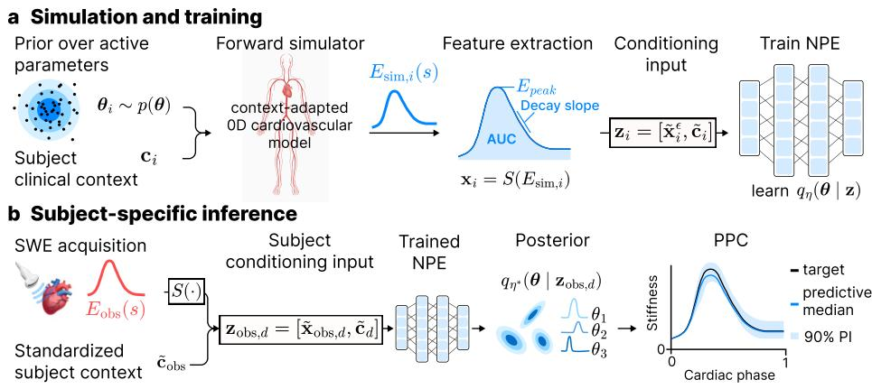
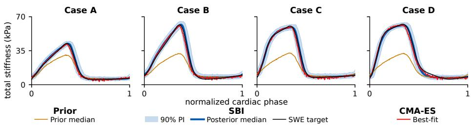
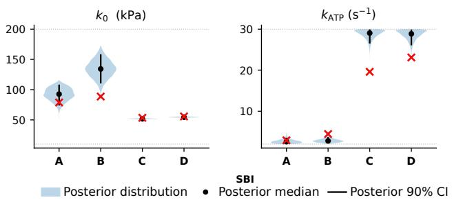
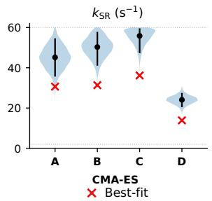

# Uncertainty Quantification in Cardiac Model Personalisation from Ultrafast Ultrasound

Camilla Ferrario1,3, Maelys Venet2, Olivier Villemain2, and Maxime Sermesant1,3

1 Université Côte d’Azur, Inria, Epione Team, Sophia Antipolis, France

2 Bordeaux University Hospital (CHU de Bordeaux), Bordeaux, France

3 IHU Liryc, Electrophysiology and Heart Modeling Institute, Pessac, France camilla.ferrario@inria.fr

Abstract. Cardiac model personalisation requires inferring mechanical parameters that are not directly measurable in vivo. Ultrafast ultrasound shear wave elastography (SWE) enables non-invasive tracking of myocardial stifness dynamics over the cardiac cycle, providing a target for personalisation. However, mapping these observations to subjectspecific model parameters remains ill-posed, as multiple parameter sets can reproduce the same stifness dynamics. We formulate SWE-informed personalisation as a statistical inference problem using simulation-based inference (SBI). Using a subject-adapted 0D cardiovascular model and neural posterior estimation, we estimate model-conditional posterior distributions over active stifness scale k0, contraction rate kATP, and relaxation rate kSR, conditioned on SWE-derived curve features and subjectspecific context. Among six healthy volunteers, four passed objective prior-support diagnostics and were retained for quantitative posterior analysis. Curve-level RMSE against the observed SWE target decreased from 12.61 ± 5.55 kPa for the prior predictive median to 1.14 ± 0.38 kPa for the posterior predictive median, an 89.7 ± 4.2% reduction. Posterior analysis revealed parameter-specific uncertainty, k0-kATP compensation, weaker constraint of $k _ { \mathrm { S R } } .$ , and the importance of prior-predictive diagnostics for assessing whether each subject is represented within the modelled SWE feature space. These results support SBI for uncertaintyaware SWE-based personalisation, while identifying prior support and forward-model adequacy as key diagnostics.

Keywords: Uncertainty Quantification · Simulation-Based Inference · Cardiac Biomechanics · Ultrafast Ultrasound Imaging.

## 1 Introduction

Personalised cardiac models support the interpretation of clinical observations by linking measured cardiac signals to subject-specific mechanical properties [16,5]. Model personalisation is usually posed as an inverse problem, where parameters are calibrated from limited measurements such as imaging-derived motion, deformation, ventricular volumes, or pressure points [17,3,1]. Clinical data are often sparse, and cardiac model parameters may interact. Consequently, similar observations may be explained by diferent parameter combinations, leading to an ill-posed personalisation problem with uncertain, correlated, or only partially identifiable parameter estimates [20,13]. Reliable personalisation should therefore go beyond a single best-fit parameter vector and quantify which properties are actually constrained by the available measurements [5,20,15].

These limitations are particularly relevant when personalising myocardial mechanics, where passive stifness, active contraction, and relaxation are inferred from global measures of pump function, such as ejection fraction or pressurevolume loops [19]. Because these measurements are strongly influenced by loading conditions and circulatory coupling, they constrain tissue properties only indirectly. Ultrafast shear wave elastography (SWE) ofers a more direct, tissuelevel measure of myocardial stifness throughout the cardiac cycle [14,21]. Nevertheless, SWE-derived stifness combines passive tissue response, active force generation, and measurement variability. Fitting stifness dynamics alone therefore cannot identify a unique set of active mechanical parameters or determine which parameters are efectively constrained by the data.

These challenges motivate a probabilistic formulation that estimates the range of parameter values compatible with the observed SWE dynamics and subject-specific context. Conventional Bayesian approaches such as Markov chain Monte Carlo typically require repeated likelihood evaluations, while approximate Bayesian computation depends on user-defined distance functions and acceptance thresholds. Simulation-based inference (SBI) instead learns an approximation of the posterior directly from simulated data, making it well suited to complex models with intractable likelihoods [6,7]. Neural SBI can additionally amortise inference across observations while capturing non-Gaussian uncertainty and dependencies between parameters. In cardiovascular modelling, however, SBI has so far been applied primarily to biomarker estimation from haemodynamic biosignals [22,11].

Here, we introduce a context-conditioned SBI framework for SWE-informed personalisation of active myocardial mechanics. We combine a subject-adapted 0D cardiovascular model with neural posterior estimation to infer distributions of active mechanical parameters from stifness-curve features and subject-specific context. The main contributions are: (i) a probabilistic formulation of SWEbased active-parameter estimation; (ii) a feature-based observation model that accounts for uncertainty in the stifness targets; and (iii) a preliminary evaluation in healthy volunteers using posterior predictive checks (PPCs) and comparison with an optimisation-based point estimate.

## 2 Methods

## 2.1 Ultrafast SWE-derived stifness target

The inference target is the subject-specific myocardial stifness dynamics measured by ultrafast SWE. Data were acquired in a parasternal long-axis view, targeting the basal anteroseptal interventricular septum, using a Verasonics Vantage system with a GE 6S-D probe. Acoustic radiation force pushes were transmitted at 4 MHz for 300 $\mu \mathrm { s }$ with an f-number of 1. Acquisitions were ECG-gated at 20 phases distributed over the cardiac cycle. At each phase, shear-wave velocity estimates within the segmented mid-myocardial region were spatially averaged. The mean shear-wave speed, ${ \mathit { c } } _ { s } ,$ was converted to apparent Young’s modulus, $E ,$ , using $E = 3 \rho c _ { s } ^ { 2 }$ , assuming a tissue density of $\rho = 1 0 0 0 ~ \mathrm { k g / m ^ { 3 } }$ . The resulting values were assembled into a cycle-normalized stifness curve $E _ { \mathrm { S W E } , d } ( s )$ , with $s \in [ 0 , 1 ]$ , for each analysed subject $d = 1 , \ldots , D$ . This curve was used directly as the observation for inference:

$$
E _ { \mathrm { o b s } , d } ( s ) = E _ { \mathrm { S W E } , d } ( s ) .\tag{1}
$$

Acquisition and stifness reconstruction followed previously established protocols [19,21] and were performed under ethics approval with informed consent.

## 2.2 Context-adapted 0D cardiac model

The forward model is a reduced-order 0D cardiovascular simulator. It represents the left ventricle as a thick-walled spherical chamber coupled to a closed-loop systemic RCR and pulmonary RC Windkessel circulation. Under an isotropic fibre assumption, the model reduces ventricular geometry to spherical symmetry while retaining the tissue constitutive description [4,8].

For each case $d ,$ we denote by $\mathbf { c } _ { d }$ the available subject-specific anatomical, physiological, and demographic context, including left ventricular end-systolic and end-diastolic volumes (LVESV, LVEDV), interventricular septal thickness at end diastole (IVSd), heart rate (HR), age, sex, and body surface area (BSA). HR, IVSd, and LVEDV define the case-specific cardiac period $T _ { d }$ , reference wall thickness $d _ { 0 , d }$ , and reference radius $R _ { 0 , d } .$ respectively:

$$
T _ { d } = \frac { 6 0 } { \mathrm { H R } _ { d } } , \qquad d _ { 0 , d } = 1 0 ^ { - 2 } \mathrm { I V S d } _ { d } , \qquad R _ { 0 , d } = \left( \frac { 3 \cdot 1 0 ^ { - 6 } \mathrm { L V E D V } _ { d } } { 4 \pi } \right) ^ { 1 / 3 } ,\tag{2}
$$

with HR, IVSd, and LVEDV expressed in bpm, cm, and mL, respectively. LVESV, age, sex, and BSA enter only as conditioning variables.

Personalisation is restricted to the active parameter vector $\pmb \theta = ( k _ { 0 } , k _ { \mathrm { A T P } } , k _ { \mathrm { S R } } )$ The parameter $k _ { 0 } ~ \mathrm { ( k P a ) }$ controls the active stifness amplitude, $k _ { \mathrm { A T P } } ~ \mathrm { ( s ^ { - 1 } ) }$ the contraction rate, and $k _ { \mathrm { S R } } ~ ( \mathrm { s } ^ { - 1 } )$ the relaxation rate. Passive constitutive, circulatory, and valve parameters are fixed across subjects, while the observation-level passive stifness scale is calibrated subject-wise before SBI.

For case $d ,$ the simulator predicts the active stifness response $E _ { \mathrm { a c t } , d } ^ { \mathrm { s i m } } ( s ; \theta )$ Since SWE measures total apparent myocardial stifness, the simulated inference target is

$$
\begin{array} { r } { E _ { \mathrm { s i m } , d } ( s ; \pmb { \theta } ) = E _ { \mathrm { p a s s } , d } ( s ) + E _ { \mathrm { a c t } , d } ^ { \mathrm { s i m } } ( s ; \pmb { \theta } ) , } \end{array}\tag{3}
$$

where $E _ { \mathrm { p a s s } , d } ( s )$ is precomputed for each subject using the stretch-dependent passive observation model and late-diastolic calibration detailed in [9], and is subsequently held fixed during SBI. Training features and PPCs are derived from $E _ { \mathrm { s i m } , d }$ and compared with $E _ { \mathrm { o b s } , d } .$

## 2.3 Context-conditioned SBI

We formulate personalisation as Bayesian inference of the active parameter vector θ, conditioned on SWE-derived stifness dynamics and subject-specific context. Instead of estimating a single best-fit vector, we infer a posterior distribution to quantify uncertainty, parameter compensation, and practical identifiability. Stifness curves are summarized by curve-derived features, which are combined with subject-specific context to form feature-context training samples. These samples are pooled across subjects to train an amortized inference model that yields subject-specific posterior distributions (Fig. 1).

  
Fig. 1. SWE-informed SBI workflow. (a) Prior samples and subject context are passed through the 0D model to generate stifness curves. Extracted features are noiseaugmented, standardized, concatenated with standardized context, and pooled to train a shared NPE $q _ { \eta } ( \pmb { \theta } \mid \mathbf { z } )$ . Here, i indexes a pooled sample, i.e. one case, parameter draw, and feature-noise augmentation. (b) For case $d ,$ observed SWE features and context define $\mathbf { z _ { o b s , } } d \cdot$ . The trained NPE returns a subject-specific posterior, evaluated by PPC.

Feature-based conditioning. Simulated and observed stifness curves were encoded using a hybrid summary representation combining interpretable scalar descriptors with a coarse resampling of the aligned trajectory. This retained mechanically relevant shape information while reducing sensitivity to pointwise noise, temporal misalignment, and redundant samples. Preliminary ablations showed that scalar-only summaries degraded posterior predictive performance. The summary operator $S ( \cdot )$ maps each stifness curve to $\mathbf { x } = S ( E ) \in \mathbb { R } ^ { 4 6 }$ , containing 16 scalar descriptors and 30 uniformly resampled trajectory values. The scalar descriptors capture baseline and peak stifness, amplitude, area under the curve, systolic rise, peak timing, and post-peak relaxation, while the resampled values retain the coarse shape of the systolic rise, peak region, and post-peak relaxation. For case $d ,$ and for the n-th parameter sample $\pmb { \theta } _ { d , n } , n = 1 , \ldots , N _ { \theta }$ the simulated and observed feature vectors are

$$
{ \bf x } _ { d , n } = S \big ( E _ { \mathrm { s i m } , d } ( s ; \theta _ { d , n } ) \big ) , \qquad { \bf x } _ { \mathrm { o b s } , d } = S \big ( E _ { \mathrm { o b s } , d } ( s ) \big ) .\tag{4}
$$

Pooled simulation dataset and observation model. For each case $d ,$ parameter samples are drawn from the common prior, $\theta _ { d , n } \sim p ( \pmb { \theta } )$ , and passed through the context-adapted simulator. The resulting curves are converted into feature vectors $\mathbf { x } _ { d , n }$ as in Eq. 4. To model observation uncertainty in feature space, each simulated feature vector is augmented with additive Gaussian noise:

$$
\begin{array} { r } { { \bf x } _ { d , n , a } ^ { \epsilon } = { \bf x } _ { d , n } + \epsilon _ { d , n , a } , \qquad \epsilon _ { d , n , a } \sim \mathcal { N } ( \mathbf { 0 } , \Sigma _ { x } ) , } \end{array}\tag{5}
$$

where $a = 1 , \dots , N _ { \mathrm { a u g } }$ indexes feature-noise augmentations.

In this work, $\Sigma _ { x }$ is diagonal and non-zero only for maximum stifness, AUC, post-peak AUC, post-peak decay slope, and time-to-peak, with standard deviations $( 1 . 0 , 0 . 5 , 0 . 5 , 5 . 0 , 0 . 0 3 )$ in raw feature units. These scales were selected a priori from feature magnitudes, kept fixed across subjects, and used as regularising observation hyperparameters. The resampled trajectory values were not independently perturbed, since they were included as coarse shape descriptors rather than pointwise observations.

After augmentation, samples from all cases are concatenated into a single pooled training set. Feature and context components are standardized using pooled training-set statistics, and the same transformations are applied to the observed inputs. Each training sample is represented by the conditioning vector

$$
\begin{array} { r } { \mathbf { z } _ { d , n , a } = \left[ \tilde { \mathbf { x } } _ { d , n , a } ^ { \epsilon } , \tilde { \mathbf { c } } _ { d } \right] , \qquad \mathbf { z } _ { \mathrm { o b s } , d } = \left[ \tilde { \mathbf { x } } _ { \mathrm { o b s } , d } , \tilde { \mathbf { c } } _ { d } \right] , } \end{array}\tag{6}
$$

where brackets denote concatenation and tildes denote pooled standardization. Including $\mathbf { c } _ { d }$ preserves subject-specific anatomical, physiological, and demographic information within the pooled training set, while $\mathbf { z } _ { \mathrm { o b s } , d }$ is standardized but not noise-augmented. The final pooled training dataset is

$$
\mathcal { D } _ { \mathrm { p o o l } } = \{ ( \theta _ { d , n } , \mathbf { z } _ { d , n , a } ) : d = 1 , \ldots , D , n = 1 , \ldots , N _ { \theta } , a = 1 , \ldots , N _ { \mathrm { a u g } } \} .\tag{7}
$$

Neural posterior estimation. We use neural posterior estimation (NPE) to approximate $p ( \pmb { \theta } \mid \mathbf { z } )$ from the pooled simulation dataset $\mathcal { D } _ { \mathrm { p o o l } }$ . The estimator $q _ { \eta } ( \pmb { \theta } \mid \mathbf { z } )$ was implemented with the NPE-C/SNPE-C routine of the sbi toolbox [18,2]. The density estimator was the default sbi v0.26.1 conditional masked autoregressive flow, using 5 transforms, 50 hidden features, 2 autoregressive blocks, batch size 128, and standardized parameters and conditioning inputs. The estimator is trained by maximizing the conditional log likelihood

$$
\eta ^ { * } = \arg \operatorname* { m a x } _ { \eta } \frac { 1 } { | \mathcal { D } _ { \mathrm { p o o l } } | } \sum _ { ( \pmb { \theta } , \mathbf { z } ) \in \mathcal { D } _ { \mathrm { p o o l } } } \log q _ { \eta } ( \pmb { \theta } \mid \mathbf { z } ) .\tag{8}
$$

For each case $d ,$ posterior samples are then drawn from $q _ { \eta ^ { * } } ( \pmb { \theta } | \mathbf { z } _ { \mathrm { o b s } , d } )$ and propagated through the forward model to obtain posterior predictive curves.

## 2.4 Experimental setup

All experiments used a single frozen pooled SBI configuration across all analysed subjects, including the prior $p ( \pmb \theta )$ , summary operator $S ( \cdot )$ , feature-Gaussian observation model, pooled standardization, NPE architecture, and training protocol. The active-parameter prior was selected to span broad physiologically plausible ranges, informed by literature-reported values [1,12], previous model calibrations, and prior-support diagnostics. The prior was an independent bounded log-Gaussian prior, log-centred at $k _ { 0 } = 4 5$ kPa, $k _ { \mathrm { A T P } } = 5 \mathrm { s } ^ { - 1 }$ , and $k _ { \mathrm { S R } } = 3 0 \mathrm { s } ^ { - 1 }$ with log-space standard deviations $( 0 . 5 , 0 . 6 , 0 . 4 5 )$ and hard bounds $k _ { 0 } \in [ 1 0 , 2 0 0 ]$ kPa, kATP ∈ [2, 30] s−1, and $k _ { \mathrm { S R } } \in [ 2 , 6 0 ] ~ \mathrm { s } ^ { - 1 }$

For each evaluated subject, $N _ { \theta } = 1 0 0 0$ successful simulations were generated from the prior using the corresponding subject-specific context. With $D = 6$ evaluated subjects, this yielded 6000 forward simulations. Each simulated feature vector was augmented $N _ { \mathrm { a u g } } = 2 0$ times using the feature-Gaussian observation model, resulting in $D \times \mathrm { \bar { } } N _ { \theta } \times N _ { \mathrm { a u g } } = 1 2 0 , 0 0 0$ pooled training samples. Prior-support diagnostics used to define the retained quantitative analysis set are described in Sec. 2.5. The NPE was trained with a batch size of 128 for a maximum of 100 epochs, using the standard sbi training procedure [2]. Implementation used the sbi toolbox with PyTorch and CUDA acceleration.

## 2.5 Evaluation

Evaluation was performed separately for each subject. Prior support required $\operatorname* { m a x } _ { j } | z _ { \mathrm { o b s } , d , j } | \leq 3$ , where j indexes the components of the standardized featurecontext conditioning vector, and at least 1000 posterior samples within the prescribed prior bounds from $5 \times 1 0 ^ { 5 }$ candidate draws. The first criterion provides a simple out-of-distribution check, while the second identifies cases with negligible posterior mass within the prior bounds. Cases passing both criteria were considered prior-supported and retained for quantitative posterior analysis. Cases failing either criterion were excluded from quantitative posterior summaries but retained for assessing prior support and model adequacy.

For retained cases, PPCs were computed by sampling $\pmb { \theta } \sim q _ { \eta ^ { * } } ( \pmb { \theta } | \mathbf { z } _ { \mathrm { o b s } , d } )$ and propagating each sample through the forward simulator to obtain $E _ { \mathrm { s i m } , d } ( s ; \theta )$ (Eq. 3). PPCs assess whether the posterior can reproduce the observed SWE target under the assumed simulator and observation model, not whether the underlying active model parameters are uniquely identified. Predictive agreement was quantified from the posterior predictive median using RMSE, NRMSE, $R ^ { 2 }$ and post-peak RMSE, the latter targeting relaxation dynamics relevant to $k _ { \mathrm { S R } } .$

Posterior predictive uncertainty was summarized using the 90% predictive interval (PI) and its coverage, defined as the fraction of observed cardiac phases lying within the interval. Parameter uncertainty was summarized using posterior medians, 90% credible intervals (CI), and pairwise posterior dependencies.

As an optimisation-based reference, we performed subject-wise fitting with CMA-ES [10]. For each subject, CMA-ES used the same subject-specific context, passive baseline, and active-parameter bounds as the SBI pipeline, and minimized a curve-level objective combining normalized MAE, correlation mismatch, and peak mismatch. The lowest-loss solution was selected over 10 seeded runs (seeds 200–209; population size 12; 80 generations; maximum 9600 simulator evaluations per subject) and used as a diagnostic point reference, not as ground truth.

## 3 Results and Discussion

Prior-support diagnostics and posterior predictive performance. Six subjects were evaluated using the same frozen pooled SBI configuration (Sec. 2.4). Four passed both prior-support criteria and were retained for quantitative posterior analysis. The remaining two were not excluded because of forward-simulation failure; rather, their observations were insuficiently represented by the fixed prior-predictive training distribution and were retained as prior-support and model-adequacy cases. In one case, the conditioning vector satisfied the standardized feature criterion $( \operatorname* { m a x } _ { j } | z _ { \mathrm { o b s } , j } | = 2 . 1 6 )$ , but posterior sampling yielded only one valid in-prior sample from $5 \times 1 0 ^ { 5 }$ candidate draws, with an unfiltered $k _ { \mathrm { A T P } }$ median of $6 9 . 7 ~ \mathrm { s ^ { - 1 } }$ . In the other case, the systolic up-slope lay outside the standardized support threshold $( z = 3 . 1 4 )$ , and no valid in-prior sample was obtained; the unfiltered $k _ { \mathrm { A T P } }$ median was $1 7 8 . 6 \ \mathrm { s } ^ { - 1 }$

Across the four retained cases, the observed values of the five noise-modelled features lay within the posterior predictive 90% intervals. SBI reduced RMSE from $1 2 . 6 1 \pm 5 . 5 5$ to $1 . 1 4 \pm 0 . 3 8 \mathrm { { k P a } }$ relative to the prior predictive median, an $8 9 . 7 \pm 4 . 2 \%$ reduction, with high $R ^ { 2 } \ ( 0 . 9 9 6 \pm 0 . 0 0 1 )$ (Tab. 1). This improvement demonstrates posterior-predictive agreement, but does not establish unique identification of the underlying active model parameters. The main posterior correction was improved reproduction of the systolic stifness peak, which was systematically underestimated by the prior predictive median (Fig. 2). However, PPCs exposed local adequacy diferences beyond global fit metrics: Cases A–C combined accurate medians with near-complete 90% PI coverage, whereas Case D retained the largest post-peak RMSE and lower coverage, indicating a residual timing or relaxation mismatch.

Table 1. Posterior predictive performance. RMSEs are in kPa and computed against the observed SWE target $E _ { \mathrm { o b s } , d } ( s ) ;$ ; reduction is relative to the prior predictive median. Coverage refers to the 90% posterior predictive PI.
<table><tr><td>Case</td><td>RMSE</td><td>RMSE prior → SBI reduction (%)</td><td>NRMSE</td><td> $R ^ { 2 }$ </td><td>Post-peak RMSE</td><td>Coverage</td></tr><tr><td>A</td><td> $4 . 8 4  0 . 7 6$ </td><td>84.2</td><td>0.020</td><td>0.996</td><td>0.60</td><td>&gt; 0.99</td></tr><tr><td>B</td><td> $1 2 . 6 7  1 . 4 0$ </td><td>89.0</td><td>0.025</td><td>0.995</td><td>1.35</td><td>0.98</td></tr><tr><td>C</td><td> $1 5 . 3 3  0 . 8 7$ </td><td>94.3</td><td>0.016</td><td>0.998</td><td>0.76</td><td>0.99</td></tr><tr><td>D</td><td> $1 7 . 5 9  1 . 5 3$ </td><td>91.3</td><td>0.027</td><td>0.995</td><td>1.77</td><td>0.89</td></tr></table>

  
Fig. 2. Posterior predictive checks. SBI narrows the prior predictive mismatch of the systolic peak; CMA-ES is shown as a loss-based best-fit reference.

Posterior uncertainty and identifiability. Posterior uncertainty was parameter and subject dependent (Fig. 3). Within the assumed prior, feature set, and forward model, $k _ { 0 }$ was generally well constrained, consistent with the amplitude information in $E _ { \mathrm { o b s } , d } ( s )$ . In contrast, $k _ { \mathrm { A T P } }$ showed limited practical identifiability: although its posterior could be narrow, wider-prior experiments shifted the inferred contraction-rate distributions. Pairwise posteriors supported this interpretation, with a strong negative $k _ { 0 } { - } k _ { \mathrm { A T P } }$ correlation $( r = - 0 . 8 4 \pm 0 . 1 5 )$ , indicating compensation between active-stifness amplitude and contraction rate. Correlations involving $k _ { \mathrm { S R } }$ were weak on average $( r ( k _ { 0 } , k _ { \mathrm { S R } } ) = 0 . 0 9 \pm 0 . 1 2 $ $r ( k _ { \mathrm { A T P } } , k _ { \mathrm { S R } } ) = - 0 . 0 3 \pm 0 . 1 5 )$ , suggesting weaker and subject-dependent relaxation rate information. Consistently, a preliminary synthetic recovery check $( N = 4 0 0 )$ showed near-nominal 90% coverage for $k _ { 0 }$ and $k _ { \mathrm { A T P } } ~ ( 9 2 . 5 \% , 9 0 . 5 \% )$ but marked under-coverage for $k _ { \mathrm { S R } }$ (26.5%). Together with the excluded cases and the degraded coverage observed when widening the timing-related prior bounds, these results motivate explicit prior-support diagnostics, improved prior design, and future simulation-based calibration.

These results describe practical identifiability conditional on the selected prior, observation model, fixed passive component, and 0D forward model. Spherical symmetry, isotropy, and fixed circulatory parameters neglect spatial heterogeneity, fibre architecture, and subject-specific loading. The observed parameter dependencies may therefore reflect both limited SWE information and structural model mismatch.

Diagnostic comparison with CMA-ES. CMA-ES was used as an optimisationbased point reference following the protocol described in Sec. 2.5. Across the four prior-supported cases, SBI posterior predictive medians achieved RMSEs of 0.76, 1.40, 0.87, and 1.53 kPa, compared with 1.36, 2.15, 2.06, and 2.02 kPa for the CMA-ES best-fit estimates in Cases A–D. This comparison is diagnostic rather than competitive, since SBI summarizes a posterior predictive distribution, whereas CMA-ES returns a single loss-minimizing parameter vector. Diferences may therefore reflect parameter compensation, sensitivity to the optimisation objective, or residual model mismatch, and should not be interpreted as evidence of unique parameter recovery.

  
Fig. 3. Posterior parameter uncertainty. Distributions, medians, and 90% CI are obtained from the SBI posterior; crosses indicate CMA-ES best-fit reference estimates.

## 4 Conclusion

We presented a context-conditioned SBI framework for probabilistic personalisation of active myocardial mechanics from SWE-derived stifness dynamics. Among six healthy volunteers, four met the prior-support criteria and showed improved posterior-predictive agreement, whereas two revealed inadequate representation within the prior-predictive distribution. Posterior analysis identified $k _ { 0 } { - } k _ { \mathrm { A T P } }$ compensation, parameter-specific uncertainty, and weaker constraint of $k _ { \mathrm { S R } }$ . Predictive agreement does not establish unique recovery of the underlying model parameters, and the reported uncertainty remains conditional on the selected prior, prescribed feature-noise covariance, precomputed passive component, fixed circulatory parameters, and simplified 0D model. The small healthyvolunteer sample limits assessment of between-subject variability and generalisability to pathological populations. Nevertheless, these preliminary results support SBI as a means of distinguishing parameters constrained by SWE from those that remain ambiguous, thereby reducing over-interpretation of a single fitted solution. Clinical translation will require observation uncertainty calibrated from repeated acquisitions, improved subject-specific modelling of passive mechanics and loading, and validation in larger pathological cohorts.

Acknowledgments. This work was supported by ANR through PEPR Digital Health ChroniCardio (22-PESN-0015), 3IA Côte d’Azur/IA Cluster (ANR-19- 3IA-0002, ANR-23-IACL-0001), and IHU Liryc (ANR-10-IAHU-04); by France 2030 and Next Generation EU through MediTwin; and by the ERC Horizon Europe 5D ULTRAFAST HCM project (101220327). We acknowledge the OPAL infrastructure (Université Côte d’Azur) for computational support. Finally, we thank Giulio Corallo for code assistance and manuscript feedback, and Giuseppe Orlando for manuscript feedback and helpful discussions.

Disclosure of Interests. The authors have no competing interests to declare that are relevant to the content of this article.

## References

1. Banus, J., Lorenzi, M., Camara, O., Sermesant, M.: Biophysics-based statistical learning: Application to heart and brain interactions. Medical Image Analysis 72, 102089 (2021). https://doi.org/10.1016/j.media.2021.102089

2. Boelts, J., Deistler, M., Gloeckler, M., Tejero-Cantero, Á., Lueckmann, J.M., Moss, G., Steinbach, P., Moreau, T., Muratore, F., Linhart, J., Durkan, C., Vetter, J., Miller, B.K., Herold, M., Ziaeemehr, A., Pals, M., Gruner, T., Bischof, S., Krouglova, N., Gao, R., Lappalainen, J.K., Mucsányi, B., Pei, F., Schulz, A., Stefanidi, Z., Rodrigues, P., Schröder, C., Zaid, F.A., Beck, J., Kapoor, J., Greenberg, D.S., Gonçalves, P.J., Macke, J.H.: Sbi reloaded: A toolkit for simulation-based inference workflows. Journal of Open Source Software 10(108), 7754 (Apr 2025). https://doi.org/10.21105/joss.07754

3. Bracamonte, J.H., Saunders, S.K., Wilson, J.S., Truong, U.T., Soares, J.S.: Patient-Specific Inverse Modeling of In Vivo Cardiovascular Mechanics with Medical Image-Derived Kinematics as Input Data: Concepts, Methods, and Applications. Applied Sciences 12(8), 3954 (Apr 2022). https://doi.org/10.3390/app12083954

4. Caruel, M., Chabiniok, R., Moireau, P., Lecarpentier, Y., Chapelle, D.: Dimensional reductions of a cardiac model for efective validation and calibration. Biomechanics and Modeling in Mechanobiology 13(4), 897–914 (Aug 2014). https://doi.org/10.1007/s10237-013-0544-6

5. Chabiniok, R., Wang, V.Y., Hadjicharalambous, M., Asner, L., Lee, J., Sermesant, M., Kuhl, E., Young, A.A., Moireau, P., Nash, M.P., Chapelle, D., Nordsletten, D.A.: Multiphysics and multiscale modelling, data–model fusion and integration of organ physiology in the clinic: Ventricular cardiac mechanics. Interface Focus 6(2), 20150083 (2016). https://doi.org/10.1098/rsfs.2015.0083

6. Cranmer, K., Brehmer, J., Louppe, G.: The frontier of simulation-based inference. Proceedings of the National Academy of Sciences 117(48), 30055–30062 (Dec 2020). https://doi.org/10.1073/pnas.1912789117

7. Deistler, M., Boelts, J., Steinbach, P., Moss, G., Moreau, T., Gloeckler, M., Rodrigues, P.L.C., Linhart, J., Lappalainen, J.K., Miller, B.K., Gonçalves, P.J., Lueckmann, J.M., Schröder, C., Macke, J.H.: Simulation-Based Inference: A Practical Guide (2025). https://doi.org/10.48550/ARXIV.2508.12939

8. Ferrario, C., Padilla, J.R., Venet, M., Villemain, O., Sermesant, M.: Myocardial Stifness Quantification Using Ultrasound Shear Wave Elastography and Reduced Modeling for Subject-Specific Simulations. In: Chabiniok, R., Zou, Q., Hussain, T., Nguyen, H.H., Zaha, V.G., Gusseva, M. (eds.) Functional Imaging and Modeling of the Heart, vol. 15673, pp. 41–54. Springer Nature Switzerland, Cham (2025). https://doi.org/10.1007/978-3-031-94562-5\_5

9. Ferrario, C., Venet, M., Villemain, O., Sermesant, M.: In Vivo Cardiac Biomechanical Model Parameter Estimation from Ultrafast Shear Wave Elastography (Feb 2026). https://doi.org/10.21203/rs.3.rs-8744899/v1

10. Hansen, N.: The CMA Evolution Strategy: A Comparing Review. In: Towards a New Evolutionary Computation, Studies in Fuzziness and Soft Computing, vol. 192, pp. 75–102. Springer (2007). https://doi.org/10.1007/3-540-32494-1\_4

11. Manduchi, L., Wehenkel, A., Behrmann, J., Pegolotti, L., Miller, A.C., Sener, O., Cuturi, M., Sapiro, G., Jacobsen, J.H.: Leveraging Cardiovascular Simulations for In-Vivo Prediction of Cardiac Biomarkers (Dec 2024). https://doi.org/10.48550/ arXiv.2412.17542

12. Marchesseau, S., Delingette, H., Sermesant, M., Sorine, M., Rhode, K., Duckett, S.G., Rinaldi, C.A., Razavi, R., Ayache, N.: Preliminary specificity study of the Bestel-Clément-Sorine electromechanical model of the heart using parameter calibration from medical images. Journal of the Mechanical Behavior of Biomedical Materials 20, 259–271 (Apr 2013). https://doi.org/10.1016/j.jmbbm.2012.11.021

13. Molléro, R., Pennec, X., Delingette, H., Ayache, N., Sermesant, M.: Populationbased priors in cardiac model personalisation for consistent parameter estimation in heterogeneous databases. International Journal for Numerical Methods in Biomedical Engineering 35(2), e3158 (2019). https://doi.org/10.1002/cnm.3158

14. Pernot, M., Couade, M., Mateo, P., Crozatier, B., Fischmeister, R., Tanter, M.: Real-Time Assessment of Myocardial Contractility Using Shear Wave Imaging. Journal of the American College of Cardiology 58(1), 65–72 (2011). https://doi. org/10.1016/j.jacc.2011.02.042

15. Salvador, M., Regazzoni, F., Dede’, L., Quarteroni, A.: Fast and robust parameter estimation with uncertainty quantification for the cardiac function. Computer Methods and Programs in Biomedicine 231, 107402 (Apr 2023). https: //doi.org/10.1016/j.cmpb.2023.107402

16. Sermesant, M., Chabiniok, R., Chinchapatnam, P., Mansi, T., Billet, F., Moireau, P., Peyrat, J.M., Wong, K., Relan, J., Rhode, K., Ginks, M., Lambiase, P., Delingette, H., Sorine, M., Rinaldi, C.A., Chapelle, D., Razavi, R., Ayache, N.: Patient-specific electromechanical models of the heart for the prediction of pacing acute efects in CRT: A preliminary clinical validation. Medical Image Analysis 16(1), 201–215 (Jan 2012). https://doi.org/10.1016/j.media.2011.07.003

17. Sermesant, M., Peyrat, J.M., Chinchapatnam, P., Billet, F., Mansi, T., Rhode, K., Delingette, H., Razavi, R., Ayache, N.: Toward Patient-Specific Myocardial Models of the Heart. Heart Failure Clinics 4(3), 289–301 (Jul 2008). https://doi.org/10. 1016/j.hfc.2008.02.014

18. Tejero-Cantero, A., Boelts, J., Deistler, M., Lueckmann, J.M., Durkan, C., Gonçalves, P., Greenberg, D., Macke, J.: Sbi: A toolkit for simulation-based inference. Journal of Open Source Software 5(52), 2505 (Aug 2020). https://doi. org/10.21105/joss.02505

19. Villalobos Lizardi, J.C., Baranger, J., Nguyen, M.B., Asnacios, A., Malik, A., Lumens, J., Mertens, L., Friedberg, M.K., Simmons, C.A., Pernot, M., Villemain, O.: A guide for assessment of myocardial stifness in health and disease. Nature Cardiovascular Research 1(1), 8–22 (2022). https://doi.org/10.1038/s44161-021-00007-3

20. Villaverde, A.F., Tsiantis, N., Banga, J.R.: Full observability and estimation of unknown inputs, states and parameters of nonlinear biological models. Journal of the Royal Society Interface 16(156), 20190043 (2019). https://doi.org/10.1098/ rsif.2019.0043

21. Villemain, O., Baranger, J., Friedberg, M.K., Papadacci, C., Dizeux, A., Messas, E., Tanter, M., Pernot, M., Mertens, L.: Ultrafast Ultrasound Imaging in Pediatric and Adult Cardiology: Techniques, Applications, and Perspectives. JACC Cardiovasc Imaging 13(8), 1771–1791 (2020). https://doi.org/10.1016/j.jcmg.2019.09.019

22. Wehenkel, A., Manduchi, L., Behrmann, J., Pegolotti, L., Miller, A.C., Sapiro, G., Sener, O., Cuturi, M., Jacobsen, J.H.: Simulation-based Inference for Cardiovascular Models (Dec 2024). https://doi.org/10.48550/arXiv.2307.13918