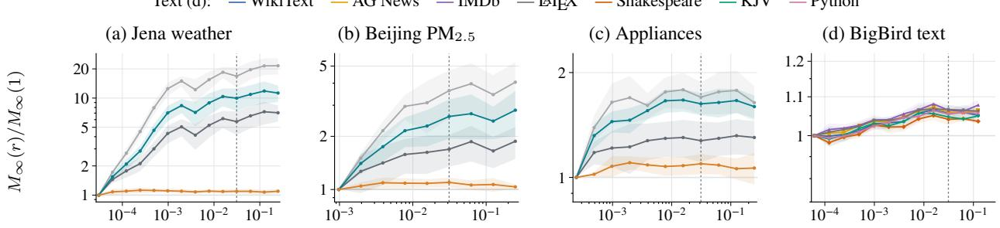
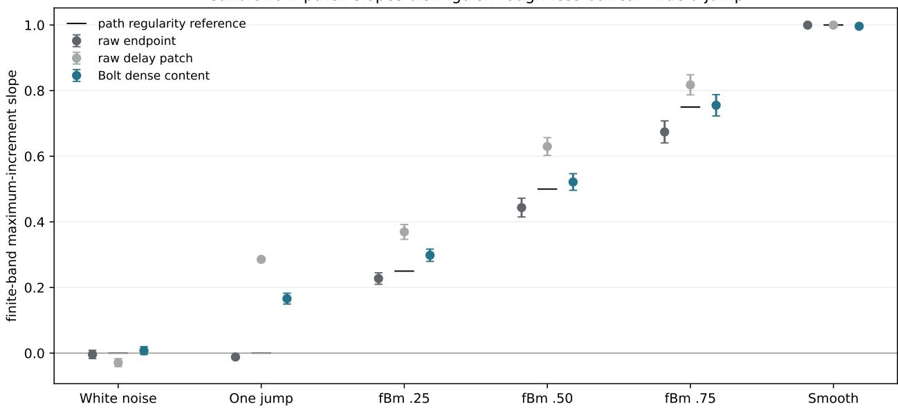
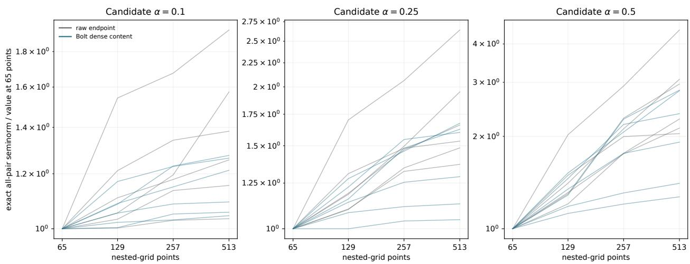
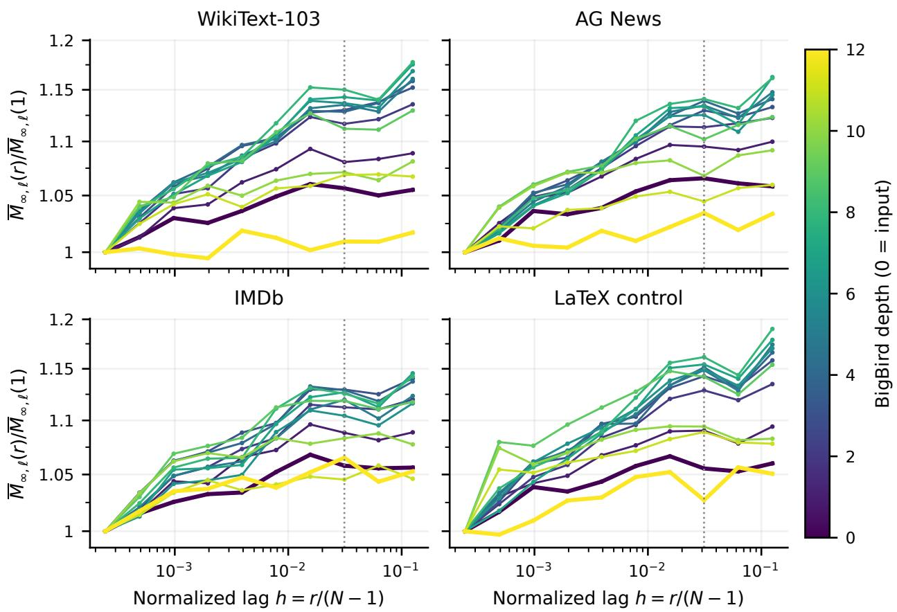
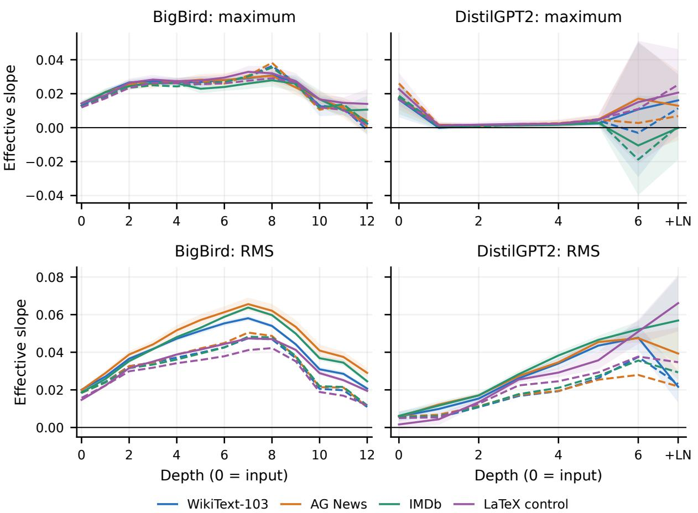

# Universality and Generalization of Causal Transformers Across Context Lengths

Takashi Furuya Doshisha University, RIKEN AIP tfuruya@mail.doshisha.ac.jp

Maarten V. de Hoop Rice University mdehoop@rice.edu

Gabriel Peyré CNRS, ENS, PSL Université gabriel.peyre@ens.fr

## Abstract

Long contexts are central to modern transformer systems, but most expressivity results choose a different network for each fixed sequence length. We study whether one masked transformer can approximate causal token-to-token maps uniformly over sequences of arbitrary length sampling a fixed normalized horizon. To relate sampling resolutions, we model tokens by α-Hölder sequences or, more generally, a common modulus of continuity. Our notion of continuity across resolutions characterizes the causal families admitting uniform approximation on these compact input classes by a single transformer with length-independent parameters. The result extends to the infinite-length mean-field limit, where tokens form continuous curves and masked attention becomes a causal time integral. For bounded regression with target maps satisfying a β-smooth stability condition defined using regular test functions, quantitative approximation yields a generalization bound: exact empirical risk minimization over suitably sized bounded-weight transformers gives root mean-square prediction error O((log log N/ log N)β/(d+2)) from N iid labeled sequences. The bound holds at fixed confidence on the same sampling distribution, with d the token dimension and no maximum-length factor. Finally, experiments on physical time series support the Hölder-regular token model at observed scales, with dataset-dependent fitted exponents, whereas text input embeddings provide a contrasting case. Native and dense sampling, shuffled controls, and refinement checks delimit this empirical regularity regime.

## 1 Introduction

Long-context transformers apply one learned rule across sequence lengths, yet most universality results fix the length before choosing the network. We show that common input regularity, together with asymptotic continuity of the target across resolutions, enables uniform causal approximation at every resolution, connects the discrete model to its continuous-time limit, and yields approximation and statistical learning rates under additional target regularity. We also clarify the role of positional information and examine the input geometry empirically.

Transformers and long-context architectures. The original transformer combines multi-head attention, pointwise feed-forward layers, and positional encodings (Vaswani et al., 2017). Long-context variants use recurrence, sparse or efficient attention, and position extrapolation (Dai et al., 2019; Beltagy et al., 2020; Dao et al., 2022; Ding et al., 2024), while RoPE, ALiBi, and positional interpolation target generalization beyond the training window (Su et al., 2024; Press et al., 2022; Chen et al., 2023). Short-to-long generalization has also been studied under an idealized learning rule (Huang et al., 2025). We ask a different expressivity question: can one parameter set approximate a causal rule uniformly over every resolution? Here, “all resolutions” means increasingly fine samples of a fixed normalized horizon under a common regularity model, not unrestricted growth of a symbolic string. In infinite-token limits, unmasked attention naturally acts on empirical token distributions (Vuckovic et al., 2020); causal masking instead requires token–position information to preserve chronology (Castin et al., 2024; Furuya et al., 2025). We compactify all grids jointly and recover temporal attention as the refinement limit of the same finite architecture. This token-number limit is distinct from a continuous-depth limit (Karagodin et al., 2024).

Neural-network and transformer universality. Classical results establish universality of feed-forward networks on compact finite-dimensional sets and of neural networks between function spaces (Cybenko, 1989; Leshno et al., 1993; Chen and Chen, 1995). Neural operators extend this viewpoint to discretizationinvariant maps, without generally enforcing causality (Kovachki et al., 2023). Transformer universality is known for fixed-length equivariant or position-aware maps and for sparse or shallow variants (Yun et al., 2020a,b; Kajitsuka and Sato, 2024); related results treat fixed-window causal models, shift-equivariant infinite sequences, and structured next-token targets (Yang et al., 2023; Takakura and Suzuki, 2023; Sander and Peyré, 2025). Quantitative results cover fixed-length smooth targets and bidirectional sliding-window maps under distributional error (Jiang and Li, 2024; Takakura and Suzuki, 2023). Our result instead controls one causal architecture uniformly over all resolutions and its continuous-time limit. For $\beta > 1$ , our β-smooth target condition is stability in a smooth-test metric on token–position laws, rather than generic Fréchet $C ^ { \beta }$ regularity. Logarithmic statistical rates also arise in functional regression (Meister, 2016); neural-operator analyses connect approximation complexity to empirical-risk guarantees (Liu et al., 2024; Kovachki et al., 2024). Our additional step controls the capacity of bounded-weight causal transformers uniformly in context length. Positional features remove permutation obstructions in fixed-length universality (Yun et al., 2020a), although some relative schemes remain limited (Luo et al., 2022). In our all-resolution setting, normalized position also records chronology and grid resolution. Appendix A proves a sharper obstruction: even when total length is known and position enters arbitrary normalized attention scores, the normalized clock cannot be recovered if position is absent from values, residual features, and pointwise maps.

Universality for causal sequence operators. Before transformers, recurrent networks and causal convolu tions encoded non-anticipativity (Hochreiter and Schmidhuber, 1997; Hanson and Raginsky, 2019). Their approximation theory either fixes the sequence length or horizon (Funahashi and Nakamura, 1993; Song et al., 2023), or obtains time-uniform guarantees through fading memory (Grigoryeva and Ortega, 2018; Gonon and Ortega, 2021). Rates are available for temporal convolutions and random reservoirs (Hanson and Raginsky, 2019; Gonon et al., 2023), while recent causal neural-operator and temporal-integral constructions treat continuous paths on prescribed spans (Acciaio et al., 2024; Galimberti et al., 2026; Cuchiero et al., 2026). Our normalized-horizon setting may retain the entire prefix: compactness comes from regularity across sampling resolutions, and one standard masked-attention architecture provides uniform approximation and, under additional target regularity, parameter rates.

Contributions and organization. Section 2 introduces an all-resolution causal setting in which token grids share an arbitrary admissible modulus and finite targets need only converge asymptotically, rather than obey exact projective identities, to a continuous path operator. Our main result, Theorem 2.4, shows that one shallow masked transformer—one attention block and one shared pointwise ReLU network—approximates every target in such a family uniformly over sequence length, input, and prediction index; its parameters may depend on the target and accuracy, but not on length. The converse characterizes their uniform closure (Corollary D.13). The completed-space proof gives, with the same parameters, temporal-attention universality for the continuous path limit (Theorem 2.6). For normalized β-smooth teachers, Theorem 2.9 gives root mean-square prediction error O((log log N/ log N)β/(d+2)) at fixed confidence from N iid variable-length sequences, using clipped exact empirical risk minimization over suitably sized bounded-weight transformers. This same-distribution bound relies on quantitative uniform approximation (Appendix B) and a capacity estimate independent of context length (Appendix G). Finally, Section 3 finds dataset-dependent finite-scale increment decay in physical signals and continuous pretrained content features, while text input embeddings provide a contrasting case. Native and dense patch sampling, shuffled controls, and refinement diagnostics delimit this empirical support for the Hölder input model; the detailed proofs and protocol are collected in the appendices. The companion computational toolbox, figure-reproduction scripts, and illustrative Jupyter notebooks are hosted at https://github.com/gpeyre/transformers-universality.

## 2 All-resolution causal universality

We ask whether one causal transformer can approximate a family of prediction rules uniformly across all context lengths. A shared architecture, a common input modulus, and asymptotic cross-resolution compatibility make this possible. We first establish discrete and continuous-time universality, then derive a learning guarantee under additional target regularity.

Fix dimensions $d , d ^ { \prime } \geq 1$ and $[ n ] : = \{ 1 , \dots , n \}$ . Write $z = ( z _ { i } ) _ { i = 1 } ^ { n }$ for discrete inputs and $x =$ $( x ( t ) ) _ { t \in [ 0 , 1 ] }$ for continuous inputs. We use $\lVert \cdot \rVert$ for Euclidean norms, |·| for absolute values, and $\left\| \cdot \right\| _ { \infty }$ for uniform or maximum norms.

## 2.1 Discrete causal transformer

The architecture is defined once on the space of all nonempty finite sequences. Its dimensions, weights, and biases are independent of sequence length, so the same formulas apply for every $n \geq 1$

A common domain across lengths. For each $p \geq 1$ , the disjoint union

$$
{ \mathsf { S e q } } _ { p } : = \bigcup _ { n \geq 1 } ( \mathbb { R } ^ { p } ) ^ { n }\tag{1}
$$

collects all nonempty finite sequences of p-dimensional vectors.

Residual masked multi-head attention. Hidden states $u _ { i } \in \mathbb { R } ^ { p }$ are internal representations of input tokens $z _ { i } \in \mathbb { R } ^ { d }$ . Each head summarizes the current prefix; the residual connection adds $u _ { i }$ . For $u \in \mathsf { S e q } _ { p }$ of length n and $i \in [ n ]$ , define

$$
\mathrm { M A t t } _ { \theta } ( u ) _ { i } : = u _ { i } + \sum _ { r = 1 } ^ { H } W _ { r } \frac { \sum _ { j = 1 } ^ { i } e ^ { \langle Q _ { r } u _ { i } , K _ { r } u _ { j } \rangle } V _ { r } u _ { j } } { \sum _ { j = 1 } ^ { i } e ^ { \langle Q _ { r } u _ { i } , K _ { r } u _ { j } \rangle } } .\tag{2}
$$

Equation (2) therefore defines a single operator M ${ \mathrm { A t t } } _ { \theta } : { \mathsf { S e q } } _ { p } \to { \mathsf { S e q } } _ { p } .$ On each component, the input length determines the summation range, while the expression and parameters remain unchanged. For head r, if the query–key dimension is $q _ { r }$ and the value dimension is $v _ { r }$ , the matrices in (2) have dimensions

$$
Q _ { r } , K _ { r } \in \mathbb { R } ^ { q _ { r } \times p } , \qquad V _ { r } \in \mathbb { R } ^ { v _ { r } \times p } , \qquad W _ { r } \in \mathbb { R } ^ { p \times v _ { r } } .\tag{3}
$$

Here $\theta : = ( ( Q _ { r } , K _ { r } , V _ { r } , W _ { r } ) ) _ { r = 1 } ^ { H }$ . Thus the inner product in the score is taken in $\mathbb { R } ^ { q _ { r } }$ , each normalized head value lies in $\mathbb { R } ^ { v _ { r } }$ , and the output again lies in $\mathbb { R } ^ { p }$

We use ∞ to distinguish continuous-time realizations. Along any grid refinement whose hidden-state interpolants converge uniformly, masked softmax averages converge to causal temporal integrals. For a continuous hidden path $u : [ 0 , 1 ] \to \mathbb { R } ^ { p }$ , the limiting attention block is

$$
\mathrm { M A t t } _ { \theta } ^ { \infty } ( u ) ( t ) : = u ( t ) + \sum _ { r = 1 } ^ { H } W _ { r } \left\{ \begin{array} { l l } { \displaystyle \frac { \int _ { 0 } ^ { t } e ^ { \langle Q _ { r } u ( t ) , K _ { r } u ( s ) \rangle } V _ { r } u ( s ) \ \mathrm { d } s } { \int _ { 0 } ^ { t } e ^ { \langle Q _ { r } u ( t ) , K _ { r } u ( s ) \rangle } \ \mathrm { d } s } , } & { t > 0 , } \\ { V _ { r } u ( 0 ) , } & { t = 0 . } \end{array} \right.\tag{4}
$$

Shared pointwise networks. A shared tokenwise affine layer applies one affine map at every token and every length:

$$
G _ { A , b } : { \mathsf { S e q } } _ { p } \to { \mathsf { S e q } } _ { q } , \qquad ( G _ { A , b } ( u ) ) _ { i } : = A u _ { i } + b , \qquad A \in \mathbb { R } ^ { q \times p } , \quad b \in \mathbb { R } ^ { q } .
$$

Its continuous-time realization applies the same affine map at every time: $G _ { A , b , \infty } ( u ) ( t ) : = A u ( t ) + b .$ A shared ReLU network applies the same finite-dimensional map to every token. For input dimension $p ,$ output dimension $q ,$ and hidden width $M \geq 1$ , a one-hidden-layer pointwise ReLU network is the map

$$
\mathrm { M L P } _ { \eta } ( u ) : = A _ { 2 } \rho ( A _ { 1 } u + b _ { 1 } ) + b _ { 2 } , \qquad u \in \mathbb { R } ^ { p } ,\tag{5}
$$

where $\rho$ is the ReLU activation function acting coordinatewise and

$$
\begin{array} { r } { A _ { 1 } \in \mathbb R ^ { M \times p } , \quad b _ { 1 } \in \mathbb R ^ { M } , \qquad A _ { 2 } \in \mathbb R ^ { q \times M } , \quad b _ { 2 } \in \mathbb R ^ { q } ; \qquad \eta : = ( A _ { 1 } , b _ { 1 } , A _ { 2 } , b _ { 2 } ) . } \end{array}\tag{6}
$$

We use the same notation for its pointwise action on sequences: $\mathrm { M L P } _ { \eta } : { \mathsf { S e q } } _ { p } \to { \mathsf { S e q } } _ { q }$ , with $( \mathrm { M L P } _ { \eta } ( u ) ) _ { i } : =$ $\mathrm { M L P } _ { \eta } ( u _ { i } )$

A finite causal transformer is any finite composition of these masked-attention blocks, shared affine layers, and pointwise ReLU networks with compatible widths. Its finite parameter list is shared across lengths.

The shallow universal architecture. On regular input classes and continuously extendable target families introduced below, one masked-attention block followed by one pointwise MLP suffices for qualitative universality when width may grow with the target and accuracy. Given an integer $H \geq 1$ , we set $p _ { H } : =$ $d + H + 2$ and define the fixed tokenwise lift, $\mathcal { E } _ { H } : \mathsf { S e q } _ { d + 1 } \to \mathsf { S e q } _ { p _ { H } } , \mathrm { f o r } y = ( y _ { i } ) _ { i = 1 } ^ { n } \in ( \mathbb { R } ^ { d + 1 } ) ^ { n }$ by

$$
\mathcal { E } _ { H } ( y ) : = \left( ( y _ { i } , 1 , 0 _ { H } ) \right) _ { i = 1 } ^ { n } \in ( \mathbb { R } ^ { p _ { H } } ) ^ { n } .\tag{7}
$$

The attention input is $u _ { i } : = \mathcal { E } _ { H } ( y ) ,$ i. The lift contains no learned parameters and acts identically at every token.

All H attention heads are taken to be scalar $( q _ { r } = v _ { r } = 1 )$ , so

$$
Q _ { r } , K _ { r } , V _ { r } \in \mathbb { R } ^ { 1 \times p _ { H } } , \qquad W _ { r } \in \mathbb { R } ^ { p _ { H } \times 1 } , \qquad r \in [ H ] .\tag{8}
$$

At each token, the final H coordinates are “work” coordinates. In the construction, the $W _ { r } { } ^ { \prime } \mathbf { s }$ have disjoint ranges, so head r stores one scalar probe in work coordinate r. For an MLP hidden width $M \geq 1$ and output dimension $q = d ^ { \prime }$ in (6), we define

$$
T _ { \Theta } : = \mathrm { M L P } _ { \eta } \circ \mathrm { M A t t } _ { \theta } \circ \mathcal { E } _ { H } , \qquad \Theta : = ( \theta , \eta ) .\tag{9}
$$

This defines $T _ { \Theta } : \mathsf { S e q } _ { d + 1 } \to \mathsf { S e q } _ { d ^ { \prime } }$ by the same composition at every length. In particular, $A _ { 1 } \in \mathbb { R } ^ { M \times p _ { H } }$ and $A _ { 2 } \in \mathbb { R } ^ { d ^ { \prime } \times M }$ . The integers $H , M$ , all matrices, and all biases are fixed across sequence lengths, but may depend on the target and accuracy.

Normalized position in the hidden state. We append normalized position $i / n$ to each input token, making it available through the residual connection. For $z \in ( \mathbb { R } ^ { d } ) ^ { n }$ , define the positional lift

$$
\begin{array} { r } { \phi _ { n } ( z ) _ { i } : = ( z _ { i } , i / n ) \in \mathbb { R } ^ { d + 1 } . } \end{array}\tag{10}
$$

The transformer receives $y : = \phi _ { n } ( z )$ . No separate length channel is needed: one uniform-attention head computes the prefix mean position, and the residual position gives 2i $\begin{array} { r } { ^ { - 1 } \sum _ { i = 1 } ^ { i } ( j / n ) - i / n = 1 / n } \end{array}$ . Thus the resolution is accessible even though the current position alone does not identify it. Appendix A shows why position confined to normalized attention scores cannot replace this residual information.

## 2.2 Discrete causal targets with a continuous path extension

Uniform universality across arbitrary context lengths rests on two joint hypotheses on the context and the target: a common modulus places all token grids in one compact all-resolution family, and the discrete causal targets converge to a single continuous path operator under grid refinement.

Regular token sequences of arbitrary length. A common concave modulus controls every resolution and is preserved exactly by piecewise-affine interpolation.

Definition 2.1 (Admissible common modulus). An admissible common modulus is a continuous, nondecreasing, concave function $\omega : [ 0 , 1 ] \to [ 0 , \infty )$ satisfying $\omega ( 0 ) = 0$

In particular, $\omega ( r ) \to 0$ as $r \downarrow 0$ . The zero modulus is allowed and gives constant token paths, while $\omega _ { \alpha , L } ( r ) : = L r ^ { \alpha }$ is admissible for every $0 < \alpha \leq 1$ and $L > 0$

Let $\Omega : = \overline { { B _ { \mathbb { R } ^ { d } } ( 0 , 1 ) } }$ , and fix an admissible common modulus $\omega .$ . For each length $n ,$ we define

$$
X _ { n } ^ { \omega } : = \left\{ z = ( z _ { 1 } , \dots , z _ { n } ) \in \Omega ^ { n } : \| z _ { j } - z _ { i } \| \leq \omega \left( \frac { | j - i | } { n } \right) , \quad i , j \in [ n ] \right\} .\tag{11}
$$

The estimate is imposed on every pair, not only on adjacent tokens. This distinction is essential for a general modulus: adjacent control gives only $\| z _ { j } - z _ { i } \| \leq | j - i | \omega ( 1 / n )$ , which need not imply the required $\omega ( | j - i | / n )$ estimate. For the linear modulus $\omega ( r ) = L r$ , the all-pairs and adjacent conditions are equivalent. This models regular input vectors, not arbitrary sequences of token embeddings.

Continuous path completion. Sampling and interpolation identify the discrete token grids with approximations of a single compact class of continuous paths. Define

$$
X _ { \infty } ^ { \omega } : = \left\{ x \in C ( [ 0 , 1 ] ; \Omega ) : \| x ( t ) - x ( s ) \| \le \omega ( | t - s | ) , \quad s , t \in [ 0 , 1 ] \right\} .\tag{12}
$$

For a path $x : [ 0 , 1 ] \to \mathbb { R } ^ { d }$ , define its samples by $S _ { n } x : = ( x ( j / n ) ) _ { j = 1 } ^ { n }$ . For a sequence $z \in ( \mathbb { R } ^ { d } ) ^ { n }$ , let the interpolant $\mathcal { T } _ { n } z$ be constant and equal to $z _ { 1 }$ on $[ 0 , 1 / n ]$ , affine between consecutive grid values, and satisfy

$$
( { \mathcal { T } } _ { n } z ) ( i / n ) = z _ { i } , \qquad i \in [ n ] .\tag{13}
$$

The same notation applies to output interpolation. Lemma D.1 proves, for every $x \in X _ { \infty } ^ { \omega }$

$$
\begin{array} { r } { \mathcal { T } _ { n } X _ { n } ^ { \omega } \subset X _ { \infty } ^ { \omega } , \qquad S _ { n } ( X _ { \infty } ^ { \omega } ) = X _ { n } ^ { \omega } , \qquad \left\| \mathbb { Z } _ { n } S _ { n } x - x \right\| _ { \infty } \leq \omega ( 1 / n ) . } \end{array}\tag{14}
$$

Continuously extendable causal targets. The finite target maps need not agree exactly across context lengths; we require only that they be causal at each length and converge uniformly to one continuous path operator.

Definition 2.2 (Continuously extendable discrete causal family). A discrete family $( F _ { n } ^ { \star } ) _ { n \geq 1 }$ is a continuously extendable causal family if each map $F _ { n } ^ { \star } : X _ { n } ^ { \omega } \to ( \mathbb { R } ^ { d ^ { \prime } } ) ^ { n }$ is continuous and prefix-causal, meaning that, for all $z , z ^ { \prime } \in X _ { n } ^ { \omega }$ and $i \in [ n ] , z _ { 1 : i } = z _ { 1 : i } ^ { \prime }$ implies $F _ { n } ^ { \star } ( z ) _ { i } = F _ { n } ^ { \star } ( z ^ { \prime } ) _ { i }$ , and there exists a continuous map $F _ { \infty } ^ { \star } : X _ { \infty } ^ { \omega } \to C ( [ 0 , 1 ] ; \mathbb { R } ^ { d ^ { \prime } } )$ such that

$$
\operatorname* { s u p } _ { z \in X _ { n } ^ { \omega } } \| \mathcal { Z } _ { n } ( F _ { n } ^ { \star } ( z ) ) - F _ { \infty } ^ { \star } ( \mathcal { Z } _ { n } z ) \| _ { \infty } \longrightarrow 0 \qquad ( n  \infty ) .\tag{15}
$$

Such an $F _ { \infty } ^ { \star }$ is a continuous path extension of the discrete family.

Controlled dynamical systems provide a concrete example.

Example 2.3 (Controlled ODEs). Fix $y _ { 0 } \in \mathbb { R } ^ { d ^ { \prime } }$ and a continuous vector field $b : \mathbb { R } ^ { d ^ { \prime } } \times \Omega  \mathbb { R } ^ { d ^ { \prime } }$ , globally Lipschitz in its state argument uniformly over controls. For $x \in X _ { \infty } ^ { \omega }$ , let $y _ { x }$ solve

$$
\dot { y } _ { x } ( t ) = b ( y _ { x } ( t ) , x ( t ) ) , \quad y _ { x } ( 0 ) = y _ { 0 } , \qquad F _ { \infty } ^ { \star } ( x ) : = y _ { x } , \quad F _ { n } ^ { \star } ( z ) _ { i } : = y _ { \mathbb { Z } _ { n } z } ( i / n ) .
$$

Thus the discrete map samples the exact state trajectory driven by the reconstructed tokens. This family satisfies Definition 2.2: the extension error in (15) is at most $M / n$ , with M depending only on $b , y _ { 0 }$ Appendix E gives the construction, uniform estimates, and proof.

Although causality is imposed only at finite resolutions, it passes to the extension: $x | _ { [ 0 , t ] } = x ^ { \prime } | _ { [ 0 , t ] }$ implies $F _ { \infty } ^ { \star } ( x ) ( t ) = F _ { \infty } ^ { \star } ( x ^ { \prime } ) ( t )$ . Lemma D.4 proves this fact and also shows that the extension is unique.

Compatibility with transformers across resolutions. For every fixed parameter list Θ, the family induced by the transformer in (9) and the normalized positional lifts, $\mathcal T _ { \Theta , n } ( z ) : = T _ { \Theta } ( \phi _ { n } ( z ) ) , n \ge 1$ , is continuously extendable and causal in the sense of Definition 2.2. Corollary D.8 proves this for every fixed finite causal transformer.

Cross-resolution compatibility is asymptotic. No separate output modulus is required: the compact image of the continuous extension supplies the needed equicontinuity. We write $\mathbf { F } ^ { \star } : = ( ( F _ { n } ^ { \star } ) _ { n \geq 1 } , F _ { \infty } ^ { \star } )$ for the completed family. Lemma D.4 shows that (15) is equivalent to $\mathcal { T } _ { n _ { k } } ( F _ { n _ { k } } ^ { \star } ( z ^ { k } ) ) \to F _ { \infty } ^ { \star } ( x )$ uniformly whenever $n _ { k } \to \infty$ and $\mathcal { T } _ { n _ { k } } z ^ { k } $ x uniformly. It allows arbitrary continuous causal changes at finitely many lengths and imposes no exact identity either with $F _ { \infty } ^ { \star }$ or between two finite lengths. Such projective consistency would be unnatural here: index i represents time $i / n ,$ , so even the clock $F _ { n } ^ { \star } ( z ) _ { i } : = i / n$ violates a same-index identity across lengths.

## 2.3 Universality theorems

We establish universality for the shared discrete architecture and its continuous-time realization. Section 2.4 then turns target regularity into a statistical learning bound.

Universality for discrete tokens. The first result is stated entirely at finite resolutions. Continuous paths appear only through the extension hypothesis; neither temporal attention nor the measure representation used in the proof enters the conclusion.

Theorem 2.4 (All-resolution universality for discrete tokens). Fix an admissible common modulus ω. Let $( F _ { n } ^ { \star } ) _ { n \geq 1 }$ be a continuously extendable causalfamily on $( X _ { n } ^ { \omega } ) _ { n \geq 1 }$ in the sense ofDefinition 2.2. For every $\varepsilon > 0$ , there exist integers H, $M \geq 1$ and a parameter list $\Theta = ( \theta , \eta )$ , independent ofn, with residual width $p _ { H } = d + H + 2 ,$ , scalar-head dimensions $Q _ { r } , K _ { r } , V _ { r } \in \mathbb { R } ^ { 1 \times p _ { H } } , W _ { r } \in \mathbb { R } ^ { p _ { H } \times 1 }$ , and readout dimensions $A _ { 1 } \in \mathbb { R } ^ { M \times p _ { H } } , b _ { 1 } \in \mathbb { R } ^ { M } , A _ { 2 } \in \mathbb { R } ^ { d ^ { \prime } \times M } , b _ { 2 } \in \mathbb { R } ^ { d ^ { \prime } }$ , such that the transformer $T _ { \Theta }$ defined by (7)-(9) satisfies

$$
\operatorname* { s u p } _ { n \geq 1 } \operatorname* { s u p } _ { z \in X _ { n } ^ { \omega } } \operatorname* { m a x } _ { i \in [ n ] } \| T _ { \Theta } ( \phi _ { n } ( z ) ) _ { i } - F _ { n } ^ { \star } ( z ) _ { i } \| < \varepsilon .\tag{16}
$$

Every attention matrix $Q _ { r } , K _ { r } , V _ { r } , W _ { r }$ can be chosen with Euclidean-induced operator (spectral) norm at most one.

Sketch of proof. The common modulus compactifies finite evaluation states by adding continuous-path limits. Joint token–position prefix laws retain exactly the causal information; causality and compatibility therefore make the target a continuous function of these laws. Scalar attention probes are log-Laplace derivatives and separate distinct laws. Stone–Weierstrass approximates the target by a polynomial of finitely many probes: one attention block computes them in parallel, and a shared ReLU readout approximates the polynomial. Compactness makes the error uniform over all lengths. Appendix D.1 gives the detailed reading guide; Proposition D.5 and Lemmas D.9–D.10 supply the main ingredients. □

The converse also holds: Corollary D.13 proves that continuous extendability is necessary for uniform all-resolution approximation, even by arbitrary finite-depth transformers. Thus shallow and finite-depth architectures have the same uniform closure. Each approximating network is fixed across lengths; width, readout weights, and, in the larger class, depth may vary with accuracy. The construction keeps attention scores uniformly bounded, so increasingly sharp attention is unnecessary. However, position cannot be confined to scores: Appendix A proves an error of at least $1 / 2$ on the normalized clock in this case, even if total length is known. These are expressivity guarantees, not guarantees of learning or length-independent computation.

Remark 2.5 (Width versus depth). The parallel construction uses H scalar heads and residual width $p _ { H } =$ $d + H + 2$ to store H probes. Alternatively, the Stone–Weierstrass polynomial can be evaluated sequentially, reusing coordinates for the current probe, running monomial product, and accumulated sum. Lemma D.11, following Furuya et al. (2025), gives residual width $d + 1 + 3 d ^ { \prime }$ and at most $d ^ { \prime }$ scalar heads per block. Depth and pointwise hidden widths may then depend on the target and accuracy, whereas residual width and head count remain fixed; none depends on sequence length. Appendix B analyzes only the shallow parallel construction.

Continuous-time limit and universality for paths. Replacing masked sums by the temporal integrals in (4) defines the same architecture on paths. Set $\phi _ { \infty } ( x ) ( t ) : = ( x ( t ) , t )$ and $T _ { \Theta , \infty } : = \mathrm { M L P } _ { \eta } \circ \mathrm { M A t t } _ { \theta } ^ { \infty } \circ \mathcal { E } _ { H }$ where $( { \mathcal E } _ { H } y ) ( t ) : = ( y ( t ) , 1 , 0 _ { H } )$ and the readout acts pointwise.

Theorem 2.6 (Continuous-time causal universality). Fix an admissible common modulus ω. Let $F _ { \infty } ^ { \star } : X _ { \infty } ^ { \omega } $ $C ( [ 0 , 1 ] ; \mathbb { R } ^ { d ^ { \prime } } )$ be continuous in the uniform norm and causal: $x | _ { [ 0 , t ] } = x ^ { \prime } | _ { [ 0 , t ] }$ implies $F _ { \infty } ^ { \star } ( x ) ( t ) = F _ { \infty } ^ { \star } ( x ^ { \prime } ) ( t )$ For every $\varepsilon > 0 ,$ , there exist integers $H , M \geq 1$ and parameters Θ, with the dimensions and attention-matrix norm bounds ofTheorem 2.4, such that

$$
\operatorname* { s u p } _ { x \in X _ { \infty } ^ { \omega } } \left\| T _ { \Theta , \infty } ( \phi _ { \infty } ( x ) ) - F _ { \infty } ^ { \star } ( x ) \right\| _ { \infty } < \varepsilon .\tag{17}
$$

If $F _ { \infty } ^ { \star }$ extends a discrete family as in Definition 2.2, the same parameters can also satisfy (16).

Thus a continuous causal operator $F _ { \infty } ^ { \star }$ can be approximated without specifying any discrete target family. Temporal attention is also the refinement limit: for fixed Θ, if $n _ { k } \to \infty$ and ${ \mathcal { T } } _ { n _ { k } } z ^ { k } \to x$ uniformly with $z ^ { k } \in X _ { n _ { k } } ^ { \omega }$ , then $\mathcal { T } _ { n _ { k } } T _ { \Theta } ( \phi _ { n _ { k } } ( z ^ { k } ) )  T _ { \Theta , \infty } ( \phi _ { \infty } ( x ) )$ uniformly. Appendix F details the realization and proves this convergence (Proposition F.2); the common universality proof is in Appendix D.

## 2.4 Quantitative rates and generalization bound

To obtain approximation and learning rates uniform over context lengths, we impose $\beta \mathrm { . }$ -smooth regularity on the common discrete–path target (Appendix G.5).

Quantitative rates for β-smooth targets. We impose regularity after factoring the targets through measures of causal histories (Appendix B.1). For $E : = \Omega \times [ 0 , 1 ]$ , let $\mathcal { M } _ { \omega } \subset \mathcal { P } ( E )$ be the weak closure of the prefix laws $\begin{array} { r } { \mu _ { n , z , i } : = i ^ { - 1 } \sum _ { j \leq i } \delta _ { ( z _ { j } , j / n ) } } \end{array}$ , for $z \in X _ { n } ^ { \omega }$ . The endpoint map $\mathfrak { e } ( \mu _ { n , z , i } ) : = ( z _ { i } , i / n )$ extends continuously to $\mathcal { M } _ { \omega }$ . Continuously extendable families factor as $F _ { n } ^ { \star } ( z ) _ { i } = f ^ { \star } ( \mu _ { n , z , i } )$ , with a unique continuous $f ^ { \star } : { \mathcal { M } } _ { \omega } \to { \mathbb { R } } ^ { d ^ { \prime } }$ (Proposition D.5). For $\beta \geq 1$ , the law distance below is a Hölder integral probability metric, closely related to smooth Wasserstein metrics (Block et al., 2022; Gaunt and Li, 2023).

Definition 2.7 (β-smooth regularity class). For $\beta > 0$ , put $\beta _ { - } : = \mathrm { m i n } \{ \beta , 1 \} , \beta _ { + } : = \mathrm { m a x } \{ \beta , 1 \}$ , and $\delta _ { e } ( \mu , \nu ) : = \| \mathfrak { e } ( \mu ) - \mathfrak { e } ( \nu ) \| _ { \infty }$ . Define on $\mathcal { M } _ { \omega }$ , with smoothness index $\beta _ { ; }$

$$
W _ { 1 , \beta } ( \mu , \nu ) : = \Big [ \operatorname* { s u p } _ { \| \varphi \| _ { C ^ { \beta } + ( E ) } \leq 1 } \int _ { E } \varphi \mathrm { d } ( \mu - \nu ) \Big ] ^ { \beta - } , \qquad \Delta _ { \beta } : = W _ { 1 , \beta } + \delta _ { e } ^ { \beta - } .\tag{18}
$$

A continuously extendable family $\mathbf { F } ^ { \star }$ is β-smooth if $f ^ { \star }$ is Lipschitz on $( \mathcal { M } _ { \omega } , \Delta _ { \beta } )$ . Write $R _ { \beta ; \omega } ( \mathbf { F } ^ { \star } )$ for its optimal Lipschitz constant. The normalized class $\mathcal F ^ { \beta } ( \omega )$ is the set of such families $\mathbf { F } ^ { \star }$ with $R _ { \beta ; \omega } ( \mathbf { F } ^ { \star } ) \leq 1$ and $\| f ^ { \star } \| _ { \infty } \leq 1$ on $\mathcal { M } _ { \omega }$ . As defined in Appendix $\mathbf { B } . 1 , C ^ { \sigma } ( E )$ uses the full isotropic restriction norm from $[ - 1 , 1 ] ^ { d } \times [ 0 , 1 ]$ , with $C ^ { m } = C ^ { m - 1 , 1 }$ at integer orders. $\mathrm { A t } \ \beta = 1 , W _ { 1 , 1 }$ is equivalent to Wasserstein-1 (equal with Lipschitz-seminorm normalization; Lemma B.1).

Example 2.8 (Regular controlled integrators). Define $F _ { \infty } ^ { \star } ( x ) : = y _ { x }$ as in Example 2.3 with $b ( y , u ) = g ( u )$ where $g \in C ^ { \beta } ( \Omega ; \mathbb { R } ^ { d ^ { \prime } } )$ . The targets $\begin{array} { r } { F _ { n } ^ { \star } ( z ) _ { i } : = y _ { 0 } + n ^ { - 1 } \sum _ { i = 1 } ^ { i } g ( z _ { j } ) } \end{array}$ use the constant rate $g ( z _ { j } )$ on each interval $( ( j - 1 ) / n , j / n ]$ . These right-endpoint Riemann sums extend to the same continuous map. Their history factor $\begin{array} { r } { f ^ { \star } ( \mu ) = y _ { 0 } + t \int g ( u ) \mathrm { d } \mu ( u , s ) } \end{array}$ , with $t : = { \mathfrak { e } } ( \mu ) _ { d + 1 }$ , satisfies $R _ { \beta ; \omega } ( \mathbf { F } ^ { \star } ) \le C _ { d , d ^ { \prime } , \beta } \| g \| _ { C ^ { \beta } }$ , with an ω-independent upper bound. Unlike Example 2.3, these maps do not integrate the piecewise-affine control exactly; Appendix E.3 details the distinction and proves the bound.

Our regularity condition is Hölder stability for $0 < \beta \le 1$ , and stability through smooth token–time averages with Lipschitz endpoint dependence for $\beta > 1$ , not generic Fréchet smoothness (Remark B.6). Theorem B.3 (Appendix B) gives uniform discrete–path error $O ( R _ { \beta ; \omega } ( \log \log p / \log p ) ^ { \beta / ( d + 2 ) } )$ with p parameters. For Hölder inputs, finite-description lower bounds are also logarithmically slow (Appendix B.5); matching approximation and generalization lower bounds remain open.

Generalization bound. We fit the target family by squared-loss empirical risk minimization (ERM). For H scalar heads and an M-unit readout, counting all matrix and bias entries, including zeros, gives ${ \mathrm { p a r } } ( T _ { \Theta } ) : = 4 H p _ { H } + ( p _ { H } + d ^ { \prime } + 1 ) M + d ^ { \prime }$ . The lift is parameter-free. For a deterministic integer budget $p ,$ let ${ \mathfrak { T } } _ { p }$ contain all shallow transformers (9), over integer H, $M \geq 1$ , with

$$
\mathrm { p a r } ( T _ { \Theta } ) \leq p , \qquad \| \theta \| _ { \infty } \leq 1 , \qquad \| \eta \| _ { \infty } \leq p + 1 ,\tag{19}
$$

where the parameter norms bound every matrix entry and bias in their respective blocks. For training sequences $( n _ { k } , Z ^ { k } , Y ^ { k } ) _ { k = 1 } ^ { N }$ , with $Z ^ { k } \in X _ { n _ { k } } ^ { \omega }$ and $Y ^ { k } \in ( \mathbb { R } ^ { d ^ { \prime } } ) ^ { n _ { k } }$ , use the Frobenius norm over tokens and define

$$
\widehat { \mathcal { L } } _ { N } ( T _ { \Theta } ) : = \frac { 1 } { N } \sum _ { k = 1 } ^ { N } \frac { \big \| T _ { \Theta } \big ( \phi _ { n _ { k } } ( Z ^ { k } ) \big ) - Y ^ { k } \big \| _ { F } ^ { 2 } } { n _ { k } } , \quad \widehat { \mathcal { L } } _ { N } ( T _ { \widehat { \Theta } _ { N } } ) \leq \operatorname* { i n f } _ { T _ { \Theta } \in \mathfrak { T } _ { p } } \widehat { \mathcal { L } } _ { N } ( T _ { \Theta } ) + \tau _ { \mathrm { o p t } } .\tag{20}
$$

Here ${ \widehat { \Theta } } _ { N }$ measurably selects a network in ${ \mathfrak { T } } _ { p }$ from the data, within $\tau _ { \mathrm { o p t } } \geq 0$ of the minimum empirical loss (zero for exact ERM). We do not bound this optimization gap for SGD (Appendix G). Define the predicted family $\widehat { F } : = ( \widehat { F } _ { n } ) _ { n \geq 1 } \mathrm { b y } \widehat { F } _ { n } ( z ) _ { i } : = \mathrm { c l i p } ( T _ { \widehat { \Theta } _ { N } } \widehat { ( } \phi _ { n } ( z ) ) _ { i } )$ , where $\mathrm { c l i p } ( v ) : = v / \operatorname* { m a x } \{ 1 , \| v \| \}$ projects onto the

output unit ball, giving a budget-independent loss bound for concentration with bounded labels. Conditional on the training data, the prediction risk on an independent test sequence from the same law is

$$
\mathcal { R } _ { \mathrm { p r e d } } ( \widehat { F } ) : = \mathbb { E } _ { ( n , Z ) } \left[ \frac { 1 } { n } \sum _ { i = 1 } ^ { n } \left. \widehat { F } _ { n } ( Z ) _ { i } - F _ { n } ^ { \star } ( Z ) _ { i } \right. ^ { 2 } \right] .\tag{21}
$$

Theorem 2.9 (Generalization from variable-length sequences). Fix an admissible common modulus $\omega , \beta > 0 .$ and a teacher $\mathbf { F } ^ { \star } \in \mathcal { F } ^ { \beta } ( \omega )$ . Let $( n _ { k } , Z ^ { k } , Y ^ { k } ) _ { k = 1 } ^ { N }$ be iid copies of $( n , Z , Y )$ , with $Z \in X _ { n } ^ { \omega } , \| Y _ { i } \| \leq 1$ , and $\mathbb { E } [ Y _ { i } \mid n , Z _ { 1 : i } ] = F _ { n } ^ { \star } ( Z ) _ { i }$ , for each i almost surely on $\{ n \geq i \}$ . There are constants $C \geq 1$ and $p _ { 0 } \geq 1 6$ depending only on $( d , d ^ { \prime } , \beta )$ , such that for every deterministic integer $p \ge p _ { 0 } , N \ge 2$ , and $0 < \delta < 1$ , with probability at least $1 - \delta ,$ , every estimator satisfying (20) obeys

$$
\mathcal { R } _ { \mathrm { p r e d } } ( \widehat { F } ) \leq C \left[ \left( \frac { \log \log p } { \log p } \right) ^ { 2 \beta / ( d + 2 ) } + \frac { p \log ( C p N ) + \log ( 2 / \delta ) } { N } \right] + 2 \tau _ { \mathrm { o p t } } .\tag{22}
$$

The constants are independent of the input modulus, the sampling distribution, and the context lengths; no upper bound or moment assumption on n is needed.

Sketch ofproof. Corollary B.5 supplies a bounded-weight comparator with the stated approximation error. Normalized-attention stability gives the clipped class a uniform cover of logarithmic size $O ( p \log ( p / \epsilon ) )$ , independent of context length (Lemma G.2). Sequence-averaged excess losses have variance controlled by prediction risk, so Bernstein concentration gives the $N ^ { - 1 }$ statistical term. Projection decreases empirical loss; comparing the clipped raw ERM with the comparator then adds $2 \tau _ { \mathrm { o p t } }$ . Appendix G gives the proof.

The bound separates approximation from estimation. For exact ERM, $p : = \lfloor { \sqrt { N } } \rfloor$ gives root mean-square rate $O ( ( \log \log \bar { N } / \log N ) ^ { \bar { \beta } / ( d + 2 ) } )$ at fixed confidence and large N. Here N counts independent sequences, allowing dependent tokens.

## 3 Empirical diagnostics of Hölder path geometry

The common-modulus assumption links sequences sampled at different resolutions of a fixed horizon. We examine its Hölder specialization through the decay of worst increments in measured signals and pretrained representations. The experiments reveal a positive but representation-dependent finite-scale regime; they do not certify one common Hölder ball at all resolutions.

A common scale diagnostic. Classical multiscale methods assess roughness through the log–log scaling of increments or wavelet coefficients (Gneiting et al., 2012; Abry et al., 2015). We use a maximum over positions, rather than an average, to probe the worst-case increments controlled by our uniform Hölder hypothesis. For vectors $z _ { 0 } , \dots , z _ { N - 1 } \in \mathbb { R } ^ { d }$ on a uniform time grid of spacing $\Delta .$ , define, for $1 \leq r < N$ and $h _ { r } : = r \Delta$

$$
M _ { \infty } ( r ) : = \operatorname* { m a x } _ { 0 \leq k < N - r } d ^ { - 1 / 2 } \left\| z _ { k + r } - z _ { k } \right\| _ { 2 } .\tag{23}
$$

We evaluate dyadic lags with $h _ { r } \leq 1 / 4$ to limit finite-window effects, and fit each window on the finer band:

$$
\begin{array} { r } { \log M _ { \infty } ( r ) = \log C + \widehat { \alpha } _ { \infty } \log h _ { r } + \varepsilon _ { r } , \qquad h _ { r } \leq 1 / 3 2 . } \end{array}\tag{24}
$$

We use $\Delta : = 1 / ( N - 1 ) , \mathrm { o r } \Delta : = s / ( N _ { \mathrm { r a w } } - 1 )$ for patches extracted every s raw measurements to preserve physical time. We report mean slopes and sample SD across windows, require at least four scales per primary fit, and retain all declared alternative bands. An L-Hölder-α path satisfies $M _ { \infty } ( r ) \leq L h _ { r } ^ { \alpha } / \sqrt { d } ;$ a fitted slope alone does not establish this bound. Thus C is a fitted prefactor and $\widehat { \alpha } _ { \infty }$ a finite-scale diagnostic, not a certified asymptotic uniform exponent.

  
Figure 1: Representation-dependent finite-scale regularity. Worst-increment curves against normalized lag h (horizontal axis): physical time in (a)–(c), token position in (d). Curves are normalized per window by the finest-lag increment before averaging; shading is one sample SD. This preserves each window’s slope and fixes the first point at one with zero SD. Raw-patch and shuffled controls probe patch geometry and temporal organization; LAT X and Python are technical text controls. Dashed lines mark the fit cutoff; all panels have lower ordinate 0.85.

Physical signals and continuous content. Physical recordings admit fixed-horizon refinement; raw mean slopes span 0.041–0.389 (Table 4). On six scalar channels, we apply Chronos-Bolt-tiny’s frozen frontend (Amazon, 2024) to identical 16-sample patches, with per-window normalization, at strides 1 (dense) and 16 (native). Native complete-patch outputs are a subset of dense outputs; this tests neither forecasting nor causal processing. All 29 dense windows have positive slopes, largely lost after shuffling (Figure 1, Table 1). Weather and oil temperature retain positive native-stride slopes; appliances and ETT load are weaker. Raw delay patches often have larger slopes, so learning alone does not explain the geometry. Fixed Lipschitz maps preserve Hölder bounds at fixed physical patch offsets, but overlap, scale selection, jumps, and mixed nested-grid seminorm trends qualify these findings (Appendices H.4 and H.6). SD is descriptive; the ETT channels share one source.

Text as a contrasting input model. Across seven text sources, BigBird input embeddings (Zaheer et al., 2020) with interpolated positions have nearly flat worst-increment curves at $N = 1 6 { , } 3 8 4 \mathrm { : }$ mean slopes 0.011– 0.013 (Appendix H.7). Appending words is not refinement of a fixed signal, and persistent order-one adjacent jumps would preclude a common Hölder bound. These finite-scale results do not support that hypothesis for this pipeline, but prove neither asymptotic failure nor impossibility for other representations. At native context lengths, BigBird’s mean slope rises from 0.013–0.014 at input to 0.028–0.033 in intermediate blocks; this modest gain is non-monotone, also occurs after input shuffling, and does not persist to the final block. Appendix H.8 gives layer-wise curves and a causal DistilGPT2 comparison. Regularity therefore remains an assumption on the represented input family, not a conclusion of these fits.

Table 1: Pretrained content comparison. Fine-band $\widehat { \alpha } _ { \infty } .$ , mean ± sample SD across m windows. Physical rows use Bolt content; WikiText-103 uses BigBird input. Shuffling precedes patching. Native dashes denote insufficient scales; the text shuffled control is unmeasured.
<table><tr><td>Domain</td><td>m Input/dense Native</td><td>Shuffled</td></tr><tr><td>Jena weather</td><td>8.335±.037.167±.040.005±.003</td><td></td></tr><tr><td>Beijing  $\mathrm { P M } _ { 2 . 5 }$ </td><td>6.257±.085</td><td>.023±.016</td></tr><tr><td>Appliances</td><td>4 .087±.010 .020±.017.015±.012</td><td></td></tr><tr><td>Road traffic</td><td>3.303±.009</td><td>.035±.011</td></tr></table>

<table><tr><td>Domain</td><td></td><td>m Input/dense</td><td>Native</td><td>Shuffled</td></tr><tr><td>Oil temp.</td><td>4</td><td>.253±.055</td><td>.175±.041.023±.004</td><td></td></tr><tr><td>ETT load</td><td></td><td>4.181±.034</td><td>.043±.055.026±.014</td><td></td></tr><tr><td>WikiText-103</td><td></td><td>4.0122±.0012</td><td>n/a</td><td></td></tr></table>

## 4 Conclusion

Continuously extendable causal families are exactly those uniformly approximable across all resolutions by a length-independent masked transformer, whose parameters also approximate the continuous path limit. The proof represents finite prefixes and continuous histories by position-tagged laws on one compact space, then separates them with attention probes. The β-smooth target condition yields parameter-error rates and, on normalized target classes, finite-precision bounds. Bounded-weight empirical risk minimization gives logarithmic prediction rates from independent labeled sequences without a maximum-length factor; matching minimax exponents remain open. The positional obstruction confirms that masking alone cannot recover the normalized clock. Empirically, continuous pretrained features show dataset-dependent finite-scale regularity, whereas text input embeddings have nearly flat worst increments. Sampling and jump controls qualify these diagnostics, which do not certify a common all-resolution Hölder bound. Future work includes geometry-adaptive rates, efficient width–depth tradeoffs, and learning guarantees for dependent samples and computationally feasible optimization.

## Acknowledgments

Takashi Furuya acknowledges funding from JSPS KAKENHI (grants JP24K16949 and 25H01453), JST CREST (JPMJCR24Q5), and JST ASPIRE (JPMJAP2329). Maarten V. de Hoop acknowledges funding from the Department of Energy’s BES program (grant DE-SC0020345), Oxy, and the Simons Foundation’s MATH + X Program. Gabriel Peyré acknowledges funding from the European Research Council (ERC) through project WOLF and from the French government’s France 2030 program through the Agence Nationale de la Recherche (ANR-23-IACL-0008, PRAIRIE-PSAI).

## References

Patrice Abry, Stéphane Jaffard, and Herwig Wendt. Irregularities and scaling in signal and image processing: Multifractal analysis. In Michael Frame and Nathan Cohen, editors, Benoit Mandelbrot: A Life in Many Dimensions, pages 31–116. World Scientific, 2015. doi: 10.1142/9789814366076\_0003. URL https://arxiv.org/abs/1210.0482.

Beatrice Acciaio, Anastasis Kratsios, and Gudmund Pammer. Designing universal causal deep learning models: The geometric (hyper)transformer. Mathematical Finance, 34(2):671–735, 2024. doi: 10.1111/ mafi.12389.

Amazon. Chronos-Bolt-Tiny: Pretrained time-series model and input-patch embedding. Hugging Face model card and checkpoint, 2024. URL https://huggingface.co/amazon/chronos-bolt-tiny. Checkpoint revision 93a8129; input embedding implementation in chronos-forecasting v2.0.0. Accessed 5 September 2026.

Abdul Fatir Ansari, Lorenzo Stella, Caner Turkmen, Xiyuan Zhang, Pedro Mercado, Huibin Shen, Oleksandr Shchur, Syama Sundar Rangapuram, Sebastian Pineda Arango, Shubham Kapoor, Jasper Zschiegner, Danielle C. Maddix, Hao Wang, Michael W. Mahoney, Kari Torkkola, Andrew Gordon Wilson, Michael Bohlke-Schneider, and Yuyang Wang. Chronos: Learning the language of time series. Transactions on Machine Learning Research, 2024. ISSN 2835-8856. URL https://openreview.net/forum?i d=gerNCVqqtR.

Iz Beltagy, Matthew E. Peters, and Arman Cohan. Longformer: The long-document transformer. arXiv preprint arXiv:2004.05150, 2020. URL https://arxiv.org/abs/2004.05150.

Adam Block, Zeyu Jia, Yury Polyanskiy, and Alexander Rakhlin. Intrinsic dimension estimation using Wasserstein distance. Journal of Machine Learning Research, 23(313):1–37, 2022. URL https: //jmlr.org/papers/v23/21-1483.html.

Luis Candanedo. Appliances energy prediction. UCI Machine Learning Repository, 2017. URL https: //doi.org/10.24432/C5VC8G. Dataset.

Valérie Castin, Pierre Ablin, and Gabriel Peyré. How smooth is attention? In Proceedings of the 41st International Conference on Machine Learning, volume 235 of Proceedings ofMachine Learning Research, pages 5817–5840, 2024. URL https://proceedings.mlr.press/v235/castin24a.html.

Shouyuan Chen, Sherman Wong, Liangjian Chen, and Yuandong Tian. Extending context window of large language models via positional interpolation. arXiv preprint arXiv:2306.15595, 2023. URL https: //arxiv.org/abs/2306.15595.

Song Chen. Beijing PM2.5. UCI Machine Learning Repository, 2015. URL https://doi.org/10.2 4432/C5JS49. Dataset.

Tianping Chen and Hong Chen. Universal approximation to nonlinear operators by neural networks with arbitrary activation functions and its application to dynamical systems. IEEE Transactions on Neural Networks, 6(4):911–917, 1995. doi: 10.1109/72.392253.

Christa Cuchiero, Philipp Schmocker, and Josef Teichmann. Global universal approximation of functional input maps on weighted spaces. Constructive Approximation, 63(2):537–612, 2026. doi: 10.1007/s00365 -025-09726-3.

George Cybenko. Approximation by superpositions of a sigmoidal function. Mathematics of Control, Signals and Systems, 2(4):303–314, 1989. doi: 10.1007/BF02551274.

Zihang Dai, Zhilin Yang, Yiming Yang, Jaime Carbonell, Quoc V. Le, and Ruslan Salakhutdinov. Transformer-XL: Attentive language models beyond a fixed-length context. In Proceedings of the 57th Annual Meeting of the Association for Computational Linguistics, pages 2978–2988, 2019. doi: 10.18653/v1/P19-1285.

Tri Dao, Daniel Y. Fu, Stefano Ermon, Atri Rudra, and Christopher Ré. FlashAttention: Fast and memoryefficient exact attention with IO-awareness. In Advances in Neural Information Processing Systems, volume 35, pages 16344–16359, 2022. doi: 10.52202/068431-1189.

Ronald A. DeVore and George G. Lorentz. Constructive Approximation, volume 303 of Grundlehren der mathematischen Wissenschaften. Springer Berlin, Heidelberg, 1993. doi: 10.1007/978-3-662-02888-9.

Yiran Ding, Li Lyna Zhang, Chengruidong Zhang, Yuanyuan Xu, Ning Shang, Jiahang Xu, Fan Yang, and Mao Yang. LongRoPE: Extending LLM context window beyond 2 million tokens. In Proceedings ofthe 41st International Conference on Machine Learning, volume 235 of Proceedings of Machine Learning Research, pages 11091–11104, 2024. URL https://proceedings.mlr.press/v235/ding24i.html.

Ken-ichi Funahashi and Yuichi Nakamura. Approximation of dynamical systems by continuous time recurrent neural networks. Neural Networks, 6(6):801–806, 1993. doi: 10.1016/S0893-6080(05)80125-X.

Takashi Furuya, Maarten V. de Hoop, and Gabriel Peyré. Transformers are universal in-context learners. In International Conference on Learning Representations, 2025. URL https://proceedings.iclr .cc/paper\_files/paper/2025/hash/c9028f7874df04843e7bf435ee4cd3c3-Abs tract-Conference.html.

Luca Galimberti, Anastasis Kratsios, and Giulia Livieri. Designing universal causal deep learning models: The case of infinite-dimensional dynamical systems from stochastic analysis. Constructive Approximation, 2026. doi: 10.1007/s00365-026-09745-8. Online first.

Robert E. Gaunt and Siqi Li. Bounding Kolmogorov distances through Wasserstein and related integral probability metrics. Journal of Mathematical Analysis and Applications, 522(1):126985, 2023. doi: 10.1016/j.jmaa.2022.126985.

Tilmann Gneiting, Hana Ševcíková, and Donald B. Percival. Estimators of fractal dimension: Assessing theˇ roughness of time series and spatial data. Statistical Science, 27(2):247–277, 2012. doi: 10.1214/11-STS 370. URL https://arxiv.org/abs/1101.1444.

Lukas Gonon and Juan-Pablo Ortega. Fading memory echo state networks are universal. Neural Networks, 138:10–13, 2021. doi: 10.1016/j.neunet.2021.01.025.

Lukas Gonon, Lyudmila Grigoryeva, and Juan-Pablo Ortega. Approximation bounds for random neural networks and reservoir systems. The Annals ofApplied Probability, 33(1):28–69, 2023. doi: 10.1214/22 -AAP1806.

Lyudmila Grigoryeva and Juan-Pablo Ortega. Echo state networks are universal. Neural Networks, 108: 495–508, 2018. doi: 10.1016/j.neunet.2018.08.025.

Joshua Hanson and Maxim Raginsky. Universal approximation of input–output maps by temporal convolutional nets. In Advances in Neural Information Processing Systems, volume 32, pages 14071–14081, 2019. URL https://proceedings.neurips.cc/paper/2019/hash/39555391eb0624a439c 5131b1bb8a2e0-Abstract.html.

Sepp Hochreiter and Jürgen Schmidhuber. Long short-term memory. Neural Computation, 9(8):1735–1780, 1997. doi: 10.1162/neco.1997.9.8.1735.

John Hogue. Metro interstate traffic volume. UCI Machine Learning Repository, 2019. URL https: //doi.org/10.24432/C5X60B. Dataset.

Xinting Huang, Andy Yang, Satwik Bhattamishra, Yash Sarrof, Andreas Krebs, Hattie Zhou, Preetum Nakkiran, and Michael Hahn. A formal framework for understanding length generalization in transformers. In International Conference on Learning Representations, 2025. URL https://proceedings.ic lr.cc/paper\_files/paper/2025/hash/928170bcb050fe64a63fe781b82265aa-A bstract-Conference.html.

Haotian Jiang and Qianxiao Li. Approximation rate of the transformer architecture for sequence modeling. In Advances in Neural Information Processing Systems, volume 37, pages 68926–68955, 2024. doi: 10.52202/079017-2202.

Tokio Kajitsuka and Issei Sato. Are transformers with one layer self-attention using low-rank weight matrices universal approximators? In International Conference on Learning Representations, 2024. URL https://proceedings.iclr.cc/paper\_files/paper/2024/hash/96ee35c170cb 8720033b16259c305da9-Abstract-Conference.html.

Nikita Karagodin, Yury Polyanskiy, and Philippe Rigollet. Clustering in causal attention masking. In Advances in Neural Information Processing Systems, volume 37, pages 115652–115681, 2024. doi: 10.52202/079017-3673.

Jason M. Klusowski and Andrew R. Barron. Approximation by combinations of ReLU and squared ReLU ridge functions with $\ell ^ { 1 }$ and $\ell ^ { 0 }$ controls. IEEE Transactions on Information Theory, 64(12):7649–7656, 2018. doi: 10.1109/TIT.2018.2874447.

Nikola Kovachki, Zongyi Li, Burigede Liu, Kamyar Azizzadenesheli, Kaushik Bhattacharya, Andrew Stuart, and Anima Anandkumar. Neural operator: Learning maps between function spaces with applications to PDEs. Journal of Machine Learning Research, 24(89):1–97, 2023. URL https://jmlr.org/paper s/v24/21-1524.html.

Nikola B. Kovachki, Samuel Lanthaler, and Hrushikesh Mhaskar. Data complexity estimates for operator learning, 2024. URL https://arxiv.org/abs/2405.15992. arXiv:2405.15992, version 2.

Moshe Leshno, Vladimir Ya. Lin, Allan Pinkus, and Shimon Schocken. Multilayer feedforward networks with a nonpolynomial activation function can approximate any function. Neural Networks, 6(6):861–867, 1993. doi: 10.1016/S0893-6080(05)80131-5.

Hao Liu, Haizhao Yang, Minshuo Chen, Tuo Zhao, and Wenjing Liao. Deep nonparametric estimation of operators between infinite dimensional spaces. Journal of Machine Learning Research, 25(24):1–67, 2024. URL https://jmlr.org/papers/v25/22-0719.html.

Shengjie Luo, Shanda Li, Shuxin Zheng, Tie-Yan Liu, Liwei Wang, and Di He. Your transformer may not be as powerful as you expect. In Advances in Neural Information Processing Systems, volume 35, pages 4301–4315, 2022. doi: 10.52202/068431-0311.

Andrew L. Maas, Raymond E. Daly, Peter T. Pham, Dan Huang, Andrew Y. Ng, and Christopher Potts. Learning word vectors for sentiment analysis. In Proceedings ofthe 49th Annual Meeting ofthe Association for Computational Linguistics: Human Language Technologies, pages 142–150, Portland, Oregon, USA, June 2011. Association for Computational Linguistics. URL https://aclanthology.org/P11 -1015/.

Max Planck Institute for Biogeochemistry. Jena Climate Dataset: Weather-station observations, 2009–2016. https://storage.googleapis.com/tensorflow/tf-keras-datasets/jena\_cli mate\_2009\_2016.csv.zip, n.d. Accessed 24 August 2026.

Alexander Meister. Optimal classification and nonparametric regression for functional data. Bernoulli, 22(3): 1729–1744, 2016. doi: 10.3150/15-BEJ709. URL https://arxiv.org/abs/1603.09130.

Stephen Merity, Caiming Xiong, James Bradbury, and Richard Socher. Pointer sentinel mixture models. In 5th International Conference on Learning Representations, ICLR 2017, Conference Track Proceedings. OpenReview.net, 2017. URL https://openreview.net/forum?id=Byj72udxe.

Erick Andres Perez Alday, Annie Gu, Amit J. Shah, Chad Robichaux, An-Kwok Ian Wong, Chengyu Liu, Feifei Liu, Ali Bahrami Rad, Andoni Elola, Salman Seyedi, Qiao Li, Ashish Sharma, Gari D. Clifford, and Matthew A. Reyna. Classification of 12-lead ECGs: the PhysioNet/Computing in Cardiology Challenge 2020. Physiological Measurement, 41(12):124003, 2020. doi: 10.1088/1361-6579/abc960.

Erick Andres Perez Alday, Annie Gu, Amit Shah, Chengyu Liu, Ashish Sharma, Salman Seyedi, Ali Bahrami Rad, Matthew Reyna, and Gari Clifford. Classification of 12-lead ECGs: The PhysioNet/Computing in Cardiology Challenge 2020. PhysioNet, July 2022. doi: 10.13026/dvyd-kd57. Version 1.0.2.

Tom Pollard, Benjamin E. Moody, Li-wei H. Lehman, Brian J. Gow, Chrystinne Fernandes, Chen Xie, Alistair Johnson, Roger G. Mark, and Thomas Heldt. PhysioNet as a global platform for biomedical research. Nature Health, 1(8):792–795, 2026. doi: 10.1038/s44360-026-00096-z.

Ofir Press, Noah A. Smith, and Mike Lewis. Train short, test long: Attention with linear biases enables input length extrapolation. In International Conference on Learning Representations, 2022. URL https://openreview.net/forum?id=R8sQPpGCv0.

Alec Radford, Jeffrey Wu, Rewon Child, David Luan, Dario Amodei, and Ilya Sutskever. Language models are unsupervised multitask learners. Technical report, OpenAI, 2019. URL https://cdn.openai.c om/better-language-models/language-models.pdf.

Michaël E. Sander and Gabriel Peyré. Towards understanding the universality of transformers for nexttoken prediction. In International Conference on Learning Representations, 2025. URL https: //proceedings.iclr.cc/paper\_files/paper/2025/hash/d846c59be138a704e8 00f36e7fcb696a-Abstract-Conference.html.

Chang hoon Song, Geonho Hwang, Jun ho Lee, and Myungjoo Kang. Minimal width for universal property of deep RNN. Journal of Machine Learning Research, 24(121):1–41, 2023. URL https://jmlr.org /papers/v24/22-1191.html.

Jianlin Su, Murtadha Ahmed, Yu Lu, Shengfeng Pan, Wen Bo, and Yunfeng Liu. RoFormer: Enhanced transformer with rotary position embedding. Neurocomputing, 568:127063, 2024. doi: 10.1016/j.neucom .2023.127063.

Shokichi Takakura and Taiji Suzuki. Approximation and estimation ability of transformers for sequence-tosequence functions with infinite dimensional input. In Proceedings of the 40th International Conference on Machine Learning, volume 202 of Proceedings ofMachine Learning Research, pages 33416–33447, 2023. URL https://proceedings.mlr.press/v202/takakura23a.html.

Vilmos Totik. Polynomial approximation in several variables. Journal of Approximation Theory, 252:105364, 2020. doi: 10.1016/j.jat.2019.105364.

Ashish Vaswani, Noam Shazeer, Niki Parmar, Jakob Uszkoreit, Llion Jones, Aidan N. Gomez, Łukasz Kaiser, and Illia Polosukhin. Attention is all you need. In Advances in Neural Information Processing Systems, volume 30, 2017. URL https://proceedings.neurips.cc/paper\_files/paper/2017/ hash/3f5ee243547dee91fbd053c1c4a845aa-Abstract.html.

James Vuckovic, Aristide Baratin, and Rémi Tachet des Combes. A mathematical theory of attention. arXiv preprint arXiv:2007.02876, 2020. URL https://arxiv.org/abs/2007.02876.

Haotong Yang, Fanxu Meng, Zhouchen Lin, and Muhan Zhang. Parrot Mind: Towards explaining the complex task reasoning of pretrained large language models with template-content structure. arXiv preprint arXiv:2310.05452, 2023. URL https://arxiv.org/abs/2310.05452. Revised 5 April 2024.

Chulhee Yun, Srinadh Bhojanapalli, Ankit Singh Rawat, Sashank J. Reddi, and Sanjiv Kumar. Are transformers universal approximators of sequence-to-sequence functions? In International Conference on Learning Representations, 2020a. URL https://openreview.net/forum?id=ByxRM0Ntvr.

Chulhee Yun, Yin-Wen Chang, Srinadh Bhojanapalli, Ankit Singh Rawat, Sashank J. Reddi, and Sanjiv Kumar. O(n) connections are expressive enough: Universal approximability of sparse transformers. In Advances in Neural Information Processing Systems, volume 33, pages 13783–13794, 2020b. URL https://proceedings.neurips.cc/paper\_files/paper/2020/hash/9ed27554c 893b5bad850a422c3538c15-Abstract.html.

Manzil Zaheer, Guru Guruganesh, Kumar Avinava Dubey, Joshua Ainslie, Chris Alberti, Santiago Ontañón, Philip Pham, Anirudh Ravula, Qifan Wang, Li Yang, and Amr Ahmed. Big Bird: Transformers for longer sequences. In Advances in Neural Information Processing Systems, volume 33, pages 17283–17297, 2020. URL https://proceedings.neurips.cc/paper/2020/hash/c8512d142a2d849725f 31a9a7a361ab9-Abstract.html.

Xiang Zhang, Junbo Zhao, and Yann LeCun. Character-level convolutional networks for text classification. In Advances in Neural Information Processing Systems, volume 28, pages 649–657, 2015. URL https: //proceedings.neurips.cc/paper/2015/hash/250cf8b51c773f3f8dc8b4be867 a9a02-Abstract.html.

Haoyi Zhou, Shanghang Zhang, Jieqi Peng, Shuai Zhang, Jianxin Li, Hui Xiong, and Wancai Zhang. Informer: Beyond efficient transformer for long sequence time-series forecasting. Proceedings ofthe AAAI Conference on Artificial Intelligence, 35(12):11106–11115, 2021. doi: 10.1609/aaai.v35i12.17325.

## A Positional encoding is needed for universality

The theorems place normalized position in the hidden state but use no explicit length channel. We show that total length and score-side position cannot replace a position-revealing operation outside the normalized score channel. The obstruction is independent of the admissible modulus: constant sequences and paths belong to every class considered above.

Definition A.1 (Score-only positional normalized architecture). At a fixed length n, a score-only positional normalized transformer has finite hidden dimensions and finite depth, and initializes according to

$$
u _ { i } ^ { 0 } : = \chi _ { n } ( z _ { i } ) ,\tag{25}
$$

where the same map $\chi _ { n }$ is used at every position. The map may depend on the known total length $n ,$ but not on i. Each normalized attention sublayer has the form

$$
\mathcal { A } _ { \ell , n } ( u ) _ { i } : = u _ { i } + \sum _ { r = 1 } ^ { H _ { \ell } } W _ { \ell , r } \sum _ { j = 1 } ^ { i } \omega _ { i j } ^ { \ell , r } ( u _ { 1 : i } ) V _ { \ell , r } u _ { j } , \qquad \omega _ { i j } ^ { \ell , r } \in \mathbb { R } , \quad \sum _ { j = 1 } ^ { i } \omega _ { i j } ^ { \ell , r } = 1 .\tag{26}
$$

The weights may depend arbitrarily on $n , i , j$ , on the causal hidden prefix, and on absolute or relative positions. Thus they include ordinary masked softmax, score biases such as ALiBi, and position-dependent query/key maps such as RoPE. The value and output matrices are shared across positions, every other sublayer is a shared pointwise map, and position is absent from the initialization, values, residual features, and pointwise maps. There is no distinguished start token or other position-dependent value input.

A score-only positional normalized temporal transformer initializes $u ^ { 0 } ( t ) : = \chi _ { \infty } ( x ( t ) )$ and replaces (26) by

$$
\mathcal { A } _ { \ell , \infty } ( u ) ( t ) : = u ( t ) + \sum _ { r = 1 } ^ { H _ { \ell } } W _ { \ell , r } \int _ { [ 0 , t ] } V _ { \ell , r } u ( s ) \ \mathrm { d } \rho _ { \ell , r , t , u } ( s ) ,\tag{27}
$$

where $\rho _ { \ell , r , t , u }$ is any finite signed Borel measure on [0, t] with $\rho _ { \ell , r , t , u } ( [ 0 , t ] ) = 1$ , possibly depending on t, absolute or relative time, and the causal hidden path $u | _ { [ 0 , t ] }$ . Thus the integral is well-defined against the current bounded Borel value path. Admissible kernels are required only to make every displayed integral well-defined and every sublayer map bounded Borel paths to bounded Borel paths. All non-attention maps remain pointwise and independent of t. No continuity in the parameter t is imposed on the resulting output: the lower bound below holds for this broader Borel-path class, and therefore also for any subclass required to map continuous paths to continuous paths.

Even upon allowing the architecture and parameters to vary with resolution, this class cannot recover the normalized clock on constant inputs.

Theorem A.2 (Sharp clock obstruction when position is confined to scores). Fix an admissible common modulus ω, with input classes $X _ { n } ^ { \omega }$ and $X _ { \infty } ^ { \omega }$ as in (11) and (12), and consider the continuously extendable causal clockfamily

$$
\Theta _ { n } ( z ) _ { i } : = i / n , \qquad \Theta _ { \infty } ( x ) ( t ) : = t .\tag{28}
$$

Then the following two statements hold.

(a) Let $( S _ { n } ) _ { n \geq 1 }$ be any family in which each $S _ { n }$ is a scalar-output score-only positional normalized transformer at length n in the sense of Definition A.1. The architectures and parameters may vary arbitrarily with n. For every $c \in \Omega$ and $n \geq 1$ , there is a scalar $b _ { n } ( c )$ such that

$$
S _ { n } ( c , \ldots , c ) _ { i } = b _ { n } ( c ) , \qquad i \in [ n ] ,\tag{29}
$$

and

$$
\operatorname* { s u p } _ { z \in X _ { n } ^ { \omega } } \operatorname* { m a x } _ { i \in [ n ] } | S _ { n } ( z ) _ { i } - i / n | \geq \frac { 1 - 1 / n } { 2 } , \qquad n \geq 1 ,\tag{30}
$$

and consequently

$$
\operatorname* { s u p } _ { n \geq 1 } \operatorname* { s u p } _ { z \in X _ { n } ^ { \omega } } \operatorname* { m a x } _ { i \in [ n ] } | S _ { n } ( z ) _ { i } - i / n | \geq { \frac { 1 } { 2 } } .\tag{31}
$$

(b) Every scalar-output score-only positional normalized temporal transformer $S _ { \infty }$ satisfies

$$
\operatorname* { s u p } _ { x \in X _ { \infty } ^ { \omega } } \operatorname* { s u p } _ { t \in [ 0 , 1 ] } | S _ { \infty } ( x ) ( t ) - t | \geq \frac { 1 } { 2 } .\tag{32}
$$

The per-resolution bound (30) and both all-resolution lower bounds are sharp.

The obstruction is constant-input invariance: every unit-mass normalized attention aggregate, even with signed and position-dependent weights, maps identical values to an identical value, and shared pointwise layers preserve this property. Comparing the first and last clock values yields the fixed-resolution bound and its sharp all-resolution limit. The claim is architecture-specific: distinguished start tokens, position-dependent values or residual features, position-dependent pointwise maps, unnormalized prefix sums, and distributionspecific guarantees lie outside its scope. Together with Theorems 2.4 and F.1, it shows that normalized residual position is sufficient, whereas masking, total length, and score-side position alone are not.

## A.1 Proof

The proof uses a blockwise invariance of normalized affine aggregation. It holds in arbitrary hidden dimension, with any finite number of heads and any real, position-dependent unit-mass weights.

Lemma A.3 (Constant-state invariance). Consider a finite sequence whose hidden vectors are all equal: $u _ { 1 } = \cdot \cdot \cdot = u _ { n } = v$ . Then every output ofa score-only positional normalized attention block (26) is the same vector,

$$
\mathcal { A } _ { \ell , n } ( u ) _ { i } = v + \sum _ { r = 1 } ^ { H _ { \ell } } W _ { \ell , r } V _ { \ell , r } v , \qquad i \in [ n ] .\tag{33}
$$

A shared pointwise map also preserves equality across positions. The temporal counterparts preserve paths that are constant in time.

Proof. Finite sequences. Fix a head r and a query position i. Every value is $V _ { \ell , r } v ,$ , while the normalized weights may be completely different across keys and query positions. Nevertheless,

$$
\sum _ { j = 1 } ^ { i } \omega _ { i j } ^ { \ell , r } ( u _ { 1 : i } ) V _ { \ell , r } v = \left( \sum _ { j = 1 } ^ { i } \omega _ { i j } ^ { \ell , r } ( u _ { 1 : i } ) \right) V _ { \ell , r } v = V _ { \ell , r } v .
$$

The result is independent of the prefix size and of every score-side positional mechanism. Summing the heads and adding the position-independent residual gives (33). Applying the same pointwise function to identical vectors again gives identical vectors.

Continuous time. For a constant path $u ( t ) = v ,$ , each $\rho _ { \ell , r , t , u }$ in (27) has total mass one, so

$$
\int _ { [ 0 , t ] } { V _ { \ell , r } v \ \mathrm { d } \rho _ { \ell , r , t , u } } = V _ { \ell , r } v
$$

also at $t = 0$ . Thus the temporal block produces the same constant path. Induction proves the claim through any finite composition. □

ProofofTheorem A.2. Discrete lower bound. For a constant input $( c , \ldots , c )$ , the shared initialization $\chi _ { n }$ produces a constant hidden sequence. Lemma A.3 and induction through the length-n architecture prove (29), even when every attention sublayer uses position-dependent scores. This argument is separate at each $n ,$ so neither the parameters nor the architecture need be shared across lengths.

For every scalar $b ,$ the triangle inequality at the first and last positions gives

$$
\left| 1 - 1 / n \right| \le \left| b - 1 / n \right| + \left| b - 1 \right| \le 2 \operatorname* { m a x } _ { i \in [ n ] } \left| b - i / n \right| .\tag{34}
$$

Using $b = b _ { n } ( c )$ , then taking the supremum over $z \in X _ { n } ^ { \omega }$ , proves (30). Taking the supremum over n proves (31).

Continuous lower bound and sharpness. In continuous time, Lemma A.3 gives a constant output b on every constant input path, and $1 \leq | b | + | b - 1 |$ proves (32).

The clock family is continuously extendable: all finite maps are continuous and prefix-causal, the boundary map is continuous, and its joint evaluation is $\overline { { \Theta } } ( \boldsymbol { \xi } ) = \boldsymbol { \tau } ( \boldsymbol { \xi } )$ , which is continuous by (150). At each fixed length $n ,$ the constant predictor $S _ { n } \equiv ( 1 + 1 / n ) / 2$ attains an error exactly equal to $( 1 - 1 / n ) / 2$ , proving sharpness of (30). The constant shared predictor $S \equiv 1 / 2$ , implemented by zero attention contributions and a final shared affine bias, attains all-resolution error $1 / 2$ in both discrete and continuous time. Hence both all-resolution bounds are sharp as well. □

## B Quantitative approximation rates

The upper bound holds on every compact all-resolution class generated by an admissible common modulus. The rate comes instead from regularity of the target on causal histories. We therefore fix an arbitrary admissible modulus ω and write

$$
X _ { n } : = X _ { n } ^ { \omega } , \qquad X _ { \infty } : = X _ { \infty } ^ { \omega } .\tag{35}
$$

Let $\mathfrak { X } _ { \omega }$ be the corresponding completed state space from (149)–(150), and let $\mathcal { M } _ { \omega }$ be its compact prefix-law image from Proposition D.5. These constructions are summarized in the detailed proof guide in Appendix D.1 and proved in Appendix D. In the upper-bound statement and proof, X and M abbreviate these two spaces. We first prove one estimate at every discrete resolution and then transfer it, without loss, to the continuous case. Only after proving this generic-modulus result do we specialize to Hölder histories to investigate optimality.

## B.1 β-smooth target regularity

To turn qualitative density into a rate, we measure how much the target can vary between histories that finite collections of attention probes cannot yet distinguish. A single family of smooth-test distances covers both Hölder and higher-order regularity on the completed history space used in the qualitative proof. This section expands Definition 2.7; its normalized teacher class is the ball $R _ { \beta ; \omega } \leq 1 , \| f ^ { \star } \| _ { \infty } \leq 1$

Causal-history factor. Recall from (167) that every continuously extendable causal family factors uniquely as

$$
\begin{array} { r } { \overline { { F } } ^ { \star } ( \xi ) = f ^ { \star } ( \mu _ { \xi } ) , \qquad f ^ { \star } : { \mathcal { M } } \to { \mathbb { R } } ^ { d ^ { \prime } } . } \end{array}\tag{36}
$$

The map $f ^ { \star }$ is therefore the common readout of the discrete and continuous targets after histories with the same causal information have been identified.

Causal-history metric. Recall the continuous endpoint extractor from (165). Concretely,

$$
\begin{array} { r } { \mathfrak { e } ( \mu _ { \xi } ) : = y _ { \xi } : = \left\{ \begin{array} { l l } { ( z _ { i } , i / n ) , } & { \xi = ( n , z , i ) , } \\ { ( x ( t ) , t ) , } & { \xi = ( \infty , x , t ) . } \end{array} \right. } \end{array}\tag{37}
$$

Set $E : = \Omega \times [ 0 , 1 ]$ . Consequently

$$
\iota : { \mathcal { M } } \to { \mathcal { P } } ( E ) \times E , \qquad \iota ( \mu ) : = ( \mu , \mathfrak { e } ( \mu ) ) ,\tag{38}
$$

is a homeomorphism onto its image. The augmented state is precisely the graph of e, hence is canonically identified with M.

Equip E with

$$
d _ { E } ( ( x , s ) , ( y , t ) ) : = \left\| x - y \right\| _ { \infty } + | s - t | ,\tag{39}
$$

and let $W _ { 1 }$ be the associated 1-Wasserstein distance. Set

$$
D _ { \mathrm { c a u s } } ( \mu , \nu ) : = W _ { 1 } ( \mu , \nu ) + \| \mathfrak { e } ( \mu ) - \mathfrak { e } ( \nu ) \| _ { \infty } , \qquad \mu , \nu \in \mathcal { M } .\tag{40}
$$

Although topologically redundant, the endpoint term is essential for the rate: a positive-time continuous prefix assigns zero mass to its terminal token, whereas the residual coordinates retain that token exactly. Here the endpoint is the current token and its position, not necessarily the end of the full sequence. In our attention construction, the heads write only into auxiliary coordinates, so the residual connection carries these endpoint coordinates unchanged to the pointwise readout (Lemma D.10).

Isotropic Hölder restriction norm. Let $\mathsf Q : = [ - 1 , 1 ] ^ { d } \times [ 0 , 1 ]$ , and extend $d _ { E }$ to Q by the same formula as in (39). For $\sigma > 0 .$ , put $r _ { \sigma } : = \lceil \sigma \rceil - 1$ and $\theta _ { \sigma } : = \sigma - r _ { \sigma } \in ( 0 , 1 ]$ . For a multi-index $a = \left( a _ { 1 } , \ldots , a _ { d + 1 } \right) \in \mathbb { N } _ { 0 } ^ { d + 1 }$ write $\textstyle | a | : = \sum _ { j = 1 } ^ { d + 1 } a _ { j }$ and $\partial ^ { a } : = \partial _ { 1 } ^ { a _ { 1 } } \cdot \cdot \cdot \partial _ { d + 1 } ^ { a _ { d + 1 } }$ . We use $C ^ { \sigma } ( \mathsf { Q } ) : = C ^ { r _ { \sigma } , \theta _ { \sigma } } ( \mathsf { Q } )$ : its elements are real-valued functions whose derivatives through order $r _ { \sigma }$ exist in the interior and extend continuously to the boundary, with finite full isotropic norm

$$
\begin{array} { l } { { \displaystyle \| g \| _ { C ^ { \sigma } ( \mathsf { Q } ) } : = \displaystyle \sum _ { | a | \leq r _ { \sigma } } \| \partial ^ { a } g \| _ { L ^ { \infty } ( \mathsf { Q } ) } + \displaystyle \sum _ { | a | = r _ { \sigma } } [ \partial ^ { a } g ] _ { \theta _ { \sigma } ; \mathsf { Q } } } } \\ { { \displaystyle [ h ] _ { \theta ; \mathsf { Q } } : = \operatorname* { s u p } _ { u , v \in \mathsf { Q } } \frac { | h ( u ) - h ( v ) | } { d _ { E } ( u , v ) ^ { \theta } } . } } \end{array}\tag{41}
$$

Here $\partial ^ { 0 } g = g$ , so this also defines the norm when $r _ { \sigma } = 0$ . In particular, at integer orders we use the endpoint convention $C ^ { m } ( \mathsf Q ) = C ^ { m - 1 , 1 } ( \mathsf Q )$ , rather than the classical space defined only by continuous derivatives through order m. For a function $\varphi : E  \mathbb { R }$ , the restriction norm is

$$
\| \varphi \| _ { C ^ { \sigma } ( E ) } : = \operatorname* { i n f } \left\{ \| g \| _ { C ^ { \sigma } ( \mathbf { Q } ) } : g \in C ^ { \sigma } ( \mathbf { Q } ) , \quad g | _ { E } = \varphi \right\} ,\tag{42}
$$

with infimum $+ \infty$ if there is no such extension; $C ^ { \sigma } ( E )$ is the space where this norm is finite. Equivalent norms on this fixed finite-dimensional box change the estimates only by constants depending on dimension and the fixed smoothness order.

Smooth-test Wasserstein distances. Testing against increasingly smooth functions gives a metric scale adapted to the moments recovered by attention. This is the Hölder integral probability metric construction (Block et al., 2022); at integer orders it is equivalent, up to norm conventions, to bounded smooth Wasserstein metrics (Gaunt and Li, 2023). Define

$$
d _ { \sigma } ( \mu , \nu ) : = \operatorname* { s u p } _ { \| \varphi \| _ { C ^ { \sigma } ( E ) } \leq 1 } \int _ { E } \varphi \mathrm { d } ( \mu - \nu ) .\tag{43}
$$

The supremum is unchanged if the integral is replaced by its absolute value, since the test class is closed under $\varphi \mapsto - \varphi$ . Because restrictions of polynomials belong to $C ^ { \sigma } ( E )$ and are dense in $C ( E )$ , this test class separates probability measures and $d _ { \sigma }$ is a metric on $\mathcal { P } ( E )$

For $\beta > 0 .$ , put β− := min{β, 1} and $\beta _ { + } : = \operatorname* { m a x } \{ \beta , 1 \}$ . Define

$$
W _ { 1 , \beta } ( \mu , \nu ) : = d _ { \beta _ { + } } ( \mu , \nu ) ^ { \beta _ { - } } , \qquad \delta _ { e } ( \mu , \nu ) : = \| \mathfrak { e } ( \mu ) - \mathfrak { e } ( \nu ) \| _ { \infty } ,\tag{44}
$$

and augment the law distance by the difference of the retained endpoint coordinates:

$$
\Delta _ { \beta } ( \mu , \nu ) : = W _ { 1 , \beta } ( \mu , \nu ) + \delta _ { e } ( \mu , \nu ) ^ { \beta _ { - } } .\tag{45}
$$

In $W _ { 1 , \beta } , \beta$ is a smoothness index: it denotes neither a power of $W _ { 1 }$ nor a Wasserstein transport order. The following lemma shows that these distances retain the original compact topology while changing its quantitative geometry.

Lemma B.1 (Metric properties and Wasserstein normalization). For every $\beta > 0 , W _ { 1 , \beta }$ is a metric on ${ \mathcal { P } } ( E )$ inducing weak convergence, and $\Delta _ { \beta }$ is a metric on M inducing its original compact topology. With constants depending only on $( d , \beta )$

$$
\begin{array} { r } { W _ { 1 , 1 } = d _ { 1 } \asymp W _ { 1 } , \qquad \Delta _ { \beta } \asymp D _ { \mathrm { c a u s } } ^ { \beta } \quad ( 0 < \beta \leq 1 ) , \qquad \Delta _ { \beta } = d _ { \beta } + \delta _ { e } \quad ( \beta > 1 ) . } \end{array}\tag{46}
$$

If the test norm at order one is replaced by the Lipschitz seminorm for $d _ { E } ,$ , then $W _ { 1 , 1 } = W _ { 1 }$ exactly.

Proof. For $\sigma \geq 1$ , the full $C ^ { \sigma }$ norm controls the Lipschitz seminorm, so Kantorovich duality gives $d _ { \sigma } \leq$ $C _ { d , \sigma } W _ { 1 }$ . Conversely, a one-Lipschitz test on $E$ extends to $\mathsf { Q }$ with the same Lipschitz constant. Subtracting its value at a fixed point bounds its uniform norm by diam $\iota _ { d _ { E } } ( \mathsf { Q } )$ , without changing its integral against $\mu - \nu$ Its full $C ^ { 1 }$ restriction norm is therefore bounded by a dimension-dependent constant, proving $W _ { 1 } \leq C _ { d } d _ { 1 }$ With the Lipschitz seminorm alone, Kantorovich duality gives exact equality.

For $\sigma \geq 1 , d _ { \sigma }$ is a separating dual metric, and $d _ { \sigma } \lesssim W _ { 1 }$ makes the identity from the weakly compact space ${ \mathcal { P } } ( E )$ to its $d _ { \sigma } \mathrm { - m e t r i c }$ topology continuous. Compactness and the Hausdorff property imply that these topologies coincide. For $q \in ( 0 , 1 ]$ , the inequality $( a + b ) ^ { q } \leq a ^ { q } + b ^ { q }$ shows that the q-th power of a metric is again a metric with the same topology. Taking $q = \beta .$ − proves the assertion for $W _ { 1 , \beta }$ . The endpoint extractor is continuous on $\mathcal { M }$ , so $\delta _ { e } ^ { \beta _ { - } }$ is a continuous pseudometric; adding it preserves the metric and topology. Finally, for $0 < \beta \leq 1$

$$
( a + b ) ^ { \beta } \leq a ^ { \beta } + b ^ { \beta } \leq 2 ^ { 1 - \beta } ( a + b ) ^ { \beta } ,
$$

which, together with $d _ { 1 } \asymp W _ { 1 }$ , proves the comparison with $D _ { \mathrm { c a u s } } ^ { \beta }$ . For $\beta > 1$ , the equality is immediate.

Target regularity. We measure regularity of the target by Lipschitz continuity in $\Delta _ { \beta }$ . The preceding comparison recovers ordinary Hölder continuity at low orders. At high orders, smooth test functions replace powers of the underlying distance: using $D _ { \mathrm { c a u s } } ^ { \beta }$ for $\beta > 1$ would generally violate the triangle inequality and force a target satisfying that modulus to be constant along every rectifiable path. Increasing $\beta > 1$ instead shrinks the smooth-test metric, up to fixed norm-embedding constants, and hence strengthens target regularity. The endpoint remains first order because the residual coordinates preserve it exactly.

Definition B.2 (β-smooth regularity on causal histories). Fix $\beta > 0$ . The $\beta .$ -smooth seminorm of a completed causal family $\mathbf { F } ^ { \star }$ on the class determined by $\omega$ is

$$
R _ { \beta ; \omega } ( \mathbf { F } ^ { \star } ) : = \operatorname* { s u p } _ { \boldsymbol { \mu } , \boldsymbol { \nu } \in \mathcal { M } _ { \omega } } \frac { \| f ^ { \star } ( \boldsymbol { \mu } ) - f ^ { \star } ( \boldsymbol { \nu } ) \| } { \Delta _ { \beta } ( \boldsymbol { \mu } , \boldsymbol { \nu } ) } .\tag{47}
$$

Equivalently, $R _ { \beta ; \omega } ( \mathbf { F } ^ { \star } )$ is the optimal (smallest) Lipschitz constant of $f ^ { \star } : ( { \mathcal { M } } _ { \omega } , { \Delta _ { \beta } } )  \mathbb { R } ^ { d ^ { \prime } }$ , with value +∞ if no finite Lipschitz constant exists. The family is $\beta \mathrm { . }$ -smooth when this quantity is finite.

For $0 < \beta \le 1$ , this is equivalent to ordinary β-Hölder continuity in the causal-history metric. For noninteger $\beta = m + \vartheta > 1$ , with $m \in \mathbb { N }$ and $0 ~ < ~ \vartheta ~ < ~ 1$ , the measure term tests isotropic $C ^ { m , \vartheta }$ regularity in the joint token–time variable. At an integer $\beta = m \ge 2$ , we use the endpoint convention $C ^ { m - 1 , 1 }$ . In both high-order regimes, the endpoint contribution to $\Delta _ { \beta }$ is the first-order term $\delta _ { e } ,$ , because these coordinates are retained exactly rather than reconstructed from attention statistics. This does not require higher differentiability of endpoint-only functions. Thus $\beta \mathrm { . }$ smoothness means stability in the smooth-test metric, not generic Fréchet $C ^ { \beta }$ regularity of a path operator.

The order $\beta$ is fixed while the parameter budget grows: constants may depend nonuniformly on $\beta ,$ and we make no analytic-class claim. Moreover, because $\mathcal { M } = \mathcal { M } _ { \omega }$ depends on the input class, both $R _ { \beta ; \omega } ( \mathbf { F } ^ { \star } )$ and the learned readout may depend on ω, even though the approximation constants below do not.

## B.2 Quantitative all-resolution rate

We now strengthen Theorem 2.4 by converting target regularity into an explicit parameter–error tradeoff, uniform over all sequence lengths. For a completed family $\mathbf { F } ^ { \star } = ( ( F _ { n } ^ { \star } ) _ { n \geq 1 } , F _ { \infty } ^ { \star } )$ and a shared transformer

with its temporal realization, define the discrete and boundary errors by

$$
E _ { \mathrm { d i s c } } ( T ; { \bf F } ^ { \star } ) : = \operatorname* { s u p } _ { n \geq 1 } \operatorname* { s u p } _ { z \in X _ { n } } \operatorname* { m a x } _ { i \in [ n ] } \| T ( \phi _ { n } ( z ) ) _ { i } - F _ { n } ^ { \star } ( z ) _ { i } \| ,\tag{48}
$$

$$
E _ { \infty } ( T ; { \bf F } ^ { \star } ) : = \operatorname* { s u p } _ { x \in X _ { \infty } } \| T _ { \infty } ( \phi _ { \infty } ( x ) ) - F _ { \infty } ^ { \star } ( x ) \| _ { \infty } .\tag{49}
$$

Their maximum is the joint all-resolution error:

$$
\mathrm { E r r } ( T ; { \bf F } ^ { \star } ) : = \operatorname* { m a x } \big \{ E _ { \mathrm { d i s c } } ( T ; { \bf F } ^ { \star } ) , E _ { \infty } ( T ; { \bf F } ^ { \star } ) \big \} .\tag{50}
$$

For a transformer with H scalar heads, residual width $r = d + H + 2$ , and an M-unit pointwise readout, the dense parameter count counts every matrix and bias entry, including structural zeros, rather than only nonzero coefficients:

$$
\mathrm { p a r } ( T ) : = 4 H r + ( r + d ^ { \prime } + 1 ) M + d ^ { \prime } .\tag{51}
$$

Each head contributes four matrices with r entries; the two readout matrices and two biases contribute $r M + M + d ^ { \prime } M + d ^ { \prime }$ . Thus structural zeros and biases are charged, shared entries are charged once, and the fixed lift $\mathcal { E } _ { H }$ is parameter-free. This count charges neither parameter magnitude nor numerical precision. The following theorem records the joint discrete–continuous rate, the head budget, and the equivalent accuracy-toparameter bound. Its joint conclusion combines the discrete construction with the lossless boundary transfer proved in Corollary B.4.

Theorem B.3 (Quantitative all-resolution causal universality). Fix an admissible common modulus ω and $\beta > 0 ,$ , and let $X _ { n }$ and $X _ { \infty }$ be the input classes in (35). Let $( F _ { n } ^ { \star } ) _ { n \geq 1 }$ be a continuously extendable causalfamily in the sense ofDefinition 2.2, with its unique extension $F _ { \infty } ^ { \star } ,$ , and write $\mathbf { F } ^ { \star } = ( ( F _ { n } ^ { \star } ) _ { n \geq 1 } , F _ { \infty } ^ { \star } )$ Assume $\mathbf { F } ^ { \star }$ is β-smooth in the sense of Definition B.2, so that $R _ { \beta ; \omega } ( \mathbf { F } ^ { \star } ) ~ < ~ \infty$ . There exist a constant $C _ { \beta } = C ( d , d ^ { \prime } , \beta ) > 0$ and an integer $p _ { 0 } = p _ { 0 } ( d , d ^ { \prime } , \beta ) \ge 1 6 $ , both independent of ω and the target. For every integer $p \geq p _ { 0 } .$ , there are integers $H _ { p } , M _ { p } \ge 1$ and a transformer $T _ { p }$ of the shallow form $( 7 ) - ( 9 )$ , with residual width $d + H _ { p } + 2 , H _ { p }$ scalar heads, and an $M _ { p }$ -unit pointwise readout. Its dimensions, matrices, and biases are independent of n, and, together with its temporal realization, it satisfies

$$
\mathrm { p a r } ( T _ { p } ) \leq p , \qquad \mathrm { E r r } ( T _ { p } ; { \bf F } ^ { \star } ) \leq C _ { \beta } R _ { \beta ; \omega } ( { \bf F } ^ { \star } ) \left( \frac { \log \log p } { \log p } \right) ^ { \beta / ( d + 2 ) } .\tag{52}
$$

The attention block can be chosen with

$$
H _ { p } \leq C _ { \beta } \left( { \frac { \log p } { \log \log p } } \right) ^ { ( d + 1 ) / ( d + 2 ) }\tag{53}
$$

scalar heads, embedding width $d + 2 + H _ { p } ,$ and every attention-matrix entry in the interval $[ - 1 , 1 ]$ . Equivalently, $i f R _ { \beta ; \omega } ( { \bf F } ^ { \star } ) > 0$ , then for every $0 < \varepsilon \le R _ { \beta ; \omega } ( \mathbf { F } ^ { \star } )$ the construction attains joint discrete–continuous error at most ε using

$$
\begin{array} { r l r } { \log p _ { \varepsilon } \le C _ { \beta } \left( \frac { R _ { \beta ; \omega } \left( \mathbf { F } ^ { \star } \right) } { \varepsilon } \right) ^ { ( d + 2 ) / \beta } \log \left( 2 + \frac { R _ { \beta ; \omega } \left( \mathbf { F } ^ { \star } \right) } { \varepsilon } \right) , } & { } & \\ { H _ { \varepsilon } \le C _ { \beta } \left( \frac { R _ { \beta ; \omega } \left( \mathbf { F } ^ { \star } \right) } { \varepsilon } \right) ^ { ( d + 1 ) / \beta } . } & { } & \end{array}\tag{54}
$$

If $R _ { \beta ; \omega } ( { \bf F } ^ { \star } ) = 0$ , the target factor is constant and a final affine bias realizes it exactly.

The uniformity is over sequence lengths, not over input classes: the learned transformer and $R _ { \beta ; \omega } ( \mathbf { F } ^ { \star } )$ may depend on $\omega ,$ whereas the exponent, constants, threshold $p _ { 0 }$ , and attention-entry bound do not. The parameter count includes the full one-hidden-layer readout, whose width $M _ { p }$ generally grows much faster than the head count $H _ { p } .$ . The denominator $d + 2 = ( d + 1 ) + 1$ combines $O ( K ^ { d + 1 } )$ joint token–time probes with an $O ( K \log K )$ stable-recovery cost in the logarithmic readout complexity. Target regularity first reduces the oscillation on each feature cell to $O ( K ^ { - \beta } )$ ; a merely Lipschitz shallow readout is fitted only after this reduction, so it does not saturate the rate at $\beta = 1$ . The theorem counts real parameters; Corollary B.5 below also controls magnitudes and finite precision on a normalized target ball.

The following transfer principle shows why the discrete construction already controls the continuous boundary. Its error identity does not require target regularity or the quantitative theorem.

Corollary B.4 (Quantitative rate on the path boundary). Fix an admissible common modulus ω, let $( F _ { n } ^ { \star } ) _ { n \ge 1 }$ satisfy Definition 2.2, and write $\mathbf { F } ^ { \star } = ( ( F _ { n } ^ { \star } ) _ { n \geq 1 } , F _ { \infty } ^ { \star } )$ for its completed family. Every shared causal transformer T covered by Proposition F.2, together with its temporal realization, satisfies

$$
E _ { \infty } ( T ; { \bf F } ^ { \star } ) \le E _ { \mathrm { d i s c } } ( T ; { \bf F } ^ { \star } ) , \qquad \mathrm { E r r } ( T ; { \bf F } ^ { \star } ) = E _ { \mathrm { d i s c } } ( T ; { \bf F } ^ { \star } ) .\tag{55}
$$

Consequently, for a β-smoothfamily, the transformer $T _ { p }$ constructedfor Theorem B.3, equipped with the temporal attention defined by the same parameters, obeys

$$
\mathrm { E r r } ( T _ { p } ; { \bf F } ^ { \star } ) \leq C _ { \beta } R _ { \beta ; \omega } ( { \bf F } ^ { \star } ) \left( \frac { \log \log p } { \log p } \right) ^ { \beta / ( d + 2 ) } .\tag{56}
$$

The bound $\begin{array} { r } { \mathrm { p a r } ( T _ { p } ) \ \leq \ p , } \end{array}$ the head estimate (53), and the accuracy form (54) are unchanged for this simultaneous discrete–continuous estimate.

Proof. Fix $x \in X _ { \infty } , { \mathrm { p u t ~ } } z ^ { n } : = S _ { n } x$ , and denote $e : = E _ { \mathrm { d i s c } } ( T ; \mathbf { F } ^ { \star } )$ . At every finite resolution,

$$
\| \ b { \mathcal { T } } _ { n } ( T ( \phi _ { n } ( z ^ { n } ) ) - F _ { n } ^ { \star } ( z ^ { n } ) ) \| _ { \infty } \leq e ,
$$

because affine interpolation is a convex combination of grid errors. Proposition F.2 sends the first interpolated term to $T _ { \infty } ( \phi _ { \infty } ( x ) )$ . By compatibility, the distance from the second term to $F _ { \infty } ^ { \star } ( \mathbb { Z } _ { n } S _ { n } x )$ tends to zero. Since ${ \mathcal { T } } _ { n } S _ { n } x \to x$ and $F _ { \infty } ^ { \star }$ is continuous, the second term therefore converges to $F _ { \infty } ^ { \star } ( x )$ . Passing to the limit and then taking the supremum over x proves $E _ { \infty } \leq E _ { \mathrm { d i s c } }$ , hence (55); no additional heads, parameters, or approximation loss are introduced. Applying this identity to the discrete construction in Appendix C yields (56) and the joint conclusion of Theorem B.3. □

On a normalized target ball, the same construction also admits a finite binary description. The next result charges precision separately from the dense parameter count.

Corollary B.5 (Finite precision on a normalized target ball). Under the assumptions of Theorem B.3, suppose also that $R _ { \beta ; \omega } ( { \bf F } ^ { \star } ) \le 1$ and $\| f ^ { \star } \| _ { \infty } \leq 1$ . There are constants $C _ { \beta } , p _ { 0 } ,$ , depending only on $( d , d ^ { \prime } , \beta )$ , such that, for every integer $p \geq p _ { 0 } .$ , a shallow shared transformer $\widetilde { T } _ { p }$ satisfies

$$
\mathrm { p a r } ( \widetilde { T } _ { p } ) \le p , \qquad \mathrm { E r r } ( \widetilde { T } _ { p } ; { \bf F } ^ { \star } ) \le C _ { \beta } \left( \frac { \log \log p } { \log p } \right) ^ { \beta / ( d + 2 ) } .\tag{57}
$$

Its attention entries lie in $[ - 1 , 1 ]$ , all other parameters have magnitude at most $p + 1$ , and every parameter is dyadic and has a binary description ofat most $C _ { \beta } \log _ { 2 } p$ bits. The architecture can be fixed across the normalized target ball at each budget, and the total description length, including its dimensions, is at most $C _ { \beta } p \log _ { 2 } p .$

The proof, given in Appendix C, tracks the ridge coefficients and rounds them on a common dyadic grid. This is a normalized absolute-error guarantee, not the homogeneous bound proportional to $R _ { \beta ; \omega } \colon$ an independently sized additive offset may require additional bits when the seminorm is small, and an arbitrary constant target need not have an exact finite-bit representation. Only parameter storage is quantized; network evaluation is still analyzed in exact arithmetic. The result controls an existence construction, not a claim of conditioning independent of the parameter budget. Its bounded weights are also the approximation input to the empirical-risk guarantee in Theorem 2.9; Appendix G supplies the additional statistical argument and sampling assumptions.

## B.3 Proof mechanism: quantitative resolution by causal probes

The proof follows the chain: attention probes recover moments, moments resolve the history metric, target regularity controls the unresolved fibers, and a counted ReLU readout approximates the resulting finitedimensional map. The detailed estimates are in Appendix $\mathrm { C } ;$ here are the five steps.

1. Resolve causal histories by finitely many probes. Put $D = d + 1$ . The direction grid and sampling scales in $( 7 2 ) \mathrm { - } ( 7 3 )$ define $\Phi _ { K } ( \mu , \mathfrak { e } ( \mu ) )$ . It retains the current lifted token and uses $H _ { K } = 2 K ( K + 1 ) ^ { D - 1 } =$ $O ( K ^ { d + 1 } )$ normalized log-Laplace-derivative samples. High-order interpolation in Lemma C.1 recovers every projected moment through degree $K$ , and tensor interpolation recovers the mixed moments.

2. Convert moments into metric resolution. Lemma C.2 turns moment control into control of smooth token–position test functions. Proposition C.3 then gives, for $\tau _ { K }$ -close feature vectors on the causal-history graph,

$$
d _ { \beta _ { + } } ( \mu , \nu ) \leq C _ { \beta } K ^ { - \beta _ { + } } , \qquad \delta _ { e } ( \mu , \nu ) \leq \tau _ { K } ,
$$

where $\tau _ { K }$ decays faster than any fixed inverse power of $K$

3. Control target oscillation on each feature cell. Since $\beta _ { + } \beta _ { - } = \beta _  $ , Step 2 gives $\Delta _ { \beta } ( \mu , \nu ) \le C _ { \beta } K ^ { - \beta }$ Definition B.2 therefore bounds the oscillation of $f ^ { \star }$ on a feature cell by $C _ { \beta } R _ { \beta ; \omega } ( { \bf F } ^ { \star } ) K ^ { - \beta }$ . This is the step that uses the full order $\beta ;$ the later readout need only be Lipschitz.

4. Realize the finite-dimensional readout. The clipped infimal envelope (114) extends the approximately fiber-constant target with Lipschitz constant ${ \cal O } ( R _ { \beta ; \omega } ( { \bf F } ^ { \star } ) / \tau _ { K } )$ . Lemma C.5 mollifies this envelope and applies a dimension-explicit shallow-ReLU estimate, giving a one-hidden-layer readout of width $W _ { K }$

with log $W _ { K } = O _ { \beta } \left( \underbrace { K ^ { d + 1 } } _ { \mathrm { j o i n t \ t o k e n - t i m e \ f e a t u r e s } } \underbrace { K \log ( K + 1 ) } _ { \mathrm { s t a b l e \ r e c o v e r y } } \right) .$

5. Count parameters and invert the scale relation. Lemma D.10 computes all $H _ { K }$ probes exactly in one masked block, simultaneously on every finite grid and on the temporal boundary. Counting the attention matrices and shallow readout gives log par $\cdot ( T _ { K } ) = O _ { \beta } ( K ^ { d + 2 } \log ( K + 1 ) )$ ; inverting this relation gives (52) and (54). Thus $d + 2 = ( d + 1 ) + 1 \colon$ the exponent comes from feature dimension and stability, not from the input modulus. Proposition F.2 then gives Corollary B.4 without changing the rate.

## B.4 Interpreting the smoothness condition

The definition is tailored to the information recovered by attention, but it can be checked on familiar classes of functionals. We give endpoint-only examples, a first-variation certificate, and Lipschitz readouts of smooth history statistics.

Endpoint-only maps. Any map $f ^ { \star } ( \mu ) : = g ( \mathfrak { e } ( \mu ) )$ with g Lipschitz satisfies the definition for every fixed $\beta > 1$ . Membership at all such orders reflects the separate endpoint term, not higher classical smoothness of g. The generic construction can exploit a larger β by resolving the endpoint through increasingly fine feature cells, paid for by a very wide readout. Membership in this scale therefore does not assert classical differentiability of endpoint-only targets.

The endpoint is exactly determined by a continuous graph law, but its extraction need not be Wasserstein-Lipschitz. For a concrete example, fix $0 < \alpha \leq 1 , L > 0$ , and $0 < c \leq$ min{L, 1}. The paths

$$
x _ { h } ( s ) : = c ( s - 1 + h ) _ { + } ^ { \alpha } e _ { 1 } , \qquad 0 < h < 1 ,
$$

and the zero path belong to the same α-Hölder ball, where $e _ { 1 }$ denotes the first token coordinate vector. Their terminal endpoints differ by $c h ^ { \alpha }$ , whereas coupling their terminal prefix laws at equal times gives

$$
W _ { 1 } ( \mu _ { \infty , x _ { h } , 1 } , \mu _ { \infty , 0 , 1 } ) \leq \int _ { 0 } ^ { 1 } \| x _ { h } ( s ) \| _ { \infty } \mathrm { d } s = \frac { c } { \alpha + 1 } h ^ { \alpha + 1 } .\tag{58}
$$

Thus retaining the endpoint coordinates supplies quantitative stability that does not follow from the law $r _ { \mathbf { S } }$ exact information alone.

A sufficient first-variation criterion. At high order, Lemma C.4 provides a standard sufficient criterion through first variations. It suffices that $f ^ { \star }$ be the trace of an ambient extension that is Lipschitz in the explicitly retained token–position endpoint and whose linear functional derivative is uniformly $C ^ { \beta }$ , modulo constants, in its integration variable $E .$ Values of this extension away from the causal-history graph are auxiliary: they certify smoothness but do not redefine the target. For example, consider the smooth cylindrical functional

$$
\widetilde f ( \mu , y ) : = \Upsilon \left( y , \int _ { E } \varphi _ { 1 } \mathrm { d } \mu , \dots , \int _ { E } \varphi _ { q } \mathrm { d } \mu \right)\tag{59}
$$

with jointly token–position $C ^ { \beta }$ test functions and a smooth finite-dimensional outer map. Its functional derivative is a bounded linear combination of the $\varphi _ { j } \mathbf { \dot { s } } ,$ , and its dependence on y is Lipschitz on the relevant compact set. The ambient formulation is convenient but stronger than necessary: the proof only uses the derivative identity and its uniform bound along mixture segments joining pairs of laws in $\mathcal { M } _ { \omega }$ , together with endpoint Lipschitz control at the corresponding states.

Remark B.6 (Lipschitz readouts of smooth history statistics). The smooth cylindrical example can be verified without differentiating its outer map. If $\varphi _ { 1 } , \ldots , \varphi _ { q } \in C ^ { \beta } ( E ) , \beta > 1$ , and $\Psi$ is Lipschitz on the relevant compact product, then

$$
f ( \mu ) : = \Psi \left( \mathfrak { e } ( \mu ) , \int _ { E } \varphi _ { 1 } \mathrm { d } \mu , \dots , \int _ { E } \varphi _ { q } \mathrm { d } \mu \right)
$$

is $\beta$ -smooth. Indeed, each integral difference is at most $\| \varphi _ { j } \| _ { C ^ { \beta } ( E ) } d _ { \beta } ( \mu , \nu )$ , and the endpoint is controlled separately. Writing $e _ { 1 } ^ { \prime }$ for the first output coordinate vector, for example, $\begin{array} { r } { f ( \mu ) = \left| \int _ { E } x _ { 1 } \mathrm { d } \mu \right| e _ { 1 } ^ { \prime } } \end{array}$ belongs at every fixed high order even though its outer absolute value is not differentiable. This is stability in the smooth-test metric, not classical smoothness of the entire operator.

In sequence form, these examples read

$$
F _ { n } ( z ) _ { i } = \Psi \left( ( z _ { i } , i / n ) , { \frac { 1 } { i } } \sum _ { j = 1 } ^ { i } \varphi _ { 1 } ( z _ { j } , j / n ) , \dots , { \frac { 1 } { i } } \sum _ { j = 1 } ^ { i } \varphi _ { q } ( z _ { j } , j / n ) \right) .
$$

The path realization replaces each normalized sum by $\begin{array} { r } { t ^ { - 1 } \int _ { 0 } ^ { t } \varphi _ { j } ( x ( s ) , s ) \ d s } \end{array}$ ds, with value $\varphi _ { j } ( x ( 0 ) , 0 )$ at zero.

## B.5 Logarithmic lower bounds on Hölder histories

The upper rate is logarithmic in the parameter budget. To test whether such slow decay reflects the complexity of long histories, we now specialize the input modulus to

$$
\omega _ { \alpha , L } ( r ) : = L r ^ { \alpha } , \qquad 0 < \alpha \leq 1 , \quad L > 0 ,\tag{60}
$$

and write

$$
X _ { n } ^ { \alpha , L } : = X _ { n } ^ { \omega _ { \alpha , L } } , \qquad X _ { \infty } ^ { \alpha , L } : = X _ { \infty } ^ { \omega _ { \alpha , L } } .\tag{61}
$$

Let $\mathfrak { X } _ { \alpha , L }$ and ${ \mathcal M } _ { \alpha , L }$ denote the corresponding completion and prefix-law image, and abbreviate $R _ { \beta ; \alpha , L } : =$ $R _ { \beta ; \omega _ { \alpha , L } }$ . For every fixed $\beta > 0$ , we prove a logarithmic worst-case lower bound when approximants have a finite binary description. This does not establish the optimality of the upper exponent, or a lower bound for a count of unrestricted real parameters. Appendix C.6 contains the proofs

Target class and description budget. We use exactly the target class of Theorem B.3, normalized to separate regularity from amplitude:

$$
\mathfrak { F } _ { \beta ; \alpha , L } ^ { ( 1 ) } : = \left\{ \mathbf { F } ^ { \star } : R _ { \beta ; \alpha , L } ( \mathbf { F } ^ { \star } ) \leq 1 , \quad \operatorname* { s u p } _ { \mu \in \mathcal { M } _ { \alpha , L } } \| f ^ { \star } ( \mu ) \| \leq 1 \right\} .\tag{62}
$$

Here every $\mathbf { F } ^ { \star }$ is a continuously extendable causal family and $f ^ { \star }$ its canonical history factor. A B-bit description selects at most $2 ^ { B }$ decoded maps, so the smallest worst-case error over all such descriptions is

$$
\begin{array} { r l } & { { \cal A } _ { { \cal B } } ^ { \mathrm { c o d e } } ( \beta ; \alpha , L ) : = \underset { \mathscr { G } \subset ( \mathbb { R } ^ { d ^ { \prime } } ) ^ { { \cal M } _ { \alpha , L } } } { \operatorname* { i n f } } \underset { { \bf F } ^ { \star } \in \mathfrak { F } _ { \beta ; \alpha , L } ^ { ( 1 ) } } { \operatorname* { s u p } } \underset { { \mathscr G } \in \mathscr { G } } { \operatorname* { s u p } } \underset { \mu \in { \cal M } _ { \alpha , L } } { \operatorname* { s u p } } \Vert g ( \mu ) - f ^ { \star } ( \mu ) \Vert . } \end{array}\tag{63}
$$

The decoder is fixed across targets but otherwise unrestricted, so this lower bound applies in particular to finite-precision transformers. Only the description is charged; no training, sampling, or noise model is assumed. The error is uniform on the same completed history space as in the upper theorem.

Many distinguishable histories force slow approximation. The key is a multilevel construction of Hölder paths whose prefix laws are well separated by the target metric $\Delta _ { \beta }$ . Write

$$
\mathsf { P } _ { \beta ; \alpha , L } ( r ) : = \operatorname* { m a x } \left\{ | S | : S \subset \mathcal { M } _ { \alpha , L } , \Delta _ { \beta } ( \mu , \nu ) \geq r \mathrm { f o r } \mathrm { d i s t i n c t } \mu , \nu \in S \right\} .\tag{64}
$$

This number is finite by compactness. The construction below yields enough histories to encode more admissible target patterns than a B-bit description can distinguish.

Proposition B.7 (Logarithmic lower bound on Hölder histories). Fix $d , d ^ { \prime } \geq 1 , 0 < \alpha \leq 1 , L > 0 ,$ , and $\beta > 0$ . There are $c , r _ { 0 } > 0 ,$ , depending only on $( d , \alpha , L , \beta )$ , such that

$$
\begin{array} { r } { \log \mathsf { P } _ { \beta ; \alpha , L } ( r ) \geq c r ^ { - 1 / \beta } \left[ 1 + ( 1 - \alpha ) \log ( 1 / r ) \right] \qquad ( 0 < r \leq r _ { 0 } ) . } \end{array}\tag{65}
$$

Consequently, for some $c > 0 ,$ , all sufficiently large integers B satisfy

$$
\mathcal { A } _ { B } ^ { \mathrm { c o d e } } ( \beta ; \alpha , L ) \ge c \left( \frac { 1 + ( 1 - \alpha ) \log \log ( B + e ^ { e } ) } { \log ( B + e ^ { e } ) } \right) ^ { \beta } .\tag{66}
$$

The proof places many token levels in disjoint time cells and separates the resulting paths by smooth tests. On an N-point history packing, independent signed target values extend with controlled β-smooth seminorm, producing $2 ^ { N }$ distinguishable targets; a B-bit description cannot resolve them all when $N > B$ The lower rate is (log B)−β for $\alpha = 1$ and (log log $B / \log B ) ^ { \beta }$ for each fixed $\alpha < 1$ . Thus logarithmically slow worst-case decay is unavoidable at finite description length. Neither the packing exponent nor its logarithmic dependence on α are claimed to be sharp.

Comparison with the constructive rate. The finite-precision guarantee in Corollary B.5 uses $O ( p \log p )$ bits. Choosing $p \asymp _ { \beta } B /$ log B therefore gives, for all sufficiently large $B ,$

$$
\mathcal { A } _ { \boldsymbol { B } } ^ { \mathrm { c o d e } } ( \beta ; \alpha , L ) \le C _ { d , d ^ { \prime } , \beta } \left( \frac { \log \log \boldsymbol { B } } { \log \boldsymbol { B } } \right) ^ { \beta / ( d + 2 ) } .\tag{67}
$$

The lower and upper bounds are both logarithmic, but their exponents $\beta$ and $\beta / ( d + 2 )$ do not match. In particular, the construction’s dimension penalty is not known to be necessary. The constants in the lower bound may depend on $( \alpha , L )$ , whereas the normalized upper-bound constant does not. These are finite-description comparisons, not a matching minimax result for unrestricted real-parameter networks.

Why VC dimension cannot transfer the bound. $\mathrm { L e t } { \mathfrak { T } } _ { p } ^ { \mathrm { s h } }$ denote the shallow shared transformers in $( 7 ) - ( 9 )$ with at most p dense parameters, each with its canonical temporal realization. One might try to replace B by a capacity bound for $p$ real parameters. This route fails: on the infinite-dimensional path domain, the threshold class generated by a fixed-size shallow architecture already has infinite VC dimension. More precisely, let

$$
v _ { p } ( \alpha , L ) : = \mathrm { V C d i m } \left\{ \mu \mapsto \mathbf { 1 } _ { \{ ( \widehat { T } ( \mu ) ) _ { 1 } > 0 \} } : T \in \mathfrak { T } _ { p } ^ { \mathrm { s h } } \right\} ,\tag{68}
$$

where $\widehat { T } : { \mathcal { M } } _ { \alpha , L } \to { \mathbb { R } } ^ { d ^ { \prime } }$ is the causal-history factor of the completed transformer.

Proposition B.8 (Infinite threshold capacity at fixed size). For every $0 < \alpha \leq 1$ and $L > 0 ,$

$$
v _ { p } ( \alpha , L ) = \infty \qquad w h e n e { \nu } e r \qquad p \geq p _ { \star } : = 5 ( d + 3 ) + 1 + 2 d ^ { \prime } .\tag{69}
$$

This remains true ifevery attention and readout weight is restricted to $[ - 1 , 1 ]$

Corollary B.9 (Infinite threshold capacity on finite sequences). Fix $0 < \alpha \leq 1 , L > 0$ , and $p \geq p _ { \star }$ . For every $N \geq 1$ , there exist a common length n and N distinct sequences in $X _ { n } ^ { \alpha , L }$ that are shattered by the terminal-output threshold class

$$
z \in X _ { n } ^ { \alpha , L } \longmapsto \mathbf { 1 } _ { \left\{ ( T ( \phi _ { n } ( z ) ) _ { n } ) _ { 1 } > 0 \right\} } , \qquad T \in \mathfrak { T } _ { p } ^ { \mathrm { s h } } ,
$$

even with every weight in $[ - 1 , 1 ]$ . In particular, this threshold class has infinite VC dimension on the disjoint union of all finite input lengths.

The common length may grow with $N ;$ the corollary does not assert infinite capacity at one fixed resolution. Its proof samples the finite collection of smooth paths and preserves their strictly signed moments on a sufficiently fine common grid.

The obstruction comes from selecting a real-valued Laplace parameter, not from growing the width. One temporal head can threshold the Laplace moment $\begin{array} { r } { \int _ { 0 } ^ { 1 } e ^ { \vartheta s } x ( s ) } \end{array}$ ds, and the one-parameter family $\{ e ^ { \vartheta s }$ $0 < \vartheta < 1 \}$ shatters arbitrarily large finite sets of smooth paths chosen for that set. Hence no finite bound on $v _ { p } ( \alpha , L )$ , polynomial or otherwise, can convert the packing result into a lower bound for unrestricted real parameters. Bounding the weights does not fix this zero-threshold obstruction; even fixed-margin fat-shattering remains infinite if the final output scale is unrestricted. By contrast, a class described by B-bit strings has at most $2 ^ { B }$ members and VC dimension at most B, consistent with the finite-precision guarantee in Corollary B.5. A meaningful capacity comparison must therefore charge another resource, such as parameter precision, output scale together with a margin, or input discretization dimension. The finite-code lower bound remains valid, but optimality of the real-parameter upper rate remains open.

This zero-threshold obstruction does not preclude the regression guarantee of Theorem 2.9. With both attention and readout weights bounded, the real-valued predictor class admits finite uniform covers at every positive accuracy, independently of context length (Lemma G.2). The shattering margins can tend to zero, so threshold capacity and bounded squared-loss estimation measure different notions of complexity.

## C Proofs for quantitative rates and history-complexity bounds

This appendix follows the five-step proof chain summarized in Subsection B.3. Exact causal attention probes first resolve finitely many moments; polynomial approximation then converts this information into a metric resolution of causal histories. The target regularity turns that resolution into a $K ^ { - \beta }$ oscillation bound, and a counted shallow ReLU readout converts the latter into the stated parameter rate. We close with the optimality analysis on the Hölder specialization.

Put $D : = d + 1 , \mathrm { w r i t e } y = ( x , s ) \in E = \Omega \times [ 0 , 1 ]$ , and equip E with

$$
d _ { E } \big ( ( x , s ) , ( x ^ { \prime } , s ^ { \prime } ) \big ) : = \big \| x - x ^ { \prime } \big \| _ { \infty } + \big | s - s ^ { \prime } \big | .\tag{70}
$$

We denote by $W _ { 1 }$ the corresponding Wasserstein distance on ${ \mathcal { P } } ( E )$ . Changing between this norm and the Euclidean norm used elsewhere only changes dimension-dependent constants; dependence on the fixed dimensions $d , d ^ { \prime }$ is suppressed in constant subscripts. In particular, all constants below are independent of the sequence length and of the prefix at which the output is read. Fix the arbitrary admissible common modulus $\omega$ from Theorem B.3, and work on $\mathcal { M } : = \mathcal { M } _ { \omega }$ . The modulus only selects this compact subset of the ambient history space: neither the probe estimates nor the constants below depend on ω. We use the same causal-history factor $f ^ { \star } : \mathcal { M }  \mathbb { R } ^ { d ^ { \prime } }$ as in (36). Its quantitative chart is $\iota ( \mu ) = ( \mu , \mathfrak { e } ( \mu ) )$ , defined in (38); the second coordinate is already available in the residual coordinates. On the ambient product $\mathcal { P } ( E ) \times E$ , write

$$
D _ { \mathrm { p r o d } } \big ( ( \mu , y ) , ( \nu , y ^ { \prime } ) \big ) : = W _ { 1 } ( \mu , \nu ) + \big \| y - y ^ { \prime } \big \| _ { \infty } .\tag{71}
$$

Its restriction to the graph of e is exactly $D _ { \mathrm { c a u s } }$ from (40).

## C.1 A finite family of exact masked-attention probes

The first step constructs a finite feature map that is computed exactly by masked attention and whose small cells have small diameter in the metrics relevant to the target.

We use the box $\mathsf { Q } = [ - 1 , 1 ] ^ { d } \times [ 0 , 1 ] \subset \mathbb { R } ^ { D }$ , the restriction space $C ^ { \sigma } ( E )$ , and the smooth-test metric $d _ { \sigma }$ defined in (43).

Fix $K \geq 3$ . The affine chart

$$
\mathcal { D } _ { K } : = \left\{ ( u , 1 ) : u \in \{ 0 , 1 , . . . , K \} ^ { D - 1 } \right\} \subset \mathbb { R } ^ { D }\tag{72}
$$

contains $( K + 1 ) ^ { D - 1 }$ directions. Choose constants $A _ { h } , A _ { \tau } \geq 1$ , to be fixed below, and set

$$
h _ { K } : = ( K + 1 ) ^ { - A _ { h } } , \qquad \tau _ { K } : = ( K + 1 ) ^ { - A _ { \tau } K } .\tag{73}
$$

Using the probe from (178), define the normalized law features

$$
\begin{array} { r l } & { \qquad \widehat { \mathcal { L } } _ { a , j } ^ { K } : = { \mathcal { L } } _ { a / K , K j h _ { K } } = K ^ { - 1 } { \mathcal { L } } _ { a , j h _ { K } } , } \\ & { \Psi _ { K } ( \mu ) : = \Big ( \widehat { \mathcal { L } } _ { a , j } ^ { K } ( \mu ) \Big ) _ { a \in { \mathcal { D } } _ { K } , 0 \leq j < 2 K } \in \mathbb { R } ^ { 2 K ( K + 1 ) ^ { D - 1 } } . } \end{array}\tag{74}
$$

With the fixed threshold for $A _ { h }$ chosen below, $0 \le K j h _ { K } \le 2 K ^ { 2 } h _ { K } \le 1$ . Thus every normalized probe is an admissible scalar attention statistic with exponent parameter in [0, 1]. We augment these probes by the token–position endpoint coordinates retained unchanged by the residual connection:

$$
\Phi _ { K } ( \mu , y ) : = \bigl ( y , \Psi _ { K } ( \mu ) \bigr ) \in \mathbb { R } ^ { m _ { K } } , \qquad m _ { K } : = D + 2 K ( K + 1 ) ^ { D - 1 } \le C _ { D } K ^ { D } .\tag{75}
$$

These coordinates are normalized log-Laplace derivatives. Their normalization preserves all information while keeping both the probe values and the attention matrices uniformly bounded in K. Unlike an unmasked

construction with a token-dependent query, this causal construction needs no large bias to suppress query perturbations.

Two analytic ingredients connect the probes to metric resolution. The first recovers projected moments by high-order interpolation of the logarithmic derivative; the second approximates smooth test functions by polynomials while controlling their coefficients.

Lemma C.1 (Stable recovery of projected moments). Fix $A _ { h }$ above a threshold depending only on $D ,$ and let $h _ { K }$ be as in (73). There are constants $C _ { \mathrm { r e c } } = C _ { \mathrm { r e c } } ( D , A _ { h } ) > 0$ and $C _ { \mathrm { t r } } = C _ { \mathrm { t r } } ( D ) > 0$ such that, for every $K \geq 3 , a \in { \mathcal { D } } _ { K } , \mu , \nu \in { \mathcal { P } } ( E )$ , and $1 \leq r \leq K$

$$
\begin{array} { r l } { \displaystyle \left. \int _ { E } \left. a , y \right. ^ { r } \mathrm { d } ( \mu - \nu ) ( y ) \right. } & { } \\ { \displaystyle } & { \leq ( K + 1 ) ^ { C _ { \mathrm { r e c } } K } \operatorname* { m a x } _ { 0 \leq j < 2 K } \lvert \mathcal { L } _ { a , j h _ { K } } ( \mu ) - \mathcal { L } _ { a , j h _ { K } } ( \nu ) \rvert + ( K + 1 ) ^ { C _ { \mathrm { t r } } K } h _ { K } ^ { K } . } \end{array}\tag{76}
$$

Proof. Analyticity and derivative bounds. Let $S : = \langle a , Y \rangle$ for $Y \sim \mu ,$ and write

$$
M _ { \mu , a } ( c ) : = \int _ { E } e ^ { c \langle a , y \rangle } ~ \mathrm { d } \mu ( y ) , \qquad \ell _ { \mu , a } : = M _ { \mu , a } ^ { \prime } / M _ { \mu , a } .
$$

Uniformly over $a \in \mathcal { D } _ { K }$ and $y \in E , | \langle a , y \rangle | \leq C _ { D } K$ . On a complex disk of radius $c _ { D } / K , | M _ { \mu , a } ( c ) - 1 | \leq$ $e ^ { C _ { D } K | c | } - 1 ;$ after decreasing $c _ { D }$ , this is at most $1 / 2 .$ . Thus $M _ { \mu , a }$ has no zero there and $\ell _ { \mu , a }$ is analytic. On a smaller disk, $| \ell _ { \mu , a } | \le C _ { D } K$ ; Cauchy’s estimate therefore gives, for $0 \leq q \leq K$

$$
\operatorname* { s u p } _ { 0 \leq c \leq 2 K h _ { K } } \left| \ell _ { \mu , a } ^ { ( q ) } ( c ) \right| \leq q ! ( C _ { D } K ) ^ { q + 1 } \leq ( K + 1 ) ^ { C _ { D } ( q + 1 ) } .\tag{77}
$$

Here $A _ { h }$ is chosen once so that $[ 0 , 2 K h _ { K } ]$ remains in a smaller zero-free disk for all $K \geq 3$ . The same estimate holds for $\nu .$

High-order interpolation. Put $N : = 2 K$ , and let $I _ { N , h _ { K } } \ell$ be the polynomial of degree at most $N - 1$ interpolating $\ell \mathrm { a t } 0 , h _ { K } , \ldots , ( N - 1 ) h _ { K }$ . The cardinal polynomials on the integer grid are

$$
\lambda _ { j } ( v ) : = \prod _ { 0 \leq m < N } \frac { v - m } { j - m } , \qquad \sum _ { j = 0 } ^ { N - 1 } \| \lambda _ { j } \| _ { \ell ^ { 1 } ( \mathrm { c o e f f } ) } = 2 ^ { N } - 1 \leq 2 ^ { N } .
$$

Indeed, the nonnegative roots give alternating coefficient signs, so $\| \lambda _ { j } \| _ { \ell ^ { 1 } ( \mathrm { c o e f f } ) } = | \lambda _ { j } ( - 1 ) | = { \binom { N } { j + 1 } }$ ; summing gives the identity. Since $\begin{array} { r } { I _ { N , h _ { K } } \ell ( c ) = \sum _ { j = 0 } ^ { N - 1 } \ell ( j h _ { K } ) \lambda _ { j } ( c / h _ { K } ) } \end{array}$ , perturbing all samples by at most η changes its q-th derivative at zero by at most $q ! h _ { K } ^ { - q } 2 ^ { N } \eta$

Write $\begin{array} { r } { \ell ( c ) = \sum _ { q \geq 0 } t _ { q } c ^ { q } } \end{array}$ near zero. The analytic disk bound gives $| t _ { q } | \leq C _ { D } K ( C _ { D } K ) ^ { q }$ for every $q \geq 0$ not only the derivative orders through $K - 1$ that we seek to recover. Choose the fixed threshold for $A _ { h }$ so that $C _ { D } K N h _ { K } \le 1 / 2$ for every $K \geq 3$ . Summing the geometric tail of the Taylor polynomial $T _ { N - 1 } \ell$ then gives

$$
\operatorname* { m a x } _ { 0 \leq j < N } | \ell ( j h _ { K } ) - T _ { N - 1 } \ell ( j h _ { K } ) | \leq C _ { D } K ( C _ { D } K N h _ { K } ) ^ { N } .
$$

The factor from summing the tail is absorbed into $C _ { D }$ . Interpolation is exact on $T _ { N - 1 } \ell ,$ , so for $0 \leq q < K$

$$
\begin{array} { r } { \left| \ell ^ { ( q ) } ( 0 ) - ( I _ { N , h _ { K } } \ell ) ^ { ( q ) } ( 0 ) \right| \le q ! h _ { K } ^ { - q } 2 ^ { N } C _ { D } K ( C _ { D } K N h _ { K } ) ^ { N } \le ( K + 1 ) ^ { C _ { 2 } K } h _ { K } ^ { K } . } \end{array}\tag{78}
$$

Here $C _ { 2 }$ depends only on $D \colon$ use $N = 2 K , q < K$ , and $h _ { K } ^ { N - q } \leq h _ { K } ^ { K }$ . The 2K samples leave a full power $h _ { K } ^ { K }$ after differentiation through order $K - 1 ;$ a polynomially small spacing now suffices. This interpolation is used only to prove feature resolution, not as an additional layer of the transformer.

Set $\begin{array} { r } { \eta : = \operatorname* { m a x } _ { 0 \leq j < 2 K } | \ell _ { \mu , a } ( j h _ { K } ) - \ell _ { \nu , a } ( j h _ { K } ) | } \end{array}$ . The cumulants are $\kappa _ { j } : = \ell _ { \mu , a } ^ { ( j - 1 ) } ( 0 )$ , and the preceding sample and bias estimates give, for $1 \leq j \leq r \leq K$

$$
| \kappa _ { j } ( \mu ) - \kappa _ { j } ( \nu ) | \leq ( j - 1 ) ! h _ { K } ^ { - ( j - 1 ) } 2 ^ { 2 K } \eta + 2 ( K + 1 ) ^ { C _ { 2 } K } h _ { K } ^ { K } .\tag{79}
$$

Because $h _ { K } = ( K + 1 ) ^ { - A _ { h } }$ , the right-hand side is bounded by

$$
( K + 1 ) ^ { C _ { 1 } K } \eta + ( K + 1 ) ^ { C _ { 2 } ^ { \prime } K } h _ { K } ^ { K } ,\tag{80}
$$

where $C _ { 1 }$ may depend on $A _ { h }$ , while $C _ { 2 } ^ { \prime }$ depends only on $D$

For $\lambda \in \{ \mu , \nu \}$ , write $\kappa ( \lambda ) : = ( \kappa _ { 1 } ( \lambda ) , \ldots , \kappa _ { r } ( \lambda ) )$

From cumulants to moments. Finally,

$$
\int _ { E } \left. a , y \right. ^ { r } \mathrm { d } \mu ( y ) = B _ { r } \bigl ( \kappa _ { 1 } , \ldots , \kappa _ { r } \bigr ) ,\tag{81}
$$

where $B _ { r }$ is the complete exponential Bell polynomial. The identity ${ \partial B _ { r } } / { \partial \kappa _ { j } } = \binom { r } { j } B _ { r - j }$ will control its gradient. More explicitly,

$$
B _ { s } ( x _ { 1 } , \dots , x _ { s } ) = \sum _ { \substack { k _ { 1 } , \dots , k _ { s } \geq 0 } } s ! \prod _ { j = 1 } ^ { s } \frac { 1 } { k _ { j } ! } \left( \frac { x _ { j } } { j ! } \right) ^ { k _ { j } } .\tag{82}
$$

Equation (77) gives, after enlarging a dimension-dependent constant, $| \kappa _ { j } | \leq j ! ( C _ { D } K ) ^ { j }$ for $j \leq K$ , and the same bound holds along the segment between the two cumulant vectors. In each summand of (82), the powers of $C _ { D } K$ total exactly s. The number of integer partitions, the factor $s ! .$ , and the remaining combinatorial sum are all bounded by $( K + 1 ) ^ { C K }$ for $s \leq K$ . Using positivity of the coefficients and the derivative identity therefore gives

$$
\operatorname* { s u p } _ { 0 \leq t \leq 1 } \| \nabla B _ { r } ( ( 1 - t ) \kappa ( \mu ) + t \kappa ( \nu ) ) \| _ { 1 } \leq ( K + 1 ) ^ { C _ { 3 } K } .\tag{83}
$$

The mean-value theorem, together with (80), now gives (76) after enlarging $C _ { \mathrm { r e c } }$ and $C _ { \mathrm { t r } }$

Lemma C.2 (Jackson approximation with coefficient control). There is $C _ { 0 } > 1$ , depending only on $D ,$ , such that, for every fixed $\sigma > 0 , K \geq 3 ,$ , and $g \in C ^ { \sigma } ( E )$ , there is a polynomial $\begin{array} { r } { p _ { K } ( y ) = \sum _ { | \kappa | \leq K } c _ { \kappa } y ^ { \kappa } } \end{array}$ satisfying

$$
\| g - p _ { K } \| _ { L ^ { \infty } ( E ) } \le C _ { \sigma } K ^ { - \sigma } \| g \| _ { C ^ { \sigma } ( E ) } , \qquad \sum _ { | \kappa | \le K } | c _ { \kappa } | \le C _ { \sigma } C _ { 0 } ^ { K } \| g \| _ { C ^ { \sigma } ( E ) } .\tag{84}
$$

Proof. Jackson approximation. If $g = 0$ , take $p _ { K } = 0$ . Otherwise, choose an extension $\widetilde g$ to $\mathsf { Q }$ with $\| \widetilde { g } \| _ { C ^ { \sigma } ( \mathbf { Q } ) } ~ \le ~ 2 \| g \| _ { C ^ { \sigma } ( E ) }$ After mapping the last coordinate affinely to $[ - 1 , 1 ]$ , apply bounded onedimensional Jackson approximation operators of order exceeding the fixed $\sigma _ { \mathrm { { : } } }$ successively in all D coordinates, with coordinate degree $\lfloor K / D \rfloor$ . Their bounds may depend on σ; a fixed low-order positive operator would not suffice at arbitrary smoothness. This gives the standard tensor multivariate Jackson estimate (DeVore and Lorentz, 1993; Totik, 2020). It provides a polynomial of total degree at most K with the first stated error above a threshold depending on $( D , \sigma )$ . The finitely many smaller $K \geq 3$ are handled by a constant polynomial after enlarging $C _ { \sigma }$ . In all cases,

$$
\begin{array} { r } { \| p _ { K } \| _ { L ^ { \infty } ( \mathsf Q ) } \leq \| \widetilde g \| _ { L ^ { \infty } ( \mathsf Q ) } + \| \widetilde g - p _ { K } \| _ { L ^ { \infty } ( \mathsf Q ) } \leq C _ { \sigma } \| g \| _ { C ^ { \sigma } ( E ) } . } \end{array}
$$

Coefficient control. Write $m : = \lfloor K / D \rfloor$ . The tensor Jackson construction has coordinate degree at most m, so after the affine change in the last coordinate it has an expansion

$$
p _ { K } ( y ) = \sum _ { j \in \{ 0 , \ldots , m \} ^ { D } } \widehat { c } _ { j } \prod _ { \ell = 1 } ^ { D } T _ { j _ { \ell } } ( \widetilde { y } _ { \ell } ) ,
$$

where $ { \widetilde { y } } _ { D } = 2 y _ { D } - 1$ and the other coordinates are unchanged. The tensor Chebyshev integral formula gives $| \widehat { c } _ { j } | \le 2 ^ { D } \| p _ { K } \| _ { L ^ { \infty } ( \mathsf Q ) }$ The sum of the absolute monomial coefficients of a degree-s Chebyshev polynomial, including after the affine change in the last coordinate, is at most $C ^ { s }$ . Hence each product above has monomial coefficient norm at most $C ^ { | j | } \le C ^ { K }$ , and it has total degree $| j | \leq D m \leq K$ . There are $( m + 1 ) ^ { D } \leq ( K + 1 ) ^ { D }$ tensor coefficients. Since D is fixed and $K \geq 3$ , this polynomial factor is absorbed into $C _ { 0 } ^ { K }$ , with $C _ { 0 }$ independent of $\sigma$ . This proves the second inequality. □

Proposition C.3 (Quantitative resolution by exact causal probes). For every prescribed $M _ { 0 } > 0$ , constants $A _ { h } = A _ { h } ( D , M _ { 0 } )$ and ${ A _ { \tau } } = { A _ { \tau } } ( D , M _ { 0 } )$ can be chosen so that,for all $K \geq 3 , \mu , \nu \in \mathcal { P } ( E )$ , and $y , y ^ { \prime } \in E$

$$
\begin{array} { r l } & { \quad \quad \left\| \Phi _ { K } ( \mu , y ) - \Phi _ { K } ( \nu , y ^ { \prime } ) \right\| _ { \infty } \leq \tau _ { K } } \\ & { \Longrightarrow \underset { 1 \leq | \kappa | \leq K } { \operatorname* { m a x } } \left| \displaystyle \int _ { E } w ^ { \kappa } \mathrm { d } ( \mu - \nu ) ( w ) \right| \leq ( K + 1 ) ^ { - M _ { 0 } K } . } \end{array}\tag{85}
$$

There is a threshold $M _ { \star } = M _ { \star } ( D )$ such that, whenever $M _ { 0 } \geq M _ { \star }$ , this implies

$$
D _ { \mathrm { p r o d } } \big ( ( \mu , y ) , ( \nu , y ^ { \prime } ) \big ) \leq C K ^ { - 1 } ,\tag{86}
$$

$$
d _ { \sigma } ( \mu , \nu ) + \left\| y - y ^ { \prime } \right\| _ { \infty } \leq C _ { \sigma } K ^ { - \sigma } \qquad ( \sigma > 0 f u x e d ) .\tag{87}
$$

After fixing one $M _ { 0 } \geq M _ { \star }$ , the same feature family and the same $h _ { K } , \tau _ { K }$ work for every fixed σ; only $C _ { \sigma }$ depends on $\sigma .$

Proof. We propagate feature closeness in three stages: normalized probes control projected moments, interpolation recovers mixed moments, and Jackson approximation controls smooth tests.

Projected moments. Put $\Lambda _ { D } : = 4 ^ { D - 1 }$ , and choose an integer $C _ { \mathrm { i n t } } ( D ) \geq 0$ such that, for every $K \geq 3 .$

$$
2 \Lambda _ { D } ^ { K } ( K + 1 ) ^ { - ( C _ { \mathrm { i n t } } ( D ) + 1 ) K } \leq 1 ,\tag{88}
$$

and set $M : = M _ { 0 } + C _ { \mathrm { i n t } } ( D ) + 1$ . First choose $A _ { h } \ge M + C _ { \mathrm { t r } } ( D ) + 1$ and above the threshold in Lemma C.1. The truncation term is then at most $( K + 1 ) ^ { - M K }$ . With this $A _ { h }$ fixed, choose $A _ { \tau } \geq C _ { \mathrm { r e c } } ( D , A _ { h } ) + M + 1$ The interpolation amplification will then absorb both $\tau _ { K }$ and the normalization below. If the two normalized feature vectors are $\tau _ { K }$ -close, (74) gives

$$
\operatorname* { m a x } _ { a \in \mathcal { D } _ { K } , 0 \leq j < 2 K } | \mathcal { L } _ { a , j h _ { K } } ( \mu ) - \mathcal { L } _ { a , j h _ { K } } ( \nu ) | \leq K \tau _ { K } .
$$

The additional factor K is absorbed by the extra unit in the choice of $A _ { \tau }$ , since

$$
( K + 1 ) ^ { C _ { \mathrm { r e c } } K } K \tau _ { K } \leq ( K + 1 ) ^ { 1 - ( M + 1 ) K } \leq ( K + 1 ) ^ { - M K } .
$$

Lemma C.1 therefore bounds every projected moment through degree K by $2 ( K + 1 ) ^ { - M K }$ Mixed moments. For fixed $r ,$ the projected moment is the homogeneous polynomial

$$
a \longmapsto \int \langle a , y \rangle ^ { r } \mathrm { d } ( \mu - \nu ) ( y ) = \sum _ { | \kappa | = r } { \binom { r } { \kappa } } a ^ { \kappa } \int y ^ { \kappa } \mathrm { d } ( \mu - \nu ) ( y ) .\tag{89}
$$

Set $\begin{array} { r } { P _ { r } ( a ) : = \int \left. a , y \right. ^ { r } \mathrm { d } ( \mu - \nu ) ( y ) } \end{array}$ and $Q _ { r } ( u ) : = P _ { r } ( ( u , 1 ) )$ . The polynomial $Q _ { r }$ has total degree at most $^ { r , }$ and tensor-product Lagrange interpolation on $u \in \{ 0 , \ldots , r \} ^ { D - 1 }$ gives the exact identity

$$
Q _ { r } ( u ) = \sum _ { j \in \{ 0 , \ldots , r \} ^ { D - 1 } } Q _ { r } ( j ) \prod _ { \ell = 1 } ^ { D - 1 } \lambda _ { j _ { \ell } } ( u _ { \ell } ) .
$$

The required grid values are available because $r \leq K$ . In one variable the cardinal basis is

$$
\lambda _ { j } ( v ) : = \prod _ { 0 \le m \le r \atop m \le r \bar { j } } \frac { v - m } { j - m } , \qquad \| \lambda _ { j } \| _ { \ell ^ { 1 } ( \mathrm { c o e f f } ) } = { \binom { r + 1 } { j + 1 } } , \qquad \sum _ { j = 0 } ^ { r } \| \lambda _ { j } \| _ { \ell ^ { 1 } ( \mathrm { c o e f f } ) } \le 2 ^ { r + 1 } .
$$

Consequently,

$$
\| Q _ { r } \| _ { \ell ^ { 1 } ( \mathrm { c o e f f } ) } \leq \operatorname* { m a x } _ { j \in \{ 0 , \ldots , r \} ^ { D - 1 } } | Q _ { r } ( j ) | \left( \sum _ { j = 0 } ^ { r } \| \lambda _ { j } \| _ { \ell ^ { 1 } ( \mathrm { c o e f f } ) } \right) ^ { D - 1 } \leq \Lambda _ { D } ^ { r } \operatorname* { m a x } _ { j } | Q _ { r } ( j ) | .
$$

For every $\kappa ^ { \prime } \in \mathbb { N } _ { 0 } ^ { D - 1 }$ with $| \kappa ^ { \prime } | \leq r$ , the coefficient of $u ^ { \kappa ^ { \prime } }$ is $\begin{array} { r } { \binom { r } { \kappa ^ { \prime } , r - | \kappa ^ { \prime } | } \int y ^ { ( \kappa ^ { \prime } , r - | \kappa ^ { \prime } | ) } \mathrm { d } ( \mu - \nu ) ( y ) } \end{array}$ , while coefficients with $| \kappa ^ { \prime } | > r$ vanish. Thus every degree-r mixed moment is recovered. Division by its multinomial coefficient cannot enlarge the bound. Multiplying the projected-moment estimate by $\Lambda _ { D } ^ { K }$ and using (88) gives the right-hand side of (85). This proves (85).

Smooth-test and Wasserstein resolution. Apply Lemma C.2 to a test function $g \in C ^ { \sigma } ( E )$ . Integrating its polynomial approximation against $\mu - \nu ,$ and using (85), yields

$$
\left| \int _ { E } g \mathrm { d } ( \mu - \nu ) \right| \leq C _ { \sigma } \| g \| _ { C ^ { \sigma } ( E ) } \left( K ^ { - \sigma } + C _ { 0 } ^ { K } ( K + 1 ) ^ { - M _ { 0 } K } \right) .\tag{90}
$$

The constant monomial cancels because $\mu$ and ν have equal total mass. Take $M _ { \star } = 1$ . For every fixed $\sigma > 0$ and every $M _ { 0 } \geq M _ { \star } , C _ { 0 } ^ { K } ( K + 1 ) ^ { - M _ { 0 } K } \leq C _ { \sigma } K ^ { - \sigma }$ uniformly for $K \geq 3 ;$ importantly, the feature scales do not depend on σ. This proves (87). For (86), fix $y _ { 0 } \in E$ , subtract the value at $y _ { 0 }$ from each unit-Lipschitz Kantorovich potential, and take its McShane extension to $\mathsf { Q }$ , using the metric in (70). Its $C ^ { 0 , 1 } ( \mathsf { Q } )$ norm is bounded uniformly in the potential, up to fixed norm-equivalence constants. Kantorovich–Rubinstein duality gives the claim. In both cases, the retained coordinate block gives $\| y - y ^ { \prime } \| _ { \infty } \leq \tau _ { K }$ , which is smaller than every fixed power of $K ^ { - 1 }$ □

## C.2 A first-variation certificate for high-order regularity

For $\beta > 1$ , the theorem combines order-β smooth-test stability in the history law with first-order stability in the retained endpoint coordinates. Here $C ^ { \beta } ( E )$ means joint regularity in token and normalized position; it is not merely token regularity or an unspecified notion of functional smoothness. The next lemma turns a familiar first-variation assumption into exactly the seminorm required by the theorem.

Lemma C.4 (Smooth first variation implies the β-smooth target condition). $F i x \beta > 1$ . Let $\mathbf { F } ^ { \star }$ be a completed causalfamily with canonicalfactor $f ^ { \star } : \mathcal { M }  \mathbb { R } ^ { d ^ { \prime } }$ . Suppose there is a map $\widetilde { f } : { \mathcal { P } } ( E ) \times E \to \mathbb { R } ^ { d ^ { \prime } }$ satisfying

$$
\widetilde { f } ( \mu , \mathfrak { e } ( { \mu } ) ) = f ^ { \star } ( { \mu } ) , \qquad \mu \in \mathcal { M } ,\tag{91}
$$

and, for some $B _ { \beta } \geq 0 ,$

$$
\operatorname* { s u p } _ { \mu \in \mathcal { P } ( E ) } \operatorname* { s u p } _ { y \neq y ^ { \prime } } \frac { \Big \| \widetilde { f } ( \mu , y ) - \widetilde { f } ( \mu , y ^ { \prime } ) \Big \| } { \| y - y ^ { \prime } \| _ { \infty } } \leq B _ { \beta } .\tag{92}
$$

Assume each coordinate has a jointly Borel measurable linear functional derivative, with all displayed integrals well-defined, such thatfor $\begin{array} { r } { \mu _ { u } = ( 1 - u ) \mu + u \nu , } \end{array}$

$$
\widetilde { f } _ { \ell } ( \nu , y ) - \widetilde { f } _ { \ell } ( \mu , y ) = \int _ { 0 } ^ { 1 } \int _ { E } \frac { \delta \widetilde { f } _ { \ell } } { \delta \mu } ( \mu _ { u } , y , v ) \mathrm { d } ( \nu - \mu ) ( v ) \mathrm { d } u .\tag{93}
$$

Define

$$
\| \varphi \| _ { \dot { C } ^ { \beta } ( E ) } : = \operatorname* { i n f } _ { c \in \mathbb { R } } \| \varphi + c \| _ { C ^ { \beta } ( E ) } ,\tag{94}
$$

and suppose

$$
\left( \sum _ { \ell = 1 } ^ { d ^ { \prime } } \operatorname* { s u p } _ { ( \mu , y ) \in \mathcal { P } ( E ) \times E } \left\| \frac { \delta \widetilde { f } _ { \ell } } { \delta \mu } ( \mu , y , \cdot ) \right\| _ { \dot { C } ^ { \beta } ( E ) } ^ { 2 } \right) ^ { 1 / 2 } \leq B _ { \beta } .\tag{95}
$$

Then $R _ { \beta ; \omega } ( \mathbf { F } ^ { \star } ) \leq B _ { \beta }$

Proof. Quotient duality. For every $\varphi \in C ^ { \beta } ( E )$

$$
\left| \int _ { E } \varphi \mathrm { d } ( \nu - \mu ) \right| \leq \| \varphi \| _ { { \dot { C } } ^ { \beta } ( E ) } d _ { \beta } ( \mu , \nu ) ,\tag{96}
$$

because additive constants integrate to zero. Thus $\dot { C } ^ { \beta } ( E )$ is the relevant quotient seminorm; no converse duality identity is needed. For $\mu , \nu \in \mathcal { M }$ , insert $\widetilde { f } ( \nu , { \mathfrak { e } } ( \mu ) )$ between $\widetilde { f } ( \nu , { \mathfrak { e } } ( \nu ) )$ and $\widetilde f ( \mu , \mathfrak { e } ( \mu ) )$ . The firstvariation identity, the Euclidean aggregate in (95), and (96) control the measure part by $B _ { \beta } d _ { \beta } ( \mu , \nu )$ , while (92) controls the remaining part by $B _ { \beta } \| \mathfrak { e } ( \mu ) - \mathfrak { e } ( \nu ) \| _ { \infty }$ . Using the trace identity (91) and Definition B.2 proves the claim. □

The ambient formulation makes the certificate easy to state and verify, but the proof only uses (93) and (95) along mixture segments $( 1 - u ) \mu + u \nu$ joining $\mu , \nu \in \mathcal { M } _ { \omega }$ . Likewise, the endpoint estimate is needed only at the states appearing in the preceding split.

## C.3 A dimension-explicit shallow ReLU readout

The feature dimension grows with the resolution scale, so a qualitative universal-approximation theorem is insufficient for counting parameters. The next lemma makes the dimension dependence explicit while retaining one hidden ReLU layer.

Lemma C.5 (Counted shallow approximation of a Lipschitz map). Fix $B _ { 0 } \geq 1$ . There is $C _ { B _ { 0 } } > 0$ such that the following holds for every m ≥ 1. Let $g : [ - B _ { 0 } , B _ { 0 } ] ^ { m } $ R satisfy

$$
\left\| g \right\| _ { \infty } \leq M , \qquad \left| g ( u ) - g ( v ) \right| \leq A \left\| u - v \right\| _ { \infty } ,\tag{97}
$$

with $A , M \ge 0 . ~ H M = 0$ , the zero network is exact. $H M > 0 ,$ then for every $0 < \delta \leq M$ , there is a standard one-hidden-layer ReLU network R ofwidth W such that

$$
\| g - \mathcal { R } \| _ { \infty } \leq \delta\tag{98}
$$

and

$$
\log ( 2 + W ) \leq C _ { B _ { 0 } } \left[ ( m + 2 ) \log \left( 2 + { \frac { A } { \delta } } \right) + m + \log \left( 2 + { \frac { M } { \delta } } \right) + \log ( m + 1 ) \right] .\tag{99}
$$

When $A = 0$ , a constant network gives the conclusion.

Proof. It remains to consider $A , M > 0$ . Extension and mollification. Let $\widetilde g$ be the McShane extension of $g \operatorname { t o } \mathbb { R } ^ { m }$ , clipped to $[ - M , M ]$ . It still agrees with g on the cube and is A-Lipschitz for $\left\| \cdot \right\| _ { \infty }$ . Choose a smooth tensor-product cutoff that equals one on $[ - B _ { 0 } - 1 , B _ { 0 } + 1 ] ^ { m }$ , is supported in $[ - B _ { 0 } - 2 , B _ { 0 } + 2 ] ^ { m }$ and multiply $\widetilde g$ by it to obtain a compactly supported function G. Then

$$
\| G \| _ { L ^ { 1 } ( \mathbb { R } ^ { m } ) } \leq M C _ { 0 } ^ { m }\tag{100}
$$

for a constant $C _ { 0 } = C _ { 0 } ( B _ { 0 } )$

Let $\zeta \in C _ { c } ^ { \infty } ( [ - 1 , 1 ] )$ be nonnegative with integral one, put $\zeta _ { m } : = \zeta ^ { \otimes m }$ , and mollify at scale

$$
h : = \operatorname* { m i n } \left\{ 1 , { \frac { \delta } { 3 A } } \right\} , \qquad G _ { h } : = G * \zeta _ { m , h } .\tag{101}
$$

On $[ - B _ { 0 } , B _ { 0 } ] ^ { m }$ , the convolution only sees the region where the cutoff is one. Hence

$$
\| G _ { h } - g \| _ { \infty } \leq A h \leq \delta / 3 .\tag{102}
$$

Fourier complexity. The mollified function $G _ { h }$ lies in $C _ { c } ^ { \infty } ( \mathbb { R } ^ { m } )$ , so it has the Fourier representation required below. For a fixed Fourier-transform convention, define $\begin{array} { r } { v _ { G _ { h } , 2 } : = \int _ { \mathbb { R } ^ { m } } \| \omega \| _ { 1 } ^ { 2 } \left| \widehat { G } _ { h } ( \omega ) \right| } \end{array}$ dω. Since ${ \left| \widehat { G } \right| } \leq C \left\| G \right\| _ { L ^ { 1 } }$ , a change of variables and the tensor structure give

$$
v _ { G _ { h } , 2 } \leq C M m ^ { 2 } C _ { 1 } ^ { m } h ^ { - m - 2 } ,\tag{103}
$$

where $C _ { 1 } = C _ { 1 } ( B _ { 0 } , \zeta ) \geq 3$ ; indeed, $\begin{array} { r } { \int \| \xi \| _ { 1 } ^ { 2 } \prod _ { j = 1 } ^ { m } \left| \widehat { \zeta } ( \xi _ { j } ) \right| \mathrm { d } \xi \leq m ^ { 2 } C _ { 1 } ^ { m } } \end{array}$ . All Fourier-normalization constants are absorbed into $C _ { 1 } ^ { m }$

Counted ridge approximation. To record the rescaling explicitly, set $G _ { h } ^ { ( B _ { 0 } ) } ( x ) : = G _ { h } ( B _ { 0 } x )$ . This function is smooth and compactly supported, so Fourier inversion applies, and a change of variables gives $v _ { G _ { h } ^ { ( B _ { 0 } ) } , 2 } =$ $B _ { 0 } ^ { 2 } v _ { G _ { h } , 2 }$ up to the fixed Fourier convention. The factor $B _ { 0 } ^ { 2 }$ is harmless because $B _ { 0 }$ is fixed. Theorem 2 of Klusowski and Barron (2018), applied on $[ - 1 , 1 ] ^ { m }$ and then composed with the inverse scaling, supplies a one-hidden-layer ReLU ridge network with W units and an affine term whose uniform error on $[ - B _ { 0 } , B _ { 0 } ] ^ { m }$ is at most

$$
C v _ { G _ { h } , 2 } \sqrt { m + \log W } W ^ { - 1 / 2 - 1 / m } .\tag{104}
$$

Put $x : = v _ { G _ { h } , 2 } / \delta$ and take $W : = \left\lceil [ C _ { * } ( m + 1 ) ( 1 + x ) ] ^ { 4 } \right\rceil$ , where $C _ { * } = C _ { * } ( B _ { 0 } )$ is sufficiently large and independent of $m , g , A , M , \delta$ . Since $W ^ { - 1 / m } \leq 1$ , substitution in (104) gives

$$
\frac { C v _ { G _ { h } , 2 } \sqrt { m + \log W } W ^ { - 1 / 2 - 1 / m } } { \delta } \leq \frac { C x \sqrt { m + \log W } } { C _ { * } ^ { 2 } ( m + 1 ) ^ { 2 } ( 1 + x ) ^ { 2 } } .\tag{105}
$$

The ceiling obeys

$$
\log W \leq \log 2 + 4 \log C _ { * } + 4 \log ( m + 1 ) + 4 \log ( 1 + x ) .
$$

Consequently the right-hand side of (105) is bounded by a constant times

$$
C _ { * } ^ { - 2 } \frac { x } { ( 1 + x ) ^ { 2 } } \frac { \sqrt { m + \log C _ { * } + \log ( m + 1 ) + \log ( 1 + x ) } } { ( m + 1 ) ^ { 2 } } .
$$

This tends to zero uniformly over $m \geq 1$ and $x \geq 0$ as $C _ { * } \to \infty !$ besides the elementary polynomial bounds, one uses $\begin{array} { r } { \operatorname* { s u p } _ { x > 0 } x ( 1 + x ) ^ { - 2 } \sqrt { \log ( 1 + x ) } < \infty } \end{array}$ . Choose $C _ { * }$ so that the bound is at most $2 / 3$ . Thus (104)

is at most $2 \delta / 3$ . Combining this with (102) proves (98). If the pointwise MLP has no direct affine skip, its affine term is represented by the additional units $u _ { j } = \mathrm { R e L U } ( u _ { j } ) - \mathrm { R e L U } ( - u _ { j } )$ , costing at most 2m units. Replace W by $W + 2 m$ and relabel; the logarithmic bound is unchanged. Finally, (103) and $h ^ { - 1 } \leq 1 + 3 A / \delta$ give

$$
\log ( 1 + x ) \leq C _ { B _ { 0 } } + \log \left( 2 + { \frac { M } { \delta } } \right) + 2 \log ( m + 1 ) + m \log C _ { 1 } + ( m + 2 ) \log \left( 2 + { \frac { A } { \delta } } \right) .
$$

Combining this inequality with the definition of $W$ , and absorbing fixed and lower-order terms, proves (99) after enlarging $C _ { B _ { 0 } }$ □

## C.4 Quantitative readout and total parameter count

We now assemble the proof. Feature resolution first controls the target oscillation on each feature cell; a shallow readout then approximates the resulting feature-space map; finally, we count the full construction. The same parameters are shared across all sequence lengths, and the final budget includes every attention and readout coefficient.

For the remainder of the proof, take $M _ { 0 } = 1$ in Proposition C.3, as permitted by its proof, and fix the corresponding $A _ { h } , A _ { \tau }$ . These scale constants depend only on $D$ and work for the $\sigma = \beta _ { + }$ smooth-test estimate; in particular, they do not depend on ω or the target.

Target resolution in feature space. Let $\mu , \nu \in { \mathcal { M } }$ , set $y : = { \mathfrak { e } } ( \mu )$ and $y ^ { \prime } : = { \mathfrak { e } } ( \nu )$ , and suppose that $\Phi _ { K } ( \mu , y )$ and $\Phi _ { K } ( \nu , y ^ { \prime } )$ are $\tau _ { K } .$ -close in the supremum norm. Applying (87) with $\sigma = \beta _ { + }$ , and using the retained endpoint coordinates, gives

$$
\Delta _ { \beta } ( \mu , \nu ) = d _ { \beta _ { + } } ( \mu , \nu ) ^ { \beta _ { - } } + \left. y - y ^ { \prime } \right. _ { \infty } ^ { \beta _ { - } } \le C _ { \beta } K ^ { - \beta _ { + } \beta _ { - } } + \tau _ { K } ^ { \beta _ { - } } \le C _ { \beta } K ^ { - \beta _ { + } } .
$$

Here $\beta _ { + } \beta _ { - } = \beta$ , and $\tau _ { K }$ decays faster than every fixed inverse power of $K$ . Definition B.2 yields

$$
\| \Phi _ { K } ( \mu , \mathfrak { e } ( \mu ) ) - \Phi _ { K } ( \nu , \mathfrak { e } ( \nu ) ) \| _ { \infty } \le \tau _ { K } \quad \Longrightarrow \quad \| f ^ { \star } ( \mu ) - f ^ { \star } ( \nu ) \| \le C _ { \beta } R _ { \beta ; \omega } ( \mathbf { F } ^ { \star } ) K ^ { - \beta } .\tag{106}
$$

This is the decisive regularity step: a feature cell of radius $\tau _ { K }$ has target oscillation $O ( K ^ { - \beta } )$ . The full power $K ^ { - \beta }$ is therefore obtained before introducing the first-order Lipschitz envelope and its shallow ReLU approximation; neither construction causes saturation at $\beta = 1$

Bounded feature range and scalar reduction. Every coordinate of $\Psi _ { K }$ is a weighted average of $\langle a / K , y \rangle$ while the retained endpoint coordinates are bounded on $E .$ Thus there is a fixed $B _ { 0 } = B _ { 0 } ( D ) \geq 1$ such that

$$
\begin{array} { r } { \Phi _ { K } ( \mathcal { P } ( E ) \times E ) \subset [ - B _ { 0 } , B _ { 0 } ] ^ { m _ { K } } \qquad \mathrm { ~ f o r ~ e v e r y ~ } K \geq 3 . } \end{array}\tag{107}
$$

The seminorm $R _ { \beta ; \omega }$ controls oscillations but not an absolute offset. We first separate these two roles. There is $C _ { \mathrm { o s c } } = C _ { \mathrm { o s c } } ( D ) \geq 1$ such that

$$
\operatorname* { s u p } _ { \mu , \nu \in \mathcal { M } } \| f ^ { \star } ( \mu ) - f ^ { \star } ( \nu ) \| \leq C _ { \mathrm { o s c } } R _ { \beta ; \omega } ( \mathbf { F } ^ { \star } ) .\tag{108}
$$

Indeed, $d _ { \beta _ { + } } \leq 2$ , because the full test-function norm controls the uniform norm, while the endpoint diameter is at most two. Since $0 < \beta _ { - } \le 1$ , the diameter for $\Delta _ { \beta }$ is therefore at most four. Fixing $\mu _ { 0 } \in { \mathcal { M } } .$ , center each output coordinate by

$$
g _ { \ell } ( \mu ) : = f _ { \ell } ^ { \star } ( \mu ) - f _ { \ell } ^ { \star } ( \mu _ { 0 } ) .\tag{109}
$$

For the moment, fix $\ell ,$ write $g : = g _ { \ell }$ , and suppress the coordinate index. Then

$$
\| g \| _ { L ^ { \infty } ( \mathcal { M } ) } \leq C _ { \mathrm { o s c } } R _ { \beta ; \omega } ( \mathbf { F } ^ { \star } ) .\tag{110}
$$

Lipschitz envelope. Assume first that $R _ { \beta ; \omega } ( { \bf F } ^ { \star } ) > 0$ . On ${ \sf Q } _ { K } : = [ - B _ { 0 } , B _ { 0 } ] ^ { m _ { K } }$ , define

$$
\begin{array} { r l r } {  { R _ { K } ( u ) : = \operatorname* { i n f } _ { \mu \in \mathcal { M } } \{ g ( \mu ) + A _ { K }  u - \Phi _ { K } ( \mu , \mathfrak { e } ( \mu ) )  _ { \infty } \} , } } \\ & { } & { A _ { K } : = C _ { A } R _ { \beta ; \omega } ( \mathbf { F } ^ { \star } ) / \tau _ { K } , \qquad C _ { A } > C _ { \mathrm { o s c } } . \quad } \end{array}\tag{111}
$$

For $\lambda \in { \mathcal { M } }$ , abbreviate $u _ { \lambda } : = \Phi _ { K } ( \lambda , \mathfrak { e } ( \lambda ) )$ . We verify the envelope on this feature image. Fix $\lambda \in { \mathcal { M } }$ Using λ itself as a competitor gives $R _ { K } ( u _ { \lambda } ) \le g ( \lambda )$ . Conversely, a competitor ν with $\| u _ { \lambda } - u _ { \nu } \| _ { \infty } \leq \tau _ { K }$ has value at least $g ( \lambda ) - C _ { \beta } R _ { \beta ; \omega } ( \mathbf { F } ^ { \star } ) K ^ { - \beta }$ by (106). If its feature distance instead exceeds $\tau _ { K }$ , the global oscillation bound and $C _ { A } > C _ { \mathrm { o s c } }$ give

$$
g ( \nu ) + A _ { K } \left\| u _ { \lambda } - u _ { \nu } \right\| _ { \infty } \geq g ( \lambda ) - C _ { \mathrm { o s c } } R _ { \beta ; \omega } ( \mathbf { F } ^ { \star } ) + C _ { A } R _ { \beta ; \omega } ( \mathbf { F } ^ { \star } ) \geq g ( \lambda ) .\tag{112}
$$

Every competitor falls into one of these cases, so taking the infimum proves

$$
\operatorname* { s u p } _ { \mu \in \mathcal { M } } \vert g ( \mu ) - R _ { K } ( \Phi _ { K } ( \mu , \mathfrak { e } ( \mu ) ) ) \vert \le C _ { \beta } R _ { \beta ; \omega } ( \mathbf { F } ^ { \star } ) K ^ { - \beta } .\tag{113}
$$

The envelope is $A _ { K ^ { - 1 } }$ Lipschitz. Project it onto the interval containing the centered target range:

$$
\overline { { R } } _ { K } : = \mathrm { p r o j } _ { [ - C _ { \mathrm { o s c } } R _ { \beta ; \omega } ( { \bf F } ^ { \star } ) , C _ { \mathrm { o s c } } R _ { \beta ; \omega } ( { \bf F } ^ { \star } ) ] } \circ R _ { K } .\tag{114}
$$

This projection is one-Lipschitz and fixes every centered target value, so (113) remains valid with $\overline { { R } } _ { K }$ , while

$$
\left\| { \overline { { R } } } _ { K } \right\| _ { \infty } \leq C _ { \mathrm { o s c } } R _ { \beta ; \omega } ( \mathbf { F } ^ { \star } ) , \qquad \mathrm { L i p } _ { \infty } ( { \overline { { R } } } _ { K } ) \leq A _ { K } .\tag{115}
$$

Counted shallow readout. Repeat the envelope construction for each coordinate $\ell ,$ using the same feature map and constants. Apply Lemma C.5 coordinatewise with ${ \cal M } = C _ { \mathrm { o s c } } R _ { \beta ; \omega } ( { \bf F } ^ { \star } ) , { \cal A } = A _ { K }$ , and $\delta : = $ $R _ { \beta ; \omega } ( \mathbf { F } ^ { \star } ) K ^ { - \beta }$ . The shallow-network estimate uses

$$
\log \left( 2 + \frac { A _ { K } } { \delta } \right) \leq C _ { \beta } + A _ { \tau } K \log ( K + 1 ) + \beta \log K .\tag{116}
$$

The scale $R _ { \beta ; \omega } ( \mathbf { F } ^ { \star } )$ cancels from $A _ { K } / \delta ;$ hence neither this ratio nor the feature dimension depends on ω. Since $m _ { K } \le C _ { D } K ^ { D }$ , concatenate the hidden units of the $d ^ { \prime }$ scalar networks and stack their output rows to obtain one pointwise network. The widths add, while coordinatewise error $\delta$ produces Euclidean error at most $\sqrt { d ^ { \prime } } \delta$ , absorbed into $C _ { \beta } = C ( d , d ^ { \prime } , \beta )$ . Its total hidden width $W _ { K }$ satisfies

$$
\begin{array} { r } { \log ( 2 + W _ { K } ) \le C _ { \beta } K ^ { D + 1 } \log ( K + 1 ) = C _ { \beta } K ^ { d + 2 } \log ( K + 1 ) . } \end{array}\tag{117}
$$

This exponent has a direct origin. The joint token–time variable has dimension $D = d + 1$ , giving $m _ { K } =$ $O ( K ^ { D } )$ features; each feature contributes the $O ( K \log ( K + 1 ) )$ logarithmic stability cost in (116). Their product yields $K ^ { d + 2 } \log ( K + 1 )$ ), hence the denominator $d + 2 = ( d + 1 ) + 1$ in the final rate. Adding the base values $f _ { \ell } ^ { \star } ( \mu _ { 0 } )$ through the final affine bias gives

$$
\operatorname* { s u p } _ { \mu \in \mathcal { M } } \| f ^ { \star } ( \mu ) - \mathcal { R } _ { K } ( \Phi _ { K } ( \mu , \mathfrak { e } ( \mu ) ) ) \| \leq C _ { \beta } R _ { \beta ; \omega } ( \mathbf { F } ^ { \star } ) K ^ { - \beta } .\tag{118}
$$

Exact attention realization. It remains to realize the abstract feature map inside the transformer. Each of its $H _ { K } : = 2 K ( K + 1 ) ^ { D - 1 } = O ( K ^ { D } )$ normalized probe coordinates is computed exactly by one masked head. With the homogeneous and work coordinates appended, take

$$
\mathsf { Q } _ { a , j } ^ { \mathrm { a t t } } : = ( 0 _ { D } , 1 , 0 _ { H _ { K } } ) , \qquad \mathsf { K } _ { a , j } ^ { \mathrm { a t t } } : = ( j h _ { K } { a } ^ { \top } , 0 , 0 _ { H _ { K } } ) ,
$$

$$
\vee _ { a , j } ^ { \mathrm { a t t } } : = ( ( a / K ) ^ { \top } , 0 , 0 _ { H _ { K } } ) , ~ \mathsf { W } _ { a , j } ^ { \mathrm { a t t } } : = e _ { D + 1 + r ( a , j ) } ,\tag{119}
$$

where $r ( a , j ) \in [ H _ { K } ]$ enumerates the probes. These matrices realize $\mathcal { L } _ { a / K , K j h _ { K } } = K ^ { - 1 } \mathcal { L } _ { a , j h _ { K } }$ on every finite prefix and on the temporal boundary. Every displayed entry lies in $[ - 1 , 1 ] \colon$ : the query and output matrices have only zero–one entries, $\| a / K \| _ { \infty } \leq 1$ , and $\| j h _ { K } a \| _ { \infty } \leq 2 K ^ { 2 } h _ { K } \leq 1$

Total parameter count. Let $r _ { K } : = D + 1 + H _ { K } = d + 2 + H _ { K }$ be the embedding width. Thus every matrix $\mathsf { Q } _ { a , j } ^ { \mathrm { a t t } } , \mathsf { K } _ { a , j } ^ { \mathrm { a t t } }$ , and $\vee _ { a , j } ^ { \mathrm { a t t } }$ lies in $\mathbb { R } ^ { 1 \times r _ { K } }$ , while $\mathsf { W } _ { a , j } ^ { \mathrm { a t t } } \in \mathbb { R } ^ { r _ { K } \times 1 }$ . The combined readout $\mathcal { R } _ { K }$ was constructed on the $m _ { K } = D + H _ { K }$ coordinates $( y , \Psi _ { K } )$ . Identify it on the actual transformer state by

$$
\begin{array} { r } { \widehat { \mathcal { R } } _ { K } ( y , 1 , v ) : = \mathcal { R } _ { K } ( y , v ) , } \end{array}\tag{120}
$$

which inserts one zero column, at the homogeneous-coordinate position, in the first readout matrix. The resulting width- $. W _ { K }$ pointwise readout has the form (5), with

$$
A _ { 1 , K } \in \mathbb { R } ^ { W _ { K } \times r _ { K } } , \quad b _ { 1 , K } \in \mathbb { R } ^ { W _ { K } } , \qquad A _ { 2 , K } \in \mathbb { R } ^ { d ^ { \prime } \times W _ { K } } , \quad b _ { 2 , K } \in \mathbb { R } ^ { d ^ { \prime } } .
$$

We now count the architecture just constructed, rather than an abstract feature budget. Let $T _ { K }$ denote the resulting shallow transformer. Counting every scalar slot in the attention parameter list $\theta _ { K }$ and the readout parameter list $\eta _ { K }$ gives the exact dense count

$$
\begin{array} { c } { { p _ { K } : = \mathrm { p a r } ( T _ { K } ) = 4 H _ { K } r _ { K } + ( r _ { K } + d ^ { \prime } + 1 ) W _ { K } + d ^ { \prime } , } } \\ { { \mathrm { l o g } p _ { K } \leq C _ { \beta } K ^ { d + 2 } \log ( K + 1 ) . } } \end{array}\tag{121}
$$

Here $4 H _ { K } r _ { K }$ counts the four length- $\cdot r _ { K }$ matrices in every scalar head; the remaining terms count both readout matrices and both biases. Thus $p _ { K }$ includes structural zeros and all biases, while the fixed coordinate lift contributes no parameters and shared coefficients are counted once. As stated in Theorem B.3, this dense real-parameter count does not itself charge coefficient magnitudes or numerical precision. The normalized finite-precision refinement below controls these additional resources separately.

Inverting the count. Fix the final constant $C _ { \beta }$ in the parameter bound, enlarging it once and for all if necessary. Then enlarge $p _ { 0 } = p _ { 0 } ( d , d ^ { \prime } , \beta )$ so that it is at least 16, covers the fixed constant-output architecture described below, and satisfies

$$
\exp \Bigl ( C _ { \beta } 3 ^ { d + 2 } \log 4 \Bigr ) \leq p _ { 0 } .
$$

Then for every $p \geq p _ { 0 }$ the set in the following definition is nonempty:

$$
\begin{array} { r } { K ( p ) : = \operatorname* { m a x } \left\{ K \in { \mathbb N } : \ K \geq 3 , \exp \Bigl ( C _ { \beta } K ^ { d + 2 } \log ( K + 1 ) \Bigr ) \leq p \right\} . } \end{array}\tag{122}
$$

We write $T _ { p } : = T _ { K ( p ) }$ . Inverting this monotone budget relation gives constants $c _ { \beta } , C _ { \beta } ^ { \prime } > 0$ such that

$$
c _ { \beta } \left( \frac { \log p } { \log \log p } \right) ^ { 1 / ( d + 2 ) } \leq K ( p ) \leq C _ { \beta } ^ { \prime } \left( \frac { \log p } { \log \log p } \right) ^ { 1 / ( d + 2 ) } .\tag{123}
$$

Indeed, the defining inequality bounds $K ( p )$ from above, whereas its failure at $K ( p ) + 1$ gives the matching lower bound. Equations (118)– (123) give the discrete error bound at the rate in (52) and the head bound (53). The independent transfer identity (55) gives the stated joint error bound with the same parameters. For $0 < \varepsilon \le R _ { \beta ; \omega } ( \mathbf { F } ^ { \star } )$ , choosing

$$
K _ { \varepsilon } = \operatorname* { m a x } \left. 3 , \left\lceil \left( C _ { \beta } R _ { \beta ; \omega } ( \mathbf { F } ^ { \star } ) / \varepsilon \right) ^ { 1 / \beta } \right\rceil \right.\tag{124}
$$

and substituting into (121) gives (54). When $R _ { \beta ; \omega } ( \mathbf { F } ^ { \star } ) = 0$ , the canonical factor is constant on $\mathcal { M } .$ To respect the theorem’s conventions $H , M \geq 1$ , take one dummy head with zero output column, a one-unit readout with zero output weight, and set its final bias equal to that constant. This realizes the target exactly and uses only the fixed number of parameters already absorbed into $p _ { 0 }$

ProofofTheorem B.3. Proposition C.3 converts proximity of exact attention features into proximity in the target metric, and Definition B.2 then gives (106). The clipped Lipschitz envelope and Lemma C.5 yield (118) at the width in (117). The heads in (119) realize these features at every finite resolution and on the temporal boundary, and (121) counts the resulting transformer. Inverting this count proves the discrete error bound, the head bound (53), and the accuracy-to-parameter estimate (54). The transfer identity (55), whose proof uses only continuous extendability and Proposition F.2, upgrades these estimates to the joint conclusion (52) without additional parameters or loss. □

## C.5 Finite precision on the normalized target ball

The real-parameter construction also yields a finite binary description after normalizing the target amplitude.   
We track its coefficients and their sensitivity to rounding, uniformly over finite and continuous prefixes.

ProofofCorollary B.5. We first bound the coefficients of a common scale-K architecture, then quantize its dense parameter list. The estimates concern parameter storage; the mathematical network still evaluates its operations exactly.

Coefficient bounds and a common architecture. Write $R : = R _ { \beta ; \omega } ( \mathbf { F } ^ { \star } ) \leq 1 . \mathrm { I f } \ R > 0$ , the scalar envelopes above have magnitude at most $C _ { \mathrm { o s c } } R _ { : }$ , Lipschitz constant $A _ { K } = C _ { A } R / \tau _ { K }$ , and readout tolerance $\delta = R K ^ { - \beta }$ Their mollification scale in (101) is therefore

$$
h _ { K } ^ { \mathrm { r d } } : = \frac { K ^ { - \beta } \tau _ { K } } { 3 C _ { A } } < 1 .
$$

For each scalar mollified envelope, (103) gives

$$
v _ { G _ { h } , 2 } \leq C R m _ { K } ^ { 2 } C _ { 1 } ^ { m _ { K } } ( h _ { K } ^ { \mathrm { r d } } ) ^ { - m _ { K } - 2 } , \qquad \log \Big ( 2 + { \frac { v _ { G _ { h } , 2 } } { R } } \Big ) \leq C _ { \beta } K ^ { D + 1 } \log ( K + 1 ) .\tag{125}
$$

Theorem 2 of Klusowski and Barron (2018), used in (104), supplies ridge directions of $\ell ^ { 1 }$ norm one, thresholds $[ 0 , 1 ]$ , and coefficients of the form $v b _ { k } / W$ , where $| b _ { k } | \leq 1$ and $v \le C _ { B _ { 0 } } v _ { G _ { h } , 2 }$ . Composing with $u \mapsto u / B _ { 0 }$ keeps each inner row’s $\ell ^ { 1 }$ norm and each bias bounded by one. Its affine part has constant coefficient $G _ { h } ( 0 )$ and slope $\nabla G _ { h } ( 0 )$ . Since mollification only sees the uncut Lipschitz extension near zero,

$$
| G _ { h } ( 0 ) | \leq C _ { \mathrm { o s c } } R , \qquad \| \nabla G _ { h } ( 0 ) \| _ { 1 } \leq A _ { K } .
$$

Representing this affine part by the $2 m _ { K }$ additional ReLU units from the proof of Lemma C.5 preserves the inner-row and bias bounds. Its scalar output row has $\ell ^ { 1 }$ norm at most $v + 2 A _ { K }$ . Concatenating coordinates and inserting the zero homogeneous column preserve these row bounds. The restored target offset is bounded by one. These estimates bound every coefficient and give the more useful row-norm bounds

$$
\begin{array} { r l r } & { } & { \displaystyle \operatorname* { m a x } _ { i } \sum _ { j } | ( A _ { 1 , K } ) _ { i j } | \leq 1 , \quad \| b _ { 1 , K } \| _ { \infty } \leq 1 , } \\ & { } & { \displaystyle \operatorname* { m a x } _ { \ell } \sum _ { i } | ( A _ { 2 , K } ) _ { \ell i } | \leq \exp ( C _ { \beta } K ^ { D + 1 } \log ( K + 1 ) ) . } \end{array}\tag{126}
$$

All scale choices are independent of the target. In particular, $v _ { G _ { h } , 2 } / \delta$ has a uniform upper bound by (125). Choose the scalar widths using this bound in (105), or pad smaller readouts with zero-output units. Concatenating the coordinates then gives a single topology for the entire normalized ball. It also includes the case $R = 0 :$ zero the readout weights and use its final bias for the constant target. After enlarging the design constant, its dense parameter count, every coefficient magnitude, and every output-row $\ell ^ { 1 }$ norm are at most

$$
P _ { K } : = \exp \bigl ( C _ { \beta } K ^ { D + 1 } \log ( K + 1 ) \bigr ) .
$$

Choose $K = K ( p )$ by the budget inversion with this enlarged constant. Then these three bounds are at most $p ,$ while (126) retains the unit inner-row and bias bounds. The unrounded joint approximation error is at most $C _ { \beta } K ^ { - \beta }$

Uniform perturbation ofdense parameters. Perturb every scalar parameter by at most $\eta \le 1 / p$ , retaining the same topology. Each input to the attention block is $( y , 1 , 0 _ { H _ { K } } )$ , with only $D + 1$ possibly nonzero entries bounded by one. Since the original attention entries lie in $[ - 1 , 1 ]$ , scalar queries, keys, values, and their perturbed versions are bounded by a constant depending only on $D$ . Their differences, and the differences of the scalar scores, are at most $C _ { D } \eta$

For any probability law λ and bounded real score functions $s , s ^ { \prime } .$ , put $\pi _ { s } : = e ^ { s } \lambda / \int e ^ { s } \mathrm { d } \lambda$ . Differentiating along the segment joining the scores gives the dimension-free estimate

$$
\int | { \mathrm { d } } \pi _ { s } - { \mathrm { d } } \pi _ { s ^ { \prime } } | \leq 2 \left\| { s - s ^ { \prime } } \right\| _ { \infty } .
$$

Consequently each normalized head average changes by at most $C _ { D } \eta$ . The output column is also perturbed entrywise by at most $\eta ,$ so the same bound holds for each coordinate of a head’s contribution. Summing the heads gives, for the exact and perturbed attention states $u , u ^ { \prime } .$

$$
\left\| u - u ^ { \prime } \right\| _ { \infty } \leq C _ { D } H _ { K } \eta , \qquad \left\| u \right\| _ { \infty } + \left\| u ^ { \prime } \right\| _ { \infty } \leq C _ { D } .\tag{127}
$$

The second estimate uses $H _ { K } \leq p$ and the bounded original feature range. This argument permits perturbations of structural zeros, including the dense output columns. It applies to every discrete prefix and to the normalized prefix integral for every $t > 0$ , with no dependence on prefix length. $\mathbf { A } \mathbf { t } t = 0$ , the head average is simply the value at zero and the same bound follows directly.

Let r and M be the residual and readout widths; both are at most $p .$ Write $v : = A _ { 1 } u + b _ { 1 }$ and $v ^ { \prime } : = A _ { 1 } ^ { \prime } u ^ { \prime } + b _ { 1 } ^ { \prime }$ . The unit inner-row bound and arbitrary dense entrywise perturbations give

$$
\left\| v - v ^ { \prime } \right\| _ { \infty } \leq \left\| u - u ^ { \prime } \right\| _ { \infty } + r \eta \left\| u ^ { \prime } \right\| _ { \infty } + \eta \leq C _ { D } p \eta , \qquad \left\| v ^ { \prime } \right\| _ { \infty } \leq C _ { D } .
$$

ReLU is one-Lipschitz, and each original output row has $\ell ^ { 1 }$ norm at most $p .$ Perturbing the second affine layer therefore gives

$$
\left\| A _ { 2 } \rho ( v ) + b _ { 2 } - A _ { 2 } ^ { \prime } \rho ( v ^ { \prime } ) - b _ { 2 } ^ { \prime } \right\| _ { \infty } \leq p \left\| v - v ^ { \prime } \right\| _ { \infty } + M \eta \left\| \rho ( v ^ { \prime } ) \right\| _ { \infty } + \eta .
$$

Absorbing the fixed output-norm conversion, we obtain

$$
\operatorname* { s u p } _ { \mathrm { { a l l } \ f i n i t e \ a n d \ b o u n d a r y \ s t a t e s } } \left\| T - T ^ { \prime } \right\| \leq C _ { d , d ^ { \prime } } p ^ { 2 } \eta .\tag{128}
$$

No sparsity is assumed in these readout perturbations.

Dyadic rounding and binary descriptions. For a sufficiently large constant $C ,$ choose

$$
b : = \Bigl \lceil \log _ { 2 } ( C p ^ { 2 } K ^ { \beta } ) \Bigr \rceil , \qquad \eta : = 2 ^ { - b } \leq \frac { K ^ { - \beta } } { C p ^ { 2 } } ,
$$

and round each parameter to the nearest multiple of $2 ^ { - b }$ . The rounding error is at most $\eta \leq 1 / p ,$ , hence (128) adds at most $K ^ { - \beta }$ to the joint error. The rounded attention entries remain in $[ - 1 , 1 ]$ because its endpoints belong to this dyadic grid. Every other rounded entry has magnitude at most $p + 1$ . Its signed integer numerator has magnitude at most $( p + 1 ) 2 ^ { b }$ , requiring

$$
b + \lceil \log _ { 2 } ( p + 2 ) \rceil + 2 \leq C _ { \beta } \log _ { 2 } p
$$

bits. Use this fixed field length for every dense parameter, including zeros. Here log $K \leq \log p .$ , and $\beta$ is fixed. A common header specifying the dimensions and the binary precision costs $O _ { d , d ^ { \prime } , \beta } ( \log p )$ additional bits; it is unnecessary if these budget-dependent quantities are known to the decoder. Thus total length is at most $C _ { \beta } p \log _ { 2 } p .$ . Budget inversion gives (57).

Finally, for the finite-code radius in (63), decode each dyadic parameter list to its completed history factor. The resulting finite codebook approximates the whole normalized target ball. For a sufficiently small fixed $c _ { \beta } > 0$ , take $p : = \lfloor c _ { \beta } B / \log _ { 2 } B \rfloor$ . For all sufficiently large B, this budget is above the required threshold and its total description fits within $B$ bits. Padding each fixed-length description to B bits makes the codebook cardinality at most $2 ^ { B }$ , as required in (63). Since log $p \asymp \log B$ and log log $p \asymp \log$ log B, this proves (67). The architecture and the coefficient, precision, and error bounds are independent of the chosen admissible input modulus; the selected coefficients may depend on the input class and target. □

The upper-bound proof is now complete for an arbitrary admissible modulus ω. For the optimality analysis of Subsection B.5, we now specialize to a Hölder history class. Its multilevel history complexity yields the logarithmic finite-description lower bound. Throughout the remainder of this appendix, we therefore reset $X _ { n } : = X _ { n } ^ { \alpha , L } , X _ { \infty } : = X _ { \infty } ^ { \alpha , L } , \mathfrak { X } : = \mathfrak { X } _ { \alpha , L } .$ , and $\mathcal { M } : = \mathcal { M } _ { \alpha , L }$

## C.6 Proofs of the history-complexity and capacity bounds

We first identify continuous functions on the history space with valid completed causal families. We then construct many distinguishable Hölder histories, convert them into a finite-description lower bound, and prove the fixed-size infinite-capacity result.

The metric history space. Lemma B.1 shows that $\Delta _ { \beta }$ is a distance inducing the original compact topology on $\mathcal { M }$ . Thus the packing number $\mathsf { P } _ { \beta ; \alpha , L } ( r )$ is finite for every $r > 0$ , and every $\Delta _ { \beta }$ -Lipschitz factor is continuous in the original history topology.

From history factors to completed families. Let $f : \mathcal { M }  \mathbb { R } ^ { d ^ { \prime } }$ be continuous, and define

$$
F _ { n } ^ { f } ( z ) _ { i } : = f ( \mu _ { n , z , i } ) , \qquad F _ { \infty } ^ { f } ( x ) ( t ) : = f ( \mu _ { \infty , x , t } ) .\tag{129}
$$

By Proposition D.5, the prefix-law map $\pmb { \mu } : \mathfrak { X }  \mathcal { M }$ is continuous; hence $f \circ \mu$ is continuous on ${ \mathfrak { X } } .$ . This gives continuity of every finite map and joint continuity of the boundary evaluation in $( x , t )$ . The latter is uniform on the compact set $X _ { \infty } \times [ 0 , 1 ]$ , so $F _ { \infty } ^ { f } : X _ { \infty } \to C ( [ 0 , 1 ] ; \mathbb { R } ^ { d ^ { \prime } } )$ is continuous in the uniform norm. Each finite restriction is prefix-causal because its law uses only the observed prefix. Lemma D.4 therefore shows that (129) is a continuously extendable causal family with path extension $F _ { \infty } ^ { f } . \operatorname { I f } f$ is one-Lipschitz for $\Delta _ { \beta }$ , its smooth-test seminorm is at most one.

Proof of Proposition B.7. A multilevel family of admissible histories. We place many token levels in each of many disjoint time cells. Choose nonnegative functions $\psi , \varrho \in C _ { c } ^ { \infty } ( ( 0 , 1 ) )$ such that $\psi = 1$ on a neighborhood of supp $\varrho$ and $\textstyle \int _ { 0 } ^ { 1 } \varrho > 0$ . Put $\lambda : = \operatorname* { m i n } \{ L , 1 \}$ , and fix constants $0 < c _ { 1 } < c _ { 0 } \leq 1$ with $c _ { 0 } / c _ { 1 } \geq 8$ , taking $c _ { 0 }$ small enough below. For an integer $q \geq 8$ , set

$$
h : = q ^ { - 1 } , \qquad a _ { h } : = c _ { 0 } \lambda h ^ { \alpha } , \qquad \delta _ { h } : = c _ { 1 } \lambda h , \qquad M _ { h } : = 1 + \lfloor a _ { h } / \delta _ { h } \rfloor , \qquad b _ { j } : = j \delta _ { h } .\tag{130}
$$

Then $M _ { h } \ge 2$ , every $b _ { j } , 0 \leq j < M _ { h }$ , lies in $[ 0 , a _ { h } ]$ , and, for all sufficiently small $h _ { \ast }$

$$
\log M _ { h } \geq c \left[ 1 + \left( 1 - \alpha \right) \log ( 1 / h ) \right] .\tag{131}
$$

Let $\boldsymbol { e } _ { 1 } : = ( 1 , 0 , \dots , 0 ) \in \mathbb { R } ^ { d }$ , and let $\psi _ { k } ( s ) : = \psi ( ( s - ( k - 1 ) h ) / h )$ . A level-index vector $\textbf { \textit { m } } =$ $( m _ { 1 } , \ldots , m _ { q } ) \in \{ 0 , \ldots , M _ { h } - 1 \} ^ { q }$ selects the amplitude $b _ { m _ { k } }$ in time cell $( ( k - 1 ) h , k h )$ . Its associated path is

$$
x _ { m } ( s ) : = \sum _ { k = 1 } ^ { q } b _ { m _ { k } } \psi _ { k } ( s ) e _ { 1 } .\tag{132}
$$

The supports lie strictly inside disjoint cells. For distances at most $h _ { ; }$ , the derivative bound gives

$$
\| x _ { m } ( s ) - x _ { m } ( t ) \| \leq C a _ { h } h ^ { - 1 } | s - t | \leq L | s - t | ^ { \alpha }
$$

after decreasing $c _ { 0 } ;$ on larger distances the oscillation bound gives the same conclusion. The same choice ensures that the paths lie in Ω. Thus $x _ { m } \in X _ { \infty } ^ { \alpha , L }$ , and all paths vanish at time one.

We select many index vectors that differ in a fixed fraction of time cells. Write $d _ { \mathrm { H } } ( \boldsymbol { m } , \boldsymbol { n } ) : = \# \{ k$ $m _ { k } \neq n _ { k } \}$ for their Hamming distance. A standard greedy packing of the discrete cube gives a subset $\Sigma _ { q } \subset \{ 0 , \ldots , M _ { h } - 1 \} ^ { q }$ such that

$$
d _ { \mathrm { H } } ( { \pmb { m } } , { \pmb { n } } ) \geq q / 4 , \qquad \log \left| \Sigma _ { q } \right| \geq c q \log M _ { h } \quad ( { \pmb { m } } \neq { \pmb { n } } ) .\tag{133}
$$

Indeed, the Hamming-ball bound at any fixed relative radius below one half is uniform over $M _ { h } \ \geq \ 2$ Associate with each selected index vector the terminal history

$$
\mu _ { m } : = \int _ { 0 } ^ { 1 } \delta _ { \left( x _ { m } ( s ) , s \right) } \mathrm { d } s \in \mathcal { M } _ { \alpha , L } .\tag{134}
$$

All extracted endpoints equal (0, 1).

Pairwise separation by smooth tests. For each pair of selected index vectors, we build a test adapted to the cells in which their amplitude levels differ. Fix a bounded nondecreasing $\vartheta \in C ^ { \infty } ( \mathbb { R } )$ , constant outside $[ - 1 / 4 , 1 / 4 ]$ , with distinct limiting values. For distinct levels $u , v ,$ put

$$
\eta _ { u , v } ( x ) : = \mathrm { s g n } ( u - v ) \vartheta \left( \frac { x - ( u + v ) / 2 } { \delta _ { h } } \right) .\tag{135}
$$

Since $| u - v | \geq \delta _ { h }$ , there are constants independent of the levels and of h such that

$$
\eta _ { u , v } ( u ) - \eta _ { u , v } ( v ) \geq c , \qquad \left\| \eta _ { u , v } ^ { ( j ) } \right\| _ { \infty } \leq C _ { j } \delta _ { h } ^ { - j } .\tag{136}
$$

Write $\varrho _ { k } ( s ) : = \varrho ( ( s - ( k - 1 ) h ) / h )$ . For two selected index vectors, define

$$
\Phi _ { m , n } ( x , s ) : = c _ { \mathrm { t e s t } } \delta _ { h } ^ { \beta _ { + } } \sum _ { k : m _ { k } \neq n _ { k } } \varrho _ { k } ( s ) \eta _ { b _ { m _ { k } } , b _ { n _ { k } } } ( x _ { 1 } ) ,\tag{137}
$$

At each time, at most one summand is active. If $0 < \beta \leq 1$ , its spatial derivative is $O ( \delta _ { h } / \delta _ { h } )$ , and its time derivative is $O ( \delta _ { h } / h )$ . Its uniform norm is $O ( \delta _ { h } )$ ; hence, because $\delta _ { h } \leq h$ , decreasing $c _ { \mathrm { t e s t } }$ controls the full $C ^ { 1 } ( \mathsf Q ) = C ^ { 0 , 1 } ( \mathsf Q )$ norm, not only the Lipschitz seminorm.

If $\dot { \beta } > 1$ , put $r _ { \beta } : = \lceil \beta \rceil - 1$ and $\theta _ { \beta } : = \beta - r _ { \beta }$ . Every mixed derivative with $j$ time and ℓ token derivatives satisfies

$$
\left\| \partial _ { s } ^ { j } \partial _ { x _ { 1 } } ^ { \ell } \Phi _ { m , n } \right\| _ { \infty } \leq C \delta _ { h } ^ { \beta } h ^ { - j } \delta _ { h } ^ { - \ell } \leq C \delta _ { h } ^ { \beta - j - \ell } , \qquad j + \ell \leq r _ { \beta } .\tag{138}
$$

Since $\delta _ { h } \ = \ c _ { 1 } \lambda h$ , derivatives of total order $r _ { \beta }$ are $O ( h ^ { \theta _ { \beta } } )$ . Rescaling within one cell gives a uniform $\theta _ { \beta }$ -Hölder bound. Moreover, the compact support of $\varrho$ leaves a fixed relative gap: distinct active supports are

separated by at least $c _ { \varrho } h$ , so the same bound holds across cells. This also covers integer $\beta ,$ for which $\theta _ { \beta } = 1$ and the required endpoint class is $C ^ { \beta - 1 , 1 }$ . In either case, after one fixed rescaling,

$$
\| \Phi _ { m , n } \| _ { C ^ { \beta } + ( \mathsf { Q } ) } \leq 1 .\tag{139}
$$

Because $\psi _ { k } = 1$ on supp $\varrho _ { k } .$ , (136) and the Hamming-distance bound give

$$
\int _ { E } \Phi _ { m , n } \mathrm { d } \left( \mu _ { m } - \mu _ { n } \right) \geq c \delta _ { h } ^ { \beta _ { + } } h d _ { \mathrm { H } } ( m , n ) \geq c \delta _ { h } ^ { \beta _ { + } } .\tag{140}
$$

Thus $d _ { \beta _ { + } } ( \mu _ { m } , \mu _ { n } ) \geq c h ^ { \beta _ { + } }$ . Raising this bound to the power $\beta _ { - }$ gives $\Delta _ { \beta } ( \mu _ { m } , \mu _ { n } ) \geq c h ^ { \beta }$ , with constants depending only on the fixed parameters $( d , \beta , L )$ . From separation to entropy. Combining this separation with (131)–(133) gives

$$
\begin{array} { r } { \log \mathsf { P } _ { \beta ; \alpha , L } \mathopen { } \mathclose \bgroup \left( c h ^ { \beta } \aftergroup \egroup \right) \geq c h ^ { - 1 } \left[ 1 + \left( 1 - \alpha \right) \log ( 1 / h ) \right] . } \end{array}\tag{141}
$$

Choosing an integer $q \asymp r ^ { - 1 / \beta }$ proves (65).

From histories to targetfamilies. Set $Y : = \log ( B + e ^ { e } ) , Z : = 1 + ( 1 - \alpha )$ log Y , and $\varepsilon : = c ( Z / Y ) ^ { \beta }$ . With $c > 0$ sufficiently small, (65) gives log $\mathsf { P } _ { \beta ; \alpha , L } ( 2 \varepsilon ) > \log B$ for all large $B ;$ also $\varepsilon \leq 1$ . Choose $N > B$ histories $\mu _ { 1 } , \ldots , \mu _ { N }$ separated by at least $2 \varepsilon$ . For each sign vector $\sigma \in \{ - 1 , 1 \} ^ { N }$ , prescribe $a _ { j } ^ { \sigma } : = \varepsilon \sigma _ { j } \mathrm { a t } \mu _ { j }$ These values are one-Lipschitz for $\Delta _ { \beta }$ , because their pairwise differences are at most $2 \varepsilon$ . Their McShane extension is

$$
{ \widetilde { f } } _ { \sigma } ( \mu ) : = \operatorname * { m i n } _ { 1 \leq j \leq N } \left\{ a _ { j } ^ { \sigma } + \Delta _ { \beta } ( \mu , \mu _ { j } ) \right\} .\tag{142}
$$

Projecting this scalar function onto $[ - \varepsilon , \varepsilon ]$ and placing it in the first output coordinate gives a continuous factor $f _ { \sigma } : \mathcal { M } \to \mathbb { R } ^ { d ^ { \prime } }$ . It retains the prescribed values and has

$$
R _ { \beta ; \alpha , L } ( \mathbf { F } _ { \sigma } ) \leq 1 , \qquad \| f _ { \sigma } \| _ { \infty } \leq \varepsilon \leq 1 ,\tag{143}
$$

where ${ \bf F } _ { \sigma }$ is the completed causal family induced by (129). Thus every $\mathbf { F } _ { \sigma }$ belongs to the normalized target ball. Distinct sign vectors give factors separated by 2ε in uniform norm, so a ball of radius strictly below ε contains at most one of these $2 ^ { N }$ factors. A codebook with at most $2 ^ { B } < 2 ^ { N }$ decoded maps cannot approximate all of them with error below ε. By (63), this proves (66). □

ProofofProposition B.8. We exhibit an infinite-VC subclass using one scalar head and one hidden ReLU unit. Put $D = d + 1$ , so the residual width is $r = d + 3 = D + 2$ . In the lifted state $( z , s , 1 , w )$ , the four blocks are respectively the token, time, homogeneous, and work coordinates. Let $e _ { 1 } ^ { \mathrm { i n } }$ be the first coordinate vector of $\mathbb { R } ^ { d }$

A one-parameter threshold family. For $0 < \vartheta < 1$ , choose the single head by

$$
Q : = \bar { e } _ { D + 1 } ^ { \top } , \qquad K : = \vartheta \bar { e } _ { D } ^ { \top } , \qquad V : = \bar { e } _ { 1 } ^ { \top } , \qquad W : = \bar { e } _ { D + 2 } ,\tag{144}
$$

where $( \bar { e } _ { j } ) _ { j = 1 } ^ { D + 2 }$ is the standard basis of $\mathbb { R } ^ { D + 2 }$ . Thus $Q$ selects the homogeneous coordinate, $K$ reads time, V reads the first token coordinate, and W writes the result to the work coordinate. On the candidate path $s \mapsto x ( s ) e _ { 1 } ^ { \mathrm { i n } }$ , the terminal work coordinate is

$$
A _ { \vartheta } ( x ) : = \frac { \int _ { 0 } ^ { 1 } e ^ { \vartheta s } x ( s ) \ : \mathrm { d } s } { \int _ { 0 } ^ { 1 } e ^ { \vartheta s } \ : \mathrm { d } s } .\tag{145}
$$

Let the one-unit readout extract this coordinate, apply ReLU, and write the result into the first output coordinate: explicitly,

$$
A _ { 1 } : = \bar { e } _ { D + 2 } ^ { \top } , \qquad b _ { 1 } : = 0 , \qquad A _ { 2 } : = e _ { 1 } ^ { \prime } , \qquad b _ { 2 } : = 0 .\tag{146}
$$

Consequently, the first output coordinate is positive exactly when $\begin{array} { r } { \Lambda _ { \vartheta } ( x ) : = \int _ { 0 } ^ { 1 } e ^ { \vartheta s } \ d x ( s ) } \end{array}$ ds is positive. All displayed network weights lie in $[ - 1 , 1 ]$

Fixing histories before selecting labels. Fix $N \geq 1$ , enumerate the $2 ^ { N }$ sign vectors in $\{ - 1 , 1 \} ^ { N }$ as $\sigma ^ { 1 } , \ldots , \sigma ^ { 2 ^ { N } }$ , and choose distinct $\vartheta _ { 1 } , \ldots , \vartheta _ { 2 ^ { N } } \in ( 0 , 1 )$ . The functionals $\Lambda _ { \vartheta _ { \ell } }$ are linearly independent on $C _ { c } ^ { \infty } ( ( 0 , 1 ) )$ . Indeed, a relation $\Sigma _ { \ell } c _ { \ell } \Lambda _ { \vartheta _ { \ell } } = 0$ would give

$$
\int _ { 0 } ^ { 1 } \left( \sum _ { \ell } c _ { \ell } e ^ { \vartheta _ { \ell } s } \right) x ( s ) \mathrm { d } s = 0 \qquad \mathrm { f o r ~ e v e r y ~ } x \in C _ { c } ^ { \infty } ( ( 0 , 1 ) ) .
$$

The fundamental lemma for test functions makes the parenthesized smooth function vanish on (0, 1), and distinct exponentials are linearly independent. The coordinate functionals are therefore independent, so the finite-dimensional range of the linear map

$$
x \longmapsto \left( \Lambda _ { \vartheta _ { 1 } } ( x ) , \ldots , \Lambda _ { \vartheta _ { 2 ^ { N } } } ( x ) \right)\tag{147}
$$

has rank $2 ^ { N }$ and is onto $\mathbb { R } ^ { 2 ^ { N } }$ . For each $i \in [ N ]$ , choose $\mathcal { \widetilde { x } } _ { i } \in C _ { c } ^ { \infty } ( ( 0 , 1 ) )$ whose image is the i-th row of the full sign table: $\Lambda _ { \vartheta _ { \ell } } ( \widetilde { x } _ { i } ) = \sigma _ { i } ^ { \ell }$ for every ℓ. This choice fixes the same N functions for all $2 ^ { N }$ labelings.

Now choose $c _ { i } > 0$ small enough that $x _ { i } : = c _ { i } { \widetilde { x } } _ { i }$ takes values in the unit ball and has α-Hölder seminorm at most L. Positive rescaling changes the magnitudes but preserves every sign. For each of these scaled functions, write

$$
x _ { i } ^ { \mathrm { v e c } } ( s ) : = x _ { i } ( s ) e _ { 1 } ^ { \mathrm { i n } } , \qquad \mu _ { x _ { i } } : = \int _ { 0 } ^ { 1 } \delta _ { ( x _ { i } ^ { \mathrm { v e c } } ( s ) , s ) } \mathrm { d } s .\tag{148}
$$

Then $\mu _ { x _ { i } } \in \mathcal { M } _ { \alpha , L }$ for all i. With these histories fixed, selecting $\vartheta = \vartheta \ell$ realizes the labeling $\sigma ^ { \ell } .$ , because sgn $\Lambda _ { \vartheta _ { \ell } } ( x _ { i } ) = \sigma _ { i } ^ { \ell }$ for every i. Thus the same N histories are shattered, and, since N was arbitrary, the VC dimension is infinite.

Fixed parameter count. For $H = M = 1$ , the dense count (51) is $4 ( d + 3 ) + ( d + 3 + d ^ { \prime } + 1 ) + d ^ { \prime } =$ $5 ( d + 3 ) + 1 + 2 d ^ { \prime }$ , which proves (69). □

ProofofCorollary B.9. For a prescribed N, use the paths $x _ { i } ^ { \mathrm { v e c } }$ , parameters $\vartheta _ { \ell } ,$ and labelings $\sigma ^ { \ell }$ from the preceding proof. They form finite collections, and

$$
\Lambda _ { \vartheta _ { \ell } } ( x _ { i } ) = c _ { i } \sigma _ { i } ^ { \ell } , \qquad \delta _ { N } : = \operatorname* { m i n } _ { i \in [ N ] } c _ { i } > 0 .
$$

Right-endpoint Riemann sums converge simultaneously for all pairs $( i , \ell )$ . Choose one sufficiently large n so that

$$
\left| \frac { 1 } { n } \sum _ { j = 1 } ^ { n } e ^ { \vartheta _ { \ell } j / n } x _ { i } ( j / n ) - \Lambda _ { \vartheta _ { \ell } } ( x _ { i } ) \right| < \delta _ { N } / 2 \qquad \mathrm { f o r ~ e v e r y ~ } i , \ell .
$$

The sampled sequences $\mathcal { S } _ { n } \boldsymbol { x } _ { i } ^ { \mathrm { v e c } }$ belong to $X _ { n } ^ { \alpha , L }$ . For parameter $\vartheta _ { \ell } .$ , the terminal head numerator has the sign $\sigma _ { i } ^ { \ell } .$ , and its denominator is strictly positive. The one-unit readout in (146) therefore realizes the same threshold labeling as on the path. These sign patterns also ensure that the N sampled sequences are distinct. The heads, readout weights, and parameter count are unchanged, proving the claim for every N. □

## D Proof of Theorems 2.4 and 2.6

Both qualitative theorems, including the expanded path statement in Theorem F.1, follow from one argument on the completed evaluation space. We proceed through compactification, target compatibility, prefixlaw identification, architectural closure, Laplace separation, one-block realization, and Stone–Weierstrass

assembly. The closure argument applies to every fixed finite-depth transformer. It uses step interpolants; Proposition F.2 in Appendix F upgrades the convergence to affine interpolants. Throughout this appendix, write $X _ { n } : = X _ { n } ^ { \omega } , X _ { \infty } : = X _ { \infty } ^ { \omega }$ , and $\mathcal { M } : = \mathcal { M } _ { \omega }$ for the fixed common modulus $\omega$

## D.1 Detailed proof reading guide

The argument has four steps, common to the discrete and continuous-time statements. This guide introduces the objects and their roles before the detailed lemmas and proofs below.

1. One compact space ofevaluation states. Set

$$
{ \mathfrak { X } } : = { \Big ( } \bigcup _ { n \geq 1 } \left\{ n \right\} \times X _ { n } \times \left[ n \right] { \Big ) } \sqcup { \big ( } \left\{ \infty \right\} \times X _ { \infty } \times [ 0 , 1 ] { \big ) } .
$$

A finite state $\xi = ( n , z , i )$ records prediction at token i, while $\xi = ( \infty , x , t )$ records prediction at path time t. Define its path, time, and resolution coordinates by

$$
\begin{array} { r } { ( P \xi , \tau ( \xi ) , h ( \xi ) ) : = \left\{ \begin{array} { l l } { ( \mathcal { T } _ { n } z , i / n , 1 / n ) , } & { \xi = ( n , z , i ) , } \\ { ( x , t , 0 ) , } & { \xi = ( \infty , x , t ) } \end{array} \right. } \end{array}
$$

and distance

$$
d _ { \mathfrak { X } } ( \xi , \xi ^ { \prime } ) : = \left\| P \xi - P \xi ^ { \prime } \right\| _ { \infty } + \left| \tau ( \xi ) - \tau ( \xi ^ { \prime } ) \right| + \left| h ( \xi ) - h ( \xi ^ { \prime } ) \right| .
$$

The coordinate h distinguishes finite resolutions and tends to zero only at the path boundary. The common modulus, the reconstruction property (14), and Arzelà–Ascoli make $\mathfrak { X }$ compact; sampling paths on finer grids makes the finite states dense. The completed target is the joint evaluation

$$
\begin{array} { r } { \overline { { F } } ^ { \star } ( n , z , i ) : = F _ { n } ^ { \star } ( z ) _ { i } , \qquad \overline { { F } } ^ { \star } ( \infty , x , t ) : = F _ { \infty } ^ { \star } ( x ) ( t ) . } \end{array}
$$

Definition 2.2 is precisely the condition ensuring that $\overline { { F } } ^ { \star }$ is continuous across the finite-to-path boundary. For a path target alone, take $F _ { n } ^ { \dagger } ( z ) _ { i } : = F _ { \infty } ^ { \star } (  { \mathcal { T } } _ { n } z ) ( i / n )$ . Lemmas D.2–D.4 justify this construction, compactness, and target continuity.

2. A complete state variable for the causal history. Let $E : = \Omega \times [ 0 , 1 ]$ , and let ${ \mathcal { P } } ( E )$ carry the weak topology (convergence against continuous functions on E). The normalized token–position prefix law of $\xi$ is

$$
\mu _ { \xi } : = \left\{ \begin{array} { l l } { \displaystyle i ^ { - 1 } \sum _ { j = 1 } ^ { i } \delta _ { ( z _ { j } , j / n ) } , } & { \xi = ( n , z , i ) , } \\ { \displaystyle t ^ { - 1 } \int _ { 0 } ^ { t } \delta _ { ( x ( s ) , s ) } \mathrm { ~ d } s , } & { \xi = ( \infty , x , t ) , t > 0 , } \\ { \displaystyle \delta _ { ( x ( 0 ) , 0 ) } , } & { \xi = ( \infty , x , 0 ) . } \end{array} \right.
$$

The map $\xi \mapsto \mu _ { \xi }$ is continuous. Its fibers are exactly the causal-information classes: at finite resolution the time marginal has support $\{ 1 / n , \ldots , i / n \}$ , which determines $( n , i )$ , and the token attached to each time recovers $z _ { 1 : i }$ . At the boundary the time marginal determines $t ,$ and the graph law plus continuity recovers $x | _ { [ 0 , t ] }$ . Hence, with $\mathcal { M } : = \{ \mu _ { \xi } : \xi \in \mathfrak { X } \}$

$$
\mu _ { \xi } = \mu _ { \xi ^ { \prime } } \Longleftrightarrow \xi , \xi ^ { \prime } { \mathrm { ~ h a v e ~ t h e ~ s a m e ~ c a u s a l ~ h i s t o r y , } } \quad \quad \overline { { F } } ^ { \star } ( \xi ) = f ^ { \star } ( \mu _ { \xi } )
$$

for a unique continuous $f ^ { \star } : \mathcal { M }  \mathbb { R } ^ { d ^ { \prime } }$ . Here $\mathcal { M }$ is compact, and continuity of the factor follows because a continuous surjection from a compact space onto a Hausdorff space preserves continuous fiberwise factorizations. In particular, resolution is the continuous statistic $\begin{array} { r } { h ( \xi ) = 2 \int s \mathrm { d } \mu _ { \xi } - \tau ( \xi ) } \end{array}$ , which vanishes at

the path boundary. Proposition D.5 proves the representation, factorization, and continuity of the endpoint and resolution extractors.

3. Separating coordinates computed exactly by attention. For $a \in \mathbb { R } ^ { d + 1 }$ with $\| a \| \leq 1 , c \in [ 0 , 1 ]$ , and $y = ( x , s ) \in E$ , define

$$
\mathcal { L } _ { a , c } ( \mu ) : = \frac { \int _ { E } e ^ { c \langle a , y \rangle } \langle a , y \rangle \mathrm { d } \mu ( y ) } { \int _ { E } e ^ { c \langle a , y \rangle } \mathrm { d } \mu ( y ) } = \partial _ { c } \log \int _ { E } e ^ { c \langle a , y \rangle } \mathrm { d } \mu ( y ) .
$$

One scalar masked-attention head computes this probe exactly: the homogeneous coordinate supplies query 1, the key and value are $c \left. a , y \right.$ and $\langle a , y \rangle$ , and the output is written to one work coordinate. The same matrices compute the finite softmax average and the boundary temporal integral. Moreover,

$$
\log \int _ { E } e ^ { \langle a , y \rangle } ~ \mathrm { d } \mu ( y ) = \int _ { 0 } ^ { 1 } { \mathcal { L } } _ { a , c } ( \mu ) ~ \mathrm { d } c .
$$

Thus equality of all probes identifies the Laplace transforms near zero, then every polynomial moment and, because E is compact, the laws. The probes therefore separate points of M (Lemma D.9).

4. Stone–Weierstrass and realization. Finite sums and products of probes and constants form a pointseparating unital algebra on $\mathcal { M }$ . Stone–Weierstrass, applied coordinatewise, gives probes $\mathcal { L } _ { a _ { r } , c _ { r } } , r \in [ H ]$ and a vector polynomial Π with

$$
\operatorname* { s u p } _ { \mu \in \mathcal { M } } \left\| f ^ { \star } ( \mu ) - \Pi \big ( \mathcal { L } _ { a _ { 1 } , c _ { 1 } } ( \mu ) , \ldots , \mathcal { L } _ { a _ { H } , c _ { H } } ( \mu ) \big ) \right\| < \varepsilon / 2 .
$$

One masked-attention block evaluates these probes in parallel, and one shared pointwise ReLU network approximates Π on their compact range to error $\varepsilon / 2$ . The resulting parameters Θ, independent of n, define a joint finite/boundary output $\bar { T }$ satisfying

$$
\operatorname* { s u p } _ { \xi \in \mathfrak { X } } \left\| \overline { { T } } ( \xi ) - \overline { { F } } ^ { \star } ( \xi ) \right\| < \varepsilon .
$$

The finite and boundary restrictions prove Theorems 2.4 and 2.6, respectively, with the same parameters. Lemma D.10 constructs the parallel heads; Appendix D.8 assembles the polynomial and readout approximation.

## D.2 The joint compactification

The first issue is topological: every finite resolution must fit into one compact space whose only crossresolution accumulation boundary is the common-modulus path class.

Let $S : = \{ 0 \} \cup \{ 1 / n : n \in \mathbb { N } \}$ with the Euclidean metric.

The completed evaluation space is

$$
\mathfrak { X } : = \left( \bigcup _ { n \geq 1 } \{ n \} \times X _ { n } \times [ n ] \right) \sqcup \left( \{ \infty \} \times X _ { \infty } \times [ 0 , 1 ] \right) .\tag{149}
$$

For $\xi = ( n , z , i )$ , set $P \xi : = \mathbb { Z } _ { n } z , \tau ( \xi ) : = i / n$ , and $h ( \xi ) : = 1 / n ;$ for $\xi = ( \infty , x , t )$ , set $P \xi : = x , \tau ( \xi ) : = t .$ and $h ( \xi ) : = 0$ . Equip X with

$$
d _ { \mathfrak { X } } ( \xi , \xi ^ { \prime } ) : = \left\| P \xi - P \xi ^ { \prime } \right\| _ { \infty } + \left| \tau ( \xi ) - \tau ( \xi ^ { \prime } ) \right| + \left| h ( \xi ) - h ( \xi ^ { \prime } ) \right| .\tag{150}
$$

The associated finite-to-boundary convergence criterion is

$$
( n _ { k } , z ^ { k } , i _ { k } )  ( \infty , x , t ) \quad \Longleftrightarrow \quad n _ { k }  \infty , \quad \mathcal { T } _ { n _ { k } } z ^ { k }  x , \quad i _ { k } / n _ { k }  t .\tag{151}
$$

Lemma D.1 (Common-modulus-preserving reconstruction). For every $n \geq 1$ , the reconstruction and sampling operators satisfy

$$
\mathbb { Z } _ { n } X _ { n } \subset X _ { \infty } , \qquad S _ { n } ( X _ { \infty } ) = X _ { n } , \qquad S _ { n } \circ \mathbb { Z } _ { n } = { \mathrm { I d } } _ { X _ { n } } .\tag{152}
$$

Moreover, for every $x \in X _ { \infty } ,$

$$
\begin{array} { r } { \| \mathscr { T } _ { n } S _ { n } x - x \| _ { \infty } \leq \omega ( 1 / n ) . } \end{array}\tag{153}
$$

Proof. Fix $z = ( z _ { 1 } , \dots , z _ { n } ) \in X _ { n } ,$ , put $h : = 1 / n$ , and introduce knot values $w _ { 0 } = w _ { 1 } : = z _ { 1 }$ and $w _ { j } : = z _ { j }$ for $2 \leq j \leq n$ . Convexity of Ω ensures that $\mathcal { T } _ { n } z$ z remains in Ω. The discrete common-modulus condition also gives

$$
\begin{array} { r } { \| w _ { \ell } - w _ { k } \| \leq \omega ( h | \ell - k | ) , \qquad 0 \leq k , \ell \leq n ; } \end{array}\tag{154}
$$

for $k = 0 < \ell ,$ this follows from $\lvert | z _ { \ell } - z _ { 1 } \rvert | \leq \omega ( ( \ell - 1 ) h ) \leq \omega ( \ell h )$ , and all other cases are immediate.

Let $U \sim \mathrm { U n i f } [ 0 , 1 )$ and, for $r \in [ 0 , 1 ]$ , define the randomized rounding

$$
K _ { r } : = \lfloor n r \rfloor + \mathbf { 1 } _ { \{ U < n r - \lfloor n r \rfloor \} } .
$$

Then $K _ { r }$ is supported on the grid indices bracketing nr, $\mathbb { E } K _ { r } = n r$ , and $( \mathbb { Z } _ { n } z ) ( r ) = \mathbb { E } w _ { K _ { r } } ;$ ; this also holds on $[ 0 , h ]$ because $w _ { 0 } = w _ { 1 }$ . Equivalently, $K _ { r } = \lceil n r - U \rceil$ , so $r \mapsto K _ { i }$ r is nondecreasing and $s \leq t$ implies $K _ { s } \le K _ { t }$ almost surely. Fix $0 \leq s \leq t \leq 1$ . Since $h ( K _ { t } - K _ { s } ) \in [ 0 , 1 ]$ , (154) and Jensen’s inequality for the concave function ω give

$$
\begin{array} { r l } { \| ( \mathbb { Z } _ { n } z ) ( t ) - ( \mathbb { Z } _ { n } z ) ( s ) \| \le \mathbb { E } \left\| w _ { K _ { t } } - w _ { K _ { s } } \right\| } & { } \\ & { \le \mathbb { E } \omega ( h ( K _ { t } - K _ { s } ) ) } \\ & { \le \omega ( h \mathbb { E } [ K _ { t } - K _ { s } ] ) = \omega ( t - s ) . } \end{array}
$$

The reverse ordering follows by symmetry. Thus ${ \mathcal { T } } _ { n } z \in X _ { \infty }$ , and evaluation at the grid points gives $S _ { n } \mathcal { T } _ { n } z = z$

Now take $x \in X _ { \infty }$ . Its grid samples obey the all-pairs condition in (11), so $\textstyle S _ { n } x \in X _ { n }$ . Together with the preceding right-inverse identity, this proves (152). On $[ 0 , h ]$ , the reconstruction $\boldsymbol { \mathcal { T } } _ { n } \boldsymbol { S _ { n } } \boldsymbol { x }$ equals $x ( h )$ and differs from $x ( t )$ by at most $\omega ( h )$ . On every later grid cell it is a convex combination of the two endpoint samples, each of which is within $\omega ( h )$ of $x ( t )$ . This proves (153). □

For a continuous causal path target $F _ { \infty } ^ { \star }$ , define its canonical finite restrictions by

$$
F _ { n } ^ { \dagger } ( z ) _ { i } : = F _ { \infty } ^ { \star } ( \mathbb { Z } _ { n } z ) ( i / n ) .\tag{155}
$$

Lemma D.2 (Canonical completion of a continuous causal target). Let $F _ { \infty } ^ { \star } : X _ { \infty } \to C ( [ 0 , 1 ] ; \mathbb { R } ^ { d ^ { \prime } } )$ be continuous and causal, and define $F _ { n } ^ { \dagger }$ by (155). Then every $F _ { n } ^ { \dagger }$ is continuous and prefix-causal, and the discrete family $( F _ { n } ^ { \dagger } ) _ { n \geq 1 }$ is a continuously extendable causalfamily with continuous path extension $F _ { \infty } ^ { \star }$ in the sense ofDefinition 2.2.

Proof. Continuity follows from continuity of $\mathcal { T } _ { n } , F _ { \infty } ^ { \star }$ , and evaluation at the finitely many grid points. If two inputs agree through index i, their affine interpolants agree on $[ 0 , i / n ]$ ; causality of $F _ { \infty } ^ { \star }$ therefore gives equality of their i-th outputs.

It remains to prove the uniform extension condition. By Arzelà–Ascoli, $X _ { \infty }$ is compact in the uniform norm. Hence, the image ${ \mathcal K } : = F _ { \infty } ^ { \star } ( X _ { \infty } )$ is compact in $C ( [ 0 , 1 ] ; \mathbb { R } ^ { d ^ { \prime } } )$ ), hence uniformly equicontinuous. With

$$
\omega _ { \mathcal { K } } ( r ) : = \operatorname* { s u p } _ { g \in { \mathcal { K } } } \operatorname* { s u p } _ { | s - t | \leq r } \| g ( s ) - g ( t ) \| ,
$$

we have $\omega \kappa ( r ) \to 0$ as $r \downarrow 0$ . For $z \in X _ { n } ,$ , set $g : = F _ { \infty } ^ { \star } (  { \mathcal { T } } _ { n } z ) \in  { \mathcal { K } }$ . By definition, $F _ { n } ^ { \dagger } ( z ) = S _ { n } g$ , and affine reconstruction on each grid cell gives

$$
\begin{array} { r } { \left\| \mathbb { Z } _ { n } F _ { n } ^ { \dagger } ( z ) - F _ { \infty } ^ { \star } ( \mathbb { Z } _ { n } z ) \right\| _ { \infty } = \left\| \mathbb { Z } _ { n } S _ { n } g - g \right\| _ { \infty } \le \omega _ { K } ( 1 / n ) . } \end{array}
$$

Taking the supremum over $X _ { n }$ proves (15).

Lemma D.3 (Compact all-resolution state space). Thefunction $d _ { \mathfrak { X } }$ in (150) is a metric, $( { \mathfrak { X } } , d _ { \mathfrak { X } } )$ is compact, and the finite states are dense. The finite-to-boundary convergence criterion is exactly (151).

Proof. Embedding and metric. The path space $X _ { \infty }$ is compact in the uniform norm by Arzelà–Ascoli: its paths are uniformly bounded and share the modulus $\omega ,$ while the defining conditions are closed under uniform convergence. Define

$$
J : { \mathfrak { X } } \longrightarrow X _ { \infty } \times [ 0 , 1 ] \times S , \qquad J ( \xi ) : = ( P \xi , \tau ( \xi ) , h ( \xi ) ) .\tag{156}
$$

Equip the product with the $\ell ^ { 1 }$ metric

$$
d _ { \mathrm { p r o d } } \big ( ( x , t , h ) , ( x ^ { \prime } , t ^ { \prime } , h ^ { \prime } ) \big ) : = \big \| x - x ^ { \prime } \big \| _ { \infty } + \big | t - t ^ { \prime } \big | + \big | h - h ^ { \prime } \big | .
$$

The map is injective. Indeed, the last coordinate identifies either a finite length n or the boundary. At fixed finite $n ,$ , the affine interpolant recovers every $z _ { j } { \mathrm { ~ a t ~ } } j / n$ , and the normalized evaluation time recovers the index. Closed image. The image of J is closed. Consider a convergent sequence of image points. If its resolution code converges to $1 / n > 0$ , that code is isolated in S, so the lengths are eventually equal to $n .$ . The finite set of evaluation times is closed. Moreover, $X _ { n }$ is a closed subset of the compact set $\Omega ^ { n }$ , so it is compact and its continuous image ${ \mathcal { T } } _ { n } X _ { n }$ is compact, hence closed, in $X _ { \infty }$ . The limit is therefore again a length-n image point. If the resolution code converges to zero, the limiting path and time already define a boundary state. Thus $J ( { \mathfrak { X } } )$ is a closed subset of a compact metric space and is compact. The pullback of this $\ell ^ { 1 }$ product metric is precisely (150), proving both positive definiteness and compactness. The same coordinates give (151).

Density offinite states. For density, fix $( \infty , x , t )$ . Set

$$
z _ { j } ^ { n } : = x ( j / n ) , \qquad i _ { n } : = \operatorname* { m a x } \{ 1 , \operatorname* { m i n } \{ n , \operatorname { r o u n d } ( n t ) \} \} .
$$

Then $z ^ { n } \in X _ { n } , \| \mathbb { Z } _ { n } z ^ { n } - x \| _ { \infty } \leq \omega ( 1 / n )$ , and $| i _ { n } / n - t | \leq 1 / n$ . Hence, $( n , z ^ { n } , i _ { n } )  ( \infty , x , t )$

## D.3 Compatible targets and inherited boundary causality

We next translate continuity on the compactified state space into the uniform output convergence needed by the theorem and show that finite causality survives at the boundary.

For a discrete family and a candidate path extension, define the joint evaluation by

$$
\begin{array} { r } { \overline { { F } } ^ { \star } ( \xi ) : = \left\{ \begin{array} { l l } { F _ { n } ^ { \star } ( z ) _ { i } , } & { \xi = ( n , z , i ) , } \\ { F _ { \infty } ^ { \star } ( x ) ( t ) , } & { \xi = ( \infty , x , t ) . } \end{array} \right. } \end{array}\tag{157}
$$

The required boundary causality is

$$
x | _ { [ 0 , t ] } = x ^ { \prime } | _ { [ 0 , t ] } \quad \Longrightarrow \quad F _ { \infty } ^ { \star } ( x ) ( t ) = F _ { \infty } ^ { \star } ( x ^ { \prime } ) ( t ) .\tag{158}
$$

Lemma D.4 (Target compatibility and inherited boundary causality). Assume that every $F _ { n } ^ { \star }$ is continuous and that $F _ { \infty } ^ { \star } : X _ { \infty } \to C ( [ 0 , 1 ] ; \mathbb { R } ^ { d ^ { \prime } } )$ is continuous. Then the following are equivalent:

(a) the joint evaluation map $\overline { { F } } ^ { \star }$ in (157) is continuous;

(b) for every $n _ { k } \to \infty , z ^ { k } \in X _ { n _ { k } }$ , and $x \in X _ { \infty }$ with ${ \mathcal { T } } _ { n _ { k } } z ^ { k } \to x ,$

$$
{ \cal T } _ { n _ { k } } \bigl ( F _ { n _ { k } } ^ { \star } ( z ^ { k } ) \bigr ) \longrightarrow F _ { \infty } ^ { \star } ( x ) u n i f o r m l y o n [ 0 , 1 ] .\tag{159}
$$

(c) the uniform extension condition (15) holds.

If the uniform extension condition holds, its continuous path extension is unique. $H ,$ in addition, the finite family is prefix-causal, then any ofthese conditions implies that $F _ { \infty } ^ { \star }$ is causal in the sense of (158).

Proof. From joint continuity to uniform path convergence. Suppose first that $\overline { { F } } ^ { \star }$ is continuous. Since X is compact, it is uniformly continuous. If ${ \mathcal { T } } _ { n _ { k } } z ^ { k } \to x$ , then uniformly in $i \in [ n _ { k } ]$

$$
d _ { \mathfrak { X } } { \big ( } ( n _ { k } , z ^ { k } , i ) , ( \infty , x , i / n _ { k } ) { \big ) } = \left\| { \mathbb { Z } } _ { n _ { k } } z ^ { k } - x \right\| _ { \infty } + 1 / n _ { k } \longrightarrow 0 .\tag{160}
$$

Consequently,

$$
\operatorname* { m a x } _ { i \in [ n _ { k } ] } \left\| F _ { n _ { k } } ^ { \star } ( z ^ { k } ) _ { i } - F _ { \infty } ^ { \star } ( x ) ( i / n _ { k } ) \right\| \longrightarrow 0 .\tag{161}
$$

To make the interpolation step explicit, put $g : = F _ { \infty } ^ { \star } ( x )$ and let $\omega _ { g }$ be its modulus of continuity. The affine interpolation operator is nonexpansive for the maximum norm, so

$$
\left\| \mathbb { Z } _ { n _ { k } } F _ { n _ { k } } ^ { \star } ( z ^ { k } ) - g \right\| _ { \infty } \leq \operatorname* { m a x } _ { i \in [ n _ { k } ] } \left\| F _ { n _ { k } } ^ { \star } ( z ^ { k } ) _ { i } - g ( i / n _ { k } ) \right\| + \omega _ { g } ( 1 / n _ { k } ) .
$$

Together with (161), this proves (159).

From uniform path convergence to joint continuity. Conversely, consider a convergent sequence in X. At a finite limit, the resolution code and normalized evaluation time force n and i to be eventually constant, so continuity follows from continuity of $F _ { n } ^ { \star }$ . A sequence converging to a boundary state may alternate between boundary and finite terms. On the boundary subsequence, convergence follows from continuity into the uniform norm and continuity of evaluation. On the finite subsequence, write $( n _ { k } , z ^ { k } , i _ { k } ) \to ( \infty , x , t )$ Condition (b) and $i _ { k } / n _ { k }  t$ give

$$
F _ { n _ { k } } ^ { \star } ( z ^ { k } ) _ { i _ { k } } = ( {  { \mathcal { T } } } _ { n _ { k } } F _ { n _ { k } } ^ { \star } ( z ^ { k } ) ) ( i _ { k } / n _ { k } ) \longrightarrow F _ { \infty } ^ { \star } ( x ) ( t ) .
$$

Both subsequences have the same limit, so the full sequence converges and $\overline { { F } } ^ { \star }$ is continuous.

Equivalent extension criterion. It remains to compare (b) and (c). Condition (c) implies (b) because

$$
\begin{array} { r l } & { \left\| \mathbb { Z } _ { n _ { k } } F _ { n _ { k } } ^ { \star } ( z ^ { k } ) - F _ { \infty } ^ { \star } ( x ) \right\| _ { \infty } } \\ & { \qquad \leq \underset { w \in { \cal { X } } _ { n _ { k } } } { \operatorname* { s u p } } \left\| \mathbb { Z } _ { n _ { k } } F _ { n _ { k } } ^ { \star } ( w ) - F _ { \infty } ^ { \star } ( \mathbb { Z } _ { n _ { k } } w ) \right\| _ { \infty } + \left\| F _ { \infty } ^ { \star } ( \mathbb { Z } _ { n _ { k } } z ^ { k } ) - F _ { \infty } ^ { \star } ( x ) \right\| _ { \infty } , } \end{array}
$$

and both terms tend to zero. Conversely, if (c) failed, there would be $\varepsilon > 0$ and lengths $n _ { k } \to \infty$ for which the supremum in (15) is at least ε. Choose $z ^ { k } \in X _ { n _ { k } }$ with discrepancy at least $\varepsilon / 2$ . Compactness of $X _ { \infty }$ gives, after extraction, ${ \mathcal { T } } _ { n _ { k } } z ^ { k } \to x .$ . Condition (b) makes the first path in that discrepancy converge to $F _ { \infty } ^ { \star } ( x )$ while continuity of $F _ { \infty } ^ { \star }$ does the same for the second, a contradiction. Hence (b) and (c) are equivalent. Uniqueness. Let $G _ { \infty }$ and $\widetilde { G } _ { \infty }$ be two continuous path extensions of the same discrete family. For $x \in X _ { \infty }$ set $z ^ { n } : = \boldsymbol { S } _ { n } \boldsymbol { \mathrm { . } }$ and $A _ { n } : = \mathbb { Z } _ { n } F _ { n } ^ { \star } ( z ^ { n } )$ . By Lemma $\operatorname { D . l } , \mathcal { Z } _ { n } z ^ { n } \to x$ , while the two extension conditions and the triangle inequality give

$$
\begin{array} { r } { \left\| G _ { \infty } ( \mathcal { T } _ { n } z ^ { n } ) - \widetilde { G } _ { \infty } ( \mathcal { T } _ { n } z ^ { n } ) \right\| _ { \infty } \leq \left\| G _ { \infty } ( \mathcal { T } _ { n } z ^ { n } ) - A _ { n } \right\| _ { \infty } + \left\| A _ { n } - \widetilde { G } _ { \infty } ( \mathcal { T } _ { n } z ^ { n } ) \right\| _ { \infty } \longrightarrow 0 . } \end{array}
$$

Continuity of both extensions yields $G _ { \infty } ( x ) = \widetilde { G } _ { \infty } ( x )$

Inherited boundary causality. Suppose $x | _ { [ 0 , t ] } = x ^ { \prime } | _ { [ 0 , t ] }$ . If $t > 0$ , sample $z _ { j } ^ { n } : = x ( j / n )$ and $( z ^ { \prime } ) _ { j } ^ { n } : =$ $x ^ { \prime } ( j / n )$ , and set $i _ { n } : = \lfloor n t \rfloor$ for all sufficiently large n. The two discrete prefixes agree through $i _ { n } ,$ and the corresponding states converge to $( \infty , x , t )$ and $( \infty , x ^ { \prime } , t )$ . Finite causality and continuity of $\overline { { F } } ^ { \star }$ yield equality of the two boundary values. $\mathbf { A } \mathbf { t } t = 0$ , instead use shifted samples $z _ { i } ^ { n } : = x ( ( j - 1 ) / n )$ and $( z ^ { \prime } ) _ { j } ^ { n } : =$ $x ^ { \prime } ( ( j - 1 ) / n )$ , and compare the first outputs. Define $q _ { n } ( s ) : = x ( ( s - 1 / n ) _ { + } )$ and $q _ { n } ^ { \prime } ( s ) : = x ^ { \prime } ( ( s - 1 / \bar { n } ) _ { + } )$ These shifted paths lie in $X _ { \infty }$ because the time shift is one-Lipschitz and ω is nondecreasing. The displayed sequences are $S _ { n } q _ { n }$ and $\boldsymbol { S _ { n } } \boldsymbol { q } _ { n } ^ { \prime }$ , hence belong to $X _ { n }$ . Lemma D.1 gives

$$
\begin{array} { r } { \| \mathbb { Z } _ { n } z ^ { n } - x \| _ { \infty } \leq \| \mathbb { Z } _ { n } S _ { n } q _ { n } - q _ { n } \| _ { \infty } + \| q _ { n } - x \| _ { \infty } \leq 2 \omega ( 1 / n ) , } \end{array}
$$

where $\| q _ { n } - x \| _ { \infty } \leq \omega ( 1 / n )$ . The same estimate holds for $x ^ { \prime } .$ Therefore $( n , z ^ { n } , 1 ) \ \to \ ( \infty , x , 0 )$ and $( n , ( z ^ { \prime } ) ^ { n } , 1 ) \  \ ( \infty , x ^ { \prime } , 0 )$ . Their first tokens agree because $x ( 0 ) ~ = ~ x ^ { \prime } ( 0 )$ ; finite prefix causality and continuity of $\overline { { F } } ^ { \star }$ yield equality of the two boundary values at $t = 0$ □

## D.4 Prefix laws identify causal histories

The proof needs a concrete state variable that forgets the future without losing any causal information;   
token–position prefix laws provide exactly this quotient.

We equip ${ \mathcal { P } } ( E )$ with the weak topology. It is compact and Hausdorff because $E = \Omega \times [ 0 , 1 ]$ is compact metric.

A finite state and a boundary state determine, respectively, the prefix laws

$$
\mu _ { n , z , i } : = \frac { 1 } { i } \sum _ { j = 1 } ^ { i } \delta _ { ( z _ { j } , j / n ) }\tag{162}
$$

and

$$
\mu _ { \infty , x , t } : = \left\{ \begin{array} { l l } { \displaystyle \frac { 1 } { t } \int _ { 0 } ^ { t } \delta _ { ( x ( s ) , s ) } \mathrm { d } s , } & { t > 0 , } \\ { \displaystyle \delta _ { ( x ( 0 ) , 0 ) } , } & { t = 0 . } \end{array} \right.\tag{163}
$$

Proposition D.5 (Continuous prefix-law representation). The map

$$
\pmb { \mu } : \pmb { \mathfrak { X } }  \mathcal { P } ( E ) , \qquad \pmb { \mu } ( \xi ) : = \pmb { \mu } _ { \xi } ,\tag{164}
$$

defined in (162)–(163) is continuous. Moreover, $\mu _ { \xi } = \mu _ { \xi ^ { \prime } }$ if and only if:

$$
( i ) \ \xi = ( n , z , i ) , \xi ^ { \prime } = ( n , z ^ { \prime } , i ) , a n d z _ { 1 : i } = z _ { 1 : i } ^ { \prime } ; o r
$$

$$
( i i ) \ \xi = ( \infty , x , t ) , \xi ^ { \prime } = ( \infty , x ^ { \prime } , t ) , a n d \ x | _ { [ 0 , t ] } = x ^ { \prime } | _ { [ 0 , t ] } .
$$

Thus $\mathcal { M } = \mu ( \mathfrak { X } )$ is compact, and µ induces a canonical homeomorphism from ${ \mathfrak { X } } / { \sim } _ { \mathrm { p r e f } }$ , equipped with the quotient topology, onto M. The tagged endpoint also descends to a unique continuous map

$$
\mathfrak { e } : \mathcal { M }  E , \quad \quad \mathfrak { e } ( \mu _ { \xi } ) = \big ( P \xi ( \tau ( \xi ) ) , \tau ( \xi ) \big ) .\tag{165}
$$

Writing $\tau ( \mu )$ for the time coordinate of ${ \mathfrak { e } } ( \mu )$ , the resolution code descends to the continuous map ${ \mathfrak { h } } : { \mathcal { M } } \to S$ given by

$$
{ \mathfrak { h } } ( \mu ) : = 2 \int _ { E } s \mathrm { d } \mu ( x , s ) - \tau ( \mu ) , \qquad { \mathfrak { h } } ( \mu _ { \xi } ) = h ( \xi ) .\tag{166}
$$

For every continuously extendable causal family, completed by its unique path extension, there is a unique continuous

$$
f ^ { \star } : \mathcal { M }  \mathbb { R } ^ { d ^ { \prime } } \quad s u c h t h a t \quad \overline { { F } } ^ { \star } = f ^ { \star } \circ \mu .\tag{167}
$$

Proof. Continuity onfixed strata. At a finite state, the resolution and evaluation index are locally constant in ${ \mathfrak { X } } ,$ , after which continuity follows directly from continuity of the atoms in (162). On the boundary, let $( x _ { k } , t _ { k } ) \to ( x , t )$ uniformly and in time. For every $g \in C ( E )$ , integration against $\mu _ { \infty , x _ { k } , t _ { k } }$ on the subsequence with $t _ { k } = 0$ is evaluation at $( x _ { k } ( 0 ) , 0 )$ , which converges to $g ( x ( 0 ) , 0 )$ . On the subsequence with $t _ { k } > 0$ uniform continuity of $g$ gives convergence of $t _ { k } ^ { - 1 } \int _ { 0 } ^ { t _ { k } } g ( x _ { k } ( s ) , s )$ ds to the corresponding integral when $t > 0$ . If $t = 0$ , the entire integration interval shrinks to zero and the paths converge uniformly, so the averages converge to $g ( x ( 0 ) , 0 )$ . This proves weak continuity on the boundary.

Continuity across resolutions. Now consider finite-to-boundary convergence $( n _ { k } , z ^ { k } , i _ { k } )  ( \infty , x , t )$ . Let $t _ { k } : = i _ { k } / n _ { k }$ , and define the step path

$$
y _ { k } ( s ) : = { \Big ( } z _ { j } ^ { k } , j / n _ { k } { \Big ) } \quad { \mathrm { f o r ~ } } s \in ( ( j - 1 ) / n _ { k } , j / n _ { k } ] , \qquad y _ { k } ( 0 ) : = ( z _ { 1 } ^ { k } , 1 / n _ { k } ) .\tag{168}
$$

The token component of $y _ { k }$ differs from $\mathcal { T } _ { n _ { k } } z ^ { k }$ by at most $\omega ( 1 / n _ { k } )$ . Hence, $\mathcal { T } _ { n _ { k } } z ^ { k } $ x implies

$$
\begin{array} { r } { \| y _ { k } - [ s \mapsto ( x ( s ) , s ) ] \| _ { \infty } \leq \left\| \mathcal { Z } _ { n _ { k } } z ^ { k } - x \right\| _ { \infty } + \omega ( 1 / n _ { k } ) + n _ { k } ^ { - 1 } \longrightarrow 0 . } \end{array}\tag{169}
$$

For $t _ { k } > 0$ , the empirical law $\mu _ { n _ { k } , z ^ { k } , i _ { k } }$ is exactly the pushforward of Unif $[ 0 , t _ { k } ]$ by $y _ { k }$ . If $t > 0 .$ , (169) and $t _ { k } \to t$ give weak convergence to (163). $\mathrm { ~ T ~ } t = 0$ , then

$$
\operatorname* { s u p } _ { 0 \leq s \leq t _ { k } } \| y _ { k } ( s ) - ( x ( 0 ) , 0 ) \| \leq \| y _ { k } - [ s \mapsto ( x ( s ) , s ) ] \| _ { \infty } + \operatorname* { s u p } _ { 0 \leq s \leq t _ { k } } \big ( \| x ( s ) - x ( 0 ) \| + s \big ) \longrightarrow 0 .
$$

Hence, the laws converge to the required Dirac mass. A general sequence approaching a boundary state splits into boundary and finite subsequences; the two arguments above give the same limiting law. Thus $\pmb { \mu }$ is continuous everywhere.

Identification of the fibers. Project a prefix law onto its time coordinate. A finite state gives

$$
\frac { 1 } { i } \sum _ { j = 1 } ^ { i } \delta _ { j / n } .\tag{170}
$$

Its minimum support point is $1 / n ,$ , which determines $n ,$ and its number of atoms then determines i. At each distinct time $j / n$ , equality of the joint laws identifies the unique attached token $z _ { j }$ . Thus equality of two finite laws is equivalent to equality of the tagged finite prefixes.

A boundary state has time marginal Unif $[ 0 , t ]$ when $t > 0$ , and $\delta _ { 0 }$ when $t = 0$ . These marginals determine t and cannot equal the finite marginal (170). $\mathbf { A } \mathbf { t } t = 0 .$ , equality of the graph Dirac masses identifies $x ( 0 )$ $\mathbf { A } \mathbf { t } \ t > 0$ , equality of the graph laws implies, after cancelling the common normalization factor $1 / t ,$ , that for every continuous $\varphi : [ 0 , 1 ] \to$ R and every coordinate $\ell ,$

$$
\int _ { 0 } ^ { t } \varphi ( s ) x _ { \ell } ( s ) \mathrm { d } s = \int _ { 0 } ^ { t } \varphi ( s ) x _ { \ell } ^ { \prime } ( s ) \mathrm { d } s .
$$

Use the explicit continuous extension

$$
\varphi ( s ) : = \left\{ { x _ { \ell } } ( s ) - { x _ { \ell } ^ { \prime } } ( s ) , \quad 0 \leq s \leq t , \right.
$$

The displayed identity gives $\begin{array} { r } { \int _ { 0 } ^ { t } | x _ { \ell } ( s ) - x _ { \ell } ^ { \prime } ( s ) | ^ { 2 } ~ \mathrm { d } s = 0 } \end{array}$ . Continuity yields equality at every time, so the paths agree on [0, t]. This proves the fiber statement.

Quotient, endpoint, and target factorization. Compactness of M follows because it is the continuous image of compact ${ \mathfrak { X } } .$ . Let $q : \mathfrak { X } \to \mathfrak { X } / \sim _ { \mathrm { p r e f } }$ be the quotient map. The fiber statement gives a unique bijection $\widetilde { \pmb { \mu } }$ satisfying $\mu = \widetilde { \mu } \circ q$ . It is continuous by the definition of the quotient topology. Its domain is compact as a quotient of compact X, while M is Hausdorff; hence it is a homeomorphism.

The tagged endpoint map

$$
\xi \longmapsto ( P \xi ( \tau ( \xi ) ) , \tau ( \xi ) )
$$

is continuous: this follows from uniform convergence of the path coordinate, convergence of the time coordinate, and continuity of the limiting path. The fiber characterization shows that it is constant on the fibers of $\pmb { \mu } .$ Since $\pmb { \mu }$ is a quotient map, it therefore descends uniquely to the continuous map e in (165).

For a finite prefix, the mean time is $( i + 1 ) / ( 2 n )$ , while its endpoint time is $i / n .$ . Their combination in (166) therefore equals $1 / n$ . At a boundary prefix the mean time is $t / 2$ , also at $t = 0$ under the Dirac convention, so the same expression is zero. Continuity follows from weak continuity of the time moment and continuity of the endpoint extractor. This formula is directly accessible to the architecture: one zero-score scalar head with time as its value writes $\textstyle \int _ { E } s \ \mathrm { d } \mu$ into an initially zero work coordinate, while the residual coordinates retain the current time. A pointwise affine combination then recovers $1 / n$ on finite prefixes and zero at the path boundary, without a separate length channel.

Finite prefix causality and the inherited boundary causality from Lemma D.4 show that $\overline { { F } } ^ { \star }$ is constant on every fiber of $\mathbf { \mu } _ { \mu } ,$ so $f ^ { \star }$ in (167) is well-defined and unique. The continuous surjection $\pmb { \mu }$ from compact X to Hausdorff M is a quotient map; hence $f ^ { \star }$ is continuous. □

## D.5 Discrete attention closes under fixed-depth compositions

Architectural compatibility rests on one stability fact: masked sums converge uniformly to temporal attention, and this convergence survives every fixed composition.

For $u = ( u _ { 1 } , \ldots , u _ { n } ) \in ( \mathbb { R } ^ { p } ) ^ { n }$ , define its step interpolation

$$
( { \mathcal C } _ { n } u ) ( s ) : = u _ { j } \quad { \mathrm { f o r ~ } } s \in ( ( j - 1 ) / n , j / n ] , \qquad ( { \mathcal C } _ { n } u ) ( 0 ) : = u _ { 1 } .\tag{171}
$$

Lemma D.6 (Uniform stability of masked attention). Let $n _ { k } \to \infty .$ , let $u ^ { k } \in ( \mathbb { R } ^ { p } ) ^ { n _ { k } }$ , and suppose

$$
\left. \mathcal { C } _ { n _ { k } } u ^ { k } - u \right. _ { \infty } \longrightarrow 0\tag{172}
$$

for some $u \in C ( [ 0 , 1 ] ; \mathbb { R } ^ { p } )$ . For every fixed set of masked multi-head parameters $\theta ,$

$$
\left\| \mathcal { C } _ { n _ { k } } \big ( \mathrm { M A t t } _ { \theta } ( u ^ { k } ) \big ) - \mathrm { M A t t } _ { \theta } ^ { \infty } ( u ) \right\| _ { \infty } \longrightarrow 0 .\tag{173}
$$

Proof. Exact step-path identity. Extend (211) to bounded Borel paths using the same Lebesgue-integral ratios and endpoint convention, and denote this extension by $\mathrm { M A t t } _ { \theta } ^ { \mathrm { \tiny { \infty , B } } }$ . At the grid point $i / n _ { k }$ , each cell of the prefix has length $1 / n _ { k }$ . Multiplying a discrete softmax numerator and denominator by $1 / n _ { k }$ gives the exact identity

$$
\mathrm { M A t t } _ { \theta } ( u ^ { k } ) _ { i } = \mathrm { M A t t } _ { \theta } ^ { \infty , \mathrm { B } } ( \mathcal { C } _ { n _ { k } } u ^ { k } ) ( i / n _ { k } ) .\tag{174}
$$

Joint continuity of attention evaluation. Suppose $v _ { k } \to v$ uniformly, where each $v _ { k }$ is a bounded Borel path, v is continuous, and $t _ { k } \to t$ . We claim that

$$
\mathrm { M A t t } _ { \theta } ^ { \infty , \mathrm { B } } ( v _ { k } ) ( t _ { k } ) \longrightarrow \mathrm { M A t t } _ { \theta } ^ { \infty } ( v ) ( t ) .\tag{175}
$$

First, $v _ { k } ( t _ { k } ) \to v ( t )$ , and for each head the score and score–value integrands

$$
s \longmapsto e ^ { \langle Q _ { r } v _ { k } ( t _ { k } ) , K _ { r } v _ { k } ( s ) \rangle } , \qquad s \longmapsto e ^ { \langle Q _ { r } v _ { k } ( t _ { k } ) , K _ { r } v _ { k } ( s ) \rangle } V _ { r } v _ { k } ( s )
$$

converge uniformly on $[ 0 , 1 ]$ to their counterparts built from $v ( t )$ and $v ( s )$ . The paths are uniformly bounded, so for some $C < \infty$ all scores lie in $[ - C , C ] . \ : \mathrm { I f } \ : t > 0$ , then eventually $t _ { k } \geq t / 2$ , and every denominator is at least $( t / 2 ) e ^ { - C } > 0$ . For either the scalar denominator integrand or the vector numerator integrand, uniform convergence $g _ { k } \to g$ gives

$$
\left\| \int _ { 0 } ^ { t _ { k } } g _ { k } ( s ) \mathrm { d } s - \int _ { 0 } ^ { t } g ( s ) \mathrm { d } s \right\| \leq \operatorname* { m i n } \{ t _ { k } , t \} \| g _ { k } - g \| _ { \infty } + | t _ { k } - t | \operatorname* { m a x } \{ \| g _ { k } \| _ { \infty } , \| g \| _ { \infty } \} \longrightarrow 0 .
$$

Thus both integrals, and hence their ratios, converge. If $t = 0 .$ , then on indices with $t _ { k } = 0$ , the endpoint convention gives ${ V _ { r } v _ { k } ( 0 ) \to V _ { r } v ( 0 ) }$ . On indices with $t _ { k } > 0 ,$ , each normalized head output is a positive weighted average of $V _ { r } v _ { k } ( s )$ over $[ 0 , t _ { k } ]$ , whose distance from $V _ { r } v ( 0 )$ is bounded by

$$
\| V _ { r } \| \left( \| v _ { k } - v \| _ { \infty } + \operatorname* { s u p } _ { 0 \leq s \leq t _ { k } } \| v ( s ) - v ( 0 ) \| \right) \longrightarrow 0 .
$$

Including the residual term proves (175) at every t.

Uniform convergence on the grid. Suppose the grid error did not tend to zero. Choose offending indices $i _ { k }$ and pass to a subsequence such that $t _ { k } = i _ { k } / n _ { k }  t$ . With $v _ { k } = \mathcal { C } _ { n _ { k } } u ^ { k }$ , (175) and (174) give

$$
\mathrm { M A t t } _ { \theta } ( u ^ { k } ) _ { i _ { k } } \longrightarrow \mathrm { M A t t } _ { \theta } ^ { \infty } ( u ) ( t ) .
$$

Applying the joint-continuity claim to the constant sequence $v _ { k } = u$ shows that $\mathrm { M A t t } _ { \theta } ^ { \infty } ( u )$ is continuous. Hence $\mathrm { M A t t } _ { \theta } ^ { \infty } ( u ) ( t _ { k } ) \to \mathrm { M A t t } _ { \theta } ^ { \infty } ( u ) ( t )$ , contradicting the offending grid error. Hence that error tends to zero uniformly. Finally, $\mathrm { M A t t } _ { \theta } ^ { \infty } ( u )$ is uniformly continuous; replacing each time by the right endpoint of its grid cell changes it by $o ( 1 )$ . This upgrades the grid estimate to the step-path estimate (173). □

Corollary D.7 (Closure of every fixed transformer). Let $T _ { \Theta }$ be any fixed finite composition of maskedattention blocks, shared tokenwise affine maps, and pointwise ReLU networks, and let $T _ { \Theta , \infty }$ use the same parameters with temporal attention. Let $n _ { k } \to \infty ,$ , let $z ^ { k } \in X _ { n _ { k } }$ , and suppose ${ \mathcal { T } } _ { n _ { k } } z ^ { k } \to x \in X _ { \infty } .$ . Then

$$
\begin{array} { r } { \left\| \mathcal { C } _ { n _ { k } } T _ { \Theta } ( \phi _ { n _ { k } } ( z ^ { k } ) ) - T _ { \Theta , \infty } ( \phi _ { \infty } ( x ) ) \right\| _ { \infty } \longrightarrow 0 . } \end{array}\tag{176}
$$

Proof. The token step path differs from its affine reconstruction by at most $\omega ( 1 / n _ { k } )$ . Therefore the embedded input step paths satisfy

$$
\begin{array} { r } { \left\| \mathcal { C } _ { n _ { k } } \phi _ { n _ { k } } ( z ^ { k } ) - \phi _ { \infty } ( x ) \right\| _ { \infty } \leq \left\| \mathcal { T } _ { n _ { k } } z ^ { k } - x \right\| _ { \infty } + \omega ( 1 / n _ { k } ) + n _ { k } ^ { - 1 } \longrightarrow 0 . } \end{array}
$$

Lemma D.6 propagates uniform convergence through every attention block. If $G : \mathbb { R } ^ { p } \to \mathbb { R } ^ { q }$ underlies either a shared tokenwise affine map or a shared pointwise ReLU network, then $\mathcal { C } _ { n } ( G ( u _ { 1 } ) , \dots , G ( u _ { n } ) ) = G \circ \mathcal { C } _ { n } u$ Moreover, every such fixed G is globally Lipschitz, so

$$
\begin{array} { r } { \left. G \circ v _ { k } - G \circ v \right. _ { \infty } \leq \mathrm { L i p } ( G ) \left. v _ { k } - v \right. _ { \infty } . } \end{array}
$$

Thus uniform convergence propagates through each pointwise block. Induction over the finite list of layers proves (176). □

Corollary D.8 (A fixed transformer is an all-resolution causal family). Fix parameters $\Theta$ for a finite causal transformer with output dimension $m ,$ and define

$$
\begin{array} { r } { \mathcal { T } _ { \Theta , n } ( z ) _ { i } : = T _ { \Theta } ( \phi _ { n } ( z ) ) _ { i } , \qquad \mathcal { T } _ { \Theta , \infty } ( x ) ( t ) : = T _ { \Theta , \infty } ( \phi _ { \infty } ( x ) ) ( t ) . } \end{array}\tag{177}
$$

Then the discretefamily $( \mathcal { T } _ { \Theta , n } ) _ { n \geq 1 }$ is a continuously extendable causalfamily in the sense ofDefinition 2.2, with continuous path extension $\tau _ { \Theta , \infty }$

Proof. At every finite resolution, continuity follows from the finite composition of continuous operations, and prefix causality follows from the mask by induction over the layers. For temporal attention, the change of variables $s = t a$ writes each head ratio, for $t > 0$ , as

$$
\frac { \int _ { 0 } ^ { 1 } e ^ { \langle Q _ { r } u ( t ) , K _ { r } u ( t a ) \rangle } V _ { r } u ( t a ) \mathrm { d } a } { \int _ { 0 } ^ { 1 } e ^ { \langle Q _ { r } u ( t ) , K _ { r } u ( t a ) \rangle } \mathrm { d } a } .
$$

$\mathbf { A } \mathbf { t } t = 0$ , the same expression equals $V _ { r } u ( 0 )$ , exactly the endpoint convention (212). If $u _ { k } \to u$ uniformly, choose B such that $\| u _ { k } \| _ { \infty } , \| u \| _ { \infty } \leq B$ . The numerator and denominator integrands converge uniformly on $[ 0 , 1 ] ^ { 2 }$ , and the denominator of head r is bounded below explicitly by

$$
\int _ { 0 } ^ { 1 } e ^ { \langle Q _ { r } u _ { k } ( t ) , K _ { r } u _ { k } ( t a ) \rangle } ~ \mathrm { d } a \geq \exp \bigl ( - \| Q _ { r } \| \| K _ { r } \| B ^ { 2 } \bigr ) > 0 .
$$

Thus temporal attention maps continuous paths to continuous paths and is continuous in the uniform norm. Shared tokenwise affine maps and pointwise ReLU networks preserve these properties, so $\mathcal { T } _ { \Theta , \infty } : X _ { \infty } $ $C ( [ 0 , 1 ] ; \mathbb { R } ^ { m } )$ is continuous. The temporal family is causal by the same layerwise induction, because its value at time t uses hidden states only on [0, t].

It remains to check cross-resolution compatibility. If $n _ { k } \to \infty , z ^ { k } \in X _ { n _ { k } }$ , and ${ \mathcal { T } } _ { n _ { k } } z ^ { k } \to x ,$ , Corollary D.7 gives uniform convergence of the step-interpolated outputs to ${ \mathcal { T } } _ { \Theta , \infty } ( x )$ . Hence, whenever $i _ { k } / n _ { k }  t$

$$
\begin{array} { r } { \mathcal { T } _ { \Theta , n _ { k } } ( z ^ { k } ) _ { i _ { k } } \longrightarrow \mathcal { T } _ { \Theta , \infty } ( x ) ( t ) . } \end{array}
$$

Together with the finite and boundary continuity already proved, this is continuity of the joint evaluation map on ${ \mathfrak { X } } .$ . Lemma D.4 converts this joint continuity into the uniform interpolated-output condition in Definition 2.2, so that definition applies. □

## D.6 Log-Laplace probes separate prefix laws

Universality now reduces to finding continuous, attention-computable coordinates that separate the compact prefix-law space.

For $a \in \mathbb { R } ^ { d + 1 }$ and $c \in [ 0 , 1 ]$ , define

$$
\mathcal { L } _ { a , c } ( \mu ) : = \frac { \int _ { E } e ^ { c \left. a , y \right. } \left. a , y \right. \mathrm { d } \mu ( y ) } { \int _ { E } e ^ { c \left. a , y \right. } \mathrm { d } \mu ( y ) } .\tag{178}
$$

Lemma D.9 (Log-Laplace probes determine a compactly supported law). For every $a \in \mathbb { R } ^ { d + 1 }$ and $c \in [ 0 , 1 ]$ the function $\mathcal { L } _ { a , c }$ in (178) is continuous on ${ \mathcal { P } } ( E )$ $I f \mu , \nu \in { \mathcal { P } } ( E )$ satisfy

$$
\mathcal { L } _ { a , c } ( \mu ) = \mathcal { L } _ { a , c } ( \nu ) \qquad f o r e \nu e r y a \in \mathbb { R } ^ { d + 1 } \ : w i t h \ \| a \| \leq 1 , \quad c \in [ 0 , 1 ] ,\tag{179}
$$

then $\mu = \nu .$

Proof. The numerator and denominator in (178) are weakly continuous because their integrands are continu ous on compact E, and the denominator is strictly positive. Hence $\mathcal { L } _ { a , c }$ is continuous.

For every $b \in \mathbb { R } ^ { d + 1 }$ , the fundamental theorem of calculus gives the exact identity

$$
\log \int _ { E } e ^ { \langle b , y \rangle } ~ \mathrm { d } \mu ( y ) = \int _ { 0 } ^ { 1 } \mathcal { L } _ { b , c } ( \mu ) ~ \mathrm { d } c ,\tag{180}
$$

because the logarithmic moment-generating function vanishes at $c = 0$

Equality of the probes with $\| a \| \leq 1$ therefore gives

$$
M _ { \mu } ( b ) = M _ { \nu } ( b ) \qquad \mathrm { f o r e v e r y } b \in \mathbb { R } ^ { d + 1 } \mathrm { w i t h } \ \lVert b \rVert \leq 1 ,
$$

where

$$
M _ { \mu } ( b ) : = \int _ { E } e ^ { \langle b , y \rangle } ~ \mathrm { d } \mu ( y )
$$

is the multivariate Laplace transform of $\mu .$ . Since $E$ is compact, differentiation under the integral is justified to every order. The transforms agree on a neighborhood of the origin, so for every multi-index ${ \boldsymbol { \alpha } } \in  { \mathbb { N } } _ { 0 } ^ { d + 1 }$

$$
\partial ^ { \alpha } M _ { \mu } ( 0 ) = \int _ { E } y ^ { \alpha } \ \mathrm { d } \mu ( y ) = \int _ { E } y ^ { \alpha } \ \mathrm { d } \nu ( y ) = \partial ^ { \alpha } M _ { \nu } ( 0 ) .
$$

Hence $\mu$ and $\nu$ agree on the integrals of all coordinate polynomials. The restrictions of coordinate polynomials to $E$ form a unital point-separating algebra and are therefore uniformly dense in $C ( E )$ by the real Stone– Weierstrass theorem. Consequently,

$$
\int _ { E } g \mathrm { d } \mu = \int _ { E } g \mathrm { d } \nu \qquad \mathrm { f o r e v e r y } g \in C ( E ) .
$$

It follows that $\mu = \nu .$

## D.7 Parallel realization by one masked attention layer

Separation becomes useful only if all selected coordinates can be evaluated by one shared shallow block at every resolution.

Lemma D.10 (Exact parallel probes with ReLU readout). Fix an integer $H \geq 1$ , probe parameters $( { a _ { r } } , { c _ { r } } ) _ { r = 1 } ^ { H }$ and a continuous map Π : $\bar { E } \times \mathbb { R } ^ { H } \to \mathbb { R } ^ { d ^ { \prime } }$ . For every $\delta > 0 ,$ , there are an integer $M \geq 1$ and parameters $\Theta = ( \theta , \eta )$ , independent $o f n ,$ ofthe exact shallowform $( 7 ) - ( 9 )$ , such that

$$
\operatorname* { s u p } _ { n \geq 1 } \operatorname* { s u p } _ { z \in X _ { n } } \operatorname* { m a x } _ { i \in [ n ] } \big \| T _ { \Theta } ( \phi _ { n } ( z ) ) _ { i } - \Pi \big ( ( z _ { i } , i / n ) , \mathcal { L } _ { a _ { 1 } , c _ { 1 } } ( \mu _ { n , z , i } ) , \ldots , \mathcal { L } _ { a _ { H } , c _ { H } } ( \mu _ { n , z , i } ) \big ) \big \| < \delta ,\tag{181}
$$

$$
\operatorname* { s u p } _ { x \in X _ { \infty } } \operatorname* { s u p } _ { t \in [ 0 , 1 ] } \left\| T _ { \Theta , \infty } ( \phi _ { \infty } ( x ) ) ( t ) - \Pi \big ( ( x ( t ) , t ) , \mathcal { L } _ { a _ { 1 } , c _ { 1 } } ( \mu _ { \infty , x , t } ) , \dots , \mathcal { L } _ { a _ { H } , c _ { H } } ( \mu _ { \infty , x , t } ) \big ) \right\| < \delta .\tag{182}
$$

$I f \| a _ { r } \| \leq 1$ for every r, the attention matrices can moreover be chosen with the Euclidean operator-norm bounds

$$
\begin{array} { r } { \| Q _ { r } \| _ { \mathrm { o p } } , \quad \| K _ { r } \| _ { \mathrm { o p } } , \quad \| V _ { r } \| _ { \mathrm { o p } } , \quad \| W _ { r } \| _ { \mathrm { o p } } \leq 1 . } \end{array}\tag{183}
$$

Proof. Probe heads. Write $y = ( x , s ) \in E$ , use $p _ { H } = d + H + 2$ , and identify the first $d + 1$ coordinates of $\mathbb { R } ^ { p _ { H } }$ with $y .$ . The fixed tokenwise lift $\mathcal { E } _ { H }$ in (7) appends exactly one homogeneous coordinate and H zero work coordinates. For head r, use scalar query, key, and value dimensions and choose

$$
\begin{array} { r l } & { Q _ { r } : = ( 0 _ { d + 1 } , 1 , 0 _ { H } ) , K _ { r } : = ( c _ { r } a _ { r } ^ { \top } , 0 , 0 _ { H } ) , } \\ & { V _ { r } : = ( a _ { r } ^ { \top } , 0 , 0 _ { H } ) , W _ { r } : = e _ { d + 2 + r } . } \end{array}\tag{184}
$$

Thus $Q _ { r } , K _ { r } , V _ { r } \in \mathbb { R } ^ { 1 \times p _ { H } } , W _ { r } \in \mathbb { R } ^ { p _ { H } \times 1 }$ , and

$$
Q _ { r } ( y , 1 , 0 _ { H } ) = 1 , \qquad K _ { r } ( y , 1 , 0 _ { H } ) = c _ { r } \left. a _ { r } , y \right. , \qquad V _ { r } ( y , 1 , 0 _ { H } ) = \left. a _ { r } , y \right. .
$$

The column $W _ { r }$ writes only into work coordinate $r \mathrm { : }$ its content–position and homogeneous rows are zero, so the residual addition leaves $( y , 1 )$ unchanged. The parameter rows in (184) also give $\left\| Q _ { r } \right\| _ { \mathrm { o p } } = \left\| W _ { r } \right\| _ { \mathrm { o p } } = 1$ $\| K _ { r } \| _ { \mathrm { o p } } = c _ { r } \| a _ { r } \|$ , and $\| V _ { r } \| _ { \mathrm { o p } } = \| a _ { r } \|$ , proving (183) when the directions lie in the unit ball.

At a finite state $( n , z , i )$ , the query $Q _ { r } ( \phi _ { n } ( z ) _ { i } , 1 , 0 _ { H } )$ is exactly one. The r-th work residual begins at zero, so the output of head r in that coordinate is exactly

$$
\frac { \sum _ { j \le i } e ^ { c _ { r } \left. a _ { r } , ( z _ { j } , j / n ) \right. } \left. a _ { r } , ( z _ { j } , j / n ) \right. } { \sum _ { j \le i } e ^ { c _ { r } \left. a _ { r } , ( z _ { j } , j / n ) \right. } } = \mathcal { L } _ { a _ { r } , c _ { r } } ( \mu _ { n , z , i } ) .
$$

The heads have disjoint work ranges. Consequently, the residual block output at $( n , z , i )$ is exactly

$$
\Big ( ( z _ { i } , i / n ) , 1 , \mathcal { L } _ { a _ { 1 } , c _ { 1 } } ( \mu _ { n , z , i } ) , \ldots , \mathcal { L } _ { a _ { H } , c _ { H } } ( \mu _ { n , z , i } ) \Big ) .
$$

Thus all probes are computed in parallel while $( y , 1 )$ is preserved. With the same matrices, temporal attention gives the integral expression $\mathcal { L } _ { a _ { r } , c _ { r } } ( \mu _ { \infty , x , t } )$ for $t > 0 . { \mathrm { ~ A t ~ } } t = 0$ , the endpoint rule gives $\left. \boldsymbol { a } _ { r } , ( \boldsymbol { x } ( 0 ) , 0 ) \right.$ , which is exactly the probe evaluated at the Dirac law in (163).

Shared readout. The joint vector consisting of the current lifted token and all probe values ranges over the compact set

$$
K : = \{ ( \mathfrak { e } ( \mu ) , \mathcal { L } _ { a _ { 1 } , c _ { 1 } } ( \mu ) , \ldots , \mathcal { L } _ { a _ { H } , c _ { H } } ( \mu ) ) : \mu \in \mathcal { M } \} \subset E \times \mathbb { R } ^ { H } ,
$$

because $\mathcal { M }$ is compact and every displayed coordinate is continuous. Choose a compact box $B \subset \mathbb { R } ^ { p _ { H } - 1 }$ containing K. Coordinatewise Tietze extension gives a continuous map on B agreeing with Π on K. Apply the classical one-hidden-layer ReLU universal approximation theorem (Leshno et al., 1993) to that extension on $B .$ It gives a finite hidden width M; after inserting a zero column for the homogeneous input coordinate, its matrices have dimensions

$$
\begin{array} { r l r l r } { A _ { 1 } \in \mathbb { R } ^ { M \times p _ { H } } , } & { { } b _ { 1 } \in \mathbb { R } ^ { M } , } & { } & { { } A _ { 2 } \in \mathbb { R } ^ { d ^ { \prime } \times M } , } & { { } b _ { 2 } \in \mathbb { R } ^ { d ^ { \prime } } } \end{array}
$$

and M $\mathrm { L P } _ { \eta } ( u ) = A _ { 2 } \rho ( A _ { 1 } u + b _ { 1 } ) + b _ { 2 }$ uniformly approximates $\Pi ( y , v )$ to Euclidean error $\delta$ whenever $\boldsymbol { u } = ( y , 1 , v )$ and $( y , v ) \in K$ . The biases $b _ { 1 } , b _ { 2 }$ are already part of (5). Pointwise application after the attention block proves both estimates. This qualitative invocation gives no target-independent or δ-independent bound on M. □

Lemma D.11 (Sequential width–depth realization of probe polynomials). Fix probes $( { a } _ { r } , { c } _ { r } ) _ { r = 1 } ^ { H }$ and a vector polynomial Π : $\mathbb { R } ^ { H } \to \mathbb { R } ^ { d ^ { \prime } }$ . For every $\delta > 0$ , there is a finite-depth causal transformer $S _ { \delta } ,$ , obtained by alternating masked-attention blocks and shared pointwise one-hidden-layer ReLU maps between a shared tokenwise affine initialization and a shared tokenwise affine readout, such that its intermediate residual width is

$$
p _ { \mathrm { s e q } } : = d + 1 + 3 d ^ { \prime } ,\tag{185}
$$

every attention block has at most $d ^ { \prime }$ scalar heads, and

$$
\operatorname* { s u p } _ { n \geq 1 } \operatorname* { s u p } _ { z \in X _ { n } } \operatorname* { m a x } _ { i \in [ n ] } \big \| S _ { \delta } ( \phi _ { n } ( z ) ) _ { i } - \Pi \big ( \mathcal { L } _ { a _ { 1 } , c _ { 1 } } ( \mu _ { n , z , i } ) , \ldots , \mathcal { L } _ { a _ { H } , c _ { H } } ( \mu _ { n , z , i } ) \big ) \big \| < \delta ,\tag{186}
$$

$$
\operatorname* { s u p } _ { x \in X _ { \infty } } \operatorname* { s u p } _ { t \in [ 0 , 1 ] } \left\| S _ { \delta , \infty } ( \phi _ { \infty } ( x ) ) ( t ) - \Pi \big ( \mathcal { L } _ { a _ { 1 } , c _ { 1 } } ( \mu _ { \infty , x , t } ) , \dots , \mathcal { L } _ { a _ { H } , c _ { H } } ( \mu _ { \infty , x , t } ) \big ) \right\| < \delta .\tag{187}
$$

The block count depends on the polynomial expansion, while the pointwise hidden widths and parameters may depend on thefixed probes, Π, and δ. Neither the width in (185) nor the per-block head count depends on sequence length. Ifall directions satisfy $\| a _ { r } \| \leq 1$ , every scalar head can also satisfy the operator-norm bounds in (183).

Proof. Registers. Write each output coordinate as a finite sum of monomials,

$$
\Pi _ { \ell } ( v ) = b _ { \ell } + \sum _ { q = 1 } ^ { N _ { \ell } } b _ { \ell q } \prod _ { s = 1 } ^ { m _ { \ell q } } v _ { r ( \ell , q , s ) } , \qquad \ell \in [ d ^ { \prime } ] ,\tag{188}
$$

where constant monomials have been absorbed into $b _ { \ell } .$ . Append to the $d + 1$ token–position coordinates three $d ^ { \prime }$ -dimensional registers $( q , p , s )$ , initialized tokenwise as

$$
( y , q , p , s ) : = ( y , \mathbf { 1 } _ { d ^ { \prime } } , \mathbf { 1 } _ { d ^ { \prime } } , 0 _ { d ^ { \prime } } ) .\tag{189}
$$

They hold, respectively, the current probes, running products, and completed sums.

Execution schedule. Schedule the finitely many factors in (188), processing the output coordinates in parallel and leaving a coordinate idle when it has no factor at the current stage. For every active output coordinate $\ell ,$ one scalar head uses the ℓ-th probe register as its query, the unchanged token–position coordinates for its key and value, and writes back only to that probe register. If the scheduled factor is $\boldsymbol { v } _ { r } = \mathcal { L } _ { a _ { r } , c _ { r } }$ , choose rows so that

$$
Q u = q _ { \ell } = 1 , \qquad K u ^ { \prime } = c _ { r } \left. { a _ { r } , y ^ { \prime } } \right. , \qquad V u ^ { \prime } = \left. { a _ { r } , y ^ { \prime } } \right. ,
$$

and choose $W$ to be the probe-register basis vector for coordinate ℓ. This is the calculation in (184). After the residual addition, that register contains $1 + v _ { r }$ . There is at most one active head for each output coordinate, hence at most $d ^ { \prime }$ heads in the block. The query row selects the probe register and the output column writes to that register, both with operator norm one. The key and value rows have norms $c _ { r } \left\| a _ { r } \right\|$ and $\| a _ { r } \|$ . Thus unit-ball probe directions give the asserted per-head bounds here too.

The following pointwise map resets $q _ { \ell }$ to one and performs the ideal update

$$
p _ { \ell } ^ { + } : = p _ { \ell } ( q _ { \ell } - 1 )
$$

when the monomial continues. At its final factor, it instead adds $b _ { \ell q } p _ { \ell } ( q _ { \ell } - 1 )$ to $s _ { \ell }$ and resets $p _ { \ell }$ to one. Idle coordinates are unchanged. These updates are polynomial maps on the finite-dimensional register state. On any compact box containing the exact finite-stage trajectories, a one-hidden-layer ReLU map approximates their nonlinear products uniformly. The identity on the $y \cdot$ -coordinates, constant resets, and other affine coordinate updates can simultaneously be represented exactly using ReLU pairs. A final shared tokenwise affine readout returns $( b _ { \ell } + s _ { \ell } ) _ { \ell = 1 } ^ { d ^ { \prime } }$

Uniform error control. Only finitely many stages occur. All exact intermediate states range over a compact set because the probe vector ranges over the compact image of $\mathcal { M }$ . The pointwise networks preserve $y$ and reset $q$ exactly, and every later key and value ignores the approximate $( p , s )$ registers. Consequently all later probes remain exact; only the finite sequence of register multiplications and additions propagates approximation error.

Enumerate the finitely many pointwise update stages by $k = 1 , \ldots , N$ . The exact pre- and post-attention states at each stage have compact ranges, so choose compact neighborhoods with positive buffer around all of them. Each ideal polynomial update $G _ { k }$ is Lipschitz on the relevant neighborhood, say with constant $L _ { k }$ . If its pointwise ReLU realization has uniform error $\eta _ { k }$ and the register error after stage k is $e _ { k }$ , then, as long as the approximate trajectory stays in these neighborhoods,

$$
e _ { k } \le L _ { k } e _ { k - 1 } + \eta _ { k } , \qquad e _ { 0 } = 0 .
$$

Iterating gives the explicit bound

$$
e _ { N } \leq \sum _ { k = 1 } ^ { N } \eta _ { k } \prod _ { j = k + 1 } ^ { N } L _ { j } ,
$$

with an empty product equal to one. The positive buffers and this finite sum allow the $\eta _ { k }$ to be chosen small enough both to keep every approximate state in its prescribed neighborhood and to make $e _ { N } < \delta ,$ , uniformly over X. The exact temporal head calculation is identical, including at $t = 0$ , so the same construction and the same error propagation prove both (186) and (187). □

## D.8 Stone–Weierstrass assembly

The final assembly combines separation and polynomial density with exact parallel probes and a ReLUreadout approximation.

ProofofTheorems 2.4 and F.1. Common causalfactor. For Theorem 2.4, complete the given discrete family by its unique extension. For Theorem F.1, complete the given continuous target by the canonical finite family from Lemma D.2. In either case, Definition 2.2 and Lemma D.4 make the joint evaluation map $\overline { { F } } ^ { \star }$ continuous and give causality on the path boundary. Consequently, Proposition D.5 gives a unique continuous factor

$$
f ^ { \star } : \mathcal { M }  \mathbb { R } ^ { d ^ { \prime } }
$$

such that

$$
\overline { { F } } ^ { \star } ( \xi ) = f ^ { \star } ( \mu _ { \xi } ) , \qquad \xi \in \mathfrak { X } .\tag{190}
$$

Let A be the unital real algebra generated on M by the restrictions of $\mathcal { L } _ { a , c } ,$ , with $a \in \mathbb { R } ^ { d + 1 } , \| a \| \leq 1$ and $c \in [ 0 , 1 ]$ . Lemma D.9 says that A separates points of the compact Hausdorff space $\mathcal { M }$ . The real Stone–Weierstrass theorem therefore makes A uniformly dense in $C ( \mathcal { M } ; \mathbb { R } )$

Finite approximation and realization. Apply the scalar density result to every output coordinate with tolerance $\varepsilon / ( 2 \sqrt { d ^ { \prime } } )$ . Only finitely many probes occur in the resulting algebra elements. Hence, there exist $( { a _ { r } } , { c _ { r } } ) _ { r = 1 } ^ { H }$ with $a _ { r } \in \mathbb { R } ^ { d + 1 } , \| a _ { r } \| \leq 1$ , and $c _ { r } \in [ 0 , 1 ]$ , and a vector-valued polynomial $\Pi : \mathbb { R } ^ { H }  \mathbb { R } ^ { d ^ { \prime } }$ such that

$$
\operatorname* { s u p } _ { \mu \in \mathcal { M } } \left\| f ^ { \star } ( \mu ) - \Pi \big ( \mathcal { L } _ { a _ { 1 } , c _ { 1 } } ( \mu ) , \dots , \mathcal { L } _ { a _ { H } , c _ { H } } ( \mu ) \big ) \right\| < \frac { \varepsilon } { 2 } .\tag{191}
$$

If no probe occurs because the approximating polynomial is constant, append the dummy probe

$$
( a _ { 1 } , c _ { 1 } ) : = ( 0 , 0 )
$$

and let Π ignore its argument. Thus we may assume $H \geq 1$

Define

$$
\widetilde { \Pi } : E \times \mathbb { R } ^ { H } \to \mathbb { R } ^ { d ^ { \prime } } , \qquad \widetilde { \Pi } ( y , v ) : = \Pi ( v ) .
$$

Lemma D.10, applied to Πe with $\delta = \varepsilon / 2$ , supplies one attention block and one pointwise ReLU network, with a shared parameter lis $\Theta = ( \theta , \eta )$ , that approximate this polynomial simultaneously on every finite state and every boundary state.

By Corollary D.8, the resulting joint transformer evaluation

$$
\overline { { T } } _ { \Theta } : \mathfrak { X } \to \mathbb { R } ^ { d ^ { \prime } }
$$

is continuous and causal. Proposition D.5 therefore gives a unique continuous history factor

$$
t _ { \Theta } : \mathcal { M } \overset { } { \to } \mathbb { R } ^ { d ^ { \prime } }
$$

such that

$$
\overline { { T } } _ { \Theta } ( \xi ) = t _ { \Theta } ( \mu _ { \xi } ) , \qquad \xi \in \mathfrak { X } .\tag{192}
$$

Equivalently,

$$
{ \overline { { T } } } _ { \Theta } = t _ { \Theta } \circ \mu .
$$

More explicitly, the construction in Lemma D.10 chooses the r-th masked-attention head to compute $\mathcal { L } _ { a _ { r } , c _ { r } } ( \mu )$ exactly and to store it in the r-th work register, while the residual coordinates preserve the endpoint ${ \mathfrak { e } } ( \mu )$ . Thus the pointwise readout supplied by that lemma satisfies

$$
t _ { \Theta } ( \mu ) = \mathrm { M L P } _ { \eta } \left( \mathfrak { e } ( \mu ) , 1 , \mathcal { L } _ { a _ { 1 } , c _ { 1 } } ( \mu ) , \dots , \mathcal { L } _ { a _ { H } , c _ { H } } ( \mu ) \right) , \qquad \mu \in \mathcal { M } .\tag{193}
$$

This is precisely the history factor induced by the shared architecture

$$
T _ { \Theta } = \mathrm { M L P } _ { \eta } \circ \mathrm { M A t t } _ { \theta } \circ \mathcal { E } _ { H } .
$$

The map $( y , v ) \mapsto \mathrm { M L P } _ { \eta } ( y , 1 , v )$ approximates $\widetilde \Pi ( y , v ) = \Pi ( v )$ ; hence the residual coordinates retain the endpoint variable, although the target polynomial itself ignores it.

Combining (181)–(182) with (193) gives

$$
\operatorname* { s u p } _ { \mu \in \mathcal { M } } \left\| t _ { \Theta } ( \mu ) - \Pi \big ( \mathcal { L } _ { a _ { 1 } , c _ { 1 } } ( \mu ) , \dots , \mathcal { L } _ { a _ { H } , c _ { H } } ( \mu ) \big ) \right\| < \frac { \varepsilon } { 2 } .\tag{194}
$$

Consequently, the triangle inequality and (191) yield

$$
\operatorname* { s u p } _ { \mu \in \mathcal { M } } \| f ^ { \star } ( \mu ) - t _ { \Theta } ( \mu ) \| < \varepsilon .
$$

Using (190) and (192), we obtain

$$
\begin{array} { r l } & { \underset { \xi \in \mathfrak { X } } { \operatorname* { s u p } } \left. \overline { { F } } ^ { \star } ( \xi ) - \overline { { T } } _ { \Theta } ( \xi ) \right. = \underset { \xi \in \mathfrak { X } } { \operatorname* { s u p } } \left. f ^ { \star } ( \mu _ { \xi } ) - t _ { \Theta } ( \mu _ { \xi } ) \right. } \\ & { \qquad = \underset { \mu \in \mathcal { M } } { \operatorname* { s u p } } \left. f ^ { \star } ( \mu ) - t _ { \Theta } ( \mu ) \right. < \varepsilon . } \end{array}
$$

This is the completed estimate.

In the first case, restricting this estimate to the finite states gives (16). In the second case, restricting it to the boundary states gives (215). These are precisely the two theorem claims. Moreover, when the continuous target is the extension of the discrete family in the first theorem, the single construction above proves both estimates with the same parameter list Θ. □

Remark D.12 (Bounded heads suffice for qualitative universality). The separating directions in the proof lie in the Euclidean unit ball. Lemma D.10 therefore gives both qualitative theorems with all four matrices of every scalar attention head satisfying (183). The same bounds hold for the serialized realization in Lemma D.11. In both realizations, the query is exactly one and the key depends only on $y \in \Omega \times [ 0 , 1 ]$ , so every score lies in $[ - \sqrt { 2 } , \sqrt { 2 } ]$ . Each attention weight on an i-token prefix is therefore at most $e ^ { 2 { \sqrt { 2 } } } / i \colon$ universality does not require increasingly concentrated attention. The shallow head count, the serialized depth, and all pointwise hidden widths and parameter magnitudes remain unrestricted. These are per-head bounds, not a bounded-weight statement for the whole network.

## D.9 The exact all-resolution approximation class

We now prove the converse to Theorem 2.4, characterizing exactly the families approximable uniformly across all lengths. Every fixed transformer has a continuous completed realization, and this property is preserved by uniform approximation over all finite lengths. Continuous extendability is therefore necessary as well as sufficient.

Corollary D.13 (Uniform closure characterization). Fix an admissible common modulus ω and the dimensions $d , d ^ { \prime } .$ . For a discretefamily ${ \bf F } = ( F _ { n } ) _ { n \ge 1 }$ , with $F _ { n } : X _ { n } ^ { \omega } \to ( \mathbb { R } ^ { d ^ { \prime } } ) ^ { n }$ , define

$$
\| \mathbf { F } \| _ { \mathrm { a l l } } : = \operatorname* { s u p } _ { n \geq 1 } \operatorname* { s u p } _ { z \in X _ { n } ^ { \omega } } \operatorname* { m a x } _ { i \in [ n ] } \left\| F _ { n } ( z ) _ { i } \right\| .\tag{195}
$$

In the space of families with finite $\left\| \cdot \right\| _ { \mathrm { a l l } }$ , let $\mathsf { T } _ { \mathrm { s h } }$ denote the families induced by the shallow architecture (9), let ${ \sf T } _ { \mathrm { f i n } }$ denote those induced by arbitrary fixedfinite compositions ofmasked attention, shared tokenwise affine maps, and pointwise ReLU networks, and let $\mathsf { C } _ { \omega }$ denote the continuously extendable causal families of Definition 2.2. Both transformer classes use the canonical positional lift $\phi _ { n }$ and parameters independent ofn. Each approximant has onefinite architecture and parameter listfixed across all lengths. Widths and parameters may vary with the requested accuracy, as may depth in ${ \sf T } _ { \mathrm { f i n } }$ . Then

$$
\overline { { \mathsf { T } _ { \mathrm { s h } } } } ^ { \| \cdot \| _ { \mathrm { a l l } } } = \overline { { \mathsf { T } _ { \mathrm { f i n } } } } ^ { \| \cdot \| _ { \mathrm { a l l } } } = \mathsf C _ { \omega } .\tag{196}
$$

Thefirst closure is unchanged ifevery scalar head is required to satisfy (183). Thus increasing depth does not enlarge the uniform approximation closure; this is not a claim about approximation efficiency.

Proof. Sufficiency: shallow approximation of extendable families. By Lemma D.4, every family in $\mathsf { C } _ { \omega }$ has a continuous evaluation map on compact ${ \mathfrak { X } } ,$ so its all-resolution norm is finite. Theorem 2.4 places it in the uniform closure of $\mathsf { T } _ { \mathrm { s h } }$ , even with the per-head bounds by Remark D.12. Also, $\mathsf { T } _ { \mathrm { s h } } \subset \mathsf { T } _ { \mathrm { f i n } }$

Necessity: uniform limits retain a continuous extension. Suppose $\mathbf { T } ^ { ( k ) } \in \mathsf { T } _ { \mathrm { f i n } }$ converges to F in $\left\| \cdot \right\| _ { \mathrm { a l l } }$ Corollary D.8 gives continuous completed evaluation maps $\overline { { T } } ^ { ( k ) } : \mathfrak X \to \mathbb R ^ { d ^ { \prime } }$ . Finite states are dense by Lemma D.3, so continuity gives the same supremum for the difference norm on finite states and on all of ${ \mathfrak { X } } \mathrm { : }$

$$
\operatorname* { s u p } _ { \xi \in \mathfrak { X } } \left\| \overline { { T } } ^ { ( k ) } ( \xi ) - \overline { { T } } ^ { ( \ell ) } ( \xi ) \right\| = \left\| \mathbf { T } ^ { ( k ) } - \mathbf { T } ^ { ( \ell ) } \right\| _ { \mathrm { a l l } } .
$$

Indeed, each boundary state is a limit of finite states, so its output difference is a limit of finite-state differences and cannot exceed their supremum. Controlling all finite lengths therefore also controls the path limits. Thus the completed maps are uniformly Cauchy and converge uniformly to a continuous map $\overline { { F } } : \mathfrak { X } \to \mathbb { R } ^ { d ^ { \prime } }$ , whose finite restriction is the given family F. Define

$$
F _ { \infty } ( x ) ( t ) : = \overline { { F } } ( \infty , x , t ) .
$$

This is a continuous path for each x. Moreover, uniform continuity of $\overline { F }$ on compact X, together with

$$
d _ { \mathfrak { X } } \big ( ( \infty , x , t ) , ( \infty , x ^ { \prime } , t ) \big ) = \big \| x - x ^ { \prime } \big \| _ { \infty } ,
$$

shows that $F _ { \infty } : X _ { \infty } \to C ( [ 0 , 1 ] ; \mathbb { R } ^ { d ^ { \prime } } )$ is continuous in the uniform norm: the same continuity estimate holds at every t. At each fixed length, continuity and prefix causality of $F _ { n }$ follow from uniform convergence of the transformer maps. Lemma D.4 now applies to the continuous joint evaluation $\overline { { F } }$ , and gives the uniform extension condition, uniqueness of the extension, and boundary causality. Therefore $\mathbf { F } \in \mathsf { C } _ { \omega } ,$ , proving all the asserted equalities. □

For example, when $d ^ { \prime } = 1$ , the family $F _ { n } ( z ) _ { i } : = ( - 1 ) ^ { n }$ is continuous and prefix-causal at each fixed length, but lies outside this closure. On the zero input, any fixed transformer’s terminal outputs satisfy

$$
b _ { n } : = T _ { \Theta } \big ( \phi _ { n } ( 0 , \ldots , 0 ) \big ) _ { n } \longrightarrow a \quad \mathrm { f o r ~ s o m e ~ } a \in \mathbb { R }
$$

under grid refinement. Its uniform error against this family is therefore at least max $\{ | a - 1 | , | a + 1 | \} \geq 1$ by considering even and odd lengths. The zero transformer attains error 1. The obstruction is cross-resolution discontinuity, not an inability to distinguish a particular finite pair of lengths.

## E Controlled ODEs: continuous extension and target regularity

This appendix proves Examples 2.3 and 2.8. A controlled ODE turns an input trajectory into a state trajectory; reconstructing the input tokens and sampling the exact solution yields a discrete causal family at every resolution. The key estimates are uniform over the input class and include the initial interpolation cell. We then identify a right-endpoint discretization of additive dynamics that is $\beta \mathrm { . }$ smooth whenever the additive vector field is $C ^ { \beta }$

## E.1 Construction and uniform compatibility

We first specify the dynamics and verify all parts of Definition 2.2, without assuming differentiability of the input paths or Lipschitz dependence on the control.

Dynamics driven by a reconstructed control. Fix an admissible common modulus $\omega ,$ the classes $X _ { n } : =$ $X _ { n } ^ { \omega } , X _ { \infty } : = X _ { \infty } ^ { \omega }$ , and an initial state $y _ { 0 } \in \mathbb { R } ^ { d ^ { \prime } }$ . Let $b : \mathbb { R } ^ { d ^ { \prime } } \times \Omega  \mathbb { R } ^ { d ^ { \prime } }$ be continuous and satisfy, for some $L _ { b } \geq 0$

$$
\left\| b ( y , u ) - b ( y ^ { \prime } , u ) \right\| \leq L _ { b } \left\| y - y ^ { \prime } \right\| \qquad ( y , y ^ { \prime } \in \mathbb { R } ^ { d ^ { \prime } } , \ u \in \Omega ) .\tag{197}
$$

For $x \in X _ { \infty }$ , define $y _ { x }$ by

$$
\dot { y } _ { x } ( t ) = b ( y _ { x } ( t ) , x ( t ) ) , \qquad y _ { x } ( 0 ) = y _ { 0 } , \qquad t \in [ 0 , 1 ] .\tag{198}
$$

The global state-Lipschitz bound gives a unique $y _ { x } \in C ^ { 1 } ( [ 0 , 1 ] ; \mathbb { R } ^ { d ^ { \prime } } )$ . Using the reconstruction $\mathcal { I } _ { n }$ and sampling $S _ { n }$ from Section 2.2, set

$$
F _ { \infty } ^ { \star } ( x ) : = y _ { x } , \qquad F _ { n } ^ { \star } ( z ) : = S _ { n } y _ { \mathcal { T } _ { n } z } , \quad \mathrm { t h a t ~ i s , } \quad F _ { n } ^ { \star } ( z ) _ { i } = y _ { \mathcal { T } _ { n } z } ( i / n ) .\tag{199}
$$

Reconstruction stays in $X _ { \infty }$ by (14). These maps sample exact solutions; no numerical time-stepping error is included in their definition.

Uniform bounds imply extendability. Compactness of the control range bounds the vector field at the origin, and its state-Lipschitz constant then controls every solution and its speed. Define

$$
C _ { 0 } : = \operatorname* { m a x } _ { u \in \Omega } \| b ( 0 , u ) \| , \qquad R : = ( \| y _ { 0 } \| + C _ { 0 } ) e ^ { L _ { b } } , \qquad M : = C _ { 0 } + L _ { b } R .\tag{200}
$$

Proposition E.1 (Controlled ODE compatibility). Under (197), the maps (199)form a continuously extend able causalfamily with continuous path extension $F _ { \infty } ^ { \star }$ . For every x $\in X _ { \infty } , \| y _ { x } \| _ { \infty } \leq R$ and $\| \dot { y } _ { x } \| _ { \infty } \leq M$ and for every $n \geq 1$

$$
\operatorname* { s u p } _ { z \in X _ { n } } \| \mathcal { T } _ { n } ( F _ { n } ^ { \star } ( z ) ) - F _ { \infty } ^ { \star } ( \mathcal { T } _ { n } z ) \| _ { \infty } \leq \frac { M } { n } .\tag{201}
$$

The constants R, M are independent of the input, resolution, and admissible common modulus.

Proof. Existence and uniform trajectory bounds. Continuity of b and compactness of Ω give $C _ { 0 } < \infty$ The state-Lipschitz bound implies $\| b ( y , u ) \| \le C _ { 0 } + L _ { b } \| y \|$ , so local solutions cannot blow up on the fixed horizon. The integral equation and Gronwall’s inequality give

$$
\| y _ { x } ( t ) \| \leq ( \| y _ { 0 } \| + C _ { 0 } t ) e ^ { L _ { b } t } \leq R , \qquad \| \dot { y } _ { x } ( t ) \| \leq C _ { 0 } + L _ { b } R = M .
$$

Thus every solution exists uniquely on [0, 1] and is M-Lipschitz in time.

Continuity in the input control. On the compact set $\overline { { B } } _ { \mathbb { R } ^ { d ^ { \prime } } } ( 0 , R ) \times \Omega$ , define the uniform control modulus

$$
\rho _ { b } ( r ) : = \operatorname* { s u p } _ { \| y \| \leq R , \ u , v \in \Omega } \left\| b ( y , u ) - b ( y , v ) \right\| , \qquad r \geq 0 .\tag{202}
$$

Uniform continuity gives $\rho _ { b } ( r ) \to 0$ as $r \downarrow 0$ . For x, $x ^ { \prime } \in X _ { \infty }$ , subtraction of their integral equations yields

$$
\| y _ { x } ( t ) - y _ { x ^ { \prime } } ( t ) \| \leq L _ { b } \int _ { 0 } ^ { t } \| y _ { x } ( s ) - y _ { x ^ { \prime } } ( s ) \| \ \mathrm { d } s + t \rho _ { b } ( \left\| x - x ^ { \prime } \right\| _ { \infty } ) .
$$

Since $t \leq 1$ , Gronwall gives

$$
\begin{array} { r } { \left. F _ { \infty } ^ { \star } ( x ) - F _ { \infty } ^ { \star } ( x ^ { \prime } ) \right. _ { \infty } \leq e ^ { L _ { b } } \rho _ { b } ( \left. x - x ^ { \prime } \right. _ { \infty } ) . } \end{array}\tag{203}
$$

Hence $F _ { \infty } ^ { \star }$ is continuous in the uniform norm. For each fixed $n , \mathbb { Z } _ { n }$ is continuous (indeed, nonexpansive in the maximum token norm), and sampling is continuous, so $F _ { n } ^ { \star }$ is continuous.

Prefix causality. I $\mathrm { f } z _ { 1 : i } = z _ { 1 : i } ^ { \prime }$ , then $\mathcal { T } _ { n } z = \mathbb { Z } _ { n } z ^ { \prime }$ on $[ 0 , i / n ]$ : the initial cell uses only $z _ { 1 }$ , and each subsequent cell up to time $i / n$ uses two tokens from this prefix. Uniqueness for the ODE restricted to that interval gives $F _ { n } ^ { \star } ( z ) _ { i } = F _ { n } ^ { \star } ( z ^ { \prime } ) _ { i }$ . Similarly, two continuous controls agreeing on $[ 0 , t ]$ have identical state trajectories there, so $F _ { \infty } ^ { \star }$ is causal. Although affine reconstruction between grid points uses the next grid value, no token after index i enters the output at time $i / n$

Uniform extension at the initial and interior cells. For $z \in X _ { n }$ , put $y : = y _ { \mathbb { Z } _ { n } z }$ . Then ${ \mathcal { T } } _ { n } ( F _ { n } ^ { \star } ( z ) ) = { \mathcal { T } } _ { n } S _ { n } y$ On an interior grid cell, its value is a convex combination of the two neighboring sampled values of $y ,$ each within $M / n$ of $y ( t )$ . On the initial cell $[ 0 , 1 / n ]$ , it equals $y ( 1 / n )$ , and

$$
\| y ( 1 / n ) - y ( t ) \| \leq M ( 1 / n - t ) \leq M / n .
$$

In particular, the interpolated output at zero need not equal $y _ { 0 }$ , but its error has the same bound. Taking the supremum over time and input proves (201) and verifies the extension condition in Definition 2.2. □

## E.2 Refinement, an explicit instance, and scope

The estimates above also describe what happens when one continuous control is sampled more finely, and clarify the distinction between this qualitative example and the quantitative approximation theorem.

Refining samples of a fixed control. For $x \in X _ { \infty }$ , combine (201) and (203) with $\| { \cal L } _ { n } S _ { n } x - x \| _ { \infty } \leq$ $\omega ( 1 / n )$ . The triangle inequality gives

$$
\operatorname* { s u p } _ { x \in X _ { \infty } } \| \mathbb { Z } _ { n } F _ { n } ^ { \star } ( S _ { n } x ) - F _ { \infty } ^ { \star } ( x ) \| _ { \infty } \leq \frac { M } { n } + e ^ { L _ { b } } \rho _ { b } ( \omega ( 1 / n ) ) \longrightarrow 0 .\tag{204}
$$

If b is also $L _ { u } – \mathrm { L }$ ipschitz in the control on the bounded state region, the second term is at most $e ^ { L _ { b } } L _ { u } \omega ( 1 / n )$ No exact equality of targets at different finite resolutions is required: the reconstruction and the normalized sampling times both depend on $n .$

The controlled integrator. For $d ^ { \prime } = d , y _ { 0 } = 0$ , and $b ( y , u ) = u$ , the path operator is integration. The initial constant cell followed by affine cells gives

$$
F _ { \infty } ^ { \star } ( x ) ( t ) = \int _ { 0 } ^ { t } x ( s ) \mathrm { ~ d } s , \qquad F _ { n } ^ { \star } ( z ) _ { i } = \frac { 1 } { n } \sum _ { j = 1 } ^ { i } z _ { j } + \frac { z _ { 1 } - z _ { i } } { 2 n } .\tag{205}
$$

Indeed, the integral over $[ 0 , 1 / n ]$ is $z _ { 1 } / n ;$ each later cell contributes $( z _ { j - 1 } + z _ { j } ) / ( 2 n )$ . Summing gives the formula, also for $i = 1$ , where the correction vanishes. Thus exact integration of the reconstructed control differs from the plain right-endpoint cumulative sum, but their grid outputs differ by at most $1 / n$ , since $\| z _ { 1 } - z _ { i } \| \leq 2$ . Nonexpansiveness of output interpolation then gives the same continuous path limit for both families. Here $M = 1$ , so the compatibility defect is at most $1 / n$

What the example does and does not imply. Theorems 2.4 and 2.6 therefore approximate this family, uniformly at all finite resolutions and on continuous controls, with the same transformer parameters. The bound $M / n$ concerns time reconstruction of the exact output, not approximation as a function of the network budget p. Applying Theorem B.3 additionally requires $R _ { \beta ; \omega } ( \mathbf { F } ^ { \star } ) < \infty ;$ continuity of the vector field in its control argument alone does not ensure that condition. The present example establishes the qualitative target hypothesis. The next subsection verifies the quantitative hypothesis for a right-endpoint variant and shows why the discretization matters.

## E.3 β-smooth controlled integrators

Additive dynamics provide an explicit bridge from the ODE example to the $\beta$ -smooth teacher class in Definition 2.7. The key is to choose grid targets that are smooth averages of their token–position laws.

Fix $\beta > 0$ and $g \in C ^ { \beta } ( \Omega ; \mathbb { R } ^ { d ^ { \prime } } )$ , using the componentwise isotropic restriction norm from $[ - 1 , 1 ] ^ { d }$ , with the integer-order convention $C ^ { m } = C ^ { m - 1 , 1 }$ . Define

$$
F _ { \infty } ^ { \star } ( x ) ( t ) : = y _ { 0 } + \int _ { 0 } ^ { t } g ( x ( s ) ) { \mathrm { ~ d } } s , \qquad F _ { n } ^ { \star } ( z ) _ { i } : = y _ { 0 } + { \frac { 1 } { n } } \sum _ { j = 1 } ^ { i } g ( z _ { j } ) .\tag{206}
$$

These finite outputs solve $\dot { y } = g (  { \mathcal C } _ { n } z )$ exactly at grid points, where $\mathcal { C } _ { n } z$ is the right-endpoint step reconstruction from (171). They are right-endpoint quadrature values for the continuous ODE, not its exact solution driven by the affine reconstruction $ { \mathcal { T } } _ { n } z$

Proposition E.2 (A β-smooth ODE teacher). The family (206) is continuously extendable for every admissible ω. Its completed historyfactor is

$$
f ^ { \star } ( \mu ) = y _ { 0 } + t ( \mu ) \int _ { E } g ( u ) \mathrm { d } \mu ( u , s ) , \qquad t ( \mu ) : = \mathfrak { e } ( \mu ) _ { d + 1 } ,\tag{207}
$$

and

$$
R _ { \beta ; \omega } ( \mathbf { F } ^ { \star } ) \leq C _ { d , d ^ { \prime } , \beta } \| g \| _ { C ^ { \beta } ( \Omega ) } .\tag{208}
$$

The constant is independent ofω and $y _ { 0 }$ . The optimal seminorm may vary with $\omega ,$ since its supremum is taken on $\mathcal { M } _ { \omega } ,$ ; the displayed upper bound is uniform over these domains. Centering the outputs by $y _ { 0 }$ and scaling places thefamily in $\mathcal F ^ { \beta } ( \omega )$

Proof. Put $G : = \| g \| _ { \infty }$ in the Euclidean output norm, and let $\rho _ { g }$ be its uniform modulus of continuity on Ω. Continuity and causality of each grid map are immediate. The continuous operator is causal and satisfies $\| F _ { \infty } ^ { \star } ( x ) - F _ { \infty } ^ { \star } ( x ^ { \prime } ) \| _ { \infty } \leq \rho _ { g } ( \| x - x ^ { \prime } \| _ { \infty } )$ . On each cell, $\| \mathcal { C } _ { n } z - \mathcal { T } _ { n } z \| \leq \omega ( 1 / n )$ , so integration gives

$$
\operatorname* { m a x } _ { i \leq n } \| F _ { n } ^ { \star } ( z ) _ { i } - F _ { \infty } ^ { \star } (  { \mathbb { Z } } _ { n } z ) ( i / n ) \| \leq \rho _ { g } ( \omega ( 1 / n ) ) .
$$

The continuous output is G-Lipschitz in time. Nonexpansiveness of affine interpolation and its initial-cell estimate therefore imply

$$
\operatorname* { s u p } _ { z \in X _ { n } } \| \mathbb { Z } _ { n } F _ { n } ^ { \star } ( z ) - F _ { \infty } ^ { \star } ( \mathbb { Z } _ { n } z ) \| _ { \infty } \leq G / n + \rho _ { g } ( \omega ( 1 / n ) ) \longrightarrow 0 .\tag{209}
$$

This proves continuous extendability. Formula (207) follows from $t = i / n$ and the normalized prefix law at finite resolution; it also holds for every continuous history, including $t = 0$

Write $\begin{array} { r } { m _ { \mu } : = \int g \mathrm { d } \mu , t : = t ( \mu ) } \end{array}$ , and $t ^ { \prime } : = t ( \nu )$ . The factorization gives

$$
\| f ^ { \star } ( \mu ) - f ^ { \star } ( \nu ) \| \leq \| m _ { \mu } - m _ { \nu } \| + G \left| t - t ^ { \prime } \right| .
$$

For $0 < \beta \leq 1$ , an optimal $W _ { 1 }$ coupling and Jensen’s inequality give $\| m _ { \mu } - m _ { \nu } \| \leq C _ { d , d ^ { \prime } } \| g \| _ { C ^ { \beta } } W _ { 1 } ( \mu , \nu ) ^ { \beta }$ Also $| t - t ^ { \prime } | \le \mathrm { m i n } \{ 1 , \delta _ { e } ( \mu , \nu ) \} \le \delta _ { e } ( \mu , \nu ) ^ { \beta }$ . Since $W _ { 1 } \asymp d _ { 1 }$ by Lemma B.1, these bounds give (208) with $\Delta _ { \beta } = \dot { d } _ { 1 } ^ { \beta } + \delta _ { e } ^ { \beta }$ . For $\beta > 1$ , the functions $( u , s ) \mapsto g _ { j } ( u )$ are admissible smooth tests after scaling, so $\| m _ { \mu } - m _ { \nu } \| \leq C _ { d , d ^ { \prime } , \beta } \| g \| _ { C ^ { \beta } } d _ { \beta } ( \mu , \nu )$ . Together with $| t - t ^ { \prime } | \leq \delta _ { e } ( \mu , \nu )$ , this proves the high-order bound. Finally, $\| f ^ { \star } - y _ { 0 } \| _ { \infty } \leq G$ , and translation does not change the seminorm. Dividing the centered family by max $\left\{ 1 , G , R _ { \beta ; \omega } ( \mathbf { F } ^ { \star } ) \right\}$ gives the normalized teacher class. □

Why the discretization matters. Smooth dynamics alone do not imply the $\beta .$ -smooth target condition. Even the exact affine-control integrator (205) fails it for every $\beta > 1$ when $d = d ^ { \prime } = 1$ and ω $\not \equiv 0$ . To see this, take $n \geq 3 , h : = 1 / n$ , and $a : = \mathrm { m i n } \{ \omega ( h ) / 2 , h \} > 0$ . Compare the tokens $z : = ( a , - a , 0 , \dots , 0 )$ with the zero sequence at $i = n$ . Both belong to $X _ { n } ^ { \omega }$ and have the same endpoint. Their exact affine-control outputs differ by $a h / 2$ . For $\gamma : = \operatorname* { m i n } \{ \beta - 1 , 1 \}$ and any unit $C ^ { \beta }$ test,

$$
\int \varphi \mathrm { d } ( \mu _ { z } - \mu _ { 0 } ) = a h \int _ { 0 } ^ { 1 } \left[ \partial _ { u } \varphi ( r a , h ) - \partial _ { u } \varphi ( - r a , 2 h ) \right] \mathrm { d } r , \qquad d _ { \beta } ( \mu _ { z } , \mu _ { 0 } ) \leq C _ { \beta } a h ^ { 1 + \gamma } .
$$

The last estimate follows from $a \leq h$ and the γ-Hölder bound on $\partial _ { u } \varphi ,$ using extensions arbitrarily close to the restriction norm. The regularity quotient is therefore at least $c _ { \beta } h ^ { - \gamma }$ , which diverges. In contrast, the right-endpoint outputs in (206) agree for this pair. Thus the two discretizations have the same path limit, but only the right-endpoint family is β-smooth for every $\beta > 1$

## F Continuous-time transformers and path-space universality

This appendix defines the continuous-time realization of masked attention, states its path-space universality theorem, and proves that every fixed finite causal transformer converges to this realization under grid refinement. Throughout this appendix, write $X _ { n } : = X _ { n } ^ { \omega }$ and $X _ { \infty } : = X _ { \infty } ^ { \omega }$ for the fixed common modulus $\omega .$

## F.1 Temporal attention and the continuous-time realization

Whenever hidden-state interpolants converge uniformly along a grid refinement, each masked softmax average converges to a normalized temporal integral over the observed history. Replacing finite sums by these integrals defines the continuous-time realization with the same learned parameters.

For a continuous path $x \in X _ { \infty } ,$ , define the continuous positional lift

$$
\phi _ { \infty } ( x ) ( t ) : = ( x ( t ) , t ) .\tag{210}
$$

For a continuous hidden path $u : [ 0 , 1 ] \to \mathbb { R } ^ { p }$ , the temporal attention block corresponding to (2) is, for $t > 0$

$$
\mathrm { M A t t } _ { \theta } ^ { \infty } ( u ) ( t ) : = u ( t ) + \sum _ { r = 1 } ^ { H } W _ { r } \frac { \int _ { 0 } ^ { t } e ^ { \langle Q _ { r } u ( t ) , K _ { r } u ( s ) \rangle } V _ { r } u ( s ) \ \mathrm { d } s } { \int _ { 0 } ^ { t } e ^ { \langle Q _ { r } u ( t ) , K _ { r } u ( s ) \rangle } \ \mathrm { d } s } ,\tag{211}
$$

with the continuous endpoint value

$$
\mathrm { M A t t } _ { \theta } ^ { \infty } ( u ) ( 0 ) : = u ( 0 ) + \sum _ { r = 1 } ^ { H } W _ { r } V _ { r } u ( 0 ) .\tag{212}
$$

Every denominator in (211) is strictly positive. For continuous u, each normalized head value tends to $V _ { r } u ( 0 )$ as $t \downarrow 0 ,$ so (212) is the unique continuous endpoint value. Replacing each discrete attention block by (211)– (212), while retaining the same fixed lifts, affine maps, and pointwise MLPs, defines the continuous-time transformer $T _ { \Theta , \infty }$

For a continuous path $y : [ 0 , 1 ] \to \mathbb { R } ^ { d + 1 }$ , the lift and readout act pointwise: $( { \mathcal E } _ { H } y ) ( t ) : = ( y ( t ) , 1 , 0 _ { H } )$ and $( \mathrm { M L P } _ { \eta } u ) ( t ) : = \mathrm { M L P } _ { \eta } ( u ( t ) )$ . The continuous-time realization of (9) is therefore

$$
T _ { \Theta , \infty } : = \mathrm { M L P } _ { \eta } \circ \mathrm { M A t t } _ { \theta } ^ { \infty } \circ \mathcal { E } _ { H } ,\tag{213}
$$

with the scalar-head and MLP dimensions specified in (8) and (6).

This graph-based causal operator integrates the ordered trajectory $s \mapsto ( x ( s ) , s )$ only over $[ 0 , t ]$ . Unlike content-only unmasked mean-field descriptions, it retains temporal order. Standard unmasked attention averages over a full token law even when normalized position is included; temporal attention instead acts on the restricted and renormalized prefix law at each t.

## F.2 Path-space universality

Temporal attention is universal on every compact path class controlled by an admissible common modulus. We restate the path-only guarantee of Theorem 2.6 with all dimensions explicit; no finite-grid target appears in its assumptions or conclusion.

Theorem F.1 (Continuous-time universality for causal paths). Fix an admissible common modulus $\omega ,$ with $X _ { \infty } ^ { \omega }$ given by (12). Let $F _ { \infty } ^ { \star } : X _ { \infty } \to C ( [ 0 , 1 ] ; \mathbb { R } ^ { d ^ { \prime } } )$ be continuous in the uniform norm and causal in the sense that

$$
x | _ { [ 0 , t ] } = x ^ { \prime } | _ { [ 0 , t ] } \quad \Longrightarrow \quad F _ { \infty } ^ { \star } ( x ) ( t ) = F _ { \infty } ^ { \star } ( x ^ { \prime } ) ( t ) .\tag{214}
$$

For every $\varepsilon > 0$ , there exist integers $H , M \ge 1$ and a parameter list $\Theta = ( \theta , \eta )$ , with residual width $p _ { H } = d + H + 2$ , scalar-head dimensions $Q _ { r } , K _ { r } , V _ { r } \in \mathbb { R } ^ { 1 \times p _ { H } } , W _ { r } \in \mathbb { R } ^ { p _ { H } \times 1 }$ , and readout dimensions $A _ { 1 } \in \mathbb { R } ^ { M \times p _ { H } } , b _ { 1 } \in \mathbb { R } ^ { M } , A _ { 2 } \in \mathbb { R } ^ { d ^ { \prime } \times M } , b _ { 2 } \in \mathbb { R } ^ { d ^ { \prime } }$ . Every attention matrix $Q _ { r } , K _ { r } , V _ { r } , W _ { r }$ may be chosen to have operator norm at most onefor the Euclidean norms. Using the lift and readout defined above with temporal attention, the transformer $T _ { \Theta , \infty }$ is given by (213), and

$$
\operatorname* { s u p } _ { x \in X _ { \infty } } \left\| T _ { \Theta , \infty } ( \phi _ { \infty } ( x ) ) - F _ { \infty } ^ { \star } ( x ) \right\| _ { \infty } < \varepsilon .\tag{215}
$$

The widths and readout parameter magnitudes may depend on $\omega ,$ the target, and $\varepsilon ;$ the per-head norm bounds are uniform in these choices. Normalized time presupposes a fixed terminal horizon. The completed space proof in Appendix D treats this theorem and Theorem 2.4 simultaneously. When $F _ { \infty } ^ { \star }$ extends a discrete family, the discrete and continuous estimates are restrictions of one approximant.

## F.3 Uniform closure under grid refinement

The common proof constructs discrete and temporal attention simultaneously. The following stronger architectural statement records that every fixed finite-depth discrete transformer converges uniformly to its temporal realization.

Proposition F.2 (Temporal closure of a fixed causal transformer). Fix a parameter list Θ, independent of sequence length, defining afinite operator $T _ { \Theta }$ by a composition ofmasked-attention blocks, shared tokenwise affine maps, and pointwise ReLU networks, and let $T _ { \Theta , \infty }$ be its temporal realization. $I f n _ { k } \to \infty , z ^ { k } \in X _ { n _ { k } } ,$ and ${ \mathcal { T } } _ { n _ { k } } z ^ { k } \to x \in X _ { \infty }$ uniformly, then

$$
\begin{array} { r } { \begin{array} { r l } { \mathcal { T } _ { n _ { k } } T _ { \Theta } ( \phi _ { n _ { k } } ( z ^ { k } ) ) \longrightarrow T _ { \Theta , \infty } ( \phi _ { \infty } ( x ) ) } & { { } u n i f o r m l y o n [ 0 , 1 ] . } \end{array} } \end{array}\tag{216}
$$

Proof. Step-interpolant convergence. For $u = ( u _ { 1 } , \ldots , u _ { n } )$ , let $\mathcal { C } _ { n } u$ denote the right-endpoint step interpolation defined in (171). Under the hypotheses of the proposition, Corollary D.7 gives

$$
\begin{array} { r } { \left\| \mathcal { C } _ { n _ { k } } T _ { \Theta } ( \phi _ { n _ { k } } ( z ^ { k } ) ) - T _ { \Theta , \infty } ( \phi _ { \infty } ( x ) ) \right\| _ { \infty } \longrightarrow 0 . } \end{array}\tag{217}
$$

Affine-interpolant upgrade. It remains to replace ${ \mathcal { C } } _ { n }$ by the affine interpolant $\mathcal { I } _ { n }$ used in the proposition. More generally, if $u ^ { k } \in ( \mathbb { R } ^ { m } ) ^ { n _ { k } } , u \in C ( [ 0 , 1 ] ; \mathbb { R } ^ { m } )$ , and $\mathcal { C } _ { n _ { k } } u ^ { k } \to$ u uniformly, then

$$
\left\| \mathcal { T } _ { n _ { k } } u ^ { k } - u \right\| _ { \infty } \leq \left\| \mathcal { C } _ { n _ { k } } u ^ { k } - u \right\| _ { \infty } + \omega _ { u } ( 1 / n _ { k } ) ,\tag{218}
$$

where $\begin{array} { r } { \omega _ { u } ( r ) : = \mathrm { s u p } _ { | s - t | \leq r } \| u ( s ) - u ( t ) \| } \end{array}$ . Indeed, on each grid cell the affine interpolant is a convex combination of the two adjacent token values. If $\begin{array} { r } { e _ { k } : = \left\| \mathcal { C } _ { n _ { k } } u ^ { k } - u \right\| _ { \infty } . } \end{array}$ , the left and right token values are within $e _ { k }$ of u at their respective grid points. Their affine combination is therefore within $e _ { k }$ of the corresponding chord of u, and both chord endpoints are within $\omega _ { u } ( 1 / n _ { k } )$ of $u ( t )$ at any time t in that cell. The same estimate holds on the initial cell, where $\mathcal { T } _ { n _ { k } } u ^ { k }$ is constant. The limit path in (217) is continuous, so (218) proves the claim. □

## G Proof of the generalization bound

Theorem 2.9 combines bounded-weight approximation, a length-independent parameter cover, and a squaredloss concentration inequality. The statistical observation is an entire sequence: independence is used only between the $N$ training sequences. The architecture-specific step is the cover; the statistical step is a classical Bernstein argument. We then justify raw squared-loss training followed by clipping. Clipping decreases the empirical loss, but need not turn a raw empirical minimizer into a minimizer of the clipped loss.

## G.1 History representation and the approximation comparator

Writing the network on the common history space makes one approximation comparator and one parameter cover available at every resolution. Fix the admissible modulus ω and use the compact history space $\mathcal { M } _ { \omega }$ endpoint map e, and target factor $f ^ { \star }$ from Appendix B. Write $E = \Omega \times [ 0 , 1 ]$ and recall that the history at position i is

$$
\mu _ { n , z , i } = \frac { 1 } { i } \sum _ { j = 1 } ^ { i } \delta _ { ( z _ { j } , j / n ) } , \qquad f ^ { \star } ( \mu _ { n , z , i } ) = F _ { n } ^ { \star } ( z ) _ { i } .
$$

For a fixed width pair $( H , M )$ , set $r : = d + H + 2$ and $u ( y ) : = ( y , 1 , 0 _ { H } ) \in \mathbb { R } ^ { r }$ . The raw transformer acts on a history as

$$
\begin{array} { r l } & { v _ { \theta } ( \mu ) : = u ( y ) + \displaystyle \sum _ { h = 1 } ^ { H } W _ { h } \frac { \int _ { E } e ^ { ( Q _ { h } u ( y ) ) ( K _ { h } u ( y ^ { \prime } ) ) } V _ { h } u ( y ^ { \prime } ) \mathrm { d } \mu ( y ^ { \prime } ) } { \int _ { E } e ^ { ( Q _ { h } u ( y ) ) ( K _ { h } u ( y ^ { \prime } ) ) } \mathrm { d } \mu ( y ^ { \prime } ) } , \qquad y = \mathfrak { c } ( \mu ) , } \\ & { t _ { \Theta } ( \mu ) : = A _ { 2 } \rho ( A _ { 1 } v _ { \theta } ( \mu ) + b _ { 1 } ) + b _ { 2 } . } \end{array}\tag{219}
$$

(220)

At $\scriptstyle \mu _ { n , z , i } .$ , this equals $T _ { \Theta } ( \phi _ { n } ( z ) ) _ { i } ;$ the normalization by $1 / i$ cancels between numerator and denominator. The same formulas give the temporal realization on continuous-path histories. All parameters here have the dimensions specified in Section 2.1.

Let clip be Euclidean projection onto the closed unit ball of $\mathbb { R } ^ { d ^ { \prime } }$ . For the raw class ${ \mathfrak { T } } _ { p }$ in Theorem 2.9, introduce its clipped history class

$$
\mathcal G _ { p } : = \{ \mathrm { c l i p } \circ t _ { \Theta } : T _ { \Theta } \in \mathfrak T _ { p } \} , \qquad \| g - h \| _ { \infty , 2 } : = \operatorname* { s u p } _ { \mu \in \mathcal M _ { \omega } } \| g ( \mu ) - h ( \mu ) \| .\tag{221}
$$

Clipping is a fixed, parameter-free output operation, not an additional learned layer of the shallow architecture. It will be used for statistical analysis and for the final prediction, not in the training objective of the main theorem.

Set

$$
q _ { \beta } ( p ) : = \left( { \frac { \log \log p } { \log p } } \right) ^ { \beta / ( d + 2 ) } .\tag{222}
$$

The bounds $R _ { \beta ; \omega } ( \mathbf { F } ^ { \star } ) ~ \leq ~ 1$ and $\| f ^ { \star } \| _ { \infty } \leq 1$ allow us to apply Corollary B.5. Consequently, for every sufficiently large integer $p ,$ there is a deterministic $T _ { p } ^ { \circ } \in \mathfrak { T } _ { p }$ , with history realization $t _ { p } ^ { \circ } ,$ such that

$$
\left\| t _ { p } ^ { \circ } - f ^ { \star } \right\| _ { \infty , 2 } \leq C _ { \mathrm { a p p } } q _ { \beta } ( p ) .\tag{223}
$$

Here and below, the threshold on $p$ and $C _ { \mathrm { a p p } }$ depend only on $( d , d ^ { \prime } , \beta )$ . The corollary controls the error on both discrete and continuous histories and gives exactly the required attention entry bound 1 and readout entry bound $p + 1$ . Its precision claim is not a restriction on the trained weights: its role here is to supply one admissible approximation comparator. The comparator depends on the target and budget, but not on the training sample. Since clip is nonexpansive and fixes $f ^ { \star } ( \mu )$ , it also gives

$$
\operatorname* { i n f } _ { g \in { \mathcal { G } } _ { p } } \| g - f ^ { \star } \| _ { \infty , 2 } \leq C _ { \mathrm { a p p } } q _ { \beta } ( p ) .
$$

## G.2 Uniform stability and covering numbers

The key architectural property is that each attention head is a normalized average. Its sensitivity depends on the parameter bounds, not on the number of tokens or the duration of a continuous prefix.

Lemma G.1 (Stability of normalized exponential averages). For a probability measure $\mu$ and bounded real scores a, b, put $w _ { a } : = e ^ { a } / \int e ^ { a }$ dµ. Then

$$
\int | w _ { a } - w _ { b } | \ \mathrm { d } \mu \leq 2 \left\| a - b \right\| _ { \infty } .\tag{224}
$$

For bounded scalar values $v , v ^ { \prime } ,$ , this implies

$$
\left| \int v w _ { a } \ \mathrm { d } \mu - \int v ^ { \prime } w _ { b } \ \mathrm { d } \mu \right| \leq \left\| v - v ^ { \prime } \right\| _ { \infty } + 2 \left\| v ^ { \prime } \right\| _ { \infty } \left\| a - b \right\| _ { \infty } .
$$

Proof. For $s \in [ 0 , 1 ]$ , interpolate $a _ { s } : = b + s ( a - b )$ . Differentiating the normalized density gives

$$
\partial _ { s } w _ { a _ { s } } = w _ { a _ { s } } \left( a - b - \int ( a - b ) w _ { a _ { s } } ~ \mathrm { d } \mu \right) .
$$

Boundedness justifies differentiation under the integral. Since $\textstyle \int w _ { a _ { s } } \mathrm { ~ d } \mu = 1$ , the $L ^ { 1 } ( \mu )$ norm of this derivative is at most $2 \| a - b \| _ { \infty }$ . Integrating over s proves (224). Add and subtract $\int v ^ { \prime } w _ { a } \ \mathrm { d } \mu$ for the second assertion. The proof applies to empirical measures of every size and to normalized temporal measures.

Lemma G.2 (A length-independent parameter cover). For every $0 < \epsilon \leq 1$ , the class $\mathcal { G } _ { p }$ admits an ϵ-net in $\| \cdot \| _ { \infty , 2 }$ , with centers in $\mathcal { G } _ { p } ,$ , whose cardinality $K _ { p } ( \epsilon )$ satisfies

$$
\log K _ { p } ( \epsilon ) \leq 2 \log p + p \log \left( 1 + \frac { 1 6 0 \sqrt { d ^ { \prime } } p ^ { 9 } } { \epsilon } \right) .\tag{225}
$$

For eachfixed width pair, the parameter-to-predictor map is $4 0 \sqrt { d ^ { \prime } } p ^ { 8 }$ -Lipschitzfrom the parameter maximum norm to $\| \cdot \| _ { \infty , 2 } ,$ both before and after clipping.

Proof. Fix an admissible pair $( H , M )$ . The dense parameter count (51) implies $H , r , M \leq p .$ Compare two parameter lists in the specified boxes, at coordinatewise distance at most h. Since $\| u ( y ) \| _ { \infty } \leq 1$ , each scalar query, key, or value has magnitude at most r and changes by at most rh. A query–key product therefore changes by at most $2 r ^ { 2 } h$ . Lemma G.1 bounds the change in a scalar head average by

$$
r h + 2 r ( 2 r ^ { 2 } h ) = ( r + 4 r ^ { 3 } ) h .
$$

The head average itself has magnitude at most r. Each coordinate of $W _ { h }$ has magnitude at most one and changes by at most h. Perturbing both factors, then summing over heads, yields

$$
\| v _ { \theta } ( \mu ) \| _ { \infty } \leq 1 + H r \leq 2 p ^ { 2 } , \qquad \| v _ { \theta } ( \mu ) - v _ { \theta ^ { \prime } } ( \mu ) \| _ { \infty } \leq H ( 2 r + 4 r ^ { 3 } ) h \leq 6 p ^ { 4 } h .\tag{226}
$$

These inequalities are uniform in $\mu .$

Write $B : = p + 1 \leq 2 p$ for the readout entry bound. Each hidden preactivation has magnitude at most $r B ( 2 p ^ { 2 } ) + B \leq 6 p ^ { 4 }$ . Its change is at most

$$
r h ( 2 p ^ { 2 } ) + r B ( 6 p ^ { 4 } h ) + h \leq 1 5 p ^ { 6 } h .
$$

ReLU is one-Lipschitz and preserves the preceding magnitude bound. Each coordinate of the final affine output consequently changes by at most

$$
M h ( 6 p ^ { 4 } ) + M B ( 1 5 p ^ { 6 } h ) + h \leq 3 7 p ^ { 8 } h .
$$

Passing to the Euclidean output norm gives the claimed, slightly enlarged constant $4 0 \sqrt { d ^ { \prime } } p ^ { 8 }$ . Nonexpansiveness of clip gives the same estimate after clipping.

Cover every parameter interval by intervals of radius $h : = \epsilon / ( 4 0 \sqrt { d ^ { \prime } } p ^ { 8 } )$ , with centers in that parameter interval. Its length is at most $2 ( p + 1 ) \leq 4 p$ , so $1 + 1 6 0 \sqrt { d ^ { \prime } } p ^ { 9 } / \epsilon$ centers per coordinate suffice. There are at most $p$ coordinates. Finally, there are at most $p ^ { 2 }$ admissible integer pairs $( H , M )$ ; take the union of their covers. This proves (225) without any dependence on ω or context length. □

## G.3 Squared loss on independent complete sequences

Conditional centering identifies excess loss with prediction error, while normalization lets us concentrate one bounded loss per sequence. Write $S _ { k } : = ( n _ { k } , Z ^ { k } , Y ^ { k } )$ for the training observations and $S : = ( n , Z , Y )$ for an independent observation with the same law. For a history predictor $^ { g , }$ define

$$
\ell _ { g } ( S ) : = \frac { 1 } { n } \sum _ { i = 1 } ^ { n } \| g ( \mu _ { n , Z , i } ) - Y _ { i } \| ^ { 2 } , \qquad \mathcal { L } ( g ) : = \mathbb { E } \ell _ { g } ( S ) , \qquad \widehat { \mathcal { L } } _ { N } ( g ) : = \frac { 1 } { N } \sum _ { k = 1 } ^ { N } \ell _ { g } ( S _ { k } ) .\tag{227}
$$

Here the expectation uses a fresh observation from the training law. We use the same notation for raw predictors when needed. Put $\mathcal { R } _ { \mathrm { p r e d } } ( g ) : = \mathcal { L } ( g ) - \mathcal { L } ( f ^ { \star } )$ , and let $Z _ { g } ( S ) : = \ell _ { g } ( S ) - \ell _ { f ^ { \star } } ( S )$ and $\widehat { Z } _ { g } : =$ $\begin{array} { r } { N ^ { - 1 } \sum _ { k = 1 } ^ { N } Z _ { g } ( S _ { k } ) } \end{array}$ . For every fixed bounded causal predictor, conditional centering gives

$$
\mathcal { R } _ { \mathrm { p r e d } } ( g ) = \mathbb { E } \frac { 1 } { n } \sum _ { i = 1 } ^ { n } \| g ( \mu _ { n , Z , i } ) - f ^ { \star } ( \mu _ { n , Z , i } ) \| ^ { 2 } .\tag{228}
$$

Indeed, expand each squared loss and condition its cross term on $( n , Z _ { 1 } , \ldots , Z _ { i } )$ . For random $n ,$ the conditional-mean assumption is understood on $\{ n \geq i \}$ for each fixed i. Both predictions and the factor $1 / n$ are measurable with respect to this information. The assumption $\mathbb { E } [ Y _ { i } \mid n , Z _ { 1 } , \dots , Z _ { i } ] = F _ { n } ^ { \star } ( Z )$ makes that cross term zero; conditioning on the full future sequence is not required. Conditioning on n is consistent with the architecture, whose normalized positional features encode the grid resolution. The normalized averages are bounded, so taking expectations of these random-length sums requires no moment condition on n. For the data-dependent predictor ${ \widehat { g } } ,$ population risk is evaluated with the training sample held fixed. Thus (228) is the risk in (21) for its associated family $\widehat F$

Lemma G.3 (Finite-class fast oracle inequality). Let H be a finite class of K measurable causal history predictors with values in the unit ball. With probability at least $1 - \delta ,$ , simultaneouslyfor every $\eta \geq 0$ and every η-approximate empirical minimizer $\widehat { h }$ over H,

$$
\mathcal { R } _ { \mathrm { p r e d } } ( \widehat { h } ) \leq 3 \operatorname* { i n f } _ { h \in \mathcal { H } } \mathcal { R } _ { \mathrm { p r e d } } ( h ) + 2 \eta + 9 6 \frac { \log ( 2 K / \delta ) } { N } .\tag{229}
$$

Proof. For a unit-ball prediction $h ,$ , target $f ^ { \star }$ , and label $Y$ ,

$$
\left| \| h - Y \| ^ { 2 } - \| f ^ { \star } - Y \| ^ { 2 } \right| = | \langle h - f ^ { \star } , h + f ^ { \star } - 2 Y \rangle | \leq 4 \| h - f ^ { \star } \| .
$$

For a whole sequence, Jensen’s inequality for the normalized average gives

$$
| Z _ { h } | \le 4 , \qquad \mathbb { E } Z _ { h } ^ { 2 } \le 1 6 \mathcal { R } _ { \mathrm { p r e d } } ( h ) , \qquad | Z _ { h } - \mathbb { E } Z _ { h } | \le 8 .\tag{230}
$$

The first bound also follows directly because both sequence losses belong to $[ 0 , 4 ]$ . No within-sequence independence is used for the second bound: square the sequence average, apply Jensen, and then use (228).

Bernstein’s inequality for the $N$ independent sequences and a union bound over the $K$ predictors give, with $t : = \log ( 2 K / \delta ) / N$ , the simultaneous event

$$
\left| \widehat { Z } _ { h } - \mathcal { R } _ { \mathrm { p r e d } } ( h ) \right| \leq \sqrt { 3 2 \mathcal { R } _ { \mathrm { p r e d } } ( h ) t } + \frac { 1 6 } { 3 } t \leq \frac { 1 } { 2 } \mathcal { R } _ { \mathrm { p r e d } } ( h ) + 2 2 t , \qquad h \in \mathcal { H } .\tag{231}
$$

We have enlarged the usual linear Bernstein constant; the last inequality uses $\sqrt { 3 2 a t } \leq a / 2 + 1 6 t$ . On this event,

$$
\begin{array} { r } { \mathcal { R } _ { \mathrm { p r e d } } ( h ) \leq 2 \widehat { Z } _ { h } + 4 4 t , \qquad \widehat { Z } _ { h } \leq \frac { 3 } { 2 } \mathcal { R } _ { \mathrm { p r e d } } ( h ) + 2 2 t . } \end{array}
$$

For any comparator $h \in { \mathcal { H } } .$ , approximate empirical minimization therefore gives

$$
\mathcal { R } _ { \mathrm { p r e d } } ( \widehat { h } ) \leq 2 \widehat { Z } _ { h } + 2 \eta + 4 4 t \leq 3 \mathcal { R } _ { \mathrm { p r e d } } ( h ) + 2 \eta + 8 8 t .
$$

Take the infimum and enlarge 88 to 96. The event did not depend on the chosen minimizer or tolerance.

Transfer from a net to the real-parameter class. If $g _ { \colon }$ , h take values in the unit ball and $\| g - h \| _ { \infty , 2 } \leq \epsilon$ then

$$
| \ell _ { g } ( S ) - \ell _ { h } ( S ) | \leq 4 \epsilon , \qquad | \mathcal { R } _ { \mathrm { p r e d } } ( g ) - \mathcal { R } _ { \mathrm { p r e d } } ( h ) | \leq 4 \epsilon .\tag{232}
$$

Let ${ \mathcal { H } } \subset { \mathcal { G } } _ { p }$ be the net of Lemma G.2. The lower half of (231), together with (232), yields simultaneously for every $g \in { \mathcal { G } } _ { p }$ , with probability at least $1 - \delta$

$$
\mathcal { R } _ { \mathrm { p r e d } } ( g ) \leq 2 \widehat { Z } _ { g } + 1 2 \epsilon + 4 4 \frac { \log ( 2 K _ { p } ( \epsilon ) / \delta ) } { N } .\tag{233}
$$

Indeed, choose a net point h within ϵ of $^ { g , }$ then use $\mathcal { R } _ { \mathrm { p r e d } } ( g ) \leq \mathcal { R } _ { \mathrm { p r e d } } ( h ) + 4 \epsilon$ and $\widehat { Z } _ { h } \leq \widehat { Z } _ { g } + 4 \epsilon$

For comparison, if the empirical objective itself uses clipped outputs, a τopt-approximate empirical minimizer $\widetilde g$ over $\mathcal { G } _ { p }$ has a nearest net point which is a $( \tau _ { \mathrm { o p t } } + 4 \epsilon )$ -approximate minimizer over $\mathcal { H } .$ . Lemma G.3, transfer back to ${ \widetilde { g } } ,$ and approximation of each comparator by a net point give

$$
\mathcal { R } _ { \mathrm { p r e d } } ( \widetilde { g } ) \le 3 \operatorname* { i n f } _ { g \in \mathcal { G } _ { p } } \mathcal { R } _ { \mathrm { p r e d } } ( g ) + 2 \tau _ { \mathrm { o p t } } + 2 4 \epsilon + 9 6 \frac { \log ( 2 K _ { p } ( \epsilon ) / \delta ) } { N } .\tag{234}
$$

Taking $\epsilon = 1 / N$ and using (225) makes the last two terms at most

$$
C _ { d ^ { \prime } } \frac { p \log ( C _ { d ^ { \prime } } p N ) + \log ( 2 / \delta ) } { N } .
$$

This establishes the usual fast oracle inequality for clipped-loss training. The raw-loss theorem requires the additional argument below.

## G.4 Raw empirical minimization followed by clipping

The clipped-class concentration estimate and a single bounded raw comparator suffice to analyze the main theorem’s ordinary training loss.

Proof of Theorem 2.9. Increase $p _ { 0 } .$ , depending only on $( d , d ^ { \prime } , \beta )$ , so that the comparator in (223) satisfies

$$
\left\| t _ { p } ^ { \circ } - f ^ { \star } \right\| _ { \infty , 2 } \leq C _ { \mathrm { a p p } } q _ { \beta } ( p ) \leq 1 , \qquad \left\| t _ { p } ^ { \circ } \right\| _ { \infty , 2 } \leq 2 .
$$

It follows from (228) that

$$
\begin{array} { r } { \mathcal { R } _ { \mathrm { p r e d } } ( t _ { p } ^ { \circ } ) \leq C _ { \mathrm { a p p } } ^ { 2 } q _ { \beta } ( p ) ^ { 2 } . } \end{array}\tag{235}
$$

For this one raw comparator, the squared-loss difference at a position satisfies

$$
\left| \left\| t _ { p } ^ { \circ } - Y \right\| ^ { 2 } - \left\| f ^ { \star } - Y \right\| ^ { 2 } \right| \leq 5 \left\| t _ { p } ^ { \circ } - f ^ { \star } \right\| \leq 5 .
$$

The same Jensen argument as before therefore proves $\mathbb { E } Z _ { t _ { v } ^ { \circ } } ^ { 2 } \leq 2 5 \mathcal { R } _ { \mathrm { p r e d } } ( t _ { p } ^ { \circ } )$ and $\left| Z _ { t _ { p } ^ { \circ } } - \mathbb { E } Z _ { t _ { p } ^ { \circ } } \right| \leq 1 0$ . Bernstein’s inequality, with $s : = \log ( 4 / \delta ) / N$ , gives an event of probability at least $1 - \delta / 2$ on which

$$
\begin{array} { r l } & { \widehat { Z } _ { t _ { p } ^ { \circ } } \leq \mathcal { R } _ { \mathrm { p r e d } } ( t _ { p } ^ { \circ } ) + \sqrt { 5 0 \mathcal { R } _ { \mathrm { p r e d } } ( t _ { p } ^ { \circ } ) s } + \frac { 2 0 } { 3 } s } \\ & { \qquad \leq \frac { 3 } { 2 } \mathcal { R } _ { \mathrm { p r e d } } ( t _ { p } ^ { \circ } ) + 3 2 s . } \end{array}\tag{236}
$$

Here $\sqrt { 5 0 a s } \leq a / 2 + 2 5 s$

On another event of probability at least $1 - \delta / 2 , ( 2 3 3 )$ holds with $\epsilon = 1 / N$ and δ there replaced by $\delta / 2$ Let $\widehat { t } : = t _ { \widehat { \Theta } _ { N } }$ be the history realization of the raw approximate empirical minimizer $T _ { \widehat { \Theta } _ { N } }$ , and put ${ \widehat { g } } : = \operatorname { c l i p } \circ { \widehat { t } }$ Since all labels belong to the unit ball, projection decreases their squared distance. The raw optimization condition (20) thus implies

$$
\widehat { Z } _ { \widehat { g } } \leq \widehat { Z } _ { \widehat { t } } \leq \widehat { Z } _ { t _ { p } ^ { \circ } } + \tau _ { \mathrm { o p t } } .\tag{237}
$$

Combining the two concentration events, whose intersection has probability at least $1 - \delta ,$ gives

$$
\begin{array} { r l } & { \mathcal { R } _ { \mathrm { p r e d } } ( \widehat { F } ) = \mathcal { R } _ { \mathrm { p r e d } } ( \widehat { g } ) } \\ & { \qquad \leq 3 \mathcal { R } _ { \mathrm { p r e d } } ( t _ { p } ^ { \circ } ) + 2 \tau _ { \mathrm { o p t } } + \frac { 1 2 } { N } + 4 4 \frac { \log ( 4 K _ { p } ( 1 / N ) / \delta ) } { N } } \\ & { \qquad + 6 4 \frac { \log ( 4 / \delta ) } { N } } \\ & { \qquad \leq C _ { d , d ^ { \prime } , \beta } \Bigg \{ \bigg ( \frac { \log \log p } { \log p } \bigg ) ^ { 2 \beta / ( d + 2 ) } + \frac { p \log ( C _ { d ^ { \prime } } p N ) + \log ( 2 / \delta ) } { N } \Bigg \} + 2 \tau _ { \mathrm { o p t } } . } \end{array}
$$

The last step uses (225) and (235). This proves the stated bound after enlarging its constants. In particular, no uniform concentration bound for the potentially large raw losses of all of ${ \mathfrak { T } } _ { p }$ was needed. Only the clipped class and one bounded raw comparator were used.

For $p = \lfloor { \sqrt { N } } \rfloor$ and sufficiently large $N , q _ { \beta } ( p ) \leq C _ { d , \beta } q _ { \beta } ( N )$ , while

$$
{ \frac { p \log ( C _ { d ^ { \prime } } p N ) } { N } } = O _ { d ^ { \prime } } \biggl ( { \frac { \log N } { \sqrt { N } } } \biggr ) = o \bigl ( q _ { \beta } ( N ) ^ { 2 } \bigl ) .
$$

Consequently,

$$
\mathcal { R } _ { \mathrm { p r e d } } ( \widehat { F } ) ^ { 1 / 2 } \leq C _ { d , d ^ { \prime } , \beta } \left( \frac { \log \log N } { \log N } \right) ^ { \beta / ( d + 2 ) } + C _ { d ^ { \prime } } \sqrt { \frac { \log ( 2 / \delta ) } { N } } + \sqrt { 2 \tau _ { \mathrm { o p t } } } ,\tag{238}
$$

using ${ \sqrt { a + b + c } } \leq { \sqrt { a } } + { \sqrt { b } } + { \sqrt { c } }$ . This is a conditional test-risk bound on the same event of probability at least $1 - \delta$ over training samples. In particular, the logarithmic root rate is retained whenever $\tau _ { \mathrm { o p t } } =$ $O ( q _ { \beta } ( N ) ^ { 2 } )$ and confidence is fixed. Every estimate is independent of $\omega ,$ the law of sequence lengths, and any maximum length. □

Existence and optimization. At fixed $p ,$ the class is a finite union of compact parameter boxes, and the raw empirical loss is continuous on each box. Thus an empirical minimum exists. The theorem assumes a measurable choice; measurable positive-tolerance choices can also be obtained by searching a countable dense parameter subset. More concretely, uniform continuity on each box ensures that exhaustive minimization on sufficiently fine finite parameter grids attains any prescribed tolerance $\tau _ { \mathrm { o p t } } > 0$ . This is an existence argument, not an efficient training method. For a practical optimizer, $\tau _ { \mathrm { o p t } }$ must bound the gap to the global empirical minimum; a small gradient or a decrease in training loss does not by itself certify this gap. The proof does not give such a guarantee for SGD. To retain the logarithmic statistical rate, it suffices that $\tau _ { \mathrm { o p t } } = O ( q _ { \beta } ( N ) ^ { 2 } )$ when $p = \lfloor { \sqrt { N } } \rfloor$ , as shown in (238).

## G.5 Sampling variants and scope

The proof extends to other independently sampled causal observations, but its loss normalization and same-distribution interpretation remain essential.

Why continuity alone does not give uniform learning rate. This obstruction already occurs for length-one sequences. Given N, choose $2 N$ distinct tokens in $\Omega ,$ give them independent random labels in $\{ - 1 , 1 \}$ , and sample uniformly from these tokens. Any such label assignment extends to a continuous map $h : \Omega \to [ - 1 , 1 ] ;$ the family $F _ { n } ^ { \star } ( z ) _ { i } : = h ( z _ { i } ) e _ { 1 }$ is continuously extendable and causal, with path extension h◦x in its first output coordinate. After N noiseless training observations, the sign at an unseen test token remains independent and uniform. Its conditional expected squared error is at least one, and the probability of an unseen test token is $( 1 - 1 / ( 2 N ) ) ^ { N } \geq 1 / 2$ . Averaging over label assignments shows that, for every learner, some bounded continuous teacher has expected prediction risk at least $1 / 2$ for this design. Thus no rate tending to zero can hold uniformly over all continuous teachers and sampling laws. Some quantitative class restriction is necessary; the $\beta .$ -smooth target condition is one sufficient choice, not a necessary characterization of learnability.

Independent histories and fully observed paths. The proof is unchanged for iid observations $( \mu , Y )$ where $\mu \in \mathcal { M } _ { \omega } , \| Y \| \leq 1$ , and $\mathbb { E } [ Y \mid \mu ] = f ^ { \star } ( \mu )$ , using loss $\| g ( \mu ) - Y \| ^ { 2 }$ . Such a design may mix discrete and continuous histories. It also applies to iid, fully observed labeled paths $( x , Y )$ , with $x \in X _ { \infty } ^ { \omega }$ and loss

$$
\ell _ { g } ( x , Y ) : = \int _ { 0 } ^ { 1 } \| g ( \mu _ { x , t } ) - Y ( t ) \| ^ { 2 } ~ \mathrm { d } t , \qquad \mu _ { x , t } : = \frac { 1 } { t } \int _ { 0 } ^ { t } \delta _ { ( x ( s ) , s ) } ~ \mathrm { d } s \quad ( t > 0 ) ,
$$

and $\mu _ { x , 0 } : = \delta _ { ( x ( 0 ) , 0 ) }$ . Assume joint measurability, $\| Y ( t ) \| \leq 1$ almost surely for almost every t, and $\mathbb { E } [ Y ( t ) \mid x | _ { [ 0 , t ] } ] = { \hat { f } } ^ { \star } ( \mu _ { x , t } )$ for almost every t. Conditional centering and Jensen’s inequality under the time integral replace their finite-average versions. Sparse observation or approximate quadrature of this loss requires additional error terms.

What the sample size counts. Each complete sequence has total weight one. The bounds need no moment assumption on the random length, because the normalized sequence loss is bounded after clipping. Arbitrary dependence of tokens and labels within an observation is allowed; overlapping windows from one series are not thereby independent observations. Nor does the theorem silently cover the different objective obtained by dividing the dataset’s total token loss by its total number of tokens.

Prediction risk versus length extrapolation. For sequence sampling, define the induced history law $\overline { { P } } : =$ $\begin{array} { r } { \mathbb { E } [ n ^ { - 1 } \sum _ { i = 1 } ^ { n } \delta _ { \mu _ { n , Z , i } } ] } \end{array}$ . The conclusion controls $\begin{array} { r l } {  { \big \| \widehat { g } - f ^ { \star } \big \| _ { L ^ { 2 } ( \overline { { P } } ) } } \quad } & { { } } \end{array}$ , not uniform error on all histories. Distributionindependent constants do not turn training on short sequences into a guarantee under an arbitrary new longsequence distribution. If another history law Q satisfies $\mathrm { d } Q / \mathrm { d } \overline { { P } } \leq \kappa$ , then one can infer $\begin{array} { r } { \mathopen { } \mathclose \bgroup \left\| \widehat { \boldsymbol g } - \boldsymbol f ^ { \star } \aftergroup \egroup \right\| _ { L ^ { 2 } ( Q ) } ^ { 2 } \leq } \end{array}$ $\kappa \mathcal { R } _ { \mathrm { p r e d } } ( \widehat { F } )$ ; without coverage assumptions, no such distribution-shift conclusion follows.

The role of the hypotheses. Weight control is essential to the parameter cover proved here. Finite covers at a positive prediction accuracy do not imply finite zero-threshold VC dimension: thresholding is discontinuous, and arbitrarily small classification margins are not controlled by this argument. The fast estimation rate uses bounded squared regression loss and conditional centering; unrestricted cross-entropy is not covered. The target condition is precisely boundedness of the β-smooth target seminorm in Definition B.2, not generic Fréchet smoothness of a path operator. Finally, the theorem is an upper bound only: neither its statistical optimality nor a statistical lower bound follows from the finite-description approximation lower bounds.

## H Empirical protocol and full results

This appendix records the sampling, pretrained maps, scale sensitivity, and refinement checks behind Section 3. Raw physical-signal baselines complement the continuous-content and layer-wise text experiments. The main comparison contrasts continuous patch embeddings with BigBird text input embeddings. Together these measurements characterize finite-scale, representation-dependent regularity; they do not verify a common asymptotic Hölder class.

## H.1 Estimator interpretation and sensitivity

The maximum in (23) ranges over every starting position at each tested dyadic lag, making it closer to the all-pairs Hölder geometry used in the optimality benchmark than an $L ^ { p }$ structure function. The subscript ∞ denotes this maximum, not a continuum-limit estimate. The factor $d ^ { - 1 / 2 }$ reports root-mean-square coordinate displacement and removes a trivial $\sqrt { d }$ factor when coordinates have comparable scales; it neither makes arbitrary representations metrically comparable nor normalizes them into the theorem’s token ball. The raw physical baselines and BigBird input comparison use the endpoint-inclusive grid $t _ { k } : = k / ( N - 1 )$ for each observed sequence. The continuous-content comparison preserves the raw window’s time axis: a lag of r feature positions at stride s has $h _ { r } : = s r / ( N _ { \mathrm { r a w } } - 1 )$ . Changing a fixed time denominator changes the intercept, but matching physical bands is essential when comparing cadences.

Equation (24) is fit separately for every sequence or window. Thus C is a finite-band prefactor in the chosen encoding and RMS convention, not a common theorem-level Hölder constant. A fixed positive rescaling preserves $\widehat { \alpha } _ { \infty }$ and $R ^ { 2 }$ while rescaling C. The raw-baseline table below reports the mean and sample standard deviation of $\widehat { \alpha } _ { \infty }$ and the mean $R ^ { 2 }$ . As sensitivity checks, we use Theil–Sen slopes and replace the maximum by the 99th percentile of increments. On the BigBird input rows, Theil–Sen and ordinary least squares agree within a few $1 0 ^ { - 3 }$ . The percentile slope is not a uniform Hölder exponent. More generally, a finite-band fit does not certify regularity: the exact RMS-normalized grid Hölder seminorm takes the maximum of $M _ { \infty } ( r ) / h _ { r } ^ { \alpha }$ over every lag, and a low $R ^ { 2 }$ argues against a single power law even on the fitted band. We do not use regression standard errors from the correlated lag points as uncertainty across recordings.

In Figure 1, every window w is normalized separately: $R _ { w } ( r ) : = M _ { \infty , w } ( r ) / M _ { \infty , w } ( 1 )$ . The displayed mean and sample SD are computed across these ratios, so the first-lag point is exactly one with zero SD. This compares curve shapes with equal weight per window and leaves each window’s fitted slope unchanged.

## H.2 Data and sampling

The benchmark uses a fixed sampling rule in every domain. For the six scalar series, we predeclare the dyadic-plus-one lengths reported in Table 4 and retain up to eight time-spread, mutually disjoint complete windows, yielding between three and eight windows per series. The series are Jena air temperature (Max Planck Institute for Biogeochemistry, n.d.), Beijing PM2.5 concentration (Chen, 2015), building appliance consumption (Candanedo, 2017), Metro Interstate traffic volume (Hogue, 2019), ETT transformer-oil temperature, and ETT high-useful-load measurements (Zhou et al., 2021).

ECG comprises centered five-second Lead-I windows from 24 CPSC/PhysioNet records (Perez Alday et al., 2020; Perez Alday et al., 2022; Pollard et al., 2026), converted to millivolts using each record’s gain and baseline and antialias-resampled from 500 Hz to 100 Hz. Ground motion comprises 12 earthquake and 12 quiet 30-second, three-component windows from station CI.PASC.00, sampled at 100 Hz; waveforms come from the IRIS FDSN dataselect service and event origins from the USGS event service. The text controls are WikiText-103 (Merity et al., 2017), AG News (Zhang et al., 2015), IMDb (Maas et al., 2011), and this manuscript’s mathematical LAT X source. For the first three, we concatenate documents with the tokenizer separator and extract four nonoverlapping $N = 1 6 { , } 3 8 4$ windows. For the LAT X control, we join the frozen manuscript snapshot with blank lines and periodically repeat streams shorter than 65,536 tokens. Its four windows are offsets of a synthetic periodic stream, not independent documents; rerunning after manuscript edits changes this control.

The scalar replicates are disjoint windows from individual recorded series, not independent stations or buildings; the two ETT channels share one source. The reported SD is therefore descriptive of the retained collection. Complete window selection can favor well-observed periods, and missing-data fractions in source metadata describe the entire source rather than each selected window. The seismic cache records waveforms, generic event/noise identifiers, channels, and cadence, but lacks the acquisition timestamps, event identifiers, and request manifest needed for exact re-acquisition. Its event/quiet labels and source coverage are consequently less reproducible than the scalar data; the new continuous-content comparison uses only the six scalar series.

## H.3 Pretrained representations

Table 2 summarizes the two pretrained input maps. Chronos-Bolt applies a continuous residual ReLU network to standardized measurement patches, as detailed below. BigBird combines 768-dimensional learned word and token-type embeddings with its learned absolute-position table and applies the pretrained input LayerNorm (Zaheer et al., 2020). At $N = 1 6 { , } 3 8 4$ , we linearly interpolate the learned position vectors over the normalized interval. This is our input-only adaptation, not the RoPE index-rescaling and fine-tuning procedure of Chen et al. (2023); no attention or fine-tuning is applied. The separate depth experiment in Appendix H.8 uses complete models at native context lengths.

The window-dependent normalization used by Bolt is part of the chosen empirical encoder. It does not certify that one fixed representation map has a common theorem-level Hölder prefactor across sequences and resolutions. The saved metadata pins the Bolt and BigBird snapshots and the three streamed dataset revisions by commit hash, and records the Bolt tensor hashes, BigBird LayerNorm epsilon, and software versions.

Table 2: Pretrained front ends. Every row uses Equations (23)– (24); d is the increment dimension.
<table><tr><td>data type</td><td>representation</td><td>d</td><td>embedding map</td></tr><tr><td>Scalar series Chronos-Bolt-</td><td>tiny</td><td></td><td>256 Standardized 16-value patch plus 16 observation-mask entries, pretrained residual ReLU MLP; content only, evaluated at stride 16 and diagnostic stride one.</td></tr><tr><td>NLP</td><td>BigBird- RoBERTa</td><td></td><td>768 Learned word and token-type embeddings, linearly interpolated learned absolute position, pretrained input LayerNorm.</td></tr></table>

## H.4 The continuous-content comparison

We extract the input patch embedding of Chronos-Bolt-tiny (Ansari et al., 2024), revision 93a8129, following the pinned official implementation (Amazon, 2024).1 For each retained scalar window, mean and population standard deviation are computed once and frozen for all subsequent comparisons; a zero standard deviation is replaced by $1 0 ^ { - 5 }$ . Let $p _ { k } \in \mathbb { R } ^ { 1 6 }$ contain 16 consecutive standardized measurements. The observed-value mask is $\mathbf { 1 } \in \mathbb { R } ^ { 1 6 }$ , since all retained windows are complete. With $u _ { k } : = [ p _ { k } ; { \bf 1 } ] \in \mathbb { R } ^ { 3 2 }$ , the frozen content map is

$$
\begin{array} { r } { E ( p _ { k } ) : = W _ { o } \mathrm { R e L U } ( W _ { h } u _ { k } + b _ { h } ) + b _ { o } + W _ { r } u _ { k } + b _ { r } , } \end{array}\tag{239}
$$

where $W _ { h } \in \mathbb { R } ^ { 1 0 2 4 \times 3 2 } , W _ { o } \in \mathbb { R } ^ { 2 5 6 \times 1 0 2 4 }$ , and $W _ { r } \in \mathbb { R } ^ { 2 5 6 \times 3 2 }$ . All six tensors are pretrained and dropout is inactive. No positional vector or attention output is added. Bolt is an encoder–decoder model, so these measurements concern a local content map, not causal processing by its encoder.

Native complete patches are end-aligned at stride 16, after excluding a possible incomplete left patch. Diagnostic dense evaluation applies exactly the same map to every valid 16-sample patch at stride one. Native outputs match the corresponding dense outputs with zero numerical discrepancy in all 29 retained windows. We omit the non-temporal REG token and do not apply the forecasting pipeline’s 2,048-sample truncation. Thus “native” specifies the patch cadence and alignment under the shared full-window normalization, not the full forecasting pipeline. Raw endpoints are restricted to the valid dense patch endpoints, excluding the first 15 raw samples; this accounts for small differences from the full-window raw-baseline table below.

All dyadic feature lags with $h _ { r } \leq 1 / 4$ are retained. The primary band is $h _ { r } \leq 1 / 3 2$ , with at least four positive, finite measurements required for a fit. We also report the first four dyads, the coarse band $1 / 3 2 \leq h _ { r } \leq 1 / 4$ , and the matched physical fine band $1 6 \le s r \le ( N _ { \mathrm { r a w } } - 1 ) / 3 2$ . No band is chosen according to its slope or $R ^ { 2 }$ . The dense and native primary fits in Table 1 include different finest scales; Table 3 removes that difference. Remaining differences arise because the maximum uses more starting positions at dense cadence. Beijing and traffic have only two native fine-band lags, so we leave their estimates unavailable.

Two permutation controls distinguish temporal organization from the patching operation: one seeded permutation of the standardized scalar input before patch extraction, and one of the resulting dense vectors. Input-shuffled mean slopes are 0.005–0.035, whereas output-shuffled means are within 0.003 of zero. These are controls with one permutation per window, not a permutation significance test. Unprojected delay patches $p _ { k } \in \mathbb { R } ^ { 1 6 }$ are also measured: their positive slopes show that the learned map does not create all the observed regularity.

Table 3: Matched physical fine band for the same Bolt map. Mean $\widehat { \alpha } _ { \infty } \pm$ sample SD; the last column counts dyadic lags. Native cadence uses a subset of the dense starting positions.
<table><tr><td>domain</td><td></td><td>dense stride 1 native stride 16 lags</td><td></td></tr><tr><td>Jena weather</td><td> $. 1 5 7 \pm . 0 3 9$ </td><td> $. 1 6 7 \pm . 0 4 0$ </td><td>7</td></tr><tr><td>Beijing PM2.5</td><td></td><td></td><td>2</td></tr><tr><td>Building appliances</td><td> $. 0 2 0 \pm . 0 2 2$ </td><td> $. 0 2 0 \pm . 0 1 7$ </td><td>4</td></tr><tr><td>Road traffic</td><td></td><td></td><td>2</td></tr><tr><td>Transformer oil temp.</td><td> $. 1 3 3 \pm . 0 4 4$ </td><td> $. 1 7 5 \pm . 0 4 1$ </td><td>4</td></tr><tr><td>Transformer load</td><td> $. 0 2 5 \pm . 0 2 7$ </td><td> $. 0 4 3 \pm . 0 5 5$ </td><td>4</td></tr></table>

The connection to the Hölder model is an upper-bound preservation property. If x is a scalar L-Hölderα path, the patch $p ( t ) : = ( x ( t - \delta _ { j } ) ) _ { j = 1 } ^ { P }$ uses fixed physical offsets on its valid time interval, and E is K-Lipschitz in Euclidean norm, then

$$
{ \frac { \| E ( p ( t ) ) - E ( p ( s ) ) \| _ { 2 } } { \sqrt { d } } } \leq K { \sqrt { P / d } } L | t - s | ^ { \alpha } .\tag{240}
$$

The fixed ReLU map in (239) is Lipschitz. This observation does not imply equality of exponents, and a common constant also requires controlled normalization. Across resolutions, fixed sample-count patches change their physical support; the native frontend is not thereby identified with one fixed delayed-path map.

## H.5 Raw physical-signal baselines

Table 4 reports the full-window physical baselines before learned encoding. The scalar curves use each window divided by its mean absolute value, which does not change its fitted slope. ECG uses the resampled waveform in millivolts. Ground motion uses three waveform components, each centered and divided by its window SD plus $1 0 ^ { - 6 }$ . Thus “raw” denotes measurements with continuous preprocessing, not a common cross-domain amplitude convention. Mean maximum-increment slopes range from 0.041 to 0.389; their variability and fit quality qualify any regularity interpretation.

Table 4: Raw physical-signal worst-increment regressions. N is waveform length, d the number of measured coordinates, and m the number of windows. Slopes are mean ± sample SD on $h \leq 1 / 3 2 ; R ^ { 2 }$ is the mean fit quality, and $\alpha _ { . 9 9 }$ the mean 99th-percentile sensitivity slope.
<table><tr><td>domain</td><td>N</td><td>d</td><td>m</td><td> $\widehat { \alpha } _ { \infty }$ </td><td> $R ^ { 2 }$ </td><td> $\alpha _ { . 9 9 }$ </td></tr><tr><td>Jena weather</td><td>32,769</td><td>1</td><td>8</td><td> $. 2 5 3 \pm . 0 4 0$ </td><td>.89</td><td>.421</td></tr><tr><td>Beijing PM2.5</td><td>1,025</td><td>1</td><td>6</td><td> $. 1 3 9 \pm . 0 6 1$ </td><td>.73</td><td>.365</td></tr><tr><td>Building appliances</td><td>4,097</td><td>1</td><td>4</td><td> $. 0 4 1 \pm . 0 2 0$ </td><td>.61</td><td>.101</td></tr><tr><td>Road traffic</td><td>1,025</td><td>1</td><td>3</td><td> $. 1 7 2 \pm . 0 1 9$ </td><td>.60</td><td>.178</td></tr><tr><td>Transformer oil temp.</td><td>4,097</td><td>1</td><td>4</td><td> $. 1 3 4 \pm . 0 2 7$ </td><td>.85</td><td>.291</td></tr><tr><td>Transformer load</td><td>4,097</td><td>1</td><td>4</td><td> $. 1 2 9 \pm . 0 2 5$ </td><td>.77</td><td>.176</td></tr><tr><td>Cardiac ECG</td><td>500</td><td>1</td><td>24</td><td> $. 1 8 5 \pm . 1 7 4$ </td><td>.53</td><td>.261</td></tr><tr><td>Ground motion</td><td>3,000</td><td>3</td><td>24</td><td> $. 3 8 9 \pm . 2 8 1$ </td><td>.65</td><td>.439</td></tr></table>

A common normalized cutoff spans different physical durations and contains four fine lags for ECG versus eleven for Jena. Percentile slopes can differ substantially from maximum-increment slopes: for example, Jena gives 0.421 versus 0.253. RMS and percentile slopes describe weaker increment statistics and cannot replace the uniform maximum in the theory.

## H.6 Calibration and direct refinement checks

We calibrate the same fine-band estimator on 12 independent realizations per synthetic scenario, each of length 4, 097: a smooth sinusoid with random phase; fractional Brownian motion (fBm) with $H = 0 . 2 5 , 0 . 5 0 , 0 . 7 5$ generated by circulant embedding of fractional Gaussian noise; independent Gaussian noise; and a sinusoid with one height-two jump at a random location in [0.3, 0.7]. The raw and delay-patch baselines use the same standardization and valid endpoints as Bolt. For fBm, H is the supremal pathwise exponent: paths are Hölder for every $\alpha < H$ , not generally at H itself.

Calibration: patch slopes distinguish roughness but can hide a jump  
  
Figure 2: Calibration of finite-band slopes. Twelve realizations per scenario, with mean ± sample SD. The ordering of fractional-Brownian roughness is visible, but the positive slope of the jump control after patch encoding prevents interpreting the regression as an asymptotic certificate.

In Figure 2, the raw fBm slopes are 0.227, 0.444, 0.674, and dense Bolt gives 0.298, 0.522, 0.755; smooth and white-noise Bolt slopes are 0.996 and 0.008. These values support sensitivity to roughness while exposing finite-scale and representation bias. Crucially, the jump gives $0 . 1 6 6 \pm 0 . 0 1 7$ after dense Bolt, compared with $- 0 . 0 1 2 \pm 0 . 0 0 5$ before encoding: distributing a transition across patch coordinates changes its observed scaling. On the matched band of raw lags at least 16, this same dense jump representation gives $- 0 . 0 1 3 \pm 0 . 0 0 6$ , exposing the scale crossover. Positive fitted slopes therefore need refinement checks, not a universal bias correction.

For a complementary check, restrict each fixed dense feature path, without interpolation or re-encoding, to nested grids of n = 65, 129, 257, 513 points. On each grid compute the exact all-pair seminorm

$$
A _ { n } ( \alpha ) : = \operatorname* { m a x } _ { i < j } \frac { d ^ { - 1 / 2 } \| z _ { j } - z _ { i } \| _ { 2 } } { | t _ { j } - t _ { i } | ^ { \alpha } } , \qquad \alpha \in \{ 0 . 1 , 0 . 2 5 , 0 . 5 \} .\tag{241}
$$

The grid endpoints span the largest power-of-two number of sample intervals inside the valid dense path, centered in that path. For the retained lengths this is one half of the raw window; times remain normalized by $N _ { \mathrm { r a w } } - 1$ . Every positive lag and every starting position on each grid enter the maximum. The grids are nested, so $A _ { n }$ cannot decrease. The 513-point cap reaches raw spacing one for Beijing and traffic, four for appliances and the two ETT channels, and 32 for Jena. This check therefore does not reach the finest measurement cadence in every domain, nor cover the whole observation interval.

  
Figure 3: Exact candidate Hölder prefactors on nested restrictions. Each thin curve is a domain’s mean ratio $A _ { n } ( \alpha ) / A _ { 6 5 } ( \alpha )$ , for raw endpoints or dense Bolt content. Domains are not pooled as independent samples. The finite cadence and central subinterval limit the scope of this stability check.

In Figure 3, at $\alpha = 0 . 2 5$ , dense traffic and Beijing have mean $A _ { \mathrm { 5 1 3 } } / A _ { \mathrm { 6 5 } }$ of 1.045 and 1.129. Dense weather and appliances still grow by factors 1.626 and 1.674. Thus some continuous representations have encouraging prefactor stability over these grids, but the observations do not establish a shared 0.25-Hölder class. We extract no pass/fail exponent.

## H.7 A structured-text corpus screen

We extend the original four-source input baseline with three candidates chosen before measuring their increment curves: Shakespeare drama and verse, the King James Bible as formulaic historical prose, and a Python-code control. The motivation is to test whether more structured textual sources exhibit stronger geometric regularity. All three outcomes are retained; neither sources, windows, nor fitting bands are selected for favorable slopes.

Data and unchanged embedding. The public texts are the Tiny Shakespeare corpus and Project Gutenberg’s King James Bible.2 We read at most one million bytes of each source, remove the Gutenberg header, and retain the first four disjoint $N = 1 6 { , } 3 8 4 { \mathrm { - t o k e n } }$ windows. The Python source is a sorted snapshot of Git-tracked files under code/, including vendored files, concatenated once. The vendored files were included because top-level code alone was too short; this adjustment preceded measurement of any candidate’s increments. Neither the new public texts nor the Python stream is periodically repeated. Only token windows, source hashes, and small statistics are stored, not full corpora or embeddings.

Every vector uses the same frozen BigBird $d = 7 6 8$ input map as the original baseline: word and token-type embeddings plus the learned position table linearly interpolated to N positions, followed by the pretrained LayerNorm. No attention, training, or smoothing is applied. A paired control permutes each new window’s content IDs before this map, keeping the same positional grid. Fits use the same nine dyadic lags $r = 1 , \ldots , 2 5 6$ satisfying $r / ( N - 1 ) \leq 1 / 3 2$ . In addition to the maximum, we fit the RMS increment $\begin{array} { r } { M _ { 2 } ( r ) : = [ ( N - r ) ^ { - 1 } \sum _ { k } d ^ { - 1 } \| z _ { k + r } - z _ { k } \| _ { 2 } ^ { 2 } ] ^ { 1 / 2 } } \end{array}$ . Table 5 reports all seven sources; SD describes four windows per source, not independent documents or corpus-level uncertainty.

Table 5: The text screen does not reveal a more regular input regime. Mean ± sample SD on the fixed fine band, using identical full-input BigBird embeddings. Shuffled controls are measured for all three new sources; dashes denote unmeasured controls at this long context. The original LAT X stream is a repeated technical control, as described above.
<table><tr><td>Source</td><td> $\widehat { \alpha } _ { \infty }$ </td><td> $\widehat { \alpha } _ { 2 }$ </td><td>Shuffled  $\widehat { \alpha } _ { \infty }$ </td></tr><tr><td>WikiText-103</td><td> $0 . 0 1 2 2 \pm 0 . 0 0 1 2$ </td><td> $0 . 0 1 8 8 \pm 0 . 0 0 0 6$ </td><td>一</td></tr><tr><td>AG News</td><td> $0 . 0 1 2 6 \pm 0 . 0 0 1 8$ </td><td> $0 . 0 1 9 1 \pm 0 . 0 0 0 3$ </td><td>一</td></tr><tr><td>IMDb</td><td> $0 . 0 1 3 0 \pm 0 . 0 0 0 8$ </td><td> $0 . 0 1 8 0 \pm 0 . 0 0 0 1$ </td><td>一</td></tr><tr><td>LATEX control</td><td> $0 . 0 1 1 9 \pm 0 . 0 0 1 2$ </td><td> $0 . 0 1 4 8 \pm 0 . 0 0 0 4$ </td><td></td></tr><tr><td>Shakespeare drama</td><td> $0 . 0 1 0 6 \pm 0 . 0 0 1 8$ </td><td> $0 . 0 1 7 3 \pm 0 . 0 0 0 2$ </td><td> $0 . 0 1 0 9 \pm 0 . 0 0 1 7$ </td></tr><tr><td>KJV Bible</td><td> $0 . 0 1 1 5 \pm 0 . 0 0 0 5$ </td><td> $0 . 0 1 7 8 \pm 0 . 0 0 0 1$ </td><td> $0 . 0 1 1 7 \pm 0 . 0 0 2 4$ </td></tr><tr><td>Python control</td><td> $0 . 0 1 2 4 \pm 0 . 0 0 0 7$ </td><td> $0 . 0 1 5 0 \pm 0 . 0 0 0 3$ </td><td> $0 . 0 1 0 3 \pm 0 . 0 0 2 7$ </td></tr></table>

Outcome and scope. The new maximum-slope means are 0.0106, 0.0115, and 0.0124: none exceeds the original IMDb mean 0.0130. Shuffling produces similarly small values, and mean RMS slopes remain between 0.0148 and 0.0191 across all seven sources. Thus textual structure or formulaic syntax does not by itself make these subword embeddings geometrically regular. The first-four-dyad and expanded $h \leq 1 / 8$ fits are also retained; their largest admissible dyads are 8 and 1024, respectively, since $2 0 4 8 / ( 1 6 3 8 4 - 1 ) > 1 / 8$ No alternative band supplies a strong positive regime in these additional sources. This remains a finite-scale negative result for one input pipeline, not a statement about every possible text representation. The separate layer-wise study below investigates whether processing changes this geometry.

The experiment is reproduced by code/text\_corpus\_holder\_screen.py: -prepare freezes small token inputs, -run evaluates the cached input map, and -report reanalyzes saved increments. The executed code/holder\_increment\_comparison.ipynb regenerates the publication panels and the full screen report without new inference.

## H.8 Text representations across transformer depth

Nearly flat input-embedding curves need not describe the geometry of internal representations. We therefore repeat the same multiscale diagnostic after every transformer block, asking whether depth improves the effective Hölder scaling of a fixed text window. The main observation is a modest but consistent intermediatelayer gain in BigBird, rather than a monotone increase through the network.

Matched windows and native inference. We evaluate the frozen 12-block BigBird encoder (Zaheer et al., 2020) at its native 4096-token context and the six-block causal DistilGPT2 decoder from the GPT-2 family (Radford et al., 2019) at 1024 tokens.3 For each model and each of WikiText-103, AG News, IMDb, and a frozen LAT X source-tree control, we retain the first eight nonoverlapping full content-token windows. The technical control includes retained source variants and is concatenated once, without periodic repetition. Public documents are joined with the tokenizer’s separator. A paired, seeded control permutes content IDs before inference, including internal separators but preserving BigBird’s outer markers. The two models use different tokenizers and window lengths; only within-model comparisons are paired.

All depths use exactly the same windows and lags, with no training, smoothing, or positional interpolation. BigBird’s two added outer markers are excluded from measurement, leaving $N = 4 0 9 4$ content vectors; DistilGPT2 has $N = 1 0 2 4$ . Both have increment dimension $d = 7 6 8$ . Depth zero denotes the embedding representation. We record every block output and, for DistilGPT2, its final LayerNorm separately from block six. Primary fits use (24), with $h _ { r } : = r / ( N - 1 )$ : seven dyadic lags through $r = 6 4$ for BigBird and five through $r = 1 6$ for DistilGPT2. These native-length results are distinct from the earlier 16,384-token input-only baseline.

Comparing multiscale shape across depth. Let $M _ { \infty , \ell } ^ { ( w ) }$ denote (23) in window w at depth ℓ. Figure 4 overlays the normalized mean curves

$$
Q _ { \ell } ( r ) : = \frac { \overline { { { M } } } _ { \infty , \ell } ( r ) } { \overline { { { M } } } _ { \infty , \ell } ( 1 ) } , \qquad \overline { { { M } } } _ { \infty , \ell } ( r ) : = \frac { 1 } { 8 } \sum _ { w = 1 } ^ { 8 } M _ { \infty , \ell } ^ { ( w ) } ( r ) .\tag{242}
$$

Dividing by a positive lag-independent constant does not change a log–log slope. This normalization separates changes in curve shape from changes in amplitude; the tables still summarize fits made separately in each window, not fits to the displayed mean curves. The magnified vertical range is important: visibly different curves here often differ by only 10–20% across hundreds of token lags.

An intermediate-layer gain in BigBird. The mean primary slope rises from 0.013–0.014 at the input to 0.028–0.033 around blocks seven and eight (Table 6). Block eight improves on the input in all eight retained windows of each source on the primary band. The mean gain remains positive on the first-four-dyad and expanded $h \leq 1 / 8$ bands, although not every short-band paired difference is positive. Thus the improvement is not merely a visual normalization effect. It is non-monotone: final-block means return to 0.002–0.014. The mean depth profiles peak at block eight for the three natural-language sources and block seven for LATEX; these peak locations are descriptive, not choices used to tune the fitting band.

Table 6: Effective maximum-increment slopes across depth. Mean ± sample SD across eight matched natural-order windows per source, on $h \leq 1 / 3 2$ . BigBird’s final state is block 12; DistilGPT2’s is the output after the separate final LayerNorm. SD is descriptive, not a confidence interval: windows may share documents or repeated content.
<table><tr><td colspan="3">BigBird (12 bidirectional blocks)</td></tr><tr><td>Source</td><td>Input</td><td>Block 8</td></tr><tr><td>WikiText-103 AG News</td><td> $. 0 1 3 0 \pm . 0 0 1 6$   $. 0 1 4 1 \pm . 0 0 1 5$ </td><td> $. 0 3 0 8 \pm . 0 0 2 7$   $. 0 0 2 3 \pm . 0 0 6 0$   $. 0 3 0 6 \pm . 0 0 4 2$   $. 0 0 3 9 \pm . 0 0 8 2$ </td></tr><tr><td>IMDb</td><td> $. 0 1 4 3 \pm . 0 0 1 4$ </td><td> $. 0 2 7 9 \pm . 0 0 3 7$   $. 0 1 0 6 \pm . 0 0 8 2$ </td></tr><tr><td>LTEX control DistilGPT2 (6 causal blocks)</td><td> $. 0 1 4 3 \pm . 0 0 1 9$ </td><td> $. 0 3 2 0 \pm . 0 0 4 3$   $. 0 1 4 0 \pm . 0 0 8 6$ </td></tr><tr><td>Source</td><td>Input</td><td>Block 6 Final</td></tr><tr><td></td><td></td><td></td></tr><tr><td>WikiText-103</td><td> $. 0 1 6 5 \pm . 0 1 0 5$ </td><td> $. 0 1 0 8 \pm . 0 3 9 9$   $. 0 1 6 1 \pm . 0 1 5 2$ </td></tr><tr><td>AG News</td><td> $. 0 1 7 6 \pm . 0 0 7 2$ </td><td> $. 0 1 7 1 \pm . 0 3 2 8$   $. 0 1 2 9 \pm . 0 2 0 4$ </td></tr><tr><td>IMDb</td><td> $. 0 1 7 4 \pm . 0 0 9 3$ </td><td> $- . 0 1 0 5 \pm . 0 2 9 3$   $- . 0 0 0 2 \pm . 0 1 8 7$ </td></tr><tr><td>LTEX control</td><td></td><td></td></tr><tr><td></td><td> $. 0 2 2 7 \pm . 0 0 9 6$ </td><td> $. 0 1 5 0 \pm . 0 3 6 1$   $. 0 2 0 6 \pm . 0 2 5 6$ </td></tr></table>

The gain is not specific to intact linguistic order. Shuffled-input BigBird slopes at block eight are 0.0363, 0.0382, 0.0354, 0.0291, respectively (Figure 5). This does not isolate the effects of learned weights, positions, and sparse-attention locality, but it prevents attributing the intermediate gain solely to meaningful word order. The final layer also contracts amplitudes: its centered token RMS is 0.55–0.70 times the input value, whereas the adjacent maximum is 0.82–0.90 times its input value. Smaller increments therefore need not imply a larger scaling exponent.

  
Figure 4: BigBird’s multiscale geometry varies with depth. All depths are overlaid on the same log–log axes, using the same eight windows per source. Curves are ratios of mean worst increments as in (242); purple and yellow mark the input and final block. The dotted line is the fixed fine-band cutoff $h = 1 / 3 2$ Intermediate blocks have steeper finite-band curves, but the gain does not persist to the final block.

Causal representations and average-increment scaling. DistilGPT2 does not show a positive mean final-minus-input change in the primary maximum slope for any source. For comparison, we fit the same slopes to the root-mean-square increment

$$
M _ { 2 , \ell } ( r ) : = \left( \frac { 1 } { d ( N - r ) } \sum _ { k = 0 } ^ { N - r - 1 } \| z _ { k + r } ^ { ( \ell ) } - z _ { k } ^ { ( \ell ) } \| _ { 2 } ^ { 2 } \right) ^ { 1 / 2 } .
$$

This statistic exhibits a stronger depth effect: input means are 0.0016–0.0062, while final means are 0.0216, 0.0393, 0.0569, 0.0661. The corresponding shuffled means are 0.0231, 0.0218, 0.0293, 0.0347. Thus natural order improves this average statistic except on WikiText, but an RMS gain does not establish the uniform increment control used in the theory. Figure 5 keeps the two statistics distinct and shows the final normalization separately; it is not a seventh transformer block.

Sensitivity and scope. Removing the first and last 64 content positions after inference, without changing the context or grid denominator, leaves final maximum-slope means between 0.002 and 0.020 for BigBird and between −0.001 and 0.017 for DistilGPT2. Alternative bands and percentile/RMS statistics are retained in the saved results. Exact-lag maxima need not be monotone; negative fits to nearly flat curves are not negative Hölder exponents. A post-run cumulative maximum over tested dyads is also available, but it is not the supremum over all integer lags. These fixed-context experiments support depth-dependent effective regularity, including a genuine intermediate gain, not asymptotic Hölder improvement under refinement or a common all-resolution bound. No prediction-quality claim is made.

  
Figure 5: Depth, token order, and the choice of increment statistic. Mean fine-band slopes at every block for BigBird and causal DistilGPT2. Solid lines use natural order, dashed lines use shuffled inputs; shading is one sample SD for natural-order windows. Top: maximum increments. Bottom: RMS increments, a weaker statistic. DistilGPT2’s +LN point applies the final normalization to block six. Architectures, tokenizers, and context lengths differ, so cross-model differences do not isolate an effect of masking.