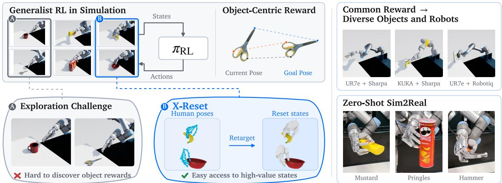
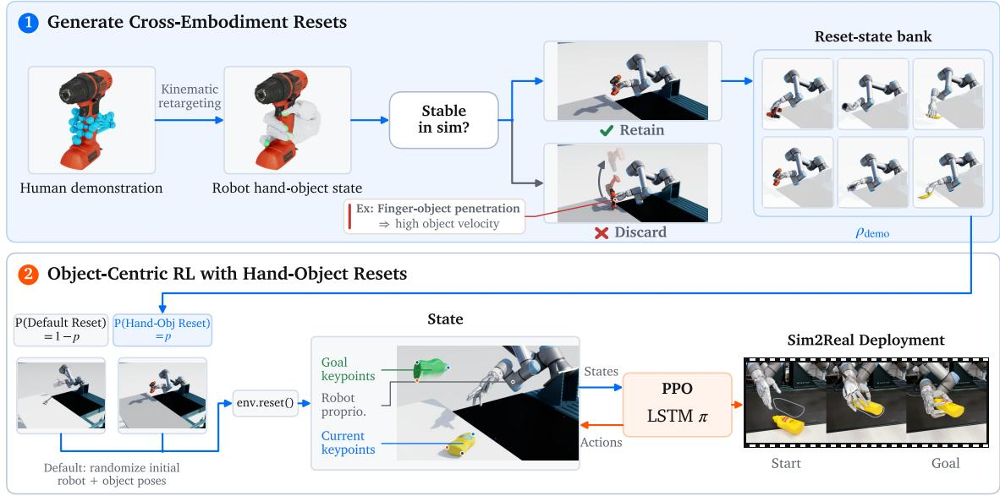
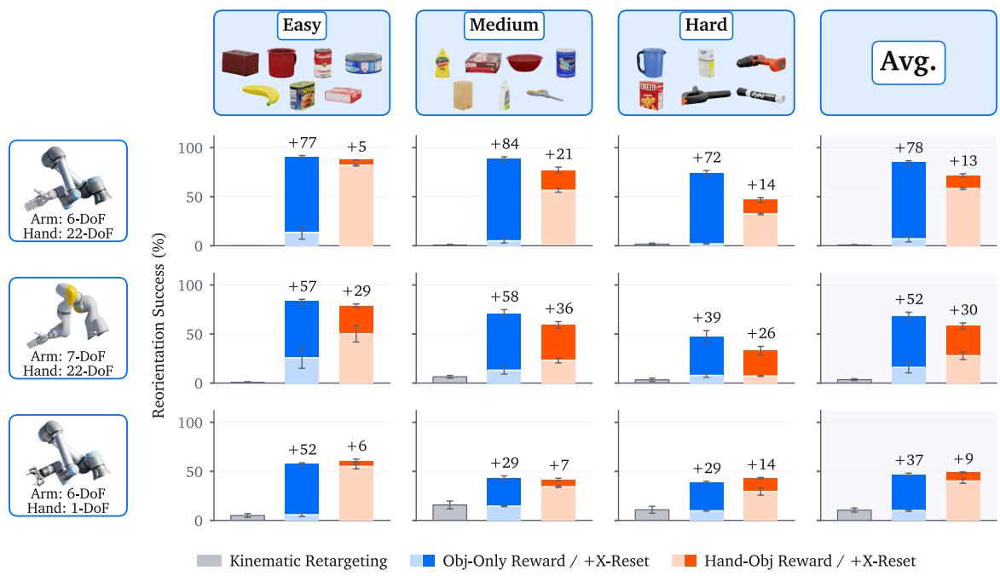
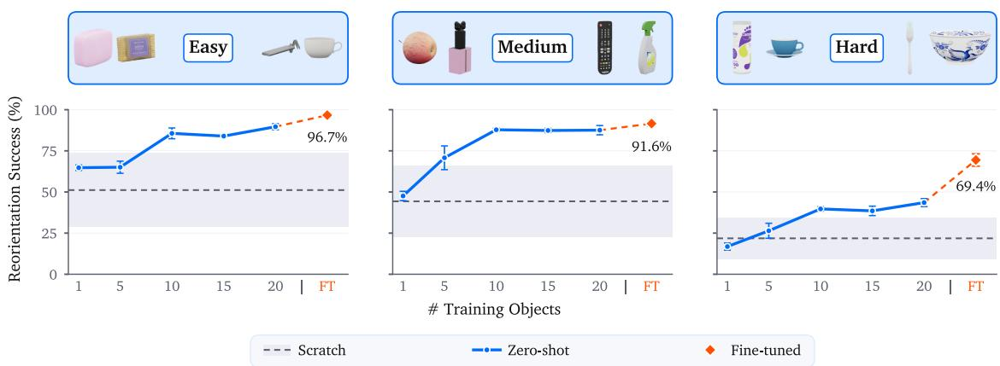
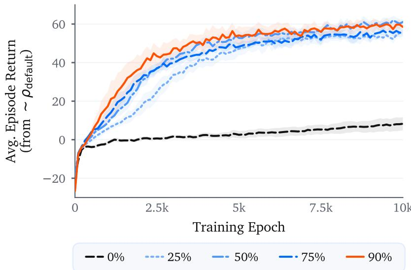
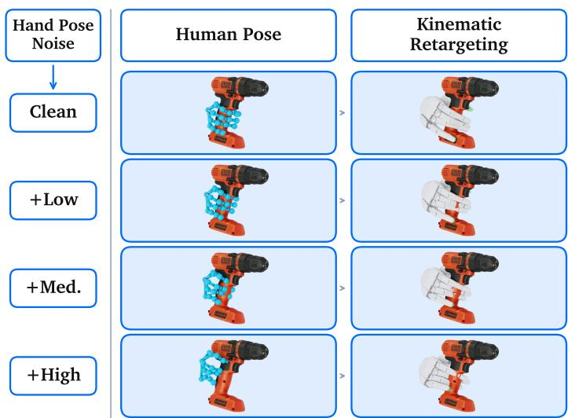
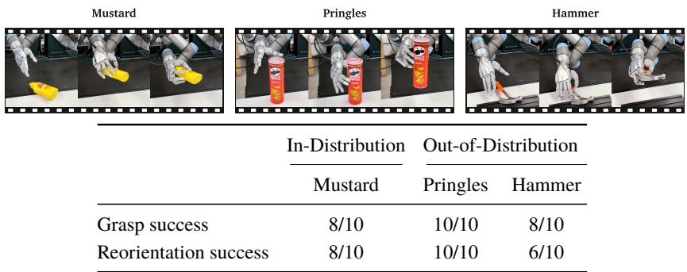

# X-Reset: Scaling Object-Centric Reinforcement Learning via Cross-Embodiment Resets

Prithwish Dan1, Chenyang Ma1,2,\*, Wei Zhan1,3,†

1Applied Intuition 2University of North Carolina at Chapel Hill 3University of California, Berkeley

\*Work done during internship at Applied Intuition. †Corresponding author: wei.zhan@applied.co

Project Website: https://xreset-applied.github.io/

## Abstract

Reinforcement learning (RL) in simulation can train dexterous manipulation policies without robot demonstrations, but training a single generalist policy with task-agnostic rewards faces a severe exploration problem: approaching, grasping, and reorienting diverse objects with many degrees of freedom is dificult to discover from scratch. Prior works make exploration tractable with high-quality robot demonstrations, per-task reward shaping, or by restricting policies to narrow modes of behavior. We propose X-RESET, a framework that instead resolves exploration with human hand-object demonstrations. Rather than imitating or tracking retargeted human motion, X-RESET kinematically retargets hand-object states to noisy robot states, filters out states that are unstable in simulation, and samples the remainder as resets during RL training with general-purpose objectcentric rewards. The resulting policy depends only on object state and goal, with demonstrations entering training through the reset distribution. We show that X-RESET trains generalist policies on 20 objects across three embodiments—a 22-DoF hand on two diferent arms and a parallel-jaw gripper—and resolves the exploration challenges of RL from scratch. X-RESET scales with the number of training objects, generalizes to unseen objects, can learn from imperfect hand-pose estimates, and transfers behaviors zero-shot from sim-toreal.

## CONTENTS

Abstract 1   
Contents 2   
1 Introduction 3   
2 Related Work 4   
3 Problem Formulation 5   
4 Approach 5   
4.1 Generating Reset States from Human Hand-Object Demonstrations 6   
4.2 Supplementing Object-Centric Reinforcement Learning with Simulation Resets 6   
5 Experiments 7   
5.1 Cross-Embodiment Resets 8   
5.2 Scaling and Generalization 8   
5.3 Reset Distribution 9   
5.4 Real-World Capabilities 9   
6 Discussion and Limitations 11   
References 11   
A Implementation and Evaluation Details 15   
A.1 Data and Representation 15   
A.2 Retargeting, Filtering, and Resets 15   
A.3 Rewards 15   
A.4 Policy and Training 16   
A.5 Evaluation 17   
A.6 Ofline Hand-Pose Noise 17

## 1 Introduction

The predominant recipe for training robot manipulation policies is imitation learning (IL), in which robot data is used as supervision to learn a mapping from observations to actions [3, 8]. Scaling such approaches to general-purpose models faces the fundamental bottleneck of requiring large-scale datasets of high-quality expert demonstrations [30]. Despite a multitude of collection systems [1, 5, 9, 17, 20, 51, 54, 56], teleoperation remains most expensive precisely where dexterity matters most: multi-fingered hands with many degrees of freedom (DoF). Reinforcement learning (RL) in simulation ofers an alternative that requires no robot demonstrations, and has produced dexterous skills that transfer to the real world [6, 16, 36].

However, RL faces a large exploration burden when learning to approach, grasp, and reorient objects with many DoF from scratch, and prior works make the problem tractable with per-task scafolding or restricted behavior. Demonstration-led curricula [2, 49] and favorable reset distributions [55] reduce this burden but require high-quality robot demonstrations or hand-designed per-task states. Recent works that train generalist object-centric RL controllers instead mitigate exploration by learning only narrow modes of behavior, such as operating only on tool handles [21] or strictly learning top-down power grasps via reward shaping [23]. We instead aim to train a single generalist policy to learn these skills on a diverse set of objects with a task-agnostic reward.

Human videos, which are abundant and encompass a diverse range of day-to-day hand-object interactions [4, 10, 18], are a natural source of guidance for this exploration problem. Many works use human data directly for imitation by kinematically retargeting hand motion to robot actions [26, 27, 40], but retargeting is only a rough estimate of robot motion and often fails to obey the true contact dynamics of robot-object interaction. Works that use RL to bridge the embodiment gap either transfer human object motion to train single-task policies [7, 11, 32] or use retargeted motion as a reference for RL [14, 29, 34, 57], often relying on high-quality MoCap data and restricting learned behaviors to specifically demonstrated strategies. Our key insight is that kinematically retargeted human handobject states can supplement RL with task-agnostic rewards by ofering a natural reset distribution of statesfrom which robots can easily explore and access success signals during training. Resetting to reference states is standard practice in humanoid motion tracking [33, 38], where the policy is conditioned on and rewarded for following the reference. For general-purpose manipulation, direct reference-tracking is under-specified under important randomizations such as novel goal poses and external forces that may knock objects into unseen states [31]; our policy instead depends only on object state and goal, and demonstrations enter training only through resets.

We propose X-RESET, a framework to train dexterous manipulation policies by defining reset distributions over human hand-object states during RL training (Fig. 1). X-RESET kinematically retargets hand-object trajectories to the target embodiment, filters out states that are unstable in simulation, and randomly resets to the retained states while training object-centric RL to approach, grasp, and reorient objects. These resets allow quicker access to success signals that are otherwise dificult to discover from scratch. Our contributions are summarized as follows:

(1) We propose X-RESET, a framework that makes task-agnostic object-centric RL tractable for dexterous manipulation by framing human hand-object states as a reset distribution to remedy the exploration problem.

(2) We show that X-RESET trains generalist RL policies on 20 DexYCB [4] objects with task-agnostic rewards. Across three embodiments—a five-fingered hand on two diferent arms and a paralleljaw gripper—average reorientation success increases from 11.0% to 66.6% with object-only rewards, and from 42.1% to 59.6% with hand-object rewards.

(3) We show that X-RESET scales with the number of training objects, generalizes zero-shot to unseen objects, and serves as a base policy for fine-tuning on novel objects without additional human demonstrations. X-RESET is also robust to ofline hand-pose estimation errors at training time, and learned behaviors transfer zero-shot from simulation to the real world for a 22-DoF hand mounted on a 6-DoF arm on both seen and unseen objects.

  
Fig. 1. Overview of X-RESET. We introduce X-RESET, a simple recipe to pair generalist object-centric RL in simulation with kinematically retargeted human hand-object states as resets. Learning to approach, grasp, and reorient objects from scratch results in a challenging exploration problem, while X-RESET directly exposes policies to high-value states from which exploration is easy. With a common reward formulation, we train generalist policies for diverse robot embodiments and demonstrate sim-to-real transfer.

## 2 Related Work

Dexterous Manipulation with RL. RL in simulation has produced dexterous skills that transfer to the real world [6, 16, 36], but exploration is a major bottleneck when training high-DoF hands from scratch. Demonstration-based initialization and curricula reduce this burden [2, 12, 49] but need highquality robot data; OmniReset [55] instead trains single-task policies from manually specified reset distributions for parallel-jaw grippers. Generalist controllers also exploit structured priors: [21, 31] target handle-like tools using a shared grasp-region representation and reports that PPO alone is insuficient for exploration, while [23] combines object-keypoint rewards with finger-curl shaping and learns only top-down power grasps. X-RESET retains a generic object-centric reward and instead addresses exploration through the reset distribution, sourced from diverse human data rather than expensive robot data, and can learn behaviors on diverse objects ranging from scissors to bowls to powerdrills.

Reference State Initialization. Reference state initialization is standard in motion tracking for humanoids [33, 38] where the training objective explicitly rewards reference-following. Works in manipulation [29, 53] use kinematic imitation rewards to shape exploration and reference-following, relying on MoCap data for accurate hand-object pose and contact estimation [29, 34, 53]. Referencetracking for contact-rich manipulation faces diversity challenges, since there is no natural hand-object reference to imitate under important randomizations [31] such as novel goal poses or external forces which may knock objects over. Instead, our approach does not require tracking the reference at every step; it injects noisy retargeted resets to supplement object-centric RL training of policies which simply consume current object state and goal.

Learning from Human Hand-Object Data. Human videos ofer a scalable source of objectinteraction priors [4, 13, 18], but lack the action labels needed for standard IL. To bridge this, prior work maps human motion to robot actions through kinematic retargeting [28, 40, 41, 46], narrows the visual gap by overlaying rendered robot arms on human frames [25–27] or unifying both into a shared keypoint representation [15, 37, 42], or decouples video-derived planning from low-level control [28, 47, 50]. These methods assume retargeted hand motions can be directly imitated on the robot, but this often fails due to embodiment mismatch and the true contact dynamics of robotobject interaction [11], and they typically require co-training with substantial robot data to recover. Human-guided RL instead uses residual actions or motion/contact references [14, 29, 34, 53, 57], or guides learning through object trajectories and hand-derived initialization [7, 11, 32], typically producing single-task policies. X-RESET uses human data neither as an imitation target nor as a per-task reference, but as a reset distribution for a single generalist policy.

  
Fig. 2. X-RESET Pipeline. (Top) First, we kinematically retarget human hand-object states to noisy robot states. Then, we spawn states into simulation and retain a bank of stable states. (Bottom) During RL training, we randomly sample diverse resets leveraging the retargeted states, and train an RL policy which consumes object keypoints at inference time and can be deployed in the real world.

## 3 Problem Formulation

We focus on the problem of learning the core dexterous manipulation skills—approaching, grasping, and reorienting objects to goal poses—via object-centric RL in simulation, with reset states from diverse human demonstrations. For a given object �, a human hand-object trajectory $\xi ^ { \eta } = \{ ( h _ { t } , s _ { t } ) \} _ { t = 1 } ^ { T }$ consists of � densely tracked timesteps of MANO [43] hand poses where $\boldsymbol { h } _ { t } \in \mathbb { R } ^ { K \times 3 }$ represents the 3D position of each of the � = 21 hand keypoints and $s _ { t } \in S \mathbb { E } ( 3 )$ represents the position and rotation of the object at timestep �. We define the goal pose $g = s _ { T }$ as the last object pose from the human demonstration. In practice, we represent object poses by sampling $Z = 6 4$ keypoints on the object surface to enable a richer geometric representation: $s _ { t } ^ { \mathrm { k p } } , g ^ { \mathrm { k p } } \in \mathbb { R } ^ { Z \times 3 }$ . We denote a dataset of � human hand-object trajectories $\mathcal { D } ^ { \eta } = \{ \bar { \xi _ { i } ^ { \eta } } \} _ { i = 1 } ^ { N }$ , and construct a dataset of many objects $\begin{array} { r } { \mathcal { D } = \bigcup _ { \eta } \mathcal { D } ^ { \eta } } \end{array}$ We learn a policy to produce actions $\mathbf { a } _ { t } = \pi _ { \phi } ( q _ { t } , s _ { t } ^ { \mathrm { k p } } , g ^ { \mathrm { k p } } , m _ { t } )$ given robot proprioception $q _ { t }$ , object keypoints $s _ { t } ^ { \mathrm { k p } }$ , goal keypoints $g ^ { \mathrm { k p } }$ , and LSTM state $m _ { t }$ encoding the interaction history; $\phi$ denotes the learned policy parameters.

## 4 Approach

We propose X-RESET, which consists of two primary stages: (1) generating robot reset states from human hand-object poses; (2) training RL policies in simulation with object-centric rewards by incorporating random resets to demonstrated states to remedy the exploration problem.

## 4.1 Generating Reset States from Human Hand-Object Demonstrations

We first generate reset states for the robot from human demonstrations (Fig. 2, Top). Such states must consist of (a) joint configurations for the robot, and (b) the 6D object pose and goal, so that they can be spawned into simulation [35].

Hand-Object Data Processing. We employ an optimization-based kinematic retargeting pipeline (using PyRoki [22]) to estimate robot joint angles corresponding to each frame of the human demonstration. We first convert human hand pose $\boldsymbol { h } _ { t } \in \mathbb { R } ^ { K \times 3 }$ to robot hand joint angles $\theta _ { t } ^ { \mathrm { h a n d } }$ using approximate fingertip and wrist keypoint targets following prior work [34]. Then, we perform collision-aware inverse kinematics (using cuRobo [48]) to solve for the remaining arm joints $\theta _ { t } ^ { \mathrm { a r m } }$ by tracking the wrist over time while keeping the hand poses fixed to finally obtain $\theta _ { t } \in \mathbb { R } ^ { J }$ where � is the number of joints in the target embodiment. This process allows us to generate a dataset of � hand-object pairs for the robot $\mathcal { D } _ { \mathrm { r o b o t } } = \{ ( \theta _ { l } , s _ { l } ) \} _ { l = 1 } ^ { L }$

Filtering Unstable Resets. In practice, kinematic retargeting from human to robot hand can result in unrealistic states depending on the embodiment gap. To avoid sampling unstable simulation resets, we perform ofline filtering to mark and discard hand-object states which are undesirable. These may be a byproduct of (i) failure to find robotjoint configurations withinjoint limits or (ii) instability when spawned in simulation (e.g., due to hand-object penetration).

## 4.2 Supplementing Object-Centric Reinforcement Learning with Simulation Resets

Next, we perform RL training with generic object-centric reward functions to train robots to manipulate objects to goal poses (Fig. 2, Bottom). Key to our approach is the use of simulation resets: over the course of training, we occasionally reset to hand-object states generated in Section 4.1. By exposing the policy to diverse resets that lie in high-value regions, success signals from later stages of manipulation propagate and help avoid the collapse to local optima often faced by naive exploration from scratch.

Object-Centric Reward Function. We adopt a standard object-centric reward function for training RL policies which is common across all objects and robot policies:

$$
\begin{array} { r l } & { r _ { t } = r _ { \mathrm { p r o x } } ( q _ { t } , s _ { t } ^ { \mathrm { k p } } ) + \mathbb { 1 } _ { \mathrm { p r o x } } r _ { \mathrm { r e o r i e n t } } ( s _ { t } ^ { \mathrm { k p } } , g ^ { \mathrm { k p } } ) } \\ & { ~ + \mathbb { 1 } _ { \mathrm { p r o x } } r _ { \mathrm { s u c c e s s } } ( s _ { t } ^ { \mathrm { k p } } , g ^ { \mathrm { k p } } ) + r _ { \mathrm { s m o o t h } } ( \mathbf { a } _ { t } ) + r _ { \mathrm { s a f e t y } } } \end{array}\tag{1}
$$

The proximity reward $r _ { \mathrm { p r o x } }$ encourages the robot hand to approach the object, while the reorientation reward $r _ { \mathrm { r e o r i e n t } }$ drives the object toward its goal pose. $r _ { \mathrm { s u c c e s s } }$ provides an additional bonus for achieving the goal pose within an � threshold, and $r _ { \mathrm { s m o o t h } }$ encourages smooth and small actions. Finally, $r _ { \mathrm { s a f e t y } }$ penalizes terminal failures such as the object leaving the workspace or sustained contact between the robot and the table.

In practice, there are various metrics to measure the distance between the current object pose $s _ { t }$ and goal pose $g$ in order to compute $r _ { \mathrm { r e o r i e n t } }$ . Based on prior work [21, 23], we compute the mean distance between corresponding keypoints:

$$
d _ { \mathrm { k p } } ( s _ { t } ^ { \mathrm { k p } } , g ^ { \mathrm { k p } } ) = \frac { 1 } { Z } \sum _ { z = 1 } ^ { Z } \left. s _ { t , z } ^ { \mathrm { k p } } - g _ { z } ^ { \mathrm { k p } } \right. _ { 2 } , \qquad r _ { \mathrm { r e o r i e n t } } \propto - d _ { \mathrm { k p } }\tag{2}
$$

This distance jointly captures diferences in object position and orientation.

Resetting to Hand-Object States. At initialization, each environment is assigned an object and a demonstration for that object. We define the default reset distribution of the robot and object as $\rho _ { \mathrm { d e f a u l t } }$ (including randomizations in start and goal poses), and $\rho _ { \mathrm { d e m o } }$ as a uniform distribution over the retained frames of its assigned demonstration, using the corresponding retargeted hand-object states from $\mathcal { D } _ { \mathrm { r o b o t } }$ . At train time, we sample resets from $\rho _ { \mathrm { d e f a u l t } }$ with probability 1 − � and sample from $\rho _ { \mathrm { d e m o } }$ with probability $\textstyle { p . }$ This reset scheme helps expose the policy $\pi _ { \phi }$ to a diverse set of states in simulation which lie along noisy robot trajectories and can enable discovery of success signals otherwise inaccessible via naive exploration from �default.

  
Fig. 3. X-RESET Supplements RL Training. We report reorientation success at � =2 cm on 20 DexYCB objects (7 Easy, 7 Medium, 6 Hard). Evaluation uses 20 demonstrated start/goal pairs per object. Pale bars show RL baselines trained from scratch; saturated caps add the X-RESET gain (� = 0.9), with gain labels in percentage points. Avg. weights all objects equally. X-RESET improves both reward formulations across embodiments and object groups, with the best recipe being low-bias object-only rewards seeded with X-RESET for exploration on average. Error bars show 3-seed RL training SE.

Policy Details. We train our policy using PPO [45]. Our policy consumes the current and goal object keypoints and robot proprioception. The LSTM architecture consumes the interaction history and enables adaptive behaviors. We also leverage an asymmetric critic [39] that has access to additional privileged information to further stabilize training. We apply standard domain randomization and object/robot perturbations inspired by prior work [21, 31]. The policy can be deployed directly in the real world using vision foundation models to track object pose (see Section 5.4).

## 5 Experiments

Experimental Setup. We evaluate three embodiments: a 22-DoF Sharpa right hand on a 6-DoF UR7e arm, the same hand on a 7-DoF KUKA iiwa 14 arm, and a 1-DoF Robotiq 2F-85 parallel-jaw gripper on a UR7e arm. We train a separate generalist policy for each embodiment. We use handobject trajectories from DexYCB [4] and IsaacSim [35] for physics simulation. Unless otherwise specified, each policy is jointly trained on 20 objects with 20 right-handed demonstrations per object, and X-RESET uses � = 0.9 as the probability of sampling hand-object resets from $\rho _ { \mathrm { d e m o } }$ . We train every simulation condition with three seeds.

Evaluation Metrics. In simulation, our primary task metric is Reorientation Success (%), which measures whether the object reaches its goal pose within a keypoint error of $\epsilon = 2$ cm under the distance metric $d _ { \mathrm { k p } }$ in Section 4.2. We additionally measure Avg. Episode Return from $\rho _ { \mathrm { d e f a u l t } }$ to compare training dynamics across policies on a common state distribution. Simulation results report means over three seeds, with standard errors shown in the figures. We aim to answer the following questions:

(1) Cross-Embodiment Resets: Does X-RESET resolve the exploration problem faced by objectcentric RL from scratch, and how does it compare against baselines on functionally retargeting human demonstrations?

(2) Scaling and Generalization: What are X-RESET’s scaling and generalization properties when manipulating unseen objects without human demonstrations?

(3) Reset Distribution: How does the probability of sampling hand-object states afect training behavior?

(4) Real-World Capabilities: Can X-RESET learn from noisy ofline hand tracking and transfer behaviors from sim-to-real under object-tracking noise?

## 5.1 Cross-Embodiment Resets

We evaluate whether X-RESET’s hand-object resets make object-centric RL tractable across embodiments. This comparison uses the demonstrated object start/goal pairs from DexYCB (20 per object). We compare against direct kinematic playback and two dominant reward-family baselines.

• Kinematic Retargeting: Used as the foundational backbone for prior works that perform Imitation Learning (IL) from human hand actions [15, 27, 42], this baseline defines a kinematic mapping between 3D MANO hand positions [43] and robot joints. Robot arm and hand joint angles are then solved for via Inverse Kinematics (IK) (Section 4.1), and rolled out open-loop.

• Obj-Only Reward: The generic object-keypoint reward of Section 4.2, following the task-agnostic formulation of generalist controllers [21, 23]. �reorient drives the object toward its goal and $r _ { \mathrm { p r o x } }$ encourages the hand to approach the object surface.

• Hand-Obj Reward: Adds hand guidance inspired by reference-tracking works [29, 34, 53]. It shapes $r _ { \mathrm { p r o x } }$ to encourage robot fingertips to lie near the human fingertips at the demonstrated goal pose, and remains well-defined under perturbed object states by anchoring relative to the object itself.

We group the 20 objects into 7 Easy, 7 Medium, and 6 Hard objects based on learnability for baselines, trending from simple to complex geometries (Fig. 3). Kinematic Retargeting struggles to establish stable grasps due to the human-robot embodiment gap, with an average reorientation success of only 4.9% across the three embodiments. Obj-Only Reward struggles with naive exploration, reaching 15.0% average success on Easy objects and 11.0% overall. Hand-Obj Reward benefits from hand-guided shaping and reaches 42.1% average success overall.

Applying X-RESET to both reward structures improves performance across all three embodiments (Fig. 3). Averaged over objects and embodiments, reorientation success increases from 11.0% to 66.6% for Obj-Only Reward and from 42.1% to 59.6% for Hand-Obj Reward. Obj-Only Reward+X-RESET achieves a higher success rate despite the lower starting performance of its from-scratch baseline. These results support the general recipe: X-RESET to seed exploration, and Obj-Only Rewards with minimal bias and high freedom to explore robust embodiment-specific strategies instead of explicitly rewarding closeness to the human demos.

## 5.2 Scaling and Generalization

We evaluate Obj-Only Reward+X-RESET’s ability to transfer to unseen objects as we vary the number of training objects. We train UR7e+Sharpa policies on a range of 1-20 DexYCB objects and evaluate zero-shot reorientation on a fixed set of 12 objects from EBench [19], with four objects per dificulty category (Fig. 4). We evaluate each object over 400 trials with varying start/goal conditions.

  
Fig. 4. Scaling and Generalization. We report reorientation success at $\epsilon = 2 { \mathrm { c m } }$ on 12 EBench objects. Scratch baseline trains on the EBench roster for its full 10k epochs. Blue connected markers show zeroshot transfer after 10k epochs of X-RESET pretraining on 1–20 DexYCB objects, outperforming training from scratch on EBench with as little as 10 DexYCB training objects. Orange diamonds (FT) show 5k epochs of 20-object X-RESET pretraining followed by 5k epochs of EBench fine-tuning, showing X-RESET is a strong pre-training foundation. Error bars show 3-seed RL training SE.

Increasing training diversity improves transfer overall: on Easy objects, which share more familiar geometries with the training data, success starts high and rises from 64.8% to 89.6%. On Hard objects, including a very large bowl and a thin fork, we improve from 16.8% to 43.5%.

We also study X-RESET’s adaptability under a matched 10k-epoch budget: 5k epochs of DexYCB pretraining followed by 5k EBench epochs (Fine-tuned), versus 10k EBench epochs from random initialization (Scratch). Both policies train on the same 12 EBench objects. Because the assets have no corresponding human demonstrations, both EBench training segments use default resets $\left( \boldsymbol { p } = \boldsymbol { 0 } \right)$ Fine-tuning reaches 85.9% average reorientation success, compared to just 39.1% from scratch. X-RESET therefore also serves as an initialization for adapting to novel objects without new human demonstrations.

## 5.3 Reset Distribution

We ablate Obj-Only Reward+X-RESET’s training behavior on UR7e+Sharpa as we vary ${ \boldsymbol { p } } ,$ the probability of sampling resets from $\rho _ { \mathrm { d e m o } } \left( \mathrm { F i g . } 5 \right)$ . We analyze Avg. Episode Return from $\rho _ { \mathrm { d e f a u l t } }$ to fairly compare all policies. Early in training, higher sampling rates of hand-object states accelerate learning. As training converges, X-RESET policies reach returns between 55.45 and 61.09, all substantially outperforming the 0% condition at 8.28. The benefit therefore holds over a broad range of sampling probabilities, rather than depending on $p = 0 . 9$ specifically.

## 5.4 Real-World Capabilities

Learning from Noisy Hand Poses. Since DexYCB estimates hand and object pose from privileged multi-view cameras, we inject varying levels of noise into the hand poses to test whether policies still learn from imperfect ofline data. We add random wrist noise that translates the whole hand, plus per-keypoint finger noise. We perturb the same clean hand poses at each noise level, then apply kinematic retargeting and the instability filtering in Section 4.1. Fig. 6 shows the noisy human poses, corresponding robot configurations, and Avg. Episode Return for UR7e+Sharpa with Obj-Only Reward. Compared to a return of 58.53 with clean poses, the noisy conditions reach 51.46–56.07, again well above the 8.28 obtained from exploration without demonstration resets. The High-noise condition also has a 2.45× higher reset rejection rate than Clean (6.82% to 16.71%), which may explain some of the degradation in performance. Still, a generic object-centric reward is useful here: noisy hand estimates enter training only through resets, whereas in reference-tracking methods [29, 34, 53] the same noise would corrupt the imitation target itself.

Fig. 5. Impact of Demo-Reset Probability. We measure Avg. Episode Return from $\rho _ { \mathrm { d e f a u l t } }$ at train-time for UR7e+Sharpa with Obj-Only Reward. Higher demo-reset probability accelerates early learning, with all X-RESET policies converging in a similar band. Curves show 3-seed means and shaded bands show ±1 SE.  

<table><tr><td>0% 一</td><td></td><td> $8 . 2 8 \pm 3 . 4 0$ </td></tr><tr><td>90%</td><td>Clean</td><td> $5 8 . 5 3 \pm 0 . 9 3$ </td></tr><tr><td>90%</td><td>Low</td><td> $5 6 . 0 7 \pm 4 . 5 7$ </td></tr><tr><td>90%</td><td>Medium</td><td> $5 1 . 4 6 \pm 1 . 1 2$ </td></tr><tr><td>90%</td><td>High</td><td> $5 3 . 2 9 \pm 2 . 5 8$ </td></tr></table>

Fig. 6. Learning from Noisy Hand Poses. (Top) We visualize retargeted Sharpa hand-object states under varying levels of noise. (Bottom) Avg. episode return from $\rho _ { \mathrm { d e f a u l t } }$ of X-RESET trained with noisy hand poses.

  
Fig. 7. Sim-to-Real Evaluation. (Top) UR7e+Sharpa filmstrips show each object manipulated to goal poses in the air. (Bottom) Grasp and reorientation successes out of 10 physical trials per object for Obj-Only Reward+X-RESET.

Sim-to-Real Transfer. The actor uses robot proprioception and object-centric observations available through a vision pipeline, while the asymmetric critic receives additional simulation information. We reconstruct object meshes with SAM 3D [44], track poses with FoundationPose [52], and sample surface keypoints. We deploy the UR7e+Sharpa policy on seen (Mustard ∈ DexYCB) and unseen (Pringles, Hammer ∉ DexYCB) on a range of start and goal poses. The policy successfully transfers behaviors to the real hardware; the table in Fig. 7 reports the per-object results. Qualitatively, the policy also shows recovery behavior and robustness to perturbation, for example sliding fingers underneath the Mustard when it is slipping (Fig. 7, Top Left). The primary observed failure mode is object-pose estimation error, motivating future visual or visuo-tactile policy distillation.

## 6 Discussion and Limitations

We present X-RESET, which trains generalist dexterous manipulation policies by using retargeted human hand-object states as a reset distribution for object-centric RL. Resets make task-agnostic rewards tractable where exploration from scratch fails, and the resulting policies scale with training objects, tolerate noisy hand tracking, and transfer zero-shot to hardware.

Limitations. Consuming object pose makes the policy inherit tracking noise; visual [11, 55] or visuo-tactile distillation [24] is a natural remedy, and can be combined with high-level planners to execute long-horizon as a sequence of goal-reaching subtasks [21, 23]. We also have yet to scale to large egocentric datasets [10, 18], which would require real-to-sim pipelines that extract hand-object states from video for rigid, articulated, and deformable objects.

## References

[1] Sridhar Pandian Arunachalam, Irmak Guzey, Soumith Chintala, and Lerrel Pinto. 2023. Holo-Dex: Teaching Dexterity with Immersive Mixed Reality. In IEEE International Conference on Robotics and Automation (ICRA). https://arxiv.org/abs/2210.06463

[2] Maria Bauza, Jose Enrique Chen, Valentin Dalibard, Nimrod Gileadi, Roland Hafner, Murilo F. Martins, Joss Moore, Rugile Pevceviciute, Antoine Laurens, Dushyant Rao, Martina Zambelli, Martin Riedmiller, Jon Scholz, Konstanti nos Bousmalis, Francesco Nori, and Nicolas Heess. 2025. DemoStart: Demonstration-Led Auto-Curriculum Applied to Sim-to-Real with Multi-Fingered Robots. In IEEE International Conference on Robotics and Automation (ICRA). https://arxiv.org/abs/2409.06613

[3] Kevin Black, Noah Brown, James Darpinian, Karan Dhabalia, Danny Driess, Adnan Esmail, Michael Robert Equi, Chelsea Finn, Niccolo Fusai, Manuel Y. Galliker, Dibya Ghosh, Lachy Groom, Karol Hausman, Brian Ichter, Szymon Jakubczak, Tim Jones, Liyiming Ke, Devin LeBlanc, Sergey Levine, Adrian Li-Bell, Mohith Mothukuri, Suraj Nair, Karl Pertsch, Allen Z. Ren, Lucy Xiaoyang Shi, Laura Smith, Jost Tobias Springenberg, Kyle Stachowicz, James Tanner, Quan Vuong, Homer Walke, Anna Walling, Haohuan Wang, Lili Yu, and Ury Zhilinsky. 2025. � : A Vision-Language-Action Model with Open-World Generalization. In Proceedings of The 9th Conference on Robot

Learning (Proceedings of Machine Learning Research, Vol. 305). PMLR, 17–40. https://proceedings.mlr.press/ v305/black25a.html

[4] Yu-Wei Chao, Wei Yang, Yu Xiang, Pavlo Molchanov, Ankur Handa, Jonathan Tremblay, Yashraj S. Narang, Karl Van Wyk, Umar Iqbal, Stan Birchfield, Jan Kautz, and Dieter Fox. 2021. DexYCB: A Benchmark for Capturing Hand Grasping of Objects. In IEEE/CVF Conference on Computer Vision and Pattern Recognition (CVPR). https: //arxiv.org/abs/2104.04631

[5] Claire Chen, Zhongchun Yu, Hojung Choi, Mark Cutkosky, and Jeannette Bohg. 2025. DexForce: Extracting Force-Informed Actions from Kinesthetic Demonstrations for Dexterous Manipulation. arXiv preprint arXiv:2501.10356 (2025). https://arxiv.org/abs/2501.10356

[6] Tao Chen, Megha Tippur, Siyang Wu, Vikash Kumar, Edward Adelson, and Pulkit Agrawal. 2023. Visual Dexterity: In-Hand Reorientation of Novel and Complex Object Shapes. Science Robotics 8, 84 (2023), eadc9244. https: //arxiv.org/abs/2211.11744

[7] Yuanpei Chen, Chen Wang, Yaodong Yang, and C. Karen Liu. 2024. Object-Centric Dexterous Manipulation from Human Motion Data. arXiv preprint arXiv:2411.04005 (2024). https://arxiv.org/abs/2411.04005

[8] Cheng Chi, Siyuan Feng, Yilun Du, Zhenjia Xu, Eric Cousineau, Benjamin Burchfiel, and Shuran Song. 2023. Diffusion Policy: Visuomotor Policy Learning via Action Difusion. In Proceedings ofRobotics: Science and Systems (RSS). https://arxiv.org/abs/2303.04137

[9] Cheng Chi, Zhenjia Xu, Chuer Pan, Eric Cousineau, Benjamin Burchfiel, Siyuan Feng, Russ Tedrake, and Shuran Song. 2024. Universal Manipulation Interface: In-The-Wild Robot Teaching Without In-The-Wild Robots. In Pro ceedings ofRobotics: Science and Systems (RSS). https://arxiv.org/abs/2402.10329

[10] Dima Damen, Hazel Doughty, Giovanni Maria Farinella, Antonino Furnari, Evangelos Kazakos, Jian Ma, Davide Moltisanti, Jonathan Munro, Toby Perrett, Will Price, and Michael Wray. 2022. Rescaling Egocentric Vision: Collection, Pipeline and Challenges for EPIC-KITCHENS-100. International Journal of Computer Vision (2022). https://link.springer.com/article/10.1007/s11263-021-01531-2

[11] Prithwish Dan, Kushal Kedia, Angela Chao, Edward Duan, Maximus Adrian Pace, Wei-Chiu Ma, and Sanjiban Choudhury. 2025. X-Sim: Cross-Embodiment Learning via Real-to-Sim-to-Real. In Proceedings of The 9th Conference on Robot Learning (Proceedings of Machine Learning Research, Vol. 305). PMLR, 816–833. https: //proceedings.mlr.press/v305/dan25a.html

[12] Carlos Florensa, David Held, Markus Wulfmeier, Michael Zhang, and Pieter Abbeel. 2017. Reverse Curriculum Generation for Reinforcement Learning. In Conference on Robot Learning (CoRL). https://arxiv.org/abs/1707.05300

[13] Kristen Grauman, Andrew Westbury, Eugene Byrne, Zachary Chavis, Antonino Furnari, Rohit Girdhar, Jackson Hamburger, Hao Jiang, Miao Liu, Xingyu Liu, et al. 2022. Ego4D: Around the World in 3,000 Hours of Egocentric Video. In IEEE/CVF Conference on Computer Vision and Pattern Recognition (CVPR). https://arxiv.org/abs/2110. 07058

[14] Irmak Guzey, Yinlong Dai, Georgy Savva, Raunaq Bhirangi, and Lerrel Pinto. 2024. Bridging the Human to Robot Dexterity Gap through Object-Oriented Rewards. arXiv preprint arXiv:2410.23289 (2024). https://arxiv.org/abs/ 2410.23289

[15] Siddhant Haldar and Lerrel Pinto. 2025. Point Policy: Unifying Observations and Actions with Key Points for Robot Manipulation. arXiv preprint arXiv:2502.20391 (2025). https://arxiv.org/abs/2502.20391

[16] Ankur Handa, Arthur Allshire, Viktor Makoviychuk, Aleksei Petrenko, Ritvik Singh, Jingzhou Liu, Denys Makovi ichuk, Karl Van Wyk, Alexander Zhurkevich, Balakumar Sundaralingam, Yashraj S. Narang, Jean-Francois Lafleche, Dieter Fox, and Gavriel State. 2023. DeXtreme: Transfer of Agile In-Hand Manipulation from Simulation to Real ity. In IEEE International Conference on Robotics and Automation (ICRA). 5977–5984. https://arxiv.org/abs/2210. 13702

[17] Ankur Handa, Karl Van Wyk, Wei Yang, Jacky Liang, Yu-Wei Chao, Qian Wan, Stan Birchfield, Nathan Ratlif, and Dieter Fox. 2020. DexPilot: Vision-Based Teleoperation of Dexterous Robotic Hand-Arm System. In IEEE International Conference on Robotics and Automation (ICRA). 9164–9170. https://ieeexplore.ieee.org/document/ 9197124

[18] Ryan Hoque, Peide Huang, David J. Yoon, Mouli Sivapurapu, and Jian Zhang. 2025. EgoDex: Learning Dexterous Manipulation from Large-Scale Egocentric Video. arXiv preprint arXiv:2505.11709 (2025). https://arxiv.org/abs/ 2505.11709

[19] InternRobotics. 2026. EBench-Assets. Hugging Face dataset. https://huggingface.co/datasets/InternRobotics/ EBench-Assets

[20] Aadhithya Iyer, Zhuoran Peng, Yinlong Dai, Irmak Guzey, Siddhant Haldar, Soumith Chintala, and Lerrel Pinto. 2024. OPEN TEACH: A Versatile Teleoperation System for Robotic Manipulation. arXivpreprint arXiv:2403.07870 (2024). https://arxiv.org/abs/2403.07870

[21] Kushal Kedia, Tyler Ga Wei Lum, Jeannette Bohg, and C. Karen Liu. 2026. SimToolReal: An Object-Centric Policy for Zero-Shot Dexterous Tool Manipulation. arXiv preprint arXiv:2602.16863 (2026). https://arxiv.org/abs/2602. 16863

[22] Chung Min Kim, Brent Yi, Hongsuk Choi, Yi Ma, Ken Goldberg, and Angjoo Kanazawa. 2025. PyRoki: A Modular Toolkit for Robot Kinematic Optimization. arXiv preprint arXiv:2505.03728 (2025). https://arxiv.org/abs/2505. 03728

[23] Yuxuan Kuang, Sungjae Park, Katerina Fragkiadaki, and Shubham Tulsiani. 2026. Dex4D: Task-Agnostic Point Track Policy for Sim-to-Real Dexterous Manipulation. arXiv preprint arXiv:2602.15828 (2026). https://arxiv.org/ abs/2602.15828

[24] Jayjun Lee, Jessica Yin, Asif Rana, Nicholas Blauch, Sam Mady, Mohak Bhardwaj, Nima Fazeli, Nathan Ratlif, Karl Van Wyk, and Ankur Handa. 2026. ADEPT: Accelerating Dexterity via Pre-Training and Post-Training using Reinforcement Learning. arXiv preprint arXiv:2608.19182 (2026).

[25] Marion Lepert, Ria Doshi, and Jeannette Bohg. 2024. SHADOW: Leveraging Segmentation Masks for Cross-Embodiment Policy Transfer. In Conference on Robot Learning (CoRL). https://shadow-cross-embodiment.github. io/static/shadow24.pdf

[26] Marion Lepert, Jiaying Fang, and Jeannette Bohg. 2025. PHANTOM: Training Robots Without Robots Using Only Human Videos. In Conference on Robot Learning (CoRL). https://arxiv.org/abs/2503.00779

[27] Marion Lepert, Jiaying Fang, and Jeannette Bohg. 2026. Masquerade: Learning from In-the-Wild Human Videos using Data-Editing. In IEEE International Conference on Robotics and Automation (ICRA). https://arxiv.org/abs 2508.09976

[28] Jinhan Li, Yifeng Zhu, Yuqi Xie, Zhenyu Jiang, Mingyo Seo, Georgios Pavlakos, and Yuke Zhu. 2024. OKAMI: Teaching Humanoid Robots Manipulation Skills through Single Video Imitation. In Conference on Robot Learning (CoRL). https://arxiv.org/abs/2410.11792

[29] Kailin Li, Puhao Li, Tengyu Liu, Yuyang Li, and Siyuan Huang. 2025. ManipTrans: Eficient Dexterous Bimanual Manipulation Transfer via Residual Learning. In IEEE/CVF Conference on Computer Vision and Pattern Recognition (CVPR). https://arxiv.org/abs/2503.21860

[30] Fanqi Lin, Yingdong Hu, Pingyue Sheng, Chuan Wen, Jiacheng You, and Yang Gao. 2024. Data Scaling Laws in Imitation Learning for Robotic Manipulation. arXiv preprint arXiv:2410.18647 (2024). https://arxiv.org/abs/2410. 18647

[31] Tyler Ga Wei Lum, Kushal Kedia, C Karen Liu, and Jeannette Bohg. 2026. Play2Perfect: What Matters in Dexterous Play Pretraining for Precise Assembly? arXiv preprint arXiv:2606.26428 (2026).

[32] Tyler Ga Wei Lum, Olivia Y. Lee, C. Karen Liu, and Jeannette Bohg. 2025. Crossing the Human-Robot Embodiment Gap with Sim-to-Real RL using One Human Demonstration. In Proceedings ofThe 9th Conference on Robot Learning (Proceedings ofMachine Learning Research, Vol. 305). PMLR, 4418–4441. https://proceedings.mlr.press/v305/ lum25a.html

[33] Zhengyi Luo, Jinkun Cao, Alexander Winkler, Kris Kitani, and Weipeng Xu. 2023. Perpetual Humanoid Control for Real-time Simulated Avatars. In IEEE/CVF International Conference on Computer Vision (ICCV). https://arxiv. org/abs/2305.06456

[34] Zhao Mandi, Yifan Hou, Dieter Fox, Yashraj Narang, Ajay Mandlekar, and Shuran Song. 2025. DexMachina: Functional Retargeting for Bimanual Dexterous Manipulation. arXiv preprint arXiv:2505.24853 (2025). https: //arxiv.org/abs/2505.24853

[35] NVIDIA. 2026. NVIDIA Isaac Sim. NVIDIA Developer webpage. https://developer.nvidia.com/isaac/sim/

[36] OpenAI, Ilge Akkaya, Marcin Andrychowicz, Maciek Chociej, Mateusz Litwin, Bob McGrew, Arthur Petron, Alex Paino, Matthias Plappert, Glenn Powell, Raphael Ribas, Jonas Schneider, Nikolas Tezak, Jerry Tworek, Peter Welinder, Lilian Weng, Qiming Yuan, Wojciech Zaremba, and Lei Zhang. 2019. Solving Rubik’s Cube with a Robot Hand. arXiv preprint arXiv:1910.07113 (2019). https://arxiv.org/abs/1910.07113

[37] Maximus A. Pace, Prithwish Dan, Chuanruo Ning, Atiksh Bhardwaj, Audrey Du, Edward W. Duan, Wei-Chiu Ma, and Kushal Kedia. 2025. X-Difusion: Training Difusion Policies on Cross-Embodiment Human Demonstrations. arXiv preprint arXiv:2511.04671 (2025). https://arxiv.org/abs/2511.04671

[38] Xue Bin Peng, Pieter Abbeel, Sergey Levine, and Michiel van de Panne. 2018. DeepMimic: Example-Guided Deep Reinforcement Learning of Physics-Based Character Skills. ACM Transactions on Graphics 37, 4 (2018). https: //arxiv.org/abs/1804.02717

[39] Lerrel Pinto, Marcin Andrychowicz, Peter Welinder, Wojciech Zaremba, and Pieter Abbeel. 2018. Asymmetric Actor Critic for Image-Based Robot Learning. In Robotics: Science and Systems (RSS). https://arxiv.org/abs/1710.06542

[40] Yuzhe Qin, Yueh-Hua Wu, Shaowei Liu, Hanwen Jiang, Ruihan Yang, Yang Fu, and Xiaolong Wang. 2022. DexMV: Imitation Learning for Dexterous Manipulation from Human Videos. In European Conference on Computer Vision (ECCV). https://arxiv.org/abs/2108.05877

[41] Ri-Zhao Qiu, Shiqi Yang, Xuxin Cheng, Chaitanya Chawla, Jialong Li, Tairan He, Ge Yan, David J. Yoon, Ryan Hoque, Lars Paulsen, et al. 2025. Humanoid Policy ∼ Human Policy. arXiv preprint arXiv:2503.13441 (2025). https://arxiv.org/abs/2503.13441

[42] Juntao Ren, Priya Sundaresan, Dorsa Sadigh, Sanjiban Choudhury, and Jeannette Bohg. 2025. Motion Tracks: A Unified Representation for Human-Robot Transfer in Few-Shot Imitation Learning. arXiv preprint arXiv:2501.06994 (2025). https://arxiv.org/abs/2501.06994

[43] Javier Romero, Dimitrios Tzionas, and Michael J. Black. 2017. Embodied Hands: Modeling and Capturing Hands and Bodies Together. ACM Transactions on Graphics 36, 6 (2017). https://arxiv.org/abs/2201.02610

[44] SAM 3D Team, Xingyu Chen, Fu-Jen Chu, Pierre Gleize, Kevin J Liang, Alexander Sax, Hao Tang, Weiyao Wang, Michelle Guo, Thibaut Hardin, Xiang Li, Aohan Lin, Jiawei Liu, Ziqi Ma, Anushka Sagar, Bowen Song, Xiaodong Wang, Jianing Yang, Bowen Zhang, Piotr Dollár, Georgia Gkioxari, Matt Feiszli, and Jitendra Malik. 2025. SAM 3D: 3Dfy Anything in Images. arXiv preprint arXiv:2511.16624 (2025). arXiv:2511.16624 [cs.CV] https://arxiv. org/abs/2511.16624

[45] John Schulman, Filip Wolski, Prafulla Dhariwal, Alec Radford, and Oleg Klimov. 2017. Proximal Policy Optimization Algorithms. arXiv preprint arXiv:1707.06347 (2017). https://arxiv.org/abs/1707.06347

[46] Kenneth Shaw, Shikhar Bahl, and Deepak Pathak. 2022. VideoDex: Learning Dexterity from Internet Videos. In Conference on Robot Learning (CoRL). https://arxiv.org/abs/2212.04498

[47] Junyao Shi, Zhuolun Zhao, Tianyou Wang, Ian Pedroza, Amy Luo, Jie Wang, Jason Ma, and Dinesh Jayaraman. 2025. ZeroMimic: Distilling Robotic Manipulation Skills from Web Videos. In IEEE International Conference on Robotics and Automation (ICRA). https://arxiv.org/abs/2503.23877

[48] Balakumar Sundaralingam, Siva Kumar Sastry Hari, Adam Fishman, Caelan Garrett, Karl Van Wyk, Valts Blukis, Alexander Millane, Helen Oleynikova, Ankur Handa, Fabio Ramos, et al. 2023. cuRobo: Parallelized Collision-Free Minimum-Jerk Robot Motion Generation. arXiv preprint arXiv:2310.17274 (2023). https://arxiv.org/abs/2310. 17274

[49] Stone Tao, Arth Shukla, Tse-kai Chan, and Hao Su. 2024. Reverse Forward Curriculum Learning for Extreme Sample and Demo Eficiency. In International Conference on Learning Representations (ICLR). https://openreview. net/forum?id=Q90uzFLjDc

[50] Chen Wang, Linxi Fan, Jiankai Sun, Ruohan Zhang, Li Fei-Fei, Danfei Xu, Yuke Zhu, and Anima Anandkumar. 2023. MimicPlay: Long-Horizon Imitation Learning by Watching Human Play. In Conference on Robot Learning (CoRL). https://arxiv.org/abs/2302.12422

[51] Chen Wang, Haochen Shi, Weizhuo Wang, Ruohan Zhang, Li Fei-Fei, and C. Karen Liu. 2024. DexCap: Scalable and Portable Mocap Data Collection System for Dexterous Manipulation. arXiv preprint arXiv:2403.07788 (2024). https://arxiv.org/abs/2403.07788

[52] Bowen Wen, Wei Yang, Jan Kautz, and Stan Birchfield. 2024. FoundationPose: Unified 6D Pose Estimation and Tracking of Novel Objects. In Proceedings ofthe IEEE/CVF Conference on Computer Vision and Pattern Recogni tion. https://nvlabs.github.io/FoundationPose

[53] Sirui Xu, Yu-Wei Chao, Liuyu Bian, Arsalan Mousavian, Yu-Xiong Wang, Liang-Yan Gui, and Wei Yang. 2025. Dexplore: Scalable Neural Control for Dexterous Manipulation from Reference-Scoped Exploration. In Conference on Robot Learning (CoRL). https://arxiv.org/abs/2509.0967

[54] Shiqi Yang, Minghuan Liu, Yuzhe Qin, Runyu Ding, Jialong Li, Xuxin Cheng, Ruihan Yang, Sha Yi, and Xiaolong Wang. 2024. ACE: A Cross-Platform Visual-Exoskeletons System for Low-Cost Dexterous Teleoperation. In Conference on Robot Learning (CoRL). https://arxiv.org/abs/2408.11805

[55] Patrick Yin, Tyler Westenbroek, Zhengyu Zhang, Joshua Tran, Ignacio Dagnino, Eeshani Shilamkar, Numfor Mbiziwo-Tiapo, Simran Bagaria, Xinlei Liu, Galen Mullins, Andrey Kolobov, and Abhishek Gupta. 2026. Emer gent Dexterity via Diverse Resets and Large-Scale Reinforcement Learning. In International Conference on Learning Representations (ICLR). https://arxiv.org/abs/2603.15789

[56] Tony Z. Zhao, Vikash Kumar, Sergey Levine, and Chelsea Finn. 2023. Learning Fine-Grained Bimanual Manipulation with Low-Cost Hardware. In Proceedings of Robotics: Science and Systems (RSS). https://arxiv.org/abs/2304. 13705

[57] Xinghao Zhu, Zixi Liu, Shalin Jain, Chenran Li, Milad Noori, Michael Andres Lin, Huihua Zhao, John Welsh, Mrinal Verghese, Wei Liu, Tingwu Wang, Xingye Da, Zhengyi Luo, Vishal Kulkarni, Naema Bhatti, Yuke Zhu, Linxi Fan, Bowen Wen, Danfei Xu, Soha Pouya, and Yan Chang. 2026. Learning Dexterous Manipulation Using Contact Wrench Guidance From Human Demonstration. arXiv:2607.00033 [cs.RO] https://arxiv.org/abs/2607.00033

## A Implementation and Evaluation Details

## A.1 Data and Representation

DexYCB [4, 43] supplies synchronized MANO keypoints, object poses, and meshes. A common table-aligned transform maps each demonstration’s hand and object into simulation; robot-base transforms map wrist targets into arm coordinates. We sample 64 ordered object-local surface points $u _ { z }$ (collision surfaces for DexYCB; visual surfaces for EBench):

$$
\begin{array} { r l r } & { } & { s _ { t , z } ^ { \mathrm { k p } } = R _ { t } u _ { z } + p _ { t } , \qquad g _ { z } ^ { \mathrm { k p } } = R _ { g } u _ { z } + p _ { g } , } \\ & { } & { f _ { t , z } = [ s _ { t , z } ^ { \mathrm { k p } } , \ { g } _ { z } ^ { \mathrm { k p } } , \ { g } _ { z } ^ { \mathrm { k p } } - s _ { t , z } ^ { \mathrm { k p } } ] \in \mathbb { R } ^ { 9 } . } \end{array}\tag{A1}
$$

Point indices define current/goal correspondence. The actor receives these paired features; its LSTM supplies temporal context.

## A.2 Retargeting, Filtering, and Resets

• Retargeting: PyRoki jointly optimizes Sharpa hand joints and root poses over each sequence. Robotiq uses an analytical hand-to-gripper mapping. cuRobo solves collision-aware arm IK with the hand fixed, including the robot and table/workstation geometry and a home-to-first-target approach segment.

• Contact objective: squared residuals $e _ { t , j } = 5 m _ { t , j } [ | c _ { t , j } - x _ { t , j } | - 0 . 0 1 ] _ { + }$ , with componentwise deadband in meters and validity mask $m _ { t , j }$ . Other residual multipliers are listed below.

• Filtering: we hold IK-valid configurations at their initial joint targets with gravity disabled, and reject states that terminate, produce non-finite measurements, or violate the thresholds below. Final gates test the last sample; peak gates test the entire window. Both Sharpa embodiments share settings.

• Sampling: each environment retains an assigned object/demo. With probability ${ \boldsymbol { p } } ,$ sample uniformly among its retained frames and use that frame’s robot/object state with the demonstration’s terminal object goal. Otherwise use the home robot configuration and demonstrated object start. Human-derived training uses $p = 0 . 9$ unless ablated; synthetic EBench training uses $ { p } = 0$

Table A1. Retargeting and reset-filter settings.
<table><tr><td>Retargeting parameter</td><td>Value</td></tr><tr><td>Local / global alignment multiplier</td><td>10/1</td></tr><tr><td>Joint / root-translation smoothness</td><td>2/2</td></tr><tr><td>Joint-limit / rest-pose multiplier</td><td>100 / 0.2</td></tr><tr><td>Arm IK seeds</td><td>64</td></tr><tr><td>Wrist position / rotation tolerance</td><td>5 mm / 0.05 rad</td></tr><tr><td>Reset-filter parameter</td><td>Sharpa / Robotiq</td></tr><tr><td>Hold-target steps (30 Hz)</td><td>24 / 120</td></tr><tr><td>Final object linear speed (m/s)</td><td>0.5 / 0.5</td></tr><tr><td>Final object angular speed (rad/s)</td><td>15 / 15</td></tr><tr><td>Final maximum joint speed (rad/s)</td><td>10 / 10</td></tr><tr><td>Peak object linear speed (m/s)</td><td>Off / 1.0</td></tr><tr><td>Peak gripper-joint speed (rad/s)</td><td>Off / 2.0</td></tr></table>

## A.3 Rewards

We adopt several reward terms from [23]. Let $d = d _ { \mathrm { k p } } ( s _ { t } ^ { \mathrm { k p } } , g ^ { \mathrm { k p } } )$ , � be the sum of fingertip distances to the nearest object surface keypoints, and � the analogous palm distance (all in meters). The

object-only reward terms are

$$
\begin{array} { r l } & { r _ { \mathrm { p r o x } } = - 2 . 5 \operatorname* { m i n } ( P , 3 ) - 2 . 5 \operatorname* { m i n } ( M , 0 . 5 ) , } \\ & { \qquad G = 1 \{ P \le 0 . 6 ~ \land ~ M \le 0 . 2 \} , } \\ & { r _ { \mathrm { r e o r i e n t } } = 3 ( 1 . 4 - 3 d ) , } \\ & { r _ { \mathrm { s u c c e s s } } = \displaystyle \frac { 1 5 } { 1 + 1 0 d } \mathbb { 1 } \{ d \le 0 . 0 2 \} . } \end{array}\tag{A2}
$$

The geometric gate $G = \mathbb { 1 } _ { \mathrm { p r o x } }$ multiplies the two goal terms. For clipped actions $\bar { \mathbf { a } } _ { t } \in [ - 1 , 1 ] ^ { n _ { a } }$ and $\Delta \bar { \mathbf { a } } _ { t } = \bar { \mathbf { a } } _ { t } - \bar { \mathbf { a } } _ { t - 1 }$

$$
\begin{array} { r l } & { r _ { \mathrm { s m o o t h } } = \mathrm { \ - } 0 . 0 0 5 \| \bar { \mathbf { a } } _ { t } \| _ { 2 } ^ { 2 } - 0 . 0 5 \| \Delta \bar { \mathbf { a } } _ { t } ^ { \mathrm { a r m } } \| _ { 2 } ^ { 2 } } \\ & { ~ - \ 0 . 0 0 5 \| \Delta \bar { \mathbf { a } } _ { t } ^ { \mathrm { h a n d } } \| _ { 2 } ^ { 2 } . } \end{array}\tag{A3}
$$

Safety penalties are −500 each for an out-of-bounds object and terminal robot–environment contact (any configured arm/hand sensor above 5 N for 0.5 s). No dense contact penalty is used. The environment multiplies weighted rewards by $\Delta t = 1 / 3 0 \mathrm { s } ;$ PPO additionally scales rewards by 0.01, unlike the reported environment return.

Hand-object variant. Object-local fingertip targets �� come from the last valid IK frame and follow the current object pose, $\tilde { c } _ { t , f } = R _ { t } c _ { f } + p _ { t }$ . Replace $r _ { \mathrm { p r o x } }$ by −2.5 min $( \sum _ { f } \| x _ { t , f } - \tilde { c } _ { t , f } \| _ { 2 } , 3 )$ and � by a mean fingertip-to-target distance threshold of 0.05 m. Other terms are unchanged; targets specify a grasp region, not a time-indexed trajectory.

## A.4 Policy and Training

The actor observes joint positions, controller targets, fingertip-to-object geometry, and paired point features. The critic additionally observes clean geometry, joint/object velocities, goal error, closestfingertip information, contacts, reward state, and perturbations. UR7e+Sharpa has 648 pre-encoder observations and 28 actions; dimensions vary by embodiment.

Table A2. Architecture and PPO. Batch quantities are per GPU rank.
<table><tr><td>Setting</td><td>Value</td></tr><tr><td>PointNet MLP / pooling</td><td>9→ 64→128→ 128 /max</td></tr><tr><td>Actor LSTM / ELU MLP</td><td>1 layer, 512 units, layer norm / [512, 256, 128]</td></tr><tr><td>Critic LSTM / ELU MLP</td><td>512 units / [512, 512, 256]</td></tr><tr><td>Action head</td><td>Gaussian; state-independent log std.</td></tr><tr><td>Implementation</td><td>RL Games PPO</td></tr><tr><td>Discount / GAE / PPO clip</td><td>0.99 / 0.95 / 0.2</td></tr><tr><td>Learning rate / KL target</td><td>10−3 adaptive / 0.01</td></tr><tr><td>Entropy / value / bounds loss</td><td> $0 / 4 / 1 0 ^ { - 4 }$ </td></tr><tr><td>Reward scale / gradient cap</td><td>0.01 / 1.0</td></tr><tr><td>Rollout / recurrent length</td><td>32/32</td></tr><tr><td>Mini-epochs / minibatch</td><td>5 / 32,768</td></tr><tr><td>Environments / transitions per update</td><td>8,192 / 262,144</td></tr><tr><td>Input / value / advantage normalization</td><td>Enabled</td></tr><tr><td>Observation history / episode limit</td><td>1 / 12 s</td></tr><tr><td>Physics / policy frequency</td><td>120 / 30 Hz</td></tr></table>

Control. Actions increment persistent joint-position targets. UR7e arm increment/velocity-limit scales are 0.0125/0.2; Sharpa uses increment scale 1/24, 90% joint ranges, and efort scale 0.75. Other embodiments use their own controllers/output heads.

Budgets. Each seed (42/52/62) trains on a single GPU. Reported checkpoints are at 10k epochs. Finetuning uses 5k DexYCB + 5k EBench epochs; scratch uses 10k EBench epochs, matched within each seed.

Table A3. Training randomization.
<table><tr><td>Quantity</td><td>Range / setting</td></tr><tr><td>Default object XY / yaw</td><td> $\pm 0 . 1 0 \mathrm { m } / \pm 2 5 ^ { \circ }$ </td></tr><tr><td>Default arm / hand joint noise</td><td> $\sigma = 0 . 0 7 5 / 0 . 1 0 \mathrm { r a d }$ </td></tr><tr><td>Default goal XY / yaw / Z</td><td> $\pm 0 . 0 3 \mathrm { m } / \sim \pm 3 0 ^ { \circ } / \pm 0 . 0 5 \mathrm { m }$ </td></tr><tr><td>Object/table friction</td><td>[0.2, 1.3]; 250 buckets</td></tr><tr><td>Restitution</td><td>[0,0.3]</td></tr><tr><td>Object / robot mass scale</td><td>[0.7, 1.3] / [0.9, 1.1]</td></tr><tr><td>Object center-of-mass offset</td><td>±1 cm</td></tr><tr><td>Gain / extra arm damping scale</td><td>Log-uniform [0.7, 1.3] / [0.8, 1.2]</td></tr><tr><td>Actuator friction/armature/effort scale</td><td>[0.7,1.3]</td></tr><tr><td>Sharpa elastomer / metal friction</td><td>[0.4, 1.2] / 0.1</td></tr><tr><td>Arm / hand transport delay</td><td>0–6 / 0–16 physics steps</td></tr><tr><td>Perception / proprioception delay</td><td>0–6 / 0–1 policy steps</td></tr><tr><td>Pose translation / rotation noise</td><td>±5 mm / ±3.75° per correlated and uncorrelated compo- nent</td></tr></table>

Disturbances. While the proximity gate is active, random-direction object forces satisfy $\| F \| \ \leq$ 150� N (mass � in kg); arm pushes are bounded by 600 N. Spin impulses use $| \Delta \omega | \le 3 0 \mathrm { r a d / s } ,$ converted to torque using inertia and the physics timestep. Per-environment event probabilities are log-uniform in [0.001, 0.1].

## A.5 Evaluation

Success is 1{min� $d _ { \mathrm { k p } } ( s _ { t } ^ { \mathrm { k p } } , g ^ { \mathrm { k p } } ) \leq 0 . 0 2 \mathrm { m } \}$ over the rollout, independent of the reward gate and including initially near-goal cases. Episode returns use default resets. Simulation plots show mean ± SE over three training seeds, with ${ \mathrm { S E } } = { \mathrm { s t d } } ( \mu _ { 1 } , \mu _ { 2 } , \mu _ { 3 } ) / { \sqrt { 3 } }$ (sample std.). Object averages are computed within each seed before aggregation.

Table A4. Evaluation protocols and cohorts.
<table><tr><td>Study</td><td>Protocol</td></tr><tr><td>DexYCB</td><td>20 objects × 20 demonstrated start/goal pairs; 400 pairs per embodiment. Easy/Medium/Hard: 7/7/6; objects weighted equally.</td></tr><tr><td>EBench</td><td>12 objects (4 per difficulty), used for both fine-tuning/scratch training and evalua-</td></tr><tr><td>Goal families</td><td>tion. Zero-shot policies exclude EBench training. Lift, 60° yaw, 60° x-tilt, 60° y-tilt; 20 pairs each.</td></tr><tr><td>Trials</td><td>80 pairs × 5 deterministic draws = 400/object; 4,800/policy/seed, 14,400 across seeds.</td></tr><tr><td>Start offsets</td><td>XY ±0.02 m; yaw ±25°; seed base 42.</td></tr><tr><td>Goal offsets</td><td>XY ±0.03 m; yaw ~ ±30°; Z ±0.05 m; seed base 71.</td></tr><tr><td>Physical</td><td>10 attempts/object; grasp and reorientation counts use all attempts (Fig. 7).</td></tr></table>

EBench Easy: two diferent soaps, bookmark, mug; Medium: apple, perfume, remote, detergent; Hard: can, mug, fork, bowl. Evaluation perturbation seeds are distinct from training seeds.

## A.6 Offline Hand-Pose Noise

Before retargeting/filtering, translate the whole hand by one uniformly sampled wrist ofset per demonstration. Add palm-frame finger-keypoint noise with eight-frame correlation, $\begin{array} { r l } { e _ { t } } & { { } = } \end{array}$ $\rho e _ { t - 1 } + \sqrt { 1 - \rho ^ { 2 } } \sigma \varepsilon _ { t } , \rho ~ = ~ e ^ { - 1 / 8 } , \varepsilon _ { t } ~ \sim ~ \mathcal { N } ( 0 , I ) .$ , and $\begin{array} { r } { e _ { 0 } \ \sim \ \mathcal { N } ( 0 , \sigma ^ { 2 } I ) } \end{array}$ . Clip vector norms, rotate to world coordinates, and restore bone lengths; caps apply before restoration. Object poses and untracked sentinel frames remain unchanged. Matched episode seeds are used across tiers.

Table A5. Hand-pose noise (mm). Wrist bounds are per coordinate.
<table><tr><td>Tier</td><td>Wrist bound Finger σ Finger cap</td><td></td><td></td></tr><tr><td>Clean</td><td>0</td><td>0</td><td>0</td></tr><tr><td>Low</td><td>10</td><td>1.5</td><td>3</td></tr><tr><td>Medium</td><td>20</td><td>3</td><td>6</td></tr><tr><td>High</td><td>40</td><td>6</td><td>12</td></tr></table>

All tiers use the same retargeting/filter, object-only reward, $p = 0 . 9$ , and 10k-epoch budget; Clean reuses the clean-policy runs. The High tier rejects 2.45× as many resets as Clean; corruption changes both reset quality and retained-bank composition.