# XMATCH: ENHANCING COVARIATE-AWARE TIME SERIES FORECASTING THROUGH TREE-STRUCTURED EXOGENOUS MATCHING

Ziyang Zhang\*, Hanyin Cheng\*, Xiangfei Qiu, Yang ShuB, Bin Yang, Chenjuan Guo

East China Normal University

{zyzhang11,hycheng,xfqiu}@stu.ecnu.edu.cn {yshu,byang,cjguo}@dase.ecnu.edu.cn

## ABSTRACT

Future exogenous variables provide valuable information for forecasting endogenous time series. Existing covariate-aware methods primarily learn the direct influence of exogenous variables on endogenous variables. However, these effects can be complex and change with the pattern of the exogenous variables, making them difficult to capture. Beyond this perspective, we observe that a given exogenous pattern often co-occurs with only a small set of endogenous response patterns. These associations motivate a strategy that matches future and historical exogenous patterns and uses the corresponding endogenous patterns to enhance forecasting. However, in real-world forecasting scenarios with multiple exogenous variables, each exogenous variable provides a distinct dimension for matching, creating a dilemma for this strategy between precise matching and sufficient historical support. To bridge this gap, we propose XMatch (EXogenous MATCHing), a covariate-aware forecasting model that realizes the aforementioned strategy through a tree-structured matching process that adaptively adjusts the number of exogenous variables used as matching conditions. Specifically, we first introduce the ProtoTree Creator, which organizes historical correspondences between exogenous and endogenous patterns into a ProtoTree, whose deeper levels incorporate additional exogenous variables for matching. For forecasting, we then design the ProtoTree Matcher, which uses future exogenous variables to query the ProtoTree and adaptively determines how many exogenous variables to use for matching based on exogenous pattern similarity and historical support. Finally, the matched endogenous patterns are used as explicit historical evidence to enhance forecasting. Extensive experiments on 12 real-world datasets demonstrate that XMatch outperforms state-of-the-art baselines.

## 1 INTRODUCTION

Time series forecasting plays a vital role in a wide range of real-world applications, including finance (Sezer et al., 2020; Huang et al., 2022), transportation (Wu et al., 2024; Shao et al., 2025), healthcare (Wu et al., 2025a; Miao et al., 2021), energy (Wang et al., 2025a), and AIOps (Lin et al., 2024a; Pan et al., 2023). Beyond historical target observations, forecasting tasks often involve covariates that describe external factors related to the dynamics of the target series (Cheng et al., 2026e; Wang et al., 2024). In many real-world scenarios, future covariates are also available or can be estimated in advance using dedicated forecasting systems. For example, weather forecasts provide future temperature and precipitation conditions that are informative for traffic prediction (Li et al., 2026). Since these covariates cover the same future horizon as the prediction target, they describe how external factors, such as temperature and precipitation, are expected to evolve during the prediction horizon and can substantially improve forecasting accuracy (Wang et al., 2024; Zhou et al., 2025). Effectively exploiting such future covariate information is therefore important for practical forecasting (Das et al., 2023; Yang et al., 2026).

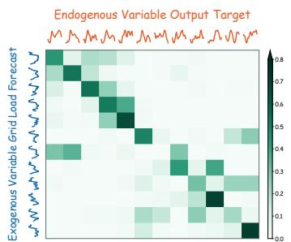  
(a) NP: Grid Load Forecast to Output Target

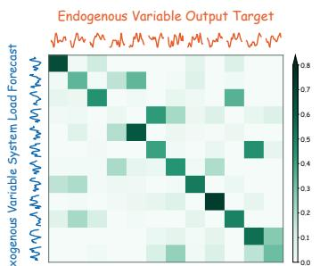  
(b) FR: System Load Forecast to Output Target

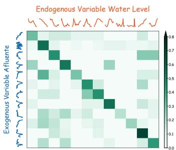  
(c) Rapel: Afluente to Water Level

Figure 1: Illustration of the frequency of co-occurrences between exogenous and endogenous patterns in real-world datasets. Rows denote exogenous patterns and columns denote endogenous response patterns, while darker cells indicate more co-occurrences. The darker cells in each row are often concentrated in a few columns, showing that a given exogenous pattern tends to co-occur with only a small set of endogenous patterns. We provide further evidence in Appendix B.3.

Existing covariate-aware models primarily learn the direct influence of exogenous variables on endogenous variables (Das et al., 2023; Wang et al., 2024; Zhou et al., 2025). However, these effects can be complex and change with the pattern of the exogenous variables, making them difficult to capture with a unified interaction mechanism. Beyond this conventional perspective, we observe a recurring correspondence between exogenous and endogenous patterns in real-world time series. As illustrated in Figure 1, a given exogenous pattern often co-occurs with only a small set of endogenous response patterns. This suggests that exogenous patterns carry informative signals about which endogenous response patterns are more likely to occur. Such recurring associations can thus provide a source of information for forecasting through direct pattern matching, reducing reliance on a unified interaction mechanism to capture complex exogenous effects. Therefore, in addition to learning exogenous-to-endogenous influence, forecasting models can further leverage historical endogenous responses associated with similar exogenous patterns as explicit evidence for prediction.

Motivated by this observation, we introduce a complementary forecasting perspective that explicitly captures recurring endogenous patterns under similar exogenous patterns. To enhance conventional covariate-aware forecasting, we identify recurring associations between exogenous patterns and their corresponding endogenous responses in historical data, and use these associations to augment prediction. We refer to this strategy as Exo–Endo Association Augmentation.

However, this strategy becomes challenging in real-world forecasting scenarios with multiple exogenous variables. This strategy faces a fundamental dilemma between precise matching and sufficient historical support. Each additional exogenous variable requires historical references to match the future exogenous patterns along another dimension. Matching on more variables yields more specific references, but fewer historical samples satisfy these matching requirements. As a result, the resulting endogenous-pattern evidence may be supported by too few samples to be reliable (Vandermeulen et al., 2024). In contrast, matching on fewer variables provides more historical references, but may overlook differences in the remaining variables that are relevant to endogenous prediction (Gao & Hastie, 2022; Yang & van Leeuwen, 2024). The key challenge is therefore to identify historical references that closely match the future exogenous patterns while retaining enough samples to support reliable prediction.

To bridge this gap, we propose XMatch (EXogenous MATCHing), a covariate-aware forecasting model that realizes the Exo–Endo Association Augmentation strategy through a tree-structured matching process that adaptively adjusts the number of exogenous variables used as matching conditions to address the aforementioned dilemma. Specifically, we first introduce the ProtoTree Creator to organize historical Exo–Endo associations into a tree-structured memory, where each deeper level adds one exogenous variable and thus represents a more specific condition with fewer supporting samples. For forecasting, we design the ProtoTree Matcher, which uses future exogenous variables to query the ProtoTree and adaptively determines the matching depth, assigning more weight to deeper matches only when they are sufficiently similar and well supported; otherwise, the weight remains at shallower, better-supported nodes. Finally, the matched endogenous patterns are aggregated and fused with the forecasting backbone’s representations to produce the forecast.

Our contributions are summarized as follows:

• We reveal recurring correspondences between exogenous and endogenous patterns in covariateaware forecasting and introduce a new perspective that uses endogenous patterns from historical references with similar exogenous patterns as explicit forecasting evidence.

• We propose XMatch, which adaptively adjusts the number of exogenous variables used in treestructured matching to balance precise matching and sufficient historical support for forecasting.

• We conduct extensive experiments on 12 real-world datasets with exogenous variables. The results show that XMatch outperforms state-of-the-art baselines.

## 2 RELATED WORK

## 2.1 TIME SERIES FORECASTING WITH EXOGENOUS VARIABLES

Time series forecasting with exogenous variables has long been studied in classical statistics, where ARIMAX (Williams, 2001) and SARIMAX (Vagropoulos et al., 2016) incorporate external factors through additional regression terms. Recent deep forecasting models provide more flexible mechanisms for covariate integration. NBEATSx (Olivares et al., 2023) introduces dedicated branches for exogenous inputs, while TiDE (Das et al., 2023) concatenates static and future covariates with endogenous features. CrossLinear (Zhou et al., 2025) captures cross-variable dependencies through cross-correlation embeddings and convolutions; TFT (Lim et al., 2021), TimeXer (Wang et al., 2024), and ExoTST (Tayal et al., 2024) employ variable selection or attention mechanisms to integrate exogenous information. More recent approaches further model richer dependencies: DAG (Qiu et al., 2026c) characterizes temporal and channel correlations, GCGNet (Li et al., 2026) aligns graph-structured correlations, and KITE (Cheng et al., 2026e) introduces knowledge-guided covariate conditioning for probabilistic forecasting. Existing methods primarily model exogenous effects through feature-level interactions, leaving cross-variable pattern correspondences implicit. In contrast, XMatch explicitly retrieves endogenous patterns from historical references with similar exogenous patterns, complementing conventional covariate integration with historical evidence.

## 2.2 RETRIEVAL-AUGMENTED TIME SERIES MODELING

Beyond encoding temporal dynamics solely in model parameters, a growing line of work introduces memory mechanisms to store and reuse features extracted from historical time series. Existing studies in this area mainly follow three directions. 1) Instance-level retrieval. RATD (Liu et al., 2024a) retrieves relevant sequences to guide diffusion-based forecasting, while RAFT (Han et al., 2025) augments predictors with the future continuations of similar historical inputs. TS-RAG (Ning et al., 2025) extends this idea to zero-shot forecasting with time series foundation models, and PFRP (Du et al., 2026) combines predictions retrieved from a global memory bank with those of a local forecaster. 2) Prototype-based memory. PUAD (Li et al., 2023) and H-PAD (Shen, 2025) compress recurring behavior into prototypical normal patterns for anomaly detection. 3) Parametric temporal memory. Other approaches encode historical regularities through learnable memory items (Song et al., 2023), multi-resolution attractor memory (Hu et al., 2024a), or compact temporal bases (Huang et al., 2025a). Despite demonstrating the value of explicit pattern reuse, these methods retrieve or summarize patterns from historical observations without explicitly organizing the correspondences between combinations of exogenous patterns and endogenous patterns. In contrast, XMatch organizes these correspondences in a prototype tree and adaptively adjusts the number of exogenous variables used for matching, balancing precise matching with sufficient historical support.

## 3 METHODOLOGY

In the context of covariate-aware time series forecasting, the historical endogenous time series $X ^ { \mathrm { e n d o } } \in \mathbb { R } ^ { N \times T }$ is accompanied by historical exogenous variables $X ^ { \mathrm { e x o } } \in \mathbb { R } ^ { \breve { D } \times T }$ and future exogenous variables $Y ^ { \mathrm { e x o } } \in \overset { \bullet } { \mathbb { R } } { \boldsymbol { D } } \times { \boldsymbol { F } }$ , where N is the number of endogenous variables, D is the number of exogenous variables, T is the number of historical time steps, and F is the forecasting horizon. XMatch further constructs a dataset-level ProtoTree $\mathcal { T } _ { \phi }$ from the training set to encode historical associations between exogenous and endogenous patterns. The objective is to forecast the future endogenous series $\hat { Y } ^ { \mathrm { e n d o } } \in \mathbb { R } ^ { N \times F }$ from the time-series inputs and $\mathcal { T } _ { \phi }$

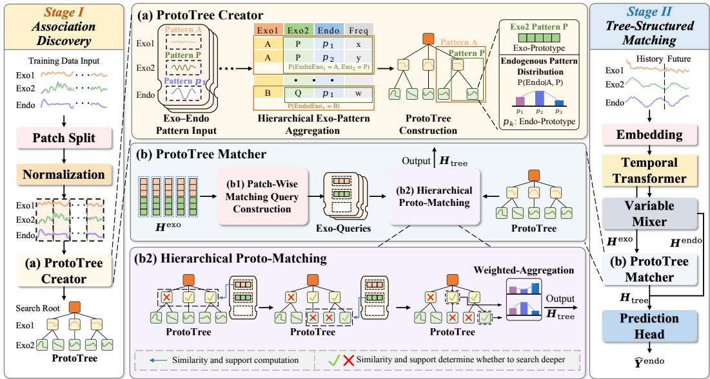  
Figure 2: The architecture of XMatch. (a) The ProtoTree Creator organizes correspondences between exogenous and endogenous patterns according to the descending discriminative power of exogenous variables. (b) The ProtoTree Matcher constructs matching queries from known future exogenous variables and uses Hierarchical Proto-Matching to match and aggregate endogenous response prototypes, thereby improving forecasting accuracy.

$$
\hat { Y } ^ { \mathrm { e n d o } } = \mathcal { F } _ { \boldsymbol { \theta } } \big ( X ^ { \mathrm { e n d o } } , X ^ { \mathrm { e x o } } , Y ^ { \mathrm { e x o } } ; \mathcal { T } _ { \boldsymbol { \phi } } \big ) .\tag{1}
$$

Here, $\mathcal { F } _ { \theta }$ is the forecaster parameterized by θ. Each endogenous variable has its own ProtoTree; we use one variable as an example below.

## 3.1 STRUCTURE OVERVIEW

Figure 2 illustrates XMatch, which leverages recurring correspondences between exogenous and endogenous patterns as explicit evidence to enhance forecasting under covariate scenarios, and organizes these associations in a hierarchical ProtoTree to address the dilemma between precise matching and sufficient historical support in multi-exogenous matching. Our training procedure consists of two stages. In Stage I: Association Discovery, we mine recurring correspondences between exogenous and endogenous patterns from the training set and organize them into a ProtoTree whose deeper nodes match patterns across more exogenous variables, while shallower nodes retain more historical samples to support matching when deeper nodes have too few samples. In Stage II: Tree-Structured Matching, we encode future exogenous variables as matching queries and perform adaptive matching over the ProtoTree. The matched response prototypes are then fused with the temporal representation to produce Yˆ endo. We detail the two stages below.

## 3.2 STAGE I: ASSOCIATION DISCOVERY

In this stage, we introduce the ProtoTree Creator to extract aligned local patterns from the training set, assign discrete pattern labels, and hierarchically aggregate the observed correspondences between exogenous and endogenous patterns into a ProtoTree. The resulting tree summarizes reusable association memory for the subsequent matching stage.

## 3.2.1 PROTOTREE CREATOR

As shown in Figure 2a, the ProtoTree Creator extracts aligned Exo–Endo patterns, organizes their associations by matching on increasing numbers of exogenous variables, and encodes them as node prototypes for subsequent matching.

Aligned Exo–Endo Pattern Input. To assign discrete pattern labels to the correspondences between exogenous and endogenous patterns observed in the training set, we first extract M aligned patches of length $P ,$ which may overlap, from each endogenous and exogenous variable in the training set and normalize every patch independently Nie et al. (2023):

$$
\widetilde { E } _ { j } = \mathrm { N o r m } ( \mathrm { P a t c h i f y } ( X _ { j } ^ { \mathrm { e x o } } ) ) , \quad \widetilde { S } _ { i } = \mathrm { N o r m } ( \mathrm { P a t c h i f y } ( X _ { i } ^ { \mathrm { e n d o } } ) ) ,\tag{2}
$$

where $\widetilde { E } _ { j } \in \mathbb { R } ^ { M \times P }$ and $\widetilde { S } _ { i } \in \mathbb { R } ^ { M \times P }$ denote the normalized patch sequences of the j-th exogenous variable and the i-th endogenous variable, respectively, with $\bar { \boldsymbol j } \in \{ 1 , \dots , D \}$ and $i \in \{ 1 , \ldots , \overline { { N } } \}$

To group patterns with similar shapes despite temporal shifts, we cluster the patterns of each variable independently using Soft-DTW (Cuturi $\dot { \& }$ Blondel, 2017), which replaces the hard minimum over temporal alignments with a differentiable soft minimum:

$$
\operatorname { s D T W } _ { \gamma } ( \pmb { x } , \pmb { c } ) = - \gamma \log \sum _ { \pmb { A } \in \pmb { A } } \exp \left( - \frac { \langle \pmb { A } , \pmb { \Delta } ( \pmb { x } , \pmb { c } ) \rangle } { \gamma } \right) ,\tag{3}
$$

where a patch is ${ \pmb x } \in \mathbb { R } ^ { P }$ , a cluster center is $\boldsymbol { c } \in \mathbb { R } ^ { P }$ , A is the set of valid alignments and $\pmb { \Delta }$ is the pairwise cost matrix. To accommodate variable-specific pattern diversity, we adopt a $D P .$ -meansstyle strategy (Kulis & Jordan, 2012) that adaptively determines the number of cluster centers for each variable. After convergence, for each variable $u ,$ each patch m is assigned a variable-specific pattern label $z _ { u , m } \in \{ 1 , . . . \ ' , K _ { u } \}$

Hierarchical Exogenous Pattern Aggregation. To balance precise matching with sufficient historical support, we construct a hierarchical matching tree, the ProtoTree, by first ordering exogenous variables according to their informativeness about endogenous patterns and then progressively combining their pattern labels across increasing numbers of variables.

First, we rank exogenous variables by information gain about endogenous patterns, measured as the reduction in Shannon entropy H Shannon (1948). Let $Z _ { i } ^ { \mathrm { e n d o } }$ and $\bar { Z } _ { j } ^ { \mathrm { e x o } }$ denote the discrete patternlabel variables obtained by clustering endogenous variable i and exogenous variable $j ,$ respectively. We compute the information gain as follows:

$$
I _ { i , j } = H ( Z _ { i } ^ { \mathrm { e n d o } } ) - H ( Z _ { i } ^ { \mathrm { e n d o } } \mid Z _ { j } ^ { \mathrm { e x o } } ) .\tag{4}
$$

For each endogenous variable i, we order exogenous variables by descending $I _ { i , j }$ from shallow to deep levels. Let l denote tree depth and $\pi _ { l }$ the exogenous variable index at that level.

Second, we combine the ordered labels into a tuple of exogenous pattern labels $\begin{array} { r l } { \eta _ { l , m } } & { { } = } \end{array}$ $\left( z _ { \pi _ { 1 } , m } ^ { \mathrm { e x o } } , \dots , z _ { \pi _ { l } , m } ^ { \mathrm { e x o } } \right)$ at tree level l for patch m. Each distinct label tuple defines a node v that stores all endogenous patterns from matching training patches. Normalizing their pattern-label counts yields $p _ { v } ( k )$ , the empirical probability of endogenous pattern k for this label tuple:

$$
p _ { v } ( \boldsymbol { k } ) = \frac { 1 } { | \mathcal { M } _ { v } | } \sum _ { m \in \mathcal { M } _ { v } } \mathbb { I } [ \boldsymbol { z } _ { i , m } ^ { \mathrm { e n d o } } = \boldsymbol { k } ] , \quad \boldsymbol { k } \in \{ 1 , \ldots , K _ { i } ^ { \mathrm { e n d o } } \} ,\tag{5}
$$

where $\mathcal { M } _ { v }$ contains the training patches whose exogenous pattern labels match the tuple represented by node $v ,$ and $z _ { i , m } ^ { \mathrm { e n d o } }$ is the pattern label of endogenous variable i at patch m. This hierarchy preserves one-to-many Exo–Endo associations, retaining more historical samples at shallow levels and matching on more exogenous variables at deeper levels.

ProtoTree Construction. Each node v at level l represents a tuple of exogenous pattern labels $\pmb { \eta } _ { l , m }$ encoded by the tree path leading to it. To support prototype matching, we use an MLP to project the exogenous pattern center $\pmb { c } _ { \pi _ { l } , z _ { v } } ^ { \mathrm { e x o } } \in \mathbb { R } ^ { P }$ associated with its current-level label $z _ { v } = z _ { \pi _ { l , m } } ^ { \mathrm { e x o } }$ into a learnable prototype key $\pmb { k } _ { v } ~ \in ~ \mathbb { R } ^ { d }$ . We use another MLP to map the endogenous pattern centers $c _ { i , k } ^ { \mathrm { e n d o } } \in \mathring { \mathbb { R } } ^ { P }$ , weighted by the node’s empirical distribution $p _ { v } ( k )$ , into a learnable response prototype $\pmb { r } _ { v } \in \mathbb { R } ^ { d }$ associated with the matched node:

$$
k _ { v } = \mathrm { M L P } _ { K } \left( c _ { \pi _ { l } , z _ { v } } ^ { \mathrm { e x o } } \right) , \qquad r _ { v } = \mathrm { M L P } _ { V } \left( \sum _ { k } p _ { v } ( k ) c _ { i , k } ^ { \mathrm { e n d o } } \right) .\tag{6}
$$

This construction grounds prototype initialization in observed patterns and their conditional frequencies, providing an empirical basis for subsequent learning. Finally, we add a virtual Search Root and connect it to all first-level nodes, providing a unified entry for hierarchical matching.

## 3.3 STAGE II: TREE-STRUCTURED MATCHING

In this stage, we introduce the Transformer Backbone and the ProtoTree Matcher to match and aggregate endogenous-response evidence from the ProtoTree. The Transformer Backbone encodes the inputs into patch-wise representations, using future exogenous latents as matching queries and future endogenous latents as the base forecast. The ProtoTree Matcher then performs Hierarchical Proto-Matching to adaptively select and aggregate response prototypes, which are fused with the base representation to produce the final forecast.

## 3.3.1 TRANSFORMER BACKBONE

As shown in Figure 2, the Transformer backbone encodes historical observations and known future exogenous variables using the patch-wise representation introduced above Cirstea et al. (2022). We append learnable mask tokens $M _ { i } ^ { \mathrm { e n d o } }$ to the historical endogenous variables and concatenate the historical exogenous variables with their known future values:

$$
S _ { i } ^ { \mathrm { e n d o } } = \mathrm { P a t c h E m b e d } ( [ X _ { i } ^ { \mathrm { e n d o } } ; M _ { i } ^ { \mathrm { e n d o } } ] ) , \qquad S _ { j } ^ { \mathrm { e x o } } = \mathrm { P a t c h E m b e d } ( [ X _ { j } ^ { \mathrm { e x o } } ; Y _ { j } ^ { \mathrm { e x o } } ] ) .\tag{7}
$$

Let $L$ denote the total number of patches. This produces Sendo $\in \mathbb { R } ^ { N \times L \times d }$ and $S ^ { \mathrm { e x o } } \in \mathbb { R } ^ { D \times L \times d }$ When future exogenous variables are unavailable, they are replaced with learnable mask tokens.

We use Transformer $\tan \mathrm { { p } }$ with causal masking to model dependencies among patches, followed by $\mathrm { M L P _ { v a r } }$ with a residual connection to exchange information across variables:

$$
H _ { \mathrm { t i m e } } = \mathrm { T r a n s f o r m e r } _ { \mathrm { t e m p } } ( S ; M _ { \mathrm { c a u s a l } } ) \in \mathbb { R } ^ { ( N + D ) \times L \times d } ,\tag{8}
$$

$$
H _ { \mathrm { m i x } } = H _ { \mathrm { t i m e } } + \mathrm { M L P } _ { \mathrm { v a r } } ( H _ { \mathrm { t i m e } } ) \in \mathbb { R } ^ { ( N + D ) \times L \times d } ,\tag{9}
$$

where $S = [ S ^ { \mathrm { e n d o } } ; S ^ { \mathrm { e x o } } ]$ and $M _ { \mathrm { c a u s a l } }$ blocks attention to subsequent patches. The temporal blocks capture per-variable temporal dependencies, while $\mathrm { M L P _ { v a r } }$ operates along the variable dimension to exchange information across endogenous and exogenous variables.

We use the future exogenous latents from the temporal Transformer output $H _ { \mathrm { t i m e } }$ , before variable mixing, as matching queries $H ^ { \mathrm { q u e r y } }$ for the ProtoTree.

## 3.3.2 ProtoTree Matcher

As shown in Figure 2b, the ProtoTree Matcher constructs a matching query for each exogenous variable at each future patch, searches the ProtoTree level by level, and aggregates the matched response prototypes as forecasting evidence.

Patch-Wise Matching Query Construction. As shown in Figure 2b1, we construct queries by selecting the future-patch representations of the exogenous variables from the temporal Transformer output $\bar { H } _ { \mathrm { t i m e } }$ , before the variable mixer. Let $\boldsymbol { L _ { f } } = \boldsymbol { \lceil F / P \rceil }$ denote the number of future patches. With endogenous variables preceding exogenous variables in the concatenated input, we extract the query for exogenous variable $j$ at future patch s as follows:

$$
H _ { j , s , : } ^ { \mathrm { q u e r y } } = H _ { \mathrm { t i m e } } [ N + j , L - L _ { f } + s , : ] \in \mathbb { R } ^ { d } .\tag{10}
$$

This yields $H ^ { \mathrm { q u e r y } } \in \mathbb { R } ^ { D \times L _ { f } \times d }$ . For each future patch, we select these variable-specific queries according to the exogenous variable order $\pi _ { 1 } , \ldots , \pi _ { D }$ established during tree construction, using the query for variable $\pi _ { l }$ to match the exogenous prototype keys at the corresponding tree level l.

Hierarchical Proto-Matching. As shown in Figure 2b2, we use the variable-specific future-patch queries constructed by the preceding module to search the ProtoTree level by level, with $q _ { s } ^ { \dot { ( \iota ) } } =$ $H _ { \pi _ { l } , s , : } ^ { \mathrm { q u e r y } }$ serving as the query at level l. For each valid exogenous prototype j at this level, we measure its cosine similarity $a _ { s , l , j } = \cos ( \mathbf { q } _ { s } ^ { ( l ) } , \pmb { k } _ { l , j } )$ and convert the similarity scores into relative matching weights using softmax:

$$
q _ { s , l , j } = \mathrm { s o f t m a x } _ { j \in \mathcal { I } _ { l } } \left( a _ { s , l , j } / \tau _ { \mathrm { r o u t e } } \right) ,\tag{11}
$$

where $\tau _ { \mathrm { r o u t e } }$ is the routing temperature and $\mathcal { T } _ { l }$ denotes the set of indices of all valid exogenous prototypes at level $l ,$ not only those of the children observed under the current node v. Let $c ( v , j )$

denote the corresponding child, if it exists, and let $n _ { c ( v , j ) }$ be the number of training patches matching the full sequence of exogenous pattern labels along its tree path. During inference, search continues along this branch to the next tree level only when all three conditions below are satisfied:

$$
b _ { s , v , j } = \mathbb { I } \big [ c ( v , j ) \mathrm { e x i s t s ~ } \wedge \scriptscriptstyle { n _ { c ( v , j ) } \geq n _ { \operatorname* { m i n } } } \wedge a _ { s , l , j } \geq \tau _ { \mathrm { s i m } } \big ] = 1 .\tag{12}
$$

Let $\mu _ { s , v }$ denote the weight allocated to node v for patch s, with the root weight initialized to one for each future patch. The weight allocated to child $c ( v , j )$ is then computed as the parent weight multiplied by its matching weight and branch indicator:

$$
\mu _ { s , c ( v , j ) } = \mu _ { s , v } \times q _ { s , l , j } \times b _ { s , v , j } .\tag{13}
$$

Node v retains the weight not passed to its children, yielding the following aggregation weight:

$$
w _ { s , v } = \mu _ { s , v } \left( 1 - \sum _ { j \in \mathcal { I } _ { l } } q _ { s , l , j } b _ { s , v , j } \right) .\tag{14}
$$

A leaf retains its full allocated weight, and the aggregation weights sum to one. Weights for unsupported, dissimilar, or unobserved branches remain at the parent. This allocation combines evidence from multiple matching branches while favoring matches on more exogenous variables only when they have sufficient historical support and query similarity.

For each future patch $s ,$ we use the aggregation weights $w _ { s , v }$ computed above to combine the node response prototypes $\mathbf { \nabla } r _ { v } \colon$

$$
H _ { \mathrm { t r e e } } [ : , s , : ] = \mathrm { R e s h a p e } _ { N \times d } \Bigg ( { \pmb W } _ { \mathcal { O } } \sum _ { v } w _ { s , v } { \pmb r } _ { v } \Bigg ) ,\tag{15}
$$

where the sum runs over all tree nodes except the root, and $W _ { O } \in \mathbb { R } ^ { N d \times d }$ projects the aggregated prototype to the endogenous representation space. We stack the outputs across future patches to obtain $\mathbf { \Phi } _ { H _ { \mathrm { t r e e } } } ^ { \bullet } \in \mathbb { R } ^ { N \times \sum _ { f } \times d }$ , the endogenous-response representation corresponding to the queried future exogenous patterns.

Finally, we add this output to the future endogenous representation $H ^ { \mathrm { e n d o } }$ from the Transformer Backbone and pass the fused representation through a Prediction Head to obtain the final endogenous forecast over the prediction horizon:

$$
\hat { Y } ^ { \mathrm { e n d o } } = \operatorname { H e a d } \bigl ( H ^ { \mathrm { e n d o } } + H _ { \mathrm { t r e e } } \bigr ) \in \mathbb { R } ^ { N \times F } .\tag{16}
$$

## 4 EXPERIMENTS

## EXPERIMENTAL SETUP

Datasets. We evaluate XMatch on 12 real-world datasets under the setting where future exogenous variables are provided as inputs. We conduct both short-term and long-term forecasting experiments on all datasets. For Colbun and Rapel, the short-term setting uses a lookback window of 60 with a prediction horizon of 10, while the long-term setting uses a lookback window of 180 with a prediction horizon of 30. For the other datasets, the corresponding lookback/prediction lengths are 168/24 and 720/360. Dataset statistics and variable descriptions are provided in Appendix A.1.

Baselines. We compare XMatch with 10 competitive time series baselines. The first group consists of methods that natively model future covariates: DAG (Qiu et al., 2026c), KITE (Cheng et al., 2026e), GCGNet (Li et al., 2026), TimeXer (Wang et al., 2024), TFT (Lim et al., 2021), and TiDE (Das et al., 2023). The second group contains strong general-purpose time series forecasters: DUET (Qiu et al., 2025c), CrossLinear (Zhou et al., 2025), Amplifier (Fei et al., 2025), and TimeKAN (Huang et al., 2025b). For a fair comparison, models in the second group are equipped with the same MLP-based future-covariate fusion strategy used in prior covariate forecasting studies (Qiu et al., 2026c) as described in Appendix A.6.

Implementation Details. To ensure consistency with previous studies, we adopt Mean Squared Error (MSE) and Mean Absolute Error (MAE) as evaluation metrics, where lower values indicate better performance. We use the TFB benchmark (Qiu et al., 2024) for unified evaluation, and all baseline results are obtained within this framework. Evaluation retains the final incomplete batch to ensure that all test windows are included. Further implementation details are provided in Appendix A.4.

Table 1: Average results on 12 real-world datasets, where the inputs are $X ^ { \mathrm { e n d o } }$ $X ^ { \mathrm { e x o } }$ , and $Y ^ { \mathrm { e x o } }$ . Red: the best, Blue: the 2nd best. Full results with Yexo are reported in Table 5.
<table><tr><td rowspan="2">Models Metrics</td><td rowspan="2">XMatch mse</td><td colspan="2"></td><td colspan="2">DAG</td><td colspan="2">KITE</td><td colspan="2">GCGNet</td><td colspan="2">TimeXer</td><td colspan="2">TFT TiDE</td><td colspan="2">DUET</td><td colspan="2">CrossLinear</td><td colspan="2">Amplifier</td><td colspan="2">TimeKAN</td></tr><tr><td>mae</td><td>mse</td><td>mae</td><td>mse</td><td>mae mse</td><td>mae</td><td>mse</td><td>mae</td><td></td><td>mse</td><td>mae</td><td>mse</td><td>mae</td><td>mse</td><td>mae</td><td>mse</td><td>mae</td><td>mse mae</td><td>mse</td><td>mae</td></tr><tr><td>NP</td><td>0.282 0.299</td><td>0.362</td><td>0.344</td><td>0.325</td><td>0.323</td><td>0.370</td><td>0.348</td><td>0.418</td><td>0.371</td><td>0.379</td><td></td><td>0.375</td><td>0.443</td><td>0.400</td><td>0.411</td><td>0.408</td><td>0.371</td><td>0.387</td><td>0.420</td><td>0.418 0.405</td><td>0.419</td></tr><tr><td>PJM</td><td>0.085 0.178</td><td>0.093</td><td>0.180</td><td>0.096</td><td>0.179</td><td>0.095</td><td>0.187</td><td>0.108</td><td>0.198</td><td>0.114</td><td></td><td>0.207</td><td>0.142</td><td>0.246</td><td>0.102</td><td>0.197</td><td>0.112</td><td>0.223</td><td>0.137 0.246</td><td>0.139</td><td>0.262</td></tr><tr><td>BE</td><td>0.420 0.273</td><td>0.423</td><td>0.280</td><td>0.428</td><td>0.286</td><td>0.431</td><td>0.294</td><td>0.452</td><td>0.290</td><td>0.454</td><td></td><td>0.291</td><td>0.498</td><td>0.325</td><td>0.515</td><td>0.354</td><td>0.479</td><td>0.337</td><td>0.559 0.413</td><td>0.548</td><td>0.407</td></tr><tr><td>FR</td><td>0.410 0.216</td><td>0.414</td><td>0.219</td><td>0.387</td><td>0.225</td><td>0.415</td><td>0.234</td><td>0.427</td><td>0.241</td><td></td><td>0.504</td><td>0.257</td><td>0.484</td><td>0.281</td><td>0.496</td><td>0.327</td><td>0.483</td><td>0.298</td><td>0.554 0.408</td><td>0.547</td><td>0.374</td></tr><tr><td>DE</td><td>0.349 0.369</td><td>0.370</td><td>0.370</td><td></td><td>0.350 0.370</td><td>0.401</td><td>0.389</td><td>0.475</td><td>0.418</td><td></td><td>0.489</td><td>0.446</td><td>0.499</td><td>0.447</td><td>0.482</td><td>0.430</td><td>0.485</td><td>0.452</td><td>0.473 0.441</td><td>0.473</td><td>0.445</td></tr><tr><td>Energy</td><td>0.089 0.231</td><td>0.124</td><td>0.267</td><td>0.111</td><td>0.257</td><td>0.131</td><td>0.277</td><td>0.163</td><td>0.315</td><td></td><td>0.130</td><td>0.283</td><td>0.153</td><td>0.302</td><td>0.203</td><td>0.367</td><td>0.239</td><td>0.402</td><td>0.233 0.389</td><td>0.218</td><td>0.381</td></tr><tr><td>Sdwpfm1</td><td>0.402 0.436</td><td>0.423</td><td>0.461</td><td></td><td>0.417 0.451</td><td>0.424</td><td>0.457</td><td>0.701</td><td>0.609</td><td></td><td>0.482</td><td>0.474</td><td>0.483</td><td>0.507</td><td>0.599</td><td>0.570</td><td>0.426</td><td>0.502</td><td>0.437 0.490</td><td>0.447</td><td>0.534</td></tr><tr><td>Sdwpfm2</td><td>0.469 0.479</td><td>0.477</td><td>0.485</td><td></td><td>0.475 0.483</td><td>0.475</td><td>0.486</td><td>0.803</td><td>0.653</td><td></td><td>0.476</td><td>0.488</td><td>0.486</td><td>0.516</td><td>0.514</td><td>0.490</td><td>0.533</td><td>0.573</td><td>0.491 0.512</td><td>0.497</td><td>0.564</td></tr><tr><td>Sdwpfh1</td><td>0.406 0.442</td><td>0.448</td><td>0.486</td><td></td><td>0.441 0.491</td><td>0.450</td><td>0.500</td><td>0.746</td><td>0.643</td><td></td><td>0.479</td><td>0.491</td><td>0.453</td><td>0.508</td><td>0.539</td><td>0.516</td><td>0.557</td><td>0.593</td><td>0.537 0.598</td><td>0.577</td><td>0.638</td></tr><tr><td>Sdwpfh2</td><td>0.413 0.451</td><td>0.523</td><td>0.530</td><td></td><td>0.501 0.527</td><td>0.520</td><td>0.536</td><td>0.891</td><td>0.719</td><td></td><td>0.566</td><td>0.521</td><td>0.599</td><td>0.583</td><td>0.647</td><td>0.566</td><td>0.538</td><td>0.574</td><td>0.521 0.581</td><td>0.647</td><td>0.672</td></tr><tr><td>Colbun</td><td>0.098 0.149</td><td>0.098</td><td>0.154</td><td></td><td>0.088 0.172</td><td>0.107</td><td>0.175</td><td>0.145</td><td>0.235</td><td></td><td>0.238</td><td>0.297</td><td>0.164</td><td>0.227</td><td>0.198</td><td>0.266</td><td>0.126</td><td>0.195</td><td>0.173 0.246</td><td>0.128</td><td>0.175</td></tr><tr><td>Rapel</td><td>0.238 0.284</td><td>0.230</td><td>0.305</td><td></td><td>0.244 0.295</td><td>0.306</td><td>0.307</td><td>0.344</td><td>0.362</td><td></td><td>0.305</td><td>0.333</td><td>0.320</td><td>0.351</td><td>0.269</td><td>0.326</td><td>0.252</td><td>0.313</td><td>0.257 0.321</td><td>0.249</td><td>0.311</td></tr><tr><td>1st Count</td><td>9</td><td>12</td><td></td><td>0</td><td>2 0</td><td>0</td><td></td><td></td><td></td><td>0</td><td>0</td><td>0</td><td>0</td><td>0</td><td>0</td><td>0</td><td>0</td><td>0</td><td>0 0</td><td>0</td><td>0</td></tr></table>

## 4.1 MAIN RESULTS

Table 1 presents the average forecasting results on 12 real-world datasets when future exogenous variables are available. Full results for both forecasting horizons are reported in Appendix D.1. We have the following observations: 1) XMatch achieves the highest number of first-place rankings, with 9 in MSE and 12 in MAE. It obtains the lowest values for both metrics on nine datasets, outperforming both forecasters designed for future covariates and general-purpose forecasters augmented with future-covariate fusion. 2) The improvements are particularly pronounced on Energy and Sdwpfh2. Compared with the strongest baseline for each metric, XMatch reduces MSE and MAE by 20% and 10% on Energy, and by 18% and 13% on Sdwpfh2, respectively. These results support the effectiveness of retrieving endogenous patterns from historical references with similar exogenous patterns, as further illustrated in Appendix D.1.

## 4.2 MODEL ANALYSIS

Ablation Studies. To assess the contribution of the components of XMatch, we compare the full model with five variants in Table 2: (a) w/o tree retrieval disables the retrieval branch and sets its residual contribution to zero. Its degraded performance indicates that retrieved endogenous response patterns provide useful evidence. (b) w/o variable ordering retains the full model’s clusters and exogenous variable set but rebuilds the prefix tree using a fixed random permutation instead of

Table 2: Average results of ablation studies for XMatch.
<table><tr><td>Dataset</td><td>BE</td><td>一</td><td>DE</td><td></td><td></td><td>Sdwpfh1</td></tr><tr><td>Metrics</td><td>mse</td><td>mae</td><td>mse</td><td>mae</td><td>mse</td><td>mae</td></tr><tr><td>(a) w/o tree retrieval</td><td>0.440</td><td>0.298</td><td>0.371</td><td>0.373</td><td>0.442</td><td>0.477</td></tr><tr><td>(b) w/o variable ordering |</td><td>0.438</td><td>0.289</td><td>0.410</td><td>0.396</td><td>0.457</td><td>0.481</td></tr><tr><td>(c) w/o search stopping</td><td>0.430</td><td>0.283</td><td>0.380</td><td>0.375</td><td>0.419</td><td>0.454</td></tr><tr><td>(d) endo history retrieval |</td><td>0.433</td><td>0.299</td><td>0.356</td><td>0.373</td><td>0.478</td><td>0.491</td></tr><tr><td>(e) mix exo retrieval</td><td>0.425</td><td>0.285</td><td>0.363</td><td>0.377</td><td>0.470</td><td>0.487</td></tr><tr><td>XMatch (Full)</td><td>0.420</td><td>0.273</td><td>0.349</td><td>0.369</td><td>0.406</td><td>0.442</td></tr></table>

information-gain ordering. The performance drop supports prioritizing informative exogenous variables to guide hierarchical matching. (c) w/o search stopping disables similarity-based and reliability-based early stopping during training and inference, continuing along existing branches until a leaf or a missing branch is reached. The resulting degradation highlights the role of adaptive stopping in avoiding dissimilar or insufficiently supported matches. (d) endo history retrieval replaces tree retrieval with the average subsequent endogenous sequence of the five nearest training records, queried using the historical endogenous context. Its inferior results support using future exogenous patterns to retrieve relevant endogenous responses. (e) mix exo retrieval queries the training library using concatenated, channel-wise normalized future exogenous patches and averages the endogenous patches of the five nearest records, without clustering or a tree. Its lower accuracy supports organizing exogenous–endogenous associations into ProtoTree for effective matching. Ultimately, the full XMatch model, with variable ordering and adaptive matching, balances matching precision and historical support and achieves strong results.

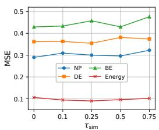  
(a) Similarity threshold

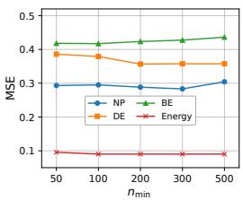  
(b) Minimum support

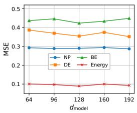  
(c) Model dimension

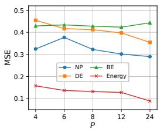  
(d) Patch length

Figure 3: Hyperparameter sensitivity of XMatch on NP, DE, BE, and Energy.  
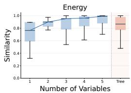  
(a) Energy: Similarity

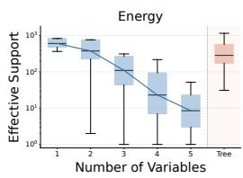  
(b) Energy: Support

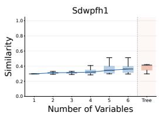  
(c) Sdwpfh1: Similarity

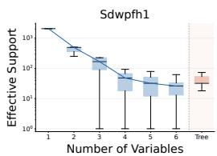  
(d) Sdwpfh1: Support  
Figure 4: Retrieval similarity and effective historical support on Energy and Sdwpfh1. Support is shown on a logarithmic scale.

Parameter Sensitivity. Sensitivity studies of XMatch yield the following observations: 1) Figures 3a and 3b show how performance varies with the similarity threshold $\tau _ { \mathrm { s i m } }$ and minimum support count $n _ { \mathrm { m i n } }$ . A stricter similarity threshold does not necessarily improve forecasting accuracy. An excessively large $n _ { \mathrm { m i n } }$ may reduce the number of retrieved matches, whereas an excessively small value may admit matches with insufficient historical support, reducing the reliability of the retrieved evidence. 2) Figure 3c shows that XMatch is relatively insensitive to the model dimension d, while smaller dimensions help reduce computational cost. We recommend selecting d within [96, 160]. 3) Figure 3d explores the effect of patch length on forecasting performance. The optimal patch length varies across datasets due to differences in temporal dependencies; however, a patch size in [12, 24] tends to yield favorable results. Very small patch lengths may increase computational complexity, while excessively large patch lengths may weaken the model’s ability to capture local dependencies. Additional sensitivity analyses are provided in Appendix B.1.

Matching Precision and Historical Support Analysis. We compare ProtoTree with direct retrieval using increasing numbers of exogenous variables on Energy and Sdwpfh1. Weighted DTW-based similarity between retrieved and actual future endogenous patterns measures match quality, while effective historical support assesses evidence sufficiency. Details are provided in Appendix A.5.

As shown in Figure 4, using more exogenous variables in direct retrieval improves similarity but reduces historical support. ProtoTree achieves high similarity while retaining greater support than direct retrieval using all exogenous variables, balancing matching precision and historical support. This balance reduces reliance on too few historical examples for highly specific exogenous patterns.

## 5 CONCLUSION

In this work, we propose XMatch, a covariate-aware forecasting framework that exploits recurring correspondences between exogenous and endogenous patterns as explicit forecasting evidence. The ProtoTree Creator organizes historical correspondences between exogenous and endogenous patterns into a hierarchical prototype tree. The ProtoTree Matcher then matches future exogenous representations against exogenous prototype keys and aggregates the corresponding endogenous response prototypes, balancing precise matching with sufficient historical support. Experiments on 12 real-world datasets demonstrate the strong overall performance of XMatch against state-of-the-art forecasting baselines.

## REFERENCES

George EP Box and David A Pierce. Distribution of residual autocorrelations in autoregressiveintegrated moving average time series models. Journal of the American statistical Association, 65(332):1509–1526, 1970.

Ling Chen, Donghui Chen, Zongjiang Shang, Binqing Wu, Cen Zheng, Bo Wen, and Wei Zhang. Multi-scale adaptive graph neural network for multivariate time series forecasting. TKDE, 35(10): 10748–10761, 2023.

Fang Cheng, Hui Liu, and Xinwei Lv. Metagnsdformer: Meta-learning enhanced gated nonstationary informer with frequency-aware attention for point-interval remaining useful life pre diction of lithium-ion batteries. Advanced Engineering Informatics, 69:103798, 2026a.

Hanyin Cheng, Xingjian Wu, Xiangfei Qiu, Yang Shu, Bin Yang, and Chenjuan Guo. CCD: Capturing cross-correlations with deformable convolutional networks for multivariate time series forecasting. In KDD, 2026b.

Hanyin Cheng, Xingjian Wu, Yang Shu, Zhongwen Rao, Lujia Pan, Bin Yang, and Chenjuan Guo. Cora: Boosting time series foundation models for multivariate forecasting through correlationaware adapter. In ICLR, 2026c.

Hanyin Cheng, Ruitong Zhang, Yuning Lu, Peng Chen, Meng Wang, Yang Shu, Bin Yang, and Chenjuan Guo. STAR: Boosting time series foundation models for anomaly detection through state-aware adapter. In NeurIPS, 2026d.

Hanyin Cheng, Jingrong Zhou, Yang Shu, and Chenjuan Guo. Kite: Knowledge-guided probabilistic modeling for time series forecasting with exogenous variables. In ICML, 2026e.

Razvan-Gabriel Cirstea, Chenjuan Guo, Bin Yang, Tung Kieu, Xuanyi Dong, and Shirui Pan. Triformer: Triangular, variable-specific attentions for long sequence multivariate time series forecasting. In IJCAI, pp. 1994–2001, 2022.

Marco Cuturi and Mathieu Blondel. Soft-dtw: a differentiable loss function for time-series. In ICML, volume 70, pp. 894–903, 2017.

Abhimanyu Das, Weihao Kong, Andrew Leach, Shaan Mathur, Rajat Sen, and Rose Yu. Long-term forecasting with tide: Time-series dense encoder. arXiv preprint arXiv:2304.08424, 2023.

Dazhao Du, Tao Han, and Song Guo. Predicting the future by retrieving the past. In AAAI, pp. 20896–20904, 2026.

Vijay Ekambaram, Arindam Jati, Pankaj Dayama, Sumanta Mukherjee, Nam Nguyen, Wesley M. Gifford, Chandra Reddy, and Jayant Kalagnanam. Tiny time mixers (ttms): Fast pre-trained models for enhanced zero/few-shot forecasting of multivariate time series. In NeurIPS, 2024.

Yuchen Fang, Jiandong Xie, Yan Zhao, Lu Chen, Yunjun Gao, and Kai Zheng. Temporal-frequency masked autoencoders for time series anomaly detection. In ICDE, pp. 1228–1241, 2024.

Jingru Fei, Kun Yi, Wei Fan, Qi Zhang, and Zhendong Niu. Amplifier: Bringing attention to neglected low-energy components in time series forecasting. In AAAI, volume 39, pp. 11645–11653, 2025.

Zijun Gao and Trevor Hastie. Lincde: Conditional density estimation via lindsey’s method. JMLR, 23:52:1–52:55, 2022.

Sungwon Han, Seungeon Lee, Meeyoung Cha, Sercan "O. Arik, and Jinsung Yoon. Retrieval augmented time series forecasting. In ICML, volume 267, 2025.

Hans Hersbach, Bill Bell, Paul Berrisford, Shoji Hirahara, András Horányi, Joaquín Muñoz-Sabater, Julien Nicolas, Carole Peubey, Raluca Radu, Dinand Schepers, et al. The era5 global reanalysis. Quarterly journal of the royal meteorological society, 146(730):1999–2049, 2020.

Jiaxi Hu, Yuehong Hu, Wei Chen, Ming Jin, Shirui Pan, Qingsong Wen, and Yuxuan Liang. Attractor memory for long-term time series forecasting: A chaos perspective. In NeurIPS, 2024a.

Shiyan Hu, Kai Zhao, Xiangfei Qiu, Yang Shu, Jilin Hu, Bin Yang, and Chenjuan Guo. Multirc: Joint learning for time series anomaly prediction and detection with multi-scale reconstructive contrast. arXiv preprint arXiv:2410.15997, 2024b.

Shiyan Hu, Tengxue Zhang, Jianxin Jin, Xiangfei Qiu, Bin Yang, and Chenjuan Guo. Teamwork: Multivariate time series anomaly detection via asymmetric role-aware channel modeling. In ICML, 2026a.

Yang Hu, Xiao Wang, Zezhen Ding, Lirong Wu, Huatian Zhang, Stan Z. Li, Sheng Wang, Jiheng Zhang, Ziyun Li, and Tianlong Chen. Flowts: Time series generation via rectified flow, 2025. URL https://arxiv.org/abs/2411.07506.

Yifan Hu, Jie Yang, Tian Zhou, Peiyuan Liu, Yujin Tang, Rong Jin, and Liang Sun. Bridging past and future: Distribution-aware alignment for time series forecasting. In ICLR, 2026b.

Qihe Huang, Zhengyang Zhou, Kuo Yang, Zhongchao Yi, Xu Wang, and Yang Wang. TimeBase: The power of minimalism in efficient long-term time series forecasting. In International Confer ence on Machine Learning, volume 267, pp. 26227–26246. PMLR, 2025a.

Songtao Huang, Zhen Zhao, Can Li, and Lei Bai. Timekan: Kan-based frequency decomposition learning architecture for long-term time series forecasting. In ICLR, 2025b.

Xuanwen Huang, Yang Yang, Yang Wang, Chunping Wang, Zhisheng Zhang, Jiarong Xu, Lei Chen, and Michalis Vazirgiannis. Dgraph: A large-scale financial dataset for graph anomaly detection. In NeurIPS, pp. 22765–22777, 2022.

Rob Hyndman, Anne B Koehler, J Keith Ord, and Ralph D Snyder. Forecasting with exponential smoothing: the state space approach. 2008.

Marcel Kollovieh, Marten Lienen, David Lüdke, Leo Schwinn, and Stephan Günnemann. Flow matching with gaussian process priors for probabilistic time series forecasting. In ICLR, 2025.

Brian Kulis and Michael I. Jordan. Revisiting k-means: New algorithms via bayesian nonparametrics. In ICML, 2012.

Jesus Lago, Grzegorz Marcjasz, Bart De Schutter, and Rafał Weron. Forecasting day-ahead electricity prices: A review of state-of-the-art algorithms, best practices and an open-access benchmark. Applied Energy, 293:116983, 2021.

Longyuan Li, Junchi Yan, Xiaokang Yang, and Yaohui Jin. Learning interpretable deep state space model for probabilistic time series forecasting. In IJCAI, pp. 2901–2908, 2019.

Yuxin Li, Wenchao Chen, Bo Chen, Dongsheng Wang, Long Tian, and Mingyuan Zhou. Prototypeoriented unsupervised anomaly detection for multivariate time series. In ICML, volume 202, pp. 19407–19424, 2023.

Zhe Li, Xiangfei Qiu, Peng Chen, Yihang Wang, Hanyin Cheng, Yang Shu, Jilin Hu, Chenjuan Guo, Aoying Zhou, Qingsong Wen, et al. TSFM-Bench: A comprehensive and unified benchmark of foundation models for time series forecasting. In SIGKDD, 2025.

Zhengyu Li, Xiangfei Qiu, Yuhan Zhu, Xingjian Wu, Jilin Hu, Chenjuan Guo, and Bin Yang. GCGNet: Graph-consistent generative network for time series forecasting with exogenous variables. In ICLR, 2026.

Bryan Lim, Sercan Ö Arık, Nicolas Loeff, and Tomas Pfister. Temporal fusion transformers for interpretable multi-horizon time series forecasting. International journal offorecasting, 37(4): 1748–1764, 2021.

Shengsheng Lin, Weiwei Lin, Keyi Wu, Songbo Wang, Minxian Xu, and James Z Wang. Cocv: A compression algorithm for time-series data with continuous constant values in iot-based monitoring systems. Internet of Things, 25:101049, 2024a.

Shengsheng Lin, Weiwei Lin, Wentai Wu, Haojun Chen, and Junjie Yang. SparseTSF: Modeling long-term time series forecasting with 1k parameters. In ICML, pp. 30211–30226, 2024b.

Shengsheng Lin, Weiwei Lin, HU Xinyi, Wentai Wu, Ruichao Mo, and Haocheng Zhong. Cyclenet: Enhancing time series forecasting through modeling periodic patterns. In NeurIPS, 2024c.

Jingwei Liu, Ling Yang, Hongyan Li, and Shenda Hong. Retrieval-augmented diffusion models for time series forecasting. In NeurIPS, 2024a.

Xvyuan Liu, Xiangfei Qiu, Hanyin Cheng, Xingjian Wu, Chenjuan Guo, Bin Yang, and Jilin Hu. Astgi: Adaptive spatio-temporal graph interactions for irregular multivariate time series forecasting. In ICLR, 2026a.

Xvyuan Liu, Xiangfei Qiu, Xingjian Wu, Zhengyu Li, Chenjuan Guo, Jilin Hu, and Bin Yang. Rethinking irregular time series forecasting: A simple yet effective baseline. In AAAI, 2026b.

Yong Liu, Tengge Hu, Haoran Zhang, Haixu Wu, Shiyu Wang, Lintao Ma, and Mingsheng Long. itransformer: Inverted transformers are effective for time series forecasting. In ICLR, 2024b.

Yong Liu, Guo Qin, Zhiyuan Shi, Zhi Chen, Caiyin Yang, Xiangdong Huang, Jianmin Wang, and Mingsheng Long. Sundial: A family of highly capable time series foundation models. In ICML, 2025.

Junkai Lu, Peng Chen, Chenjuan Guo, Yang Shu, Meng Wang, and Bin Yang. Towards nonstationary time series forecasting with temporal stabilization and frequency differencing. In AAAI, 2026a.

Junkai Lu, Peng Chen, Xingjian Wu, Yang Shu, Chenjuan Guo, Christian S. Jensen, and Bin Yang. PATRA: Pattern-aware alignment and balanced reasoning for time series question answering. In ICML, 2026b.

Xiaoye Miao, Yangyang Wu, Jun Wang, Yunjun Gao, Xudong Mao, and Jianwei Yin. Generative semi-supervised learning for multivariate time series imputation. In AAAI, volume 35, pp. 8983– 8991, 2021.

Yuqi Nie, Nam H. Nguyen, Phanwadee Sinthong, and Jayant Kalagnanam. A time series is worth 64 words: Long-term forecasting with transformers. In ICLR, 2023.

Kanghui Ning, Zijie Pan, Yu Liu, Yushan Jiang, James Y. Zhang, Kashif Rasul, Anderson Schneider, Lintao Ma, Yuriy Nevmyvaka, and Dongjin Song. TS-RAG: retrieval-augmented generation based time series foundation models are stronger zero-shot forecaster. In NeurIPS, 2025.

Kin G Olivares, Cristian Challu, Grzegorz Marcjasz, Rafał Weron, and Artur Dubrawski. Neural basis expansion analysis with exogenous variables: Forecasting electricity prices with nbeatsx. International Journal of Forecasting, 39(2):884–900, 2023.

Zhicheng Pan, Yihang Wang, Yingying Zhang, Sean Bin Yang, Yunyao Cheng, Peng Chen, Chenjuan Guo, Qingsong Wen, Xiduo Tian, Yunliang Dou, et al. Magicscaler: Uncertainty-aware, predictive autoscaling. Proc. VLDB Endow., 16(12):3808–3821, 2023.

Adam Paszke, Sam Gross, Francisco Massa, Adam Lerer, James Bradbury, Gregory Chanan, Trevor Killeen, Zeming Lin, Natalia Gimelshein, Luca Antiga, Alban Desmaison, Andreas Köpf, Ed ward Z. Yang, Zachary DeVito, Martin Raison, Alykhan Tejani, Sasank Chilamkurthy, Benoit Steiner, Lu Fang, Junjie Bai, and Soumith Chintala. Pytorch: An imperative style, high performance deep learning library. In NeurIPS, pp. 8024–8035, 2019.

Xiangfei Qiu, Jilin Hu, Lekui Zhou, Xingjian Wu, Junyang Du, Buang Zhang, Chenjuan Guo, Aoying Zhou, Christian S. Jensen, Zhenli Sheng, and Bin Yang. TFB: towards comprehensive and fair benchmarking of time series forecasting methods. Proc. VLDB Endow., 17(9):2363–2377, 2024.

Xiangfei Qiu, Zhe Li, Wanghui Qiu, Shiyan Hu, Lekui Zhou, Xingjian Wu, Zhengyu Li, Chenjuan Guo, Aoying Zhou, Zhenli Sheng, Jilin Hu, Christian S. Jensen, and Bin Yang. TAB: Unified benchmarking of time series anomaly detection methods. In Proc. VLDB Endow., 2025a.

Xiangfei Qiu, Xingjian Wu, Hanyin Cheng, Xvyuan Liu, Chenjuan Guo, Jilin Hu, and Bin Yang. DBLoss: Decomposition-based loss function for time series forecasting. In NeurIPS, 2025b.

Xiangfei Qiu, Xingjian Wu, Yan Lin, Chenjuan Guo, Jilin Hu, and Bin Yang. DUET: Dual clustering enhanced multivariate time series forecasting. In SIGKDD, pp. 1185–1196, 2025c.

Xiangfei Qiu, Hanyin Cheng, Xingjian Wu, Junkai Lu, Jilin Hu, Chenjuan Guo, Christian S Jensen, and Bin Yang. A comprehensive survey of deep learning for multivariate time series forecasting: A channel strategy perspective. In IJCAI, 2026a.

Xiangfei Qiu, Kangjia Yan, Xvyuan Liu, Xingjian Wu, and Jilin Hu. Bridging time and frequency: A joint modeling framework for irregular multivariate time series forecasting. In ICML, 2026b.

Xiangfei Qiu, Yuhan Zhu, Zhengyu Li, Xingjian Wu, Bin Yang, and Jilin Hu. Dag: A dual correlation network for time series forecasting with exogenous variables. In ICML, 2026c.

Syama Sundar Rangapuram, Matthias W. Seeger, Jan Gasthaus, Lorenzo Stella, Yuyang Wang, and Tim Januschowski. Deep state space models for time series forecasting. In NeurIPS, pp. 7796– 7805, 2018.

Kashif Rasul, Calvin Seward, Ingmar Schuster, and Roland Vollgraf. Autoregressive denoising diffusion models for multivariate probabilistic time series forecasting. In ICML, volume 139, pp. 8857–8868, 2021.

David Salinas, Valentin Flunkert, Jan Gasthaus, and Tim Januschowski. Deepar: Probabilistic forecasting with autoregressive recurrent networks. International journal of forecasting, 36(3):1181– 1191, 2020.

Omer Berat Sezer, Mehmet Ugur Gudelek, and Ahmet Murat Özbayoglu. Financial time series forecasting with deep learning : A systematic literature review: 2005-2019. Appl. Soft Comput., 90:106181, 2020.

Zongjiang Shang and Ling Chen. MSHyper: Multi-scale hypergraph transformer for long-range time series forecasting. arXiv preprint arXiv:2401.09261, 2024.

Zongjiang Shang, Ling Chen, Binqing Wu, and Dongliang Cui. Ada-MSHyper: Adaptive multiscale hypergraph transformer for time series forecasting. In NeurIPS, volume 37, pp. 33310– 33337, 2024.

Claude E. Shannon. A mathematical theory of communication. Bell Syst. Tech. J., 27(3):379–423, 1948.

Wei Shao, Ziquan Fang, Lu Chen, and Yunjun Gao. Towards trajectory anomaly detection: a finegrained and noise-resilient framework. In SIGKDD, pp. 2490–2501, 2025.

Ke-Yuan Shen. Learn hybrid prototypes for multivariate time series anomaly detection. In ICLR, 2025.

Junho Song, Keonwoo Kim, Jeonglyul Oh, and Sungzoon Cho. MEMTO: Memory-guided transformer for multivariate time series anomaly detection. In NeurIPS 2023, 2023.

Artyom Stitsyuk and Jaesik Choi. xpatch: Dual-stream time series forecasting with exponential seasonal-trend decomposition. In AAAI, volume 39, pp. 20601–20609, 2025.

Yusuke Tashiro, Jiaming Song, Yang Song, and Stefano Ermon. CSDI: conditional score-based diffusion models for probabilistic time series imputation. In NeurIPS, pp. 24804–24816, 2021.

Kshitij Tayal, Arvind Renganathan, Xiaowei Jia, Vipin Kumar, and Dan Lu. Exotst: Exogenousaware temporal sequence transformer for time series prediction. In ICDM, pp. 857–862, 2024.

Stylianos I Vagropoulos, GI Chouliaras, Evaggelos G Kardakos, Christos K Simoglou, and Anastasios G Bakirtzis. Comparison of sarimax, sarima, modified sarima and ann-based models for short-term pv generation forecasting. In ENERGYCON, pp. 1–6, 2016.

Robert A. Vandermeulen, Wai Ming Tai, and Bryon Aragam. Breaking the curse of dimensionality in structured density estimation. In NeurIPS, 2024.

Hao Wang, Pan Li, Zhichao Chen, Xu Chen, Qingyang Dai, Lei Wang, Haoxuan Li, and Zhouchen Lin. Time-o1: Time-series forecasting needs transformed label alignment. In NeurIPS, 2025a.

Hao Wang, Licheng Pan, Yuan Shen, Zhichao Chen, Degui Yang, Yifei Yang, Sen Zhang, Xinggao Liu, Haoxuan Li, and Dacheng Tao. Fredf: learning to forecast in the frequency domain. In ICLR, 2025b.

Hao Wang, Licheng Pan, Yuan Lu, Zhixuan Chu, Xiaoxi Li, Shuting He, Zhichao Chen, Haoxuan Li, Qingsong Wen, and Zhouchen Lin. Distdf: time-series forecasting needs joint-distribution wasserstein alignment. In ICLR, 2026.

Yuxuan Wang, Haixu Wu, Jiaxiang Dong, Guo Qin, Haoran Zhang, Yong Liu, Yunzhong Qiu, Jianmin Wang, and Mingsheng Long. Timexer: Empowering transformers for time series forecasting with exogenous variables. In NeurIPS, volume 37, pp. 469–498, 2024.

Billy M Williams. Multivariate vehicular traffic flow prediction: Evaluation of arimax modeling. Transportation Research Record, 1776(1):194–200, 2001.

Binqing Wu, Zongjiang Shang, Jianlong Huang, and Ling Chen. Millgnn: Learning multi-scale lead-lag dependencies for multi-variate time series forecasting. In CIKM, pp. 3344–3354, 2025a.

Haixu Wu, Jiehui Xu, Jianmin Wang, and Mingsheng Long. Autoformer: Decomposition transformers with auto-correlation for long-term series forecasting. In NeurIPS, pp. 22419–22430, 2021.

Xingjian Wu, Xiangfei Qiu, Hanyin Cheng, Zhengyu Li, Jilin Hu, Chenjuan Guo, and Bin Yang. Enhancing time series forecasting through selective representation spaces: A patch perspective. In NeurIPS, 2025b.

Xingjian Wu, Xiangfei Qiu, Hongfan Gao, Jilin Hu, Bin Yang, and Chenjuan Guo. K2VAE: A koopman-kalman enhanced variational autoencoder for probabilistic time series forecasting. In ICML, 2025c.

Xingjian Wu, Xiangfei Qiu, Zhengyu Li, Yihang Wang, Jilin Hu, Chenjuan Guo, Hui Xiong, and Bin Yang. CATCH: Channel-aware multivariate time series anomaly detection via frequency patching. In ICLR, 2025d.

Xingjian Wu, Junkai Lu, Zhengyu Li, Xiangfei Qiu, Jilin Hu, Chenjuan Guo, Christian S Jensen, and Bin Yang. TimeART: Towards agentic time series reasoning via tool-augmentation. arXiv preprint arXiv:2601.13653, 2026.

Xinle Wu, Xingjian Wu, Bin Yang, Lekui Zhou, Chenjuan Guo, Xiangfei Qiu, Jilin Hu, Zhenli Sheng, and Christian S Jensen. AutoCTS++: zero-shot joint neural architecture and hyperparameter search for correlated time series forecasting. The VLDB Journal, 33(5):1743–1770, 2024.

Jie Yang, Yifan Hu, Kexin Zhang, Luyang Niu, Philip S Yu, and Kaize Ding. Revisiting multivariate time series forecasting with missing values. arXiv preprint arXiv:2509.23494, 2025a.

Jie Yang, Kexin Zhang, Guibin Zhang, Philip S Yu, and Kaize Ding. Glocal information bottleneck for time series imputation. arXiv preprint arXiv:2510.04910, 2025b.

Lincen Yang and Matthijs van Leeuwen. Conditional density estimation with histogram trees. In NeurIPS, 2024.

Linxiao Yang, Xue Jiang, Gezheng Xu, Tian Zhou, Min Yang, Zhaoyang Zhu, Linyuan Geng, Zhipeng Zeng, Qiming Chen, Xinyue Gu, Rong Jin, and Liang Sun. Baguan-ts: A sequence-native in-context learning model for time series forecasting with covariates. CoRR, abs/2603.17439, 2026.

Chengqing Yu, Fei Wang, Zezhi Shao, Tangwen Qian, Zhao Zhang, Wei Wei, Zhulin An, Qi Wang, and Yongjun Xu. Ginar+: A robust end-to-end framework for multivariate time series forecasting with missing values. IEEE Transactions on Knowledge and Data Engineering, 37(8):4635–4648, 2025a.

Chengqing Yu, Fei Wang, Chuanguang Yang, Zezhi Shao, Tao Sun, Tangwen Qian, Wei Wei, Zhulin An, and Yongjun Xu. Merlin: Multi-view representation learning for robust multivariate time series forecasting with unfixed missing rates. In SIGKDD, pp. 3633–3644, 2025b.

Ailing Zeng, Muxi Chen, Lei Zhang, and Qiang Xu. Are transformers effective for time series forecasting? In AAAI, volume 37, pp. 11121–11128, 2023.

Jiawen Zhang, Xumeng Wen, Zhenwei Zhang, Shun Zheng, Jia Li, and Jiang Bian. ProbTS: Benchmarking point and distributional forecasting across diverse prediction horizons. In NeurIPS, 2024.

Haoyi Zhou, Shanghang Zhang, Jieqi Peng, Shuai Zhang, Jianxin Li, Hui Xiong, and Wancai Zhang. Informer: Beyond efficient transformer for long sequence time-series forecasting. In AAAI, volume 35, pp. 11106–11115, 2021.

Pengfei Zhou, Yunlong Liu, Junli Liang, Qi Song, and Xiangyang Li. Crosslinear: Plug-and-play cross-correlation embedding for time series forecasting with exogenous variables. In SIGKDD, 2025.

Tian Zhou, Ziqing Ma, Qingsong Wen, Xue Wang, Liang Sun, and Rong Jin. Fedformer: Frequency enhanced decomposed transformer for long-term series forecasting. In ICML, pp. 27268–27286, 2022.

Yuhan Zhu, Jilin Hu, Xinying Cai, Yingshan Li, Li Ma, Xiangfei Qiu, Linsen Li, Kai Zhang, Yao Fu, Weihao Jiang, and Bin Yang. WPBench: A comprehensive benchmark for wind power forecasting. arXiv preprint arXiv:2609.24444, 2026.

## A EXPERIMENTAL DETAILS

## A.1 DATASETS

Table 3: Statistics of datasets. #Num denotes the number of exogenous variables. Ex. and En. are abbreviations for the exogenous variable and endogenous variable, respectively.
<table><tr><td>Dataset</td><td>#Num</td><td>Ex. Descriptions</td><td>En. Descriptions</td><td>Sampling Frequency</td><td>Lengths</td><td>Split</td></tr><tr><td>NP</td><td>2</td><td>Grid load, wind power</td><td>Nord Pool electricity price</td><td>1 Hour</td><td>52,416</td><td>7:1:2</td></tr><tr><td>PJM</td><td>2</td><td>System load, COMED zonal load</td><td>COMED zonal electricity price</td><td>1 Hour</td><td>52,416</td><td>7:1:2</td></tr><tr><td>BE</td><td>2</td><td>Belgian load, French generation</td><td>Belgian electricity price</td><td>1 Hour</td><td>52,416</td><td>7:1:2</td></tr><tr><td>FR</td><td>2</td><td>Generation, load</td><td>French electricity price</td><td>1 Hour</td><td>52,416</td><td>7:1:2</td></tr><tr><td>DE</td><td>2</td><td>Wind power, Amprion zonal load</td><td>German electricity price</td><td>1 Hour</td><td>52,416</td><td>7:1:2</td></tr><tr><td>Energy</td><td>5</td><td>Battery, geothermal, hydroelectric, solar, wind</td><td>Thermoelectric generation</td><td>1 Hour</td><td>13,064</td><td>7:1:2</td></tr><tr><td>Colbun</td><td>2</td><td>Precipitation, tributary inflow</td><td>Water level</td><td>1 Day</td><td>2,958</td><td>7:1:2</td></tr><tr><td>Rapel</td><td>2</td><td>Precipitation, tributary inflow</td><td>Water level</td><td>1 Day</td><td>3,366</td><td>7:1:2</td></tr><tr><td>Sdwpfh</td><td>6</td><td>Climate Feature</td><td>Active power</td><td>1 Hour</td><td>14,641</td><td>7:1:2</td></tr><tr><td>Sdwpfm</td><td>6</td><td>Climate Feature</td><td>Active power</td><td>30 Minutes</td><td>29,281</td><td>7:1:2</td></tr></table>

We conduct experiments on 12 real-world datasets with exogenous variables, including five electricity price datasets from the EPF benchmark (Lago et al., 2021; Wang et al., 2024) and seven energy and hydropower datasets collected by DAG (Qiu et al., 2026c), following KITE (Cheng et al., 2026e) and GCGNet (Li et al., 2026). We evaluate forecasting under the setting where future exogenous variables are provided as inputs. NP contains hourly electricity prices from the Nord Pool market, with grid-load and wind-power forecasts as exogenous variables. PJM records zonal electricity prices in the Commonwealth Edison (COMED) area of the Pennsylvania–New Jersey– Maryland Interconnection, with system-load and COMED zonal-load forecasts as exogenous variables. BE and FR contain Belgian and French electricity prices, respectively; BE uses Belgian load and French generation forecasts as covariates, while FR uses French generation and load forecasts. DE records hourly German electricity prices, with Amprion zonal-load forecasts and wind-power forecasts as exogenous variables. Energy provides hourly power-generation data from Chile, where thermoelectric generation is the endogenous target and battery, geothermal, hydroelectric, solar, and wind generation are exogenous variables. Colbun and Rapel contain daily measurements from two Chilean reservoirs, with water level as the target and precipitation and tributary inflow as covariates. Sdwpfh1, Sdwpfh2, Sdwpfm1, and Sdwpfm2 record wind-power generation from two turbines at the Longyuan wind farm at hourly and half-hourly resolutions, respectively. Their target is active power output (Patv), and their exogenous variables are six meteorological measurements from ERA5 (Hersbach et al., 2020): temperature, surface pressure, relative humidity, wind speed, wind direction, and total precipitation. All datasets are split chronologically into training, validation, and test sets in a 7:1:2 ratio, with detailed statistics provided in Table 3.

## A.2 BASELINES

We compare XMatch with 10 competitive baselines for forecasting. Following the treatment of future exogenous variables, we organize these methods into two groups.

Methods with native future-covariate support. This group includes DAG (Qiu et al., 2026c), KITE (Cheng et al., 2026e), GCGNet (Li et al., 2026), TimeXer (Wang et al., 2024), TFT (Lim et al., 2021), and TiDE (Das et al., 2023). These methods incorporate future exogenous information within their forecasting architectures. They cover several approaches to covariate modeling, including temporal and cross-variable correlation modeling, graph-based interactions, attention mechanisms, and MLP-based fusion. KITE additionally uses exogenous information to guide generative forecasting; here, we evaluate its point forecasts using the same deterministic metrics as the other methods.

Methods augmented with future-covariate fusion. This group consists of DUET (Qiu et al., 2025c), CrossLinear (Zhou et al., 2025), Amplifier (Fei et al., 2025), and TimeKAN (Huang et al., 2025b). To incorporate known future exogenous variables, we equip these baselines with the MLP fusion module described in Appendix A.6, following prior covariate forecasting studies (Qiu et al., 2026c). The module combines each backbone’s output with future exogenous inputs to produce the final endogenous forecast. All baselines are evaluated within the TFB framework (Qiu et al., 2024), using the same dataset splits and forecasting horizons as XMatch.

The code repositories for the baseline models are listed in Table 4.

Table 4: Code repositories for the baseline models.
<table><tr><td>Model</td><td>Code repository</td><td>Model</td><td>Code repository</td></tr><tr><td>DAG</td><td>decisionintelligence/DAG</td><td>TiDE</td><td>thuml/Time-Series-Library</td></tr><tr><td>KITE</td><td>decisionintelligence/KITE</td><td>DUET</td><td>decisionintelligence/DUET</td></tr><tr><td>GCGNet</td><td>decisionintelligence/GCGNet</td><td>CrossLinear</td><td>mumiao2000/CrossLinear</td></tr><tr><td>TimeXer</td><td>thuml/TimeXer</td><td>Amplifier</td><td>aikunyi/amplifier</td></tr><tr><td>TFT</td><td>google-research/.../tft</td><td>TimeKAN</td><td>huangst21/TimeKAN</td></tr></table>

## A.3 EVALUATION METRICS

To evaluate model performance, we employ Mean Absolute Error (MAE) and Mean Squared Error (MSE) for deterministic forecasting, following the TFB benchmark Qiu et al. (2024).

Mean Squared Error (MSE). The Mean Squared Error (MSE) measures the average of the squares of the errors—that is, the average squared difference between the estimated values and the actual observation. Unlike MAE, MSE penalizes larger errors more severely due to the squaring operation, making it more sensitive to outliers. The mathematical representation of MSE is defined as:

$$
\mathbf { M S E } = \frac { 1 } { K \times T } \sum _ { k = 1 } ^ { K } \sum _ { t = 1 } ^ { T } ( x _ { t } ^ { k } - \hat { x } _ { t } ^ { k } ) ^ { 2 } ,\tag{17}
$$

where $\boldsymbol { x } _ { t } ^ { k }$ denotes the ground truth and $\hat { x } _ { t } ^ { k }$ denotes the predicted value.

Mean Absolute Error (MAE). The Mean Absolute Error (MAE) measures the average magnitude of the errors in a set of predictions, without considering their direction. It is the average over the verification sample of the absolute differences between prediction and actual observation. The mathematical representation of MAE is given by:

$$
\mathbf { M A E } = \frac { 1 } { K \times T } \sum _ { k = 1 } ^ { K } \sum _ { t = 1 } ^ { T } | x _ { t } ^ { k } - \hat { x } _ { t } ^ { k } | ,\tag{18}
$$

where K represents the number of time series and $T$ represents the number of time steps.

## A.4 IMPLEMENTATION DETAILS

All experiments are conducted using PyTorch (Paszke et al., 2019) in Python 3.10 and executed on an NVIDIA GeForce RTX 3090 GPU. We do not apply the “Drop Last” trick to ensure a fair comparison, retaining the final incomplete batch during evaluation. Testing uses the rolling batch interface of TFB (Qiu et al., 2024) to process all test windows, including the final batch when it contains fewer windows than the batch size. The evaluation code additionally verifies that the number of predictions matches the number of target windows.

## A.5 MATCHING PRECISION AND HISTORICAL SUPPORT EVALUATION

We compare direct matching with ProtoTree on Energy and Sdwpfh1 using a history length of 168, a forecast length of 24, and a patch length of P = 12. Direct matching uses increasing numbers of exogenous variables, from one to five on Energy and one to six on Sdwpfh1, while Tree denotes the full soft-matching result. Both methods use training patches as historical references and are evaluated by weighted DTW-based similarity to the ground-truth future endogenous pattern and effective historical support. The boxplots summarize these metrics over successfully matched queries, with effective support shown on a logarithmic scale.

Weighted DTW-based endogenous pattern similarity. Let $\widetilde { \pmb { y } } _ { q } \in \mathbb { R } ^ { P }$ denote the standardized ground-truth future endogenous patch corresponding to query $q ,$ and let ${ \widetilde { c } } _ { r }$ denote the standardized retrieved endogenous pattern center r. The ground-truth future endogenous patch is used only as an evaluation reference and is not used to construct the retrieval query or determine retrieval weights. We compute its DTW-based similarity to each retrieved endogenous pattern and take the weighted average under the retrieved pattern distribution $\pi _ { q } .$

$$
K _ { q , r } = 1 - \frac { \mathrm { D T W } _ { \mathrm { b a n d = 2 } } ( \widetilde { \pmb { y } } _ { q } , \widetilde { \pmb { c } } _ { r } ) } { 2 P } , \qquad S _ { q } = \sum _ { r } \pi _ { q , r } K _ { q , r } .\tag{19}
$$

The DTW band permits temporal offsets of at most two time steps. Higher scores indicate that the retrieved endogenous patterns more closely resemble the ground-truth future endogenous pattern for the query. Direct matching assigns equal weight to every matched historical patch, so $\pi _ { q , r }$ is the empirical frequency of endogenous pattern r among the matches for query $q .$ For brevity, we omit the query subscript in the aggregation weights and pattern distribution below.

For Tree, we retain the complete aggregation weights $w _ { v }$ from the ProtoTree Matcher, excluding the virtual root, and normalize them for this analysis:

$$
\alpha _ { v } = \frac { w _ { v } } { \sum _ { u \neq v _ { \mathrm { r o o t } } } w _ { u } } , \qquad \pi _ { r } = \sum _ { v \neq v _ { \mathrm { r o o t } } } \alpha _ { v } p _ { v } ( r ) .\tag{20}
$$

A Tree query is included when its total non-root weight is positive. We do not select a maximum-weight node or truncate to top-k nodes. Here, $p _ { v } ( r )$ is the empirical endogenous pattern distribution at node v. Thus, the similarity score can equivalently be written as $S _ { q } ~ =$ $\begin{array} { r } { \sum _ { v \neq v _ { \mathrm { r o o t } } } \alpha _ { v } \sum _ { r } p _ { v } ( r ) K _ { q , r } } \end{array}$ , incorporating both node aggregation weights and within-node pattern frequencies. Applying the same $S _ { q }$ to both methods evaluates the agreement of their retrieved shape evidence with the ground-truth future endogenous pattern before ${ \mathrm { M L P } } _ { V }$ , rather than the smoothness of an averaged response curve.

Effective support. Let Mv be the set of historical patches supporting node v and $n _ { v } = | \mathcal { M } _ { v } |$ . The normalized contribution of historical patch i and the effective support are

$$
\beta _ { i } = \sum _ { v : i \in \mathcal { M } _ { v } } \frac { \alpha _ { v } } { n _ { v } } , \qquad N _ { \mathrm { e f f } } = \frac { 1 } { \sum _ { i } \beta _ { i } ^ { 2 } } .\tag{21}
$$

Contributions of the same patch are combined across nodes before squaring, accounting for overlapping support between ancestors and descendants. For direct matching with n equally weighted historical patches, this definition reduces exactly to $N _ { \mathrm { e f f } } = n$ . Effective support therefore measures the amount of historical evidence under the aggregation weights, rather than the sum of node counts.

## A.6 MLP FUSION MODULE

For a fair comparison, we equip conventional forecasting methods with an efficient MLP fusion module (Qiu et al., 2026c), allowing them to incorporate future exogenous information. Given the historical endogenous variables $X ^ { \mathrm { e n d o } } \in \mathbb { R } ^ { N \times T }$ and historical exogenous variables $X ^ { \mathrm { e x o } } \in \mathbb { R } ^ { D \times T }$ the forecasting backbone first produces a latent representation:

$$
z = \theta _ { \mathrm { M o d e l } } ( X ^ { \mathrm { e n d o } } , X ^ { \mathrm { e x o } } ) ,\tag{22}
$$

where $z \in \mathbb { R } ^ { N \times F }$ and $\theta _ { \mathrm { M o d e l } }$ denotes the parameters of the backbone. The resulting representation z is then concatenated with the future exogenous variables $Y ^ { \mathrm { e x o } } \in \mathbb { R } ^ { D \times F }$ and fed into an MLP to obtain the final forecast:

$$
\hat { Y } ^ { \mathrm { e n d o } } = \theta _ { \mathrm { M L P } } \big ( \mathrm { C o n c a t } ( z , Y ^ { \mathrm { e x o } } ) \big ) ,\tag{23}
$$

where $\theta _ { \mathrm { M L P } }$ denotes the parameters of the MLP fusion module.

## B MORE ANALYSIS

## B.1 ADDITIONAL PARAMETER SENSITIVITY ANALYSIS

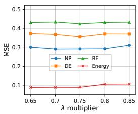  
(a) Clustering penalty

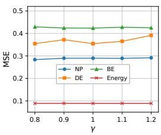  
(b) Soft-DTW smoothing

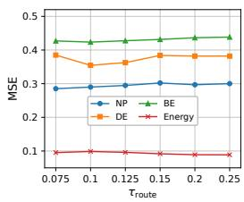  
(c) Routing temp.

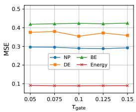  
(d) Stopping gate temp.  
Figure 5: Additional hyperparameter sensitivity of XMatch.

We further study the parameter sensitivity of XMatch, including the clustering penalty multiplier and Soft-DTW smoothing parameter γ in the ProtoTree Creator, and the routing and stopping gate temperatures in the ProtoTree Matcher. 1) Figure 5a shows the impact of the clustering penalty. The multiplier scales the 90th percentile of Soft-DTW divergences (normalized by P2) between each variable’s normalized training patches and their mean patch to initialize the clustering penalty. Although performance is relatively stable overall, forecasting errors increase slightly toward the lower or upper ends of the tested range in some cases. A small penalty may produce overly fragmented clusters, whereas an excessively large penalty favors fewer, coarser pattern centers that may obscure useful pattern distinctions. A moderate penalty is therefore preferable for preserving distinct patterns while retaining sufficient samples in each cluster. We recommend selecting the penalty multiplier within [0.7, 0.75]. 2) Figure 5b illustrates the impact of γ. Performance remains relatively stable across much of the tested range, but larger values increase forecasting errors on some datasets. This suggests that excessive smoothing across temporal alignments may weaken the distinction between different patch shapes. We recommend selecting γ within [0.8, 1.0] to allow flexible temporal alignment while preserving discriminative shape information. 3) As illustrated in Figure 5c, the routing temperature modulates the distribution of aggregation weights across branches, with moderate performance variations as the weights become more diffuse. We recommend [0.075, 0.125] as an initial tuning range, with higher temperatures considered when more diffuse aggregation improves validation performance. 4) Figure 5d indicates low sensitivity to the stopping gate temperature, which controls the smoothness of the continue-or-stop transition during training; inference still uses a hard threshold. We recommend 0.1 as a starting value, with tuning within [0.05, 0.15] if needed. These recommendations serve as practical starting points, with final values selected on the validation set.

## B.2 LIMITATIONS AND FUTURE WORK

Despite the promising performance of XMatch, this work still has several limitations.

1) Fixed Variable Ordering. The current framework determines a fixed exogenous variable order based on the information gain between each individual exogenous variable and endogenous patterns. Although this ordering prioritizes informative variables for hierarchical matching, individual information gain may not fully reflect the joint contributions of multiple variables, and the most informative variable combinations may vary across forecasting contexts. Exploring tree construction based on conditional information gain, or dynamically adapting variable selection and matching order to each query, is a direction for future work.

2) Fixed Patch Length. The current framework uses a fixed patch length to construct pattern prototypes. While this design enables aligned pattern extraction and matching, a single temporal scale may not fully capture exogenous–endogenous associations underlying both short-term fluctuations and long-term changes. Developing a multi-scale ProtoTree or adaptively selecting patch lengths based on the data is another direction for future work.

## B.3 TEMPORAL RECURRENCE OF EXOGENOUS AND ENDOGENOUS PATTERNS

(a) NP: Grid Load Forecast to Output Target (N=2177)  
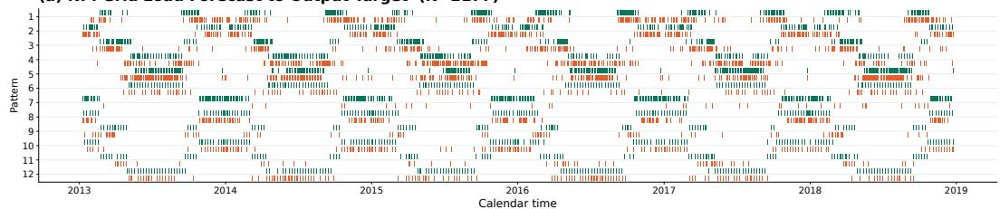

(b) FR: System Load Forecast to Output Target (N=2177)  
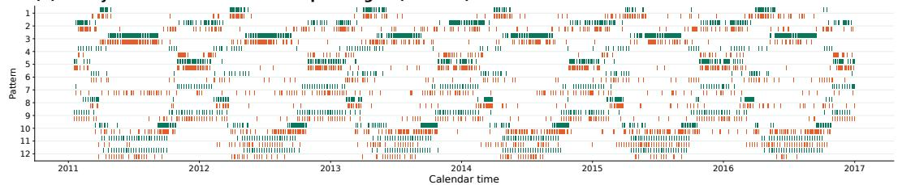

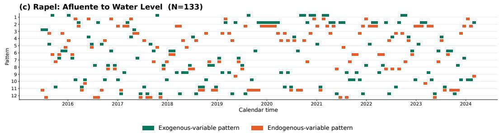  
Figure 6: Temporal recurrence of exogenous and endogenous patterns on (a) NP, (b) FR, and (c) Rapel. The horizontal axis shows calendar time, and the vertical axis indexes patterns. Green and orange marks indicate the occurrence intervals of exogenous and endogenous patterns.

Figure 6 complements the pattern correspondences in Figure 1 by showing when exogenous and endogenous patterns occur. Both types of patterns recur at multiple, separated times. Together, the two figures motivate XMatch from complementary perspectives: Figure 1 shows that an exogenous pattern is often associated with a small set of endogenous patterns, while Figure 6 shows that both types of patterns recur over time. This suggests that their correspondences from the training set may remain useful in forecasting when similar exogenous patterns reappear. Given future exogenous patterns, XMatch can therefore match them against historical exogenous patterns and use the corresponding endogenous patterns to narrow down the plausible future responses and guide prediction.

## C RELATED WORKS

Time series analysis encompasses forecasting (Qiu et al., 2024; Zhang et al., 2024; Li et al., 2025), anomaly detection (Qiu et al., 2025a), imputation (Tashiro et al., 2021; Miao et al., 2021; Yang et al., 2025b), generation (Hu et al., 2025), and tool-augmented reasoning (Wu et al., 2026). These tasks share the need to represent temporal regularities. Complementing the main text, we review broader forecasting settings and temporal representation learning.

## C.1 TIME SERIES FORECASTING

Univariate forecasting. Univariate forecasting predicts a single variable from its history. Classical statistical approaches model temporal dependence through autoregression and exponential smoothing (Box & Pierce, 1970; Hyndman et al., 2008). Deep forecasting methods learn temporal patterns from data, including recurrent and state-space approaches (Salinas et al., 2020; Rangapuram et al.,

2018; Li et al., 2019). Such models can share parameters across multiple series while retaining a univariate prediction formulation.

Multivariate forecasting. Multivariate forecasting considers multiple variables and their temporal and cross-variable dependencies (Qiu et al., 2026a). Existing architectures include attention-based models (Zhou et al., 2021; Cirstea et al., 2022; Nie et al., 2023; Liu et al., 2024b), decompositionbased models (Wu et al., 2021; Zhou et al., 2022; Stitsyuk & Choi, 2025), and compact linear or periodic models (Zeng et al., 2023; Lin et al., 2024b;c). Cross-variable relationships are also studied through graph and hypergraph representations (Chen et al., 2023; Shang & Chen, 2024; Shang et al., 2024), clustering (Qiu et al., 2025c), and deformable convolutions (Cheng et al., 2026b). These approaches offer different ways to organize temporal and channel information, with common evaluation frameworks supporting systematic comparison (Qiu et al., 2024).

Forecasting settings and applications. Beyond regularly sampled point forecasting, recent studies address irregular observations (Liu et al., 2026b; Qiu et al., 2026b; Liu et al., 2026a) and predictive uncertainty through latent-variable, diffusion, and flow-based models (Wu et al., 2025c; Rasul et al., 2021; Kollovieh et al., 2025). Applications include electricity-price prediction (Lago et al., 2021), wind power forecasting with systematic evaluation through WPBench (Zhu et al., 2026), traffic forecasting with external factors (Williams, 2001), and battery remaining-useful-life prediction (Cheng et al., 2026a).

Forecasting with exogenous variables distinguishes the prediction target from the covariates used as evidence. Future-known covariates provide information over the prediction horizon, motivating correlation-based and conditional generative approaches (Qiu et al., 2026c; Li et al., 2026; Cheng et al., 2026e). XMatch exploits this information by organizing historical exogenous–endogenous pattern correspondences and retrieving relevant endogenous responses.

## C.2 REPRESENTATION LEARNING AND ROBUST MODELING FOR TIME SERIES

Temporal representations and learning objectives. Recent studies improve forecasting through selective temporal representations (Wu et al., 2025b), decomposition- and frequency-based learning objectives (Qiu et al., 2025b; Wang et al., 2025b), and distribution-aware alignment (Wang et al., 2026; Hu et al., 2026b). DTAF (Lu et al., 2026a) addresses non-stationarity through temporal stabilization and frequency differencing. Pretrained forecasting models (Ekambaram et al., 2024; Liu et al., 2025) and correlation-aware adaptation (Cheng et al., 2026c) further support transferable temporal representations. Beyond numerical prediction, time series question answering is explored through tool-augmented reasoning (Wu et al., 2026) and pattern-aware alignment with balanced reasoning in PATRA (Lu et al., 2026b). These directions emphasize the role of representations, learning objectives, and adaptation across temporal tasks.

Missing observations and anomalous behavior. Robust forecasting studies incomplete observations and varying missing rates (Yu et al., 2025a;b; Yang et al., 2025a). Anomaly detection instead distinguishes normal temporal structure from unusual behavior, with advances in unified benchmarking (Qiu et al., 2025a), temporal-frequency representation learning (Wu et al., 2025d; Fang et al., 2024), reconstructive contrast and channel interaction (Hu et al., 2024b; 2026a), and foundationmodel adaptation (Cheng et al., 2026d). These studies motivate representations that preserve informative temporal and channel structure under imperfect observations.

## D FULL RESULTS

## D.1 FORECASTING WITH FUTURE EXOGENOUS VARIABLES

Table 5: Full results on forecasting with historical and future exogenous variables across 12 realworld datasets, where the inputs are (Xendo, Xexo, and Yexo). Red: the best, Blue: the 2nd best. Avg means the average results from two forecasting horizons.
<table><tr><td rowspan=1 colspan=15>Models  XMatch    DAG     KITE    GCGNet   TimeXer    TFT     TiDE    DUET  CrossLinear Amplifier  TimeKANMetrics mse mae mse mae mse mae mse mae mse mae mse mae mse mae mse mae mse mae mse mae mse mae</td></tr><tr><td rowspan=3 colspan=2>24N360</td><td rowspan=3 colspan=1>0.1850.2210.3800.377</td><td rowspan=3 colspan=1>0.2020.2370.5210.451</td><td></td><td></td><td></td><td></td><td></td><td></td><td></td><td></td><td></td><td></td><td></td></tr><tr><td rowspan=2 colspan=1>0.4710.422</td><td></td><td></td><td></td><td></td><td></td><td></td><td></td><td></td><td></td><td></td></tr><tr><td rowspan=1 colspan=1>0.2080.2370.5310.459</td><td rowspan=1 colspan=1>0.2360.2660.6000.475</td><td rowspan=1 colspan=3>0.2190.2490.5390.501</td><td rowspan=1 colspan=1>0.2840.3010.6010.498</td><td rowspan=1 colspan=1>0.2460.2870.5760.528</td><td rowspan=1 colspan=1>0.2100.2660.5310.508</td><td rowspan=1 colspan=1>0.2520.3030.5870.534</td><td rowspan=1 colspan=1>0.2730.3100.5380.529</td></tr><tr><td rowspan=1 colspan=1></td><td rowspan=1 colspan=1>Avg</td><td rowspan=1 colspan=1>0.2820.299|</td><td rowspan=1 colspan=1>0.3620.344</td><td rowspan=1 colspan=1>0.3250.323</td><td rowspan=1 colspan=1>0.3700.348</td><td rowspan=1 colspan=1>0.4180.371</td><td rowspan=1 colspan=3>0.3790.375</td><td rowspan=1 colspan=1>0.4430.400</td><td rowspan=1 colspan=1>0.4110.408</td><td rowspan=1 colspan=1>0.3710.387</td><td rowspan=1 colspan=1>0.4200.418</td><td rowspan=1 colspan=1>0.4050.419</td></tr><tr><td rowspan=2 colspan=1>PIM</td><td rowspan=2 colspan=1>24360</td><td rowspan=1 colspan=1>0.0600.147</td><td rowspan=1 colspan=1>0.0570.143</td><td rowspan=1 colspan=1>0.0560.143</td><td rowspan=1 colspan=1>0.0600.150</td><td rowspan=1 colspan=1>0.0750.166</td><td rowspan=1 colspan=3>0.0950.195</td><td rowspan=1 colspan=1>0.1060.214</td><td rowspan=1 colspan=1>0.0720.166</td><td rowspan=1 colspan=1>0.0880.191</td><td rowspan=1 colspan=1>0.0960.208</td><td rowspan=1 colspan=1>0.1150.244</td></tr><tr><td rowspan=1 colspan=1>0.1100.209</td><td rowspan=1 colspan=1>0.1300.218</td><td rowspan=1 colspan=1>0.1350.214</td><td rowspan=1 colspan=1>0.1290.223</td><td rowspan=1 colspan=1>0.1400.231</td><td rowspan=1 colspan=3>0.1330.219</td><td rowspan=1 colspan=1>0.1770.279</td><td rowspan=1 colspan=1>0.1310.228</td><td rowspan=1 colspan=1>0.1350.254</td><td rowspan=1 colspan=1>0.1770.285</td><td rowspan=1 colspan=1>0.1620.281</td></tr><tr><td rowspan=1 colspan=1></td><td rowspan=1 colspan=1>Avg</td><td rowspan=1 colspan=1>0.0850.178</td><td rowspan=1 colspan=1>0.0930.180 |</td><td rowspan=1 colspan=1>0.0960.179|</td><td rowspan=1 colspan=1>0.0950.187</td><td rowspan=1 colspan=1>0.1080.198</td><td rowspan=1 colspan=3>0.1140.207</td><td rowspan=1 colspan=1>0.1420.246</td><td rowspan=1 colspan=1>0.1020.197</td><td rowspan=1 colspan=1>0.1120.223</td><td rowspan=1 colspan=1>0.1370.246 |</td><td rowspan=1 colspan=1>0.1390.262</td></tr><tr><td rowspan=2 colspan=1>BE</td><td rowspan=2 colspan=1>24360</td><td rowspan=2 colspan=1>0.3610.2410.4790.304</td><td rowspan=1 colspan=1>0.3610.229</td><td rowspan=1 colspan=1>0.3480.240</td><td rowspan=1 colspan=1>0.3500.248</td><td rowspan=1 colspan=1>0.3920.253</td><td rowspan=1 colspan=3>0.4260.272</td><td rowspan=1 colspan=1>0.4260.285</td><td rowspan=1 colspan=1>0.4320.272</td><td rowspan=1 colspan=1>0.3910.259</td><td rowspan=1 colspan=1>0.4710.339</td><td rowspan=1 colspan=1>0.4510.319</td></tr><tr><td rowspan=1 colspan=1>0.4850.330</td><td rowspan=1 colspan=1>0.5070.332</td><td rowspan=1 colspan=1>0.5110.340</td><td rowspan=1 colspan=1>0.5120.327</td><td rowspan=1 colspan=3>0.4820.310</td><td rowspan=1 colspan=1>0.5710.364</td><td rowspan=1 colspan=1>0.5970.436</td><td rowspan=1 colspan=1>0.5680.416</td><td rowspan=1 colspan=1>0.6460.487</td><td rowspan=1 colspan=1>0.6450.495</td></tr><tr><td rowspan=1 colspan=1></td><td rowspan=1 colspan=1>Avg</td><td rowspan=1 colspan=1>0.4200.273</td><td rowspan=1 colspan=1>0.4230.280|</td><td rowspan=1 colspan=1>0.4280.286</td><td rowspan=1 colspan=1>0.4310.294</td><td rowspan=1 colspan=1>|0.4520.290</td><td rowspan=1 colspan=3>0.4540.291</td><td rowspan=1 colspan=1>0.4980.325</td><td rowspan=1 colspan=1>0.5150.354</td><td rowspan=1 colspan=1>0.4790.337</td><td rowspan=1 colspan=1>0.5590.413</td><td rowspan=1 colspan=1>0.5480.407</td></tr><tr><td rowspan=3 colspan=1>R</td><td rowspan=2 colspan=1>24360</td><td rowspan=1 colspan=1>0.3570.174|</td><td rowspan=1 colspan=1>0.3550.171</td><td rowspan=1 colspan=1>0.3110.178</td><td rowspan=1 colspan=1>0.3470.188</td><td rowspan=1 colspan=1>0.3660.208</td><td rowspan=1 colspan=3>0.5430.253</td><td rowspan=1 colspan=1>0.4180.255</td><td rowspan=1 colspan=1>0.3840.251</td><td rowspan=1 colspan=1>0.3900.226</td><td rowspan=1 colspan=1>0.4590.348</td><td rowspan=1 colspan=1>0.4540.296</td></tr><tr><td rowspan=1 colspan=1>0.4630.258</td><td rowspan=1 colspan=1>0.4730.268</td><td rowspan=1 colspan=1>0.4620.271</td><td rowspan=1 colspan=1>0.4820.279</td><td rowspan=1 colspan=1>0.4890.273</td><td rowspan=1 colspan=2>0.465</td><td rowspan=1 colspan=2>0.261</td><td rowspan=1 colspan=1>0.5510.308</td><td rowspan=1 colspan=1>0.6070.403</td><td rowspan=1 colspan=1>0.5750.370</td><td rowspan=1 colspan=1>0.6480.468</td><td rowspan=1 colspan=1>0.6410.452</td></tr><tr><td rowspan=1 colspan=1>Avg</td><td rowspan=1 colspan=1>0.4100.216|</td><td rowspan=1 colspan=1>0.4140.219</td><td rowspan=1 colspan=1>0.3870.225|</td><td rowspan=1 colspan=1>0.4150.234|</td><td rowspan=1 colspan=1>0.4270.241</td><td rowspan=1 colspan=2>0.504</td><td rowspan=1 colspan=1>257</td><td rowspan=1 colspan=1>0.4840.281</td><td rowspan=1 colspan=1>0.4960.327</td><td rowspan=1 colspan=1>0.4830.298</td><td rowspan=1 colspan=1>|0.5540.408</td><td rowspan=1 colspan=1>0.5470.374</td></tr><tr><td rowspan=2 colspan=1>E</td><td rowspan=2 colspan=1>24360</td><td rowspan=1 colspan=1>0.2710.320</td><td rowspan=1 colspan=1>0.2770.322</td><td rowspan=1 colspan=1>0.2620.327</td><td rowspan=1 colspan=1>0.2800.331</td><td rowspan=1 colspan=1>0.3390.362</td><td rowspan=1 colspan=3>0.3800.383</td><td rowspan=1 colspan=1>0.3670.383</td><td rowspan=1 colspan=1>0.3760.378</td><td rowspan=1 colspan=1>0.3870.396</td><td rowspan=1 colspan=1>0.3940.407</td><td rowspan=1 colspan=1>0.3990.412</td></tr><tr><td rowspan=1 colspan=1>0.4270.418</td><td rowspan=1 colspan=1>0.4620.418</td><td rowspan=1 colspan=1>0.4370.413</td><td rowspan=1 colspan=1>0.5230.447</td><td rowspan=1 colspan=1>0.6100.474</td><td rowspan=1 colspan=3>0.5990.509</td><td rowspan=1 colspan=1>0.6300.511</td><td rowspan=1 colspan=1>0.5890.482</td><td rowspan=1 colspan=1>0.5830.507</td><td rowspan=1 colspan=1>0.5510.474</td><td rowspan=1 colspan=1>0.5470.479</td></tr><tr><td rowspan=1 colspan=1></td><td rowspan=1 colspan=1>Avg</td><td rowspan=1 colspan=1>0.3490.369</td><td rowspan=1 colspan=1>0.3700.370 |</td><td rowspan=1 colspan=1>0.3500.370</td><td rowspan=1 colspan=1> 0.4010.389</td><td rowspan=1 colspan=1>0.4750.418</td><td rowspan=1 colspan=3>0.4890.446 </td><td rowspan=1 colspan=1>0.4990.447</td><td rowspan=1 colspan=1>0.4820.430 |</td><td rowspan=1 colspan=1>0.4850.452</td><td rowspan=1 colspan=1>0.4730.441</td><td rowspan=1 colspan=1>0.4730.445</td></tr><tr><td rowspan=3 colspan=1>Energy</td><td rowspan=2 colspan=1>24360</td><td rowspan=2 colspan=1>0.0610.1910.1170.271</td><td rowspan=2 colspan=1>0.0790.2150.1690.320</td><td rowspan=2 colspan=1>0.0710.2080.1510.305</td><td rowspan=2 colspan=1>0.0810.2210.1820.334</td><td rowspan=2 colspan=1>0.1220.2730.2040.357</td><td rowspan=2 colspan=3>0.0930.2350.1670.331</td><td rowspan=2 colspan=1>0.1030.2480.2020.355</td><td rowspan=1 colspan=1>0.1170.283</td><td rowspan=1 colspan=1>0.2410.418</td><td rowspan=1 colspan=1>0.1380.306</td><td rowspan=1 colspan=1>0.1350.298</td></tr><tr><td rowspan=1 colspan=1>202 0.355</td><td rowspan=1 colspan=1>0.2880.452</td><td rowspan=1 colspan=1>0.2370.385</td><td rowspan=1 colspan=1>0.3280.472</td><td rowspan=1 colspan=1>0.3020.464</td></tr><tr><td rowspan=1 colspan=1>Avg</td><td rowspan=1 colspan=1>0.0890.231</td><td rowspan=1 colspan=1>0.1240.267</td><td rowspan=1 colspan=1>0.1110.257</td><td rowspan=1 colspan=1>0.1310.277</td><td rowspan=1 colspan=1>|0.1630.315</td><td rowspan=1 colspan=3>|0.1300.283|</td><td rowspan=1 colspan=1>0.1530.302</td><td rowspan=1 colspan=1>0.2030.367</td><td rowspan=1 colspan=1>0.2390.402</td><td rowspan=1 colspan=1>|0.2330.389</td><td rowspan=1 colspan=1>|0.2180.381</td></tr><tr><td rowspan=2 colspan=1>Sswppfm</td><td rowspan=2 colspan=1>24360</td><td rowspan=2 colspan=1>0.3800.4090.4230.463</td><td rowspan=1 colspan=1>0.3510.400|</td><td rowspan=1 colspan=1>0.3840.410</td><td rowspan=1 colspan=1>0.3760.415</td><td rowspan=1 colspan=1>0.5580.533</td><td rowspan=1 colspan=2>0.366</td><td rowspan=1 colspan=1>421</td><td rowspan=1 colspan=1>0.4740.488</td><td rowspan=2 colspan=1>0.5510.5640.6460.577</td><td rowspan=2 colspan=1>0.3550.4730.4970.532</td><td rowspan=2 colspan=1>0.3640.4450.5100.535</td><td rowspan=1 colspan=1>0.4180.503</td></tr><tr><td rowspan=1 colspan=1>0.4950.522</td><td rowspan=1 colspan=1>0.4500.491</td><td rowspan=1 colspan=1>0.4720.499</td><td rowspan=1 colspan=1>0.8450.684</td><td rowspan=1 colspan=3>0.5970.528</td><td rowspan=1 colspan=1>0.4920.526</td><td rowspan=1 colspan=1>0.4760.566</td></tr><tr><td rowspan=1 colspan=1></td><td rowspan=1 colspan=1>Avg</td><td rowspan=1 colspan=1>0.4020.436</td><td rowspan=1 colspan=1>0.4230.461|</td><td rowspan=1 colspan=1>0.4170.451|</td><td rowspan=1 colspan=1>0.4240.457|</td><td rowspan=1 colspan=1>0.7010.609</td><td rowspan=1 colspan=3>0.4820.474</td><td rowspan=1 colspan=1>0.4830.507</td><td rowspan=1 colspan=1>0.5990.570 |</td><td rowspan=1 colspan=1>0.4260.502</td><td rowspan=1 colspan=1>0.4370.490</td><td rowspan=1 colspan=1>0.4470.534</td></tr><tr><td rowspan=2 colspan=1>wpm2</td><td rowspan=2 colspan=1>24360</td><td rowspan=1 colspan=1>0.4460.453</td><td rowspan=1 colspan=1>0.3720.414|</td><td rowspan=2 colspan=1>0.4430.4500.5060.515</td><td rowspan=2 colspan=1>|0.4210.4410.5290.531</td><td rowspan=2 colspan=1>0.6270.5700.9780.736</td><td rowspan=2 colspan=3>0.4110.4580.5410.519</td><td rowspan=2 colspan=1>0.4610.4920.5110.540</td><td rowspan=1 colspan=1>0.4450.452</td><td rowspan=1 colspan=1>|0.4770.536</td><td rowspan=1 colspan=1>0.3940.462</td><td rowspan=1 colspan=1>0.4740.538</td></tr><tr><td rowspan=1 colspan=1>0.4920.505</td><td rowspan=1 colspan=1>0.5830.556</td><td rowspan=1 colspan=1>0.5840.528</td><td rowspan=1 colspan=1>0.5890.611</td><td rowspan=1 colspan=1>0.5870.563</td><td rowspan=1 colspan=1>0.5200.589</td></tr><tr><td rowspan=1 colspan=1></td><td rowspan=1 colspan=1>Avg</td><td rowspan=1 colspan=1>|0.4690.479</td><td rowspan=1 colspan=1>0.4770.485|</td><td rowspan=1 colspan=1>0.4750.483</td><td rowspan=1 colspan=1>0.4750.486</td><td rowspan=1 colspan=1>0.8030.653</td><td rowspan=1 colspan=3>0.4760.488</td><td rowspan=1 colspan=1>0.4860.516</td><td rowspan=1 colspan=1>0.5140.4900</td><td rowspan=1 colspan=1>.5330.573</td><td rowspan=1 colspan=1>0.4910.512</td><td rowspan=1 colspan=1>0.4970.564</td></tr><tr><td rowspan=2 colspan=1>Sdhi1</td><td rowspan=2 colspan=1>24360</td><td rowspan=2 colspan=1>0.3910.4240.4220.461</td><td rowspan=2 colspan=1>0.4080.4380.4890.534</td><td rowspan=2 colspan=1>0.4240.4640.4570.517</td><td rowspan=2 colspan=1>0.4350.4860.4650.514</td><td rowspan=2 colspan=1>0.6510.5870.8410.700</td><td rowspan=2 colspan=3>0.4010.4600.5570.523</td><td rowspan=1 colspan=1>0.4340.489</td><td rowspan=1 colspan=1>0.5270.513</td><td rowspan=1 colspan=1>0.5480.585</td><td rowspan=1 colspan=1>0.5760.627</td><td rowspan=1 colspan=1>0.5110.582</td></tr><tr><td rowspan=1 colspan=1>0.4720.527</td><td rowspan=1 colspan=1>0.5510.519</td><td rowspan=1 colspan=1>0.5660.601</td><td rowspan=1 colspan=1>0.4970.569</td><td rowspan=1 colspan=1>0.6430.694</td></tr><tr><td rowspan=1 colspan=2>Avg</td><td rowspan=1 colspan=1>| 0.4060.442</td><td rowspan=1 colspan=1>0.4480.486</td><td rowspan=1 colspan=1>0.4410.491</td><td rowspan=1 colspan=1>0.4500.500</td><td rowspan=1 colspan=1>0.7460.643</td><td rowspan=1 colspan=3>0.4790.491</td><td rowspan=1 colspan=1>0.4530.508</td><td rowspan=1 colspan=1>0.5390.516</td><td rowspan=1 colspan=1>0.5570.593</td><td rowspan=1 colspan=1>0.5370.598</td><td rowspan=1 colspan=1>0.5770.638</td></tr><tr><td rowspan=2 colspan=2>Sdwph224360</td><td rowspan=2 colspan=1>0.4170.4460.4090.457</td><td rowspan=2 colspan=1>0.4380.4650.6080.595</td><td rowspan=2 colspan=1>0.4770.4980.5240.555</td><td rowspan=2 colspan=1>0.4730.5060.5660.565</td><td rowspan=2 colspan=1>0.8200.6770.9620.761</td><td rowspan=2 colspan=3>0.4740.4930.6570.549</td><td rowspan=2 colspan=1>0.5790.5530.6190.614</td><td rowspan=1 colspan=1>0.6290.563</td><td rowspan=2 colspan=1>0.4680.5400.6080.609</td><td rowspan=2 colspan=1>0.4730.5330.5690.628</td><td rowspan=1 colspan=1>0.5800.614</td></tr><tr><td rowspan=1 colspan=1>0.6650.569</td><td rowspan=1 colspan=1>0.7130.729</td></tr><tr><td rowspan=1 colspan=2>Avg</td><td rowspan=1 colspan=1>0.4130.451</td><td rowspan=1 colspan=1>0.5230.530|</td><td rowspan=1 colspan=1>0.5010.527</td><td rowspan=1 colspan=1>0.5200.536</td><td rowspan=1 colspan=1>0.8910.719</td><td rowspan=1 colspan=3>0.5660.521</td><td rowspan=1 colspan=1>0.5990.583</td><td rowspan=1 colspan=1>0.6470.566</td><td rowspan=1 colspan=1>0.5380.574</td><td rowspan=1 colspan=1>0.5210.581</td><td rowspan=1 colspan=1>0.6470.672</td></tr><tr><td rowspan=2 colspan=2>colqlun1030Avg</td><td rowspan=1 colspan=1>0.0740.0930.1220.206</td><td rowspan=1 colspan=1>0.0610.0940.1350.215</td><td rowspan=1 colspan=1>0.0550.1010.1210.243</td><td rowspan=1 colspan=1>0.0650.1080.1490.243</td><td rowspan=1 colspan=1>0.1130.1720.1760.299</td><td rowspan=1 colspan=3>0.0920.1350.3830.460</td><td rowspan=1 colspan=1>0.0890.1310.2400.322</td><td rowspan=1 colspan=1>0.0890.1340.3070.397</td><td rowspan=1 colspan=1>0.0710.1020.1820.288</td><td rowspan=1 colspan=1>0.0710.1210.2750.370</td><td rowspan=1 colspan=1>0.0610.1010.1950.249</td></tr><tr><td rowspan=1 colspan=1>0.0980.149</td><td rowspan=1 colspan=1>0.0980.154</td><td rowspan=1 colspan=1>0.0880.172</td><td rowspan=1 colspan=1>0.1070.175</td><td rowspan=1 colspan=1>0.1450.235</td><td rowspan=1 colspan=3>0.2380.297</td><td rowspan=1 colspan=1>0.1640.227</td><td rowspan=1 colspan=1>0.1980.266</td><td rowspan=1 colspan=1>0.1260.195</td><td rowspan=1 colspan=1>0.1730.2460</td><td rowspan=1 colspan=1>.1280.175</td></tr><tr><td rowspan=1 colspan=2>Rapel 1030</td><td rowspan=1 colspan=1>0.1870.2130.2890.355</td><td rowspan=1 colspan=1>0.1510.2030.3090.408</td><td rowspan=1 colspan=1>0.1920.2310.2960.358</td><td rowspan=1 colspan=1>0.2110.2300.4010.384</td><td rowspan=1 colspan=1>0.3010.3080.3870.416</td><td rowspan=1 colspan=3>0.2010.2530.4090.414</td><td rowspan=1 colspan=1>0.2280.2710.4110.432</td><td rowspan=1 colspan=1>0.1740.2190.3650.432</td><td rowspan=1 colspan=1>0.1630.2090.3400.417</td><td rowspan=1 colspan=1>0.1810.2270.3330.416</td><td rowspan=1 colspan=1>0.1740.2310.3250.390</td></tr><tr><td rowspan=1 colspan=2>Avg</td><td rowspan=1 colspan=1>0.2380.284</td><td rowspan=1 colspan=1>0.2300.305 |</td><td rowspan=1 colspan=1>0.2440.295</td><td rowspan=1 colspan=1>0.3060.307 </td><td rowspan=1 colspan=1>0.3440.362</td><td rowspan=1 colspan=3>0.3050.333|</td><td rowspan=1 colspan=1>0.3200.351|</td><td rowspan=1 colspan=1>0.2690.326 |</td><td rowspan=1 colspan=1>0.2520.313|</td><td rowspan=1 colspan=1>0.2570.321</td><td rowspan=1 colspan=1>0.2490.311</td></tr><tr><td rowspan=1 colspan=2>1st Count</td><td rowspan=1 colspan=1>22  29</td><td rowspan=1 colspan=1>4   6</td><td rowspan=1 colspan=1>10  2</td><td rowspan=1 colspan=1>0  0</td><td rowspan=1 colspan=1>0  0</td><td rowspan=1 colspan=3>0  0</td><td rowspan=1 colspan=1>0  0</td><td rowspan=1 colspan=1>0  0</td><td rowspan=1 colspan=1>0  0</td><td rowspan=1 colspan=1>0  0</td><td rowspan=1 colspan=1>0  0</td></tr></table>