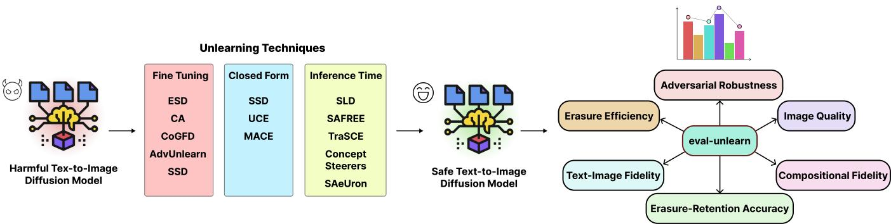

# eval-unlearn: Benchmarking unlearning in Text-to-Image Difusion Models

Mansi1∗, Nikhil Raghavan1, Zixia Huang1, Kai Sheng Ong1, Ji Shen Lim1, Brandon Siao Xiang Ling1, Francesco Leofante1

1Imperial College London

{m.-24, nikhil.raghavan, zixia.huang, kai-sheng.ong, dylan.lim, brandon.ling, f.leofante}@imperial.ac.uk

## Abstract

The rising number of concept unlearning techniques for textto-image (T2I) difusion models has produced a fragmented evaluation landscape. Methods are assessed under heterogeneous experimental conditions making principled crossmethod comparison dificult. We present eval-unlearn, an open-source Python library providing a unified, reproducible benchmarking framework for concept unlearning in T2I Difusion models. eval-unlearn integrates twelve published unlearning techniques spanning fine-tuning, closedform model editing, and inference-time intervention, alongside nine complementary evaluation metrics covering erasure eficacy, adversarial robustness, generative quality, and concept retention. Its plugin architecture lets third-party techniques and metrics self-register without modifying the core framework, and its streaming, batched pipeline supports eficient evaluation of both standard NSFW concepts and arbitrary general concepts. As a further contribution, we release a public leaderboard on HuggingFace along with an interactive tool for real-time evaluation of unlearning techniques. The leaderboard compares nudity concept erasure case study across all twelve techniques, exposing significant accuracyquality trade-ofs that are obscured by heterogeneous evaluation. eval-unlearn is released under the MIT license; the package, code, leaderboard, and documentation are all available at https://eval-unlearn.readthedocs.io.

## 1 Introduction

Text-to-image difusion models such as Stable Difusion (Rombach et al. 2022) synthesize high-quality images from natural language prompts, but training on large, internet-scraped corpora makes them capable of generating inappropriate content, with many negative implications (Schramowski et al. 2023). Fully retraining on curated data is both expensive and often inefective due to compositionality (Okawa et al. 2023). Machine unlearning ofers a practical alternative, using targeted weight modifications or inferencetime interventions to selectively suppress a concept from a trained model (Beerens et al. 2025).

A recent survey (Kim and Qi 2025) groups T2I unlearning techniques into three categories: fine-tuning methods (ESD (Gandikota et al. 2023), CA (Kumari et al. 2023), CoGFD (hongyi nie et al. 2025), AdvUnlearn (Zhang et al. 2024a), SSD (Foster, Schoepf, and Brintrup 2023)) that iteratively adjust U-Net or text-encoder weights; closedform model editing methods (UCE (Gandikota et al. 2024), MACE (Lu et al. 2024)) that compute single-step weight updates without iterative optimisation; and inference-time interventions (SLD (Schramowski et al. 2023), SAFREE (Yoon et al. 2025), TraSCE (Jain et al. 2025), ConceptSteerers (Kim and Ghadiyaram 2025), SAeUron (Cywiński and Deja 2025)) that reshape guidance or latent representations at inference time without modifying weights.

Despite this taxonomy, techniques are evaluated on diferent datasets, metrics, and hyperparameter regimes, making reliable cross-method comparison dificult. Existing frameworks, namely UnlearnCanvas (Zhang et al. 2024b) and the Holistic Unlearning Benchmark (Moon et al. 2025), provide fixed dataset-and-script packages covering a narrow, largely fine-tuning/closed-form set of techniques, with no interface for extension without modifying core code. eval-unlearn closes these gaps with a plugin architecture spanning all three categories. Its contributions are: (i) a shared execution pipeline supporting all three technique categories on a common base model; (ii) nine standardized metrics spanning erasure eficacy, adversarial robustness, quality, and retention; (iii) a plugin architecture, with a validation notebook for community-contributed techniques and metrics, enabling extension without modifying the core framework; and (iv) a public HuggingFace leaderboard, logged with full hyperparameters for reproducibility, enabling real-time comparison of unlearning techniques. The library is further accompanied by tutorial notebooks and a test suite exercised in continuous integration, currently at 99.82% coverage. Figure 1 illustrates the resulting pipeline.

## 2 Implemented Techniques and Metrics

eval-unlearn v1.1.2 integrates twelve techniques spanning the three categories introduced in Section 1 (fine-tuning, closed-form editing, inference-time intervention), all targeting Stable Difusion v1.4 as the base model, with the exception of SLD, which couples to its safety-fine-tuned variant. The framework additionally allows any custom checkpoint or HuggingFace model ID to be evaluated without writing wrapper code, and technique packages are separately installable so users need only the components required for their experiment.

Alongside these, the library provides nine evaluation metrics spanning four categories. Erasure eficacy is measured via attack success rate (ASR) on the I2P benchmark (Schramowski et al. 2023). Adversarial robustness is measured via ASR under three optimisation-based red-teaming attacks: Ring-A-Bell’s genetic search (Tsai et al. 2024), MMA-Difusion’s GCG sufix attack (Yang et al. 2023), and P4D’s gradient-based prompt optimisation (Chin et al. 2024). Generative quality is captured by FID and CLIP Score against COCO 2017 (Lin et al. 2014), and by TIFA for compositional fidelity (Hu et al. 2023). Concept retention is assessed via the ERR erasure-retention metric (Liu et al. 2025) and UA-IRA, a retention score computed over user-provided prompts.

  
Figure 1: The figure shows the pipeline for eval-unlearn on an abstract level.

The configuration for both the unlearning method and the metric computation is exposed through the technique\_config and metric\_configs variables of SingleBenchmarkRunner and MultiBenchmarkRunner, respectively. Default values follow either accepted standardised conventions or the values reported in each metric’s or technique’s original publication, as documented in the library documentation.

## 3 Software Design

eval-unlearn is organised around a small set of core components following the Adapter design pattern (Mc-Donough 2017): the framework defines fixed abstract interfaces, while external implementations are integrated through wrapper classes, keeping orchestration logic agnostic to technique and metric internals. Technique versions are pinned to their most recent release (Sept 2026) for reproducibility.

Technique. A technique is a concept-erasure method exposed through a wrapper implementing a fixed generate() interface. Techniques are discovered via Python entry points declared in a package’s pyproject.toml: on runner initialisation, load\_entrypoints scans all installed packages and registers each class under its declared name, making it immediately addressable in configuration files without manual imports or framework modification. The same mechanism applies to metrics and dataset loaders.

Metric. A metric computes a single evaluation score (e.g., attack success rate, fidelity) over a stream of generated images via an update() method called per batch and a compute() method called at the end of the run.

Dataset Loader. Dataset loaders supply prompts using one of two strategies. Algorithmically generated prompts are produced on first use and optionally cached to disk to avoid repeating costly optimisation. Fixed benchmark datasets (I2P, COCO, TIFA) are streamed from HuggingFace datasets, ensuring no complete dataset is held in memory.

Configuration. Techniques and metrics are paired with frozen dataclass configurations that validate all hyperparameters at initialisation, surfacing misconfigurations before any model weights are loaded. Each experiment writes a concise report (metric scores) and an extended report (scores plus full configuration) to an output directory identified by a unique ID derived from the technique name, metric names, configurations, and timestamp.

Runner. The runner ties together an unlearning technique, one or more metrics, and their configurations into a single experiment. SingleBenchmarkRunner executes one technique against one metric; MultiBenchmarkRunner evaluates one technique across multiple metrics in a single pass, reusing the loaded model. The run loop streams batches from each metric’s dataset loader, calls technique.generate(prompts), and accumulates statistics via metric.update(), with final aggregation deferred to metric.compute(). Metric objects are explicitly deleted and garbage-collected between evaluations to reclaim VRAM. Inference runs in FP16, with FP32 used for fine-tuning where numerical stability requires it. Runners are launched via CLI or script, driven by a JSON or YAML configuration file.

## 4 Conclusion

eval-unlearn provides a unified, reproducible benchmarking framework for concept unlearning in T2I difusion models. By standardizing the evaluation pipeline across twelve techniques and nine metrics, it enables fair crossmethod comparison that is otherwise impractical. Its plugin architecture ensures the framework will remain current as the field evolves, and its MIT license minimizes barriers to community adoption and contribution. Future work will support newer Stable Difusion variants (v2, SDXL), add computational overhead metrics (latency, peak VRAM), expand concept coverage beyond nudity and violence.

## References

Beerens, L.; Richardson, A. D.; Zhang, K.; and Chen, D. 2025. On the vulnerability of concept erasure in difusion models. arXiv preprint arXiv:2502.17537.

Chin, Z.-Y.; Jiang, C.-M.; Huang, C.-C.; Chen, P.-Y.; and Chiu, W.-C. 2024. Prompting4debugging: Red-teaming textto-image difusion models by finding problematic prompts. In International Conference on Machine Learning (ICML).

Cywiński, B.; and Deja, K. 2025. SAeUron: Interpretable concept unlearning in difusion models with sparse autoencoders. In Proceedings of the 42nd International Conference on Machine Learning (ICML).

Foster, J.; Schoepf, S.; and Brintrup, A. 2023. Fast machine unlearning without retraining through selective synaptic dampening. arXiv preprint arXiv:2308.07707.

Gandikota, R.; Materzyńska, J.; Fiotto-Kaufman, J.; and Bau, D. 2023. Erasing concepts from difusion models. In Proceedings of the IEEE/CVF International Conference on Computer Vision (ICCV).

Gandikota, R.; Orgad, H.; Belinkov, Y.; Materzyńska, J.; and Bau, D. 2024. Unified concept editing in difusion models. In Proceedings of the IEEE/CVF Winter Conference on Applications ofComputer Vision (WACV), 5099–5108.

hongyi nie; Yao, Q.; Liu, Y.; Wang, Z.; and Bian, Y. 2025. Erasing Concept Combination from Text-to-Image Difusion Model. In The Thirteenth International Conference on Learning Representations.

Hu, Y.; Liu, B.; Kasai, J.; Wang, Y.; Ostendorf, M.; Krishna, R.; and Smith, N. A. 2023. TIFA: Accurate and interpretable text-to-image faithfulness evaluation with question answering. In Proceedings ofthe IEEE/CVF International Conference on Computer Vision (ICCV).

Jain, A.; Kobayashi, Y.; Shibuya, T.; Takida, Y.; Memon, N.; Togelius, J.; and Mitsufuji, Y. 2025. TraSCE: Trajectory Steering for Concept Erasure. arXiv:2412.07658.

Kim, C.; and Qi, Y. 2025. A comprehensive survey on concept erasure in text-to-image difusion models. arXivpreprint arXiv:2502.14896.

Kim, D.; and Ghadiyaram, D. 2025. Concept steerers: Leveraging k-sparse autoencoders for controllable generations. arXiv preprint arXiv:2501.19066.

Kumari, N.; Zhang, B.; Wang, S.-Y.; Shechtman, E.; Zhang, R.; and Zhu, J.-Y. 2023. Ablating concepts in text-to-image difusion models. In Proceedings ofthe IEEE/CVF International Conference on Computer Vision (ICCV).

Lin, T.-Y.; Maire, M.; Belongie, S.; Hays, J.; Perona, P.; Ramanan, D.; Dollár, P.; and Zitnick, C. L. 2014. Microsoft COCO: Common objects in context. arXiv preprint arXiv:1405.0312.

Liu, F.; Fan, C.; Cui, H.; Gupta, A.; Wang, Z.; Tramer, F.; Niebles, J. C.; Savarese, S.; Salehi, M.; and Kim, E. 2025. Genµ: The generative machine unlearning challenge. In Proceedings of the IEEE/CVF International Conference on Computer Vision (ICCV) Workshops.

Lu, S.; Wang, Z.; Li, L.; Liu, Y.; and Kong, A. W.-K. 2024. MACE: Mass concept erasure in difusion models. In Proceedings of the IEEE/CVF Conference on Computer Vision and Pattern Recognition (CVPR).

McDonough, J. E. 2017. Adapter Design Pattern.

Moon, S.; Lee, M.; Park, S.; and Kim, D. 2025. Holistic Unlearning Benchmark: A Multi-Faceted Evaluation for Textto-Image Difusion Model Unlearning. arXiv:2410.05664.

Okawa, M.; Lubana, E. S.; Dick, R. P.; and Tanaka, H. 2023. Compositional Abilities Emerge Multiplicatively: Exploring Difusion Models on a Synthetic Task. In Thirty-seventh Conference on Neural Information Processing Systems.

Rombach, R.; Blattmann, A.; Lorenz, D.; Esser, P.; and Ommer, B. 2022. High-resolution image synthesis with latent difusion models. In Proceedings of the IEEE/CVF Conference on Computer Vision and Pattern Recognition (CVPR), 10684–10695.

Schramowski, P.; Brack, M.; Deiseroth, B.; and Kersting, K. 2023. Safe latent difusion: Mitigating inappropriate degeneration in difusion models. In Proceedings ofthe IEEE/CVF Conference on Computer Vision and Pattern Recognition (CVPR), 22522–22531.

Tsai, Y.-L.; Hsu, C.-Y.; Xie, C.; Lin, C.-H.; Chen, J.-Y.; Li, B.; Chen, P.-Y.; Yu, C.-M.; and Huang, C.-Y. 2024. Ring-abell! How reliable are concept removal methods for difusion models? In International Conference on Learning Representations (ICLR).

Yang, Y.; et al. 2023. MMA-difusion: Multimodal attack on difusion models. arXiv preprint arXiv:2311.17516.

Yoon, J.; Yu, S.; Shin, V.; Jiang, H.; and Bansal, M. 2025. SAFREE: Training-free and adaptive guard for safe text-toimage and video generation. In The Thirteenth International Conference on Learning Representations (ICLR).

Zhang, Y.; Chen, X.; Jia, J.; Zhang, Y.; Fan, C.; Liu, J.; Hong, M.; Ding, K.; and Liu, S. 2024a. Defensive unlearning with adversarial training for robust concept erasure in difusion models. In Advances in Neural Information Processing Systems (NeurIPS).

Zhang, Y.; Fan, C.; Zhang, Y.; Yao, Y.; Jia, J.; Liu, J.; Zhang, G.; Liu, G.; Kompella, R. R.; Liu, X.; and Liu, S. 2024b. UnlearnCanvas: Stylized Image Dataset for Enhanced Machine Unlearning Evaluation in Difusion Models. In The Thirty-eight Conference on Neural Information Processing Systems Datasets and Benchmarks Track.